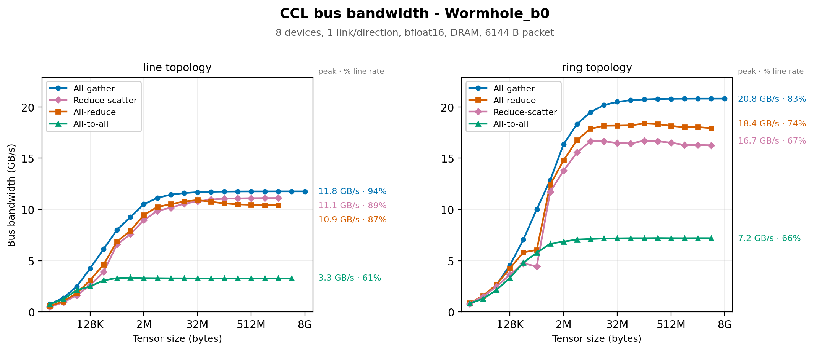
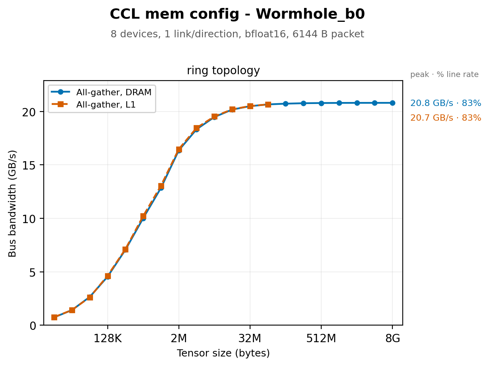

# Collective Communication Bandwidth

## Introduction

A collective moves data between devices. Some ops may also reduce, but that arithmetic is far cheaper than the data movement and never limits the operation. Performance is set by the ethernet fabric:

> **What fraction of the available link bandwidth does the operation keep busy?**

The number of bytes a collective puts on a link is closed-form in the tensor size, the device count and the topology. Dividing it out gives achieved bandwidth per link. That single number characterizes any collective on any system, and on a well-optimized implementation it is also independent of datatype, memory layout and page size. Different collectives should converge on the same curve. Where one does not, it has optimization headroom rather than a harder job.

This report measures that number for `all_gather`, `reduce_scatter`, `all_reduce` and `all_to_all`. The figures lead with bus bandwidth, which says how fast a collective runs, and show link utilization beside it.

## What sets the ceiling

### Line rate

| Architecture | Per link, per direction |
| --- | --- |
| Wormhole | 100 Gbps = **12.5 GB/s** |
| Blackhole | 400 Gbps = **50 GB/s** |

### Framing overhead

Two layers of framing sit between line rate and payload.

Ethernet packets run from 16 B to 1500 B. Each carries upwards of 50 B of headers, FEC and CRC. A payload larger than 1500 B is fragmented into several packets, and each one pays that overhead again.

The fabric adds its own header on top: 48 B for 1D routing, 80 to 128 B for 2D. The payload behind it defaults to 4352 B, or four `bfloat8_b` tiles. It caps at 7616 B (7 `bfloat8_b` tiles) on Wormhole and 15232 B (14 `bfloat8_b` tiles) on Blackhole.

For a fabric payload of `P` bytes behind a header of `H`:

```
payload efficiency = P / ( P + H + 50 * ceil((P + H) / 1500) )
```

This lands near **96%** across the useful range of payload sizes. The payload ceiling is therefore ~12.0 GB/s on Wormhole and ~48 GB/s on Blackhole.

### Packets and slots

The ethernet transfer is sized by the bytes in the packet, so a partially filled packet wastes no wire time. Fabric flow control counts slots rather than bytes, and every packet consumes one slot credit whether it is full or empty. This is a property of the current fabric design, not of the hardware.

Slot size is set once at fabric initialization, from `max_packet_payload_size_bytes` on the `FabricRouterConfig` passed to `set_fabric_config`, and is uniform across router channels. The setting is global for the run. ERISC L1 is fixed, so slot size and slot count trade against each other. A larger payload leaves room for fewer slots and a shallower pipeline, which means the architecture maximum is not always the fastest choice.

What a partial packet costs is data in flight: the slot count times the payload actually carried per slot. A collective that half-fills its packets has half the data in flight for the same pipeline depth, so the link idles while credits make their way back. Throughput is then data in flight divided by that credit round-trip time.

Several things cut a packet short. A scatter write carries at most four segments, and short page runs reach that limit before the payload is full. A payload that is not a whole multiple of the chunk size wastes its tail. Page boundaries force a flush.

### Links available

`num_links` selects routing planes per direction. The usable count is the minimum across every hop on the axis, so the weakest hop sets it for the whole collective.

Some systems do not attach every device to the host. There, remote devices are reached over an ethernet tunnel, and one routing plane per tunneled direction is reserved for fast dispatch. Where every device is host-attached, nothing is reserved. Two systems with identical cabling can therefore offer different link counts, and one system can differ between its axes. Any bandwidth figure must state the count it was normalized by.

### Bytes through the bottleneck link

Let `T` be the un-sharded logical tensor, distributed across `N` devices. It is `all_gather`'s output, `reduce_scatter`'s input, and both the input and output of `all_reduce`.

On a **line**, the device at the end has one link on the axis. Everything it does not already hold arrives through that link, which makes it the bottleneck.

On a **ring**, the closing link gives every device two links on the axis. Splitting the ring into two halves cuts two links rather than one, so each direction carries half the traffic. The diameter also falls from `N-1` hops to `N/2`.

`all_reduce` is a reduce-scatter followed by an all-gather over the same links, so it carries twice the bytes of either.

`all_to_all` differs. Each device holds `B` bytes and sends one chunk to every other device. Chunks bound for far devices relay through the ones in between, so the middle link carries every chunk that crosses it.

| Collective | Bottleneck bytes |
| --- | --- |
| `all_gather` | `(N-1)/N × T` |
| `reduce_scatter` | `(N-1)/N × T` |
| `all_reduce` | `2(N-1)/N × T` |
| `all_to_all` | `⌊N/2⌋⌈N/2⌉/N × B` |

### What a ring costs

A ring halves the bytes per direction, so ideally it finishes in half the time of a line. In practice each link runs slower, because a ring needs deadlock avoidance. The fabric adds it to every router once it is configured as a ring:

- **Bubble flow control.** A worker injects a packet only when the next router has at least two free slots.
- **First-level acknowledgement.** The receiver returns an extra credit for every packet, which doubles the credit traffic.

Both cost every packet, so even a line runs slower on a ring fabric. So lines are measured on a line fabric.

### How this compares to local memory

| Architecture | Per DRAM channel | Per link, per direction |
| --- | --- | --- |
| Wormhole | ~43 GB/s (6 channels, ~258 GB/s aggregate) | 12.5 GB/s |
| Blackhole | ~64 GB/s (8 channels, ~512 GB/s aggregate) | 50 GB/s |

A single DRAM channel delivers bandwidth of the same order as a single link. Summed over every ethernet core on the chip, the fabric aggregate is competitive with the whole memory system.

The fabric limits a collective because the collective only gets a few links. It communicates along one axis, while the entire memory system is available locally. The headroom between the two is small enough that memory could also limit the operation on a system with many fast links. The L1 versus DRAM section measures whether it does.

The Blackhole aggregate above is derived from device specifications, not measured. No per-bank breakdown for Blackhole was available.

## What sets the floor

### Latency

The first byte cannot reach the farthest device until it has crossed the network diameter, and that cost does not depend on tensor size. Per-hop forwarding latency was measured by timing a round trip `n` hops out and halving the slope, which cancels device clock skew.

| Architecture | 1D fabric | 2D fabric |
| --- | --- | --- |
| Wormhole | 711 ns | 874 ns |
| Blackhole | 515 ns | 619 ns |

Multiplied by the diameter, this is a few microseconds for a typical 8-device collective. Setting it equal to the bandwidth term estimates where the two regimes cross:

```
bottleneck_bytes / (line_rate * links * directions)  =  per_hop_latency * hops
```

These figures are a linear fit. 1D latency grows superlinearly with distance, so the estimate understates long lines.

### Per-invocation cost

A collective also pays setup and teardown once per call, independent of tensor size:

- A barrier at entry, so no device starts before its peers are ready.
- A wait at exit, until remote data has landed locally.
- Opening and closing a fabric connection. Each ends in a blocking wait for a remote acknowledgement.
- When a Fabric Mux is involved, a handshake to connect to it and an acknowledgement to tear it down. The connect waits for the mux to report ready.
- Allocating packet headers and programming route state. Route state is programmed once and reused by every packet, so this part is cheap.

The barrier thresholds count devices, so they grow with device count but not with tensor size. This cost is not a fixed constant. Both barriers and the mux ready poll block for however long cross-device launch skew happens to be, and that varies from call to call.

## The metric

Every figure plots bus bandwidth, as `nccl-tests` defines it:

```
bus_bandwidth = bottleneck_bytes / kernel_time
```

It says how fast the collective runs, and compares directly to `nccl-tests` output on other hardware. Its ceiling grows with the links in use.

Each curve's peak also carries its link utilization, stated as a percentage of the per-link line rate:

```
per_link_bandwidth = bottleneck_bytes / ( kernel_time * num_links * num_directions )
```

- `bottleneck_bytes` from the table above
- `num_links`, the routing planes opened per direction
- `num_directions`, 1 for a line and 2 for a ring
- `kernel_time`, device kernel duration

`all_to_all` is the exception. Its bus bandwidth follows nccl's `(N-1)/N × B`, which leaves out the relay traffic. Its link utilization is the fairer number.

## What we measure

This report sweeps `ttnn.all_gather`, `ttnn.reduce_scatter`, `ttnn.all_reduce` and `ttnn.experimental.all_to_all_async_generic` across tensor size, device count and topology. All measurements are **traced**, so host dispatch is excluded.

The ops query link count, topology and the rest of the machine's wiring themselves, so nothing is configured by hand and no tuning is applied. The curves show what a caller gets out of the box.

The topology is read with `ttnn.get_usable_topology`, the same check the ops use. The link count is read from each op's profiler attributes. Every figure reports what ran rather than what was requested.

| Held fixed | Why |
| --- | --- |
| Fabric packet payload | A global setting fixed at initialization. It shifts the whole curve, so it belongs to the run rather than the collective. |
| Fabric configuration | 1D routing, with lower per-hop latency and a smaller header than 2D. Lines run on `FABRIC_1D`, rings on `FABRIC_1D_RING`. A ring is measured only where the axis closes. |
| Datatype | Only a byte count under this metric. |

The benchmark is modeled on nccl-tests. Sizes double from 1 KiB upward, rounded to whole tiles.

The following was run to generate the data in this report:

```bash
# Every collective: a line at 2, 4 and 8 devices, a ring at 8, DRAM
./tech_reports/CCLs/run_bench.sh loudbox   # or galaxy

# L1 against DRAM, all_gather only, ring
CCL_TOPOLOGY=ring CCL_MEMORY=dram,l1 CCL_SUBMESHES=1x8 CCL_OPS=all_gather ./tech_reports/CCLs/run_bench.sh loudbox
```

Each run lands in `data/runs/<timestamp>/`. The runs are merged, keeping the latest measurement of each cell, into the tables in `results/` and the figures in `images/`.

## Results

### Wormhole LoudBox



Additionally, figures for two and four devices: [`n2`](images/bw_wormhole_b0_bfloat16_6144_n2.png), [`n4`](images/bw_wormhole_b0_bfloat16_6144_n4.png). They have no ring panel, because the wraparound link exists only across all eight devices.

### Blackhole Galaxy

<!--
  TODO(data): rerun ./tech_reports/CCLs/run_bench.sh galaxy, then embed
  images/bw_blackhole_bfloat16_<packet>_n8.png with a caption as above.
-->

## Interpreting the curve

**The small sizes.** Small collectives reach a small fraction of line rate. Per-invocation cost and poor packet fill both produce that, and they leave different shapes.

Per-invocation cost acts as a floor. While it dominates, time is roughly constant, so bandwidth rises with size and falls toward zero at the smallest sizes.

Poor packet fill produces a flat plateau instead. At a given fill, neither data in flight nor credit round-trip time depends on tensor size, so bandwidth sits at a reduced level independent of size. Fill improves as tensors grow, because larger tensors offer longer contiguous stretches to pack into each packet.

In our data, every curve keeps falling as size shrinks, and none of them flatten. Hence per-invocation cost sets the small-size behavior, not packet fill.

**The ramp.** Fixed costs amortize as the payload grows, and packet fill improves. In our data, the ramp begins near the crossover estimate, and the curve does not reach its asymptote until well past it. The crossover estimate from the latency section leaves out:

- per-invocation cost
- packet fill, which improves with size
- host dispatch
- superlinear growth of hop latency with distance

**Steps in the ramp.** Worker cores per link and synchronization granularity are chosen by size-thresholded heuristics that differ by collective and topology, so bandwidth should be piecewise. In our data, ring `reduce_scatter` dips at 512 KiB and jumps at 1 MiB. Up to 512 KiB per device it uses a one-shot direct algorithm, which sends about 2.3× the bytes.

**The asymptote.** Fixed costs are negligible here. In our data, lines flatten at 84–94% of line rate, close to the payload ceiling. Rings flatten at 67–83%. The next section rules out memory hierarchy, which leaves the transfer pipeline: packet fill, worker count, and how well the implementation keeps the link fed.

**Line versus ring.** In our data, at eight devices a ring runs `all_gather`, `reduce_scatter` and `all_reduce` 1.5 to 1.8 times faster than a line, short of the ideal 2×. Besides the fabric cost of a ring, the ops behave differently:

- `all_gather` relays each chunk through worker cores, hop by hop. On a line it multicasts, and the routers forward.
- `reduce_scatter` runs 4 workers per direction at large sizes against 8 on a line, and synchronizes more often.
- `all_reduce` is a reduce-scatter followed by an all-gather, so it inherits both.

## L1 versus DRAM tensors



Moving the tensors from DRAM into L1 does not change collective bandwidth. In our data, the two curves overlay wherever both exist. L1 cannot hold the largest tensors, so its sweep stops earlier.

## All data

Every measured cell is tabulated in `results/`:

- [`SUMMARY_wormhole_b0_bfloat16_6144.md`](results/SUMMARY_wormhole_b0_bfloat16_6144.md): one configuration per collective and device count, ring over line and DRAM over L1.
- [`FULL_wormhole_b0_bfloat16_6144.md`](results/FULL_wormhole_b0_bfloat16_6144.md): every topology and memory configuration.
