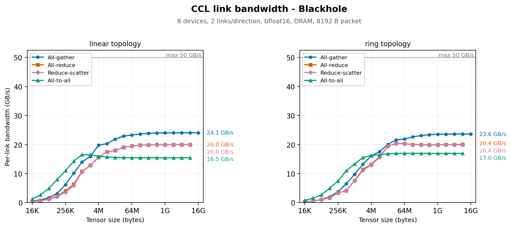
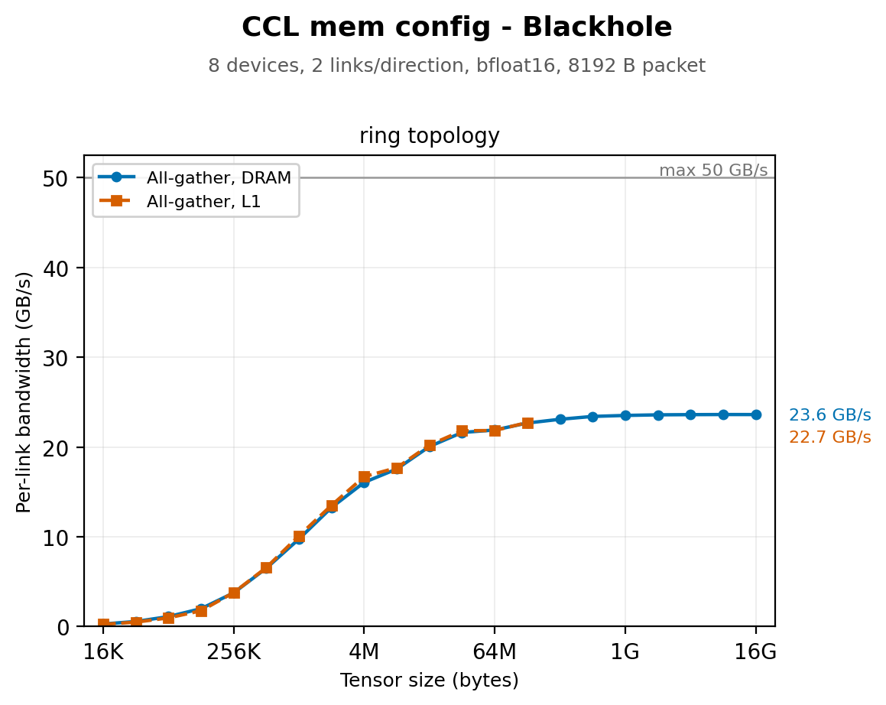

# Collective Communication Bandwidth

## Introduction

A collective moves data between devices. Some ops may also reduce, but that arithmetic is far cheaper than the data movement and never limits the operation. Performance is set by the ethernet fabric:

> **What fraction of the available link bandwidth does the operation keep busy?**

The number of bytes a collective puts on a link is closed-form in the tensor size, the device count and the topology. Dividing it out gives achieved bandwidth per link. That single number characterizes any collective on any system, and on a well-optimized implementation it is also independent of datatype, memory layout and page size. Different collectives should converge on the same curve. Where one does not, it has optimization headroom rather than a harder job.

This report measures that number for `all_gather`, `reduce_scatter`, `all_reduce` and `all_to_all`.

## What sets the ceiling

### Line rate

| Architecture | Per link, per direction |
| --- | --- |
| Wormhole | 100 Gbps = **12.5 GB/s** |
| Blackhole | 400 Gbps = **50 GB/s** |

### Framing overhead

Two layers of framing sit between line rate and payload.

Ethernet packets run from 16 B to 1500 B. Each carries upwards of 50 B of headers, FEC and CRC. A payload larger than 1500 B is fragmented into several packets, and each one pays that overhead again.

The fabric adds its own header on top: 48 B for 1D routing, 80 to 128 B for 2D. The payload behind it defaults to 4352 B, or four `bfloat8_b` tiles. It caps at 7616 B (7 `bfloat8_b` tiles) on Wormhole and 15232 B (14 `bfloat8_b` tiles) on Blackhole.

For a fabric payload of `P` bytes behind a header of `H`:

```
payload efficiency = P / ( P + H + 50 * ceil((P + H) / 1500) )
```

This lands near **96%** across the useful range of payload sizes. The payload ceiling is therefore ~12.0 GB/s on Wormhole and ~48 GB/s on Blackhole.

### Packets and slots

The ethernet transfer is sized by the bytes in the packet, so a partially filled packet wastes no wire time. Fabric flow control counts slots rather than bytes, and every packet consumes one slot credit whether it is full or empty. This is a property of the current fabric design, not of the hardware.

Slot size is set once at fabric initialization, from `max_packet_payload_size_bytes` on the `FabricRouterConfig` passed to `set_fabric_config`, and is uniform across router channels. The setting is global for the run. ERISC L1 is fixed, so slot size and slot count trade against each other. A larger payload leaves room for fewer slots and a shallower pipeline, which means the architecture maximum is not always the fastest choice.

What a partial packet costs is data in flight: the slot count times the payload actually carried per slot. A collective that half-fills its packets has half the data in flight for the same pipeline depth, so the link idles while credits make their way back. Throughput is then data in flight divided by that credit round-trip time.

Several things cut a packet short. A scatter write carries at most four segments, and short page runs reach that limit before the payload is full. A payload that is not a whole multiple of the chunk size wastes its tail. Page boundaries force a flush.

### Links available

`num_links` selects routing planes per direction. The usable count is the minimum across every hop on the axis, so the weakest hop sets it for the whole collective.

Some systems do not attach every device to the host. There, remote devices are reached over an ethernet tunnel, and one routing plane per tunneled direction is reserved for fast dispatch. Where every device is host-attached, nothing is reserved. Two systems with identical cabling can therefore offer different link counts, and one system can differ between its axes. Any bandwidth figure must state the count it was normalized by.

### Bytes through the bottleneck link

Let `T` be the un-sharded logical tensor, distributed across `N` devices. It is `all_gather`'s output, `reduce_scatter`'s input, and both the input and output of `all_reduce`.

On a **line**, the device at the end has one link on the axis. Everything it does not already hold arrives through that link, which makes it the bottleneck.

On a **ring**, the closing link gives every device two links on the axis. Splitting the ring into two halves cuts two links rather than one, so each direction carries half the traffic. The diameter also falls from `N-1` hops to `N/2`.

`all_reduce` is a reduce-scatter followed by an all-gather over the same links, so it carries twice the bytes of either.

| Collective | Bottleneck bytes |
| --- | --- |
| `all_gather` | `(N-1)/N × T` |
| `reduce_scatter` | `(N-1)/N × T` |
| `all_reduce` | `2(N-1)/N × T` |

### How this compares to local memory

| Architecture | Per DRAM channel | Per link, per direction |
| --- | --- | --- |
| Wormhole | ~43 GB/s (6 channels, ~258 GB/s aggregate) | 12.5 GB/s |
| Blackhole | ~64 GB/s (8 channels, ~512 GB/s aggregate) | 50 GB/s |

A single DRAM channel delivers bandwidth of the same order as a single link. Summed over every ethernet core on the chip, the fabric aggregate is competitive with the whole memory system.

The fabric limits a collective because the collective only gets a few links. It communicates along one axis, while the entire memory system is available locally. The headroom between the two is small enough that memory could also limit the operation on a system with many fast links. The L1 versus DRAM section measures whether it does.

The Blackhole aggregate above is derived from device specifications, not measured. No per-bank breakdown for Blackhole was available.

## What sets the floor

### Latency

The first byte cannot reach the farthest device until it has crossed the network diameter, and that cost does not depend on tensor size. Per-hop forwarding latency was measured by timing a round trip `n` hops out and halving the slope, which cancels device clock skew.

| Architecture | 1D fabric | 2D fabric |
| --- | --- | --- |
| Wormhole | 711 ns | 874 ns |
| Blackhole | 515 ns | 619 ns |

Multiplied by the diameter, this is a few microseconds for a typical 8-device collective. Setting it equal to the bandwidth term estimates where the two regimes cross:

```
bottleneck_bytes / (line_rate * links * directions)  =  per_hop_latency * hops
```

These figures are a linear fit. 1D latency grows superlinearly with distance, so the estimate understates long lines.

### Per-invocation cost

A collective also pays setup and teardown once per call, independent of tensor size:

- A barrier at entry, so no device starts before its peers are ready.
- A wait at exit, until remote data has landed locally.
- Opening and closing a fabric connection. Each ends in a blocking wait for a remote acknowledgement.
- When a Fabric Mux is involved, a handshake to connect to it and an acknowledgement to tear it down. The connect waits for the mux to report ready.
- Allocating packet headers and programming route state. Route state is programmed once and reused by every packet, so this part is cheap.

The barrier thresholds count devices, so they grow with device count but not with tensor size. This cost is not a fixed constant. Both barriers and the mux ready poll block for however long cross-device launch skew happens to be, and that varies from call to call.

## The metric

Every figure plots achieved bandwidth per ethernet link, per direction:

```
per_link_bandwidth = bottleneck_bytes / ( kernel_time * num_links * num_directions )
```

- `bottleneck_bytes` from the table above
- `num_links`, the routing planes opened per direction
- `num_directions`, 1 for a line and 2 for a ring
- `kernel_time`, device kernel duration

The numerator is the bytes crossing the busiest link, so the result is directly comparable to line rate. `bottleneck_bytes / kernel_time` is what `nccl-tests` calls bus bandwidth. This report divides further by the link and direction count to read against a single link.

## What we measure

This report sweeps `ttnn.all_gather`, `ttnn.reduce_scatter`, `ttnn.all_reduce` and `ttnn.experimental.all_to_all_async_generic` across tensor size, device count and topology. All measurements are **traced**, so host dispatch is excluded.

The ops query link count, topology and the rest of the machine's wiring themselves, so nothing is configured by hand and no tuning is applied. The curves show what a caller gets out of the box.

Link count and topology are read back from each op's own profiler attributes, so every figure reports what ran rather than what was requested.

| Held fixed | Why |
| --- | --- |
| Fabric packet payload | A global setting fixed at initialization. It shifts the whole curve, so it belongs to the run rather than the collective. |
| Fabric configuration | 1D routing. Lower per-hop latency and a smaller header than 2D. |
| Datatype | Only a byte count under this metric. |

The benchmark is modelled on nccl-tests. Sizes double from 1 KiB upward, rounded to whole tiles, and `busbw` uses nccl's correction factors, so the numbers compare directly to nccl-tests output on other hardware.

The following was run to generate the data in this report:

```bash
# Link bandwidth on ring topology for every collective
./tech_reports/CCLs/run_bench.sh galaxy

# To get more comprehensive data:
# Repeat above for linear topology
CCL_RUNS="line:dram" ./tech_reports/CCLs/run_bench.sh galaxy
# Repeat above for L1 memory config (for all_gather only)
CCL_RUNS="ring:l1" CCL_OPS=all_gather ./tech_reports/CCLs/run_bench.sh galaxy
```

## Results

### Blackhole Galaxy



Eight devices along axis 0 of the 8×4 mesh. The two and four device figures are `images/linkbw_blackhole_n2.png` and `images/linkbw_blackhole_n4.png`; both carry a line panel only, since the wrap-around link only exists across the full axis (i.e. only with 8 devices).

### Wormhole LoudBox

<!--
  TODO(data): images/linkbw_wormhole_n8.png, from
      ./tech_reports/CCLs/run_bench.sh loudbox
      CCL_RUNS="line:dram" ./tech_reports/CCLs/run_bench.sh loudbox
  Caption needs the axis, the packet payload and the size range, as above.
  N300s are not all host-attached, so expect a lower link count than Blackhole
  and state the count the figure was normalized by.
-->

## Interpreting the curve

**The small sizes.** Small collectives reach a small fraction of line rate. Per-invocation cost and poor packet fill both produce that, and they leave different shapes.

Per-invocation cost acts as a floor. While it dominates, time is roughly constant, so bandwidth rises with size and falls toward zero at the smallest sizes.

Poor packet fill produces a flat plateau instead. At a given fill, neither data in flight nor credit round-trip time depends on tensor size, so bandwidth sits at a reduced level independent of size. Fill improves as tensors grow, because larger tensors offer longer contiguous stretches to pack into each packet.

In our data, every curve keeps falling as size shrinks, and none of them flatten. Hence per-invocation cost sets the small-size behaviour, not packet fill.

**The ramp.** Fixed costs amortize as the payload grows, and packet fill improves. In our data, the ramp begins near the crossover estimate, and the curve does not reach its asymptote until well past it. The crossover estimate from the latency section leaves out:

- per-invocation cost
- packet fill, which improves with size
- host dispatch
- superlinear growth of hop latency with distance

**Steps in the ramp.** Worker cores per link and synchronization granularity are chosen by size-thresholded heuristics that differ by collective and topology, so bandwidth should be piecewise. In our data, no steps appear, though the ramp's slope dips slightly where two of the thresholds sit.

**The asymptote.** Fixed costs are negligible here. In our data, the curves flatten well below the payload ceiling. Framing accounts for a few percent of that gap and the next section rules out memory hierarchy, which leaves the transfer pipeline: packet fill, worker count, and how well the implementation keeps the link fed.

**Line versus ring.** A ring carries half the bytes per link over half the distance, so it finishes sooner while running each link at the same rate. In our data, at the same device count the two curves overlay. The ring ramp starts later, because halving the bytes per direction means a larger tensor is needed to clear the fixed-cost floor.

## L1 versus DRAM tensors



<!--
  TODO(data): images/memcfg_wormhole_n8.png, from
      CCL_RUNS="ring:l1" CCL_OPS=all_gather ./tech_reports/CCLs/run_bench.sh loudbox
-->

Moving the tensors from DRAM into L1 does not change collective bandwidth. In our data, the two curves overlay wherever both exist. L1 cannot hold the largest tensors, so its sweep stops earlier.

## All data

<!--
  TODO(data): collapsed <details> tables, one per run. parse_results.py already
  writes them as data/results_{arch}_{fabric_config}_{memory}_{dtype}.md, so
  these are a paste of that output. data/ is not committed, which is why the
  tables have to live here.
  Blackhole Galaxy runs to paste: FABRIC_1D_RING dram, FABRIC_1D dram,
  FABRIC_1D_RING l1. Wormhole LoudBox: the same three.
-->
