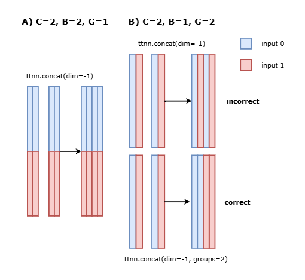

# CNN Bring-up & Optimization in TT-NN

Authors: Evan Smal

## Contents
- [Contents](#contents)
- [Overview](#overview)
- [Model Bring-up](#model-bring-up)
- [Optimizations](#optimizations)

## Overview

This document provides guidance on how to bring up high-performance CNN-based models on Tenstorrent hardware using the TT-Metal stack. It is presented using a case study for a [UNet-style model](/models/experimental/functional_unet) to give users a more concrete example of how CNNs are optimized in practice.

It is assumed that the reader is familiar with TT-Metal APIs and has a basic understanding of convolutional neural networks.

## Model Bring-up

UNet is an encoder-decoder architecture commonly used in image classification and segmentation tasks. Typically, these models have a sequence of downsampling blocks (downblocks) that reduce the spatial dimensionality of the input tensor, followed by a sequence of upsampling blocks (upblocks) that restore the spatial dimensions back to their original shape. Encoder-decoder networks also normally include skip connections, where activations from a downblock branch from the main path and are combined with activations from later in the forward pass using concatenation along the channel dimensions.

```python
"""
Example of a downblock in an encoder-decoder model
"""
class UNetDownblock:
    def __init__(
        self,
        conv1,
        conv2,
        pool,
    ):
        self.conv1 = conv1
        self.conv2 = conv1
        self.pool = pool

    def __call__(self, x):
        x = self.conv1(x)
        x = self.conv2(x)
        residual = x
        x = self.pool1(x)
        return x, residual
```

```python
"""
Example of an upblock in an encoder-decoder model
"""
class UNetUpblock:
    def __init__(
        self,
        conv1,
        bn1,
        conv2,
        bn2,
        conv3,
        bn3,
        device,
        mesh_mapper=None,
    ):
        self.device = device
        self.conv1 = conv1
        self.conv2 = conv2
        self.conv3 = conv3

    def upsample(self, x):
        # Need to reshape into (B, H, W, C) to get correct output from ttnn.upsample
        x = ttnn.reshape(
            x, (self.conv1.batch_size, self.conv1.input_height // 2, self.conv1.input_width // 2, x.shape[-1])
        )

        nhw = x.shape[0] * x.shape[1] * x.shape[2]
        num_cores = determine_num_cores_for_upsample(nhw, x.shape[2])
        core_grid = get_core_grid_from_num_cores(num_cores)
        shardspec = ttnn.create_sharded_memory_config_(
            x.shape, core_grid, ttnn.ShardStrategy.HEIGHT, orientation=ttnn.ShardOrientation.ROW_MAJOR
        )
        x = ttnn.reshard(x, shardspec)
        x = ttnn.upsample(x, (2, 2), memory_config=x.memory_config())
        x = ttnn.reshape(
            x, (1, 1, self.conv1.batch_size * self.conv1.input_height * self.conv1.input_width, x.shape[-1])
        )
        return x

    def __call__(self, x, residual):
        residual = ttnn.to_layout(residual, ttnn.ROW_MAJOR_LAYOUT)
        x = ttnn.to_layout(x, layout=ttnn.ROW_MAJOR_LAYOUT)

        x = self.upsample(x)

        y = concatenate([x, residual], dim=-1)
        ttnn.deallocate(x)
        ttnn.deallocate(residual)

        y = self.conv1(y)
        y = self.conv2(y)
        y = self.conv3(y)

        return y
```

Sliding window operations (and therefore CNNs) are run in channels-last ordering in TT-NN. This is different than PyTorch, which uses NCHW ordering by default. This means that most model forward passes will need to CHW-to-HWC transformation at the beginning and a HWC-CHW transformation at the end:

```python
"""
Converts CHW-ordered tensor to flattened HWC tensor.
 - Assumes that input tensor is HEIGHT sharded on device.
"""
def preprocess_unet_input_tensor(input_tensor, min_channels=16):
    N, C, H, W = input_tensor.shape
    if C < min_channels:
        channel_padding_needed = min_channels - C
        nchw = ttnn.pad(input_tensor, ((0, 0), (0, channel_padding_needed), (0, 0), (0, 0)), value=0.0) # ttnn.conv2d requires padding up to 16 channels
        ttnn.deallocate(input_tensor)
    else:
        nchw = input_tensor

    nhwc = ttnn.permute(nchw, (0, 2, 3, 1))  # N, C, H, W -> N, H, W, C
    ttnn.deallocate(nchw)

    return ttnn.reshape(nhwc, [1, 1, nhwc.shape[0] * nhwc.shape[1] * nhwc.shape[2], nhwc.shape[-1]])  # 1, 1, NHW, C # ttnn.conv2d expected flattened NHW
````

```python
"""
Converts HWC-ordered tensor to CHW tensor.
 - Assumes that input tensor is TILE_LAYOUT and HEIGHT sharded on device.
 - Return WIDTH sharded tensor.
"""
def postprocess_unet_output_tensor(x):
    # Convert the output tensor (in TILE layout) to RM to prevent transferring padding back to host.
    assert x.is_sharded(), "Expected output tensor to be sharded"
    input_shard_spec = x.memory_config().shard_spec
    output_shard_shape = (x.shape[-1], input_shard_spec.shape[0])
    output_shard_spec = ttnn.ShardSpec(
        input_shard_spec.grid,
        output_shard_shape,
        ttnn.ShardOrientation.ROW_MAJOR,
    )
    output_memory_config = ttnn.MemoryConfig(
        ttnn.TensorMemoryLayout.WIDTH_SHARDED, ttnn.BufferType.L1, output_shard_spec
    )
    return ttnn.experimental.convert_to_chw(x, memory_config=output_memory_config)  # fuses permute+reshard
````


The sliding window ops support HEIGHT, BLOCK, and WIDTH sharding, which have different benefits depending on the types of convolutions present in your specific model architecture.

An overview of the sliding window TT-NN operations (such as `ttnn.conv2d`, `ttnn.maxpool2d`) can be found here: [link](./ttcnn.md).

## Optimizations

### Grouped Convolutions

The most impactful model-level optimization for CNNs is achieved by using grouped convolutions. This is done by moving the batch dimension into the channel dimension (`BxHxWxC -> 1xHxWxBC`) and then setting the `groups` parameter equal to `B`. This is beneficial because the sliding window operations (`conv2d`, `maxpool2d`) give a perfect linear speedup because they are entirely bound by the tall shard size. Since these operations make up most of the FLOPs in CNNs, this optimization is a net-performance gain despite the additional overhead incurred when concatenating residual connections.

To preserve the correctness of our grouped convolutions, we must properly concatenate the activations with residual connections. The following figure shows the non-grouped convolution concatenation vs. the grouped convolution:



In the non-grouped case, the batches can be thought of as vertically stacked one after another, but with grouped convolutions the batches are now horizontally stacked. In order to achieve the correct concatenation behavior we want something equivalent to:

```python
a0, a1 = slice(a, chunks=2, dim=-1)
b0, b1 = slice(b, chunks=2, dim=-1)
undo_interleaved_tensor = concat(a0, b0, a1, b1)
```

To simplify this process and improve performance, TT-NN provides a `groups` parameter to `ttnn.concat` that fuses the above operations into a single one.

Maximizing group size will give the best possible performance for a model. Ensure minimal L1 memory fragmentation and spilling residual tensors can be effective techniques from increasing group size.

> [!NOTE]
> The `ttnn-visualizer` project is helpful for inspecting L1 memory usage throughout the model forward pass. Check it out [here](https://github.com/tenstorrent/ttnn-visualizer).

### Convolution Performance Tuning

There are several parameters in `ttnn.conv2d` that can meaningfully affect performance:
- `act_block_w_div`: Increasing output activation block size increases L1 usage but can also improve performance
- `enable_weights_double_buffer`, `enable_act_double_buffer`, `enable_split_reader`: Enabling can improve performance but also increases total L1 usage.

Determining the combination of these parameters that is the most performant but does not exceed the availible L1 is done iteratively. More details on these parameters are found here: [link](./ttcnn.md).

### Tracing and Multiple CQs

Tracing is a feature that allows you to reduce the op-to-op latency (i.e. the time between operations, sometimes called dispatch time) of your model. This is achieved by running the model and "recording" the sequence of ops, storing them on device DRAM so that they can be replayed at a later time. CNNs are well suited for tracing because they typically have statically known input and output sizes.

TT-Metal/TT-NN also supports multiple command queues so that commands can be dispatched to the device in parallel. Each command queue supports writing/reading buffers and launching programs (i.e. operations). Ultamitely the goal of this feature is to "pipeline" subsequent model invocations together by overlapping data transfers and op execution. There are several configurations that can be used for a model, depending on whether the model is I/O bound or operation bound.

For our UNet model, we find that a configuration where one queue is responsible for doing I/O, and one queue is responsible for enqueuing op execution is best. This is because the input and output tensors for this model are large and have more host overhead and long data transfer times. This is described in detail [here](../AdvancedPerformanceOptimizationsForModels/AdvancedPerformanceOptimizationsForModels/AdvancedPerformanceOptimizationsForModels.md#232-ops-on-cq-0-input-writes-and-output-readback-on-cq-1).

Combining these two features should For more details on tracing and multi-CQs, check out the [Advanced Performance Optimizations for Models](./../AdvancedPerformanceOptimizationsForModels/AdvancedPerformanceOptimizationsForModels.md) guide.

### Data Parallel

Throughput can be improved if multiple chips are availible by replicating the CNN across each chip. For our UNet model, we replicate across the outermost dimension:

```python
inputs_mesh_mapper = ttnn.ShardTensorToMesh(mesh_device, dim=0) # Shard input tensor on dimension 0 across each device
weights_mesh_mapper = ttnn.ReplicateTensorToMesh(mesh_device) # Replicate weights across all devices
output_mesh_composer = ttnn.ConcatMeshToTensor(mesh_device, dim=0) # Map multi-device tensor back to single host tensor
```

Details on multi-device APIs can be seen [here](./../Programming_Mesh_of_Devices/Programming_Mesh_of_Devices_with_TT-NN.md).

### Optimizing data transfers

Coming soon!

## Performance Analysis

Coming soon!

## Troubleshooting, Debugging, Pitfalls

Coming soon!
