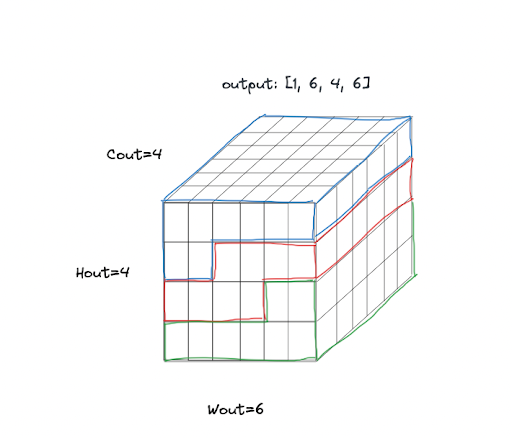
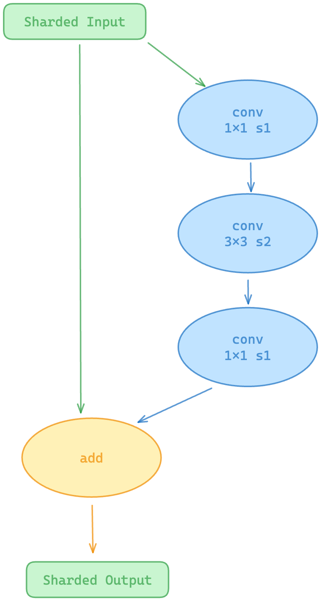

# Convolution Networks on Tenstorrent Chips

**Author**: Metalium CNN Team, Tenstorrent Inc.\
**Correspondence**: `asarje@tenstorrent.com`

## Abstract
In this paper we discuss the details of implementing Convolution Neural Networks (CNNs) on the Tenstorrent architectures. This includes the _Conv2D_ operation. We also detail the parallelization and performance optimizations, particularly focusing on the _sliding window operations_ in general and construction of fully local (to each core on the processors) data shards. An implementation of the ResNet-50 model using our Metalium stack.


Introduction
============

A Convolution Neural Network (CNN) is a type of deep learning model
particularly suited for processing data in a structured grid, such as
images. CNNs leverage convolution operations to automatically learn
spatial hierarchies of features from input data. These networks are
composed of layers that apply various filters to the input image,
capturing patterns and structures at multiple levels.

A convolution operation is a mathematical operation employed in the
training and inference of CNNs, which entails applying a filter (or
*kernel*), to the input to generate a feature map, highlighting
significant features within the input data. This operation is
characterized by its kernel window size, which determines the scope of
the input data each filter processes at a time.

When the window size is larger than $1$, the convolution operation
employs a sliding window technique. The window moves across the input
data, and at each pixel position, it computes the dot product of the
filter weights with the input image values. This results in a feature
map where each value represents the presence of features detected by the
filter. This ability to capture spatial relationships makes convolutions
highly effective.

In contrast, when the window size is exactly 1, the convolution
operation simplifies to a matrix multiplication operation. Here, each
input element is independently multiplied by the filter weight without
requiring any neighboring elements. This version is computationally
efficient but does not capture spatial relationships within the data.

Application of convolutions in CNNs are pivotal in tasks like image
recognition and object detection. CNNs are used in a large number of
real-world applications including video analysis, medical imaging
analysis, and natural language processing, where they can analyze data
to extract meaningful features and patterns.

## Convolution Operations in TTNN

### `conv2d`

Applies a 2D convolution over `input_tensor`, a 4D tensor with dimensions ordered as `(batch_size, input_height, input_width, in_channels)` using provided weights, with dimensions `(out_channels, in_channels, kernel_height, kernel_width)`, and optional `bias`, with dimensions `(1, 1, 1, out_channels)`, and generates `output_tensor` with first three dimensions flattened and ordered as `(1, 1, batch_size * output_height * output_width, out_channels)`. A simple `reshape` can be used to obtain the unflattened tensor.

#### Python API

```python
    output_tensor = ttnn.conv2d(
        input_tensor,
        weight_tensor,
        in_channels,
        out_channels,
        device,
        bias_tensor,
        kernel_size,
        stride,
        padding,
        dilation,
        batch_size,
        input_height,
        input_width,
        ## optional arguments
        conv_config,
        compute_config,
        groups,
        memory_config,
        return_weights_and_bias=False,
        return_output_dim=False,
    )
```

Arguments:

* `input_tensor`
* `weight_tensor`
* `bias_tensor`
* `in_channels` the number of input channels as an `int`.
* `out_channels` the number of output channels as an `int`.
* `device` device pointer as `ttnn.Device`.
* `kernel_size` tuple of two ints: `(kernel_height, kernel_width)`.
* `stride` tuple of two ints: `(stride_height, stride_width)`.
* `padding` tuple of two ints: `(padding_height, padding_width)`.
* `dilation` tuple of two ints: `(dilation_height, dilation_width)`.
* `batch_size` an `int`.
* `input_height` an `int`.
* `input_width` an `int`.
* `conv_config` _optional_ structure of configuration parameters of type `Conv2DConfig`. This is described in detail below.
* `compute_config` _optional_ structure of compute configuration parameters of type `DeviceConfiguration`. This is described in detail below.
* `groups` _optional_ `int` to control the connections between inputs and outputs. Both `in_channels` and `out_channels` should be divisible by `groups`.
* `memory_config` _optional_ output tensor memory configuration. This is described below.
* `return_weights_and_bias = False` _optional_ `bool` indicating whether to return pre-processed weights and bias tensors on device.
* `return_output_dim = False` _optional_ `bool` indicating whether to return the outout tensor height and width.

#### `Conv2dConfig`

Following are the conv2d operation configuration parameters:

* `dtype = ttnn.bfloat16` input activations data type.
* `weights_dtype = ttnn.bfloat16` weights and bias data type.
* `activation = ""` _optional_ `string`. Any activation function to apply. Options are `"relu"`.
* `deallocate_activation = False` _optional_ bool indicating whether the input activation tensor memory should be deallocated.
* `reallocate_halo_output = False` _optional_ bool indicating if the intermediate tensor generated within the op should be reallocated to reduce memory fragmentation.
* `act_block_h_override = 0` _optional_ `uint32_t` to override the `act_block_h` parameter, which determines the size of blocks used in computations -- smaller values require less memory, larger values require more memory but are more performant. This argument is ignored when `shard_layout = WIDTH_SHARDED`.
* `act_block_w_div = 1` _optional_ `uint32_t`, value by which the maximum possible `act_block_w` parameter is divided. This arguments is ignored when `shard_layout = HEIGHT_SHARDED` or `BLOCK_SHARDED`.
* `reshard_if_not_optimal = False` _optional_ bool indicating whether the operation can re-shard the input tensor to make it more optimal for performance. If true, override_sharding_config should not be set to true.
* `override_sharding_config = False` _optional_ bool indicating if input sharding config should be overridden with provided shard_layout. If true, reshard_if_not_optimal should not be set to true.
* `shard_layout = None` _optional_ `ttnn.TensorMemoryLayout` to specify type of sharding to use.
* `core_grid = None` _optional_ `ttnn.CoreRangeSet` specifies the core grid to use. Applicable only when `override_sharding_config = True`,
* `transpose_shards = True` _optional_ `bool` whether the shards be distributed in `ROW_MAJOR` order. This is applicable only when not using height sharding.
* `output_layout = ttnn.TILE_LAYOUT` _optional_ `ttnn.Layout` to specify whether the output tensor be in `TILE` or `ROW_MAJOR` layout.
* `enable_act_double_buffer = False` _optional_ bool to enable activation double buffering.
* `enable_weights_double_buffer = False` _optional_ bool to enable weights double buffering when using block sharding.
* `enable_split_reader = False` _optional_ bool to two concurrent reader kernels instead of one.

#### Compute Config

Architecture specific device compute kernel configuration, `DeviceComputeKernelConfig` with the following parameters:

* `math_fidelity = MathFidelity.HiFi4`
* `math_approx_mode = True`
* `dst_full_sync_en = False`

Wormhole and Blackhole specific parameters:

* `fp32_dest_acc_en = False` enable accumulations in fp32.
* `packer_l1_acc = False` enable packer accumulation directly in L1.

#### Example Usage

##### Preparing input tensors

`conv2d` takes 4D `input_tensor` with dimensions ordered as `(N, H, W, C)` (channels last), and `weight_tensor` as `(C_in, C_out // groups, kernel_h, kernel_w)` 4D tensor. The input activation, weight and bias tensors can be on host or on device. If weight and bias are on device, they need to be already pre-processed by the conv2d op.

```python
    import ttnn
    import torch

    ## activation tensor

    input_shape_nchw = [batch_size, in_channels, input_height, input_width]
    torch_input_tensor_nchw = torch.randn(input_shape_nchw, dtype=torch.bfloat16)
    torch_input_tensor_nhwc = torch.permute(torch_input_tensor_nchw, (0, 2, 3, 1))

    ttnn_input_tensor = ttnn.from_torch(torch_input_tensor_nhwc, ttnn.bfloat16)

    ## weight tensor

    weight_shape = [out_channels, in_channels // groups, kernel_height, kernel_width]
    torch_weight_tensor = torch.randn(weight_shape, dtype=torch.bfloat16)

    ttnn_weight_tensor = ttnn.from_torch(torch_weight_tensor, ttnn.bfloat16)

    ## bias tensor

    bias_shape = [1, 1, 1, out_channels]
    torch_bias_tensor = torch.randn(conv_bias_shape, dtype=torch.bfloat16)

    ttnn_bias_tensor = ttnn.from_torch(torch_bias_tensor, ttnn.bfloat16)
```

##### Calling the operation

Once the inputs are prepared, we can call the `conv2d` operation as shown in the following example. Many of the arguments in the `conv2d` API are optional, and will be using defaults as listed above.

```python

    conv_config = ttnn.Conv2dConfig(
        dtype=ttnn.bfloat16,
        weights_dtype=ttnn.bfloat16
    )

    [ttnn_output_tensor_on_device, [out_height, out_width]] = ttnn.conv2d(
        input_tensor=ttnn_input_tensor,
        weight_tensor=ttnn_weight_tensor,
        in_channels=in_channels,
        out_channels=out_channels,
        device=device,
        bias_tensor=ttnn_bias_tensor,
        kernel_size=(kernel_h, kernel_w),
        stride=(stride_h, stride_w),
        padding=(pad_h, pad_w),
        dilation=(dilation_h, dilation_w),
        batch_size=batch_size,
        input_height=input_height,
        input_width=input_width,
        conv_config=conv_config,
        return_output_dim=True,
    )
```

Note that the `conv2d` supports controling the return of output dimensions, through argument `return_output_dim`, and for processed weights and bias tensors, through argument `return_weights_and_bias`.

To achieve higher performance it is advisable to use the following optional arguments:

* `deallocate_activation = True` If the input tensor is no longer needed after the conv2d operation, this option will free up the input buffer and have more memory available for the operation.
* `reallocate_halo_output = True` The `conv2d` operation executes a _haloing_ step before computing the convolutions to optimize memory accesses. This option will reallocate the output of this step in order to reduce memory fragmentation to avoid memory fitting issues.
* `enable_act_double_buffer = True` If enough memory is available, enabling double buffering of the input activations will result in a better performance.
* `enable_weights_double_buffer = false` If enough memory is available, enabling weights double buffering can improve performance when using block sharding.
* `enable_split_reader = True` By default, a single reader kernel is used to read in activations from the input shard. Enabling this option will use two concurrent reader kernels, potentially improving overall performance.

##### Output post-processing

The generated output of the `conv2d` operation is a 4D tensor with the `NHWC` order of dimensions, and requires a permute operation to convert to the standard `NCHW` order. The following is an example of how to typically post-process the output tensor. Note that the `reshape` is used to un-flatten the outout tensor. The slice operation removes any padding that may have been added by the operation to the last dimension.

```python
    ttnn_output_tensor = ttnn.from_device(ttnn_output_tensor_on_device)
    torch_output_tensor = ttnn.to_torch(ttnn_output_tensor)
    torch_output_tensor = torch_output_tensor.reshape(batch_size, out_height, out_width, torch_output_tensor.shape[-1])
    torch_output_tensor = torch_output_tensor[:, :, :, :out_channels]
    torch_output_tensor = torch.permute(torch_output_tensor, (0, 3, 1, 2))
```


### `maxpool2d`
_Coming soon._


Convolution as Matrix Multiplication
------------------------------------

We want to perform convolution op on our hardware, but we do not have support for it - there are no instructions that are going to do specific convolution stuff.
It turns out that the convolution operation can be transformed into matrix multiplication. If we look at what we need to do in convolution, it is basically the dot product of the corresponding sliding window values and filter values. This is the same thing we do in matrix multiplication—take the dot product of a row in the first input and a column in the second input. So, if we represent all the sliding window values as rows (with each row being a flattened version of a sliding window), and all the filters as columns in the second input (in the same way as the first input), every value in the output matrix would correspond to the filter applied to a specific window.

\
_Figure 1: Idea of convolution as matrix multiplication_

In Figure 1, we can see that each window is transformed into a row in the first input, and each filter is transformed into a column in the second input. After performing matrix multiplication, convolution is applied.

Convolution Operation on Tenstorrent Architecture
=================================================

Implementation of Convolution Operation on a Single Tensix Core
---------------------------------------------------------------

In the implementation on a single Tensix core, we make the following
assumptions:

1.  The input and output activation tensors are stored across the global
    memory, either DRAM or L1, as interleaved buffers.

2.  The weights and bias tensors are stored in DRAM as an interleaved
    buffer.

3.  The local L1 memory size of the Tensix core is not big enough to
    store the entire input or output activation tensors.

The on-core L1 memory is used for the following:

-   Program binaries for the five RISC-V cores within a Tensix core.

-   Inputs to feed the compute core (partial activation and weights.)

-   Outputs from the compute core (partial intermediate and final
    results.)

A Tensix core has limited amount of L1 memory, which is about 1 MB on
Grayskull, and 1.5 MB on Wormhole architectures. For most applications,
this limited L1 memory is insufficient to store all of the input data.
Consequently, a portion of the input must be transferred into the local
L1 memory to perform computations to generate a corresponding portion of
the output. This partial output may need to be subsequently moved to the
global memory. This process is iterated until the complete output has
been computed. The partitioning of the inputs and the sequence of
transfers to the local memory must be meticulously managed to minimize
accesses to the global DRAM memory or remote L1 memory, which are
significantly slower than accesses to the local L1 memory, and maximize
the re-use of loaded input data into local L1 memory.

The input and output matrices are partitioned into *blocks*, the size of
which would be dictated by the maximum data size that can be
accommodated within the local L1 memory to perform corresponding partial
computations. For a specified output block, the sizes of the
corresponding input activation and weight blocks can be determined as in
the following.

In order to compute an output block of dimensions $[bH_{o}, bW_{o}]$, we
need the the following input blocks:

1.  an activation matrix of dimensions
    $[bH_{o}\textbf{,} \ K_h \times K_w \times C_i]$

2.  weights matrix of dimension $[K_h \times K_w \times C_i, bW_{o}]$

To make sure that the output block and corresponding input data fit in
local L1, the following constraints must be met.

-   $[bH_{o} \times bW_{o} + K_h \times K_w \times C_i \times (bH_{o} + bW_{o})] \times \text{\texttt{sizeof}}(\text{datatype}) < L1_{free}$

-   $bH_{o} \bmod 32 = 0$

Additionally, the compute unit in a Tensix core can process up to eight
output tiles at once. Thus, if the output block is greater than total of
8 tiles in size, it must be further subdivided into *sub-blocks*.

Given this context, the convolution implementation can be described as
the following algorithm.

1.  Transform the input tensor into the activation matrix.

2.  [\[alg:firstload\]]{#alg:firstload label="alg:firstload"} Load a
    block of activation and corresponding weights from in to the local
    L1 memory.

3.  Compute one output block and write it to the output global memory.

4.  Load the next activation block, reusing the same weights block by
    moving to the next blocks along the height of the input matrix.

5.  Compute corresponding output and write it to the output global
    memory.

6.  [\[alg:inner\]]{#alg:inner label="alg:inner"} Repeat the above
    process until an entire column of the output blocks has been
    computed.

7.  Repeat steps
    [\[alg:firstload\]](#alg:firstload){reference-type="ref"
    reference="alg:firstload"}-[\[alg:inner\]](#alg:inner){reference-type="ref"
    reference="alg:inner"} for each column of blocks in the matrixm
    until the entire output is calculated.

Activation Input Layout Transformation
--------------------------------------

The activation input to the convolution operation is a tensor with the
shape: $[N, C, H, W]$. On the host, the tensor is permuted to make the
channels the inner most dimension, to $[N, H, W, C]$. This tensor is
loaded into the device global DRAM memory.

Weight and Bias tensor Layout Transformation
--------------------------------------------

The weight tensors are permuted to the following order
$[K_h, K_w, C_i, C_o]$ such that the output channels dimension $C_o$ is
the fastest moving dimension. It is then flattened into two dimensional
matrix of size $[K_h\times K_w \times C_i , C_o]$. If needed, two
dimensions of this weight matrix are padded to be multiplies of tile
size.

The bias tensor, which is essentially a vector of length $C_o$, is
converted into a two dimensional matrix of dimension $[32, C_o]$ by
padding with zeros, where 32 is the tile width. All these operations are
carried out on the host before moving the data to the device.

Convolution Kernels on a Single Tensix Core
-------------------------------------------

Within a Tensix core, each of the five RISC-V cores are programmed
through kernel code, where each receives code compiled for its specific
role in the operation. Two of these cores perform the data movement,
while the remaining three are compute cores. There are two data movement
kernels, one for each of the data movement cores -- one of these reads
activation input blocks from the global memory to local L1 memory, and
the other reads weights and biases from global memory to local L1 memory
(Step [\[alg:firstload\]](#alg:firstload){reference-type="ref"
reference="alg:firstload"}). Additionally, it writes the output from
local L1 memory to global memory.

One compute kernel is compiled into three separate programs that are run
on the three compute cores. These are the *unpack*, *math*, and *pack*
cores. These three cores work together to perform the computations on
data available in the local L1 memory, loaded by the first data movement
core. The unpack core loads up the source registers with the input data
block, the math core performs the matrix multiplication and bias add
operations on the data in these source registers, generating result
output block in to the destination registers. The pack core moves the
output block data from the destination registers to the local L1 memory.

\
_Figure 5: Convolutions operation using generic interleaved global tensors._

\
_Figure 6: Convolutions operation using sharded local tensors._

Parallelization of Convolution Operation
========================================

Interleaved Tensors
-------------------

Tenstorrent architectures support tensor interleaving as a setup for
optimizing convolution. By interleaving tensors, the amount of hardware
that is used to access consecutive data is maximized, allowing for
further parallelization.

On the Tenstorrent architectures, we have a number of memory banks
dependent on the type of chip. Interleaved tensors store the data pages
in an round-robin fashion across these banks. Any of the Tensix cores
can access any of the data pages for such tensors. We use this tensor
parallelization format to develop a simple, non-performant version of
the convolution operation.

Sharding
--------

To develop a high-performance implementation of convolution operations
on the Tenstorrent architectures, we start with *sharding* the input
activation tensor, so that each core is the owner of a distinct
contiguous chunk of the input data stored in its local L1 memory.
Performing computations on the data owned by a core would mostly use the
data already present locally, and would reduce the inter-core data
accesses, optimizing these access patterns. In a later section, we will
describe how we completely eliminate all remote data accesses during the
convolution operation through haloing.

Convolutions on Tenstorrent architectures support three sharding
strategies: *height*, *width*, and *block*. To demonstrate the mechanics
of each strategy, consider a 2D matrix of size $[H, W]$ (representing a
flattened tensor), and let $p$ be the number of cores used.

\
_Figure 7: Height sharding_

\
_Figure 8: Block sharding_

1.  **Height sharding (1D)**: In the height sharded scheme, the input
    matrix height is equally divided into $p$ contiguous segments and
    width is kept as full, and each segment is assigned to a different
    core. Hence, each resulting shard will have a height of $H / p$ and
    width of $W$.

2.  **Width sharding (1D)**: In the width sharded scheme, the input
    matrix width is equally divided into $p$ segments, while the height
    is kept as full, and each core is assigned a different segment. Each
    resulting shard will be of height $H$ and width of $W / p$.

3.  **Block sharding (2D)**: Block sharding scheme involves equally
    dividing both height and width into a total of $p$ submatrices. Let
    the core grid be of size $m \times n$, where $p = m*n$. Then each
    resulting shard will have a height of $H / m$ and width of $W / n$.

Sharding of the input activations to the convolution operation could use
any of these schemes. Once the shards are loaded in to the L1 memory,
each Tensix core performs convolutions on the segment of data it is
assigned. This may also involve moving data across cores. For the height
sharding case, we do not need any inter-core data movements since we
replicate the weights tensor across all participating cores. In block
sharding, since each core is assigned a slice of the tensor, which would
only generate partial results, we use the multicast operation to move
the activation block data a core needs. We describe this next.

Sharded Input Data Movement Across Cores
----------------------------------------

Computing a single output value requires a full row of the activation
matrix and a full column of the weights matrix. In Height Sharding, all
cores possess full rows of the input, enabling them to independently
calculate their assigned outputs. Block Sharding and Width Sharding
divide the input along the channels dimension. Consequently, no single
core has all the necessary input to compute a complete output value.
Cores must share input data to compute full outputs. Data sharing occurs
only along the input width dimensions. In Width Sharding, each core
shares its input data with every other core. In Block Sharding, only
cores in the same row share data with each other. The computation
process follows several steps.

1.  First, each core fetches a subset of the weights matrix
    corresponding to its assigned output.

2.  Then, each core computes a partial output using its local input
    data.

3.  The first core broadcasts its input to all cores that need it.

4.  Receiving cores calculate another partial output and add it to the
    existing one.

5.  This process repeats with each core broadcasting its input in turn.

6.  After all cores have broadcasted their input, final outputs are
    calculated.

7.  This approach allows for efficient parallel processing while
    ensuring all necessary data is shared among cores to produce
    accurate final outputs.

Haloing
-------

\
_Figure 9: Halo_

In the following example, we describe the haloing process. This is a
data movement operation we use to construct 'haloed' shards, where
each input shard contains all the data it requires to generate
convolution output for its assigned output tensor shard. This eliminates
any need for a Tensix core to access the L1 memory of another core
during the convolution operation.

To demonstrate this process of constructing haloed shards, let's start
off with an example. We start with the following tensors:

1.  Input activation tensor of size $[1, 6, 4, 6]$.

2.  Weight tensor of size $[6, 6, 3, 3]$.

3.  Output activation tensor of size $[1, 6, 4, 6]$.

For simplicity, let the batch size, stride and dilation be one.
Let's visualize the activation tensor.

<div>


</div>

_Figure 10: Input tensor (A, B, C, D)_


Let's define one pixel with the channel dimension as a *stick*
(shown in Figure 3).

In the Figure 10: A, aside from the full input tensor, we also
demonstrate a single channel view of this block. This view will be a
useful visualization tool on which we will build on top of. Let us
assume we have $p = 3$ cores. The sharding strategy we will be using is
*height*-sharding. This is depicted in the Figure 10: B via three distinct
colors, one for each shard.


Next, we can visualize what our window will look like. Recall that the
weight tensor consists of a number of filters, and each filter consists
of one or more kernels. This kernel is also referred to as the *window*
in 2D visualization representation. We can see the 3D kernels (a single
filter) that is being convoluted across our input tensor.


We will keep in mind the strides, $S_w$ and $S_h$, as how many data
elements we traverse by. We have not shown any padding ($pad_h$ and
$pad_w$), but they would also be included if they were non zero values.
The 2D representation shows the window and what parts of each shard it
will perform matrix multiplication with. We can see that the shown
window position spans two different shards. Thus, if we were calculating
the output data element for this window, we would somehow need to get
some shard data from another core.


In the Figure 10: D, we see the same window that has traversed
several elements and is located at its current position. In the 2D
single channel representation, we can see that this window spans data
from all 3 shards. Thus, for this particular output data element, it
will need data from its current core, as well as 2 other cores for the 2
other shards.


**The goal of halo is to determine which input data is required for the output data
elements calculated on a specific core and to transfer that data to the core.**

### Halo implementation


Halo op performs needed data movement on each core in the following manner:
1. allocate buffer for the halo'd output shard, which consists of local input data sticks,
padding sticks and remote input data sticks
2. fill padding sticks in the allocated buffer with padding value
3. copy input shard sticks from the input buffer to the allocated output buffer
4. remote copy sticks of the local shard to the cores that need them to calculate their output shards*

\* If the `remote_read` argument of the halo_op is set to **true**, then each core
will copy the needed sticks from remote cores instead. Default remote data movement
is done by the core that contains the data (src-local, dst-remote), while if this
flag is triggered, remote data movement is performed by the core that consumes the data (src-remote, dst-local).

To perform steps 2-4, halo kernel needs to know for each stick in the halo output
(which will be convolution input), whether it is (a) padding, it comes from (b) the local
shard or from (c) a remote shard. This is calculated on host by the sliding window
infrastructure that is called from the halo operation. The final config is pushed
to the device as a sharded tensor to the reserved part of memory - currently we reserve
this memory using `l1_small_size config` when initializing the device.
Config tensors are then consumed by the halo kernel to perform needed transfers.


Let's explain how this config is generated, step by step. We will focus on the 2D
representation, since we are using the height-sharding example which does not split channels on cores.
These steps match functions defined in the `sliding_window` namespace called from
[the halo op](https://github.com/tenstorrent/tt-metal/blob/main/ttnn/cpp/ttnn/operations/sliding_window/halo/device/halo_device_operation.cpp),
in the `create_program` function, before the kernels are dispatched.

Note: This example is simplified for clarity. In a real-world scenario,
additional padding would be added to fit the tile height and width before
the halo operation is called. However, we are intentionally overlooking that detail here.

#### Step 1 - Pad metadata

Let's now expand our convolution to include the following padding (see Figure 11):
- $pad_h$ = 1
- $pad_w$ = 1
- padding value = 0

We will generate a vector of boolean values that will be sized the same
as the original input tensor. Each of these values will signify whether the
current element is a padding value or a data value. Padding values are set to true
(value=1), while the latter are set to false (value=0).

\
_Figure 11: Pad metadata_

#### Step 2 - Op trace metadata

Next up, we will traverse through the input tensor and store the indices
that correspond to each stick. You can see that certain sticks will
correspond to padding values whereas certain sticks will correspond to
data values. We store these indices in a vector. If you know the top-leftmost index,
you can generate all the indices in your window that you will need.

\
_Figure 12: Op trace metadata_

#### Step 3 - Shard boundaries

Now we will determine what data we need for each core. We first compute
what part of the output each core is responsible for. Therefore, the
point of view of computation is from the output, not the input. Our
output tensor dimensions are shown in Figure 13 below.
Each shard will be computed by a specific core.

In this step, for each core, we determine:
- start and end stick indices of the output shard computed on the core
- start and end stick indices of the padded input tensor needed for the output shard
(indices generated in step 2)


Let us focus on the first core. First core's output shard covers output sticks
between indices [0-7] (see Figure 13).


\
_Figure 13: Convolution output tensor_


To obtain the input boundaries for this shard,
we can traverse through each output data element and figure out what
input elements are needed to compute that (see Figure 14). We
can see that we need input sticks between indices [0-27]. These sticks
include padding, local shard to the first core, and some sticks from the
second core.

\
_Figure 14: Window traverse for core 0 output_

After halo op is done, each core will contain all the input sticks needed to
compute the assigned output shard (see Figure 15). Halo output is then passed
to the convolution op as input.

\
_Figure 15: Convolution input per core (halo output)_

#### Step 4 - Tensor metadata

In this step, for each stick in the input tensor, we generate information
about where it is located at. For each core, we generate following info:
- `padding`: true/false
- `location`:
    - `core_id`: int - the core it is located on
    - `local_core_index`: int - index of the stick on the core it is located on


#### Step 5 - Kernel config tensors

This is the final step where we generate config tensors consumed by the halo kernel.
Using the information from steps 1-4, we generate 3 config tensors:
padding config, local config and remote configs.

##### Padding config

This is a vector of pairs, where each pair describes a chunk of consecutive padding sticks:
- index of the first stick
- length

For core 0, we would have 3 chunks:

\
_Figure 16: Padding chunks for core 0_

\
_Figure 17: Padding config_


##### Local config

This is a vector with following data:
- core coordinates (first 2 vector elements)
- number of elements describing chunks of local shard needed (3rd vector element)
     - this is basically count of the remaining elements in the vector and equals 3 * number of chunks
- for each chunk of consecutive sticks (rest of the vector elements)
    1. index of the first stick in the local input shard (see Figure 17)
    2. index in the first stick in the halo output shard (see Figure 18)
    3. chunk length


\
_Figure 18: Local input shard indices_

\
_Figure 19: Local input shard chunks for core 0_

For core 0, this vector would describe 2 chunks needed by core 1 (see Figure 18):

\
_Figure 20: Local config_


##### Remote config

Remote config describes chunks of local data needed by other cores.
It is a vector similar to the local config vector, only now we have an extra level on top
that describes each remote core that needs data. The vector consists of the following elements
for each remote core:
- remote core coordinates (first 2 vector elements)
- number of elements describing chunks of local shard needed (3rd vector element)
    - this is basically count of the remaining elements in the vector and equals 3 * number of chunks
- for each chunk of consecutive sticks (rest of the vector elements)
    1. index of the first stick in the local input shard (see Figure 17)
    2. index in the first stick in the halo output shard (see Figure 18)
    3. chunk length

\
_Figure 21: Remote input shard chunks for core 1_


\
_Figure 22: Remote config_


Implementation
------------------------------------

Consider an example input image with a resolution of $32 \times 32$, meaning both the height $H$ and width $W$ are 32, and each pixel has a channel depth $C$ of 1. Let's use just one image, setting the batch size $N = 1$ for the convolution operation. Therefore, the input tensor for the convolution has dimensions $[1, 32, 32, 1]$, where the order of the dimensions is $[N, H, W, C]$. The last dimension will be padded to 32 before the convolution starts because the unit of calculation is a tile.

Logical activations shape: $[1, 32, 32, 1]$

Padded activations shape: $[1, 32, 32, 32]$

In this case, we will focus on height-sharded convolution.

Let us perform the convolution with a filter of size $[3, 3]$, using a stride of 1 in both the $H$ and $W$ dimensions, with padding enabled (both height and width padding are 1). The dilation is also 1. We will have just 1 input and 1 output channel, but these will be padded to 32 (for the same reason as the number of input channels in the activation input). In other words, only one filter (and just the first layer of it) is effective. Therefore, these are weights dimensions, where the order of dimensions is $[C_i, C_o, K_h, K_w]$:

Logical weights shape: $[1, 1, 3, 3]$

Padded weights shape: $[32, 32, 3, 3]$

\
_Figure 1: Filters_

The output of this convolution will be a tensor with dimensions $[1, 32, 32, 1]$ — it has the same dimensions as the input tensor.

The key variables as input to the convolution operation in this example are:


| **Parameter**       | **Value** |
|---------------------|-----------|
| **Input**           |           |
| - Batch Size ($N$)  | 1         |
| - Height ($H_i$)    | 32        |
| - Width ($W_i$)     | 32        |
| - Channels ($C_i$)  | 1         |
| **Kernel window**   |           |
| - Height ($K_h$)    | 3         |
| - Width ($K_w$)     | 3         |
| **Stride**          |           |
| - Height ($S_h$)    | 1         |
| - Width ($S_w$)     | 1         |
| **Padding**          |           |
| - Height ($P_h$)    | 1         |
| - Width ($P_w$)     | 1         |
| **Dilation**          |           |
| - Height ($D_h$)    | 1         |
| - Width ($D_w$)     | 1         |
| **Output**          |           |
| - Batch Size ($N$)  | 1         |
| - Height ($H_o$)    | 32         |
| - Width ($W_o$)     | 32         |
| - Channels ($C_o$)  | 1        |

Before the part of the operation where the actual convolution is done, several actions take place (sharding, padding, haloing, etc.). The input to the convolution micro-op is the output of the halo operation. Halo op ensures that each core has all data required to apply the convolution operation (which is essentially matrix multiplication) in local L1 memory.

In this case, we will analyze the height-sharded convolution. The output will be $[1, 32, 32, 1]$. Each core will process one row of the output, so 32 cores will be used—one row of output per core. Each core will handle this chunk of the tensor:


\
_Figure 2: Chunk of data each core is going to process_

Initially, each core will have just a $1 \times 32 \times 32$ shard (an equally divided tensor with padded input channels). However, after adding padding to the tensor (height and width are now 34 instead of 32) and gathering data from other cores, the dimensions will be $[1, 3, 34, 32]$.

Conv input is 2D tensor - first 3 dimensions are squashed into 1 ($N$, $H$, $W$), and $C$ is going to be second dimension of reshaped tensor.
After reshaping this tensor into 2D (this part is not part of conv micro-op, halo output is already 2D tensor), each stick from the tensor in Figure 2 will correspond to one row of the reshaped tensor:


\
_Figure 3: Chunk of data each core is going to process - 2d reshaped_


This is an actual shard that will be processed in the convolution micro-op, and it is also the output of the halo operation.

Weights are stored as an interleaved tensor (usually in DRAM), and after reshaping to 2D, it looks like this:

\
_Figure 4: Filters - 2d reshaped_

Each column in the weight tensor represents one filter.

The input tensor to the convolution must first be transformed into a matrix such that multiplying this matrix with the filters (as weights) gives the convolution output. In convolution, a dot product is performed between the filter elements and each kernel window position. This kernel window is a sliding window that moves across the width and height of the input image.

In matrix multiplication, a dot product is performed between a row in the first input matrix and a column in the second input matrix. This means we need to transform our input into an appropriate matrix for matrix multiplication. Logically, if we look at Figure 2, one window where the filter is applied is one "box" (e.g., from $a_{0,0,0}$ to $a_{2,2,31}$). We need to store that data in one row of the transformed matrix so that when we apply the dot product of that row with the filter (weight matrix), we get the result of applying the filter to the input window.

This is the job of the activation reader kernel. The activation reader kernel rearranges input data into a buffer (CB) that will be consumed by the compute kernel, in a way that enables matrix multiplication. Specifically, each row in this matrix is a flattened version of the input elements from each kernel window.

Looking at both Figure 2 and Figure 3, we can see that the data for one row in the transformed matrix is not placed continuously in the input. For the first window, we take the first 3 elements, then skip the next 31 elements, and take the next 3 elements, and so on. For each row of the transformed matrix, we select which sticks (input elements) to use by choosing the starting point and applying the appropriate offsets.

\
_Figure 5: Transformed input for matrix multiplication_

Colors can be matched with those on Figure 1. These dimensions essentially mean that we have 32 windows in our input, with each window containing 288 values (3x3 sticks).

On the other side, the weight reader kernel reads the weight data from DRAM into L1. The entire weight tensor is fetched to each core, and a 1D matrix multiplication (matmul) is performed.

Once the data from the reader and writer are ready, the compute kernel performs the matrix multiplication and stores the output as height-sharded.

The output tensor is 32x32 per core, where only the first row is effective, because we have 31 padded filters.

CNN Models: ResNet-50 Benchmark
===============================

\
\
_Figure 23: Resnet Blocks_

ResNet-50 is a CNN with 50 layers, part of
the ResNet (Residual Network) family. Primarily to address the vanishing
gradient problem associated with training deep neural networks, ResNet
was introduced. ResNet-50 utilises a concept called residual learning,
which helps in training deeper networks more effectively. From an
inference perspective, Resnet-50 is efficient and effective in making
predictions on new data once it is trained.

Following is simplified diagram and description of ResNet block

ReLU Activation: The Rectified Linear Unit(ReLU) activation function is
applied after each convolution layer and batch normalisation layers. It
filters positive values and in turn introduces non-linearity into the
network, which is needed for the network to learn complex patterns in
data. Bottleneck Convolution Layers: This block consists of three
convolutional layers with batch normalization and ReLU activation after
each.:

1x1 convolution: This layer is used to reduce the number of channels in
input data. By reducing dimensionality, the data is compressed and
higher computational efficiency is achieved without affecting
information.

3x3 convolution: This is the core convolution layer which extracts
special features of the data.

1x1 convolution: It restores original number of channels to add in
original input using skip connection.

Skip Connection: It adds input of the bottleneck convolution layer to
output of it. This bypass connection makes sure that essential
information from previous layers is passed through the network. While
training this helps to resolve vanishing gradient issues and speeds up
training. On the other hand, while inferencing it helps in maintaining
smooth flow of gradients and features, which in turn helps in prediction
accuracy.

Summery From a training perspective, ResNet-50's architecture
effectively leverages residual learning with its ResNet blocks to enable
training of deep neural networks. The residual blocks, with their use of
1x1 and 3x3 convolutions, along with shortcut connections, help in
efficiently learning complex patterns and gradients, which improves the
network's performance and training stability.

From an inference perspective, ResNet-50 is efficient and effective due
to its use of residual blocks and shortcut connections. These elements
allow the network to make predictions quickly and accurately by
leveraging deep feature extraction while maintaining manageable
computational complexity. The residual blocks, through their combination
of convolutions and shortcut connections, ensure robust learning and
performance during inference.
