# Collective Communication Library (CCL)

Contact for questions/comments: [Sean Nijjar](mailto:snijjar@tenstorrent.com)

[CCL Higher Level Building Blocks](#ccl-higher-level-building-blocks)

[ERISC Data Mover (EDM) Engine](#erisc-data-mover-(edm)-engine)

[Host CCL Op Builder Components](#host-ccl-op-builder-components)

[Orchestrating (From Host)](#calling-multichip-ops-from-host-(ttnn))

[Op List](#op-list)

[Measuring Op Performance](#measuring-op-performance)

[(Ring/Line) All Gather](#(ring/line)-all-gather)

[(Ring) Reduce Scatter](#(ring)-reduce-scatter)

[Testing](#testing)

[Lower Level Debug Guide](#lower-level-debug-guide)

# CCL Software Stack Overview

CCL operations are implemented on top of multiple software API layers; both single and multi-chip APIs. To ease programming burden and to reduce test and optimization surface area and improve reusability, CCL operations reuse higher level programming APIs, in particular the Erisc Data Mover (EDM). Developers are free to program at their desired level of abstraction.

The current stacks look like the following:

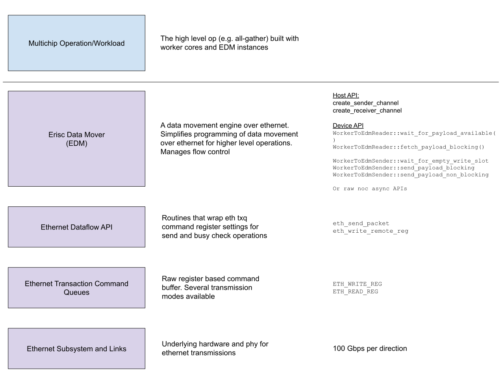
<p align="center"><i>CCL multichip abstraction layers</i></p>

The Ethernet subsystem, including the link and phy are at the lowest level.

Above this are APIs to direct write to Ethernet command queue registers, which can be used to initiate ethernet transactions and change message modes (raw vs packet for example).

The third level is the ethernet dataflow API which lets the user initiate writes over the ethernet link. These APIs are similar to the noc async APIs in that commands are issued to command buffers and dispatched at some later, unknown time.

The fourth level is the Erisc datamover which encapsulates many common pieces of functionality that are required by multichip operations: startup/teardown synchronization, flow constrol, virtual channels, and multi-buffering.

Finally, higher level CCL operations are implemented.

It is recommended to review ["Basic Ethernet Multichip"](BasicEthernetGuide.md) for the basics of the first four levels before continuing with the higher level CCL operations presented in this doc.

## CCL Orchestration
At the TT-NN layer, orchestration APIs exist to perform higher level collective and multichip operations. For example, a user can specify that they wish to run independent all-gather operations along all the rows or columns of a mesh that their multichip tensor is distributed across. The ["Programming Mesh of Devices with TT-NN"](../Programming%20Mesh%20of%20Devices/Programming%20Mesh%20of%20Devices%20with%20TT-NN.md) provides further details.
# CCL Higher Level Building Blocks {#ccl-higher-level-building-blocks}

Although a reader should be able to write custom multichip workloads from start to finish with the information presented so far, there are common patterns which benefit from being componentized for reused and focused optimization that can benefit all users of those components.

For this reason, the CCL provides pre-written components that were built to account for the design complexities mentioned earlier in the document. It is *recommended* to use these components as building blocks for higher level operations/end-to-end workloads, including CCL ops such as all-gather. The user is not *required* to use any of these components, but is *strongly* encouraged to use them to streamline implementation work, avoid certain classes of bugs (as mentioned in the “Operating Environment” section), and automatically absorb any performance optimizations that are implemented over time.

Some examples of commonized components include:

* ERISC Data Mover (EDM): a multi-channel, bidirectional data mover engine that runs on Ethernet core pairs, over Ethernet links
* Worker kernel utilities that assist in packetizing and depacketizing workload data
* Host-side data-structures to describe concepts such as cluster topology
* Host-side builder components that simplify argument passing and kernel instantiation

# ERISC Data Mover (EDM) Engine {#erisc-data-mover-(edm)-engine}

The ERISC Data Mover is a reusable data movement component that’s used to send data over ethernet links. It is designed to provide ethernet link utilization while also handling the additional design concerns raised by implementing multichip collective operations. The EDM supports multi-channel, bidirectional data transfers. It exposes a communication protocol with workers to signal data and buffer availability. The EDM was implemented as a common and reusable software component that runs on ERISC cores. Optimizations and functional improvements can carry over all CCL ops this way.

Based on bandwidth microbenchmark results, to achieve good utilization of the ethernet link, we desire two things:

1) we must prefer to send larger packets over smaller packets, and preferably packets of size 16K
2) we prefer to instantiate multiple channels for a given EDM

For these reasons, the EDM is typically instantiated with multiple channels. Workers feed data into EDM channels in packetized form. Typically pages are only a single tile which is typically 2K or less in size, so workers must assemble multiple pages before issuing send commands to achieve higher utilization. As seen from the bandwidth microbenchmark where we allow a large number of channels for a given packet size, a packet size range of 4KB to 16KB is desired for optimal performance. Any less will lead to inadequate link utilization.

## EDM Communication Interface

The EDM provides an interface for the reader and sender side. Fundamentally, the EDM interfaces have 2 main parts: the termination sequence, and the data movement flow control signaling. The EDM manages state for every channel independently. The EDM instantiates channels in either sender or receiver mode where a sender channel is one which sends data over Ethernet to a receiver channel and a receiver channel receives data from over Ethernet.

### Initialization and Source -Destination Readiness Signaling

Because programs are dispatched to different chips independently, and without any explicit synchronization across the chips, then it is the responsibility of the EDM to ensure both sides of the ethernet link are ready to participate in the operation. For this reason, the EDM will always perform a handshake with the connected e-risc before proceeding with main op execution.

The handshake is performed by first designating an ERISC as the sender or receiver in the handshake. This is done currently with an arbitrary rule where the sender will be the one with sender ethernet channels. In the event that both ERISC cores of the EDM have a sender side, the side with the lowest sender channel ID will be designated as the sender for the purpose of the handshake.

After a sender is designated, the handshake begins. To complete the handshake, the sender sends a dummy packet to a designated 16B handshake address. The receiver waits for this packet and then sends an acknowledgement and proceeds. After the sender side receives the acknowledgment, it also proceeds with execution.

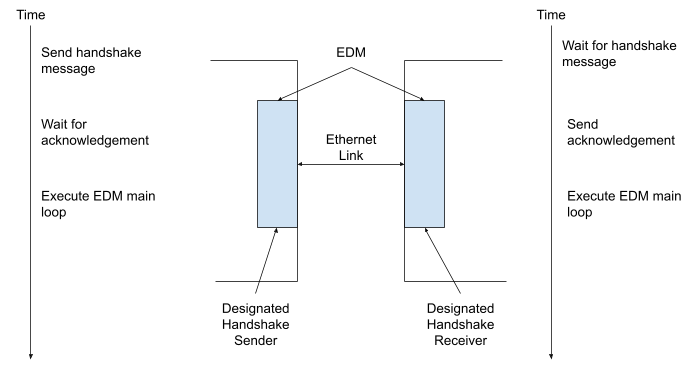

Because the handshake address and the transaction state structures (namely ERISC_info->channels of type eth_channel_sync_t) are persistent, there is no concern of data clobbering with a previous invocation of the EDM. If the previous invocation was still expecting some sort of ethernet payload, then that would be a bug with how the EDM was invoked (one end was told to send/receive more messages than the other).

### Termination Mode

The EDM currently supports 2 termination modes, which are specified as a compile time argument. The termination mode dictates what the termination condition is for the EDM as well as where to obtain the inputs to determine if the termination condition is met. The chosen termination mode is currently shared across all channels, though could be modified to be per channel.


* Fixed message count: `ccl::EriscDataMoverTerminationMode::MESSAGE_COUNT_REACHED`
  * EDM is programmed to forward or receive a fixed number of messages for a given channel, after which, the channel terminates
* Worker driven termination signal: `ccl::EriscDataMoverTerminationMode::WORKER_INITIATED`
  * In this mode, the EDM channel runs indefinitely until it receives a worker termination signal on the sender and receiver side from the connected workers
  * At present, this mode requires the sender worker to signal the terminate signal when it is setting the go signal for the final message

Currently, CCL ops use a mix of the fixed message count termination mode and the signal termination mode, depending on the operation. *[future work]* All-gather should be moved to signal termination mode to eliminate code from the host side that would otherwise be needed to compute exact message counts.

### Worker -Sender Side EDM Interface (Per Channel)

The interface described in this section is between an EDM sender channel and the worker that writes to it. Signaling between the ERISC and the worker is accomplished through a pair of semaphores, one on each core. One buffer is allocated on the EDM sender channel and the address is shared with the sender worker core.

The semaphore on the worker core is incremented by the ERISC and is used to notify the worker that the worker can write into the buffer of the sender channel on the ERISC.

The semaphore on the EDM sender channel is incremented by the worker and is used to signal from the worker to the EDM sender channel that a *new* payload is written into the channel buffer and is ready to send.

Sender Worker Fields:
*Sender_local_semaphore*:

* Usage (from EDM): EDM notifies this address on worker when the EDM channel buffer is available for writing into
* Usage (from Worker): Read for non-zero to indicate that the destination buffer can be written into. Worker clears before notifying EDM of payload available.
* *Initialization (host)*: create with CreateSemaphore (initialized to 0), and give address to EDM kernel for associated channel

EDM Channel Fields:
*edm_channel_semaphore*:

* Usage (from EDM): EDM watches this address to see when a payload is available for sending on the channel.
* Usage (from Worker): Worker increments the value at this location in ERISC L1 to tell the EDM channel a new valid payload is available. In practice, it’s typically safe to send a semaphore_inc immediately following the noc_async_write to the buffer given that by default, both of those commands will use the default unicast VC and therefore the semaphore_inc will always land after the payload write is complete.
* *Initialization (device)*: before notifying the worker of buffer availability at startup, EDM must first clear this semaphore to 0 to avoid a race.

*edm_channel_buffer*:

* The location in ERISC L1 where the sender will write payload contents into

#### Sequence Per Channel

This subsection outlines, step by step, how the sequence between the sender worker and EDM sender channel progresses.

The below snippet shows a simple sequence to implement the transaction sequence from sender worker to EDM sender channel. This snippet could be wrapped in one (or more loops), if the op requires multiple packets to be sent.

```c++
// sender worker snippet
// wait for EDM to signal to sender worker that a buffer can be written to
noc_semaphore_wait(receiver_local_semaphore_address, 1);

// Reset the semaphore before advancing through the read/ack sequence to avoid races
noc_semaphore_set(receiver_local_semaphore_address, 0);

noc_async_write(sender_source_l1_address, edm_buffer_address, payload_size_bytes);
// By default, the noc_semaphore_inc will use the same virtual channel and will not
// race ahead of the write, so we queue it up immediately after
noc_semaphore_inc(edm_buffer_semaphore_address, 1);
```

Visually, this sequence appears as follows:

* EDM channel notifies sender worker of buffer available through EDM -> sender semaphore increment. EDM must clear local semaphore before notifying sender to avoid race.


* Worker fills EDM channel buffer

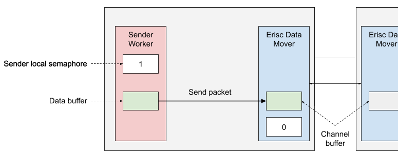

* Worker notifies EDM channel of payload complete through sender -> EDM semaphore. Worker must make sure to clear local semaphore before notifying EDM to avoid race

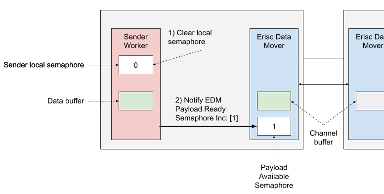

* Goto first step


### Receiver Side EDM -Worker Interface (Per Channel)

The interface between the EDM receiver channel and the receiver worker is very similar and has the same base components: two signaling semaphores and a channel buffer. The key difference in operation is that presently, the data is pulled from the EDM receiver by the worker, instead of pushed to the worker by the EDM. The semaphores are used by the ERISC and the worker to signal payload available and payload read completion, respectively. The buffer address on the EDM receiver channel is shared with the receiver worker. In the future, a push mode will be added to the EDM receiver channel to improve latency.

ReceiverWorker Fields:
*receiver_local_semaphore*:

* Usage (from EDM): EDM notifies this address on worker when the EDM channel buffer is available for reading from
* Usage (from Worker): Read for non-zero to indicate that the source buffer can be read from. The worker must clear this value locally before notifying EDM of payload read completion.
* *Initialization (host)*: create with CreateSemaphore (initialized to 0), and give address to EDM kernel for associated channel

EDM Channel Fields:
*edm_channel_semaphore*:

* Usage (from EDM): EDM watches this address to see when a payload read from this channel has been completed by the workers
* Usage (from Worker): Worker increments the value at this location in ERISC L1 to tell the EDM channel that it is done reading the contents of the channel buffer and that they can safely be discarded/overwritten (i.e. by the upstream sender channel).
* *Initialization (device)*: before handshaking with EDM on the other end of the ethernet link, this value must be cleared to 0.

*edm_channel_buffer*:

* The location in ERISC L1 where the reader will read the buffer from. Additionally, this is the same address that the sender side will send to -although this is internal the EDM and is not exposed externally.

#### Sequence Per Channel

This subsection outlines, step by step, how the sequence between the EDM receiver channel and receiver worker progresses.

```c++
// receiver worker snippet
// wait for EDM to signal to worker that a packet is available
noc_semaphore_wait(receiver_local_semaphore_address, 1);

// Reset the semaphore before advancing through the read/ack sequence to avoid races
noc_semaphore_set(receiver_local_semaphore_address, 0);

noc_async_read(edm_buffer_address, receiver_local_l1_address, payload_size_bytes);
// Typically needed but optional depending on use case
noc_async_read_barrier();

// Notify the EDM that receiver has read the payload and the EDM buffer can
// be overwritten with new data
noc_semaphore_inc(edm_buffer_semaphore_address, 1);
```

Visually, this sequence appears as follows:

* EDM channel waits for message from sender
  * notifies receiver worker of payload available through EDM -> receiver semaphore increment
  * EDM must clear its local semaphore before incrementing the worker semaphore to avoid a race

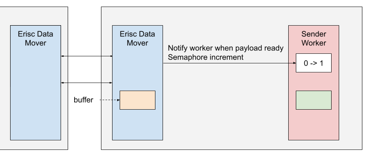

* Worker reads EDM channel buffer

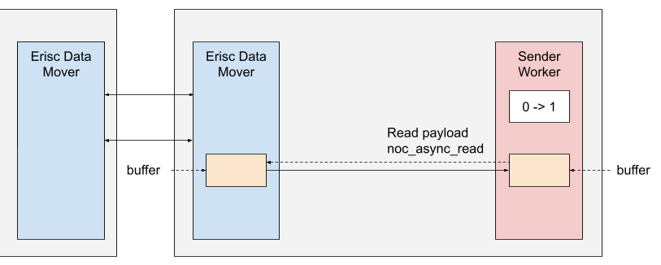

* The worker notifies EDM channel of read complete through receiver -> EDM semaphore.
  * The worker must clear local semaphore before sending semaphore update to EDM, otherwise there is a race condition.

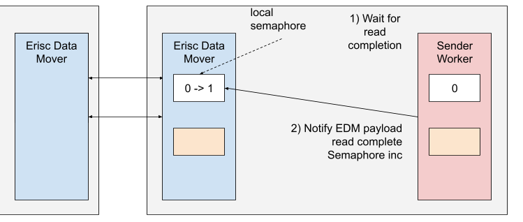

* Goto first step

….

## Topology Support

The EDM is not constrained to any specific multichip topology, given that it is a generic multi-channel data mover over Ethernet and that external (e.g. worker) cores are still needed to implement the “application” logic. However, certain topologies are more easily supported than others, and the current form of the EDM and its capabilities has been informed by that.

Our experience as a team at Tenstorrent, so far, has shown that multichip data-movement patterns are typically regular and easily mapped to static routing schedules. *Arbitrarily* complex and *asymmetric*  any-to-any data movement patterns have not yet needed support and have not been a focus of CCL work to date. However, architectures such as mixture-of-experts with large tensors benefit from data mover components that support more dynamic and non-regular, and definitely non-predictable, data movement patterns, with good performance.

For these reasons, the EDM has so far been used to support ring and linear topologies and unicast point-to-point routes. Future work is to provide a more robust infrastructure that can handle more complex data movement patterns.

Line and ring topologies map well onto static routing and static channel allocation strategies because of their predictable data movement. Additionally, line and ring topologies only ever require direct communication between neighbor chips and never multi-hop transfers. This means there is no explicit routing required to support these use cases. For this reason, an optimized data movement component that only does point to point data movement is sufficient. No complex routing or multi-hop support is required.

Additionally, with these ring and line algorithms where all transfers are only to immediate neighbor chips, it is always sufficient to perform a single handshake between the ERISC cores on either end of the link of the directly connected chips to ensure end-to-end synchronization with respect to source and destination readiness.


# Host CCL Op Builder Components {#host-ccl-op-builder-components}

Some host components have been written to simplify instantiation and connectivity of CCL device components (such as EDM) to workers.

A summarized list of CCL builder components includes the:

* EDM Builder
* Tensor Slicer (Scheduler)
* Topology Config

## ERISC Data Mover (EDM) Builder

The EDM simplifies the host code side setup of EDM in a larger op/workload. Its responsibilities are primarily to:

* Simplify kernel argument setup between worker and EDM kernels
* Hide EDM argument setup to make EDM feature addition more easily backward compatible
  * As long as EDM builder is used, new compile time and runtime arguments can easily be added under the abstraction without the worker kernel or op host code explicitly being required to be aware
* Manage buffering and memory for the EDM

The EDM Builder is defined in [ccl_host_datastructures.hpp](https://github.com/tenstorrent/tt-metal/blob/dd1a3ee2fb5b4483d2513b2aa9389b2d876ae77a/tt_eager/tt_dnn/op_library/ccl/ccl_host_datastructures.hpp#L121).

The EDM builder provides easy to use methods to instantiate sender/receiver channels and pass the relevant interface information to the connected worker(s).

The general usage pattern is to, per program/chip, instantiate an EDM builder per link and then to use that to establish connections between workers and sender/receiver workers (depending on the direction of the connection).

### EDM Builder Example

Here we work through example usage of the EDM builder from the host set up code of an op.
First we can create an EDM builder. Today, we must, ahead of time, decide on the number of channels. In the future. In the future, this will be dynamic based on the number of channel registrations. Additionally, we must specify the buffer sharing and termination modes, which are described earlier.

There is currently one usability improvement to the builder that is missing that will be resolved in the future which is that it is currently up to the user to identify the EDM channel buffer addresses ahead of time before instantiating the builder. This logic will be incorporated and hidden in the builder in the future, which will streamline its use and remove certain bug categories from appearing. The recommendation to avoid this issue is to use the [`ccl::create_erisc_datamover_builder`](https://github.com/tenstorrent/tt-metal/blob/8b3ad7d17f76e611a77661dbc44fb30b1213a44d/tt_eager/tt_dnn/op_library/ccl/ccl_common.cpp#L111) function which abstracts this concern away.

In the example, we are only instantiating a single channel that will be used by a single worker and forward a fixed number of messages before terminating. We use the `create_erisc_datamover_builder` function to streamline address generation.
```c++
std::size_t num_edm_channels = 1;
auto buffer_sharing_mode = ccl::EriscDataMoverBufferSharingMode::NOT_SHARED;
auto edm_termination_mode = ccl::EriscDataMoverTerminationMode::MESSAGE_COUNT_REACHED;
ccl::EriscDataMoverBuilder edm_builder = create_erisc_datamover_builder(
    num_edm_channels,
    op_config.get_page_size(),
    buffer_sharing_mode,
    edm_termination_mode);
```

After this point, the EDM builder can be used to establish connections between workers and channels. These associations produce resolved buffer and semaphore addresses when kernel runtime arguments are specified.

We may wish to assign a worker to a sender channel of the builder. For this channel, the worker will *push* packets to the EDM channel. We create the association with the [`add_sender_channel`](https://github.com/tenstorrent/tt-metal/blob/d14f694198a1993ccac2d629225abd8ce92f56a8/tt_eager/tt_dnn/op_library/ccl/ccl_host_datastructures.hpp#L222) method.
```c++
ccl::EriscDatamoverBuilder::ChannelBufferInterface const& sender_channel_buffer_info =
    edm_builder.add_sender_channel(
        worker_sender_semaphore_address,
        num_packets_to_send,
        sender_worker_coords,
        packet_size_bytes);
```
With the returned `ChannelBufferInterface`, we can generate arguments at a later point
```c++
// ... later in the host code, when setting arguments for the sender worker

tt_metal::SetRuntimeArgs(
    program,
    sender_worker_kernel_id,
    sender_worker_core,
    {
        // ... non-EDM, worker specific args

        // This argument tells the sender worker where to write the payload
        // in the EDM L1
        sender_channel_buffer_info.eth_buffer_l1_address,

        // This argument tells the sender worker where to signal to the EDM
        // that a new payload is available
        sender_channel_buffer_info.eth_semaphore_l1_address,

        // ... possibly other non-EDM, worker specific args
    });
```
Note that both sender and receiver channels can be added to an EDM builder.

After all channels have been registered with a given EDM, the EDM can be built with the ccl::generate_edm_kernel function. This function should only be called once per EDM per link per chip. Calling this function multiple times for a given Ethernet core is an error.
```c++
auto edm_sender_kernel =
    ccl::generate_edm_kernel(
        program,
        device,
        edm_builder,
        eth_sender_core,
        edm_noc_id);
```
Note that this call will only create the EDM for one side of the link, at the core location specified to the call. A corresponding EDM must also be built on the other end of the link, for the program associated with that remote chip.

Extending this example further, a simple ring could be formed by creating a second EDM builder to instantiate on an Ethernet core connected to a chip in the opposite direction along the ring. We can follow the same process above to associate this new EDM builder with the receiver worker but call [`add_receiver_channel`](https://github.com/tenstorrent/tt-metal/blob/d14f694198a1993ccac2d629225abd8ce92f56a8/tt_eager/tt_dnn/op_library/ccl/ccl_host_datastructures.hpp#L252) instead of `add_sender_channel`.

## Tensor Slicer Scheduling

The tensor slicer (scheduler) is a recent addition to  CCL op building infrastructure. It is referred to as CclTensorSlicer in the code, but for disambiguation in this documentation between it and the device kernel tensor slicer also used by ops such as ReduceScatter, it will be referred to as the Tensor Slicer Scheduler.

This component is responsible for taking in a description of the workload and producing the tensor slice shapes that each worker will be assigned for the operation. Inputs include the number of workers, tensor shape, fracture dim, and cluster size while the output is just a tensor slice shape list.

Whatever slice shapes are chosen must be small enough to fit within the data-pipeline without causing backpressure on the op. For some ops this may not be a concern (e.g. with allgather implemented with separate reader and writer workers), but for others it is required (e.g. reduce_scatter).

## Topology Config

The topology config is a shared data structure which standardizes some topology information (such as if it is a ring or line) for ops to reuse.

# Calling Multichip Ops From Host (TTNN) {#calling-multichip-ops-from-host-(ttnn)}

In addition to the lower level APIs and programming model entry points described earlier in this doc, some software infrastructure exists at a higher level (TTNN) to facilitate writing multi-chip applications. The mesh tensor is one of the key components that simplifies multi-chip model implementation and CCL op calling.

The mesh tensor wraps the smaller, partial tensors that form larger multichip tensor but exposes the collection as a single logical tensor. With this, higher level operations are enabled. For example, a mesh tensor sharded in 2 dimensions and also mapped to a 2D cluster mesh, can invoke higher level operations such as row/column all-gather/all-reduce.

This way, lower level details like chip IDs and connectivity don’t need to be explicitly managed by the user. They can instead continue to describe their multi-chip workload at a higher level.

# CCL Ops

The CCL library provides a collection of pre-written multi-chip operations. The current list of supported ops is small and constrained to only a few configurations, which are shown further below. The intended minimal set of operations is larger and includes commonly used collective operations such as all-gather, reduce-scatter, all-reduce, reduce, gather, scatter, gather-scatter, send/receive.

This section of the documents walks through the high level implementation of two CCL ops: all-gather and reduce-scatter, which have different data movement patterns and behavior. The intent with these walkthroughs is to provide examples for a user to write their own CCL op from scratch as well as to equip the reader with the knowledge they might need to extend and optimize the existi ng implementations.

# Op List {#op-list}

The current CCL op status is as follows:

| Configuration/Layout | All Gather | Reduce Scatter | Send/Receive | All Reduce |
| :---- | :---- | :---- | :---- | :---- |
| Interleaved (Row Major) | Y | N | N | N |
| Interleaved (Tile) | Y | Y | N | N |
| Width Sharded (Tile) | Y | Y | N | N |
| Width Sharded (Row Major) | Y | N | N | N |
| Height Sharded (Tile) | Y | N | N | N |
| Height Sharded (Row Major) | N | N | N | N |
| Block Sharded (Tile) | Y | Y | N | N |
| Block Sharded (Row Major) | N | N | N | N |
| Bidirectional | Y | N | N | N |
|  |  |  |  |  |

A CCL typically provides implementations for standard collective operations. At present (July 2024), only a small subset of all standard CCL ops are implemented in the Tenstorrent CCL. More will be added in the future.

All-gather has support for line and ring topologies - and by extension, multiple concurrent lines/rings on a mesh to perform multiple row or column all-gathers on a mesh. Reduce scatter currently only supports ring topology, which again can be instantiated concurrently multiple times for a mesh if performing reduce-scatter along rows or columns.

# Measuring Op Performance {#measuring-op-performance}

When measuring the performance of CCL operations, there are several extra things to keep in mind that are not applicable to single chip operations.

Given that programs for different chips are not guaranteed to compile at the same time, then looking at a raw op performance report at face value can be misleading. For example, consider the following sample perf report for an 8 chip CCL operation running on a ring. Based on the `"DEVICE KERNEL DURATION [ns]"` numbers, the reader may be led to believe that this operation took ~5.2 billion cycles (5.2 seconds for WH @1GHz aiclk).

This number is misleading because it includes compilation time of the CCL op programs on the other chips. What’s shown here is that the first chip’s program is compiled and then dispatched. The timer for this program opens but in the mean-time, the programs for chips one through seven are still being compiled. Chip 0 is unable to make progress -except for initialization -until its neighbors are compiled and started. This applies for all but the last chip. Only the last chip program is able to run without waiting for compilation to complete for other chips.

For this reason, if measuring CCL op performance the following it is recommended to use the measurements for the last chip in the sequence for the op

![][image7]

# (Ring/Line) All Gather {#(ring/line)-all-gather}

The all-gather operation is a standard all-to-all collective operation. This section describes the high level implementation of the all-gather operation for ring and line topologies, in the Tenstorrent CCL.


## Algorithm Description

All gather takes an input tensor per rank and performs a concatenation along a specified dimension and stores the result on all ranks, hence the “all” in “all-gather”. In the ring version of all-gather, for each time step except the first and last, the rank receives an input from a neighbor, concatenates it locally into the output tensor, then forwards it to the next neighbor. For the first timestep, the rank does not receive an input from a neighbor and for the last time step, it does not forward it further.

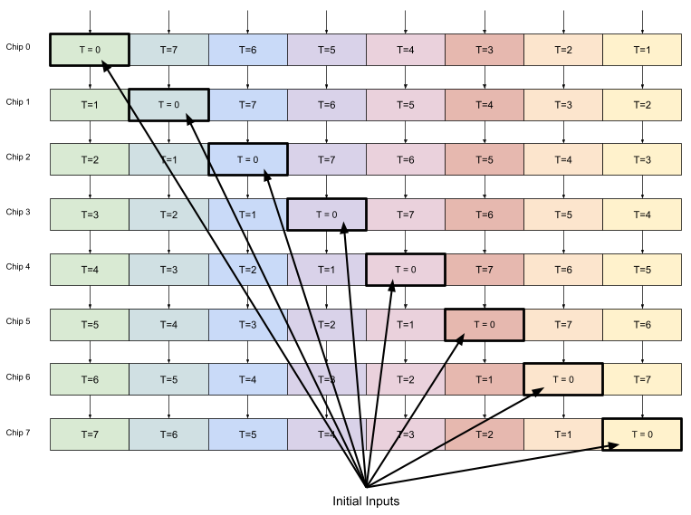

## Implementation

In a ring all-gather, the current implementation is as follows:

* Each logical worker unit is dispatched across two cores: one for receiving from EDM and one for forwarding to EDM.
* The sender reads the input tensors and forwards to both to the output tensor and to the EDM
* The receiver worker accepts payloads from EDM and fills the portion it is responsible for of t=1, then t=2, and so on.
* For every chunk of data committed to the output tensor -typically EDM packet size worth of pages -the receiver worker increments a semaphore on the sender worker core
* The sender reads from the output tensor and forwards the data any time it sees the local semaphore increment

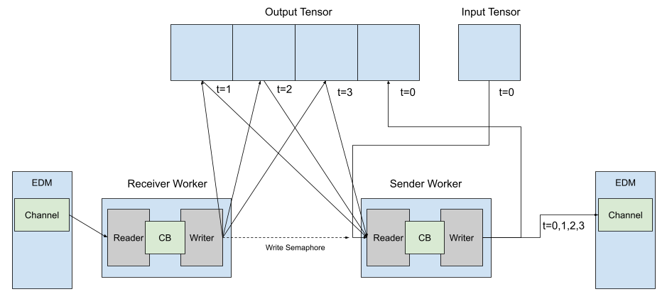

Single chip logical view of a single worker all-gather, instantiated on the third chip of a 4chip ring. In practice, multiple workers are typically instantiated and subdivide the input/output tensor into pieces

### Bidirectionality

The all-gather op supports bidirectionality to make use of the full Ethernet bandwidth in both directions over the link. The current approach for implementing bidirectionality is to logically split the input tensors into two pieces and to execute two all-gather operations in parallel. In practice, these are not two separate all-gather operations (programs) and the parallel all-gather operations are run in the same programs.

This bidirectional approach sends half of each tensor in opposite directions fully around the ring.

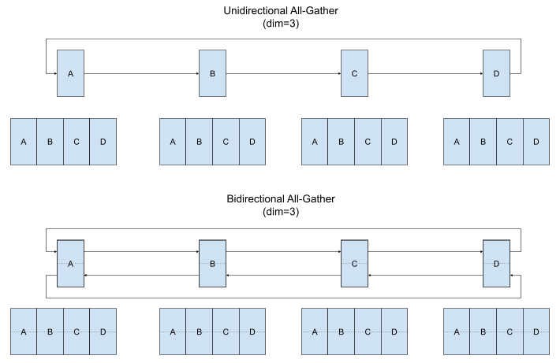

An alternative bidirectional approach is to send the full input tensor in each direction, but only halfway around the ring. This has the benefit of being simpler to fuse with operations like matrix multiplication. Additionally, this approach is also latency optimized for smaller tensors because the latency overhead of initiating and completing transfers is reduced because fewer hops are made.  Support for this alternative approach is in progress for better small all-gather performance and as a setup for fused all-gather-matmul fusion to overlap compute and data movement.

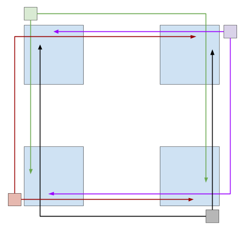

#### Line Topology

The line topology all-gather is inherently bidirectional in nature. This topology is implemented in the same way as the second bidirectional approach except that the number of hops in each direction is dictated by distance from the end of the line, rather than ring size divided by two. Additionally, the bandwidth utilization characteristics are different from a bidirectional ring that lead to worse performance overall. The effective peak Ethernet bandwidth achievable is half of the theoretical bidirectional peak because

1) The tensors on the ends of the line can only be sent in one direction
2) The transfers are not balanced left to right, with the exception of the middle tensors

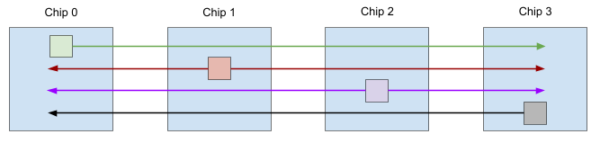

### Sharding Support/In Flight Resharding

All-gather implements a concatenation operation so when comparing input and output tensors that are sharded, the number of pages per shard/core changes, even if the shard-grid stays the same. This means that all-gather must implement in-flight resharding for functional correctness. The current all-gather op implements this with custom indexers which require many calculations on the host to set up the initial parameters for the indexers.

## Special Attributes

All-gather has a special attribute that it is a pure data movement operation with no intermediate outputs or math operations. For a functional implementation, no explicit synchronization is required between senders and receivers if the sender knows. However, for performance reasons, and because of current infrastructural limitations, the all-gather op is implemented in a way where each chip along the ring must explicitly send and receive the input for each hop. With a generic multichip fabric, an op like all-gather could be implemented exclusively on the sender side with multicast commands, after either handshaking with each destination or knowing the absolute buffer address for each destination.

## Usage

Invoking allgather is straightforward when a mesh tensor is available for the input. The all-gather op currently doesn’t support out of order tensors with respect to chip ordering in the line or ring. Any constructed mesh tensor must therefore also contain the ordered tensors as they would be mapped to the ring.

```python
result_mesh_tensor = ttnn.all_gather(input_mesh_tensor, dim)
optional kw_args:

* num_links
* memory_config

```

ttl.tensor.line_allgather()

# (Ring) Reduce Scatter {#(ring)-reduce-scatter}

Reduce scatter takes an input tensor per chip, and fractures it into num_ranks pieces along the specified dimension. A reduction is then performed with the pairwise fractures across each chip. In the unidirectional ring version, this is done by first forwarding fracture (chip_id + 1) to the neighbor, and then iterating through the fractured chunks, each time reducing it with the input received from the previous neighbor and forwarding the partial result to the next rank. Finally, when the chip arrives at its chip_id fracture chunk, it performs the pairwise reduction but stores the result locally to the output tensor. The final output is distributed across ranks, hence the “scatter” of “reduce scatter”.

Below is a visual representation of the algorithm. Note that some of the steps of the reduce scatter have been excluded from the diagram to reduce visual noise. The timestep is annotated beside each displayed chip-to-chip transfer. Note that a bidirectional implementation is possible, though not implemented yet.

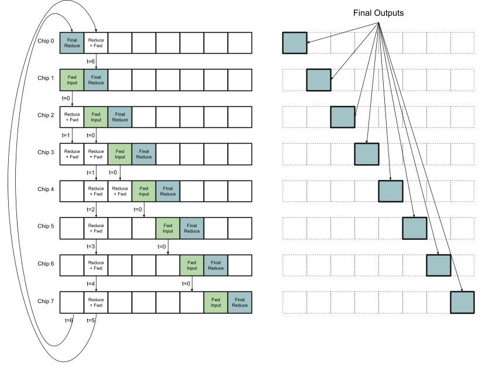

## Implementation

Reduce scatter is implemented with host and device components and primitives that are more inline with the intended design of CCL v1. In particular, the host code is simplified quite a bit with these. In no particular order, the following is a list of key and important host CCL components:

* ERISCDataMoverBuilder
* TensorSlicer

Although logically, the input tensor is split by a factor of num_ranks along the specified dimension, in practice, the input tensor is often split by further factors to improve performance and to avoid issues such as deadlock. The algorithmic fracturing along dim from the reduce scattering operation itself must always be preserved. However, each fractured chunk can be further sliced; effectively breaking up the larger reduce scatter into multiple, smaller, and potentially concurrent, reduce scatter operations. All slice lines must be the same across all fractured chunks.

Multiple factors may contribute to the final slice shape for a given reduce-scatter invocation, such as desired number of workers and internal data pipeline buffering capacity. Taking these factors into account, it is possible that a given worker is responsible for processing more than one slice, in which case it processes slices sequentially.

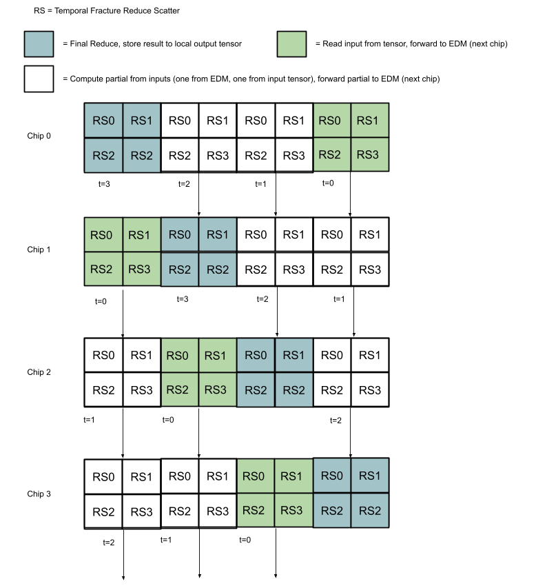

The tensor slicer must create slices that fit within the data pipeline without causing a deadlock. This is because there is no storage to park the full set of intermediate outputs between workers/ring stages. In general, we accomplish this by logically breaking up the reduce scatter operation into smaller reduce scatter operations where each smaller conceptual reduce scatter op doesn’t require buffering that exceeds the data pipeline buffering capacity. Although we are logically breaking up the reduce scatter into smaller independent reduce scatter operations, the operation is still executed with a single invocation.

With this implementation of reduce-scatter, the worker will see `ring_size` worth of a given tensor slice before it advances to the next logical output slice step in the tensor. The first chunks from the local tensor will be forwarded without partial reduction. The other (ring_size -1) chunks for that same slice offset will arrive from the EDM, one for each of the other ranks in the ring, and will be pairwise reduced with each subsequent timestep in the slice. Each timestep is an advance of fracture slice size (on the fracture dim) into the input tensor. The result from the last timestep is actually the final result for that chip and slice and is stored in the output tensor.

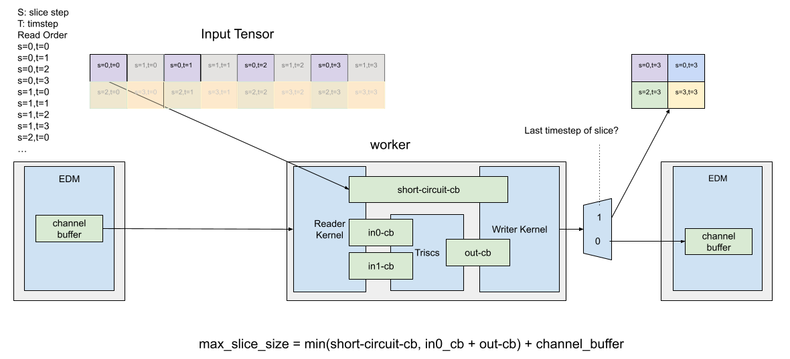

Logical view of a single reduce scatter worker connected to a sender and receiver EDM channel on a single chip. In this example, timesteps and steps are specified for chip3 in a 4chip ring. The larger fractures are split into smaller slice steps to satisfy buffering limitations

When multiple workers are present, each worker takes alternating slices out of the input and output tensors such that subsequent slices for a given worker are strided by the entire worker group worth of slices.

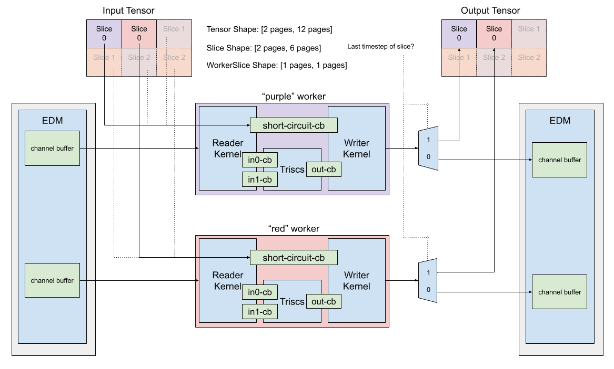
*Logical view of a single chip of reduce-scatter with 2 workers implementing the operation. **Note that in this diagram, only one timestep/fracture is shown***

## Special Attributes

Reduce-scatter has a special attribute where the op produces partial outputs for each timestep and each rank and that partial output is used as input for another rank and on another timestep. This is relevant to the CCL design space because it enforces that there is no direct path from input to output tensor without some form of synchronization between ranks or workers coordinating production and consumption of partials.

# Invoking CCL Operations

CCL operations can be dispatched across various chips and sub-topologies of a multi-chip cluster. Programming APIs are made available, via TT-NN, to express collective operations at higher levels and across entire clusters.

For example, it is possible to describe an operation such as an all-gathering along the rows of a multichip cluster that has multiple rows or columns, where the TT-NN infrastructure can decide the appropriate way to dispatch the underlying CCL operations..

Refer to the ["Programming Mesh of Devices with TT-NN"](../Programming%20Mesh%20of%20Devices/Programming%20Mesh%20of%20Devices%20with%20TT-NN.md) guide for programming examples and further information.
