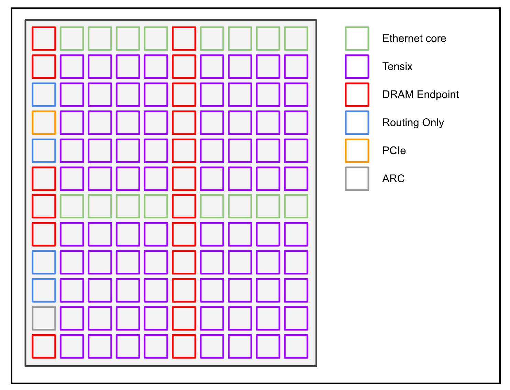
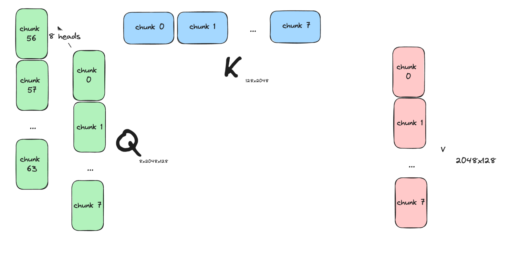
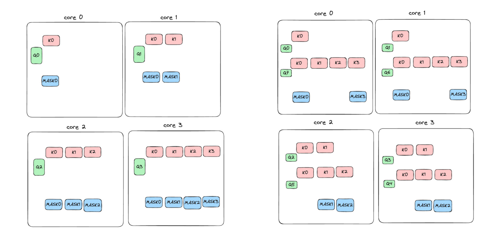
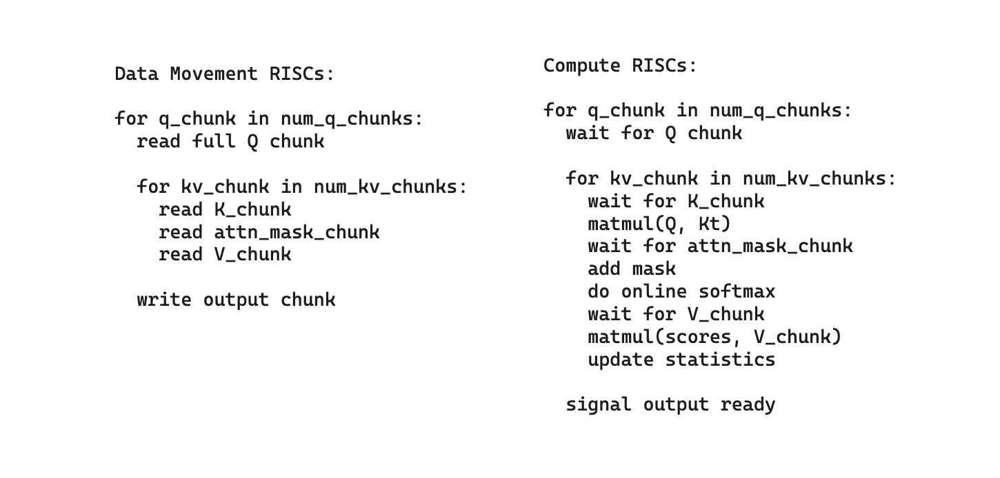
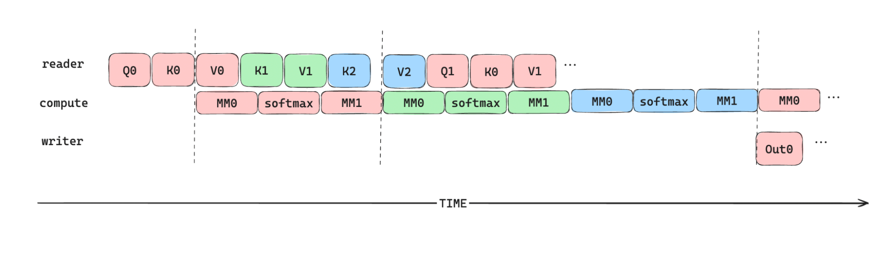

<html><head><meta content="text/html; charset=UTF-8" http-equiv="content-type"></head><body class="c15 doc-content"><h1 class="c20" id="h.32o3xxsh1kk0">FlashAttention&nbsp;on Tenstorrent&rsquo;s Wormhole Architecture</h1>
Author: Colman Glagovich
<h2 class="c9" id="h.9o3cjvqoget">Abstract</h2>
The FlashAttention kernels have made great progress in speeding up scaled dot product attention on GPUs. We apply this algorithm to the TT-Metal software stack, targeting Tenstorrent&rsquo;s Wormhole accelerator. This paper applies the algorithm of FlashAttention-2 &ndash; &nbsp;parallelizing Q across multiple processors with online softmax on chunks of KV &ndash; and some kernel-level optimizations from FlashAttention-3 &ndash; pipelined data movement and asynchronous execution &ndash; to create FlashAttention on Wormhole which achieves a 20x speedup&nbsp;over our Wormhole baseline. This work also applies 1) causality-aware parallelization for Tenstorrent&rsquo;s compute architecture and 2) overlapped data movement and computation with Tenstorrent&rsquo;s asynchronous Tensix cores.
<h2 class="c9" id="h.ojj60noc6rwr">1 Introduction</h2>
The GPU programming model relies on automatic fusion through torch compile and manual fusion of graphs such as FlashAttention to achieve peak performance. Fusion of all sorts reduces the load on global memory by increasing the arithmetic complexity of a kernel. This is a direct consequence of the restricted GPU programming model &ndash; a kernel must use global memory to pass data to the next kernel.

 The TT-Metal programming model is more flexible because it allows the outputs of a kernel to be allocated in either global memory or L1 SRAM. We call the latter storage type &ldquo;L1 sharding&rdquo;, since the tensor storage is distributed across a grid of cores.&nbsp;This enables a form of op fusion specific to our framework -&nbsp;by making all the inputs and outputs of a graph of ops use sharded&nbsp;storage, TT-Metal removes the need for&nbsp;round-trips to DRAM between op invocations. This is a major source of optimization in the TT-Metal stack, allowing a sequence of ops to effectively &ldquo;fuse&rdquo; their data movement (and therefore reduce the&nbsp;global memory bandwidth load, improving performance) without requiring the user to write a custom fused op.

While sharding removes the need to write custom fused ops in most cases for Tenstorrent hardware, some algorithms such as FlashAttention provide large algorithmic improvements over the original implementation and should&nbsp;be implemented as a new fused op.&nbsp;When it is necessary to implement a custom fused op, the TT-Metal programming paradigm enables developers to experiment with and implement optimized kernels.

This whitepaper describes the implementation of FlashAttention on the TT-Metal software stack, targeting our Wormhole&nbsp;accelerator. We take advantage of (1) optimized load scheduling for causal attention which we apply to our grid of parallel cores, (2) TT-Metal&rsquo;s asynchronous execution model, enabling pipelining of data movement and compute, and (3) Wormhole&rsquo;s tile-based compute engines.
<h2 class="c9" id="h.jlw3fgt53dj8">2 Background</h2><h3 class="c0" id="h.81pnid2zcvz2">2.1 Algorithm</h3>
Our first implementation of scaled dot product attention was the naive matmul -&gt; softmax -&gt; matmul. We were able to use sharded memory to &ldquo;fuse&rdquo; these operations together and reduce data movement, though this method did not scale to larger sequence lengths due to limited L1 space. For larger sequences we had to spill our intermediates to DRAM, leading to decreased performance. By applying the FlashAttention-2 algorithm, we take advantage of Wormhole&rsquo;s 120MB of L1 memory&nbsp;(on-chip SRAM) and demonstrate the process of writing SOTA kernels on the TT-Metal stack. We also applied some optimizations from FlashAttention-3, including asynchronous data movement and compute.
<h3 class="c0" id="h.5540dbw7gord">2.2 Wormhole architecture</h3>
The Wormhole architecture consists of an 8x10 grid of Tensix cores, connected in a 2-D torus with a NoC. Connected to the NoC is 12 channels of 1GB GDDR6, totaling 288 GB/s DRAM bandwidth. In addition, Wormhole has 16 ethernet cores connected to the NoC which provide 3200 Gbps of bidirectional bandwidth for scaleout. 

Figure 1: Wormhole logical NoC layout

 Each Tensix core contains 1.5 MB of L1 memory (SRAM) and 5 programmable risc-v cores. RISC0 and RISC1 are capable of issuing NoC transfers to move data from L1 &lt;-&gt; L1 and L1 &lt;-&gt; DRAM. RISC 2, 3, and 4 are responsible for issuing instruction streams to our tile-based matrix processing engine which implements matrix multiplication, element-wise unary and binary operations, and other operations on tensors in L1. &nbsp;These RISCs operate concurrently, enabling native pipelining and data movement/compute overlap within a Tensix.

We do all of our development and benchmarking in this paper on Tenstorrent&rsquo;s n150 system, a PCIe card with a single Wormhole chip operating at up to 160W. 
<h3 class="c0" id="h.mmzkbjt10sg">2.3 TT-Metal Execution Model</h3>
TT-Metal&nbsp;executes one program&nbsp;(an operation like matmul, softmax, etc.) on a 2D grid of Tensix cores at a time. A program is a collection of kernels&nbsp;written in C++ which target the RISCs of a Tensix. A program typically consists of a reader kernel, writer kernel, and compute kernel where the reader targets RISC0, the writer targets RISC1, and the compute kernel is compiled to execute on RISCs 2, 3, and 4. We parallelize a program by mapping it onto a 2D grid of Tensix cores, each of which executes its reader/writer/compute kernels asynchronously. Contrast this with the GPU programming model, where a user launches a grid of blocks of threads. Blocks are scheduled on parallel processors and each thread is responsible for read/compute/write unless complex specialization and synchronization is implemented.

See documentation for more details. <a class="c14" href="https://www.google.com/url?q=https://github.com/tenstorrent/tt-metal/blob/main/METALIUM_GUIDE.md&amp;sa=D&amp;source=editors&amp;ust=1725476268994681&amp;usg=AOvVaw3Dafr1g6eyg6n2PgD-lwA8">https://github.com/tenstorrent/tt-metal/blob/main/METALIUM_GUIDE.md</a>.
<h2 class="c9" id="h.h28oevvjk23t">3 Implementation Details</h2>
Our full, open-source implementation of FlashAttention is available on our github. It is used in LLMs such as Llama3-70B and Mixtral-8x7B. <a class="c14" href="https://www.google.com/url?q=https://github.com/tenstorrent/tt-metal/tree/main/ttnn/cpp/ttnn/operations/transformer/sdpa&amp;sa=D&amp;source=editors&amp;ust=1725476268995324&amp;usg=AOvVaw1eSPmjgWrfyaJcsOG8XJU9">https://github.com/tenstorrent/tt-metal/tree/main/ttnn/cpp/ttnn/operations/transformer/sdpa</a>
<h3 class="c0" id="h.u5zbsl585zy0">3.1 Parallelization</h3>
This section describes our causality-aware parallelization scheme which we developed to schedule work on a fixed grid of compute cores.

Algorithmic optimizations we added to FlashAttention-2 include
<ul class="c17 lst-kix_ek96qq2xmhch-0 start"><li class="c1 c10 li-bullet-0">Causality-aware load balancing</li><li class="c1 c10 li-bullet-0">Sparse attention mask reading for causal-attention</li></ul>

Figure 2: Example chunking scheme of Q, K, and V inputs for multi-query attention with 8 query heads.

Attention has an output of shape `batch, num_heads, seq_len, dhead`. We parallelize the output tensor on the first three dimensions such that each Tensix core in the grid is responsible for computing attention for some portion of the `batch`, `heads`, and `seq_len`. This ensures that each core has a balanced amount of work.

3.1.1 Q, K, and V chunking

Parallelizing over batch and num_heads is trivial since these dimensions are independent. Parallelizing over the sequence length interplays with our chunking factors in Q and K. FlashAttention has two hyperparameters to choose: q_chunk_size and k_chunk_size. These determine the length of Q and K chunks in the sequence length dimension. V shares the same chunk size as K. These hyperparameters affect FlashAttention by setting the size of Q, K, and V chunks which are read in the outer and inner loop of FlashAttention. They should be swept for a given input size to find the optimal configuration.

Given the batch and head parallelization, sequence length parallelization is described as the number of Q chunks each core must process.

3.1.2 Causality and load balancing

Figure 3: Left: original parallelization strategy for causal attention. Right: load balancing for causal attention and sparse attention mask reading.

With some q_chunk_size, the Q tensor will be split into Q chunks Q0, Q1, &hellip;, Qn-1. K and V are similarly chunked according to k_chunk_size. If we have p&nbsp;cores and n&nbsp;Q chunks, we assign n/p&nbsp;Q chunks to each core. 

In causal attention, Q0 only has to attend to the chunks of K and V which are at equal or lesser token indices. So if q_chunk_size == k_chunk_size, Q0 only attends to K0 (and V0), but Q1 attends to K0, K1 (and V0, V1).

If we assigned consecutive Q chunks to each core, some cores would have more work to do than others. Our load balancing scheme solves this issue by assigning each core a &ldquo;low&rdquo; Q and a &ldquo;high&rdquo; Q. Core 0 computes Q0 and Qn-1. Core 1 computes Q1 and Qn-2, etc. This method perfectly balances the work across cores. This gives us 1.6x speedup over the naive parallelization strategy with unbalanced work.

Further taking advantage of causality, we assume a causal attention mask and apply sparsity such that the mask is only applied for score matrices on the diagonal. This leads to speedup by reducing DRAM pressure.
<h3 class="c0" id="h.3zttfsubgu04">3.2 Asynchronous Execution and Pipelining</h3>
This section describes how we take advantage of Wormhole architecture features and the TT-Metal programming paradigm. The main features we take advantage of include
<ul class="c17 lst-kix_9l64gnuy3fl7-0 start"><li class="c1 c10 li-bullet-0">Asynchronous, pipelined data movement and compute</li><li class="c1 c10 li-bullet-0">Tile-based data movement and compute</li></ul>

3.2.1 Kernel Pseudocode

Figure 4: Pseudocode for overlapped data movement and computation kernels

Our FlashAttention kernel reads Q, K, and V from DRAM and writes the output to DRAM. On each core, the reader kernel will read a chunk of Q and then iterate over the chunks of K and V. Intermediate results (accumulated output and statistics) are stored in L1 until all KV chunks are processed, then the output is written to DRAM.

3.2.2 Pipelining

Figure 5: Within a single Tensix, the pipeline diagram of asynchronous data movement and compute in the FlashAttention op. Q, K, and V chunks are double-buffered in L1. Dotted lines indicate synchronization points between the concurrent reader, writer, and compute kernels. The first synchronization point indicates the compute kernel waiting for the first Q and K chunks to arrive in L1. The second indicates that the reader kernel waits for compute to consume V_chunk0 before reading V_chunk2 into L1, allowing the double buffer to free a slot. The third synchronization point indicates the writer kernel waiting for compute to produce the first output chunk.

Like all kernels written in the TT-Metal stack, our FlashAttention kernel takes advantage of concurrent reader, writer, and compute kernels to overlap data movement with compute. The RISCs within a Tensix synchronize using circular buffers, which can be thought of as thread-safe producer/consumer queues. We enable double buffering by sizing the circular buffers for Q, K, and V such that they can store 2 chunks at a time. Double buffering enables pipelining as shown in the above figure, hiding data movement latency by overlapping it with compute.

3.2.3 Tiling

TT-Metal also provides support for tile-based data movement and compute. In TT-metal, a tile is a 32x32&nbsp;matrix that is contiguous in memory. &ldquo;Tilized&rdquo; tensors are tensors that have the last two dimensions shuffled such that the&nbsp;elements of a 32x32 tile are contiguous in memory. Reader/writer kernels benefit from tilized tensors because tile reads/writes are implemented as large contiguous bursts over NoC. Large bursts are effective at achieving high DRAM, NoC, and ethernet bandwidth. The compute engine in a Tensix natively operates on 32x32 tiles, so tilized tensors are also a natural format for the compute engine.

With tilized tensors and concurrent reader/writer/compute kernels, the implementation of our pipelined FlashAttention op is simple and idiomatic to the TT-Metal paradigm.
<h2 class="c9" id="h.g3q6f7514nte">4 Performance Analysis</h2>
We followed standard practice and measured performance for head_dim: {64, 128, 256} with hidden_dim fixed to 2048, and sequence length varied from 512 to 16k with batch size set such that the total number of tokens is 16k. We show results for BF16 and BFP8 input/output data format. BFP8 (block FP8) is a Tenstorrent-specific datatype where 16 datums share one exponent, and each datum has 7 bits of mantissa. The BFP8 datum size is approximately half of the BF16 datum size. Its range of possible values is greater than other FP8 formats like E4M3 and E5M2.

Our baseline measurement is a standard implementation of softmax attention executed on Wormhole which writes intermediates to DRAM.&nbsp;FLOPs for causal attention is calculated as

Figure 6: Performance of scaled dot product attention as head dim and sequence length varies. Left plots show results for BF16 dataformats and right plots show results for BFP8 dataformats.

The FlashAttention op on Wormhole is on average 20x faster than the baseline implementation. Across all input sizes tested, the speedup ranges from 9x to 44x. FlashAttention is significantly faster than baseline because (1) intermediates remain in L1 rather than spill to DRAM, and (2) FlashAttention does no unnecessary work in causal attention while the baseline solution computes the full scores matrix.

We see moderate speedup between BF16 and BFP8 dataformats. We expect improvement because BFP8 inputs will require half the memory bandwidth as BF16 inputs. However, our results do not show a 2x speedup; this indicates that the op is not fully bound by memory bandwidth, but enters a regime where it is bound by matmul or softmax computation.
<h2 class="c9" id="h.rby8t7tr0wow">5 Future work</h2>
There are three additional compute kernel optimizations we will apply to FlashAttention. Destination (DST) register reuse, in which one operand of a binary operation is reused from the DST register, will reduce the overhead of data movement within a Tensix core&rsquo;s L1. Automatic DST accumulation will allow us to remove all &ldquo;add&rdquo; operations from FlashAttention by using Tensix&rsquo;s accumulation register. We will also apply another optimization from FlashAttention-3 &ndash; pipelining matmul and softmax on different compute units to hide the latency of softmax.

One Wormhole feature that this work did not take advantage of is multicasting. Tensix cores can issue multicasts over the NoC to efficiently (and asynchronously) transfer data to any other core. Multi-query attention is a good use case for this feature, since cores parallelized on Q heads need to read the same K and V heads. We could reduce total DRAM traffic by using multicasting to share K and V heads between groups of cores.

We also plan on developing the backward pass of FlashAttention to enable efficient transformer training on Wormhole hardware. We expect to apply the same optimizations in the forward pass to the backward pass.

The various papers on FlashAttention deserve much credit.

See the FlashAttention3 paper by Tri Dao et.al. at <a class="c14" href="https://www.google.com/url?q=https://arxiv.org/pdf/2407.08608&amp;sa=D&amp;source=editors&amp;ust=1725476269004942&amp;usg=AOvVaw01C0b3BM1d9rwsmavDFW6W">https://arxiv.org/pdf/2407.08608</a>

</body></html>
