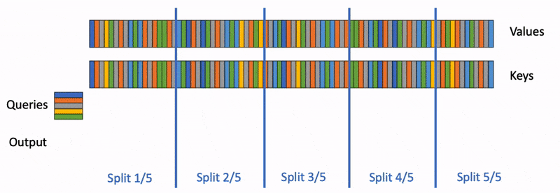
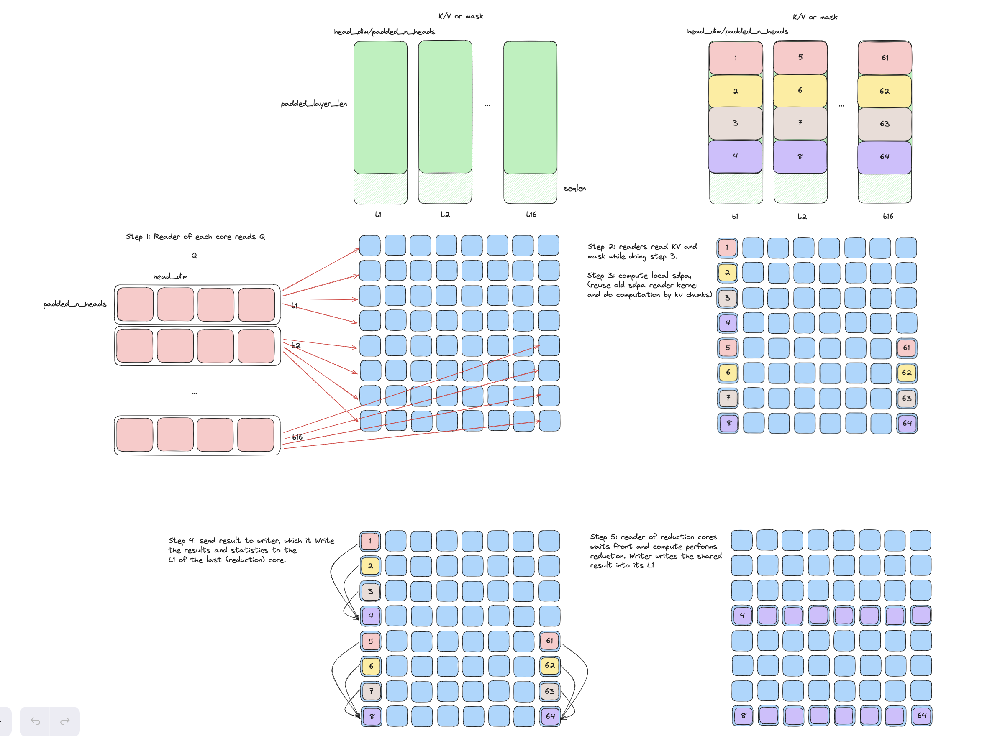
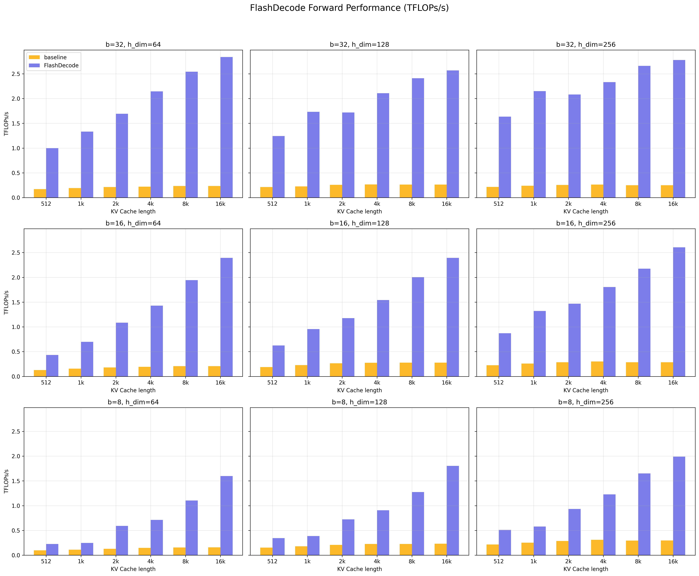
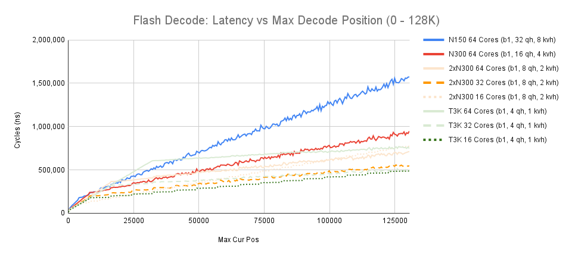

# FlashDecode on Tenstorrent's Wormhole Architecture

Author: Jack (Xun) Cai

## 1 Introduction

The FlashDecode kernel is the specialized version of FlashAttention kernels for generative decoding using scaled dot product attention. As a prerequisite, the reader should be familiar with the FlashAttention kernels on Tenstorrent's Wormhole architecture. The [FlashAttention Guide](https://github.com/tenstorrent/tt-metal/blob/main/tech_reports/FlashAttention/FlashAttention.md) provides a great summary of FlashAttention kernel and how it is implemented.

### 1.1 Common Terminology
| Term | Description |
| --- | --- |
| (w,z,y,x) | The 4 dimensions of a TT-NN tensor |
| bsz | batch size |
| cur_pos/cur_pos_tensor | list/tensor of current decoding position for each batch |
| kv_len | length of the KV cache |
| seqlen | sequence length |
| head_dim | hidden dimension of Q, K, V |
| n_q_heads | number of heads in Q |
| n_kv_heads | number of heads in K, V |
| n_qh_per_kvh | number of q heads per kv head in GQA, `n_qh_per_kvh = n_q_heads // n_kv_heads` |

### 1.2 Group Query Attention (GQA)
This technical report considers group query attention, which is a general form of attention where the number of heads in the query is not necessarily the same as the number of heads in the keys and values. For multi-head attention (MHA), the number of heads in the query is the same as the number of heads in the keys and values, so treat `n_q_heads = n_kv_heads`. For multi-query attention (MQA), the number of heads in the keys and values is 1, so treat `n_kv_heads = 1`.

## 2 Background

### 2.1 What is KV Cache and How it Can Speed Up Decoding
KV cache is a technique used to store previously computed key and value tensors during autoregressive generation, avoiding redundant computation for tokens that have already been processed. During text generation, new tokens are generated one at a time. At each step, the model needs to compute attention scores between the new token's query and all previous tokens' keys, followed by a weighted sum of their values. Without KV cache, the model would need to recompute the key and value tensors for all previous tokens at each generation step, which is computationally expensive. By caching these tensors, we only need to compute new key and value tensors for the latest generated token and append them to the cache. This optimization significantly reduces the computational cost of generation, changing the time complexity from O(n²) to O(n), where n is the sequence length. The tradeoff is increased memory usage to store the cache, but this is generally worthwhile given the substantial speedup in generation time.

### 2.2 How to Smartly Utilize Tenstorrent's Tile-based Architecture for Attention Decoding
During decode phase, the sequence length of the query is 1, and the attention is parallelized over the batch and head dimensions. This results in attention on a small query with a large KV cache. In vanilla PyTorch, attention is implemented as follows:
```python
# query: [bsz, num_q_heads, seqlen=1, head_dim]
# k_cache: [bsz, num_kv_heads, kv_len, head_dim]
# v_cache: [bsz, num_kv_heads, kv_len, head_dim]
attention_output = torch.scaled_dot_product_attention(query, key, value, is_causal=True)
```
Computation and memory granularity on Tenstorrent's chip is a tile of size 32x32. A 4D TT-NN tensor with dimensions (w,z,y,x) will occupy `w*z*(ceil(y/32))*(ceil(x/32))` tiles on the chip. In the case of attention decode, the seqlen on the `y` dimension of the query tensor is always 1, which will be padded to 32. As a result, vanilla attention does not take advantage of the tile-based architecture.

Instead, we put the heads into the `y` dimension for the query tensor to parallelize over the heads. In addition, we pass in the current decoding position into the kernel for causal decoding, removing the need for an explicit mask, which reduces the memory cost.
```python
# query: [1, bsz, num_q_heads, head_dim]
# k_cache: [bsz, num_kv_heads, kv_len, head_dim]
# v_cache: [bsz, num_kv_heads, kv_len, head_dim]
tt_attention_output = ttnn.transformer.scaled_dot_product_attention_decode(query, key, value, is_causal=True, cur_pos=cur_pos)
```

The following PyTorch code is the equivalent implementation of the above TT-NN kernel in terms of correctness. We parallelize over `bsz*n_kv_heads` across cores, and `n_qh_per_kvh` within a core by taking advantage of the tile layout.

```python
n_groups = num_q_heads//num_kv_heads
# query: [1, bsz, num_q_heads, head_dim]
# k_cache: [bsz, num_kv_heads, kv_len, head_dim]
# v_cache: [bsz, num_kv_heads, kv_len, head_dim]
# causal_mask: [1, bsz, num_q_heads, kv_len]
query = query.view(1, bsz*n_kv_heads, n_qh_per_kvh, head_dim)
k_cache = k_cache.view(1, bsz*n_kv_heads, kv_len, head_dim)
v_cache = v_cache.view(1, bsz*n_kv_heads, kv_len, head_dim)
causal_mask = causal_mask.view(1, bsz*n_kv_heads, n_qh_per_kvh, kv_len)
attn_matrix = query @ k_cache.transpose(-2, -1)*scale # [1, bsz*n_kv_heads, n_qh_per_kvh, kv_len]
attn_weights = torch.softmax(attn_matrix+causal_mask, dim=-1)
attn_output = attn_weights @ v_cache # [1, bsz*n_kv_heads, n_qh_per_kvh, head_dim]
attn_output = attn_output.view(1, bsz, num_q_heads, head_dim)
```

### 2.3 FlashDecode
Just like FlashAttention, we can fuse the above PyTorch code and perform attention by chunks to use Tenstorrent's high bandwidth L1 memory. However, unlike FlashAttention, our input shape is different with query heads in the `y` dimension. Additionally, we often encounter cases where there are more available cores than works. One example is in Llama 3.1 70B on 8 devices, where each device performs MQA with 1 kv_head. Using a batch size of 16, there are `16*1` works in total, but 64 cores available. In this case, FlashDecode can be particularly useful by allowing multiple cores to work on a single kv_head. This is achieved by splitting the kv_cache into groups, where each group is assigned to a core. A reduction step is applied at the end to combine the results from each core. Tri Dao et al., who proposed the FlashDecode [1] technique, provides a great visualization which we include below:



*Figure 1: FlashDecode parallelization scheme. Multiple cores can work on a single kv_head by splitting the kv_cache into groups. Figure taken from [1].*

## 3 Implementation Details
Our full implementation of FlashDecode can be found [here](https://github.com/tenstorrent/tt-metal/tree/main/ttnn/cpp/ttnn/operations/transformer/sdpa_decode).

### 3.1 Parallelization

We parallelize over `bsz*n_kv_heads` across cores. This parallelization is simple because each batch and kv_head is independent. Suppose we have `n_cores` cores available. We assign `n_cores // (bsz*n_kv_heads)` cores to each batch and kv_head.

**Chunking**

Since query is small, we process the entire query at once. As a result, we only need to set the chunk size of K and V. This is done by setting the `k_chunk_size` parameter, which keys and values share the same value.

**Extreme Cases**

There are two extreme cases:
1. `bsz*n_kv_heads` is larger than `n_cores`. In this case, each core will work on more than one kv_head with the entire kv_cache being assigned to it. As a result, no reduction step is needed and this is equivalent to doing FlashAttention with q_heads in the `y` dimension.
2. `bsz*n_kv_heads` is 1 or a very small number. In this case, one work is assigned to many cores. This can lead to a new bottleneck from noc traffic, where the reduction step takes more time than compute. We show this phenomenon in the performance analysis section. To mitigate this, we limit the maximum number of cores assigned to one work to 16. `max_cores_per_head_batch` is the parameter that controls this in SDPAProgramConfig.

### 3.2 Step-by-step Visualization of an Average Case
To give the reader a better intuition of how FlashDecode works on TT-Metallium, we visualize an average case with `bsz=16`, `n_kv_heads=1`, `n_q_heads=8` (padded to 32), and `n_cores=64`. The input is read from DRAM, and the output is left in L1.



*Figure 2: Step-by-step visualization of an average case. The input is read from DRAM, and the output is left in L1.*

### 3.3 Asynchronous Execution, NOC, Circular Buffers, and Semaphores
Similar to FlashAttention, we take advantage of Wormhole architecture features with asynchronous data movement and compute to execute the kernel efficiently. Contrary to FlashAttention where each core executes independently, FlashDecode requires cores to coordinate with each other to do reduction. Hence, we use another feature of Wormhole architecture: NOC read/write and semaphores.

In the Wormhole architecture, any L1 memory is a 64-bit address where the first 32 bits indicates the core id. The last 32 bits are the same across all cores, which indicates the local address. When a circular buffer or semaphore is created, it is created on the same local address for all cores. Hence, given distributed work, a communication pattern can be implemented by the following:
```cpp
// given num_workers number of workers
// given this core_type and reducer core noc_x and noc_y
// given 32 bit semaphore_addr created on all cores
// given local work completed at circular buffer cb_out
// given circular buffer to write the gathered result, cb_gather_out, and worker's addr_offset
if (core_type == WORKER) {
    uint64_t reducer_semaphore_addr = get_noc_addr(noc_x, noc_y, semaphore_addr);
    uint64_t reducer_write_addr = get_noc_addr(reduce_core_noc_x, reduce_core_noc_y, get_write_ptr(cb_gather_out)) + addr_offset;
    noc_async_write(get_read_ptr(cb_out), reducer_write_addr, write_size);
    noc_async_write_barrier(); // wait for write to complete
    noc_semaphore_inc(reducer_semaphore_addr, 1); // increment semaphore
} else {
    // else this core is the reducer
    volatile tt_l1_ptr uint32_t* semaphore_addr_ptr = reinterpret_cast<volatile tt_l1_ptr uint32_t*>(semaphore_addr);
    noc_semaphore_wait(semaphore_addr_ptr, num_workers); // wait for semaphore to reach num_workers
    // Do reduction ...
}
```

Overall, the kernel pseudocode is similar to FlashAttention, but with only a single Q chunk and an reduction step at the end. The complete reader, writer, and compute kernels are be found [here](https://github.com/tenstorrent/tt-metal/tree/main/ttnn/cpp/ttnn/operations/transformer/sdpa_decode/device/kernels).

### 3.4 Causal vs. Non-causal
In the final part of the implementation details, we will discuss the role of `cur_pos`, `cur_pos_tensor`, and `attn_mask` in the kernel.

**Causal mode**
In causal mode, each batch's query attends to all previous tokens up to the current decoding position. Since each batch is independent, each core only needs to read the previous tokens from the KV cache rather than reading the entire cache. This is accomplished by passing the `cur_pos` list, which contains the current decoding position for each batch, into the kernel. Alternatively, the `cur_pos_tensor` can be passed in as a row-major TT-NN tensor. This optimization eliminates the need for an explicit mask and avoids redundant computation. An example of causal mode flash decode can be found in the [Llama 3 attention module](https://github.com/tenstorrent/tt-metal/blob/main/models/tt_transformers/tt/test_attention.py).

**Non-causal mode**
In non-causal mode, the query does not necessarily attend to all previous tokens. Users can pass in an arbitrary attention mask up to `kv_len`. Attention is computed on the entire length of KV cache, and the mask is applied to the attention scores. A use case for non-causal attention is in vision-language models, where cross attention is applied in the decode phase on the entire input image with arbitrary masking. An example of non-causal mode flash decode can be found in the [Llama 3 cross attention module](https://github.com/tenstorrent/tt-metal/blob/main/models/tt_transformers/tt/multimodal/llama_cross_attention.py).

## 4 Performance Analysis

### 4.1 Generic Performance

We followed the same practice as in FlashAttention and measured TFLOPs/s for FlashDecode, with slight modification that we always compute the full attention up to the `kv_len` length, and the `seqlen` for the query is always 1. Therefore, the following FLOP formula is used:
```
FLOPs/s = 4 · bsz · kv_len · head_dim · n_q_heads / kernel_runtime
```
In general, FlashDecode is an memory bound operation. So in addition to FLOPs/s we also report the memory bandwidth utilization in GB/s. As a coarse estimate, we only consider the size of the KV cache, therefore the actually memory bandwidth utilization should be even higher than the number reported. The following formula is used to calculate the memory bandwidth utilization (in bytes per second, assuming BFP8 kv cache):
```
Bytes/s = 2 · bsz · head_dim · n_kv_heads · kv_len / kernel_runtime
```

We compare our implementation up to 16K sequence length with the baseline softmax attention implementation on TTNN, with input/output data in DRAM. Beyond 16K sequence length, the baseline implementation is not feasible due to the memory bandwidth limitation. We set up the experiment as follows:
- BFLOAT16 query and BFP8 KV cache
- batch size = 8, 16, 32
- sequence length = 128k
- head_dim = 64, 128, 256
- n_kv_heads = 1
- n_q_heads = 8



*Figure 3: FlashDecode performance in Compute (TFLOPs/s) as head dim, batch size, and kv cache length varies.*


*Figure 4: FlashDecode performance in Memory (GB/s) as head dim, batch size, and kv cache length varies.*

The FlashDecode op is on average 2-10x faster than the baseline implementation. Compared to FlashAttention, FlashDecode has lower speedup in terms of TFLOPs/s. This is expected because FlashDecode is an memory bound operation. On the other hand, FlashDecode achieved up to 180 Gb/s memory bandwidth utilization. The maximum observed memory bandwidth on Wormhole architecture is 250 Gb/s, so FlashDecode is hitting ~70% of that. Aside from memory and compute, another bottleneck is the noc traffic. We will discuss this in the next section.

### 4.2 Long Context Length Performance on Llama 3.1 8B, Tensor Parallelism on 1,2,4,8 Devices

We further evaluate FlashDecode performance on long context length up to 128K sequence length. In this experiment, we use the shape of Llama 3.1 8B model, and measure the performance with attention heads split across 1,2,4,8 devices. The configuration is as follows:
- batch size = 1
- head_dim = 128
- N150 (1 device): n_q_heads = 32, n_kv_heads = 8
- N300 (2 devices): n_q_heads = 16, n_kv_heads = 4
- 2xN300 (4 devices): n_q_heads = 8, n_kv_heads = 2
- T3K (8 devices): n_q_heads = 4, n_kv_heads = 1

In addition, we vary the maximum number of cores used for 2xN300 and T3K to observe the impact of noc traffic.



*Figure 5: FlashDecode performance on Llama 3.1 8B with tensor parallelism on 1,2,4,8 devices, running at 1 GHz (1 cycle = 1 ns).*

As demonstrated, the performance is linear in terms of maximum context length, with two different slopes. This is expected because the attention operation is linear in terms of sequence length. The first, steeper slope is before the maximum number of cores are utilized, where the noc traffic dominates the overall runtime. The second slope is when the maximum number of cores are utilized, where the memory bandwidth dominates. This impact is most significant for T3K shape, where all cores work on the same kv_head. In this case, using all 64 cores for flash decode is suboptimal, and best performance is achieved when using 16 cores. The `max_cores_per_head_batch` parameter in SDPAProgramConfig can be used to control the maximum number of cores assigned to each kv_head, thereby mitigating the impact of noc traffic. Despite using less cores, flash decode can still benefit from tensor parallelism, as higher memory bandwidth can be achieved on more devices.

## 5 Future work
The future works outlined in the FlashAttention technical report share the same optimizations for FlashDecode. In addition, a great next step is to support small sequence length decoding, e.g. seqlen=4 or 8. Having this support would be useful for applications such as speculative decoding, where draft tokens are fed into the model for verification. Currently, the kernel supports a `share_cache` feature, which allows multiple batches to share the same KV cache. This is effectively doing decode with multiple sequence length by putting the seqlen into the batch dimension. To support generic small sequence length decode with multiple batches, however, requires a more sophisticated implementation.

## References

[1] Tri Dao, Daniel Haziza, Francisco Massa, and Grigory Sizov. "Flash-Decoding for long-context inference." Stanford CRFM Blog, October 12, 2023. https://crfm.stanford.edu/2023/10/12/flashdecoding.html
