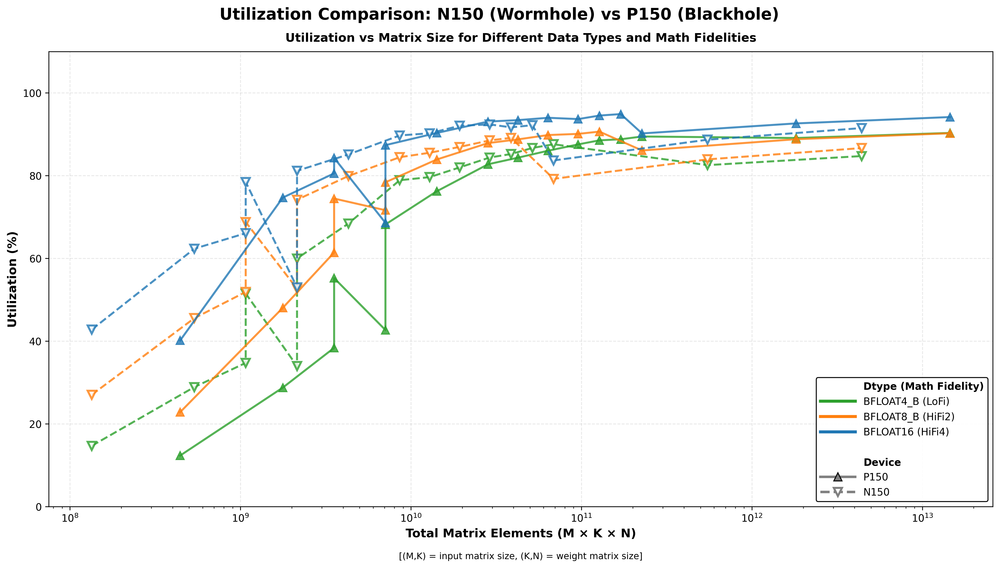
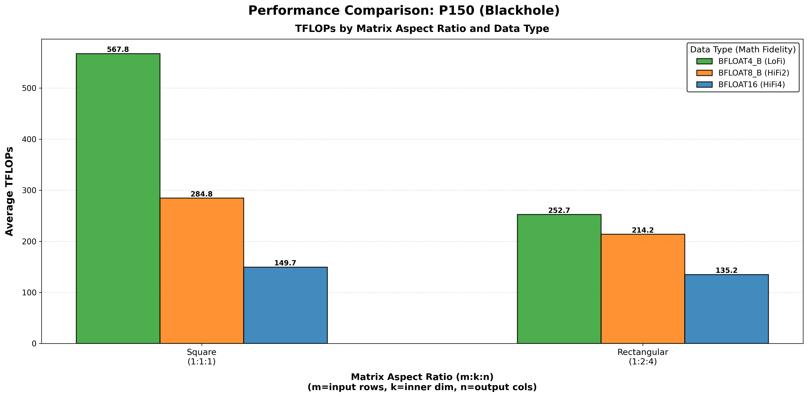
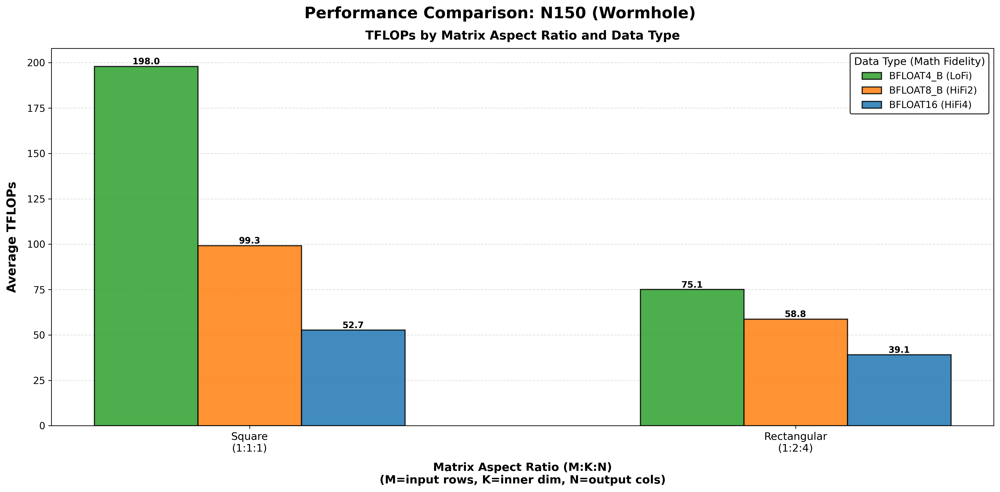

# Matrix Multiply FLOPS


## Introduction

Across many families of neural networks and applications, the common denominator is the use of the generalized matrix multiply operation. Depending on the size and the precision of the input and output matrices, different underlying effects, and more importantly performance metrics, can be observed. Classically, this comes down to the hardware's ability to execute an operation, and its ability to fetch the data for that operation intercept.

If the data is small and already in registers, the cost to operate on that data is negligible. If the data is in cache, performance is dictated by how quickly the data can be funnelled through caches to the compute units. In the worst case scenarios, the data needed is in device memory, host memory, or stored on a disk.

Thankfully, matrix multiplication requires more compute operations (2N^3) than memory operations (3N^2). As such, for a given device, there will always be points at which a device is limited by the underlying compute units, not the underlying memory system. We call this point the roofline.
However, said inversion point depends on the size and crossover point of each cache level/memory technology and the datatype in use. The amount of 8 bit elements that can be moved per unit time is nearly an order of magnitude more than 64 bit elements.

Therefore, the peak achieved flops changes based on the datatype, the size of the data, and the layout of the data.

### Running Benchmarks

The matrix multiply TFLOPS results can be tested on any Wormhole or Blackhole card using:

**For manually selected matmul configurations (best performance):**
```bash
TT_METAL_PROFILER_MID_RUN_DUMP=1 TT_METAL_DEVICE_PROFILER=1 pytest tests/ttnn/unit_tests/benchmarks/test_benchmark.py::test_matmul_2d_host_perf
```

**For out-of-box matmul configurations (default settings):**
```bash
TT_METAL_PROFILER_MID_RUN_DUMP=1 TT_METAL_DEVICE_PROFILER=1 pytest tests/ttnn/unit_tests/benchmarks/test_benchmark.py::test_matmul_2d_host_perf_out_of_box
```

Alternatively, to test on an N300 card, use ```WH_ARCH_YAML=wormhole_b0_80_arch_eth_dispatch.yaml``` before each command.
Python scripts for reproducing the plots are included in this directory.

## Design of Experiments
The parameters of interest are 3 fold:
1. **Dimensions**: The sizes of the matrices along each axis, denoted as M, K, and N. (M, K) represents the size of the input tensor, while (K, N) is the size of the weight matrix.
Larger tensors require more computation since the number of operations needed to perform matrix multiplication increases as O(MKN).
2. **Computation Fidelity**: Referred to as LoFi, HiFi2, HiFi3, and HiFi4. Internally, the matrix engine can adjust the number of bits being processed, which affects both the precision of the results and the computation speed.
3. **Input/Output Datatype**: Larger datatypes require more memory for storage. As a result, more precise datatypes can become bottlenecked if stored in DRAM.

For more details please refer to the tech reports [Matrix Engine](../matrix_engine/matrix_engine.md) and [Data Formats](../data_formats/data_formats.md)

For example, when changing the precision of the matrix, for a given size of matrix the output performance is expected to be different.


## MicroBenchmarks

### Matrix Multiplication TFLOPS on Wormhole/Blackhole (WH/BH)

The WH matrix engine performs 8x16 x 16x16 = 8x16 in a single cycle.
- This is 2*8\*16\*16 = 4096 multiply-adds in a single cycle.
- At 1GHz, this is 4 TFLOPS per matrix engine.
- The 8x16 is the smallest matrix that can be fed into in0, and 16x16 is the smallest matrix that can be fed into in1.

If the input matrices fed into the engine are "shorter" than 8x16, for example 1x16, the engine will still perform 8x16 x 16x16 = 8x16, but the effective throughput will be 1/8.
Thus, for 1x16 x 16x16 matrices, the effective throughput is 0.5 TFLOPS per matrix engine.

MATH_FIDELITY is used for higher precision, and TFLOPS are calculated by dividing by the MATH_FIDELITY value.
- LoFi ->  ~4 TFLOPS
- HiFi2 -> ~2 TFLOPS
- HiFi3 -> ~1.33 TFLOPS
- HiFi4 -> ~1 TFLOPS

### Manually Tuned Performance
Here we show the peak results we can get from manually selected matmul configurations, including packer L1 enablement, math fidelity, input/output sharding, and input/output L1/DRAM selection.
#### Peak FLOPS

Depending on the fidelity, datatype, and matrix shape chosen, different peak teraflop values can be achieved.

Below are the results generated from running the benchmark script, showcasing the performance of matrix multiplication (matmul) operations using matrices of sizes ranging from 512x512x512 / 640x832x832 to 16384x16384x16384 / 20480x26624x26624 . The results include evaluations across various data formats, paired with different levels of math fidelity (BFLOAT16 (HiFi4),  BFLOAT8_B (HiFi2), and BFLOAT4_B (LoFi)).

We also show the results with and without trace (see [AdvancedPerformanceOptimizationsForModels](../AdvancedPerformanceOptimizationsForModels/AdvancedPerformanceOptimizationsForModels.md) for details of trace). With trace, we can minimize the overhead of host which can reflect the actual device performance better.


Finally, we present the results in terms of device time, device throughput in TFLOPS, device utilization compared to the full grid size (8×8 in Wormhole and 13x10 in Blackhole).


As seen below, while Wormhole cards can perform matrix multiplications at around 190 TFLOPs, Blackhole cards have even more impressive throughput at 580 TFLOPs. Lower fidelity computations with less precise datatypes complete faster than "full fidelity" computations. BFLOAT8_B (HiFi2) is roughly **1.5x to 1.8x faster** than BFLOAT16 (HiFi4), with BFLOAT4_B (LoFi) coming in at **2x to 3.5x** faster without tracing.


#### Performance scatter plot across all matrix sizes and configurations


#### Performance bar plot across all matrix sizes and configurations
Note : Performance multipliers are calculated relative to N150 BFLOAT16 (HiFi4) as the baseline (1.00×) for each matrix size, showing how much faster or slower each configuration performs compared to that baseline.


### Utilization

#### Utilization derivation formula

```
Utilization = ideal cycles / actual cycles.
Ideal cycles = (M x K x N) / (tile_height * tile_width * tile_height) * (cycle_per_tile / num_cores)
```
- Cycle_per_tile is the ideal compute cycle for each tile, which depends on math fidelity (LoFi: 16, HiFi2: 32, HiFi3: 48, HiFi4: 64).
- For utilization of full grid size, num_cores is the maximum number of cores available for compute. Currently the max for Wormhole is 8x8 with Blackhole supporting up to 13x10.

#### Utilization plot across all matrix sizes and configurations, based on the chip TFLOPS calculated per each Math Fidelity


Blackhole (P150) achieves excellent utilization across the board, with peak utilization reaching 96% and 61% of configurations exceeding 80% utilization. This represents a significant improvement over Wormhole (N150), which peaks at ~93% with only 32% of configurations above 80%.

### Understanding Device Scaling: SRAM vs DRAM

When a Tensix core executes an operation, it reads data from SRAM, forwards it to a register, performs the computation, and then writes the result back to SRAM. Each Tensix core on a WH ASIC has approximately 1.5MB of SRAM. When data fits within this SRAM, each Tensix can operate without contention. However, some problems require more working memory than SRAM can provide. In these cases, the Tensix core will instead map data to device memory or DRAM. Accessing data from DRAM is slower than SRAM, both in terms of bandwidth and latency.

In this report, the developed Python scripts evaluate three separate configurations:
1. All matrices stored on L1 (SRAM)
2. One matrix on L1 and one on DRAM
3. Both matrices on DRAM

In most cases, storing all matrices on L1 is ideal, as it completely avoids accessing the slower DRAM. The configuration with one matrix on L1 and one on DRAM incurs a small performance penalty, typically in the single-digit percentage range at worst. DRAM-only performance is highly variable: small matrices suffer the largest performance penalty when stored in DRAM, while larger tensors achieve performance closer to an L1-only configuration.

### Tracing

Tracing in the TT-Metallium stack is a performance optimization that records commands for dispatching operations into the DRAM buffer and replays them later for execution, removing host overhead of dispatching operations during a loop iteration.

#### Tracing on P150


#### Tracing on N150


As shown here, on both Wormhole and Blackhole, Trace helps recover more lost performance on smaller tensor matrix multiplications compared to larger ones. This is likely because smaller matrix operations take less time to execute than larger ones, meaning that host overhead is, percentage-wise, more harmful to overall runtime and maximum throughput compared to larger tensors.


### Rectangular Matrix

Both architectures perform most ideally when the input tensors are closest to square shapes, but they still perform well on rectangular matrices. However, as the tensors become more rectangular, performance takes a larger hit.

#### Rectangular Matrix on P150



#### Rectangular Matrix on N150




#### Out of Box Performance
We also show the peak results we can get based on auto-selected matmul configurations.
On both Wormhole and Blackhole, hand-tuned configs helps recover more lost performance on smaller tensor matrix multiplications compared to larger ones. Similar to tracing, the configuration matters more for smaller tensors, as it is harder to saturate the core grid with smaller workloads compared to larger ones.


<details>
<summary><strong>N150 Out of Box Results</strong> (click to expand)</summary>

| M | K | N | Use Trace | Grid Size | In0 Storage Type | In1 Storage Type | Out Storage Type | Dtype | Math Fidelity | Inference Time Avg [ns] | TFLOPs (avg) | Host Based Utilization[%] (vs user selected grid 8x8) | Host Based Utilization[%] (vs full available grid 8x8) | Device Based Utilization[%] (vs user selected grid 8x8) | Device Based Utilization[%] (vs full available grid 8x8) |
| --- | --- | --- | --- | --- | --- | --- | --- | --- | --- | --- | --- | --- | --- | --- | --- |
| 512 | 512 | 512 | False | (8, 8) | DRAM | DRAM | DRAM | DataType.BFLOAT16 | MathFidelity.HiFi4 | 55973.53 | 4.80 | 7.32 | 7.32 | 37.06 | 37.06 |
| 512 | 1024 | 1024 | False | (8, 8) | DRAM | DRAM | DRAM | DataType.BFLOAT16 | MathFidelity.HiFi4 | 121200.08 | 8.86 | 13.52 | 13.52 | 17.98 | 17.98 |
| 512 | 1024 | 2048 | False | (8, 8) | DRAM | DRAM | DRAM | DataType.BFLOAT16 | MathFidelity.HiFi4 | 145208.84 | 14.79 | 22.57 | 22.57 | 33.44 | 33.44 |
| 1024 | 1024 | 1024 | False | (8, 8) | DRAM | DRAM | DRAM | DataType.BFLOAT16 | MathFidelity.HiFi4 | 74584.48 | 28.79 | 43.93 | 43.93 | 82.97 | 82.97 |
| 1024 | 1024 | 2048 | False | (8, 8) | DRAM | DRAM | DRAM | DataType.BFLOAT16 | MathFidelity.HiFi4 | 119950.77 | 35.81 | 54.64 | 54.64 | 111.96 | 111.96 |
| 1024 | 2048 | 2048 | False | (8, 8) | DRAM | DRAM | DRAM | DataType.BFLOAT16 | MathFidelity.HiFi4 | 166697.50 | 51.53 | 78.63 | 78.63 | 120.95 | 120.95 |
| 2048 | 2048 | 2048 | False | (8, 8) | DRAM | DRAM | DRAM | DataType.BFLOAT16 | MathFidelity.HiFi4 | 302381.52 | 56.82 | 86.69 | 86.69 | 133.31 | 133.31 |
| 2048 | 2048 | 3072 | False | (8, 8) | DRAM | DRAM | DRAM | DataType.BFLOAT16 | MathFidelity.HiFi4 | 454194.55 | 56.74 | 86.57 | 86.57 | 140.08 | 140.08 |
| 2048 | 3072 | 3072 | False | (8, 8) | DRAM | DRAM | DRAM | DataType.BFLOAT16 | MathFidelity.HiFi4 | 582509.04 | 66.36 | 101.26 | 101.26 | 142.65 | 142.65 |
| 3072 | 3072 | 3072 | False | (8, 8) | DRAM | DRAM | DRAM | DataType.BFLOAT16 | MathFidelity.HiFi4 | 886585.71 | 65.40 | 99.79 | 99.79 | 116.96 | 116.96 |
| 3072 | 3072 | 4096 | False | (8, 8) | DRAM | DRAM | DRAM | DataType.BFLOAT16 | MathFidelity.HiFi4 | 1148452.76 | 67.32 | 102.72 | 102.72 | 122.27 | 122.27 |
| 3072 | 4096 | 4096 | False | (8, 8) | DRAM | DRAM | DRAM | DataType.BFLOAT16 | MathFidelity.HiFi4 | 1455891.13 | 70.80 | 108.03 | 108.03 | 119.31 | 119.31 |
| 4096 | 4096 | 4096 | False | (8, 8) | DRAM | DRAM | DRAM | DataType.BFLOAT16 | MathFidelity.HiFi4 | 1993181.71 | 68.95 | 105.22 | 105.22 | 120.67 | 120.67 |
| 512 | 512 | 512 | True | (8, 8) | DRAM | DRAM | DRAM | DataType.BFLOAT16 | MathFidelity.HiFi4 | 20344.26 | 13.19 | 20.13 | 20.13 | 35.32 | 35.32 |
| 512 | 1024 | 1024 | True | (8, 8) | DRAM | DRAM | DRAM | DataType.BFLOAT16 | MathFidelity.HiFi4 | 116643.91 | 9.21 | 14.05 | 14.05 | 17.98 | 17.98 |
| 512 | 1024 | 2048 | True | (8, 8) | DRAM | DRAM | DRAM | DataType.BFLOAT16 | MathFidelity.HiFi4 | 142023.56 | 15.12 | 23.07 | 23.07 | 33.42 | 33.42 |
| 1024 | 1024 | 1024 | True | (8, 8) | DRAM | DRAM | DRAM | DataType.BFLOAT16 | MathFidelity.HiFi4 | 70252.42 | 30.57 | 46.64 | 46.64 | 82.77 | 82.77 |
| 1024 | 1024 | 2048 | True | (8, 8) | DRAM | DRAM | DRAM | DataType.BFLOAT16 | MathFidelity.HiFi4 | 114989.28 | 37.35 | 56.99 | 56.99 | 111.61 | 111.61 |
| 1024 | 2048 | 2048 | True | (8, 8) | DRAM | DRAM | DRAM | DataType.BFLOAT16 | MathFidelity.HiFi4 | 162110.33 | 52.99 | 80.85 | 80.85 | 120.68 | 120.68 |
| 2048 | 2048 | 2048 | True | (8, 8) | DRAM | DRAM | DRAM | DataType.BFLOAT16 | MathFidelity.HiFi4 | 299358.37 | 57.39 | 87.57 | 87.57 | 133.28 | 133.28 |
| 2048 | 2048 | 3072 | True | (8, 8) | DRAM | DRAM | DRAM | DataType.BFLOAT16 | MathFidelity.HiFi4 | 451588.63 | 57.06 | 87.07 | 87.07 | 140.00 | 140.00 |
| 2048 | 3072 | 3072 | True | (8, 8) | DRAM | DRAM | DRAM | DataType.BFLOAT16 | MathFidelity.HiFi4 | 576858.52 | 67.01 | 102.25 | 102.25 | 142.65 | 142.65 |
| 3072 | 3072 | 3072 | True | (8, 8) | DRAM | DRAM | DRAM | DataType.BFLOAT16 | MathFidelity.HiFi4 | 880234.24 | 65.87 | 100.51 | 100.51 | 116.99 | 116.99 |
| 3072 | 3072 | 4096 | True | (8, 8) | DRAM | DRAM | DRAM | DataType.BFLOAT16 | MathFidelity.HiFi4 | 1141150.00 | 67.75 | 103.37 | 103.37 | 122.26 | 122.26 |
| 3072 | 4096 | 4096 | True | (8, 8) | DRAM | DRAM | DRAM | DataType.BFLOAT16 | MathFidelity.HiFi4 | 1453046.80 | 70.94 | 108.25 | 108.25 | 119.37 | 119.37 |
| 4096 | 4096 | 4096 | True | (8, 8) | DRAM | DRAM | DRAM | DataType.BFLOAT16 | MathFidelity.HiFi4 | 1996965.41 | 68.82 | 105.02 | 105.02 | 120.68 | 120.68 |
| 512 | 512 | 512 | False | (8, 8) | DRAM | DRAM | DRAM | DataType.BFLOAT8_B | MathFidelity.HiFi2 | 54650.31 | 4.91 | 3.75 | 3.75 | 24.22 | 24.22 |
| 512 | 1024 | 1024 | False | (8, 8) | DRAM | DRAM | DRAM | DataType.BFLOAT8_B | MathFidelity.HiFi2 | 78711.51 | 13.64 | 10.41 | 10.41 | 13.54 | 13.54 |
| 512 | 1024 | 2048 | False | (8, 8) | DRAM | DRAM | DRAM | DataType.BFLOAT8_B | MathFidelity.HiFi2 | 92694.76 | 23.17 | 17.68 | 17.68 | 26.07 | 26.07 |
| 1024 | 1024 | 1024 | False | (8, 8) | DRAM | DRAM | DRAM | DataType.BFLOAT8_B | MathFidelity.HiFi2 | 55363.18 | 38.79 | 29.59 | 29.59 | 66.63 | 66.63 |
| 1024 | 1024 | 2048 | False | (8, 8) | DRAM | DRAM | DRAM | DataType.BFLOAT8_B | MathFidelity.HiFi2 | 74808.60 | 57.41 | 43.80 | 43.80 | 86.65 | 86.65 |
| 1024 | 2048 | 2048 | False | (8, 8) | DRAM | DRAM | DRAM | DataType.BFLOAT8_B | MathFidelity.HiFi2 | 101757.05 | 84.42 | 64.40 | 64.40 | 99.64 | 99.64 |
| 2048 | 2048 | 2048 | False | (8, 8) | DRAM | DRAM | DRAM | DataType.BFLOAT8_B | MathFidelity.HiFi2 | 161459.45 | 106.40 | 81.18 | 81.18 | 127.04 | 127.04 |
| 2048 | 2048 | 3072 | False | (8, 8) | DRAM | DRAM | DRAM | DataType.BFLOAT8_B | MathFidelity.HiFi2 | 241677.76 | 106.63 | 81.35 | 81.35 | 133.83 | 133.83 |
| 2048 | 3072 | 3072 | False | (8, 8) | DRAM | DRAM | DRAM | DataType.BFLOAT8_B | MathFidelity.HiFi2 | 304355.62 | 127.01 | 96.90 | 96.90 | 138.57 | 138.57 |
| 3072 | 3072 | 3072 | False | (8, 8) | DRAM | DRAM | DRAM | DataType.BFLOAT8_B | MathFidelity.HiFi2 | 442688.47 | 130.98 | 99.93 | 99.93 | 139.77 | 139.77 |
| 3072 | 3072 | 4096 | False | (8, 8) | DRAM | DRAM | DRAM | DataType.BFLOAT8_B | MathFidelity.HiFi2 | 581233.50 | 133.01 | 101.48 | 101.48 | 143.41 | 143.41 |
| 3072 | 4096 | 4096 | False | (8, 8) | DRAM | DRAM | DRAM | DataType.BFLOAT8_B | MathFidelity.HiFi2 | 735058.78 | 140.23 | 106.99 | 106.99 | 124.98 | 124.98 |
| 4096 | 4096 | 4096 | False | (8, 8) | DRAM | DRAM | DRAM | DataType.BFLOAT8_B | MathFidelity.HiFi2 | 941264.63 | 146.02 | 111.40 | 111.40 | 128.27 | 128.27 |
| 512 | 512 | 512 | True | (8, 8) | DRAM | DRAM | DRAM | DataType.BFLOAT8_B | MathFidelity.HiFi2 | 15096.66 | 17.78 | 13.57 | 13.57 | 22.03 | 22.03 |
| 512 | 1024 | 1024 | True | (8, 8) | DRAM | DRAM | DRAM | DataType.BFLOAT8_B | MathFidelity.HiFi2 | 76015.00 | 14.13 | 10.78 | 10.78 | 13.53 | 13.53 |
| 512 | 1024 | 2048 | True | (8, 8) | DRAM | DRAM | DRAM | DataType.BFLOAT8_B | MathFidelity.HiFi2 | 87964.53 | 24.41 | 18.63 | 18.63 | 26.10 | 26.10 |
| 1024 | 1024 | 1024 | True | (8, 8) | DRAM | DRAM | DRAM | DataType.BFLOAT8_B | MathFidelity.HiFi2 | 42505.26 | 50.52 | 38.55 | 38.55 | 66.15 | 66.15 |
| 1024 | 1024 | 2048 | True | (8, 8) | DRAM | DRAM | DRAM | DataType.BFLOAT8_B | MathFidelity.HiFi2 | 69255.83 | 62.02 | 47.31 | 47.31 | 85.42 | 85.42 |
| 1024 | 2048 | 2048 | True | (8, 8) | DRAM | DRAM | DRAM | DataType.BFLOAT8_B | MathFidelity.HiFi2 | 95026.49 | 90.40 | 68.97 | 68.97 | 98.88 | 98.88 |
| 2048 | 2048 | 2048 | True | (8, 8) | DRAM | DRAM | DRAM | DataType.BFLOAT8_B | MathFidelity.HiFi2 | 158042.91 | 108.70 | 82.93 | 82.93 | 126.92 | 126.92 |
| 2048 | 2048 | 3072 | True | (8, 8) | DRAM | DRAM | DRAM | DataType.BFLOAT8_B | MathFidelity.HiFi2 | 235555.17 | 109.40 | 83.47 | 83.47 | 133.55 | 133.55 |
| 2048 | 3072 | 3072 | True | (8, 8) | DRAM | DRAM | DRAM | DataType.BFLOAT8_B | MathFidelity.HiFi2 | 300457.48 | 128.65 | 98.15 | 98.15 | 138.61 | 138.61 |
| 3072 | 3072 | 3072 | True | (8, 8) | DRAM | DRAM | DRAM | DataType.BFLOAT8_B | MathFidelity.HiFi2 | 437684.06 | 132.47 | 101.07 | 101.07 | 139.72 | 139.72 |
| 3072 | 3072 | 4096 | True | (8, 8) | DRAM | DRAM | DRAM | DataType.BFLOAT8_B | MathFidelity.HiFi2 | 578484.54 | 133.64 | 101.96 | 101.96 | 143.40 | 143.40 |
| 3072 | 4096 | 4096 | True | (8, 8) | DRAM | DRAM | DRAM | DataType.BFLOAT8_B | MathFidelity.HiFi2 | 732436.18 | 140.73 | 107.37 | 107.37 | 125.07 | 125.07 |
| 4096 | 4096 | 4096 | True | (8, 8) | DRAM | DRAM | DRAM | DataType.BFLOAT8_B | MathFidelity.HiFi2 | 968348.98 | 141.93 | 108.28 | 108.28 | 128.45 | 128.45 |
| 512 | 512 | 512 | False | (8, 8) | DRAM | DRAM | DRAM | DataType.BFLOAT4_B | MathFidelity.LoFi | 55770.87 | 4.81 | 1.84 | 1.84 | 14.30 | 14.30 |
| 512 | 1024 | 1024 | False | (8, 8) | DRAM | DRAM | DRAM | DataType.BFLOAT4_B | MathFidelity.LoFi | 67188.74 | 15.98 | 6.10 | 6.10 | 7.74 | 7.74 |
| 512 | 1024 | 2048 | False | (8, 8) | DRAM | DRAM | DRAM | DataType.BFLOAT4_B | MathFidelity.LoFi | 74532.03 | 28.81 | 10.99 | 10.99 | 15.45 | 15.45 |
| 1024 | 1024 | 1024 | False | (8, 8) | DRAM | DRAM | DRAM | DataType.BFLOAT4_B | MathFidelity.LoFi | 63579.08 | 33.78 | 12.88 | 12.88 | 45.58 | 45.58 |
| 1024 | 1024 | 2048 | False | (8, 8) | DRAM | DRAM | DRAM | DataType.BFLOAT4_B | MathFidelity.LoFi | 56970.12 | 75.39 | 28.76 | 28.76 | 54.62 | 54.62 |
| 1024 | 2048 | 2048 | False | (8, 8) | DRAM | DRAM | DRAM | DataType.BFLOAT4_B | MathFidelity.LoFi | 73502.06 | 116.87 | 44.58 | 44.58 | 61.34 | 61.34 |
| 2048 | 2048 | 2048 | False | (8, 8) | DRAM | DRAM | DRAM | DataType.BFLOAT4_B | MathFidelity.LoFi | 120718.48 | 142.31 | 54.29 | 54.29 | 72.92 | 72.92 |
| 2048 | 2048 | 3072 | False | (8, 8) | DRAM | DRAM | DRAM | DataType.BFLOAT4_B | MathFidelity.LoFi | 185465.81 | 138.95 | 53.00 | 53.00 | 74.90 | 74.90 |
| 2048 | 3072 | 3072 | False | (8, 8) | DRAM | DRAM | DRAM | DataType.BFLOAT4_B | MathFidelity.LoFi | 239021.78 | 161.72 | 61.69 | 61.69 | 77.61 | 77.61 |
| 3072 | 3072 | 3072 | False | (8, 8) | DRAM | DRAM | DRAM | DataType.BFLOAT4_B | MathFidelity.LoFi | 347371.10 | 166.92 | 63.67 | 63.67 | 79.82 | 79.82 |
| 3072 | 3072 | 4096 | False | (8, 8) | DRAM | DRAM | DRAM | DataType.BFLOAT4_B | MathFidelity.LoFi | 442318.92 | 174.78 | 66.67 | 66.67 | 80.19 | 80.19 |
| 3072 | 4096 | 4096 | False | (8, 8) | DRAM | DRAM | DRAM | DataType.BFLOAT4_B | MathFidelity.LoFi | 566976.07 | 181.81 | 69.35 | 69.35 | 81.22 | 81.22 |
| 4096 | 4096 | 4096 | False | (8, 8) | DRAM | DRAM | DRAM | DataType.BFLOAT4_B | MathFidelity.LoFi | 751388.07 | 182.91 | 69.78 | 69.78 | 82.28 | 82.28 |
| 512 | 512 | 512 | True | (8, 8) | DRAM | DRAM | DRAM | DataType.BFLOAT4_B | MathFidelity.LoFi | 14667.51 | 18.30 | 6.98 | 6.98 | 13.65 | 13.65 |
| 512 | 1024 | 1024 | True | (8, 8) | DRAM | DRAM | DRAM | DataType.BFLOAT4_B | MathFidelity.LoFi | 63383.58 | 16.94 | 6.46 | 6.46 | 7.75 | 7.75 |
| 512 | 1024 | 2048 | True | (8, 8) | DRAM | DRAM | DRAM | DataType.BFLOAT4_B | MathFidelity.LoFi | 69246.29 | 31.01 | 11.83 | 11.83 | 15.46 | 15.46 |
| 1024 | 1024 | 1024 | True | (8, 8) | DRAM | DRAM | DRAM | DataType.BFLOAT4_B | MathFidelity.LoFi | 30727.39 | 69.89 | 26.66 | 26.66 | 43.59 | 43.59 |
| 1024 | 1024 | 2048 | True | (8, 8) | DRAM | DRAM | DRAM | DataType.BFLOAT4_B | MathFidelity.LoFi | 46913.62 | 91.55 | 34.92 | 34.92 | 54.00 | 54.00 |
| 1024 | 2048 | 2048 | True | (8, 8) | DRAM | DRAM | DRAM | DataType.BFLOAT4_B | MathFidelity.LoFi | 67462.92 | 127.33 | 48.57 | 48.57 | 61.44 | 61.44 |
| 2048 | 2048 | 2048 | True | (8, 8) | DRAM | DRAM | DRAM | DataType.BFLOAT4_B | MathFidelity.LoFi | 115046.50 | 149.33 | 56.96 | 56.96 | 72.98 | 72.98 |
| 2048 | 2048 | 3072 | True | (8, 8) | DRAM | DRAM | DRAM | DataType.BFLOAT4_B | MathFidelity.LoFi | 174438.95 | 147.73 | 56.35 | 56.35 | 74.93 | 74.93 |
| 2048 | 3072 | 3072 | True | (8, 8) | DRAM | DRAM | DRAM | DataType.BFLOAT4_B | MathFidelity.LoFi | 235798.36 | 163.93 | 62.53 | 62.53 | 77.58 | 77.58 |
| 3072 | 3072 | 3072 | True | (8, 8) | DRAM | DRAM | DRAM | DataType.BFLOAT4_B | MathFidelity.LoFi | 350399.02 | 165.47 | 63.12 | 63.12 | 79.83 | 79.83 |
| 3072 | 3072 | 4096 | True | (8, 8) | DRAM | DRAM | DRAM | DataType.BFLOAT4_B | MathFidelity.LoFi | 439946.65 | 175.72 | 67.03 | 67.03 | 80.16 | 80.16 |
| 3072 | 4096 | 4096 | True | (8, 8) | DRAM | DRAM | DRAM | DataType.BFLOAT4_B | MathFidelity.LoFi | 562393.67 | 183.29 | 69.92 | 69.92 | 81.19 | 81.19 |
| 4096 | 4096 | 4096 | True | (8, 8) | DRAM | DRAM | DRAM | DataType.BFLOAT4_B | MathFidelity.LoFi | 747754.57 | 183.80 | 70.11 | 70.11 | 82.26 | 82.26 |

_All configurations: 78 configurations using default DRAM storage and auto-selected parameters._

</details>

<details>
<summary><strong>P150 Out of Box Results</strong> (click to expand)</summary>

| M | K | N | Use Trace | Grid Size | In0 Storage Type | In1 Storage Type | Out Storage Type | Dtype | Math Fidelity | Inference Time Avg [ns] | TFLOPs (avg) | Host Based Utilization[%] (vs user selected grid 13x10) | Host Based Utilization[%] (vs full available grid 13x10) | Device Based Utilization[%] (vs user selected grid 13x10) | Device Based Utilization[%] (vs full available grid 13x10) |
| --- | --- | --- | --- | --- | --- | --- | --- | --- | --- | --- | --- | --- | --- | --- | --- |
| 640 | 832 | 832 | False | (13, 10) | DRAM | DRAM | DRAM | DataType.BFLOAT16 | MathFidelity.HiFi4 | 19991.40 | 44.32 | 24.66 | 24.66 | 35.32 | 35.32 |
| 640 | 1664 | 1664 | False | (13, 10) | DRAM | DRAM | DRAM | DataType.BFLOAT16 | MathFidelity.HiFi4 | 34759.04 | 101.96 | 56.74 | 56.74 | 76.14 | 76.14 |
| 640 | 1664 | 3328 | False | (13, 10) | DRAM | DRAM | DRAM | DataType.BFLOAT16 | MathFidelity.HiFi4 | 57649.61 | 122.96 | 68.42 | 68.42 | 95.19 | 95.19 |
| 1280 | 1664 | 1664 | False | (13, 10) | DRAM | DRAM | DRAM | DataType.BFLOAT16 | MathFidelity.HiFi4 | 50580.50 | 140.14 | 77.98 | 77.98 | 116.32 | 116.32 |
| 1280 | 1664 | 3328 | False | (13, 10) | DRAM | DRAM | DRAM | DataType.BFLOAT16 | MathFidelity.HiFi4 | 87013.24 | 162.93 | 90.66 | 90.66 | 149.96 | 149.96 |
| 1280 | 3328 | 3328 | False | (13, 10) | DRAM | DRAM | DRAM | DataType.BFLOAT16 | MathFidelity.HiFi4 | 135293.01 | 209.57 | 116.61 | 116.61 | 161.49 | 161.49 |
| 2560 | 3328 | 3328 | False | (13, 10) | DRAM | DRAM | DRAM | DataType.BFLOAT16 | MathFidelity.HiFi4 | 263173.58 | 215.47 | 119.90 | 119.90 | 171.35 | 171.35 |
| 2560 | 3328 | 4992 | False | (13, 10) | DRAM | DRAM | DRAM | DataType.BFLOAT16 | MathFidelity.HiFi4 | 373053.55 | 228.01 | 126.88 | 126.88 | 173.13 | 173.13 |
| 2560 | 4992 | 4992 | False | (13, 10) | DRAM | DRAM | DRAM | DataType.BFLOAT16 | MathFidelity.HiFi4 | 499389.17 | 255.49 | 142.17 | 142.17 | 174.82 | 174.82 |
| 3840 | 4992 | 4992 | False | (13, 10) | DRAM | DRAM | DRAM | DataType.BFLOAT16 | MathFidelity.HiFi4 | 805444.72 | 237.62 | 132.22 | 132.22 | 160.32 | 160.32 |
| 3840 | 4992 | 6656 | False | (13, 10) | DRAM | DRAM | DRAM | DataType.BFLOAT16 | MathFidelity.HiFi4 | 1037194.73 | 246.03 | 136.90 | 136.90 | 161.10 | 161.10 |
| 3840 | 6656 | 6656 | False | (13, 10) | DRAM | DRAM | DRAM | DataType.BFLOAT16 | MathFidelity.HiFi4 | 1422083.38 | 239.26 | 133.13 | 133.13 | 159.78 | 159.78 |
| 5120 | 6656 | 6656 | False | (13, 10) | DRAM | DRAM | DRAM | DataType.BFLOAT16 | MathFidelity.HiFi4 | 1813414.10 | 250.17 | 139.20 | 139.20 | 160.30 | 160.30 |
| 640 | 832 | 832 | True | (13, 10) | DRAM | DRAM | DRAM | DataType.BFLOAT16 | MathFidelity.HiFi4 | 18892.29 | 46.90 | 26.10 | 26.10 | 35.33 | 35.33 |
| 640 | 1664 | 1664 | True | (13, 10) | DRAM | DRAM | DRAM | DataType.BFLOAT16 | MathFidelity.HiFi4 | 34592.15 | 102.46 | 57.01 | 57.01 | 75.98 | 75.98 |
| 640 | 1664 | 3328 | True | (13, 10) | DRAM | DRAM | DRAM | DataType.BFLOAT16 | MathFidelity.HiFi4 | 57380.20 | 123.53 | 68.74 | 68.74 | 95.05 | 95.05 |
| 1280 | 1664 | 1664 | True | (13, 10) | DRAM | DRAM | DRAM | DataType.BFLOAT16 | MathFidelity.HiFi4 | 50432.68 | 140.55 | 78.21 | 78.21 | 116.01 | 116.01 |
| 1280 | 1664 | 3328 | True | (13, 10) | DRAM | DRAM | DRAM | DataType.BFLOAT16 | MathFidelity.HiFi4 | 87151.53 | 162.67 | 90.52 | 90.52 | 149.96 | 149.96 |
| 1280 | 3328 | 3328 | True | (13, 10) | DRAM | DRAM | DRAM | DataType.BFLOAT16 | MathFidelity.HiFi4 | 133812.43 | 211.89 | 117.91 | 117.91 | 161.38 | 161.38 |
| 2560 | 3328 | 3328 | True | (13, 10) | DRAM | DRAM | DRAM | DataType.BFLOAT16 | MathFidelity.HiFi4 | 250968.93 | 225.95 | 125.73 | 125.73 | 171.07 | 171.07 |
| 2560 | 3328 | 4992 | True | (13, 10) | DRAM | DRAM | DRAM | DataType.BFLOAT16 | MathFidelity.HiFi4 | 366170.41 | 232.30 | 129.26 | 129.26 | 173.02 | 173.02 |
| 2560 | 4992 | 4992 | True | (13, 10) | DRAM | DRAM | DRAM | DataType.BFLOAT16 | MathFidelity.HiFi4 | 517077.45 | 246.75 | 137.31 | 137.31 | 174.97 | 174.97 |
| 3840 | 4992 | 4992 | True | (13, 10) | DRAM | DRAM | DRAM | DataType.BFLOAT16 | MathFidelity.HiFi4 | 798819.07 | 239.59 | 133.32 | 133.32 | 160.27 | 160.27 |
| 3840 | 4992 | 6656 | True | (13, 10) | DRAM | DRAM | DRAM | DataType.BFLOAT16 | MathFidelity.HiFi4 | 1019012.93 | 250.42 | 139.35 | 139.35 | 160.98 | 160.98 |
| 3840 | 6656 | 6656 | True | (13, 10) | DRAM | DRAM | DRAM | DataType.BFLOAT16 | MathFidelity.HiFi4 | 1433117.39 | 237.41 | 132.11 | 132.11 | 159.84 | 159.84 |
| 5120 | 6656 | 6656 | True | (13, 10) | DRAM | DRAM | DRAM | DataType.BFLOAT16 | MathFidelity.HiFi4 | 1811723.71 | 250.40 | 139.33 | 139.33 | 160.29 | 160.29 |
| 640 | 832 | 832 | False | (13, 10) | DRAM | DRAM | DRAM | DataType.BFLOAT8_B | MathFidelity.HiFi2 | 15997.89 | 55.39 | 15.41 | 15.41 | 19.97 | 19.97 |
| 640 | 1664 | 1664 | False | (13, 10) | DRAM | DRAM | DRAM | DataType.BFLOAT8_B | MathFidelity.HiFi2 | 26283.26 | 134.85 | 37.52 | 37.52 | 47.66 | 47.66 |
| 640 | 1664 | 3328 | False | (13, 10) | DRAM | DRAM | DRAM | DataType.BFLOAT8_B | MathFidelity.HiFi2 | 40736.20 | 174.01 | 48.41 | 48.41 | 63.69 | 63.69 |
| 1280 | 1664 | 1664 | False | (13, 10) | DRAM | DRAM | DRAM | DataType.BFLOAT8_B | MathFidelity.HiFi2 | 34637.45 | 204.64 | 56.94 | 56.94 | 80.94 | 80.94 |
| 1280 | 1664 | 3328 | False | (13, 10) | DRAM | DRAM | DRAM | DataType.BFLOAT8_B | MathFidelity.HiFi2 | 53198.34 | 266.49 | 74.14 | 74.14 | 114.86 | 114.86 |
| 1280 | 3328 | 3328 | False | (13, 10) | DRAM | DRAM | DRAM | DataType.BFLOAT8_B | MathFidelity.HiFi2 | 79107.28 | 358.42 | 99.72 | 99.72 | 133.36 | 133.36 |
| 2560 | 3328 | 3328 | False | (13, 10) | DRAM | DRAM | DRAM | DataType.BFLOAT8_B | MathFidelity.HiFi2 | 137176.51 | 413.39 | 115.01 | 115.01 | 161.62 | 161.62 |
| 2560 | 3328 | 4992 | False | (13, 10) | DRAM | DRAM | DRAM | DataType.BFLOAT8_B | MathFidelity.HiFi2 | 199761.39 | 425.81 | 118.47 | 118.47 | 165.50 | 165.50 |
| 2560 | 4992 | 4992 | False | (13, 10) | DRAM | DRAM | DRAM | DataType.BFLOAT8_B | MathFidelity.HiFi2 | 274508.00 | 464.80 | 129.32 | 129.32 | 169.59 | 169.59 |
| 3840 | 4992 | 4992 | False | (13, 10) | DRAM | DRAM | DRAM | DataType.BFLOAT8_B | MathFidelity.HiFi2 | 401635.17 | 476.52 | 132.58 | 132.58 | 172.56 | 172.56 |
| 3840 | 4992 | 6656 | False | (13, 10) | DRAM | DRAM | DRAM | DataType.BFLOAT8_B | MathFidelity.HiFi2 | 521671.77 | 489.16 | 136.10 | 136.10 | 173.29 | 173.29 |
| 3840 | 6656 | 6656 | False | (13, 10) | DRAM | DRAM | DRAM | DataType.BFLOAT8_B | MathFidelity.HiFi2 | 695688.72 | 489.07 | 136.07 | 136.07 | 161.34 | 161.34 |
| 5120 | 6656 | 6656 | False | (13, 10) | DRAM | DRAM | DRAM | DataType.BFLOAT8_B | MathFidelity.HiFi2 | 921540.26 | 492.28 | 136.96 | 136.96 | 161.43 | 161.43 |
| 640 | 832 | 832 | True | (13, 10) | DRAM | DRAM | DRAM | DataType.BFLOAT8_B | MathFidelity.HiFi2 | 15497.21 | 57.17 | 15.91 | 15.91 | 19.95 | 19.95 |
| 640 | 1664 | 1664 | True | (13, 10) | DRAM | DRAM | DRAM | DataType.BFLOAT8_B | MathFidelity.HiFi2 | 25835.04 | 137.19 | 38.17 | 38.17 | 47.68 | 47.68 |
| 640 | 1664 | 3328 | True | (13, 10) | DRAM | DRAM | DRAM | DataType.BFLOAT8_B | MathFidelity.HiFi2 | 40481.09 | 175.10 | 48.72 | 48.72 | 63.68 | 63.68 |
| 1280 | 1664 | 1664 | True | (13, 10) | DRAM | DRAM | DRAM | DataType.BFLOAT8_B | MathFidelity.HiFi2 | 34117.70 | 207.76 | 57.80 | 57.80 | 80.92 | 80.92 |
| 1280 | 1664 | 3328 | True | (13, 10) | DRAM | DRAM | DRAM | DataType.BFLOAT8_B | MathFidelity.HiFi2 | 52723.88 | 268.89 | 74.81 | 74.81 | 114.81 | 114.81 |
| 1280 | 3328 | 3328 | True | (13, 10) | DRAM | DRAM | DRAM | DataType.BFLOAT8_B | MathFidelity.HiFi2 | 78487.40 | 361.25 | 100.51 | 100.51 | 133.18 | 133.18 |
| 2560 | 3328 | 3328 | True | (13, 10) | DRAM | DRAM | DRAM | DataType.BFLOAT8_B | MathFidelity.HiFi2 | 133950.71 | 423.34 | 117.78 | 117.78 | 161.51 | 161.51 |
| 2560 | 3328 | 4992 | True | (13, 10) | DRAM | DRAM | DRAM | DataType.BFLOAT8_B | MathFidelity.HiFi2 | 194268.23 | 437.85 | 121.82 | 121.82 | 165.42 | 165.42 |
| 2560 | 4992 | 4992 | True | (13, 10) | DRAM | DRAM | DRAM | DataType.BFLOAT8_B | MathFidelity.HiFi2 | 270254.61 | 472.11 | 131.35 | 131.35 | 169.60 | 169.60 |
| 3840 | 4992 | 4992 | True | (13, 10) | DRAM | DRAM | DRAM | DataType.BFLOAT8_B | MathFidelity.HiFi2 | 396323.20 | 482.90 | 134.35 | 134.35 | 172.57 | 172.57 |
| 3840 | 4992 | 6656 | True | (13, 10) | DRAM | DRAM | DRAM | DataType.BFLOAT8_B | MathFidelity.HiFi2 | 514459.61 | 496.02 | 138.00 | 138.00 | 173.29 | 173.29 |
| 3840 | 6656 | 6656 | True | (13, 10) | DRAM | DRAM | DRAM | DataType.BFLOAT8_B | MathFidelity.HiFi2 | 690090.66 | 493.04 | 137.17 | 137.17 | 161.36 | 161.36 |
| 5120 | 6656 | 6656 | True | (13, 10) | DRAM | DRAM | DRAM | DataType.BFLOAT8_B | MathFidelity.HiFi2 | 931229.59 | 487.16 | 135.54 | 135.54 | 161.48 | 161.48 |
| 640 | 832 | 832 | False | (13, 10) | DRAM | DRAM | DRAM | DataType.BFLOAT4_B | MathFidelity.LoFi | 19850.73 | 44.64 | 6.21 | 6.21 | 10.75 | 10.75 |
| 640 | 1664 | 1664 | False | (13, 10) | DRAM | DRAM | DRAM | DataType.BFLOAT4_B | MathFidelity.LoFi | 25806.43 | 137.34 | 19.11 | 19.11 | 26.28 | 26.28 |
| 640 | 1664 | 3328 | False | (13, 10) | DRAM | DRAM | DRAM | DataType.BFLOAT4_B | MathFidelity.LoFi | 38423.54 | 184.48 | 25.66 | 25.66 | 34.83 | 34.83 |
| 1280 | 1664 | 1664 | False | (13, 10) | DRAM | DRAM | DRAM | DataType.BFLOAT4_B | MathFidelity.LoFi | 30725.00 | 230.70 | 32.09 | 32.09 | 49.45 | 49.45 |
| 1280 | 1664 | 3328 | False | (13, 10) | DRAM | DRAM | DRAM | DataType.BFLOAT4_B | MathFidelity.LoFi | 46062.47 | 307.77 | 42.81 | 42.81 | 64.79 | 64.79 |
| 1280 | 3328 | 3328 | False | (13, 10) | DRAM | DRAM | DRAM | DataType.BFLOAT4_B | MathFidelity.LoFi | 67768.10 | 418.39 | 58.20 | 58.20 | 74.95 | 74.95 |
| 2560 | 3328 | 3328 | False | (13, 10) | DRAM | DRAM | DRAM | DataType.BFLOAT4_B | MathFidelity.LoFi | 120871.07 | 469.15 | 65.26 | 65.26 | 81.62 | 81.62 |
| 2560 | 3328 | 4992 | False | (13, 10) | DRAM | DRAM | DRAM | DataType.BFLOAT4_B | MathFidelity.LoFi | 173549.65 | 490.12 | 68.18 | 68.18 | 83.43 | 83.43 |
| 2560 | 4992 | 4992 | False | (13, 10) | DRAM | DRAM | DRAM | DataType.BFLOAT4_B | MathFidelity.LoFi | 244150.16 | 522.59 | 72.70 | 72.70 | 85.44 | 85.44 |
| 3840 | 4992 | 4992 | False | (13, 10) | DRAM | DRAM | DRAM | DataType.BFLOAT4_B | MathFidelity.LoFi | 358042.72 | 534.53 | 74.36 | 74.36 | 87.15 | 87.15 |
| 3840 | 4992 | 6656 | False | (13, 10) | DRAM | DRAM | DRAM | DataType.BFLOAT4_B | MathFidelity.LoFi | 476706.03 | 535.30 | 74.47 | 74.47 | 87.63 | 87.63 |
| 3840 | 6656 | 6656 | False | (13, 10) | DRAM | DRAM | DRAM | DataType.BFLOAT4_B | MathFidelity.LoFi | 622680.19 | 546.42 | 76.01 | 76.01 | 88.45 | 88.45 |
| 5120 | 6656 | 6656 | False | (13, 10) | DRAM | DRAM | DRAM | DataType.BFLOAT4_B | MathFidelity.LoFi | 820362.57 | 552.99 | 76.93 | 76.93 | 89.14 | 89.14 |
| 640 | 832 | 832 | True | (13, 10) | DRAM | DRAM | DRAM | DataType.BFLOAT4_B | MathFidelity.LoFi | 13802.05 | 64.20 | 8.93 | 8.93 | 10.59 | 10.59 |
| 640 | 1664 | 1664 | True | (13, 10) | DRAM | DRAM | DRAM | DataType.BFLOAT4_B | MathFidelity.LoFi | 21860.60 | 162.13 | 22.55 | 22.55 | 26.26 | 26.26 |
| 640 | 1664 | 3328 | True | (13, 10) | DRAM | DRAM | DRAM | DataType.BFLOAT4_B | MathFidelity.LoFi | 33442.97 | 211.95 | 29.49 | 29.49 | 34.80 | 34.80 |
| 1280 | 1664 | 1664 | True | (13, 10) | DRAM | DRAM | DRAM | DataType.BFLOAT4_B | MathFidelity.LoFi | 25551.32 | 277.42 | 38.59 | 38.59 | 49.44 | 49.44 |
| 1280 | 1664 | 3328 | True | (13, 10) | DRAM | DRAM | DRAM | DataType.BFLOAT4_B | MathFidelity.LoFi | 41031.84 | 345.51 | 48.06 | 48.06 | 64.79 | 64.79 |
| 1280 | 3328 | 3328 | True | (13, 10) | DRAM | DRAM | DRAM | DataType.BFLOAT4_B | MathFidelity.LoFi | 63171.39 | 448.83 | 62.44 | 62.44 | 74.94 | 74.94 |
| 2560 | 3328 | 3328 | True | (13, 10) | DRAM | DRAM | DRAM | DataType.BFLOAT4_B | MathFidelity.LoFi | 117020.61 | 484.59 | 67.41 | 67.41 | 81.61 | 81.61 |
| 2560 | 3328 | 4992 | True | (13, 10) | DRAM | DRAM | DRAM | DataType.BFLOAT4_B | MathFidelity.LoFi | 166406.63 | 511.16 | 71.11 | 71.11 | 83.43 | 83.43 |
| 2560 | 4992 | 4992 | True | (13, 10) | DRAM | DRAM | DRAM | DataType.BFLOAT4_B | MathFidelity.LoFi | 238742.83 | 534.43 | 74.34 | 74.34 | 85.45 | 85.45 |
| 3840 | 4992 | 4992 | True | (13, 10) | DRAM | DRAM | DRAM | DataType.BFLOAT4_B | MathFidelity.LoFi | 355157.85 | 538.88 | 74.96 | 74.96 | 87.15 | 87.15 |
| 3840 | 4992 | 6656 | True | (13, 10) | DRAM | DRAM | DRAM | DataType.BFLOAT4_B | MathFidelity.LoFi | 474371.91 | 537.94 | 74.83 | 74.83 | 87.63 | 87.63 |
| 3840 | 6656 | 6656 | True | (13, 10) | DRAM | DRAM | DRAM | DataType.BFLOAT4_B | MathFidelity.LoFi | 618436.34 | 550.16 | 76.53 | 76.53 | 88.46 | 88.46 |
| 5120 | 6656 | 6656 | True | (13, 10) | DRAM | DRAM | DRAM | DataType.BFLOAT4_B | MathFidelity.LoFi | 817525.39 | 554.91 | 77.19 | 77.19 | 89.14 | 89.14 |

_All configurations: 78 configurations using default DRAM storage and auto-selected parameters._

</details>


### All Data


<details>
<summary><strong>N150 Manually Tuned Configurations</strong> (click to expand)</summary>

| m | k | n | use_trace | grid_size | in0_sharded | out_sharded | in0_storage_type | in1_storage_type | out_storage_type | dtype | math_fidelity | inference_time_avg [ns] | TFLOPs (avg) | Host based utilization[%] (vs user selected grid 8x8) | Host based utilization[%] (vs full available grid 8x8) | Device based utilization[%] (vs user selected grid 8x8) | Device based utilization[%] (vs full available grid 8x8) |
| --- | --- | --- | --- | --- | --- | --- | --- | --- | --- | --- | --- | --- | --- | --- | --- | --- | --- |
| 512 | 512 | 512 | False | (8, 8) | True | True | L1 | DRAM | L1 | DataType.BFLOAT16 | MathFidelity.HiFi2 | 84612.37 | 3.17 | 2.42 | 2.42 | 21.63 | 21.63 |
| 512 | 1024 | 1024 | False | (8, 8) | True | True | L1 | DRAM | L1 | DataType.BFLOAT16 | MathFidelity.HiFi2 | 90272.43 | 11.89 | 9.07 | 9.07 | 31.88 | 31.88 |
| 512 | 1024 | 2048 | False | (8, 8) | True | True | L1 | DRAM | L1 | DataType.BFLOAT16 | MathFidelity.HiFi2 | 90878.01 | 23.63 | 18.03 | 18.03 | 34.25 | 34.25 |
| 512 | 1024 | 4096 | False | (8, 8) | False | False | DRAM | DRAM | DRAM | DataType.BFLOAT16 | MathFidelity.HiFi2 | 154523.85 | 27.79 | 21.21 | 21.21 | 26.89 | 26.89 |
| 1024 | 1024 | 1024 | False | (8, 8) | True | True | L1 | DRAM | L1 | DataType.BFLOAT16 | MathFidelity.HiFi2 | 90143.68 | 23.82 | 18.18 | 18.18 | 48.84 | 48.84 |
| 1024 | 1024 | 2048 | False | (8, 8) | True | True | L1 | DRAM | L1 | DataType.BFLOAT16 | MathFidelity.HiFi2 | 90701.58 | 47.35 | 36.13 | 36.13 | 54.48 | 54.48 |
| 1024 | 2048 | 2048 | False | (8, 8) | True | True | L1 | DRAM | L1 | DataType.BFLOAT16 | MathFidelity.HiFi2 | 129213.33 | 66.48 | 50.72 | 50.72 | 57.82 | 57.82 |
| 1024 | 2048 | 8192 | False | (8, 8) | False | False | DRAM | DRAM | DRAM | DataType.BFLOAT16 | MathFidelity.HiFi2 | 647947.79 | 53.03 | 40.46 | 40.46 | 44.86 | 44.86 |
| 2048 | 2048 | 2048 | False | (8, 8) | True | True | L1 | DRAM | L1 | DataType.BFLOAT16 | MathFidelity.HiFi2 | 228013.99 | 75.35 | 57.48 | 57.48 | 64.93 | 64.93 |
| 2048 | 2048 | 3072 | False | (8, 8) | True | True | L1 | DRAM | L1 | DataType.BFLOAT16 | MathFidelity.HiFi2 | 337741.37 | 76.30 | 58.21 | 58.21 | 64.49 | 64.49 |
| 2048 | 3072 | 3072 | False | (8, 8) | True | True | L1 | DRAM | L1 | DataType.BFLOAT16 | MathFidelity.HiFi2 | 513935.09 | 75.21 | 57.38 | 57.38 | 65.47 | 65.47 |
| 3072 | 3072 | 3072 | False | (8, 8) | True | True | L1 | DRAM | L1 | DataType.BFLOAT16 | MathFidelity.HiFi2 | 779812.34 | 74.35 | 56.73 | 56.73 | 64.49 | 64.49 |
| 3072 | 3072 | 4096 | False | (8, 8) | False | False | DRAM | DRAM | DRAM | DataType.BFLOAT16 | MathFidelity.HiFi2 | 1151490.21 | 67.14 | 51.22 | 51.22 | 74.02 | 74.02 |
| 3072 | 4096 | 4096 | False | (8, 8) | False | False | DRAM | DRAM | DRAM | DataType.BFLOAT16 | MathFidelity.HiFi2 | 1387200.36 | 74.31 | 56.69 | 56.69 | 75.10 | 75.10 |
| 3328 | 2560 | 2560 | False | (8, 8) | False | False | DRAM | DRAM | DRAM | DataType.BFLOAT16 | MathFidelity.HiFi2 | 735418.80 | 59.31 | 45.25 | 45.25 | 63.12 | 63.12 |
| 4096 | 4096 | 4096 | False | (8, 8) | False | False | DRAM | DRAM | DRAM | DataType.BFLOAT16 | MathFidelity.HiFi2 | 2017905.71 | 68.11 | 51.96 | 51.96 | 60.37 | 60.37 |
| 8192 | 8192 | 8192 | False | (8, 8) | False | False | DRAM | DRAM | DRAM | DataType.BFLOAT16 | MathFidelity.HiFi2 | 13529188.63 | 81.27 | 62.00 | 62.00 | 66.57 | 66.57 |
| 16384 | 16384 | 16384 | False | (8, 8) | False | False | DRAM | DRAM | DRAM | DataType.BFLOAT16 | MathFidelity.HiFi2 | 102859203.82 | 85.52 | 65.24 | 65.24 | 71.69 | 71.69 |
| 512 | 512 | 512 | False | (8, 8) | True | True | L1 | DRAM | L1 | DataType.BFLOAT16 | MathFidelity.HiFi4 | 88653.56 | 3.03 | 4.62 | 4.62 | 42.79 | 42.79 |
| 512 | 1024 | 1024 | False | (8, 8) | True | True | L1 | DRAM | L1 | DataType.BFLOAT16 | MathFidelity.HiFi4 | 89185.24 | 12.04 | 18.37 | 18.37 | 62.35 | 62.35 |
| 512 | 1024 | 2048 | False | (8, 8) | True | True | L1 | DRAM | L1 | DataType.BFLOAT16 | MathFidelity.HiFi4 | 91834.07 | 23.38 | 35.68 | 35.68 | 66.08 | 66.08 |
| 512 | 1024 | 4096 | False | (8, 8) | False | False | DRAM | DRAM | DRAM | DataType.BFLOAT16 | MathFidelity.HiFi4 | 154418.95 | 27.81 | 42.44 | 42.44 | 53.00 | 53.00 |
| 1024 | 1024 | 1024 | False | (8, 8) | True | True | L1 | DRAM | L1 | DataType.BFLOAT16 | MathFidelity.HiFi4 | 94072.82 | 22.83 | 34.83 | 34.83 | 78.45 | 78.45 |
| 1024 | 1024 | 2048 | False | (8, 8) | True | True | L1 | DRAM | L1 | DataType.BFLOAT16 | MathFidelity.HiFi4 | 97661.02 | 43.98 | 67.11 | 67.11 | 81.16 | 81.16 |
| 1024 | 2048 | 2048 | False | (8, 8) | True | True | L1 | DRAM | L1 | DataType.BFLOAT16 | MathFidelity.HiFi4 | 180404.19 | 47.61 | 72.65 | 72.65 | 85.11 | 85.11 |
| 1024 | 2048 | 8192 | False | (8, 8) | False | False | DRAM | DRAM | DRAM | DataType.BFLOAT16 | MathFidelity.HiFi4 | 821466.45 | 41.83 | 63.82 | 63.82 | 69.45 | 69.45 |
| 2048 | 2048 | 2048 | False | (8, 8) | True | True | L1 | DRAM | L1 | DataType.BFLOAT16 | MathFidelity.HiFi4 | 341207.98 | 50.35 | 76.83 | 76.83 | 89.71 | 89.71 |
| 2048 | 2048 | 3072 | False | (8, 8) | True | True | L1 | DRAM | L1 | DataType.BFLOAT16 | MathFidelity.HiFi4 | 509109.50 | 50.62 | 77.24 | 77.24 | 90.24 | 90.24 |
| 2048 | 3072 | 3072 | False | (8, 8) | True | True | L1 | DRAM | L1 | DataType.BFLOAT16 | MathFidelity.HiFi4 | 738723.28 | 52.33 | 79.84 | 79.84 | 92.05 | 92.05 |
| 3072 | 3072 | 3072 | False | (8, 8) | True | True | L1 | DRAM | L1 | DataType.BFLOAT16 | MathFidelity.HiFi4 | 1122663.02 | 51.65 | 78.81 | 78.81 | 92.38 | 92.38 |
| 3072 | 3072 | 4096 | False | (8, 8) | False | False | DRAM | DRAM | DRAM | DataType.BFLOAT16 | MathFidelity.HiFi4 | 1647167.21 | 46.93 | 71.62 | 71.62 | 91.67 | 91.67 |
| 3072 | 4096 | 4096 | False | (8, 8) | False | False | DRAM | DRAM | DRAM | DataType.BFLOAT16 | MathFidelity.HiFi4 | 2023537.16 | 50.94 | 77.73 | 77.73 | 92.19 | 92.19 |
| 3328 | 2560 | 2560 | False | (8, 8) | False | False | DRAM | DRAM | DRAM | DataType.BFLOAT16 | MathFidelity.HiFi4 | 1015563.01 | 42.95 | 65.54 | 65.54 | 89.39 | 89.39 |
| 4096 | 4096 | 4096 | False | (8, 8) | False | False | DRAM | DRAM | DRAM | DataType.BFLOAT16 | MathFidelity.HiFi4 | 2718420.03 | 50.56 | 77.15 | 77.15 | 83.67 | 83.67 |
| 8192 | 8192 | 8192 | False | (8, 8) | False | False | DRAM | DRAM | DRAM | DataType.BFLOAT16 | MathFidelity.HiFi4 | 20818862.92 | 52.81 | 80.59 | 80.59 | 88.69 | 88.69 |
| 16384 | 16384 | 16384 | False | (8, 8) | False | False | DRAM | DRAM | DRAM | DataType.BFLOAT16 | MathFidelity.HiFi4 | 161610980.03 | 54.43 | 83.05 | 83.05 | 91.49 | 91.49 |
| 512 | 512 | 512 | False | (8, 8) | True | True | L1 | DRAM | L1 | DataType.BFLOAT8_B | MathFidelity.HiFi2 | 121505.26 | 2.21 | 1.69 | 1.69 | 27.04 | 27.04 |
| 512 | 1024 | 1024 | False | (8, 8) | True | True | L1 | DRAM | L1 | DataType.BFLOAT8_B | MathFidelity.HiFi2 | 122983.46 | 8.73 | 6.66 | 6.66 | 45.56 | 45.56 |
| 512 | 1024 | 2048 | False | (8, 8) | True | True | L1 | DRAM | L1 | DataType.BFLOAT8_B | MathFidelity.HiFi2 | 126917.36 | 16.92 | 12.91 | 12.91 | 51.89 | 51.89 |
| 512 | 1024 | 4096 | False | (8, 8) | False | False | DRAM | DRAM | DRAM | DataType.BFLOAT8_B | MathFidelity.HiFi2 | 95338.82 | 45.05 | 34.37 | 34.37 | 52.67 | 52.67 |
| 1024 | 1024 | 1024 | False | (8, 8) | True | True | L1 | DRAM | L1 | DataType.BFLOAT8_B | MathFidelity.HiFi2 | 126130.58 | 17.03 | 12.99 | 12.99 | 68.79 | 68.79 |
| 1024 | 1024 | 2048 | False | (8, 8) | True | True | L1 | DRAM | L1 | DataType.BFLOAT8_B | MathFidelity.HiFi2 | 132622.72 | 32.38 | 24.71 | 24.71 | 74.18 | 74.18 |
| 1024 | 2048 | 2048 | False | (8, 8) | True | True | L1 | DRAM | L1 | DataType.BFLOAT8_B | MathFidelity.HiFi2 | 145752.43 | 58.94 | 44.96 | 44.96 | 79.90 | 79.90 |
| 1024 | 2048 | 8192 | False | (8, 8) | False | False | DRAM | DRAM | DRAM | DataType.BFLOAT8_B | MathFidelity.HiFi2 | 436830.52 | 78.66 | 60.01 | 60.01 | 69.38 | 69.38 |
| 2048 | 2048 | 2048 | False | (8, 8) | True | True | L1 | DRAM | L1 | DataType.BFLOAT8_B | MathFidelity.HiFi2 | 192165.37 | 89.40 | 68.21 | 68.21 | 84.45 | 84.45 |
| 2048 | 2048 | 3072 | False | (8, 8) | True | True | L1 | DRAM | L1 | DataType.BFLOAT8_B | MathFidelity.HiFi2 | 276267.53 | 93.28 | 71.17 | 71.17 | 85.53 | 85.53 |
| 2048 | 3072 | 3072 | False | (8, 8) | True | True | L1 | DRAM | L1 | DataType.BFLOAT8_B | MathFidelity.HiFi2 | 397329.33 | 97.29 | 74.22 | 74.22 | 86.94 | 86.94 |
| 3072 | 3072 | 3072 | False | (8, 8) | True | True | L1 | DRAM | L1 | DataType.BFLOAT8_B | MathFidelity.HiFi2 | 597875.12 | 96.98 | 73.99 | 73.99 | 88.52 | 88.52 |
| 3072 | 3072 | 4096 | False | (8, 8) | True | True | L1 | DRAM | L1 | DataType.BFLOAT8_B | MathFidelity.HiFi2 | 782024.86 | 98.86 | 75.42 | 75.42 | 89.13 | 89.13 |
| 3328 | 2560 | 2560 | False | (8, 8) | False | False | DRAM | DRAM | DRAM | DataType.BFLOAT8_B | MathFidelity.HiFi2 | 538315.77 | 81.03 | 61.82 | 61.82 | 85.00 | 85.00 |
| 4096 | 4096 | 4096 | False | (8, 8) | False | False | DRAM | DRAM | DRAM | DataType.BFLOAT8_B | MathFidelity.HiFi2 | 1464288.23 | 93.86 | 71.61 | 71.61 | 79.23 | 79.23 |
| 8192 | 8192 | 8192 | False | (8, 8) | False | False | DRAM | DRAM | DRAM | DataType.BFLOAT8_B | MathFidelity.HiFi2 | 10931243.90 | 100.58 | 76.74 | 76.74 | 83.93 | 83.93 |
| 16384 | 16384 | 16384 | False | (8, 8) | False | False | DRAM | DRAM | DRAM | DataType.BFLOAT8_B | MathFidelity.HiFi2 | 85825765.13 | 102.49 | 78.19 | 78.19 | 86.66 | 86.66 |
| 512 | 512 | 512 | False | (8, 8) | True | True | L1 | DRAM | L1 | DataType.BFLOAT8_B | MathFidelity.LoFi | 129752.16 | 2.07 | 0.79 | 0.79 | 13.68 | 13.68 |
| 512 | 1024 | 1024 | False | (8, 8) | True | True | L1 | DRAM | L1 | DataType.BFLOAT8_B | MathFidelity.LoFi | 122604.37 | 8.76 | 3.34 | 3.34 | 23.74 | 23.74 |
| 512 | 1024 | 2048 | False | (8, 8) | True | True | L1 | DRAM | L1 | DataType.BFLOAT8_B | MathFidelity.LoFi | 128130.91 | 16.76 | 6.39 | 6.39 | 27.88 | 27.88 |
| 512 | 1024 | 4096 | False | (8, 8) | False | False | DRAM | DRAM | DRAM | DataType.BFLOAT8_B | MathFidelity.LoFi | 91786.38 | 46.79 | 17.85 | 17.85 | 27.21 | 27.21 |
| 1024 | 1024 | 1024 | False | (8, 8) | True | True | L1 | DRAM | L1 | DataType.BFLOAT8_B | MathFidelity.LoFi | 149507.52 | 14.36 | 5.48 | 5.48 | 40.85 | 40.85 |
| 1024 | 1024 | 2048 | False | (8, 8) | True | True | L1 | DRAM | L1 | DataType.BFLOAT8_B | MathFidelity.LoFi | 139150.62 | 30.87 | 11.77 | 11.77 | 46.88 | 46.88 |
| 1024 | 2048 | 2048 | False | (8, 8) | True | True | L1 | DRAM | L1 | DataType.BFLOAT8_B | MathFidelity.LoFi | 139658.45 | 61.51 | 23.46 | 23.46 | 52.89 | 52.89 |
| 1024 | 2048 | 8192 | False | (8, 8) | False | False | DRAM | DRAM | DRAM | DataType.BFLOAT8_B | MathFidelity.LoFi | 343186.86 | 100.12 | 38.19 | 38.19 | 45.83 | 45.83 |
| 2048 | 2048 | 2048 | False | (8, 8) | True | True | L1 | DRAM | L1 | DataType.BFLOAT8_B | MathFidelity.LoFi | 139696.60 | 122.98 | 46.91 | 46.91 | 58.98 | 58.98 |
| 2048 | 2048 | 3072 | False | (8, 8) | True | True | L1 | DRAM | L1 | DataType.BFLOAT8_B | MathFidelity.LoFi | 205965.04 | 125.12 | 47.73 | 47.73 | 59.14 | 59.14 |
| 2048 | 3072 | 3072 | False | (8, 8) | True | True | L1 | DRAM | L1 | DataType.BFLOAT8_B | MathFidelity.LoFi | 282628.54 | 136.77 | 52.17 | 52.17 | 61.13 | 61.13 |
| 3072 | 3072 | 3072 | False | (8, 8) | True | True | L1 | DRAM | L1 | DataType.BFLOAT8_B | MathFidelity.LoFi | 421750.55 | 137.48 | 52.44 | 52.44 | 61.41 | 61.41 |
| 3072 | 3072 | 4096 | False | (8, 8) | True | True | L1 | DRAM | L1 | DataType.BFLOAT8_B | MathFidelity.LoFi | 546963.21 | 141.34 | 53.92 | 53.92 | 63.14 | 63.14 |
| 3328 | 2560 | 2560 | False | (8, 8) | False | False | DRAM | DRAM | DRAM | DataType.BFLOAT8_B | MathFidelity.LoFi | 396966.93 | 109.89 | 41.92 | 41.92 | 58.47 | 58.47 |
| 4096 | 4096 | 4096 | False | (8, 8) | False | False | DRAM | DRAM | DRAM | DataType.BFLOAT8_B | MathFidelity.LoFi | 1011109.35 | 135.93 | 51.85 | 51.85 | 58.03 | 58.03 |
| 8192 | 8192 | 8192 | False | (8, 8) | False | False | DRAM | DRAM | DRAM | DataType.BFLOAT8_B | MathFidelity.LoFi | 7065632.34 | 155.61 | 59.36 | 59.36 | 64.72 | 64.72 |
| 16384 | 16384 | 16384 | False | (8, 8) | False | False | DRAM | DRAM | DRAM | DataType.BFLOAT8_B | MathFidelity.LoFi | 53833508.49 | 163.39 | 62.33 | 62.33 | 69.40 | 69.40 |
| 512 | 512 | 512 | False | (8, 8) | True | True | L1 | DRAM | L1 | DataType.BFLOAT4_B | MathFidelity.LoFi | 115628.24 | 2.32 | 0.89 | 0.89 | 14.70 | 14.70 |
| 512 | 1024 | 1024 | False | (8, 8) | True | True | L1 | DRAM | L1 | DataType.BFLOAT4_B | MathFidelity.LoFi | 118582.25 | 9.05 | 3.45 | 3.45 | 28.91 | 28.91 |
| 512 | 1024 | 2048 | False | (8, 8) | True | True | L1 | DRAM | L1 | DataType.BFLOAT4_B | MathFidelity.LoFi | 118482.11 | 18.12 | 6.91 | 6.91 | 34.74 | 34.74 |
| 512 | 1024 | 4096 | False | (8, 8) | False | False | DRAM | DRAM | DRAM | DataType.BFLOAT4_B | MathFidelity.LoFi | 81930.16 | 52.42 | 20.00 | 20.00 | 33.97 | 33.97 |
| 1024 | 1024 | 1024 | False | (8, 8) | True | True | L1 | DRAM | L1 | DataType.BFLOAT4_B | MathFidelity.LoFi | 118944.64 | 18.05 | 6.89 | 6.89 | 51.52 | 51.52 |
| 1024 | 1024 | 2048 | False | (8, 8) | True | True | L1 | DRAM | L1 | DataType.BFLOAT4_B | MathFidelity.LoFi | 112707.61 | 38.11 | 14.54 | 14.54 | 59.98 | 59.98 |
| 1024 | 2048 | 2048 | False | (8, 8) | True | True | L1 | DRAM | L1 | DataType.BFLOAT4_B | MathFidelity.LoFi | 129518.51 | 66.32 | 25.30 | 25.30 | 68.41 | 68.41 |
| 1024 | 2048 | 8192 | False | (8, 8) | False | False | DRAM | DRAM | DRAM | DataType.BFLOAT4_B | MathFidelity.LoFi | 249462.13 | 137.74 | 52.54 | 52.54 | 61.54 | 61.54 |
| 2048 | 2048 | 2048 | False | (8, 8) | True | True | L1 | DRAM | L1 | DataType.BFLOAT4_B | MathFidelity.LoFi | 113520.62 | 151.34 | 57.73 | 57.73 | 78.89 | 78.89 |
| 2048 | 2048 | 3072 | False | (8, 8) | True | True | L1 | DRAM | L1 | DataType.BFLOAT4_B | MathFidelity.LoFi | 151865.48 | 169.69 | 64.73 | 64.73 | 79.64 | 79.64 |
| 2048 | 3072 | 3072 | False | (8, 8) | True | True | L1 | DRAM | L1 | DataType.BFLOAT4_B | MathFidelity.LoFi | 213563.44 | 181.00 | 69.05 | 69.05 | 81.99 | 81.99 |
| 3072 | 3072 | 3072 | False | (8, 8) | True | True | L1 | DRAM | L1 | DataType.BFLOAT4_B | MathFidelity.LoFi | 310015.68 | 187.03 | 71.35 | 71.35 | 84.38 | 84.38 |
| 3072 | 3072 | 4096 | False | (8, 8) | True | True | L1 | DRAM | L1 | DataType.BFLOAT4_B | MathFidelity.LoFi | 400180.82 | 193.19 | 73.69 | 73.69 | 85.22 | 85.22 |
| 3072 | 4096 | 4096 | False | (8, 8) | True | True | L1 | DRAM | L1 | DataType.BFLOAT4_B | MathFidelity.LoFi | 541427.14 | 190.38 | 72.63 | 72.63 | 86.69 | 86.69 |
| 3328 | 2560 | 2560 | False | (8, 8) | False | False | DRAM | DRAM | DRAM | DataType.BFLOAT4_B | MathFidelity.LoFi | 277886.39 | 156.97 | 59.88 | 59.88 | 81.68 | 81.68 |
| 4096 | 4096 | 4096 | False | (8, 8) | True | True | L1 | DRAM | L1 | DataType.BFLOAT4_B | MathFidelity.LoFi | 709555.15 | 193.70 | 73.89 | 73.89 | 87.58 | 87.58 |
| 8192 | 8192 | 8192 | False | (8, 8) | False | False | DRAM | DRAM | DRAM | DataType.BFLOAT4_B | MathFidelity.LoFi | 5611445.90 | 195.94 | 74.75 | 74.75 | 82.54 | 82.54 |
| 16384 | 16384 | 16384 | False | (8, 8) | False | False | DRAM | DRAM | DRAM | DataType.BFLOAT4_B | MathFidelity.LoFi | 43941333.29 | 200.18 | 76.36 | 76.36 | 84.73 | 84.73 |
| 512 | 512 | 512 | True | (8, 8) | True | True | L1 | DRAM | L1 | DataType.BFLOAT16 | MathFidelity.HiFi2 | 14123.92 | 19.01 | 14.50 | 14.50 | 20.63 | 20.63 |
| 512 | 1024 | 1024 | True | (8, 8) | True | True | L1 | DRAM | L1 | DataType.BFLOAT16 | MathFidelity.HiFi2 | 29659.27 | 36.20 | 27.62 | 27.62 | 31.38 | 31.38 |
| 512 | 1024 | 2048 | True | (8, 8) | True | True | L1 | DRAM | L1 | DataType.BFLOAT16 | MathFidelity.HiFi2 | 52039.62 | 41.27 | 31.48 | 31.48 | 34.03 | 34.03 |
| 512 | 1024 | 4096 | True | (8, 8) | False | False | DRAM | DRAM | DRAM | DataType.BFLOAT16 | MathFidelity.HiFi2 | 149126.05 | 28.80 | 21.97 | 21.97 | 27.00 | 27.00 |
| 1024 | 1024 | 1024 | True | (8, 8) | True | True | L1 | DRAM | L1 | DataType.BFLOAT16 | MathFidelity.HiFi2 | 38208.96 | 56.20 | 42.88 | 42.88 | 47.88 | 47.88 |
| 1024 | 1024 | 2048 | True | (8, 8) | True | True | L1 | DRAM | L1 | DataType.BFLOAT16 | MathFidelity.HiFi2 | 67245.96 | 63.87 | 48.73 | 48.73 | 53.72 | 53.72 |
| 1024 | 2048 | 2048 | True | (8, 8) | True | True | L1 | DRAM | L1 | DataType.BFLOAT16 | MathFidelity.HiFi2 | 124309.06 | 69.10 | 52.72 | 52.72 | 57.77 | 57.77 |
| 1024 | 2048 | 8192 | True | (8, 8) | False | False | DRAM | DRAM | DRAM | DataType.BFLOAT16 | MathFidelity.HiFi2 | 645656.59 | 53.22 | 40.60 | 40.60 | 44.83 | 44.83 |
| 2048 | 2048 | 2048 | True | (8, 8) | True | True | L1 | DRAM | L1 | DataType.BFLOAT16 | MathFidelity.HiFi2 | 224151.61 | 76.64 | 58.47 | 58.47 | 64.91 | 64.91 |
| 2048 | 2048 | 3072 | True | (8, 8) | True | True | L1 | DRAM | L1 | DataType.BFLOAT16 | MathFidelity.HiFi2 | 334424.97 | 77.06 | 58.79 | 58.79 | 64.49 | 64.49 |
| 2048 | 3072 | 3072 | True | (8, 8) | True | True | L1 | DRAM | L1 | DataType.BFLOAT16 | MathFidelity.HiFi2 | 504586.70 | 76.61 | 58.45 | 58.45 | 65.43 | 65.43 |
| 3072 | 3072 | 3072 | True | (8, 8) | True | True | L1 | DRAM | L1 | DataType.BFLOAT16 | MathFidelity.HiFi2 | 774586.20 | 74.86 | 57.11 | 57.11 | 64.49 | 64.49 |
| 3072 | 3072 | 4096 | True | (8, 8) | False | False | DRAM | DRAM | DRAM | DataType.BFLOAT16 | MathFidelity.HiFi2 | 1150176.53 | 67.22 | 51.28 | 51.28 | 74.02 | 74.02 |
| 3072 | 4096 | 4096 | True | (8, 8) | False | False | DRAM | DRAM | DRAM | DataType.BFLOAT16 | MathFidelity.HiFi2 | 1385653.02 | 74.39 | 56.76 | 56.76 | 75.10 | 75.10 |
| 3328 | 2560 | 2560 | True | (8, 8) | False | False | DRAM | DRAM | DRAM | DataType.BFLOAT16 | MathFidelity.HiFi2 | 729329.59 | 59.81 | 45.63 | 45.63 | 63.13 | 63.13 |
| 4096 | 4096 | 4096 | True | (8, 8) | False | False | DRAM | DRAM | DRAM | DataType.BFLOAT16 | MathFidelity.HiFi2 | 2013006.21 | 68.28 | 52.09 | 52.09 | 60.34 | 60.34 |
| 8192 | 8192 | 8192 | True | (8, 8) | False | False | DRAM | DRAM | DRAM | DataType.BFLOAT16 | MathFidelity.HiFi2 | 13530323.51 | 81.26 | 62.00 | 62.00 | 66.59 | 66.59 |
| 16384 | 16384 | 16384 | True | (8, 8) | False | False | DRAM | DRAM | DRAM | DataType.BFLOAT16 | MathFidelity.HiFi2 | 102861723.90 | 85.51 | 65.24 | 65.24 | 71.69 | 71.69 |
| 512 | 512 | 512 | True | (8, 8) | True | True | L1 | DRAM | L1 | DataType.BFLOAT16 | MathFidelity.HiFi4 | 12838.84 | 20.91 | 31.90 | 31.90 | 40.90 | 40.90 |
| 512 | 1024 | 1024 | True | (8, 8) | True | True | L1 | DRAM | L1 | DataType.BFLOAT16 | MathFidelity.HiFi4 | 30744.08 | 34.93 | 53.29 | 53.29 | 61.18 | 61.18 |
| 512 | 1024 | 2048 | True | (8, 8) | True | True | L1 | DRAM | L1 | DataType.BFLOAT16 | MathFidelity.HiFi4 | 54881.57 | 39.13 | 59.71 | 59.71 | 65.83 | 65.83 |
| 512 | 1024 | 4096 | True | (8, 8) | False | False | DRAM | DRAM | DRAM | DataType.BFLOAT16 | MathFidelity.HiFi4 | 152227.88 | 28.21 | 43.05 | 43.05 | 52.93 | 52.93 |
| 1024 | 1024 | 1024 | True | (8, 8) | True | True | L1 | DRAM | L1 | DataType.BFLOAT16 | MathFidelity.HiFi4 | 48365.59 | 44.40 | 67.75 | 67.75 | 77.32 | 77.32 |
| 1024 | 1024 | 2048 | True | (8, 8) | True | True | L1 | DRAM | L1 | DataType.BFLOAT16 | MathFidelity.HiFi4 | 91853.14 | 46.76 | 71.35 | 71.35 | 80.76 | 80.76 |
| 1024 | 2048 | 2048 | True | (8, 8) | True | True | L1 | DRAM | L1 | DataType.BFLOAT16 | MathFidelity.HiFi4 | 174067.02 | 49.35 | 75.30 | 75.30 | 85.13 | 85.13 |
| 1024 | 2048 | 8192 | True | (8, 8) | False | False | DRAM | DRAM | DRAM | DataType.BFLOAT16 | MathFidelity.HiFi4 | 825469.49 | 41.62 | 63.51 | 63.51 | 69.52 | 69.52 |
| 2048 | 2048 | 2048 | True | (8, 8) | True | True | L1 | DRAM | L1 | DataType.BFLOAT16 | MathFidelity.HiFi4 | 334734.92 | 51.32 | 78.31 | 78.31 | 89.70 | 89.70 |
| 2048 | 2048 | 3072 | True | (8, 8) | True | True | L1 | DRAM | L1 | DataType.BFLOAT16 | MathFidelity.HiFi4 | 504348.28 | 51.10 | 77.97 | 77.97 | 90.23 | 90.23 |
| 2048 | 3072 | 3072 | True | (8, 8) | True | True | L1 | DRAM | L1 | DataType.BFLOAT16 | MathFidelity.HiFi4 | 732171.54 | 52.79 | 80.56 | 80.56 | 92.05 | 92.05 |
| 3072 | 3072 | 3072 | True | (8, 8) | True | True | L1 | DRAM | L1 | DataType.BFLOAT16 | MathFidelity.HiFi4 | 1112482.55 | 52.12 | 79.53 | 79.53 | 92.38 | 92.38 |
| 3072 | 3072 | 4096 | True | (8, 8) | False | False | DRAM | DRAM | DRAM | DataType.BFLOAT16 | MathFidelity.HiFi4 | 1642968.65 | 47.05 | 71.80 | 71.80 | 91.66 | 91.66 |
| 3072 | 4096 | 4096 | True | (8, 8) | False | False | DRAM | DRAM | DRAM | DataType.BFLOAT16 | MathFidelity.HiFi4 | 2021422.39 | 50.99 | 77.81 | 77.81 | 92.18 | 92.18 |
| 3328 | 2560 | 2560 | True | (8, 8) | False | False | DRAM | DRAM | DRAM | DataType.BFLOAT16 | MathFidelity.HiFi4 | 1008021.83 | 43.27 | 66.03 | 66.03 | 89.39 | 89.39 |
| 4096 | 4096 | 4096 | True | (8, 8) | False | False | DRAM | DRAM | DRAM | DataType.BFLOAT16 | MathFidelity.HiFi4 | 2699337.01 | 50.92 | 77.69 | 77.69 | 83.65 | 83.65 |
| 8192 | 8192 | 8192 | True | (8, 8) | False | False | DRAM | DRAM | DRAM | DataType.BFLOAT16 | MathFidelity.HiFi4 | 20812532.90 | 52.83 | 80.61 | 80.61 | 88.69 | 88.69 |
| 16384 | 16384 | 16384 | True | (8, 8) | False | False | DRAM | DRAM | DRAM | DataType.BFLOAT16 | MathFidelity.HiFi4 | 161631321.91 | 54.42 | 83.04 | 83.04 | 91.49 | 91.49 |
| 512 | 512 | 512 | True | (8, 8) | True | True | L1 | DRAM | L1 | DataType.BFLOAT8_B | MathFidelity.HiFi2 | 10554.79 | 25.43 | 19.40 | 19.40 | 26.00 | 26.00 |
| 512 | 1024 | 1024 | True | (8, 8) | True | True | L1 | DRAM | L1 | DataType.BFLOAT8_B | MathFidelity.HiFi2 | 22611.62 | 47.49 | 36.23 | 36.23 | 42.30 | 42.30 |
| 512 | 1024 | 2048 | True | (8, 8) | True | True | L1 | DRAM | L1 | DataType.BFLOAT8_B | MathFidelity.HiFi2 | 36528.11 | 58.79 | 44.85 | 44.85 | 49.60 | 49.60 |
| 512 | 1024 | 4096 | True | (8, 8) | False | False | DRAM | DRAM | DRAM | DataType.BFLOAT8_B | MathFidelity.HiFi2 | 89709.76 | 47.88 | 36.53 | 36.53 | 52.25 | 52.25 |
| 1024 | 1024 | 1024 | True | (8, 8) | True | True | L1 | DRAM | L1 | DataType.BFLOAT8_B | MathFidelity.HiFi2 | 28476.72 | 75.41 | 57.53 | 57.53 | 67.64 | 67.64 |
| 1024 | 1024 | 2048 | True | (8, 8) | True | True | L1 | DRAM | L1 | DataType.BFLOAT8_B | MathFidelity.HiFi2 | 51629.54 | 83.19 | 63.47 | 63.47 | 71.69 | 71.69 |
| 1024 | 2048 | 2048 | True | (8, 8) | True | True | L1 | DRAM | L1 | DataType.BFLOAT8_B | MathFidelity.HiFi2 | 95155.24 | 90.27 | 68.87 | 68.87 | 79.16 | 79.16 |
| 1024 | 2048 | 8192 | True | (8, 8) | False | False | DRAM | DRAM | DRAM | DataType.BFLOAT8_B | MathFidelity.HiFi2 | 433380.60 | 79.28 | 60.49 | 60.49 | 69.40 | 69.40 |
| 2048 | 2048 | 2048 | True | (8, 8) | True | True | L1 | DRAM | L1 | DataType.BFLOAT8_B | MathFidelity.HiFi2 | 175530.91 | 97.87 | 74.67 | 74.67 | 84.43 | 84.43 |
| 2048 | 2048 | 3072 | True | (8, 8) | True | True | L1 | DRAM | L1 | DataType.BFLOAT8_B | MathFidelity.HiFi2 | 264625.55 | 97.38 | 74.30 | 74.30 | 85.51 | 85.51 |
| 2048 | 3072 | 3072 | True | (8, 8) | True | True | L1 | DRAM | L1 | DataType.BFLOAT8_B | MathFidelity.HiFi2 | 387396.81 | 99.78 | 76.13 | 76.13 | 86.83 | 86.83 |
| 3072 | 3072 | 3072 | True | (8, 8) | True | True | L1 | DRAM | L1 | DataType.BFLOAT8_B | MathFidelity.HiFi2 | 582458.97 | 99.55 | 75.95 | 75.95 | 88.51 | 88.51 |
| 3072 | 3072 | 4096 | True | (8, 8) | True | True | L1 | DRAM | L1 | DataType.BFLOAT8_B | MathFidelity.HiFi2 | 772931.58 | 100.02 | 76.31 | 76.31 | 89.11 | 89.11 |
| 3328 | 2560 | 2560 | True | (8, 8) | False | False | DRAM | DRAM | DRAM | DataType.BFLOAT8_B | MathFidelity.HiFi2 | 505228.04 | 86.34 | 65.87 | 65.87 | 84.97 | 84.97 |
| 4096 | 4096 | 4096 | True | (8, 8) | False | False | DRAM | DRAM | DRAM | DataType.BFLOAT8_B | MathFidelity.HiFi2 | 1452474.59 | 94.62 | 72.19 | 72.19 | 79.24 | 79.24 |
| 8192 | 8192 | 8192 | True | (8, 8) | False | False | DRAM | DRAM | DRAM | DataType.BFLOAT8_B | MathFidelity.HiFi2 | 10917260.65 | 100.71 | 76.84 | 76.84 | 83.93 | 83.93 |
| 16384 | 16384 | 16384 | True | (8, 8) | False | False | DRAM | DRAM | DRAM | DataType.BFLOAT8_B | MathFidelity.HiFi2 | 85835871.70 | 102.48 | 78.18 | 78.18 | 86.66 | 86.66 |
| 512 | 512 | 512 | True | (8, 8) | True | True | L1 | DRAM | L1 | DataType.BFLOAT8_B | MathFidelity.LoFi | 10738.37 | 25.00 | 9.54 | 9.54 | 13.02 | 13.02 |
| 512 | 1024 | 1024 | True | (8, 8) | True | True | L1 | DRAM | L1 | DataType.BFLOAT8_B | MathFidelity.LoFi | 22263.53 | 48.23 | 18.40 | 18.40 | 21.95 | 21.95 |
| 512 | 1024 | 2048 | True | (8, 8) | True | True | L1 | DRAM | L1 | DataType.BFLOAT8_B | MathFidelity.LoFi | 34317.97 | 62.58 | 23.87 | 23.87 | 26.52 | 26.52 |
| 512 | 1024 | 4096 | True | (8, 8) | False | False | DRAM | DRAM | DRAM | DataType.BFLOAT8_B | MathFidelity.LoFi | 86669.92 | 49.56 | 18.90 | 18.90 | 27.78 | 27.78 |
| 1024 | 1024 | 1024 | True | (8, 8) | True | True | L1 | DRAM | L1 | DataType.BFLOAT8_B | MathFidelity.LoFi | 24468.90 | 87.76 | 33.48 | 33.48 | 39.89 | 39.89 |
| 1024 | 1024 | 2048 | True | (8, 8) | True | True | L1 | DRAM | L1 | DataType.BFLOAT8_B | MathFidelity.LoFi | 40321.35 | 106.52 | 40.63 | 40.63 | 45.41 | 45.41 |
| 1024 | 2048 | 2048 | True | (8, 8) | True | True | L1 | DRAM | L1 | DataType.BFLOAT8_B | MathFidelity.LoFi | 69277.29 | 123.99 | 47.30 | 47.30 | 52.43 | 52.43 |
| 1024 | 2048 | 8192 | True | (8, 8) | False | False | DRAM | DRAM | DRAM | DataType.BFLOAT8_B | MathFidelity.LoFi | 335750.58 | 102.34 | 39.04 | 39.04 | 45.93 | 45.93 |
| 2048 | 2048 | 2048 | True | (8, 8) | True | True | L1 | DRAM | L1 | DataType.BFLOAT8_B | MathFidelity.LoFi | 124495.03 | 138.00 | 52.64 | 52.64 | 59.06 | 59.06 |
| 2048 | 2048 | 3072 | True | (8, 8) | True | True | L1 | DRAM | L1 | DataType.BFLOAT8_B | MathFidelity.LoFi | 185513.50 | 138.91 | 52.99 | 52.99 | 59.12 | 59.12 |
| 2048 | 3072 | 3072 | True | (8, 8) | True | True | L1 | DRAM | L1 | DataType.BFLOAT8_B | MathFidelity.LoFi | 269632.34 | 143.36 | 54.69 | 54.69 | 61.11 | 61.11 |
| 3072 | 3072 | 3072 | True | (8, 8) | True | True | L1 | DRAM | L1 | DataType.BFLOAT8_B | MathFidelity.LoFi | 410118.10 | 141.38 | 53.93 | 53.93 | 61.40 | 61.40 |
| 3072 | 3072 | 4096 | True | (8, 8) | True | True | L1 | DRAM | L1 | DataType.BFLOAT8_B | MathFidelity.LoFi | 533530.71 | 144.90 | 55.28 | 55.28 | 63.14 | 63.14 |
| 3328 | 2560 | 2560 | True | (8, 8) | False | False | DRAM | DRAM | DRAM | DataType.BFLOAT8_B | MathFidelity.LoFi | 390450.95 | 111.72 | 42.62 | 42.62 | 58.46 | 58.46 |
| 4096 | 4096 | 4096 | True | (8, 8) | False | False | DRAM | DRAM | DRAM | DataType.BFLOAT8_B | MathFidelity.LoFi | 1000778.68 | 137.33 | 52.39 | 52.39 | 58.01 | 58.01 |
| 8192 | 8192 | 8192 | True | (8, 8) | False | False | DRAM | DRAM | DRAM | DataType.BFLOAT8_B | MathFidelity.LoFi | 7061519.62 | 155.70 | 59.40 | 59.40 | 64.73 | 64.73 |
| 16384 | 16384 | 16384 | True | (8, 8) | False | False | DRAM | DRAM | DRAM | DataType.BFLOAT8_B | MathFidelity.LoFi | 53813524.25 | 163.46 | 62.35 | 62.35 | 69.40 | 69.40 |
| 512 | 512 | 512 | True | (8, 8) | True | True | L1 | DRAM | L1 | DataType.BFLOAT4_B | MathFidelity.LoFi | 9961.13 | 26.95 | 10.28 | 10.28 | 13.94 | 13.94 |
| 512 | 1024 | 1024 | True | (8, 8) | True | True | L1 | DRAM | L1 | DataType.BFLOAT4_B | MathFidelity.LoFi | 18336.77 | 58.56 | 22.34 | 22.34 | 26.75 | 26.75 |
| 512 | 1024 | 2048 | True | (8, 8) | True | True | L1 | DRAM | L1 | DataType.BFLOAT4_B | MathFidelity.LoFi | 28600.69 | 75.09 | 28.64 | 28.64 | 33.03 | 33.03 |
| 512 | 1024 | 4096 | True | (8, 8) | False | False | DRAM | DRAM | DRAM | DataType.BFLOAT4_B | MathFidelity.LoFi | 63369.27 | 67.78 | 25.85 | 25.85 | 33.58 | 33.58 |
| 1024 | 1024 | 1024 | True | (8, 8) | True | True | L1 | DRAM | L1 | DataType.BFLOAT4_B | MathFidelity.LoFi | 19872.19 | 108.06 | 41.22 | 41.22 | 50.36 | 50.36 |
| 1024 | 1024 | 2048 | True | (8, 8) | True | True | L1 | DRAM | L1 | DataType.BFLOAT4_B | MathFidelity.LoFi | 31621.46 | 135.82 | 51.81 | 51.81 | 58.72 | 58.72 |
| 1024 | 2048 | 2048 | True | (8, 8) | True | True | L1 | DRAM | L1 | DataType.BFLOAT4_B | MathFidelity.LoFi | 53360.46 | 160.98 | 61.41 | 61.41 | 67.96 | 67.96 |
| 1024 | 2048 | 8192 | True | (8, 8) | False | False | DRAM | DRAM | DRAM | DataType.BFLOAT4_B | MathFidelity.LoFi | 239696.50 | 143.35 | 54.68 | 54.68 | 61.56 | 61.56 |
| 2048 | 2048 | 2048 | True | (8, 8) | True | True | L1 | DRAM | L1 | DataType.BFLOAT4_B | MathFidelity.LoFi | 94625.95 | 181.56 | 69.26 | 69.26 | 78.85 | 78.85 |
| 2048 | 2048 | 3072 | True | (8, 8) | True | True | L1 | DRAM | L1 | DataType.BFLOAT4_B | MathFidelity.LoFi | 139770.51 | 184.37 | 70.33 | 70.33 | 79.67 | 79.67 |
| 2048 | 3072 | 3072 | True | (8, 8) | True | True | L1 | DRAM | L1 | DataType.BFLOAT4_B | MathFidelity.LoFi | 203270.91 | 190.16 | 72.54 | 72.54 | 81.93 | 81.93 |
| 3072 | 3072 | 3072 | True | (8, 8) | True | True | L1 | DRAM | L1 | DataType.BFLOAT4_B | MathFidelity.LoFi | 298464.30 | 194.27 | 74.11 | 74.11 | 84.35 | 84.35 |
| 3072 | 3072 | 4096 | True | (8, 8) | True | True | L1 | DRAM | L1 | DataType.BFLOAT4_B | MathFidelity.LoFi | 392966.27 | 196.73 | 75.05 | 75.05 | 85.16 | 85.16 |
| 3072 | 4096 | 4096 | True | (8, 8) | True | True | L1 | DRAM | L1 | DataType.BFLOAT4_B | MathFidelity.LoFi | 526990.89 | 195.60 | 74.62 | 74.62 | 86.69 | 86.69 |
| 3328 | 2560 | 2560 | True | (8, 8) | False | False | DRAM | DRAM | DRAM | DataType.BFLOAT4_B | MathFidelity.LoFi | 253841.88 | 171.84 | 65.55 | 65.55 | 81.65 | 81.65 |
| 4096 | 4096 | 4096 | True | (8, 8) | True | True | L1 | DRAM | L1 | DataType.BFLOAT4_B | MathFidelity.LoFi | 695135.59 | 197.72 | 75.42 | 75.42 | 87.57 | 87.57 |
| 8192 | 8192 | 8192 | True | (8, 8) | False | False | DRAM | DRAM | DRAM | DataType.BFLOAT4_B | MathFidelity.LoFi | 5605390.07 | 196.15 | 74.83 | 74.83 | 82.55 | 82.55 |
| 16384 | 16384 | 16384 | True | (8, 8) | False | False | DRAM | DRAM | DRAM | DataType.BFLOAT4_B | MathFidelity.LoFi | 43960659.50 | 200.09 | 76.33 | 76.33 | 84.73 | 84.73 |

_All configurations: 176 configurations with manually tuned parameters across different data types, math fidelities, and storage configurations._

</details>

<details>
<summary><strong>P150  Manually Tuned Configurations</strong> (click to expand)</summary>

| m | k | n | use_trace | grid_size | in0_sharded | out_sharded | in0_storage_type | in1_storage_type | out_storage_type | dtype | math_fidelity | inference_time_avg [ns] | TFLOPs (avg) | Host based utilization[%] (vs user selected grid 13x10) | Host based utilization[%] (vs full available grid 13x10) | Device based utilization[%] (vs user selected grid 13x10) | Device based utilization[%] (vs full available grid 13x10) |
| --- | --- | --- | --- | --- | --- | --- | --- | --- | --- | --- | --- | --- | --- | --- | --- | --- | --- |
| 640 | 832 | 832 | False | (13, 10) | True | True | L1 | DRAM | L1 | DataType.BFLOAT16 | MathFidelity.HiFi2 | 36697.39 | 24.14 | 6.72 | 6.72 | 20.28 | 20.28 |
| 640 | 1664 | 1664 | False | (13, 10) | True | True | L1 | DRAM | L1 | DataType.BFLOAT16 | MathFidelity.HiFi2 | 35555.36 | 99.68 | 27.73 | 27.73 | 39.26 | 39.26 |
| 640 | 1664 | 3328 | False | (13, 10) | True | True | L1 | DRAM | L1 | DataType.BFLOAT16 | MathFidelity.HiFi2 | 42245.39 | 167.79 | 46.68 | 46.68 | 50.94 | 50.94 |
| 640 | 1664 | 6656 | False | (13, 10) | False | False | DRAM | DRAM | DRAM | DataType.BFLOAT16 | MathFidelity.HiFi2 | 113909.24 | 124.46 | 34.63 | 34.63 | 40.72 | 40.72 |
| 1280 | 1664 | 1664 | False | (13, 10) | True | True | L1 | DRAM | L1 | DataType.BFLOAT16 | MathFidelity.HiFi2 | 35939.22 | 197.23 | 54.87 | 54.87 | 71.41 | 71.41 |
| 1280 | 1664 | 3328 | False | (13, 10) | True | True | L1 | DRAM | L1 | DataType.BFLOAT16 | MathFidelity.HiFi2 | 58212.28 | 243.54 | 67.76 | 67.76 | 77.06 | 77.06 |
| 1280 | 3328 | 3328 | False | (13, 10) | True | True | L1 | DRAM | L1 | DataType.BFLOAT16 | MathFidelity.HiFi2 | 111327.17 | 254.69 | 70.86 | 70.86 | 82.09 | 82.09 |
| 1280 | 3328 | 13312 | False | (13, 10) | False | False | DRAM | DRAM | DRAM | DataType.BFLOAT16 | MathFidelity.HiFi2 | 546607.97 | 207.49 | 57.73 | 57.73 | 65.40 | 65.40 |
| 2560 | 3328 | 3328 | False | (13, 10) | True | True | L1 | DRAM | L1 | DataType.BFLOAT16 | MathFidelity.HiFi2 | 217838.29 | 260.32 | 72.43 | 72.43 | 86.88 | 86.88 |
| 2560 | 3328 | 4992 | False | (13, 10) | True | True | L1 | DRAM | L1 | DataType.BFLOAT16 | MathFidelity.HiFi2 | 321521.76 | 264.56 | 73.61 | 73.61 | 87.58 | 87.58 |
| 2560 | 4992 | 4992 | False | (13, 10) | True | True | L1 | DRAM | L1 | DataType.BFLOAT16 | MathFidelity.HiFi2 | 485599.04 | 262.75 | 73.10 | 73.10 | 88.60 | 88.60 |
| 3840 | 4992 | 4992 | False | (13, 10) | True | True | L1 | DRAM | L1 | DataType.BFLOAT16 | MathFidelity.HiFi2 | 735976.70 | 260.04 | 72.35 | 72.35 | 88.06 | 88.06 |
| 3840 | 4992 | 6656 | False | (13, 10) | False | False | DRAM | DRAM | DRAM | DataType.BFLOAT16 | MathFidelity.HiFi2 | 1026942.73 | 248.49 | 69.13 | 69.13 | 89.58 | 89.58 |
| 3840 | 6656 | 6656 | False | (13, 10) | False | False | DRAM | DRAM | DRAM | DataType.BFLOAT16 | MathFidelity.HiFi2 | 1331794.26 | 255.48 | 71.08 | 71.08 | 90.25 | 90.25 |
| 4160 | 4160 | 4160 | False | (13, 10) | False | False | DRAM | DRAM | DRAM | DataType.BFLOAT16 | MathFidelity.HiFi2 | 605995.66 | 237.60 | 66.10 | 66.10 | 88.26 | 88.26 |
| 5120 | 6656 | 6656 | False | (13, 10) | False | False | DRAM | DRAM | DRAM | DataType.BFLOAT16 | MathFidelity.HiFi2 | 1810293.20 | 250.60 | 69.72 | 69.72 | 80.15 | 80.15 |
| 10240 | 13312 | 13312 | False | (13, 10) | False | False | DRAM | DRAM | DRAM | DataType.BFLOAT16 | MathFidelity.HiFi2 | 14010906.22 | 259.03 | 72.07 | 72.07 | 84.82 | 84.82 |
| 20480 | 26624 | 26624 | False | (13, 10) | False | False | DRAM | DRAM | DRAM | DataType.BFLOAT16 | MathFidelity.HiFi2 | 110125403.40 | 263.64 | 73.35 | 73.35 | 88.12 | 88.12 |
| 640 | 832 | 832 | False | (13, 10) | True | True | L1 | DRAM | L1 | DataType.BFLOAT16 | MathFidelity.HiFi4 | 34289.36 | 25.84 | 14.38 | 14.38 | 40.17 | 40.17 |
| 640 | 1664 | 1664 | False | (13, 10) | True | True | L1 | DRAM | L1 | DataType.BFLOAT16 | MathFidelity.HiFi4 | 36208.63 | 97.88 | 54.47 | 54.47 | 74.69 | 74.69 |
| 640 | 1664 | 3328 | False | (13, 10) | True | True | L1 | DRAM | L1 | DataType.BFLOAT16 | MathFidelity.HiFi4 | 54569.24 | 129.90 | 72.28 | 72.28 | 80.55 | 80.55 |
| 640 | 1664 | 6656 | False | (13, 10) | False | False | DRAM | DRAM | DRAM | DataType.BFLOAT16 | MathFidelity.HiFi4 | 135552.88 | 104.58 | 58.20 | 58.20 | 68.59 | 68.59 |
| 1280 | 1664 | 1664 | False | (13, 10) | True | True | L1 | DRAM | L1 | DataType.BFLOAT16 | MathFidelity.HiFi4 | 52042.01 | 136.20 | 75.79 | 75.79 | 84.29 | 84.29 |
| 1280 | 1664 | 3328 | False | (13, 10) | True | True | L1 | DRAM | L1 | DataType.BFLOAT16 | MathFidelity.HiFi4 | 101253.99 | 140.01 | 77.91 | 77.91 | 87.37 | 87.37 |
| 1280 | 3328 | 3328 | False | (13, 10) | True | True | L1 | DRAM | L1 | DataType.BFLOAT16 | MathFidelity.HiFi4 | 195150.38 | 145.29 | 80.85 | 80.85 | 90.31 | 90.31 |
| 1280 | 3328 | 13312 | False | (13, 10) | False | False | DRAM | DRAM | DRAM | DataType.BFLOAT16 | MathFidelity.HiFi4 | 859699.25 | 131.92 | 73.41 | 73.41 | 80.76 | 80.76 |
| 2560 | 3328 | 3328 | False | (13, 10) | True | True | L1 | DRAM | L1 | DataType.BFLOAT16 | MathFidelity.HiFi4 | 384092.33 | 147.64 | 82.15 | 82.15 | 93.07 | 93.07 |
| 2560 | 3328 | 4992 | False | (13, 10) | True | True | L1 | DRAM | L1 | DataType.BFLOAT16 | MathFidelity.HiFi4 | 573692.32 | 148.27 | 82.50 | 82.50 | 93.42 | 93.42 |
| 2560 | 4992 | 4992 | False | (13, 10) | True | True | L1 | DRAM | L1 | DataType.BFLOAT16 | MathFidelity.HiFi4 | 857324.60 | 148.82 | 82.81 | 82.81 | 93.98 | 93.98 |
| 3840 | 4992 | 4992 | False | (13, 10) | True | True | L1 | DRAM | L1 | DataType.BFLOAT16 | MathFidelity.HiFi4 | 1301124.10 | 147.09 | 81.85 | 81.85 | 93.67 | 93.67 |
| 3840 | 4992 | 6656 | False | (13, 10) | False | False | DRAM | DRAM | DRAM | DataType.BFLOAT16 | MathFidelity.HiFi4 | 1789925.10 | 142.57 | 79.33 | 79.33 | 94.52 | 94.52 |
| 3840 | 6656 | 6656 | False | (13, 10) | False | False | DRAM | DRAM | DRAM | DataType.BFLOAT16 | MathFidelity.HiFi4 | 2331688.40 | 145.92 | 81.20 | 81.20 | 94.88 | 94.88 |
| 4160 | 4160 | 4160 | False | (13, 10) | False | False | DRAM | DRAM | DRAM | DataType.BFLOAT16 | MathFidelity.HiFi4 | 1004629.14 | 143.32 | 79.75 | 79.75 | 93.79 | 93.79 |
| 5120 | 6656 | 6656 | False | (13, 10) | False | False | DRAM | DRAM | DRAM | DataType.BFLOAT16 | MathFidelity.HiFi4 | 3095042.71 | 146.58 | 81.56 | 81.56 | 90.20 | 90.20 |
| 10240 | 13312 | 13312 | False | (13, 10) | False | False | DRAM | DRAM | DRAM | DataType.BFLOAT16 | MathFidelity.HiFi4 | 24004840.85 | 151.19 | 84.13 | 84.13 | 92.62 | 92.62 |
| 20480 | 26624 | 26624 | False | (13, 10) | False | False | DRAM | DRAM | DRAM | DataType.BFLOAT16 | MathFidelity.HiFi4 | 192015709.88 | 151.21 | 84.14 | 84.14 | 94.16 | 94.16 |
| 640 | 832 | 832 | False | (13, 10) | True | True | L1 | DRAM | L1 | DataType.BFLOAT8_B | MathFidelity.HiFi2 | 49817.56 | 17.79 | 4.95 | 4.95 | 22.84 | 22.84 |
| 640 | 1664 | 1664 | False | (13, 10) | True | True | L1 | DRAM | L1 | DataType.BFLOAT8_B | MathFidelity.HiFi2 | 50454.14 | 70.25 | 19.54 | 19.54 | 48.05 | 48.05 |
| 640 | 1664 | 3328 | False | (13, 10) | True | True | L1 | DRAM | L1 | DataType.BFLOAT8_B | MathFidelity.HiFi2 | 50408.84 | 140.62 | 39.12 | 39.12 | 61.42 | 61.42 |
| 640 | 1664 | 6656 | False | (13, 10) | False | False | DRAM | DRAM | DRAM | DataType.BFLOAT8_B | MathFidelity.HiFi2 | 77371.60 | 183.23 | 50.98 | 50.98 | 71.64 | 71.64 |
| 1280 | 1664 | 1664 | False | (13, 10) | True | True | L1 | DRAM | L1 | DataType.BFLOAT8_B | MathFidelity.HiFi2 | 52106.38 | 136.04 | 37.85 | 37.85 | 74.46 | 74.46 |
| 1280 | 1664 | 3328 | False | (13, 10) | True | True | L1 | DRAM | L1 | DataType.BFLOAT8_B | MathFidelity.HiFi2 | 57754.52 | 245.47 | 68.29 | 68.29 | 78.39 | 78.39 |
| 1280 | 3328 | 3328 | False | (13, 10) | True | True | L1 | DRAM | L1 | DataType.BFLOAT8_B | MathFidelity.HiFi2 | 107409.95 | 263.97 | 73.44 | 73.44 | 83.90 | 83.90 |
| 1280 | 3328 | 13312 | False | (13, 10) | False | False | DRAM | DRAM | DRAM | DataType.BFLOAT8_B | MathFidelity.HiFi2 | 451235.77 | 251.34 | 69.93 | 69.93 | 79.66 | 79.66 |
| 2560 | 3328 | 3328 | False | (13, 10) | True | True | L1 | DRAM | L1 | DataType.BFLOAT8_B | MathFidelity.HiFi2 | 204694.27 | 277.03 | 77.08 | 77.08 | 87.87 | 87.87 |
| 2560 | 3328 | 4992 | False | (13, 10) | True | True | L1 | DRAM | L1 | DataType.BFLOAT8_B | MathFidelity.HiFi2 | 304663.18 | 279.20 | 77.68 | 77.68 | 88.77 | 88.77 |
| 2560 | 4992 | 4992 | False | (13, 10) | True | True | L1 | DRAM | L1 | DataType.BFLOAT8_B | MathFidelity.HiFi2 | 449116.23 | 284.09 | 79.04 | 79.04 | 89.81 | 89.81 |
| 3840 | 4992 | 4992 | False | (13, 10) | True | True | L1 | DRAM | L1 | DataType.BFLOAT8_B | MathFidelity.HiFi2 | 676503.18 | 282.90 | 78.71 | 78.71 | 90.09 | 90.09 |
| 3840 | 4992 | 6656 | False | (13, 10) | True | True | L1 | DRAM | L1 | DataType.BFLOAT8_B | MathFidelity.HiFi2 | 895266.53 | 285.03 | 79.30 | 79.30 | 90.64 | 90.64 |
| 4160 | 4160 | 4160 | False | (13, 10) | False | False | DRAM | DRAM | DRAM | DataType.BFLOAT8_B | MathFidelity.HiFi2 | 530016.42 | 271.66 | 75.58 | 75.58 | 89.54 | 89.54 |
| 5120 | 6656 | 6656 | False | (13, 10) | False | False | DRAM | DRAM | DRAM | DataType.BFLOAT8_B | MathFidelity.HiFi2 | 1620857.72 | 279.89 | 77.87 | 77.87 | 86.08 | 86.08 |
| 10240 | 13312 | 13312 | False | (13, 10) | False | False | DRAM | DRAM | DRAM | DataType.BFLOAT8_B | MathFidelity.HiFi2 | 12695147.99 | 285.88 | 79.54 | 79.54 | 88.80 | 88.80 |
| 20480 | 26624 | 26624 | False | (13, 10) | False | False | DRAM | DRAM | DRAM | DataType.BFLOAT8_B | MathFidelity.HiFi2 | 100645096.30 | 288.48 | 80.26 | 80.26 | 90.24 | 90.24 |
| 640 | 832 | 832 | False | (13, 10) | True | True | L1 | DRAM | L1 | DataType.BFLOAT8_B | MathFidelity.LoFi | 52630.90 | 16.84 | 2.34 | 2.34 | 11.46 | 11.46 |
| 640 | 1664 | 1664 | False | (13, 10) | True | True | L1 | DRAM | L1 | DataType.BFLOAT8_B | MathFidelity.LoFi | 54087.64 | 65.53 | 9.12 | 9.12 | 24.27 | 24.27 |
| 640 | 1664 | 3328 | False | (13, 10) | True | True | L1 | DRAM | L1 | DataType.BFLOAT8_B | MathFidelity.LoFi | 52387.71 | 135.31 | 18.82 | 18.82 | 31.61 | 31.61 |
| 640 | 1664 | 6656 | False | (13, 10) | False | False | DRAM | DRAM | DRAM | DataType.BFLOAT8_B | MathFidelity.LoFi | 74348.45 | 190.68 | 26.53 | 26.53 | 37.56 | 37.56 |
| 1280 | 1664 | 1664 | False | (13, 10) | True | True | L1 | DRAM | L1 | DataType.BFLOAT8_B | MathFidelity.LoFi | 52790.64 | 134.27 | 18.68 | 18.68 | 46.97 | 46.97 |
| 1280 | 1664 | 3328 | False | (13, 10) | True | True | L1 | DRAM | L1 | DataType.BFLOAT8_B | MathFidelity.LoFi | 52280.43 | 271.17 | 37.72 | 37.72 | 60.39 | 60.39 |
| 1280 | 3328 | 3328 | False | (13, 10) | True | True | L1 | DRAM | L1 | DataType.BFLOAT8_B | MathFidelity.LoFi | 65488.82 | 432.95 | 60.23 | 60.23 | 72.75 | 72.75 |
| 1280 | 3328 | 13312 | False | (13, 10) | False | False | DRAM | DRAM | DRAM | DataType.BFLOAT8_B | MathFidelity.LoFi | 287489.89 | 394.50 | 54.88 | 54.88 | 62.52 | 62.52 |
| 2560 | 3328 | 3328 | False | (13, 10) | True | True | L1 | DRAM | L1 | DataType.BFLOAT8_B | MathFidelity.LoFi | 115182.40 | 492.32 | 68.49 | 68.49 | 82.23 | 82.23 |
| 2560 | 3328 | 4992 | False | (13, 10) | True | True | L1 | DRAM | L1 | DataType.BFLOAT8_B | MathFidelity.LoFi | 167500.97 | 507.82 | 70.64 | 70.64 | 83.65 | 83.65 |
| 2560 | 4992 | 4992 | False | (13, 10) | True | True | L1 | DRAM | L1 | DataType.BFLOAT8_B | MathFidelity.LoFi | 247991.09 | 514.50 | 71.57 | 71.57 | 85.70 | 85.70 |
| 3840 | 4992 | 4992 | False | (13, 10) | True | True | L1 | DRAM | L1 | DataType.BFLOAT8_B | MathFidelity.LoFi | 377418.99 | 507.09 | 70.54 | 70.54 | 86.22 | 86.22 |
| 3840 | 4992 | 6656 | False | (13, 10) | True | True | L1 | DRAM | L1 | DataType.BFLOAT8_B | MathFidelity.LoFi | 500438.21 | 509.92 | 70.94 | 70.94 | 87.44 | 87.44 |
| 4160 | 4160 | 4160 | False | (13, 10) | False | False | DRAM | DRAM | DRAM | DataType.BFLOAT8_B | MathFidelity.LoFi | 332837.10 | 432.59 | 60.18 | 60.18 | 85.23 | 85.23 |
| 5120 | 6656 | 6656 | False | (13, 10) | False | False | DRAM | DRAM | DRAM | DataType.BFLOAT8_B | MathFidelity.LoFi | 951454.64 | 476.80 | 66.33 | 66.33 | 77.36 | 77.36 |
| 10240 | 13312 | 13312 | False | (13, 10) | False | False | DRAM | DRAM | DRAM | DataType.BFLOAT8_B | MathFidelity.LoFi | 7375755.31 | 492.05 | 68.45 | 68.45 | 82.43 | 82.43 |
| 20480 | 26624 | 26624 | False | (13, 10) | False | False | DRAM | DRAM | DRAM | DataType.BFLOAT8_B | MathFidelity.LoFi | 57947320.94 | 501.04 | 69.70 | 69.70 | 85.76 | 85.76 |
| 640 | 832 | 832 | False | (13, 10) | True | True | L1 | DRAM | L1 | DataType.BFLOAT4_B | MathFidelity.LoFi | 52835.94 | 16.77 | 2.33 | 2.33 | 12.35 | 12.35 |
| 640 | 1664 | 1664 | False | (13, 10) | True | True | L1 | DRAM | L1 | DataType.BFLOAT4_B | MathFidelity.LoFi | 51479.34 | 68.85 | 9.58 | 9.58 | 28.77 | 28.77 |
| 640 | 1664 | 3328 | False | (13, 10) | True | True | L1 | DRAM | L1 | DataType.BFLOAT4_B | MathFidelity.LoFi | 54669.38 | 129.66 | 18.04 | 18.04 | 38.38 | 38.38 |
| 640 | 1664 | 6656 | False | (13, 10) | False | False | DRAM | DRAM | DRAM | DataType.BFLOAT4_B | MathFidelity.LoFi | 59664.25 | 237.61 | 33.05 | 33.05 | 42.69 | 42.69 |
| 1280 | 1664 | 1664 | False | (13, 10) | True | True | L1 | DRAM | L1 | DataType.BFLOAT4_B | MathFidelity.LoFi | 53291.32 | 133.01 | 18.50 | 18.50 | 55.24 | 55.24 |
| 1280 | 1664 | 3328 | False | (13, 10) | True | True | L1 | DRAM | L1 | DataType.BFLOAT4_B | MathFidelity.LoFi | 58846.47 | 240.91 | 33.51 | 33.51 | 68.20 | 68.20 |
| 1280 | 3328 | 3328 | False | (13, 10) | True | True | L1 | DRAM | L1 | DataType.BFLOAT4_B | MathFidelity.LoFi | 61798.10 | 458.81 | 63.83 | 63.83 | 76.22 | 76.22 |
| 1280 | 3328 | 13312 | False | (13, 10) | False | False | DRAM | DRAM | DRAM | DataType.BFLOAT4_B | MathFidelity.LoFi | 242371.56 | 467.93 | 65.10 | 65.10 | 74.78 | 74.78 |
| 2560 | 3328 | 3328 | False | (13, 10) | True | True | L1 | DRAM | L1 | DataType.BFLOAT4_B | MathFidelity.LoFi | 111608.51 | 508.09 | 70.68 | 70.68 | 82.75 | 82.75 |
| 2560 | 3328 | 4992 | False | (13, 10) | True | True | L1 | DRAM | L1 | DataType.BFLOAT4_B | MathFidelity.LoFi | 163090.23 | 521.55 | 72.55 | 72.55 | 84.35 | 84.35 |
| 2560 | 4992 | 4992 | False | (13, 10) | True | True | L1 | DRAM | L1 | DataType.BFLOAT4_B | MathFidelity.LoFi | 237457.75 | 537.32 | 74.75 | 74.75 | 86.02 | 86.02 |
| 3840 | 4992 | 4992 | False | (13, 10) | True | True | L1 | DRAM | L1 | DataType.BFLOAT4_B | MathFidelity.LoFi | 351142.88 | 545.04 | 75.82 | 75.82 | 87.55 | 87.55 |
| 3840 | 4992 | 6656 | False | (13, 10) | True | True | L1 | DRAM | L1 | DataType.BFLOAT4_B | MathFidelity.LoFi | 461122.99 | 553.39 | 76.98 | 76.98 | 88.53 | 88.53 |
| 3840 | 6656 | 6656 | False | (13, 10) | True | True | L1 | DRAM | L1 | DataType.BFLOAT4_B | MathFidelity.LoFi | 619695.19 | 549.05 | 76.38 | 76.38 | 88.79 | 88.79 |
| 4160 | 4160 | 4160 | False | (13, 10) | False | False | DRAM | DRAM | DRAM | DataType.BFLOAT4_B | MathFidelity.LoFi | 280294.42 | 513.68 | 71.46 | 71.46 | 86.07 | 86.07 |
| 5120 | 6656 | 6656 | False | (13, 10) | True | True | L1 | DRAM | L1 | DataType.BFLOAT4_B | MathFidelity.LoFi | 821077.82 | 552.51 | 76.86 | 76.86 | 89.46 | 89.46 |
| 10240 | 13312 | 13312 | False | (13, 10) | False | False | DRAM | DRAM | DRAM | DataType.BFLOAT4_B | MathFidelity.LoFi | 6369481.09 | 569.79 | 79.26 | 79.26 | 89.09 | 89.09 |
| 20480 | 26624 | 26624 | False | (13, 10) | False | False | DRAM | DRAM | DRAM | DataType.BFLOAT4_B | MathFidelity.LoFi | 50517842.77 | 574.73 | 79.95 | 79.95 | 90.32 | 90.32 |
| 640 | 832 | 832 | True | (13, 10) | True | True | L1 | DRAM | L1 | DataType.BFLOAT16 | MathFidelity.HiFi2 | 13802.05 | 64.20 | 17.86 | 17.86 | 19.44 | 19.44 |
| 640 | 1664 | 1664 | True | (13, 10) | True | True | L1 | DRAM | L1 | DataType.BFLOAT16 | MathFidelity.HiFi2 | 25210.38 | 140.58 | 39.11 | 39.11 | 41.45 | 41.45 |
| 640 | 1664 | 3328 | True | (13, 10) | True | True | L1 | DRAM | L1 | DataType.BFLOAT16 | MathFidelity.HiFi2 | 41136.74 | 172.31 | 47.94 | 47.94 | 50.81 | 50.81 |
| 640 | 1664 | 6656 | True | (13, 10) | False | False | DRAM | DRAM | DRAM | DataType.BFLOAT16 | MathFidelity.HiFi2 | 112667.08 | 125.83 | 35.01 | 35.01 | 40.70 | 40.70 |
| 1280 | 1664 | 1664 | True | (13, 10) | True | True | L1 | DRAM | L1 | DataType.BFLOAT16 | MathFidelity.HiFi2 | 29637.81 | 239.17 | 66.54 | 66.54 | 71.74 | 71.74 |
| 1280 | 1664 | 3328 | True | (13, 10) | True | True | L1 | DRAM | L1 | DataType.BFLOAT16 | MathFidelity.HiFi2 | 57098.87 | 248.28 | 69.08 | 69.08 | 77.05 | 77.05 |
| 1280 | 3328 | 3328 | True | (13, 10) | True | True | L1 | DRAM | L1 | DataType.BFLOAT16 | MathFidelity.HiFi2 | 109405.52 | 259.16 | 72.10 | 72.10 | 82.09 | 82.09 |
| 1280 | 3328 | 13312 | True | (13, 10) | False | False | DRAM | DRAM | DRAM | DataType.BFLOAT16 | MathFidelity.HiFi2 | 544135.57 | 208.43 | 57.99 | 57.99 | 65.40 | 65.40 |
| 2560 | 3328 | 3328 | True | (13, 10) | True | True | L1 | DRAM | L1 | DataType.BFLOAT16 | MathFidelity.HiFi2 | 212080.48 | 267.38 | 74.39 | 74.39 | 86.89 | 86.89 |
| 2560 | 3328 | 4992 | True | (13, 10) | True | True | L1 | DRAM | L1 | DataType.BFLOAT16 | MathFidelity.HiFi2 | 320448.88 | 265.44 | 73.85 | 73.85 | 87.58 | 87.58 |
| 2560 | 4992 | 4992 | True | (13, 10) | True | True | L1 | DRAM | L1 | DataType.BFLOAT16 | MathFidelity.HiFi2 | 483181.48 | 264.06 | 73.47 | 73.47 | 88.60 | 88.60 |
| 3840 | 4992 | 4992 | True | (13, 10) | True | True | L1 | DRAM | L1 | DataType.BFLOAT16 | MathFidelity.HiFi2 | 739099.98 | 258.94 | 72.04 | 72.04 | 88.06 | 88.06 |
| 3840 | 4992 | 6656 | True | (13, 10) | False | False | DRAM | DRAM | DRAM | DataType.BFLOAT16 | MathFidelity.HiFi2 | 1032824.52 | 247.07 | 68.74 | 68.74 | 89.58 | 89.58 |
| 3840 | 6656 | 6656 | True | (13, 10) | False | False | DRAM | DRAM | DRAM | DataType.BFLOAT16 | MathFidelity.HiFi2 | 1330227.85 | 255.78 | 71.16 | 71.16 | 90.25 | 90.25 |
| 4160 | 4160 | 4160 | True | (13, 10) | False | False | DRAM | DRAM | DRAM | DataType.BFLOAT16 | MathFidelity.HiFi2 | 619726.18 | 232.33 | 64.64 | 64.64 | 88.28 | 88.28 |
| 5120 | 6656 | 6656 | True | (13, 10) | False | False | DRAM | DRAM | DRAM | DataType.BFLOAT16 | MathFidelity.HiFi2 | 1840307.71 | 246.51 | 68.58 | 68.58 | 80.22 | 80.22 |
| 10240 | 13312 | 13312 | True | (13, 10) | False | False | DRAM | DRAM | DRAM | DataType.BFLOAT16 | MathFidelity.HiFi2 | 14059517.38 | 258.13 | 71.82 | 71.82 | 84.83 | 84.83 |
| 20480 | 26624 | 26624 | True | (13, 10) | False | False | DRAM | DRAM | DRAM | DataType.BFLOAT16 | MathFidelity.HiFi2 | 110259437.56 | 263.32 | 73.26 | 73.26 | 88.12 | 88.12 |
| 640 | 832 | 832 | True | (13, 10) | True | True | L1 | DRAM | L1 | DataType.BFLOAT16 | MathFidelity.HiFi4 | 14052.39 | 63.05 | 35.09 | 35.09 | 38.94 | 38.94 |
| 640 | 1664 | 1664 | True | (13, 10) | True | True | L1 | DRAM | L1 | DataType.BFLOAT16 | MathFidelity.HiFi4 | 28407.57 | 124.76 | 69.42 | 69.42 | 75.20 | 75.20 |
| 640 | 1664 | 3328 | True | (13, 10) | True | True | L1 | DRAM | L1 | DataType.BFLOAT16 | MathFidelity.HiFi4 | 52430.63 | 135.20 | 75.23 | 75.23 | 80.59 | 80.59 |
| 640 | 1664 | 6656 | True | (13, 10) | False | False | DRAM | DRAM | DRAM | DataType.BFLOAT16 | MathFidelity.HiFi4 | 134701.73 | 105.25 | 58.56 | 58.56 | 68.61 | 68.61 |
| 1280 | 1664 | 1664 | True | (13, 10) | True | True | L1 | DRAM | L1 | DataType.BFLOAT16 | MathFidelity.HiFi4 | 50668.72 | 139.90 | 77.84 | 77.84 | 84.37 | 84.37 |
| 1280 | 1664 | 3328 | True | (13, 10) | True | True | L1 | DRAM | L1 | DataType.BFLOAT16 | MathFidelity.HiFi4 | 99153.52 | 142.98 | 79.56 | 79.56 | 87.39 | 87.39 |
| 1280 | 3328 | 3328 | True | (13, 10) | True | True | L1 | DRAM | L1 | DataType.BFLOAT16 | MathFidelity.HiFi4 | 194213.39 | 145.99 | 81.24 | 81.24 | 90.31 | 90.31 |
| 1280 | 3328 | 13312 | True | (13, 10) | False | False | DRAM | DRAM | DRAM | DataType.BFLOAT16 | MathFidelity.HiFi4 | 857493.88 | 132.26 | 73.60 | 73.60 | 80.75 | 80.75 |
| 2560 | 3328 | 3328 | True | (13, 10) | True | True | L1 | DRAM | L1 | DataType.BFLOAT16 | MathFidelity.HiFi4 | 382096.77 | 148.41 | 82.58 | 82.58 | 93.07 | 93.07 |
| 2560 | 3328 | 4992 | True | (13, 10) | True | True | L1 | DRAM | L1 | DataType.BFLOAT16 | MathFidelity.HiFi4 | 571453.57 | 148.85 | 82.83 | 82.83 | 93.43 | 93.43 |
| 2560 | 4992 | 4992 | True | (13, 10) | True | True | L1 | DRAM | L1 | DataType.BFLOAT16 | MathFidelity.HiFi4 | 857646.47 | 148.77 | 82.78 | 82.78 | 93.98 | 93.98 |
| 3840 | 4992 | 4992 | True | (13, 10) | True | True | L1 | DRAM | L1 | DataType.BFLOAT16 | MathFidelity.HiFi4 | 1304125.79 | 146.75 | 81.66 | 81.66 | 93.67 | 93.67 |
| 3840 | 4992 | 6656 | True | (13, 10) | False | False | DRAM | DRAM | DRAM | DataType.BFLOAT16 | MathFidelity.HiFi4 | 1785779.00 | 142.90 | 79.51 | 79.51 | 94.51 | 94.51 |
| 3840 | 6656 | 6656 | True | (13, 10) | False | False | DRAM | DRAM | DRAM | DataType.BFLOAT16 | MathFidelity.HiFi4 | 2330758.57 | 145.98 | 81.23 | 81.23 | 94.88 | 94.88 |
| 4160 | 4160 | 4160 | True | (13, 10) | False | False | DRAM | DRAM | DRAM | DataType.BFLOAT16 | MathFidelity.HiFi4 | 1000201.70 | 143.95 | 80.10 | 80.10 | 93.80 | 93.80 |
| 5120 | 6656 | 6656 | True | (13, 10) | False | False | DRAM | DRAM | DRAM | DataType.BFLOAT16 | MathFidelity.HiFi4 | 3093960.29 | 146.63 | 81.59 | 81.59 | 90.19 | 90.19 |
| 10240 | 13312 | 13312 | True | (13, 10) | False | False | DRAM | DRAM | DRAM | DataType.BFLOAT16 | MathFidelity.HiFi4 | 24003100.40 | 151.20 | 84.13 | 84.13 | 92.62 | 92.62 |
| 20480 | 26624 | 26624 | True | (13, 10) | False | False | DRAM | DRAM | DRAM | DataType.BFLOAT16 | MathFidelity.HiFi4 | 192018663.88 | 151.20 | 84.14 | 84.14 | 94.16 | 94.16 |
| 640 | 832 | 832 | True | (13, 10) | True | True | L1 | DRAM | L1 | DataType.BFLOAT8_B | MathFidelity.HiFi2 | 12733.94 | 69.58 | 19.36 | 19.36 | 21.50 | 21.50 |
| 640 | 1664 | 1664 | True | (13, 10) | True | True | L1 | DRAM | L1 | DataType.BFLOAT8_B | MathFidelity.HiFi2 | 21758.08 | 162.89 | 45.32 | 45.32 | 48.33 | 48.33 |
| 640 | 1664 | 3328 | True | (13, 10) | True | True | L1 | DRAM | L1 | DataType.BFLOAT8_B | MathFidelity.HiFi2 | 33099.65 | 214.15 | 59.58 | 59.58 | 63.84 | 63.84 |
| 640 | 1664 | 6656 | True | (13, 10) | False | False | DRAM | DRAM | DRAM | DataType.BFLOAT8_B | MathFidelity.HiFi2 | 73077.68 | 194.00 | 53.97 | 53.97 | 71.87 | 71.87 |
| 1280 | 1664 | 1664 | True | (13, 10) | True | True | L1 | DRAM | L1 | DataType.BFLOAT8_B | MathFidelity.HiFi2 | 29385.09 | 241.22 | 67.11 | 67.11 | 73.62 | 73.62 |
| 1280 | 1664 | 3328 | True | (13, 10) | True | True | L1 | DRAM | L1 | DataType.BFLOAT8_B | MathFidelity.HiFi2 | 53842.07 | 263.30 | 73.26 | 73.26 | 78.26 | 78.26 |
| 1280 | 3328 | 3328 | True | (13, 10) | True | True | L1 | DRAM | L1 | DataType.BFLOAT8_B | MathFidelity.HiFi2 | 103471.28 | 274.02 | 76.24 | 76.24 | 83.86 | 83.86 |
| 1280 | 3328 | 13312 | True | (13, 10) | False | False | DRAM | DRAM | DRAM | DataType.BFLOAT8_B | MathFidelity.HiFi2 | 448539.26 | 252.85 | 70.35 | 70.35 | 79.68 | 79.68 |
| 2560 | 3328 | 3328 | True | (13, 10) | True | True | L1 | DRAM | L1 | DataType.BFLOAT8_B | MathFidelity.HiFi2 | 202224.25 | 280.42 | 78.02 | 78.02 | 87.87 | 87.87 |
| 2560 | 3328 | 4992 | True | (13, 10) | True | True | L1 | DRAM | L1 | DataType.BFLOAT8_B | MathFidelity.HiFi2 | 297992.23 | 285.45 | 79.42 | 79.42 | 88.66 | 88.66 |
| 2560 | 4992 | 4992 | True | (13, 10) | True | True | L1 | DRAM | L1 | DataType.BFLOAT8_B | MathFidelity.HiFi2 | 446817.87 | 285.55 | 79.45 | 79.45 | 89.80 | 89.80 |
| 3840 | 4992 | 4992 | True | (13, 10) | True | True | L1 | DRAM | L1 | DataType.BFLOAT8_B | MathFidelity.HiFi2 | 668561.46 | 286.27 | 79.65 | 79.65 | 90.08 | 90.08 |
| 3840 | 4992 | 6656 | True | (13, 10) | True | True | L1 | DRAM | L1 | DataType.BFLOAT8_B | MathFidelity.HiFi2 | 891573.43 | 286.21 | 79.63 | 79.63 | 90.63 | 90.63 |
| 4160 | 4160 | 4160 | True | (13, 10) | False | False | DRAM | DRAM | DRAM | DataType.BFLOAT8_B | MathFidelity.HiFi2 | 521609.78 | 276.04 | 76.80 | 76.80 | 89.53 | 89.53 |
| 5120 | 6656 | 6656 | True | (13, 10) | False | False | DRAM | DRAM | DRAM | DataType.BFLOAT8_B | MathFidelity.HiFi2 | 1621217.73 | 279.82 | 77.85 | 77.85 | 86.08 | 86.08 |
| 10240 | 13312 | 13312 | True | (13, 10) | False | False | DRAM | DRAM | DRAM | DataType.BFLOAT8_B | MathFidelity.HiFi2 | 12689447.40 | 286.01 | 79.57 | 79.57 | 88.79 | 88.79 |
| 20480 | 26624 | 26624 | True | (13, 10) | False | False | DRAM | DRAM | DRAM | DataType.BFLOAT8_B | MathFidelity.HiFi2 | 100723884.11 | 288.25 | 80.20 | 80.20 | 90.25 | 90.25 |
| 640 | 832 | 832 | True | (13, 10) | True | True | L1 | DRAM | L1 | DataType.BFLOAT8_B | MathFidelity.LoFi | 12676.72 | 69.90 | 9.72 | 9.72 | 10.69 | 10.69 |
| 640 | 1664 | 1664 | True | (13, 10) | True | True | L1 | DRAM | L1 | DataType.BFLOAT8_B | MathFidelity.LoFi | 21307.47 | 166.34 | 23.14 | 23.14 | 24.43 | 24.43 |
| 640 | 1664 | 3328 | True | (13, 10) | True | True | L1 | DRAM | L1 | DataType.BFLOAT8_B | MathFidelity.LoFi | 31361.58 | 226.02 | 31.44 | 31.44 | 32.91 | 32.91 |
| 640 | 1664 | 6656 | True | (13, 10) | False | False | DRAM | DRAM | DRAM | DataType.BFLOAT8_B | MathFidelity.LoFi | 69360.73 | 204.39 | 28.43 | 28.43 | 37.57 | 37.57 |
| 1280 | 1664 | 1664 | True | (13, 10) | True | True | L1 | DRAM | L1 | DataType.BFLOAT8_B | MathFidelity.LoFi | 22337.44 | 317.33 | 44.14 | 44.14 | 47.55 | 47.55 |
| 1280 | 1664 | 3328 | True | (13, 10) | True | True | L1 | DRAM | L1 | DataType.BFLOAT8_B | MathFidelity.LoFi | 33791.07 | 419.54 | 58.36 | 58.36 | 62.73 | 62.73 |
| 1280 | 3328 | 3328 | True | (13, 10) | True | True | L1 | DRAM | L1 | DataType.BFLOAT8_B | MathFidelity.LoFi | 59156.42 | 479.30 | 66.68 | 66.68 | 72.96 | 72.96 |
| 1280 | 3328 | 13312 | True | (13, 10) | False | False | DRAM | DRAM | DRAM | DataType.BFLOAT8_B | MathFidelity.LoFi | 282537.94 | 401.41 | 55.84 | 55.84 | 62.92 | 62.92 |
| 2560 | 3328 | 3328 | True | (13, 10) | True | True | L1 | DRAM | L1 | DataType.BFLOAT8_B | MathFidelity.LoFi | 111274.72 | 509.61 | 70.89 | 70.89 | 82.23 | 82.23 |
| 2560 | 3328 | 4992 | True | (13, 10) | True | True | L1 | DRAM | L1 | DataType.BFLOAT8_B | MathFidelity.LoFi | 166401.86 | 511.18 | 71.11 | 71.11 | 83.76 | 83.76 |
| 2560 | 4992 | 4992 | True | (13, 10) | True | True | L1 | DRAM | L1 | DataType.BFLOAT8_B | MathFidelity.LoFi | 247528.55 | 515.46 | 71.71 | 71.71 | 85.73 | 85.73 |
| 3840 | 4992 | 4992 | True | (13, 10) | True | True | L1 | DRAM | L1 | DataType.BFLOAT8_B | MathFidelity.LoFi | 373282.43 | 512.71 | 71.32 | 71.32 | 86.21 | 86.21 |
| 3840 | 4992 | 6656 | True | (13, 10) | True | True | L1 | DRAM | L1 | DataType.BFLOAT8_B | MathFidelity.LoFi | 495998.86 | 514.48 | 71.57 | 71.57 | 87.44 | 87.44 |
| 4160 | 4160 | 4160 | True | (13, 10) | False | False | DRAM | DRAM | DRAM | DataType.BFLOAT8_B | MathFidelity.LoFi | 329563.62 | 436.89 | 60.78 | 60.78 | 85.21 | 85.21 |
| 5120 | 6656 | 6656 | True | (13, 10) | False | False | DRAM | DRAM | DRAM | DataType.BFLOAT8_B | MathFidelity.LoFi | 944659.71 | 480.23 | 66.81 | 66.81 | 77.32 | 77.32 |
| 10240 | 13312 | 13312 | True | (13, 10) | False | False | DRAM | DRAM | DRAM | DataType.BFLOAT8_B | MathFidelity.LoFi | 7358946.80 | 493.17 | 68.61 | 68.61 | 82.43 | 82.43 |
| 20480 | 26624 | 26624 | True | (13, 10) | False | False | DRAM | DRAM | DRAM | DataType.BFLOAT8_B | MathFidelity.LoFi | 57930517.20 | 501.19 | 69.72 | 69.72 | 85.76 | 85.76 |
| 640 | 832 | 832 | True | (13, 10) | True | True | L1 | DRAM | L1 | DataType.BFLOAT4_B | MathFidelity.LoFi | 12028.22 | 73.66 | 10.25 | 10.25 | 11.37 | 11.37 |
| 640 | 1664 | 1664 | True | (13, 10) | True | True | L1 | DRAM | L1 | DataType.BFLOAT4_B | MathFidelity.LoFi | 19409.66 | 182.60 | 25.40 | 25.40 | 27.27 | 27.27 |
| 640 | 1664 | 3328 | True | (13, 10) | True | True | L1 | DRAM | L1 | DataType.BFLOAT4_B | MathFidelity.LoFi | 28054.71 | 252.66 | 35.15 | 35.15 | 37.52 | 37.52 |
| 640 | 1664 | 6656 | True | (13, 10) | False | False | DRAM | DRAM | DRAM | DataType.BFLOAT4_B | MathFidelity.LoFi | 54278.37 | 261.19 | 36.33 | 36.33 | 42.70 | 42.70 |
| 1280 | 1664 | 1664 | True | (13, 10) | True | True | L1 | DRAM | L1 | DataType.BFLOAT4_B | MathFidelity.LoFi | 20141.60 | 351.93 | 48.96 | 48.96 | 52.69 | 52.69 |
| 1280 | 1664 | 3328 | True | (13, 10) | True | True | L1 | DRAM | L1 | DataType.BFLOAT4_B | MathFidelity.LoFi | 31869.41 | 444.84 | 61.88 | 61.88 | 67.75 | 67.75 |
| 1280 | 3328 | 3328 | True | (13, 10) | True | True | L1 | DRAM | L1 | DataType.BFLOAT4_B | MathFidelity.LoFi | 55818.56 | 507.96 | 70.66 | 70.66 | 76.12 | 76.12 |
| 1280 | 3328 | 13312 | True | (13, 10) | False | False | DRAM | DRAM | DRAM | DataType.BFLOAT4_B | MathFidelity.LoFi | 237953.66 | 476.62 | 66.30 | 66.30 | 74.78 | 74.78 |
| 2560 | 3328 | 3328 | True | (13, 10) | True | True | L1 | DRAM | L1 | DataType.BFLOAT4_B | MathFidelity.LoFi | 105066.30 | 539.73 | 75.08 | 75.08 | 82.65 | 82.65 |
| 2560 | 3328 | 4992 | True | (13, 10) | True | True | L1 | DRAM | L1 | DataType.BFLOAT4_B | MathFidelity.LoFi | 156538.49 | 543.38 | 75.59 | 75.59 | 84.36 | 84.36 |
| 2560 | 4992 | 4992 | True | (13, 10) | True | True | L1 | DRAM | L1 | DataType.BFLOAT4_B | MathFidelity.LoFi | 231699.94 | 550.67 | 76.60 | 76.60 | 86.25 | 86.25 |
| 3840 | 4992 | 4992 | True | (13, 10) | True | True | L1 | DRAM | L1 | DataType.BFLOAT4_B | MathFidelity.LoFi | 344796.18 | 555.07 | 77.22 | 77.22 | 87.66 | 87.66 |
| 3840 | 4992 | 6656 | True | (13, 10) | True | True | L1 | DRAM | L1 | DataType.BFLOAT4_B | MathFidelity.LoFi | 459423.07 | 555.44 | 77.27 | 77.27 | 88.54 | 88.54 |
| 3840 | 6656 | 6656 | True | (13, 10) | True | True | L1 | DRAM | L1 | DataType.BFLOAT4_B | MathFidelity.LoFi | 614922.05 | 553.31 | 76.97 | 76.97 | 88.79 | 88.79 |
| 4160 | 4160 | 4160 | True | (13, 10) | False | False | DRAM | DRAM | DRAM | DataType.BFLOAT4_B | MathFidelity.LoFi | 275506.97 | 522.61 | 72.70 | 72.70 | 86.06 | 86.06 |
| 5120 | 6656 | 6656 | True | (13, 10) | True | True | L1 | DRAM | L1 | DataType.BFLOAT4_B | MathFidelity.LoFi | 815215.11 | 556.49 | 77.41 | 77.41 | 89.45 | 89.45 |
| 10240 | 13312 | 13312 | True | (13, 10) | False | False | DRAM | DRAM | DRAM | DataType.BFLOAT4_B | MathFidelity.LoFi | 6350989.34 | 571.45 | 79.49 | 79.49 | 89.10 | 89.10 |
| 20480 | 26624 | 26624 | True | (13, 10) | False | False | DRAM | DRAM | DRAM | DataType.BFLOAT4_B | MathFidelity.LoFi | 50457413.20 | 575.42 | 80.05 | 80.05 | 90.32 | 90.32 |

_All configurations: 176 configurations with manually tuned parameters across different data types, math fidelities, and storage configurations._

</details>
