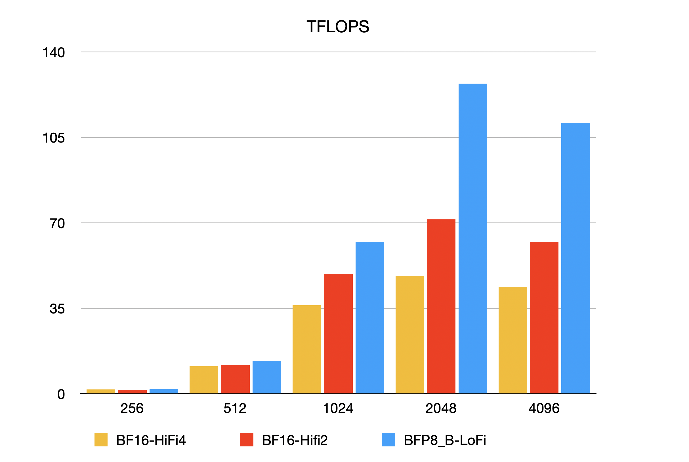
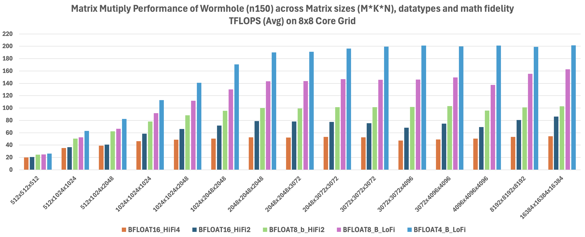
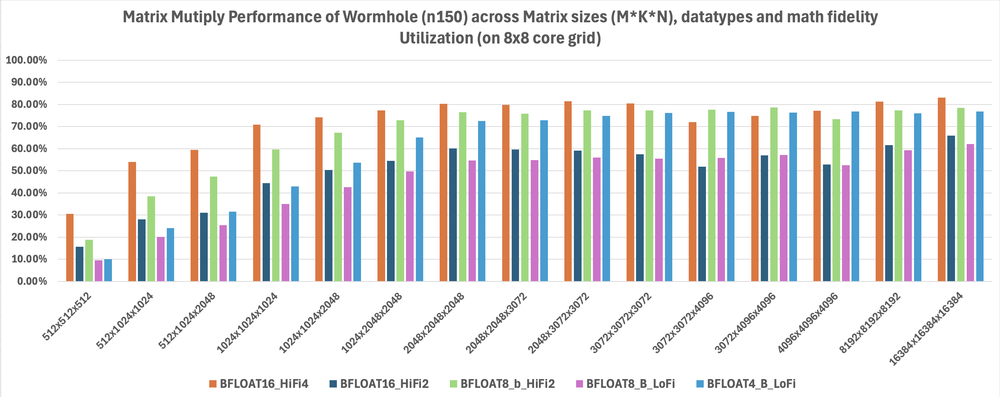
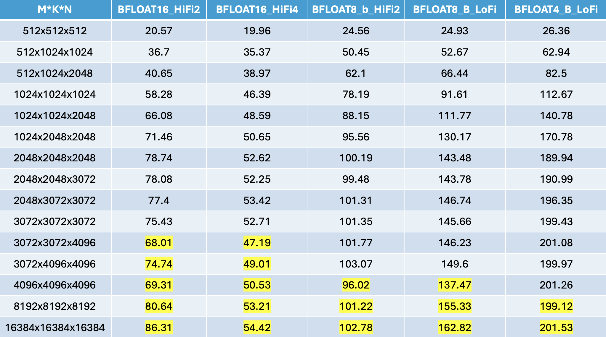
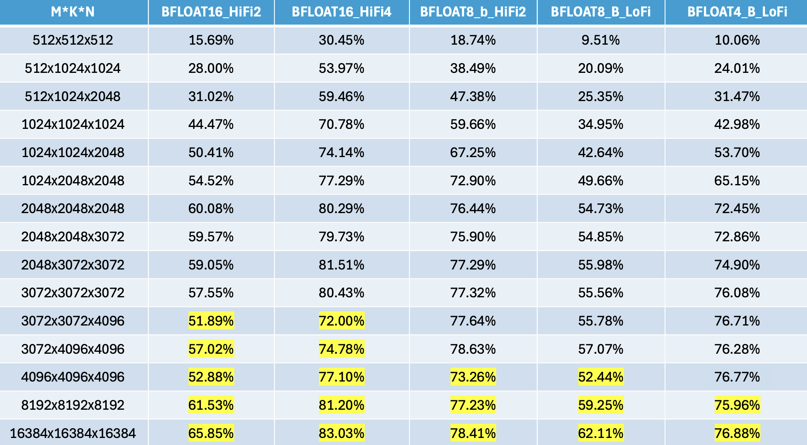
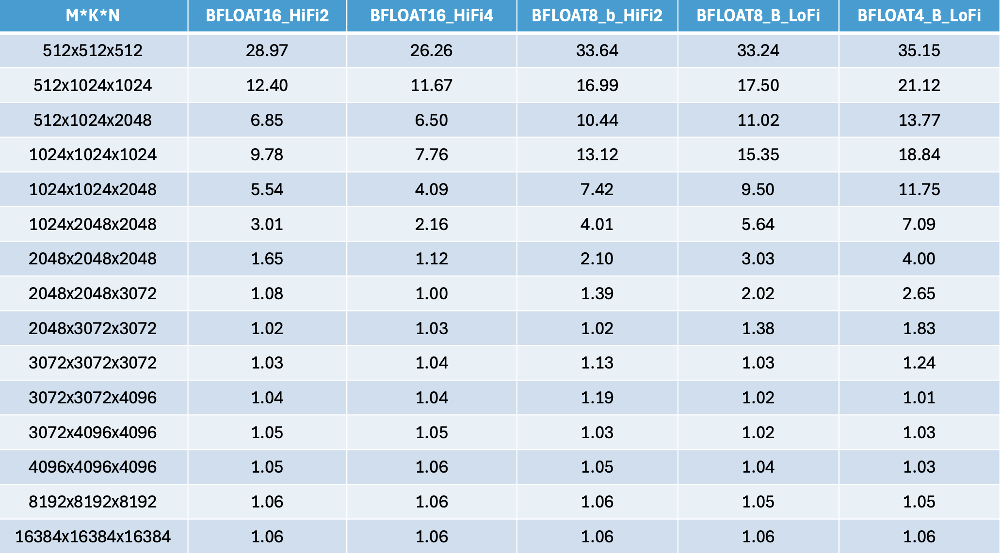
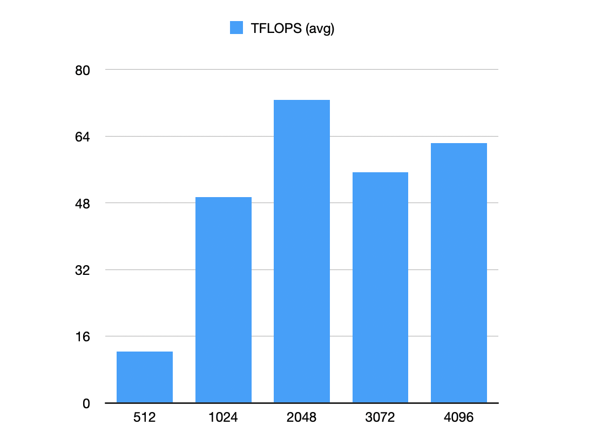
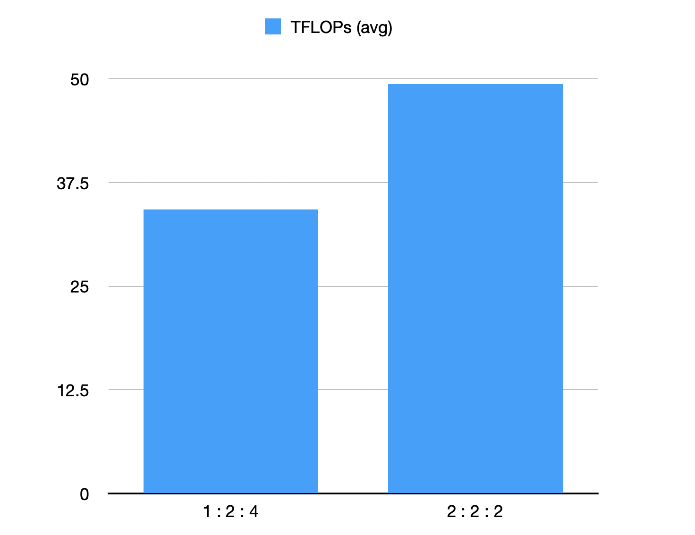

# Matrix Multiply FLOPS


## Introduction

Across many families of neural networks and applications, the common denominator is the use of the generalized matrix multiply operation. Depending on the size and the precision of the input and output matrices, different underlying effects, and more importantly performance metrics, can be observed. Classically, this comes down to the hardware's ability to execute an operation, and its ability to fetch the data for that operation intercept.

If the data is small and already in registers, the cost to operate on that data is negligible. If the data is in cache, performance is dictated by how quickly the data can be funnelled thought caches to the compute units. In there worst case scenarios, the data needed is in device memory, host memory, or stored on a disk.

Thankfully, matrix multiplication requires more compute operations (2N^3) than memory operations (3n^2). As such, for a given device, there will always be points at which a device is limited by the underlying compute units, not the underlying memory system. We call this point the roofline.
However, said inversion point depends on the size and crossover point of each cache level/memory technology and the datatype in use. The amount of 8 bit elements that can be moved per unit time is nearly an order of magnitude more than 64 bit elements.

Therefore, the peak achieved flops changes based on the datatype, the size of the data, and the layout of the data.


## Test it yourself!

The matrix multiply TFLOPS results can be tested on N150 card using:

```bash
TT_METAL_DEVICE_PROFILER=1 pytest tests/ttnn/unit_tests/benchmarks/test_benchmark.py::test_matmul_2d_host_perf
```

for manually selected matmul configurations, or using:

```bash
TT_METAL_DEVICE_PROFILER=1 pytest tests/ttnn/unit_tests/benchmarks/test_benchmark.py::test_matmul_2d_host_perf_out_of_box
```

for out-of-box matmul configurations.

Alternatively, to test on an N300 card, use the following command:

```bash
WH_ARCH_YAML=wormhole_b0_80_arch_eth_dispatch.yaml TT_METAL_DEVICE_PROFILER=1 pytest tests/ttnn/unit_tests/benchmarks/test_benchmark.py::test_matmul_2d_host_perf
```

for manually selected matmul configurations, or using:

```bash
WH_ARCH_YAML=wormhole_b0_80_arch_eth_dispatch.yaml TT_METAL_DEVICE_PROFILER=1 pytest tests/ttnn/unit_tests/benchmarks/test_benchmark.py::test_matmul_2d_host_perf_out_of_box
```

for out-of-box matmul configurations.


## Design of Experiments

The parameters of interest are 3 fold:
1. Dimensions: the sizes of the matrix on each edge, denoted as m, n and k
2. The fidelity of the computation, referred to as lofi, hifi2, hifi3, and hifi4. This affects how many bits of each input datatype is actually ingested during the computation.
3. Datatype of input/output space. It has been shown that a network layer need not always use all of the bits of a given datatype. But some layers do need the full resolution provided by a given data type, and its higher memory footprint.

For more details please refer to the tech reports [Matrix Engine](../matrix_engine/matrix_engine.md) and [Data Formats](../data_formats/data_formats.md)

For example, when changing the precision of the matrix, for a given size of matrix the output performance is expected to be different.




## MicroBenchmarks

### Matrix Multiplication TFLOPS on Wormhole (WH)

The WH matrix engine performs 8x16 x 16x16 = 8x16 in a single cycle.
- This is 2*8\*16\*16 = 4096 muladds in a single cycle.
- At 1GHz, this is 4 TFLOPS per matrix engine.
- The 8x16 is the smallest matrix that can be fed into in0, and 16x16 is the smallest matrix that can be fed into in1.

If the input matrices fed into the engine are "shorter" than 8x16, for example 1x16, the engine will still perform 8x16 x 16x16 = 8x16, but the effective throughput will be 1/8.
Thus, for 1x16 x 16x16 matrices, the effective throughput is 0.5 TFLOPS per matrix engine.

MATH_FIDELITY is used for higher precision, and TFLOPS are calculated by dividing by the MATH_FIDELITY value.
- LoFi ->  ~4 TFLOPS
- HiFi2 -> ~2 TFLOPS
- HiFi3 -> ~1.33 TFLOPS
- HiFi4 -> ~1 TFLOPS


### Utilization derivation formula

```
Utilization = ideal cycles / actual cycles.
Ideal cycles = (m * k * n) / (tile_height * tile_width * tile_height) * (cycle_per_tile / num_cores)
```
- Cycle_per_tile is the ideal compute cycle for each tile, which depends on math fidelity (LoFi: 16, HiFi2: 32, HiFi3: 48, HiFi4: 64).
- For utilization of user-specified grid size, num_cores is the user-specified number of cores. In this microbenchmark, it's 8x8.
- For utilization of full grid size, num_cores is the maximum number of cores available for compute. Currently the max available is 8x8, but will be extended to 8x9 soon.

### Manually tuned Performance

Here we show the peak results we can get based on manually selected matmul configurations, including packer l1 enablement, math fidelity, input output sharding, and input output L1/DRAM selection.

#### Peak FLOPS

Depending on the fidelity, datatype, and matrix shape chosen, different peak teraflop values can be achieved.

Below is the results generated from running the benchmark script, showcasing the performance of matrix multiplication (matmul) operations using square matrices of sizes ranging from 512x512x512 to 16384x16384x16384. The results include evaluations across various data formats, paired with different levels of math fidelity (bfloat16-HiFi2, bfloat16-HiFi4,  bfloat8_b-HiFi2, bfloat8_b-LoFi, and bfloat4_b-LoFi).

We also show the results with and without trace (see [AdvancedPerformanceOptimizationsForModels](../AdvancedPerformanceOptimizationsForModels/AdvancedPerformanceOptimizationsForModels.md) for details of trace). With trace, we can minimize the overhead of host which can reflect the actual device performance better.

Finally, we present the results in terms of device time, device throughput in TFLOPS, device utilization compared to the user-specified grid size and device utilization compared to the full grid size (8x8 in Wormhole). Utilization is calculated with


#### TFLOPS plot across all matrix sizes and configurations




#### Utilization plot across all matrix sizes and configurations, based on the Chip TFLOPS calculated per each Math Fidelity




#### TFLOPS table, the yellow highlight is for the cases where inputs are read from DRAM instead of SRAM




#### Utilization table, the yellow highlight is for the cases where inputs are read from DRAM instead of SRAM




#### TFLOPS ratio between the results with trace and without-trace. The trace mode has significant impact (i.e. higher ratio) when running a sequence of smaller/faster OPS, because the OP dispatch time will be comparable to the OP device runtime.




#### The full results table

|     m |     k |     n | use_trace   | grid_size   | in0_sharded   | out_sharded   | in0_storage_type   | in1_storage_type   | out_storage_type   | dtype              | math_fidelity      |   inference_time_avg (ns) |   TFLOPS (avg) | Utilization (vs user grid)   | Utilization (vs 8x8 full grid)   |
|------:|------:|------:|:------------|:------------|:--------------|:--------------|:-------------------|:-------------------|:-------------------|:-------------------|:-------------------|--------------------------:|---------------:|:-----------------------------|:---------------------------------|
|   512 |   512 |   512 | False       | (8, 8)      | True          | True          | L1                 | DRAM               | L1                 | DataType.BFLOAT16  | MathFidelity.HiFi2 |          378654           |           0.71 | 0.54%                        | 0.54%                            |
|   512 |  1024 |  1024 | False       | (8, 8)      | True          | True          | L1                 | DRAM               | L1                 | DataType.BFLOAT16  | MathFidelity.HiFi2 |          363193           |           2.96 | 2.26%                        | 2.26%                            |
|   512 |  1024 |  2048 | False       | (8, 8)      | True          | True          | L1                 | DRAM               | L1                 | DataType.BFLOAT16  | MathFidelity.HiFi2 |          362425           |           5.93 | 4.52%                        | 4.52%                            |
|  1024 |  1024 |  1024 | False       | (8, 8)      | True          | True          | L1                 | DRAM               | L1                 | DataType.BFLOAT16  | MathFidelity.HiFi2 |          360315           |           5.96 | 4.55%                        | 4.55%                            |
|  1024 |  1024 |  2048 | False       | (8, 8)      | True          | True          | L1                 | DRAM               | L1                 | DataType.BFLOAT16  | MathFidelity.HiFi2 |          360370           |          11.92 | 9.09%                        | 9.09%                            |
|  1024 |  2048 |  2048 | False       | (8, 8)      | True          | True          | L1                 | DRAM               | L1                 | DataType.BFLOAT16  | MathFidelity.HiFi2 |          361652           |          23.75 | 18.12%                       | 18.12%                           |
|  2048 |  2048 |  2048 | False       | (8, 8)      | True          | True          | L1                 | DRAM               | L1                 | DataType.BFLOAT16  | MathFidelity.HiFi2 |          360396           |          47.67 | 36.37%                       | 36.37%                           |
|  2048 |  2048 |  3072 | False       | (8, 8)      | True          | True          | L1                 | DRAM               | L1                 | DataType.BFLOAT16  | MathFidelity.HiFi2 |          357599           |          72.06 | 54.98%                       | 54.98%                           |
|  2048 |  3072 |  3072 | False       | (8, 8)      | True          | True          | L1                 | DRAM               | L1                 | DataType.BFLOAT16  | MathFidelity.HiFi2 |          509491           |          75.87 | 57.88%                       | 57.88%                           |
|  3072 |  3072 |  3072 | False       | (8, 8)      | True          | True          | L1                 | DRAM               | L1                 | DataType.BFLOAT16  | MathFidelity.HiFi2 |          790913           |          73.31 | 55.93%                       | 55.93%                           |
|  3072 |  3072 |  4096 | False       | (8, 8)      | False         | False         | DRAM               | DRAM               | DRAM               | DataType.BFLOAT16  | MathFidelity.HiFi2 |               1.1777e+06  |          65.64 | 50.08%                       | 50.08%                           |
|  3072 |  4096 |  4096 | False       | (8, 8)      | False         | False         | DRAM               | DRAM               | DRAM               | DataType.BFLOAT16  | MathFidelity.HiFi2 |               1.44314e+06 |          71.43 | 54.49%                       | 54.49%                           |
|  4096 |  4096 |  4096 | False       | (8, 8)      | False         | False         | DRAM               | DRAM               | DRAM               | DataType.BFLOAT16  | MathFidelity.HiFi2 |               2.07709e+06 |          66.17 | 50.48%                       | 50.48%                           |
|  8192 |  8192 |  8192 | False       | (8, 8)      | False         | False         | DRAM               | DRAM               | DRAM               | DataType.BFLOAT16  | MathFidelity.HiFi2 |               1.44337e+07 |          76.18 | 58.12%                       | 58.12%                           |
| 16384 | 16384 | 16384 | False       | (8, 8)      | False         | False         | DRAM               | DRAM               | DRAM               | DataType.BFLOAT16  | MathFidelity.HiFi2 |               1.07906e+08 |          81.52 | 62.19%                       | 62.19%                           |
|   512 |   512 |   512 | False       | (8, 8)      | True          | True          | L1                 | DRAM               | L1                 | DataType.BFLOAT16  | MathFidelity.HiFi4 |          354750           |           0.76 | 1.15%                        | 1.15%                            |
|   512 |  1024 |  1024 | False       | (8, 8)      | True          | True          | L1                 | DRAM               | L1                 | DataType.BFLOAT16  | MathFidelity.HiFi4 |          354664           |           3.03 | 4.62%                        | 4.62%                            |
|   512 |  1024 |  2048 | False       | (8, 8)      | True          | True          | L1                 | DRAM               | L1                 | DataType.BFLOAT16  | MathFidelity.HiFi4 |          357769           |           6    | 9.16%                        | 9.16%                            |
|  1024 |  1024 |  1024 | False       | (8, 8)      | True          | True          | L1                 | DRAM               | L1                 | DataType.BFLOAT16  | MathFidelity.HiFi4 |          358937           |           5.98 | 9.13%                        | 9.13%                            |
|  1024 |  1024 |  2048 | False       | (8, 8)      | True          | True          | L1                 | DRAM               | L1                 | DataType.BFLOAT16  | MathFidelity.HiFi4 |          361688           |          11.87 | 18.12%                       | 18.12%                           |
|  1024 |  2048 |  2048 | False       | (8, 8)      | True          | True          | L1                 | DRAM               | L1                 | DataType.BFLOAT16  | MathFidelity.HiFi4 |          365498           |          23.5  | 35.86%                       | 35.86%                           |
|  2048 |  2048 |  2048 | False       | (8, 8)      | True          | True          | L1                 | DRAM               | L1                 | DataType.BFLOAT16  | MathFidelity.HiFi4 |          364318           |          47.16 | 71.95%                       | 71.95%                           |
|  2048 |  2048 |  3072 | False       | (8, 8)      | True          | True          | L1                 | DRAM               | L1                 | DataType.BFLOAT16  | MathFidelity.HiFi4 |          494421           |          52.12 | 79.53%                       | 79.53%                           |
|  2048 |  3072 |  3072 | False       | (8, 8)      | True          | True          | L1                 | DRAM               | L1                 | DataType.BFLOAT16  | MathFidelity.HiFi4 |          746684           |          51.77 | 78.99%                       | 78.99%                           |
|  3072 |  3072 |  3072 | False       | (8, 8)      | True          | True          | L1                 | DRAM               | L1                 | DataType.BFLOAT16  | MathFidelity.HiFi4 |               1.14083e+06 |          50.82 | 77.55%                       | 77.55%                           |
|  3072 |  3072 |  4096 | False       | (8, 8)      | False         | False         | DRAM               | DRAM               | DRAM               | DataType.BFLOAT16  | MathFidelity.HiFi4 |               1.71129e+06 |          45.18 | 68.93%                       | 68.93%                           |
|  3072 |  4096 |  4096 | False       | (8, 8)      | False         | False         | DRAM               | DRAM               | DRAM               | DataType.BFLOAT16  | MathFidelity.HiFi4 |               2.20082e+06 |          46.84 | 71.47%                       | 71.47%                           |
|  4096 |  4096 |  4096 | False       | (8, 8)      | False         | False         | DRAM               | DRAM               | DRAM               | DataType.BFLOAT16  | MathFidelity.HiFi4 |               2.8713e+06  |          47.87 | 73.04%                       | 73.04%                           |
|  8192 |  8192 |  8192 | False       | (8, 8)      | False         | False         | DRAM               | DRAM               | DRAM               | DataType.BFLOAT16  | MathFidelity.HiFi4 |               2.18014e+07 |          50.43 | 76.95%                       | 76.95%                           |
| 16384 | 16384 | 16384 | False       | (8, 8)      | False         | False         | DRAM               | DRAM               | DRAM               | DataType.BFLOAT16  | MathFidelity.HiFi4 |               1.71243e+08 |          51.37 | 78.38%                       | 78.38%                           |
|   512 |   512 |   512 | False       | (8, 8)      | True          | True          | L1                 | DRAM               | L1                 | DataType.BFLOAT8_B | MathFidelity.LoFi  |          355988           |           0.75 | 0.29%                        | 0.29%                            |
|   512 |  1024 |  1024 | False       | (8, 8)      | True          | True          | L1                 | DRAM               | L1                 | DataType.BFLOAT8_B | MathFidelity.LoFi  |          357294           |           3.01 | 1.15%                        | 1.15%                            |
|   512 |  1024 |  2048 | False       | (8, 8)      | True          | True          | L1                 | DRAM               | L1                 | DataType.BFLOAT8_B | MathFidelity.LoFi  |          355995           |           6.03 | 2.30%                        | 2.30%                            |
|  1024 |  1024 |  1024 | False       | (8, 8)      | True          | True          | L1                 | DRAM               | L1                 | DataType.BFLOAT8_B | MathFidelity.LoFi  |          359674           |           5.97 | 2.28%                        | 2.28%                            |
|  1024 |  1024 |  2048 | False       | (8, 8)      | True          | True          | L1                 | DRAM               | L1                 | DataType.BFLOAT8_B | MathFidelity.LoFi  |          364969           |          11.77 | 4.49%                        | 4.49%                            |
|  1024 |  2048 |  2048 | False       | (8, 8)      | True          | True          | L1                 | DRAM               | L1                 | DataType.BFLOAT8_B | MathFidelity.LoFi  |          372298           |          23.07 | 8.80%                        | 8.80%                            |
|  2048 |  2048 |  2048 | False       | (8, 8)      | True          | True          | L1                 | DRAM               | L1                 | DataType.BFLOAT8_B | MathFidelity.LoFi  |          362940           |          47.34 | 18.06%                       | 18.06%                           |
|  2048 |  2048 |  3072 | False       | (8, 8)      | True          | True          | L1                 | DRAM               | L1                 | DataType.BFLOAT8_B | MathFidelity.LoFi  |          362773           |          71.04 | 27.10%                       | 27.10%                           |
|  2048 |  3072 |  3072 | False       | (8, 8)      | True          | True          | L1                 | DRAM               | L1                 | DataType.BFLOAT8_B | MathFidelity.LoFi  |          364785           |         105.97 | 40.42%                       | 40.42%                           |
|  3072 |  3072 |  3072 | False       | (8, 8)      | True          | True          | L1                 | DRAM               | L1                 | DataType.BFLOAT8_B | MathFidelity.LoFi  |          408983           |         141.77 | 54.08%                       | 54.08%                           |
|  3072 |  3072 |  4096 | False       | (8, 8)      | True          | True          | L1                 | DRAM               | L1                 | DataType.BFLOAT8_B | MathFidelity.LoFi  |          541277           |         142.83 | 54.48%                       | 54.48%                           |
|  3072 |  4096 |  4096 | False       | (8, 8)      | True          | True          | L1                 | DRAM               | L1                 | DataType.BFLOAT8_B | MathFidelity.LoFi  |          706060           |         145.99 | 55.69%                       | 55.69%                           |
|  4096 |  4096 |  4096 | False       | (8, 8)      | False         | False         | DRAM               | DRAM               | DRAM               | DataType.BFLOAT8_B | MathFidelity.LoFi  |               1.03637e+06 |         132.62 | 50.59%                       | 50.59%                           |
|  8192 |  8192 |  8192 | False       | (8, 8)      | False         | False         | DRAM               | DRAM               | DRAM               | DataType.BFLOAT8_B | MathFidelity.LoFi  |               7.4627e+06  |         147.33 | 56.20%                       | 56.20%                           |
| 16384 | 16384 | 16384 | False       | (8, 8)      | False         | False         | DRAM               | DRAM               | DRAM               | DataType.BFLOAT8_B | MathFidelity.LoFi  |               5.71668e+07 |         153.87 | 58.70%                       | 58.70%                           |
|   512 |   512 |   512 | False       | (8, 8)      | True          | True          | L1                 | DRAM               | L1                 | DataType.BFLOAT8_B | MathFidelity.HiFi2 |          367584           |           0.73 | 0.56%                        | 0.56%                            |
|   512 |  1024 |  1024 | False       | (8, 8)      | True          | True          | L1                 | DRAM               | L1                 | DataType.BFLOAT8_B | MathFidelity.HiFi2 |          361781           |           2.97 | 2.26%                        | 2.26%                            |
|   512 |  1024 |  2048 | False       | (8, 8)      | True          | True          | L1                 | DRAM               | L1                 | DataType.BFLOAT8_B | MathFidelity.HiFi2 |          360990           |           5.95 | 4.54%                        | 4.54%                            |
|  1024 |  1024 |  1024 | False       | (8, 8)      | True          | True          | L1                 | DRAM               | L1                 | DataType.BFLOAT8_B | MathFidelity.HiFi2 |          360477           |           5.96 | 4.55%                        | 4.55%                            |
|  1024 |  1024 |  2048 | False       | (8, 8)      | True          | True          | L1                 | DRAM               | L1                 | DataType.BFLOAT8_B | MathFidelity.HiFi2 |          361416           |          11.88 | 9.07%                        | 9.07%                            |
|  1024 |  2048 |  2048 | False       | (8, 8)      | True          | True          | L1                 | DRAM               | L1                 | DataType.BFLOAT8_B | MathFidelity.HiFi2 |          360181           |          23.85 | 18.20%                       | 18.20%                           |
|  2048 |  2048 |  2048 | False       | (8, 8)      | True          | True          | L1                 | DRAM               | L1                 | DataType.BFLOAT8_B | MathFidelity.HiFi2 |          359807           |          47.75 | 36.43%                       | 36.43%                           |
|  2048 |  2048 |  3072 | False       | (8, 8)      | True          | True          | L1                 | DRAM               | L1                 | DataType.BFLOAT8_B | MathFidelity.HiFi2 |          358889           |          71.8  | 54.78%                       | 54.78%                           |
|  2048 |  3072 |  3072 | False       | (8, 8)      | True          | True          | L1                 | DRAM               | L1                 | DataType.BFLOAT8_B | MathFidelity.HiFi2 |          387597           |          99.73 | 76.09%                       | 76.09%                           |
|  3072 |  3072 |  3072 | False       | (8, 8)      | True          | True          | L1                 | DRAM               | L1                 | DataType.BFLOAT8_B | MathFidelity.HiFi2 |          645556           |          89.82 | 68.53%                       | 68.53%                           |
|  3072 |  3072 |  4096 | False       | (8, 8)      | True          | True          | L1                 | DRAM               | L1                 | DataType.BFLOAT8_B | MathFidelity.HiFi2 |          906856           |          85.25 | 65.04%                       | 65.04%                           |
|  3072 |  4096 |  4096 | False       | (8, 8)      | True          | True          | L1                 | DRAM               | L1                 | DataType.BFLOAT8_B | MathFidelity.HiFi2 |               1.03474e+06 |          99.62 | 76.00%                       | 76.00%                           |
|  4096 |  4096 |  4096 | False       | (8, 8)      | False         | False         | DRAM               | DRAM               | DRAM               | DataType.BFLOAT8_B | MathFidelity.HiFi2 |               1.49746e+06 |          91.78 | 70.02%                       | 70.02%                           |
|  8192 |  8192 |  8192 | False       | (8, 8)      | False         | False         | DRAM               | DRAM               | DRAM               | DataType.BFLOAT8_B | MathFidelity.HiFi2 |               1.15253e+07 |          95.4  | 72.78%                       | 72.78%                           |
| 16384 | 16384 | 16384 | False       | (8, 8)      | False         | False         | DRAM               | DRAM               | DRAM               | DataType.BFLOAT8_B | MathFidelity.HiFi2 |               9.06774e+07 |          97    | 74.01%                       | 74.01%                           |
|   512 |   512 |   512 | False       | (8, 8)      | True          | True          | L1                 | DRAM               | L1                 | DataType.BFLOAT4_B | MathFidelity.LoFi  |          357399           |           0.75 | 0.29%                        | 0.29%                            |
|   512 |  1024 |  1024 | False       | (8, 8)      | True          | True          | L1                 | DRAM               | L1                 | DataType.BFLOAT4_B | MathFidelity.LoFi  |          359850           |           2.98 | 1.14%                        | 1.14%                            |
|   512 |  1024 |  2048 | False       | (8, 8)      | True          | True          | L1                 | DRAM               | L1                 | DataType.BFLOAT4_B | MathFidelity.LoFi  |          358658           |           5.99 | 2.28%                        | 2.28%                            |
|  1024 |  1024 |  1024 | False       | (8, 8)      | True          | True          | L1                 | DRAM               | L1                 | DataType.BFLOAT4_B | MathFidelity.LoFi  |          359278           |           5.98 | 2.28%                        | 2.28%                            |
|  1024 |  1024 |  2048 | False       | (8, 8)      | True          | True          | L1                 | DRAM               | L1                 | DataType.BFLOAT4_B | MathFidelity.LoFi  |          358381           |          11.98 | 4.57%                        | 4.57%                            |
|  1024 |  2048 |  2048 | False       | (8, 8)      | True          | True          | L1                 | DRAM               | L1                 | DataType.BFLOAT4_B | MathFidelity.LoFi  |          356746           |          24.08 | 9.19%                        | 9.19%                            |
|  2048 |  2048 |  2048 | False       | (8, 8)      | True          | True          | L1                 | DRAM               | L1                 | DataType.BFLOAT4_B | MathFidelity.LoFi  |          361416           |          47.53 | 18.13%                       | 18.13%                           |
|  2048 |  2048 |  3072 | False       | (8, 8)      | True          | True          | L1                 | DRAM               | L1                 | DataType.BFLOAT4_B | MathFidelity.LoFi  |          357502           |          72.08 | 27.50%                       | 27.50%                           |
|  2048 |  3072 |  3072 | False       | (8, 8)      | True          | True          | L1                 | DRAM               | L1                 | DataType.BFLOAT4_B | MathFidelity.LoFi  |          360315           |         107.28 | 40.92%                       | 40.92%                           |
|  3072 |  3072 |  3072 | False       | (8, 8)      | True          | True          | L1                 | DRAM               | L1                 | DataType.BFLOAT4_B | MathFidelity.LoFi  |          359447           |         161.31 | 61.53%                       | 61.53%                           |
|  3072 |  3072 |  4096 | False       | (8, 8)      | True          | True          | L1                 | DRAM               | L1                 | DataType.BFLOAT4_B | MathFidelity.LoFi  |          386701           |         199.92 | 76.26%                       | 76.26%                           |
|  3072 |  4096 |  4096 | False       | (8, 8)      | True          | True          | L1                 | DRAM               | L1                 | DataType.BFLOAT4_B | MathFidelity.LoFi  |          528603           |         195    | 74.39%                       | 74.39%                           |
|  4096 |  4096 |  4096 | False       | (8, 8)      | True          | True          | L1                 | DRAM               | L1                 | DataType.BFLOAT4_B | MathFidelity.LoFi  |          704734           |         195.02 | 74.40%                       | 74.40%                           |
|  8192 |  8192 |  8192 | False       | (8, 8)      | False         | False         | DRAM               | DRAM               | DRAM               | DataType.BFLOAT4_B | MathFidelity.LoFi  |               5.80098e+06 |         189.54 | 72.30%                       | 72.30%                           |
| 16384 | 16384 | 16384 | False       | (8, 8)      | False         | False         | DRAM               | DRAM               | DRAM               | DataType.BFLOAT4_B | MathFidelity.LoFi  |               4.62353e+07 |         190.25 | 72.57%                       | 72.57%                           |
|   512 |   512 |   512 | True        | (8, 8)      | True          | True          | L1                 | DRAM               | L1                 | DataType.BFLOAT16  | MathFidelity.HiFi2 |           13051           |          20.57 | 15.69%                       | 15.69%                           |
|   512 |  1024 |  1024 | True        | (8, 8)      | True          | True          | L1                 | DRAM               | L1                 | DataType.BFLOAT16  | MathFidelity.HiFi2 |           29254           |          36.7  | 28.00%                       | 28.00%                           |
|   512 |  1024 |  2048 | True        | (8, 8)      | True          | True          | L1                 | DRAM               | L1                 | DataType.BFLOAT16  | MathFidelity.HiFi2 |           52824           |          40.65 | 31.02%                       | 31.02%                           |
|  1024 |  1024 |  1024 | True        | (8, 8)      | True          | True          | L1                 | DRAM               | L1                 | DataType.BFLOAT16  | MathFidelity.HiFi2 |           36845.2         |          58.28 | 44.47%                       | 44.47%                           |
|  1024 |  1024 |  2048 | True        | (8, 8)      | True          | True          | L1                 | DRAM               | L1                 | DataType.BFLOAT16  | MathFidelity.HiFi2 |           65000.1         |          66.08 | 50.41%                       | 50.41%                           |
|  1024 |  2048 |  2048 | True        | (8, 8)      | True          | True          | L1                 | DRAM               | L1                 | DataType.BFLOAT16  | MathFidelity.HiFi2 |          120201           |          71.46 | 54.52%                       | 54.52%                           |
|  2048 |  2048 |  2048 | True        | (8, 8)      | True          | True          | L1                 | DRAM               | L1                 | DataType.BFLOAT16  | MathFidelity.HiFi2 |          218179           |          78.74 | 60.08%                       | 60.08%                           |
|  2048 |  2048 |  3072 | True        | (8, 8)      | True          | True          | L1                 | DRAM               | L1                 | DataType.BFLOAT16  | MathFidelity.HiFi2 |          330052           |          78.08 | 59.57%                       | 59.57%                           |
|  2048 |  3072 |  3072 | True        | (8, 8)      | True          | True          | L1                 | DRAM               | L1                 | DataType.BFLOAT16  | MathFidelity.HiFi2 |          499430           |          77.4  | 59.05%                       | 59.05%                           |
|  3072 |  3072 |  3072 | True        | (8, 8)      | True          | True          | L1                 | DRAM               | L1                 | DataType.BFLOAT16  | MathFidelity.HiFi2 |          768714           |          75.43 | 57.55%                       | 57.55%                           |
|  3072 |  3072 |  4096 | True        | (8, 8)      | False         | False         | DRAM               | DRAM               | DRAM               | DataType.BFLOAT16  | MathFidelity.HiFi2 |               1.13666e+06 |          68.01 | 51.89%                       | 51.89%                           |
|  3072 |  4096 |  4096 | True        | (8, 8)      | False         | False         | DRAM               | DRAM               | DRAM               | DataType.BFLOAT16  | MathFidelity.HiFi2 |               1.37919e+06 |          74.74 | 57.02%                       | 57.02%                           |
|  4096 |  4096 |  4096 | True        | (8, 8)      | False         | False         | DRAM               | DRAM               | DRAM               | DataType.BFLOAT16  | MathFidelity.HiFi2 |               1.98296e+06 |          69.31 | 52.88%                       | 52.88%                           |
|  8192 |  8192 |  8192 | True        | (8, 8)      | False         | False         | DRAM               | DRAM               | DRAM               | DataType.BFLOAT16  | MathFidelity.HiFi2 |               1.3634e+07  |          80.64 | 61.53%                       | 61.53%                           |
| 16384 | 16384 | 16384 | True        | (8, 8)      | False         | False         | DRAM               | DRAM               | DRAM               | DataType.BFLOAT16  | MathFidelity.HiFi2 |               1.01918e+08 |          86.31 | 65.85%                       | 65.85%                           |
|   512 |   512 |   512 | True        | (8, 8)      | True          | True          | L1                 | DRAM               | L1                 | DataType.BFLOAT16  | MathFidelity.HiFi4 |           13451.6         |          19.96 | 30.45%                       | 30.45%                           |
|   512 |  1024 |  1024 | True        | (8, 8)      | True          | True          | L1                 | DRAM               | L1                 | DataType.BFLOAT16  | MathFidelity.HiFi4 |           30355.5         |          35.37 | 53.97%                       | 53.97%                           |
|   512 |  1024 |  2048 | True        | (8, 8)      | True          | True          | L1                 | DRAM               | L1                 | DataType.BFLOAT16  | MathFidelity.HiFi4 |           55108.1         |          38.97 | 59.46%                       | 59.46%                           |
|  1024 |  1024 |  1024 | True        | (8, 8)      | True          | True          | L1                 | DRAM               | L1                 | DataType.BFLOAT16  | MathFidelity.HiFi4 |           46296.1         |          46.39 | 70.78%                       | 70.78%                           |
|  1024 |  1024 |  2048 | True        | (8, 8)      | True          | True          | L1                 | DRAM               | L1                 | DataType.BFLOAT16  | MathFidelity.HiFi4 |           88396.1         |          48.59 | 74.14%                       | 74.14%                           |
|  1024 |  2048 |  2048 | True        | (8, 8)      | True          | True          | L1                 | DRAM               | L1                 | DataType.BFLOAT16  | MathFidelity.HiFi4 |          169585           |          50.65 | 77.29%                       | 77.29%                           |
|  2048 |  2048 |  2048 | True        | (8, 8)      | True          | True          | L1                 | DRAM               | L1                 | DataType.BFLOAT16  | MathFidelity.HiFi4 |          326509           |          52.62 | 80.29%                       | 80.29%                           |
|  2048 |  2048 |  3072 | True        | (8, 8)      | True          | True          | L1                 | DRAM               | L1                 | DataType.BFLOAT16  | MathFidelity.HiFi4 |          493205           |          52.25 | 79.73%                       | 79.73%                           |
|  2048 |  3072 |  3072 | True        | (8, 8)      | True          | True          | L1                 | DRAM               | L1                 | DataType.BFLOAT16  | MathFidelity.HiFi4 |          723646           |          53.42 | 81.51%                       | 81.51%                           |
|  3072 |  3072 |  3072 | True        | (8, 8)      | True          | True          | L1                 | DRAM               | L1                 | DataType.BFLOAT16  | MathFidelity.HiFi4 |               1.10006e+06 |          52.71 | 80.43%                       | 80.43%                           |
|  3072 |  3072 |  4096 | True        | (8, 8)      | False         | False         | DRAM               | DRAM               | DRAM               | DataType.BFLOAT16  | MathFidelity.HiFi4 |               1.63843e+06 |          47.19 | 72.00%                       | 72.00%                           |
|  3072 |  4096 |  4096 | True        | (8, 8)      | False         | False         | DRAM               | DRAM               | DRAM               | DataType.BFLOAT16  | MathFidelity.HiFi4 |               2.10337e+06 |          49.01 | 74.78%                       | 74.78%                           |
|  4096 |  4096 |  4096 | True        | (8, 8)      | False         | False         | DRAM               | DRAM               | DRAM               | DataType.BFLOAT16  | MathFidelity.HiFi4 |               2.71992e+06 |          50.53 | 77.10%                       | 77.10%                           |
|  8192 |  8192 |  8192 | True        | (8, 8)      | False         | False         | DRAM               | DRAM               | DRAM               | DataType.BFLOAT16  | MathFidelity.HiFi4 |               2.06619e+07 |          53.21 | 81.20%                       | 81.20%                           |
| 16384 | 16384 | 16384 | True        | (8, 8)      | False         | False         | DRAM               | DRAM               | DRAM               | DataType.BFLOAT16  | MathFidelity.HiFi4 |               1.61645e+08 |          54.42 | 83.03%                       | 83.03%                           |
|   512 |   512 |   512 | True        | (8, 8)      | True          | True          | L1                 | DRAM               | L1                 | DataType.BFLOAT8_B | MathFidelity.LoFi  |           10769.4         |          24.93 | 9.51%                        | 9.51%                            |
|   512 |  1024 |  1024 | True        | (8, 8)      | True          | True          | L1                 | DRAM               | L1                 | DataType.BFLOAT8_B | MathFidelity.LoFi  |           20384.8         |          52.67 | 20.09%                       | 20.09%                           |
|   512 |  1024 |  2048 | True        | (8, 8)      | True          | True          | L1                 | DRAM               | L1                 | DataType.BFLOAT8_B | MathFidelity.LoFi  |           32320           |          66.44 | 25.35%                       | 25.35%                           |
|  1024 |  1024 |  1024 | True        | (8, 8)      | True          | True          | L1                 | DRAM               | L1                 | DataType.BFLOAT8_B | MathFidelity.LoFi  |           23441.3         |          91.61 | 34.95%                       | 34.95%                           |
|  1024 |  1024 |  2048 | True        | (8, 8)      | True          | True          | L1                 | DRAM               | L1                 | DataType.BFLOAT8_B | MathFidelity.LoFi  |           38425.9         |         111.77 | 42.64%                       | 42.64%                           |
|  1024 |  2048 |  2048 | True        | (8, 8)      | True          | True          | L1                 | DRAM               | L1                 | DataType.BFLOAT8_B | MathFidelity.LoFi  |           65989.5         |         130.17 | 49.66%                       | 49.66%                           |
|  2048 |  2048 |  2048 | True        | (8, 8)      | True          | True          | L1                 | DRAM               | L1                 | DataType.BFLOAT8_B | MathFidelity.LoFi  |          119739           |         143.48 | 54.73%                       | 54.73%                           |
|  2048 |  2048 |  3072 | True        | (8, 8)      | True          | True          | L1                 | DRAM               | L1                 | DataType.BFLOAT8_B | MathFidelity.LoFi  |          179234           |         143.78 | 54.85%                       | 54.85%                           |
|  2048 |  3072 |  3072 | True        | (8, 8)      | True          | True          | L1                 | DRAM               | L1                 | DataType.BFLOAT8_B | MathFidelity.LoFi  |          263422           |         146.74 | 55.98%                       | 55.98%                           |
|  3072 |  3072 |  3072 | True        | (8, 8)      | True          | True          | L1                 | DRAM               | L1                 | DataType.BFLOAT8_B | MathFidelity.LoFi  |          398071           |         145.66 | 55.56%                       | 55.56%                           |
|  3072 |  3072 |  4096 | True        | (8, 8)      | True          | True          | L1                 | DRAM               | L1                 | DataType.BFLOAT8_B | MathFidelity.LoFi  |          528693           |         146.23 | 55.78%                       | 55.78%                           |
|  3072 |  4096 |  4096 | True        | (8, 8)      | True          | True          | L1                 | DRAM               | L1                 | DataType.BFLOAT8_B | MathFidelity.LoFi  |          689044           |         149.6  | 57.07%                       | 57.07%                           |
|  4096 |  4096 |  4096 | True        | (8, 8)      | False         | False         | DRAM               | DRAM               | DRAM               | DataType.BFLOAT8_B | MathFidelity.LoFi  |          999753           |         137.47 | 52.44%                       | 52.44%                           |
|  8192 |  8192 |  8192 | True        | (8, 8)      | False         | False         | DRAM               | DRAM               | DRAM               | DataType.BFLOAT8_B | MathFidelity.LoFi  |               7.07856e+06 |         155.33 | 59.25%                       | 59.25%                           |
| 16384 | 16384 | 16384 | True        | (8, 8)      | False         | False         | DRAM               | DRAM               | DRAM               | DataType.BFLOAT8_B | MathFidelity.LoFi  |               5.40224e+07 |         162.82 | 62.11%                       | 62.11%                           |
|   512 |   512 |   512 | True        | (8, 8)      | True          | True          | L1                 | DRAM               | L1                 | DataType.BFLOAT8_B | MathFidelity.HiFi2 |           10929.1         |          24.56 | 18.74%                       | 18.74%                           |
|   512 |  1024 |  1024 | True        | (8, 8)      | True          | True          | L1                 | DRAM               | L1                 | DataType.BFLOAT8_B | MathFidelity.HiFi2 |           21283.6         |          50.45 | 38.49%                       | 38.49%                           |
|   512 |  1024 |  2048 | True        | (8, 8)      | True          | True          | L1                 | DRAM               | L1                 | DataType.BFLOAT8_B | MathFidelity.HiFi2 |           34582.6         |          62.1  | 47.38%                       | 47.38%                           |
|  1024 |  1024 |  1024 | True        | (8, 8)      | True          | True          | L1                 | DRAM               | L1                 | DataType.BFLOAT8_B | MathFidelity.HiFi2 |           27463.4         |          78.19 | 59.66%                       | 59.66%                           |
|  1024 |  1024 |  2048 | True        | (8, 8)      | True          | True          | L1                 | DRAM               | L1                 | DataType.BFLOAT8_B | MathFidelity.HiFi2 |           48723.2         |          88.15 | 67.25%                       | 67.25%                           |
|  1024 |  2048 |  2048 | True        | (8, 8)      | True          | True          | L1                 | DRAM               | L1                 | DataType.BFLOAT8_B | MathFidelity.HiFi2 |           89893.3         |          95.56 | 72.90%                       | 72.90%                           |
|  2048 |  2048 |  2048 | True        | (8, 8)      | True          | True          | L1                 | DRAM               | L1                 | DataType.BFLOAT8_B | MathFidelity.HiFi2 |          171468           |         100.19 | 76.44%                       | 76.44%                           |
|  2048 |  2048 |  3072 | True        | (8, 8)      | True          | True          | L1                 | DRAM               | L1                 | DataType.BFLOAT8_B | MathFidelity.HiFi2 |          259032           |          99.48 | 75.90%                       | 75.90%                           |
|  2048 |  3072 |  3072 | True        | (8, 8)      | True          | True          | L1                 | DRAM               | L1                 | DataType.BFLOAT8_B | MathFidelity.HiFi2 |          381544           |         101.31 | 77.29%                       | 77.29%                           |
|  3072 |  3072 |  3072 | True        | (8, 8)      | True          | True          | L1                 | DRAM               | L1                 | DataType.BFLOAT8_B | MathFidelity.HiFi2 |          572093           |         101.35 | 77.32%                       | 77.32%                           |
|  3072 |  3072 |  4096 | True        | (8, 8)      | True          | True          | L1                 | DRAM               | L1                 | DataType.BFLOAT8_B | MathFidelity.HiFi2 |          759678           |         101.77 | 77.64%                       | 77.64%                           |
|  3072 |  4096 |  4096 | True        | (8, 8)      | True          | True          | L1                 | DRAM               | L1                 | DataType.BFLOAT8_B | MathFidelity.HiFi2 |               1.00011e+06 |         103.07 | 78.63%                       | 78.63%                           |
|  4096 |  4096 |  4096 | True        | (8, 8)      | False         | False         | DRAM               | DRAM               | DRAM               | DataType.BFLOAT8_B | MathFidelity.HiFi2 |               1.43136e+06 |          96.02 | 73.26%                       | 73.26%                           |
|  8192 |  8192 |  8192 | True        | (8, 8)      | False         | False         | DRAM               | DRAM               | DRAM               | DataType.BFLOAT8_B | MathFidelity.HiFi2 |               1.08622e+07 |         101.22 | 77.23%                       | 77.23%                           |
| 16384 | 16384 | 16384 | True        | (8, 8)      | False         | False         | DRAM               | DRAM               | DRAM               | DataType.BFLOAT8_B | MathFidelity.HiFi2 |               8.55858e+07 |         102.78 | 78.41%                       | 78.41%                           |
|   512 |   512 |   512 | True        | (8, 8)      | True          | True          | L1                 | DRAM               | L1                 | DataType.BFLOAT4_B | MathFidelity.LoFi  |           10182.9         |          26.36 | 10.06%                       | 10.06%                           |
|   512 |  1024 |  1024 | True        | (8, 8)      | True          | True          | L1                 | DRAM               | L1                 | DataType.BFLOAT4_B | MathFidelity.LoFi  |           17058.8         |          62.94 | 24.01%                       | 24.01%                           |
|   512 |  1024 |  2048 | True        | (8, 8)      | True          | True          | L1                 | DRAM               | L1                 | DataType.BFLOAT4_B | MathFidelity.LoFi  |           26030.5         |          82.5  | 31.47%                       | 31.47%                           |
|  1024 |  1024 |  1024 | True        | (8, 8)      | True          | True          | L1                 | DRAM               | L1                 | DataType.BFLOAT4_B | MathFidelity.LoFi  |           19059.2         |         112.67 | 42.98%                       | 42.98%                           |
|  1024 |  1024 |  2048 | True        | (8, 8)      | True          | True          | L1                 | DRAM               | L1                 | DataType.BFLOAT4_B | MathFidelity.LoFi  |           30508           |         140.78 | 53.70%                       | 53.70%                           |
|  1024 |  2048 |  2048 | True        | (8, 8)      | True          | True          | L1                 | DRAM               | L1                 | DataType.BFLOAT4_B | MathFidelity.LoFi  |           50296.8         |         170.78 | 65.15%                       | 65.15%                           |
|  2048 |  2048 |  2048 | True        | (8, 8)      | True          | True          | L1                 | DRAM               | L1                 | DataType.BFLOAT4_B | MathFidelity.LoFi  |           90451.2         |         189.94 | 72.45%                       | 72.45%                           |
|  2048 |  2048 |  3072 | True        | (8, 8)      | True          | True          | L1                 | DRAM               | L1                 | DataType.BFLOAT4_B | MathFidelity.LoFi  |          134931           |         190.99 | 72.86%                       | 72.86%                           |
|  2048 |  3072 |  3072 | True        | (8, 8)      | True          | True          | L1                 | DRAM               | L1                 | DataType.BFLOAT4_B | MathFidelity.LoFi  |          196865           |         196.35 | 74.90%                       | 74.90%                           |
|  3072 |  3072 |  3072 | True        | (8, 8)      | True          | True          | L1                 | DRAM               | L1                 | DataType.BFLOAT4_B | MathFidelity.LoFi  |          290744           |         199.43 | 76.08%                       | 76.08%                           |
|  3072 |  3072 |  4096 | True        | (8, 8)      | True          | True          | L1                 | DRAM               | L1                 | DataType.BFLOAT4_B | MathFidelity.LoFi  |          384467           |         201.08 | 76.71%                       | 76.71%                           |
|  3072 |  4096 |  4096 | True        | (8, 8)      | True          | True          | L1                 | DRAM               | L1                 | DataType.BFLOAT4_B | MathFidelity.LoFi  |          515461           |         199.97 | 76.28%                       | 76.28%                           |
|  4096 |  4096 |  4096 | True        | (8, 8)      | True          | True          | L1                 | DRAM               | L1                 | DataType.BFLOAT4_B | MathFidelity.LoFi  |          682909           |         201.26 | 76.77%                       | 76.77%                           |
|  8192 |  8192 |  8192 | True        | (8, 8)      | False         | False         | DRAM               | DRAM               | DRAM               | DataType.BFLOAT4_B | MathFidelity.LoFi  |               5.52199e+06 |         199.12 | 75.96%                       | 75.96%                           |
| 16384 | 16384 | 16384 | True        | (8, 8)      | False         | False         | DRAM               | DRAM               | DRAM               | DataType.BFLOAT4_B | MathFidelity.LoFi  |               4.36456e+07 |         201.53 | 76.88%                       | 76.88%                           |


#### Square matrices

For most hardware, peak performance is achieved with square matrices that best align with the underlying hardware, for example WH performs best when using Square input matrices, we achieve highest device utilization with bfloat16 and HiFi4.



#### Rectangular matrices

When deviating from Square matrices, the total balance of compute can be thrown off, lowering peak performance. For example, processing matrices with equal amounts of elements, but different shapes can reduce peak TFLOPS.

Given input matrix A of 512x1024 and B of 1024x2048 to produce output matrix 512x2048 requires the same amount of computation as if the input matrices were of dimensions 1024^2. However, the performance results are measurably different:

|     m |     k |     n | use_trace   | grid_size   | in0_sharded   | out_sharded   | in0_storage_type   | in1_storage_type   | out_storage_type   | dtype              | math_fidelity      |   inference_time_avg (ns) |   TFLOPS (avg) | Utilization (vs user grid)   | Utilization (vs 8x8 full grid)   |
|------:|------:|------:|:------------|:------------|:--------------|:--------------|:-------------------|:-------------------|:-------------------|:-------------------|:-------------------|--------------------------:|---------------:|:-----------------------------|:---------------------------------|
|   512 |  1024 |  2048 | True        | (8, 8)      | True          | True          | L1                 | DRAM               | L1                 | DataType.BFLOAT16  | MathFidelity.HiFi2 |           52824           |          40.65 | 31.02%                       | 31.02%                           |
|  1024 |  1024 |  1024 | True        | (8, 8)      | True          | True          | L1                 | DRAM               | L1                 | DataType.BFLOAT16  | MathFidelity.HiFi2 |           36845.2         |          58.28 | 44.47%                       | 44.47%




### Out of Box performance

We also show the peak results we can get based on auto-selected matmul configurations, which the matmul op itself chooses the configurations. It currently is not perfect and we'll continue improve it so that it can match or even surpass the manually selected ones. We show the results from 512x512x512 to 4096x4096x4096. The reason we are not testing shapes larger is due to the wrong selections of matmul configurations.

As we can see, the results are comparable to the manually selected.

#### The full results table

| m | k | n | use_trace | grid_size | in0_storage_type | in1_storage_type | out_storage_type | dtype | math_fidelity | inference_time_avg (ns) | TFLOPS (avg) | Utilization (vs user grid) | Utilization (vs 8x8 full grid) |
| --- | --- | --- | --- | --- | --- | --- | --- | --- | --- | --- | --- | --- | --- |
| 512 | 512 | 512 | False | (8, 8) | DRAM | DRAM | DRAM | DataType.BFLOAT16 | MathFidelity.HiFi2 | 400640.96 | 0.67 | 0.51% | 0.51% |
| 512 | 1024 | 1024 | False | (8, 8) | DRAM | DRAM | DRAM | DataType.BFLOAT16 | MathFidelity.HiFi2 | 296726.23 | 3.62 | 2.76% | 2.76% |
| 512 | 1024 | 2048 | False | (8, 8) | DRAM | DRAM | DRAM | DataType.BFLOAT16 | MathFidelity.HiFi2 | 297236.44 | 7.22 | 5.51% | 5.51% |
| 1024 | 1024 | 1024 | False | (8, 8) | DRAM | DRAM | DRAM | DataType.BFLOAT16 | MathFidelity.HiFi2 | 299668.31 | 7.17 | 5.47% | 5.47% |
| 1024 | 1024 | 2048 | False | (8, 8) | DRAM | DRAM | DRAM | DataType.BFLOAT16 | MathFidelity.HiFi2 | 300722.12 | 14.28 | 10.90% | 10.90% |
| 1024 | 2048 | 2048 | False | (8, 8) | DRAM | DRAM | DRAM | DataType.BFLOAT16 | MathFidelity.HiFi2 | 300738.81 | 28.56 | 21.79% | 21.79% |
| 2048 | 2048 | 2048 | False | (8, 8) | DRAM | DRAM | DRAM | DataType.BFLOAT16 | MathFidelity.HiFi2 | 305151.94 | 56.3 | 42.95% | 42.95% |
| 2048 | 2048 | 3072 | False | (8, 8) | DRAM | DRAM | DRAM | DataType.BFLOAT16 | MathFidelity.HiFi2 | 460939.41 | 55.91 | 42.65% | 42.65% |
| 2048 | 3072 | 3072 | False | (8, 8) | DRAM | DRAM | DRAM | DataType.BFLOAT16 | MathFidelity.HiFi2 | 596759.32 | 64.77 | 49.42% | 49.42% |
| 3072 | 3072 | 3072 | False | (8, 8) | DRAM | DRAM | DRAM | DataType.BFLOAT16 | MathFidelity.HiFi2 | 902006.63 | 64.28 | 49.04% | 49.04% |
| 3072 | 3072 | 4096 | False | (8, 8) | DRAM | DRAM | DRAM | DataType.BFLOAT16 | MathFidelity.HiFi2 | 1180622.58 | 65.48 | 49.96% | 49.96% |
| 3072 | 4096 | 4096 | False | (8, 8) | DRAM | DRAM | DRAM | DataType.BFLOAT16 | MathFidelity.HiFi2 | 1516034.6 | 67.99 | 51.87% | 51.87% |
| 4096 | 4096 | 4096 | False | (8, 8) | DRAM | DRAM | DRAM | DataType.BFLOAT16 | MathFidelity.HiFi2 | 2168009.28 | 63.39 | 48.37% | 48.37% |
| 512 | 512 | 512 | True | (8, 8) | DRAM | DRAM | DRAM | DataType.BFLOAT16 | MathFidelity.HiFi2 | 393490.79 | 0.68 | 0.52% | 0.52% |
| 512 | 1024 | 1024 | True | (8, 8) | DRAM | DRAM | DRAM | DataType.BFLOAT16 | MathFidelity.HiFi2 | 114793.78 | 9.35 | 7.14% | 7.14% |
| 512 | 1024 | 2048 | True | (8, 8) | DRAM | DRAM | DRAM | DataType.BFLOAT16 | MathFidelity.HiFi2 | 141630.17 | 15.16 | 11.57% | 11.57% |
| 1024 | 1024 | 1024 | True | (8, 8) | DRAM | DRAM | DRAM | DataType.BFLOAT16 | MathFidelity.HiFi2 | 70357.32 | 30.52 | 23.29% | 23.29% |
| 1024 | 1024 | 2048 | True | (8, 8) | DRAM | DRAM | DRAM | DataType.BFLOAT16 | MathFidelity.HiFi2 | 115475.65 | 37.19 | 28.38% | 28.38% |
| 1024 | 2048 | 2048 | True | (8, 8) | DRAM | DRAM | DRAM | DataType.BFLOAT16 | MathFidelity.HiFi2 | 163207.05 | 52.63 | 40.16% | 40.16% |
| 2048 | 2048 | 2048 | True | (8, 8) | DRAM | DRAM | DRAM | DataType.BFLOAT16 | MathFidelity.HiFi2 | 302982.33 | 56.7 | 43.26% | 43.26% |
| 2048 | 2048 | 3072 | True | (8, 8) | DRAM | DRAM | DRAM | DataType.BFLOAT16 | MathFidelity.HiFi2 | 451309.68 | 57.1 | 43.56% | 43.56% |
| 2048 | 3072 | 3072 | True | (8, 8) | DRAM | DRAM | DRAM | DataType.BFLOAT16 | MathFidelity.HiFi2 | 580670.83 | 66.57 | 50.79% | 50.79% |
| 3072 | 3072 | 3072 | True | (8, 8) | DRAM | DRAM | DRAM | DataType.BFLOAT16 | MathFidelity.HiFi2 | 873718.26 | 66.36 | 50.63% | 50.63% |
| 3072 | 3072 | 4096 | True | (8, 8) | DRAM | DRAM | DRAM | DataType.BFLOAT16 | MathFidelity.HiFi2 | 1135830.88 | 68.06 | 51.93% | 51.93% |
| 3072 | 4096 | 4096 | True | (8, 8) | DRAM | DRAM | DRAM | DataType.BFLOAT16 | MathFidelity.HiFi2 | 1455934.05 | 70.8 | 54.02% | 54.02% |
| 4096 | 4096 | 4096 | True | (8, 8) | DRAM | DRAM | DRAM | DataType.BFLOAT16 | MathFidelity.HiFi2 | 2048006.06 | 67.11 | 51.20% | 51.20% |
| 512 | 512 | 512 | False | (8, 8) | DRAM | DRAM | DRAM | DataType.BFLOAT8_B | MathFidelity.LoFi | 371801.85 | 0.72 | 0.28% | 0.28% |
| 512 | 1024 | 1024 | False | (8, 8) | DRAM | DRAM | DRAM | DataType.BFLOAT8_B | MathFidelity.LoFi | 300638.68 | 3.57 | 1.36% | 1.36% |
| 512 | 1024 | 2048 | False | (8, 8) | DRAM | DRAM | DRAM | DataType.BFLOAT8_B | MathFidelity.LoFi | 293450.36 | 7.32 | 2.79% | 2.79% |
| 1024 | 1024 | 1024 | False | (8, 8) | DRAM | DRAM | DRAM | DataType.BFLOAT8_B | MathFidelity.LoFi | 300242.9 | 7.15 | 2.73% | 2.73% |
| 1024 | 1024 | 2048 | False | (8, 8) | DRAM | DRAM | DRAM | DataType.BFLOAT8_B | MathFidelity.LoFi | 299191.47 | 14.36 | 5.48% | 5.48% |
| 1024 | 2048 | 2048 | False | (8, 8) | DRAM | DRAM | DRAM | DataType.BFLOAT8_B | MathFidelity.LoFi | 300562.38 | 28.58 | 10.90% | 10.90% |
| 2048 | 2048 | 2048 | False | (8, 8) | DRAM | DRAM | DRAM | DataType.BFLOAT8_B | MathFidelity.LoFi | 300052.17 | 57.26 | 21.84% | 21.84% |
| 2048 | 2048 | 3072 | False | (8, 8) | DRAM | DRAM | DRAM | DataType.BFLOAT8_B | MathFidelity.LoFi | 303642.75 | 84.87 | 32.37% | 32.37% |
| 2048 | 3072 | 3072 | False | (8, 8) | DRAM | DRAM | DRAM | DataType.BFLOAT8_B | MathFidelity.LoFi | 304903.98 | 126.78 | 48.36% | 48.36% |
| 3072 | 3072 | 3072 | False | (8, 8) | DRAM | DRAM | DRAM | DataType.BFLOAT8_B | MathFidelity.LoFi | 451674.46 | 128.37 | 48.97% | 48.97% |
| 3072 | 3072 | 4096 | False | (8, 8) | DRAM | DRAM | DRAM | DataType.BFLOAT8_B | MathFidelity.LoFi | 585849.29 | 131.96 | 50.34% | 50.34% |
| 3072 | 4096 | 4096 | False | (8, 8) | DRAM | DRAM | DRAM | DataType.BFLOAT8_B | MathFidelity.LoFi | 749573.71 | 137.52 | 52.46% | 52.46% |
| 4096 | 4096 | 4096 | False | (8, 8) | DRAM | DRAM | DRAM | DataType.BFLOAT8_B | MathFidelity.LoFi | 1039688.59 | 132.19 | 50.43% | 50.43% |
| 512 | 512 | 512 | True | (8, 8) | DRAM | DRAM | DRAM | DataType.BFLOAT8_B | MathFidelity.LoFi | 365591.05 | 0.73 | 0.28% | 0.28% |
| 512 | 1024 | 1024 | True | (8, 8) | DRAM | DRAM | DRAM | DataType.BFLOAT8_B | MathFidelity.LoFi | 73513.98 | 14.61 | 5.57% | 5.57% |
| 512 | 1024 | 2048 | True | (8, 8) | DRAM | DRAM | DRAM | DataType.BFLOAT8_B | MathFidelity.LoFi | 86894.04 | 24.71 | 9.43% | 9.43% |
| 1024 | 1024 | 1024 | True | (8, 8) | DRAM | DRAM | DRAM | DataType.BFLOAT8_B | MathFidelity.LoFi | 41377.54 | 51.9 | 19.80% | 19.80% |
| 1024 | 1024 | 2048 | True | (8, 8) | DRAM | DRAM | DRAM | DataType.BFLOAT8_B | MathFidelity.LoFi | 67162.51 | 63.95 | 24.39% | 24.39% |
| 1024 | 2048 | 2048 | True | (8, 8) | DRAM | DRAM | DRAM | DataType.BFLOAT8_B | MathFidelity.LoFi | 91803.07 | 93.57 | 35.69% | 35.69% |
| 2048 | 2048 | 2048 | True | (8, 8) | DRAM | DRAM | DRAM | DataType.BFLOAT8_B | MathFidelity.LoFi | 159378.05 | 107.79 | 41.12% | 41.12% |
| 2048 | 2048 | 3072 | True | (8, 8) | DRAM | DRAM | DRAM | DataType.BFLOAT8_B | MathFidelity.LoFi | 235373.97 | 109.48 | 41.77% | 41.77% |
| 2048 | 3072 | 3072 | True | (8, 8) | DRAM | DRAM | DRAM | DataType.BFLOAT8_B | MathFidelity.LoFi | 300071.24 | 128.82 | 49.14% | 49.14% |
| 3072 | 3072 | 3072 | True | (8, 8) | DRAM | DRAM | DRAM | DataType.BFLOAT8_B | MathFidelity.LoFi | 441164.97 | 131.43 | 50.14% | 50.14% |
| 3072 | 3072 | 4096 | True | (8, 8) | DRAM | DRAM | DRAM | DataType.BFLOAT8_B | MathFidelity.LoFi | 570080.28 | 135.61 | 51.73% | 51.73% |
| 3072 | 4096 | 4096 | True | (8, 8) | DRAM | DRAM | DRAM | DataType.BFLOAT8_B | MathFidelity.LoFi | 736315.25 | 139.99 | 53.40% | 53.40% |
| 4096 | 4096 | 4096 | True | (8, 8) | DRAM | DRAM | DRAM | DataType.BFLOAT8_B | MathFidelity.LoFi | 996146.2 | 137.97 | 52.63% | 52.63% |
| 512 | 512 | 512 | False | (8, 8) | DRAM | DRAM | DRAM | DataType.BFLOAT4_B | MathFidelity.LoFi | 367822.65 | 0.73 | 0.28% | 0.28% |
| 512 | 1024 | 1024 | False | (8, 8) | DRAM | DRAM | DRAM | DataType.BFLOAT4_B | MathFidelity.LoFi | 295593.74 | 3.63 | 1.39% | 1.39% |
| 512 | 1024 | 2048 | False | (8, 8) | DRAM | DRAM | DRAM | DataType.BFLOAT4_B | MathFidelity.LoFi | 294413.57 | 7.29 | 2.78% | 2.78% |
| 1024 | 1024 | 1024 | False | (8, 8) | DRAM | DRAM | DRAM | DataType.BFLOAT4_B | MathFidelity.LoFi | 299553.87 | 7.17 | 2.73% | 2.73% |
| 1024 | 1024 | 2048 | False | (8, 8) | DRAM | DRAM | DRAM | DataType.BFLOAT4_B | MathFidelity.LoFi | 299890.04 | 14.32 | 5.46% | 5.46% |
| 1024 | 2048 | 2048 | False | (8, 8) | DRAM | DRAM | DRAM | DataType.BFLOAT4_B | MathFidelity.LoFi | 301394.46 | 28.5 | 10.87% | 10.87% |
| 2048 | 2048 | 2048 | False | (8, 8) | DRAM | DRAM | DRAM | DataType.BFLOAT4_B | MathFidelity.LoFi | 299687.39 | 57.33 | 21.87% | 21.87% |
| 2048 | 2048 | 3072 | False | (8, 8) | DRAM | DRAM | DRAM | DataType.BFLOAT4_B | MathFidelity.LoFi | 299446.58 | 86.06 | 32.83% | 32.83% |
| 2048 | 3072 | 3072 | False | (8, 8) | DRAM | DRAM | DRAM | DataType.BFLOAT4_B | MathFidelity.LoFi | 300545.69 | 128.62 | 49.06% | 49.06% |
| 3072 | 3072 | 3072 | False | (8, 8) | DRAM | DRAM | DRAM | DataType.BFLOAT4_B | MathFidelity.LoFi | 338408.95 | 171.34 | 65.36% | 65.36% |
| 3072 | 3072 | 4096 | False | (8, 8) | DRAM | DRAM | DRAM | DataType.BFLOAT4_B | MathFidelity.LoFi | 447473.53 | 172.77 | 65.91% | 65.91% |
| 3072 | 4096 | 4096 | False | (8, 8) | DRAM | DRAM | DRAM | DataType.BFLOAT4_B | MathFidelity.LoFi | 564715.86 | 182.53 | 69.63% | 69.63% |
| 4096 | 4096 | 4096 | False | (8, 8) | DRAM | DRAM | DRAM | DataType.BFLOAT4_B | MathFidelity.LoFi | 766568.18 | 179.29 | 68.39% | 68.39% |
| 512 | 512 | 512 | True | (8, 8) | DRAM | DRAM | DRAM | DataType.BFLOAT4_B | MathFidelity.LoFi | 361955.17 | 0.74 | 0.28% | 0.28% |
| 512 | 1024 | 1024 | True | (8, 8) | DRAM | DRAM | DRAM | DataType.BFLOAT4_B | MathFidelity.LoFi | 58608.06 | 18.32 | 6.99% | 6.99% |
| 512 | 1024 | 2048 | True | (8, 8) | DRAM | DRAM | DRAM | DataType.BFLOAT4_B | MathFidelity.LoFi | 65336.23 | 32.87 | 12.54% | 12.54% |
| 1024 | 1024 | 1024 | True | (8, 8) | DRAM | DRAM | DRAM | DataType.BFLOAT4_B | MathFidelity.LoFi | 28140.54 | 76.31 | 29.11% | 29.11% |
| 1024 | 1024 | 2048 | True | (8, 8) | DRAM | DRAM | DRAM | DataType.BFLOAT4_B | MathFidelity.LoFi | 44860.84 | 95.74 | 36.52% | 36.52% |
| 1024 | 2048 | 2048 | True | (8, 8) | DRAM | DRAM | DRAM | DataType.BFLOAT4_B | MathFidelity.LoFi | 64001.08 | 134.22 | 51.20% | 51.20% |
| 2048 | 2048 | 2048 | True | (8, 8) | DRAM | DRAM | DRAM | DataType.BFLOAT4_B | MathFidelity.LoFi | 115413.67 | 148.85 | 56.78% | 56.78% |
| 2048 | 2048 | 3072 | True | (8, 8) | DRAM | DRAM | DRAM | DataType.BFLOAT4_B | MathFidelity.LoFi | 171816.35 | 149.98 | 57.21% | 57.21% |
| 2048 | 3072 | 3072 | True | (8, 8) | DRAM | DRAM | DRAM | DataType.BFLOAT4_B | MathFidelity.LoFi | 232594.01 | 166.19 | 63.40% | 63.40% |
| 3072 | 3072 | 3072 | True | (8, 8) | DRAM | DRAM | DRAM | DataType.BFLOAT4_B | MathFidelity.LoFi | 333464.15 | 173.88 | 66.33% | 66.33% |
| 3072 | 3072 | 4096 | True | (8, 8) | DRAM | DRAM | DRAM | DataType.BFLOAT4_B | MathFidelity.LoFi | 437791.35 | 176.59 | 67.36% | 67.36% |
| 3072 | 4096 | 4096 | True | (8, 8) | DRAM | DRAM | DRAM | DataType.BFLOAT4_B | MathFidelity.LoFi | 551083.09 | 187.05 | 71.35% | 71.35% |
| 4096 | 4096 | 4096 | True | (8, 8) | DRAM | DRAM | DRAM | DataType.BFLOAT4_B | MathFidelity.LoFi | 728187.56 | 188.74 | 72.00% | 72.00% |


### Understanding device scaling: SRAM vs DRAM

When a tensix core executes an operation, it does so by reading in data from SRAM, forwarding that to a register, executing the operation, and then writing the result back to SRAM.

Each Tensix core on a WH ASIC has ~1.5MB of SRAM. When feeding data from SRAM, each tensix can operate unencumbered. However some problems require more working memory than is available via SRAM. When this happens, Tensix will instead map data to device memory or DRAM. Accessing data from DRAM is slower both in terms of bandwidth and latency than SRAM. Simultaneously, because of the interconnected nature of the WH ASIC, a clever programmer may often find that the result of one tensix unit is what is needed for the input of another tensix core. Instead of writing that data back to device memory, the data can instead be forwarded directly over the NOC.
