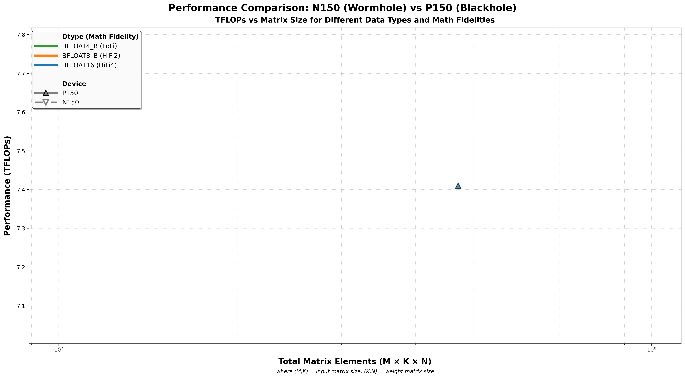
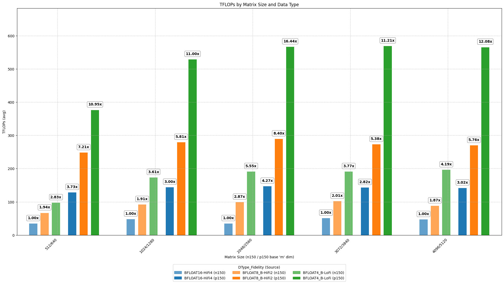
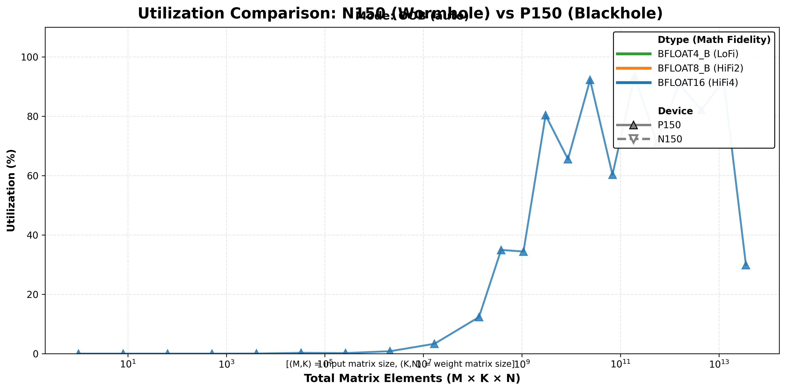
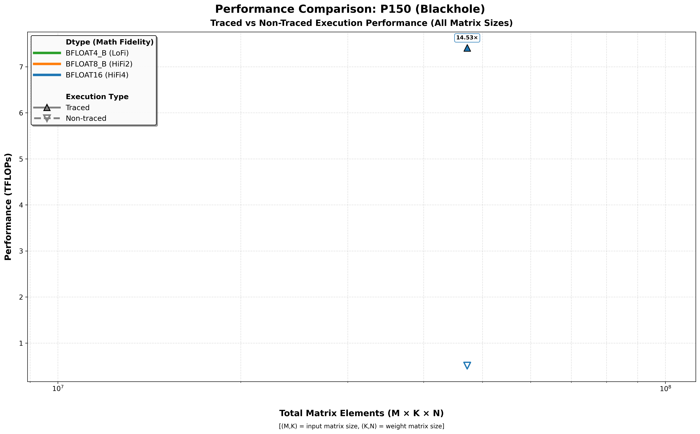
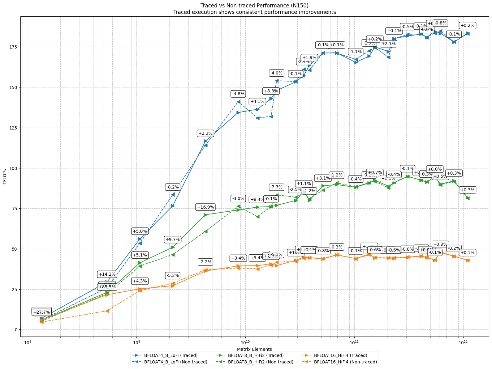
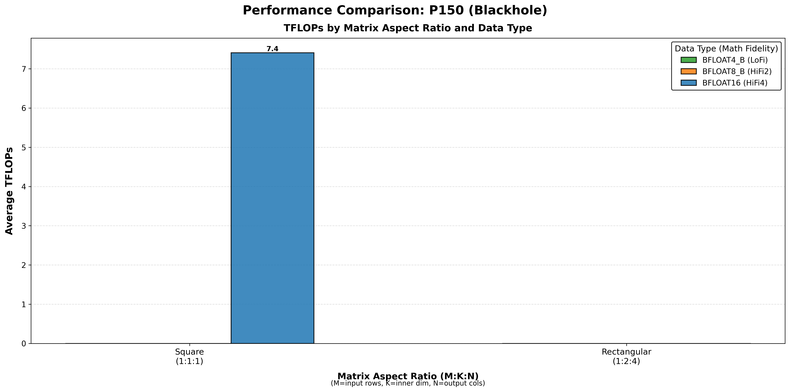
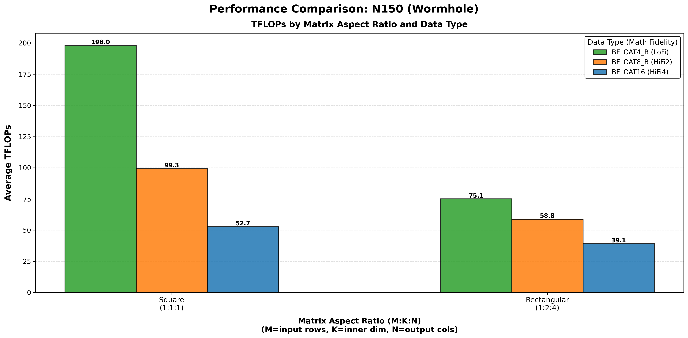

# Matrix Multiply FLOPS


## Introduction

Across many families of neural networks and applications, the common denominator is the use of the generalized matrix multiply operation. Depending on the size and the precision of the input and output matrices, different underlying effects, and more importantly performance metrics, can be observed. Classically, this comes down to the hardware's ability to execute an operation, and its ability to fetch the data for that operation intercept.

If the data is small and already in registers, the cost to operate on that data is negligible. If the data is in cache, performance is dictated by how quickly the data can be funnelled through caches to the compute units. In the worst case scenarios, the data needed is in device memory, host memory, or stored on a disk.

Thankfully, matrix multiplication requires more compute operations (2N^3) than memory operations (3N^2). As such, for a given device, there will always be points at which a device is limited by the underlying compute units, not the underlying memory system. We call this point the roofline.
However, said inversion point depends on the size and crossover point of each cache level/memory technology and the datatype in use. The amount of 8 bit elements that can be moved per unit time is nearly an order of magnitude more than 64 bit elements.

Therefore, the peak achieved flops changes based on the datatype, the size of the data, and the layout of the data.

### Running Benchmarks

The matrix multiply TFLOPS results can be tested on any Wormhole or Blackhole card using:

**For manually selected matmul configurations (best performance):**
```bash
TT_METAL_PROFILER_MID_RUN_DUMP=1 TT_METAL_DEVICE_PROFILER=1 pytest tests/ttnn/unit_tests/benchmarks/test_benchmark.py::test_matmul_2d_host_perf
```

**For out-of-box matmul configurations (default settings):**
```bash
TT_METAL_PROFILER_MID_RUN_DUMP=1 TT_METAL_DEVICE_PROFILER=1 pytest tests/ttnn/unit_tests/benchmarks/test_benchmark.py::test_matmul_2d_host_perf_out_of_box
```

Alternatively, to test on an N300 card, use ```WH_ARCH_YAML=wormhole_b0_80_arch_eth_dispatch.yaml``` before each command.
Python scripts for reproducing the plots are included in this directory.

## Design of Experiments
The parameters of interest are 3 fold:
1. **Dimensions**: The sizes of the matrices along each axis, denoted as M, K, and N. (M, K) represents the size of the input tensor, while (K, N) is the size of the weight matrix.
Larger tensors require more computation since the number of operations needed to perform matrix multiplication increases as O(MKN).
2. **Computation Fidelity**: Referred to as LoFi, HiFi2, HiFi3, and HiFi4. Internally, the matrix engine can adjust the number of bits being processed, which affects both the precision of the results and the computation speed.
3. **Input/Output Datatype**: Larger datatypes require more memory for storage. As a result, more precise datatypes can become bottlenecked if stored in DRAM.

For more details please refer to the tech reports [Matrix Engine](../matrix_engine/matrix_engine.md) and [Data Formats](../data_formats/data_formats.md)

For example, when changing the precision of the matrix, for a given size of matrix the output performance is expected to be different.


## MicroBenchmarks

### Matrix Multiplication TFLOPS on Wormhole/Blackhole (WH/BH)

The matrix engine performs 8x16 x 16x16 = 8x16 in a single cycle.
- This is 2*8\*16\*16 = 4096 multiply-adds in a single cycle.
- At 1.35GHz (BH), this is 5.4 TFLOPS per matrix engine.
- At 1GHz (WH), this is 4 TFLOPS per matrix engine.
- The 8x16 is the smallest matrix that can be fed into in0, and 16x16 is the smallest matrix that can be fed into in1.

If the input matrices fed into the engine are "shorter" than 8x16, for example 1x16, the engine will still perform 8x16 x 16x16 = 8x16, but the effective throughput will be 1/8.
Thus, for 1x16 x 16x16 matrices, the effective throughput is 0.5 TFLOPS per matrix engine (WH) or 0.675 TFLOPS per matrix engine (BH).

MATH_FIDELITY is used for higher precision, and TFLOPS are calculated by dividing by the MATH_FIDELITY value.

| Math Fidelity | BH (1.35GHz) | WH (1GHz) |
|---------------|--------------|-----------|
| LoFi          | ~5.4 TFLOPS  | ~4 TFLOPS |
| HiFi2         | ~2.7 TFLOPS  | ~2 TFLOPS |
| HiFi4         | ~1.35 TFLOPS | ~1 TFLOPS |


### Manually Tuned Performance
Here we show the peak results we can get from manually selected matmul configurations, including packer L1 enablement, math fidelity, input/output sharding, and input/output L1/DRAM selection.
#### Peak FLOPS

Depending on the fidelity, datatype, and matrix shape chosen, different peak teraflop values can be achieved.

Below are the results generated from running the benchmark script, showcasing the performance of matrix multiplication (matmul) operations using matrices of sizes ranging from 512x512x512 / 640x832x832 to 16384x16384x16384 / 20480x26624x26624 . The results include evaluations across various data formats, paired with different levels of math fidelity (BFLOAT16 (HiFi4),  BFLOAT8_B (HiFi2), and BFLOAT4_B (LoFi)).

We also show the results with and without trace (see [AdvancedPerformanceOptimizationsForModels](../AdvancedPerformanceOptimizationsForModels/AdvancedPerformanceOptimizationsForModels.md) for details of trace). With trace, we can minimize the overhead of host which can reflect the actual device performance better.


Finally, we present the results in terms of device time, device throughput in TFLOPS, device utilization compared to the full grid size (8×8 in Wormhole and 13x10 in Blackhole).


As seen below, while Wormhole cards can perform matrix multiplications at around 190 TFLOPs, Blackhole cards have even more impressive throughput at 580 TFLOPs. Lower fidelity computations with less precise datatypes complete faster than "full fidelity" computations. BFLOAT8_B (HiFi2) is roughly **1.5x to 1.8x faster** than BFLOAT16 (HiFi4), with BFLOAT4_B (LoFi) coming in at **2x to 3.5x** faster without tracing.


#### Performance scatter plot across all matrix sizes and configurations




#### Performance bar plot across all matrix sizes and configurations
Note : Performance multipliers are calculated relative to N150 BFLOAT16 (HiFi4) as the baseline (1.00×) for each matrix size, showing how much faster or slower each configuration performs compared to that baseline.



### Utilization

#### Utilization derivation formula

```
Utilization = ideal cycles / actual cycles.
Ideal cycles = (M x K x N) / (tile_height * tile_width * tile_height) * (cycle_per_tile / num_cores)
```
- Cycle_per_tile is the ideal compute cycle for each tile, which depends on math fidelity (LoFi: 16, HiFi2: 32, HiFi3: 48, HiFi4: 64).
- For utilization of full grid size, num_cores is the maximum number of cores available for compute. Currently the max for Wormhole is 8x8 with Blackhole supporting up to 13x10.

#### Utilization plot across all matrix sizes and configurations, based on the chip TFLOPS calculated per each Math Fidelity


Blackhole (P150) achieves excellent utilization across the board, with peak utilization reaching 96% and 61% of configurations exceeding 80% utilization. This represents a significant improvement over Wormhole (N150), which peaks at ~93% with only 32% of configurations above 80%.

### Understanding Device Scaling: SRAM vs DRAM

When a Tensix core executes an operation, it reads data from SRAM, forwards it to a register, performs the computation, and then writes the result back to SRAM. Each Tensix core on a WH ASIC has approximately 1.5MB of SRAM. When data fits within this SRAM, each Tensix can operate without contention. However, some problems require more working memory than SRAM can provide. In these cases, the Tensix core will instead map data to device memory or DRAM. Accessing data from DRAM is slower than SRAM, both in terms of bandwidth and latency.

In this report, the developed Python scripts evaluate three separate configurations:
1. All matrices stored on L1 (SRAM)
2. One matrix on L1 and one on DRAM
3. Both matrices on DRAM

In most cases, storing all matrices on L1 is ideal, as it completely avoids accessing the slower DRAM. The configuration with one matrix on L1 and one on DRAM incurs a small performance penalty, typically in the single-digit percentage range at worst. DRAM-only performance is highly variable: small matrices suffer the largest performance penalty when stored in DRAM, while larger tensors achieve performance closer to an L1-only configuration.

### Tracing

Tracing in the TT-Metallium stack is a performance optimization that records commands for dispatching operations into the DRAM buffer and replays them later for execution, removing host overhead of dispatching operations during a loop iteration.

#### Tracing on P150




#### Tracing on N150



As shown here, on both Wormhole and Blackhole, Trace helps recover more lost performance on smaller tensor matrix multiplications compared to larger ones. This is likely because smaller matrix operations take less time to execute than larger ones, meaning that host overhead is, percentage-wise, more harmful to overall runtime and maximum throughput compared to larger tensors.


### Rectangular Matrix

Both architectures perform most ideally when the input tensors are closest to square shapes, but they still perform well on rectangular matrices. However, as the tensors become more rectangular, performance takes a larger hit.

#### Rectangular Matrix on P150



#### Rectangular Matrix on N150




#### Out of Box Performance
We also show the peak results we can get based on auto-selected matmul configurations.
On both Wormhole and Blackhole, hand-tuned configs helps recover more lost performance on smaller tensor matrix multiplications compared to larger ones. Similar to tracing, the configuration matters more for smaller tensors, as it is harder to saturate the core grid with smaller workloads compared to larger ones.


<details>
<summary><strong>N150 Out of Box Results</strong> (click to expand)</summary>

| M | K | N | Use Trace | Grid Size | In0 Storage Type | In1 Storage Type | Out Storage Type | Dtype | Math Fidelity | Inference Time Avg [ns] | TFLOPs (avg) | Host Based Utilization[%] | Device Based Utilization[%] |
| --- | --- | --- | --- | --- | --- | --- | --- | --- | --- | --- | --- | --- | --- |
| 512 | 512 | 512 | False | (8, 8) | DRAM | DRAM | DRAM | DataType.BFLOAT16 | MathFidelity.HiFi2 | 49049.85 | 5.47 | 4.18 | 19.04 |
| 512 | 1024 | 1024 | False | (8, 8) | DRAM | DRAM | DRAM | DataType.BFLOAT16 | MathFidelity.HiFi2 | 117115.97 | 9.17 | 6.99 | 9.01 |
| 512 | 1024 | 2048 | False | (8, 8) | DRAM | DRAM | DRAM | DataType.BFLOAT16 | MathFidelity.HiFi2 | 141491.89 | 15.18 | 11.58 | 16.70 |
| 1024 | 1024 | 1024 | False | (8, 8) | DRAM | DRAM | DRAM | DataType.BFLOAT16 | MathFidelity.HiFi2 | 72388.65 | 29.67 | 22.63 | 41.69 |
| 1024 | 1024 | 2048 | False | (8, 8) | DRAM | DRAM | DRAM | DataType.BFLOAT16 | MathFidelity.HiFi2 | 116362.57 | 36.91 | 28.16 | 56.83 |
| 1024 | 2048 | 2048 | False | (8, 8) | DRAM | DRAM | DRAM | DataType.BFLOAT16 | MathFidelity.HiFi2 | 163326.26 | 52.59 | 40.13 | 60.52 |
| 2048 | 2048 | 2048 | False | (8, 8) | DRAM | DRAM | DRAM | DataType.BFLOAT16 | MathFidelity.HiFi2 | 302200.32 | 56.85 | 43.37 | 66.74 |
| 2048 | 2048 | 3072 | False | (8, 8) | DRAM | DRAM | DRAM | DataType.BFLOAT16 | MathFidelity.HiFi2 | 454769.13 | 56.67 | 43.23 | 70.08 |
| 2048 | 3072 | 3072 | False | (8, 8) | DRAM | DRAM | DRAM | DataType.BFLOAT16 | MathFidelity.HiFi2 | 581557.75 | 66.47 | 50.71 | 71.31 |
| 3072 | 3072 | 3072 | False | (8, 8) | DRAM | DRAM | DRAM | DataType.BFLOAT16 | MathFidelity.HiFi2 | 887527.47 | 65.33 | 49.84 | 58.18 |
| 3072 | 3072 | 4096 | False | (8, 8) | DRAM | DRAM | DRAM | DataType.BFLOAT16 | MathFidelity.HiFi2 | 1146514.42 | 67.43 | 51.44 | 60.97 |
| 3072 | 4096 | 4096 | False | (8, 8) | DRAM | DRAM | DRAM | DataType.BFLOAT16 | MathFidelity.HiFi2 | 1465699.67 | 70.33 | 53.66 | 59.36 |
| 4096 | 4096 | 4096 | False | (8, 8) | DRAM | DRAM | DRAM | DataType.BFLOAT16 | MathFidelity.HiFi2 | 2016849.52 | 68.15 | 51.99 | 59.49 |
| 512 | 512 | 512 | True | (8, 8) | DRAM | DRAM | DRAM | DataType.BFLOAT16 | MathFidelity.HiFi2 | 19965.17 | 13.45 | 10.26 | 17.82 |
| 512 | 1024 | 1024 | True | (8, 8) | DRAM | DRAM | DRAM | DataType.BFLOAT16 | MathFidelity.HiFi2 | 115242.00 | 9.32 | 7.11 | 9.00 |
| 512 | 1024 | 2048 | True | (8, 8) | DRAM | DRAM | DRAM | DataType.BFLOAT16 | MathFidelity.HiFi2 | 140731.33 | 15.26 | 11.64 | 16.70 |
| 1024 | 1024 | 1024 | True | (8, 8) | DRAM | DRAM | DRAM | DataType.BFLOAT16 | MathFidelity.HiFi2 | 68984.03 | 31.13 | 23.75 | 41.64 |
| 1024 | 1024 | 2048 | True | (8, 8) | DRAM | DRAM | DRAM | DataType.BFLOAT16 | MathFidelity.HiFi2 | 113062.86 | 37.99 | 28.98 | 56.61 |
| 1024 | 2048 | 2048 | True | (8, 8) | DRAM | DRAM | DRAM | DataType.BFLOAT16 | MathFidelity.HiFi2 | 159676.07 | 53.80 | 41.04 | 60.49 |
| 2048 | 2048 | 2048 | True | (8, 8) | DRAM | DRAM | DRAM | DataType.BFLOAT16 | MathFidelity.HiFi2 | 298922.06 | 57.47 | 43.85 | 66.74 |
| 2048 | 2048 | 3072 | True | (8, 8) | DRAM | DRAM | DRAM | DataType.BFLOAT16 | MathFidelity.HiFi2 | 450646.88 | 57.18 | 43.63 | 70.07 |
| 2048 | 3072 | 3072 | True | (8, 8) | DRAM | DRAM | DRAM | DataType.BFLOAT16 | MathFidelity.HiFi2 | 576856.14 | 67.01 | 51.12 | 71.30 |
| 3072 | 3072 | 3072 | True | (8, 8) | DRAM | DRAM | DRAM | DataType.BFLOAT16 | MathFidelity.HiFi2 | 886178.02 | 65.43 | 49.92 | 58.19 |
| 3072 | 3072 | 4096 | True | (8, 8) | DRAM | DRAM | DRAM | DataType.BFLOAT16 | MathFidelity.HiFi2 | 1142554.28 | 67.66 | 51.62 | 60.97 |
| 3072 | 4096 | 4096 | True | (8, 8) | DRAM | DRAM | DRAM | DataType.BFLOAT16 | MathFidelity.HiFi2 | 1458785.53 | 70.66 | 53.91 | 59.41 |
| 4096 | 4096 | 4096 | True | (8, 8) | DRAM | DRAM | DRAM | DataType.BFLOAT16 | MathFidelity.HiFi2 | 2008533.48 | 68.43 | 52.21 | 59.46 |
| 512 | 512 | 512 | False | (8, 8) | DRAM | DRAM | DRAM | DataType.BFLOAT8_B | MathFidelity.LoFi | 48458.58 | 5.54 | 2.11 | 13.09 |
| 512 | 1024 | 1024 | False | (8, 8) | DRAM | DRAM | DRAM | DataType.BFLOAT8_B | MathFidelity.LoFi | 74362.75 | 14.44 | 5.51 | 7.03 |
| 512 | 1024 | 2048 | False | (8, 8) | DRAM | DRAM | DRAM | DataType.BFLOAT8_B | MathFidelity.LoFi | 87664.13 | 24.50 | 9.34 | 13.13 |
| 1024 | 1024 | 1024 | False | (8, 8) | DRAM | DRAM | DRAM | DataType.BFLOAT8_B | MathFidelity.LoFi | 46341.42 | 46.34 | 17.68 | 33.86 |
| 1024 | 1024 | 2048 | False | (8, 8) | DRAM | DRAM | DRAM | DataType.BFLOAT8_B | MathFidelity.LoFi | 69828.03 | 61.51 | 23.46 | 45.22 |
| 1024 | 2048 | 2048 | False | (8, 8) | DRAM | DRAM | DRAM | DataType.BFLOAT8_B | MathFidelity.LoFi | 94122.89 | 91.26 | 34.81 | 53.13 |
| 2048 | 2048 | 2048 | False | (8, 8) | DRAM | DRAM | DRAM | DataType.BFLOAT8_B | MathFidelity.LoFi | 157222.75 | 109.27 | 41.68 | 63.83 |
| 2048 | 2048 | 3072 | False | (8, 8) | DRAM | DRAM | DRAM | DataType.BFLOAT8_B | MathFidelity.LoFi | 236735.34 | 108.85 | 41.52 | 67.23 |
| 2048 | 3072 | 3072 | False | (8, 8) | DRAM | DRAM | DRAM | DataType.BFLOAT8_B | MathFidelity.LoFi | 302987.10 | 127.58 | 48.67 | 69.27 |
| 3072 | 3072 | 3072 | False | (8, 8) | DRAM | DRAM | DRAM | DataType.BFLOAT8_B | MathFidelity.LoFi | 441465.38 | 131.34 | 50.10 | 69.82 |
| 3072 | 3072 | 4096 | False | (8, 8) | DRAM | DRAM | DRAM | DataType.BFLOAT8_B | MathFidelity.LoFi | 579712.39 | 133.36 | 50.87 | 71.69 |
| 3072 | 4096 | 4096 | False | (8, 8) | DRAM | DRAM | DRAM | DataType.BFLOAT8_B | MathFidelity.LoFi | 744667.05 | 138.42 | 52.80 | 62.62 |
| 4096 | 4096 | 4096 | False | (8, 8) | DRAM | DRAM | DRAM | DataType.BFLOAT8_B | MathFidelity.LoFi | 941920.28 | 145.91 | 55.66 | 64.38 |
| 512 | 512 | 512 | True | (8, 8) | DRAM | DRAM | DRAM | DataType.BFLOAT8_B | MathFidelity.LoFi | 14207.36 | 18.89 | 7.21 | 11.28 |
| 512 | 1024 | 1024 | True | (8, 8) | DRAM | DRAM | DRAM | DataType.BFLOAT8_B | MathFidelity.LoFi | 72386.26 | 14.83 | 5.66 | 7.03 |
| 512 | 1024 | 2048 | True | (8, 8) | DRAM | DRAM | DRAM | DataType.BFLOAT8_B | MathFidelity.LoFi | 86517.33 | 24.82 | 9.47 | 13.13 |
| 1024 | 1024 | 1024 | True | (8, 8) | DRAM | DRAM | DRAM | DataType.BFLOAT8_B | MathFidelity.LoFi | 40965.08 | 52.42 | 20.00 | 33.54 |
| 1024 | 1024 | 2048 | True | (8, 8) | DRAM | DRAM | DRAM | DataType.BFLOAT8_B | MathFidelity.LoFi | 66068.17 | 65.01 | 24.80 | 45.07 |
| 1024 | 2048 | 2048 | True | (8, 8) | DRAM | DRAM | DRAM | DataType.BFLOAT8_B | MathFidelity.LoFi | 89848.04 | 95.61 | 36.47 | 52.97 |
| 2048 | 2048 | 2048 | True | (8, 8) | DRAM | DRAM | DRAM | DataType.BFLOAT8_B | MathFidelity.LoFi | 155975.82 | 110.14 | 42.02 | 63.73 |
| 2048 | 2048 | 3072 | True | (8, 8) | DRAM | DRAM | DRAM | DataType.BFLOAT8_B | MathFidelity.LoFi | 235431.19 | 109.46 | 41.75 | 67.18 |
| 2048 | 3072 | 3072 | True | (8, 8) | DRAM | DRAM | DRAM | DataType.BFLOAT8_B | MathFidelity.LoFi | 297122.00 | 130.10 | 49.63 | 69.28 |
| 3072 | 3072 | 3072 | True | (8, 8) | DRAM | DRAM | DRAM | DataType.BFLOAT8_B | MathFidelity.LoFi | 438799.86 | 132.14 | 50.41 | 69.84 |
| 3072 | 3072 | 4096 | True | (8, 8) | DRAM | DRAM | DRAM | DataType.BFLOAT8_B | MathFidelity.LoFi | 577411.65 | 133.89 | 51.07 | 71.69 |
| 3072 | 4096 | 4096 | True | (8, 8) | DRAM | DRAM | DRAM | DataType.BFLOAT8_B | MathFidelity.LoFi | 729207.99 | 141.36 | 53.92 | 62.60 |
| 4096 | 4096 | 4096 | True | (8, 8) | DRAM | DRAM | DRAM | DataType.BFLOAT8_B | MathFidelity.LoFi | 927324.30 | 148.21 | 56.54 | 64.35 |
| 512 | 512 | 512 | False | (8, 8) | DRAM | DRAM | DRAM | DataType.BFLOAT4_B | MathFidelity.LoFi | 50134.66 | 5.35 | 2.04 | 14.96 |
| 512 | 1024 | 1024 | False | (8, 8) | DRAM | DRAM | DRAM | DataType.BFLOAT4_B | MathFidelity.LoFi | 60689.45 | 17.69 | 6.75 | 8.70 |
| 512 | 1024 | 2048 | False | (8, 8) | DRAM | DRAM | DRAM | DataType.BFLOAT4_B | MathFidelity.LoFi | 69224.83 | 31.02 | 11.83 | 17.29 |
| 1024 | 1024 | 1024 | False | (8, 8) | DRAM | DRAM | DRAM | DataType.BFLOAT4_B | MathFidelity.LoFi | 50826.07 | 42.25 | 16.12 | 47.96 |
| 1024 | 1024 | 2048 | False | (8, 8) | DRAM | DRAM | DRAM | DataType.BFLOAT4_B | MathFidelity.LoFi | 51388.74 | 83.58 | 31.88 | 55.95 |
| 1024 | 2048 | 2048 | False | (8, 8) | DRAM | DRAM | DRAM | DataType.BFLOAT4_B | MathFidelity.LoFi | 71642.40 | 119.90 | 45.74 | 65.40 |
| 2048 | 2048 | 2048 | False | (8, 8) | DRAM | DRAM | DRAM | DataType.BFLOAT4_B | MathFidelity.LoFi | 126240.25 | 136.09 | 51.91 | 73.96 |
| 2048 | 2048 | 3072 | False | (8, 8) | DRAM | DRAM | DRAM | DataType.BFLOAT4_B | MathFidelity.LoFi | 193784.24 | 132.98 | 50.73 | 75.38 |
| 2048 | 3072 | 3072 | False | (8, 8) | DRAM | DRAM | DRAM | DataType.BFLOAT4_B | MathFidelity.LoFi | 237233.64 | 162.94 | 62.16 | 77.91 |
| 3072 | 3072 | 3072 | False | (8, 8) | DRAM | DRAM | DRAM | DataType.BFLOAT4_B | MathFidelity.LoFi | 353837.01 | 163.87 | 62.51 | 79.74 |
| 3072 | 3072 | 4096 | False | (8, 8) | DRAM | DRAM | DRAM | DataType.BFLOAT4_B | MathFidelity.LoFi | 438330.17 | 176.37 | 67.28 | 80.72 |
| 3072 | 4096 | 4096 | False | (8, 8) | DRAM | DRAM | DRAM | DataType.BFLOAT4_B | MathFidelity.LoFi | 567185.88 | 181.74 | 69.33 | 81.70 |
| 4096 | 4096 | 4096 | False | (8, 8) | DRAM | DRAM | DRAM | DataType.BFLOAT4_B | MathFidelity.LoFi | 750935.08 | 183.02 | 69.82 | 82.25 |
| 512 | 512 | 512 | True | (8, 8) | DRAM | DRAM | DRAM | DataType.BFLOAT4_B | MathFidelity.LoFi | 12259.48 | 21.90 | 8.35 | 14.47 |
| 512 | 1024 | 1024 | True | (8, 8) | DRAM | DRAM | DRAM | DataType.BFLOAT4_B | MathFidelity.LoFi | 56591.03 | 18.97 | 7.24 | 8.70 |
| 512 | 1024 | 2048 | True | (8, 8) | DRAM | DRAM | DRAM | DataType.BFLOAT4_B | MathFidelity.LoFi | 61962.60 | 34.66 | 13.22 | 17.28 |
| 1024 | 1024 | 1024 | True | (8, 8) | DRAM | DRAM | DRAM | DataType.BFLOAT4_B | MathFidelity.LoFi | 27215.48 | 78.91 | 30.10 | 44.84 |
| 1024 | 1024 | 2048 | True | (8, 8) | DRAM | DRAM | DRAM | DataType.BFLOAT4_B | MathFidelity.LoFi | 44860.84 | 95.74 | 36.52 | 55.64 |
| 1024 | 2048 | 2048 | True | (8, 8) | DRAM | DRAM | DRAM | DataType.BFLOAT4_B | MathFidelity.LoFi | 63495.64 | 135.28 | 51.61 | 65.21 |
| 2048 | 2048 | 2048 | True | (8, 8) | DRAM | DRAM | DRAM | DataType.BFLOAT4_B | MathFidelity.LoFi | 114889.14 | 149.53 | 57.04 | 73.89 |
| 2048 | 2048 | 3072 | True | (8, 8) | DRAM | DRAM | DRAM | DataType.BFLOAT4_B | MathFidelity.LoFi | 173368.45 | 148.64 | 56.70 | 75.34 |
| 2048 | 3072 | 3072 | True | (8, 8) | DRAM | DRAM | DRAM | DataType.BFLOAT4_B | MathFidelity.LoFi | 231659.41 | 166.86 | 63.65 | 77.88 |
| 3072 | 3072 | 3072 | True | (8, 8) | DRAM | DRAM | DRAM | DataType.BFLOAT4_B | MathFidelity.LoFi | 336377.62 | 172.37 | 65.75 | 79.74 |
| 3072 | 3072 | 4096 | True | (8, 8) | DRAM | DRAM | DRAM | DataType.BFLOAT4_B | MathFidelity.LoFi | 439398.29 | 175.94 | 67.12 | 80.73 |
| 3072 | 4096 | 4096 | True | (8, 8) | DRAM | DRAM | DRAM | DataType.BFLOAT4_B | MathFidelity.LoFi | 558745.86 | 184.48 | 70.37 | 81.68 |
| 4096 | 4096 | 4096 | True | (8, 8) | DRAM | DRAM | DRAM | DataType.BFLOAT4_B | MathFidelity.LoFi | 746693.61 | 184.06 | 70.21 | 82.24 |

_All configurations: 78 configurations using default DRAM storage and auto-selected parameters._

</details>


<details>
<summary><strong>P150 Out of Box Results (13×10 grid)</strong> (click to expand)</summary>

| M | K | N | Use Trace | Grid Size | In0 Storage Type | In1 Storage Type | Out Storage Type | Dtype | Math Fidelity | Inference Time Avg [ns] | TFLOPs (avg) | Host Based Utilization[%] | Device Based Utilization[%] |
| --- | --- | --- | --- | --- | --- | --- | --- | --- | --- | --- | --- | --- | --- |
| 640 | 832 | 832 | False | (13, 10) | DRAM | DRAM | DRAM | DataType.BFLOAT16 | MathFidelity.HiFi2 | 21712.78 | 40.81 | 11.35 | 19.30 |
| 640 | 1664 | 1664 | False | (13, 10) | DRAM | DRAM | DRAM | DataType.BFLOAT16 | MathFidelity.HiFi2 | 32711.03 | 108.35 | 30.15 | 41.21 |
| 640 | 1664 | 3328 | False | (13, 10) | DRAM | DRAM | DRAM | DataType.BFLOAT16 | MathFidelity.HiFi2 | 55029.39 | 128.81 | 35.84 | 51.05 |
| 1280 | 1664 | 1664 | False | (13, 10) | DRAM | DRAM | DRAM | DataType.BFLOAT16 | MathFidelity.HiFi2 | 48613.55 | 145.81 | 40.57 | 61.93 |
| 1280 | 1664 | 3328 | False | (13, 10) | DRAM | DRAM | DRAM | DataType.BFLOAT16 | MathFidelity.HiFi2 | 85642.34 | 165.53 | 46.06 | 76.81 |
| 1280 | 3328 | 3328 | False | (13, 10) | DRAM | DRAM | DRAM | DataType.BFLOAT16 | MathFidelity.HiFi2 | 128111.84 | 221.32 | 61.58 | 81.07 |
| 2560 | 3328 | 3328 | False | (13, 10) | DRAM | DRAM | DRAM | DataType.BFLOAT16 | MathFidelity.HiFi2 | 240602.49 | 235.69 | 65.57 | 85.65 |
| 2560 | 3328 | 4992 | False | (13, 10) | DRAM | DRAM | DRAM | DataType.BFLOAT16 | MathFidelity.HiFi2 | 344324.11 | 247.04 | 68.73 | 86.52 |
| 2560 | 4992 | 4992 | False | (13, 10) | DRAM | DRAM | DRAM | DataType.BFLOAT16 | MathFidelity.HiFi2 | 465774.54 | 273.93 | 76.21 | 87.42 |
| 3840 | 4992 | 4992 | False | (13, 10) | DRAM | DRAM | DRAM | DataType.BFLOAT16 | MathFidelity.HiFi2 | 700097.08 | 273.37 | 76.06 | 80.25 |
| 3840 | 4992 | 6656 | False | (13, 10) | DRAM | DRAM | DRAM | DataType.BFLOAT16 | MathFidelity.HiFi2 | 941648.48 | 270.99 | 75.40 | 80.79 |
| 3840 | 6656 | 6656 | False | (13, 10) | DRAM | DRAM | DRAM | DataType.BFLOAT16 | MathFidelity.HiFi2 | 1211328.51 | 280.88 | 78.15 | 80.00 |
| 5120 | 6656 | 6656 | False | (13, 10) | DRAM | DRAM | DRAM | DataType.BFLOAT16 | MathFidelity.HiFi2 | 1610884.67 | 281.62 | 78.35 | 80.37 |
| 640 | 832 | 832 | True | (13, 10) | DRAM | DRAM | DRAM | DataType.BFLOAT16 | MathFidelity.HiFi2 | 18069.74 | 49.03 | 13.64 | 18.82 |
| 640 | 1664 | 1664 | True | (13, 10) | DRAM | DRAM | DRAM | DataType.BFLOAT16 | MathFidelity.HiFi2 | 32436.85 | 109.26 | 30.40 | 41.08 |
| 640 | 1664 | 3328 | True | (13, 10) | DRAM | DRAM | DRAM | DataType.BFLOAT16 | MathFidelity.HiFi2 | 54368.97 | 130.38 | 36.27 | 51.04 |
| 1280 | 1664 | 1664 | True | (13, 10) | DRAM | DRAM | DRAM | DataType.BFLOAT16 | MathFidelity.HiFi2 | 48279.76 | 146.82 | 40.85 | 61.85 |
| 1280 | 1664 | 3328 | True | (13, 10) | DRAM | DRAM | DRAM | DataType.BFLOAT16 | MathFidelity.HiFi2 | 84846.02 | 167.09 | 46.49 | 76.75 |
| 1280 | 3328 | 3328 | True | (13, 10) | DRAM | DRAM | DRAM | DataType.BFLOAT16 | MathFidelity.HiFi2 | 127110.48 | 223.06 | 62.06 | 81.07 |
| 2560 | 3328 | 3328 | True | (13, 10) | DRAM | DRAM | DRAM | DataType.BFLOAT16 | MathFidelity.HiFi2 | 239679.81 | 236.59 | 65.83 | 85.66 |
| 2560 | 3328 | 4992 | True | (13, 10) | DRAM | DRAM | DRAM | DataType.BFLOAT16 | MathFidelity.HiFi2 | 343863.96 | 247.37 | 68.82 | 86.55 |
| 2560 | 4992 | 4992 | True | (13, 10) | DRAM | DRAM | DRAM | DataType.BFLOAT16 | MathFidelity.HiFi2 | 465235.71 | 274.25 | 76.30 | 87.40 |
| 3840 | 4992 | 4992 | True | (13, 10) | DRAM | DRAM | DRAM | DataType.BFLOAT16 | MathFidelity.HiFi2 | 699429.51 | 273.63 | 76.13 | 80.25 |
| 3840 | 4992 | 6656 | True | (13, 10) | DRAM | DRAM | DRAM | DataType.BFLOAT16 | MathFidelity.HiFi2 | 941219.33 | 271.12 | 75.43 | 80.79 |
| 3840 | 6656 | 6656 | True | (13, 10) | DRAM | DRAM | DRAM | DataType.BFLOAT16 | MathFidelity.HiFi2 | 1211090.09 | 280.94 | 78.16 | 79.98 |
| 5120 | 6656 | 6656 | True | (13, 10) | DRAM | DRAM | DRAM | DataType.BFLOAT16 | MathFidelity.HiFi2 | 1609773.64 | 281.81 | 78.41 | 80.37 |
| 640 | 832 | 832 | False | (13, 10) | DRAM | DRAM | DRAM | DataType.BFLOAT8_B | MathFidelity.LoFi | 15618.80 | 56.73 | 7.89 | 10.32 |
| 640 | 1664 | 1664 | False | (13, 10) | DRAM | DRAM | DRAM | DataType.BFLOAT8_B | MathFidelity.LoFi | 25348.66 | 139.82 | 19.45 | 25.32 |
| 640 | 1664 | 3328 | False | (13, 10) | DRAM | DRAM | DRAM | DataType.BFLOAT8_B | MathFidelity.LoFi | 38230.42 | 185.41 | 25.79 | 33.98 |
| 1280 | 1664 | 1664 | False | (13, 10) | DRAM | DRAM | DRAM | DataType.BFLOAT8_B | MathFidelity.LoFi | 32222.27 | 219.98 | 30.60 | 43.73 |
| 1280 | 1664 | 3328 | False | (13, 10) | DRAM | DRAM | DRAM | DataType.BFLOAT8_B | MathFidelity.LoFi | 51093.10 | 277.47 | 38.60 | 61.60 |
| 1280 | 3328 | 3328 | False | (13, 10) | DRAM | DRAM | DRAM | DataType.BFLOAT8_B | MathFidelity.LoFi | 73120.59 | 387.76 | 53.94 | 71.26 |
| 2560 | 3328 | 3328 | False | (13, 10) | DRAM | DRAM | DRAM | DataType.BFLOAT8_B | MathFidelity.LoFi | 128996.37 | 439.60 | 61.15 | 81.32 |
| 2560 | 3328 | 4992 | False | (13, 10) | DRAM | DRAM | DRAM | DataType.BFLOAT8_B | MathFidelity.LoFi | 185058.12 | 459.64 | 63.94 | 82.92 |
| 2560 | 4992 | 4992 | False | (13, 10) | DRAM | DRAM | DRAM | DataType.BFLOAT8_B | MathFidelity.LoFi | 247588.16 | 515.33 | 71.69 | 84.72 |
| 3840 | 4992 | 4992 | False | (13, 10) | DRAM | DRAM | DRAM | DataType.BFLOAT8_B | MathFidelity.LoFi | 361664.30 | 529.18 | 73.62 | 86.41 |
| 3840 | 4992 | 6656 | False | (13, 10) | DRAM | DRAM | DRAM | DataType.BFLOAT8_B | MathFidelity.LoFi | 483880.04 | 527.37 | 73.36 | 86.70 |
| 3840 | 6656 | 6656 | False | (13, 10) | DRAM | DRAM | DRAM | DataType.BFLOAT8_B | MathFidelity.LoFi | 619204.04 | 549.48 | 76.44 | 80.80 |
| 5120 | 6656 | 6656 | False | (13, 10) | DRAM | DRAM | DRAM | DataType.BFLOAT8_B | MathFidelity.LoFi | 819244.38 | 553.75 | 77.03 | 80.87 |
| 640 | 832 | 832 | True | (13, 10) | DRAM | DRAM | DRAM | DataType.BFLOAT8_B | MathFidelity.LoFi | 15175.34 | 58.39 | 8.12 | 10.30 |
| 640 | 1664 | 1664 | True | (13, 10) | DRAM | DRAM | DRAM | DataType.BFLOAT8_B | MathFidelity.LoFi | 24542.81 | 144.41 | 20.09 | 25.19 |
| 640 | 1664 | 3328 | True | (13, 10) | DRAM | DRAM | DRAM | DataType.BFLOAT8_B | MathFidelity.LoFi | 38168.43 | 185.71 | 25.83 | 33.89 |
| 1280 | 1664 | 1664 | True | (13, 10) | DRAM | DRAM | DRAM | DataType.BFLOAT8_B | MathFidelity.LoFi | 31893.25 | 222.25 | 30.92 | 43.72 |
| 1280 | 1664 | 3328 | True | (13, 10) | DRAM | DRAM | DRAM | DataType.BFLOAT8_B | MathFidelity.LoFi | 50685.41 | 279.70 | 38.91 | 61.45 |
| 1280 | 3328 | 3328 | True | (13, 10) | DRAM | DRAM | DRAM | DataType.BFLOAT8_B | MathFidelity.LoFi | 72801.11 | 389.47 | 54.18 | 71.22 |
| 2560 | 3328 | 3328 | True | (13, 10) | DRAM | DRAM | DRAM | DataType.BFLOAT8_B | MathFidelity.LoFi | 126972.20 | 446.61 | 62.13 | 81.31 |
| 2560 | 3328 | 4992 | True | (13, 10) | DRAM | DRAM | DRAM | DataType.BFLOAT8_B | MathFidelity.LoFi | 181505.68 | 468.64 | 65.19 | 82.96 |
| 2560 | 4992 | 4992 | True | (13, 10) | DRAM | DRAM | DRAM | DataType.BFLOAT8_B | MathFidelity.LoFi | 243880.75 | 523.17 | 72.78 | 84.73 |
| 3840 | 4992 | 4992 | True | (13, 10) | DRAM | DRAM | DRAM | DataType.BFLOAT8_B | MathFidelity.LoFi | 358223.92 | 534.26 | 74.32 | 86.41 |
| 3840 | 4992 | 6656 | True | (13, 10) | DRAM | DRAM | DRAM | DataType.BFLOAT8_B | MathFidelity.LoFi | 480144.02 | 531.47 | 73.93 | 86.74 |
| 3840 | 6656 | 6656 | True | (13, 10) | DRAM | DRAM | DRAM | DataType.BFLOAT8_B | MathFidelity.LoFi | 614566.80 | 553.63 | 77.02 | 80.84 |
| 5120 | 6656 | 6656 | True | (13, 10) | DRAM | DRAM | DRAM | DataType.BFLOAT8_B | MathFidelity.LoFi | 812776.09 | 558.16 | 77.65 | 80.83 |
| 640 | 832 | 832 | False | (13, 10) | DRAM | DRAM | DRAM | DataType.BFLOAT4_B | MathFidelity.LoFi | 17251.97 | 51.36 | 7.14 | 10.91 |
| 640 | 1664 | 1664 | False | (13, 10) | DRAM | DRAM | DRAM | DataType.BFLOAT4_B | MathFidelity.LoFi | 28364.66 | 124.95 | 17.38 | 28.63 |
| 640 | 1664 | 3328 | False | (13, 10) | DRAM | DRAM | DRAM | DataType.BFLOAT4_B | MathFidelity.LoFi | 36702.16 | 193.13 | 26.87 | 38.32 |
| 1280 | 1664 | 1664 | False | (13, 10) | DRAM | DRAM | DRAM | DataType.BFLOAT4_B | MathFidelity.LoFi | 31585.69 | 224.42 | 31.22 | 50.93 |
| 1280 | 1664 | 3328 | False | (13, 10) | DRAM | DRAM | DRAM | DataType.BFLOAT4_B | MathFidelity.LoFi | 45259.00 | 313.24 | 43.57 | 67.30 |
| 1280 | 3328 | 3328 | False | (13, 10) | DRAM | DRAM | DRAM | DataType.BFLOAT4_B | MathFidelity.LoFi | 63893.80 | 443.76 | 61.73 | 76.42 |
| 2560 | 3328 | 3328 | False | (13, 10) | DRAM | DRAM | DRAM | DataType.BFLOAT4_B | MathFidelity.LoFi | 117444.99 | 482.84 | 67.17 | 82.31 |
| 2560 | 3328 | 4992 | False | (13, 10) | DRAM | DRAM | DRAM | DataType.BFLOAT4_B | MathFidelity.LoFi | 161149.50 | 527.84 | 73.43 | 83.95 |
| 2560 | 4992 | 4992 | False | (13, 10) | DRAM | DRAM | DRAM | DataType.BFLOAT4_B | MathFidelity.LoFi | 225834.85 | 564.97 | 78.59 | 85.86 |
| 3840 | 4992 | 4992 | False | (13, 10) | DRAM | DRAM | DRAM | DataType.BFLOAT4_B | MathFidelity.LoFi | 331790.45 | 576.83 | 80.24 | 87.42 |
| 3840 | 4992 | 6656 | False | (13, 10) | DRAM | DRAM | DRAM | DataType.BFLOAT4_B | MathFidelity.LoFi | 440454.48 | 579.36 | 80.60 | 87.85 |
| 3840 | 6656 | 6656 | False | (13, 10) | DRAM | DRAM | DRAM | DataType.BFLOAT4_B | MathFidelity.LoFi | 567355.16 | 599.70 | 83.42 | 88.63 |
| 5120 | 6656 | 6656 | False | (13, 10) | DRAM | DRAM | DRAM | DataType.BFLOAT4_B | MathFidelity.LoFi | 749273.30 | 605.46 | 84.23 | 89.27 |
| 640 | 832 | 832 | True | (13, 10) | DRAM | DRAM | DRAM | DataType.BFLOAT4_B | MathFidelity.LoFi | 13511.18 | 65.58 | 9.12 | 10.85 |
| 640 | 1664 | 1664 | True | (13, 10) | DRAM | DRAM | DRAM | DataType.BFLOAT4_B | MathFidelity.LoFi | 21009.45 | 168.69 | 23.47 | 27.51 |
| 640 | 1664 | 3328 | True | (13, 10) | DRAM | DRAM | DRAM | DataType.BFLOAT4_B | MathFidelity.LoFi | 30767.92 | 230.38 | 32.05 | 38.21 |
| 1280 | 1664 | 1664 | True | (13, 10) | DRAM | DRAM | DRAM | DataType.BFLOAT4_B | MathFidelity.LoFi | 25050.64 | 282.96 | 39.36 | 50.65 |
| 1280 | 1664 | 3328 | True | (13, 10) | DRAM | DRAM | DRAM | DataType.BFLOAT4_B | MathFidelity.LoFi | 39494.04 | 358.96 | 49.94 | 67.13 |
| 1280 | 3328 | 3328 | True | (13, 10) | DRAM | DRAM | DRAM | DataType.BFLOAT4_B | MathFidelity.LoFi | 60267.45 | 470.46 | 65.45 | 76.38 |
| 2560 | 3328 | 3328 | True | (13, 10) | DRAM | DRAM | DRAM | DataType.BFLOAT4_B | MathFidelity.LoFi | 110042.10 | 515.32 | 71.69 | 82.30 |
| 2560 | 3328 | 4992 | True | (13, 10) | DRAM | DRAM | DRAM | DataType.BFLOAT4_B | MathFidelity.LoFi | 156936.65 | 542.01 | 75.40 | 83.96 |
| 2560 | 4992 | 4992 | True | (13, 10) | DRAM | DRAM | DRAM | DataType.BFLOAT4_B | MathFidelity.LoFi | 219643.12 | 580.90 | 80.81 | 85.87 |
| 3840 | 4992 | 4992 | True | (13, 10) | DRAM | DRAM | DRAM | DataType.BFLOAT4_B | MathFidelity.LoFi | 324723.72 | 589.38 | 81.99 | 87.42 |
| 3840 | 4992 | 6656 | True | (13, 10) | DRAM | DRAM | DRAM | DataType.BFLOAT4_B | MathFidelity.LoFi | 435388.09 | 586.10 | 81.53 | 87.85 |
| 3840 | 6656 | 6656 | True | (13, 10) | DRAM | DRAM | DRAM | DataType.BFLOAT4_B | MathFidelity.LoFi | 562322.14 | 605.07 | 84.17 | 88.62 |
| 5120 | 6656 | 6656 | True | (13, 10) | DRAM | DRAM | DRAM | DataType.BFLOAT4_B | MathFidelity.LoFi | 743987.56 | 609.76 | 84.82 | 89.27 |

_All configurations: 78 configurations using default DRAM storage and auto-selected parameters._

</details>


<details>
<summary><strong>P150 Out of Box Results (11×10 grid)</strong> (click to expand)</summary>

| M | K | N | Use Trace | Grid Size | In0 Storage Type | In1 Storage Type | Out Storage Type | Dtype | Math Fidelity | Inference Time Avg [ns] | TFLOPs (avg) | Host Based Utilization[%] | Device Based Utilization[%] |
| --- | --- | --- | --- | --- | --- | --- | --- | --- | --- | --- | --- | --- | --- |
| 640 | 704 | 704 | False | (11, 10) | DRAM | DRAM | DRAM | DataType.BFLOAT16 | MathFidelity.HiFi2 | 16806.13 | 37.75 | 12.41 | 18.53 |
| 640 | 1408 | 1408 | False | (11, 10) | DRAM | DRAM | DRAM | DataType.BFLOAT16 | MathFidelity.HiFi2 | 28903.48 | 87.79 | 28.87 | 41.77 |
| 640 | 1408 | 2816 | False | (11, 10) | DRAM | DRAM | DRAM | DataType.BFLOAT16 | MathFidelity.HiFi2 | 47180.65 | 107.57 | 35.37 | 51.42 |
| 1280 | 1408 | 1408 | False | (11, 10) | DRAM | DRAM | DRAM | DataType.BFLOAT16 | MathFidelity.HiFi2 | 42226.31 | 120.19 | 39.52 | 61.41 |
| 1280 | 1408 | 2816 | False | (11, 10) | DRAM | DRAM | DRAM | DataType.BFLOAT16 | MathFidelity.HiFi2 | 73273.18 | 138.53 | 45.55 | 75.98 |
| 1280 | 2816 | 2816 | False | (11, 10) | DRAM | DRAM | DRAM | DataType.BFLOAT16 | MathFidelity.HiFi2 | 108661.65 | 186.82 | 61.43 | 80.39 |
| 2560 | 2816 | 2816 | False | (11, 10) | DRAM | DRAM | DRAM | DataType.BFLOAT16 | MathFidelity.HiFi2 | 204129.22 | 198.90 | 65.40 | 85.08 |
| 2560 | 2816 | 4224 | False | (11, 10) | DRAM | DRAM | DRAM | DataType.BFLOAT16 | MathFidelity.HiFi2 | 292313.10 | 208.34 | 68.50 | 86.13 |
| 2560 | 4224 | 4224 | False | (11, 10) | DRAM | DRAM | DRAM | DataType.BFLOAT16 | MathFidelity.HiFi2 | 392649.17 | 232.66 | 76.50 | 87.02 |
| 3840 | 4224 | 4224 | False | (11, 10) | DRAM | DRAM | DRAM | DataType.BFLOAT16 | MathFidelity.HiFi2 | 589127.54 | 232.59 | 76.48 | 80.39 |
| 3840 | 4224 | 5632 | False | (11, 10) | DRAM | DRAM | DRAM | DataType.BFLOAT16 | MathFidelity.HiFi2 | 793492.79 | 230.25 | 75.71 | 80.62 |
| 3840 | 5632 | 5632 | False | (11, 10) | DRAM | DRAM | DRAM | DataType.BFLOAT16 | MathFidelity.HiFi2 | 1020178.79 | 238.79 | 78.52 | 80.26 |
| 5120 | 5632 | 5632 | False | (11, 10) | DRAM | DRAM | DRAM | DataType.BFLOAT16 | MathFidelity.HiFi2 | 1356883.05 | 239.38 | 78.71 | 80.51 |
| 640 | 704 | 704 | True | (11, 10) | DRAM | DRAM | DRAM | DataType.BFLOAT16 | MathFidelity.HiFi2 | 15704.63 | 40.39 | 13.28 | 18.49 |
| 640 | 1408 | 1408 | True | (11, 10) | DRAM | DRAM | DRAM | DataType.BFLOAT16 | MathFidelity.HiFi2 | 27759.08 | 91.41 | 30.06 | 41.64 |
| 640 | 1408 | 2816 | True | (11, 10) | DRAM | DRAM | DRAM | DataType.BFLOAT16 | MathFidelity.HiFi2 | 46129.23 | 110.02 | 36.18 | 51.34 |
| 1280 | 1408 | 1408 | True | (11, 10) | DRAM | DRAM | DRAM | DataType.BFLOAT16 | MathFidelity.HiFi2 | 41365.62 | 122.69 | 40.34 | 61.35 |
| 1280 | 1408 | 2816 | True | (11, 10) | DRAM | DRAM | DRAM | DataType.BFLOAT16 | MathFidelity.HiFi2 | 72484.02 | 140.03 | 46.04 | 75.97 |
| 1280 | 2816 | 2816 | True | (11, 10) | DRAM | DRAM | DRAM | DataType.BFLOAT16 | MathFidelity.HiFi2 | 108106.14 | 187.78 | 61.74 | 80.38 |
| 2560 | 2816 | 2816 | True | (11, 10) | DRAM | DRAM | DRAM | DataType.BFLOAT16 | MathFidelity.HiFi2 | 203180.31 | 199.83 | 65.70 | 85.06 |
| 2560 | 2816 | 4224 | True | (11, 10) | DRAM | DRAM | DRAM | DataType.BFLOAT16 | MathFidelity.HiFi2 | 291085.24 | 209.22 | 68.79 | 86.13 |
| 2560 | 4224 | 4224 | True | (11, 10) | DRAM | DRAM | DRAM | DataType.BFLOAT16 | MathFidelity.HiFi2 | 392005.44 | 233.04 | 76.62 | 87.03 |
| 3840 | 4224 | 4224 | True | (11, 10) | DRAM | DRAM | DRAM | DataType.BFLOAT16 | MathFidelity.HiFi2 | 588295.46 | 232.92 | 76.59 | 80.38 |
| 3840 | 4224 | 5632 | True | (11, 10) | DRAM | DRAM | DRAM | DataType.BFLOAT16 | MathFidelity.HiFi2 | 792543.89 | 230.53 | 75.80 | 80.63 |
| 3840 | 5632 | 5632 | True | (11, 10) | DRAM | DRAM | DRAM | DataType.BFLOAT16 | MathFidelity.HiFi2 | 1019048.69 | 239.05 | 78.60 | 80.27 |
| 5120 | 5632 | 5632 | True | (11, 10) | DRAM | DRAM | DRAM | DataType.BFLOAT16 | MathFidelity.HiFi2 | 1356115.34 | 239.51 | 78.75 | 80.52 |
| 640 | 704 | 704 | False | (11, 10) | DRAM | DRAM | DRAM | DataType.BFLOAT8_B | MathFidelity.LoFi | 21262.17 | 29.84 | 4.91 | 10.64 |
| 640 | 1408 | 1408 | False | (11, 10) | DRAM | DRAM | DRAM | DataType.BFLOAT8_B | MathFidelity.LoFi | 21822.45 | 116.28 | 19.12 | 24.85 |
| 640 | 1408 | 2816 | False | (11, 10) | DRAM | DRAM | DRAM | DataType.BFLOAT8_B | MathFidelity.LoFi | 33488.27 | 151.55 | 24.92 | 32.93 |
| 1280 | 1408 | 1408 | False | (11, 10) | DRAM | DRAM | DRAM | DataType.BFLOAT8_B | MathFidelity.LoFi | 28336.05 | 179.10 | 29.45 | 43.39 |
| 1280 | 1408 | 2816 | False | (11, 10) | DRAM | DRAM | DRAM | DataType.BFLOAT8_B | MathFidelity.LoFi | 44577.12 | 227.70 | 37.43 | 61.02 |
| 1280 | 2816 | 2816 | False | (11, 10) | DRAM | DRAM | DRAM | DataType.BFLOAT8_B | MathFidelity.LoFi | 62484.74 | 324.89 | 53.41 | 72.55 |
| 2560 | 2816 | 2816 | False | (11, 10) | DRAM | DRAM | DRAM | DataType.BFLOAT8_B | MathFidelity.LoFi | 109882.35 | 369.49 | 60.75 | 80.56 |
| 2560 | 2816 | 4224 | False | (11, 10) | DRAM | DRAM | DRAM | DataType.BFLOAT8_B | MathFidelity.LoFi | 156202.32 | 389.89 | 64.10 | 82.31 |
| 2560 | 4224 | 4224 | False | (11, 10) | DRAM | DRAM | DRAM | DataType.BFLOAT8_B | MathFidelity.LoFi | 210812.09 | 433.33 | 71.24 | 84.39 |
| 3840 | 4224 | 4224 | False | (11, 10) | DRAM | DRAM | DRAM | DataType.BFLOAT8_B | MathFidelity.LoFi | 305144.79 | 449.06 | 73.83 | 85.81 |
| 3840 | 4224 | 5632 | False | (11, 10) | DRAM | DRAM | DRAM | DataType.BFLOAT8_B | MathFidelity.LoFi | 411376.95 | 444.13 | 73.02 | 86.55 |
| 3840 | 5632 | 5632 | False | (11, 10) | DRAM | DRAM | DRAM | DataType.BFLOAT8_B | MathFidelity.LoFi | 523614.88 | 465.24 | 76.49 | 80.59 |
| 5120 | 5632 | 5632 | False | (11, 10) | DRAM | DRAM | DRAM | DataType.BFLOAT8_B | MathFidelity.LoFi | 692412.85 | 469.09 | 77.12 | 80.74 |
| 640 | 704 | 704 | True | (11, 10) | DRAM | DRAM | DRAM | DataType.BFLOAT8_B | MathFidelity.LoFi | 13041.50 | 48.64 | 8.00 | 10.16 |
| 640 | 1408 | 1408 | True | (11, 10) | DRAM | DRAM | DRAM | DataType.BFLOAT8_B | MathFidelity.LoFi | 20992.76 | 120.88 | 19.87 | 24.75 |
| 640 | 1408 | 2816 | True | (11, 10) | DRAM | DRAM | DRAM | DataType.BFLOAT8_B | MathFidelity.LoFi | 32780.17 | 154.82 | 25.45 | 32.84 |
| 1280 | 1408 | 1408 | True | (11, 10) | DRAM | DRAM | DRAM | DataType.BFLOAT8_B | MathFidelity.LoFi | 27318.00 | 185.78 | 30.54 | 43.30 |
| 1280 | 1408 | 2816 | True | (11, 10) | DRAM | DRAM | DRAM | DataType.BFLOAT8_B | MathFidelity.LoFi | 43470.86 | 233.49 | 38.39 | 60.90 |
| 1280 | 2816 | 2816 | True | (11, 10) | DRAM | DRAM | DRAM | DataType.BFLOAT8_B | MathFidelity.LoFi | 60827.73 | 333.74 | 54.87 | 72.48 |
| 2560 | 2816 | 2816 | True | (11, 10) | DRAM | DRAM | DRAM | DataType.BFLOAT8_B | MathFidelity.LoFi | 107693.67 | 377.00 | 61.98 | 80.57 |
| 2560 | 2816 | 4224 | True | (11, 10) | DRAM | DRAM | DRAM | DataType.BFLOAT8_B | MathFidelity.LoFi | 153751.37 | 396.10 | 65.12 | 82.30 |
| 2560 | 4224 | 4224 | True | (11, 10) | DRAM | DRAM | DRAM | DataType.BFLOAT8_B | MathFidelity.LoFi | 206961.63 | 441.40 | 72.57 | 84.39 |
| 3840 | 4224 | 4224 | True | (11, 10) | DRAM | DRAM | DRAM | DataType.BFLOAT8_B | MathFidelity.LoFi | 301239.49 | 454.88 | 74.78 | 85.82 |
| 3840 | 4224 | 5632 | True | (11, 10) | DRAM | DRAM | DRAM | DataType.BFLOAT8_B | MathFidelity.LoFi | 406239.03 | 449.74 | 73.94 | 86.54 |
| 3840 | 5632 | 5632 | True | (11, 10) | DRAM | DRAM | DRAM | DataType.BFLOAT8_B | MathFidelity.LoFi | 519182.68 | 469.21 | 77.14 | 80.60 |
| 5120 | 5632 | 5632 | True | (11, 10) | DRAM | DRAM | DRAM | DataType.BFLOAT8_B | MathFidelity.LoFi | 688164.23 | 471.99 | 77.60 | 80.74 |
| 640 | 704 | 704 | False | (11, 10) | DRAM | DRAM | DRAM | DataType.BFLOAT4_B | MathFidelity.LoFi | 25565.62 | 24.81 | 4.08 | 11.46 |
| 640 | 1408 | 1408 | False | (11, 10) | DRAM | DRAM | DRAM | DataType.BFLOAT4_B | MathFidelity.LoFi | 25570.39 | 99.24 | 16.32 | 28.21 |
| 640 | 1408 | 2816 | False | (11, 10) | DRAM | DRAM | DRAM | DataType.BFLOAT4_B | MathFidelity.LoFi | 31387.81 | 161.69 | 26.58 | 38.03 |
| 1280 | 1408 | 1408 | False | (11, 10) | DRAM | DRAM | DRAM | DataType.BFLOAT4_B | MathFidelity.LoFi | 25932.79 | 195.70 | 32.17 | 50.34 |
| 1280 | 1408 | 2816 | False | (11, 10) | DRAM | DRAM | DRAM | DataType.BFLOAT4_B | MathFidelity.LoFi | 38523.67 | 263.48 | 43.32 | 65.78 |
| 1280 | 2816 | 2816 | False | (11, 10) | DRAM | DRAM | DRAM | DataType.BFLOAT4_B | MathFidelity.LoFi | 55992.60 | 362.56 | 59.61 | 75.16 |
| 2560 | 2816 | 2816 | False | (11, 10) | DRAM | DRAM | DRAM | DataType.BFLOAT4_B | MathFidelity.LoFi | 96886.16 | 419.06 | 68.89 | 81.50 |
| 2560 | 2816 | 4224 | False | (11, 10) | DRAM | DRAM | DRAM | DataType.BFLOAT4_B | MathFidelity.LoFi | 136110.78 | 447.44 | 73.56 | 83.11 |
| 2560 | 4224 | 4224 | False | (11, 10) | DRAM | DRAM | DRAM | DataType.BFLOAT4_B | MathFidelity.LoFi | 190069.68 | 480.62 | 79.02 | 85.13 |
| 3840 | 4224 | 4224 | False | (11, 10) | DRAM | DRAM | DRAM | DataType.BFLOAT4_B | MathFidelity.LoFi | 275609.49 | 497.18 | 81.74 | 86.88 |
| 3840 | 4224 | 5632 | False | (11, 10) | DRAM | DRAM | DRAM | DataType.BFLOAT4_B | MathFidelity.LoFi | 371630.19 | 491.63 | 80.83 | 87.32 |
| 3840 | 5632 | 5632 | False | (11, 10) | DRAM | DRAM | DRAM | DataType.BFLOAT4_B | MathFidelity.LoFi | 479862.69 | 507.66 | 83.46 | 88.12 |
| 5120 | 5632 | 5632 | False | (11, 10) | DRAM | DRAM | DRAM | DataType.BFLOAT4_B | MathFidelity.LoFi | 631761.55 | 514.13 | 84.53 | 88.86 |
| 640 | 704 | 704 | True | (11, 10) | DRAM | DRAM | DRAM | DataType.BFLOAT4_B | MathFidelity.LoFi | 11668.21 | 54.37 | 8.94 | 10.81 |
| 640 | 1408 | 1408 | True | (11, 10) | DRAM | DRAM | DRAM | DataType.BFLOAT4_B | MathFidelity.LoFi | 18179.42 | 139.58 | 22.95 | 26.89 |
| 640 | 1408 | 2816 | True | (11, 10) | DRAM | DRAM | DRAM | DataType.BFLOAT4_B | MathFidelity.LoFi | 26290.42 | 193.04 | 31.74 | 37.89 |
| 1280 | 1408 | 1408 | True | (11, 10) | DRAM | DRAM | DRAM | DataType.BFLOAT4_B | MathFidelity.LoFi | 21364.69 | 237.55 | 39.05 | 49.94 |
| 1280 | 1408 | 2816 | True | (11, 10) | DRAM | DRAM | DRAM | DataType.BFLOAT4_B | MathFidelity.LoFi | 33802.99 | 300.28 | 49.37 | 65.60 |
| 1280 | 2816 | 2816 | True | (11, 10) | DRAM | DRAM | DRAM | DataType.BFLOAT4_B | MathFidelity.LoFi | 51698.68 | 392.67 | 64.56 | 75.13 |
| 2560 | 2816 | 2816 | True | (11, 10) | DRAM | DRAM | DRAM | DataType.BFLOAT4_B | MathFidelity.LoFi | 93379.02 | 434.80 | 71.48 | 81.50 |
| 2560 | 2816 | 4224 | True | (11, 10) | DRAM | DRAM | DRAM | DataType.BFLOAT4_B | MathFidelity.LoFi | 131630.90 | 462.67 | 76.06 | 83.09 |
| 2560 | 4224 | 4224 | True | (11, 10) | DRAM | DRAM | DRAM | DataType.BFLOAT4_B | MathFidelity.LoFi | 184483.53 | 495.18 | 81.41 | 85.14 |
| 3840 | 4224 | 4224 | True | (11, 10) | DRAM | DRAM | DRAM | DataType.BFLOAT4_B | MathFidelity.LoFi | 270500.18 | 506.57 | 83.28 | 86.88 |
| 3840 | 4224 | 5632 | True | (11, 10) | DRAM | DRAM | DRAM | DataType.BFLOAT4_B | MathFidelity.LoFi | 366706.85 | 498.23 | 81.91 | 87.32 |
| 3840 | 5632 | 5632 | True | (11, 10) | DRAM | DRAM | DRAM | DataType.BFLOAT4_B | MathFidelity.LoFi | 475039.48 | 512.81 | 84.31 | 88.12 |
| 5120 | 5632 | 5632 | True | (11, 10) | DRAM | DRAM | DRAM | DataType.BFLOAT4_B | MathFidelity.LoFi | 627701.28 | 517.45 | 85.07 | 88.86 |

_All configurations: 78 configurations using default DRAM storage and auto-selected parameters._

</details>

### All Data


<details>
<summary><strong>N150 Manually Tuned Configurations</strong> (click to expand)</summary>

| m | k | n | use_trace | grid_size | in0_sharded | out_sharded | in0_storage_type | in1_storage_type | out_storage_type | dtype | math_fidelity | inference_time_avg [ns] | TFLOPs (avg) | Host based utilization[%] | Device based utilization[%] |
| --- | --- | --- | --- | --- | --- | --- | --- | --- | --- | --- | --- | --- | --- | --- | --- |
| 512 | 512 | 512 | False | (8, 8) | True | True | L1 | DRAM | L1 | DataType.BFLOAT16 | MathFidelity.HiFi2 | 189344.88 | 1.42 | 1.08 | 22.62 |
| 512 | 1024 | 1024 | False | (8, 8) | True | True | L1 | DRAM | L1 | DataType.BFLOAT16 | MathFidelity.HiFi2 | 99258.42 | 10.82 | 8.25 | 32.77 |
| 512 | 1024 | 2048 | False | (8, 8) | True | True | L1 | DRAM | L1 | DataType.BFLOAT16 | MathFidelity.HiFi2 | 97284.32 | 22.07 | 16.84 | 34.45 |
| 1024 | 1024 | 1024 | False | (8, 8) | True | True | L1 | DRAM | L1 | DataType.BFLOAT16 | MathFidelity.HiFi2 | 120749.47 | 17.78 | 13.57 | 49.69 |
| 1024 | 1024 | 2048 | False | (8, 8) | True | True | L1 | DRAM | L1 | DataType.BFLOAT16 | MathFidelity.HiFi2 | 91671.94 | 46.85 | 35.74 | 55.15 |
| 1024 | 2048 | 2048 | False | (8, 8) | True | True | L1 | DRAM | L1 | DataType.BFLOAT16 | MathFidelity.HiFi2 | 128169.06 | 67.02 | 51.13 | 57.70 |
| 2048 | 2048 | 2048 | False | (8, 8) | True | True | L1 | DRAM | L1 | DataType.BFLOAT16 | MathFidelity.HiFi2 | 229480.27 | 74.86 | 57.12 | 64.88 |
| 2048 | 2048 | 3072 | False | (8, 8) | True | True | L1 | DRAM | L1 | DataType.BFLOAT16 | MathFidelity.HiFi2 | 340693.00 | 75.64 | 57.71 | 64.52 |
| 2048 | 3072 | 3072 | False | (8, 8) | True | True | L1 | DRAM | L1 | DataType.BFLOAT16 | MathFidelity.HiFi2 | 502805.71 | 76.88 | 58.65 | 65.50 |
| 3072 | 3072 | 3072 | False | (8, 8) | True | True | L1 | DRAM | L1 | DataType.BFLOAT16 | MathFidelity.HiFi2 | 776360.03 | 74.68 | 56.98 | 64.56 |
| 3072 | 3072 | 4096 | False | (8, 8) | False | False | DRAM | DRAM | DRAM | DataType.BFLOAT16 | MathFidelity.HiFi2 | 1150054.93 | 67.22 | 51.29 | 74.19 |
| 3072 | 4096 | 4096 | False | (8, 8) | False | False | DRAM | DRAM | DRAM | DataType.BFLOAT16 | MathFidelity.HiFi2 | 1389207.84 | 74.20 | 56.61 | 75.09 |
| 3328 | 2560 | 2560 | False | (8, 8) | False | False | DRAM | DRAM | DRAM | DataType.BFLOAT16 | MathFidelity.HiFi2 | 732071.40 | 59.59 | 45.46 | 63.14 |
| 4096 | 4096 | 4096 | False | (8, 8) | False | False | DRAM | DRAM | DRAM | DataType.BFLOAT16 | MathFidelity.HiFi2 | 2010309.70 | 68.37 | 52.16 | 59.50 |
| 8192 | 8192 | 8192 | False | (8, 8) | False | False | DRAM | DRAM | DRAM | DataType.BFLOAT16 | MathFidelity.HiFi2 | 13574202.06 | 81.00 | 61.80 | 66.47 |
| 16384 | 16384 | 16384 | False | (8, 8) | False | False | DRAM | DRAM | DRAM | DataType.BFLOAT16 | MathFidelity.HiFi2 | 103123269.08 | 85.30 | 65.08 | 71.34 |
| 512 | 512 | 512 | False | (8, 8) | True | True | L1 | DRAM | L1 | DataType.BFLOAT16 | MathFidelity.HiFi4 | 93035.70 | 2.89 | 4.40 | 44.07 |
| 512 | 1024 | 1024 | False | (8, 8) | True | True | L1 | DRAM | L1 | DataType.BFLOAT16 | MathFidelity.HiFi4 | 93307.50 | 11.51 | 17.56 | 64.02 |
| 512 | 1024 | 2048 | False | (8, 8) | True | True | L1 | DRAM | L1 | DataType.BFLOAT16 | MathFidelity.HiFi4 | 112128.26 | 19.15 | 29.22 | 66.08 |
| 1024 | 1024 | 1024 | False | (8, 8) | True | True | L1 | DRAM | L1 | DataType.BFLOAT16 | MathFidelity.HiFi4 | 91037.75 | 23.59 | 35.99 | 79.19 |
| 1024 | 1024 | 2048 | False | (8, 8) | True | True | L1 | DRAM | L1 | DataType.BFLOAT16 | MathFidelity.HiFi4 | 111722.95 | 38.44 | 58.66 | 82.43 |
| 1024 | 2048 | 2048 | False | (8, 8) | True | True | L1 | DRAM | L1 | DataType.BFLOAT16 | MathFidelity.HiFi4 | 174596.31 | 49.20 | 75.07 | 85.07 |
| 2048 | 2048 | 2048 | False | (8, 8) | True | True | L1 | DRAM | L1 | DataType.BFLOAT16 | MathFidelity.HiFi4 | 337867.74 | 50.85 | 77.59 | 89.65 |
| 2048 | 2048 | 3072 | False | (8, 8) | True | True | L1 | DRAM | L1 | DataType.BFLOAT16 | MathFidelity.HiFi4 | 504572.39 | 51.07 | 77.93 | 90.21 |
| 2048 | 3072 | 3072 | False | (8, 8) | True | True | L1 | DRAM | L1 | DataType.BFLOAT16 | MathFidelity.HiFi4 | 738823.41 | 52.32 | 79.83 | 92.04 |
| 3072 | 3072 | 3072 | False | (8, 8) | True | True | L1 | DRAM | L1 | DataType.BFLOAT16 | MathFidelity.HiFi4 | 1121571.06 | 51.70 | 78.88 | 92.41 |
| 3072 | 3072 | 4096 | False | (8, 8) | False | False | DRAM | DRAM | DRAM | DataType.BFLOAT16 | MathFidelity.HiFi4 | 1642808.91 | 47.06 | 71.81 | 91.69 |
| 3072 | 4096 | 4096 | False | (8, 8) | False | False | DRAM | DRAM | DRAM | DataType.BFLOAT16 | MathFidelity.HiFi4 | 2014720.44 | 51.16 | 78.07 | 92.18 |
| 3328 | 2560 | 2560 | False | (8, 8) | False | False | DRAM | DRAM | DRAM | DataType.BFLOAT16 | MathFidelity.HiFi4 | 1007418.63 | 43.30 | 66.07 | 89.41 |
| 4096 | 4096 | 4096 | False | (8, 8) | False | False | DRAM | DRAM | DRAM | DataType.BFLOAT16 | MathFidelity.HiFi4 | 2719264.03 | 50.54 | 77.12 | 83.21 |
| 8192 | 8192 | 8192 | False | (8, 8) | False | False | DRAM | DRAM | DRAM | DataType.BFLOAT16 | MathFidelity.HiFi4 | 20855908.39 | 52.72 | 80.44 | 88.69 |
| 16384 | 16384 | 16384 | False | (8, 8) | False | False | DRAM | DRAM | DRAM | DataType.BFLOAT16 | MathFidelity.HiFi4 | 161968553.07 | 54.31 | 82.87 | 91.45 |
| 512 | 512 | 512 | False | (8, 8) | True | True | L1 | DRAM | L1 | DataType.BFLOAT8_B | MathFidelity.HiFi2 | 119028.09 | 2.26 | 1.72 | 28.66 |
| 512 | 1024 | 1024 | False | (8, 8) | True | True | L1 | DRAM | L1 | DataType.BFLOAT8_B | MathFidelity.HiFi2 | 130574.70 | 8.22 | 6.27 | 47.41 |
| 512 | 1024 | 2048 | False | (8, 8) | True | True | L1 | DRAM | L1 | DataType.BFLOAT8_B | MathFidelity.HiFi2 | 139992.24 | 15.34 | 11.70 | 54.26 |
| 1024 | 1024 | 1024 | False | (8, 8) | True | True | L1 | DRAM | L1 | DataType.BFLOAT8_B | MathFidelity.HiFi2 | 156178.47 | 13.75 | 10.49 | 69.68 |
| 1024 | 1024 | 2048 | False | (8, 8) | True | True | L1 | DRAM | L1 | DataType.BFLOAT8_B | MathFidelity.HiFi2 | 148391.72 | 28.94 | 22.08 | 74.89 |
| 1024 | 2048 | 2048 | False | (8, 8) | True | True | L1 | DRAM | L1 | DataType.BFLOAT8_B | MathFidelity.HiFi2 | 141558.65 | 60.68 | 46.30 | 80.51 |
| 2048 | 2048 | 2048 | False | (8, 8) | True | True | L1 | DRAM | L1 | DataType.BFLOAT8_B | MathFidelity.HiFi2 | 199165.34 | 86.26 | 65.81 | 84.56 |
| 2048 | 2048 | 3072 | False | (8, 8) | True | True | L1 | DRAM | L1 | DataType.BFLOAT8_B | MathFidelity.HiFi2 | 276868.34 | 93.08 | 71.01 | 85.57 |
| 2048 | 3072 | 3072 | False | (8, 8) | True | True | L1 | DRAM | L1 | DataType.BFLOAT8_B | MathFidelity.HiFi2 | 401518.34 | 96.27 | 73.45 | 86.95 |
| 3072 | 3072 | 3072 | False | (8, 8) | True | True | L1 | DRAM | L1 | DataType.BFLOAT8_B | MathFidelity.HiFi2 | 599691.87 | 96.69 | 73.77 | 88.56 |
| 3072 | 3072 | 4096 | False | (8, 8) | True | True | L1 | DRAM | L1 | DataType.BFLOAT8_B | MathFidelity.HiFi2 | 787615.78 | 98.16 | 74.89 | 89.18 |
| 3328 | 2560 | 2560 | False | (8, 8) | False | False | DRAM | DRAM | DRAM | DataType.BFLOAT8_B | MathFidelity.HiFi2 | 508947.37 | 85.71 | 65.39 | 85.08 |
| 4096 | 4096 | 4096 | False | (8, 8) | False | False | DRAM | DRAM | DRAM | DataType.BFLOAT8_B | MathFidelity.HiFi2 | 1458923.82 | 94.21 | 71.87 | 79.43 |
| 8192 | 8192 | 8192 | False | (8, 8) | False | False | DRAM | DRAM | DRAM | DataType.BFLOAT8_B | MathFidelity.HiFi2 | 10970010.76 | 100.23 | 76.47 | 83.94 |
| 16384 | 16384 | 16384 | False | (8, 8) | False | False | DRAM | DRAM | DRAM | DataType.BFLOAT8_B | MathFidelity.HiFi2 | 85880508.42 | 102.42 | 78.14 | 86.65 |
| 512 | 512 | 512 | False | (8, 8) | True | True | L1 | DRAM | L1 | DataType.BFLOAT8_B | MathFidelity.LoFi | 135769.84 | 1.98 | 0.75 | 14.51 |
| 512 | 1024 | 1024 | False | (8, 8) | True | True | L1 | DRAM | L1 | DataType.BFLOAT8_B | MathFidelity.LoFi | 168268.68 | 6.38 | 2.43 | 24.59 |
| 512 | 1024 | 2048 | False | (8, 8) | True | True | L1 | DRAM | L1 | DataType.BFLOAT8_B | MathFidelity.LoFi | 149462.22 | 14.37 | 5.48 | 29.11 |
| 1024 | 1024 | 1024 | False | (8, 8) | True | True | L1 | DRAM | L1 | DataType.BFLOAT8_B | MathFidelity.LoFi | 140597.82 | 15.27 | 5.83 | 41.49 |
| 1024 | 1024 | 2048 | False | (8, 8) | True | True | L1 | DRAM | L1 | DataType.BFLOAT8_B | MathFidelity.LoFi | 144655.70 | 29.69 | 11.33 | 47.81 |
| 1024 | 2048 | 2048 | False | (8, 8) | True | True | L1 | DRAM | L1 | DataType.BFLOAT8_B | MathFidelity.LoFi | 143754.48 | 59.75 | 22.79 | 53.93 |
| 2048 | 2048 | 2048 | False | (8, 8) | True | True | L1 | DRAM | L1 | DataType.BFLOAT8_B | MathFidelity.LoFi | 152657.03 | 112.54 | 42.93 | 59.82 |
| 2048 | 2048 | 3072 | False | (8, 8) | True | True | L1 | DRAM | L1 | DataType.BFLOAT8_B | MathFidelity.LoFi | 193004.61 | 133.52 | 50.93 | 59.35 |
| 2048 | 3072 | 3072 | False | (8, 8) | True | True | L1 | DRAM | L1 | DataType.BFLOAT8_B | MathFidelity.LoFi | 275108.81 | 140.51 | 53.60 | 61.20 |
| 3072 | 3072 | 3072 | False | (8, 8) | True | True | L1 | DRAM | L1 | DataType.BFLOAT8_B | MathFidelity.LoFi | 411884.78 | 140.77 | 53.70 | 61.57 |
| 3072 | 3072 | 4096 | False | (8, 8) | True | True | L1 | DRAM | L1 | DataType.BFLOAT8_B | MathFidelity.LoFi | 539019.11 | 143.43 | 54.71 | 63.26 |
| 3328 | 2560 | 2560 | False | (8, 8) | False | False | DRAM | DRAM | DRAM | DataType.BFLOAT8_B | MathFidelity.LoFi | 398464.20 | 109.47 | 41.76 | 58.62 |
| 4096 | 4096 | 4096 | False | (8, 8) | False | False | DRAM | DRAM | DRAM | DataType.BFLOAT8_B | MathFidelity.LoFi | 991036.89 | 138.68 | 52.90 | 58.88 |
| 8192 | 8192 | 8192 | False | (8, 8) | False | False | DRAM | DRAM | DRAM | DataType.BFLOAT8_B | MathFidelity.LoFi | 7067120.08 | 155.58 | 59.35 | 64.77 |
| 16384 | 16384 | 16384 | False | (8, 8) | False | False | DRAM | DRAM | DRAM | DataType.BFLOAT8_B | MathFidelity.LoFi | 53927423.95 | 163.11 | 62.22 | 69.49 |
| 512 | 512 | 512 | False | (8, 8) | True | True | L1 | DRAM | L1 | DataType.BFLOAT4_B | MathFidelity.LoFi | 144104.96 | 1.86 | 0.71 | 15.82 |
| 512 | 1024 | 1024 | False | (8, 8) | True | True | L1 | DRAM | L1 | DataType.BFLOAT4_B | MathFidelity.LoFi | 132193.57 | 8.12 | 3.10 | 30.31 |
| 512 | 1024 | 2048 | False | (8, 8) | True | True | L1 | DRAM | L1 | DataType.BFLOAT4_B | MathFidelity.LoFi | 145878.79 | 14.72 | 5.62 | 36.66 |
| 1024 | 1024 | 1024 | False | (8, 8) | True | True | L1 | DRAM | L1 | DataType.BFLOAT4_B | MathFidelity.LoFi | 139336.59 | 15.41 | 5.88 | 53.00 |
| 1024 | 1024 | 2048 | False | (8, 8) | True | True | L1 | DRAM | L1 | DataType.BFLOAT4_B | MathFidelity.LoFi | 131082.53 | 32.77 | 12.50 | 61.90 |
| 1024 | 2048 | 2048 | False | (8, 8) | True | True | L1 | DRAM | L1 | DataType.BFLOAT4_B | MathFidelity.LoFi | 137679.58 | 62.39 | 23.80 | 71.80 |
| 2048 | 2048 | 2048 | False | (8, 8) | True | True | L1 | DRAM | L1 | DataType.BFLOAT4_B | MathFidelity.LoFi | 144732.00 | 118.70 | 45.28 | 79.49 |
| 2048 | 2048 | 3072 | False | (8, 8) | True | True | L1 | DRAM | L1 | DataType.BFLOAT4_B | MathFidelity.LoFi | 165123.94 | 156.06 | 59.53 | 79.87 |
| 2048 | 3072 | 3072 | False | (8, 8) | True | True | L1 | DRAM | L1 | DataType.BFLOAT4_B | MathFidelity.LoFi | 210511.68 | 183.62 | 70.05 | 82.24 |
| 3072 | 3072 | 3072 | False | (8, 8) | True | True | L1 | DRAM | L1 | DataType.BFLOAT4_B | MathFidelity.LoFi | 314300.06 | 184.48 | 70.37 | 84.63 |
| 3072 | 3072 | 4096 | False | (8, 8) | True | True | L1 | DRAM | L1 | DataType.BFLOAT4_B | MathFidelity.LoFi | 397737.03 | 194.37 | 74.15 | 85.47 |
| 3072 | 4096 | 4096 | False | (8, 8) | True | True | L1 | DRAM | L1 | DataType.BFLOAT4_B | MathFidelity.LoFi | 535986.42 | 192.32 | 73.36 | 86.70 |
| 3328 | 2560 | 2560 | False | (8, 8) | False | False | DRAM | DRAM | DRAM | DataType.BFLOAT4_B | MathFidelity.LoFi | 273964.41 | 159.22 | 60.74 | 81.62 |
| 4096 | 4096 | 4096 | False | (8, 8) | True | True | L1 | DRAM | L1 | DataType.BFLOAT4_B | MathFidelity.LoFi | 713081.36 | 192.74 | 73.52 | 87.66 |
| 8192 | 8192 | 8192 | False | (8, 8) | False | False | DRAM | DRAM | DRAM | DataType.BFLOAT4_B | MathFidelity.LoFi | 5617418.29 | 195.73 | 74.67 | 82.57 |
| 16384 | 16384 | 16384 | False | (8, 8) | False | False | DRAM | DRAM | DRAM | DataType.BFLOAT4_B | MathFidelity.LoFi | 44032864.57 | 199.76 | 76.20 | 84.75 |
| 512 | 512 | 512 | True | (8, 8) | True | True | L1 | DRAM | L1 | DataType.BFLOAT16 | MathFidelity.HiFi2 | 12545.59 | 21.40 | 16.32 | 20.61 |
| 512 | 1024 | 1024 | True | (8, 8) | True | True | L1 | DRAM | L1 | DataType.BFLOAT16 | MathFidelity.HiFi2 | 28338.43 | 37.89 | 28.91 | 31.42 |
| 512 | 1024 | 2048 | True | (8, 8) | True | True | L1 | DRAM | L1 | DataType.BFLOAT16 | MathFidelity.HiFi2 | 50821.30 | 42.26 | 32.24 | 34.04 |
| 1024 | 1024 | 1024 | True | (8, 8) | True | True | L1 | DRAM | L1 | DataType.BFLOAT16 | MathFidelity.HiFi2 | 37293.43 | 57.58 | 43.93 | 47.79 |
| 1024 | 1024 | 2048 | True | (8, 8) | True | True | L1 | DRAM | L1 | DataType.BFLOAT16 | MathFidelity.HiFi2 | 65734.39 | 65.34 | 49.85 | 53.61 |
| 1024 | 2048 | 2048 | True | (8, 8) | True | True | L1 | DRAM | L1 | DataType.BFLOAT16 | MathFidelity.HiFi2 | 123534.20 | 69.53 | 53.05 | 57.63 |
| 2048 | 2048 | 2048 | True | (8, 8) | True | True | L1 | DRAM | L1 | DataType.BFLOAT16 | MathFidelity.HiFi2 | 224154.00 | 76.64 | 58.47 | 64.87 |
| 2048 | 2048 | 3072 | True | (8, 8) | True | True | L1 | DRAM | L1 | DataType.BFLOAT16 | MathFidelity.HiFi2 | 334920.88 | 76.94 | 58.70 | 64.50 |
| 2048 | 3072 | 3072 | True | (8, 8) | True | True | L1 | DRAM | L1 | DataType.BFLOAT16 | MathFidelity.HiFi2 | 500411.99 | 77.25 | 58.93 | 65.52 |
| 3072 | 3072 | 3072 | True | (8, 8) | True | True | L1 | DRAM | L1 | DataType.BFLOAT16 | MathFidelity.HiFi2 | 773649.22 | 74.95 | 57.18 | 64.56 |
| 3072 | 3072 | 4096 | True | (8, 8) | False | False | DRAM | DRAM | DRAM | DataType.BFLOAT16 | MathFidelity.HiFi2 | 1149344.44 | 67.26 | 51.32 | 74.19 |
| 3072 | 4096 | 4096 | True | (8, 8) | False | False | DRAM | DRAM | DRAM | DataType.BFLOAT16 | MathFidelity.HiFi2 | 1386282.44 | 74.36 | 56.73 | 75.09 |
| 3328 | 2560 | 2560 | True | (8, 8) | False | False | DRAM | DRAM | DRAM | DataType.BFLOAT16 | MathFidelity.HiFi2 | 727927.68 | 59.92 | 45.72 | 63.13 |
| 4096 | 4096 | 4096 | True | (8, 8) | False | False | DRAM | DRAM | DRAM | DataType.BFLOAT16 | MathFidelity.HiFi2 | 2007951.74 | 68.45 | 52.22 | 59.45 |
| 8192 | 8192 | 8192 | True | (8, 8) | False | False | DRAM | DRAM | DRAM | DataType.BFLOAT16 | MathFidelity.HiFi2 | 13551716.80 | 81.13 | 61.90 | 66.47 |
| 16384 | 16384 | 16384 | True | (8, 8) | False | False | DRAM | DRAM | DRAM | DataType.BFLOAT16 | MathFidelity.HiFi2 | 103051669.60 | 85.36 | 65.12 | 71.34 |
| 512 | 512 | 512 | True | (8, 8) | True | True | L1 | DRAM | L1 | DataType.BFLOAT16 | MathFidelity.HiFi4 | 12753.01 | 21.05 | 32.12 | 40.77 |
| 512 | 1024 | 1024 | True | (8, 8) | True | True | L1 | DRAM | L1 | DataType.BFLOAT16 | MathFidelity.HiFi4 | 29408.93 | 36.51 | 55.71 | 61.25 |
| 512 | 1024 | 2048 | True | (8, 8) | True | True | L1 | DRAM | L1 | DataType.BFLOAT16 | MathFidelity.HiFi4 | 54254.53 | 39.58 | 60.40 | 65.52 |
| 1024 | 1024 | 1024 | True | (8, 8) | True | True | L1 | DRAM | L1 | DataType.BFLOAT16 | MathFidelity.HiFi4 | 46966.08 | 45.72 | 69.77 | 77.17 |
| 1024 | 1024 | 2048 | True | (8, 8) | True | True | L1 | DRAM | L1 | DataType.BFLOAT16 | MathFidelity.HiFi4 | 90940.00 | 47.23 | 72.07 | 80.67 |
| 1024 | 2048 | 2048 | True | (8, 8) | True | True | L1 | DRAM | L1 | DataType.BFLOAT16 | MathFidelity.HiFi4 | 171875.95 | 49.98 | 76.26 | 85.03 |
| 2048 | 2048 | 2048 | True | (8, 8) | True | True | L1 | DRAM | L1 | DataType.BFLOAT16 | MathFidelity.HiFi4 | 332493.78 | 51.67 | 78.84 | 89.59 |
| 2048 | 2048 | 3072 | True | (8, 8) | True | True | L1 | DRAM | L1 | DataType.BFLOAT16 | MathFidelity.HiFi4 | 502057.08 | 51.33 | 78.32 | 90.18 |
| 2048 | 3072 | 3072 | True | (8, 8) | True | True | L1 | DRAM | L1 | DataType.BFLOAT16 | MathFidelity.HiFi4 | 730600.36 | 52.91 | 80.73 | 92.03 |
| 3072 | 3072 | 3072 | True | (8, 8) | True | True | L1 | DRAM | L1 | DataType.BFLOAT16 | MathFidelity.HiFi4 | 1117739.68 | 51.87 | 79.15 | 92.40 |
| 3072 | 3072 | 4096 | True | (8, 8) | False | False | DRAM | DRAM | DRAM | DataType.BFLOAT16 | MathFidelity.HiFi4 | 1636314.39 | 47.25 | 72.09 | 91.68 |
| 3072 | 4096 | 4096 | True | (8, 8) | False | False | DRAM | DRAM | DRAM | DataType.BFLOAT16 | MathFidelity.HiFi4 | 2020318.51 | 51.02 | 77.85 | 92.18 |
| 3328 | 2560 | 2560 | True | (8, 8) | False | False | DRAM | DRAM | DRAM | DataType.BFLOAT16 | MathFidelity.HiFi4 | 1009585.86 | 43.21 | 65.93 | 89.40 |
| 4096 | 4096 | 4096 | True | (8, 8) | False | False | DRAM | DRAM | DRAM | DataType.BFLOAT16 | MathFidelity.HiFi4 | 2711439.13 | 50.69 | 77.34 | 83.19 |
| 8192 | 8192 | 8192 | True | (8, 8) | False | False | DRAM | DRAM | DRAM | DataType.BFLOAT16 | MathFidelity.HiFi4 | 20846247.67 | 52.74 | 80.48 | 88.70 |
| 16384 | 16384 | 16384 | True | (8, 8) | False | False | DRAM | DRAM | DRAM | DataType.BFLOAT16 | MathFidelity.HiFi4 | 162119269.37 | 54.26 | 82.79 | 91.45 |
| 512 | 512 | 512 | True | (8, 8) | True | True | L1 | DRAM | L1 | DataType.BFLOAT8_B | MathFidelity.HiFi2 | 10795.59 | 24.87 | 18.97 | 26.13 |
| 512 | 1024 | 1024 | True | (8, 8) | True | True | L1 | DRAM | L1 | DataType.BFLOAT8_B | MathFidelity.HiFi2 | 20890.24 | 51.40 | 39.21 | 43.97 |
| 512 | 1024 | 2048 | True | (8, 8) | True | True | L1 | DRAM | L1 | DataType.BFLOAT8_B | MathFidelity.HiFi2 | 34127.24 | 62.93 | 48.01 | 51.64 |
| 1024 | 1024 | 1024 | True | (8, 8) | True | True | L1 | DRAM | L1 | DataType.BFLOAT8_B | MathFidelity.HiFi2 | 27542.11 | 77.97 | 59.49 | 67.47 |
| 1024 | 1024 | 2048 | True | (8, 8) | True | True | L1 | DRAM | L1 | DataType.BFLOAT8_B | MathFidelity.HiFi2 | 49431.32 | 86.89 | 66.29 | 72.10 |
| 1024 | 2048 | 2048 | True | (8, 8) | True | True | L1 | DRAM | L1 | DataType.BFLOAT8_B | MathFidelity.HiFi2 | 91581.34 | 93.80 | 71.56 | 78.55 |
| 2048 | 2048 | 2048 | True | (8, 8) | True | True | L1 | DRAM | L1 | DataType.BFLOAT8_B | MathFidelity.HiFi2 | 178198.81 | 96.41 | 73.55 | 84.30 |
| 2048 | 2048 | 3072 | True | (8, 8) | True | True | L1 | DRAM | L1 | DataType.BFLOAT8_B | MathFidelity.HiFi2 | 262610.91 | 98.13 | 74.87 | 85.53 |
| 2048 | 3072 | 3072 | True | (8, 8) | True | True | L1 | DRAM | L1 | DataType.BFLOAT8_B | MathFidelity.HiFi2 | 387239.46 | 99.82 | 76.16 | 86.94 |
| 3072 | 3072 | 3072 | True | (8, 8) | True | True | L1 | DRAM | L1 | DataType.BFLOAT8_B | MathFidelity.HiFi2 | 580282.21 | 99.92 | 76.23 | 88.56 |
| 3072 | 3072 | 4096 | True | (8, 8) | True | True | L1 | DRAM | L1 | DataType.BFLOAT8_B | MathFidelity.HiFi2 | 771944.52 | 100.15 | 76.41 | 89.15 |
| 3328 | 2560 | 2560 | True | (8, 8) | False | False | DRAM | DRAM | DRAM | DataType.BFLOAT8_B | MathFidelity.HiFi2 | 509407.52 | 85.63 | 65.33 | 85.09 |
| 4096 | 4096 | 4096 | True | (8, 8) | False | False | DRAM | DRAM | DRAM | DataType.BFLOAT8_B | MathFidelity.HiFi2 | 1451368.33 | 94.70 | 72.25 | 79.43 |
| 8192 | 8192 | 8192 | True | (8, 8) | False | False | DRAM | DRAM | DRAM | DataType.BFLOAT8_B | MathFidelity.HiFi2 | 10994498.73 | 100.01 | 76.30 | 83.95 |
| 16384 | 16384 | 16384 | True | (8, 8) | False | False | DRAM | DRAM | DRAM | DataType.BFLOAT8_B | MathFidelity.HiFi2 | 85866348.74 | 102.44 | 78.16 | 86.65 |
| 512 | 512 | 512 | True | (8, 8) | True | True | L1 | DRAM | L1 | DataType.BFLOAT8_B | MathFidelity.LoFi | 11241.44 | 23.88 | 9.11 | 13.16 |
| 512 | 1024 | 1024 | True | (8, 8) | True | True | L1 | DRAM | L1 | DataType.BFLOAT8_B | MathFidelity.LoFi | 19986.63 | 53.72 | 20.49 | 23.14 |
| 512 | 1024 | 2048 | True | (8, 8) | True | True | L1 | DRAM | L1 | DataType.BFLOAT8_B | MathFidelity.LoFi | 32010.08 | 67.09 | 25.59 | 27.54 |
| 1024 | 1024 | 1024 | True | (8, 8) | True | True | L1 | DRAM | L1 | DataType.BFLOAT8_B | MathFidelity.LoFi | 23140.91 | 92.80 | 35.40 | 39.72 |
| 1024 | 1024 | 2048 | True | (8, 8) | True | True | L1 | DRAM | L1 | DataType.BFLOAT8_B | MathFidelity.LoFi | 38383.01 | 111.90 | 42.69 | 45.99 |
| 1024 | 2048 | 2048 | True | (8, 8) | True | True | L1 | DRAM | L1 | DataType.BFLOAT8_B | MathFidelity.LoFi | 69217.68 | 124.10 | 47.34 | 52.68 |
| 2048 | 2048 | 2048 | True | (8, 8) | True | True | L1 | DRAM | L1 | DataType.BFLOAT8_B | MathFidelity.LoFi | 124399.66 | 138.10 | 52.68 | 58.89 |
| 2048 | 2048 | 3072 | True | (8, 8) | True | True | L1 | DRAM | L1 | DataType.BFLOAT8_B | MathFidelity.LoFi | 185031.89 | 139.27 | 53.13 | 59.29 |
| 2048 | 3072 | 3072 | True | (8, 8) | True | True | L1 | DRAM | L1 | DataType.BFLOAT8_B | MathFidelity.LoFi | 272057.06 | 142.08 | 54.20 | 61.18 |
| 3072 | 3072 | 3072 | True | (8, 8) | True | True | L1 | DRAM | L1 | DataType.BFLOAT8_B | MathFidelity.LoFi | 409138.20 | 141.72 | 54.06 | 61.56 |
| 3072 | 3072 | 4096 | True | (8, 8) | True | True | L1 | DRAM | L1 | DataType.BFLOAT8_B | MathFidelity.LoFi | 537052.15 | 143.95 | 54.91 | 63.26 |
| 3328 | 2560 | 2560 | True | (8, 8) | False | False | DRAM | DRAM | DRAM | DataType.BFLOAT8_B | MathFidelity.LoFi | 390379.43 | 111.74 | 42.63 | 58.62 |
| 4096 | 4096 | 4096 | True | (8, 8) | False | False | DRAM | DRAM | DRAM | DataType.BFLOAT8_B | MathFidelity.LoFi | 977981.09 | 140.53 | 53.61 | 58.85 |
| 8192 | 8192 | 8192 | True | (8, 8) | False | False | DRAM | DRAM | DRAM | DataType.BFLOAT8_B | MathFidelity.LoFi | 7068297.86 | 155.56 | 59.34 | 64.77 |
| 16384 | 16384 | 16384 | True | (8, 8) | False | False | DRAM | DRAM | DRAM | DataType.BFLOAT8_B | MathFidelity.LoFi | 53902544.98 | 163.19 | 62.25 | 69.50 |
| 512 | 512 | 512 | True | (8, 8) | True | True | L1 | DRAM | L1 | DataType.BFLOAT4_B | MathFidelity.LoFi | 9992.12 | 26.86 | 10.25 | 14.38 |
| 512 | 1024 | 1024 | True | (8, 8) | True | True | L1 | DRAM | L1 | DataType.BFLOAT4_B | MathFidelity.LoFi | 16939.64 | 63.39 | 24.18 | 27.21 |
| 512 | 1024 | 2048 | True | (8, 8) | True | True | L1 | DRAM | L1 | DataType.BFLOAT4_B | MathFidelity.LoFi | 25794.51 | 83.25 | 31.76 | 34.89 |
| 1024 | 1024 | 1024 | True | (8, 8) | True | True | L1 | DRAM | L1 | DataType.BFLOAT4_B | MathFidelity.LoFi | 18477.44 | 116.22 | 44.34 | 50.85 |
| 1024 | 1024 | 2048 | True | (8, 8) | True | True | L1 | DRAM | L1 | DataType.BFLOAT4_B | MathFidelity.LoFi | 29826.16 | 144.00 | 54.93 | 60.69 |
| 1024 | 2048 | 2048 | True | (8, 8) | True | True | L1 | DRAM | L1 | DataType.BFLOAT4_B | MathFidelity.LoFi | 51717.76 | 166.09 | 63.36 | 70.64 |
| 2048 | 2048 | 2048 | True | (8, 8) | True | True | L1 | DRAM | L1 | DataType.BFLOAT4_B | MathFidelity.LoFi | 93846.32 | 183.06 | 69.83 | 78.81 |
| 2048 | 2048 | 3072 | True | (8, 8) | True | True | L1 | DRAM | L1 | DataType.BFLOAT4_B | MathFidelity.LoFi | 139184.00 | 185.15 | 70.63 | 79.79 |
| 2048 | 3072 | 3072 | True | (8, 8) | True | True | L1 | DRAM | L1 | DataType.BFLOAT4_B | MathFidelity.LoFi | 202205.18 | 191.17 | 72.92 | 82.18 |
| 3072 | 3072 | 3072 | True | (8, 8) | True | True | L1 | DRAM | L1 | DataType.BFLOAT4_B | MathFidelity.LoFi | 296132.56 | 195.80 | 74.69 | 84.58 |
| 3072 | 3072 | 4096 | True | (8, 8) | True | True | L1 | DRAM | L1 | DataType.BFLOAT4_B | MathFidelity.LoFi | 392537.12 | 196.95 | 75.13 | 85.49 |
| 3072 | 4096 | 4096 | True | (8, 8) | True | True | L1 | DRAM | L1 | DataType.BFLOAT4_B | MathFidelity.LoFi | 530505.18 | 194.30 | 74.12 | 86.70 |
| 3328 | 2560 | 2560 | True | (8, 8) | False | False | DRAM | DRAM | DRAM | DataType.BFLOAT4_B | MathFidelity.LoFi | 266108.51 | 163.92 | 62.53 | 81.62 |
| 4096 | 4096 | 4096 | True | (8, 8) | True | True | L1 | DRAM | L1 | DataType.BFLOAT4_B | MathFidelity.LoFi | 698316.10 | 196.81 | 75.08 | 87.66 |
| 8192 | 8192 | 8192 | True | (8, 8) | False | False | DRAM | DRAM | DRAM | DataType.BFLOAT4_B | MathFidelity.LoFi | 5612254.14 | 195.91 | 74.73 | 82.59 |
| 16384 | 16384 | 16384 | True | (8, 8) | False | False | DRAM | DRAM | DRAM | DataType.BFLOAT4_B | MathFidelity.LoFi | 44041671.75 | 199.72 | 76.19 | 84.75 |

_All configurations: 156 configurations with manually tuned parameters across different data types, math fidelities, and storage configurations._

</details>


<details>
<summary><strong>P150 Manually Tuned Configurations (13×10 grid)</strong> (click to expand)</summary>

| m | k | n | use_trace | grid_size | in0_sharded | out_sharded | in0_storage_type | in1_storage_type | out_storage_type | dtype | math_fidelity | inference_time_avg [ns] | TFLOPs (avg) | Host based utilization[%] | Device based utilization[%] |
| --- | --- | --- | --- | --- | --- | --- | --- | --- | --- | --- | --- | --- | --- | --- | --- |
| 640 | 832 | 832 | False | (13, 10) | True | True | L1 | DRAM | L1 | DataType.BFLOAT16 | MathFidelity.HiFi2 | 75457.10 | 11.74 | 3.27 | 21.94 |
| 640 | 1664 | 1664 | False | (13, 10) | True | True | L1 | DRAM | L1 | DataType.BFLOAT16 | MathFidelity.HiFi2 | 70288.18 | 50.42 | 14.03 | 43.39 |
| 640 | 1664 | 3328 | False | (13, 10) | True | True | L1 | DRAM | L1 | DataType.BFLOAT16 | MathFidelity.HiFi2 | 40769.58 | 173.86 | 48.37 | 52.52 |
| 1280 | 1664 | 1664 | False | (13, 10) | True | True | L1 | DRAM | L1 | DataType.BFLOAT16 | MathFidelity.HiFi2 | 39958.95 | 177.39 | 49.35 | 74.07 |
| 1280 | 1664 | 3328 | False | (13, 10) | True | True | L1 | DRAM | L1 | DataType.BFLOAT16 | MathFidelity.HiFi2 | 53186.42 | 266.55 | 74.16 | 78.15 |
| 1280 | 3328 | 3328 | False | (13, 10) | True | True | L1 | DRAM | L1 | DataType.BFLOAT16 | MathFidelity.HiFi2 | 98295.21 | 288.45 | 80.25 | 82.48 |
| 2560 | 3328 | 3328 | False | (13, 10) | True | True | L1 | DRAM | L1 | DataType.BFLOAT16 | MathFidelity.HiFi2 | 184173.58 | 307.90 | 85.66 | 87.05 |
| 2560 | 3328 | 4992 | False | (13, 10) | True | True | L1 | DRAM | L1 | DataType.BFLOAT16 | MathFidelity.HiFi2 | 272345.54 | 312.33 | 86.90 | 87.72 |
| 2560 | 4992 | 4992 | False | (13, 10) | True | True | L1 | DRAM | L1 | DataType.BFLOAT16 | MathFidelity.HiFi2 | 402534.01 | 316.97 | 88.19 | 88.82 |
| 3840 | 4992 | 4992 | False | (13, 10) | True | True | L1 | DRAM | L1 | DataType.BFLOAT16 | MathFidelity.HiFi2 | 605387.69 | 316.14 | 87.96 | 88.42 |
| 3840 | 4992 | 6656 | False | (13, 10) | False | False | DRAM | DRAM | DRAM | DataType.BFLOAT16 | MathFidelity.HiFi2 | 953752.99 | 267.56 | 74.44 | 89.61 |
| 3840 | 6656 | 6656 | False | (13, 10) | False | False | DRAM | DRAM | DRAM | DataType.BFLOAT16 | MathFidelity.HiFi2 | 1202008.72 | 283.06 | 78.75 | 90.25 |
| 4160 | 4160 | 4160 | False | (13, 10) | False | False | DRAM | DRAM | DRAM | DataType.BFLOAT16 | MathFidelity.HiFi2 | 540964.60 | 266.16 | 74.05 | 88.30 |
| 5120 | 6656 | 6656 | False | (13, 10) | False | False | DRAM | DRAM | DRAM | DataType.BFLOAT16 | MathFidelity.HiFi2 | 1610448.36 | 281.70 | 78.37 | 80.36 |
| 10240 | 13312 | 13312 | False | (13, 10) | False | False | DRAM | DRAM | DRAM | DataType.BFLOAT16 | MathFidelity.HiFi2 | 12741436.96 | 284.84 | 79.25 | 85.15 |
| 20480 | 26624 | 26624 | False | (13, 10) | False | False | DRAM | DRAM | DRAM | DataType.BFLOAT16 | MathFidelity.HiFi2 | 121961472.03 | 238.06 | 66.23 | 88.66 |
| 640 | 832 | 832 | False | (13, 10) | True | True | L1 | DRAM | L1 | DataType.BFLOAT16 | MathFidelity.HiFi4 | 39501.19 | 22.43 | 12.48 | 43.35 |
| 640 | 1664 | 1664 | False | (13, 10) | True | True | L1 | DRAM | L1 | DataType.BFLOAT16 | MathFidelity.HiFi4 | 49021.24 | 72.30 | 40.23 | 78.08 |
| 640 | 1664 | 3328 | False | (13, 10) | True | True | L1 | DRAM | L1 | DataType.BFLOAT16 | MathFidelity.HiFi4 | 72267.06 | 98.09 | 54.58 | 82.44 |
| 1280 | 1664 | 1664 | False | (13, 10) | True | True | L1 | DRAM | L1 | DataType.BFLOAT16 | MathFidelity.HiFi4 | 49014.09 | 144.62 | 80.47 | 85.20 |
| 1280 | 1664 | 3328 | False | (13, 10) | True | True | L1 | DRAM | L1 | DataType.BFLOAT16 | MathFidelity.HiFi4 | 92902.18 | 152.60 | 84.91 | 87.96 |
| 1280 | 3328 | 3328 | False | (13, 10) | True | True | L1 | DRAM | L1 | DataType.BFLOAT16 | MathFidelity.HiFi4 | 177481.17 | 159.75 | 88.89 | 90.55 |
| 2560 | 3328 | 3328 | False | (13, 10) | True | True | L1 | DRAM | L1 | DataType.BFLOAT16 | MathFidelity.HiFi4 | 342683.79 | 165.48 | 92.08 | 93.16 |
| 2560 | 3328 | 4992 | False | (13, 10) | True | True | L1 | DRAM | L1 | DataType.BFLOAT16 | MathFidelity.HiFi4 | 509531.50 | 166.94 | 92.89 | 93.50 |
| 2560 | 4992 | 4992 | False | (13, 10) | True | True | L1 | DRAM | L1 | DataType.BFLOAT16 | MathFidelity.HiFi4 | 758373.74 | 168.24 | 93.62 | 94.08 |
| 3840 | 4992 | 4992 | False | (13, 10) | True | True | L1 | DRAM | L1 | DataType.BFLOAT16 | MathFidelity.HiFi4 | 1139256.95 | 167.99 | 93.48 | 93.82 |
| 3840 | 4992 | 6656 | False | (13, 10) | False | False | DRAM | DRAM | DRAM | DataType.BFLOAT16 | MathFidelity.HiFi4 | 1648690.70 | 154.78 | 86.13 | 94.53 |
| 3840 | 6656 | 6656 | False | (13, 10) | False | False | DRAM | DRAM | DRAM | DataType.BFLOAT16 | MathFidelity.HiFi4 | 2130918.50 | 159.67 | 88.85 | 94.88 |
| 4160 | 4160 | 4160 | False | (13, 10) | False | False | DRAM | DRAM | DRAM | DataType.BFLOAT16 | MathFidelity.HiFi4 | 910582.54 | 158.12 | 87.99 | 93.81 |
| 5120 | 6656 | 6656 | False | (13, 10) | False | False | DRAM | DRAM | DRAM | DataType.BFLOAT16 | MathFidelity.HiFi4 | 2819695.47 | 160.89 | 89.53 | 90.35 |
| 10240 | 13312 | 13312 | False | (13, 10) | False | False | DRAM | DRAM | DRAM | DataType.BFLOAT16 | MathFidelity.HiFi4 | 24094412.33 | 150.63 | 83.82 | 92.99 |
| 20480 | 26624 | 26624 | False | (13, 10) | False | False | DRAM | DRAM | DRAM | DataType.BFLOAT16 | MathFidelity.HiFi4 | 206423821.45 | 140.65 | 78.27 | 94.44 |
| 640 | 832 | 832 | False | (13, 10) | True | True | L1 | DRAM | L1 | DataType.BFLOAT8_B | MathFidelity.HiFi2 | 52590.37 | 16.85 | 4.69 | 24.34 |
| 640 | 1664 | 1664 | False | (13, 10) | True | True | L1 | DRAM | L1 | DataType.BFLOAT8_B | MathFidelity.HiFi2 | 66699.98 | 53.14 | 14.78 | 54.65 |
| 640 | 1664 | 3328 | False | (13, 10) | True | True | L1 | DRAM | L1 | DataType.BFLOAT8_B | MathFidelity.HiFi2 | 101697.44 | 69.70 | 19.39 | 69.25 |
| 1280 | 1664 | 1664 | False | (13, 10) | True | True | L1 | DRAM | L1 | DataType.BFLOAT8_B | MathFidelity.HiFi2 | 107707.98 | 65.81 | 18.31 | 76.03 |
| 1280 | 1664 | 3328 | False | (13, 10) | True | True | L1 | DRAM | L1 | DataType.BFLOAT8_B | MathFidelity.HiFi2 | 71091.65 | 199.42 | 55.48 | 80.59 |
| 1280 | 3328 | 3328 | False | (13, 10) | True | True | L1 | DRAM | L1 | DataType.BFLOAT8_B | MathFidelity.HiFi2 | 107970.24 | 262.60 | 73.06 | 85.25 |
| 2560 | 3328 | 3328 | False | (13, 10) | True | True | L1 | DRAM | L1 | DataType.BFLOAT8_B | MathFidelity.HiFi2 | 187711.72 | 302.10 | 84.05 | 88.43 |
| 2560 | 3328 | 4992 | False | (13, 10) | True | True | L1 | DRAM | L1 | DataType.BFLOAT8_B | MathFidelity.HiFi2 | 276799.20 | 307.30 | 85.50 | 88.81 |
| 2560 | 4992 | 4992 | False | (13, 10) | True | True | L1 | DRAM | L1 | DataType.BFLOAT8_B | MathFidelity.HiFi2 | 405554.77 | 314.61 | 87.53 | 89.94 |
| 3840 | 4992 | 4992 | False | (13, 10) | True | True | L1 | DRAM | L1 | DataType.BFLOAT8_B | MathFidelity.HiFi2 | 605087.28 | 316.30 | 88.00 | 90.25 |
| 3840 | 4992 | 6656 | False | (13, 10) | True | True | L1 | DRAM | L1 | DataType.BFLOAT8_B | MathFidelity.HiFi2 | 792479.52 | 322.00 | 89.59 | 90.75 |
| 4160 | 4160 | 4160 | False | (13, 10) | False | False | DRAM | DRAM | DRAM | DataType.BFLOAT8_B | MathFidelity.HiFi2 | 485947.13 | 296.29 | 82.44 | 89.54 |
| 5120 | 6656 | 6656 | False | (13, 10) | False | False | DRAM | DRAM | DRAM | DataType.BFLOAT8_B | MathFidelity.HiFi2 | 1483962.54 | 305.71 | 85.05 | 86.31 |
| 10240 | 13312 | 13312 | False | (13, 10) | False | False | DRAM | DRAM | DRAM | DataType.BFLOAT8_B | MathFidelity.HiFi2 | 11748938.56 | 308.90 | 85.94 | 89.06 |
| 20480 | 26624 | 26624 | False | (13, 10) | False | False | DRAM | DRAM | DRAM | DataType.BFLOAT8_B | MathFidelity.HiFi2 | 107333085.54 | 270.50 | 75.26 | 90.53 |
| 640 | 832 | 832 | False | (13, 10) | True | True | L1 | DRAM | L1 | DataType.BFLOAT8_B | MathFidelity.LoFi | 83723.07 | 10.58 | 1.47 | 12.18 |
| 640 | 1664 | 1664 | False | (13, 10) | True | True | L1 | DRAM | L1 | DataType.BFLOAT8_B | MathFidelity.LoFi | 82621.57 | 42.90 | 5.97 | 27.78 |
| 640 | 1664 | 3328 | False | (13, 10) | True | True | L1 | DRAM | L1 | DataType.BFLOAT8_B | MathFidelity.LoFi | 94332.70 | 75.14 | 10.45 | 35.94 |
| 1280 | 1664 | 1664 | False | (13, 10) | True | True | L1 | DRAM | L1 | DataType.BFLOAT8_B | MathFidelity.LoFi | 82144.74 | 86.29 | 12.00 | 53.43 |
| 1280 | 1664 | 3328 | False | (13, 10) | True | True | L1 | DRAM | L1 | DataType.BFLOAT8_B | MathFidelity.LoFi | 71823.60 | 197.38 | 27.46 | 67.18 |
| 1280 | 3328 | 3328 | False | (13, 10) | True | True | L1 | DRAM | L1 | DataType.BFLOAT8_B | MathFidelity.LoFi | 75774.19 | 374.18 | 52.05 | 77.03 |
| 2560 | 3328 | 3328 | False | (13, 10) | True | True | L1 | DRAM | L1 | DataType.BFLOAT8_B | MathFidelity.LoFi | 105798.24 | 535.99 | 74.56 | 83.15 |
| 2560 | 3328 | 4992 | False | (13, 10) | True | True | L1 | DRAM | L1 | DataType.BFLOAT8_B | MathFidelity.LoFi | 153512.95 | 554.09 | 77.08 | 83.77 |
| 2560 | 4992 | 4992 | False | (13, 10) | True | True | L1 | DRAM | L1 | DataType.BFLOAT8_B | MathFidelity.LoFi | 217642.78 | 586.24 | 81.55 | 85.91 |
| 3840 | 4992 | 4992 | False | (13, 10) | True | True | L1 | DRAM | L1 | DataType.BFLOAT8_B | MathFidelity.LoFi | 318372.25 | 601.14 | 83.63 | 86.49 |
| 3840 | 4992 | 6656 | False | (13, 10) | True | True | L1 | DRAM | L1 | DataType.BFLOAT8_B | MathFidelity.LoFi | 417094.23 | 611.81 | 85.11 | 87.51 |
| 4160 | 4160 | 4160 | False | (13, 10) | False | False | DRAM | DRAM | DRAM | DataType.BFLOAT8_B | MathFidelity.LoFi | 287544.73 | 500.73 | 69.66 | 85.08 |
| 5120 | 6656 | 6656 | False | (13, 10) | False | False | DRAM | DRAM | DRAM | DataType.BFLOAT8_B | MathFidelity.LoFi | 841259.96 | 539.26 | 75.02 | 77.50 |
| 10240 | 13312 | 13312 | False | (13, 10) | False | False | DRAM | DRAM | DRAM | DataType.BFLOAT8_B | MathFidelity.LoFi | 6194727.42 | 585.86 | 81.50 | 82.53 |
| 20480 | 26624 | 26624 | False | (13, 10) | False | False | DRAM | DRAM | DRAM | DataType.BFLOAT8_B | MathFidelity.LoFi | 62483606.34 | 464.67 | 64.64 | 86.21 |
| 640 | 832 | 832 | False | (13, 10) | True | True | L1 | DRAM | L1 | DataType.BFLOAT4_B | MathFidelity.LoFi | 85132.12 | 10.41 | 1.45 | 12.77 |
| 640 | 1664 | 1664 | False | (13, 10) | True | True | L1 | DRAM | L1 | DataType.BFLOAT4_B | MathFidelity.LoFi | 102915.76 | 34.44 | 4.79 | 30.15 |
| 640 | 1664 | 3328 | False | (13, 10) | True | True | L1 | DRAM | L1 | DataType.BFLOAT4_B | MathFidelity.LoFi | 72741.51 | 97.45 | 13.56 | 40.12 |
| 1280 | 1664 | 1664 | False | (13, 10) | True | True | L1 | DRAM | L1 | DataType.BFLOAT4_B | MathFidelity.LoFi | 104589.46 | 67.77 | 9.43 | 57.88 |
| 1280 | 1664 | 3328 | False | (13, 10) | True | True | L1 | DRAM | L1 | DataType.BFLOAT4_B | MathFidelity.LoFi | 100619.79 | 140.89 | 19.60 | 70.34 |
| 1280 | 3328 | 3328 | False | (13, 10) | True | True | L1 | DRAM | L1 | DataType.BFLOAT4_B | MathFidelity.LoFi | 73244.57 | 387.11 | 53.85 | 78.51 |
| 2560 | 3328 | 3328 | False | (13, 10) | True | True | L1 | DRAM | L1 | DataType.BFLOAT4_B | MathFidelity.LoFi | 101878.64 | 556.61 | 77.43 | 83.26 |
| 2560 | 3328 | 4992 | False | (13, 10) | True | True | L1 | DRAM | L1 | DataType.BFLOAT4_B | MathFidelity.LoFi | 147645.47 | 576.11 | 80.14 | 84.32 |
| 2560 | 4992 | 4992 | False | (13, 10) | True | True | L1 | DRAM | L1 | DataType.BFLOAT4_B | MathFidelity.LoFi | 214996.34 | 593.46 | 82.56 | 86.17 |
| 3840 | 4992 | 4992 | False | (13, 10) | True | True | L1 | DRAM | L1 | DataType.BFLOAT4_B | MathFidelity.LoFi | 311641.69 | 614.12 | 85.43 | 87.72 |
| 3840 | 4992 | 6656 | False | (13, 10) | True | True | L1 | DRAM | L1 | DataType.BFLOAT4_B | MathFidelity.LoFi | 407338.14 | 626.46 | 87.15 | 88.49 |
| 3840 | 6656 | 6656 | False | (13, 10) | True | True | L1 | DRAM | L1 | DataType.BFLOAT4_B | MathFidelity.LoFi | 543413.16 | 626.12 | 87.10 | 88.89 |
| 4160 | 4160 | 4160 | False | (13, 10) | False | False | DRAM | DRAM | DRAM | DataType.BFLOAT4_B | MathFidelity.LoFi | 259199.14 | 555.49 | 77.28 | 86.27 |
| 5120 | 6656 | 6656 | False | (13, 10) | True | True | L1 | DRAM | L1 | DataType.BFLOAT4_B | MathFidelity.LoFi | 717132.09 | 632.60 | 88.00 | 89.47 |
| 10240 | 13312 | 13312 | False | (13, 10) | False | False | DRAM | DRAM | DRAM | DataType.BFLOAT4_B | MathFidelity.LoFi | 5689792.63 | 637.85 | 88.73 | 89.29 |
| 20480 | 26624 | 26624 | False | (13, 10) | False | False | DRAM | DRAM | DRAM | DataType.BFLOAT4_B | MathFidelity.LoFi | 52462182.04 | 553.43 | 76.99 | 90.45 |
| 640 | 832 | 832 | True | (13, 10) | True | True | L1 | DRAM | L1 | DataType.BFLOAT16 | MathFidelity.HiFi2 | 13282.30 | 66.71 | 18.56 | 20.59 |
| 640 | 1664 | 1664 | True | (13, 10) | True | True | L1 | DRAM | L1 | DataType.BFLOAT16 | MathFidelity.HiFi2 | 23472.31 | 150.99 | 42.01 | 44.56 |
| 640 | 1664 | 3328 | True | (13, 10) | True | True | L1 | DRAM | L1 | DataType.BFLOAT16 | MathFidelity.HiFi2 | 37662.98 | 188.21 | 52.36 | 54.64 |
| 1280 | 1664 | 1664 | True | (13, 10) | True | True | L1 | DRAM | L1 | DataType.BFLOAT16 | MathFidelity.HiFi2 | 28655.53 | 247.36 | 68.82 | 73.03 |
| 1280 | 1664 | 3328 | True | (13, 10) | True | True | L1 | DRAM | L1 | DataType.BFLOAT16 | MathFidelity.HiFi2 | 52068.23 | 272.27 | 75.75 | 78.10 |
| 1280 | 3328 | 3328 | True | (13, 10) | True | True | L1 | DRAM | L1 | DataType.BFLOAT16 | MathFidelity.HiFi2 | 97250.94 | 291.55 | 81.12 | 82.50 |
| 2560 | 3328 | 3328 | True | (13, 10) | True | True | L1 | DRAM | L1 | DataType.BFLOAT16 | MathFidelity.HiFi2 | 183117.39 | 309.68 | 86.16 | 87.05 |
| 2560 | 3328 | 4992 | True | (13, 10) | True | True | L1 | DRAM | L1 | DataType.BFLOAT16 | MathFidelity.HiFi2 | 271618.37 | 313.16 | 87.13 | 87.71 |
| 2560 | 4992 | 4992 | True | (13, 10) | True | True | L1 | DRAM | L1 | DataType.BFLOAT16 | MathFidelity.HiFi2 | 401725.77 | 317.61 | 88.37 | 88.81 |
| 3840 | 4992 | 4992 | True | (13, 10) | True | True | L1 | DRAM | L1 | DataType.BFLOAT16 | MathFidelity.HiFi2 | 604395.87 | 316.66 | 88.10 | 88.42 |
| 3840 | 4992 | 6656 | True | (13, 10) | False | False | DRAM | DRAM | DRAM | DataType.BFLOAT16 | MathFidelity.HiFi2 | 952718.26 | 267.85 | 74.52 | 89.60 |
| 3840 | 6656 | 6656 | True | (13, 10) | False | False | DRAM | DRAM | DRAM | DataType.BFLOAT16 | MathFidelity.HiFi2 | 1201236.25 | 283.24 | 78.80 | 90.24 |
| 4160 | 4160 | 4160 | True | (13, 10) | False | False | DRAM | DRAM | DRAM | DataType.BFLOAT16 | MathFidelity.HiFi2 | 540421.01 | 266.43 | 74.13 | 88.30 |
| 5120 | 6656 | 6656 | True | (13, 10) | False | False | DRAM | DRAM | DRAM | DataType.BFLOAT16 | MathFidelity.HiFi2 | 1609930.99 | 281.79 | 78.40 | 80.37 |
| 10240 | 13312 | 13312 | True | (13, 10) | False | False | DRAM | DRAM | DRAM | DataType.BFLOAT16 | MathFidelity.HiFi2 | 12722597.12 | 285.26 | 79.37 | 85.15 |
| 20480 | 26624 | 26624 | True | (13, 10) | False | False | DRAM | DRAM | DRAM | DataType.BFLOAT16 | MathFidelity.HiFi2 | 121321547.03 | 239.31 | 66.58 | 88.66 |
| 640 | 832 | 832 | True | (13, 10) | True | True | L1 | DRAM | L1 | DataType.BFLOAT16 | MathFidelity.HiFi4 | 13475.42 | 65.75 | 36.59 | 41.34 |
| 640 | 1664 | 1664 | True | (13, 10) | True | True | L1 | DRAM | L1 | DataType.BFLOAT16 | MathFidelity.HiFi4 | 27432.44 | 129.20 | 71.89 | 76.58 |
| 640 | 1664 | 3328 | True | (13, 10) | True | True | L1 | DRAM | L1 | DataType.BFLOAT16 | MathFidelity.HiFi4 | 49912.93 | 142.01 | 79.02 | 81.82 |
| 1280 | 1664 | 1664 | True | (13, 10) | True | True | L1 | DRAM | L1 | DataType.BFLOAT16 | MathFidelity.HiFi4 | 48174.86 | 147.14 | 81.87 | 85.19 |
| 1280 | 1664 | 3328 | True | (13, 10) | True | True | L1 | DRAM | L1 | DataType.BFLOAT16 | MathFidelity.HiFi4 | 91440.68 | 155.04 | 86.27 | 88.02 |
| 1280 | 3328 | 3328 | True | (13, 10) | True | True | L1 | DRAM | L1 | DataType.BFLOAT16 | MathFidelity.HiFi4 | 176091.19 | 161.02 | 89.60 | 90.53 |
| 2560 | 3328 | 3328 | True | (13, 10) | True | True | L1 | DRAM | L1 | DataType.BFLOAT16 | MathFidelity.HiFi4 | 340666.77 | 166.46 | 92.63 | 93.17 |
| 2560 | 3328 | 4992 | True | (13, 10) | True | True | L1 | DRAM | L1 | DataType.BFLOAT16 | MathFidelity.HiFi4 | 508291.72 | 167.35 | 93.12 | 93.49 |
| 2560 | 4992 | 4992 | True | (13, 10) | True | True | L1 | DRAM | L1 | DataType.BFLOAT16 | MathFidelity.HiFi4 | 757009.98 | 168.55 | 93.79 | 94.08 |
| 3840 | 4992 | 4992 | True | (13, 10) | True | True | L1 | DRAM | L1 | DataType.BFLOAT16 | MathFidelity.HiFi4 | 1137721.54 | 168.22 | 93.60 | 93.83 |
| 3840 | 4992 | 6656 | True | (13, 10) | False | False | DRAM | DRAM | DRAM | DataType.BFLOAT16 | MathFidelity.HiFi4 | 1647534.37 | 154.89 | 86.19 | 94.53 |
| 3840 | 6656 | 6656 | True | (13, 10) | False | False | DRAM | DRAM | DRAM | DataType.BFLOAT16 | MathFidelity.HiFi4 | 2130529.88 | 159.70 | 88.86 | 94.88 |
| 4160 | 4160 | 4160 | True | (13, 10) | False | False | DRAM | DRAM | DRAM | DataType.BFLOAT16 | MathFidelity.HiFi4 | 909597.87 | 158.29 | 88.08 | 93.82 |
| 5120 | 6656 | 6656 | True | (13, 10) | False | False | DRAM | DRAM | DRAM | DataType.BFLOAT16 | MathFidelity.HiFi4 | 2818577.29 | 160.95 | 89.56 | 90.36 |
| 10240 | 13312 | 13312 | True | (13, 10) | False | False | DRAM | DRAM | DRAM | DataType.BFLOAT16 | MathFidelity.HiFi4 | 24077782.63 | 150.73 | 83.87 | 92.98 |
| 20480 | 26624 | 26624 | True | (13, 10) | False | False | DRAM | DRAM | DRAM | DataType.BFLOAT16 | MathFidelity.HiFi4 | 205641906.26 | 141.19 | 78.56 | 94.44 |
| 640 | 832 | 832 | True | (13, 10) | True | True | L1 | DRAM | L1 | DataType.BFLOAT8_B | MathFidelity.HiFi2 | 12385.85 | 71.54 | 19.90 | 22.39 |
| 640 | 1664 | 1664 | True | (13, 10) | True | True | L1 | DRAM | L1 | DataType.BFLOAT8_B | MathFidelity.HiFi2 | 20432.47 | 173.46 | 48.26 | 52.10 |
| 640 | 1664 | 3328 | True | (13, 10) | True | True | L1 | DRAM | L1 | DataType.BFLOAT8_B | MathFidelity.HiFi2 | 30994.42 | 228.70 | 63.63 | 68.21 |
| 1280 | 1664 | 1664 | True | (13, 10) | True | True | L1 | DRAM | L1 | DataType.BFLOAT8_B | MathFidelity.HiFi2 | 28252.60 | 250.89 | 69.80 | 74.43 |
| 1280 | 1664 | 3328 | True | (13, 10) | True | True | L1 | DRAM | L1 | DataType.BFLOAT8_B | MathFidelity.HiFi2 | 51298.14 | 276.36 | 76.89 | 79.44 |
| 1280 | 3328 | 3328 | True | (13, 10) | True | True | L1 | DRAM | L1 | DataType.BFLOAT8_B | MathFidelity.HiFi2 | 94885.83 | 298.82 | 83.14 | 84.74 |
| 2560 | 3328 | 3328 | True | (13, 10) | True | True | L1 | DRAM | L1 | DataType.BFLOAT8_B | MathFidelity.HiFi2 | 180659.29 | 313.89 | 87.33 | 88.28 |
| 2560 | 3328 | 4992 | True | (13, 10) | True | True | L1 | DRAM | L1 | DataType.BFLOAT8_B | MathFidelity.HiFi2 | 268156.53 | 317.20 | 88.25 | 88.79 |
| 2560 | 4992 | 4992 | True | (13, 10) | True | True | L1 | DRAM | L1 | DataType.BFLOAT8_B | MathFidelity.HiFi2 | 397031.31 | 321.36 | 89.41 | 89.93 |
| 3840 | 4992 | 4992 | True | (13, 10) | True | True | L1 | DRAM | L1 | DataType.BFLOAT8_B | MathFidelity.HiFi2 | 592327.12 | 323.11 | 89.90 | 90.26 |
| 3840 | 4992 | 6656 | True | (13, 10) | True | True | L1 | DRAM | L1 | DataType.BFLOAT8_B | MathFidelity.HiFi2 | 784502.03 | 325.28 | 90.50 | 90.75 |
| 4160 | 4160 | 4160 | True | (13, 10) | False | False | DRAM | DRAM | DRAM | DataType.BFLOAT8_B | MathFidelity.HiFi2 | 478374.96 | 300.98 | 83.74 | 89.55 |
| 5120 | 6656 | 6656 | True | (13, 10) | False | False | DRAM | DRAM | DRAM | DataType.BFLOAT8_B | MathFidelity.HiFi2 | 1475803.85 | 307.40 | 85.52 | 86.31 |
| 10240 | 13312 | 13312 | True | (13, 10) | False | False | DRAM | DRAM | DRAM | DataType.BFLOAT8_B | MathFidelity.HiFi2 | 11736917.50 | 309.22 | 86.03 | 89.05 |
| 20480 | 26624 | 26624 | True | (13, 10) | False | False | DRAM | DRAM | DRAM | DataType.BFLOAT8_B | MathFidelity.HiFi2 | 107297601.70 | 270.59 | 75.29 | 90.53 |
| 640 | 832 | 832 | True | (13, 10) | True | True | L1 | DRAM | L1 | DataType.BFLOAT8_B | MathFidelity.LoFi | 12285.71 | 72.12 | 10.03 | 11.17 |
| 640 | 1664 | 1664 | True | (13, 10) | True | True | L1 | DRAM | L1 | DataType.BFLOAT8_B | MathFidelity.LoFi | 20086.77 | 176.44 | 24.55 | 26.15 |
| 640 | 1664 | 3328 | True | (13, 10) | True | True | L1 | DRAM | L1 | DataType.BFLOAT8_B | MathFidelity.LoFi | 29890.54 | 237.14 | 32.99 | 34.69 |
| 1280 | 1664 | 1664 | True | (13, 10) | True | True | L1 | DRAM | L1 | DataType.BFLOAT8_B | MathFidelity.LoFi | 20833.02 | 340.25 | 47.33 | 51.90 |
| 1280 | 1664 | 3328 | True | (13, 10) | True | True | L1 | DRAM | L1 | DataType.BFLOAT8_B | MathFidelity.LoFi | 31895.64 | 444.47 | 61.83 | 66.05 |
| 1280 | 3328 | 3328 | True | (13, 10) | True | True | L1 | DRAM | L1 | DataType.BFLOAT8_B | MathFidelity.LoFi | 53722.86 | 527.77 | 73.42 | 76.30 |
| 2560 | 3328 | 3328 | True | (13, 10) | True | True | L1 | DRAM | L1 | DataType.BFLOAT8_B | MathFidelity.LoFi | 97005.37 | 584.58 | 81.32 | 83.15 |
| 2560 | 3328 | 4992 | True | (13, 10) | True | True | L1 | DRAM | L1 | DataType.BFLOAT8_B | MathFidelity.LoFi | 142884.25 | 595.31 | 82.81 | 83.75 |
| 2560 | 4992 | 4992 | True | (13, 10) | True | True | L1 | DRAM | L1 | DataType.BFLOAT8_B | MathFidelity.LoFi | 208795.07 | 611.08 | 85.01 | 85.89 |
| 3840 | 4992 | 4992 | True | (13, 10) | True | True | L1 | DRAM | L1 | DataType.BFLOAT8_B | MathFidelity.LoFi | 309948.92 | 617.48 | 85.90 | 86.53 |
| 3840 | 4992 | 6656 | True | (13, 10) | True | True | L1 | DRAM | L1 | DataType.BFLOAT8_B | MathFidelity.LoFi | 407702.92 | 625.90 | 87.07 | 87.49 |
| 4160 | 4160 | 4160 | True | (13, 10) | False | False | DRAM | DRAM | DRAM | DataType.BFLOAT8_B | MathFidelity.LoFi | 282473.56 | 509.72 | 70.91 | 85.10 |
| 5120 | 6656 | 6656 | True | (13, 10) | False | False | DRAM | DRAM | DRAM | DataType.BFLOAT8_B | MathFidelity.LoFi | 837078.09 | 541.95 | 75.39 | 77.48 |
| 10240 | 13312 | 13312 | True | (13, 10) | False | False | DRAM | DRAM | DRAM | DataType.BFLOAT8_B | MathFidelity.LoFi | 6188557.15 | 586.44 | 81.58 | 82.53 |
| 20480 | 26624 | 26624 | True | (13, 10) | False | False | DRAM | DRAM | DRAM | DataType.BFLOAT8_B | MathFidelity.LoFi | 62425124.65 | 465.10 | 64.70 | 86.21 |
| 640 | 832 | 832 | True | (13, 10) | True | True | L1 | DRAM | L1 | DataType.BFLOAT4_B | MathFidelity.LoFi | 11794.57 | 75.12 | 10.45 | 11.70 |
| 640 | 1664 | 1664 | True | (13, 10) | True | True | L1 | DRAM | L1 | DataType.BFLOAT4_B | MathFidelity.LoFi | 18849.37 | 188.03 | 26.16 | 28.30 |
| 640 | 1664 | 3328 | True | (13, 10) | True | True | L1 | DRAM | L1 | DataType.BFLOAT4_B | MathFidelity.LoFi | 27050.97 | 262.04 | 36.45 | 38.56 |
| 1280 | 1664 | 1664 | True | (13, 10) | True | True | L1 | DRAM | L1 | DataType.BFLOAT4_B | MathFidelity.LoFi | 19550.32 | 362.57 | 50.44 | 54.74 |
| 1280 | 1664 | 3328 | True | (13, 10) | True | True | L1 | DRAM | L1 | DataType.BFLOAT4_B | MathFidelity.LoFi | 30477.05 | 465.16 | 64.71 | 68.20 |
| 1280 | 3328 | 3328 | True | (13, 10) | True | True | L1 | DRAM | L1 | DataType.BFLOAT4_B | MathFidelity.LoFi | 52626.13 | 538.77 | 74.95 | 77.67 |
| 2560 | 3328 | 3328 | True | (13, 10) | True | True | L1 | DRAM | L1 | DataType.BFLOAT4_B | MathFidelity.LoFi | 96364.02 | 588.47 | 81.86 | 83.26 |
| 2560 | 3328 | 4992 | True | (13, 10) | True | True | L1 | DRAM | L1 | DataType.BFLOAT4_B | MathFidelity.LoFi | 141954.42 | 599.21 | 83.36 | 84.39 |
| 2560 | 4992 | 4992 | True | (13, 10) | True | True | L1 | DRAM | L1 | DataType.BFLOAT4_B | MathFidelity.LoFi | 207443.24 | 615.06 | 85.56 | 86.36 |
| 3840 | 4992 | 4992 | True | (13, 10) | True | True | L1 | DRAM | L1 | DataType.BFLOAT4_B | MathFidelity.LoFi | 305113.79 | 627.26 | 87.26 | 87.83 |
| 3840 | 4992 | 6656 | True | (13, 10) | True | True | L1 | DRAM | L1 | DataType.BFLOAT4_B | MathFidelity.LoFi | 403075.22 | 633.09 | 88.07 | 88.48 |
| 3840 | 6656 | 6656 | True | (13, 10) | True | True | L1 | DRAM | L1 | DataType.BFLOAT4_B | MathFidelity.LoFi | 534386.63 | 636.70 | 88.57 | 88.87 |
| 4160 | 4160 | 4160 | True | (13, 10) | False | False | DRAM | DRAM | DRAM | DataType.BFLOAT4_B | MathFidelity.LoFi | 247037.41 | 582.84 | 81.08 | 86.27 |
| 5120 | 6656 | 6656 | True | (13, 10) | True | True | L1 | DRAM | L1 | DataType.BFLOAT4_B | MathFidelity.LoFi | 707356.93 | 641.34 | 89.22 | 89.48 |
| 10240 | 13312 | 13312 | True | (13, 10) | False | False | DRAM | DRAM | DRAM | DataType.BFLOAT4_B | MathFidelity.LoFi | 5686080.46 | 638.27 | 88.79 | 89.29 |
| 20480 | 26624 | 26624 | True | (13, 10) | False | False | DRAM | DRAM | DRAM | DataType.BFLOAT4_B | MathFidelity.LoFi | 52535061.84 | 552.66 | 76.88 | 90.45 |

_All configurations: 156 configurations with manually tuned parameters across different data types, math fidelities, and storage configurations._

</details>


<details>
<summary><strong>P150 Manually Tuned Configurations (11×10 grid)</strong> (click to expand)</summary>

| m | k | n | use_trace | grid_size | in0_sharded | out_sharded | in0_storage_type | in1_storage_type | out_storage_type | dtype | math_fidelity | inference_time_avg [ns] | TFLOPs (avg) | Host based utilization[%] | Device based utilization[%] |
| --- | --- | --- | --- | --- | --- | --- | --- | --- | --- | --- | --- | --- | --- | --- | --- |
| 640 | 704 | 704 | False | (11, 10) | True | True | L1 | DRAM | L1 | DataType.BFLOAT16 | MathFidelity.HiFi2 | 35109.52 | 18.07 | 5.94 | 21.87 |
| 640 | 1408 | 1408 | False | (11, 10) | True | True | L1 | DRAM | L1 | DataType.BFLOAT16 | MathFidelity.HiFi2 | 68364.14 | 37.12 | 12.20 | 43.97 |
| 640 | 1408 | 2816 | False | (11, 10) | True | True | L1 | DRAM | L1 | DataType.BFLOAT16 | MathFidelity.HiFi2 | 64859.39 | 78.25 | 25.73 | 51.63 |
| 1280 | 1408 | 1408 | False | (11, 10) | True | True | L1 | DRAM | L1 | DataType.BFLOAT16 | MathFidelity.HiFi2 | 58944.23 | 86.10 | 28.31 | 73.85 |
| 1280 | 1408 | 2816 | False | (11, 10) | True | True | L1 | DRAM | L1 | DataType.BFLOAT16 | MathFidelity.HiFi2 | 62234.40 | 163.10 | 53.63 | 78.45 |
| 1280 | 2816 | 2816 | False | (11, 10) | True | True | L1 | DRAM | L1 | DataType.BFLOAT16 | MathFidelity.HiFi2 | 84640.98 | 239.84 | 78.86 | 82.03 |
| 2560 | 2816 | 2816 | False | (11, 10) | True | True | L1 | DRAM | L1 | DataType.BFLOAT16 | MathFidelity.HiFi2 | 157265.66 | 258.17 | 84.89 | 86.70 |
| 2560 | 2816 | 4224 | False | (11, 10) | True | True | L1 | DRAM | L1 | DataType.BFLOAT16 | MathFidelity.HiFi2 | 232145.79 | 262.34 | 86.26 | 87.31 |
| 2560 | 4224 | 4224 | False | (11, 10) | True | True | L1 | DRAM | L1 | DataType.BFLOAT16 | MathFidelity.HiFi2 | 342166.42 | 266.98 | 87.79 | 88.60 |
| 3840 | 4224 | 4224 | False | (11, 10) | True | True | L1 | DRAM | L1 | DataType.BFLOAT16 | MathFidelity.HiFi2 | 514278.41 | 266.45 | 87.61 | 88.25 |
| 3840 | 4224 | 5632 | False | (11, 10) | False | False | DRAM | DRAM | DRAM | DataType.BFLOAT16 | MathFidelity.HiFi2 | 805778.50 | 226.74 | 74.55 | 89.47 |
| 3840 | 5632 | 5632 | False | (11, 10) | False | False | DRAM | DRAM | DRAM | DataType.BFLOAT16 | MathFidelity.HiFi2 | 1015043.26 | 239.99 | 78.91 | 90.05 |
| 4160 | 3520 | 3520 | False | (11, 10) | False | False | DRAM | DRAM | DRAM | DataType.BFLOAT16 | MathFidelity.HiFi2 | 455980.30 | 226.08 | 74.34 | 87.62 |
| 5120 | 5632 | 5632 | False | (11, 10) | False | False | DRAM | DRAM | DRAM | DataType.BFLOAT16 | MathFidelity.HiFi2 | 1357176.30 | 239.33 | 78.69 | 80.51 |
| 10240 | 11264 | 11264 | False | (11, 10) | False | False | DRAM | DRAM | DRAM | DataType.BFLOAT16 | MathFidelity.HiFi2 | 10273447.04 | 252.93 | 83.17 | 85.14 |
| 20480 | 22528 | 22528 | False | (11, 10) | False | False | DRAM | DRAM | DRAM | DataType.BFLOAT16 | MathFidelity.HiFi2 | 93141615.39 | 223.18 | 73.38 | 88.62 |
| 640 | 704 | 704 | False | (11, 10) | True | True | L1 | DRAM | L1 | DataType.BFLOAT16 | MathFidelity.HiFi4 | 66604.61 | 9.52 | 6.26 | 43.09 |
| 640 | 1408 | 1408 | False | (11, 10) | True | True | L1 | DRAM | L1 | DataType.BFLOAT16 | MathFidelity.HiFi4 | 61309.34 | 41.39 | 27.22 | 78.10 |
| 640 | 1408 | 2816 | False | (11, 10) | True | True | L1 | DRAM | L1 | DataType.BFLOAT16 | MathFidelity.HiFi4 | 62649.25 | 81.01 | 53.27 | 82.40 |
| 1280 | 1408 | 1408 | False | (11, 10) | True | True | L1 | DRAM | L1 | DataType.BFLOAT16 | MathFidelity.HiFi4 | 67882.54 | 74.76 | 49.17 | 85.80 |
| 1280 | 1408 | 2816 | False | (11, 10) | True | True | L1 | DRAM | L1 | DataType.BFLOAT16 | MathFidelity.HiFi4 | 79541.21 | 127.61 | 83.92 | 87.65 |
| 1280 | 2816 | 2816 | False | (11, 10) | True | True | L1 | DRAM | L1 | DataType.BFLOAT16 | MathFidelity.HiFi4 | 150749.68 | 134.66 | 88.56 | 90.26 |
| 2560 | 2816 | 2816 | False | (11, 10) | True | True | L1 | DRAM | L1 | DataType.BFLOAT16 | MathFidelity.HiFi4 | 290851.59 | 139.59 | 91.80 | 92.96 |
| 2560 | 2816 | 4224 | False | (11, 10) | True | True | L1 | DRAM | L1 | DataType.BFLOAT16 | MathFidelity.HiFi4 | 433068.28 | 140.63 | 92.48 | 93.27 |
| 2560 | 4224 | 4224 | False | (11, 10) | True | True | L1 | DRAM | L1 | DataType.BFLOAT16 | MathFidelity.HiFi4 | 643124.58 | 142.04 | 93.41 | 93.97 |
| 3840 | 4224 | 4224 | False | (11, 10) | True | True | L1 | DRAM | L1 | DataType.BFLOAT16 | MathFidelity.HiFi4 | 965204.24 | 141.97 | 93.36 | 93.74 |
| 3840 | 4224 | 5632 | False | (11, 10) | False | False | DRAM | DRAM | DRAM | DataType.BFLOAT16 | MathFidelity.HiFi4 | 1392495.63 | 131.21 | 86.28 | 94.46 |
| 3840 | 5632 | 5632 | False | (11, 10) | False | False | DRAM | DRAM | DRAM | DataType.BFLOAT16 | MathFidelity.HiFi4 | 1802048.68 | 135.18 | 88.90 | 94.78 |
| 4160 | 3520 | 3520 | False | (11, 10) | False | False | DRAM | DRAM | DRAM | DataType.BFLOAT16 | MathFidelity.HiFi4 | 763409.14 | 135.04 | 88.80 | 93.43 |
| 5120 | 5632 | 5632 | False | (11, 10) | False | False | DRAM | DRAM | DRAM | DataType.BFLOAT16 | MathFidelity.HiFi4 | 2382147.31 | 136.35 | 89.67 | 90.37 |
| 10240 | 11264 | 11264 | False | (11, 10) | False | False | DRAM | DRAM | DRAM | DataType.BFLOAT16 | MathFidelity.HiFi4 | 19197545.05 | 135.35 | 89.01 | 92.94 |
| 20480 | 22528 | 22528 | False | (11, 10) | False | False | DRAM | DRAM | DRAM | DataType.BFLOAT16 | MathFidelity.HiFi4 | 162659149.17 | 127.80 | 84.04 | 94.40 |
| 640 | 704 | 704 | False | (11, 10) | True | True | L1 | DRAM | L1 | DataType.BFLOAT8_B | MathFidelity.HiFi2 | 68793.30 | 9.22 | 3.03 | 24.02 |
| 640 | 1408 | 1408 | False | (11, 10) | True | True | L1 | DRAM | L1 | DataType.BFLOAT8_B | MathFidelity.HiFi2 | 86469.65 | 29.35 | 9.65 | 53.97 |
| 640 | 1408 | 2816 | False | (11, 10) | True | True | L1 | DRAM | L1 | DataType.BFLOAT8_B | MathFidelity.HiFi2 | 88133.81 | 57.58 | 18.93 | 68.51 |
| 1280 | 1408 | 1408 | False | (11, 10) | True | True | L1 | DRAM | L1 | DataType.BFLOAT8_B | MathFidelity.HiFi2 | 85117.82 | 59.62 | 19.61 | 75.28 |
| 1280 | 1408 | 2816 | False | (11, 10) | True | True | L1 | DRAM | L1 | DataType.BFLOAT8_B | MathFidelity.HiFi2 | 85933.21 | 118.12 | 38.84 | 79.93 |
| 1280 | 2816 | 2816 | False | (11, 10) | True | True | L1 | DRAM | L1 | DataType.BFLOAT8_B | MathFidelity.HiFi2 | 88441.37 | 229.54 | 75.47 | 84.19 |
| 2560 | 2816 | 2816 | False | (11, 10) | True | True | L1 | DRAM | L1 | DataType.BFLOAT8_B | MathFidelity.HiFi2 | 158545.97 | 256.08 | 84.20 | 87.84 |
| 2560 | 2816 | 4224 | False | (11, 10) | True | True | L1 | DRAM | L1 | DataType.BFLOAT8_B | MathFidelity.HiFi2 | 231699.94 | 262.85 | 86.43 | 88.27 |
| 2560 | 4224 | 4224 | False | (11, 10) | True | True | L1 | DRAM | L1 | DataType.BFLOAT8_B | MathFidelity.HiFi2 | 343472.96 | 265.97 | 87.45 | 89.63 |
| 3840 | 4224 | 4224 | False | (11, 10) | True | True | L1 | DRAM | L1 | DataType.BFLOAT8_B | MathFidelity.HiFi2 | 509290.70 | 269.06 | 88.47 | 89.95 |
| 3840 | 4224 | 5632 | False | (11, 10) | True | True | L1 | DRAM | L1 | DataType.BFLOAT8_B | MathFidelity.HiFi2 | 671293.74 | 272.17 | 89.49 | 90.50 |
| 4160 | 3520 | 3520 | False | (11, 10) | False | False | DRAM | DRAM | DRAM | DataType.BFLOAT8_B | MathFidelity.HiFi2 | 405945.78 | 253.95 | 83.50 | 89.06 |
| 5120 | 5632 | 5632 | False | (11, 10) | False | False | DRAM | DRAM | DRAM | DataType.BFLOAT8_B | MathFidelity.HiFi2 | 1254584.79 | 258.90 | 85.13 | 86.21 |
| 10240 | 11264 | 11264 | False | (11, 10) | False | False | DRAM | DRAM | DRAM | DataType.BFLOAT8_B | MathFidelity.HiFi2 | 9690070.15 | 268.16 | 88.17 | 89.02 |
| 20480 | 22528 | 22528 | False | (11, 10) | False | False | DRAM | DRAM | DRAM | DataType.BFLOAT8_B | MathFidelity.HiFi2 | 84297084.81 | 246.60 | 81.08 | 90.51 |
| 640 | 704 | 704 | False | (11, 10) | True | True | L1 | DRAM | L1 | DataType.BFLOAT8_B | MathFidelity.LoFi | 90179.44 | 7.03 | 1.16 | 12.03 |
| 640 | 1408 | 1408 | False | (11, 10) | True | True | L1 | DRAM | L1 | DataType.BFLOAT8_B | MathFidelity.LoFi | 88517.67 | 28.67 | 4.71 | 27.49 |
| 640 | 1408 | 2816 | False | (11, 10) | True | True | L1 | DRAM | L1 | DataType.BFLOAT8_B | MathFidelity.LoFi | 87776.18 | 57.82 | 9.51 | 35.68 |
| 1280 | 1408 | 1408 | False | (11, 10) | True | True | L1 | DRAM | L1 | DataType.BFLOAT8_B | MathFidelity.LoFi | 90589.52 | 56.02 | 9.21 | 52.49 |
| 1280 | 1408 | 2816 | False | (11, 10) | True | True | L1 | DRAM | L1 | DataType.BFLOAT8_B | MathFidelity.LoFi | 89445.11 | 113.48 | 18.66 | 66.17 |
| 1280 | 2816 | 2816 | False | (11, 10) | True | True | L1 | DRAM | L1 | DataType.BFLOAT8_B | MathFidelity.LoFi | 90591.91 | 224.09 | 36.84 | 75.98 |
| 2560 | 2816 | 2816 | False | (11, 10) | True | True | L1 | DRAM | L1 | DataType.BFLOAT8_B | MathFidelity.LoFi | 89898.11 | 451.63 | 74.25 | 82.34 |
| 2560 | 2816 | 4224 | False | (11, 10) | True | True | L1 | DRAM | L1 | DataType.BFLOAT8_B | MathFidelity.LoFi | 128326.42 | 474.58 | 78.02 | 82.82 |
| 2560 | 4224 | 4224 | False | (11, 10) | True | True | L1 | DRAM | L1 | DataType.BFLOAT8_B | MathFidelity.LoFi | 184021.00 | 496.42 | 81.61 | 85.22 |
| 3840 | 4224 | 4224 | False | (11, 10) | True | True | L1 | DRAM | L1 | DataType.BFLOAT8_B | MathFidelity.LoFi | 268819.33 | 509.74 | 83.80 | 85.92 |
| 3840 | 4224 | 5632 | False | (11, 10) | True | True | L1 | DRAM | L1 | DataType.BFLOAT8_B | MathFidelity.LoFi | 352022.65 | 519.01 | 85.33 | 87.05 |
| 4160 | 3520 | 3520 | False | (11, 10) | False | False | DRAM | DRAM | DRAM | DataType.BFLOAT8_B | MathFidelity.LoFi | 242948.53 | 424.32 | 69.76 | 84.22 |
| 5120 | 5632 | 5632 | False | (11, 10) | False | False | DRAM | DRAM | DRAM | DataType.BFLOAT8_B | MathFidelity.LoFi | 713405.61 | 455.29 | 74.85 | 77.41 |
| 10240 | 11264 | 11264 | False | (11, 10) | False | False | DRAM | DRAM | DRAM | DataType.BFLOAT8_B | MathFidelity.LoFi | 5212321.28 | 498.52 | 81.96 | 82.50 |
| 20480 | 22528 | 22528 | False | (11, 10) | False | False | DRAM | DRAM | DRAM | DataType.BFLOAT8_B | MathFidelity.LoFi | 47755134.11 | 435.30 | 71.56 | 86.17 |
| 640 | 704 | 704 | False | (11, 10) | True | True | L1 | DRAM | L1 | DataType.BFLOAT4_B | MathFidelity.LoFi | 89387.89 | 7.10 | 1.17 | 12.60 |
| 640 | 1408 | 1408 | False | (11, 10) | True | True | L1 | DRAM | L1 | DataType.BFLOAT4_B | MathFidelity.LoFi | 87842.94 | 28.89 | 4.75 | 29.87 |
| 640 | 1408 | 2816 | False | (11, 10) | True | True | L1 | DRAM | L1 | DataType.BFLOAT4_B | MathFidelity.LoFi | 89638.23 | 56.62 | 9.31 | 40.29 |
| 1280 | 1408 | 1408 | False | (11, 10) | True | True | L1 | DRAM | L1 | DataType.BFLOAT4_B | MathFidelity.LoFi | 90234.28 | 56.24 | 9.25 | 56.84 |
| 1280 | 1408 | 2816 | False | (11, 10) | True | True | L1 | DRAM | L1 | DataType.BFLOAT4_B | MathFidelity.LoFi | 89008.81 | 114.04 | 18.75 | 69.35 |
| 1280 | 2816 | 2816 | False | (11, 10) | True | True | L1 | DRAM | L1 | DataType.BFLOAT4_B | MathFidelity.LoFi | 90518.00 | 224.27 | 36.87 | 77.49 |
| 2560 | 2816 | 2816 | False | (11, 10) | True | True | L1 | DRAM | L1 | DataType.BFLOAT4_B | MathFidelity.LoFi | 90601.44 | 448.13 | 73.67 | 82.63 |
| 2560 | 2816 | 4224 | False | (11, 10) | True | True | L1 | DRAM | L1 | DataType.BFLOAT4_B | MathFidelity.LoFi | 126116.28 | 482.90 | 79.39 | 83.42 |
| 2560 | 4224 | 4224 | False | (11, 10) | True | True | L1 | DRAM | L1 | DataType.BFLOAT4_B | MathFidelity.LoFi | 182321.07 | 501.05 | 82.37 | 85.71 |
| 3840 | 4224 | 4224 | False | (11, 10) | True | True | L1 | DRAM | L1 | DataType.BFLOAT4_B | MathFidelity.LoFi | 265495.78 | 516.12 | 84.85 | 87.28 |
| 3840 | 4224 | 5632 | False | (11, 10) | True | True | L1 | DRAM | L1 | DataType.BFLOAT4_B | MathFidelity.LoFi | 348038.67 | 524.95 | 86.30 | 87.92 |
| 3840 | 5632 | 5632 | False | (11, 10) | True | True | L1 | DRAM | L1 | DataType.BFLOAT4_B | MathFidelity.LoFi | 459039.21 | 530.68 | 87.25 | 88.55 |
| 4160 | 3520 | 3520 | False | (11, 10) | False | False | DRAM | DRAM | DRAM | DataType.BFLOAT4_B | MathFidelity.LoFi | 212848.19 | 484.33 | 79.63 | 85.51 |
| 5120 | 5632 | 5632 | False | (11, 10) | True | True | L1 | DRAM | L1 | DataType.BFLOAT4_B | MathFidelity.LoFi | 606119.63 | 535.88 | 88.10 | 89.15 |
| 10240 | 11264 | 11264 | False | (11, 10) | False | False | DRAM | DRAM | DRAM | DataType.BFLOAT4_B | MathFidelity.LoFi | 4800310.13 | 541.31 | 88.99 | 89.36 |
| 20480 | 22528 | 22528 | False | (11, 10) | False | False | DRAM | DRAM | DRAM | DataType.BFLOAT4_B | MathFidelity.LoFi | 41390137.67 | 502.24 | 82.57 | 90.51 |
| 640 | 704 | 704 | True | (11, 10) | True | True | L1 | DRAM | L1 | DataType.BFLOAT16 | MathFidelity.HiFi2 | 11646.75 | 54.47 | 17.91 | 20.25 |
| 640 | 1408 | 1408 | True | (11, 10) | True | True | L1 | DRAM | L1 | DataType.BFLOAT16 | MathFidelity.HiFi2 | 20339.49 | 124.76 | 41.02 | 43.93 |
| 640 | 1408 | 2816 | True | (11, 10) | True | True | L1 | DRAM | L1 | DataType.BFLOAT16 | MathFidelity.HiFi2 | 31647.68 | 160.36 | 52.73 | 55.22 |
| 1280 | 1408 | 1408 | True | (11, 10) | True | True | L1 | DRAM | L1 | DataType.BFLOAT16 | MathFidelity.HiFi2 | 24659.63 | 205.81 | 67.67 | 72.29 |
| 1280 | 1408 | 2816 | True | (11, 10) | True | True | L1 | DRAM | L1 | DataType.BFLOAT16 | MathFidelity.HiFi2 | 44541.36 | 227.88 | 74.93 | 77.39 |
| 1280 | 2816 | 2816 | True | (11, 10) | True | True | L1 | DRAM | L1 | DataType.BFLOAT16 | MathFidelity.HiFi2 | 82864.76 | 244.98 | 80.55 | 82.01 |
| 2560 | 2816 | 2816 | True | (11, 10) | True | True | L1 | DRAM | L1 | DataType.BFLOAT16 | MathFidelity.HiFi2 | 155706.41 | 260.75 | 85.74 | 86.69 |
| 2560 | 2816 | 4224 | True | (11, 10) | True | True | L1 | DRAM | L1 | DataType.BFLOAT16 | MathFidelity.HiFi2 | 231106.28 | 263.52 | 86.65 | 87.30 |
| 2560 | 4224 | 4224 | True | (11, 10) | True | True | L1 | DRAM | L1 | DataType.BFLOAT16 | MathFidelity.HiFi2 | 340878.96 | 267.99 | 88.12 | 88.61 |
| 3840 | 4224 | 4224 | True | (11, 10) | True | True | L1 | DRAM | L1 | DataType.BFLOAT16 | MathFidelity.HiFi2 | 512647.63 | 267.29 | 87.89 | 88.24 |
| 3840 | 4224 | 5632 | True | (11, 10) | False | False | DRAM | DRAM | DRAM | DataType.BFLOAT16 | MathFidelity.HiFi2 | 804674.63 | 227.05 | 74.66 | 89.47 |
| 3840 | 5632 | 5632 | True | (11, 10) | False | False | DRAM | DRAM | DRAM | DataType.BFLOAT16 | MathFidelity.HiFi2 | 1014523.51 | 240.12 | 78.95 | 90.05 |
| 4160 | 3520 | 3520 | True | (11, 10) | False | False | DRAM | DRAM | DRAM | DataType.BFLOAT16 | MathFidelity.HiFi2 | 455625.06 | 226.26 | 74.40 | 87.60 |
| 5120 | 5632 | 5632 | True | (11, 10) | False | False | DRAM | DRAM | DRAM | DataType.BFLOAT16 | MathFidelity.HiFi2 | 1356294.16 | 239.48 | 78.74 | 80.52 |
| 10240 | 11264 | 11264 | True | (11, 10) | False | False | DRAM | DRAM | DRAM | DataType.BFLOAT16 | MathFidelity.HiFi2 | 10270605.09 | 253.00 | 83.19 | 85.14 |
| 20480 | 22528 | 22528 | True | (11, 10) | False | False | DRAM | DRAM | DRAM | DataType.BFLOAT16 | MathFidelity.HiFi2 | 92995870.11 | 223.53 | 73.50 | 88.62 |
| 640 | 704 | 704 | True | (11, 10) | True | True | L1 | DRAM | L1 | DataType.BFLOAT16 | MathFidelity.HiFi4 | 11873.25 | 53.43 | 35.14 | 40.32 |
| 640 | 1408 | 1408 | True | (11, 10) | True | True | L1 | DRAM | L1 | DataType.BFLOAT16 | MathFidelity.HiFi4 | 23658.28 | 107.26 | 70.54 | 75.82 |
| 640 | 1408 | 2816 | True | (11, 10) | True | True | L1 | DRAM | L1 | DataType.BFLOAT16 | MathFidelity.HiFi4 | 42738.91 | 118.75 | 78.09 | 81.28 |
| 1280 | 1408 | 1408 | True | (11, 10) | True | True | L1 | DRAM | L1 | DataType.BFLOAT16 | MathFidelity.HiFi4 | 41279.79 | 122.94 | 80.85 | 84.70 |
| 1280 | 1408 | 2816 | True | (11, 10) | True | True | L1 | DRAM | L1 | DataType.BFLOAT16 | MathFidelity.HiFi4 | 77943.80 | 130.22 | 85.64 | 87.58 |
| 1280 | 2816 | 2816 | True | (11, 10) | True | True | L1 | DRAM | L1 | DataType.BFLOAT16 | MathFidelity.HiFi4 | 149731.64 | 135.58 | 89.16 | 90.26 |
| 2560 | 2816 | 2816 | True | (11, 10) | True | True | L1 | DRAM | L1 | DataType.BFLOAT16 | MathFidelity.HiFi4 | 289113.52 | 140.43 | 92.35 | 92.96 |
| 2560 | 2816 | 4224 | True | (11, 10) | True | True | L1 | DRAM | L1 | DataType.BFLOAT16 | MathFidelity.HiFi4 | 431346.89 | 141.19 | 92.85 | 93.27 |
| 2560 | 4224 | 4224 | True | (11, 10) | True | True | L1 | DRAM | L1 | DataType.BFLOAT16 | MathFidelity.HiFi4 | 641434.19 | 142.42 | 93.66 | 93.97 |
| 3840 | 4224 | 4224 | True | (11, 10) | True | True | L1 | DRAM | L1 | DataType.BFLOAT16 | MathFidelity.HiFi4 | 963757.04 | 142.18 | 93.50 | 93.74 |
| 3840 | 4224 | 5632 | True | (11, 10) | False | False | DRAM | DRAM | DRAM | DataType.BFLOAT16 | MathFidelity.HiFi4 | 1391105.65 | 131.34 | 86.37 | 94.46 |
| 3840 | 5632 | 5632 | True | (11, 10) | False | False | DRAM | DRAM | DRAM | DataType.BFLOAT16 | MathFidelity.HiFi4 | 1801297.66 | 135.24 | 88.94 | 94.78 |
| 4160 | 3520 | 3520 | True | (11, 10) | False | False | DRAM | DRAM | DRAM | DataType.BFLOAT16 | MathFidelity.HiFi4 | 762751.10 | 135.15 | 88.88 | 93.44 |
| 5120 | 5632 | 5632 | True | (11, 10) | False | False | DRAM | DRAM | DRAM | DataType.BFLOAT16 | MathFidelity.HiFi4 | 2381470.20 | 136.39 | 89.69 | 90.38 |
| 10240 | 11264 | 11264 | True | (11, 10) | False | False | DRAM | DRAM | DRAM | DataType.BFLOAT16 | MathFidelity.HiFi4 | 19214992.52 | 135.23 | 88.93 | 92.94 |
| 20480 | 22528 | 22528 | True | (11, 10) | False | False | DRAM | DRAM | DRAM | DataType.BFLOAT16 | MathFidelity.HiFi4 | 162690668.11 | 127.77 | 84.03 | 94.40 |
| 640 | 704 | 704 | True | (11, 10) | True | True | L1 | DRAM | L1 | DataType.BFLOAT8_B | MathFidelity.HiFi2 | 10993.48 | 57.71 | 18.97 | 21.95 |
| 640 | 1408 | 1408 | True | (11, 10) | True | True | L1 | DRAM | L1 | DataType.BFLOAT8_B | MathFidelity.HiFi2 | 18048.29 | 140.60 | 46.23 | 50.31 |
| 640 | 1408 | 2816 | True | (11, 10) | True | True | L1 | DRAM | L1 | DataType.BFLOAT8_B | MathFidelity.HiFi2 | 26941.30 | 188.38 | 61.94 | 65.91 |
| 1280 | 1408 | 1408 | True | (11, 10) | True | True | L1 | DRAM | L1 | DataType.BFLOAT8_B | MathFidelity.HiFi2 | 24721.62 | 205.29 | 67.50 | 73.35 |
| 1280 | 1408 | 2816 | True | (11, 10) | True | True | L1 | DRAM | L1 | DataType.BFLOAT8_B | MathFidelity.HiFi2 | 44274.33 | 229.26 | 75.38 | 78.47 |
| 1280 | 2816 | 2816 | True | (11, 10) | True | True | L1 | DRAM | L1 | DataType.BFLOAT8_B | MathFidelity.HiFi2 | 81319.81 | 249.64 | 82.08 | 84.03 |
| 2560 | 2816 | 2816 | True | (11, 10) | True | True | L1 | DRAM | L1 | DataType.BFLOAT8_B | MathFidelity.HiFi2 | 153982.64 | 263.67 | 86.70 | 87.97 |
| 2560 | 2816 | 4224 | True | (11, 10) | True | True | L1 | DRAM | L1 | DataType.BFLOAT8_B | MathFidelity.HiFi2 | 228586.20 | 266.43 | 87.60 | 88.26 |
| 2560 | 4224 | 4224 | True | (11, 10) | True | True | L1 | DRAM | L1 | DataType.BFLOAT8_B | MathFidelity.HiFi2 | 337531.57 | 270.65 | 88.99 | 89.61 |
| 3840 | 4224 | 4224 | True | (11, 10) | True | True | L1 | DRAM | L1 | DataType.BFLOAT8_B | MathFidelity.HiFi2 | 502891.54 | 272.48 | 89.59 | 89.94 |
| 3840 | 4224 | 5632 | True | (11, 10) | True | True | L1 | DRAM | L1 | DataType.BFLOAT8_B | MathFidelity.HiFi2 | 666003.23 | 274.33 | 90.20 | 90.50 |
| 4160 | 3520 | 3520 | True | (11, 10) | False | False | DRAM | DRAM | DRAM | DataType.BFLOAT8_B | MathFidelity.HiFi2 | 401184.56 | 256.96 | 84.49 | 89.07 |
| 5120 | 5632 | 5632 | True | (11, 10) | False | False | DRAM | DRAM | DRAM | DataType.BFLOAT8_B | MathFidelity.HiFi2 | 1249651.91 | 259.92 | 85.46 | 86.20 |
| 10240 | 11264 | 11264 | True | (11, 10) | False | False | DRAM | DRAM | DRAM | DataType.BFLOAT8_B | MathFidelity.HiFi2 | 9682013.99 | 268.38 | 88.25 | 89.01 |
| 20480 | 22528 | 22528 | True | (11, 10) | False | False | DRAM | DRAM | DRAM | DataType.BFLOAT8_B | MathFidelity.HiFi2 | 84302687.64 | 246.58 | 81.08 | 90.51 |
| 640 | 704 | 704 | True | (11, 10) | True | True | L1 | DRAM | L1 | DataType.BFLOAT8_B | MathFidelity.LoFi | 10864.73 | 58.39 | 9.60 | 10.88 |
| 640 | 1408 | 1408 | True | (11, 10) | True | True | L1 | DRAM | L1 | DataType.BFLOAT8_B | MathFidelity.LoFi | 17616.75 | 144.04 | 23.68 | 25.67 |
| 640 | 1408 | 2816 | True | (11, 10) | True | True | L1 | DRAM | L1 | DataType.BFLOAT8_B | MathFidelity.LoFi | 25961.40 | 195.49 | 32.14 | 34.12 |
| 1280 | 1408 | 1408 | True | (11, 10) | True | True | L1 | DRAM | L1 | DataType.BFLOAT8_B | MathFidelity.LoFi | 18160.34 | 279.46 | 45.94 | 50.04 |
| 1280 | 1408 | 2816 | True | (11, 10) | True | True | L1 | DRAM | L1 | DataType.BFLOAT8_B | MathFidelity.LoFi | 27532.58 | 368.66 | 60.61 | 64.09 |
| 1280 | 2816 | 2816 | True | (11, 10) | True | True | L1 | DRAM | L1 | DataType.BFLOAT8_B | MathFidelity.LoFi | 46184.06 | 439.55 | 72.26 | 75.24 |
| 2560 | 2816 | 2816 | True | (11, 10) | True | True | L1 | DRAM | L1 | DataType.BFLOAT8_B | MathFidelity.LoFi | 82945.82 | 489.49 | 80.47 | 81.81 |
| 2560 | 2816 | 4224 | True | (11, 10) | True | True | L1 | DRAM | L1 | DataType.BFLOAT8_B | MathFidelity.LoFi | 122339.73 | 497.80 | 81.84 | 82.76 |
| 2560 | 4224 | 4224 | True | (11, 10) | True | True | L1 | DRAM | L1 | DataType.BFLOAT8_B | MathFidelity.LoFi | 178172.59 | 512.72 | 84.29 | 85.21 |
| 3840 | 4224 | 4224 | True | (11, 10) | True | True | L1 | DRAM | L1 | DataType.BFLOAT8_B | MathFidelity.LoFi | 263671.88 | 519.69 | 85.44 | 85.93 |
| 3840 | 4224 | 5632 | True | (11, 10) | True | True | L1 | DRAM | L1 | DataType.BFLOAT8_B | MathFidelity.LoFi | 346705.91 | 526.97 | 86.64 | 87.04 |
| 4160 | 3520 | 3520 | True | (11, 10) | False | False | DRAM | DRAM | DRAM | DataType.BFLOAT8_B | MathFidelity.LoFi | 238494.87 | 432.24 | 71.06 | 84.25 |
| 5120 | 5632 | 5632 | True | (11, 10) | False | False | DRAM | DRAM | DRAM | DataType.BFLOAT8_B | MathFidelity.LoFi | 708231.93 | 458.62 | 75.40 | 77.40 |
| 10240 | 11264 | 11264 | True | (11, 10) | False | False | DRAM | DRAM | DRAM | DataType.BFLOAT8_B | MathFidelity.LoFi | 5207881.93 | 498.95 | 82.03 | 82.51 |
| 20480 | 22528 | 22528 | True | (11, 10) | False | False | DRAM | DRAM | DRAM | DataType.BFLOAT8_B | MathFidelity.LoFi | 47675237.66 | 436.03 | 71.68 | 86.16 |
| 640 | 704 | 704 | True | (11, 10) | True | True | L1 | DRAM | L1 | DataType.BFLOAT4_B | MathFidelity.LoFi | 10592.94 | 59.89 | 9.85 | 11.38 |
| 640 | 1408 | 1408 | True | (11, 10) | True | True | L1 | DRAM | L1 | DataType.BFLOAT4_B | MathFidelity.LoFi | 16324.52 | 155.44 | 25.56 | 27.72 |
| 640 | 1408 | 2816 | True | (11, 10) | True | True | L1 | DRAM | L1 | DataType.BFLOAT4_B | MathFidelity.LoFi | 23107.53 | 219.63 | 36.11 | 38.48 |
| 1280 | 1408 | 1408 | True | (11, 10) | True | True | L1 | DRAM | L1 | DataType.BFLOAT4_B | MathFidelity.LoFi | 17061.23 | 297.46 | 48.90 | 53.86 |
| 1280 | 1408 | 2816 | True | (11, 10) | True | True | L1 | DRAM | L1 | DataType.BFLOAT4_B | MathFidelity.LoFi | 26447.77 | 383.78 | 63.10 | 67.35 |
| 1280 | 2816 | 2816 | True | (11, 10) | True | True | L1 | DRAM | L1 | DataType.BFLOAT4_B | MathFidelity.LoFi | 45492.65 | 446.24 | 73.36 | 76.06 |
| 2560 | 2816 | 2816 | True | (11, 10) | True | True | L1 | DRAM | L1 | DataType.BFLOAT4_B | MathFidelity.LoFi | 82609.65 | 491.48 | 80.80 | 82.48 |
| 2560 | 2816 | 4224 | True | (11, 10) | True | True | L1 | DRAM | L1 | DataType.BFLOAT4_B | MathFidelity.LoFi | 121622.09 | 500.74 | 82.32 | 83.37 |
| 2560 | 4224 | 4224 | True | (11, 10) | True | True | L1 | DRAM | L1 | DataType.BFLOAT4_B | MathFidelity.LoFi | 177185.54 | 515.57 | 84.76 | 85.72 |
| 3840 | 4224 | 4224 | True | (11, 10) | True | True | L1 | DRAM | L1 | DataType.BFLOAT4_B | MathFidelity.LoFi | 260114.67 | 526.80 | 86.61 | 87.29 |
| 3840 | 4224 | 5632 | True | (11, 10) | True | True | L1 | DRAM | L1 | DataType.BFLOAT4_B | MathFidelity.LoFi | 343265.53 | 532.25 | 87.50 | 87.95 |
| 3840 | 5632 | 5632 | True | (11, 10) | True | True | L1 | DRAM | L1 | DataType.BFLOAT4_B | MathFidelity.LoFi | 454320.91 | 536.20 | 88.15 | 88.55 |
| 4160 | 3520 | 3520 | True | (11, 10) | False | False | DRAM | DRAM | DRAM | DataType.BFLOAT4_B | MathFidelity.LoFi | 208148.96 | 495.26 | 81.42 | 85.51 |
| 5120 | 5632 | 5632 | True | (11, 10) | True | True | L1 | DRAM | L1 | DataType.BFLOAT4_B | MathFidelity.LoFi | 600728.99 | 540.69 | 88.89 | 89.15 |
| 10240 | 11264 | 11264 | True | (11, 10) | False | False | DRAM | DRAM | DRAM | DataType.BFLOAT4_B | MathFidelity.LoFi | 4794666.77 | 541.95 | 89.10 | 89.38 |
| 20480 | 22528 | 22528 | True | (11, 10) | False | False | DRAM | DRAM | DRAM | DataType.BFLOAT4_B | MathFidelity.LoFi | 41407389.64 | 502.03 | 82.54 | 90.51 |

_All configurations: 156 configurations with manually tuned parameters across different data types, math fidelities, and storage configurations._

</details>
