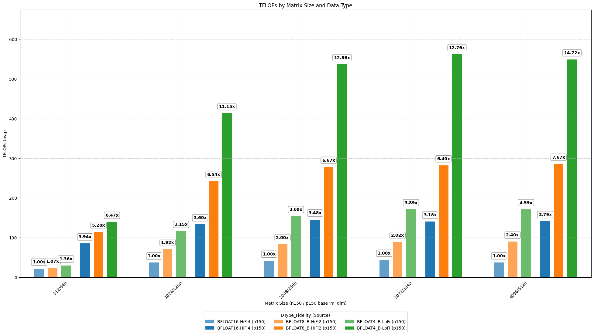
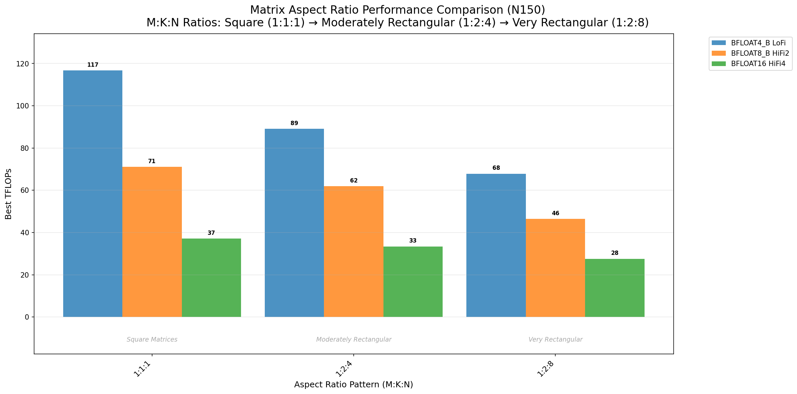
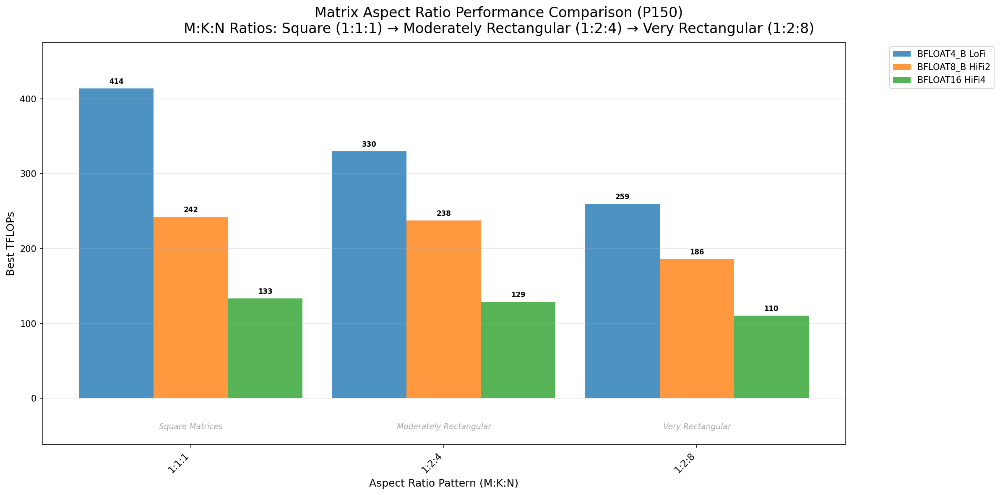

# Matrix Multiply FLOPS


## Introduction

Machine learning computation, especially neural networks, relies heavily on linear algebra operations. One of these crucial and particularly computationally intensive operations is matrix multiplication. General Matrix Multiplication (GEMM), despite being extremely optimized in software, is still extremely time and compute intensive, and having fast matrix multiplication is key to efficient and fast inference of modern neural networks. Many core operations, such as fully connected layers, convolutions, and attention mechanisms in transformers, can be reduced to and represented as one or many GEMMs.


| Machine Learning Component      | How GEMM/matmul is used                               |
|---------------------------------|------------------------------------------------------|
| Dense Layer (MLP)               | Input × Weight matrix                                |
| Convolution       | Input patches × Filter matrix                        |
| RNN/GRU/LSTM Cell               | Input/State vector × Weight matrix                   |
| Attention (Transformers)        | Q, K, V projections; Attention scores computation    |
| Output Projection               | Hidden activations × Output weight matrix            |


If tensors used for the calculations are small and already in registers, the cost to operate on that data is negligible. If the data is in cache, performance is dictated by how quickly the data can be funnelled through caches to the compute units. In their worst case scenarios, the data needed is in device memory, host memory, or stored on a disk.

Thankfully, matrix multiplication requires more compute operations (2N^3) than memory operations (3n^2). As such, for a given device, there will always be points at which a device is limited by the underlying compute units, not the underlying memory system. We call this point the roofline.
However, this inversion point depends on the size and crossover point of each cache level/memory technology and the datatype in use. The amount of 8-bit elements that can be moved per unit time is nearly an order of magnitude more than 64-bit elements.

Therefore, the peak achieved flops changes based on the datatype, the size of the data, and the layout of the data.


## Test it yourself!

The matrix multiply TFLOPS results can be tested on any Wormhole or Blackhole card using:

```bash
TT_METAL_DEVICE_PROFILER=1 pytest tests/ttnn/unit_tests/benchmarks/test_benchmark.py::test_matmul_2d_host_perf
```

for manually selected matmul configurations, or using:

```bash
TT_METAL_DEVICE_PROFILER=1 pytest tests/ttnn/unit_tests/benchmarks/test_benchmark.py::test_matmul_2d_host_perf_out_of_box
```

for out-of-box matmul configurations, or using

```bash
TT_METAL_DEVICE_PROFILER=1 pytest tests/ttnn/unit_tests/benchmarks/test_benchmark.py::test_matmul_2d_host_perf_sweep_all
```
to run a sweep to find the ideal config.

Alternatively, to test on an N300 card, use the following command:

```bash
WH_ARCH_YAML=wormhole_b0_80_arch_eth_dispatch.yaml TT_METAL_DEVICE_PROFILER=1 pytest tests/ttnn/unit_tests/benchmarks/test_benchmark.py::test_matmul_2d_host_perf
```

for manually selected matmul configurations, or using:

```bash
WH_ARCH_YAML=wormhole_b0_80_arch_eth_dispatch.yaml TT_METAL_DEVICE_PROFILER=1 pytest tests/ttnn/unit_tests/benchmarks/test_benchmark.py::test_matmul_2d_host_perf_out_of_box
```

for out-of-box matmul configurations, or using

```bash
WH_ARCH_YAML=wormhole_b0_80_arch_eth_dispatch.yaml TT_METAL_DEVICE_PROFILER=1 pytest tests/ttnn/unit_tests/benchmarks/test_benchmark.py::test_matmul_2d_host_perf_sweep_all
```

to run a sweep to find the ideal config.

Python scripts for reproducing the plots are included in the tech report directory.


We vary three different parameters in this experiment:

We will vary three different parameters for this experiment
1. Dimensions: The sizes of the matrices along each axis, denoted as m , n , and k . (m ,k ) represents the size of the input tensor, while (k ,n ) is the size of the activation tensor. Larger tensors require more computation since the number of operations needed to perform matrix multiplication increases as O(m*k*n).
2. Computation Fidelity: Referred to as LoFi, HiFi2, HiFi3, and HiFi4. Internally, the matrix engine can adjust the number of bits being processed, which affects both the precision of the results and the computation speed.
3. Input/Output Datatype: Larger datatypes require more memory for storage. As a result, more precise datatypes can become bottlenecked if stored in DRAM.

For more details please refer to the tech reports [Matrix Engine](../matrix_engine/matrix_engine.md) and [Data Formats](../data_formats/data_formats.md)

For example, when changing the precision of the matrix, for a given size of matrix the output performance is expected to be different.


## MicroBenchmarks

### Matrix Multiplication TFLOPS on Wormhole/Blackhole (WH/BH)

The WH matrix engine performs 8x16 x 16x16 = 8x16 in a single cycle.
- This is 2*8\*16\*16 = 4096 multiply-adds in a single cycle.
- At 1GHz, this is 4 TFLOPS per matrix engine.fed into in0, and 16x16 is the smallest matrix that can be fed into in1.

If the input matrices fed into the engine are "shorter" than 8x16, for example 1x16, the engine will still perform 8x16 x 16x16 = 8x16, but the effective throughput will be 1/8.
Thus, for 1x16 x 16x16 matrices, the effective throughput is 0.5 TFLOPS per matrix engine.
MATH_FIDELITY is used for higher precision, and TFLOPS are calculated by dividing by the MATH_FIDELITY value.
MATH_FIDELITY is used for higher precision, and TFLOPS are calculated by dividing by the MATH_FIDELITY value.
- LoFi ->  ~4 TFLOPS
- HiFi2 -> ~2 TFLOPS
- HiFi3 -> ~1.33 TFLOPS
- HiFi4 -> ~1 TFLOPS


### Utilization derivation formula
```
Utilization = ideal cycles / actual cycles. tile_width * tile_height) * (cycle_per_tile / num_cores)
```
- Cycle_per_tile is the ideal compute cycle for each tile, which depends on math fidelity (LoFi: 16, HiFi2: 32, HiFi3: 48, HiFi4: 64).
- For utilization of full grid size, num_cores is the maximum number of cores available for compute. Currently the max for Wormhole is 8x8 with Blackhole supporting up to 13x10.

### Manually tuned Performance
Here we show the peak results we can get from manually selected matmul configurations, including packer L1 enablement, math fidelity, input/output sharding, and input/output L1/DRAM selection.
#### Peak FLOPS

Depending on the fidelity, datatype, and matrix shape chosen, different peak teraflop values can be achieved.
Below is the results generated from running the benchmark script, showcasing the performance of matrix multiplication (matmul) operations using matrices of sizes ranging from 512x512x512/640,832,832 to 16384x16384x16384/20480,26624,26624 . The results include evaluations across various data formats, paired with different levels of math fidelity (bfloat16-HiFi2, bfloat16-HiFi4,  bfloat8_b-HiFi2, bfloat8_b-LoFi, and bfloat4_b-LoFi).
We also show the results with and without trace (see [AdvancedPerformanceOptimizationsForModels](../AdvancedPerformanceOptimizationsForModels/AdvancedPerformanceOptimizationsForModels.md) for details of trace). With trace, we can minimize the overhead of host which can reflect the actual device performance better.
Finally, we present the results in terms of device time, device throughput in TFLOPS, device utilization compared to the user-specified grid size and device utilization compared to the full grid size (8x8 in Wormhole/13x10 in Blackhole).
As seen below, while Wormhole cards can perform matrix multiplications at around 180TFlops, Blackhole cards have even more impressive throughput at 560TFlop. Lower fidelity computations with less precise datatypes computations complete faster than "full fidelity" Float16 computations. HiFi2/BFloat8 is roughly **1.5x to 1.8x faster** than HiFi4/Float16, with LoFi/Float4 coming in at **2x to 3.5x** faster without tracing.
#### Performance scatter plot across all matrix sizes and configurations


#### Performance bar plot across all matrix sizes and configurations



### Utilization

#### Utilization plot across all matrix sizes and configurations, based on the Chip TFLOPS calculated per each Math Fidelity

Wormhole cards more easily achieve full utilization of their Tensix cores, performing at up to 83% of the theoretical value. While the larger core grid of Blackhole makes it harder to achieve high utilization, it still delivers performance north of 74% utilization at peak.


### Understanding Device Scaling: SRAM vs DRAM

When a Tensix core executes an operation, it reads data from SRAM, forwards it to a register, performs the computation, and then writes the result back to SRAM. Each Tensix core on a WH ASIC has approximately 1.5MB of SRAM. When data fits within this SRAM, each Tensix can operate without contention. However, some problems require more working memory than SRAM can provide. In these cases, the Tensix core will instead map data to device memory or DRAM. Accessing data from DRAM is slower than SRAM, both in terms of bandwidth and latency.

In this report, the developed Python scripts evaluate three separate configurations:
1. All matrices stored on L1 (SRAM)
2. One matrix on L1 and one on DRAM
3. Both matrices on DRAM

In most cases, storing all matrices on L1 is ideal, as it completely avoids accessing the slower DRAM. The configuration with one matrix on L1 and one on DRAM incurs a small performance penalty, typically in the single-digit percentage range at worst. DRAM-only performance is highly variable: small matrices suffer the largest performance penalty when stored in DRAM, while larger tensors achieve performance closer to an L1-only configuration.

### Tracing

Tracing in the TT-Metallium stack is a performance optimization that records commands for dispatching operations into the DRAM buffer and replays them later for execution, removing host overhead of dispatching operations during a loop iteration.

#### Tracing on N150


#### Tracing on P150


As shown here, on both Wormhole and Blackhole, Trace helps recover more lost performance on smaller tensor matrix multiplications compared to larger ones. This is likely because smaller matrix operations take less time to execute than larger ones, meaning that host overhead is, percentage-wise, more harmful to overall runtime and maximum throughput compared to larger tensors.


### Out of the Box Performance

In this tech report, we fine-tuned the parameters of each matrix multiplication kernel to extract the maximum possible performance. However, here, we will compare the performance loss with the default configuration to demonstrate the hardware’s ability to perform well without significant hand tuning.


#### OOB vs Hand Tuned on N150


#### OOB vs Hand Tuned on P150


As shown here, on both Wormhole and Blackhole, hand tuned configs helps recover more lost performance on smaller tensor matrix multiplications compared to larger ones. Similar to tracing, the configuration matters more for smaller tensors, as it is harder to saturate the core grid with smaller workloads compared to larger ones.


### Rectangular Matrix

Both architectures perform most ideally when the input tensors are closest to square shapes, but they still perform well on rectangular matrices. However, as the tensors become more rectangular, performance takes a larger hit.


#### Rectangular Matrix on N150



#### Rectangular Matrix on P150


