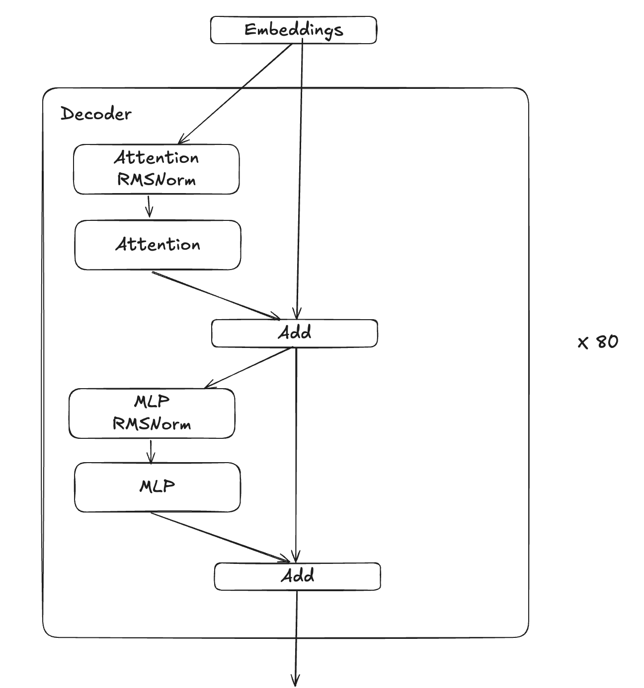
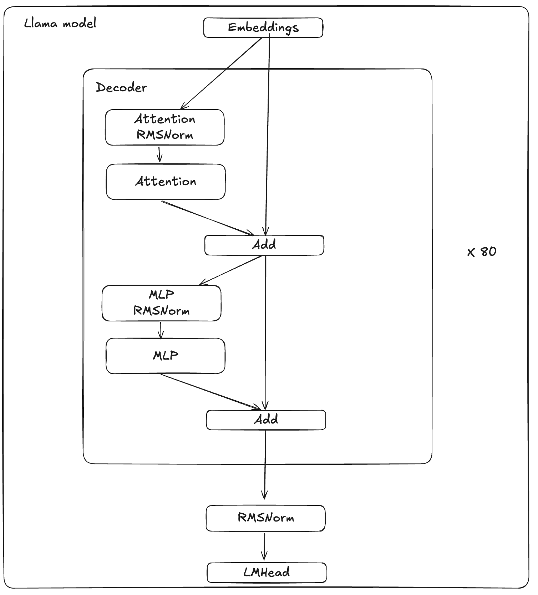
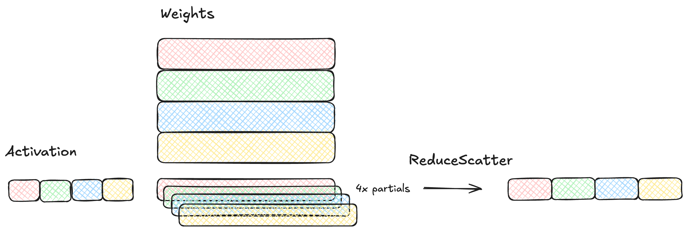
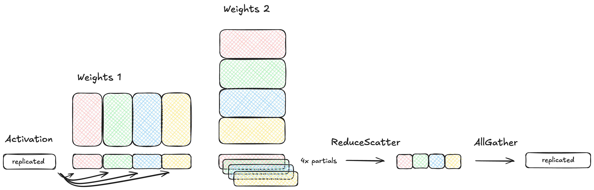
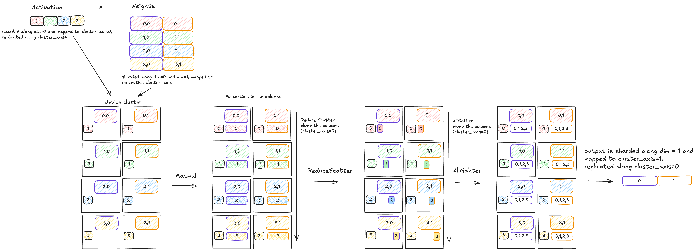
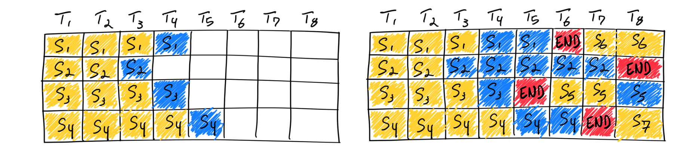
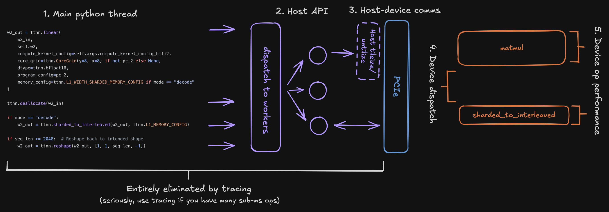
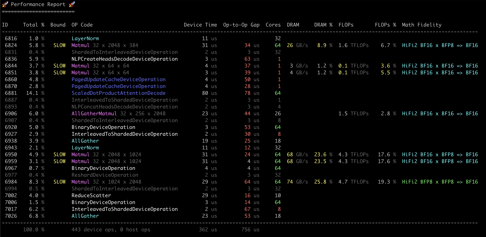

# LLMs in TT-NN

Authors: Mark O'Connor, Djordje Ivanovic, Jack (Xun) Cai, Kartik Paigwar, Johanna Rock, Stuti Raizada, Ammar Vora, Colman Glagovich

## Contents
- [LLMs in TT-NN](#llms-in-tt-nn)
  - [Contents](#contents)
  - [1. Overview](#1-overview)
  - [2. Modules](#2-modules)
    - [2.1 Embedding](#21-embedding)
    - [2.2 RoPE](#22-rope)
    - [2.3 Norm](#23-norm)
    - [2.4 Attention](#24-attention)
    - [2.5 MLP](#25-mlp)
    - [2.6 Decoder](#26-decoder)
    - [2.7 LM Head](#27-lm-head)
  - [3. Features](#3-features)
    - [3.1 Generative Decoding](#31-generative-decoding)
    - [3.2 Prefill and Decode](#32-prefill-and-decode)
    - [3.3 Multi-Device](#33-multi-device)
    - [3.4 Continuous Batching](#34-continuous-batching)
    - [3.5 vLLM Integration](#35-vllm-integration)
  - [4. Best Practices and Optimizations](#4-best-practices-and-optimizations)
    - [4.1 Tracing](#41-tracing)
    - [4.2 Multiple CQs](#42-multiple-cqs)
    - [4.3 Op Configs](#43-op-configs)
    - [4.4 Accuracy](#44-accuracy)
    - [4.5 Performance Analysis](#45-performance-analysis)
    - [4.6 Misc. Performance Optimizations](#46-misc-performance-optimizations)
    - [4.7 Module Tests](#47-module-tests)
    - [4.8 Performance Testing](#48-performance-testing)
    - [4.9 Common Pitfalls](#49-common-pitfalls)
      - [4.9.1 Error Messages](#491-error-messages)
      - [4.9.2 Shard Spec Mismatches](#492-shard-spec-mismatches)
      - [4.9.3 Ethernet Dispatch Cores](#493-ethernet-dispatch-cores)
      - [4.9.4 Hangs](#494-hangs)
        - [4.9.4.1 Tracing](#4941-tracing)
        - [4.9.4.2 Large Matmuls](#4942-large-matmuls)

## 1. Overview
This document provides guidance on how to bring up high-performance multi-chip models on Tenstorrent hardware using the TT-Metal stack. It targets users with previous experience on TT-Metal and shares our current best practices, tips, caveats, and workarounds on model bringup.

Basic Requirements:

* **Access to TT hardware -** This document is specifically for bringing models up on Wormhole (WH), but much of this document applies to Grayskull.
* **Good grasp of PyTorch and transformers -** This document skims some basics, for example, this document assumes you understand what a kv-cache is and understand the difference between prefill (reading tokens and generating the kv-cache entries) and decode (auto-regressively generating new tokens one at a time). Beginner tutorials will follow, this document helps experts get up to speed deploying LLMs on Metal.
* **Familiarity with Metal and TT-NN -** How to [install](https://github.com/tenstorrent/tt-metal/blob/main/INSTALLING.md), build, run examples, etc.

Other useful resources:
* Reference [ViT guide](https://github.com/tenstorrent/tt-metal/blob/main/tech_reports/ViT-TTNN/vit.md) if this document seems unclear or intimidating.
* Reference [Building llama from scratch](https://levelup.gitconnected.com/building-llama-3-from-scratch-with-python-e0cf4dbbc306) for further information about LLMs in general.

## 2. Modules
### 2.1 Embedding
### 2.2 RoPE

For added performance, our implementation of Llama uses a fused operation to apply the Rotary Position Embeddings (RoPE), which can be accessed via `ttnn.experimental.rotary_embedding_llama` API. In the Attention module, this API is called twice, one for the queries and one for the keys respectively.

Here is an example of how the fused RoPE op is used in the attention module:

```py
q_heads = ttnn.experimental.rotary_embedding_llama(
    q_heads_pre_rot,
    cos_matrix,
    sin_matrix,
    transformation_matrix,
    is_decode_mode="False"
)

k_heads = ttnn.experimental.rotary_embedding_llama(
    k_heads_pre_rot,
    cos_matrix,
    sin_matrix,
    transformation_matrix,
    is_decode_mode="False"
)
```

#### 2.2.1 Setting up inputs to RoPE

Fused operation uses a different parallelization scheme internally depending on if the model is in *prefill* or *decode* mode. The following table describes various shapes and memory configurations for *prefill* and *decode* modes:

|     is_decode_mode    |                         True                        |                        False                       |
|:---------------------:|:---------------------------------------------------:|:--------------------------------------------------:|
|         Input         | [1, batch, n_heads, head_dim], <br>HEIGHT_SHARDED in L1 | [1, n_heads, seq_len, head_dim],  <br>INTERLEAVED in L1 |
|     Cos/Sin Matrix    |    [1, batch, 1, head_dim],  <br>HEIGHT_SHARDED in L1    |    [1, 1, seq_len, head_dim],  <br>INTERLEAVED in L1    |
| Transformation Matrix |     [1, 1, TH * batch, TW],  <br>HEIGHT_SHARDED in L1    |          [1, 1, TH, TW],  <br>INTERLEAVED in L1         |

*Note: (TH, TW) = (TILE_HEIGHT, TILE_WIDTH)*


#### 2.2.2 Decode mode specifics
The cos/sin matrices, are generated in two slightly different ways, depending on the mode of operation. For *prefill* mode, the cos/sin matrices are computed once at intialization using the *prefill* sequence length, and then passed into the RoPE OP. However, in *decode* mode, since the position index of each user is updated from token-to-token, the cos/sin matrices must be updated across iterations. Here, we leverage our `RotarySetup` module, that can be used at each decode iteration to get the corresponding cos/sin matrices.

The following code sample shows how `RotarySetup` can be used in decode mode:
```py
from models.tt_transformers.rope import RotarySetup

# Step 1: Create the setup object
rope_setup_decode = RotarySetup(
    mesh_device,
    head_dim,
    max_seq_len,
    rope_theta,
    use_scaled_rope
)

transformation_mats_decode = rope_setup_decode.get_trans_mats()


# Step 2: Get user position ids
# For example, batch number of users, each with different position ids
position_ids = torch.arange(batch)


# Step 3: Retreive the relevant cos/sin matrices
cos_sin_matrices = rope_setup_decode.get_rot_mats(position_ids)
cos_matrix, sin_matrix = cos_sin_matrices


# Step 4: Perform the RoPE operation
out = ttnn.experimental.rotary_embedding_llama(
    x,  # example input
    cos_matrix
    sin_matrix,
    transformation_mats_decode,
    is_decode_mode=True
)

```
<br>

> [!NOTE]
> Due to the sparse nature of the transformation matrix, the fused RoPE OP takes a tile-sized transformation matrix as input, then reuses that tile across all subsequent operations. In *decode* mode, this matrix is replicated *batch* times, then sharded over *batch* number of cores. As a result, each core receives a single, tile-sized transformation matrix. In contrast, the *prefill* mode implementation requires a single tile-sized transformation matrix, then distributes it across all the cores internally.


### 2.3 Norm

Normalization is a critical operation in Large Language Models (LLMs), ensuring stable training and efficient inference. Two widely adopted normalization techniques in modern LLMs, **LayerNorm** and **RMSNorm**, are fully supported in TT-NN.

#### 2.3.1 Implementations of Normalization Operations

TT-NN includes two primary implementations of normalization operations to handle diverse activation layouts efficiently:

1. **Non-Distributed Norm**
2. **Distributed Norm**


#### 2.3.1.1 Non-Distributed Norm

**Non-Distributed Norm** refers to the standard implementation of normalization operations applied to activations that are not distributed across multiple devices. This type of normalization is suitable for setups where the entire activation or embedding is available locally on a single device or is replicated identically across multiple devices in a data-parallel setup.  This implementation supports both sharded and interleaved inputs.

**Example: RMSNorm on Single Device (Decode Scenario)**

```python
import torch
import ttnn

def torch_rms_norm(x, gamma, eps):
    return x * torch.rsqrt(x.pow(2).mean(-1, keepdim=True) + eps) * gamma

batch, seq_len, embedding_dim = 32, 1, 8192
torch_input = torch.randn((batch, seq_len, embedding_dim))
torch_gamma = torch.randn((embedding_dim))
torch_output = torch_rms_norm(torch_input, torch_gamma, eps=1e-5)

# Reshape inputs/weights to 4D tensors
torch_input = torch_input.view(1, 1, batch, embedding_dim)  # seq_len = 1 for decode
torch_gamma = torch_gamma.view(1, 1, 1, embedding_dim)

# Convert tensors to TT-NN tensors
ttnn_input = ttnn.as_tensor(
    torch_input,
    device=device,
    dtype=ttnn.bfloat16,
    layout=ttnn.TILE_LAYOUT,
    memory_config=ttnn.DRAM_MEMORY_CONFIG
)
ttnn_gamma = ttnn.as_tensor(
    torch_gamma,
    device=device,
    dtype=ttnn.bfloat16,
    layout=ttnn.TILE_LAYOUT,
    memory_config=ttnn.DRAM_MEMORY_CONFIG
)

# Perform RMSNorm
ttnn_output = ttnn.rms_norm(ttnn_input, epsilon=1e-5, weight=ttnn_gamma)
```

**Optimization for Efficient Weight Reads from DRAM**

In the previous example, weights are traditionally pushed to the device in **TILE layout**. In this case, padding is required to match the TILE_HEIGHT. Padding increases the memory footprint and reduces DRAM access efficiency. To address this, weights are wrapped into **TILE_WIDTH** sticks and converted to **ROW_MAJOR_LAYOUT** without requiring any padding. This weight transformation doesn't have any overhead during runtime as its only performed once during initialization.

```python
# Optimized Weight Layout for DRAM
torch_gamma = torch_gamma.view(1, 1, embedding_dim // TILE_WIDTH, TILE_WIDTH)
ttnn_gamma_rm = ttnn.as_tensor(
    torch_gamma,
    device=device,
    dtype=ttnn.bfloat16,
    layout=ttnn.ROW_MAJOR_LAYOUT,
    memory_config=ttnn.DRAM_MEMORY_CONFIG
)
```

#### 2.3.1.2 Distributed Norm

The distributed implementation is designed for cases where activations are **sharded along the embedding dimension** across multiple devices. It ensures the correct computation of mean and variance across shards by leveraging cross-device communication. Both interleaved and width-sharded inputs are supported.

##### 2.3.1.2.1 Steps to Perform Distributed Normalization on TT-Devices

1. **Compute Local Statistics** - Each device computes the required statistics (e.g., \(E[x]\), \(E[x^2]\)) locally on its shard of the input tensor.
   - For **RMSNorm**, only \(E[x^2]\) is required.
   - For **LayerNorm**, both \(E[x]\) and \(E[x^2]\) are computed.

   ```python
   tt_distributed_stats = ttnn.rms_norm_pre_all_gather(tt_distributed_input_tensor)
   ```

   - **Output**: A `stats` tensor of shape `[1, 1, batch, TILE_WIDTH * num_stats]`.
  >[!NOTE]
  > - `num_stats=1` for RMSNorm.
  > - `num_stats=2` for LayerNorm.
  > - Only the first column of the stats tile contains meaningful data; the rest are padding.

2. **Gather Statistics Across Devices** - The statistics are gathered from all devices along the specified dimension (`dim=3`) and replicated across the device mesh.

   ```python
   tt_gathered_stats = ttnn.all_gather(
       tt_distributed_stats,
       dim=3,
       num_links=1,
       cluster_axis=1,
       mesh_device=mesh_device,
       memory_config=ttnn.DRAM_MEMORY_CONFIG,
       topology=ttnn.Topology.Linear,
   )
   ```

   - **Output**: A tensor of shape `[1, 1, batch, TILE_WIDTH * num_stats * num_devices]`.

3. **Global Normalization** - The gathered statistics are used to compute the global mean and variance, and normalization is performed on the sharded input.

   ```python
   tt_distributed_output_tensor = ttnn.rms_norm_post_all_gather(
       tt_distributed_input_tensor,
       epsilon=eps,
       weight=tt_distributed_weights,
       program_config=sharded_program_config,
       memory_config=ttnn.DRAM_MEMORY_CONFIG,
       stats=tt_gathered_stats,
   )
   ```
   - **Output**: A tensor of shape `[1, 1, batch, embedding_dim // num_devices]`.

> [!NOTE]
> The following inputs are valid for both implementations.
> - **Interleaved Inputs**:
  For interleaved inputs, the kernel parallelizes work across the sequence length (`seq_len`).
  This makes it highly **optimal for prefill cases**, where the sequence length is large.
> - **Width-Sharded Inputs**:
  For width-sharded inputs, the kernel splits the work across the embedding dimension.
  This design is more **optimal for decode cases**, where the sequence length is typically `seq_len=1`.

#### 2.3.1.3 References
- Non-Distributed Norm Op Code [[1]](https://github.com/tenstorrent/tt-metal/tree/main/ttnn/cpp/ttnn/operations/normalization/layernorm) [[2]](https://github.com/tenstorrent/tt-metal/tree/main/ttnn/cpp/ttnn/operations/normalization/rmsnorm)
- Distributed Norm Op Code [[3]](https://github.com/tenstorrent/tt-metal/tree/main/ttnn/cpp/ttnn/operations/normalization/layernorm_distributed) [[4]](https://github.com/tenstorrent/tt-metal/tree/main/ttnn/cpp/ttnn/operations/normalization/rmsnorm_distributed)
- Non-Distributed Norms Unit Tests [[5]](https://github.com/tenstorrent/tt-metal/blob/main/tests/tt_eager/python_api_testing/unit_testing/misc/test_layernorm_sharded.py) [[6]](https://github.com/tenstorrent/tt-metal/blob/main/tests/tt_eager/python_api_testing/unit_testing/misc/test_layernorm.py)
- Distributed Norms Unit Tests [[7]](https://github.com/tenstorrent/tt-metal/blob/main/tests/ttnn/unit_tests/operations/test_distributed_layernorm.py) [[8]](https://github.com/tenstorrent/tt-metal/blob/main/tests/ttnn/unit_tests/operations/test_distributed_layernorm_sharded.py)
- Distributed Norm in TT-Transformers [[9]](https://github.com/tenstorrent/tt-metal/blob/main/models/tt_transformers/tt/distributed_norm.py)

### 2.4 Attention

Attention in TT-NN is implemented in custom TT-NN kernels. In PyTorch, the attention OP is usually implemented in the following way with six steps:

1. QKV projections matmuls.
2. Reshape Q, K, V to match the expected input shape for the attention OP.
3. Apply RoPE to Q and K.
4. Cache K and V.
5. Scaled Dot Product Attention.
6. Output reshape and output matmul.

For example, the Llama model is implemented as follows:
```python
    def forward(
        self,
        x: torch.Tensor,
        start_pos: int,
        freqs_cis: torch.Tensor,
        mask: Optional[torch.Tensor],
    ):
        """
        Forward pass of the attention module.

        Args:
            x (torch.Tensor): Input tensor.
            start_pos (int): Starting position for caching.
            freqs_cis (torch.Tensor): Precomputed frequency tensor.
            mask (torch.Tensor, optional): Attention mask tensor.

        Returns:
            torch.Tensor: Output tensor after attention.

        """
        # (1) QKV projections matmuls
        bsz, seqlen, _ = x.shape
        xq, xk, xv = self.wq(x), self.wk(x), self.wv(x)

        # (2) Reshape Q, K, V to match the expected input shape for the attention op
        xq = xq.view(bsz, seqlen, self.n_local_heads, self.head_dim)
        xk = xk.view(bsz, seqlen, self.n_local_kv_heads, self.head_dim)
        xv = xv.view(bsz, seqlen, self.n_local_kv_heads, self.head_dim)

        # (3) Apply RoPE to Q and K
        xq, xk = apply_rotary_emb(xq, xk, freqs_cis=freqs_cis)

        # (4) Cache K and V
        self.cache_k[:bsz, start_pos : start_pos + seqlen] = xk
        self.cache_v[:bsz, start_pos : start_pos + seqlen] = xv

        # (5) Scaled Dot Product Attention
        keys = self.cache_k[:bsz, : start_pos + seqlen]
        values = self.cache_v[:bsz, : start_pos + seqlen]
        output = torch.scaled_dot_product_attention(xq, keys, values, attn_mask=mask)

        # (6) Output reshape and output matmul
        output = output.transpose(1, 2).contiguous().view(bsz, seqlen, -1)
        return self.wo(output)
```

The generic `torch` implementation is agnostic to **prefill** and **decode** modes, however, our implementation differientiates them. For more information about differences between modes and how we handle them in TT-NN, see [3.2 Prefill and Decode](#32-prefill-and-decode). In general, our high performance attention module uses specialized implementations for each mode as they have different memory and compute patterns and bottlenecks, requiring different optimizations.

In this section we split the attention module into two parts -- **prefill** and **decode** -- and describe the six implementation steps for each mode. We discuss limitations of the current implementation and helpful facts for debugging and performance optimization.

Common Terminology:
| Term | Description |
| --- | --- |
| bsz | Batch Size |
| batch_id | Batch Index (used for prefill) |
| cur_pos/cur_pos_tensor | List/tensor of current positions in the sequence for each batch. |
| cache_len | Length of the KV Cache. |
| seqlen | Sequence Length |
| dim | Hidden dimension of input x. |
| head_dim | Hidden dimension of Q, K, V. |
| n_q_heads | Number of heads in Q. |
| n_kv_heads | Number of heads in K, V. |

### 2.4.1 Attention Prefill
The attention module in prefill mode expects input shape `(1, bsz=1, seqlen, hidden_dim)` and outputs a tensor of the same shape.
> [!NOTE]
> `bsz=1` is required. For multiple batches, run prefill iteratively and populate the KV cache at `batch_id`.

An end-to-end example of the prefill attention module is in the [attention.py](../../models/tt_transformers/tt/attention.py) file, under the `forward_prefill` method. In short, we break down the attention module in prefill mode into the following steps:
1. QKV projections matmuls.
   - We combine the QKV projection weights into a single tensor, and perform standard `ttnn.linear`. For example:
     ```python
     xqkv_fused = ttnn.linear(x, wqkv, dtype=ttnn.bfloat16)
     ```
   - Input/Output shapes:
      ```python
      (1, 1, seqlen, dim) -> (1, 1, seqlen, (n_q_heads+2*n_kv_heads)*head_dim)
      ```

2. Reshape Q, K, V to match the expected input shape for scaled dot product attention.
   - We split the fused QKV tensor into individual Q, K, V tensors using a custom optimized TM OP, `ttnn.experimental.nlp_create_qkv_heads`. For example:
     ```python
     Q, K, V = ttnn.experimental.nlp_create_qkv_heads(xqkv_fused, num_heads=n_q_heads, num_kv_heads=n_kv_heads, transpose_k_heads=False)
     ```
   - Input/Output shapes:
      ```python
      (1, 1, seqlen, (n_q_heads+2*n_kv_heads)*head_dim) -> (1, n_q_heads, seqlen, head_dim), (1, n_kv_heads, seqlen, head_dim), (1, n_kv_heads, seqlen, head_dim)
      ```

3. Apply RoPE to Q and K.
   - We apply the RoPE transformation to Q and K using the rotary embedding op outlined in [2.2 RoPE](#22-rope). The input/output shapes remain the same as in step 2.

4. Cache K and V.
   - We populate the KV cache at `batch_id` with the current K and V tensors using the `ttnn.fill_cache` OP. For example:
     ```python
     ttnn.fill_cache(K_cache, K, batch_id)
     ttnn.fill_cache(V_cache, V, batch_id)
     ```
   - If page table is used, we use the `ttnn.experimental.paged_fill_cache` OP. For example:
     ```python
     ttnn.experimental.paged_fill_cache(K_cache, K, page_table, batch_idx=batch_id)
     ttnn.experimental.paged_fill_cache(V_cache, V, page_table, batch_idx=batch_id)
     ```

5. Scaled Dot Product Attention.
   - We perform scaled dot product attention using our custom flash attention kernel, `ttnn.transformer.scaled_dot_product_attention`. It takes in the following arguments:
     - `q`: Query tensor of shape `(1, n_q_heads, seqlen, head_dim)`.
     - `k`: Key tensor of shape `(1, n_kv_heads, cache_len, head_dim)`.
     - `v`: Value tensor of shape `(1, n_kv_heads, cache_len, head_dim)`.
     - `attn_mask`: Defaults to `None`. [b x 1 x cache_len x seqlen]. Head broadcasting is implied.
     - `is_causal`: bool, defaults to `true`. Whether to apply causal masking.
     - `scale`: float, defaults to `None`.
     - `program_config`: Defaults to `None`.
     - `compute_kernel_config`: Defaults to `None`.

   - For general prefilling phase use cases with causal attention, it is recommended to set `is_causal=True`. This removes the need for `attn_mask` and attention scores are computed in the lower triangular half of the attention matrix. For example:
     ```python
     attn_output = ttnn.transformer.scaled_dot_product_attention(Q,K,V,is_causal=True)
     ```

   - For non-causal attention, `attn_mask` must be provided. An example is in the cross attention case in visual language models. For example:
     ```python
     attn_output = ttnn.transformer.scaled_dot_product_attention(Q,K,V,attn_mask=mask, is_causal=False)
     ```

6. Output reshape and output matmul.
   - Finally, we use `ttnn.experimental.nlp_concat_heads` to reshape the output of the attention op, followed by a standard `ttnn.linear` to do the output projection. For example:
     ```python
     attn_output = ttnn.experimental.nlp_concat_heads(attn_output)
     output = ttnn.linear(attn_output, wo)
     ```
   - Input/Output shapes:
     ```python
     (1, n_q_heads, seqlen, head_dim) -> (1, 1, seqlen, hidden_dim) -> (1, 1, seqlen, hidden_dim)
     ```

### 2.4.2 Attention Decode
The attention module in decode mode expects input shape `(1, seqlen=1, bsz, hidden_dim)` and outputs a tensor of the same shape. Decode mode expects sequence length of one and parallelizes over batch size due to the auto-regressive nature of decoding.

An end-to-end example of the decode attention module is in the [attention.py](../../models/tt_transformers/tt/attention.py) file, under the `forward_decode` method. The decode mode is broken down into the following steps:

1. **QKV Projections Matmuls**
   - This works the same as in prefill mode, using `ttnn.linear`. Note that the input shape is `(1, 1, bsz, dim)` instead of `(1, 1, seqlen, dim)`.
   - Input/Output shapes:
      ```python
      (1, 1, bsz, dim) -> (1, 1, bsz, (n_q_heads+2*n_kv_heads)*head_dim)
      ```

2. **Reshape QKV**
   - Reshape Q, K, and V to match the expected input shape for scaled dot product attention.
   - We split the fused QKV tensor into individual Q, K, V tensors using `ttnn.experimental.nlp_create_qkv_heads_decode`.
> [!NOTE]
>  This is a different OP than `ttnn.experimental.nlp_create_qkv_heads` used in prefill mode. For example:
> ```python
> Q, K, V = ttnn.experimental.nlp_create_qkv_heads_decode(
>  xqkv_fused,
>  num_heads=n_q_heads,
>  num_kv_heads=n_kv_heads,
>  memory_config=ttnn.MemoryConfig(
>     ttnn.TensorMemoryLayout.HEIGHT_SHARDED, ttnn.BufferType.L1
>  )
> )
> ```

   - **Input/Output Shapes**: The output is height sharded across the batch dimension on `bsz` number of cores.
      ```python
      (1, 1, bsz, (n_q_heads+2*n_kv_heads)*head_dim) -> (1, bsz, n_q_heads, head_dim), (1, bsz, n_kv_heads, head_dim), (1, bsz, n_kv_heads, head_dim)
      ```

3. **Apply RoPE to Q and K**
   - Again, apply the RoPE transformation to Q and K using the rotary embedding OP outlined in [2.2 RoPE](#22-rope). The input/output shapes remain the same as in step 2.

4. **Cache K and V**
   - Populate the KV cache at `cur_pos` for all batches with the current K and V tensors using the `ttnn.experimental.paged_update_cache` OP. This OP takes in an optional `page_table` argument to support paged KV cache updates. Example:
     ```python
     ttnn.experimental.paged_update_cache(keys, K, update_idxs=cur_pos, page_table=page_table)
     ttnn.experimental.paged_update_cache(values, V, update_idxs=cur_pos, page_table=page_table)
     ```
   - If current position is `cur_pos_tensor`, a `ttnn.Tensor` rather than a list, we use the `update_idxs_tensor` argument instead:
     ```python
     ttnn.experimental.paged_update_cache(keys, K, update_idxs_tensor=cur_pos_tensor, page_table=page_table)
     ```

5. **Scaled Dot Product Attention Decode**
   - Perform scaled dot product attention using custom flash attention kernel optimized for decode mode, `ttnn.transformer.scaled_dot_product_attention_decode` and `ttnn.transformer.paged_scaled_dot_product_attention_decode` for paged KV cache.
   - `ttnn.transformer.scaled_dot_product_attention_decode` considers the following arguments:
     - `q`: Query tensor of shape `(1, bsz, n_q_heads, head_dim)`.
     - `k`: Key tensor of shape `(1, bsz, cache_len, head_dim)`.
     - `v`: Value tensor of shape `(1, bsz, cache_len, head_dim)`.
     - `is_causal`: Bool, defaults to `true`. Whether to apply causal masking.
     - `attn_mask`: Optional attention mask tensor. Defaults to `None` and only used if `is_causal=False`.
     - `cur_pos`: (Required for is_causal=True) List of current positions in the sequence for each batch. Defaults to `None`. Must be provided if `cur_pos_tensor` is not provided.
     - `cur_pos_tensor`: (Required for is_causal=True) Optional current position tensor. Defaults to `None`. Must be provided if `cur_pos` is not provided.
     - `scale`: Optional scale factor. Defaults to `None`.
     - `program_config`: Optional program configuration. Defaults to `None`.
     - `compute_kernel_config`: Optional compute kernel configuration. Defaults to `None`.
     - `memory_config`: Optional memory configuration for output tensor. Defaults to `None`.
   - `ttnn.transformer.paged_scaled_dot_product_attention_decode` takes in the same arguments as `ttnn.transformer.scaled_dot_product_attention_decode`, but also takes in an additional `page_table_tensor` argument.
   - For general decode use cases, we recommend setting `is_causal=True`. This removes the need for `attn_mask` which reduces memory bandwidth usage. For example:
     ```python
     attn_output = ttnn.transformer.paged_scaled_dot_product_attention_decode(Q, K, V, cur_pos_tensor=cur_pos, page_table=page_table)
     ```
   - For non-causal attention, `attn_mask` must be provided. An example is in the cross attention case in visual language models. For example:
     ```python
     attn_output = ttnn.transformer.paged_scaled_dot_product_at tention_decode(Q, K, V, attn_mask=mask, is_causal=False)
     ```

6. **Output Reshape and Output Matmul**
   - Finally, use `ttnn.experimental.nlp_concat_heads_decode` to reshape the output of the attention OP, followed by a standard `ttnn.linear` to do the output projection. For example:
     ```python
     attn_output = ttnn.experimental.nlp_concat_heads_decode(attn_output, num_heads=n_q_heads)
     output = ttnn.linear(attn_output, wo)
     ```
   - Input/Output shapes:
     ```python
     (1, bsz, n_q_heads, head_dim) -> (1, 1, bsz, hidden_dim) -> (1, 1, bsz, hidden_dim)
     ```

### 2.4.3 Miscellaneous Facts
Flash attention and flash decode are the major OPs for attention. They are optimized for latency and throughput, and perform better than vanilla implementations. For more information see: [Flash Attention Tech Report](https://github.com/tenstorrent/tt-metal/blob/main/tech_reports/FlashAttention/FlashAttention.md).

Here are some useful details regarding attention OPs for efficient and bug-free code writing:

1. Program Configs in flash attention (and flash decode) OPs. The Program config has the following parameters:
   - `compute_with_storage_grid_size`: The grid size.
   - `q_chunk_size`: The size of a chunk to process at a time for Q.
   - `k_chunk_size`: The size of a chunk to process at a time for K and V.
   - `exp_approx_mode`: Whether to use the exponential approximation mode for softmax.
   - `max_cores_per_head_batch`: The maximum number of cores to use for each head batch in flash decode.

Flash attention processes Q, K, V in chunks of size `q_chunk_size` and `k_chunk_size`. The chunk size must be a power of two and a multiple of 32. By default, the chunk size is set to 512, but you should experiment with different values to find the best performance. Flash attention is parallelized on the cores specified in `compute_with_storage_grid_size`. For example, if you are running on a grid size of 8x8, then flash attention is parallelized over 64 cores. The parallelization is divided by batch, then by head, then by the number of Q chunks.

Flash decode processes the entire Q (since query in decode mode is small) and K/V in chunks of size `k_chunk_size`. As a result, the `q_chunk_size` field is not used for flash decode. It is parallelized over the cores specified in `compute_with_storage_grid_size`. The parallelization is divided by batch, then by kv_head. In many cases, there are more cores than `heads*batch`, this is why flash decode is needed, it allows for multiple cores to process a single head. In extreme cases where there are too many cores to process a single head, the NOC bandwidth between cores will bottleneck. We experimentally found that more than 16 cores per head batch no longer provides any benefits and starts degrading performance. The `max_cores_per_head_batch` field is used to limit cores used to 16 for each head batch for flash decode.

Finally, the `exp_approx_mode` field is to set the exponential approximation mode for softmax in flash attention and flash decode. We recommend setting this to `true` for small `seqlen/chunk_size` values. For large `seqlen/chunk_size` values, the error introduced by the exponential approximation can accumulate through chunk accumulation, causing major degradation in pcc. For example in Llama3 models, we use `q_chunk_size` and `k_chunk_size` of 512, and `exp_approx_mode` set to `false` for long sequence lengths greater than 16K.

2. Current Position Tensor for flash decode and kv cache OPs:

In decode mode provide a list of current positions or a tensor. The tensor version can be more efficient because it supports tracing**. For more information about tracing, see: [4.1 Tracing](#41-tracing). Tracing requires the traced variables to be statically known at the compile time. If you provide a list of current positions, you cannot modify it for the next token generation. However, if you provide a tensor, the position values are stored in device memory and can be updated using binary addition op, e.g. `ttnn.add`.

### 2.5 MLP

MLP for Llama-style models is implemented in the `MLP` module class. The tests are available in [test_mlp.py](../../models/tt_transformers/tests/test_mlp.py).

MLP performs the following operations on an input `x` where FF1, FF2, and FF3 are linear transformations (matmuls) with weights `w1`, `w2`, and `w3` respectively. Since FF1 and FF3 share the same inputs, their optimizations are shared as well:

```
w1_out = FF1(x)
w3_out = FF3(x)
w2_in = SiLU(w1_out) * w3_out
y = FF2(w2_in)
```

Let's dive into our implementation of MLP, and discuss what makes it performant across different WH systems.

#### 2.5.1 Setup
When used in the model by the `Decoder` module class, the MLP class is initialized at the start, where the weights for `w1`, `w2`, and `w3` are loaded and fractured across devices in specific schemes, as outlined in the [Multi-Device](#33-multi-device) section. Specifically, in n300 and T3000 systems the weights are 1D column fractured, and in TG systems the weights are 2D fractured.

```py
self.feed_forward = MLP(
    mesh_device=mesh_device,
    args=args,
    state_dict=state_dict,
    weight_cache_path=weight_cache_path,
    layer_num=layer_num,
    dtype=dtype,
    model_config=self.model_config,
)
```

#### 2.5.2 Inputs
At runtime, the `forward` function of `MLP` is called with either *'prefill'* or *'decode'* mode, with inputs replicated across devices, for all WH system configurations.
> [!NOTE]
> In the actual model, the input `ff_in` is the output of the `norm` step prior to MLP.

**Decode mode**

In *decode* mode, the inputs have a maximum batch of 32, where each user only has a single token. The inputs in *decode* mode are considered much smaller compared to in *prefill* mode, where the sequence length can be up to 128k. To make matmul operations faster in *decode* mode, shard the input across L1, where they can be processed by the matmul without extra load time. The lowest number of cores that the input can be width sharded on while maintaining tile size, `mlp_core_grid`, is chosen as the specific core grid for sharding. This is so we can minimize any communication delay over the NOC, when moving around the activations during the matmul.


```py
# ff_in shape: [1, 1, m, k] => [1, 1, batch, dim]
ff_in_memory_config = ttnn.create_sharded_memory_config(
    (m, k // mlp_core_grid.num_cores),
    mlp_core_grid,
    ttnn.ShardStrategy.WIDTH,
    ttnn.ShardOrientation.ROW_MAJOR,
    use_height_and_width_as_shard_shape=True,
)
```

**Prefill mode**

As mentioned before, the input in prefill mode can be very large, and may not fit in the available L1 space. As such, the inputs are stored in DRAM.

```py
# ff_in shape: [1, 1, m, k] => [1, 1, seq_len, dim]
ff_in_memory_config = ttnn.DRAM_MEMORY_CONFIG
```

> [!NOTE]
> Similar to the Attention module, the matmul operation can exceed memory if the inputs are too large, and as a workaround, we push part of the sequence length into the batch dimension.
> ```py
> # Reshape input to to fit on device and parallelize computation
> if seq_len >= 1024:
>     ff_in = ttnn.reshape(ff_in, [1, seq_len // 1024, 1024, -1])
> ```

#### 2.5.3 Setting Up Program Configurations For Matmuls
Depending on the mode of operation, the `forward` function of `MLP` instantiates different program configs for matmuls of FF1/FF3, and FF2.

**Decode mode**

Since weights are much larger than activations, and weights must be loaded from DRAM, matmul operations are DRAM-bound. This means that loading weights from DRAM is a bottleneck, rather than the computation itself. As such, we use DRAM sharded matmuls in decode mode, which are more performant than regular mamtuls (See section _ for details).

```py
_, _, m, k = ff_in.shape
n = hidden_dim // num_devices # Since w1/w3 are fractured on outer dim
pc1 = ttnn.MatmulMultiCoreReuseMultiCastDRAMShardedProgramConfig(
    in0_block_w=math.ceil(k / (tile_size * ff1_num_cores)),
    per_core_M=math.ceil(m / tile_size),
    per_core_N=math.ceil(n / (tile_size * ff1_num_cores)),
    fused_activation=None,
)

k, n = n, k  # Since FF1 is up projection and FF2 is down projection
pc2 = ttnn.MatmulMultiCoreReuseMultiCastDRAMShardedProgramConfig(
    in0_block_w=math.ceil(k / (tile_size * ff2_num_cores)),
    per_core_M=math.ceil(m / tile_size),
    per_core_N=math.ceil(n / (tile_size * ff2_num_cores)),
    fused_activation=None,
)
```

**Prefill mode**

In prefill mode, since the activation and weights are similarly shaped, loading activations and weights from DRAM is no longer a bottleneck. Instead, for these compute bound matmul operations, we utilize a 2D matmul. The specific parameters for the program configs are chosen to maximize matmul performance, based on the shapes of the inputs. See section _ for more details.

```py
# TODO: Move this function to a different section and just refer to it
def matmul_config(
    m: int,
    k: int,
    n: int,
    grid_size: Tuple[int, int],
    in0_block_w: int = None,
    fuse_batch: bool = False,
    fused_activation=None,
    ) -> ttnn.MatmulMultiCoreReuseMultiCastProgramConfig:
    per_core_M = math.ceil(m / (tile_size * grid_size[1]))
    per_core_N = math.ceil(n / (tile_size * grid_size[0]))

    out_subblock_h = 1
    out_subblock_w = get_out_subblock_w(per_core_N, out_subblock_h)

    if in0_block_w is None:
        in0_block_w = min(4, max(1, k // (tile_size * grid_size[0])))

    return ttnn.MatmulMultiCoreReuseMultiCastProgramConfig(
        compute_with_storage_grid_size=grid_size,
        in0_block_w=in0_block_w,
        out_subblock_h=out_subblock_h,
        out_subblock_w=out_subblock_w,
        per_core_M=per_core_M,
        per_core_N=per_core_N,
        transpose_mcast=False,
        fused_activation=fused_activation,
        fuse_batch=fuse_batch,
    )

_, _, m, k = ff_in.shape
n = hidden_dim // num_devices
pc1 = matmul_config(
    m=m, k=k, n=n, grid_size=(8, 8)
)

k, n = n, k  # Since FF1 is up projection and FF2 is down projection
pc1 = matmul_config(
    m=m, k=k, n=n, grid_size=(8, 8)
)
```

#### 2.5.4 FF1/FF3 Matmul
The first set of operations in the MLP are:
```py
w1_out = FF1(x)
w3_out = FF3(x)
```
Based on the program configs we computed beforehand, we perform the FF1/FF3 matmuls, making sure that the ouputs are L1 sharded in in decode mode, and interleaved in DRAM if in prefill mode. For the `compute_kernel_config`, we use `ttnn.MathFidelity.HiFi2` to retain accuracy while still being performant. Using `ttnn.MathFidelity.HiFi4` instead, would mean that this matmul would become compute bound.

```py
compute_kernel_config_hifi2 = ttnn.WormholeComputeKernelConfig(
    math_fidelity=ttnn.MathFidelity.HiFi2,
    math_approx_mode=False,
    fp32_dest_acc_en=False,
    packer_l1_acc=True,
)

w1_out = ttnn.linear(
    ff_in,
    w1,
    compute_kernel_config=args.compute_kernel_config_hifi2,
    core_grid=ttnn.CoreGrid(y=8, x=8) if not pc_1 else None,
    dtype=ttnn.bfloat16,
    program_config=pc_1,
    memory_config=ttnn.L1_WIDTH_SHARDED_MEMORY_CONFIG if mode == "decode" else ttnn.DRAM_MEMORY_CONFIG,
)

w3_out = ttnn.linear(
    ff_in,
    w3,
    compute_kernel_config=args.compute_kernel_config_hifi2,
    core_grid=ttnn.CoreGrid(y=8, x=8) if not pc_1 else None,
    dtype=ttnn.bfloat16,
    program_config=pc_1,
    memory_config=ttnn.L1_WIDTH_SHARDED_MEMORY_CONFIG if mode == "decode" else ttnn.DRAM_MEMORY_CONFIG,
)
```

#### 2.5.5 FF1/FF3 Matmul With 2D Weight Fracturing

In the case of TG systems, where we have access to a 2D device mesh, we can leverage 2D weight fracturing. For a weight tensor with shape `[1, 1, K, N]`, using 2D weight fracturing on a `(8, 4)` device mesh, the resulting shape on each device would be: `[1, 1, K / 4, N / 8]`. In other words, the inner dimension (K) of the matmul is spread out across four devices, and to complete the entire matmul operation, a reduction step across the partials is necessary. We do this using an all-reduce operation along the four devices in `cluster_axis=1` of the device mesh.
```py
  w1_out = tt_all_reduce(
      w1_out,
      self.mesh_device,
      cluster_axis=1,
      num_links=2,
      sharded=True if mode == "decode" else False,
      memory_config=self.model_config["FF1_OUT_GATHERED_MEMCFG"] if mode == "decode" else None,
  )
  w3_out = tt_all_reduce(
      w3_out,
      self.mesh_device,
      cluster_axis=1,
      num_links=2,
      sharded=True if mode == "decode" else False,
      memory_config=self.model_config["FF1_OUT_GATHERED_MEMCFG"] if mode == "decode" else None,
  )
```

#### 2.5.6 Multiply + Fused SiLU Activation

The output of the FF1/FF3 matmuls are column fractured tensors (the extra all-reduce operation for TG systems ensures this). The next operation is:
```py
w2_in = SiLU(w1_out) * w3_out
```
In TT-NN, we have access to binary operations that can apply activations to any of the inputs, in a fused manner, leading to better performance as the inputs are only getting loaded/processed once. As such, the fused SiLU operation with the element-wise multiplication can be performed as follows:
```py
w2_in = ttnn.multiply(
    w1_out,
    w3_out,
    memory_config=(
        self.model_config["SHARDED_MLP2_INPUT_MEMCFG"] if TG else ttnn.L1_WIDTH_SHARDED_MEMORY_CONFIG
    )
    if mode == "decode"
    else ttnn.DRAM_MEMORY_CONFIG,
    input_tensor_a_activation=ttnn.UnaryOpType.SILU,
    dtype=ttnn.bfloat8_b,
)
```

Following our pattern mentioned before, the outputs are L1 sharded in `decode` mode and DRAM interleaved in `prefill` mode.

#### 2.5.7 FF2 Matmul
The last computation in MLP is:
```py
y = FF2(w2_in)
```
FF2 is a row-parallel matmul, meaning that that the weights are fractured across devices in the inner dim. The inputs of FF2, produced by FF1/FF3, are also fractured across devices in the same dimension and as a result, FF2 produces partial outputs across all devices.

Here's what the call for the FF2 matmul looks like.
> [!NOTE]
> Once the matmul operations are completed, we can undo the reshape operation we performed on the inputs of MLP to fit the matmuls on device in `prefill`.

```py
w2_out = ttnn.linear(
    w2_in,
    self.w2,
    compute_kernel_config=self.args.compute_kernel_config_hifi2_fp16,
    core_grid=ttnn.CoreGrid(y=1, x=8) if not pc_2 else None,
    dtype=ttnn.bfloat16,
    program_config=pc_2,
    memory_config=ttnn.L1_WIDTH_SHARDED_MEMORY_CONFIG if mode == "decode" else ttnn.DRAM_MEMORY_CONFIG,
)

# Undo the reshape operation used to fit the matmul on device
if seq_len >= 1024:  # Reshape back to intended shape
    w2_out = ttnn.reshape(w2_out, [1, 1, seq_len, -1])
```

###### 2.5.7.1 Accumulating the partial outputs of FF2

Since the output of FF2 is the correct shape but only a partial on each device, the output of the MLP module is required to be fractured where each device has fully accumulated the inner dim of the matmul, but only has a fraction of the outer dim. There are two different ways to handle this, depending on if the WH system has a 1D or 2D device mesh.

1. 1D Device Mesh (n300, T3000): Use a reduce-scatter operation across all devices, resulting in outputs fractued in the outer dim.
    ```py
    w2_out_reduced = ttnn.reduce_scatter(
        w2_out,
        scatter_dim=3,
        math_op=ttnn.ReduceType.Sum,
        num_links=1,
        memory_config=ttnn.DRAM_MEMORY_CONFIG if mode == "prefill" else ttnn.L1_MEMORY_CONFIG,
    )
    ```
2. 2D Device Mesh (TG): Use an all-reduce operation along the same cluster axis that the inner dimension is fractured on. The FF2 matmul inner dim is fractured across cluster axis 0 (row-parallel across 8 devices), and the outer dim is fractured across cluster axis 1 (4 devices). Then an all-reduce operation is performed on cluster axis 0, it will accumulate partials across the inner dim of the matmul and replicate them along all the devices in that axis, while keeping them fractured across cluster axis 1 (4 devices).
    ```py
    w2_out_reduced = tt_all_reduce(
        w2_out,
        self.mesh_device,
        cluster_axis=0,
        num_links=2,
        dim=0,
        memory_config=(self.model_config["FF2_OUT_GATHERED_MEMCFG"],
        sharded=(mode == "decode"),
    )
    ```

### 2.6 Decoder
When the components explained in previous sections (MLP, Attention, RMSNorm) are implemented, bringing up the decoder is relatively straightforward. According to the diagram (based on the Llama3.1 example), the components are stacked sequentially during the forward pass. The only consideration is whether addition of MLP and Attention outputs should be stored in L1 or in DRAM.

<br>

The Decode forward pass implementation below follows the accompanying diagram. To optimize memory usage, we recommend you deallocate tensors after usage, which is crucial under tighter memory constraints.

<br>

To optimize performance in decode mode, we maintain the residual stream in L1 and shard it across cores and devices. However, determining the optimal number of cores for sharding can be challenging, especially for operations like DRAM-sharded matmuls. Here is the [code](https://github.com/tenstorrent/tt-metal/blob/53c32c0c0da926f97bd0eb042e70fd54c2866f44/models/demos/llama3/tt/model_config.py#L931) in Llama model config, that produces the core grid that will divide the N and K dims of a matmul evenly.
When it’s not feasible to keep the streams sharded, we use  the TT-NN OP: `interleave_to_sharded`, and conversely, switch back as needed.
In our implementation of Llama3.1, there are some OPs that require interleaved tensors and resharding.

<br>

<div align="center">

</div>

<br>

```py
def forward(
        self,
        x: ttnn.Tensor,
        current_pos,
        rot_mat=None,
        transformation_mats=None,
        user_id=0,
        mode="decode",
        page_table=None,
    ) -> ttnn.Tensor:
        if mode == "prefill":
            skip_mem_cfg = ttnn.DRAM_MEMORY_CONFIG
        elif mode == 'decode':
            skip_mem_cfg = self.model_config["DEC_SKIP_OUTPUT_MEMCFG"]
        # Attention RMSNorm
        attn_in = self.attention_norm(x)
        # Attention
        attn_out = self.attention.forward(
            attn_in,
            current_pos,
            rot_mat,
            transformation_mats,
            user_id,
            mode,
            page_table,
        )
        ttnn.deallocate(attn_in)
        # Residual add of inputs and attention output
        h = ttnn.add(x, attn_out, memory_config=skip_mem_cfg)
        ttnn.deallocate(attn_out)
        # MLP and RMSNorm
        ff_out = self.feed_forward.forward(self.ffn_norm(h), mode)
        # Residual add of attention output and mlp output
        out = ttnn.add(h, ff_out, memory_config=skip_mem_cfg)

        ttnn.deallocate(ff_out)
        ttnn.deallocate(h)

        return out
```


### 2.7 LM Head

The `LMHead` is unique because LLMs typically have large vocabulary sizes, which are independent of the model size (i.e. model parameters).
As a result, the `LMHead` has a large `last_dim` in its weight matrix. Given the substantial size of `LMHead` weights and the memory limitations of the hardware, these weights must be distributed across multiple devices and processed in iterations, while activations are replicated across devices.

The number of iterations required depends on the size of the weights and the number of devices available, ranging from 1 to several iterations. For example, in Llama 3.1’s decode mode, the LMHead matrix multiplication involves shapes of ```(32, 8K) x (8K, 128K)```.

Below is an illustration of how the LMHead weights are partitioned across two devices, followed by its implementation. For illustrative purposes it uses 128K for the `vocab_size` instead of the real Llama3.1 value of `128256`.

<div align="center">

</div>

```py
size_per_device = self.vocab_size // self.num_devices
num_splits = math.ceil(size_per_device / max_columns_per_device)

split_sizes = [min(size_per_device, max_columns_per_device)] * (num_splits - 1)
split_sizes.append(size_per_device - sum(split_sizes))  # remaining columns

# Split the output weights
torch_output_weights = state_dict[f"{state_dict_prefix}output.weight"].permute(1, 0)

self.output_weights = []

for i, split_size in enumerate(split_sizes):
    cache_file_name = (
        None if args.dummy_weights else weight_cache_path / f"output_lm_head_{num_splits}_split_shard_{i}"
    )

    # Create a list to store the split tensors for each device
    device_splits = []
    for device in range(self.num_devices):
        start = device * size_per_device + sum(split_sizes[:i])
        end = start + split_size
        device_splits.append(torch_output_weights[:, start:end])

    # Concatenate the splits from all devices
    combined_split = torch.cat(device_splits, dim=-1)

    memory_config = args.create_dram_sharded_mem_config(
        k=args.dim, n=combined_split.shape[-1] // self.num_devices
    )
    self.output_weights.append(
        ttnn.as_tensor(
            combined_split,
            device=mesh_device,
            mesh_mapper=ttnn.ShardTensorToMesh(mesh_device, dim=-1),
            layout=ttnn.TILE_LAYOUT,
            dtype=dtype,
            memory_config=memory_config,
            cache_file_name=cache_file_name,
        )
    )
```

We use DRAM-sharded matmul for LMHead with `program_config` and `memory_config` generated by the code below.
For more information check [Section: Op Configs](#44-op-configs).
The primary reason for having multiple `program_configs` is that the weight shapes may result in unequal split sizes. This variability means the same configuration cannot be used for every matmul.

```py
# Generate dram-sharded memory_config
memory_config = args.create_dram_sharded_mem_config(
    k=args.dim, n=combined_split.shape[-1] // self.num_devices
)
# Generate dram-sharded program_config
self.program_configs = [
    args.dram_matmul_config(
        args.tile_padded_batch_rows,
        args.dim,
        split_size,
        args.lm_head_core_grid.num_cores,
    )
    for split_size in split_sizes
]
```
Once weights are pushed to the devices and the decoders are executed, the `LMHead` forward pass needs to be executed in iterations.
The code below shows that after each iteration outputs are converted from sharded to interleaved tensors. Once all iterations are completed, the final output is produced by concatenation over the last dim and returned as `output`.

When executing the model, you must ensure that the output of the last decoder is already replicated across tensors. Since this replication is enforced earlier, no additional code is required in the `LMHead` forward pass to handle it.

```py
def forward(self, x: ttnn.Tensor):
    outputs = []
    for weight, pc in zip(self.output_weights, self.program_configs):
        output = ttnn.linear(
            x,
            weight,
            compute_kernel_config=self.compute_kernel_config,
            program_config=pc,
            memory_config=ttnn.L1_WIDTH_SHARDED_MEMORY_CONFIG,
            dtype=ttnn.bfloat8_b,
        )
        outputs.append(output)

    # Concatenate the outputs
    output = ttnn.concat(outputs, dim=-1, memory_config=ttnn.DRAM_MEMORY_CONFIG)

    return output
```

### 2.8 Model

<div align="center">

</div> <br>

Once the previous model components are implemented, there isn’t much left to finalize. In our implementation, embeddings are managed outside the model class, as explained in [Section 2.1 Embedding](#21-embedding).

The model’s constructor initializes N decoders, for example 80 for Llama3.1-70b, the `RMSNorm` and the `LMHead`, ensuring that weights for all components are loaded onto the appropriate devices.

During the forward pass, decoders are executed sequentially, followed by normalization and `LMHead` computation at the end.
A specific optimization is applied for the prefill mode; only the last token is relevant, the `LMHead` is executed only on the final tile.

In prefill mode, the RMSNorm output is interleaved, but the LMHead requires a sharded tensor. To accommodate this, the `interleaved_to_sharded` function is used to prepare the output accordingly.

```py
def forward(
    self,
    x: ttnn.Tensor,
    current_pos,
    rot_mat=None,
    transformation_mats=None,
    user_id=0,
    mode="decode",
    page_table=None,
    get_last_token=-1,
):
    for layer in self.layers:
        x = layer(x, current_pos, rot_mat, transformation_mats, user_id, mode, page_table)

    if mode == "prefill" and get_last_token == -1:
        return x

    # Slicing the tensor to the nearest ceiling/floor multiples of 32 for the prefill_len, to get the last token
    if get_last_token != -1:
        x = ttnn.slice(x, (0, 0, get_last_token, 0), (1, 1, get_last_token + 32, x.shape[-1]))

    # Output norm
    x = self.norm(x, mode=mode)

    if mode == "prefill":
        x = ttnn.interleaved_to_sharded(
            x,
            self.model_config["LM_HEAD_INPUT_MEMCFG"],
        )

    return self.lm_head(x)
```


## 3. Features
### 3.1 Generative Decoding

Almost every LLM generates text in the same manner; given a prompt from the user, the LLM predicts the next token. Then, the LLM takes that new token and uses it as context to predict the following token. This process repeats until the LLM generates a token that indicates the end of the sequence, or until the user decides to stop the generation. The process is called "autoregressive generation" because each new token is used to predict the next token.

#### 3.1.1 Model Inputs and Outputs
Inputs to the model for generative decoding are generally:
- **Tokens:** Produced by the tokenizer.
- **Position IDs:** Position of the tokens in the sequence.
- **KV Cache:** Inference optimization that caches intermediate values.

In the model, tokens are embedded from the vocabulary space to the embedding space. Position IDs are necessary for updating the KV cache and for positional embeddings like RoPE.

The model outputs:
- Logits for the next token
- Updated KV Cache

The logits are unnormalized probabilities over the vocabulary. Given these probabilities, the sampler must decide which of these tokens in the vocabulary are chosen. There are a few sampling methods that are commonly used to pick the next token:
- **Greedy Decoding:** Argmax of the logits, picks the most likely next token.
- **Top-p/top-k Sampling:** Restricts the logits according to P and K values, then samples according to the remaining probabilities.

#### 3.1.2 KV Cache
The KV cache is an inference optimization. It allows us to cache intermediate values during the first inference step for reuse in later steps.
On the first inference step, the model processes the full prompt and caches the K and V projections for each layer. Subsequent inference steps compute a Q, K, V projection only for the new token, then use the cached K and V projections in attention. Therefore the first step (prefill) creates the KV cache and subsequent steps (decode) use and update the cache.

The size of the KV cache depends on the batch size and sequence length. Since accelerators have finite memory, it is necessary to tradeoff batch size and sequence length to allow the KV cache to fit in memory.

#### 3.1.3 Batching
LLMs use batching to process multiple sequences in parallel. There are a few reasons why batching is useful:
- Real-world LLM services need to handle multiple concurrent requests.
- LLM inference is bound by time to read model weights from DRAM. Batching allows model weight reuse across multiple sequences.
- Total throughput of the system increases with batch size.

However, there are tradeoffs with batching. In decode mode, latency scales sublinearly with batch size up to a point. This is because decode is bound by time to read model weights from DRAM rather than time to compute. If the batch grows very large, decode mode will eventually become compute bound, causing latency to scale linearly with batch size. In prefill mode, latency scales linearly with batch size because prefill is compute bound.

It is typical to use different batch sizes for different use cases, depending on the goal of the system.

#### 3.1.4 Performance Metrics
**Time to First Token (TTFT):** measures the latency to generate the first token of the sequence. This is the time to prefill a prompt and generate the first token. It is a measure of interactivity.

**Total Throughput (Tokens per Second):** tells us the total number of tokens that the model can generate per second. `total throughput = batch size / decode step latency`. Total throughput is important for cost-sensitive systems or offline processing, where interactivity is less important than throughput. Generally, increasing batch size will increase total throughput.

**User Throughput (Tokens per Second per User):** is calculated as `user throughput = 1 / decode step latency`. User throughput tells us how interactive the model is, and tells us how fast the generation is for a single user. Generally, decreasing batch size will increase user throughput.

> [!NOTE]
> Each of these metrics change with batch size and sequence length. When reporting TTFT, total throughput, and user throughput, the batch size and sequence length must be specified.

### 3.2 Prefill and Decode

Large language models require two distinct phases for inference due to the fundamental nature of transformer attention and autoregressive generation: prefill and decode.

In our LLM implementations, the prefill phase is done sequentially for each user, but parallel for the prompt tokens of each user. During prefill, the model computes attention scores for all prompt tokens against each other and populates the key-value (KV) cache which will speed up the computation of the decode phase. At the end of the prefill phase, the first token for the following autoregressive generation will also be computed.

The decode phase is parallel-computed for all users, but sequential for each token within a batch of users. Each new token can only be generated after the previous one, as the model must maintain causality in attention computations.

#### 3.2.1 Technical Implementation Differences

The intermediate activations in prefill mode are kept in DRAM, due to the large size of the tensors which contain the entire sequence length. In decode mode, the intermediate activations are kept in L1 memory instead, since in this mode the sequence length to compute is just one token at the time, reducing latency.

##### 3.2.1.1 Reshaping for Large Matrix Multiplications

Please see the [attention source code](/../../models/tt_transformers/tt/attention.py) for reference.

In prefill mode, when the input sequence length is very large, the model reshapes its input tensors to process sequences in smaller chunks in parallel for larger matmuls, such as `wqkv`, `wo` in the attention module, and `w1`, `w2`, `w3` in the MLP module. This reshaping prevents running out of memory in cases of long prefill sequence lengths. For example:

```python
if seq_len > 2048:
    x_11SH = ttnn.reshape(x_11SH, [1, seq_len // 2048, 2048, -1])

xqkv_fused = ttnn.linear(
    x_11SH,
    self.wqkv,
    dtype=ttnn.bfloat16,
    memory_config=ttnn.DRAM_MEMORY_CONFIG,
    compute_kernel_config=self.compute_kernel_config_hifi2,
    program_config=self.model_config["XQKV_PREFILL_PROGCFG"](seq_len),
)
```

Reshaping is not needed for decode mode because it only processes one token at a time. Instead, the parallelization for decode mode is done over user batches, which currently only goes up to 32.

##### 3.2.1.2 KV Cache Management

The KV-cache is filled during prefill using the `ttnn.experimental.paged_fill_cache` operation. This supports page tables, which enables the hot-swapping of new users when the full model is deployed.

```python
# Fill cache with initial states
ttnn.experimental.paged_fill_cache(
    keys_BKSD,
    k_fill,
    page_table,
    batch_idx=user_id
)
```

Similarly, during decode, the KV-cache update is done by `ttnn.experimental.paged_update_cache`, which updates the new KV values for all the users currently processing, with their respective positions.

```python
# Update KV cache with a single new token
ttnn.experimental.paged_update_cache(
    keys,
    k_heads_1BKD,
    update_idxs_tensor=current_pos,
    page_table=page_table
)
```

##### 3.2.1.3 Attention Computation
###### 3.2.1.3.1 Prefill:
```python
# Split q_heads into num_groups and kv_heads for parallel group computation for grouped query attention (GQA)
q_heads_84SD_8b = ttnn.reshape(
    q_heads_1QSD_8b,
    [self.n_local_kv_heads, self.n_local_heads // self.n_local_kv_heads, -1, self.head_dim]
)

# Prefill implements causal masking across the full sequence
attn_output_84SD = ttnn.transformer.scaled_dot_product_attention(
    q_heads_84SD_8b,
    k_heads_K1SD_8b,
    v_heads_V1SD_8b,
    is_causal=True,  # Ensures tokens only attend to previous tokens
    scale=self.scale
)
```

###### 3.2.1.3.2 Decode:
```python
# Decode uses cached states instead of recomputing
attn_output_11BH = ttnn.transformer.scaled_dot_product_attention_decode(
    q_heads_1BQD,  # Only new token query
    keys,          # Cached keys
    values,        # Cached values
    cur_pos_tensor=current_pos  # Track position for causal attention
)
```

##### 3.2.1.4 Slicing Before the LM Head
At the end of prefill, the model should generate the first decoded token, then signal the start of the decode phase. To this end, the model slices the output of the last decoder layer to the last tile before computing the LM head. This is necessary because only the last token from prefill is needed to start the autoregressive decoding.

```python
x = ttnn.slice(x, (0, 0, get_last_token, 0), (1, 1, get_last_token + 32, x.shape[-1]))
```

#### 3.2.2 Prefill vs. Decode: Comparison Summary

|  | Prefill Mode | Decode Mode |
| --- | --- | --- |
| **Purpose** | Bulk sequence processing for initialization or training. | Incremental processing for autoregressive inference. |
| **Demo Parallelization** | Sequential for each user, parallel for the sequence length of each user. | Parallel for 32 users, sequential for each token within a batch of users. |
| **Batch and Sequence Length** | Processes long sequences (≥ 128 tokens), single user. | Processes batch of users (≤ 32 users), single token. |
| **Memory Use** | DRAM, with reshaping into smaller chunks for long sequence lengths. | L1 on-chip memory for fast, low-latency processing. |
| **Attention** | Handles sequences in bulk; more memory-intensive. | Incremental attention with precomputed components. |
| **LM Head Slicing** | Slices to last tile before Lm head matmul to extract the last token. | Slicing not required. |

### 3.3 Multi-Device

This section refers to sharding schemes across devices and not on a multi-core level. For details about different matmul versions and sharding on a core level, please see: [matmul configuration section](#44-op-configs).

There are two main approaches for scaling across multiple devices: `data parallel` and `tensor parallel`.

In data parallel scaling there are _multiple independent_ instances of the model running in parallel so that multiple batches of users are processed at the same time. This mode is used to increase throughput.

In tensor parallel scaling there is _one_ instance of the model executed on multiple devices, where single operations are distributed across devices. This mode allows larger models, that would not typically fit on a single device, to run on multiple devices, and usually also reduces latency.

There are also hybrid forms of those two modes where a cluster of devices runs multiple independent instances of the model, but each of those model instances uses multiple chips in a tensor parallel fashion.

In the report [Programming Mesh of Devices with TT-NN](../Programming_Mesh_of_Devices/Programming_Mesh_of_Devices_with_TT-NN.md), there is a good introduction to using TT-NN's key concepts for scaling to multiple devices. It shows how to use a single handle for a mesh of devices, and how a tensor can be sharded or replicated to that mesh of devices (tensor parallelism).
The tensor handle is used analogously to single device tensors, with the only difference being that all operations on that tensor are then executed in parallel on each device and operate on their respective local chunk of data.

TT-Metal supports different multi-device topologies. The most important ones for us are `Ring` topology, where all devices are connected in a ring shape with each other, and `Line` topology, where a subgroup of devices is connected in a line with each other. `Line` topology can be a 1D or 2D grid of devices, where each row and column are connected in a line.

Below is a summary and example code of the most important concepts for mapping a tensor to a mesh of devices in TT-NN:

```python
import ttnn

# 2x4 mesh_device, Topology Ring: devices are connected in a ring
mesh_device = ttnn.open_mesh_device(ttnn.MeshShape(2, 4))

# Construct initial torch tensor
torch_tensor = torch.rand((1,1,32,256), dtype=torch.bfloat16)

# Convert to ttnn.Tensor, tilize and move onto mesh_device (2x4 devices) by sharding in dimension 3
# mesh_tensor_sharded contains data on all 8 devices, where each device has a 32x32 sized chunk of the data
mesh_tensor_sharded = ttnn.from_torch(
    torch_input_tensor,
    layout=ttnn.TILE_LAYOUT,
    device=mesh_device,
    mesh_mapper=ttnn.ShardTensorToMesh(mesh_device, dim=3),
)

# Convert to ttnn.Tensor, tilize and move onto mesh_device (2x4 devices) by replication
# mesh_tensor_replicated contains data on all 8 devices, where each device has the same 32x256 sized tensor
mesh_tensor_replicated = ttnn.from_torch(
    torch_input_tensor,
    layout=ttnn.TILE_LAYOUT,
    device=mesh_device,
    mesh_mapper=ttnn.ReplicateTensorToMesh(mesh_device),
)
```

The second key concept to scaling a model to multiple devices are Collective Communication Library (CCL) operations. They are used to efficiently exchange data between multiple devices. TT-NN currently supports the following CCL Operations:
- AllGather
- ReduceScatter
- AllReduce

See the [CCL Developer Guide](../EthernetMultichip/CclDeveloperGuide.md) for more comprehensive coverage about CCL and their implementation details. Our library of supported operations can be found [here](../EthernetMultichip/CclDeveloperGuide.md#op-list-op-list).

#### 3.3.1 AllGather
The AllGather operation collects data from all devices, concatenating each chunk along a specified dimension. The result is stored on each device (replication).

- Supported Topologies: Ring, Linear
- Supported Number of Links
  - N300, T3000: 1
  - TG: 4 along cluster_axis=0, 3 along cluster_axis=1
- Arguments
  - mesh_tensor: a tensor mapped to a mesh_device via mesh_mapper
  - dim: the dimension to concatenate
  - num_links: number of ethernet links to be used
  - cluster_axis: cluster axis to gather along
  - mesh_device: mesh device the tensor is mapped to

The following is an example of Ring All-Gather on s 2x4 mesh_device:

```py
# Execute All-Gather on the sharded tensor
# Assuming mesh_tensor_sharded is a sharded tensor over 8 devices where each devices contains a 32x32 sized chunk of data, the output_tensor is of size 32x256
output_tensor = ttnn.all_gather(mesh_tensor_sharded, dim=3, num_links=1)
```

The following is an example of Linear All-Gather on a 2x4 mesh_device:

```py
# Execute All-Gather on the sharded tensor
# Assuming mesh_tensor_sharded is a sharded tensor over 2x4 devices where each devices contains a 32x32 sized chunk of data, the output_tensor is of size 32x128 where each row has the same data
output_tensor = ttnn.all_gather(mesh_tensor_sharded, dim=3, num_links=2, cluster_axis=1, mesh_device=mesh_device, topology=ttnn.Topology.Linear)
```

#### 3.3.2 ReduceScatter
The ReduceScatter operation reduces data across all devices and shards the result of the reduction over a specified dimension across all devices.

- **Supported Topologies:** Ring, Linear
- **Supported Number of Links:** One
- **Arguments:**
  - **mesh_tensor:** a tensor mapped to a mesh_device via mesh_mapper
  - **dim:** the dimension to concatenate
  - **cluster_axis:** cluster axis to gather along
  - **num_links:** number of ethernet links to be used
  - **topology:** topology configuration ttnn.Ring or ttn.Linear

The following is example usage of Ring Reduce-Scatter on a 2x4 mesh_device:

```py
# Execute Reduce-Scatter on the sharded tensor
# Assuming mesh_tensor_sharded is a sharded tensor over 8 devices where each devices contains a 32x32 sized chunk of data, the output_tensor is again of size 32x32 on each devices but reduced over all devices
output_tensor = ttnn.reduce_scatter(mesh_tensor_sharded, dim=3, num_links=1)
```

The following is example usage of Linear Reduce-Scatter on a 2x4 mesh_devcie:

```py
# Execute Reduce-Scatter on the sharded tensor
# Assuming mesh_tensor_sharded is a sharded tensor over 2x4 devices where each devices contains a 32x32 sized chunk of data, the output_tensor is of size 32x32 on each device but reduces over each row of devices
output_tensor = ttnn.reduce_scatter(mesh_tensor_sharded, dim=3, num_links=1, cluster_axis=1, mesh_device=mesh_device, topology=ttnn.Topology.Linear)
```

#### 3.3.3 AllReduce
The AllReduce operation reduces data across all devices and stores the entire tensor on each device (replication). It is performed using an AllGather followed by a ReduceScatter.

A fused version of AllReduce is planned, but currently only the composite of AllGather+ReduceScatter is supported.

#### 3.3.4 Sharding schemes for decode
In decode mode, activations are generally stored in L1 memory, while weights, which are too large, must be stored in DRAM. The main bottleneck in decode mode is thereby DRAM bandwidth required to load model weights.

The activations in decode mode are small because they contain the batch size (=users) in the height dimension while sequence length is one.
The only exception is the attention operations computing `softmax(Q*KˆT)*V`. The activation width is the model dim (e.g. 8192 for Llama3-70b).
Activations are not sharded in the height dimension; however, depending on the operation and model, they may be sharded in the width dimension.

Matmul weights on the other hand can be sharded in width, height, or both. Sharding weights across multiple devices significantly reduces DRAM pressure per device, resulting in notable latency improvements. Below is a summary of useful sharding schemes for sharding weights in decode mode. Which scheme to use will depend on the shape and size of the model weights and the target device topology.

##### 3.3.5 1D Column parallel

Weights are sharded in width, such that each device contains a horizontal slice of the weights. For this scheme the activations must be gathered beforehead, i.e. each device processes the whole activation. The result of a column parallel matmul is an activation that is sharded in width. Use an AllGather operation on dim=3 to gather (i.e., replicate) activations.


##### 3.3.6 1D Row parallel

Weights are sharded in height, such that each device contains a vertical slice of the weights. For this scheme the activations must be sharded beforehand, i.e. each device processes a width-shard of the activation. The result of a row parallel matmul are activation partials with the final result's output dimensions, each device containing a partial result. To reduce the activations, i.e. compute the final output, use a ReduceScatter operation to compute the reduced result across all devices and shard the result along a specified dimension.
Additionally use an AllGather operation (ReduceScatter+AllGather = AllReduce) to gather the reduced shards and thus replicate the final output on each device.



##### 3.3.7 1D Column Parallel Followed by Row Parallel (1D Weight Sharding)

1D Weight Sharding is a sharding scheme that combines column and row parallel matmuls and can reduce the data volume sent over CCL operation and thus speed up computation. It consists of a column parallel matmul followed by a row parallel matmul. In this scheme the initial activations are gathered, and the column parallel matmul produces width-sharded outputs. The row parallel matmul consumes those sharded activations and produces parial outputs. Use an AllReduce (ReduceScatter+AllGather) operation to compute the final reduced and gathered outputs.

Optimization potential in this scheme depends highly on the input dimensions to the CCL operations. Use this scheme for the MLP and any sequence of matmuls that expand and then narrow the output dimension again, because it moves the CCL operation to a more beneficial location in the computational graph and thus reduces the CCL data volume.

Let's look at the MLP as a concrete example: in Llama3-70b we have `FF1` and `FF3` with dimensions `[32, 8k] x [8k, 28k]` and then the `FF2` with dimension `[32, 28k] x [28k, 8k]`.
If we gather after `FF1` and `FF3` we have to gather activations of size `[32, 28k/num_devices] -> [32, 28k]` for each of `FF1` and `FF3`; after the `FF2` we'd need to gather again `[32, 8k/num_devices] -> [32, 8k]`.
If instead, we use the 1D weight sharding scheme and thus move the CCL operation after the `FF2`, we only have to ReduceScatter #num_devices partials of size `[32, 8k] -> [32, 8k/num_devices]` and then optionally AllGather to obtain the `[32, 8k]` gathered outputs.



##### 3.3.8 2D Weight Sharding

In 2D Weight Sharding on a 2D cluster, weights are sharded both in width and height, such that each device contains a block of the weights.
For this scheme the activations are width-sharded along `cluster_axis=0` and are replicated along `cluster_axis=1`, and the weights are block-sharded. Thus, each device processes a width-shard of the activation, and a block of the weights where the activations are replicated over one axis but the weights are not.
The matmul result will be width-sharded along `cluster_axis=0` and contain partial results along `cluster_axis=1`.
Typically we use an AllReduce (ReduceScatter+AllGather) to first reduce along `cluster_axis=1` and then gather the shards along `cluster_axis=0`.



##### 3.3.9 Optimal strategy

The optimal usage strategy of different parallelization schemes depends on the specific shapes and model architecture, as well as the target device topology. To select the best parallelization strategy, the overall data movement for each scheme can be computed; selecting the parallelization stratgy with the lowest overall data movement will generally result in the best performance.

To compute the data movement for a given parallelization strategy, first the required sequence of parallelization strategies and corresponding CCL operations is sketched out, and then the resulting dat movement is computed. The following table shows constraints on input and output activations for each parallelization strategy. A partial activation always has to be reduced (ReduceScatter or AllReduce), while fractured activations may or may not need to be gathered, dependent on the consumer operation. A binary OP for example is executed on the fractured activaiton to parallelize computation, while a matmul 1D column parallel operation requires inputs to be gathered in k.

| Parallelization strategy  | Input activation requirement | Output activation requirement |
|---------------------------|-----------------|-----------------|
| 1D Column Parallel        | Gathered in K   | Fractured in K |
| 1D Row Parallel           | Fractured in K  | Partials of full size |
| 1D Column + Row Parallel  | Gathered in K   | Partials of full size |
| 2D Parallel               | Fractured in K  | Partials over one cluster axis |

The overall data movement (DM) is then computed using:

| CCL operation     | DM for Line topology     | DM for Ring topology     |
|-------------------|--------------------------|---------------------------|
| AllGather         | DM = (K⋅N⋅DF/D)⋅(D−1)⋅D  | DM = (K⋅N⋅DF)⋅D⋅log2(D)   |
| ReduceScatter     | DM = (K⋅N⋅DF)⋅(1-(1/D))    | DM = (K⋅N⋅DF) ⋅ (D-1) / D |

Where K and N are height and width of the weight tensor, DF is the data format multiplyer (number of bytes per datum) and D is the number of devices along the axis that the CCL operation is performed on. Ring topology is more optimized and results in less overall data movement.

##### 3.3.10 Examplary parallelization scheme: Llama3

For our [Llama3 family of models](/../../models/tt_transformers) we are using the following sharding schemes in our multi-device architectures:

| Matmul            | N300            | T3000           | TG              |
|-------------------|-----------------|-----------------|-----------------|
| [_QKV projection_](/../../models/tt_transformers/tt/llama_attention.py) | Column Parallel | Column Parallel | 2D              |
| [_Dense out_](/../../models/tt_transformers/tt/llama_attention.py)  | Row Parallel    | Row Parallel    | 2D              |
| [_FF1_](/../../models/tt_transformers/tt/llama_mlp.py)             | Column Parallel | Column Parallel | 2D              |
| [_FF3_](/../../models/tt_transformers/tt/llama_mlp.py)             | Column Parallel | Column Parallel | 2D              |
| [_FF2_](/../../models/tt_transformers/tt/llama_mlp.py)             | Row Parallel    | Row Parallel    | 2D              |


### 3.4 Continuous Batching
Continuous batching is a serving optimization. To describe continuous batching, it is useful to first discuss LLM serving without continuous batching.

Without continuous batching, an LLM service waits for `batch_size` requests to come in. The service then prefills each request. Then, the service decodes the batched requests token by token. Once all users in the batch finish generation, the service accepts new requests. This is suboptimal because 1) some requests might end generation early, so 2) some slots in the batch are not doing useful computation, while 3) new requests are waiting.

In contrast, continuous batching allows the service to process new requests as soon as there is a free slot in the batch. The pseudo-code for this algorithm is shown below:

```python
while True:
  if not is_full(current_batch) and not prefill_q.empty():
    model_prefill(prefill_q.pop())
  elif not is_empty(current_batch):
    model_decode(current_batch)
  else:
    break
```


The above image from anyscale (https://www.anyscale.com/blog/continuous-batching-llm-inference) shows how continuous batching inserts prefill sequences into the batch as soon as there is a free slot.

Continuous batching improves TTFT by reducing wait times for incoming users. It also increases total throughput by keeping the decode batch full of useful work.

Continuous batching is an LLM serving optimization but it requires some support in the model. The model has to support single user prefill so that when a slot is open, the model can prefill a new request into a specific slot of the batch. The model also has to support batched decode where position IDs can be different for each user in the batch, to avoid context contamination.
Implementing continuous batching requires that the serving code track data for each slot of the batch. An example of our continuous batching demo can be found [here](../../models/demos/t3000/llama2_70b/demo/demo_continuous_batching.py). In production deployment, vLLM handles continuous batching for the LLM service.

### 3.5 vLLM Integration

vLLM is an [open-source LLM serving library](https://github.com/vllm-project/vllm). Tenstorrent maintains a [fork of vLLM](https://github.com/tenstorrent/vllm/tree/dev) for serving models in production on Tenstorrent hardware. For more information about vLLM and the instructions on integrating Tenstorrent models into vLLM, please see the [vLLM Integration Tech Report](./vLLM_integration.md).

## 4. Best Practices and Optimizations
### 4.1 Tracing
Tracing allows you to record a single pass of your model and store the list of commands and buffers used on-device. You can execute the trace in a single command with no additional work performed on the host. This eliminates overhead in stages 1-3, you are still responsible for transferring any data needed to and from the device, but host-device transfer of commands is eliminated. For more information on Tracing see: [Metal Trace guide](https://github.com/tenstorrent/tt-metal/blob/main/tech_reports/AdvancedPerformanceOptimizationsForModels/AdvancedPerformanceOptimizationsForModels.md).

We typically use tracing for the decode pass of LLMs but not the prefill pass. The main reasons for this are linked to tracing’s key limitation:

> [!IMPORTANT]
> You cannot allocate or deallocate tensors during a trace. When executing a trace every buffer will be the same size every time.

Tracing doesn’t work with prefill; sequence length and matmul row counts will likely change. Tracing works with decode, reference sections on handling KV-cache and paging with tracing. Conveniently, in prefill we have large operations in the millisecond plus range which the host can dispatch quickly. Decode, with a comparatively small batch size, we iterate through the entire model in 10ms with microsecond-length OP times where we can't wait for a CPU or Linux process scheduling, the speed at which electrons coruscate from DRAM and the NOC through our cores.

### 4.2 Multiple CQs

  - How to feed back output to input and read output asyncronously.

### 4.3 Op Configs

Program and memory configurations are your greatest levers for performance. As a prerequisite for this section, you should understand [Tensor and Memory Layouts](../tensor_layouts/tensor_layouts.md) and the concepts in [ViT-TTNN](../VIT-TTNN/vit.md).

Most `ttnn` operations have arguments for `program_config` and `memory_config`. You should optimize these for best performance.
`memory_config` is used to determine the layout of the output tensor.
`program_config` configures the OP with some hyperparameters like block size, core grid, etc. You should be intentional when setting up `memory_config` and `program_config`. Not only should you make each particular OP execute fast, but ideally each OP in the model should produce its output in a layout that is most efficient for the next OP.

Let's look at `ttnn.matmul` as an example:
```python
output = ttnn.linear(
  act,
  weight,
  compute_kernel_config=compute_kernel_config,
  dtype=ttnn.bfloat16,
  program_config=program_config,
  memory_config=memory_config,
)
```
When you don't pass program or memory configurations, the operation will choose default values. These defaults are often sub-optimal. `memory_config` typically defaults to a DRAM interleaved configuration, while `program_config` defaults to something reasonable but still sub-optimal.
See [Matrix Engine](../matrix_engine/matrix_engine.md) for background on `compute_kernel_config`.

#### 4.3.1 Memory Configs
For the LLM context, memory configs are not as important in prefill mode, where activations are large due to the long sequence lengths. Memory configs should generally be DRAM interleaved; otherwise it wouldn't fit on L1. In prefill mode, each OP should consume DRAM interleaved inputs and produce DRAM interleaved outputs.

Memory configs are most important in decode mode. For an operation like `ttnn.matmul`, both the activation and the output will be sharded according to their memory configs. Decode mode activations are of shape `[batch_size, hidden_size]` and should be width-sharded in L1 (sharding the `hidden_size` dimension). By keeping activations and outputs width-sharded in L1 we reduce DRAM traffic for better performance. The TT-Transformers codebase has examples of how to create a width-sharded memory config (see [model config](/../../models/tt_transformers/tt/model_config.py)).

```python
input_memcfg = ttnn.create_sharded_memory_config(
  (
    batch_size, # The HEIGHT of a single shard
    hidden_dim // core_grid.num_cores, # The WIDTH of a single shard
  ),
  core_grid, # Core grid to shard over (e.g. 8x2)
  ttnn.ShardStrategy.WIDTH, # WIDTH sharding (as opposed to HEIGHT or BLOCK)
  ttnn.ShardOrientation.ROW_MAJOR, # Shards are laid out in a row-major order over the core grid
  use_height_and_width_as_shard_shape=True,
)
```
Since activations are width-sharded, the only design decision is the `core_grid` on which to shard over. Pay attention firstly, to any constraints that an OP might have on the input core grid, secondly, how the input core grid affects the speed of the OP, and lastly, how the input core grid interplays with the output core grid.

In cases where you don't need to create a specific sharded memory config, pass one of the following:
1. `ttnn.DRAM_MEMORY_CONFIG` when you just want DRAM interleaved.
2. `ttnn.L1_MEMORY_CONFIG` when you want L1 interleaved.
3. `ttnn.L1_WIDTH_SHARDED_MEMORY_CONFIG` when you want width-sharded and the OP can infer the core grid and shard shape.

As always, you should try running your `ttnn` OP in a unit test with whichever settings you provide. You may find that the OP produces incorrect outputs because of missing validation. Possible different shard specs are used between input/output and the OP itself. As TT-Metalium matures, the sharding logic will get better at detecting these edge cases. Your memory config might not be optimal; you can improve performance with a different configuration.

> [!TIP]
> Be careful when your memory config creates shards that require padding (i.e, the shard shape does not divide evenly into 32x32 tiles). Padded shards and padded OPs are under active development and can be sources of bugs. When your memory config requires padding, instead find a core grid which divides evenly into the tensor shape.

#### 4.3.2 Program Configs and Picking the Right Matmul
Each `ttnn` operation has a unique program config class. Program configs configure the OP with hyperparameters that affect functionality and performance. There are too many OPs and program configs to cover in detail. We will focus on `ttnn.matmul` since it has multiple variants and it requires much care.

Picking a matmul variant is a key decision in optimizing a model. The choice depends on the shapes of the inputs and outputs and how the matmul fits into the rest of the model. Choose a variant by providing a specific `program_config` to `ttnn.matmul`. The following presents three matmul variants that are commonly used in LLMs:

##### 4.3.2.1 Matmul 2D
Matmul 2D is named because it parallelizes an `(M x K) @ (K x N)` matmul over the M and N dimensions. It is useful to have this 2D parallelization when M and N are largeer than or equal to 256.

> [!TIP]
> Use matmul 2D for all matmuls in prefill mode. Inputs and output to matmul 2D are interleaved in DRAM because these matmuls should be compute bound rather than memory bound and the inputs may be too large to fit in L1.

> [!NOTE]
> DRAM sharded weights work with matmul 2D.

The following is a description of the program config for matmul 2D:
Input tensors shapes are `(M x K)` and `(K x N)`. A core grid shape is `(cores_x, cores_y)`:

```python
matmul_2d_program_config = ttnn.MatmulMultiCoreReuseMultiCastProgramConfig(
  compute_with_storage_grid_size=(cores_x, cores_y),
  in0_block_w=1,
  out_subblock_h=1, # Must be divisible by per_core_M
  out_subblock_w=1, # Must be divisible by per_core_N
  per_core_M=math.ceil(M / 32 / cores_y),  # M / TILE_HEIGHT / Grid_Size
  per_core_N=math.ceil(N / 32 / cores_x),  # N / TILE_WIDTH / grid width
  transpose_mcast=False,
  fused_activation=None,
  fuse_batch=False,
)
```
Line by line, this is what the program config means:

- `ttnn.MatmulMultiCoreReuseMultiCastProgramConfig`: Selects the matmul 2D variant.

- `compute_with_storage_grid_size=(cores_x, cores_y)`: Determines how many cores to execute the matmul on. Note that M is parallelized over `cores_y` and N is parallelized over `cores_x`.

```python
in0_block_w=1,
out_subblock_h=1, # Must be divisible by per_core_M
out_subblock_w=1, # Must be divisible by per_core_N
```
`in0_block_w` divides evenly into K; higher is better. `out_subblock_h` and `out_subblock_w` divides evenly into M and N respectively; again, higher is better. The product `out_subblock_h * out_subblock_w` must be less than or equal to the size of DST, which depends on the HW architecture and whether FP32 accumulation is enabled. For example, Wormhole DST has eight tiles when accumulating in BF16 and four tiles when accumulating in FP32.

```python
per_core_M=math.ceil(M / 32 / cores_y),  # M / TILE_HEIGHT / Grid_Size
per_core_N=math.ceil(N / 32 / cores_x),  # N / TILE_WIDTH / grid width
```
- These parameters tell the matmul how many tiles of output each core is responsible for. Therefore, divide M and N by 32, the tile size, and the core grid size. Round up for possible padding.

```python
transpose_mcast=False,
fused_activation=None,
fuse_batch=False,
```
- If this matmul is part of an MLP with an activation, `fused_activation` will tell the kernel which activation to apply.
- Set `fuse_batch` to `False`.

Since we use matmul 2D for large matmuls, there might be issues where we run out of L1 space to store intermediate values in the kernel. When this happens, reduce `in0_block_w` and `out_subblock_h` and `out_subblock_w`.

##### 4.3.2.2 DRAM-Sharded Matmul
DRAM-sharded matmul should be used in decode mode, where activations are small and DRAM-bandwidth to read weights is the limiting factor in OP performance. DRAM-Sharded matmul is named because rather than having weights interleaved in DRAM, they are sharded across DRAM banks to optimally collocate weights with compute. For more details on implmentation see: [DRAM-Sharded Matmul](../Saturating_DRAM_bandwidth/Saturating_DRAM_bandwidth.md).

DRAM-Sharded matmul is used for all matmuls in decode mode. The activation and output are width-sharded in L1, and the weights width-sharded in DRAM.

To use DRAM-Sharded matmul, create the weight memory config with this helper function: [`model_config.py`](/../../models/tt_transformers/tt/model_config.py).

```python
weights_memory_config = create_dram_sharded_mem_config(k=K, n=N)
```

This function pads weights to fit evenly into the 12 DRAM banks.

You must also create a program config. Use this helper function in `model_config.py` to create a program config.

```python
matmul_program_config = dram_matmul_config(
  m=M,
  k=K,
  n=N,
  num_cores=core_grid.num_cores,
)
```

The `core_grid` is the same core grid the activation is width-sharded on. The output ends up width-sharded on this core grid as well.

The following function will call the DRAM-sharded matmul:

```python
output = ttnn.linear(
  activation,
  weights,
  compute_kernel_config=compute_kernel_config,
  dtype=ttnn.bfloat16,
  program_config=matmul_program_config,
  memory_config=ttnn.L1_WIDTH_SHARDED_MEMORY_CONFIG,
)
```

> [!CAUTION]
> Take care that the core grid evenly divides both activations and output. Padding functionality is not implemented for DRAM-Sharded matmuls.

#### 4.3.2.3 Matmul 1D

Matmul 1D is named because it only parallelizes over the N dimension. The activation and outputs are width-sharded in L1. Weights are DRAM interleaved.

The following is an example of matmul 1D program config:

```python
model_config["FUSED_QKV_MM_PROGCFG"] = ttnn.MatmulMultiCoreReuseMultiCast1DProgramConfig(
  compute_with_storage_grid_size=(cores_x, cores_y),
  in0_block_w=in0_block_w,
  out_subblock_h=out_subblock_h,
  out_subblock_w=out_subblock_w,
  per_core_M=shard_height / 32, # Shard height in tiles
  per_core_N=shard_width / 32, # Shard width in tiles
  fuse_batch=True,
  fused_activation=None,
  mcast_in0=True,
)
```

Parameters are the same as matmul 2D. The only difference is that each core is responsible for some width shard of the output, rather than some 2D shard of the output.
Maximize the `in0_block_w` and `out_subblock` parameters and sweep `compute_with_storage_grid_size` to find the fastest core grid.

### 4.4 Accuracy

While maximizing performance of LLMs on Tenstorrent hardware, we ensure that models are functionally correct and produce outputs of the expected quality. This section describes methods for evaluating the accuracy, functionality, or correctness of a given model and how to debug issues pertaining to this.

#### 4.4.1 Accuracy Testing

The following is a list of metrics used to evaluate accuracy:
- **Pearson Correlation Coefficient (PCC):** A measure of the linear relationship between two variables, where a PCC of 1 indicates a perfect positive correlation, and a PCC of 0 indicates no linear correlation.
- **Top-1/5 accuracy:** A measure of how often the correct token appears as the Top-1/5 most likely tokens predicted by the model at each step in a sequence.
- **Perplexity:** Measures how well the LLM predicts the text in the dataset, and is computed as $e^{\text{(avg negative log likelihood)}}$.
- **Human Ocular Evaluation:** Manual assessment of the quality, coherence, and relevance of the text generated by a LLM.
- **Specialized Benchmark Eval Scores:** Metrics that evaluate specific capabilities of LLMs, such as MMLU for multitask language understanding, or BIG-bench for diverse general knowledge tasks.

To thoroughly test the accuracy of a model, a bottom up approach is taken such that sub-modules are tested all the way up to the full token generation.
- **Sub-module Unit Tests:** Each sub-module of the model should have its own test. For example, [tt-transformers](../../models/tt_transformers) has a separate [MLP test](../../models/tt_transformers/tests/test_mlp.py), [attention test](../../models/tt_transformers/tests/test_attention.py), and [decoder layer test](../../models/tt_transformers/tests/test_decoder.py). For each of these tests, the outputs produced by the TT implementation of the model are compared against those of the original reference model, typically from Hugging Face, on CPU for a small set of inputs. MLP, attention, and other small sub-modules should have a PCC of ~0.999, while a PCC of ~0.998 would be reasonable for a full decoder layer.
- **Model-level Unit Tests:** In addition to the sub-module unit tests, there should also be unit tests for a full layer of the model with all sub-modules, and the full model comprising of all layers. For example, the [model test](../../models/tt_transformers/tests/test_model.py) runs one or many layers of the model over multiple iterations and checks the PCC against the reference model. The full model PCC should be approximately ~0.99.
- **Dataset Evaluation:** Once a model has been brought up with sufficient accuracy on the smaller unit tests, it should be tested on a larger set of prompts such as a full dataset or a subset of it. For example, the [Falcon7b perplexity test](../../models/demos/falcon7b_common/tests/perplexity/test_perplexity_falcon.py) loads a subset of the [WikiText dataset](https://huggingface.co/datasets/Salesforce/wikitext) and computes several metrics (including perplexity and top-1/5 accuracy) for evaluating the TT model with respect to the ground truth from the dataset. The results of these metrics should be within a couple percentage points of difference to those obtained from running the evaluation with the reference model on CPU / GPU.

#### 4.4.2 Debugging Accuracy

During model bringup or optimization, if model outputs do not seem reasonable or any of the evaluations above are failing, the following steps can be taken to debug the accuracy:
1. Locate the smallest module test that is failing. The fewer the number of operations that could be causing the issue, the easier it will be to debug the root cause. In most cases, the issue should be able to be found using a one layer or submodule test.
    - If the submodule and one layer tests are all passing with high PCC, some possible explanations are: corruption of data is happening when executing multiple layers or the failure is specific to a certain distribution of input data.
    - If the dataset evaluation or a human occular (qualitative) evaluation is failing while the unit tests are passing, there has not been sufficient testing of consecutive token generations in the unit tests or the PCC targets in the unit tests are too low.
2. Once the smallest failing test has been found, it may require individual operations in the model. Compare outputs against the reference model. Manually set breakpoints in the TT model and CPU model executions, then compare outputs, or store intermediate outputs to files or intermediate variables within the model itself to compare once both models have executed.

For suspicious operations, possible solutions are to:
- Use higher precision dataformats or math fidelities, HiFi vs LoFi.
- Convert inputs and outputs to DRAM interleaved so problematic OPs read/write to DRAM instead of L1 or sharded.
- Remove custom program configs and try TT-NN defaults.
- If using CCL operations, verify that reduction dimensions are appropriately set, particularly for 2D weight sharding.
- If loading cached weights which may have had their memory configurations modified, try disabling loading from caches, or regenerating them, to ensure weights are generated from torch tensors.
- If using sharded tensors, ensure that the sharding configurations of the producer and consumer OPs match.
- Verify that the reference model does not have any bugs, check if there were any recent fixes for the reference model on GitHub/HuggingFace.

It's possible the issue is not with the model and that there is a bug with a TT-NN operation. If suspected, verify using a unit test with the exact input/output configurations and file an issue with the TT-Metalium team.

### 4.5 Performance Analysis

TT-NN performance has five components:



1. **Main Python Thread:** Main python thread is your code that executes TT-NN calls and other logical OPs. The speed of the main python thread determines the speed at which python calls are dispatched to the API. You are in control of any overheads. When counting in microseconds, python is slower than you think.
2. **Host API:** Most TT-NN calls are immediately dispatched onto multiple C++ threads for further processing before any hardware changes. You are generally not in control of any overheads in this part of the stack.
3. **Host-device Communications:** Data is heavy, avoid moving it. PCIe bandwidth and latency isn't negligible at the speeds needed to run models. In addition, Tenstorrent converts data into tiles of 32x32 elements for faster processing. Tilizing and untilizing data must be specified, takes time, and is performed on-device where possible.
4. **Device Dispatch:** We can measure time between one OP finishing and the next starting. The lower limit of device dispatches are single-digit microseconds. Work is underway to reduce the lower limit to zero. However, for various reasons you might see much higher dispatch times, most notably if there are a lot of runtime arguments to a function or if OPs are running between calls.
5. **Device OP Performance:** Device OP performance measures how long it takes hardware to run an operation. We want performance limited by either DRAM bandwidth or math throughput. For larger OPs, both are achievable. Device OP performance is about how data is placed (DRAM vs L1, sharded vs interleaved) and how the compute kernels are configured (process more than one tile at once and use smaller data formats).

> [!IMPORTANT]
> Confirm that Tracing has been enabled!
> Tracing is used for decode mode, NOT prefill mode! For decode mode, don't worry about 1-3, but for prefill mode you will.

For more inforation see: [4.1 Tracing](#41-tracing).

#### 4.5.1 Main Python Thread

The main python thread is only used if you are NOT tracing. The Metal Profiler/Tracy can also show python performance but for pure python analysis, we recommend the Viztracer tool: [viztracer](https://github.com/gaogaotiantian/viztracer).

```bash
pip install viztracer
```

Find the line of code to profile, it usually calls the model’s forward function and wraps it, for example:

```python
# ...
# setup code above

from viztracer import Viztracer
with Viztracer(output_file='trace.json') as tracer:
    tt_out = tt_model(decode_input, current_pos, rot_mat=current_rot_mat)
```

View the file with `vizviewer trace.json`. It is self-sufficient; if you’re working on a remote machine, you can copy it back to your laptop. Remember to `pip install viztracer` locally as well. Use WASD to navigate the UI, use the mouse to expand processes to see call stacks. Look for any non-TT-NN code that takes significant time between TT-NN calls in functions. Find a way to remove or optimize it.

What to look for:

* The model forward pass running quickly, then waiting in a `ttnn.to_torch` or similar call reading data back from the device.
* Time from start to end of the forward pass. If the time is shorter than the target latency of your device, it is Fast Enough™.

> [!TIP]
> Torch modules add overhead to every function call and member access. We don’t subclass `torch.nn.Module` for anything that might have to run quickly.

> [!TIP]
> Generate shard spec and compute kernel config objects once, in a constructor, instead of recreating them every time you run the forward pass. Keep the forward pass clean.

> [!TIP]
> Make sure Metal is compiled in Release mode (default).

#### 4.5.2 Host API

Any overhead here is outside your control and in our experience is minimal. Use a C++ profiler or [Metal Profiler/Tracy](../MetalProfiler/metal-profiler.md) with host stack traces enabled to see this time.

#### 4.5.3 Host-Device Communications

As little communication as possible between the host and the device is preferred. For LLMs this means:

* Perform embeddings on-device, token IDs are smaller than embeddings.
* Return only the last token from prefill, not all tokens.
* Perform sampling (argmax etc) on-device if possible.
* Avoid pushing attention masks or rotation matrices if they can be generated on-device or re-used between iterations.

Take note where data is tilized and untilized. Do NOT tilize or untilize data on the host. The API `to_torch` will by default do this on the host. You can untilize on-device like this:

```python
tt_out_tiled = tt_model(decode_input, current_pos, rot_mat=current_rot_mat)
tt_out_row_major = ttnn.untilize(tt_out_tiled, use_multicore=True)
tt_tok = ttnn.argmax(tt_out_row_major, dim=3, use_multicore=True)
torch_tok = ttnn.to_torch(tt_tok)
```

> [!CAUTION]
> Looking at host-device communications in a python profiler like `viztracer` is possible but take care! Time spent in a communication call like `to_torch`, can be comprised of up to three measures:
> 1. Time spent waiting for the device.
> 2. Time spent transferring data.
> 3. Time spent untilizing data.
>
> The time your main python thread spends in `to_torch` can include any time spent waiting for the device and will depend on the measures above.

#### 4.5.4 Device Dispatch and OP Performance

A bit of preparation is required to get started. First, metal must be compiled with `-p` to enable device profiling:

```bash
./build_metal -p
```

Then we can record an OP performance CSV file with Tracy. For the pytests, run the following:

```bash
python -m tracy -r -p -v -m pytest path/to/test.py
```

This produces a file with naming convention similar to `ops_perf_results_2024_11_01_15_33_18.csv`, this file is needed from the profiler. For more information see: [Metal Profiler tech report](../MetalProfiler/metal-profiler.md).

> [!Warning]:
> Only use a single trace execution step when profiling. Profiler support with tracing is still a work-in-progress and more iterations will result in a `AssertionError: Device data mismatch error`.

> [!Note]
> If you see errors while running tracy, try this device-only profiling process instead: run with `TT_METAL_DEVICE_PROFILER=1 pytest path/to/test.py`. After the run completes, run `tt_metal/tools/profiler/process_ops_logs.py --date` to generate the CSV file.

This CSV file contains information recorded from all devices during program execution. To summarize, we run the `tt-perf-report` tool:

```bash
pip install tt-perf-report
tt-perf-report OPS_CSV_FILE
```

For device performance we recommend looking at a single layer. You can do this by using `--id-range` or by changing your test to run only a single layer of the model. For more information see: [Performance Report Analysis Tool](https://github.com/tenstorrent/tt-perf-report). The Performance Report Analysis Tool document describes how to select specific ranges of OPs.

**What makes a good performance test?**

Ideally you should run your model in as close to end-user form as possible, simplifying it as much as possible. In practice this means:

* Use tracing if you are using tracing in production.
* Skip the first compilation iteration, it adds a one-time host overhead between OPs.
* Run a single layer of the model; be aware of which OPs are run for every layer and which OPs run at the start and end, for example, embedding, final norm, and LM Head.
* Add a tracy signpost, for example, `tracy.signpost("Performance pass")` before the part you want to record; this will be focused on by default by `tt-perf-report`, saving you some work.

**What does such a report look like?**

Here is an example without tracing enabled. You can instantly see that more time (756us) is spent in between OPs (OP-to-OP gap) than running OPs on device (362us)!

#### 4.5.5 Reducing OP-to-OP Gap



There are two main contributors to op-to-op gap: **host time** and **dispatch time**.

* **Host time** is optimized in steps 1-3. If you are already tracing and have ensured that your python thread is dispatching faster than the device is generating outputs, then this has already been minimized.
* **Dispatch time** is out of your hands, but as an example, it is influenced by the number of runtime args a kernel uses.
    * You can examine the source code for any kernel with high OP-to-OP latency and see if you can convert some runtime args into compile-time args for your use case.
    * You can fuse multiple OPs into a single kernel. Examples where this was worthwhile in the past include `LayerNorm` and `ScaledDotProductAttentionDecode`.

Typically tracing reduces the OP-to-OP gap below 6us and as of November 2024 there are roadmap plans to reduce this to zero, so as long as your OPs are below this level, your opportunities for optimization here are limited.

See [the next section](#47-misc-performance-optimizations) for tips on how to optimize OP performance.

### 4.6 Misc. Performance Optimizations

There are many individual tips, let’s start with overall advice:

> [!TIP]
> Use as many cores as possible.
> Move data as little as possible.

The perfect OP runs on the entire core grid using sharded inputs from L1. Let’s look more at data movement first, then specific tips.

#### 4.6.1 Data movement

OPs can read data from:

1. **DRAM Interleaved:** Each tile (32x32 datums) is read from a different DRAM bank. This is the ttnn default and is the slowest way to read data. A matmul can expect to read around 190 GB/s on a Wormhole like this.
2. **DRAM Sharded:** Specifically used for DRAM-bound matmuls and nothing else, this splits the data across DRAM banks and uses the closest core to each bank on the chip to read from that bank. This achieves around 240 GB/s on a Wormhole.
3. **L1 Interleaved:** Tiles are interleaved across the L1 of all the cores and are read across the NoC (network-on-chip).
4. **L1 Sharded:** Tiles are sharded across a particular grid of cores.

> [!Note]
>  **Sharding** is used in two ways in the metal stack. Here we are talking about **sharding across cores** within a single chip. It is also used to refer to sharding a dimension across multiple devices - an analogous operation but confusing in this context.

L1 sharded is particularly fast when the data an OP requires is already placed in L1 of the correct core, avoiding the NOC entirely and reading at maximum speed. Activations are placed in L1 and weights placed in DRAM.

See the [op config section](#44-op-configs) for more details on writing shard specs in your code.

#### 4.6.2 Specific tips

If OPs are reading from the fastest memory they can, sharded if possible, what might still make things slow?

* **Unnecessary `ShardedToInterleaved` and `InterleavedToSharded` calls**. The fastest work is work that you don’t have to do. These calls are pure data movement and it is often better to have some OPs using fewer cores if it means they can use the same sharding of their input data as the previous and subsequent OPs. Always avoid data movement!
* **Always use `ScaledDotProductAttention` (SDPA) OPs if possible**. These implement FlashAttention / FlashDecode and are much faster than writing attention using individual operations.
* **Cross-device communication OPs**. `AllGather`, `ReduceScatter` etc. Avoid these where possible, try using `bfp8` inputs instead of `bf16` if you can. There is an `AllGatherMatmul` OP that overlaps `AllGather` with a `Matmul` that you can investigate further too - see `ttnn.experimental.all_gather_matmul` with an [example of its use](https://github.com/tenstorrent/tt-metal/blob/79ff70b0e115ac50e70a72391dde3c4a4a6fab7f/models/demos/llama3/tt/llama_attention.py#L329) looking like this:

```python
_, dense_out_sharded, _ = ttnn.experimental.all_gather_matmul(
    input_tensor,
    weights,
    dim=3,
    all_gather_core_grid_offset=(0, 4),
    num_links=1,
    memory_config_ag=all_gather_memcfg,
    memory_config_mm=ttnn.L1_WIDTH_SHARDED_MEMORY_CONFIG,
    program_config=all_gather_matmul_progcfg,
    compute_kernel_config=compute_kernel_config_hifi2,
)
```

**Matmuls** are usually the most significant workload. They should be memory-bound, compute-bound or too small to matter. `perf_report.py` gives good advice for your matmuls and you should follow it, which usually involves specifying a [program config](#44-op-configs):

* Output subblock size should be at least 2x1 or 1x2.
* DRAM-sharded matmuls should be used for any DRAM-bound cases, e.g. most decode matmuls.
* The inner dim number of tiles (`in0_block_w`) should be at least two if possible.
* Use the lowest precision you can for weights and inputs; BFP8 weights always work and BFP4 weights work for some matmuls particularly in the MLP.
* Use an appropriate math fidelity in the compute kernel config. This controls the number of bits multiplied together and is especially important for compute-bound matmuls as the Tensix core’s math throughput is 2x higher with HiFi2 and 3.6x faster with LoFi.
    * Use HiFi4 for BF16 weights or if accuracy is very important, often seen in attention OPs.
    * Use HiFi2 for BFP8 weights to drop the least-significant bit of a BF16 @ BFP8 matmul but this is usually not an issue. You may find that LoFi works as well.
    * Use LoFi for BFP4 weights.

Specify a compute kernel:

```python
self.compute_kernel_config_hifi2 = ttnn.WormholeComputeKernelConfig(
    math_fidelity=ttnn.MathFidelity.HiFi2,
    math_approx_mode=False,
    fp32_dest_acc_en=False,
    packer_l1_acc=True,
)
```

> [!IMPORTANT]
> Do NOT recreate for every forward pass if you want your python thread to be fast.

### 4.7 Module Tests

#### 4.7.1 Llama3 Module and Test Differences

In the current TT-Transformers code, the attention module class (`Attention`) implements two primary methods for attention computation: `forward_prefill` and `forward_decode`.
To test these, we provide two separate attention test files, `test_attention_decode` and `test_attention_prefill`, which create the appropriate input tensors:
- A tensor of size `(batch, dim)` in L1 for decode,
- A tensor of size `(seqlen, dim)` in DRAM for prefill.

Each attention test compares the attention module output and KV-cache correlation between the PyTorch host implementation and the TT-NN device implementation.

The current version of the MLP module class (`MLP`) handles prefill and decode in the same file but has some technical differences, mentioned in the following section.

The decoder module, which encapsulates both attention and MLP, and model module, which encapsulates the decoder and the remaining parts of the model, also handle prefill and decode in the same file, but call the respective modes within the attention and MLP modules.

### 4.8 Performance Testing
### 4.9 Common Pitfalls
#### 4.9.1 Error Messages
  - Running out of L1
  - Shard spec and program config mismatches
  - For some TT-NN OPs (e.g. ttnn.all_gather) it's not supported to pass -1 in the dim argument.
    - You'll see an error related to op invocation where the arguments don't match
#### 4.9.2 Shard Spec Mismatches
#### 4.9.3 Ethernet Dispatch Cores
  - link to any other description, and mention it is needed for N300 and T3K
#### 4.9.4 Hangs
##### 4.9.4.1 Tracing
  - Host communications cause tracing to hang.
  - Careful with print in tracing.
##### 4.9.4.2 Large Matmuls
  - Large matmuls hanging? Link to appropriate ticket with workaround.
  - Issue is being investigated with a workaround of setting the output subblock to 1,1 and grid size to 8x7.
