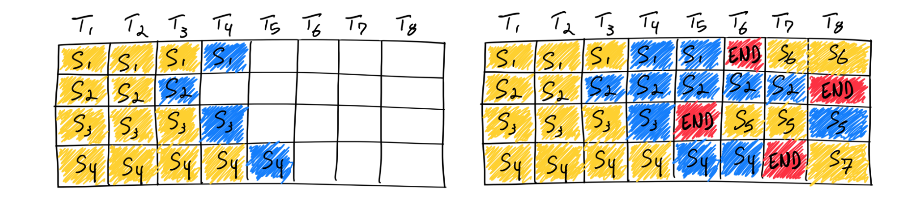

# LLMs in TT-NN
Authors: 
## Contents
- [LLMs in TT-NN](#llms-in-tt-nn)
  - [Contents](#contents)
  - [1. Overview](#1-overview)
  - [2. Modules](#2-modules)
    - [2.1 Embedding](#21-embedding)
    - [2.2 RoPE](#22-rope)
    - [2.3 Norm](#23-norm) 
    - [2.4 Attention](#24-attention)
    - [2.5 MLP](#25-mlp)
    - [2.6 Decoder](#26-decoder)
    - [2.7 LM Head](#27-lm-head)
  - [3. Features](#3-features)
    - [3.1 Generative Decoding](#31-generative-decoding)
    - [3.2 Prefill and Decode](#32-prefill-and-decode)
    - [3.3 Multi-Device](#33-multi-device)
    - [3.4 Continuous Batching](#34-continuous-batching)
    - [3.5 vLLM Integration](#34-vllm-integration)
  - [4. Best Practices and Optimizations](#4-best-practices-and-optimizations)
    - [4.1 Tracing](#41-tracing)
    - [4.2 Async Mode](#42-async-mode)
    - [4.3 Multiple CQs](#43-multiple-cqs)
    - [4.4 Op Configs](#44-op-configs)
    - [4.5 Accuracy](#45-accuracy)
    - [4.6 Performance Analysis](#46-performance-analysis)
    - [4.7 Misc. Performance Optimizations](#47-misc-performance-optimizations)
    - [4.8 Module Tests](#48-module-tests)
    - [4.9 Performance Testing](#49-performance-testing)
    - [4.10 Common Pitfalls](#410-common-pitfalls)
      - [4.10.1 Error Messages](#4101-error-messages)
      - [4.10.2 Shard Spec Mismatches](#4102-shard-spec-mismatches)
      - [4.10.3 Ethernet Dispatch Cores](#4103-ethernet-dispatch-cores)
      - [4.10.4 Hangs](#4104-hangs)
        - [4.10.4.1 Tracing](#41041-tracing)
        - [4.10.4.2 Large Matmuls](#41042-large-matmuls)

## 1. Overview
## 2. Modules
### 2.1 Embedding
### 2.2 RoPE
  - Iterative update system
  - When to use our fused op
### 2.3 Norm
  - Replicated layernorm vs distributed layernorm
    - Layernorm/rmsnorm weights in row major / wrapped around tile size trick
### 2.4 Attention
  - Flash Attention and Flash Decode
    - general description
    - limitations
    - which dims are parallelized
### 2.5 MLP
### 2.6 Decoder
### 2.7 LM Head
## 3. Features
### 3.1 Generative Decoding

Almost every LLM generates text in the same manner: Given a prompt from the user, the LLM predicts the next token. Then, the LLM takes that new token and uses it as context to predict the following token. This process repeats until the LLM generates a token that indicates the end of the sequence, or until the user decides to stop the generation. The process is called "autoregressive generation" because each new token is used to predict the next token.

#### Model Inputs and Outputs
Inputs to the model for generative decoding are generally:
- tokens: produced by the tokenizer
- position ids: the position of the tokens in the sequence
- KV cache: an inference optimization that caches intermediate values

In the model, tokens are embedded from the vocabulary space to the embedding space. Position ids are necessary for updating the KV cache and for positional embeddings like RoPE [TODO: Refer to the RoPE section]. 

The model outputs:
- logits for the next token
- an updated KV cache

The logits are unnormalized probabilities over the vocabulary. Given these probabilities, the sampler must decide which of these tokens in the vocabulary will be chosen. There are a few sampling methods that are commonly used to pick the next token:
- Greedy decoding (argmax of the logits, picks the most likely next token)
- Top-p/top-k sampling (restricts the logits according to p and k values, then samples according to the remaining probabilities)

#### KV cache
The KV cache is an inference optimization. It allows us to cache some intermediate values during the first inference step which are reused in later steps.
On the first inference step, the model processes the full prompt and caches the K and V projections for each layer. Subsequent inference steps compute a Q, K, V projection only for the new token, then use the cached K and V projections in attention. Therefore the first step (prefill) creates the KV cache and subsequent steps (decode) use and update the cache.

The size of the KV cache depends on the batch size and sequence length. Since accelerators have finite memory, it can be necessary to tradeoff batch size and sequence length to allow the KV cache to fit in memory.  

#### Batching
LLMs use batching to process multiple sequences in parallel. There are a few reasons why batching is useful:
- Real-world LLM services need to handle multiple concurrent requests.
- LLM inference is bound by time to read model weights from DRAM. Batching allows model weight reuse across multiple sequences.
- Total throughput of the system increases with batch size.

However, there are tradeoffs with batching. In decode mode, latency scales sublinearly with batch size up to a point. This is because decode is bound by time to read model weights from DRAM rather than time to compute. If the batch grows very large, decode mode will eventually become compute bound, causing latency to scale linearly with batch size. In prefill mode, latency scales linearly with batch size because prefill is compute bound. 

It is typical to use different batch sizes for different use cases, depending on the goal of the system.

#### Performance Metrics
**Time to first token (TTFT)** measures the latency to generate the first token of the sequence. This is the time to prefill a prompt and generate the first token. It is a measure of interactivity. 

**Total throughput (tokens per second)** tells us the total number of tokens that the model can generate per second. `total throughput = batch size / decode step latency`. Total throughput is important for cost-sensitive systems or offline processing, where interactivity is less important than throughput. Generally, increasing batch size will increase total throughput.

**User throughput (tokens per second per user)** is calculated as `user throughput = 1 / decode step latency`. User throughput tells us how interactive the model is, and tells us how fast the generation is for a single user. Generally, decreasing batch size will increase user throughput. 

Note that each of these metrics change with batch size and sequence length. When reporting TTFT, total throughput, and user throughput, the batch size and sequence length must be specified. 


### 3.2 Prefill and Decode
  - submodules, tests
  - how to combine prefill and decode, 
  - slicing prefill to fit in L1
### 3.3 Multi-Device
  - device mesh
  - column parallel followed by row parallel
  - sharding, CCL ops, reducing CCL overheads, etc.

### 3.4 Continuous Batching
Continuous batching is a serving optimization. To describe continuous batching, it is useful to first discuss LLM serving without continuous batching. 

Without continuous batching, an LLM service waits for `batch_size` requests to come in. The service then prefills each request. Then, the service decodes the batched requests token by token. Once all users in the batch finish generation, the service accepts new requests. This is suboptimal because 1) some requests might end generation early, so 2) some slots in the batch are not doing useful computation, while 3) new requests are waiting.

In contrast, continuous batching allows the service to process new requests as soon as there is a free slot in the batch. The pseudo-code for this algorithm is shown below.

```python
while True:
  if not is_full(current_batch) and not prefill_q.empty():
    model_prefill(prefill_q.pop())
  elif not is_empty(current_batch):
    model_decode(current_batch)
  else:
    break
```


The above image from anyscale (https://www.anyscale.com/blog/continuous-batching-llm-inference) shows how continuous batching inserts prefill sequences into the batch as soon as there is a free slot.

Continuous batching improves TTFT by reducing wait times for incoming users. It also increases total throughput by keeping the decode batch full of useful work.

Continuous batching is an LLM serving optimization but it requires some support in the model. The model has to support single user prefill so that when a slot is open, the model can prefill a new request into a specific slot of the batch. The model also has to support batched decode where position ids can be different for each user in the batch, to avoid context contamination.
Implementing continuous batching requires that the serving code track data for each slot of the batch. An example of our continuous batching demo can be found [here](../../models/demos/t3000/llama2_70b/demo/demo_continuous_batching.py). In production deployment, vLLM handles continuous batching for the LLM service.

### 3.5 vLLM Integration

#### Overview
vLLM is an [open-source LLM serving library](https://github.com/vllm-project/vllm). We use vLLM to serve our models in production because of the features it enables. On the serving side, vLLM supports continuous batching and [paged attention](https://arxiv.org/pdf/2309.06180). In addition, vLLM provides an OpenAI-compatible server which is useful for deployment.

Tenstorrent maintains a [fork of vLLM](https://github.com/tenstorrent/vllm/tree/dev) for serving models on Tenstorrent hardware. The [README](https://github.com/tenstorrent/vllm/tree/dev/tt_metal/README.md) has instructions for setting up the environment.

#### Implementation Requirements
In order to add vLLM support to a new model, the model must conform to a certain interface. An example of the interface is the [Llama2-70b generation code](../../models/demos/t3000/llama2_70b/tt/llama_generation.py), which implements `prefill_forward`, `decode_forward`, and `initialize_vllm_model`.
Beyond implementing the functionality needed for continuous batching, a model must also implement paged attention. For an example, see [Llama2-70b attention](../../models/demos/t3000/llama2_70b/tt/llama_attention_optimized.py).

#### vLLM modifications
On the vLLM side there may be additional changes needed to support the new model.

- Modify [`tt_loader.py`](https://github.com/tenstorrent/vllm/blob/dev/vllm/model_executor/model_loader/tt_loader.py) if the model requires a different initialization. 
- Modify [`tt_model_runner.py`](https://github.com/tenstorrent/vllm/blob/dev/vllm/worker/tt_model_runner.py) if it is missing functionality for the new model. 

#### Testing
Finally, test the new model through vLLM. Register the new model as seen in [`offline_inference_tt.py`](https://github.com/tenstorrent/vllm/blob/dev/examples/offline_inference_tt.py).

```python
from models.demos.t3000.llama2_70b.tt.llama_generation import TtLlamaModelForGeneration
ModelRegistry.register_model("TTLlamaForCausalLM", TtLlamaModelForGeneration)
```
and run `offline_inference_tt.py` to generate outputs with vLLM. 

## 4. Best Practices and Optimizations
### 4.1 Tracing
  - link to existing doc, why it helps decode more
### 4.2 Async Mode
### 4.3 Multiple CQs
  - how to feed back output to input and read output asyncronously
### 4.4 Op Configs
  - Writing correct program configs and shard specs 
  - Deciding how many cores to run an op on
    - Why did we use 16 cores for MLP
  - Which matmul to use when @Colman Glagovich 
    - 1d, 2d, dram-sharded, ...
  - Implicitly padding weights in program config for matmuls
### 4.5 Accuracy
  - How we measure it (PCC, perplexity, top-1/top-5, end-user tests, benchmarking)
  - How much PCC is enough? Rules of thumb.
  - Accuracy tests
  - Debugging PCC issues
### 4.6 Performance Analysis
  - Performance tooling, tracy
### 4.7 Misc. Performance Optimizations
  - Which dim to shard matmuls on
  - DRAM-sharding
  - Avoiding sharded to interleaved calls
### 4.8 Module Tests
### 4.9 Performance Testing
### 4.10 Common Pitfalls
#### 4.10.1 Error Messages
  - Running out of L1
  - Shard spec and program config mismatches
  - For some TTNN ops (e.g. ttnn.all_gather) it's not supported to pass -1 in the dim argument. 
    - You'll see an error related to op invocation where the arguments don't match
#### 4.10.2 Shard Spec Mismatches
#### 4.10.3 Ethernet Dispatch Cores
  - link to any other description, and mention it is needed for N300 and T3K
#### 4.10.4 Hangs
##### 4.10.4.1 Tracing
  - Host communications cause tracing to hang
  - Running without async mode enabled causes tracing to hang
  - Careful with print in tracing
##### 4.10.4.2 Large Matmuls
  - Large matmuls hanging? Link to appropriate ticket with workaround
  - Issue is being investigated with a workaround of setting the output subblock to 1,1 and grid size to 8x7
