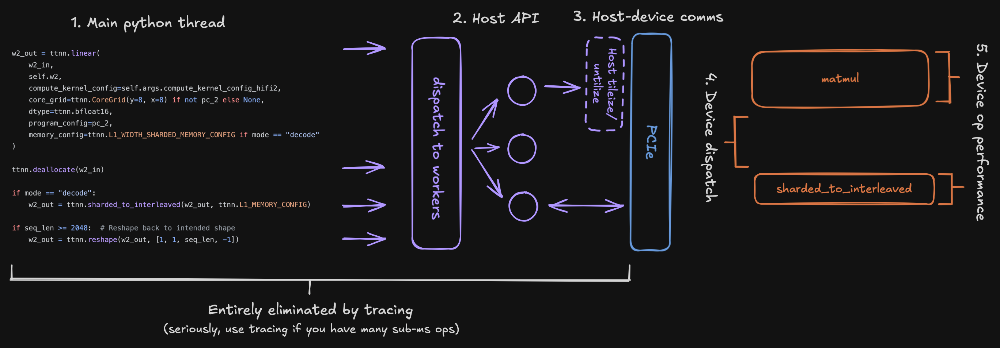
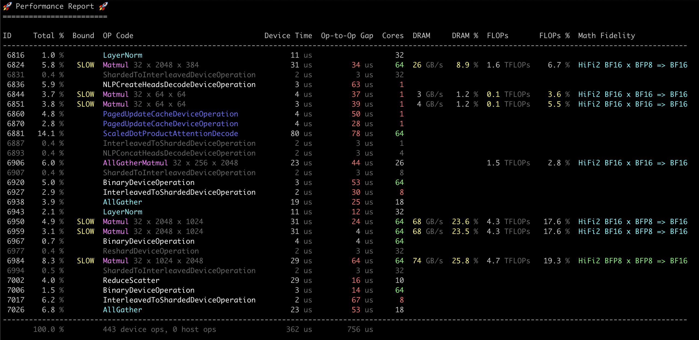

# LLMs in TT-NN
Authors: Mark O'Connor,

## Contents
- [LLMs in TT-NN](#llms-in-tt-nn)
  - [Contents](#contents)
  - [1. Overview](#1-overview)
  - [2. Modules](#2-modules)
    - [2.1 Embedding](#21-embedding)
    - [2.2 RoPE](#22-rope)
    - [2.3 Norm](#23-norm)
    - [2.4 Attention](#24-attention)
    - [2.5 MLP](#25-mlp)
    - [2.6 Decoder](#26-decoder)
    - [2.7 LM Head](#27-lm-head)
  - [3. Features](#3-features)
    - [3.1 Generative Decoding](#31-generative-decoding)
    - [3.2 Prefill and Decode](#32-prefill-and-decode)
    - [3.3 Multi-Device](#33-multi-device)
    - [3.4 Continuous Batching](#34-continuous-batching)
    - [3.5 vLLM Integration](#34-vllm-integration)
  - [4. Best Practices and Optimizations](#4-best-practices-and-optimizations)
    - [4.1 Tracing](#41-tracing)
    - [4.2 Async Mode](#42-async-mode)
    - [4.3 Multiple CQs](#43-multiple-cqs)
    - [4.4 Op Configs](#44-op-configs)
    - [4.5 Accuracy](#45-accuracy)
    - [4.6 Performance Analysis](#46-performance-analysis)
    - [4.7 Misc. Performance Optimizations](#47-misc-performance-optimizations)
    - [4.8 Module Tests](#48-module-tests)
    - [4.9 Performance Testing](#49-performance-testing)
    - [4.10 Common Pitfalls](#410-common-pitfalls)
      - [4.10.1 Error Messages](#4101-error-messages)
      - [4.10.2 Shard Spec Mismatches](#4102-shard-spec-mismatches)
      - [4.10.3 Ethernet Dispatch Cores](#4103-ethernet-dispatch-cores)
      - [4.10.4 Hangs](#4104-hangs)
        - [4.10.4.1 Tracing](#41041-tracing)
        - [4.10.4.2 Large Matmuls](#41042-large-matmuls)

## 1. Overview
This document provides guidance on how to bring up high-performance multi-chip models on Tenstorrent hardware using the TT-Metal stack. It targets users with previous experience on TT-Metal and shares our current best practices, tips, caveats, and workarounds on model bringup.

Basic Requirements:

* **Access to TT hardware -** This document is specifically for bringing models up on Wormhole (WH), but much of this document applies to Grayskull.
* **Good grasp of PyTorch and transformers -** This document skims some basics, for example, this document assumes you understand what a kv-cache is and understand the difference between prefill (reading tokens and generating the kv-cache entries) and decode (auto-regressively generating new tokens one at a time). Beginner tutorials will follow, this document helps experts get up to speed deploying LLMs on Metal.
* **Familiarity with Metal and ttnn -** How to [install](https://github.com/tenstorrent/tt-metal/blob/main/INSTALLING.md), build, run examples, etc.

Other useful resources:
* Reference [ViT guide](https://github.com/tenstorrent/tt-metal/blob/main/tech_reports/ViT-TTNN/vit.md) if this document seems unclear or intimidating.
* Reference [Building llama from scratch](https://levelup.gitconnected.com/building-llama-3-from-scratch-with-python-e0cf4dbbc306) for further information about LLMs in general.

## 2. Modules
### 2.1 Embedding
### 2.2 RoPE
  - Iterative update system
  - When to use our fused op
### 2.3 Norm
  - Replicated layernorm vs distributed layernorm
    - Layernorm/rmsnorm weights in row major / wrapped around tile size trick
### 2.4 Attention
  - Flash Attention and Flash Decode
    - general description
    - limitations
    - which dims are parallelized
### 2.5 MLP
### 2.6 Decoder
### 2.7 LM Head
## 3. Features
### 3.1 Generative Decoding

Almost every LLM generates text in the same manner: Given a prompt from the user, the LLM predicts the next token. Then, the LLM takes that new token and uses it as context to predict the following token. This process repeats until the LLM generates a token that indicates the end of the sequence, or until the user decides to stop the generation. The process is called "autoregressive generation" because each new token is used to predict the next token.

#### Model Inputs and Outputs
Inputs to the model for generative decoding are generally:
- tokens: produced by the tokenizer
- position ids: the position of the tokens in the sequence
- KV cache: an inference optimization that caches intermediate values

In the model, tokens are embedded from the vocabulary space to the embedding space. Position ids are necessary for updating the KV cache and for positional embeddings like RoPE [TODO: Refer to the RoPE section]. 

The model outputs:
- logits for the next token
- an updated KV cache

The logits are unnormalized probabilities over the vocabulary. Given these probabilities, the sampler must decide which of these tokens in the vocabulary will be chosen. There are a few sampling methods that are commonly used to pick the next token:
- Greedy decoding (argmax of the logits, picks the most likely next token)
- Top-p/top-k sampling (restricts the logits according to p and k values, then samples according to the remaining probabilities)

#### KV cache
The KV cache is an inference optimization. It allows us to cache some intermediate values during the first inference step which are reused in later steps.
On the first inference step, the model processes the full prompt and caches the K and V projections for each layer. Subsequent inference steps compute a Q, K, V projection only for the new token, then use the cached K and V projections in attention. Therefore the first step (prefill) creates the KV cache and subsequent steps (decode) use and update the cache.

The size of the KV cache depends on the batch size and sequence length. Since accelerators have finite memory, it can be necessary to tradeoff batch size and sequence length to allow the KV cache to fit in memory.  

#### Batching
LLMs use batching to process multiple sequences in parallel. There are a few reasons why batching is useful:
- Real-world LLM services need to handle multiple concurrent requests.
- LLM inference is bound by time to read model weights from DRAM. Batching allows model weight reuse across multiple sequences.
- Total throughput of the system increases with batch size.

However, there are tradeoffs with batching. As the batch size increases, the latency per decode step will also increase. It is typical to use different batch sizes for different use cases, depending on the goal of the system.

#### Performance Metrics
**Time to first token (TTFT)** measures the latency to generate the first token of the sequence. This is the time to prefill a prompt and generate the first token. It is a measure of interactivity. 

**Total throughput (tokens per second)** tells us the total number of tokens that the model can generate per second. `total throughput = batch size / decode step latency`. Total throughput is important for cost-sensitive systems or offline processing, where interactivity is less important than throughput. Generally, increasing batch size will increase total throughput.

**User throughput (tokens per second per user)** is calculated as `user throughput = 1 / decode step latency`. User throughput tells us how interactive the model is, and tells us how fast the generation is for a single user. Generally, decreasing batch size will increase user throughput. 

Note that each of these metrics change with batch size and sequence length. When reporting TTFT, total throughput, and user throughput, the batch size and sequence length must be specified. 


### 3.2 Prefill and Decode
  - submodules, tests
  - how to combine prefill and decode,
  - slicing prefill to fit in L1
### 3.3 Multi-Device
  - device mesh
  - column parallel followed by row parallel
  - sharding, CCL ops, reducing CCL overheads, etc.

### 3.4 Continuous Batching
Continuous batching is a serving optimization. To describe continuous batching, it is useful to first discuss LLM serving without continuous batching. 

Without continuous batching, an LLM service waits for `batch_size` requests to come in. The service then prefills each request. Then, the service decodes the batched requests token by token. Once all users in the batch finish generation, the service accepts new requests. This is suboptimal because 1) some requests might end generation early, so 2) some slots in the batch are not doing useful computation, while 3) new requests are waiting.

In contrast, continuous batching allows the service to process new requests as soon as there is a free slot in the batch. The pseudo-code for this algorithm is shown below.

```python
while True:
  if not is_full(current_batch) and not prefill_q.empty():
    model_prefill(prefill_q.pop())
  elif not is_empty(current_batch):
    model_decode(current_batch)
  else:
    break
```
Continuous batching improves TTFT by reducing wait times for incoming users. It also increases total throughput by keeping the decode batch full of useful work.

Continuous batching is an LLM serving optimization but it requires some support in the model. The model has to support single user prefill so that when a slot is open, the model can prefill a new request into a specific slot of the batch. The model also has to support batched decode where position ids can be different for each user in the batch, to avoid context contamination.
Implementing continuous batching requires that the serving code track data for each slot of the batch. An example of our continuous batching demo can be found [here](../../models/demos/t3000/llama2_70b/demo/demo_continuous_batching.py). In production deployment, vLLM handles continuous batching for the LLM service.

### 3.5 vLLM Integration

#### Overview
vLLM is an open-source LLM serving library. We use vLLM to serve our models in production because of the features it enables. On the serving side, vLLM support continuous batching and paged attention. In addition, vLLM provides an OpenAI-compatible server which is useful for deployment.

Tenstorrent maintains a [fork of vLLM](https://github.com/tenstorrent/vllm/tree/dev) for serving models on Tenstorrent hardware. The [README](https://github.com/tenstorrent/vllm/tree/dev/tt_metal/README.md) has instructions for setting up the environment.

#### Implementation Requirements
In order to add vLLM support to a new model, the model must conform to a certain interface. An example of the interface is the [Llama2-70b generation code](../../models/demos/t3000/llama2_70b/tt/llama_generation.py), which implements `prefill_forward`, `decode_forward`, and `initialize_vllm_model`.
Beyond implementing the functionality needed for continuous batching, a model must also implement paged attention. For an example, see [Llama2-70b attention](../../models/demos/t3000/llama2_70b/tt/llama_attention_optimized.py).

#### vLLM modifications
On the vLLM side there may be additional changes needed to support the new model.

- Modify [`tt_loader.py`](https://github.com/tenstorrent/vllm/blob/dev/vllm/model_executor/model_loader/tt_loader.py) if the model requires a different initialization. 
- Modify [`tt_model_runner.py`](https://github.com/tenstorrent/vllm/blob/dev/vllm/worker/tt_model_runner.py) if it is missing functionality for the new model. 

#### Testing
Finally, test the new model through vLLM. Register the new model as seen in [`offline_inference_tt.py`](https://github.com/tenstorrent/vllm/blob/dev/examples/offline_inference_tt.py).

```python
from models.demos.t3000.llama2_70b.tt.llama_generation import TtLlamaModelForGeneration
ModelRegistry.register_model("TTLlamaForCausalLM", TtLlamaModelForGeneration)
```
and run `offline_inference_tt.py` to generate outputs with vLLM. 

## 4. Best Practices and Optimizations
### 4.1 Tracing
Reference [Metal Trace guide](https://github.com/tenstorrent/tt-metal/blob/main/tech_reports/AdvancedPerformanceOptimizationsForModels/AdvancedPerformanceOptimizationsForModels.md) for background on tracing. Tracing allows you to record a single pass of your model and store the list of commands and buffers used on-device. You can then execute that trace in a single command with no additional work performed on the host. This eliminates overhead in stages 1-3, you are still responsible for transferring any data needed to and from the device, but host-device transfer of commands is eliminated.

We typically use tracing for the decode pass of LLMs but not the prefill pass. The main reasons for this are linked to tracing’s key limitation:

* You cannot allocate or deallocate tensors during a trace. When executing a trace every buffer will be the same size every time.

Tracing doesn’t work with prefill, sequence length and matmul row counts will likely change. Tracing works with decode, reference sections on handling kv-cache and paging with tracing. Conveniently, in prefill we have large operations in the millisecond plus range which the host can dispatch quickly. Decode, with a comparatively small batch size, we iterate through the entire model in 10ms with microsecond-length op times where we can't wait for a CPU or linux process scheduling, the speed at which electrons coruscate from DRAM and the NoC through our cores.

### 4.2 Async Mode

Async mode allows the host to continuously send commands to the device without blocking until data is read back from device, improving performance. Enable it with:

```python
mesh_device.enable_async(True)
```

Without async mode each python call to ttnn will block until the device has finished and results are available. This is good for debugging, any crash or error will show you the offending line of code. With async mode enabled your python thread keeps on running while the host and device handle background calls, only blocking when data needs to be read back from device.

Async mode is faster, in case of asserts or crashes your python stack will be several lines further on than the call that caused the problem.
For performance work async mode should always be enabled. For debugging it can be useful to disable it.

### 4.3 Multiple CQs
  - how to feed back output to input and read output asyncronously
### 4.4 Op Configs
  - Writing correct program configs and shard specs
  - Deciding how many cores to run an op on
    - Why did we use 16 cores for MLP
  - Which matmul to use when @Colman Glagovich
    - 1d, 2d, dram-sharded, ...
  - Implicitly padding weights in program config for matmuls
### 4.5 Accuracy
  - How we measure it (PCC, perplexity, top-1/top-5, end-user tests, benchmarking)
  - How much PCC is enough? Rules of thumb.
  - Accuracy tests
  - Debugging PCC issues
### 4.6 Performance Analysis

ttnn performance has five components:



1. **Main Python Thread** - Main python thread is your code that executes ttnn calls and other logical OPs. The speed of the main python thread determines the speed at which python calls are dispatched to the API. You are in control of any overheads. When counting in microseconds python is slower than you think.
2. **Host API** - Most ttnn calls are immediately dispatched onto multiple C++ threads for further processing before any hardware changes. You are generally not in control of any overheads in this part of the stack.
3. **Host-device Communications** - Data is heavy, avoid moving it. PCIe bandwidth and latency isn't negligible at the speeds needed to run models. In addition, Tenstorrent converts data into tiles of 32x32 elements for faster processing. Tilizing and untilizing data must be specified, takes time, and is performed on-device where possible.
4. **Device Dispatch** - We can measure time between one OP finishing and the next starting. The lower limit of device dispatches are single-digit microseconds. Work is underway to reduce the lower limit to zero. However, for various reasons you might see much higher dispatch times, most notably if there are a lot of runtime arguments to a function or if OPs are running between calls.
5. **Device OP Performance** - Device OP performance measures how long it takes the hardware to run a given operation. We want performance limited by either DRAM bandwidth or math throughput. For larger OPs both of these are achievable. Device OP performance is about how data is placed (DRAM vs L1, sharded vs interleaved) and how the compute kernels are configured (process more than one tile at once and use smaller data formats).

Further detail will be provided. It is important to confirm that Tracing has been enabled. For more inforation see [4.1 Tracing](#41-tracing) for more details, tracing should be used for decode mode but not prefill mode.

**This means that for decode mode you won’t have to worry about 1-3 but for prefill mode you will.**

#### 1. Main Python Thread

Implement the main python thread if you are not tracing. The main python thread is not important if you are using tracing. The Metal Profiler/Tracy can also show python performance but for pure python analysis Viztracer is a recommended tool. [viztracer](https://github.com/gaogaotiantian/viztracer):

```bash
pip install viztracer
```

Find the line of code to profile, it is usually the part that calls your model’s forward function and wrap it, e.g.:

```python
# ...
# setup code above

from viztracer import Viztracer
with Viztracer(output_file='trace.json') as tracer:
    tt_out = tt_model(decode_input, current_pos, rot_mat=current_rot_mat)
```

You can view this file with `vizviewer trace.json` - it’s self-sufficient so if you’re working on a remote machine you can copy it back to your laptop and run it there (remember to `pip install viztracer` locally as well). Use WASD to navigate the UI and use the mouse to expand processes to see the call stacks. Look for any non-ttnn code that takes a significant amount of time between the ttnn calls in functions and find a way to remove or optimize it.

What to look for:

* The model forward pass running quickly and then waiting in a ttnn.to_torch or similar call reading data back from device.
* Time from the start to end of the forward pass of your model. If this is shorter than target latency of your device, it is Fast Enough™ and you are done with this section.

Top tips:

* Torch modules add overhead to every function call and member access. We don’t subclass `torch.nn.Module` for anything that might have to run quickly.
* Generate shard spec and compute kernel config objects once (e.g. in a constructor) instead of recreating them every time you run the forward pass. Keep the forward pass clean.
* Make sure Metal is compiled in Release mode (default) and you are using ttnn’s async mode (see above).

#### 2. Host API

Any overhead here is outside your control and in our experience is minimal. Use a C++ profiler or [Metal Profiler/Tracy](https://github.com/tenstorrent/tt-metal/blob/main/tech_reports/MetalProfiler/metal-profiler.md) with host stack traces enabled to see this time.

#### 3. Host-device communications

As little communication as possible between the host and the device is preferred. For LLMs this means:

* Perform embeddings on-device (tokens ids are smaller than embeddings).
* Return only the last token from prefill, not all the tokens.
* Perform sampling (argmax etc) on-device if you can (at time of writing only argmax is implemented).
* Avoid pushing attention masks, rotation matrices if they can be generated on-device or re-used between iterations.

Note where data is tilized and untilized. Do not tilize or untilize data on the host. The API `to_torch` will by default do this on the host. You can untilize on-device like this:

```python
tt_out_tiled = tt_model(decode_input, current_pos, rot_mat=current_rot_mat)
tt_out_row_major = ttnn.untilize(tt_out_tiled, use_multicore=True)
tt_tok = ttnn.argmax(tt_out_row_major, dim=3, use_multicore=True)
torch_tok = ttnn.to_torch(tt_tok)
```

Looking at host-device communications in a python profiler like `viztracer` is possible but be careful - when async-mode is on then any time spent in a communication call like `to_torch` can be comprised of up to three measures:

1. Time spent waiting for the device
2. Time spent transferring data
3. Time spent untilizing data

If you want to measure calls this way, turn async mode off. The time your main python thread spends in `to_torch` will not include any time spent waiting for the device and will be a closer approximation the measures above.

#### 4+5. Device dispatch and op performance

This is the fun bit, but we need to do a little prep to get started. First, metal must be compiled with `-p` to enable device profiling:

```bash
./build_metal -p
```

Then we can record an OP performance csv file with tracy. For the pytests, run it like this:

```bash
python -m tracy -r -p -v -m pytest path/to/test.py
```

This produces a file with naming convention similar to `ops_perf_results_2024_11_01_15_33_18.csv`, this file is needed from the profiler. For more information see: [Metal Profiler tech report](https://github.com/tenstorrent/tt-metal/blob/main/tech_reports/MetalProfiler/metal-profiler.md).

> **Warning:** Only use a single trace execution step when profiling. Profiler support with tracing is still a work-in-progress and more iterations will result in a `AssertionError: Device data mismatch error`.

> **Note:** If you see errors while running tracy, try this device-only profiling process instead: run with `TT_METAL_DEVICE_PROFILER=1 pytest path/to/test.py`. After the run completes run `tt_metal/tools/profiler/process_ops_logs.py --date` to generate the CSV file.

This CSV file contains information recorded from all devices during program execution. To summarize, we run the `perf_report.py` tool:

```bash
python models/perf/perf_report.py OPS_CSV_FILE
```

For device performance we recommend looking at a single layer. You can do this by using `--id-range` or by changing your test to run only a single layer of the model. For more information see: [Performance Report Analysis Tool](https://github.com/tenstorrent/tt-metal/tree/main/models/perf). The Performance Report Analysis Tool document describes how to select specific ranges of OPs. 

##### What makes a good performance test?

Ideally you should run your model in as close to end-user form as possible, simplifying it as much as possible. In practice this means:

* Use tracing (if you are using tracing in production).
* Skip the first compilation iteration - this adds a lot of one-time host overhead between OPs.
* Run a single layer of the model - but be aware of which OPs are run for every layer and which ones are only run at the start and end (e.g. embedding, final norm and LM head).
* Add a tracy signpost e.g. `tracy.signpost("Performance pass")` before the part you want to record - this will be focused on by default by `perf_report.py`, saving you some work.

##### What does such a report look like?

Here is an example without tracing enabled. You can instantly see that more time (756us) is spent in between OPs (op-to-op gap) than running OPs on device (362us)!

Reducing op-to-op gap



There are two main contributors to op-to-op gap: **host time** and **dispatch time**.

* **Host time** is optimized in steps 1-3. If you are already using tracing or are using async mode and have ensured that your python thread is dispatching faster than the device is generating outputs, then this has already been minimized.
* **Dispatch time** is out of your hands, but as an example, it is influenced by the number of runtime args a kernel uses.
    * You can examine the source code for any kernel with high op-to-op latency and see if you can convert some runtime args into compile-time args for your use case.
    * You can fuse multiple OPs into a single kernel. Examples where this was worthwhile in the past include `LayerNorm` and `ScaledDotProductAttentionDecode`.

Typically tracing reduces the op-to-op gap below 6us and as of November 2024 there are roadmap plans to reduce this to zero, so as long as your OPs are below this level, your opportunities for optimization here are limited.

See [the next section](#47-misc-performance-optimizations) for tips on how to optimize OP performance.

### 4.7 Misc. Performance Optimizations

There are many individual tips, let’s start with overall advice:

1. Use as many cores as possible.
2. Move data as little as possible.

The perfect OP runs on the entire core grid using sharded inputs from L1. Let’s look more at data movement first, then specific tips.

#### Data movement

OPs can read data from:

1. **DRAM Interleaved** - Each tile (32x32 datums) is read from a different DRAM bank. This is the ttnn default and is the slowest way to read data. A matmul can expect to read around 190 GB/s on a Wormhole like this.
2. **DRAM Sharded** - Specifically used for DRAM-bound matmuls and nothing else, this splits the data across DRAM banks and uses the closest core to each bank on the chip to read from that bank. This achieves around 240 GB/s on a Wormhole.
3. **L1 Interleaved** - Tiles are interleaved across the L1 of all the cores and are read across the NoC (network-on-chip).
4. **L1 Sharded** - Tiles are sharded across a particular grid of cores.

Note that the term **sharding** is used in two ways in the metal stack. Here we are talking about **sharding across cores** within a single chip. It is also used to refer to sharding a dimension across multiple devices - an analogous operation but confusing in this context.

L1 sharded is particularly fast when the data an OP requires is already placed in L1 of the correct core, avoiding the NoC entirely and reading at maximum speed.

Activations are placed in L1 and weights placed in DRAM.

See the [op config section](#44-op-configs) for more details on writing shard specs in your code.

#### Specific tips

Situation: OPs are reading from the fastest memory they can, sharded if possible. What might still make things slow?

* **Unnecessary `ShardedToInterleaved` and `InterleavedToSharded` calls**. The fastest work is work that you don’t have to do. These calls are pure data movement and it is often better to have some OPs using fewer cores if it means they can use the same sharding of their input data as the previous and subsequent OPs. Always avoid data movement!
* **Always use `ScaledDotProductAttention` (SDPA) OPs if possible**. These implement FlashAttention / FlashDecode and are much faster than writing attention using individual operations.
* **Cross-device communication OPs**. `AllGather`, `ReduceScatter` etc. Avoid these where possible, try using `bfp8` inputs instead of `bf16` if you can. There is an `AllGatherMatmul` OP that overlaps `AllGather` with a `Matmul` that you can investigate further too - see `ttnn.experimental.all_gather_matmul` with an [example of its use](https://github.com/tenstorrent/tt-metal/blob/79ff70b0e115ac50e70a72391dde3c4a4a6fab7f/models/demos/llama3/tt/llama_attention.py#L329) looking like this:

```python
_, dense_out_sharded, _ = ttnn.experimental.all_gather_matmul(
    input_tensor,
    weights,
    dim=3,
    all_gather_core_grid_offset=(0, 4),
    num_links=1,
    memory_config_ag=all_gather_memcfg,
    memory_config_mm=ttnn.L1_WIDTH_SHARDED_MEMORY_CONFIG,
    program_config=all_gather_matmul_progcfg,
    compute_kernel_config=compute_kernel_config_hifi2,
)
```

**Matmuls** are usually the most significant workload. They should be memory-bound, compute-bound or too small to matter. `perf_report.py` gives good advice for your matmuls and you should follow it, which usually involves specifying a [program config](#44-op-configs):

* Output subblock size should be at least 2x1 or 1x2.
* DRAM-sharded matmuls should be used for any DRAM-bound cases, e.g. most decode matmuls.
* The inner dim number of tiles (`in0_block_w`) should be at least 2 if possible.
* Use the lowest precision you can for weights and inputs - we find BFP8 weights always work and BFP4 weights work for some matmuls particularly in the MLP.
* Use an appropriate math fidelity in the compute kernel config. This controls the number of bits multiplied together and is especially important for compute-bound matmuls as the Tensix core’s math throughput is 2x higher with HiFi2 and 3.6x faster with LoFi.
    * Use HiFi4 for BF16 weights or if accuracy is very important (you often see this in attention ops)
    * Use HiFi2 for BFP8 weights - this drops the least-significant bit of a BF16 @ BFP8 matmul but this is usually not an issue. You may find that LoFi works as well.
    * Use LoFi for BFP4 weights.

You can specify a compute kernel like this:

```python
self.compute_kernel_config_hifi2 = ttnn.WormholeComputeKernelConfig(
    math_fidelity=ttnn.MathFidelity.HiFi2,
    math_approx_mode=False,
    fp32_dest_acc_en=False,
    packer_l1_acc=True,
)
```

As always, do not recreate these every single forward pass if you want your python thread to be fast (which you do).
### 4.8 Module Tests
### 4.9 Performance Testing
### 4.10 Common Pitfalls
#### 4.10.1 Error Messages
  - Running out of L1
  - Shard spec and program config mismatches
  - For some TTNN ops (e.g. ttnn.all_gather) it's not supported to pass -1 in the dim argument.
    - You'll see an error related to op invocation where the arguments don't match
#### 4.10.2 Shard Spec Mismatches
#### 4.10.3 Ethernet Dispatch Cores
  - link to any other description, and mention it is needed for N300 and T3K
#### 4.10.4 Hangs
##### 4.10.4.1 Tracing
  - Host communications cause tracing to hang
  - Running without async mode enabled causes tracing to hang
  - Careful with print in tracing
##### 4.10.4.2 Large Matmuls
  - Large matmuls hanging? Link to appropriate ticket with workaround
  - Issue is being investigated with a workaround of setting the output subblock to 1,1 and grid size to 8x7
