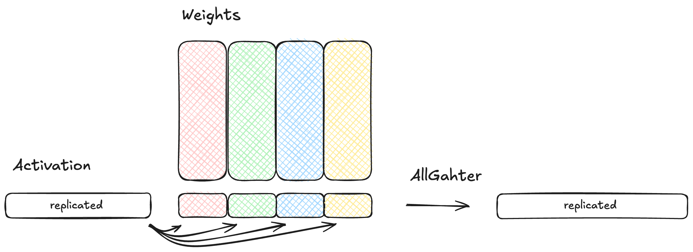

# LLMs in TT-NN
Authors:
## Contents
- [LLMs in TT-NN](#llms-in-tt-nn)
  - [Contents](#contents)
  - [1. Overview](#1-overview)
  - [2. Modules](#2-modules)
    - [2.1 Embedding](#21-embedding)
    - [2.2 RoPE](#22-rope)
    - [2.3 Norm](#23-norm)
    - [2.4 Attention](#24-attention)
    - [2.5 MLP](#25-mlp)
    - [2.6 Decoder](#26-decoder)
    - [2.7 LM Head](#27-lm-head)
  - [3. Features](#3-features)
    - [3.1 Generative Decoding](#31-generative-decoding)
    - [3.2 Prefill and Decode](#32-prefill-and-decode)
    - [3.3 Multi-Device](#33-multi-device)
    - [3.4 Continuous Batching](#34-continuous-batching)
    - [3.5 vLLM Integration](#34-vllm-integration)
  - [4. Best Practices and Optimizations](#4-best-practices-and-optimizations)
    - [4.1 Tracing](#41-tracing)
    - [4.2 Async Mode](#42-async-mode)
    - [4.3 Multiple CQs](#43-multiple-cqs)
    - [4.4 Op Configs](#44-op-configs)
    - [4.5 Accuracy](#45-accuracy)
    - [4.6 Performance Analysis](#46-performance-analysis)
    - [4.7 Misc. Performance Optimizations](#47-misc-performance-optimizations)
    - [4.8 Module Tests](#48-module-tests)
    - [4.9 Performance Testing](#49-performance-testing)
    - [4.10 Common Pitfalls](#410-common-pitfalls)
      - [4.10.1 Error Messages](#4101-error-messages)
      - [4.10.2 Shard Spec Mismatches](#4102-shard-spec-mismatches)
      - [4.10.3 Ethernet Dispatch Cores](#4103-ethernet-dispatch-cores)
      - [4.10.4 Hangs](#4104-hangs)
        - [4.10.4.1 Tracing](#41041-tracing)
        - [4.10.4.2 Large Matmuls](#41042-large-matmuls)

## 1. Overview
## 2. Modules
### 2.1 Embedding
### 2.2 RoPE
  - Iterative update system
  - When to use our fused op
### 2.3 Norm
  - Replicated layernorm vs distributed layernorm
    - Layernorm/rmsnorm weights in row major / wrapped around tile size trick
### 2.4 Attention
  - Flash Attention and Flash Decode
    - general description
    - limitations
    - which dims are parallelized
### 2.5 MLP
### 2.6 Decoder
### 2.7 LM Head
## 3. Features
### 3.1 Generative Decoding

### 3.2 Prefill and Decode

Large language models require two distinct phases for inference due to the fundamental nature of transformer attention and autoregressive generation: prefill and decode.

In our LLM implementations, the prefill phase is done sequentially for each user, but parallel for the prompt tokens of each user. During prefill, the model computes attention scores for all prompt tokens against each other and populates the key-value (KV) cache which will speed up the computation of the decode phase. At the end of the prefill phase, the first token for the following autoregressive generation will also be computed.

The decode phase is parallel-computed for all users, but sequential for each token within a batch of users. Each new token can only be generated after the previous one, as the model must maintain causality in attention computations.

#### **Technical Implementation Differences**

The intermediate activations in prefill mode are kept in DRAM, due to the large size of the tensors which contain the entire sequence length. In decode mode, the intermediate activations are kept in L1 memory instead, since in this mode the sequence length to compute is just 1 (one token at the time), reducing latency.

##### 1. Reshaping for Large Matrix Multiplications

Please see the [attention source code](../../models/demos/llama3/tt/llama_attention.py) for reference.

In prefill mode, when the input sequence length is very large, the model reshapes its input tensors to process sequences in smaller chunks in parallel for larger matrix multiplications, such as `wqkv`, `wo` in the attention module, and `w1`, `w2`, `w3` in the MLP module. This reshaping prevents running out of memory in cases of long prefill sequence lengths. For instance:

```python
if seq_len > 2048:
    x_11SH = ttnn.reshape(x_11SH, [1, seq_len // 2048, 2048, -1])

xqkv_fused = ttnn.linear(
    x_11SH,
    self.wqkv,
    dtype=ttnn.bfloat16,
    memory_config=ttnn.DRAM_MEMORY_CONFIG,
    compute_kernel_config=self.compute_kernel_config_hifi2,
    program_config=self.model_config["XQKV_PREFILL_PROGCFG"](seq_len),
)
```

This reshaping is not needed for decode mode because it only processes one token at a time. Instead, the parallelization for decode mode is done over user batches, which currently only goes up to 32.

##### 2. KV Cache Management

The KV-cache is filled during prefill using the `ttnn.experimental.paged_fill_cache` operation. This supports page tables, which enables the hot-swapping of new users when the full model is deployed.

```python
# Fill cache with initial states
ttnn.experimental.paged_fill_cache(
    keys_BKSD,
    k_fill,
    page_table,
    batch_idx=user_id
)
```

Similarly, during decode, the KV-cache update is done by `ttnn.experimental.paged_update_cache`, which updates the new KV values for all the users currently processing, with their respective positions.

```python
# Update KV cache with a single new token
ttnn.experimental.paged_update_cache(
    keys,
    k_heads_1BKD,
    update_idxs_tensor=current_pos,
    page_table=page_table
)
```

##### 3. Attention Computation
###### Prefill:
```python
# Split q_heads into num_groups and kv_heads for parallel group computation for grouped query attention (GQA)
q_heads_84SD_8b = ttnn.reshape(
    q_heads_1QSD_8b,
    [self.n_local_kv_heads, self.n_local_heads // self.n_local_kv_heads, -1, self.head_dim]
)

# Prefill implements causal masking across the full sequence
attn_output_84SD = ttnn.transformer.scaled_dot_product_attention(
    q_heads_84SD_8b,
    k_heads_K1SD_8b,
    v_heads_V1SD_8b,
    is_causal=True,  # Ensures tokens only attend to previous tokens
    scale=self.scale
)
```

###### Decode:
```python
# Decode uses cached states instead of recomputing
attn_output_11BH = ttnn.transformer.scaled_dot_product_attention_decode(
    q_heads_1BQD,  # Only new token query
    keys,          # Cached keys
    values,        # Cached values
    cur_pos_tensor=current_pos  # Track position for causal attention
)
```

##### 4. Slicing Before the LM Head
At the end of prefill, the model should generate the first decoded token, then signaling the start of the decode phase. To this end, the model slices the output of the last decoder layer to the last tile before computing the LM head. This is necessary because only last token from prefill is needed to start the autoregressive decoding.

```python
x = ttnn.slice(x, (0, 0, get_last_token, 0), (1, 1, get_last_token + 32, x.shape[-1]))
```

#### **Prefill vs. Decode: Comparison Summary**

|  | Prefill Mode | Decode Mode |
| --- | --- | --- |
| Purpose | Bulk sequence processing for initialization or training | Incremental processing for autoregressive inference |
| Demo Parallelization | Sequential for each user, parallel for the sequence length of each user | Parallel for 32 users, sequential for each token within a batch of users |
| Batch and sequence Length | Processes long sequences (≥ 128 tokens), single user | Processes batch of users (≤ 32 users), single token |
| Memory Use | DRAM, with reshaping into smaller chunks for long sequence lengths | L1 on-chip memory for fast, low-latency processing |
| Attention | Handles sequences in bulk; more memory-intensive | Incremental attention with precomputed components |
| LM head slicing | Slices to last tile before Lm head matmul to extract the last token | Slicing not required |

### 3.3 Multi-Device
There are two main approaches for scaling across multiple devices: data parallel and tensor parallel.

In data parallel scaling there are _multiple independent_ instances of the model running in parallel so that multiple batches of users are processed at the same time. This mode is used to increase throughput.

In tensor parallel scaling there is _one_ instance of the model executed on multiple devices, where a single operation is performed distributed and thus in parallel on multiple devices. This mode allows larger models, that would not fit on a single device, to run on multiple devices, and typically also reduces latency.

There is also hybrid forms of those two modes where a cluster of devices runs multiple independent instances of the model, but each of those model instances uses multiple chips in a tensor parallel fashion.

In chapter [Programming Mesh of Devices with TT-NN](../Programming_Mesh_of_Devices/Programming_Mesh_of_Devices_with_TT-NN.md) there is a good introduction to using TTNN's key concepts for scaling to multiple devices. It shows how to use a single handle for a mesh of devices, and how a tensor can be sharded or replicated to that mesh of devices. The tensor handle is used analogously to single device tensors, with the only difference that all operations on that tensor are then executed in parallel on each device and operate on their respective local chunk of data. This tech report also shows how data parallel and a hybrid form of data and tensor parallelism can be used with TTNN.

Multiple devices can be connected with each other in different topologies. The most important ones for us are Ring, where all devices are connected in a ring shape with each other, and Line, where a (sub-) group of devices is connected in a line with each other. Line topology could be a 1D or 2D grid of devices, where each row and column is connected in a line.

Here is a summary and example code of the most important concepts for mapping a tensor to a mesh of devices in TTNN:

*Figure: Example usage of mesh_device, ShardTensorToMesh and ReplicateTensorToMesh*
```py
import ttnn

# 2x4 mesh_device, Topology Ring: devices are connected in a ring
mesh_device = ttnn.open_mesh_device(ttnn.MeshShape(2, 4), mesh_type=ttnn.MeshType.Ring)

# Construct test tensor of data; 8 chunks of 32x32
torch_tensor = torch.rand((1,1,32,256), dtype=torch.bfloat16)

# Convert to ttnn.Tensor, tilize and move onto mesh_device (2x4 devices) by sharding in dimension 3
# mesh_tensor_sharded contains data on all 8 devices, where each device has a 32x32 sized chunk of the data
mesh_tensor_sharded = ttnn.from_torch(
    torch_input_tensor,
    layout=ttnn.TILE_LAYOUT,
    device=mesh_device,
    mesh_mapper=ttnn.ShardTensorToMesh(mesh_device, dim=3),
)

# Convert to ttnn.Tensor, tilize and move onto mesh_device (2x4 devices) by replication
# mesh_tensor_replicated contains data on all 8 devices, where each device has the same 32x256 sized tensor
mesh_tensor_replicated = ttnn.from_torch(
    torch_input_tensor,
    layout=ttnn.TILE_LAYOUT,
    device=mesh_device,
    mesh_mapper=ttnn.ReplicateTensorToMesh(mesh_device),
)
```

The second key concept to scaling a model to multiple devices are Collective Communication Library (CCL) operations. They are used to efficiently exchange data between multiple devices. TTNN currently supports the following CCL Operations:
- AllGather
- ReduceScatter
- AllReduce

See the [CCL Developer Guide](../EthernetMultichip/CclDeveloperGuide.md) for more comprehensive coverage about CCL and their implementation details. Our library of supported operations can be found [here](../EthernetMultichip/CclDeveloperGuide.md#op-list-op-list).

#### AllGather
The AllGather operation collects data from all devices, concatenating each chunk along a specified dimension. The result is stored on each device (replication).
- Supported Topologies: Ring, Linear
- Supported number of links
  - N300, T3000: 1
  - TG: 4 along cluster_axis=0, 3 along cluster_axis=1
- Arguments
  - mesh_tensor: a tensor mapped to a mesh_device via mesh_mapper
  - dim: the dimension to concatenate
  - num_links: number of ethernet links to be used
  - cluster_axis: cluster axis to gather along
  - mesh_device: mesh device the tensor is mapped to

*Figure: Example usage of Ring All-Gather on 2x4 mesh_device*

```py
# Execute All-Gather on the sharded tensor
# Assuming mesh_tensor_sharded is a sharded tensor over 8 devices where each devices contains a 32x32 sized chunk of data, the output_tensor is of size 32x256
output_tensor = ttnn.all_gather(mesh_tensor_sharded, dim=3, num_links=1)
```

*Figure: Example usage of Linear All-Gather on 2x4 mesh_device*

```py
# Execute All-Gather on the sharded tensor
# Assuming mesh_tensor_sharded is a sharded tensor over 2x4 devices where each devices contains a 32x32 sized chunk of data, the output_tensor is of size 32x128 where each row has the same data
output_tensor = ttnn.all_gather(mesh_tensor_sharded, dim=3, num_links=2, cluster_axis=1, mesh_device=mesh_device, topology=ttnn.Topology.Linear)
```

#### ReduceScatter
The ReduceScatter operation reduces the data across all devices and shards the result of the reduction over a specified dimension across all devices.
- Supported Topologies: Ring, Linear
- Supported number of links: 1
- Arguments
  - mesh_tensor: a tensor mapped to a mesh_device via mesh_mapper
  - dim: the dimension to concatenate
  cluster_axis: cluster axis to gather along
  - num_links: number of ethernet links to be used
  - topology: topology configuration ttnn.Ring or ttn.Linear

*Figure: Example usage of Ring Reduce-Scatter on 2x4 mesh_device*

```py
# Execute Reduce-Scatter on the sharded tensor
# Assuming mesh_tensor_sharded is a sharded tensor over 8 devices where each devices contains a 32x32 sized chunk of data, the output_tensor is again of size 32x32 on each devices but reduced over all devices
output_tensor = ttnn.reduce_scatter(mesh_tensor_sharded, dim=3, num_links=1)
```

*Figure: Example usage of Linear Reduce-Scatter on 2x4 mesh_device*

```py
# Execute Reduce-Scatter on the sharded tensor
# Assuming mesh_tensor_sharded is a sharded tensor over 2x4 devices where each devices contains a 32x32 sized chunk of data, the output_tensor is of size 32x32 on each device but reduces over each row of devices
output_tensor = ttnn.reduce_scatter(mesh_tensor_sharded, dim=3, num_links=1, cluster_axis=1, mesh_device=mesh_device, topology=ttnn.Topology.Linear)
```

#### AllReduce
The AllReduce operation reduces data across all devices and stores the entire tensor on each device (replication). It is performed using an AllGather followed by a ReduceScatter.
  - A fused version of AllReduce is planned, but currently only the composite of AllGather+ReduceScatter is supported

#### Sharding schemes for decode
In decode mode, activations are generally stored in L1 memory, while weights, which are too large, need to be stored in DRAM. The main bottleneck in decode mode is thereby DRAM bandwidth required to load model weights.

The activations in decode mode are so small because they contain the batch size (=users) in the height dimension while sequence length is 1 - with the only exception being the attention operations computing softmax(Q*KˆT)*V. The activation width is the current dim, e.g. model dim = 8k for llama 70b. Activations are not sharded in the height dimension; however, depending on the operation, they may be sharded in the width dimension.

Matmul weights on the other hand can be sharded in width, height, or both. Sharding weights across multiple devices significantly reduces DRAM pressure per device, resulting in notable latency improvements. Below is a summary of useful sharding schemes for sharding weights in decode mode.

##### 1D Column parallel
When to use: 1D cluster topologies

Weights are sharded in width, such that each device contains a horizontal slice of the weights. For this scheme the activations need to be gatherd beforehead, i.e. each device processes the whole activation. The result of a column parallel matmul is an activation that is sharded in width. An AllGather operation is used on dim=3 to gather (i.e., replicate) activations.



##### 1D Row parallel
When to use: 1D cluster topologies

Weights are sharded in height, such that each device contains a vertical slice of the weights. For this scheme the activations need to be sharded beforehand, i.e. each device processes a width-shard of the activation. The result of a row parallel matmul are activation partials with the final result's output dimensions, each device containing a partial result. To reduce the activations, i.e. compute the final outout, a ReduceScatter operation is used to compute the reduced result across all devices and shard the result along a specified dimension. Additionally an AllGahter operation is used (ReduceScatter+AllGather = AllReduce) to gather the reduced shards and thus replicate the final output on each device.


##### 1D Column parallel followed by row parallel

When to use: 1D cluster topologies

1D Weight Sharding is a sharding scheme that combines column and row parallel matmuls and can reduce the data volume sent over CCL operation and thus spped up computation. It consists of a column parallel matmul followed by a row parallel matmul. In this scheme the initial activations are gathered, and the column parallel matmul produces width sharded outputs. The row parallel matmul consumes those sharded activations and produces parial outputs. We need an AllReduce (ReduceScatter+AllGather) operation to compute the final reduced and gathered outputs. Optimization potential in this scheme depends highly on the input dimensions to CCL operations. We can use this scheme for the MLP, and any sequence of matmuls that expands and then narrows the output dimension again, becuase it moves the CCL operation to a more beneficial location in the computational graph and thus reduces the CCL data volume.

Let's look at the MLP as concrete example: in Llama 70b we have _FF1_ and _FF3_ with dimensions [32, 8k] x [8k, 28k] and then the _FF2_ with [32, 28k] x [28k, 8k]. If we gather after _FF1_ and _FF3_ we have to gather activations of size [32, 28k/num_devices] -> [32, 28k] for each of _FF1_ and _FF3_; after the _FF2_ we'd need to gather again [32, 8k/num_devices] -> [32, 8k]. If we instead use this scheme and thus move the CCL operation after the _FF2_, we only have to (1.) ReduceScatter num_devices partials of size [32, 8k] -> [32, 8k/num_devices] and then optionally AllGather to obtain the [32, 8k] gathered outputs.


##### 2D Weight Sharding
When to use: 2D cluster topologies

In 2D Weight Sharding on a 2D cluster weights are sharded in width and in height, such that each device contains a block of the weights. For this scheme the activations are sharded in width along cluster_axis=0 and are replicated along cluster_axis=1, and the weights are block sharded. Thus, each device processes a width-shard of the activation, and a bock of the weights where the activations are replicated over one axis but the weights are not.
The result after the matmul is width sharded along cluster_axis=0 and contain partial results along cluster_axis=1. Typically an AllReduce (ReduceScatter+AllGather) is used to first reduce along cluster_axis=1 and then gather the shards along cluster_axis=0.


Note, that this section referres to sharding schemes across devices and not on a core level. On a core level we use 1D matmuls that are width sharded for decode workloads. See the [matmul configuration section](#44-op-configs) for details about different matmul versions and sharding on a core level.

##### Examplary scheme: llama

For our llama family of models we are using the following sharding schemes:

| Matmul            | N300            | T3000           | TG              |
|-------------------|-----------------|-----------------|-----------------|
| _QKV projection_  | Column parallel | Column parallel | 2D              |
| _Dense out_       | Row parallel    | Row parallel    | 2D              |
| _FF1_             | Column parallel | Column parallel | 2D              |
| _FF3_             | Column parallel | Column parallel | 2D              |
| _FF2_             | Row parallel    | Row parallel    | 2D              |


### 3.4 Continuous Batching
  - quick intro and how it is implemented in demos.
### 3.5 vLLM Integration
  - Our vLLM repo and what's needed to integrate with it.
## 4. Best Practices and Optimizations
### 4.1 Tracing
  - link to existing doc, why it helps decode more
### 4.2 Async Mode
### 4.3 Multiple CQs
  - how to feed back output to input and read output asyncronously
### 4.4 Op Configs
  - Writing correct program configs and shard specs
  - Deciding how many cores to run an op on
    - Why did we use 16 cores for MLP
  - Which matmul to use when @Colman Glagovich
    - 1d, 2d, dram-sharded, ...
  - Implicitly padding weights in program config for matmuls
### 4.5 Accuracy
  - How we measure it (PCC, perplexity, top-1/top-5, end-user tests, benchmarking)
  - How much PCC is enough? Rules of thumb.
  - Accuracy tests
  - Debugging PCC issues
### 4.6 Performance Analysis
  - Performance tooling, tracy
### 4.7 Misc. Performance Optimizations
  - Which dim to shard matmuls on
  - DRAM-sharding
  - Avoiding sharded to interleaved calls
### 4.8 Module Tests

#### Llama3 Module and Test Differences

In our current Llama3 model, the attention module class (`TtLlamaAttention`) implements two primary methods for attention computation: `forward_prefill` and `forward_decode`. 
To test these, we provide two separate attention test files, `test_attention_decode` and `test_attention_prefill`, which create the appropriate input tensors:
- A tensor of size `(batch, dim)` in L1 for decode,
- A tensor of size `(seqlen, dim)` in DRAM for prefill.

Each attention test compares the attention module output and KV-cache correlation between the PyTorch host implementation and the TTNN device implementation.

The current version of the MLP module class (`TtLlamaMLP`) handles prefill and decode in the same file but has some technical differences (mentioned in the section below).

The decoder module (which encapsulates both attention and MLP) and model module (which encapsulates the decoder and the remaining parts of the Llama3 model) also handle prefill and decode in the same file, but they call the respective modes within the attention and MLP modules.

### 4.9 Performance Testing
### 4.10 Common Pitfalls
#### 4.10.1 Error Messages
  - Running out of L1
  - Shard spec and program config mismatches
  - For some TTNN ops (e.g. ttnn.all_gather) it's not supported to pass -1 in the dim argument.
    - You'll see an error related to op invocation where the arguments don't match
#### 4.10.2 Shard Spec Mismatches
#### 4.10.3 Ethernet Dispatch Cores
  - link to any other description, and mention it is needed for N300 and T3K
#### 4.10.4 Hangs
##### 4.10.4.1 Tracing
  - Host communications cause tracing to hang
  - Running without async mode enabled causes tracing to hang
  - Careful with print in tracing
##### 4.10.4.2 Large Matmuls
  - Large matmuls hanging? Link to appropriate ticket with workaround
  - Issue is being investigated with a workaround of setting the output subblock to 1,1 and grid size to 8x7
