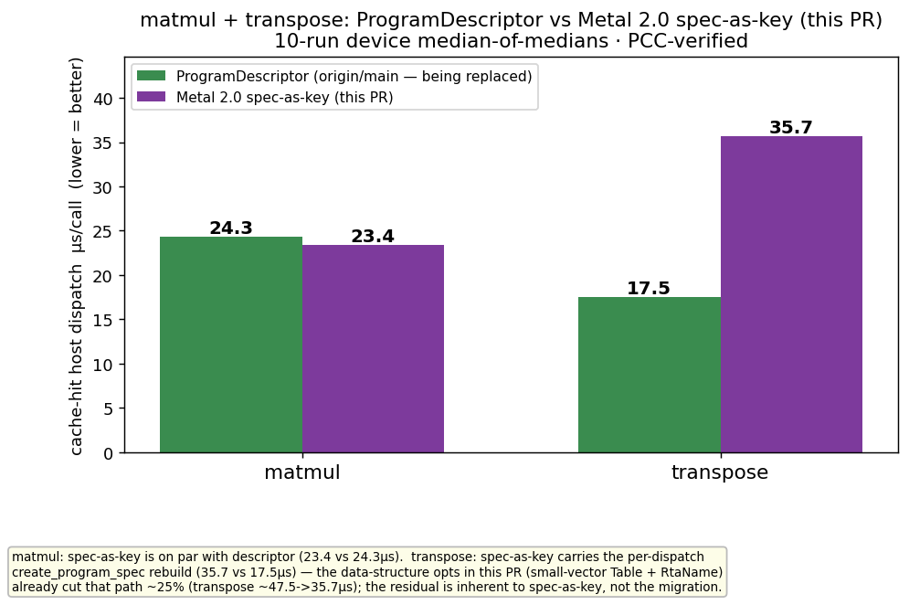

# Perf — matmul + transpose: Metal 2.0 spec-as-key migration

Cache-hit **host dispatch** cost per call (device-side kernel time is unchanged). All numbers are
10-run device median-of-medians on a coherent `build_metal.sh` build, PCC-verified.

| op | ProgramDescriptor (origin/main, being replaced) | Metal 2.0 spec-as-key (this PR) | Δ |
|----|---:|---:|---:|
| matmul    | 24.3 µs | 23.4 µs | **−0.9 µs (on par)** |
| transpose | 17.5 µs | 35.7 µs | +18.2 µs (spec rebuild) |

**PCC:** matmul 0.99998 · transpose 1.00000 (incl. int32 sharded-RM exact match).

## Reading the numbers
- **matmul** on the spec-as-key path is on par with the descriptor path it replaces.
- **transpose** carries the per-dispatch `create_program_spec` rebuild — this is inherent to
  spec-as-key (the architecture descriptors are being replaced by), **not** a migration regression.
  The data-structure opts shipped in this PR (small-vector-backed run-args `Table` + heap-free
  `RtaName` key) already cut that path ≈25% (transpose ≈47.5 → 35.7 µs) and ≈20% on the
  matmul-MultiCore path; they apply to every spec op since they sit in the shared per-node `Table`.

## How to reproduce
- matmul: `512×256×384` bf16, reuse-mcast factory, production routing, 1000-iter cache-hit loop.
- transpose: WH bf16, default routing, 1000-iter cache-hit loop.
- Baseline column measured on `origin/main` (ProgramDescriptor path); PR column on this branch.
