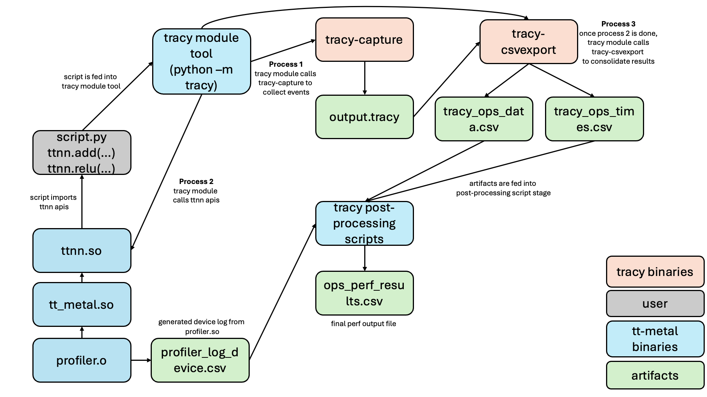

# Metal Profiler

## Quick Links
- Tracy Profiler Repo: https://github.com/wolfpld/tracy
- Tracy Documentation: https://github.com/wolfpld/tracy/releases/latest/download/tracy.pdf
- Metal Fork of Tracy: https://github.com/tenstorrent/tracy
- Official Metalium Tracy Documentation: [docs/source/tt-metalium/tools/tracy_profiler.rst](../../docs/source/tt-metalium/tools/tracy_profiler.rst)

## Introduction
Tracy is an open-source C++ profiling tool with sampling and code instrumentation profiling capabilities. The profiled application is a client, and the profiler itself is a server (by default runs on port 8086). It was named this way because the client is a thin layer that just collects events and sends them for processing and long-term storage on the server. The fact that the server needs to connect to the client to begin the profiling session may be a bit confusing at first.

## Things built from Tracy that are needed in tt-metal
tt-metal uses v0.10 of Tracy. tt-metal has forked the tracy repo and added specific functionality to support running tracy on Tenstorrent devices. The fork is located at https://github.com/tenstorrent/tracy and is vendored in the repository at `tt_metal/third_party/tracy/`. The key differences between v0.10 and v0.11.1 are how the tools within Tracy are built, with the former being from Makefile and the latter upgrading to CMake.

For instructional purposes, the following section describes metal's fork of v0.10.

### tracy-client
tracy-client is a library that you link to your application. It will act as a thin wrapper between your application and the server. All macro calls that you insert into your application via Tracy APIs will interface with the tracy-client.
```
cmake -B build -S . -DCMAKE_BUILD_TYPE=Release -DTRACY_ENABLE=ON
cmake --build build --config Release --parallel
libTracyClient.a
```

### tracy-capture
tracy-capture is a command line executable that acts as the tracy server to capture events from tracy-client. It will dump a .tracy file which you can feed into tracy-profiler GUI.
```
cd capture/build/unix
make all
./tracy-capture -o test.tracy
```

### tracy-profiler
tracy-profiler is a gui application that also acts as the tracy server. It can consume events from tracy-client live or can ingest a .tracy file computed offline. Typically you would run this on your local macbook while running tracy client + application on some remote machine. This is usually built on a machine in the same network as your host machine.
```
cd profiler/build/unix
make all
./tracy-profiler
```

### tracy-csvexport
tracy-csvexport is a command line executable that consumes .tracy file and outputs a csv file with all the data within the .tracy file. It is meant for an easier way to view the data.
```
cd csvexport/build/unix
make all
./tracy-csvexport test.tracy
```

## Basic Tracy Application
The following section descibres how to integrate Tracy into your project. It is meant for devs to understand the flow of Tracy before using it in tt-metal or extending tt-metal within their own application.

### 1. Add Tracy
Add the Tracy repository to your project directory (as a third_party submodule)
```
mkdir third_party
cd third_party
git clone https://github.com/tenstorrent/tracy.git
cd tracy
```

### 2. Build tracy-client
Build tracy-client as a static lib and link to your executable target (or use Tracy::TracyClient)
```
add_executable(runner main.cpp)
add_subdirectory(third_party/tracy)
target_link_libraries(runner PUBLIC hellolib Tracy::TracyClient)
target_include_directories(runner third_party/tracy/public)
```

### 3. Add Tracy includes
Add tracy/Tracy.hpp as an include file to any file that will use tracy apis. Tracy source files are located in tracy/public directory
```
#include "tracy/Tracy.hpp"
```

### 4. Define compile options
Define TRACY_ENABLE=ON for the WHOLE project (otherwise, won't be able to collect any data)
```
set(CMAKE_CXX_FLAGS "${CMAKE_CXX_FLAGS} -DTRACY_ENABLE=ON")
```

### 5. Insert macros
Insert tracy related macro calls into your code
eg. Zones in Tracy are marked sections of code that users are interested in profiling. Tracy provides macros such as ZoneScoped; to accomplish this. Please refer to section 3 of Tracy’s documentation for further information on zones and available macros.
```
TracyMessageL("hello");
ZoneScoped;
FrameMarkNamed("main");
```

### 6. Build tracy-capture

### 7. Build tracy-csvexport

### 8. Build tracy-profiler

## Developer Flow for using Tracy

### 1. Start tracy-capture
This will start listening on default port + address for which the tracy-client will interact with. It will dump all it's results into a .tracy file (which can be uploaded into tracy-profiler after)
```
./tracy-capture -o hello.tracy -f
```

### 2. (Optional) Start tracy-profiler
Instead of starting tracy-capture via command line, you can start tracy-profiler from your macbook. The tracy-profiler is a gui that will communicate in real-time with the tracy-client and display the results on the gui.
```
./tracy-profiler
```

### 3. Start application
Start your application in a different terminal. This is the application that has been compiled with all the stuff mentioned in Basic Tracy Integration. As your application runs, you will see tracy-capture capturing events/tracy-profiler capturing events.
```
./runner
```

### 4. (Only if did 1.) Feed .tracy into tracy-profiler
If you used tracy-capture, it will dump a .tracy file once this is complete. You can then feed this .tracy file into the tracy-profiler to view the results.

### 5. (Only if did 1.) View .tracy contents
You can also view the contents of the .tracy file as a csv file using tracy-csvexport. This will dump the results in csv format which you can pip into a file and view the results. Optionally, you can also save the .tracy file via the GUI itself and then feed it into the tracy-csvexport tool.
```
./tracy-csvexport hello.tracy
```

## Tracy Example
The following section will provide an example of how to use Tracy in a sample app, step by step.

### 1. Setup project directory structure
```
- project/
  - third_party/
    - tracy/
  - include/
    - hellolib.hpp
  - CMakeLists.txt
  - main.cpp
  - hellolib.cpp
```

### 2. Fill in contents of each file found below
// third_party/tracy
```
mkdir third_party
cd third_party
git clone https://github.com/tenstorrent/tracy.git
cd tracy
```

// hellolib.hpp
```
#include "tracy/Tracy.hpp"
#include <string>

int add(int a, int b);
int subtract(int a, int b);
int multiply(int a, int b);
int divide(int a, int b);
```

// CMakeLists.txt
```
cmake_minimum_required(VERSION 3.10)

project(TracyTest LANGUAGES CXX)
set(CMAKE_CXX_STANDARD 17)
set(CMAKE_CXX_STANDARD_REQUIRED True)

set(CMAKE_CXX_FLAGS "${CMAKE_CXX_FLAGS} -DTRACY_ENABLE=ON")

add_library(hellolib SHARED hellolib.cpp)

target_include_directories(hellolib
    PUBLIC
        ${CMAKE_SOURCE_DIR}/include
        ${CMAKE_SOURCE_DIR}/third_party/tracy/public
)

add_executable(runner main.cpp)

add_subdirectory(third_party/tracy)

# Link the executable against the shared library
target_link_libraries(runner PUBLIC hellolib Tracy::TracyClient)
```

// main.cpp
```
#include "tracy/Tracy.hpp"
#include <iostream>
#include "hellolib.hpp"
#include <unistd.h> // for sleep()

int main() {
    sleep(5); // need to add short sleep call so that tracy client can establish connection
    FrameMarkNamed("main");
    TracyMessageL("Hello");
    ZoneScoped;
    int c = 0;
    std::cout << "Hello, World = " << c << std::endl;
    c = add(5, 5);
    c = subtract(5, 5);
    c = multiply(5, 5);
    c = divide(5, 5);
    return 0;
}
```

// hellolib.cpp
```
#include "tracy/Tracy.hpp"
#include "hellolib.hpp"
#include <iostream>
#include <string>

int add(int a, int b) {
  TracyMessageL("add");
  ZoneScoped;
  int c = a + b;
  return c;
}

int subtract(int a, int b) {
  TracyMessageL("subtract");
  ZoneScoped;
  return a - b;
}

int multiply(int a, int b) {
  TracyMessageL("multiply");
  ZoneScoped;
  return a * b;
}

int divide(int a, int b) {
  TracyMessageL("divide");
  ZoneScoped;
  return a / b;
}
```

### 3. Build Project
This will build the executable and binarines in `build/` folder.
```
mkdir -p build
cd build/
cmake -G Ninja -DTRACY_ENABLE=ON ..
ninja
```

### 4. Build tracy-capture

### 5. Optional: Build tracy-profiler (on macbook)

### 6. Build tracy-csvexport

### 7. Start tracy-capture OR tracy-profiler
Start this in a separate terminal. This will dump all events into hello.tracy.
```
./tracy-capture -o hello.tracy
```

Start this on your macbook. This will collect all events live. You need to make sure you port forward from your remote machine to your macbook.
```
./tracy-profiler
```

### 8. Run project
This will run the executable and the results will be collected by tracy-capture and stored into `hello.tracy` file or displayed lived on tracy-profiler.
```
cd build
./runner
```

### (Optional) Run tracy-csvexport
If you used tracy-capture and want to view the results, you can pass them through tracy-csvexport. This will dump out all the results in csv format which you can then pipe to a file. You can also save a .tracy file via the tracy-profiler GUI and view them using this tool.
```
./csvexport hello.tracy
```

### (Optional) Upload .tracy file into tracy-profiler
If you used tracy-capture to get the .tracy file, you can upload it into tracy-profiler GUI offline on your macbook. Follow instructions on GUI widget.

## Tracy + Metal
The following sections relate to tt-metal's usage of Tracy. tt-metal uses v0.10 version of Tracy. They have also built on top of Tracy with custom files to support device side profiling. The fork is located at https://github.com/tenstorrent/tracy and is vendored in the repository at `tt_metal/third_party/tracy/`. There are several components regarding how tt-metal integrates Tracy and provides profiler support.

### Building with Tracy profiler
Tracy profiler is **enabled by default** when building tt-metal. Simply run:
```
./build_metal.sh
```
To disable the profiler, use:
```
./build_metal.sh --disable-profiler
```
All of the tools that are needed by metal are generated under `build/tools/profiler/bin/`.

### tt_metal.so
tt_metal shared library is generated, which has all the low level implementation details. This library can be used standalone if calling tt_metal APIs and it is linked against ttnn.so if using ttnn APIs. This library is also what Tracy links against.
```
location: tt_metal/CMakeLists.txt
eg: target_link_libraries(tt_metal PUBLIC compiler_flags $<$<BOOL:${ENABLE_TRACY}>:TracyClient>)
```

### profiler.o
A profiler object gets generated with various low level API calls within tt-metal. This object is linked against tt_metal.so.
```
location: tt_metal/impl/profiler
eg: profiler.cpp
```

### Tracy module tool for dev convenience
```
location: tools/tracy
eg: __main__.py
```

Developers can use the tracy module tool that will handle everything internally for them (such as tracy-capture, tracy-csvexport etc). This is provided for convenience. Profiling python code with tracy requires running your python code with the python tracy module. For profiling your entire python program, run your program as follows.
```
python -m tracy {test_script}.py
```

### Tracy post-processing scripts
Metal will dump out various information about kernel profiling data. All this information gets cleaned and presented in a visible format through various post-processing scripts. If you are using the tracy module script infrastructure provided by metal, it will handle all of this for you.
```
location: tools/tracy
eg: process_ops_logs.py
```

### Tracy + Metal Architecture
The following image depicts the architectural diagram and program flow for how metal integrates Tracy and how the internal flow works. Everything is handled internally by the Tracy module tool that metal provides for dev convenience.



## Extending Tracy to External Applications
For an example of how metal Tracy is used in another application, please refer to https://github.com/tenstorrent/tt-mlir, specifically https://github.com/tenstorrent/tt-mlir/tree/main/runtime/tools/python (ttrt) - an independent runtime wrapper around metal APIs.
