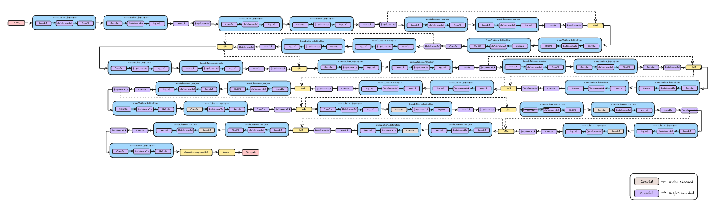
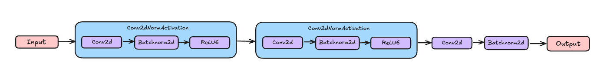
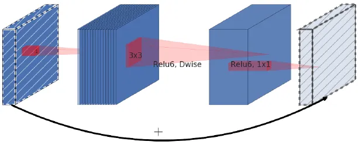
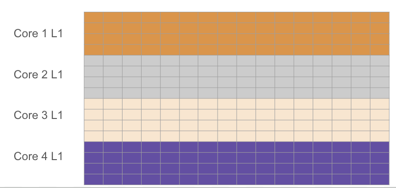

# Mobilenetv2 in TT-NN

## Contents

- [Mobilenetv2 in TT-NN](#Mobilenetv2-in-tt-nn)
  - [Contents](#contents)
  - [1. Overview](#1-overview)
  - [2. Mobilenetv2 TT-NN Code Structure](#2-mobilenetv2-tt-nn-code-structure)
    - [2.1 Inverted Residuals](#21-inverted-residuals)
  - [3. Mobilenetv2 TT-NN Optimization Techniques](#3-Mobilenetv2-tt-nn-optimization-techniques)
    - [3.1 Sharding on all relevant OPs](#31-sharding-on-all-relevant-ops)
    - [3.2 Sharding techniques for convolution](#32-sharding-techniques-for-convolution)
    - [3.3 Data type Optimization](#33-data-type-optimization)

  - [4. Conclusion](#4-conclusion)


## 1. Overview
The MobileNetV2 model is a convolutional neural network (CNN) architecture designed for efficient mobile and embedded vision applications. It was introduced in the paper ["MobileNetV2: Inverted Residuals and Linear Bottlenecks"](https://arxiv.org/abs/1801.04381). </br>
The MobileNetV2 model has been pre-trained on the ImageNet dataset and can be used for various tasks such as image classification, object detection, and semantic segmentation. It has achieved state-of-the-art performance on several benchmarks 1 for mobile and embedded vision applications.

## 2. Mobilenetv2 TT-NN Code Structure



### 2.1 Inverted Residuals



Inverted Residual Blocks in MobileNetV2 are a key architectural component designed to improve computational efficiency while maintaining accuracy. They differ from traditional residual blocks in a significant way.

How Inverted Residual Blocks Work:</br>
- <b>Expansion:</b> The input tensor is first expanded in channels using a 1x1 convolution. This increases the dimensionality of the tensor. </br>
- <b>Depthwise Separable Convolution:</b> This layer applies a convolution operation separately along each channel of the expanded tensor. This reduces the number of parameters compared to a standard convolution, making it more efficient.</br>
- <b>Projection:</b> The output of the depthwise separable convolution is then projected back to the original number of channels using another 1x1 convolution.</br>



#### In pytorch it would look like
```py
class inverted_residuals(nn.Module):
    def __init__(self):
        self.c1 = nn.Conv2d(3, 32, 3, 2, 1, bias=False)
        self.b1 = nn.BatchNorm2d(32)
        self.relu = nn.ReLU6(inplace=True)

        self.c2 = nn.Conv2d(32, 32, 3, 1, 1, groups=32, bias=False)
        self.b2 = nn.BatchNorm2d(32)

        self.c3 = nn.Conv2d(32, 16, 1, 1, bias=False)
        self.b3 = nn.BatchNorm2d(16)

    def forward(self, input: torch.Tensor):
        x1 = self.c1(input)
        x1_b = self.b1(x1)
        x1_m = self.relu(x1_b)

        x2 = self.c2(x1_m)
        x2_b = self.b2(x2)
        x2_m = self.relu(x2_b)

        x3 = self.c3(x2_m)
        x3_b = self.b3(x3)
        return x3_b
```
#### In ttnn it would look like
```py
class inverted_residuals:
    def __init__(self, parameters: ParameterDict, device, model) -> None:
        self.device = device

        self.c1 = MobileNetV2Conv2D(parameters.c1, parameters.b1, device)
        self.c2 = MobileNetV2Conv2D(parameters.c2, parameters.b2, device)

        self.c3 = MobileNetV2Conv2D(parameters.c3, parameters.b3, device)
    def __call__( self, device, x):
        output_tensor = self.c1(x)
        output_tensor = ttnn.relu6(output_tensor)

        output_tensor = self.c2(output_tensor)
        output_tensor = ttnn.relu6(output_tensor)

        output_tensor = self.c3(output_tensor)
        return ttnn.from_device(output_tensor)
```
Since the model has many convolution layers, a method for convolution2d is implemented,

```py
class MobileNetV2Conv2D:
    def fold_batch_norm2d_into_conv2d(self, conv, bn):
        if not bn.track_running_stats:
            raise RuntimeError("BatchNorm2d must have track_running_stats=True to be folded into Conv2d")
        weight = conv.weight
        running_mean = bn.running_mean
        running_var = bn.running_var
        eps = bn.eps
        scale = bn.weight
        shift = bn.bias
        weight = weight * (scale / torch.sqrt(running_var + eps))[:, None, None, None]
        bias = shift - running_mean * (scale / torch.sqrt(running_var + eps))
        return weight, bias

    def __init__(
        self,
        conv,
        bn=None,
        device=None,
        cache={},
        activation="",
        activation_dtype=ttnn.bfloat8_b,
        weights_dtype=ttnn.bfloat8_b,
        use_1d_systolic_array=True,
        shard_layout=ttnn.TensorMemoryLayout.HEIGHT_SHARDED,
    ):
        self.device = device
        self.batch_size = conv.batch_size
        self.input_height = conv.input_height
        self.input_width = conv.input_width
        self.in_channels = conv.in_channels
        self.out_channels = conv.out_channels
        self.kernel_size = conv.kernel_size
        self.padding = conv.padding
        self.stride = conv.stride
        self.groups = conv.groups
        self.use_1d_systolic_array = use_1d_systolic_array
        self.deallocate_activation = True
        self.cache = cache

        self.conv_config = ttnn.Conv2dConfig(
            dtype=activation_dtype,
            weights_dtype=weights_dtype,
            math_fidelity=ttnn.MathFidelity.LoFi,
            shard_layout=shard_layout,
            deallocate_activation=self.deallocate_activation,
            fp32_dest_acc_enabled=True,
            packer_l1_accum_enabled=False,
            enable_act_double_buffer=False,
            enable_split_reader=False,
            enable_subblock_padding=False,
            reshard_if_not_optimal=True if self.use_1d_systolic_array else False,
            activation=activation,
        )
        config_override = conv.conv_blocking_and_parallelization_config_override
        if config_override and "act_block_h" in config_override:
            self.conv_config.act_block_h_override = config_override["act_block_h"]

        if bn is not None:
            weight, bias = self.fold_batch_norm2d_into_conv2d(conv.module, bn.module)
        else:
            weight, bias = conv.module.weight, conv.module.bias

        weight = weight
        bias = torch.reshape(bias, (1, 1, 1, -1))
        self.weight = ttnn.from_torch(weight, dtype=ttnn.float32)
        self.bias = ttnn.from_torch(bias, dtype=ttnn.float32)

    def __call__(self, x):
        x, output_height, output_width, self.weight, self.bias = ttnn.conv2d(
            input_tensor=x,
            weight_tensor=self.weight,
            bias_tensor=self.bias,
            device=self.device,
            in_channels=self.in_channels,
            out_channels=self.out_channels,
            input_height=self.input_height,
            input_width=self.input_width,
            batch_size=self.batch_size,
            kernel_size=self.kernel_size,
            stride=self.stride,
            padding=self.padding,
            conv_config=self.conv_config,
            conv_op_cache=self.cache,
            groups=self.groups,
        )
        return x
```

## 3. Mobilenetv2 TT-NN Optimization Techniques
### 3.1 Sharding on all relevant OPs
  - Applying sharding techniques to harvest the optimum utilization of the computation OPs, by eliminating the need for data movement inter-tensix-cores between the consecutive OPs.
  - For more details, please refer to the [related tech-report](https://github.com/tenstorrent/tt-metal/blob/main/tech_reports/tensor_layouts/tensor_layouts.md#42-sharding)
  - Sharding Concepts

  - Illustrative example


Example:-

Functional Code:-
```py
output_tensor = ttnn.sharded_to_interleaved(output_tensor, ttnn.L1_MEMORY_CONFIG)
output_tensor_left = ttnn.sharded_to_interleaved(output_tensor_left, ttnn.L1_MEMORY_CONFIG)
output_tensor = ttnn.concat([output_tensor, output_tensor_left], dim=3, memory_config=ttnn.L1_MEMORY_CONFIG)
```
Optimized Code:-
```py
output_tensor = ttnn.to_layout(output_tensor, layout=ttnn.ROW_MAJOR_LAYOUT)
output_tensor_left = ttnn.to_layout(output_tensor_left, layout=ttnn.ROW_MAJOR_LAYOUT)
output_sharded_memory_config = ttnn.create_sharded_memory_config(
    [512, 128],
    core_grid=output_tensor_left.memory_config().shard_spec.grid,
    strategy=ttnn.ShardStrategy.HEIGHT,
    use_height_and_width_as_shard_shape=True,
)
output_tensor = ttnn.concat(
    [output_tensor, output_tensor_left], dim=3, memory_config=output_sharded_memory_config
)
```

### 3.2 Sharding techniques for convolution

Utilizing the appropriate sharding layout for convolution can enhance the core count of convolution and matrix multiplication operations, leading to improved overall performance. The recommended sharding strategies for convolution are as follows: use BLOCK_SHARDED when
𝐶
≈
𝑁
×
𝐻
×
𝑊
C≈N×H×W, HEIGHT_SHARDED when
𝑁
×
𝐻
×
𝑊
≫
𝐶
N×H×W≫C, and WIDTH_SHARDED when
𝐶
≫
𝑁
×
𝐻
×
𝑊
C≫N×H×W.

Consider 512x512 tensor, where each 512x512 input tensor will be divided into smaller 16x16 tiles across 4 cores. Lets see how different types of sharding looks,

#### Height sharding
```py
    conv_config = ttnn.Conv2dConfig(
            shard_layout=ttnn.TensorMemoryLayout.HEIGHT_SHARDED,
            )
```


#### Width sharding
```py
    conv_config = ttnn.Conv2dConfig(
            shard_layout=ttnn.TensorMemoryLayout.WIDTH_SHARDED,
            )
```


#### Block sharding
```py
    conv_config = ttnn.Conv2dConfig(
            shard_layout=ttnn.TensorMemoryLayout.BLOCK_SHARDED,

```


For instance, consider two input configurations: The First input is sized [1, 3, 224, 224], also with a kernel size of (3, 3), padding of (1, 1), and a stride of (2, 2). the second input has a size of [1, 736, 28, 28] (in NHWC format) with a kernel size of (1, 1), padding of (0, 0), and a stride of (1, 1).

According to the guidelines, the optimal sharding is to apply HEIGHT_SHARDED for the first input (since
𝑁
×
𝐻
×
𝑊
≫
𝐶
N×H×W≫C) and BLOCK_SHARDED for the second input (as
𝑁
×
𝐻
×
𝑊
≈
𝐶
N×H×W≈C).

### 3.3 Data type Optimization
- Uses more efficient data types (e.g., `bfloat8_b`) to reduce memory usage and enhance computation speed.

- Similar to the functional implementation but uses more efficient data types and operations.


Functional Code:-

```python
              conv_config = ttnn.Conv2dConfig(
                        weights_dtype=ttnn.bfloat16,
              )
```

Optimized Code:-

```python
              conv_config = ttnn.Conv2dConfig(
                        weights_dtype=ttnn.bfloat8_b,
              )
```

## 4. Conclusion
This guide outlines the MobilenetV2 model, its submodules and optimization techniques implemented in the MobilenetV2 model.
