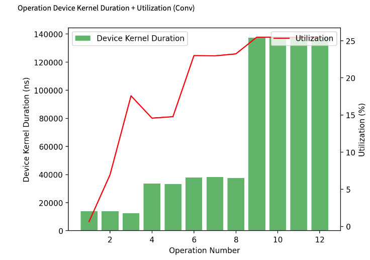
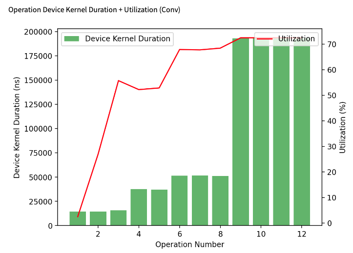
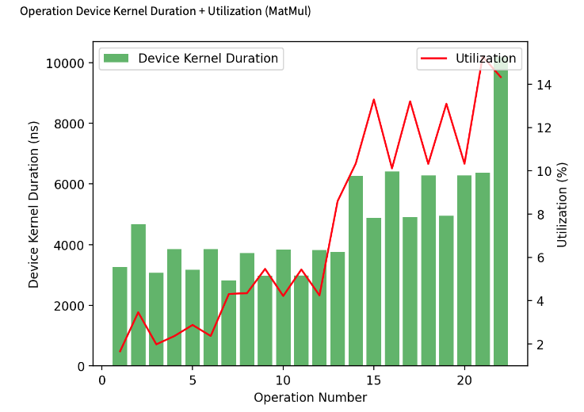
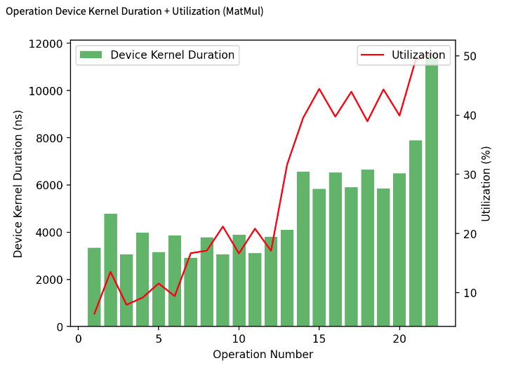
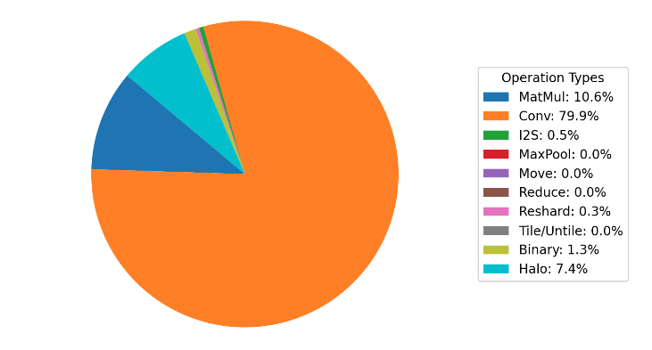
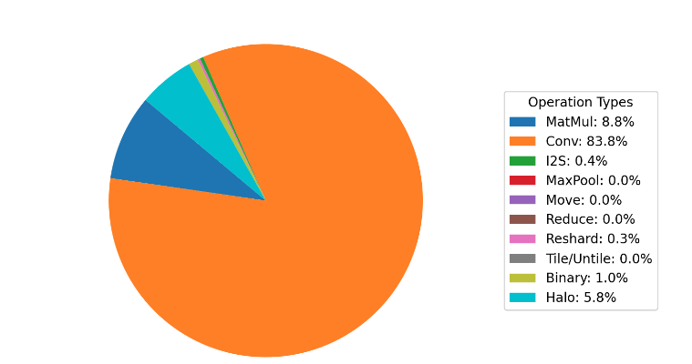

# Mobilenetv2 in TT-NN

## Contents

- [Mobilenetv2 in TT-NN](#Mobilenetv2-in-tt-nn)
  - [Contents](#contents)
  - [1. Overview](#1-overview)
  - [2. Mobilenetv2 TT-NN Code Structure](#2-mobilenetv2-tt-nn-code-structure)
    - [2.1 Inverted Residuals](#21-inverted-residuals)
    - [2.2 Model preprocessing](#22-model-preprocessing)
        - [2.2.1 create_mobilenetv2_model_parameters](#221-create_mobilenetv2_model_parameters)
        - [2.2.2 infer_ttnn_module_args ](#222--infer_ttnn_module_args)
    - [2.3 Convolution operation](#23-convolution-operation)
  - [3. Mobilenetv2 TT-NN Optimization Techniques](#3-Mobilenetv2-tt-nn-optimization-techniques)
    - [3.1 Sharding on all relevant OPs](#31-sharding-on-all-relevant-ops)
    - [3.2 Sharding techniques for convolution](#32-sharding-techniques-for-convolution)
    - [3.3 Data type Optimization](#33-data-type-optimization)
    - [3.4 Other common Optimization](#34-other-common-optimization)
  - [4. Auto download weights](#4-auto-download-weights)
  - [5. Conclusion](#5-conclusion)


## 1. Overview
The MobileNetV2 model is a convolutional neural network (CNN) architecture designed for efficient mobile and embedded vision applications. It was introduced in the paper ["MobileNetV2: Inverted Residuals and Linear Bottlenecks"](https://arxiv.org/abs/1801.04381). </br>
The MobileNetV2 model has been pre-trained on the ImageNet dataset and can be used for various tasks such as image classification, object detection, and semantic segmentation. It has achieved state-of-the-art performance on several benchmarks 1 for mobile and embedded vision applications.

## 2. Mobilenetv2 TT-NN Code Structure


### 2.1 Inverted Residuals


Inverted Residual Blocks in MobileNetV2 are a key architectural component designed to improve computational efficiency while maintaining accuracy. They differ from traditional residual blocks in a significant way.

How Inverted Residual Blocks Work:</br>
- <b>Expansion:</b> The input tensor is first expanded in channels using a 1x1 convolution. This increases the dimensionality of the tensor. </br>
- <b>Depthwise Separable Convolution:</b> This layer applies a convolution operation separately along each channel of the expanded tensor. This reduces the number of parameters compared to a standard convolution, making it more efficient.</br>
- <b>Projection:</b> The output of the depthwise separable convolution is then projected back to the original number of channels using another 1x1 convolution.</br>


#### In pytorch it would look like
```py
class inverted_residuals(nn.Module):
    def __init__(self):
        self.relu = nn.ReLU6(inplace=True)

        self.c1 = nn.Conv2d(16, 96, 1, 1, bias=False)
        self.b1 = nn.BatchNorm2d(96)

        self.c2 = nn.Conv2d(96, 96, 3, 2, 1, groups=96, bias=False)
        self.b2 = nn.BatchNorm2d(96)

        self.c3 = nn.Conv2d(96, 24, 1, 1, bias=False)
        self.b3 = nn.BatchNorm2d(24)

    def forward(self, input: torch.Tensor):
        x1 = self.c1(input)
        x1_b = self.b1(x1)
        x1_m = self.relu(x1_b)

        x2 = self.c2(x1_m)
        x2_b = self.b2(x2)
        x2_m = self.relu(x2_b)

        x3 = self.c3(x2_m)
        x3_b = self.b3(x3)
        return x3_b
```
#### In ttnn it would look like
```py
class inverted_residuals:
    def __init__(self, parameters: ParameterDict, device, model) -> None:
        self.device = device

        self.c1 = MobileNetV2Conv2D(parameters.c1, parameters.b1, device)
        self.c2 = MobileNetV2Conv2D(parameters.c2, parameters.b2, device)
        self.c3 = MobileNetV2Conv2D(parameters.c3, parameters.b3, device)

    def __call__( self, device, x):
        output_tensor = self.c1(x)
        output_tensor = ttnn.relu6(output_tensor)

        output_tensor = self.c2(output_tensor)
        output_tensor = ttnn.relu6(output_tensor)

        output_tensor = self.c3(output_tensor)
        return ttnn.from_device(output_tensor)
```
### 2.2 Model preprocessing

In the above code, we used parameters contains the configuration of each layer which is extracted with the following functions,</br>
#### 2.2.1 <b>create_mobilenetv2_model_parameters:</b>
After initializing the MobileNetV2 reference model in the test, we will perform model preprocessing, which includes calling the ```create_mobilenetv2_model_parameters``` function which is responsible for creating the parameters needed to run MobileNetV2 on the TTNN. It calls ```infer_ttnn_module_args``` to extract the configuration of each layer in the MobileNetV2 model and then attaches specific parameters to the resulting dictionary.</br>

Here's a brief breakdown:</br>
```py
def create_mobilenetv2_model_parameters(model: Mobilenetv2, input_tensor, device):
    parameters = infer_ttnn_module_args(model=model, run_model=lambda model: model(input_tensor), device=None)
    assert parameters is not None
```
The function calls ```infer_ttnn_module_args``` with a lambda function that takes the model and runs a forward pass with the input_tensor. This essentially triggers the model execution and captures the computation graph for inference.

```py
for key in parameters.keys():
    parameters[key].module = getattr(model, key)
```
After extracting the parameters, it iterates through each key in the parameters dictionary and assigns the corresponding model module from the model object. This ensures that each layer in the model has its actual module (such as Conv2d, MaxPool2d, etc.) assigned to the corresponding entry in the parameters dictionary.

#### 2.2.2 <b> infer_ttnn_module_args: </b>
This function is responsible for tracing the computation graph of the model and inferring the configuration parameters for each layer in the model. These configurations are required to optimize and run the model on TTNN.</br>
Here is the breakdown,</br>
```py
def infer_ttnn_module_args(*, model, run_model, device):
    if run_model is None:
        return None
    with trace():
        output = run_model(model)
    visualize(output, file_name=ttnn.CONFIG.tmp_dir / "model_graph.svg")
```
The function enters the ```trace()``` which traces the forward pass of the model, which means it will record all the operations performed during the model execution and results are stored in ```output```</br>
```py
visualize(output, file_name=ttnn.CONFIG.tmp_dir / "model_graph.svg")
```

After the model has been run, the resulting computation graph (output) is visualized and saved as an SVG file. The file is saved to a temporary directory, with the filename "model_graph.svg".

```py
def _infer_ttnn_module_args(graph):
    ttnn_module_args = {}
```

- This is a recursive helper function that will traverse the computation graph (graph) to extract the arguments for each module (layer) in the model.</br>
- ```ttnn_module_args``` is an empty dictionary is initialized. This dictionary will store the arguments for each module, with the module names as keys.

```py
for node in graph:
    attributes = graph.nodes[node]
    operation = attributes["operation"]
```

Then it iterates over each node in the computation graph. Each node represents an operation (such as Conv2d or MaxPool2d) in the model.

- ```attributes = graph.nodes[node]```: This line extracts the attributes associated with the current node. These attributes include the operation itself (e.g., Conv2d, MaxPool2d).
- ```operation = attributes["operation"]```: The specific operation or module is extracted from the node's attributes.
```py
if isinstance(operation, ttnn.tracer.TorchModule):
    *_, module_name = operation.module.__ttnn_tracer_name__.split(".")
```

The code checks if the operation is an instance of ttnn.tracer.TorchModule, which suggests that it’s a traceable PyTorch module. If the operation is a PyTorch module, it will be processed further.
```py
(input_node, _, edge_data), *_ = graph.in_edges(node, data=True)
input_shape = graph.nodes[input_node]["shapes"][edge_data["source_output_index"]]
```
- The code looks for the input node of the current operation and retrieves its input shape.

- ```graph.in_edges(node, data=True)```: This returns the incoming edges to the current node (operation). The ```data=True``` flag ensures that edge data is included.
```py
if isinstance(operation.module, torch.nn.Conv2d):
    ttnn_module_args[module_name] = Conv2dArgs(
        in_channels=operation.module.in_channels,
        out_channels=operation.module.out_channels,
        kernel_size=operation.module.kernel_size,
        stride=operation.module.stride,
        padding=operation.module.padding,
        dilation=operation.module.dilation,
        groups=operation.module.groups,
        padding_mode=operation.module.padding_mode,
        batch_size=input_shape[0],
        input_height=input_shape[-2],
        input_width=input_shape[-1],
        math_fidelity=ttnn.MathFidelity.HiFi4,
        dtype=ttnn.bfloat16,
        weights_dtype=ttnn.bfloat16,
        use_1d_systolic_array=True,
        enable_auto_formatting=False,
        conv_blocking_and_parallelization_config_override={},
        device=device,
    )
```

If the current operation is a Conv2d, the function constructs an instance of Conv2dArgs and populates it with parameters such as in_channels, out_channels, kernel_size, stride, etc.
```py
elif isinstance(operation.module, torch.nn.MaxPool2d):
    ttnn_module_args[module_name] = MaxPool2dArgs(
        kernel_size=operation.module.kernel_size,
        stride=operation.module.stride,
        padding=operation.module.padding,
        dilation=operation.module.dilation,
        batch_size=input_shape[0],
        input_height=input_shape[-2],
        input_width=input_shape[-1],
        dtype=ttnn.bfloat16,
    )
```
Similarly, if the current operation is a MaxPool2d, the function constructs an instance of MaxPool2dArgs and fills it with parameters like kernel_size, stride, padding, etc.
```py
else:
    ttnn_module_args[module_name] = _infer_ttnn_module_args(operation.graph)
```
If the operation is neither a Conv2d nor a MaxPool2d, the function assumes that the operation might contain a subgraph (i.e., the module might have nested operations). It recursively calls _infer_ttnn_module_args on the subgraph (operation.graph) to gather the arguments for the nested operations.
```py
if module_name.isdigit():
    ttnn_module_args[int(module_name)] = ttnn_module_args[module_name]
return make_dot_access_dict(ttnn_module_args, ignore_types=(ModuleArgs,))
```
If module_name is a digit (e.g., the name might be a numeric identifier like "0"), it adds the module arguments to ttnn_module_args under the integer version of the name. </br>
After processing all the nodes, the function returns the ttnn_module_args dictionary.

### 2.3 Convolution operation
Since the model has many convolution layers, a method for convolution2d is implemented,

```py
class MobileNetV2Conv2D:
    def fold_batch_norm2d_into_conv2d(self, conv, bn):
        if not bn.track_running_stats:
            raise RuntimeError("BatchNorm2d must have track_running_stats=True to be folded into Conv2d")
        weight = conv.weight
        running_mean = bn.running_mean
        running_var = bn.running_var
        eps = bn.eps
        scale = bn.weight
        shift = bn.bias
        weight = weight * (scale / torch.sqrt(running_var + eps))[:, None, None, None]
        bias = shift - running_mean * (scale / torch.sqrt(running_var + eps))
        return weight, bias

    def __init__(
        self,
        conv,
        bn=None,
        device=None,
        cache={},
        activation="",
        activation_dtype=ttnn.bfloat8_b,
        weights_dtype=ttnn.bfloat8_b,
        use_1d_systolic_array=True,
        shard_layout=ttnn.TensorMemoryLayout.HEIGHT_SHARDED,
    ):
        self.device = device
        self.batch_size = conv.batch_size
        self.input_height = conv.input_height
        self.input_width = conv.input_width
        self.in_channels = conv.in_channels
        self.out_channels = conv.out_channels
        self.kernel_size = conv.kernel_size
        self.padding = conv.padding
        self.stride = conv.stride
        self.groups = conv.groups
        self.use_1d_systolic_array = use_1d_systolic_array
        self.deallocate_activation = True
        self.cache = cache

        self.conv_config = ttnn.Conv2dConfig(
            dtype=activation_dtype,
            weights_dtype=weights_dtype,
            math_fidelity=ttnn.MathFidelity.LoFi,
            shard_layout=shard_layout,
            deallocate_activation=self.deallocate_activation,
            fp32_dest_acc_enabled=True,
            packer_l1_accum_enabled=False,
            enable_act_double_buffer=False,
            enable_split_reader=False,
            enable_subblock_padding=False,
            reshard_if_not_optimal=True if self.use_1d_systolic_array else False,
            activation=activation,
        )
        config_override = conv.conv_blocking_and_parallelization_config_override
        if config_override and "act_block_h" in config_override:
            self.conv_config.act_block_h_override = config_override["act_block_h"]

        if bn is not None:
            weight, bias = self.fold_batch_norm2d_into_conv2d(conv.module, bn.module)
        else:
            weight, bias = conv.module.weight, conv.module.bias

        weight = weight
        bias = torch.reshape(bias, (1, 1, 1, -1))
        self.weight = ttnn.from_torch(weight, dtype=ttnn.float32)
        self.bias = ttnn.from_torch(bias, dtype=ttnn.float32)

    def __call__(self, x):
        x, output_height, output_width, self.weight, self.bias = ttnn.conv2d(
            input_tensor=x,
            weight_tensor=self.weight,
            bias_tensor=self.bias,
            device=self.device,
            in_channels=self.in_channels,
            out_channels=self.out_channels,
            input_height=self.input_height,
            input_width=self.input_width,
            batch_size=self.batch_size,
            kernel_size=self.kernel_size,
            stride=self.stride,
            padding=self.padding,
            conv_config=self.conv_config,
            conv_op_cache=self.cache,
            groups=self.groups,
        )
        return x
```

## 3. Mobilenetv2 TT-NN Optimization Techniques
### 3.1 Sharding on all relevant OPs
  - Applying sharding techniques to harvest the optimum utilization of the computation OPs, by eliminating the need for data movement inter-tensix-cores between the consecutive OPs.
  - For more details, please refer to the [related tech-report](https://github.com/tenstorrent/tt-metal/blob/main/tech_reports/tensor_layouts/tensor_layouts.md#42-sharding)
  - Sharding Concepts

  - Illustrative example


Example:-

Functional Code:-
```py
output_tensor = ttnn.sharded_to_interleaved(output_tensor, ttnn.L1_MEMORY_CONFIG)
output_tensor_left = ttnn.sharded_to_interleaved(output_tensor_left, ttnn.L1_MEMORY_CONFIG)
output_tensor = ttnn.concat([output_tensor, output_tensor_left], dim=3, memory_config=ttnn.L1_MEMORY_CONFIG)
```
Optimized Code:-
```py
output_tensor = ttnn.to_layout(output_tensor, layout=ttnn.ROW_MAJOR_LAYOUT)
output_tensor_left = ttnn.to_layout(output_tensor_left, layout=ttnn.ROW_MAJOR_LAYOUT)
output_sharded_memory_config = ttnn.create_sharded_memory_config(
    [512, 128],
    core_grid=output_tensor_left.memory_config().shard_spec.grid,
    strategy=ttnn.ShardStrategy.HEIGHT,
    use_height_and_width_as_shard_shape=True,
)
output_tensor = ttnn.concat(
    [output_tensor, output_tensor_left], dim=3, memory_config=output_sharded_memory_config
)
```

### 3.2 Sharding techniques for convolution

Utilizing the appropriate sharding layout for convolution can enhance the core count of convolution and matrix multiplication operations, leading to improved overall performance. The recommended sharding strategies for convolution are as follows: use BLOCK_SHARDED when
𝐶
≈
𝑁
×
𝐻
×
𝑊
C≈N×H×W, HEIGHT_SHARDED when
𝑁
×
𝐻
×
𝑊
≫
𝐶
N×H×W≫C, and WIDTH_SHARDED when
𝐶
≫
𝑁
×
𝐻
×
𝑊
C≫N×H×W.

Consider 512x512 tensor, where each 512x512 input tensor will be divided into smaller 16x16 tiles across 4 cores. Lets see how different types of sharding looks,

#### Height sharding
```py
    conv_config = ttnn.Conv2dConfig(
            shard_layout=ttnn.TensorMemoryLayout.HEIGHT_SHARDED,
            )
```


#### Width sharding
```py
    conv_config = ttnn.Conv2dConfig(
            shard_layout=ttnn.TensorMemoryLayout.WIDTH_SHARDED,
            )
```


#### Block sharding
```py
    conv_config = ttnn.Conv2dConfig(
            shard_layout=ttnn.TensorMemoryLayout.BLOCK_SHARDED,
    )

```


For instance, consider two input configurations: The First input is sized [1, 3, 224, 224], also with a kernel size of (3, 3), padding of (1, 1), and a stride of (2, 2). the second input has a size of [1, 736, 28, 28] (in NHWC format) with a kernel size of (1, 1), padding of (0, 0), and a stride of (1, 1).

According to the guidelines, the optimal sharding is to apply HEIGHT_SHARDED for the first input (since
𝑁
×
𝐻
×
𝑊
≫
𝐶
N×H×W≫C) and BLOCK_SHARDED for the second input (as
𝑁
×
𝐻
×
𝑊
≈
𝐶
N×H×W≈C).

### 3.3 Data type Optimization
- Uses more efficient data types (e.g., `bfloat8_b`) to reduce memory usage and enhance computation speed.

- Similar to the functional implementation but uses more efficient data types and operations.


Functional Code:-

```python
conv_config = ttnn.Conv2dConfig(
        weights_dtype=ttnn.bfloat16,
)
```

Optimized Code:-

```python
conv_config = ttnn.Conv2dConfig(
        weights_dtype=ttnn.bfloat8_b,
)
```
### 3.4 Other common Optimization
Here are the convolution parameters that can be utilized to enhance the performance of convolution:

1. Set math_fidelity to `MathFidelity::LoFi`
```py
conv_config = ttnn.Conv2dConfig(
        math_fidelity=ttnn.MathFidelity.LoFi,
    )
```
In MobileNetV2, changing the math_fidelity from HiFi4 to LoFi affects the performance, particularly in terms of FPS (Frames Per Second) due to the decrease in the kernel duration of convolution operations.

LoFi (Low Fidelity): This configuration uses lower-precision arithmetic , which reduces the amount of data processed per convolution operation. As a result, the convolution operations take less time (shorter kernel duration).

HiFi4 (High Fidelity): In contrast, this configuration uses higher precision, which increases the computation time for each convolution operation (longer kernel duration), resulting in slower performance (lower FPS).

In summary, switching to LoFi reduces the kernel duration (faster convolution), increasing FPS, while HiFi4 increases the kernel duration (slower convolution), decreasing FPS but improving accuracy.

The following figure represents the difference in the kernel duration between LoFi and HiFi4,

<div style="display: flex; justify-content: space-between;">
  
  
</div>

<div style="display: flex; justify-content: space-between;">
  
  
</div>
Also there is a slight decrease in the usage of conv, and increase in the usage of Matmul. The following figure represents the same,
<div style="display: flex; justify-content: space-between;">
  
  
</div>
2. Set the dtype and weight_dtype to `BFLOAT8_b`
```py
conv_config = ttnn.Conv2dConfig(
            dtype=ttnn.bfloat8_b,
            weights_dtype=ttnn.bfloat8_b,
        )
```
When you convert the datatype from bfloat16 to bfloat8 in MobileNetV2, you see an increase in FPS as follows due to the reduced computational load,
| **Metric**                           | **bfloat8**    | **bfloat16**   |
|--------------------------------------|----------------|----------------|
| **FPS (MatMul/Conv Ops only)**       | 1145.874       | 1106.617       |
| **FPS (Other Device Ops)**           | 3249.803       | 3181.127       |
| **FPS (All Ops)**                    | 927.548        | 898.364        |

FPS increases because the reduced precision allows for faster computation and less memory overhead, enabling more operations to be processed in parallel.

3. Enable `deallocate_activation` if you are not using the input tensor of the conv anywhere after passing into this conv.
```py
conv_config = ttnn.Conv2dConfig(
        deallocate_activation=True,
        )
```

4. Enable `reshard_if_not_optimal`, if `shard_layout = TensorMemoryLayout::HEIGHT_SHARDED` and `override_sharding_config` is false which allows Conv to pick the optimal sharding config based on “height_sharding” config and reshards activation tensor to it.
```py
conv_config = ttnn.Conv2dConfig(
        reshard_if_not_optimal=True,
        )
```
## 4. Auto download weights
The model weights will be automatically downloaded from Google Drive. The wget package has been used to get the required files in order to make this process easier. Depending on the user-provided configuration options, the weights will be downloaded, loaded into memory, and then saved to the chosen directory.

Here is the code snippet of auto download weights,

```sh
#!/bin/bash
# Output filename
OUTPUT="models/experimental/functional_mobilenetv2/mobilenet_v2-b0353104.pth"
# Create output directory if it doesn't exist
mkdir -p "$(dirname "$OUTPUT")"
# Download the file using wget
if wget "https://download.pytorch.org/models/mobilenet_v2-b0353104.pth" -O "${OUTPUT}"; then
    echo "File downloaded successfully: ${OUTPUT}"
else
    echo "Error downloading the file."
    exit 1
fi
```

This bash script downloads a pre-trained MobileNetV2 model file from a specified URL and saves it to a given location. </br>

Here's a brief breakdown:
1. <B><I>Set Output Path</I></B>: Defines where the model file will be saved (OUTPUT).
2. <B><I>Create Directory</I></B>: Ensures the target directory exists or creates it if not.
3. <B><I>Download File</I></B>: Uses wget to fetch the model file from the URL and saves it to the output path.
4. <B><I>Success/Error Handling</I></B>: If the download is successful, a success message is displayed. If it fails, an error message is shown, and the script exits with a non-zero code.

## 5. Conclusion
This guide outlines the MobilenetV2 model, its submodules and optimization techniques implemented in the MobilenetV2 model.
