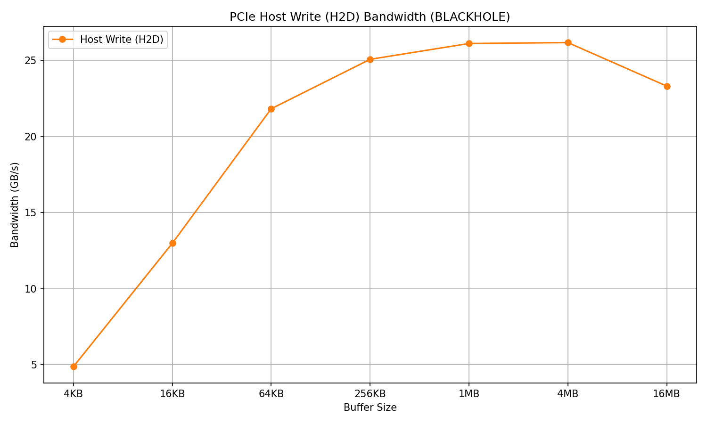
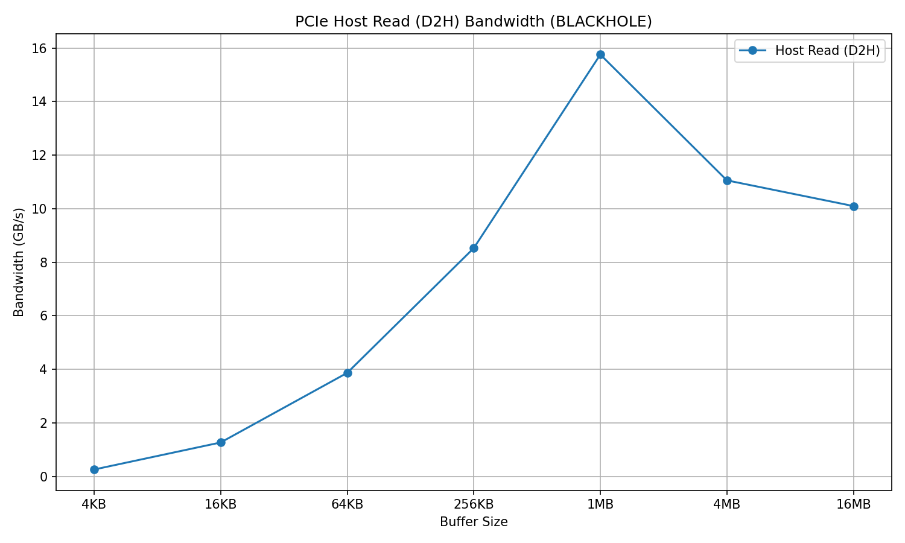

# PCIe Bandwidth Measurement

PCIe bandwidth tests measuring host-to-device and device-to-host throughput at two levels: the host dispatch API and raw kernel NOC transactions.

## Table of Contents

- [Host-Side Tests (WriteShard / ReadShard)](#host-side-tests-writeshard--readshard)
  - [Host Write (H2D) Results](#host-write-h2d--p150--blackhole)
  - [Host Read (D2H) Results](#host-read-d2h--p150--blackhole)
- [Device-Side Tests (Kernel NOC)](#device-side-tests-kernel-noc)
  - [Test Setup](#test-setup)
  - [Kernel Structure](#kernel-structure)
  - [Sweep Parameters](#sweep-parameters)
  - [Device Read Results](#device-read-bandwidth-sweep)
  - [Device Write Results](#device-write-bandwidth-sweep)
- [Running the Tests](#running-the-tests)
- [Notes](#notes)

---

## Host-Side Tests (WriteShard / ReadShard)

Test IDs 606 (H2D) and 607 (D2H) measure PCIe bandwidth from the host API level using [`distributed::WriteShard`](../../tt_metal/api/tt-metalium/distributed.hpp) and [`distributed::ReadShard`](../../tt_metal/api/tt-metalium/distributed.hpp). These go through the full dispatch path — command queue serialization, DMA engine, etc. No kernels are involved; timing is done with `std::chrono` on the host.

The sweep varies buffer size from 4 KB to 16 MB (powers of 4). Page size is fixed at 4 KB.

**Source:**
- [test_pcie_write_bw.cpp — PCIeHostWriteBandwidthSweep](../../tests/tt_metal/tt_metal/data_movement/pcie_write_bw/test_pcie_write_bw.cpp)
- [test_pcie_read_bw.cpp — PCIeHostReadBandwidthSweep](../../tests/tt_metal/tt_metal/data_movement/pcie_read_bw/test_pcie_read_bw.cpp)

### Host Write (H2D) — p150 / Blackhole



### Host Read (D2H) — p150 / Blackhole



---

## Device-Side Tests (Kernel NOC)

Test IDs 604 (write) and 605 (read) measure raw PCIe bandwidth from a single Tensix core using kernel NOC APIs (`noc_async_read` / `noc_async_write`). These bypass the dispatch path entirely.

**Source:**
- [test_pcie_write_bw.cpp — PCIeWriteBandwidthSweep](../../tests/tt_metal/tt_metal/data_movement/pcie_write_bw/test_pcie_write_bw.cpp)
- [kernels/pcie_write_bw.cpp](../../tests/tt_metal/tt_metal/data_movement/pcie_write_bw/kernels/pcie_write_bw.cpp)
- [test_pcie_read_bw.cpp — PCIeReadBandwidthSweep](../../tests/tt_metal/tt_metal/data_movement/pcie_read_bw/test_pcie_read_bw.cpp)
- [kernels/pcie_read_bw.cpp](../../tests/tt_metal/tt_metal/data_movement/pcie_read_bw/kernels/pcie_read_bw.cpp)

### Test Setup

Both tests run on core {0, 0} using NOC 0 in fast dispatch mode. The host resolves the PCIe core's translated coordinates from the SoC descriptor and targets a 50 MB offset into the PCIe BAR to avoid runtime regions. All parameters are compile-time arguments so the measurement reflects NOC transfer cost, not argument-loading overhead.

### Kernel Structure

The kernels are tight loops issuing `noc_async_read` (read test) or `noc_async_write` (write test), followed by the corresponding barrier:

```cpp
uint64_t noc_addr = NOC_XY_PCIE_ENCODING(pcie_x_coord, pcie_y_coord) | pcie_l1_local_addr;

for (uint32_t i = 0; i < num_of_transactions; i++) {
    noc_async_read(noc_addr, l1_local_addr, bytes_per_transaction);  // or noc_async_write
}
noc_async_read_barrier();
```

The loop is wrapped in a `DeviceZoneScopedN("RISCV0")` profiler zone. The profiler captures the duration in cycles, and the Python stats collector computes bandwidth as `(num_transactions * transaction_size) / duration_cycles`.

The host test queries the real clock frequency from the device via `device->get_clock_rate_mhz()` and passes it to the kernel as a compile-time argument. The kernel logs it as `DeviceTimestampedData("Clock frequency MHz", ...)`. The stats collector uses this to convert bytes/cycle to GB/s with the actual device frequency. The `bandwidth_unit` field in [`test_information.yaml`](../../tests/tt_metal/tt_metal/data_movement/python/test_mappings/test_information.yaml) controls whether plots and CSV reports show GB/s or bytes/cycle for a given test.

### Sweep Parameters

Both sweeps vary the transaction size by powers of 2:

| Architecture | Flit size | Max transaction size | Sweep points |
|---|---|---|---|
| Wormhole | 32 B | 8 KB | 32, 64, 128, 256, 512, 1K, 2K, 4K, 8K |
| Blackhole | 64 B | 16 KB | 64, 128, 256, 512, 1K, 2K, 4K, 8K, 16K |

### Device Read Bandwidth Sweep


### Device Write Bandwidth Sweep


---

## Running the Tests

```bash
# All PCIe tests
./build/test/tt_metal/unit_tests_data_movement --gtest_filter="*PCIe*"

# Host-side only
./build/test/tt_metal/unit_tests_data_movement --gtest_filter="*PCIeHost*"

# Device-side only
./build/test/tt_metal/unit_tests_data_movement --gtest_filter="*PCIeBandwidthSweep*"

# Device-side with profiler plots
dmtest --gtest-filter="*PCIeBandwidthSweep*" --verbose-log --plot
```

## Notes

**Host-side tests (606/607):** These include dispatch overhead on top of the raw PCIe transfer, so bandwidth is generally lower than the kernel-side measurements. Bandwidth scales with buffer size up to a point, then may plateau or regress for very large buffers due to memory allocation and DMA chunking behavior in the dispatch path.

**Device-side tests (604/605):** Small transaction sizes show lower bandwidth due to per-transaction overhead. Bandwidth increases with transaction size and should approach the PCIe link's sustained rate at the larger sizes. Read and write may differ — PCIe reads require a round-trip (request + response), while writes can be posted.
