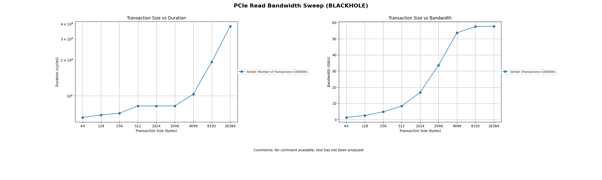
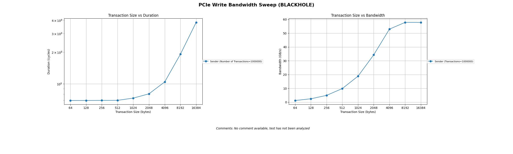

# PCIe Bandwidth Measurement

PCIe read (test ID 605) and write (test ID 604) bandwidth sweep tests. These measure the throughput a single Tensix core achieves when transferring data between L1 and host memory over the PCIe link.

## Test Setup

Both tests run on core {0, 0} using NOC 0 in fast dispatch mode. The host resolves the PCIe core's translated coordinates from the SoC descriptor and targets a 50 MB offset into the PCIe BAR to avoid runtime regions. All parameters are compile-time arguments so the measurement reflects NOC transfer cost, not argument-loading overhead.

## Kernel Structure

The kernels are tight loops issuing `noc_async_read` (read test) or `noc_async_write` (write test), followed by the corresponding barrier:

```cpp
uint64_t noc_addr = NOC_XY_PCIE_ENCODING(pcie_x_coord, pcie_y_coord) | pcie_l1_local_addr;

for (uint32_t i = 0; i < num_of_transactions; i++) {
    noc_async_read(noc_addr, l1_local_addr, bytes_per_transaction);  // or noc_async_write
}
noc_async_read_barrier();
```

The loop is wrapped in a `DeviceZoneScopedN("RISCV0")` profiler zone. The profiler captures the duration in cycles, and the Python stats collector computes bandwidth as `(num_transactions * transaction_size) / duration_cycles`.

The host test queries the real clock frequency from the device via `device->get_clock_rate_mhz()` and passes it to the kernel as a compile-time argument. The kernel logs it as `DeviceTimestampedData("Clock frequency MHz", ...)`. The stats collector uses this to convert bytes/cycle to GB/s with the actual device frequency. The `bandwidth_unit` field in `test_information.yaml` controls whether plots and CSV reports show GB/s or bytes/cycle for a given test.

## Sweep Parameters

Both sweeps fix the transaction count at 1,000,000 and vary the transaction size by powers of 2:

| Architecture | Flit size | Max transaction size | Sweep points |
|---|---|---|---|
| Wormhole | 32 B | 8 KB | 32, 64, 128, 256, 512, 1K, 2K, 4K, 8K |
| Blackhole | 64 B | 16 KB | 64, 128, 256, 512, 1K, 2K, 4K, 8K, 16K |

## Running the Tests

```bash
./build/test/tt_metal/unit_tests_data_movement --gtest_filter="*PCIeBandwidthSweep*"
```

To generate performance plots:

```bash
dmtest --gtest-filter="*PCIeBandwidthSweep*" --verbose-log --plot
```

## Results (p150 / Blackhole)

### PCIe Read Bandwidth Sweep



### PCIe Write Bandwidth Sweep



## Notes

Small transaction sizes show lower bandwidth due to per-transaction overhead. Bandwidth increases with transaction size and should approach the PCIe link's sustained rate at the larger sizes. Read and write may differ -- PCIe reads require a round-trip (request + response), while writes can be posted.
