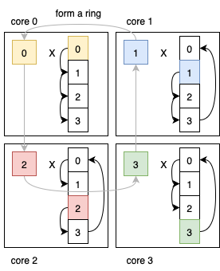
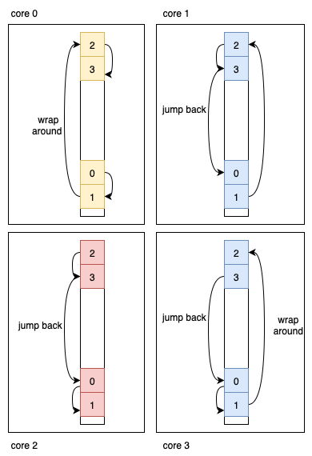

# Prefetcher Technical Report

## Table of Contents
- [Problem with Reading from DRAM](#problem-with-reading-from-dram)
- [Idea of the Prefetcher](#idea-of-the-prefetcher)
- [Sub-Devices: Concept and Usage](#sub-devices-concept-and-usage)
- [Prefetcher Architecture](#prefetcher-architecture)
- [Matmul 1D Ring Integration](#matmul-1d-ring-integration)
- [Future Works](#future-works)

## Problem with Reading from DRAM

TODO: Add content describing the challenges and limitations of traditional DRAM reading approaches.

## Idea of the Prefetcher

TODO: Add high-level overview of the prefetcher concept and solution approach.

## Sub-Devices: Concept and Usage

Sub-devices enable partitioning the chip by grouping cores into isolated execution units with independent memory allocators and program execution tracking. This allows the prefetcher to run on dedicated cores while compute kernels execute independently on separate sub-devices, enabling true asynchronous data streaming without blocking the main computation pipeline.

For detailed information about sub-devices, their implementation, and APIs, see [SubDevices.md](../SubDevices/SubDevices.md).

## Prefetcher Architecture

The prefetcher implements a datamovement op that efficiently fetches data from DRAM banks to receiver cores through global circular buffers. The current usage is using prefetcher to prefetch weight tensors for Matmul operations only, it in theory should support prefetch for other ops and prefetch activations as well. The reason we only use it for Matmul is because it has the largest weight tensors and prefetch them gives the most benifit.

### API Overview and Setup Requirements

The prefetcher exposes an api to the users at the TTNN level: `ttnn.dram_prefetcher(...)`

**API Interface:**


```python
# tt_tensors contains:
# - weight tensors for one layer (e.g., [ff1_weights, ff2_weights, ff3_weights, qkv_weights, ...])
# - address tensor containing DRAM addresses for all layers (last element in list)
tt_tensors = [weight_tensor_1, weight_tensor_2, ..., weight_tensor_n, address_tensor]

ttnn.dram_prefetcher(
    tt_tensors,                           # Weight tensors (1 layer) + address tensor (all layers)
    num_layers,                           # Number of decoder layers to prefetch through
    global_cb=global_circular_buffer,     # Global CB for prefetcher→matmul communication
    enable_performance_mode=True          # Skip NoC pointer updates for better performance (legacy flag for debugging purpose)
)
```

**Input Data Organization:**
The op expects two types of input data:

1. **Weight Tensors for One Decoder Layer**: In LLMs there are several decoder layers and within each decoder layer there are several Matmul operations that needs to be prefetched, and between different layers the Matmul tensor shapes are the same, we utilize this feature and only pass in the tensors for the first layer to reduce the number of runtime args needed to be passed in to the kernel. These tensors must be width-sharded across DRAM banks and stored in DRAM with tile layout. The prefetcher supports multiple data types (bfloat4_b, bfloat8_b, bfloat16) with different tile sizes.

2. **Address/Configuration Tensor**: A config tensor containing the DRAM buffer addresses for ALL weight tensors across ALL layers. This tensor tells the prefetcher where to find each tensor for every layer, enabling it to fetch data for layers beyond the initial pattern. The tensor is height-sharded across prefetcher cores and stored in L1 for fast access, with each prefetcher core getting the complete address map. Note: even though prefetcher is designed based on the fact each LLM has repeated decoder layers, it doesn't forbid the support of non-repeated decoder layers, or other types of layers. User just need to set num_layers=1 and then pass in all the tensors needed to prefetch.

**Global Circular Buffer Configuration:**
The global circular buffer serves as the communication bridge between prefetcher and consumer kernels. It requires a sender-receiver core mapping that defines which prefetcher cores send data to which consumer cores. The global cb buffer size ideally should buffer at least two tensors to avoid any stall on the consumer side (double buffering), although due to the fact that not all tensors are of the same size, in practice need to buffer more tensors to avoid any stall.

```python
# Map each prefetcher sender core to its corresponding receiver cores
sender_receiver_mapping = list(zip(prefetcher_sender_cores, matmul_receiver_cores))

# Create the global circular buffer
global_circular_buffer = ttnn.create_global_circular_buffer(
    device,
    sender_receiver_mapping,
    global_cb_size
)
```

**Sub-Device Setup:**
The op uses separate sub-devices for prefetcher and compute operations, enabling true asynchronous execution. The prefetcher sub-device contains the sender cores running DRAM reader (issues NoC read to DRAM banks) and L1 writer (issues NoC writes to consumer cores) kernels, while the worker sub-device contains consumer cores running matmul and other operations.

```python
# Create sub-devices for independent execution
prefetcher_sub_device = ttnn.SubDevice([prefetcher_sender_core_range_set])
worker_sub_device = ttnn.SubDevice([matmul_worker_core_range_set])

# Create sub-device manager
sub_device_manager = device.create_sub_device_manager(
    [prefetcher_sub_device, worker_sub_device]
)

# Load the sub-device configuration onto the device
device.load_sub_device_manager(sub_device_manager)

# Set stall group to only wait on worker sub-device for synchronization
device.set_sub_device_stall_group([worker_sub_device_id])
```

This API design abstracts the complex multi-core coordination while providing users control over memory layouts and core allocation parameters.

### Physical Chip Layout and Core Allocation

The prefetcher leverages the spatial distribution of cores across the Tenstorrent chip to enable efficient data streaming:


**Core Allocation Strategy:**
- **Prefetcher Cores (Red W)**: Dedicated worker cores spatially distributed across the chip run the prefetcher kernels. These cores are placed near the DRAM banks to minimize NoC traffic congestion.

- **Matmul Cores (Purple W)**: Regular worker cores for matmul operations. Each prefetcher core issues NoC writes to the two Matmul cores on the right, placing them on the same row to reduce interference with other prefetch cores. For other device architectures we can have one prefetch serving more or less Matmul cores, to maxmize the overall compute utilization.

- **Data Flow Path**: Data flows from DRAM banks → Prefetcher cores → Global Circular Buffers → Compute cores, with each stage operating on different physical regions of the chip.

### Kernel Overview

The prefetcher acts as a **sender** in the global circular buffer setup, utilizing a reader-writer kernel architecture.

1. **DRAM Reader Kernel** (`reader_dram.cpp`)
   - Fetches data from DRAM banks into local triple-buffered circular buffer
   - Each prefetcher core reads tensors from it's assigned DRAM bank, each tensor is read in block by block (the size of a block and number of blocks is based on the Matmul side specification)
   - **Transaction ID Management**: Uses NoC transaction IDs to coordinate DRAM reads with the triple-buffered circular buffer. The kernel maintains `curr_block_trid` to track which transaction ID to use for each block, rotating through IDs 1→2→3→1→... to map reads to different blocks.

   For detailed implementation of DRAM reading optimizations and transaction ID management, see [Saturating_DRAM_bandwidth.md](../Saturating_DRAM_bandwidth/Saturating_DRAM_bandwidth.md).


2. **L1 Writer Kernel** (`writer_l1.cpp`)
   - Transfers data from local CB to global CB (remote consumers)
   - Distributes each tensor block across multiple receiver cores, currently only supports slice the tensor block on width, for one prefetcher core that serves multiple receiver cores, each receiver core gets a slice of the block.

   **Key Operations and Their Purpose:**

   **1. Dynamic CB Reconfiguration (`resize_remote_sender_cb_interface`)**
   ```cpp
   experimental::resize_remote_sender_cb_interface<true>(remote_cb_id, curr_block_size_per_receiver, noc);
   ```
   - This API is called each time before we switch to the next tensor. Since different tensors have different shapes and tile sizes and data formats, this caused each tensor having different block size. The global CB page size needs to be reconfigured for each tensor to match the block size that will be sent to each receiver core.
   - For the detailed implementation, it updates the CB interface page size, adjusts read/write pointers to proper alignment, and if necessary, signals receivers over NoC about the configuration change.

   **2. Flow Control (`remote_cb_reserve_back`)**
   ```cpp
   experimental::remote_cb_reserve_back(remote_cb_id, num_blocks);
   ```
   - Before sending data, the sender must ensure all receiver cores have available space in their portion of the global CB. This prevents overwriting data that receivers have not processed yet.
   - Checks the credit counters (pages_sent vs pages_acked) for each receiver core. Blocks until all receivers have enough free space for the incoming data block. This implements backpressure flow control.

   **3. Data Transfer and Signaling (`remote_cb_push_back_and_write_pages`)**
   ```cpp
   experimental::remote_cb_push_back_and_write_pages<skip_ptr_update>(
       remote_cb_id,
       local_cb_addr,
       num_blocks,
       block_height_in_pages,
       coalesced_num_pages_per_row,
       coalesced_page_size,
       noc);
   ```
   - This is the core data movement operation that actually transfers the tensor block from the prefetcher's local CB to each receiver core's portion of the global CB.
   - `block_height_in_pages` means the number of pages on the height dim of each tensor block. `coalesced_page_size` here is the pages that grouped together that can form one NoC writes. `coalesced_num_pages_per_row` means the number of NoC writes need to be performed for each row of the block.
   - functionality:
     - Performs coalesced NoC writes to distribute block slices to each receiver core
     - Each receiver gets a slice of the tensor block
     - Updates the sent page counters to signal receivers that new data is available
     - Handles wraparound in the circular buffer automatically


```cpp
// Core prefetcher flow in writer_l1.cpp
for (uint32_t layer = 0; layer < num_layers; layer++) {
    for (uint32_t t = 0; t < num_tensors; t++) {
        // Resize remote CB interface for current tensor
        experimental::resize_remote_sender_cb_interface<true>(
            remote_cb_id, curr_block_size_per_receiver, noc);

        for (uint32_t block = 0; block < num_blocks; ++block) {
            // Wait for local data from DRAM reader
            cb_wait_front(local_cb_id, max_block_num_tiles);

            // Reserve space on all receiver cores
            experimental::remote_cb_reserve_back(remote_cb_id, 1);

            // Push data to receivers with coalesced writes
            experimental::remote_cb_push_back_and_write_pages<skip_ptr_update>(
                remote_cb_id, local_cb_addr, 1,
                curr_block_height_in_tiles, curr_coalesced_num_pages,
                curr_coalesced_page_size, noc);

            // pop out local CB, signal reader core buffer is empty
            cb_pop_front(local_cb_id, max_block_num_tiles);
        }
    }
}
```

### Inside of Global CB
This section describes the kernel side implementation of global CB, config structures, data transfer, synchronization, etc.

#### 1. Global Circular Buffer Initialization

The global circular buffer initialization phase occurs when kernels start up and need to configure their remote CB interfaces. This process reads configuration data from L1 memory and sets up data structures that enable cross-core communication.

**Configuration Data Layout in L1 Memory:**
Each core's global CB configuration is stored in L1 memory as an array of `uint32_t` values accessed by index:
```cpp
// L1 configuration data layout (initialized on device)
volatile tt_l1_ptr uint32_t* l1_remote_cb_config_addr = /* ... */;

// Configuration elements accessed by array index:
const bool is_sender = l1_remote_cb_config_addr[0];              // 0=receiver, 1=sender
uint32_t num_receivers = l1_remote_cb_config_addr[1];            // Number of receiver cores
uint32_t fifo_start_addr = l1_remote_cb_config_addr[2];          // Base address of circular buffer
uint32_t fifo_size = l1_remote_cb_config_addr[3];               // Total size of circular buffer
uint32_t fifo_ptr = l1_remote_cb_config_addr[4];                // Initial read/write pointer
uint32_t remote_noc_xy_addr = l1_remote_cb_config_addr[5];      // Address containing NoC coordinates
uint32_t aligned_pages_sent_addr = l1_remote_cb_config_addr[6]; // Address for page synchronization counters
```

**Initialization Process (`setup_remote_cb_interfaces`):**
During kernel startup, each core reads its configuration from L1 and initializes the appropriate interface structure:

**For Sender Cores (Prefetcher):**
```cpp
RemoteSenderCBInterface& sender_cb_interface = get_remote_sender_cb_interface(cb_id);
sender_cb_interface.config_ptr = config_addr;                    // Pointer to L1 config
sender_cb_interface.fifo_start_addr = fifo_start_addr;          // Buffer start address
sender_cb_interface.fifo_wr_ptr = fifo_ptr;                     // Write pointer
sender_cb_interface.receiver_noc_xy_ptr = remote_noc_xy_addr;   // Receiver NoC coordinates
sender_cb_interface.aligned_pages_sent_ptr = aligned_pages_sent_addr; // Sent page counters
sender_cb_interface.num_receivers = num_receivers;             // Number of receivers
```

**For Receiver Cores (Matmul):**
```cpp
RemoteReceiverCBInterface& receiver_cb_interface = get_remote_receiver_cb_interface(cb_id);
receiver_cb_interface.config_ptr = config_addr;                 // Pointer to L1 config
receiver_cb_interface.fifo_start_addr = fifo_start_addr;       // Buffer start address
receiver_cb_interface.fifo_rd_ptr = fifo_ptr;                  // Read pointer
receiver_cb_interface.sender_noc_x = sender_noc_x;             // Sender NoC coordinates
receiver_cb_interface.sender_noc_y = sender_noc_y;
receiver_cb_interface.aligned_pages_acked_ptr = aligned_pages_acked_addr; // Acked page counters
```

**Key Initialization Steps:**
1. **Configuration Reading**: Each core reads its role (sender/receiver) and parameters from L1
2. **Interface Setup**: Appropriate CB interface structure is populated based on core role
3. **NoC Coordinate Mapping**: NoC coordinates are extracted for remote communication
4. **Synchronization Setup**: Page counter addresses are configured for flow control
5. **Initial Sizing**: The CB interface is sized with initial page size via `resize_remote_*_cb_interface`

**Config Pointer**
The `config_ptr` stored in both `RemoteSenderCBInterface` and `RemoteReceiverCBInterface` serves a critical runtime purpose: we need to store the latest `fifo_wr_ptr` / `fifo_rd_ptr` value back to L1 memory so that the next op can read it back to initilize the local `RemoteSenderCBInterface` / `RemoteReceiverCBInterface`.


#### 2. Dynamic Page Size Reconfiguration

On the consumer side, ops are required to inplace a local CB on top of the remote CB for local pointer update and consume different part of the tensor. Due to the fact that each CB are required to be page-size aligned, the local CB size will not be the same as global CB, but a size that is aligned to the current page size. Ideally, consumer op will call cb_pop_front to get to the tensor blocks incrementally, and not worrying about manual pointer updates.

When switching between tensors with different shapes or data formats, the global CB page size must be reconfigured to the new tensor block size. This process involves page alignment operations to ensure correct wraparound behavior when consumer performs the local CB pop.


**The Problem Without Alignment:**
If tensors are stored at non-aligned locations in the circular buffer, when the buffer wraps around to the top, a simple `cb_pop_front` operation on the consumer side will not land at the correct tensor boundary. The consumer would read from the middle of a tensor or across tensor boundaries, corrupting the data.

**Alignment:**
1. **Before New Tensor**: The write pointer may be at an arbitrary location after the previous tensor
2. **Alignment Step**: The pointer is advanced to the next page-aligned address that matches the new tensor's page size, ie, (address - global CB start address) is always the multiple of current page size.
3. **Tensor Storage**: The new tensor is stored starting at this aligned location
4. **Wraparound**: When the buffer wraps around, the consumer's `cb_pop_front` operations will correctly land at tensor boundaries

**Consumer Benefit:**
With page alignment, the consumer (matmul core) can perform simple circular buffer operations without worrying about tensor boundaries. Each `cb_pop_front` operation moves exactly one "page" (tensor block), and wraparound automatically lands at the start of the next tensor.

Note: when consumer does not rely on local CB pop, but manually update read pointer then this will not be a problem and we do not need the extra page alignment feature. This is the case for the current Matmul implementation, where the compute kernel manually updates read pointers, so the feature is not required and can be disabled. However, when trying that on the LLama-70b model, the performance regressed by 1-2 token/second, and thus this feature is kept enabled. The potential cause could be without alignement, less synchronization is needed and prefetcher runs faster, however, faster prefetcher can interfere with other ops more and caused the slow down on other ops.


## 1D Ring Matmul Integration

The matmul operation serves as the consumer side of the global circular buffer, implementing a ring-based data processing pattern for efficient multi-core execution. This section will focus on the global CB implementation part and the integration with prefetcher.

### Overview:

Matmul cores act as **receivers** in the global CB system, consuming data streamed by the prefetcher. Here is the diagram of a ring Matmul consisting of 4 cores, each core start at a different ring index. For example, core 0 strat at ring index 0 and iterate over the weight tensor in global CB with an order 0->1->2->3, core 1 strat at ring index 1 and iterate over the weight tensor in global CB with an order 1->2->3->0.




### Mechanism: Advanced Circular Buffer Management

#### 1. Tensor Split Detection and Handling

For tensors that does not wrap around the global CB boundary, each block is allocated continuously for the tensor, and no special management are needed. For tensors that wrap around the global CB boundary, special pointer management are needed to make sure each core indexes into the global CB correclty. The matmul kernel detects and handles this automatically:



**Tensor Split Scenarios:**

The image illustrates two critical scenarios the matmul kernel must handle:

1. **Tensor Split Detected**: When the current read pointer position plus the tensor size exceeds the circular buffer boundary, a split is detected. This triggers wraparound logic to ensure correct block access.

2. **Ring Index Wraparound**: In a 1D ring topology, each core start at the Nth block, where N is their ring index. When tensor splits occur, the kernel must correctly calculate both the start block index, the next block index and the wrapped read pointer address. For exmple, core 3 in the diagram first start at block 3, the next block will require a jump back to the base tensor address, and after processing block 1, it will require a wrap around handling to the top of the global CB.


#### 2. Synchronization and Flow Control
Since each core starts at a different block index, it is neccessary to let Matmul wait for the entire tensor to arrive in global CB before performing any computations. This is because prefetcher is not aware of the out-of-order accessing of tensor blocks, and the `pages_sent` credit is in-order for each block. Performing any computations before the full tensor arrives might cause the use of garbage data. It is also the same case for Matmul pop out the tensor in global CB only after all the blocks are processed, as `pages_ack` is also in-order for each block, and a premature ack can invalidate the wrong block index and cause block overwritten.
 
### Performance Benefits

The prefetcher + matmul integration provides several key performance advantages:

1. **Weight Prefetching**: DRAM reads ahead of Matmul execution, removing the DRAM bandwidth limitation
2. **High Bandwidth Utilization**: Coalesced NoC writes and use of transaction IDs to maximize memory bandwidth
3. **Minimal Synchronization**: For prefetcher, only sending credit per block, and for Matmul only sending ack per tensor to minimize the synchronization cost. 

This architecture enables efficient processing of large language models where weight tensors must be continuously streamed from DRAM to distributed compute cores with minimal latency and maximum throughput.

## Future Works

There are several optimizations can be adopted by prefetcher:

1. **Skip NoC Counter Update**: Currently we rely on updating `posted` / `non-posted` NoC counters after issuing a NoC write, and flush on the NoC transaction to make sure the current packet left L1, this can cause dozens of cycles stalling, and updating the NoC counters also cost a few cycles. One other way to workaround this issue is to use transaction IDs for the NoC writes, similar to how it is done for DRAM reads. Instead of flushing the current block, we can flush on the transaction ID for the previous block.

1. **Use Stream Registers**: Currently we use L1 for `pages_sent` and `pages_ack`, and accessing L1 has worse latency compared to accessing stream registers. We should be able to switch to stream registers for the send/receive credits.

2. **Pause Prefetching**: Currently prefetcher will send data whenever there is space available in global CB, and this can cause NoC congestion if there are other ops using the same NoC and cause slow down. It would be benificial for some cases to pause the prefetcher from consuming the NoC bandwidth and let the other ops run faster. A scratch location in L1 or a stream register can be used for sending this signal to prefetcher from other ops, and prefetcher will enter a while loop until that signal is cleared.

3. **Switch Allocation Strategy**: Currently we only use the aligned allocation strategy, which introduced gaps in-between the tensors, we should allow the switch between compacted allocation and aligned allocation, as in some cases users might want to remove the gaps and handle pointer update manually.


