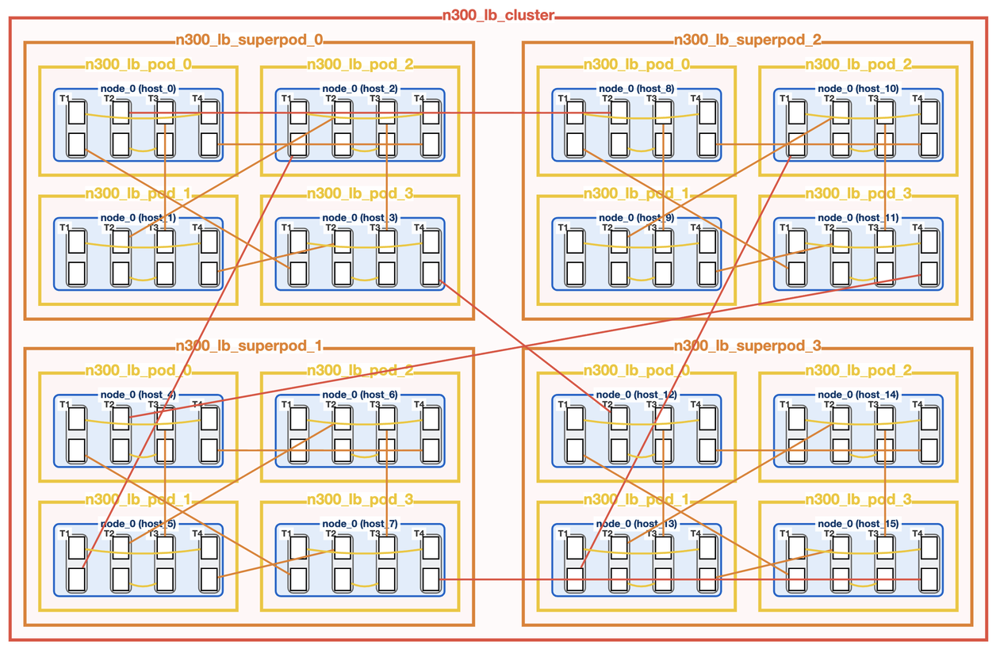
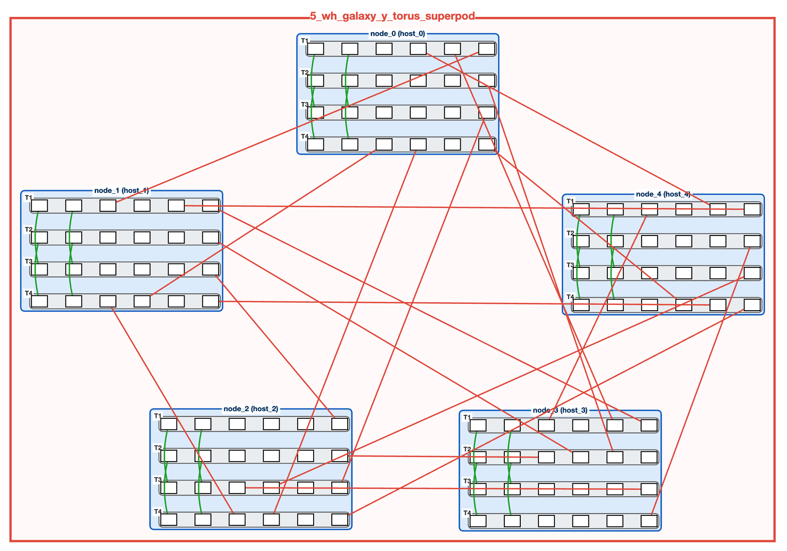
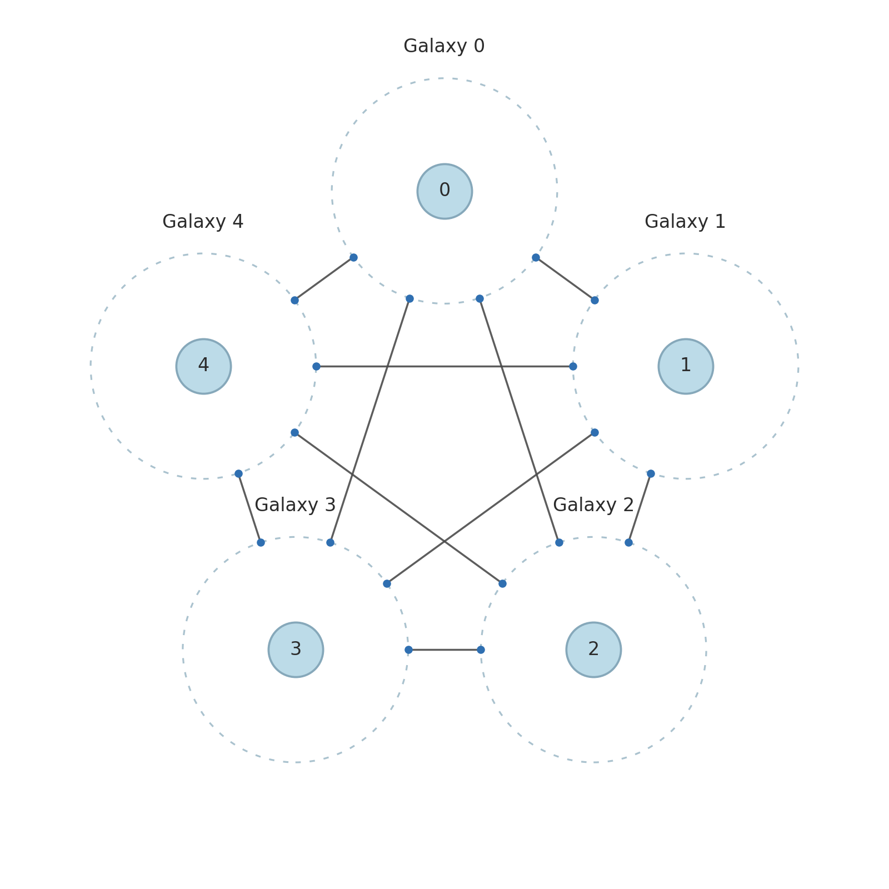

# Programming Multiple Meshes

## Contents

- [1. Overview](#1-overview)
  - [1.1 When to Use Multi-Mesh](#11-when-to-use-multi-mesh)
  - [1.2 Multi-Mesh vs Big-Mesh](#12-multi-mesh-vs-big-mesh)
- [2. Physical Topologies](#2-physical-topologies)
  - [2.1 Closetbox (16 Loudbox)](#21-closetbox-16-loudbox)
  - [2.2 WH Galaxy All-to-All System (5 Galaxies)](#22-wh-galaxy-all-to-all-system-5-galaxies)
- [3. Mesh Graph Descriptors](#3-mesh-graph-descriptors)
  - [3.1 The Purpose of MGDs](#31-the-purpose-of-mgds)
  - [3.2 MGD Format Reference](#32-mgd-format-reference)
  - [3.3 Example: Closetbox MGD](#33-example-closetbox-mgd)
  - [3.4 Example: Exabox MGD](#34-example-exabox-mgd)
- [4. Rank Bindings and tt-run](#4-rank-bindings-and-tt-run)
  - [4.1 The Role of Rank Bindings](#41-the-role-of-rank-bindings)
  - [4.2 Rank Binding Format](#42-rank-binding-format)
  - [4.3 Running with tt-run](#43-running-with-tt-run)
- [5. Multi-Processing Support](#5-multi-processing-support)
  - [5.1 Virtualizing a Galaxy as Multiple Meshes](#51-virtualizing-a-galaxy-as-multiple-meshes)
  - [5.2 TT_VISIBLE_DEVICES](#52-tt_visible_devices)
  - [5.3 Generating Rank Bindings for Galaxy Systems](#53-generating-rank-bindings-for-galaxy-systems)
- [6. Fabric Configuration](#6-fabric-configuration)
  - [6.1 What is TT-Fabric?](#61-what-is-tt-fabric)
  - [6.2 FabricConfig Options](#62-fabricconfig-options)
  - [6.3 Setting Fabric Configuration](#63-setting-fabric-configuration)
- [7. Sockets and Send/Recv Operations](#7-sockets-and-sendrecv-operations)
  - [7.1 Understanding Sockets](#71-understanding-sockets)
  - [7.2 Socket Configuration](#72-socket-configuration)
  - [7.3 Send and Recv Operations](#73-send-and-recv-operations)
  - [7.4 Intra-Process Sockets](#74-intra-process-sockets)
- [8. Programming Example](#8-programming-example)
- [9. Troubleshooting](#9-troubleshooting)
  - [Common Issues](#common-issues)
  - [Debugging Tips](#debugging-tips)

## 1. Overview

Programming multiple meshes enables splitting a Tenstorrent system into multiple independent logical meshes. Each mesh is managed by a separate process, potentially running on a different host. This works well for workloads that partition computation across distinct stages or models.

A mesh is a uniformly connected grid of Tenstorrent devices that work together on computations. Each device on the same mesh has identical memory and runtime state, which allows you to virtualize an arbitrarily sized mesh as a single device. For details on single-mesh programming, tensor distribution, and collective operations (CCL), see [Programming Mesh of Devices with TT-NN](../Programming_Mesh_of_Devices/Programming_Mesh_of_Devices_with_TT-NN.md).

Conversely, programming multiple meshes allows each mesh to operate independently. Meshes can have non-uniform runtime state and are managed by independent processes. Meshes communicate through sockets. There's no implicit data sharing. Each process is completely isolated with its own memory space, compiled kernels, and execution state.

### 1.1 When to Use Multi-Mesh

Multi-Mesh works well for:

- **Pipeline Parallelism**: Different model layers run on different meshes, with data flowing between them via sockets. This reduces memory pressure per mesh and lets you run models too large for a single mesh. You can optimize each stage independently. Pipeline parallelism is ideal for low-latency workloads where stages can overlap execution. For example, the first 40 transformer layers on mesh 0, the next 40 on mesh 1.

- **Multi-Model Inference**: Run independent models (like encoder and decoder) on separate meshes at the same time. Each gets its own resources. If one model crashes, the others keep running.

- **Heterogeneous Workloads**: Different stages might need different mesh sizes. A small preprocessing mesh can feed a large compute mesh. Match your hardware to what each stage actually needs.

### 1.2 Multi-Mesh vs Big-Mesh

TT-Metal supports two independent distributed execution patterns:

- **Big-Mesh (scale-up)**: All processes share one mesh and run identical code in lockstep (SPMD). Use this for tensor/data parallelism where you need a unified view of all devices, like large matrix multiplications split across the mesh. Big-Mesh requires tight synchronization and deterministic execution across all ranks. Every process must execute the same sequence of operations on its local sub-mesh. This lockstep model enables efficient data parallelism (DP) and tensor parallelism (TP) for scaling models like Llama from 70B to 2T+ parameters. For detailed multi-host SPMD architecture (managing a single uniform logical mesh across multiple hosts), see [TT-Distributed: Multi-Host Runtime](../TT-Distributed/MultiHostMeshRuntime.md).

- **Multi-Mesh (scale-out)**: Each process owns a separate mesh and communicates via sockets. Use this for pipeline parallelism or multi-model inference where stages run asynchronously. Unlike Big-Mesh, processes don't need to stay in lockstep. One mesh can be computing while another is idle or running completely different code. This decoupling makes Multi-Mesh ideal for pipeline parallelism where different transformer layers run on different meshes with data flowing through sockets.

In the Big-Mesh case, all devices are managed in lockstep. In the Multi-Mesh case, devices across meshes can have independent state. These patterns can be combined: you can build Multi Big-Meshes where each mesh uses scale-up internally while multiple meshes communicate via scale-out. For example, a 4-mesh pipeline where each mesh is internally a Big-Mesh using TP/DP.

This document focuses on the **Multi-Mesh** pattern.

## 2. Physical Topologies

This section describes example physical topologies used for Multi-Mesh software development and testing. For background on Tenstorrent hardware (Wormhole chips, N300 cards, Galaxy systems), see the [Ethernet Multichip Guide](../EthernetMultichip/BasicEthernetGuide.md).

>[!NOTE]
>The Closetbox and WH Galaxy All-to-All system are **experimental systems** for software bringup and testing, not production deployments. They demonstrate how to virtualize multi-host systems using the software.

### 2.1 Closetbox (16 Loudbox)

The Closetbox consists of 16 Loudbox units organized hierarchically into Super-Pods (groups of 4 Loudboxes that share high-bandwidth interconnects). As shown in Figure 1:

- **4 Super-Pods** connected in all-to-all topology
- Each Super-Pod: **4 Loudbox units** in all-to-all connectivity
- Each Loudbox: **8 Wormhole B0 devices** (2×4 mesh, built from 4× N300 cards). An N300 card contains 2 Wormhole chips connected over ethernet.
- **Total: 128 devices** across 16 meshes. Each mesh can run independent workloads.



*Figure 1: Closetbox Cabling Topology. Shows the physical connections between Super-Pods and Loudbox units.*


*Figure 2: Closetbox Logical Topology. Shows the MGD hierarchy: 16 meshes (M0) grouped into 4 PODs (G0), composed into 1 Cluster (G1).*

### 2.2 WH Galaxy All-to-All System (5 Galaxies)

The WH Galaxy All-to-All system consists of 5 Galaxy systems in an all-to-all topology. As shown in Figures 3 and 4:

- **5 Galaxy units**, each an 8×4 mesh (32 Wormhole B0 devices). A Galaxy is Tenstorrent's standard system.
- **Total: 160 devices** across 5 meshes. Massive compute capacity for large models.
- **Inter-Galaxy connectivity**: All-to-all with 4 ethernet channels per connection. Any Galaxy can send directly to any other Galaxy without routing through intermediaries.



*Figure 3: WH Galaxy All-to-All System Cabling Topology. Shows the physical connections between Galaxy units.*



*Figure 4: WH Galaxy All-to-All System Logical Topology. 5 Galaxy meshes in a single FABRIC graph with all-to-all connectivity.*

## 3. Mesh Graph Descriptors

Now that we've seen the physical hardware, let's virtualize these topologies through software. A Mesh Graph Descriptor (MGD) defines the logical topology required by a workload. It's the blueprint for your distributed workload.

MGDs are **validated at initialization time** before any device opens. Validation checks include topology consistency (mesh dimensions, host topology), connection feasibility (channel counts match physical links), and architecture compatibility (all meshes in a graph must use the same chip architecture). If validation fails, you get a detailed error report pointing to the specific problem. This early validation catches configuration errors before expensive resource allocation.

### 3.1 The Purpose of MGDs

The physical hardware topology (which devices are connected by ethernet) is fixed. But how you partition and use those devices is up to you. An MGD lets you:

- **Define mesh boundaries**: How many devices are assigned to each logical mesh.
- **Set up connectivity**: Which meshes can talk to each other and through how many channels. More channels means more bandwidth.
- **Create hierarchy**: Group meshes into pods, clusters, or custom topologies. This mirrors physical cable organization.

Without an MGD, the runtime doesn't know how to partition the system or route traffic between meshes.

The MGD is validated at startup. If the physical hardware can't accommodate the MGD, initialization will fail.

### 3.2 MGD Format Reference

MGDs use Protobuf text format (`.textproto` files). An MGD defines mesh templates, connectivity between meshes, and hierarchical groupings (PODs, clusters). This allows you to instantiate different logical topologies on the same physical hardware.

**For complete MGD schema documentation, syntax reference, and additional examples, see the comprehensive guide:**
[`tt_metal/fabric/MGD_README.md`](../../tt_metal/fabric/MGD_README.md)

The following sections show Multi-Mesh-specific MGD examples for the topologies described in Section 2.

### 3.3 Example: Closetbox MGD

```proto
# From: tests/tt_metal/tt_fabric/custom_mesh_descriptors/wh_closetbox_mgd.textproto

mesh_descriptors {
  name: "M0"
  arch: WORMHOLE_B0
  device_topology { dims: [ 2, 4 ] }
  host_topology   { dims: [ 1, 1 ] }
  channels { count: 2 policy: STRICT }
}

# POD: 4 meshes with ALL_TO_ALL (every mesh connects to every other mesh)
graph_descriptors {
  name: "G0"
  type: "POD"
  instances { mesh { mesh_descriptor: "M0" mesh_id: 0 } }
  instances { mesh { mesh_descriptor: "M0" mesh_id: 1 } }
  instances { mesh { mesh_descriptor: "M0" mesh_id: 2 } }
  instances { mesh { mesh_descriptor: "M0" mesh_id: 3 } }
  graph_topology: { layout_type: ALL_TO_ALL channels { count: 2 } }
}

# CLUSTER: 4 PODs with ALL_TO_ALL
graph_descriptors {
  name: "G1"
  type: "CLUSTER"
  instances { graph { graph_descriptor: "G0" graph_id: 0 } }
  instances { graph { graph_descriptor: "G0" graph_id: 1 } }
  instances { graph { graph_descriptor: "G0" graph_id: 2 } }
  instances { graph { graph_descriptor: "G0" graph_id: 3 } }
  graph_topology: { layout_type: ALL_TO_ALL channels { count: 2 } }
}

top_level_instance { graph { graph_descriptor: "G1" graph_id: 0 } }
```

### 3.4 Example: Exabox MGD

```proto
# From: tests/tt_metal/tt_fabric/custom_mesh_descriptors/5_galaxy_wh_exabox_mgd.textproto

mesh_descriptors {
  name: "Galaxy_8x4"
  arch: WORMHOLE_B0
  device_topology { dims: [ 8, 4 ] }
  host_topology   { dims: [ 1, 1 ] }
  channels { count: 4 policy: STRICT }
}

graph_descriptors {
  name: "G0"
  type: "FABRIC"
  instances { mesh { mesh_descriptor: "Galaxy_8x4" mesh_id: 0 } }
  instances { mesh { mesh_descriptor: "Galaxy_8x4" mesh_id: 1 } }
  instances { mesh { mesh_descriptor: "Galaxy_8x4" mesh_id: 2 } }
  instances { mesh { mesh_descriptor: "Galaxy_8x4" mesh_id: 3 } }
  instances { mesh { mesh_descriptor: "Galaxy_8x4" mesh_id: 4 } }

  # All-to-all connections between 5 Galaxies
  connections {
    nodes { mesh { mesh_descriptor: "Galaxy_8x4" mesh_id: 0 } }
    nodes { mesh { mesh_descriptor: "Galaxy_8x4" mesh_id: 1 } }
    channels { count: 4 }
  }
  # ... additional connections for full all-to-all ...
}

top_level_instance { graph { graph_descriptor: "G0" graph_id: 0 } }
```

## 4. Rank Bindings and tt-run

The MGD describes your hardware topology. But to actually run a workload, you need to tell each process/host which mesh it owns. This is where rank bindings come in.

### 4.1 The Role of Rank Bindings

When launching a Multi-Mesh workload, multiple processes need to coordinate ownership. The `tt-run` launcher uses MPI (Message Passing Interface) to spawn these processes. MPI is a standard protocol for distributed computing. Each process gets a rank number starting from 0. Rank bindings map these ranks to your hardware, telling each process:

- **Which mesh to use**: The `mesh_id` assigns a process to a specific logical mesh defined in the MGD
- **Device visibility**: Which physical PCIe devices this process can access (via `TT_VISIBLE_DEVICES`)
- **Environment configuration**: Any rank-specific environment variables needed for isolation

Without rank bindings, ownership of meshes across processes would be ambiguous. The `tt-run` launcher reads the binding file and sets up the environment for each rank.

Rank bindings decouple your code from hardware. The same Python script runs on a 2-mesh Galaxy or a 16-mesh Closetbox. Only the binding file changes. This is powerful for development: write and debug on a small system, then deploy to production scale without code modifications.

### 4.2 Rank Binding Format

```yaml
# From: tests/tt_metal/distributed/config/5_galaxy_wh_exabox_rank_bindings.yaml

rank_bindings:
  - rank: 0
    mesh_id: 0
    mesh_host_rank: 0  # Always 0 for Multi-Mesh (single host per mesh)
  - rank: 1
    mesh_id: 1
    mesh_host_rank: 0
  # ... ranks 2-4 follow same pattern ...

mesh_graph_desc_path: "tests/tt_metal/tt_fabric/custom_mesh_descriptors/5_galaxy_wh_exabox_mgd.textproto"
```

For Multi-Mesh workloads, each rank has a unique `mesh_id` and `mesh_host_rank` is always 0. This is the key difference from Big-Mesh: each process owns a different mesh. (For Big-Mesh patterns where multiple hosts share one mesh, `mesh_host_rank` would be 0, 1, 2... to distinguish hosts within the same mesh.)

The `mesh_graph_desc_path` at the bottom points to your MGD file. Every rank binding file needs this path. It tells the runtime which topology to use.

The `mesh_id` in rank bindings must match a `mesh_id` defined in your MGD. If your MGD defines meshes 0-4, your rank bindings can only reference those IDs. The runtime uses this to look up the mesh shape and connectivity.

### 4.3 Running with tt-run

```bash
tt-run --rank-binding config.yaml [--mpi-args "<mpi_args>"] <program> [args...]
```

Example:

```bash
tt-run --rank-binding tests/tt_metal/distributed/config/wh_closetbox_rank_bindings.yaml \
       --mpi-args "--tag-output" \
       python3 my_multi_mesh_workload.py
```

`tt-run` spawns one process per rank and automatically manages per-rank environments:
- `TT_METAL_CACHE`: Unique cache directory per rank (prevents kernel compilation conflicts when multiple processes compile kernels simultaneously)
- `TT_MESH_ID`: Mesh identifier from rank binding
- `TT_MESH_GRAPH_DESC_PATH`: Path to topology descriptor
- `TT_MESH_HOST_RANK`: Host rank within mesh (if specified)

Each process inherits these environment variables before your script starts. You don't need to parse them. The runtime reads them automatically when you open a device. This automatic environment setup prevents common pitfalls like cache conflicts where multiple processes try to write the same compiled kernel artifacts.

## 5. Multi-Processing Support

The previous sections covered multi-host setups. This section covers running multiple meshes on a *single* host by virtualizing one physical system.

### 5.1 Virtualizing a Galaxy as Multiple Meshes

A Galaxy (32 devices, 8×4) can be split into multiple independent meshes. You control the split through your MGD. The following MGD splits a Galaxy into two 4×4 meshes:

```proto
# From: tests/tt_metal/tt_fabric/custom_mesh_descriptors/wh_galaxy_split_4x4_multi_mesh.textproto

mesh_descriptors {
  name: "M0"
  arch: WORMHOLE_B0
  device_topology { dims: [ 4, 4 ] }
  host_topology   { dims: [ 1, 1 ] }
  channels { count: 4 policy: RELAXED }  # RELAXED: allows fewer links than specified
}

graph_descriptors {
  name: "G0"
  type: "FABRIC"
  instances { mesh { mesh_descriptor: "M0" mesh_id: 0 } }
  instances { mesh { mesh_descriptor: "M0" mesh_id: 1 } }
  connections {
    nodes { mesh { mesh_descriptor: "M0" mesh_id: 0 } }
    nodes { mesh { mesh_descriptor: "M0" mesh_id: 1 } }
    channels { count: 2 }
  }
}

top_level_instance { graph { graph_descriptor: "G0" graph_id: 0 } }
```

This MGD is used by `test_multi_mesh.py` to run a two-process pipeline on a Galaxy. Process 0 gets mesh 0 (16 devices), process 1 gets mesh 1 (16 devices). The `connections` block defines the inter-mesh link that sockets will use. Without this connection, the meshes couldn't communicate.

### 5.2 TT_VISIBLE_DEVICES

When splitting a single host into multiple meshes, each process needs to see only its assigned devices. `TT_VISIBLE_DEVICES` controls which PCIe devices are visible to a process. It's similar to `CUDA_VISIBLE_DEVICES` for NVIDIA GPUs. The device IDs are zero-indexed based on their PCIe enumeration order:

```bash
# Single PCIe device (N300 includes remote ethernet-connected device)
TT_VISIBLE_DEVICES="0" python your_script.py

# Two PCIe devices
TT_VISIBLE_DEVICES="0,1" python your_script.py
```

Running concurrent processes on different devices:

```python
import os
import multiprocessing
import ttnn

def run_on_device(pcie_device_id):
    os.environ["TT_VISIBLE_DEVICES"] = str(pcie_device_id)
    os.environ["TT_METAL_CACHE"] = os.path.expanduser(f"~/.cache/tt_metal_{pcie_device_id}")

    # open_device for single device, use open_mesh_device for multi-device meshes
    device = ttnn.open_device(device_id=0)  # Always 0 from process perspective
    # ... run workload ...
    ttnn.close_device(device)

if __name__ == "__main__":
    p0 = multiprocessing.Process(target=run_on_device, args=("0",))
    p1 = multiprocessing.Process(target=run_on_device, args=("1",))
    p0.start(); p1.start()
    p0.join(); p1.join()
```

### 5.3 Generating Rank Bindings for Galaxy Systems

>[!NOTE]
>This tool is Galaxy-specific and generates preset rank binding configurations for testing Multi-Mesh workloads on a single Galaxy host.

```bash
# Prerequisite: build with tests enabled
./build_metal.sh --build-tests

# Generate rank bindings (run on Galaxy host)
python3 tests/tt_metal/tt_fabric/utils/generate_rank_bindings.py
```

**Generates 4 files:**
- `tray_to_pcie_device_mapping.yaml` - Maps Galaxy trays to PCIe device IDs
- `4x4_multi_mesh_rank_binding.yaml` - 2 meshes (trays 1-2, 3-4)
- `4x2_multi_mesh_rank_binding.yaml` - 4 meshes (one per tray)
- `4x4_multi_big_mesh_rank_binding.yaml` - 2 meshes with 2 ranks each (simulates multi-host)

Use the generated YAML files with `tt-run` to test different partitioning schemes. For other systems (Closetbox, Blackhole), manually create rank binding files following the format shown in Section 5.2.

## 6. Fabric Configuration

At this point you have your MGD defining the topology, rank bindings mapping processes to meshes, and devices assigned via `TT_VISIBLE_DEVICES`. The last piece is initializing the network layer. TT-Fabric handles communication between devices across meshes.

### 6.1 What is TT-Fabric?

TT-Fabric routes data packets across the ethernet links connecting devices. It builds routing tables from your MGD and handles packet routing, deadlock avoidance, and load balancing. Think of it as the network stack for your distributed system.

Every Tenstorrent device (Wormhole, Blackhole) has multiple ethernet ports. TT-Fabric decides which ports to use and handles low-level packet formatting. For internals (virtual channels, routing planes, deadlock avoidance), see the [TT-Fabric Architecture Specification](../TT-Fabric/TT-Fabric-Architecture.md).

The fabric config tells the runtime which routing strategy to use.

### 6.2 FabricConfig Options

| Config | Description |
|--------|-------------|
| `DISABLED` | Fabric disabled |
| `FABRIC_1D` | Linear routing along one axis (no turns between rows/columns) |
| `FABRIC_1D_RING` | Ring routing (1D Torus, endpoints connected) |
| `FABRIC_1D_NEIGHBOR_EXCHANGE` | Direct neighbor-only routing, no forwarding |
| `FABRIC_2D` | Full mesh routing with row/column turns (recommended for generic workloads) |
| `CUSTOM` | Custom configuration |

**Choosing the right config:** Use `FABRIC_2D` for most workloads. It allows routing between any set of chips on a cluster and is the easiest to use. This is also the only config that allows intermesh traffic. Use `FABRIC_1D` variants for high-performance, highly customized workloads that send traffic along a single axis and don't require intermesh communication. `DISABLED` is for single-mesh workloads that don't need fabric at all. If you're unsure, start with `FABRIC_2D`.

### 6.3 Setting Fabric Configuration

```python
import ttnn

# Basic usage - 2D routing for Galaxy systems
ttnn.set_fabric_config(ttnn.FabricConfig.FABRIC_2D)

# With reliability mode (default: STRICT_INIT)
ttnn.set_fabric_config(
    ttnn.FabricConfig.FABRIC_2D,
    reliability_mode=ttnn.FabricReliabilityMode.RELAXED_INIT  # Tolerates downed links
)
```

**Reliability Modes:**
- `STRICT_INIT`: Live links must exactly match MGD (default). Fails fast if hardware doesn't match.
- `RELAXED_INIT`: Tolerates downed links, uses fewer routing planes. Useful for systems with occasional hardware issues.

>[!NOTE]
>Call `set_fabric_config` before `open_mesh_device`.

## 7. Sockets and Send/Recv Operations

With the fabric initialized, your meshes can communicate. Sockets are the primary method of communication in Multi-Mesh workloads. Every tensor that moves between meshes goes through a socket.

### 7.1 Understanding Sockets

Sockets are point-to-point chip-to-chip channels for transferring tensor data between meshes. Unlike collective operations (all-gather, reduce-scatter) that work within a single mesh, sockets connect two separate meshes. One process sends, another receives.

A socket connects specific cores on specific devices across two meshes. When you send a tensor, data flows through TT-Fabric using the ethernet links defined in your MGD. **Sockets are asymmetric**: one end is the sender, the other is the receiver. Both processes must create the socket with matching configurations, but the sender and receiver take different code paths. The socket handles:

- **Flow control**: Prevents the sender from overwriting data on the receiver. The receiver maintains metadata about which data has been consumed, and the sender checks this before transmitting new data.
- **Buffering**: Uses configurable buffers in L1 (fast on-chip SRAM, ~1.5MB per core) or DRAM (larger off-chip memory, ~12GB per device). Buffers are circular: data wraps around when reaching the end, allowing continuous streaming without reallocation.
- **Synchronization**: The receiver knows when data has fully arrived. The sender embeds metadata in the packet stream indicating transfer completion.
- **Cross-host communication**: Sockets abstract away any setup required for meshes across hosts to communicate. TT-Distributed sockets behave similar to TCP sockets or IPC sockets (for multi-process communication). All you have to do is open a sender or receiver connection between any two meshes. The socket infrastructure handles all handshaking required to establish the requested connection, including coordinating with the distributed context to exchange endpoint information.

Both endpoints need matching connection specs. Create a socket once and reuse it for all transfers. Socket creation involves expensive setup (allocating buffers, configuring routing tables), so reuse is critical for performance.

### 7.2 Socket Configuration

Creating a socket requires three components:

1. **SocketConnection** (the connection list): Defines which cores on the sender mesh connect to which cores on the receiver mesh. Each connection is a 1:1 pairing. The easiest way to transfer data from one mesh to another is to open a single socket connection per device. The connection list determines how data is distributed across the receiver mesh. For advanced use cases, you can create multiple connections per device (targeting different cores) to increase parallelism and bandwidth. The runtime validates that no sender or receiver core appears in multiple connections within the same socket.

2. **SocketMemoryConfig**: Where the socket buffers live (L1 or DRAM) and how large they are. L1 gives lower latency but has limited space (~1.5MB per core). DRAM can hold larger buffers but is slower. Buffer size affects throughput: larger buffers reduce overhead for big transfers but consume more memory. The buffer size must be large enough to hold at least one full packet plus metadata overhead.

3. **SocketConfig**: Bundles the connection list and memory config together with the sender and receiver MPI ranks. The ranks tell the runtime which processes are the endpoints. Both processes must create a socket with the same config. The runtime performs validation at socket creation time, checking that both processes have compatible fabric configs and that the connection endpoints exist in their respective meshes.

```python
import ttnn

mesh_shape = ttnn.MeshShape(4, 4)  # 4 rows × 4 cols = 16 devices per mesh

# Create connections: each device in sender mesh connects to corresponding device in receiver mesh
# MeshCoreCoord = (device position in mesh, core position on that device)
# CoreCoord(0, 0) = first available worker core on the device
socket_connections = []
for coord in ttnn.MeshCoordinateRange(mesh_shape):  # Iterates over all 16 device positions
    socket_connections.append(
        ttnn.SocketConnection(
            ttnn.MeshCoreCoord(coord, ttnn.CoreCoord(0, 0)),  # sender: device coord, core (0,0)
            ttnn.MeshCoreCoord(coord, ttnn.CoreCoord(0, 0))   # receiver: same layout
        )
    )

# Configure socket
# SocketMemoryConfig: buffer location can be L1 or DRAM, buffer size in bytes
socket_config = ttnn.SocketConfig(
    socket_connections,
    ttnn.SocketMemoryConfig(ttnn.BufferType.L1, 4096),  # 4KB buffer in L1
    sender_rank=0,   # MPI rank of sending process
    receiver_rank=1  # MPI rank of receiving process
)

# Create socket
socket = ttnn.MeshSocket(device, socket_config)
```

The loop creates 16 connections, one for each device position in the 4×4 mesh. Device (0,0) on the sender connects to device (0,0) on the receiver, and so on. This is the most common pattern: corresponding devices talk to each other. You could also create asymmetric mappings if your workload requires different data distribution.

### 7.3 Send and Recv Operations

`send_async` and `recv_async` are non-blocking operations. They return immediately after enqueuing the transfer. This lets the sender continue with other work while data is in flight. Use barriers or synchronization points if you need to wait for completion. The transfer happens in the background over TT-Fabric.

```python
# Both processes create the same input_tensor (SPMD pattern - same code, same random seed)
torch.manual_seed(0)
input_tensor = ttnn.from_torch(torch.randn(1, 1, 1024, 1024), device=device, layout=ttnn.TILE_LAYOUT)

if rank == 0:  # Sender
    send_socket = ttnn.MeshSocket(device, socket_config)
    ttnn.experimental.send_async(input_tensor, send_socket)
else:  # Receiver
    recv_socket = ttnn.MeshSocket(device, socket_config)
    # .spec contains tensor metadata (shape, dtype, layout) for allocating matching buffer
    output_tensor = ttnn.allocate_tensor_on_device(input_tensor.spec, device)
    ttnn.experimental.recv_async(output_tensor, recv_socket)
```

The receiver must pre-allocate the output tensor before calling `recv_async`. The tensor spec (shape, dtype, layout) must match what the sender is transmitting. This is why both processes create the same tensor with the same random seed. They need matching metadata.

**Socket reuse**: Create the socket once and reuse it for all transfers. Don't create a new socket per tensor. The socket maintains internal state for flow control.

**Completion**: Since operations are async, use `ttnn.synchronize_device(device)` to block until all pending operations (including recv) complete. For process-level sync, use `ttnn.distributed_context_barrier()`. In practice, if you apply an operation to the received tensor, that operation implicitly waits for the data.

### 7.4 Intra-Process Sockets

For sockets between two MeshDevices in the same process (e.g., local pipeline stages), use `create_socket_pair`. This bypasses the distributed context since both endpoints are local. Useful for testing Multi-Mesh logic without launching multiple processes.

```python
# For intra-process, create SocketConfig without sender_rank/receiver_rank
intra_config = ttnn.SocketConfig(socket_connections, socket_mem_config)

sender_socket, receiver_socket = ttnn.create_socket_pair(
    sender_mesh_device,
    receiver_mesh_device,
    intra_config
)
```

Both sockets are returned directly. No need to create them separately. Data flows the same way: `send_async` on sender, `recv_async` on receiver.

## 8. Programming Example

Let's put everything together with a complete working example. This demonstrates a two-stage pipeline: Process 0 applies ReLU and sends to Process 1, which applies Exp and validates. Both processes run the same Python script but take different code paths based on their rank. This is the SPMD (Single Program, Multiple Data) pattern deployed across both meshes.

**Key insight**: In Multi-Mesh SPMD, your code must be **rank-aware**. You use `ttnn.distributed_context_get_rank()` to determine which process you are, then branch accordingly. The sender creates a send socket, the receiver creates a recv socket. Both use the same `SocketConfig`, but internally the runtime configures them differently based on whether the rank matches `sender_rank` or `receiver_rank`.

```bash
# Generate rank binding file (run once)
python3 tests/tt_metal/tt_fabric/utils/generate_rank_bindings.py

# Run with tt-run on a Galaxy system
tt-run --rank-binding 4x4_multi_mesh_rank_binding.yaml \
       --mpi-args "--tag-output" \
       python3 tests/ttnn/distributed/test_multi_mesh.py
```

The code below shows the complete pattern. Study it carefully - this is the template for most Multi-Mesh workloads.

```python
# From: tests/ttnn/distributed/test_multi_mesh.py

import torch
import ttnn

def run_multiprocess_workload():
    # Step 1: Set random seed FIRST - both processes need identical tensors for SPMD
    torch.manual_seed(0)

    # Step 2: Configure fabric BEFORE opening device
    ttnn.set_fabric_config(ttnn.FabricConfig.FABRIC_2D)

    # Step 3: Open mesh device - each process gets its own mesh based on rank binding
    mesh_shape = ttnn.MeshShape(4, 4)
    device = ttnn.open_mesh_device(mesh_shape=mesh_shape)

    # Step 4: Verify distributed context (sanity check)
    if not ttnn.distributed_context_is_initialized():
        raise ValueError("Distributed context not initialized")
    if int(ttnn.distributed_context_get_size()) != 2:
        raise ValueError("This test requires 2 processes")

    # Step 5: Create socket configuration (BOTH processes run this same code)
    sender_logical_coord = ttnn.CoreCoord(0, 0)
    recv_logical_coord = ttnn.CoreCoord(0, 0)
    socket_connections = []
    for coord in ttnn.MeshCoordinateRange(mesh_shape):
        socket_connections.append(
            ttnn.SocketConnection(
                ttnn.MeshCoreCoord(coord, sender_logical_coord),
                ttnn.MeshCoreCoord(coord, recv_logical_coord)
            )
        )
    socket_mem_config = ttnn.SocketMemoryConfig(ttnn.BufferType.L1, 4096)
    socket_config = ttnn.SocketConfig(socket_connections, socket_mem_config, sender_rank=0, receiver_rank=1)

    # Step 6: Create input tensor (BOTH processes create identical tensor due to same seed)
    torch_input = torch.randn(1, 1, 1024, 1024, dtype=torch.float32)
    ttnn_input = ttnn.from_torch(
        torch_input, device=device, layout=ttnn.TILE_LAYOUT,
        mesh_mapper=ttnn.ShardTensor2dMesh(device, dims=(2, 3), mesh_shape=mesh_shape),
    )

    def torch_op_chain(tensor):
        return torch.exp(torch.nn.functional.relu(tensor))

    # Step 7: Branch based on rank - this is where SPMD diverges
    if int(ttnn.distributed_context_get_rank()) == 0:
        # Sender: apply ReLU and forward result to receiver
        send_socket = ttnn.MeshSocket(device, socket_config)
        ttnn.experimental.send_async(ttnn.relu(ttnn_input), send_socket)
    else:
        # Receiver: receive tensor, apply Exp, validate
        recv_socket = ttnn.MeshSocket(device, socket_config)
        upstream_input = ttnn.allocate_tensor_on_device(ttnn_input.spec, device)
        ttnn.experimental.recv_async(upstream_input, recv_socket)

        torch_tensor = ttnn.to_torch(
            ttnn.from_device(ttnn.exp(upstream_input)),
            mesh_composer=ttnn.ConcatMesh2dToTensor(device, mesh_shape=mesh_shape, dims=(2, 3)),
        )
        if torch.allclose(torch_tensor, torch_op_chain(torch_input)):
            print("Test passed: Output tensor matches expected tensor")
        else:
            raise ValueError("Test failed: Output tensor does not match expected tensor")

    # Step 8: Barrier ensures all processes finish before cleanup
    ttnn.distributed_context_barrier()
    ttnn.close_device(device)

if __name__ == "__main__":
    run_multiprocess_workload()
```

**Key takeaways from this example:**
- Both processes run the exact same code (SPMD)
- Socket config is identical on both sides with explicit `sender_rank` and `receiver_rank`
- The sender applies its operation (ReLU) and sends the result
- The receiver pre-allocates a buffer, receives data, then applies its operation (Exp)
- Always barrier before closing to ensure all transfers complete

## 9. Troubleshooting

### Common Issues

| Problem | Cause | Solution |
|---------|-------|----------|
| `RuntimeError: Distributed context not initialized` | Called `get_rank()` or `get_size()` before opening any device | Open a device first, or call `ttnn.init_distributed_context()` manually |
| Processes hang on socket operations | Ranks are incorrectly specified in socket configuration | Ensure `sender_rank` and `receiver_rank` are correct and match the actual process ranks. Mismatched socket configs will produce an error. |
| `TT_VISIBLE_DEVICES` not working | Environment variable not set before device opens | Set `TT_VISIBLE_DEVICES` before importing `ttnn`, or use `env_overrides` in rank bindings |
| Kernel compilation conflicts | Multiple processes sharing cache | Set unique `TT_METAL_CACHE` per process (done automatically by `tt-run`) |
| Fabric initialization fails | Incorrect MGD, unstable hardware, or missing ethernet links | 1) Use `RELAXED` channel policy to allow fewer links than specified. 2) Verify ethernet links match MGD specification. 3) Run physical validation to ensure cluster is healthy: `python tests/tt_metal/distributed/test_physical_ethernet_link_ping.py` |

### Debugging Tips

1. **Start with one rank**: Debug your workload with one process before scaling
2. **Use `--tag-output`**: Pass `--mpi-args "--tag-output"` to `tt-run` to prefix output with rank numbers
3. **Check device visibility**: Print `TT_VISIBLE_DEVICES` at script start to verify configuration
4. **Barrier before close**: Always call `ttnn.distributed_context_barrier()` before closing devices

**Related Documentation**

- [Programming Mesh of Devices with TT-NN](../Programming_Mesh_of_Devices/Programming_Mesh_of_Devices_with_TT-NN.md) - Single-mesh programming model, tensor distribution, and collective operations
- [TT-Distributed: Multi-Host Runtime](../TT-Distributed/MultiHostMeshRuntime.md) - Multi-host SPMD architecture for managing a single uniform logical mesh across multiple hosts
- [TT-Fabric Architecture](../TT-Fabric/TT-Fabric-Architecture.md) - Network layer internals, routing, and deadlock avoidance
- [Ethernet Multichip Guide](../EthernetMultichip/BasicEthernetGuide.md) - Tenstorrent hardware overview and ethernet connectivity
- [Tensor Sharding](../tensor_sharding/tensor_sharding.md) - Sharding strategies for distributing tensors across device memory
- [MGD 2.0 Guide](../../tt_metal/fabric/MGD_README.md) - Mesh Graph Descriptor schema and examples
