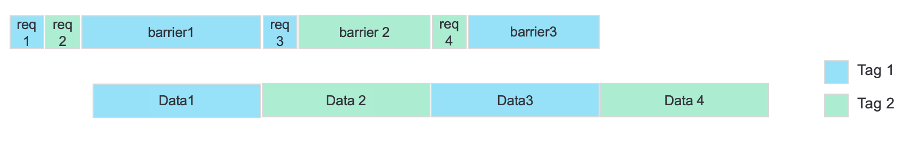
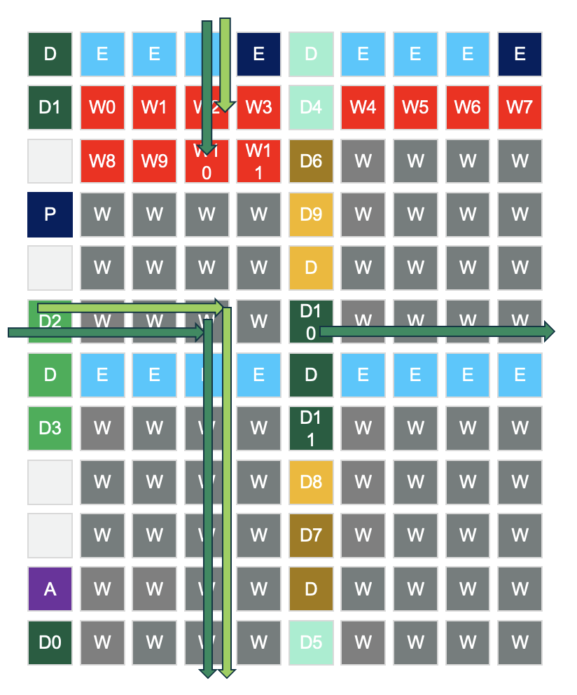
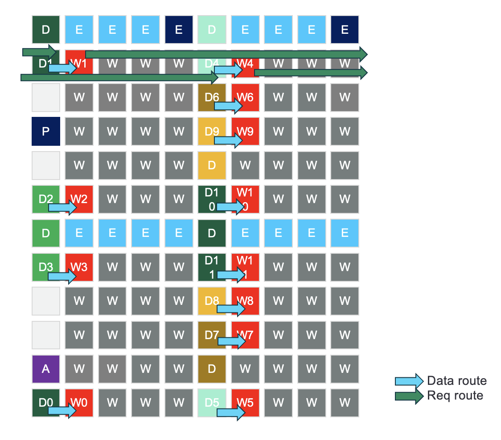
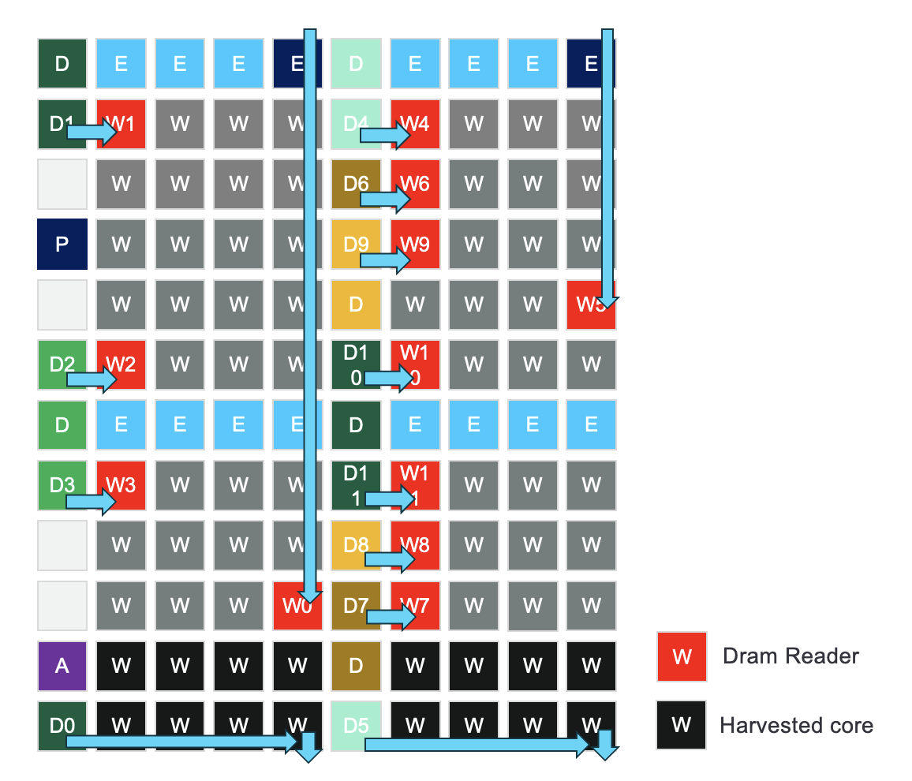
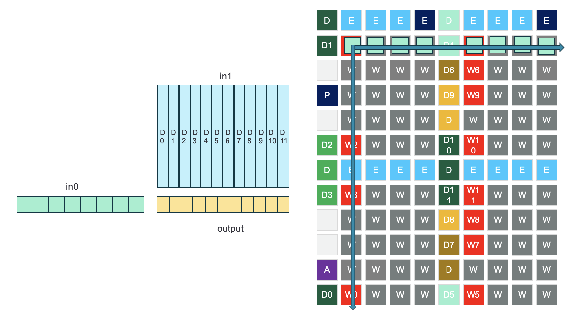

# Saturating DRAM bandwidth
This document explains how we achieved over 92% DRAM bandwidth utilization on Tenstorrent Wormhole and Grayskull cards. On Grayskull, there are 8 DRAM banks placed on the grid, and on Wormhole there are 12 DRAM banks placed on the grid. We use DRAM reader kernels (RISC-V cores) to access the DRAM bank and issue read requests through NoC APIs. When receiving data from DRAM banks, the readers wait on a barrier until all data are returned.

## Reader data movement kernel saturating DRAM bandwidth of a single bank
To achieve maximum bandwidth, the first step is saturating a single DRAM bank using one DRAM reader kernel. The DRAM reader issues read requests to the NoC, and the NoC transfers the request to a single DRAM bank. Once the bank receives the requests, it sends back the data to the reader core. 

Since in the single bank test, we only have one core using the NoC and reading from DRAM on the grid, we can place the reader on any coordinate in the worker grid. For simplicity, we choose physical coordinate (1,1) which is the top-left worker core as our DRAM reader. 

To mimic a real application, which requires to partition the data into several data blocks, and between each data block, we need to insert a barrier to make sure the block has been read back, so that compute can start computing using this block.

The first experiment issues several blocks to DRAM bank 0, however, the read barrier affects the performance and causes bandwidth loss. This is because after the reader issues read requests for the current block, it then waits on the barrier and not issue requests for subsequent blocks. Once all the data from the current block is sent back, the reader sends read requests again. There will be a gap between the time DRAM sends out all the data and the time it receives the next requests.

To solve this problem, we assign a transaction ID (tag) to a block and call a barrier for the NoC transactions with that ID. For example, as shown in the diagram, the first block is assigned with tag 1, and the second block is assigned with tag 2. For the first two iterations, we will issue two requests and at the second iteration, we call a barrier on the block with tag 1. At the third iteration, we call the barrier on the block with tag 2, and so on. In this way, there will always be one read request on the fly, so DRAM bank can continuously fetch data for the requests.

The single-core test shows we can achieve the desired bandwidth for an individual bank.

<!-- {width=10 height=10} -->

## A reader data movement per bank to saturate the full DRAM bandwidth

To saturate all the DRAM banks, there needs to be one DRAM reader per bank, and each reader can only access its assigned bank, otherwise serving multiple readers per bank would cause serious NoC congestion.

Previous experiment shows that we cannot saturate DRAM bandwidth when placing the DRAM reader cores on either top/bottom rows or left/right columns of the worker grid, as NoC congestions start appearing when the DRAM routes for each bank overlap with each other. For example, as shown in the diagram, there are 12 readers are placed on the top two rows, each accessing one bank in the Wormhole architecture. We choose NoC 0 as the routing fabric, which has the following routing strategy: first, send to the right NoC, then send to the downward NoC. The DRAM banks are labeled as D0, D1, etc. The routes for DRAM bank 2 and bank 10 are overlapped and cause congestion over NoC traffic.

<!-- {width=10 height=10} -->

To mitigate the NoC congestion, we place the readers next to their assigned DRAM bank, so that when DRAM bank sends data back to the reader, the route just has one hop and there will be no overlap between different routes. Since the DRAM banks are placed on two columns in both Wormhole and Grayskull architecture, there will have two readers per row, which means we still have overlap when readers send out read requests, which still causes some level of congestion. To solve that, we use different NoC virtual channels (VCs) for the readers within the same row. This can prevent the case when one reader gets all the requests sent out, while the other reader is waiting for the other reader to finish, as the NoC will serve on the requests in a first-come first-serve strategy within the same VC. With different VC for each reader, the NoC can round-robin through different channels, and serve two readers equally.

With these two methods, we can in principle achieve the maximum bandwidth.

<!-- {width=10 height=10} -->

## WH reader and bank placement example
The Wormhole card has rows harvested worker grid, which means from the software perspective we cannot use the harvested rows for data movement and computation. On N150, there's one row harvested and on N300 there are two rows harvested. The harvested rows can be arbitrary and can occur at any worker rows. 

As shown in the diagram, some DRAM readers cannot be placed next to the DRAM bank, as those rows are harvested. We need to choose some coordinates so that after the DRAM readers are moved to those coordinates, there will be no routes overlapped. below is an example of how to choose a new coordinate for workers 4 and 9, we first shift them to the right and move upwards, till we find a row that has not been allocated with any readers so far. From the diagram we can see no routes are overlapped using this algorithm., and we can achieve 92% of the theoretical bandwidth.

<!-- {width=10 height=10} -->

## Sharded Tensors in DRAM exmaple
Most of the OPs use interleaved tensor layout when storing tensors in DRAM, meaning each DRAM reader will access the DRAM banks in a round-robin style. This is fine if the OP is not DRAM-bound, however, for DRAM-bound applications, the interleaved strategy will cause NoC congestions.

To mitigate the NoC congestion, we need to shard the tensor into DRAM banks, so that each DRAM reader reads only its own tensor partition from its assigned bank. One use case is matmul with 1d sharded input tensors. When in0 has small height and large width (ex, 32x1024) and in1 has large width (ex, 1024x8192), it becomes DRAM bound and we can use the same DRAM reader placement and optimization strategy mentioned earlier. 

Take Wormhole as an example, in0 is width sharded to the top rows on the grid, and in1 is width sharded into 12 DRAM banks. As shown in the diagram on the left, tensor shard D0 is sharded into DRAM bank 0, D1 is sharded into bank 1, etc. There are 12 DRAM readers, each reads a shard from its own DRAM bank. The compute kernels are placed on the same coordinate as the DRAM reader. To get in0 sharded tensor from the top rows, we need to multicast the in0 shards to all worker cores, as this is the only way to multicast data to the compute cores without sending the shards to one compute core one by one. In0 and in1 shards are also double buffered, to overlap the data movement with computation.

After computation on the output shard is done, the output shards are sent back to the top rows, as our current sharding strategy assumes the tensor shards to be allocated contiguously. 

<!-- {width=10 height=10} -->

The table below shows the achieved bandwidth for DRAM u-benchmark and matmul in different models for Wormhole, and also compares the bandwidth for DRAM operating as 12GBps and 14GBps. The u-benchmark shows it can reach over 92% of bandwidth utilization. The matmul test shows it can reach from 82% to 90% of bandwidth utilization.

| Test                 | DRAM BW (GB/s) @12GBps | DRAM BW (GB/s) @14GBps |
|----------------------|------------------------|------------------------|
| DRAM u-benchmark      | 267                    | 310                    |
| Llama3-70 decode      | 239-260                | 247-294                |
| Mixtral8x7b decode    | 243-261                | 267-300                |

## Future Work 
Since we have 12 banks on Wormhole cards, it's usually hard to divide in1 tensor evenly by 12, as our current software stack assumes the tile size to be 32x32, so when sharding the in1 tensor to 12 banks, the last bank could have uneven sharding width and cause the computation for different workers to be unbalanced. To solve this problem or at least mitigate it, we can use smaller tile sizes such as 32x16 or 32x8 so that there is less padding, and computation will be more balanced.

