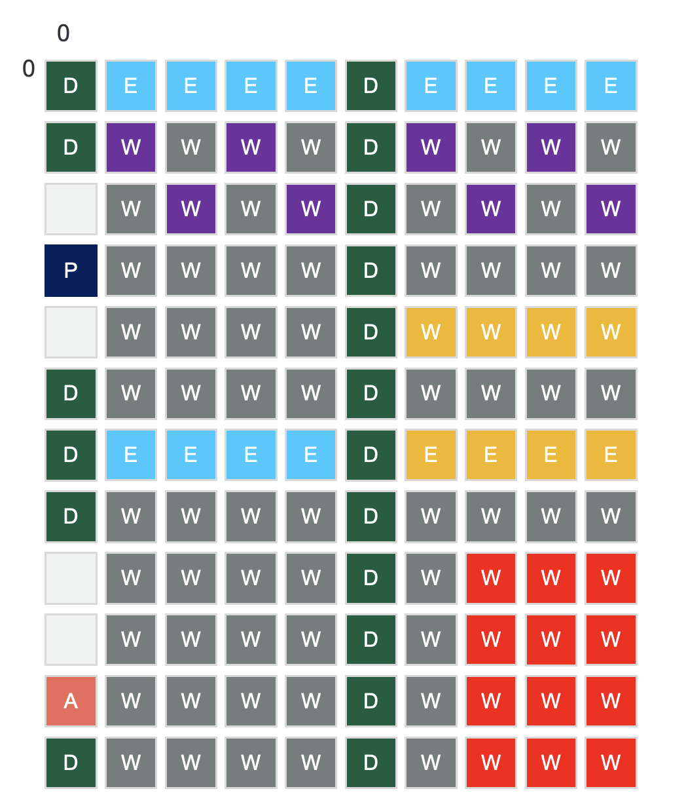
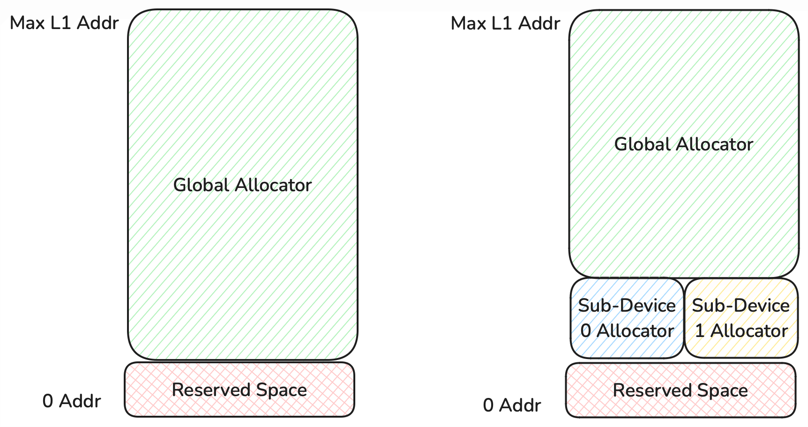

# Sub-Devices

### Note that this feature is still under active development and features/apis may change.

## Contents

- [Introduction](#introduction)
- [1. Sub-Devices](#1-sub-devices)
  - [1.1 Sub-Devices and Sub-Device Managers](#11-sub-devices-and-sub-device-managers)
  - [1.2 Allocators](#12-allocators)
- [2. Global Semaphores](#2-global-semaphores)
- [3. Global Circular Buffers](#3-global-circular-buffers)
  - [3.1 Host APIs](#31-host-apis)
  - [3.2 Kernel APIs](#32-kernel-apis)

## Introduction

Note that this document expects you to be familiar with fast dispatch concepts and functionality.

In typical program execution, allocations and synchronizations are done in lockstep across all cores. For example, allocating a sharded buffer on a single core prevents you from allocating a second buffer on a different core on the same address, as that space is considered used. With program execution, reads, writes, and synchronizations, we will always stall that all previous programs have completed on the chip before starting the next command, ex. we stall that all programs are completed before a write to ensure that we do not overwrite memory in use by the current program.

Sub-devices introduces the ability to partition the chip by grouping cores into a sub-device, and each sub-device will have its own local allocator where allocations made there do not affect allocations made on other sub-devices, and allows for tracking state of program execution per sub-device. This allows us to asynchronously run programs on different sub-devices at the same time, instead of having to run all programs sequentially.

Note however that this greatly increases the complexity of synchronization that the user has to manage, as now the user needs to coordinate and maintain the dependency between sub-devices themselves, and mistakenly stalling waiting for a sub-device that has a long running program that depends on signals from another sub-device or program to terminate will result in hangs.

To allow for synchronizations between programs on different sub-devices, we introduce two new objects and sets of APIs for communication, global semaphores which enables allocating and tracking semaphores across programs unlike typical semaphores which only exist during a single program execution, and global circular buffers, which enables programs to synchronize and send data to/from remote cores through an API similar to existing circular buffers.

## 1. Sub-Devices

### 1.1 Sub-Devices and Sub-Device Managers

Users are able to create Sub-Device objects, which represents the grouping of cores of a device that they want the state to be tracked separately from the rest of the device cores.
Each Sub-Device can be any combination of cores and core types. It could be only worker cores, only ethernet cores, or a combination of them. The cores specified can be any combination of contiguous or discontiguous cores, specified as a CoreRangeSet. The coordinates of the CoreRangeSet follows the logical coordinates of the specified core type of the full chip. These device level coordinates remain the same as before which maintains compatibility with other existing apis. Figure 1. shows an example of different SubDevices on a chip.

<!-- {width=15 height=15} -->


Figure 1. Example sub-devices where the red sub-device is a contiguous grid of worker cores, purple is a discontiguous set of worker cores, yellow is a sub-device of only ethernet cores, and blue is a sub-device of worker and ethernet cores.

To create a sub-device, we need to provide a list of cores by HalProgrammableCoreType, where the first index of the list are Tensix cores, the second index are Active Eth cores, etc. The order is based on the HalProgrammableCoreType enum. This api is expected to change as the device core coords are expected to be augmented to contain the core type in addition to the coords. With this change, then it would not matter what order the cores are passed in since they'd contain their core type.

Note that with the planned changes to introduce TT-Fabric, ethernet cores will no longer be user programmable and as a result, sub-devices will no longer be allowed to contain ethernet cores.

The following are the APIs to create Sub-Device core groupings, and to configure the state of a device with the desired setup.

* `sub_device_0 = ttnn.SubDevice([tensix_core_range_set_0, ethernet_core_range_set_0])`

  API to create a SubDevice object representing the configuration of cores we want to track as one group for synchronization/allocations.

* `sub_device_manager_0 = device.create_sub_device_manager([sub_device_0, sub_device_1], 3200)`

  This takes in a list of sub-devices as well as the local allocator size (described in the following section), and generates the required state/metadata for the specified configuration.
  Note that this does not change the current configuration of the device, but returns an ID that can be used to specify when to switch to the target configuration.

* `device.load_sub_device_manager(sub_device_manager_0)`

  This will configure the device with the specified sub-device setup. Note that this requires all local allocators to have no buffers allocated, and will synchronize and wait for all existing programs to finish before reconfiguring.

* `device.clear_loaded_sub_device_manager()`

  Resets the device back to the default state with no user specified sub-devices, where synchronizations are done at the device level. Similar to `load_sub_device_manager`, this requires all local allocators to have no buffers allocated, and will synchronize and wait for all existing programs to finish before reconfiguring.

* `device.remove_sub_device_manager(sub_device_manager_0)`

  Deletes all the state/metadata associated with the specified manager ID. The specified ID cannot be that of the currently configured sub-device setup.

### 1.2 Allocators

When running without sub-devices, there is a single global allocator that is managing memory for the entire chip, and requires the memory used across all cores to be in lockstep. When we load a sub-device manager configuration, we will instantiate a local allocator for each sub-device with tensix workers. We will shrink the global allocator by the user-specified size, and that size will be used for the local sub-device allocators.
Users can specify a size of zero for the local allocator size, in which case no sub-device allocators will be created, and all memory will remain managed by the global allocator.

Currently, the local allocators will always be created at the lower address space below the global allocator. Future work could enable creating the local allocators at the top, or user specified location within the L1 memory space.

<!-- {width=15 height=15} -->


Figure 2. Example of the default allocator setup without sub-devices (right), and the allocator setup when we instantiate 2 sub-devices with local allocators (left).

When creating buffers, a sub-device id can be specified. When specified, it will allocate using the local allocator associated with that specific sub-device, otherwise allocations occur on the global allocator.

The following APIs are for creating buffers on a sub-device specific allocator.

* `CreateBuffer(..., sub_device_id_0)`

  Creates a buffer on the specified sub-device allocator of the current Sub-Device Manager configuration.

Note that support for this has not been propagated to the ttnn tensor level, pending the API rework to make sub-devices more device-like.

### 1.3 Programs

The apis for creating and interacting with programs remain unchanged compared to not using sub-devices. Users still create a program and target a specific device with it. The infrastructure will automatically determine the used sub-devices for the program and set/track the appropriate state needed for dispatching the program.

Currently there are two outstanding support features that are planned to enable full generality:
1. Programs can only span one sub-device
2. Programs cannot be rerun on a different sub-device-manager configuration. This would need to be a new program that runs.

When enqueuing a program on a specific sub-device, the dispatch infrastructure will stall waiting for all programs to finish on that specific sub-device before launching the program, similar to the current dispatch of device level programs. This means that if we need the program to synchronize and stall on programs of other sub-devices, users must ensure to either insert events on the other sub-devices to wait on before launching the current program, or adding a host synchronize/stall depending on the use case.

### 1.4 Synchronization

In the default setup without sub-devices, all apis for reads/writes/running programs will stall until all previous programs have finished before executing the target instructions. With sub-devices, this behaviour remains the same in that calls to reads/writes will stall on all programs to finish across all sub-devices. To only stall on specific sub-devices, a user can manually set what the stall group should be using `set_sub_device_stall_group`. This is useful for example if we have a persistent program running on one sub-device, so when running programs on a different sub-device or issuing reads/writes while that persistent program is active, we remove it from the stall list since we aren't depending on that program to finish. This allows the user to specify for example a read to host instruction to wait for only the producer sub-devices to finish, and not other unrelated sub-devices.

The synchronize apis such as `Synchronize`, `EnqueueRecordEvent`, and the ttnn level functions `ttnn.synchronize_device`, `ttnn.record_event`, which are used for host level and device level synchronizations, also take in a `sub_device_ids` parameter to override the default list so that either the host or the device stalls until programs on the specified sub-devices complete before continuing.

The following are some examples of the different python level APIs that take in sub-devices for synchronizing.

* `ttnn.set_sub_device_stall_group(sub_device_ids=[sub_device_id_0, sub_device_id_1])`

  Set the SubDevice IDs that will be stalled on by default for Fast Dispatch commands such as reading, writing, synchronizing.
  Stalling here refers to the Fast Dispatch cores waiting for programs to complete execution on the specified SubDevices before proceeding with the specified instruction.
  The default SubDevice IDs to stall on are set to all SubDevice IDs, and whenever a new SubDevice Manager is loaded.

* `ttnn.reset_sub_device_stall_group()`

  Resets the sub_device_ids that will be stalled on by default for Fast Dispatch commands such as reading, writing, synchronizing back to all SubDevice IDs.

* `ttnn.synchronize_device(..., sub_device_ids=[sub_device_id_0, sub_device_id_1])`

  This will stall the host waiting for completion of the specified sub-device's programs. Not specifying any sub-device ids means we will stall waiting for all sub-devices set by `set_sub_device_stall_group` to complete.

* `ttnn.record_event(..., sub_device_ids=[sub_device_id_0, sub_device_id_1])`

  This will stall the device waiting for completion of the specified sub-device's programs before recording that the event has occurred. Not specifying any sub-device ids means we will stall waiting for all sub-devices set by `set_sub_device_stall_group` to complete.

## 2. Global Semaphores

In the traditional setup, semaphores are local to a single program and are not visible to programs that run before/after it. There is no guarantee the the value of semaphore 0 of one program is at the same address or contains the last value written there from one program to another program.

Global semaphores are an object similar to tensors, in that it will allocate a space for the semaphore with the device's allocator, This means that a persistent space is reserved for use until the global semaphore is destroyed. Users can specify a value from host to write to the global semaphore, or can have programs access/write to this address for communication either between concurrent programs, or for a series of programs as the memory space won't be deallocated and only the producers/consumers of the global semaphore will interact with it.

Note that global semaphores can only created on tensix cores, as only tensix cores have L1 that is managed by the host allocator. Currently global semaphores also only support allocations using the global allocator, but can be updated to be allocated using sub-device local allocators as well.

The following are APIs for creating and interacting with the global semaphores.

* `global_semaphore = ttnn.create_global_semaphore(device=device, cores=tensix_cores0, initial_value=1, buffer_type=ttnn.BufferType.L1)`

  This will create a global semaphore object on the specified device and cores using the specified L1 buffer type.

* `address = ttnn.get_global_semaphore_address(global_semaphore=global_semaphore)`

  This will query the address of the global semaphore.

* `ttnn.reset_global_semaphore_value(global_semaphore=global_semaphore, reset_value=1)`

  This will issue a write from host of the specified value to global semaphore's address on device.

## 3. Global Circular Buffers

In the traditional setup, circular buffers are only used for local synchronizations between a core's RISCs, and cannot automatically be used for reading/writing between cores. There is also support for in-placing circular buffers with sharded L1 tensors, but this does not preserve state across programs. For example, running a program using sharded tensor A as a circular buffer, and then running another program using sharded tensor A as a circular buffer, both programs start the read/write pointers of the CB at the base tensor address. It does not provide automatic tracking for if a user wants the first program to process part of the data, and then the second program to process the remaining data.

Global circular buffers provide a heterogeneous mechanism for reserving a persistent space in L1 to be used for the circular buffer that persists across programs until the object is destroyed, as well for for synchronizing between cores and tracking state across programs. To create a global circular buffer, we need to specify a mapping of sender receiver cores in order to allocate and track appropriate resources. Each sender core may be associated with one or more receiver cores. The sender cores are the producers of the data that needs to be transmitted to the receiver cores, and the receiver cores are the consumers of the data. The size specified for the global circular buffer is the total size per core to be allocated, similar to traditional circular buffers.

There are APIs for configuring a program to use a global circular buffer, similar to how programs can temporarily associate a circular buffer to a user provided L1 buffer.
These can be configured as remote circular buffers which provides access to APIs for synchronizing between cores.

### 3.1 Host APIs

The following is the python API for creating a global circular buffer.

* `ttnn.create_global_circular_buffer(device=device, sender_receiver_core_mapping=[(sender_core, receiver_cores)], size=2048, buffer_type=ttnn.BufferType.L1, sub_device_ids=[])`

  This will create a global circular buffer object on the specified device with the specified mapping of sender cores to receiver cores using the specified L1 buffer type. The size specified is the amount of memory allocated on each core for the circular buffer. It will issue a device stall on the specified sub-device ids before writing the circular buffer configurations to device. Not specifying any sub-device ids means we will stall waiting for all sub-devices to complete.

The following is an example of setting up a global circular buffer for use within a program.
```
    uint32_t remote_cb_index = 31;
    uint32_t local_cb_index = 0;
    tt_metal::CircularBufferConfig receiver_cb_config = tt_metal::CircularBufferConfig(total_cb_size);
    receiver_cb_config.remote_index(remote_cb_index)
        .set_page_size(single_tile_size)
        .set_data_format(tile_format);
    receiver_cb_config.index(local_cb_index).set_page_size(single_tile_size).set_data_format(tile_format);
    auto receiver_cb = tt_metal::v1::experimental::CreateCircularBuffer(
        program, l1_receiver_cores, receiver_cb_config, global_circular_buffer);
```

* `CircularBufferConfig::remote_index(remote_circular_buffer_index)`

  Specifies that the specified cb index will be configured to enable remote interactions between the sender receiver cores of a global circular buffer.
  Local circular buffer indices have optimal dispatch performance when starting from 0, whereas remote indicies have optimal dispatch performance starting from the max index.
  Note that the ranges of local and remote circular buffer indices cannot overlap, that is the max local index must be less than the minimum remote index.
  Local circular buffers can be in-placed with a remote circular buffer, as this is useful for using the remote circular buffer for synchronization with other cores, while the local circular buffer is used for feeding data to the compute kernel, as the compute functions/LLKs cannot use the remote config.

* `tt_metal::experimental::UpdateDynamicCircularBufferAddress(program, cb_handle, global_circular_buffer);`

  Updates an existing circular buffer specified by the handle that was associated with a global circular buffer to the address space of a different global circular buffer.
  The new global circular buffer is expected to contain all the cores used by the circular buffer config.

### 3.2 Kernel APIs

The following are APIs for using the remote circular buffers within kernels.

Receiver APIs:

* `remote_cb_wait_front(cb_id, num_pages)`

  Used by a receiver core to wait for data from its sender core. Similar to `cb_wait_front`

* `remote_cb_pop_front(cb_id, num_pages, noc)`

  Used by a receiver core to signal it is done with the specified amount of data to its sender core. Similar to `cb_pop_front`

* `resize_remote_sender_cb_interface(cb_id, page_size, noc)`

  Reconfigures the sender circular buffer's page size. This may result in noc transactions for synchronizing with the receiver cores.
  If local circular buffers are in-placed with the remote buffer, `align_local_cbs_to_remote_cb` needs to be called to update the associated local circular buffers of any changes to the circular buffer's pointers or total size.

Sender APIs:

* `remote_cb_reserve_back(cb_id, num_pages)`

  Used by a sender core to wait for available space on each of its associated receiver cores. Similar to `cb_reserve_back`

* `remote_cb_push_back_and_write_pages(cb_id, local_cb_addr, num_pages, num_rows, coalesced_num_pages_per_row, coalesced_page_size, noc)`

  Used by a sender core to write data to each of its associated receiver cores. This is a combined write and signalling function, where the signalling is similar to `cb_push_back`.
  `num_pages` refers to the number of pages to send, `num_rows` refers to the number of rows (in tile) of the tensor / block. `coalesced_page_size` refers to the maximum coalesced page size for
  a single NoC transfer, it can group one or several page size into one `coalesced_page_size`. `coalesced_num_pages_per_row` refers to the number of coalesced pages for a single tensor / block row.

* `resize_remote_receiver_cb_interface(cb_id, page_size, noc)`

  Reconfigures the receiver circular buffer's page size. This may result in noc transactions for synchronizing with the sender core.
  If local circular buffers are in-placed with the remote buffer, `align_local_cbs_to_remote_cb` needs to be called to update the associated local circular buffers of any changes to the circular buffer's pointers or total size.

Common APIs:

* `update_remote_cb_config_in_l1(remote_cb_index)`

  The read/write pointers of the remote circular buffers are stored in L1, so that subsequent programs can resume where the previous pointers were.
  During execution, this pointer is cached in a struct for optimal perf to avoid repeated L1 reads/writes. This requires the user to call this program at the end of their kernel execution in order to write the final value back to L1. This should only be called by one RISC per core which has the final updated value.

* `align_local_cbs_to_remote_cb(remote_cb_index, local_cb_indices[])`

  Used to update any associated local cbs that are in-placed with a remote cb with updated total size and read/write pointers. Normally called after reconfiguring a remote circular buffer's page size.
