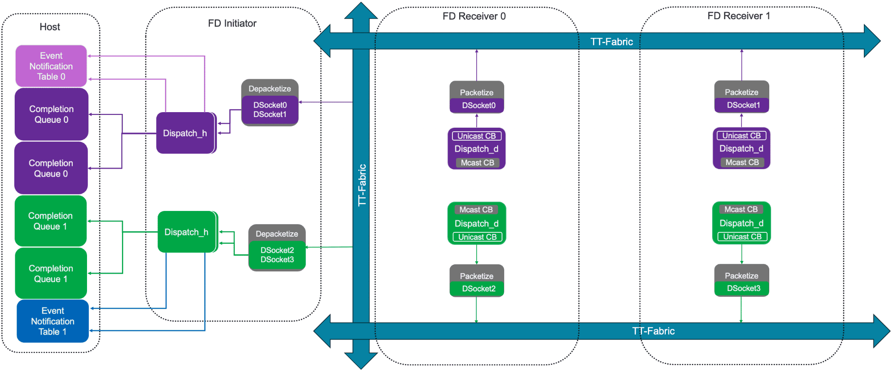
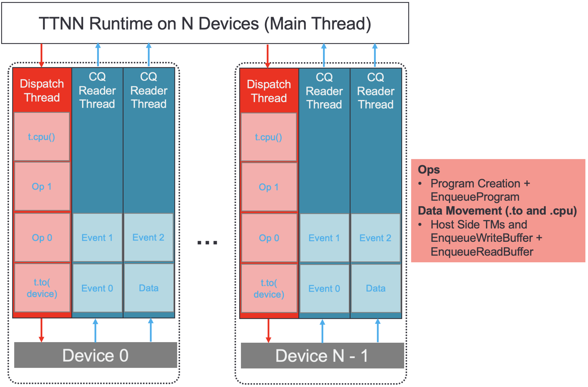
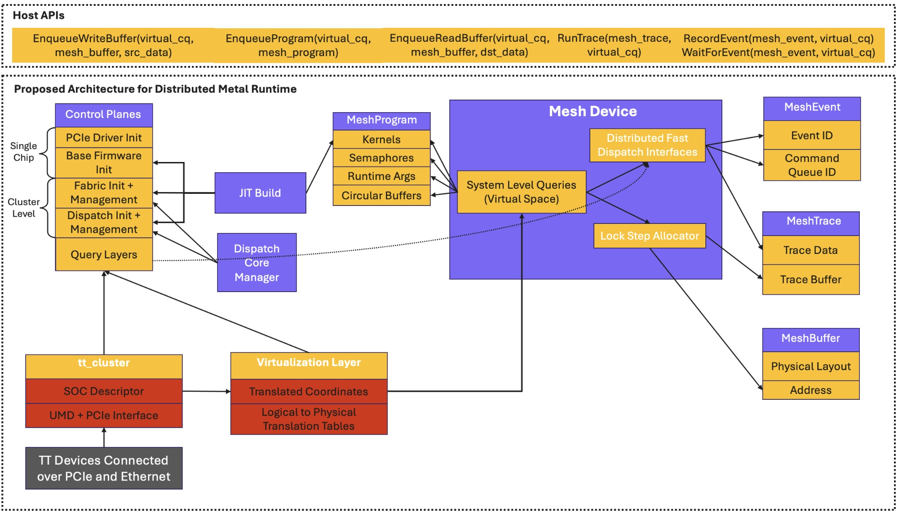

# TT-Metalium Distributed

Authors: TT-Metalium Scale-Out Team

For questions and comments please use the [TT-Metalium Scale-Out Discord Server](https://discord.com/channels/863154240319258674/1321621251269328956)

## Architecture Specification

Version 1.0

[1. Overview](#overview)

[2. Background and Project Motivation](#background)
  - [2.1 Virtualization through TTNN](#virtualization-through-ttnn)
  - [2.2 Project Motivation and Design](#motivation)
  - [2.3 Dependencies with External Efforts](#dependencies)

[3. TT-Mesh](#tt-mesh)
  - [3.1 MeshDevice: Overview and Associated Data-Structures](#meshdevice)
    - [3.1.1 Terminology](#meshdevice-terminology)
    - [3.1.2 Constraints and Properties of a Virtual Mesh](#meshdevice-constraints)
    - [3.1.3 MeshDevice Abstraction](#meshdevice-abstraction)
    - [3.1.4 Data Structures](#meshdevice-data-structures)
    - [3.1.5 Lightweight and Consistent APIs](#meshdevice-lightweight-and-consistent-apis)
  - [3.2 Virtual Command Queues](#virtual-command-queues)
  - [3.3 Memory Management: MeshBuffer and MeshAllocator](#meshbuffer)
  - [3.4 MeshWorkload: Overview, Data-Structures and APIs](#meshworkload)
  - [3.5 MeshEvent: Data-Structure and APIs](#meshevent)
  - [3.6 MeshTrace: Overview and APIs](#meshtrace)
  - [3.7 End to End Programming Example](#tt-mesh-end-to-end)
  - [3.8 MeshCommandQueue: Data Movement to and from a TT-Mesh](#meshcommandqueue)
  - [3.9 Host Runtime Design: Conservative Multithreading](#mesh-host-runtime-design)
  - [3.10 MeshWorkload: Implementation Details](#meshworkload-details)
  - [3.11 MeshEvents: Implementation Details](#meshevent-details)
  - [3.12 MeshTrace Implementation Details](#meshtrace-details)
  - [3.13 Summary: Dependencies, APIs and Data-Structures on Host](#tt-mesh-summary)

[4. TT-Distributed](#tt-distributed)
  - [4.1 Offline System Descriptor: Caching UMD Queries](#offline-system-descriptor)
  - [4.2 DistributedDevice](#distributed-device)
  - [4.3 DistributedBuffer](#distributed-buffer)
  - [4.4 DistributedWorkload: Overview, Data-Structures and APIs](#distributed-workload)
  - [4.5 DistributedEvents: Overview, Data-Structures and APIs](#distributed-events)
  - [4.6 DistributedTrace: Overview and APIs](#distributed-trace)
  - [4.7 Command Serialization](#command-serialization)
  - [4.8 Network Transport](#network-transport)

[5. TT-NN Integration](#tt-nn-integration)
  - [5.1 TT-Mesh/TT-Distributed Interoperability Layer](#tt-mesh-tt-distributed-interoperability)

[Appendix](#appendix)
 - [Appendix A: Existing Runtime Architecture Overview](#appendix-a)
    - [A.1 Current State of Metal Runtime](#appendix-a-current-state-of-runtime)
    - [A.2 A More Modular Approach to Metal Runtime](#appendix-a-more-modular-approach)
    - [A.4 Distributed Metal Runtime Using Existing Components and Virtualization](#appendix-a-distributed-metal-runtime-using-existing-components-and-virtualization)
 - [Appendix B: UMD](#appendix-b)
     - [Appendix B.1: UMD Queries](#appendix-b-umd-queries)

# Overview <a id="overview"></a>

This document presents a specification for **TT-Mesh** and **TT-Distributed**, Tenstorrent’s scale-up and scale-out infrastructure to natively support workloads on multiple Tenstorrent hardware accelerators, potentially spanning multiple host servers.

TT-Metalium provides a flexible programming model over a mesh of Tensix cores. The TT-Mesh and TT-Distributed layers, built on top of TT-Fabric, extend this programming model to a grid of Tensix cores spanning multiple devices connected over ethernet and controlled by multiple host processors. Through this, users are exposed to the same programming model as a single device, when systems are scaled-out.

The key idea is to present a multi-device multi-host system as: 1) a large virtual device that has, 2) a distributed shared memory space, and 3) a set of programmable Tensix cores. Unlike conventional architectures, programming cores distributed over multiple devices or multiple host machines will not fundamentally alter the programming model.


# 2. Background and Project Motivation <a id="background"></a>

## 2.1 Virtualization through TTNN <a id="virtualization-through-ttnn"></a>

TT-NN is a library that provides a Pytorch-like interface for executing compute on Tenstorrent accelerators. This interface is available and supported for single-process, single-host environments with operations that can be dispatched synchronously and asynchronously (through a single or multithreaded runtime environment) across a mesh of devices. See [Programming Mesh of Devices](https://github.com/tenstorrent/tt-metal/blob/main/tech_reports/Programming_Mesh_of_Devices/Programming_Mesh_of_Devices_with_TT-NN.md) for more information. TT-NN builds on top of TT-Metalium to provide a high-level interface in the form of operations and tensors in a neural network op library.

The table below displays the compute paradigms supported by TTNN.

| Table 1: TT-NN Multi-Device Operation Dispatch (state as of Nov 2024) | | |
| --- | --- | --- |
|  | **Single Process** | **Multi-Process/ Multi-Host** |
| Synchronous | Supported | Unsupported |
| Asynchronous | Supported | Unsupported |

Today, TT-NN virtualizes the devices arranged in a physically connected mesh as a single MeshDevice abstraction. Users can largely be transparent to orchestration and coordination at the level of individual devices. This virtualization effectively gives users a single handle to a larger compute mesh and memory space. The compute model is exposed as a Single-Program-Multiple-Device (SPMD) environment, which broadcasts operations across all devices in a mesh.

Today, TT-Metalium does not natively support the ability to virtualize a multi-chip cluster; this abstraction is implemented entirely at the TT-NN layer. A side-effect of this is that TT-NN is responsible for lowering MeshDevice APIs into TT-Metalium primitives targeting single devices. This results in the heavy host-bound lowering process being repeated across devices. If done serially, this almost always results in multi-chip workloads being bottlenecked on host.

As an optimization, TT-NN uses multi-threading to implement asynchronous host dispatch across devices, with a single dispatch thread assigned to each device. An example of the SPMD compute model and asynchronous TT-NN dispatch is provided in the diagram below, displaying how a simple unary operation is lowered to a Mesh of eight devices.


A direct consequence of the existing multi-threaded dispatch infrastructure is an overloaded host. The impacts of this problem are not visible for workloads running on small clusters but this does not scale. The number of threads the host needs to manage is directly proportional to the number of devices in the mesh.

As shown in the diagram below, for a system with 64 devices (a TGG Cluster), host runtime spawns 192 threads (the exact assignment of threads is described in a later section). Even on a processor with 96 cores, with threads optimally bound, each CPU core is running at least 2 threads and is significantly overloaded. The effects of this behavior are clearly visible when running simple models on large cluster using the existing approach.


This problem will get worse for larger clusters. Thus, the existing virtualization infrastructure is not a viable solution for scale-out.

## 2.2 Project Motivation and Design <a id="motivation"></a>

The diagram above presents a motivating case for moving the virtualization lower in the software stack. Virtualization at the TT-NN layer and multi-threaded dispatch does not scale and is unable to virtualize across different servers. The motivation and scope of the problem to solve are the following:

1. **Extend the TT-Metalium programming model to natively support multi-device and multi-host**. This is decoupled as an “Op Design Problem” and a “Dispatch Problem”. Op/Kernel writers using the TT-Distributed infrastructure have the flexibility to target a larger compute mesh while being entirely transparent to the physical resources used for dispatching the workload to TT-Accelerators across servers.
   1. TT-Distributed is agnostic of single-host / multi-host configurations


Figure (A): Separation of the Op Design and Dispatch Problems

* 1. Figure (B) displays TT-Distributed exposing two different physical configurations as a **single Virtualized Mesh of TT-Accelerators**


Figure (B): TT-Distributed exposes two 4x2 and a single 4x4 Cluster as the same Virtual Mesh

1. Solve scalability issues seen with the TT-NN virtualization layer.
2. **Introduce Unified Distributed Memory across the entire Virtual Mesh** (including Multi-host systems)
   1. Introduce MeshBuffer – a buffer that is allocated across a Virtual Mesh and can be allocated in lock-step across physical devices
   2. MeshBuffer across a mesh of devices is an extension of Buffer across a mesh of cores
   3. Any core on any each physical device within the Virtual Mesh can Read/Write to any other address in the Mesh (Unified Distributed Memory)

This architecture specification addresses these points through the proposed **TT-Mesh** and **TT-Distributed** frameworks**.**

Built on top of TT-Fabric, and existing TT-Metalium runtime infrastructure, TT-Mesh integrates the MeshDevice concept natively with TT-Metalium while TT-Distributed unlocks multi-host support. Through this, we introduce:

* A unified programming model between a single device and a mesh of devices, as users interact with more Tensix cores and larger distributed memory regions across multiple servers. This transparently extends the existing TT-Metalium programming model from a “Mesh of Cores” to a “Mesh of Cores contained in a Mesh of Devices across servers”.
* The ability to use TT-Fabric (Tenstorrent’s multichip routing firmware) for parallelizing dispatch and data-movement across the mesh, using chip-to-chip broadcasts. This allows the physical resources supporting parallelism to scale with the size of the compute cluster, removing bottlenecks on Host that exist with the existing infrastructure.
* A unified memory model exposed to users as they scale across multiple devices connected to different servers.

The diagram below displays the high-level architecture of the proposed runtime stack, reusing concepts from the single-device runtime domain, and built on top of existing layers.

The **TT-Mesh** infrastructure introduces MeshDevice, MeshBuffer, MeshWorkload, MeshTrace and MeshEvents objects; based on single-device analogs.

The **TT-Distributed** infrastructure introduces DistributedDevice, DistributedBuffer, DistributedWorkload, DistributedTrace, DistributedEvent variants of these objects, which can exist across multiple hosts, through serialization and transport layers.


## 2.3 Dependencies with External Efforts <a id="dependencies"></a>

This effort is heavily entangled with several on-going and scheduled efforts on the Runtime Infrastructure Roadmap.

A list of the dependencies, and components they block is provided below. A detailed description of each component will be provided in the sections below.

| **Project Dependency** | **Component(s) being Blocked** |
| --- | --- |
| Coordinate Virtualization | MeshWorkload Implementation (**V1**)  Ability to build kernel binaries offline on a controller host, not directly connected to a Physical Device (**V1.2**) |
| Finalized Host API Contract using Handles | Finalized Distributed and Mesh APIs (**V1)** |
| Separating Build from Device | Finalized MeshDevice and DistributedDevice Implementation using a JIT Build System (**V1.2**)  Ability to build kernel binaries offline on a controller host, not directly connected to a Physical Device (**V1.2**) |
| Modular Dispatch Management Infrastructure | Finalized MeshDevice and DistributedDevice Implementation using a dedicated Control Plane.  MeshDevice Dispatch integration with TT-Fabric (**V1.2**) |
| TT-Fabric: Generic Routing over Ethernet | Broadcast based Dispatch (**V1.2**) |

# 3. TT-Mesh <a id="tt-mesh"></a>

This section describes TT-Mesh, Tenstorrent’s scale-up software infrastructure for natively extending the single device programming model to a physical mesh of devices, connected to a single host.

We start by describing the main components of this infrastructure, data-structures, associated APIs and how these components map to physical resources.

## 3.1 MeshDevice: Overview and Associated Data-Structures <a id="meshdevice"></a>

### 3.1.1 Terminology: <a id="meshdevice-terminology"></a>

We define a "**Physical Mesh**” as the largest fully-connected uniform mesh (all pairs of chip-to-chip interconnects with same number of ethernet links) of TT-Devices physically connected over ethernet. The diagram shows a T3000 (4x2) Physical Mesh (convention: *RxC*).


We define a **“Virtual Mesh”** as a user-defined fully connected mesh of TT-Devices, of arbitrary shape, with one or more host machines. The diagram below shows a Physical Mesh being partitioned into 4 Virtual Meshes. Each Virtual Mesh consists of a fully connected cluster of devices.


The following diagram shows how a Virtual Mesh can span multiple hosts, as long as all devices are connected over ethernet. This raises the requirement for Metal Runtime to natively enable Data Movement and Workload Dispatch across multiple hosts, through the TT-Distributed networking layer, as detailed later in the document.


### 3.1.2 Constraints and Properties of a Virtual Mesh <a id="meshdevice-constraints"></a>

A Virtual Mesh has the following properties:

* **Logical Device Coordinates:** Physical devices are uniquely identified through (shelf, rack, x, y). With a Virtual Mesh, we create a logical 2D view of devices spanning multiple shelves, racks, and hosts.
* **Lockstep Device Memory Allocation:** The allocator now resides at the Virtual Mesh scope and is responsible for performing lock-step buffer allocations across devices and memory banks (L1/DRAM).
* **SubDevice Uniformity**: An existing feature in TT-Metalium is a SubDevice. A device can be partitioned into SubDevices where each SubDevice is provisioned a set of cores. Each SubDevice can have independent program execution. In the context of a Virtual Mesh, it shall only contain a single SubDevice Manager.
* **Device-Like API Contract**: A Virtual Mesh will have an explicit Device-Like API contract imposed on it. Existing APIs that interact with a Device will be able to interface with a single MeshDevice handle. Individual physical devices encapsulated in a Virtual Mesh will not be exposed.

### 3.1.3 MeshDevice Abstraction <a id="meshdevice-abstraction"></a>

TT-Mesh layer exposes this Virtual Mesh as the **MeshDevice** class abstraction. Conceptually MeshDevice can be thought of as a single virtual device which virtualizes over a mesh of connected physical devices. The devices contained in the mesh are mapped into a 2D logical device mesh.

The diagram below illustrates a user created 2x2 MeshDevice that binds to a 2x2 set of devices in our 2D logical organization of the available devices across two galaxies.


This data structure allows users to query and modify the state of any Virtual Mesh mapped to physical devices connected to a single host. As such the MeshDevice class is the primary entry-point for Memory Management, Data Movement and Workload Dispatch.

At a high level, the MeshDevice class can be fully described by the diagram presented below.


Fundamentally, the MeshDevice contains a query layer allowing users and internal APIs to access information related to the Virtual Mesh and Physical device state. Through this query layer, we build Virtualized Fast Dispatch Interfaces and a Lock Step Allocator managing a distributed address space across the Physical Mesh. These blocks allow exposing APIs to interact with Distributed Memory, perform IO and compute.

**The API contract for the MeshDevice class must be identical to the Device class, to ensure a seamless user experience. This contract will be completely defined as part of V1 and relies on existing efforts to uplift the user-facing TT-Metal Device APIs.**

The existing MeshDevice class is built up as a collection of multiple Device objects (the main object that TT-Metal Runtime exposes to interface with a single device). As part of this effort, the MeshDevice class will be modified to fit the description provided above, which allows for a cleaner and decoupled implementation.

Primarily, casting the MeshDevice data-structure to be more inline with the diagram requires resolving the dependencies mentioned in the [previous section](#_2.3_Dependencies_with).

For a detailed diagram of the fully decoupled MeshDevice class and its interactions with other runtime data-structures, please refer to [this section](#_4.14_Summary:_Dependencies,).

In the sections below, we present a high-level implementation of the finalized MeshDevice class, with all dependencies resolved. The purpose of these sections is not to list each MeshDevice API, but rather to provide a skeleton of the data-structures and APIs associated with this class.

### 3.1.3 Data Structures <a id="meshdevice-data-structures"></a>

**The data-structures presented in this section require several dependencies to be resolved. They will be delivered as part of V1.2.**

**V1 will continue using the existing implementation of MeshDevice. Modified to be in line with the finalized Host APIs.**

The code-block below displays a detailed representation of the MeshDevice class. The purpose of this is to provide a software-based representation of the different building blocks involved in exposing a Virtual Mesh.

```cpp
// Virtual Mesh Config exposed to users
// Determines how physical devices are used
struct MeshConfig {
    // Requested dimensions of the mesh
    MeshShape shape;

    // Offset into Logical Device Coordinate Space
    MeshOffset offset;
};

// Class exposing host and device dispatch state
// Similar to the CommandQueue object in TT-Metal, however
// this has additional functionality and allows users to
// communicate with a cluster of Physical Devices
struct MeshCommandQueue {
    // Interfaces to dispatch to a single physical device in the Mesh
    std::vector<UnicastCQInterface> unicast_dispatch_interfaces_;

    // NEW: Dispatch to Multiple Physical devices at once using TT-Fabric
    // broadcasts
    BroadcastCQInterface broadcast_dispatch_interfaces_;
};

// Virtual Mesh Manager: Hides implementation details
class MeshDevice {

   // 1 Dispatch interface for Broadcast CQ
   // 1 Dispatch interface for Unicast CQ
   constexpr uint32_t NUM_DISPATCH_INTERFACES = 2;

   // Internal state required to fully manage a grid of physical
   // devices exposing Distributed Memory
   Allocator lock_step_allocator_;
   std::array<MeshCommandQueue, NUM_DISPATCH_INTERFACES> physical_dispatch_interface_;
   MeshConfig virtual_mesh_config_;
   std::vector<chip_id_t> ordered_physical_device_ids_ = {};
   uint8_t num_virtual_cqs_ = 1;

   // ==== These functions are called when MeshDevice is constructed ====

   // Helper functions to initialize state on Host
   void initialize_tt_cluster(); // Initialize Drivers and Query Layer
   void initialize_allocator(); // Initialize lock-step allocator
   void initialize_dispatch_state_on_host(); // Setup dispatch interfaces

   // Main function to initialize state on Host
   void initialize_host_state();

   // Helper functions to initialize Accelerator state
   void initialize_base_firmware_on_physical_devices(); // Initialize Base FW
   void initialize_fabric_routing_firmware_on_cluster(); // Initialize TT-Fabric
   void initialize_dispatch_on_physical_devices(); // Initialize dispatch FW

   // Main function to initialize Accelerator state
   void initialize_device_state();
   void initialize();
   void close();
};

// Main virtualization layer exposed to users.
// Exposes entry points for queries, memory allocation and dispatch
class MeshDevice {
   private:
   // Internal representation of the Virtual Mesh
   std::unique_ptr<MeshDevice_> mesh_device_impl;

   public:

   MeshDevice(MeshConfig virtual_mesh_config, const uint8_t num_virtual_cqs, const std::size_t l1_small_size, const std::size_t trace_region_size);
   ~MeshDevice();

   // Example APIs implementing a Virtualized Query Layer
   uint32_t get_num_physical_devices();
   uint32_t get_physical_device_id_at_coordinate(const Coordinate& logical_device_coordinate) const;

   // Existing Device Interface APIs:

   // - Common Interface between {Device, MeshDevice}
   uint32_t get_num_worker_cores() const;
   int num_dram_channels() const;
   uint32_t l1_size_per_core() const;
   uint32_t dram_size_per_channel() const;
   CoreCoord grid_size() const;
   CoreCoord logical_grid_size() const;
   CoreCoord compute_with_storage_grid_size() const;
   CoreCoord dram_grid_size() const;

   // Accessors for Lock-Step-Allocator and Dispatch Interfaces
   CommandQueueHandle get_vcq_from_id(const uint8_t cq_id);
   const Allocator& get_lock_step_allocator();
};
```

The MeshDevice layer can be built up from a set of Dispatch Interfaces, a Lock-Step Allocator and a set of Query APIs.

**Additional layers of software are required to fully implement the functionality exposed in the MeshDevice class. Most of these layers already exist in TT-Metal, however they need to be cleaned up/separated out of the existing TT-Metal Device class.**

For example:

* The Query APIs are built on top of the *tt\_cluster* object and a Virtualization Layer
* Initialization and Teardown of Host and Accelerator state is handed off to a dedicated *Control Plane,* managing low-level state. The Control Plane will itself rely on a JIT Build system to initialize Firmware

For more details, please see [this section](#_4.14_Summary:_Dependencies,).

### 3.1.3 Lightweight and Consistent APIs <a id="meshdevice-lightweight-and-consistent-apis"></a>

**These API abstractions will be delivered as part of V1.**

TT-Metal user-facing APIs will be uplifted to interact with Device objects through the *v1::DeviceHandle* data-structure. Through these APIs, a user has the ability to directly interface with a TT Accelerator.

To provide a seamless user experience, the DeviceHandle will be extended to interact with both the MeshDevice class and the existing Device class.

In a single-device context, a DeviceHandle to a Device can be requested as follows:

```cpp
// Creation API for Device
DeviceHandle CreateDevice(
   chip_id_t device_id,
   const uint8_t num_hw_cqs,
   const size_t l1_small_size,
   const size_t trace_region_size,
   DispatchCoreType dispatch_core_type,
   const std::vector<uint32_t> &l1_bank_remap);
```

The following API allows users to request a DeviceHandle to a MeshDevice.

```cpp
// Creation API for MeshDevice
DeviceHandle CreateMeshDevice(MeshConfig config, v1::DeviceOptions opts);
```

User APIs accepting the DeviceHandle object will be portable across the TT-Metal and TT-Mesh domains. Examples of these APIs and how they interface with additional Runtime data structures are provided in the remainder of this document.

## 3.2 Virtual Command Queues <a id="virtual-command-queues"></a>

**The data-structures and API abstractions in this section will be delivered as part of V1.**

### 3.2.1 Overview

TT-Metal infrastructure enables users to schedule the dispatch of data-movement and compute operations on a CommandQueue (CQ). Two CQs are exposed at the user-level to interface with a device and each CQ can only be tied to a single device.

TT-Mesh infrastructure exposes the concept of a Virtual Command Queue (VCQ). This data structure virtualizes the dispatch interfaces on a MeshDevice. Each VCQ allows users to schedule data-movement and compute primitives to the entire Virtual Mesh, or a subset of physical devices in the Mesh. The VCQ is analogous to the TT-Metal CQ. As such, two VCQs are exposed per Virtual Mesh.

Under the hood, VCQs map to *MeshCommandQueue* objects outlined in the code-block under [this section](#_4.1.3_Data_Structures). Each MeshCommandQueue object interfaces with dispatch firmware and performs Host <--> Mesh Data Movement and flow control.

From a functional perspective, the main difference between a CQ on a single device and a VCQ on a MeshDevice, is that the latter supports TT-Fabric broadcasts of data-movement and compute commands to the entire physical mesh of devices. This is a low-level runtime feature that’s abstracted away from users, who can only configure the VCQ that’s used to schedule operations on the Virtual Mesh. If Host Runtime detects that a specific data-movement or compute primitive can be broadcasted to a physical mesh, it will use the TT-Fabric broadcast data-path on the specified CQ.

### 3.2.2 API Interface

VCQs are exposed as handles using the *CommandQueueHandle* data-structure. This is the interface that enables users to request a *CommandQueue* handle for both a single-device context and mesh-device context:

```cpp
CommandQueueHandle GetCommandQueue(DeviceHandle device, size_t cq_id);
```
In a single-device context, a CommandQueueHandle is associated with a CQ tied to a physical device. In a MeshDevice context, a CommandQueueHandle is associated with a VCQ (VCQ0 / VCQ1) tied to a MeshDevice.

## 3.3 Memory Management: MeshBuffer and MeshAllocator <a id="meshbuffer"></a>

**All APIs discussed in this section will be required for V1.**

This section introduces the MeshBuffer and the MeshAllocator, through which memory management mechanisms exposed by TT-Metallium are extended to a distributed address space across a DRAM and SRAM banks in a Virtual Mesh.

### 3.3.1 Background: Device Buffer and Single-Device Allocator

Memory on a single device can be managed by using the Buffer class, through which a user can specify how a data-structure must be mapped to physical banks. Buffers interface with an allocator.

Host Runtime spawns an allocator for each specialized memory region on each managed device. An allocation request (during buffer creation) in user space is forwarded to the appropriate allocator, which searches for an unused block of memory that can fit the buffer, and marks it as allocated. The physical address returned by the allocator is assigned to the buffer being created.

Each Device Buffer is physically mapped to the memory space through pages. The existing memory-management infrastructure exposes Interleaved and Sharded buffers. For Interleaved buffers, a page is the unit of interleaving across banks. For Sharded buffers, the page size matches the size of the buffer, and a *Shard Specification* is used to specify the physical layout of the buffer across banks. The existing infrastructure thus exposes an address space that is distributed across a single device.

See [TechReport: Allocator](https://github.com/tenstorrent/tt-metal/blob/main/tech_reports/memory/allocator.md) for more details. The figure illustrates an interleaved buffer lock-step allocated across DRAM banks on a single device.


Existing infrastructure virtualizes memory across devices through TT-NN, which uses the concept of a Multi-Device Tensor. TT-NN users see a distributed address space, when using Multi-Device Tensors. Each *shard* in this Tensor object is lowered to a Mesh through a per-device allocation request, which corresponds to repeated work on Host.

Exposing a distributed address space across a Virtual Mesh through a native MeshBuffer object and a lock-step allocator in TT-Metalium layer allows for lighter-weight memory management on Host.

### 3.3.2 MeshBuffer and Allocator: Overview

The figure below displays the MeshBuffer abstraction and how it interfaces with a single allocator managing the entire Virtual Mesh. A MeshBuffer exists across an address space spanning multiple devices. It is physically mapped to each device in the Mesh through a distributed sharding configuration specified by the user. Within each device, the physical layout of each distributed shard (Interleaved or Sharded across banks) can also be configured by the user. The distributed address space exposed to the user is defined as *(device\_y, device\_x, bank\_id, address)*.


### 3.3.3 MeshBuffer: Data Structure

The hierarchical nature of the MeshBuffer can be exposed through the following data-structures presented in this section.

```cpp
// Specifies how a buffer is laid out across Memory Banks within a single device.
struct DeviceLocalBufferConfig {
    DeviceAddr page_size = 0;

    // Can be DRAM, L1, SYSTEM_MEMORY, L1_SMALL, TRACE.
    BufferType buffer_type = BufferType::DRAM;

    // Can be INTERLEAVED, HEIGHT_SHARDED, WIDTH_SHARDED or BLOCK_SHARDED.
    TensorMemoryLayout buffer_layout = TensorMemoryLayout::INTERLEAVED;

    // Must be set for sharded buffer layouts.
    std::optional<ShardSpecBuffer> shard_parameters;

    // The direction in which memory for this buffer is allocated.
    bool bottom_up = false;
};

// Specifies MeshBuffer that is replicated across the virtual mesh.
struct ReplicatedBufferConfig {
    // Each device will get a buffer of this size.
    DeviceAddr size = 0;
};

// Specifies sharded MeshBuffer.
struct ShardedBufferConfig {
    // Global buffer size. Each device will get a fraction of this size.
    DeviceAddr global_size = 0;

    // Global shape of the buffer; at metal-level, we expect the shape to be aligned with the mesh shape.
    // TODO: Consider a 2D shape class.
    std::pair<size_t, size_t> global_buffer_shape = {0, 0};

    // Shard shape, sent to each device.
    // TODO: Consider a 2D shape class.
    std::pair<size_t, size_t> shard_shape = {0, 0};

    // Orientation of the shards in a mesh.
    ShardOrientation shard_orientation = ShardOrientation::ROW_MAJOR;

    // Computes the number of bytes per datum in the sharded buffer.
    uint32_t compute_datum_size_bytes() const {
        return global_size / (global_buffer_shape.first * global_buffer_shape.second);
    }
};

enum class MeshBufferLayout : uint8_t { REPLICATED, SHARDED };
using MeshBufferConfig = std::variant<ReplicatedBufferConfig, ShardedBufferConfig>;

// The main memory management class exposed by TT-Mesh
class MeshBuffer {
private:
    // Mesh Allocator provides an address
    BufferAddress address_;

    // Aligned size
    BufferSize size_in_bytes_;

    // Memory layout across the Virtual Mesh distributed address space
    MeshBufferConfig mesh_buffer_config_;

public:
    // DistributedBuffer construction leads to an allocation
    static MeshBuffer create(const MeshBufferConfig& config, const DeviceLocalBufferConfig& device_local_config, MeshDevice* mesh_device);

    DeviceHandle get_mesh_device();
    DeviceAddr address();
    DeviceAddr size();
};
```

### 3.3.4 SubDevice Integration

When SubDevices are instantiated on a single physical device, TT-Metal Runtime maintains an individual allocator for L1 regions encapsulated in each SubDevice. In this configuration, the state of L1 regions *across* SubDevices may not be in LockStep.

One of the main constraints on the Virtual Mesh is that the SubDevice configurations across all physical devices in the Mesh must be identical. This means that for a specific configuration across a Virtual Mesh, containing *n* SubDevices, the MeshDevice must instantiate and track *n + 1* Allocators (1 per SubDevice and a global allocator). The global allocator has access to DRAM and unreserved L1 memory regions. Dedicated allocators for each SubDevice only have access to local L1 memory regions.

The memory state of each SubDevice will be identical across all physical devices in the Virtual Mesh. The same applies for memory managed by the global allocator.

Local allocators are abstracted away by the SubDeviceManager contained within the MeshDevice class. The single global allocator is directly managed by the MeshDevice.

### 3.3.5 MeshBuffer: Host APIs

From a programming model point of view, the user interaction with a Buffer vs. MeshBuffer remains the same – the same set of host APIs are used. One new MeshBuffer creation API is introduced back to the user. The existing Enqueue-R/W APIs can be used on this new MeshBuffer handle.

```cpp
namespace tt::tt_metal {

namespace distributed {

// Mesh Buffer Creation and Management
BufferHandle CreateMeshBuffer(const DistributedBufferConfig& config);

} // namespace distributed

void DeallocateBuffer(BufferHandle buffer);

// Data Movement – Mesh vs. Distributed variants are handled in the impl.
void EnqueueWriteBuffer(
    CommandQueueHandle queue,
    BufferHandle buffer,
    const void* data,
    bool blocking = true
);

void EnqueueReadBuffer(
    CommandQueueHandle queue,
    BufferHandle buffer,
    void* data,
    bool blocking = true
);

// Shard APIs
void ReadShard(void* host_data, BufferHandle dst, const LogicalCoordinate& coord);
void WriteShard(BufferHandle dst, void* host_data, const LogicalCoordinate& coord);

} // namespace tt::tt_metal::distributed
```

The APIs presented above expose the ability to interface with a buffer over the distributed address space or directly with shards of the buffer, as they exist on a specific physical device. Use cases requiring either approach are described below.

**Use Cases for Distributed Buffer APIs**

* Sharding activations and replicating weights across the distributed memory space for Data-Parallel Workloads
* Replicating activations and sharding weights across the distributed memory space for Model-Parallel Workloads
* Reading a sharded output across the distributed memory space and performing a gather/aggregation step on host

**Use Cases for Local Shard APIs**

* Writing a shard to a single device acting as the first stage for a Pipeline Parallel Workload
* Reading a shard from a single physical device post an All-Gather across the Virtual Mesh. Post All-Gather, each shard contains a full representation of the data, and hence can be read individually
* Reading a shard from the final stage of a Pipeline Parallel Workload

## 3.4 MeshWorkload: Overview, Data-Structures and APIs <a id="meshworkload"></a>

The MeshWorkload object is the main unit of compute on a Virtual Mesh. This class allows users to directly run homogenous or heterogenous compute, by programming each core on each device in a Mesh through a single data-structure.

This is analogous to the Program class in the single device use case. A Program object consists of Kernels, Runtime Arguments, Semaphores and CB Configs. Each *CoreRange* can be independently configured with these objects, allowing users to fully specify the behavior of each core in a device. A MeshWorkload object will consist of Programs and configurable Runtime Arguments on different *DeviceRanges* within a Virtual Mesh, allowing users to fully specify the behavior of each physical device.

The hierarchical nature of the MeshWorkload class is displayed in the diagram below.


Within a MeshWorkload, each program fully specifies the behavior of a single device. Different programs and Runtime Arguments mapped to a different range of devices allow expressing compute and data-dependencies across a Virtual Mesh.

This hierarchical structure allows users to specify how work is executed on a grid of devices by first specifying how it runs on a single device and then laying it out across the Virtual Mesh.

For data parallel use cases, a MeshWorkload simply consists of a single program mapped to the entire Virtual Mesh. **This is equivalent to viewing a data-parallel MeshWorkload as a *broadcastable TT-Metal Program.* This is reflected in the design of MeshWorkload APIs, discussed in** [**this**](#_3.4.3User_Facing_APIs) **section.**

For more complex workloads (pipeline and model parallel), heterogeneity can be expressed by:

* Spatially partitioning programs across a Virtual Mesh, where different grids within the Virtual Mesh run a different set of programs. This extends the concept of heterogeneity on a single device (by varying kernels across the core grid) up to the Virtual Mesh Level.
* First configuring the entire Virtual Mesh to run a single program and then varying Runtime Arguments across the Mesh. This may be useful for workloads where each chip runs the same compute and data-movement kernels, with modified behavior based on chip placement and mesh topology. **This is effectively the same as placing different programs across devices (each with a different set of RTAs), however, configuring RTAs across the Virtual Mesh when all other workload attributes are identical, introduces a cleaner set of APIs and more optimized lowering process.** Expressing CCLs such as All-Gather, where the sender and receiver arguments of Ethernet Data Movement kernels change across chips, would be a use-case for this approach.

**To Note: When configuring a MeshWorkload to interact with data-structures on the Mesh (for example buffer addresses programmed through Runtime Args), properties of a Virtual Mesh (lock-step allocation and identical SubCoreMesh configurations) must be accounted for. This restricts the forms of compute that can be expressed by a single MeshWorkload.**

Examples of compute that can be expressed using a MeshWorkload are provided in the diagrams below.


### 3.4.1 Differences with the Existing Program Class

The existing Program class allows users to configure all workload attributes across each core in a worker grid (on a single device) using the following Host APIs:

```cpp
KernelHandle CreateKernel(
    Program& program,
    const std::string& file_name,
    const CoreRangeSet& core_spec,
    const KernelConfig& config);

uint32_t CreateSemaphore(
    Program& program,
    const CoreRangeSet& core_spec,
    uint32_t initial_value,
    CoreType core_type);

CBHandle CreateCircularBuffer(
    Program& program,
    const CoreRangeSet& core_spec,
    const CircularBufferConfig& config);

void SetRuntimeArgs(
    const Program& program,
    KernelHandle kernel,
    const std::vector<CoreCoord>& core_spec,
    const std::vector<std::vector<uint32_t>>& runtime_args);
```

The MeshWorkload class does not allow for this level of heterogeneity. **A user can only configure the programs that run inside the workload (a single device can run up to one program) and the Runtime Arguments associated with each device.** Individual program attributes, apart from Runtime Args, cannot be configured or mutated directly by the user, due to the hierarchical relationship between a Program and a MeshWorkload. A MeshWorkload with multiple programs can target different SubDevices within the Virtual Mesh. For a discussion on MeshWorkloads interfacing with the SubDevice infrastructure, please see [this section](#_3.4.5Integration_with_Sub-Device).

This design decision can be justified as follows:

* Exposing the MeshWorkload class as an object built up from existing programs allows users to work with the single-device and Virtual Mesh problems independently. A Distributed Runtime user can first optimally place Programs on a single device and then lay them out on a Virtual Mesh. This property is useful when compute is homogenous across the Mesh (ex: data-parallel workloads), or when the MeshWorkload contains several heterogeneous programs (each optimized for a single device, before being placed on a Virtual Mesh with other programs and inter-device data dependencies).
* Breaking the hierarchy between a MeshWorkload and a Program, by allowing users to configure Runtime Args, is useful for performance optimization and advanced use-cases, where heterogeneity across a Mesh can be fully expressed through an identical Program + varying Runtime Args. When Program attributes are “nearly identical” across the Mesh, it’s not ideal for users to set them up individually and nonoptimal for Runtime Infrastructure to unicast attributes to each device in the Mesh. Instead, with configurable Runtime Args, users can setup the entire MeshWorkload as a homogenous program and inject heterogeneity by modifying Runtime Args within the Mesh. The dispatch layer will then broadcast all attributes except for the Runtime Args to the entire grid, which will be unicasted to each device.
* Given that a MeshWorkload must be configured to respect the constraints of a Virtual Mesh, directly exposing additional program attributes at the Mesh level likely has very limited use-cases.

Based on the design presented above, the next section discusses the high level implementation details of the MeshWorkload class and provides examples.

### 3.4.2 Minimal Functional Specification of MeshWorkload

The code block below declares the MeshWorkload class, and the minimal set of setters required to configure a MeshWorkload based on the provided specs.

```cpp
// Virtual Mesh device can live in 3D space, use 3D Coordinates
using LogicalDeviceRange = tt_xyz_coord_range;
using RuntimeArgsPerCore = std::vector<std::vector<RuntimeArgsData>>;

class MeshWorkload {
private:
    // Track programs living on a LogicalDeviceRange inside a Virtual Mesh
    std::unordered_map<LogicalDeviceRange, Program> programs_;

    // Track mutated runtime arg state for specific kernels in specific sub-grids.
    // Will be populated if the user chooses to further partition a LogicalDeviceRange
    // allocated for a program based on Runtime Args.
    std::unordered_map<LogicalDeviceRange,
                      std::unordered_map<KernelHandle, RuntimeArgsPerCore>> runtime_args_;

public:
    // Initialize an empty MeshWorkload. Programs and RTAs can be added to this
    MeshWorkload();

    // This API can be used for Lock Step Parallel Execution and Heterogenous Execution
    // Homogeneity is encoded by adding a single program, spanning the Virtual Mesh
    // Heterogeneity is encoded by adding multiple programs over disjoint device ranges
    void add_program(const LogicalDeviceRange& device_range, const Program& program);

    // Encoding Heterogeneity: Mutate or update the Runtime Args for a specific kernel handle
    // in a Program once its been added to the MeshWorkload. This API requires a Kernel
    // Handle + a valid device range the program is running on + a valid Core Range the
    // specified kernel is running on.
    void set_runtime_args(const LogicalDeviceRange& device_range,
                         const CoreRangeSet& core_range_set,
                         KernelHandle kernel_id,
                         const std::vector<uint32_t> runtime_args);
};
```

For homogenous MeshWorkloads, we use the *MaxDeviceRange* data-structure, which allows defining the workload attributes without binding the data-structure to a grid. When an unbound MeshWorkload is lowered to the VirtualMesh, its placement and grid dimensions and are inferred during runtime, based on the dimensions of the VirtualMesh.

For heterogenous compute, Programs and Runtime Arguments must be bound to a specific *LogicalDeviceRange*. Validation steps ensure that out of bounds errors during workload placement, Runtime Args mutation, etc. are caught gracefully.

### 3.4.3 User Facing APIs for MeshWorkload

As mentioned previously, Host APIs to configure individual program attributes inside the workload are not exposed. The list below provides a basic representation of the getters and setters required to create, modify and enqueue a MeshWorkload to a device (note the two *EnqueueMeshWorkload* APIs).

```cpp
// Creates an empty MeshWorkload object
MeshWorkloadHandle CreateMeshWorkload();

// Wrapper around mesh_workload.add_program. By default, the added program runs on the
// entire Virtual Mesh.
void InsertProgramInMeshWorkload(
    MeshWorkloadHandle& mesh_workload,
    const ProgramHandle& program,
    const LogicalDeviceRange& logical_device_range
);

// For a given Program in the MeshWorkload, update/mutate Runtime Args on a specified
// Device and Core Range for a kernel in the Program. The program being modified must
// exist on the logical_device_range that is specified.
void SetRuntimeArgs(
    MeshWorkloadHandle& mesh_workload,
    ProgramHandle& program,
    KernelHandle kernel,
    const LogicalDeviceRange& logical_device_range,
    const CoreRangeSet& core_ranges,
    stl::Span<const uint32_t> runtime_args
);

// Dispatch a MeshWorkload to a Virtual Mesh. This allows a preconfigured
// MeshWorkload to be lowered to a Mesh through a VCQ. The MeshWorkload can be setup
// in a generic manner, using the APIs above to encode homogeneity or heterogeneity.
void EnqueueMeshWorkload(
    CommandQueueHandle cq,
    MeshWorkloadHandle mesh_workload,
    bool blocking
);

// Utility API: Interpret a single-device program as a broadcastable/homogenous
// MeshWorkload that will be enqueued to the entire Virtual Mesh. Using this API is
// equivalent to adding a single program spanning the entire MeshDevice extent to a
// MeshWorkload and then enqueueing that MeshWorkload
void EnqueueMeshWorkload(
    CommandQueueHandle cq,
    ProgramHandle program,
    bool blocking
);
```

### 3.4.4 Usage Examples

Examples outlining how MeshWorkload APIs can be integrated with TTNN are presented below. We assume that the required TTNN infra (MeshTensor, etc.) is in place. TTNN integration is discussed in a later section.

**Example: Data-Parallel Matmul using MeshWorkload**

This example references code in *ttnn/cpp/ttnn/operations/matmul/device/matmul\_op.cpp*.

A data-parallel MeshWorkload can be configured using the Matmul::create\_program function as follows:

```cpp
MeshWorkload Matmul::create_mesh_workload(
    const std::vector<MeshTensor>& input_tensors,
    const std::vector<std::optional<const MeshTensor>>& optional_input_tensors,
    std::vector<MeshTensor>& output_tensors) const {

    auto mesh = input_tensors.at(0).mesh();

    // Create an empty MeshWorkload
    MeshWorkloadHandle dp_matmul_workload = distributed::CreateMeshWorkload();

    // Create a matmul program configured for a single device
    auto program_with_callbacks = this->create_program(
        input_tensors,
        optional_input_tensors,
        output_tensors);

    // Insert the matmul program into the MeshWorkload. Each physical device in the
    // MeshDevice mapped to the input tensors will run this program.
    distributed::InsertProgramInMeshWorkload(
        dp_matmul_workload,
        program_with_callbacks.program,
        mesh->dimensions());

    return dp_matmul_workload;
   }
```

The code below displays how the MeshWorkload can be initialized and enqueued using the *create\_mesh\_workload* and *EnqueueMeshWorkload* APIs.

```cpp
// Get MeshWorkload corresponding to a Matmul
auto mm_struct = create_matmul_struct(input_tensor_a, input_tensor_b, mm_params);
auto dp_mm_workload = mm_struct.create_mesh_workload({input_tensor_a, input_tensor_b}, {}, output);

// Enqueue the MeshWorkload on a mesh
distributed::EnqueueMeshWorkload(dp_mm_workload, input_tensors.at(0).mesh());
```

This workload can also be expressed and lowered using the *EnqueueMeshWorkload(vcq, program)* API as well. This alleviates the need for additional logic at the TTNN level, for existing workloads and is displayed below:

```cpp
// Get Program corresponding to a Matmul
auto mm_struct = create_matmul_struct(input_tensor_a, input_tensor_b, mm_params);
auto mm_program = mm_struct.create_program({input_tensor_a, input_tensor_b}, {}, output);

// Cast the program to a MeshWorkload and Enqueue it to a MeshDevice
distributed::EnqueueMeshWorkload(mm_program.program, input_tensors.at(0).mesh());
```

**Runtime Args Example: Setting Heterogenous Runtime Args for a CCL Program**

The Runtime Args for a CCL Program are a function of the Mesh topology and location of the device in the Mesh. For cases like these, if all attributes of the Program are identical across devices, except for the Runtime Args for a subset of kernels, the entire MeshWorkload can be represented as a single Program (spanning the entire Virtual Mesh) with heterogenous runtime args for the required kernels.

The code below captures how a CCL can be expressed as a MeshWorkload with heterogenous Runtime Args.

```cpp
distributed::MeshWorkload AllGather::create_mesh_workload(
    const std::vector<MeshTensor>& input_tensors,
    std::vector<MeshTensor>& output_tensors) const {

    MeshWorkloadHandle all_gather_workload = distributed::CreateMeshWorkload();

    auto program_with_callbacks = this->create_program(input_tensors, output_tensors);

    // Configure the Mesh for the All-Gather Program based on the input tensors
    auto mesh = input_tensors.at(0).mesh();

    distributed::InsertProgramInMeshWorkload(
        all_gather_workload,
        program_with_callbacks.program,
        mesh->dimensions());

    for (auto logical_coord : mesh.logical_coords()) {
        // Custom Op Logic to update runtime args for the required kernels based on
        // device placement. This will call distributed::SetRuntimeArgs
        this->update_runtime_args_for_device_coord(
            program_with_callbacks.program,
            all_gather_workload,
            logical_coord);
    }

    return all_gather_workload;
}
```

**Spatial Partitioning Example: Composing a MeshWorkload from Multiple Programs**

This example illustrates how a MeshWorkload can be spatially partitioned to run two independent programs on a Virtual Mesh, as long as memory allocations across the Mesh are in lock-step.

```cpp
distributed::MeshWorkload CombinedWorkload::create_mesh_workload(
    const std::vector<MeshTensor>& input_tensors,
    std::vector<MeshTensor>& output_tensors) const {

    // Create an empty MeshWorkload
    MeshWorkloadHandle combined_workload = distributed::CreateMeshWorkload();

    // Populate the MeshWorkload with a unary and binary operation, each runs on a
    // different grid
    auto eltwise_unary = ttnn::operations::unary::UnaryProgramFactory();
    auto unary_program = unary.create(
        this->unary_attributes,
        {.input = input_tensors.at(0)},
        output_tensors.at(0));

    auto eltwise_binary = ttnn::operations::binary::ElementWiseMultiCore();
    auto binary_program = eltwise_binary.create(
        this->binary_attributes,
        {.input_tensor_a = input_tensors.at(1),
         .input_tensor_b = input_tensors.at(2)},
        output_tensors.at(1));

    distributed::InsertProgramInMeshWorkload(
        combined_workload,
        unary_program,
        this->unary_grid);

    distributed::InsertProgramInMeshWorkload(
        combined_workload,
        binary_program,
        this->binary_grid);

    return combined_workload;
}
```

This example consists of three input tensors (one for unary and two for binary) and two output tensors (one for each op). Each tensor belongs to a distributed memory space, i.e. its allocated on a device/sub-grid even if its not used or populated by the programs running on that sub-grid.

Setting up such a workload requires more work on Host (more programs need to be created, tensors need to be allocated, etc.) and is more memory intensive on device (potentially unused buffers are allocated). It is up to the user if partitioning a MeshWorkload like this makes sense for them (ex: for a spatially unrolled pipelined operation where the same tensors are allocated across devices, this may make sense: same amount of work on host + potentially same memory overhead for higher compute across devices).

### 3.4.5 Integration with Sub-Device

The SubDevice infrastructure currently disallows Programs within a single device spanning multiple SubDevices. As a result, when this functionality is enabled on a Virtual Mesh, each Program inside a MeshWorkload must only target a specific SubDevice. Different programs can target different SubDevice regions, however workload configuration tied to a LogicalDeviceRange must only target a single SubDevice region.

### 3.4.6 Program vs MeshWorkload Dispatch

A key difference between the dispatch of MeshWorkloads and single device programs is worth highlighting.

The vanilla TT-Metal Runtime infrastructure requires programs to be executed sequentially on a device: *Program\_n* must notify completion to the Dispatcher before *Program\_n+1* can be executed. This constraint is relaxed with SubDevices, where multiple programs can run asynchronously on different sections of the worker grid.

Physical devices inside a Virtual Mesh do not synchronize with each other by default, i.e. *MeshWorkload\_n* and *MeshWorkload\_n+1* can be running simultaneously across different physical devices inside the Mesh. Within the same device, programs corresponding to consecutive MeshWorkloads may run serially or concurrently, depending on the SubDevice configuration of the Virtual Mesh.


The diagram above illustrates vanilla Program Dispatch on a single device (Programs run sequentially), Program Dispatch on a single device partitioned into two SubDevices (Programs can run out of order on the same device, but must be ordered on a SubDevice) and MeshWorkload Dispatch on a Virtual Mesh (Programs across MeshWorkloads can run concurrently, as long as they target different DeviceRanges).

Thus, the MeshWorkload and Virtual Mesh concepts extend the asynchronous compute model exposed by Programs and SubDevices to a cluster of Physical Devices.

## 3.5 MeshEvent: Data-Structure and APIs <a id="meshevent"></a>

**All APIs discussed in this section will be required for V1.**

Events allow different dispatch data-paths (Command Queues) to synchronize with each other and with Host. This allows operations pipelined across multiple data-paths to execute in-order, avoiding data-hazards.

In the single device context, the Event data-structure is primarily used for such synchronization along with the following APIs:

```cpp
// Record an event notification on a CQ tied to a specific device. Signals completion // of all previously enqueued work.
void EnqueueRecordEvent(CommandQueue &cq, const std::shared_ptr<Event> &event);

// Wait for an event notification on the specified CQ.
void EnqueueWaitForEvent(CommandQueue &cq, const std::shared_ptr<Event> &event);

// Have Host wait until the CQ responsible for acknowledging an event has completed
void EventSynchronize(const std::shared_ptr<Event> &event);
```

In this section, we introduce the MeshEvent data-structure, which will be used as the main synchronization primitive for workloads running on a VirtualMesh.

The existing synchronization infrastructure exposes the *EnqueueRecordEvent* command, which, when processed by the dispatch pipeline sends a notification to host, signalling event completion, which is then processed by Host. For cases where only a CQ to CQ synchronization is needed, this is unnecessary and introduces noticeable overhead, especially as we scale out.

The following APIs will be added to TT-Metal runtime, to resolve the issue mentioned above:

* *EnqueueRecordEvent:* Have a CQ record a “device-local” event. Event completion is only forwarded to other CQs running on this device and are not sent back to host.
* *EnqueueRecordEventToHost:* Have a CQ notify all receivers (including Host) of event completion.

The APIs presented below, introducing the *MeshEvent* object, use analogs of these APIs to be more inline with upcoming changes in TT-Metal Runtime.

```cpp
struct MeshEvent {
    // Fully specify the (sub)Mesh this event will be recorded on, and the CQ
    // interface that will be used
    CommandQueueHandle command_queue_handle;

    // If mesh_only == false, the event must be enqueued to the entire Virtual Mesh
    LogicalDeviceRange device_range;

    // The ID assigned to this event by host
    uint32_t event_id = 0;

    // True if the Mesh will not notify host when this event is recorded.
    bool mesh_only = false;
};

// Have the specified CQ on the specified device_range record a "Mesh Local" Event.
// When this command is processed by a CQ on each physical device, an event
// notification will only be sent to other CQs on the device.
// The event update will not be propagated to host.
void EnqueueRecordMeshEvent(
    CommandQueueHandle command_queue_handle,
    const std::shared_ptr<MeshEvent> mesh_event,
    LogicalDeviceRange& device_range = MaxDeviceRange);

// Have the specified CQ on the device_range tied to the Event wait for a "Mesh Local" Event.
// When this command is processed by a CQ on each physical device, it will lead
// to a stall until the CQ responsible for recording the event signals completion.
void EnqueueWaitForMeshEvent(const std::shared_ptr<MeshEvent> mesh_event, CommandQueueHandle command_queue_handle);

// Have the specified CQ on the device_range record an event that propagates back to
// host. When this command is processed by a CQ on each physical device, an
// event notification will be sent to other CQs on the device and back to host through
// the Event Notification queue.
void EnqueueRecordMeshEventToHost(
    CommandQueueHandle command_queue_handle,
    std::shared_ptr<MeshEvent> mesh_event,
    LogicalDeviceRange& device_range = MaxDeviceRange);

// Have host block until the specified event is acknowledged by the Virtual Mesh it is
// meant to be recorded on.
void MeshEventSynchronize(const std::shared_ptr<MeshEvent> event);

// Have host block until the specified CQ on the mesh has completed all enqueued
// tasks. This calls EnqueueRecordMeshEventToHost and MeshEventSynchronize under the hood.
void Finish(CommandQueueHandle command_queue_handle);
```

## 3.6 MeshTrace: Overview and APIs <a id="meshtrace"></a>

**All APIs discussed in this section will be required for V1.**

Metal Trace is a high-performance feature that caches all Fast Dispatch commands required to execute a Program on device DRAM. The commands are stored in buffers allocated inside dedicated Trace Regions. These cached commands are executed directly from local DRAM, when a *RunTrace* request is enqueued.

TT-Mesh Runtime extends this feature to a Virtual Mesh, using the MeshTrace class and associated APIs.

The MeshTrace object captures and stores all runtime information required to run MeshWorkloads inside MeshBuffers, allocated in dedicated MeshTrace distributed-memory regions, spanning DRAM banks across all physical devices in the mesh.

The APIs required to interface with a MeshTrace are identical to their single device counterparts and are listed below.

```cpp
// Start capturing a MeshTrace. Returns a handle to the MeshTrace
// object currently being captured. Any Fast Dispatch commands on the
// specified cq_id between this call and end_trace_capture will be
// captured and serialized to a MeshTrace buffer.
uint32_t BeginMeshTraceCapture(CommandQueueHandle cq);

// Stop capturing the trace and serialize all Fast Dispatch commands
// to a MeshBuffer.
void EndMeshTraceCapture(CommandQueueHandle cq, const uint32_t trace_id);

// Replay the specified trace through the specified CQ.
void EnqueueMeshTrace(CommandQueueHandle cq, uint32_t trace_id, bool blocking);

// Destroy any metadata/buffers associated with this MeshTrace
void ReleaseMeshTrace(std::shared_ptr<MeshDevice> mesh_device, uint32_t trace_id);
```

Host and device implementation details for the MeshTrace feature are provided in a later section.

## 3.7 End to End Programming Example <a id="tt-mesh-end-to-end"></a>

This section provides background regarding a [programming example](https://github.com/tenstorrent/tt-metal/blob/6ecfc8e115025b4428bf0aa51895c43116ed7d54/tt_metal/programming_examples/distributed/distributed_eltwise_binary.cpp) using TT-Mesh APIs and compares it with an [equivalent example](https://github.com/tenstorrent/tt-metal/blob/6ecfc8e115025b4428bf0aa51895c43116ed7d54/tt_metal/programming_examples/distributed/tt_metal_eltwise_binary.cpp) using TT-Metal APIs.

At a high level, the TT-Mesh example initializes two 8x4 Virtual Meshes on an 8x8 cluster (a TGG system) and covers how the ideas presented so far can be used to:

* Interface with multiple Virtual Meshes through the same host process through the MeshDevice class
* Manage distributed memory through the MeshBuffer APIs
* Perform IO and Synchronization using MeshEvents
* Run distributed compute through the MeshWorkload APIs

Below, we include snippets from both the TT-Mesh and TT-Metal examples to illustrate that the programming model exposed to the user is identical to what exists today.

**Step 1: Initialize Virtual Meshes or Devices**

*Specify MeshConfig when creating two Virtual Meshes on a Physical Mesh.*

```cpp
MeshConfig mesh_config_0 = MeshConfig{.shape = virtual_mesh_shape, .offset = {0, 0}};
MeshConfig mesh_config_1 = MeshConfig{.shape = virtual_mesh_shape, .offset = {0, 4}};

DeviceHandle virtual_mesh_0 = CreateMeshDevice(mesh_config_0, 2 /* num_command_queues */, DEFAULT_L1_SMALL_SIZE, DEFAULT_TRACE_REGION_SIZE);
DeviceHandle virtual_mesh_0 = CreateMeshDevice(mesh_config_1, 2 /* num_command_queues */, DEFAULT_L1_SMALL_SIZE, DEFAULT_TRACE_REGION_SIZE);
```

*Directly create raw handles to two Devices.*

```cpp
DeviceHandle device_0 = CreateDevice(
                            0, /* device_id */
                            2, /* num_hw_cqs */
                            DEFAULT_L1_SMALL_SIZE,
                            DEFAULT_TRACE_REGION_SIZE);
DeviceHandle device_1 = CreateDevice(
                            1, /* device_id */
                            2, /* num_hw_cqs */
                            DEFAULT_L1_SMALL_SIZE,
                            DEFAULT_TRACE_REGION_SIZE);
```

**Step 2: Get Handles to Dispatch Interfaces**

*Obtain VCQ Handles to access each Virtual Mesh.*

```cpp
CommandQueueHandle virtual_mesh_0_cq_0_handle = GetCommandQueue(virtual_mesh_0, 0);
CommandQueueHandle virtual_mesh_0_cq_1_handle = GetCommandQueue(virtual_mesh_0, 1);
CommandQueueHandle virtual_mesh_1_cq_0_handle = GetCommandQueue(virtual_mesh_1, 0);
CommandQueueHandle virtual_mesh_1_cq_1_handle = GetCommandQueue(virtual_mesh_1, 1);
```

*Obtain Command Queue Handles to access each Device.*

```cpp
CommandQueueHandle device_0_cq_0_handle = GetCommandQueue(device_0, 0);
CommandQueueHandle device_0_cq_1_handle = GetCommandQueue(device_0, 0);
CommandQueueHandle device_1_cq_0_handle = GetCommandQueue(device_1, 0);
CommandQueueHandle device_1_cq_1_handle = GetCommandQueue(device_1, 0);
```

**Step 3: Specify how Buffers will be laid out across Local or Distributed Memory**

*Use the ShardedBufferConfig to specify how Tensors will be sharded across the Virtual Mesh address space. Specify the per-device memory layout using the DeviceLocalLayoutConfig (buffers will be interleaved within each physical device).*

```cpp
// Create DistributedBuffers that are sharded across devices and DRAM interleaved within the Device Local Address Space
DeviceLocalLayoutConfig per_device_buffer_config {
            .page_size = dram_buffer_size_per_device,
            .buffer_layout = TensorMemoryLayout::INTERLEAVED,
};

// Specify how the DistributedBuffers live inside the memory exposed on both Virtual Mesh
ShardedBufferConfig distributed_buffer_config_virtual_mesh_0 {
    .mesh_device = virtual_mesh_0;
    .buffer_type = BufferType::DRAM,
    .global_buffer_shape = global_buffer_shape,
    .distributed_shard_shape = device_shard_shape,
    .global_buffer_size = distributed_buffer_size,
    .device_shard_layout = per_device_buffer_config
};

ShardedBufferConfig distributed_buffer_config_virtual_mesh_1 {
    .mesh_device = virtual_mesh_1;
    .buffer_type = BufferType::DRAM,
    .global_buffer_shape = global_buffer_shape,
    .distributed_shard_shape = device_shard_shape,
    .global_buffer_size = distributed_buffer_size,
    .device_shard_layout = per_device_buffer_config
};
```

*Use the InterleavedBufferConfig to specify how buffers will be interleaved across DRAM banks on each Device.*

```cpp
// Specify how the buffers are laid out inside local memory across both devices
InterleavedBufferConfig buffer_config_device_0 = {
    .device = device_0,
    .size = dram_buffer_size_per_device,
    .page_size = dram_buffer_size_per_device,
    .buffer_type = tt_metal::BufferType::DRAM
};

InterleavedBufferConfig buffer_config_device_1 = {
    .device = device_1,
    .size = dram_buffer_size_per_device,
    .page_size = dram_buffer_size_per_device,
    .buffer_type = tt_metal::BufferType::DRAM
};
```

**Step 4: Create IO Buffers based on Config Attributes**

*The first three buffers live in Distributed Memory mapped to virtual\_mesh\_0. The next three live in Distributed Memory mapped to virtual\_mesh\_1.*

```cpp
//  ======== These Buffers live on Virtual Mesh 0 ========
BufferHandle mul_src_0 = CreateDistributedBuffer(distributed_buffer_config_virtual_mesh_0);
BufferHandle mul_src_1 = CreateDistributedBuffer(distributed_buffer_config_virtual_mesh_0);
BufferHandle mul_dst = CreateDistributedBuffer(distributed_buffer_config_virtual_mesh_0);
//  ======== These Buffers live on Virtual Mesh 1 ========
BufferHandle add_src_0 = CreateDistributedBuffer(distributed_buffer_config_virtual_mesh_1);
BufferHandle add_src_1 = CreateDistributedBuffer(distributed_buffer_config_virtual_mesh_1);
BufferHandle add_dst = CreateDistributedBuffer(distributed_buffer_config_virtual_mesh_1);
```

*The first three buffers live in Local Memory mapped to device\_0. The next three live in Local Memory mapped to device \_1.*

```cpp
//  ======== These Buffers live on Device 0 ========
BufferHandle mul_src_0 = CreateBuffer(buffer_config_device_0);
BufferHandle mul_src_1 = CreateBuffer(buffer_config_device_0);
BufferHandle mul_dst = CreateBuffer(buffer_config_device_0);
//  ======== These Buffers live on Device 1 ========
BufferHandle add_src_0 = CreateBuffer(buffer_config_device_1);
BufferHandle add_src_1 = CreateBuffer(buffer_config_device_1);
BufferHandle add_dst = CreateBuffer(buffer_config_device_1);
```

**Step 5: Specify Compute (MeshWorkloads or Programs)**

*Create separate MeshWorkloads to be deployed to each Virtual Mesh (these are simple wrappers around a regular Program). TODO: These diagrams need to be updated to return opaque handles.*

```cpp
std::shared_ptr<MeshWorkload> mul_mesh_workload = create_binary_mesh_workload(mul_src_0, mul_src_1, mul_dst, single_tile_size, num_tiles_per_device, BinaryOpType::MUL);
std::shared_ptr<MeshWorkload> add_mesh_workload = create_binary_mesh_workload(add_src_0, add_src_1, add_dst, single_tile_size, num_tiles_per_device, BInaryOpType::ADD);
```

*Create separate Programs to be deployed on each Device.*

```cpp
std::shared_ptr<Program> mul_program = create_binary_program(mul_src_0, mul_src_1, mul_dst, single_tile_size, num_tiles_per_device, BinaryOpType::MUL);
std::shared_ptr<Program> add_program = create_binary_program(add_src_0, add_src_1, add_dst, single_tile_size, num_tiles_per_device, BInaryOpType::ADD);
```

**Step 6: Schedule Data-Movement and Compute through Dispatch Interfaces**

*Write data to the input MeshBuffers, run a MeshWorkload and read outputs from Virtual Mesh 0. Use MeshEvents for synchronization. Write the output from Virtual Mesh 0 with additional data to Virtual Mesh 1, run compute and read outputs.*

```cpp
// Data-Movement and Compute on Virtual Mesh 0. IO on CQ1, compute on CQ0. Use events to ensure ordering.
std::shared_ptr<MeshEvent> virtual_mesh_0_write_event = std::make_shared<MeshEvent>();
std::shared_ptr<MeshEvent> virtual_mesh_1_compute_event = std::make_shared<MeshEvent>();

// Write inputs
EnqueueWriteBuffer(virtual_mesh_0_cq_1_handle, mul_src_0, random_data_0);
EnqueueWriteBuffer(virtual_mesh_0_cq_1_handle, mul_src_1, random_data_1);
// Record that inputs were written
EnqueueRecordMeshEvent(virtual_mesh_0_cq_1_handle, virtual_mesh_0_write_event);
// Wait until inputs were written
EnqueueWaitForMeshEvent(virtual_mesh_0_cq_0_handle, virtual_mesh_0_write_event);
// Run compute
EnqueueMeshWorkload(virtual_mesh_0_cq_0_handle, *mul_mesh_workload);
// Record that compute was run and is completed
EnqueueRecordMeshEvent(virtual_mesh_0_cq_0_handle, virtual_mesh_1_compute_event);
// Wait until compute has completed
EnqueueWaitForMeshEvent(virtual_mesh_0_cq_1_handle, virtual_mesh_1_compute_event);
// Read outputs
EnqueueReadBuffer(virtual_mesh_0_cq_1_handle, mul_dst, mul_readback_data);

// Data-Movement and Compute on Virtual Mesh 1. IO and compute on CQ0. No need to use events to synchronize.
// Write inputs
EnqueueWriteBuffer(virtual_mesh_1_cq_0_handle, add_src_0, mul_readback_data);
EnqueueWriteBuffer(virtual_mesh_1_cq_0_handle, add_src_1, random_data_2);
// Run compute
EnqueueMeshWorkload(virtual_mesh_1_cq_0_handle, *add_mesh_workload);
// Read outputs
EnqueueReadBuffer(virtual_mesh_1_cq_0_handle, add_dst, add_readback_data);

CloseDevice(virtual_mesh_0);
CloseDevice(virtual_mesh_1);
```

*Write data to the input Buffers, run a Program and read outputs from Device 0. Use Events for synchronization. Write the output from Device 0 with additional data to Device 1, run compute and read outputs.*

```cpp
// Data-Movement and Compute on Device 0. IO on CQ1, compute on CQ0. Use events to ensure ordering.
std::shared_ptr<Event> device_0_write_event = std::make_shared<Event>();
std::shared_ptr<Event> device_0_compute_event = std::make_shared<Event>();

// Write inputs
EnqueueWriteBuffer(device_0_cq_1_handle, mul_src_0, random_data_0);
EnqueueWriteBuffer(device_0_cq_1_handle, mul_src_1, random_data_1);
// Record that inputs were written
EnqueueRecordEvent(device_0_cq_1_handle, device_0_write_event);
// Wait until inputs were written
EnqueueWaitForEvent(device_0_cq_0_handle, device_0_write_event);
// Run compute
EnqueueProgram(device_0_cq_0_handle, mul_program);
// Record that compute was run and is completed
EnqueueRecordEvent(device_0_cq_0_handle, device_0_compute_event);
// Wait until compute has completed
EnqueueWaitForEvent(device_0_cq_1_handle, device_0_compute_event);
// Read outputs
EnqueueReadBuffer(device_0_cq_1_handle, mul_dst, mul_readback_data);

// Data-Movement and Compute on Device 1. IO and compute on CQ0. No need to use events to synchronize.
// Write inputs
EnqueueWriteBuffer(device_1_cq_0_handle, add_src_0, mul_readback_data);
EnqueueWriteBuffer(device_1_cq_0_handle, add_src_1, random_data_2);
// Run compute
EnqueueMeshWorkload(device_1_cq_0_handle, add_program);
// Read outputs
EnqueueReadBuffer(device_1_cq_0_handle, add_dst, add_readback_data);
```

## 3.8 MeshCommandQueue: Data Movement to and from a TT-Mesh <a id="meshcommandqueue"></a>

**Note: The Broadcast CQ Relies on the following TT-Fabric features:**

* **Socket Mode Broadcast**
* **Datagram Sockets**
* **End to End Handshaking between Mcast Sender and Receiver endpoints**
* **DRAM Spill Buffers**

**Functionality discussed in this section will be introduced in V1.2, as a set of optimizations.**

**Given that Fast Dispatch Broadcasts will be one of the last features added as part of this effort (and potentially the most complex), the main purpose of this section is to present an initial design, get feedback and ensure that the implementation is in line with the TT-Fabric architecture.**

For data that can be broadcasted over a Virtual Mesh (Fast Dispatch commands for data and model-parallel workloads, replicated weights, trace execution commands, etc.) we want to utilize the Mcast capabilities of TT-Fabric to parallelize data-movement across all devices in a Mesh. A single multi-cast can be issued across devices contained in a physical mesh (maximum entries up to 1024). Multi-cast operations spanning multiple physical meshes must be decomposed into multiple mcast operations.

Relying on TT-Fabric is more favorable for scaleout compared to heavy multi-threading across devices on host, since, as the size of the mesh increases, we run out of threads. This causes larger workloads to get bottlenecked at the start of the pipeline.

The following section discusses how broadcast functionality can be integrated with existing Fast Dispatch infrastructure, to expose the TT-Fabric Mcast feature to Distributed Runtime.

The current generation of Fast Dispatch Command Queues support host to device unicasts. This functionality will be preserved as we introduce the Broadcast feature, since point to point data-movement is required to send device specific data (batched activations, heterogeneous MeshWorkloads, etc.) through Fast Dispatch. Broadcast functionality will be baked into the existing Fast Dispatch infrastructure, without a full redesign of the existing datapaths.

Below, we discuss various ways of constructing the components of the Fast Dispatch Broadcast feature, and then present a high-level design of the full feature.

### 3.8.1 Split Broadcast Prefetcher (Forward Path)

The spilt Broadcast Prefetcher is the main component required to issue Fast Dispatch Broadcasts. It consists of the *Mcast Prefetch\_h* and *Mcast Prefetch\_d* modules, responsible for interfacing with an Issue Queue on Host and downstream Dispatcher modules, respectively.

Each Prefetcher module requires a RISCV core and an SRAM CB. The *Mcast Prefetch\_d* module requires DRAM Spill Buffer. Additionally, a Prefetcher module may allocate RISCV cores for interfacing with TT-Fabric.

The diagram below provides a high-level overview of how the Mcast Prefetcher modules can be laid out on the sender (Mcast Initiator) and receiver (Mcast Receiver) chips when we expose two command queues to the users.


Purple and green represent data-flow for CQ 0 and CQ 1, respectively. Grey represents TT-Fabric interfaces that can be used to implement the broadcast. These consist of the Packetizer/Depacketizer modules and a DRAM Spill Buffer. The Mcast Prefetchers (RISCV cores) are displayed in blue. *DSocket* refers to a Datagram Socket. A separate socket is allocated for each CQ, since the final receiver endpoint for each CQ is different. TT-Fabric resources are represented in black. In the diagram above, we assume that the sockets are mapped to the same FVC. This may or may not be true, depending on the physical resources allocated by TT-Fabric.

In this configuration, an *Mcast Prefetch\_h* module is instantiated per Broadcast CQ. This module reads Fast Dispatch commands from its Issue Queue, using PCIe.

Each *Mcast Prefetch\_h* forwards commands from its L1 CB to the Packetizer module. This endpoint reserves a socket for each CQ and issues a ***fabric\_socket\_send*** call tobroadcastdata to the receiver chips, through the Fabric Router. **In the first implementation of Fast Dispatch Broadcasts, the Packetizer will use a Datagram socket, instead of reserving an FVC.**

Each *Mcast Prefetch\_h* module is responsible for handshaking with its downstream CB in the Packetizer using credits.

For each socket, commands are sent by the appropriate Fabric Router to the Depacketizer, which is responsible for interfacing with the *Mcast Prefetch\_d* module. The Depacketizer acts as the broadcast receiver and opens sockets to handshake with the Packetizer.

The Depacketizer can either write directly to the L1 CB on its downstream core or to the DRAM Spill Buffer (if the L1 CB is full or if the DRAM Spill Buffer is non-empty). If data is written to the DRAM Spill Buffer, the Depacketizer is responsible for copying it to the L1 CB, once space is freed. The DRAM spill buffer allows deadlock free sharing of FVCs across multiple sockets (more details provided in the next section).

In this configuration, an *Mcast Prefetch\_d* is instantiated per CQ. This module is responsible for forwarding commands to the downstream Dispatcher (not shown in this diagram) and handshaking with the Depacketizer.

In the diagram below, we provide an alternate design for the *Mcast Prefetch\_h* module.


In this configuration, the Packetizer is coalesced into the *Mcast Prefetch\_h* modules. Thus, each module is responsible for reserving Mcast sockets and issuing TT-Fabric Mcasts. As, in the previous example, we assume that both Datagram sockets get mapped to the same FVC.

An even more conservative design is presented below, where a single *Mcast Prefetch\_h* services two broadcast paths through two different sockets. Data from each Issue Queue is mapped to different Local CB’s. The *Mcast Prefetch\_h* module round robins between the two queues and issues mcasts over two different sockets, to avoid deadlocks.


Any one of these configurations can be used for the broadcast paths. The specific implementation depends on the performance requirements and the resource constraints on the system.

### 3.8.2 End to End Handshaking between Sender and Receivers

In this section we describe the flow-control mechanism used for Fast Dispatch Broadcasts. The primary source of complexity for broadcast flow-control comes from having a single sender handshake with multiple receivers, without having broadcast traffic backpressure the Fabric Routers (and in turn other producer endpoints), which can cause deadlocks.

The TT-Fabric architecture document describes an approach using a DRAM Spill Buffer on the receiver and end-to-end handshaking, to resolve deadlocks when multiple unicast paths share an FVC. We extend this approach and allow broadcast paths to share FVCs with each other, or other unicast paths.

For each CQ Broadcast path, a dedicated CB and socket is reserved on the Packetizer. For each CB, the Packetizer is responsible for forwarding data to multiple *Mcast Prefetch\_d* modules in the grid (one per chip). Thus, the Packetizer must maintain credits for each *Mcast Prefetch\_d* and perform end-to-end handshakes with each one of them.

A detailed view of a potential Packetizer implementation is displayed below. Other implementations are possible (ex: dedicated Packetizer per *Mcast Prefetch\_h),* though the fundamental mechanism remains unchanged.

In this example, the Packetizer is responsible for broadcasting data to five chips (with two *Mcast Prefetch\_d* modules each). Thus, it maintains two sets of five credits in the form of semaphores.


For each CB, the Packetizer snoops the size of data that must be forwarded. It then loops over its semaphores and waits until each receiver endpoint has enough space (*sem\_value >= num\_words\_to\_send*). Specifically, credits on the Packetizer represent the total available space in the downstream DRAM Spill buffer, i.e. from the Packetizer’s perspective, data is always sent to the Spill Buffer. A value of zero represents that the DRAM Spill Buffer is full.

Once each receiver can accept the incoming data, the Packetizer forwards data to the Fabric Router using the broadcast API and decreases the number of downstream credits it has, by decrementing all semaphores corresponding to the specific CB. This is done in a loop. The expectation is that with a dedicated Packetizer module per CB and the DRAM Spill Buffer on the receiver, the latency of individual handshakes can be hidden.

Each Depacketizer is responsible for notifying the sender of free space on its receiver by incrementing its dedicated semaphore on the Packetizer. The Depacketizer does this when data is forwarded to the L1 CB on the *Mcast Prefetch\_d,* either directly from the Depacketizer or through the DRAM Spill Buffer (in the first case, an ack is sent back to the Packetizer immediately, signaling that the DRAM Spill buffer is empty). The Fabric Router performs a local handshake with the Depacketizer to notify it of available data.

The end-to-end handshake thus occurs between the Packetizer and Depacketizer endpoints.

The diagrams below display Depacketizers along a Broadcast path writing to their downstream module and performing an end-to-end handshake with their Packetizer after writing data to the L1 CB (directly or through the DRAM Spill buffer). The first Depacketizer on this path does not write to the L1 CB, since its full, and thus does not send credits back to the Packetizer.


### 3.8.3 Integrating the Mcast Prefetcher with Existing Unicast CQs

The diagram below displays how the broadcast datapath can be integrated with the existing Fast Dispatch Unicast Data paths on the Mcast Receiver chips. Each Dispatcher corresponds to a Command Queue, and each Command Queue has two Prefetchers.


This view is local to the remote device and shows that the *Mcast Prefetch\_d* and existing *Prefetch\_d* modules share a Dispatcher core, which maintains separate CBs for Mcast vs Unicast data.

Other designs for this section of the path can be explored. Another example implementation would consist of a dedicated Dispatcher per *Mcast Prefetch\_d* core. This would consume additional resources on the remote chips and Dispatchers on the same CQ would be serialized for the most part. The solution presented above may be the path forward.

Runtime infrastructure is responsible for ensuring that the Dispatcher executes commands across both CBs in an ordered manner. A series of consecutive transactions of the same type (broadcast or unicast) are guaranteed to be ordered on the receiving Dispatcher. Interleaved transactions of different types can be out of order, which leads to data hazards.

We describe potential ordering mechanisms that can be used to bypass data hazards on the dispatcher.

### 3.8.4 Maintaining Command Ordering on the Dispatcher

**Event Based Ordering on the Prefetchers**

Host Runtime tracks the current transaction type (broadcast or unicast) for each dispatcher in the Virtual Mesh.

If host detects that the transaction type is toggled (broadcast -> unicast) or (unicast -> broadcast) for any dispatcher, it sends a *NotifyCounterpartAndWait* command to the initial Prefetcher (pre-toggle) and a *WaitForCounterpart* command to the final prefetcher (post-toggle).

The *NotifyCounterpartAndWait* command contains an event-id, which a Prefetcher writes to its counterpart to signify that it’s forwarded all data that came before this command to the Dispatcher and will stop forwarding additional data, until notified by its counterpart.

When processing the *WaitForCounterpart* command, the Prefetcherpolls a local event counter for an update from its counterpart.

This approach requires bookkeeping only when the transaction type is toggled, however it requires more complex logic on host (which needs to know when the transaction type is toggled) and requires bookkeeping commands to be sent to chips that may not be involved in unicast transactions.

**Counter Based Ordering on the Dispatcher**

Host Runtime maintains a wrapping 8-bit counter for the total number of transactions (unicast and broadcast) to each dispatcher in the Virtual Mesh.

For unicast transactions, host runtime injects the transaction ID as an 8-bit header directly into the Dispatcher command.

For broadcast transactions, host runtime creates an *n* byte header specifying the transaction ID for each chip in the broadcast grid. The *Mcast Prefetch\_d* module unpacks this header and extracts the chip specific transaction ID, which is sent to the Dispatcher along with the command.

The Dispatcher snoops the transaction ID at the read pointer in both CBs and processes the command at *local\_id + 1.*
This approach requires headers to be sent for each transaction, which can be especially costly for large broadcast grids.

The specific approach that will be used depends on the performance characteristics and requirements of the system.

### 3.8.5 Integration with Dispatch\_s and the Launch Message Ring Buffer

The Launch Message Ring Buffer is a data structure on worker cores that is written to during program/workload dispatch.

Existing Metal Runtime infrastructure ensures that the Launch Message Ring Buffers are in lock-step across all Tensix cores and separately in lock-step across all Ethernet cores on a device grid. This makes it convenient and efficient to send Launch Messages (runtime can broadcast messages to the same address offset within the same kernel group and only needs to track a single variable per core-type).

The buffers are kept in lock-step by broadcasting Go Signals to the entire worker grid through Dispatch\_s (Dispatch\_s gets a specialized command leading to a NOC multicast).

This approach will be extended to the Virtual Mesh level by Distributed Metal Runtime: the Launch Message Ring Buffers will be in lock-step across all Tensix cores and separately in lock-step across all Ethernet cores within the Virtual Mesh, though buffer states may differ between the two core types. This will be done by having chip-local Dispatch\_s cores broadcast Go Signals to their worker grids, even if the chip runs an empty workload.

A positive side-effect of this approach is that the Dispatch\_s core will be written to by only the *Mcast Prefetch\_d* cores, since Go Signals will always be broadcasted over the entire Mesh. This removes the need for having multiple Prefetchers synchronize on Dispatch\_s.

Synchronization on Dispatch\_s may eventually be required, if we choose to offload work apart for the Go Signal handling to this module. This is TBD.

### 3.8.6 High Level View of the Forward Path

The diagram below displays the placement of all components required to integrate Fast Dispatch Broadcasts with existing infrastructure.


As shown before, certain components (such as the Packetizers and the *Mcast Prefetch\_h*)can be coalesced into single components, however this diagram displays every resource that’s needed to service two CQs and support broadcasts. For simplicity, we show TT-Fabric as a general interconnect, servicing all chip-to-chip transactions.

### 3.8.7 Reverse Path: Light-Weight Event Synchronization

Given *n* CQs in a Virtual Mesh, a Completion Queue is instantiated for each CQ. A device can write data or events back to host through its dedicated Completion Queues. TT-Metal Runtime currently spawns *n Completion Queue Reader Threads*. These threads are responsible for reading workload outputs and performing Host -> Device synchronization, by polling on events.

Each CQ in the Virtual Mesh currently writes events to its dedicated Completion Queue to notify the corresponding reader thread.

This is not a scalable approach, since as the size of a Virtual Mesh increases, Host runs out of resources. Even with Host <-> Device synchronization limited to the read operation, this can lead to significantly increased overhead for reads. In an ideal scenario, the number of Host threads managing event synchronization does not scale with the number of devices in the Mesh.

We propose two alternatives in this section:

The first approach introduces an *Event Notification Table* (a contiguous array of event counters), where each entry corresponds to a single device in the Virtual Mesh. The *Dispatch\_h* module for each device writes an event notification to its specified slot, which Host queries/polls to perform synchronization.

The second approach relies on event counters across devices being aggregated on the chip running the broadcast firmware, through an *Aggregator* module. The aggregated events are then propagated to Host through the *Event Notification Queue*.

Through either approach, the number of threads required for synchronization scales with the number of Virtual Meshes and not the number of devices, reducing load on host.

#### 3.8.7.1 Synchronization through the Event Notification Table

This approach does not require additional firmware to be initialized on any of the devices. Instead, Dispatch\_h modules, assigned to each physical device, write event synchronization metadata to a constant offset in the Event Notification Table. This data structure is instantiated inside the Host/Device shared memory space.

To check for event completion, a single thread on host iterates over all entries (up to 64, given current system topologies) associated with devices involved in the synchronization and spins until the expected event counter is submitted to each slot in the table.

The reverse path corresponding to this approach is presented in the diagram below. Each Dispatch\_h core has access to the Event Notification Table and a Completion Queue.

**Note: The Socket IDs in this diagram start at 0, thus overlapping with the sockets opened in the Forward Path. This is for notational purposes only. The final implementation may consist of socket IDs that are unique per device or per direction, in which case this diagram may or may not be completely valid.**

The main benefit this approach provides is single threaded synchronization without additional device resources or complex handshaking. This is at the cost of increased processing on host (requirement to iterate across entries corresponding to each device). Having said that, this will likely be the first design that is implemented, since it’s significantly simpler compared to its counterpart.



#### 3.8.7.2 Event Aggregation on Device: Event Notification Queue

This approach requires a dedicated dispatch core assigned to an Aggregator module, which writes events directly into the Event Notification Queue, instantiated inside the Host/Device shared memory space. The primary purpose of this module is to wait for notifications from each chip in the Virtual Mesh and notify host of completion through a single signal. The implementation details for the Aggregator are presented downstream

The Event Notification Queue is similar to the existing Completion Queue, except it is instantiated per Virtual Mesh (instead of per Command Queue) and is only updated with metadata associated with events. A single Host thread can manage this queue.

The per-device Completion Queue is still required for Device -> Host data movement (reads). For workloads where outputs are aggregated across the Virtual Mesh, using CCL primitives, a single Completion Queue will be used (the one for the final device in the CCL). If the workload requires each Physical Device in the mesh to be read from (ex: for a gather on host), a read request can be sent to each device, and data can be read back from each Completion Queue.

The diagram below displays the reverse path associated with this design. The path starts at the Dispatch\_d endpoints and ends on host (1 path per CQ). Each Dispatch\_d core sends events or workload outputs to Dispatch\_h cores through TT-Fabric.


Once events reach Dispatch\_h cores, they are forwarded to and accumulated on the Aggregator Dispatch\_h module. After the Aggregator receives event notifications from each chip, it forwards the local counter to host, signaling completion.

This approach relieves host from having to query the state of each device, since a single notification is sent back.

The main drawbacks of this approach are:

* An extra core reserved for the Dispatch Infrastructure
* Additional latency on device (extra hops + on device handshaking, as shown in the implementation section)
* A complex implementation

### 3.8.8 Configuring Broadcast Firmware and Broadcast Grids

This section discusses the steps required to setup TT-Fabric Broadcast paths from the sender to receiver devices. Additionally, we discuss different configurations for low latency transactions.

#### 3.8.8.1 Broadcast Firmware

When a user specifies a Virtual Mesh configuration, Host loads firmware for all components involved in a broadcast (*Mcast Prefetch\_h, Mcast Prefetch\_d, Packetizer and Depacketizer*) to the physical devices in the mesh on dedicated RISCV cores. Additionally, firmware for the Aggregate Dispatch\_h cores is also loaded to device, along with associated TT-Fabric components.

Firmware setup consists of opening Mcast sockets along each broadcast path, setting up local credits + data-structures and performing initial handshakes across each broadcast path.

#### 3.8.8.2 Broadcast Grids

Different topologies can be used for the Broadcast Grid. These are discussed here, along with their tradeoffs.

**Single Multicast Initiator Per Virtual Mesh**

In this topology, a single Multicast Initiator Chip services the entire Virtual Mesh. For existing TG systems, this topology is displayed in the diagram below.


This corresponds to a single set of Broadcast Issue and Event Notification Queues on host, per Virtual Mesh.

A positive side-effect of this is that Host only needs to write a single set of commands to broadcast to an entire mesh. Additionally, Host only needs to poll on a single Event Notification Queue, which requires a single reader thread per mesh. This reduces the overhead on host.

This also means that for larger meshes (ex: the one at the very bottom), the broadcast latency can be high for devices at the end of the grid.

**Multiple Multicast Initiators Per Virtual Mesh**

For Virtual Meshes spanning multiple Multicast Initiators (gateway chips on existing TG systems), having several Initiators service the entire mesh may make sense, to reduce broadcast latency. An example for this topology is provided below.


This approach can provide lower latency broadcasts at the cost of a greater host overhead. Host will be required to forward commands to multiple Mcast Initiator endpoints (potentially through multiple memory copies or by handshaking with multiple endpoints reading from the same Issue Queue). The former is simpler to implement, while the latter will provide improved performance and require host to keep track of a read pointer per Mcast Endpoint. Additionally, the Host will be required to poll multiple Event Notification Queues (potentially though multiple threads), which increases overhead at the start and end of the pipeline.

Microbenchmarks will be used to determine the best broadcast topology for different Virtual Mesh configurations.

**Sections on core/resource assignment and unsupported Mesh Topologies will be added once additional TT-Fabric details are ironed out.**

## 3.9 Host Runtime Design: Conservative Multithreading <a id="mesh-host-runtime-design"></a>

**Functionality Discussed in this section will be introduced in V1.1, as a set of optimizations. V1 will be single threaded.**

Workloads running on a Virtual Mesh can consist of complex dataflow patterns, including any combination of Broadcasts, Unicasts, Scatters and Gathers between Host and the Mesh.

As mentioned previously the Broadcast Command Queue Interface accelerates/parallelizes data movement across physical devices without additional load on Host, for data movement patterns where identical payloads are sent to or received from all devices. Gathers over the BCQ are limited to Event Aggregation. Output data can be aggregated through device operations such as All-Gather, and written over a single completion queue, rather than having Host performing multiple reads + a gather locally.

To accelerate data movement where the BCQ cannot be leveraged (Host -> Mesh Scatter/Unicast and Mesh -> Host Gather + Data Manipulations), it is beneficial to use Multithreading.

It is also critical to ensure that a Host CPU is not continuously overloaded by more threads than it has resources, which can happen as the size of the Virtual Mesh increases.

This section provides a description of the existing Host Runtime Stack, its limitations and an alternative.

### 3.9.1 Existing Design

The existing Host Runtime Architecture consists of the TTNN and TT-Metal Runtime layers, which construct and submit Host API calls and Fast Dispatch Commands to lower layers of the stack, respectively.

TTNN offloads data movement + Op creation and dispatch to dedicated Dispatch Threads (one per device). For each offloaded request, Dispatch threads use the Host API to invoke TT-Metal Runtime. Such multithreading parallelizes all of host-dispatch across devices.

The TT-Metal Runtime layer communicates with Device Runtime Firmware by constructing and submitting Fast Dispatch commands into the Issue Queue and reading device data from the Completion Queue (one per Command Queue instance). For each Completion Queue, the TT-Metal Runtime layer spawns a *Reader Thread.* This allows the Forward Path (Dispatch) to be decoupled from the Readback Path, which is especially important for non-blocking reads.



This approach is problematic for scaling out across multiple devices. As was shown when motivating this project, running workloads on an 8x8 mesh of device (TGG systems), requires Host Runtime to spawn a total of 192 threads. This overloads Host significantly and can heavily affect Device Utilization.

Optimizations such as thread pinning only help to an extent. Once Runtime spawns more threads than the number of CPU cores, Host dispatch and data movement likely becomes a bottleneck.

### 3.9.2 Proposed Design

Given that units of compute are dispatched at a Virtual Mesh level, through the MeshWorkload, the number of threads required on Host can be relaxed -> linearly scaling the number of Dispatch Threads with the number of physical devices is no longer required.

For homogenous compute and data movement across the Mesh, the main thread can be used directly: compute/data primitives are identical across all devices and need to be constructed once. Similarly, Fast Dispatch Commands corresponding to these data structures need to be constructed and written once, since the Broadcast CQ can be used.

For heterogenous workloads, a persistent thread-pool can be used to parallelize different phases of host dispatch (Op Creation/Program Construction and Fast Dispatch) across devices within a Virtual Mesh. Unicast CQs can be used to work with heterogeneity across the Mesh.

Additionally, since Host -> Device notifications occur at the granularity of a Virtual Mesh (through the Event Notification Queue), a dedicated Completion Queue Reader thread is no longer needed per device. Instead, the number of reader threads spawned on host can scale with the number of Virtual Meshes in the workload. Each reader thread can offload heavy data-movement/read operations to a thread-pool shared with the dispatch path. Offloading is required if a user chooses to read from each device in the Virtual Mesh, instead of gathering outputs across the Mesh and performing a single read.

A high-level description of this design is provided in the diagram below.


The number of threads made available in the thread-pool will be determined based on micro-benchmarking and the host CPU specs.

## 3.10 MeshWorkload: Implementation Details <a id="meshworkload-details"></a>

**V1 will provide a single-threaded implementation.**

**V1.1 will provide a multi-threaded implementation.**

**V1.2 will provide a multi-threaded implementation using TT-Fabric Broadcasts.**

### 3.11.1 Instantiating Binaries for Physical Devices in Distributed Memory

For heterogenous MeshWorkloads, the kernel binary size can vary across devices, since each physical device may be running different individual programs. To ensure that memory allocations are in lock-step across the Virtual Mesh and that kernel binaries fit on each device, Host Runtime is responsible for allocating a MeshBuffer that is correctly sized.

The Kernel Binary Buffer size is computed as: *max(kb\_size\_sub\_grid\_0, ... kb\_size\_sub\_grid\_n)* and is obtainable when the MeshWorkload is compiled.

When writing binaries to the Virtual Mesh, host runtime must also layout the binary data correctly based on whether the MeshBuffer being written to is replicated or sharded across devices. For cases where the MeshBuffer is sharded, appropriate padding must be inserted on host data.

### 3.10.2 Broadcasting MeshWorkload Configurations

**As mentioned above, the Broadcast CQ relies on TT-Fabric broadcasts. Until this feature is available, Runtime Infrastructure will fake broadcast functionality through loops on host.** **These loops will be single threaded for V1 and multi-threaded for V1.2.** Data-paths and APIs for lowering a MeshWorkload will be identical with or without TT-Fabric Broadcast functionality. The main difference is that: until TT-Fabric Broadcasts are supported, host runtime will track program config per sub-grid in a data-structure instead of assembling and storing Broadcast headers as part of the program command sequence (decoded by the Prefetch\_h modules).

Program configs can be sent “breadth-first” across sub-grids, i.e. each device in each sub-grid will be sent Fast Dispatch Commands (through broadcasts or unicasts) to process a specific program config type (semaphores, CB configs or kernel binaries) before moving onto the next type. Go signals will be broadcasted to the entire grid at the end of the command sequence to run the MeshWorkload.

A basic set of steps that will be taken to get the entire MeshWorkload lowered to and running on a Virtual Mesh is shown in the diagram below.


### 3.10.3 Host Side Caching

The existing TT-Metal Host Runtime infrastructure maintains a cache of the finalized Fast Dispatch commands for each program. Command entries in the cache are indexed per physical device (this will no longer be the case once runtime switches to virtual coordinates, since the Fast Dispatch command stream will be identical across devices).

This mechanism can be extended to MeshWorkload level, where Distributed Host runtime maintains a cache of command streams mapped to Virtual Mesh Ids (this will be required regardless of the coordinate system used, since the command stream includes broadcast data, which maps to physical devices). With this cache in place, lowering a MeshWorkload to a Virtual Mesh repeatedly will require minimal work on host (runtime args updates, etc.).

The command cache will only be used if the TTNN Program Cache is enabled.

## 3.11 MeshEvents: Implementation Details <a id="meshevents-details"></a>

### 3.11.1 Event Notification Table Implementation

**This will very likely be the first implementation and will be included in V1.**

Given a Virtual Mesh object and a LogicalDeviceRange specified for an *EnqueueRecordMeshEventToHost* call on host, Fast Dispatch commands, containing an event-id are lowered to the appropriate physical devices. Each physical device acknowledges event completion by writing the event-id to its slot in the Event Notification Table, through Dispatch\_h.

A reader thread on host then polls the appropriate slots (decoded from the LogicalDeviceRange) for a value greater than or equal to the event-id its meant to synchronize with.

This is presented in the diagram below.


### 3.11.2 Event Notification Queue and Aggregator Module Implementation

**This will very likely be an optimization explored for V1.2.**

As part of this implementation, events for a Virtual Mesh are propagated back to host by the Aggregator module, through the Event Completion Queue.

With a naive implementation of the Aggregator, that simply keeps a free-running counter of Acks across the Virtual Mesh, it is possible for Host to receive fake notifications from devices that are further ahead in their execution and acknowledge multiple events. This can lead to data hazards.

The aggregation step can be made safe by ensuring that the Aggregator processes/accumulates a single generation of event\_ids before proceeding to the next one. This way, the Aggregator ensures that it does not accumulate different event ids (across different *EnqueueRecordMeshEventToHost* commands) into its counter, thereby ensuring that it does not incorrectly notify Host of event completion, when a few devices run ahead of others. This requires handshaking between the Aggregator and Dispatch\_h modules, which can be implemented based on the high-level design in the diagram below.


Events between cores can be sent through atomic increments (provided by TT-Fabric and NOC) and semaphores can be used to open and close these paths.

The Dispatch\_h modules that the Aggregator needs to handshake with for each event\_id depends on the LogicalDeviceRange specified by the user. This information can be lowered to the Aggregator through the Fast Dispatch Commands for executing the RecordEvent primitive.

The exact implementation will be based on micro-benchmarking.

### 3.11.3 Non-Consecutive Event IDs Seen on Host

*EnqueueRecordMeshEventToHost* and *EnqueueRecordMeshEvent* assign an event-id to the MeshEvent object before forwarding it to be acknowledged by a CQ. The id is generated by a MeshEventManager object assigned to the entire Virtual Mesh. The manager increments the event id after each query. If events are recorded on different sub-grids in the Virtual Mesh, the corresponding event ids on each grid can be non-consecutive but will be in order. This is expected behavior and should not be problematic. Similar behavior is seen in Metal Runtime today, since the same EventManager is shared across multiple Command Queues on a device.

The only side-effect of this is that event IDs for a specific sub-grid may not be immediately obvious when queried by application code on Host.

An example of this is shown in the diagram below.


Here, Host will wait for an acknowledgement for event\_id = 3, if it calls *EventSynchronize* after the third timestep. Local Command Queues on SubGrid 0 and SubGrid 1 will wait for at least event\_id = 1 and event\_id = 2 to be recorded, respectively.

## 3.12 MeshTrace Implementation Details <a id="meshtrace-details"></a>

Below, we present the building blocks for the MeshTrace class and describe how a MeshTrace can be setup/run from both a Host and Device perspective.

**For MeshTrace Execution, specifically:**

**V1 will provide a single-threaded implementation.**

**V1.1 will provide a multi-threaded implementation.**

**V1.2 will provide a multi-threaded implementation using TT-Fabric Broadcasts.**

### 3.12.1 Data Structure Building Blocks

The following objects can be used to fully describe a MeshTrace, and how it runs on a MeshDevice.

```cpp
// Low Level Data-Structure that specifies the total number of MeshWorkloads
// running inside the MeshTrace, the total number of workers involved in the
// MeshTrace (per device) and holds the actual Trace Data, that is written to
// the MeshDevice.
struct MeshTraceDescriptor {
    // The total number of workers (per logical device) that are functional for
    // the entire trace
    uint32_t num_workers_to_stall_on_per_device = 0;

    // The number of MeshWorkloads that use at least 1 Tensix core in the Mesh.
    uint32_t num_mesh_workloads_on_tensix = 0;

    // The number of MeshWorkloads that use at least 1 Ethernet core in the Mesh.
    uint32_t num_mesh_workloads_on_ethernet = 0;

    // Trace data per logical Device in a Mesh.
    unordered_set<LogicalDeviceCoord, vector<uint32_t>> trace_data_per_device;
};

// This data structure ties a MeshTraceDescriptor (host side representation of a
// trace) to a MeshBuffer: the distributed memory space where the trace is binarized
struct MeshTraceBuffer {
    // The trace descriptor associated with a MeshTrace
    std::shared_ptr<MeshTraceDescriptor> desc;

    // The MeshBuffer this trace will be serialized to, before being run on a
    // MeshDevice
    std::shared_ptr<MeshBuffer> mesh_buffer;
};

// Top level class exposing Mesh Trace IDs (unique per trace) and interfaces to create
// and populate MeshTraceBuffer handles.
// Abstracts away lower-level details of constructing MeshBuffers.
struct MeshTrace {
private:
    // A unique ID assigned to each Trace
    static std::atomic<uint32_t> global_trace_id;

public:
    // Get global (unique) ID for trace
    static uint32_t next_id();

    // Create a handle to an empty Trace Buffer, which needs to be populated
    // with a MeshTraceDescriptor and a MeshBuffer, to get tied to a MeshDevice.
    static std::shared_ptr<MeshTraceBuffer> create_mesh_buffer_handle();

    // Once the Trace Data per logical device has been captured in the
    // MeshTraceDescriptor corresponding to this MeshTraceBuffer,
    // it can be binarized to a MeshDevice through a Command Queue.
    static void populate_mesh_buffer(std::shared_ptr<MeshTraceBuffer> trace_buffer, uint8_t cq_id);
};
```

The functions listed below allow a MeshTrace to be captured, binarized and run/replayed on a MeshDevice post binarization. These are exposed through the MeshDevice class, which maintains an internal state of the live MeshTraces, existing in its distributed DRAM address space. The main APIs exposed for the MeshTrace feature are wrappers around these functions.

```cpp
// Maps to BeginMeshTraceCapture
uint32_t MeshDevice::begin_trace_capture(CommandQueueHandle cq_handle);

// Maps to EndMeshTraceCapture
void MeshDevice::end_trace(CommandQueueHandle cq_handle, const uint32_t tid);

// Maps to EnqueueMeshTrace
void MeshDevice::replay_trace(CommandQueueHandle cq_handle, const uint32_t tid, const bool blocking);

// Maps to ReleaseTrace
void MeshDevice::release_trace(const uint32_t tid);

// Get the underlying MeshTrace metadata corresponding to an ID.
std::shared_ptr<MeshTraceBuffer> MeshDevice::get_trace(const uint32_t tid);
```

### 3.12.2 MeshTrace Capture and Execution

#### 3.12.2.1 Capture

A MeshTrace can consist of a combination of homogenous and heterogeneous MeshWorkloads across the entire MeshDevice -> captured commands can be identical across the Virtual Mesh for certain sections of the trace and completely heterogenous for others, depending on the nature of the captured MeshWorkloads.

To enable capturing traces for the general case, we store device specific trace metadata, that is then individually serialized per device.

This is done as follows, during MeshTrace capture mode:

1. For a given MeshWorkload, Host Runtime will iterate over all LogicalDeviceCoordinates in the workload and individually capture/store dispatch commands required to setup and run Programs on workers (ex: sending Program Config, Launch Messages and Go Signals).
2. The per-device Trace Command will be written to the Distributed Memory Space either as a series of unicasts (traces are heterogenous across devices) or as a single broadcast.
3. **Most importantly:** No TT-Fabric broadcast-related or Dispatch\_d command ordering information is stored as part of the MeshTrace, since Trace objects are device-local during execution and are run from a single Mcast Prefetch\_d (as described below). **This only needs to be considered when broadcast functonality is integrated (not until V1.2).**

Depending on the nature of the MeshTrace, it must be sent to a single *Sharded* or *Replicated* MeshBuffer. It is thus up to Distributed Host Runtime to ensure that the MeshBuffer storing the MeshTrace is configured appropriately (*Replicated* for homogeneous traces and *Sharded* for heterogeneous traces). It is also up to the Host to ensure that MeshTrace data is appropriately laid out when *EnqueueWriteMeshBuffer* is called to serialize commands to the MeshBuffer.

For the Sharded case in particular, Host must also ensure that the size of the per-device shards (and thus the total size of the MeshBuffer + DistributedShardSpec) accounts for the largest individual MeshTrace “shard”.

#### 3.12.2.2 Execution and Dispatch Considerations

From a user perspective, a specific MeshTrace is executed on a specific MeshDevice, through a CQ when *mesh\_device.replay\_trace(cq\_id, tid)* is called.

Under the hood, a dedicated Fast Dispatch command (*ExecuteTrace)* is constructed to be sent to the Virtual Mesh.

The *ExecuteTrace* command contains information about the device local trace buffer views (part of a Replicated or Sharded MeshBuffer). Since these buffer views live in a dedicated distributed address space and are constructed through the same allocator, they are allocated at the same device local address and have the same configuration.

Hence, the command can be broadcasted to theentire Virtual Mesh, through the Broadcast based Dispatch Infrastructure described in previous sections, **once enabled. The initial implementation will rely on host looping across devices.**

The *ExecuteTrace* Fast Dispatch command is as follows (this is what gets broadcasted to the Mesh, since all parameters are identical):

```cpp
struct ExecuteTraceCmd {
    uint8_t pad1;
    uint16_t pad2;
    // Trace Buffer Addr in Chip Local DRAM
    uint32_t base_addr;
    // Trace Buffer Config
    uint32_t log_page_size;
    uint32_t pages;
} __attribute__((packed));
```

**Note: The discussion below is related to Fast Dispatch Broadcasts and is included for feedback.**

Since this command is forwarded through the Mcast Prefetchers, on remote chips, the Mcast Prefetch\_d module will be responsible for running trace through the Dispatch\_d module.

If the cmddat\_q on the Prefetchers is reused for trace execution **(this is the case today),** the Mcast Prefetch\_d module is responsible for notifying the upstream Depacketizer that it is no longer accepting commands until the trace is complete. The Mcast Prefetch\_h module could stop sending commands post an *ExecuteTrace* command as well, however this causes an immediate pipeline stall upstream. This can be be done by having the Mcast Prefetch\_h swipe all credits from the Depacketizer, causing it to block until the trace is complete and credits are restored. If the MeshTrace runs for long enough, this can cause the DRAM Spill Buffer to become full and cause an upstream stall on Mcast Prefetch\_h.

The Mcast Prefetch\_d is also responsible for ensuring that the downstream Dispatcher runs commands from the Trace Buffer without being disrupted by commands enqueued onto the unicast Prefetch\_d core.

If Event Based Ordering on Prefetchers is being used, no additional work is required: unicast Prefetch\_d will not forward any commands to Dispatch\_d while the trace is running. Once the trace is completed, *Mcast Prefetch\_d* may release the Dispatch\_d core to be used by unicast Prefetch\_d.

If Counter Based Ordering on the Dispatchers is used, additional functionality must be added to the Prefetchers to ensure that the Dispatch\_d module can safely run and exit trace execution without counters in the commands, since the trace metadata does not contain any ordering information.

Since MeshWorkload execution requires Go Signals to be broadcasted on sub-grids in a Virtual Mesh that may not be running programs, the per-device Trace Buffers will never be empty. At minimum, they will contain commands to broadcast Go Signals to the worker grid, for the entirety of the Trace.

## 3.13 Summary: Dependencies, APIs and Data-Structures on Host <a id="tt-mesh-summary"></a>

The diagram below provides a high-level summary of the data-structures and APIs exposed by the TT-Mesh layer. Additionally, we capture dependencies across data-structures.

For example:

* Creating a Program assigned to a MeshWorkload requires querying system information through the MeshDevice Query Layer, which itself relies on a Virtualization Layer built on top of tt\_cluster / TT-Fabric Control Plane
* Capturing command streams inside the MeshTrace object requires access to the Fast Dispatch Interfaces exposed by the MeshDevice
* Assigning an address to a MeshBuffer relies on the Lock-Step Allocator managing the Distributed Memory Space


# 4. TT-Distributed <a id="tt-distributed"></a>

TT-Distributed is the proposed solution for interfacing with a mesh of accelerators spanning multiple host systems.


## 4.2. Offline System Descriptor: Caching UMD Queries <a id="offline-system-descriptor"></a>

TT-Metal exposes several APIs to query physical device state through the tt\_cluster interface during runtime. Additionally, setting up the local or distributed session requires the ability to query system parameters, not directly exposed to users, through tt\_cluster.

Some of the APIs exposed by these layers query device attributes through UMD, over PCIe/Ethernet. Others rely on querying predefined configuration files on disk, through tt\_cluster. A list of these APIs is provided below and categorized according to the data-paths used.

Query APIs using the UMD layer need to be accessible on the Controller Host, which may not be physically connected to the Virtual Mesh it manages. This information will be propagated to (and potentially cached on) the Controller as part of the initial Distributed Runtime setup/handshaking process across hosts.

During this process, a set of Remote Hosts, physically connected to Meshes are requested to query the required parameters through local UMD sessions. These parameters (such as harvesting masks, the worker grid size, Mesh Topology/number of devices) span the entire Mesh and are embedded inside a single or multiple configuration files and sent back to the Controller over the network.

At minimum, the Controller needs to have the following information (Remote Executors need to query and forward physical device parameters that allow the Controller to construct this state):

* UMD Derived SOC Descriptors + Harvesting for each chip in the Physical Mesh
* Core Descriptors (Contains Dispatch Core Assignment Information)
* Accelerator Mesh Topology and connectivity to Remote Hosts (Cluster Descriptor)
* Aggregated Physical Mesh Topology, across all Remote Hosts (Mesh Descriptor)
* Miscellaneous Physical Parameters: Architecture + Product type, PCIe/Ethernet Link state, Fmax, etc.

Using the configuration files forwarded over the RPC stack, or loaded from a file system cache, the controller creates a Virtual Query Layer, through its Distributed Session Setup Manager.

The query layer consists of a Virtual Cluster Interface, built up from the parameters and objects listed above. This interface is identical to the existing tt\_cluster interface (to ensure that the distributed and local runtime environments have the same user experience) but is constructed offline, by parsing configuration files. The constructor for the Virtual Cluster will be provided file/object handles, instead of relying on UMD.

An example of the required dataflow is presented below.


## 4.2 DistributedDevice <a id="distributed-device"></a>

This section describes the design for DistributedDevice, an abstraction that virtualizes over a mesh of physically connected devices that can span multiple host servers. The DistributedDevice maintains the same programming model and API contract as MeshDevice while extending capabilities across multiple hosts.

The DistributedDevice presents users with:

* A unified view of compute resources spanning multiple hosts
* Unified memory model across the entire device cluster
* Transparent workload distribution and synchronization

### 4.2.1 Terminology:

We define “Host Controller” to denote the host process responsible for managing the distributed runtime and orchestrating the dispatch of operations distributed across multiple hosts.

We define “Remote Host Executor” to denote the runtime executor responsible for servicing requests received by the Host Controller to its local physical mesh of devices.

### 4.2.2 Programming Model:

TT-Distributed extends the programming model of TT-Mesh to work in a multi-host environment. We preserve an eager-first asynchronous dispatch programming model where Remote Executors are responsible for the orchestration of data and operations dispatched onto its local accelerator mesh.

### 4.2.3 Data Structure:

```cpp
struct ControllerHostConfig {
    std::string controller_name;  // named identifier
    std::string controller_ip_address;
    uint32_t controller_id;
    uint32_t process_rank;
    uint16_t port;
};

struct RemoteHostConfig {
    std::string remote_name;  // named identifier
    std::string remote_ip_address;
    uint16_t executor_id;
    uint32_t process_rank;
    uint16_t port;

    // Device Topology
    MeshShape mesh_shape;
    Arch arch_type;
};

constexpr uint32_t MAX_REMOTE_HOSTS = 32;

struct MeshConfig {
    MeshShape shape;
    MeshOffset offset;
};

struct DistributedDeviceConfig {
    MeshConfig mesh_config;
    ControllerHostConfig host_config;
    std::array<RemoteHostConfig, MAX_REMOTE_HOSTS> remote_executor_config;
};
```

### 4.2.4 API:

```cpp
DeviceHandle CreateDistributedDevice(
    DistributedDeviceConfig config, v1::DeviceOptions opts);
```

## 4.3 DistributedBuffer <a id="distributed-buffer"></a>

This section describes the design for DistributedBuffer, a logical device buffer hierarchically composed of shards and pages of data that span multiple remote hosts interfacing with device mesh. This extends MeshBuffer containing pages which are distributed across remote host device mesh.

The same virtualization technique employed in TT-Mesh is used here. We extend the “lock-step” allocation across hosts, devices, and banks of memory.

### 4.3.1 Data Structure

```cpp
struct DistributedBuffer {
private:
    // Mesh Allocator provides an address
    BufferAddress address_;

    // Aligned size
    BufferSize size_in_bytes_;

    // Memory layout across the Virtual Mesh distributed address space
    DistributedBufferConfig distributed_config_;

public:
    // DistributedBuffer construction leads to an allocation
    static DistributedBuffer create(const DistributedBufferConfig& config);

    DeviceHandle get_device();
    DeviceAddr address();
    DeviceAddr size();
};
```

### 4.3.2 APIs

A set of creation/destruction APIs are introduced:

```cpp
// Distributed Buffer Creation and Management
BufferHandle CreateDistributedBuffer(const DistributedBufferConfig& config);

void DeallocateDistributedBuffer(BufferHandle buffer);
```

### 4.3.3 Distributed Data Loading

There are a few Distributed Data Loader strategies that can be implemented to load data onto devices spanning multiple hosts. Since the allocator is lock-step across hosts, devices and banks, we can opt to have:

1. Host Controller loads data locally and distributes to RemoteExecutor
2. Zero Copy Data Transfer: Host Controller issues a command to all RemoteExecutors to load its shard of data. DistributedShardSpec information along with process\_id\_rank uniquely identifies the shard to load from its local file store. This use-case would be applicable for training workloads and loading pretrained weights on inference.


The above example shows how a distributed data loader would work. An 8x8 DistributedDevice is instantiated and the controller requests a weight tensor of [256,160] to be loaded from local file store. Host Controller issues a remote request to each of the Remote Executor to load its corresponding shard of data into local host RAM and then forwarded on as a local EnqueueMeshBuffer with a MeshDevice Device Handle for interfacing with its local accelerator mesh.

## 4.4 DistributedWorkload: Overview, Data-Structures and APIs <a id="distributed-workload"></a>

This section introduces the DistributedWorkload primitive, which allows compute to be spawned on a Virtual Mesh directly through the Controller Host. This object exposes the same programming model and APIs as the MeshWorkload primitive.

We provide a summary of the associated data-structure and user-facing APIs before discussing implementation details in a later section.

The minimal functional representation of a DistributedWorkload is as follows.

```cpp
class DistributedWorkload {
private:
    // Internal container populated by user to specify workload attributes
    MeshWorkloadHandle workload_;

public:
    // ==== Modifiers identical to the MeshWorkload class ====

    // Mutate the workload_ attribute under the hood
    void add_program(const LogicalDeviceRange& device_range, const Program& program);
    void add_program(const Program& program);
    void set_runtime_args(
        const LogicalDeviceRange& device_range,
        const CoreRangeSet& core_range_set,
        KernelHandle kernel_id,
        const std::vector<uint32_t> runtime_args);

    // ============= New functionality for DistributedWorkload =============

    // ==== Not exposed directly to users and used by the Runtime layer ====

    // Check if a serialized state for this workload was generated and cached by
    // the Serialization layer
    bool is_serialized();

    // If this object is mutated post-serialization, its serialized state must
    // be invalidated. This requires communication between the Runtime and
    // Serialization layers
    void invalidate_serialized_state();

    // Get access to underlying workload object
    MeshWorkloadHandle get_workload();

    // Get access to populated serialized state for inspection
    SerializedMeshWorkloadHandle get_serialized_workload_handle();
};
```

This data-structure is built directly on top of the MeshWorkload class, through which users are exposed to identical APIs for interfacing with compute primitives. Additionally, this object contains functionality for interfacing with the Serialization Layer. This layer serves as an entry point for a DistributedWorkload to be lowered to Remote Executors, which are responsible for then constructing physical device state based on a deserialized representation of the MeshWorkload object contained in the DistributedWorkload.

More details on the lowering process are provided in the implementation section.

The APIs exposed to users for directly interfacing with a DistributedWorkload are as follows:

```cpp
// Creates an empty DistributedWorkload object containing an empty MeshWorkload
DistributedWorkload CreateDistributedWorkload();

// Wrapper around distributed_workload.add_program. By default, the added program runs
// on the entire Virtual Mesh its enqueued to.
void InsertProgramInMeshWorkload(
    DistributedWorkload& distributed_workload,
    const Program& program,
    const LogicalDeviceRange& logical_device_range = MaxDeviceRange);

// For a given Program in the contained MeshWorkload, update/mutate Runtime Args on a
// specified Device and Core Range for a kernel in the Program. The program being
// modified must exist on the logical_device_range that is specified.
void SetRuntimeArgs(
    DistributedWorkload& distributed_workload,
    Program& program,
    KernelHandle kernel,
    const LogicalDeviceRange& logical_device_range,
    const CoreRangeSet& core_ranges,
    stl::Span<const uint32_t> runtime_args);

// Dispatch a MeshWorkload to a Virtual Mesh through the Serialization, Transport,
// Deserialization and Local Device Dispatch layers
void EnqueueDistributedWorkload(
    CommandQueueHandle cq,
    std::shared_ptr<DistributedWorkload> distributed_workload,
    bool blocking);
```

## 4.5 DistributedEvents: Overview, Data-Structures and APIs <a id="distributed-events"></a>

Extending the concept of a MeshEvent to a Controller Host requires the introduction of the DistributedEvent primitive. This is the main synchronization mechanism for distributed workloads and expands the functionality of a MeshEvent. In particular, this primitive and its associated APIs can be used for (in order of increasing latency):

* Cross CQ Synchronization on the Virtual Device: No Host in Loop
* Virtual CQ to Remote Executor Synchronization: Remote Host(s) in Loop
* Virtual CQ to Controller Synchronization through Remote Executor(s): All Hosts in Loop

Fundamentally, the only difference between a MeshEvent and a DistributedEvent is the number of pipeline stages over which handshaking/synchronization is supported. Since the pipeline for distributed workloads consists of multiple hosts arranged in a hierarchical topology, the synchronization mechanisms must support Host to Mesh synchronization across all levels of the hierarchy.

All other concepts for this primitive carry over from the MeshEvent level.

The data-structure and APIs exposing this functionality are presented below.

```cpp
// Primitive object containing only synchronization information
struct DistributedEventPrimitive {
    // Internal container maintaining synchronization information at the Remote
    // Executor level
    MeshEventHandle event;

    // Additional synchronization information:
    // True if the Executor Hosts will notify the controller host of event completion
    // Only has side-effects if mesh_only is false. If mesh_only == false, Executor
    // never gets event notification and can never update Controller.
    bool propagate_to_controller_host = false;
};

// Wrapper that interfaces with the serialization layer
struct DistributedEvent {
    // Internal container maintaining end to end synchronization information
    DistributedEventPrimitiveHandle event;

    // Accessor to underlying event object
    DistributedEventPrimitiveHandle get_event();

    // Accessor to populated serialized state for inspection
    SerializedDistributedEventHandle get_serialized_event_handle();
};

// Have the specified CQ on the specified device_range record a "Mesh Local" Event.
// When this command is processed by a CQ on each physical device, an event
// notification will only be sent to other CQs on the device.
// The event update will not be propagated to any of the hosts.
void EnqueueRecordDistributedEvent(
    CommandQueueHandle command_queue_handle,
    shared_ptr<DistributedEvent> event,
    LogicalDeviceRange& device_range);

// Have the specified CQ on the device_range tied to the Event wait for a "Mesh Local" Event.
// When this command is processed by a CQ on each physical device, it will lead
// to a stall until the CQ responsible for recording the event signals completion.
void EnqueueWaitForDistributedEvent(
    shared_ptr<DistributedEvent> event,
    CommandQueueHandle command_queue_handle);

// Have the specified CQ on the Mesh record an event that propagates back to the
// dedicated Remote Executor.
// When this command is processed by a CQ on each physical device, an event
// notification will be sent to other CQs on the device and back to the Remote
// Executor through the Event Notification queue.
void EnqueueRecordDistributedEventToExecutors(
    CommandQueueHandle cq_handle,
    shared_ptr<DistributedEvent> event,
    LogicalDeviceRange& device_range);

// Have Remote Executors block until the specified event is acknowledged by the
// Virtual Mesh it is meant to be recorded on.
void DistributedEventSynchronizeOnExecutors(shared_ptr<DistributedEvent> event);

// Have the specified CQ on the Mesh record an event that propagates back to the
// Controller.
// When this command is processed by a CQ on each physical device, an event
// notification will be sent to other CQs on the device and back to the Remote
// Executor through the Event Notification queue.
// Once event completion is seen on across all physical devices, each remote executor
// will send a completion signal to the controller.
void EnqueueRecordDistributedEventToController(
    CommandQueueHandle cq_handle,
    shared_ptr<DistributedEvent> event,
    LogicalDeviceRange& device_range);

// Have the Controller block until the specified event is acknowledged by the Virtual
// Mesh it is meant to be recorded on.
// Remote Executors will process the local events and propagate completion to the
// controller, which will unblock this call
void DistributedEventSynchronizeOnController(shared_ptr<DistributedEvent> event);

// Have Controller block until the specified CQ on the mesh has completed all enqueued
// tasks.
// This calls EnqueueRecordDistributedEventToController and
// DistributedEventSynchronizeOnController under the hood.
void Finish(CommandQueueHandle command_queue_handle);
```

## 4.6 DistributedTrace: Overview and APIs <a id="distributed-trace"></a>

The DistributedTrace framework exposes the ability to trace workloads running across multiple hosts. The metadata associated with the traced workload will exist in memory distributed across the entire Virtual Mesh mapped to the controller, through the DistributedBuffer class.

The APIs for interfacing with a DistributedTrace object are nearly identical to their MeshTrace counterparts and are presented below.

```cpp
// Start capturing a DistributedTrace. Returns a handle to the DistributedTrace
// object currently being captured. Any Fast Dispatch commands on the
// specified cq_id between this call and EndDistributedTraceCapture will be
// captured and serialized to a DistributedTrace buffer.
uint32_t BeginDistributedTraceCapture(CommandQueueHandle cq);

// Stop capturing the trace and serialize all Fast Dispatch commands
// to a DistributedhBuffer.
void EndDistributedTraceCapture(CommandQueueHandle cq, const uint32_t cq_id);

// Replay the specified trace through the specified CQ.
void EnqueueDistributedTrace(CommandQueueHandle cq, uint32_t trace_id, bool blocking);

// Destroy any metadata/buffers associated with this DistributedTrace
void ReleaseDistributedTrace(std::shared_ptr<MeshDevice> mesh_device, uint32_t trace_id);
```

##

## 4.7 Command Serialization <a id="command-serialization"></a>

This layer captures the serialization framework/protocol used to binarize the commands enqueued into the Virtual Command Queue. The controller interfaces with a virtual mesh and gets lowered into messages that need to get transmitted to each of the RemoteExecutors managing its local mesh of accelerators.

The intention is to design a set of APIs to do the command serialization while being flexible to benchmark a number of library implementations. Initially we elect to go with a schema-based solution that allows for portable, fast implementation and schema evolution of the command set. The plan is to adopt and evaluate flatbuffers which will also allow some interoperability with tt-mlir.

The initial specification for the Command ISA targets the set of host APIs that need to be forwarded from the DistributedDevice to the RemoteExecutor to dispatch onto its local accelerators. The initial command set include:

```cpp
enum class Command {
    ENQUEUE_READ_BUFFER,
    ENQUEUE_WRITE_BUFFER,
    ENQUEUE_PROGRAM,
    ENQUEUE_TRACE,
    ENQUEUE_RECORD_EVENT,
    ENQUEUE_WAIT_FOR_EVENT,
    ENQUEUE_SET_RUNTIME_ARGS,
    ENQUEUE_FINISH
};
```

## 4.8 Network Transport <a id="network-transport"></a>

The “Network Transport” layer defines the mechanism for sending serialized commands to remote hosts.

The intention is to design a set of APIs that allow us to swap alternative library implementations for issuing the dispatch based on performance.

We’ve done some evaluation on ZeroMQ, Ray-CPP, nanobind, grpc, as candidates for off-the-shelf library implementations, but this requires further evaluation.

ZeroMQ:

* In an evaluation of ZeroMQ, we’ve been able to reproduce performance benchmarks on a 100Gb Ethernet.


Ray:

* Limited C++ Language Support: While Ray primarily supports Python, it has experimental support for C++: <https://docs.ray.io/en/latest/ray-overview/installation.html#install-ray-c>
* Provides a lot of useful high-level facilities that are needed for building a distributed platform: handshaking, initialization, console logging.
* Performance benchmarking not done and unclear.

## 4.8 Multithreaded Distributed Runtime Layer

Non-blocking workload and data dispatch across servers requires multi-threading on the Controller Host. In this section, we describe a runtime framework built on top of the resolution, serialization and networking layers; and a multi-threaded approach that enables non-blocking dispatch to Remote Executors interfacing directly with a Physical Mesh of TT-Accelerators.

The diagram below provides a high-level view of the runtime layer, with each pipeline stage running in a different thread. **This is an example configuration and may not be the final solution. The exact assignment of threads will be based on benchmarks.** The goal is to increase pipelining while ensuring that the host is not overloaded.

Components corresponding to the forward path (Controller Main Thread -> Physical Mesh) are displayed in black and the reverse path (Physical Mesh -> Controller Main Thread) is displayed in red.


### 4.8.1 Message Passing

Message passing between threads on the same host is done through a queue. Host to Host communication is managed by the RPC Sender and Receiver threads interfacing with the networking stack.

In this example, ØMQ Publisher and Subscriber sockets are used, which support broadcasting messages across receivers. For cases where identical data-movement or compute requests need to be sent to multiple Remote Executors, broadcast functionality is useful. Depending on how the Virtual to Physical Resolution layer is implemented (resolution on Controller vs Receiver), messages across hosts may always be broadcasted, or may be a mix of broadcasts and unicasts.

### 4.8.2 Main Thread on the Controller

TT-Distributed users communicate directly with the main thread running on the Controller Host. This is where users submit allocation, compute and data-movement requests. For the prototype, the main thread only populates Host state, i.e. it is responsible for creating MeshWorkload objects and performing memory allocations. Device state is configured on the Event-Loop Thread running on the Remote Executors.

#### 4.8.2.1 Distributed Allocator

The main thread interfaces directly with a Distributed Allocator, managing memory state across physical devices and remote executors in the Virtual Mesh. In this configuration, this allocator is used for all allocations performed in the User-Space: explicit DistributedBuffer or Tensor allocations requested by the user. The Controller is not exposed to memory used for data-paths that perform allocations implicitly (lowering workloads or traces to the physical devices). This memory is managed directly on the Remote Executors. Thus, a user can explicitly configure distributed memory regions to be accessible to the Controller vs the Remote Executors.

It is desirable for the Distributed Allocator, managing User-Space data-structures, to be on the same host as the thread populating distributed workloads. This is because workload creation requires buffer addresses to be passed in as kernel arguments. It is cheaper to query these addresses when they are available locally, rather than querying them through RPC calls, when they are computed on another host. Thus, when workloads are populated on the Controller, the Distributed Allocator will also be on the controller. **This is the case for the POC.**

Alternate configurations allowing all memory regions to be managed on the Controller or the Executors can be explored in different iterations of this framework. Potential solutions consist of the following (depending on the separation of work between the Controller and the Remote Executors):

* **All memory regions managed on the Controller (Executors submit requests):** Remote Executor sends an allocation request to the Controller when performing allocations for Kernel Binaries. Requires a dedicated handler on the Controller to service allocation requests from the Remote Executors.
* **All memory regions managed by the Controller:** Dispatch Command generation + compilation done on the Controller. Thus, the controller manages memory exposed to users and to Runtime data-paths (ex: buffer allocations for Kernel Binaries). The Remote Executors are only responsible for copying pre-assembled Dispatch Commands onto the physical devices they manage.

#### 4.8.2.2 Synchronization and Event Handling on the Controller

Dedicated reader threads are used for event-handling and synchronization on the Controller Hosts. Functionally, these are identical to the *Completion Queue Reader* threads described in the TT-Mesh section.

To issue a blocking operation, the Main Thread on the controller will wait on an event notification from each Remote Executor. This will be done by stalling until the *Completion Queue Reader* updates an event counter for each Executor.

The Executors themselves send notifications through their local *Completion Queue* Readers when event completions are notified by the physical devices. This is done through the RPC Sender Threads on the Executors communicating with the Receiver on the Controller. The Receiver acts as a proxy for the Executors and updates an Event Notification Table/Queue directly on the controller. Once all event entries have been updated, the *Reader* on the Controller unblocks the Main Thread.

### 4.8.3 TT-Mesh Runtime Threads on the Remote-Executors

Remote-Executor hosts accept commands from the Controller and communicate directly with the accelerator-grid. Depending on the distribution of work between the Controller and Executors, it may be necessary to setup a multi-threaded pipeline on the latter. Executors may need to compile Programs, assemble dispatch commands, and perform TMs, all of which are CPU bound operations.

The thread-pool concept introduced in [this](#_3.9.2_Proposed_Design) section will be reused to expand the throughput of TT-Metal native operations on the Executors.

Additionally, an RPC Receiver Thread, performing Network Transfer and Command Deserialization will be added to these hosts. This thread can be considered the main dispatch thread, that passes deserialized commands to an Event Loop Handler Thread (analogous to a worker thread). The Event Loop Handler has access to a thread-pool that can be used to parallelize Host side compute.

Similarly on the reverse path, a reader thread interfaces with an RPC Sender Thread to pass output data and events back to the Controller through the Serialization and Network Transport layers.

**The exact configuration of threads on the Remote Executors will be determined based on micro-benchmarking. The description above assumes that all pipeline stages are in different threads.**

## 4.9 Design Prototype and Scope

1. **Program Compile:**
   1. Offline program compilation feature is pending for Q4’24, so we cannot fully serialize on the controller side. The current scope pushes the work of program/kernel compile to the RemoteExecutor.
   2. In the future we will have support for doing everything on the controller-side.
2. **Host-to-host Data Transfers**:
   1. The initial implementation will involve sending data to RemoteExecutor’s host malloc’d memory.
   2. In the future, we will have an ability to pin host memory and issue the write directly onto device without incurring extra copies. Q1’25 UMD refactor will allow us to pin host-memory.
3. **DistributedAllocator:**
   1. Since program compilation happens in the RemoteExecutor, memory allocations for program binaries are also done on RemoteExecutor. We provision an allocatable region that is managed by the RemoteExecutor.
4. **Llama405b using 2/4 Galaxies Systems:**
   1. With 405B parameters and conservatively 1-byte / parameter (bfp8\_b), and ignoring activation data, we’d need at least two galaxies to get this functional. For performance/accuracy, we’d likely need four galaxy systems.
   2. Initial target will focus on bringing up support for this model end-to-end
   3. We target a RemoteExecutor per remote host that

# 5. TT-NN Integration <a id="tt-nn-integration"></a>

The scope of work involved in TT-NN involves mapping directly to TT-Mesh and TT-Distributed. TT-NN users are mostly transparent to changes underneath the API.

| TT-NN Integration With Multi-Device Native Op Dispatch | | |
| --- | --- | --- |
|  | Single Process | Multi-Process/ Multi-Host |
| Synchronous | Phase I (TT-Mesh) | Phase II (TT-Distributed) |
| Asynchronous | Phase III  (TT-Mesh Performance mode) | Phase IV (TT-Distributed Performance mode) |

Phase I and Phase III will be required to fully deprecate the existing TT-NN Mesh Virtualization. The four diagram illustrates the four stages involved with the integration.

The diagram below shows the different stages of integration:


While integration work is ongoing, there is also feature-work and bug fixes that require support for tt-train and tt-mlir teams. The category of work involves Python/C++ API parity in TT-NN for multi-device and outstanding feature support.

## 5.1. TT-Mesh/TT-Distributed Interoperability Layer <a id="tt-mesh-tt-distributed-interoperability"></a>

### 5.1.1 What Changes?

1. **Common Interface between Device/MeshDevice**

The existing usage of MeshDevice is already used as like a Device-Like object, but there’s no explicit interface via static or runtime/virtual polymorphism linking these two classes. From a python point of view, duck typing hides this. On the C++ side, it does not.

The proposed changes will leverage the work refining TT-Metalium APIs where opaque DeviceHandle will be exposed instead of concrete Device objects. We introduce explicit TT-Mesh Host APIs for MeshDevice creation, and this will return a handle back to the user. On the implementation side, the MeshDevice will use a version of C++ concepts to impose an interface common to both Device and MeshDevice to give a true Device-Like interoperability.

This will be done with completion of Phase 1.

**2. TTNN Multi-Threaded Runtime:**

For dispatching a SPMD-operation onto N-devices, this currently initiate a program compile on N device worker threads. There is also a program cache per-device. With the proposed changes, there will no longer be a worker thread pinned per device. TT-NN will interface directly with native mesh-level APIs that will orchestrate a single program compile that will be broadcast to devices across the entire mesh.

The plan is to remove *launch_op* entirely from TT-NN. Please see section “2.1 Virtualization Through TTNN” for more context and motivation. We currently implement the virtualization layer in TT-NN, and the asynchronous dispatch of host/device work relies on launch_op to push the work onto executor threads. Instead, pushing work onto a mesh of devices involves enqueueing a MeshWorkload as the unit of compute for the mesh.

This will be done with completion of Phase 1 and 3.

**3. Introduce MeshTensor**

The plan is to remove StorageType variants for MultiDeviceHostStorage and MultiDeviceStorage. Instead, it will interface directly with a MeshBuffer. See Section 3.3 Memory Management: MeshBuffer and MeshAllocator. We’ll explicitly create a construct for a MeshTensor. This will be done with completion of Phase 1 and 3.

**3. Changes from an Op Writer Perspective:**

*“I’m an op-writer – what does this mean for me?”.*

If you are an op-writer that was largely transparent to multi-device, there will be minimal changes besides *launch\_op* going away (if you’re still implementing the op via old-style op-infrastructure).

The new changes will permit an op-writer to program not only to a core mesh, but also to a mesh of devices. Buffer allocation is now guaranteed to occur in lock-step across all devices. See section “3.3: Memory Management” and “3.4 MeshWorkload: Overview, Data-Structures".

An op-writer is not *required* to write an implementation for a MeshWorkload. Many operations in a multi-device context follow an SPMD paradigm (e.g. op-writer focuses on writing a device-local operation, and TT-NN has infrastructure to broadcast this operation across every device in the mesh). For this common use-case, we will supply scaffolding to preserve this behavior.

We will provide guidance on specific changes relevant for an op-writer when the support lands in TT-NN.

**4. Model Writer / TTNN User Perspective:**

Minimal impact. Model writers can largely be transparent to these changes from a TT-NN API usage point of view. Much of the change discussed happens underneath the APIs.

Please leave further questions/comments feedback as review comments here.

# Appendix <a id="appendix"></a>

## Appendix A: Existing Runtime Architecture Overview <a id="appendix-a"></a>

### A.1 Current State of Metal Runtime <a id="appendix-a-current-state-of-runtime"></a>

We present the current components of the Metal Runtime Software stack, and their interactions, in the diagram below. *Note: The arrows in this diagram do not display dataflow, rather, dependencies between components*.


Objects/Modules labelled in white exist independently outside the Device class, while objects such as the Firmware, Dispatch and Fabric Management modules are part of the device class.

All Host-Side APIs directly access Command Queue objects (tied to a particular device) to place and/or execute objects such as Buffers, Programs and Traces on TT-Devices using Fast Dispatch.

This diagram does not display Host Runtime infrastructure used by layers of the stack beyond the Host APIs, including Program Cache and Software Command-Queue threads.

**TODO: Describe how device init and management is done today and explain limitations of JIT Build that cause it to be inside a device + why we want to move it outside.**

### A.2 A More Modular Approach to Metal Runtime <a id="appendix-a-more-modular-approach"></a>

In the diagram below, we present a modified architecture for Metal Runtime that places initialization and management modules in a dedicated Control Plane. The JIT Build module, responsible for generating Kernel and Firmware binaries; is similarly a dedicated service that can be used to compile device firmware, Dispatch (and TT-Fabric) kernels and user kernels (embedded in a program). This is similar to the tt\_cluster and UMD layers that get independently initialized and can be used by Device objects to interact with TT-Devices.


This makes the Device object a light-weight data mover (through Command Queues) and memory-manager (through the allocator).

In the existing implementation, all runtime data structures (programs, events, traces and buffers) are constructed based on the unique TT-Device they are meant to reside on. For example, buffers are assigned an address by a device specific allocator. Similarly, physical data or Fast Dispatch commands encoded in programs/traces are derived based on the physical harvesting configuration of each device.

Thus, a Distributed Runtime interfacing with a mesh of devices requires a virtualization layer abstracting away SOC specific details such as harvesting. This will enable users to describe workloads residing on entire meshes, which can be efficiently dispatched using TT-Fabric broadcast operations.

**TODO: Add section on how device class can request control plane to initialize and manage FW based on system level specifications. How this can be extended to setup different FW for the distributed entry point.**

### A.4 Distributed Metal Runtime Using Existing Components and Virtualization <a id="appendix-a-distributed-metal-runtime-using-existing-components-and-virtualization"></a>

Extending the architecture described in section 1.2, the diagram below describes a Distributed Runtime framework with data structures that can span multiple physical TT-Devices.



The goal is to abstract all physical device attributes (physical device/core coordinates, dispatch infra and control plane details) through the Virtualization Layer and a dedicated Control Plane initializing and maintaining a Mesh. The MeshDevice class is then an interface to query Mesh Attributes, manage memory on the Mesh (the Lock-Step Allocator manages a distributed memory state described below) and perform Data-Movement through Distributed Fast Dispatch Interfaces.

The sections below describe the architecture of each Distributed/Mesh runtime object, as well as a distributed dispatch layer.

## Appendix B: UMD <a id="appendix-b"></a>

### Appendix B.1: UMD Queries <a id="appendix-b-umd-queries"></a>

```cpp
// ================= These APIs use Predefined Configuration Files =================

// Get the number of DRAM channels on this device. Queries the SOC Descriptor.
int Device::num_dram_channels() const;

// Get L1 size for Tensix worker cores on this device. Queries the SOC Descriptor.
uint32_t Device::l1_size_per_core() const;

// Get the DRAM channel size on this device. Queries the SOC Descriptor.
uint32_t Device::dram_size_per_channel() const;

// Get the DRAM grid size for this device. Queries the SOC Descriptor.
CoreCoord Device::dram_grid_size() const;

// ================ These APIs use Rely on UMD and Physical Devices ================

// Get the SOC Grid Size for this device. Queries SOC Descriptor + harvesting info.
CoreCoord Device::grid_size() const;

// Get the Tensix Grid Size for this device. Queries SOC Descriptor + harvesting info + system type.
CoreCoord Device::logical_grid_size() const;

// Get the worker core grid-size on this device. Queries SOC Descriptor + harvesting info + system type + core descriptor.
CoreCoord Device::compute_with_storage_grid_size() const;

// Get the number of worker cores on this device. Queries SOC Descriptor + harvesting info + system type + core descriptor.
uint32_t Device::num_worker_cores() const;

// Get the active eth cores on this device. Relies on UMD for the cluster descriptor
std::unordered_set<CoreCoord> Device::get_active_ethernet_cores(bool skip_reserved_tunnel_cores=false) const;

// Check if an eth core is active. Relies on UMD for the cluster descriptor.
bool Device::is_active_ethernet_core(CoreCoord logical_core, bool skip_reserved_tunnel_cores=false) const;

// Get the inactive eth cores on this device. Relies on UMD for the cluster descriptor
std::unordered_set<CoreCoord> Device::get_inactive_ethernet_cores() const;

// Check if an eth core is inactive. Relies on UMD for the cluster descriptor.
bool Device::is_inactive_ethernet_core(CoreCoord logical_core) const;

// Get the chip and coords of the ethernet core connected to the input.
std::tuple<chip_id_t, CoreCoord> Device::get_connected_ethernet_core(CoreCoord eth_core) const;

// Get the ethernet sockets on this device that are connected to the input chip_id
std::vector<CoreCoord> Device::get_ethernet_sockets(chip_id_t connected_chip_id) const;

// Check if the device is accessible over MMIO.
bool Device::is_mmio_capable() const;

// ======== These APIs use tt_cluster directly. Not exposed through Device ========

// Get the SOC descriptor for this chip
const metal_SocDescriptor& tt_cluster::get_soc_desc(chip_id_t chip) const;

// Get harvesting information for this chip
uint32_t tt_cluster::get_harvesting_mask(chip_id_t chip) const;

// Get the clock frequency for this chip
int tt_cluster::get_device_aiclk(const chip_id_t& chip_id) const;

// Get the MMIO mapped chip connected to the input device id
chip_id_t tt_cluster::get_associated_mmio_device(chip_id_t device_id) const;

// Get the assigned Host Memory channel for this device
uint16_t tt_cluster::get_assigned_channel_for_device(chip_id_t device_id) const;

// Get the number of host channels for this device
uint32_t tt_cluster::get_num_host_channels(chip_id_t device_id) const;

// Get the host channel size for this device
uint32_t tt_cluster::get_host_channel_size(chip_id_t device_id, uint32_t channel) const;

// Get the architecture for this cluster
ARCH tt_cluster::arch();

// Get the product type for this device
BoardType tt_cluster::get_board_type(chip_id_t chip_id) const;

// Check if the cluster is a galaxy system
bool tt_cluster::is_galaxy_cluster() const;

// Get chip id to ethernet coord map
unordered_map<chip_id_t, eth_coord_t> tt_cluster::get_user_chip_ethernet_coordinates() const;

// Get the number of devices in the Physical Cluster
size_t tt_cluster::number_of_devices();

// Get the number of MMIO mapped/pcie devices in the Physical Cluster
size_t tt_cluster::number_of_pci_devices() const;
```
