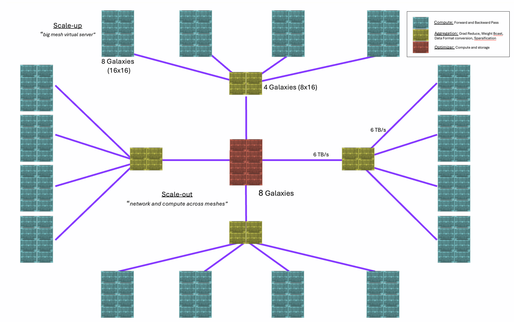
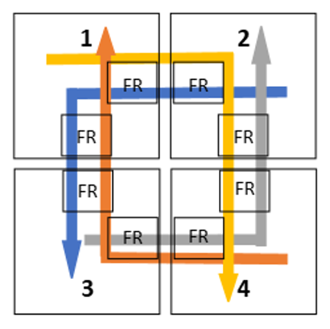

# TT-Fabric Architecture Specification

Version 1.0

Revision 2.0

Authors: TT-Metalium Scale-Out Team

For questions and comments please use the [TT-Metalium Scale-Out Discord Server](https://discord.com/channels/863154240319258674/1321621251269328956)


## Table of Contents
[1. Overview](#overview)

[1.1. Operational Structure](#structure)

[1.1.1. Data Plane](#dataplane)

[1.1.2. Control Plane](#controlplane)

[1.2. Some Additional Notes](#notes)

[2. TT-Fabric Network Layers](#fabric_layers)

[2.1. Layers 1, 2](#layer_12)

[2.2. TT-routing (Layer 3)](#layer_3)

[2.2.1. Routing Tables](#routing_tables)

[2.2.1.1. L0 Routing (Intra-Mesh)](#intramesh)

[2.2.1.1.1. L0 Routing Table Setup](#intramesh_setup)

[2.2.1.2. L1 Routing (Inter-Mesh)](#intermesh)

[2.2.1.2.1. L1 Routing Table Setup](#intermesh_setup)

[2.2.2. Routing Planes](#routing_planes)

[2.3. TT-transport (Layer 4)](#layer_4)

[2.3.1. Dateline Virtual Channel](#dvc)

[2.3.2. Control Virtual Channel](#cvc)

[2.4. TT-session (Layer 5)](#layer_5)

[3. Fabric Router](#router)

[3.1. Buffers and Virtual Channels](#rb_per_vc)

[3.1.1. 1D Line Virtual Channel](#1dlvc)

[3.1.2. 2D Mesh Virtual Channel](#2dmvc)

[4. API Specification](#rw_api)

[5. Sockets over TT-Fabric](#socket_api)

[6. Deadlock Avoidance and Mitigation](#deadlocks)

[6.1. Dimension Ordered Routing](#dim_order_routing)

[6.2. Dateline Virtual Channel](#fab_vcs)

[7. TT-Fabric Roadmap](#roadmap)

[7.1. Fabric Node Status Mailbox](#statusqueue)

[7.2. Time To Live (TTL)](#ttl)

[7.3. Timeout](#timeout)

[7.4. Reliability](#reliability)

[7.4.1. Automatic Traffic Rerouting](#rerouting)

[7.4.1.1. Ethernet Fallback Channels (EFC)](#efc)

[7.5. TT-Fabric Model](#model)

[7.5.1. Serialization and Visualization](#visualization)

[7.5.2. Data Plane Simulator](#simulator)

[7.5.3. Modelling External Disruptors and Buffer Limits](#disruptors)

# 1 Overview <a id="overview"></a>



TT-fabric is a revolutionary approach to AI infrastructure, built around the Tenstorrent Galaxy as its core component.

* Tenstorrent Galaxy:
  + A comprehensive AI building block in a 6U form factor
  + Features (Blackhole):
    - Massive AI compute: 24 PFLOPs
    - Large high-speed memory: 1 TB capacity at 16 TB/s BW
    - Switch capabilities with industry-leading I/O: 11.5 TB/s
* TT-fabric leverages Galaxy to create a unified networking fabric that:
  + Integrates scale-up (building large servers) and scale-out (connecting large servers into a network) architectures into a single unified architecture
  + Provides a complete data-plane solution for deep learning AI training, covering:
    - Core Compute: Forward propagation and Backward propagation
    - Aggregation: Gradient reduction, Weight broadcasting, Sparse Embedding Gradient Sorting, Top-K expert sorting
    - Parameter server, optimizer compute and storage
* Key advantages:
  + Flexibility to build both powerful individual servers and expansive server networks
  + Entire back-end (data-plane) network can be constructed using only Galaxy boxes in a 4x8 configuration
  + Offers a scalable and unified approach to AI infrastructure design
  + 10x TCO advantages for AI data training data center design

The purpose of this document is to provide detailed architecture specification of TT-Fabric. TT-Fabric is Tenstorrent’s implementation of a mesh interconnect that enables AI accelerator devices to communicate with each other. TT-Fabric provides infrastructure to scale-up and scale-out AI accelerators into large meshes.

At its core TT-Fabric can be envisioned as a networking stack with multiple layers. The following diagram shows TT-Fabric stack side by side with other network stacks for reference.


## 1.1 Operational Structure <a id="structure"></a>

TT-Fabric is broadly structured to function in two operational planes. Data Plane and Control Plane as described in the following sections.

### 1.1.1 Data Plane <a id="dataplane"></a>

Data plane refers to the data communication network over which devices exchange information. In other words, Data Plane implements the layered TT-Fabric network stack shown in the figure above.

Data Plane uses the NOC for intra device routing. For inter device routing, data plane uses point-to-point ethernet link between the devices. Data transfer started by a fabric client may take several NOC and ethernet hops before it gets to its intended destination.

Any device-to-device communication in TT-Fabric requires a properly functioning Data Plane.

### 1.1.2 Control Plane <a id="controlplane"></a>

Control plane refers to a secondary interconnect that is used to launch and configure TT-Fabric software and firmware onto all the worker components. In other words, Control Plane is used to set up and launch the Data Plane.

The control plane is persistent, always functional and does not rely on a properly functioning Data Plane. If control plane access to a device is compromised, TT-Fabric cannot operate reliably and requires reboot of control plane to restore compromised connectivity.

On Wormhole (Quanta) and Blackhole devices, PCIe provides the control plane.

After launching TT-Fabric on devices, the control continuously plane monitors the system. Any anomalies encountered by Fabric components are reported to control plane for user visibility and action.

Some examples of information generated by TT-Fabric are:

* Ethernet link down
* Observed data rates by different fabric routers
* Dropped packets
* Routing errors

Some examples of user or control plane actions based on TT-Fabric status are:

* Pause, flush, resume traffic in fabric routers
* Reconfigure routing tables
* Remove rows or columns of mesh devices if links or chips are not functional
* Relaunch workloads from a checkpoint after correcting TT-Fabric errors

## 1.2 Some Additional Notes <a id="notes"></a>

AI accelerators are referred to as Devices for the remainder of this document. A device can be a Wormhole, Blackhole etc.

TT-Fabric implementation is specific to Tenstorrent hardware and is intended to be deployable on current and future generations of Tenstorrent devices. TT-fabric is a software/firmware implementation that utilizes NOC and Ethernet capabilities of devices to build a mesh wide communication network.

TT-Fabric is deployed on a mesh of homogeneous devices. This means that a cluster cannot contain a mix of different device architectures.

TT-Fabric may support third party hardware in future but is currently outside the scope of this document.

# 2 TT-Fabric Network Layers <a id="fabric_layers"></a>

This section describes the operation of different layers in TT-Fabric network stack.

## 2.1 Layers 1, 2 <a id="layer_12"></a>

Tenstorrent devices implement Layers 1 and 2 of the network stack in hardware.

At Layer 2, Tenstorrent ethernet controllers can operate in compliance mode where the payload is encapsulated in standard Ethernet frames as shown in the following figure.


In this mode Ethernet MAC drops packets that are received with errors. It is left to higher network layers such as layer 4 to implement data retransmission.

Alternatively, ethernet controllers can operate in TT-link mode. In this mode, ethernet controllers implement a Logical Link Control (LLC) sublayer of the standard OSI Layer 2. LLC is implemented in TT-link mode by adding a custom 16-Byte Tenstorrent TT-link header to user payload. This header implements two important LLC features.

* Payload destination address in Receiver’s TT-routing layer
* Go-Back-N ARQ protocol

The following diagram shows how TT-link mode encapsulates user payload into ethernet frame.


In TT-link mode, ethernet controller forwards the received data to TT-routing layer at the address specified in TT-link header as opposed to compliance mode, where data is left in ethernet controller’s receive buffer and requires Layer 3 software to read it out.

tx seq and rx seq fields in TT-link header are used by sender and receiver to communicate sequence numbers for transmitted and received ethernet frames. In case the sequence numbers diverge from expected values, because of MAC errors, Go-Back-N ARQ restarts transmission from the last successfully received ethernet frame.

TT-link mode ensures that TT-routing and upper layers never see data loss due to ethernet frame CRC errors. Any TT-routing payload that is accepted by TT-link layer is guaranteed to be delivered to TT-routing layer on the receiver side.

TT-link layer headers are automatically inserted on the send side and stripped when data is delivered to TT-routing on receiver.

TT-Fabric requires ethernet controllers to operate in TT-link mode.

## 2.2 TT-routing (Layer 3) <a id="layer_3"></a>

TT-Routing layer is the first software layer in TT-Fabric stack and is responsible for routing packets in the network. A packet requiring an inter-chip hop is forwarded to Layer 2 where it gets encapsulated by hardware into ethernet frames and forwarded over ethernet link.
A packet requiring an intra-chip hop is forded over NOC.

A device in the fabric network is addressed by MeshId and DeviceId fields in the packet header. Fabric router uses these fields to make routing decisions.

A packet's route can be determined by looking up routing tables in a router, or the packet can be source routed meaning the route is embedded into the packet header by a packet source. Within a mesh, packets are always source routed. At every hop, routers examine the packet header for source route fields and determine the necessary actions to process the packet. Source route in packet header is set by a worker that is injecting the packet into fabric. If the fabric contains a single mesh, then only the workers that connect to fabric to send traffic are the ones that populate source route in the packet header. The source route, once set by sending worker, never needs to be updated since a worker is always able to fully determine the route to any other device in the mesh.

When there are multiple meshes in fabric, then a packet's source route is set by the sending worker as well as at every other mesh entry point. For an inter-mesh packet the sending worker sets the packet source route to its local mesh's exit node. When the packet crosses the mesh boundary, the entry node fabric router in the next mesh calculates a new source route and updates the packet header. The new source route determines how the packet will traverse the new mesh. If the packet is destined for current mesh, the source route is the path to destination device in the current mesh. If the packet is destined for yet another mesh, the source route generated by the mesh entry node router is to an exit node of the current mesh. This exit node is along the path to the destination mesh specified in the packet header.

TT-Routing also implements automatic rerouting incase of an ethernet link failure. Rerouting is implemented within the TT-routing layer and is invisible to the upper layers of the stack.
TT-Fabric control plane monitors ethernet links and in case of an outage, it notifies the affected fabric routers to reroute their traffic over a different available router, that is connected in the same direction as the affected routers.
User workload on data plane encounters a temporary pause in activity. If TT-Fabric control plane and routers are able to setup a reroute, workload resumes operation at a lower data rate. In case alternate route is not possible, tt-fabric control plane can take other mitigating actions such as notifying the user application.


### 2.2.1 Routing Tables <a id="routing_tables"></a>

TT-Fabric allows a maximum scale out to 250,000 devices. Devices are connected in groups of meshes and we support upto 1024 meshes of 256 devices each.

A mesh is a fully and uniformaly connected grid of chips. Uniform connectivity means that all devices in the mesh have the same number of ethernet connections to all of their neighbors.

Inter-Mesh connectivity is provided through subset of devices called exit nodes. A mesh may be connected to multiple neighboring meshes in which case there are exit nodes providing routes to different neighboring meshes.

To support this topology, we need two levels of routing:

* L0 or Intra-Mesh routing (scale-up)
* L1 or Inter-Mesh routing (scale-out)

Fabric routers have fully instantiated routing tables indexed with Device Id or Mesh Id. This means that a router can look up a route to any Device or Mesh from its routing tables.

An intra-mesh routing table entry is a source route to a mesh destination. This destination can be the packet's final destination or it can be an exit node in case of in inter-mesh packet.

An inter-mesh routing table entry is an exit node in the current mesh.

#### 2.2.1.1 L0 Routing (Intra-Mesh a.k.a Scale-up) <a id="intramesh"></a>

When a packet’s destination is within the local mesh, the route is looked up from L0 routing table at packet source and embedded into the packet header.

At every hop, a fabric router inspects the packet header source route entry to process the incoming packet.

Every hop moves the packet towards the destination device in local mesh.

L0 routing table example:

| **DeviceId** | **Source Route** |
| --- | --- |
| 0 | Route to 0 |
| 1 | Route to 1 |
| 2 | Route to 2 |
| ... |  |
| 255 | Rotue to 255 |

##### 2.2.1.1.1 L0 Routing Table Setup <a id="intramesh_setup"></a>

The following figure shows a 4 mesh cluster. Each mesh has 9 devices. Each device shows which of its nodes are connected to its neighbor.

```
                   Mesh 0                                                 Mesh 1
┌──────┬──────┬──────┬──────┬──────┬──────┐            ┌──────┬──────┬──────┬──────┬──────┬──────┐
│      █      │      █      │      █      │            │      █      │      █      │      █      │
│   0  N      │   1  N      │   2  N      │            │   0  N      │   1  N      │   2  N      │
├█W         E█┼█W         E█┼█W         E█┤            ├█W         E█┼█W         E█┼█W         E█┤
│      S      │      S      │      S      │            │      S      │      S      │      S      │
│      █      │      █      │      █      │            │      █      │      █      │      █      │
├──────┼──────┼──────┼──────┼──────┼──────┤            ├──────┼──────┼──────┼──────┼──────┼──────┤
│      █      │      █      │      █      │            │      █      │      █      │      █      │
│   3  N      │   4  N      │   5  N      │            │   3  N      │   4  N      │   5  N      │
├█W         E█┼█W         E█┼█W         E█┼◀══════════▶┼█W         E█┼█W         E█┼█W         E█┤
│      S      │      S      │      S      │            │      S      │      S      │      S      │
│      █      │      █      │      █      │            │      █      │      █      │      █      │
├──────┼──────┼──────┼──────┼──────┼──────┤            ├──────┼──────┼──────┼──────┼──────┼──────┤
│      █      │      █      │      █      │            │      █      │      █      │      █      │
│   6  N      │   7  N      │   8  N      │            │   6  N      │   7  N      │   8  N      │
├█W         E█┼█W         E█┼█W         E█┤            ├█W         E█┼█W         E█┼█W         E█┤
│      S      │      S      │      S      │            │      S      │      S      │      S      │
│      █      │      █      │      █      │            │      █      │      █      │      █      │
└──────┼──────┴──────┴──────┴──────┼──────┘            └──────┴──────┴──────┴──────┴──────┼──────┘
       ▲                           ▲                                                      ▲
       ║                           ║                                                      ║
       ▼           Mesh 2          ▼                                      Mesh 3          ▼
┌──────┼──────┬──────┬──────┬──────┼──────┐            ┌──────┬──────┬──────┬──────┬──────┼──────┐
│      █      │      █      │      █      │            │      █      │      █      │      █      │
│   0  N      │   1  N      │   2  N      │            │   0  N      │   1  N      │   2  N      │
├█W         E█┼█W         E█┼█W         E█┤            ├█W         E█┼█W         E█┼█W         E█┤
│      S      │      S      │      S      │            │      S      │      S      │      S      │
│      █      │      █      │      █      │            │      █      │      █      │      █      │
├──────┼──────┼──────┼──────┼──────┼──────┤            ├──────┼──────┼──────┼──────┼──────┼──────┤
│      █      │      █      │      █      │            │      █      │      █      │      █      │
│   3  N      │   4  N      │   5  N      │            │   3  N      │   4  N      │   5  N      │
├█W         E█┼█W         E█┼█W         E█┤            ├█W         E█┼█W         E█┼█W         E█┤
│      S      │      S      │      S      │            │      S      │      S      │      S      │
│      █      │      █      │      █      │            │      █      │      █      │      █      │
├──────┼──────┼──────┼──────┼──────┼──────┤            ├──────┼──────┼──────┼──────┼──────┼──────┤
│      █      │      █      │      █      │            │      █      │      █      │      █      │
│   6  N      │   7  N      │   8  N      │            │   6  N      │   7  N      │   8  N      │
├█W         E█┼█W         E█┼█W         E█┼◀══════════▶┼█W         E█┼█W         E█┼█W         E█┤
│      S      │      S      │      S      │            │      S      │      S      │      S      │
│      █      │      █      │      █      │            │      █      │      █      │      █      │
└──────┴──────┴──────┴──────┴──────┴──────┘            └──────┴──────┴──────┴──────┴──────┴──────┘
```

The intra-mesh routing table for devices on Mesh 0 is shown below. Each row labeled 0 to 8 in Source Device group is the L0 routing table for the respective device on Mesh 0. This routing table is set up with dimension ordered routing. Packets go X dimension first then Y.

| Src\Dst | 0    | 1   | 2    | 3   | 4  | 5   | 6    | 7   | 8    |
| ------- | ---- | --- | ---- | --- | -- | --- | ---- | --- | ---- |
| 0       | -    | E   | EE   | S   | ES | EES | SS   | ESS | EESS |
| 1       | W    | -   | E    | WS  | S  | ES  | WSS  | SS  | ESS  |
| 2       | WW   | W   | -    | WWS | WS | S   | WWSS | WSS | SS   |
| 3       | N    | EN  | EEN  | -   | E  | EE  | S    | ES  | EES  |
| 4       | WN   | N   | EN   | W   | -  | E   | WS   | S   | ES   |
| 5       | WWN  | WN  | N    | WW  | W  | -   | WWS  | WS  | S    |
| 6       | NN   | ENN | EENN | N   | EN | EEN | -    | E   | EE   |
| 7       | WNN  | NN  | ENN  | WN  | N  | EN  | W    | -   | E    |
| 8       | WWNN | WNN | NN   | WWN | WN | N   | WW   | W   | -    |


#### 2.2.1.2 L1 Routing (Inter-Mesh a.k.a Scale-out) <a id="intermesh"></a>

When a packet is not addressed to local mesh, an exit node in the direction of destination mesh is looked up from L1 routing table. The packet route to the exit node is then looked up from L0 routing table.

Source route in packet header is updated by packet source where the traffic originates. At every mesh crossing, the mesh entry fabric router embeds a new source route that specifies current mesh's traversal route.

Once the packet reaches its destination mesh, source route set by destination mesh entry node is a path to the destination device and not an exit node.

Depending on whether the packet has reached its destination mesh or not, every hop moves the packet towards destination device or an exit node in respective mesh.

L1 routing table example:

| **MeshId** | **Exit Node** |
| --- | --- |
| 0 | 4 |
| 1 | 4 |
| 2 | 9 |
| ... |  |
| 1023 | 9 |

##### 2.2.1.2.1 L1 Routing Table Setup <a id="intermesh_setup"></a>

For the same 4 Mesh cluster mentioned in previous section, L1 routing table for devices on each of the 4 meshes is shown in the following table. Each row labeled 0 to 8 is L1 routing table for respective device in respective source mesh.

| Src Mesh | Node | Mesh0 | Mesh1 | Mesh2 | Mesh3 |
| -------- | ---- | ----- | ----- | ----- | ----- |
| 0        | 0    | -     | 5     | 6     | 5     |
| 0        | 1    | -     | 5     | 6     | 5     |
| 0        | 2    | -     | 5     | 8     | 5     |
| 0        | 3    | -     | 5     | 6     | 5     |
| 0        | 4    | -     | 5     | 6     | 5     |
| 0        | 5    | -     | 5     | 8     | 5     |
| 0        | 6    | -     | 5     | 6     | 5     |
| 0        | 7    | -     | 5     | 6     | 5     |
| 0        | 8    | -     | 5     | 8     | 5     |
| 1        | 0    | 3     | -     | 3     | 8     |
| 1        | 1    | 3     | -     | 3     | 8     |
| 1        | 2    | 3     | -     | 3     | 8     |
| 1        | 3    | 3     | -     | 3     | 8     |
| 1        | 4    | 3     | -     | 3     | 8     |
| 1        | 5    | 3     | -     | 3     | 8     |
| 1        | 6    | 3     | -     | 3     | 8     |
| 1        | 7    | 3     | -     | 3     | 8     |
| 1        | 8    | 3     | -     | 3     | 8     |
| 2        | 0    | 0     | 0     | -     | 8     |
| 2        | 1    | 0     | 0     | -     | 8     |
| 2        | 2    | 2     | 2     | -     | 8     |
| 2        | 3    | 0     | 0     | -     | 8     |
| 2        | 4    | 0     | 0     | -     | 8     |
| 2        | 5    | 2     | 2     | -     | 8     |
| 2        | 6    | 0     | 0     | -     | 8     |
| 2        | 7    | 0     | 0     | -     | 8     |
| 2        | 8    | 2     | 2     | -     | 8     |
| 3        | 0    | 2     | 2     | 2     | -     |
| 3        | 1    | 2     | 2     | 2     | -     |
| 3        | 2    | 2     | 2     | 2     | -     |
| 3        | 3    | 2     | 2     | 2     | -     |
| 3        | 4    | 2     | 2     | 2     | -     |
| 3        | 5    | 2     | 2     | 2     | -     |
| 3        | 6    | 2     | 2     | 2     | -     |
| 3        | 7    | 2     | 2     | 2     | -     |
| 3        | 8    | 2     | 2     | 2     | -     |


There is no direct route between M0, M3 or M1, M2. Traffic from M0 to M3 will traverse either M1 or M2 on its way to M3. Control plane uses directed acyclic graph routing to make sure there are no cycles when routing traffic between meshes that do not have direct connections.


### 2.2.2 Routing Planes <a id="routing_planes"></a>

Tenstorrent devices support multiple ethernet links for routing in any direction. On WH, for each of the East, West, North, South directions, we have 4 ethernet links. BH, similarly has 2, and potentially another 2 for Up or Down direction for 3D meshes. Multiple ethernet links means we have more than one TT-Fabric route to a destination. To support multiple routes while keeping the traffic patterns deterministic, we are introducing the concept of Routing Planes. The multiple ethernet ports in each direction are one to one mapped, such that the first ethernet port on any edge only routes over first ethernet port of the other edges. Similarly, the second ethernet port only routes over the second ethernet port of the other edges. This keeps the traffic contained within its routing plane and there is no cross talk between the routing planes. TT-Fabric clients can specify the routing plane when issuing transactions. In general, the number of routing planes is the same as the number of available parallel ethernet ports per direction on a device. For WH it is four while for BH it is two.

The following diagram shows how the four ethernet ports per direction on WH mesh form four separate routing planes. The diagram shows four WH devices.


## 2.3 TT-transport (Layer 4) <a id="layer_4"></a>

TT-Transport implements virtual channels that are used to carry packets in the routing netowrk. A virtual channel is composed of multiple buffers where each buffer holds packets packets from a dedicated source. Virtual channel buffer size depends upon amount of available SRAM space on fabric router. Traffic from multiple sources on a virtual channel serialized. All traffic on the same virtual channel is guaranteed to be ordered. TT-Fabric currently supports 1 user visible virtual channel per router.

### 2.3.1 Dateline Virtual Channel <a id="dvc"></a>

To avoid cyclic dependency deadlocks on Ring/Torus topologies, TT-Fabric has an internal dateline virtual channel. TT-Session APIs can only inject traffic into the data virtual channels. When packets cross the dateline, tt-fabric routers automatically switch the packet flow to the dateline virtual channel to avoid deadlock.

### 2.3.2 Control Virtual Channel <a id="cvc"></a>

TT-Fabric uses a dedicated virtual channel to route all control messages in the system. This prevents control traffic from interfering and competing with data traffic.

Control messages are small, fixed size packets and can be routed more efficiently by using a dedicated control virtual channel that is smaller than data virtual channel.

## 2.4 TT-session (Layer 5) <a id="layer_5"></a>

TT-Session layer provides the APIs for higher level user programs/kernels to connect and send data over TT-Fabric. Any data sent over fabric is encapsulated in independent, asynchronous packets. A packet specifies the complete destination memory address where the data must be written.

TT-session does not natively support synchronous transfer of data where data sender and data receiver need some kind of flow control.
Synchronous data transfer however is possible via sockets over fabric. We have implemented send/receive operations that use tt-fabric to exchange data as well as flow control messages. Sockets over tt-fabric are described later in this document.

# 3 Fabric Router <a id="router"></a>

Fabric Router implements all runtime TT-Fabric network stack functions. A fabric router can be mapped onto a single RISCV processor or the overall router functionality can be broken up into separate functions and maped onto multiple RISCV processors.
On Wromhole, Ethernet core RISCv performs all of the fabric netowrk stack functions. Blackhole Ethernet core supports 2 RISCv processors and fabric router functions are mapped to both processors.
The core function of a fabric router is to receive packets from ethernet and local device's worker and make a forwarding decision. A conbination of routing table lookup and source routing is used to make a forwarding decision. If a packet is to be consumed locally then the NOC command section of the packet header specifies how to process the packet payload locally.

Fabric routers can be built for different kinds of TT-Fabric topologies. A topology specifies how the TT-Fabric logical routing network should be created on a set of physically connected devices. TT-Fabric topology is specific to application requirements. For example the devcies may be physically connected in a 2D ethernet grid however the user application is such that the devices only communicate with other devices in the same row or column. In this case, Fabric routers only need to route traffic on one axis and packet flow does not switch from row to column or vice versa. We call this a 1D Fabric. TT-Fabric can also be launched in a 2D routing mode where turns between rows and columns are supported. In addition to these simple line and mesh topologies, TT-Fabric supports rings and 2D toruses. A ring is where the two endpoints of every line (in a 1D Fabric) are also connected. A 2D torus connects every row and column endpoints of a 2D mesh.

TT-Fabric topology can be an exact match of the physical connection topology, or it can be a functionally downshifted topology where all available ethernet links are not utilized.

The following diagrams show the supported 1D and 2D TT-Fabric topologies.

Only a single routing lane is shown in the following diagrams. Fabric network gets replicated on all the available routing planes in the system.

**8x4 Galaxy with TT-Fabric in 1D Line Topology**
```
                █  : Fabric Router
                ┄┄ : 1-D Row Line Fabric. There are 8 independent line fabric instances.
                ┇  : 1-D Column Line Fabric. There are 4 independent line fabric instances.
                ╔═════════════╦═════════════╦═════════════╦═════════════╗
                ║0            ║1            ║2            ║3            ║
                ║             ║             ║             ║             ║
                ║            █╬█┄┄┄┄┄┄┄┄┄┄┄█╬█┄┄┄┄┄┄┄┄┄┄┄█╬█            ║
                ║             ║             ║             ║             ║
                ║      █      ║      █      ║      █      ║      █      ║
                ╠══════╬══════╬══════╬══════╬══════╬══════╬══════╬══════╣
                ║4     █      ║5     █      ║6     █      ║7     █      ║
                ║      ┇      ║      ┇      ║      ┇      ║      ┇      ║
                ║      ┇     █╬█┄┄┄┄┄┇┄┄┄┄┄█╬█┄┄┄┄┄┇┄┄┄┄┄█╬█     ┇      ║
                ║      ┇      ║      ┇      ║      ┇      ║      ┇      ║
                ║      █      ║      █      ║      █      ║      █      ║
                ╠══════╬══════╬══════╬══════╬══════╬══════╬══════╬══════╣
                ║8     █      ║9     █      ║10    █      ║11    █      ║
                ║      ┇      ║      ┇      ║      ┇      ║      ┇      ║
                ║      ┇     █╬█┄┄┄┄┄┇┄┄┄┄┄█╬█┄┄┄┄┄┇┄┄┄┄┄█╬█     ┇      ║
                ║      ┇      ║      ┇      ║      ┇      ║      ┇      ║
                ║      █      ║      █      ║      █      ║      █      ║
                ╠══════╬══════╬══════╬══════╬══════╬══════╬══════╬══════╣
                ║12    █      ║13    █      ║14    █      ║15    █      ║
                ║      ┇      ║      ┇      ║      ┇      ║      ┇      ║
                ║      ┇     █╬█┄┄┄┄┄┇┄┄┄┄┄█╬█┄┄┄┄┄┇┄┄┄┄┄█╬█     ┇      ║
                ║      ┇      ║      ┇      ║      ┇      ║      ┇      ║
                ║      █      ║      █      ║      █      ║      █      ║
                ╠══════╬══════╬══════╬══════╬══════╬══════╬══════╬══════╣
                ║16    █      ║17    █      ║18    █      ║19    █      ║
                ║      ┇      ║      ┇      ║      ┇      ║      ┇      ║
                ║      ┇     █╬█┄┄┄┄┄┇┄┄┄┄┄█╬█┄┄┄┄┄┇┄┄┄┄┄█╬█     ┇      ║
                ║      ┇      ║      ┇      ║      ┇      ║      ┇      ║
                ║      █      ║      █      ║      █      ║      █      ║
                ╠══════╬══════╬══════╬══════╬══════╬══════╬══════╬══════╣
                ║20    █      ║21    █      ║22    █      ║23    █      ║
                ║      ┇      ║      ┇      ║      ┇      ║      ┇      ║
                ║      ┇     █╬█┄┄┄┄┄┇┄┄┄┄┄█╬█┄┄┄┄┄┇┄┄┄┄┄█╬█     ┇      ║
                ║      ┇      ║      ┇      ║      ┇      ║      ┇      ║
                ║      █      ║      █      ║      █      ║      █      ║
                ╠══════╬══════╬══════╬══════╬══════╬══════╬══════╬══════╣
                ║24    █      ║25    █      ║26    █      ║27    █      ║
                ║      ┇      ║      ┇      ║      ┇      ║      ┇      ║
                ║      ┇     █╬█┄┄┄┄┄┇┄┄┄┄┄█╬█┄┄┄┄┄┇┄┄┄┄┄█╬█     ┇      ║
                ║      ┇      ║      ┇      ║      ┇      ║      ┇      ║
                ║      █      ║      █      ║      █      ║      █      ║
                ╠══════╬══════╬══════╬══════╬══════╬══════╬══════╬══════╣
                ║28    █      ║29    █      ║30    █      ║31    █      ║
                ║             ║             ║             ║             ║
                ║            █╬█┄┄┄┄┄┄┄┄┄┄┄█╬█┄┄┄┄┄┄┄┄┄┄┄█╬█            ║
                ║             ║             ║             ║             ║
                ║             ║             ║             ║             ║
                ╚═════════════╩═════════════╩═════════════╩═════════════╝
```

**8x4 Galaxy with TT-Fabric in 1D Ring Topology**
```
                █  : Fabric Router
                ┄┄ : 1-D Row Ring Fabric. There are 8 independent ring instances.
                ┇  : 1-D Column Ring Fabric. There are 4 independent ring instances.
            ┌┄┄┄┄┄┄┄┄┄┄┄┄┄┄┄┄┄┄┄┄┄┄┄┄┄┄┄┄┄┄┄┄┄┄┄┄┄┄┄┄┄┄┄┄┄┄┄┄┄┄┄┄┄┄┄┄┄┄┄┄┄┐
            ┊         ┌●            ┌○            ┌◎            ┌┅┅┅┅┅┅┅┅┅┅┅┅┐
            ┊         ┇             ┇             ┇             ┇         ┊  ┇
            ┊  ╔══════╬══════╦══════╬══════╦══════╬══════╦══════╬══════╗  ┊  ┇
            ┊  ║0     █      ║1     █      ║2     █      ║3     █      ║  ┊  ┇
            ┊  ║      ┇      ║      ┇      ║      ┇      ║      ┇      ║  ┊  ┇
            └┄┄╬█┄┄┄┄┄┇┄┄┄┄┄█╬█┄┄┄┄┄┇┄┄┄┄┄█╬█┄┄┄┄┄┇┄┄┄┄┄█╬█┄┄┄┄┄┇┄┄┄┄┄█╬┄┄┘  ┇
               ║      ┇      ║      ┇      ║      ┇      ║      ┇      ║     ┇
               ║      █      ║      █      ║      █      ║      █      ║     ┇
               ╠══════╬══════╬══════╬══════╬══════╬══════╬══════╬══════╣     ┇
               ║4     █      ║5     █      ║6     █      ║7     █      ║     ┇
            ★  ║      ┇      ║      ┇      ║      ┇      ║      ┇      ║  ★  ┇
            └┄┄╬█┄┄┄┄┄┇┄┄┄┄┄█╬█┄┄┄┄┄┇┄┄┄┄┄█╬█┄┄┄┄┄┇┄┄┄┄┄█╬█┄┄┄┄┄┇┄┄┄┄┄█╬┄┄┘  ┇
               ║      ┇      ║      ┇      ║      ┇      ║      ┇      ║     ┇
               ║      █      ║      █      ║      █      ║      █      ║     ┇
               ╠══════╬══════╬══════╬══════╬══════╬══════╬══════╬══════╣     ┇
               ║8     █      ║9     █      ║10    █      ║11    █      ║     ┇
            ☆  ║      ┇      ║      ┇      ║      ┇      ║      ┇      ║  ☆  ┇
            └┄┄╬█┄┄┄┄┄┇┄┄┄┄┄█╬█┄┄┄┄┄┇┄┄┄┄┄█╬█┄┄┄┄┄┇┄┄┄┄┄█╬█┄┄┄┄┄┇┄┄┄┄┄█╬┄┄┘  ┇
               ║      ┇      ║      ┇      ║      ┇      ║      ┇      ║     ┇
               ║      █      ║      █      ║      █      ║      █      ║     ┇
               ╠══════╬══════╬══════╬══════╬══════╬══════╬══════╬══════╣     ┇
               ║12    █      ║13    █      ║14    █      ║15    █      ║     ┇
            ✦  ║      ┇      ║      ┇      ║      ┇      ║      ┇      ║  ✦  ┇
            └┄┄╬█┄┄┄┄┄┇┄┄┄┄┄█╬█┄┄┄┄┄┇┄┄┄┄┄█╬█┄┄┄┄┄┇┄┄┄┄┄█╬█┄┄┄┄┄┇┄┄┄┄┄█╬┄┄┘  ┇
               ║      ┇      ║      ┇      ║      ┇      ║      ┇      ║     ┇
               ║      █      ║      █      ║      █      ║      █      ║     ┇
               ╠══════╬══════╬══════╬══════╬══════╬══════╬══════╬══════╣     ┇
               ║16    █      ║17    █      ║18    █      ║19    █      ║     ┇
            ✧  ║      ┇      ║      ┇      ║      ┇      ║      ┇      ║  ✧  ┇
            └┄┄╬█┄┄┄┄┄┇┄┄┄┄┄█╬█┄┄┄┄┄┇┄┄┄┄┄█╬█┄┄┄┄┄┇┄┄┄┄┄█╬█┄┄┄┄┄┇┄┄┄┄┄█╬┄┄┘  ┇
               ║      ┇      ║      ┇      ║      ┇      ║      ┇      ║     ┇
               ║      █      ║      █      ║      █      ║      █      ║     ┇
               ╠══════╬══════╬══════╬══════╬══════╬══════╬══════╬══════╣     ┇
               ║20    █      ║21    █      ║22    █      ║23    █      ║     ┇
            ✩  ║      ┇      ║      ┇      ║      ┇      ║      ┇      ║  ✩  ┇
            └┄┄╬█┄┄┄┄┄┇┄┄┄┄┄█╬█┄┄┄┄┄┇┄┄┄┄┄█╬█┄┄┄┄┄┇┄┄┄┄┄█╬█┄┄┄┄┄┇┄┄┄┄┄█╬┄┄┘  ┇
               ║      ┇      ║      ┇      ║      ┇      ║      ┇      ║     ┇
               ║      █      ║      █      ║      █      ║      █      ║     ┇
               ╠══════╬══════╬══════╬══════╬══════╬══════╬══════╬══════╣     ┇
               ║24    █      ║25    █      ║26    █      ║27    █      ║     ┇
            ✪  ║      ┇      ║      ┇      ║      ┇      ║      ┇      ║  ✪  ┇
            └┄┄╬█┄┄┄┄┄┇┄┄┄┄┄█╬█┄┄┄┄┄┇┄┄┄┄┄█╬█┄┄┄┄┄┇┄┄┄┄┄█╬█┄┄┄┄┄┇┄┄┄┄┄█╬┄┄┘  ┇
               ║      ┇      ║      ┇      ║      ┇      ║      ┇      ║     ┇
               ║      █      ║      █      ║      █      ║      █      ║     ┇
               ╠══════╬══════╬══════╬══════╬══════╬══════╬══════╬══════╣     ┇
               ║28    █      ║29    █      ║30    █      ║31    █      ║     ┇
            ✬  ║      ┇      ║      ┇      ║      ┇      ║      ┇      ║  ✬  ┇
            └┄┄╬█┄┄┄┄┄┇┄┄┄┄┄█╬█┄┄┄┄┄┇┄┄┄┄┄█╬█┄┄┄┄┄┇┄┄┄┄┄█╬█┄┄┄┄┄┇┄┄┄┄┄█╬┄┄┘  ┇
               ║      ┇      ║      ┇      ║      ┇      ║      ┇      ║     ┇
               ║      █      ║      █      ║      █      ║      █      ║     ┇
               ╚══════╬══════╩══════╬══════╩══════╬══════╩══════╬══════╝     ┇
                      ┇             ┇             ┇             ┇            ┇
                      └●            └○            └◎            └┅┅┅┅┅┅┅┅┅┅┅┅┘

```

**8x4 Galaxy with TT-Fabric in 2D Mesh Topology**
```
                █  : Fabric Router
                ── : 2-D Mesh Fabric. One fabric network connects all 32 devices.
                ╔═════════════╦═════════════╦═════════════╦═════════════╗
                ║0            ║1            ║2            ║3            ║
                ║             ║             ║             ║             ║
                ║      ┌─────█╬█─────┬─────█╬█─────┬─────█╬█─────┐      ║
                ║      │      ║      │      ║      │      ║      │      ║
                ║      █      ║      █      ║      █      ║      █      ║
                ╠══════╬══════╬══════╬══════╬══════╬══════╬══════╬══════╣
                ║4     █      ║5     █      ║6     █      ║7     █      ║
                ║      │      ║      │      ║      │      ║      │      ║
                ║      ├─────█╬█─────┼─────█╬█─────┼─────█╬█─────┤      ║
                ║      │      ║      │      ║      │      ║      │      ║
                ║      █      ║      █      ║      █      ║      █      ║
                ╠══════╬══════╬══════╬══════╬══════╬══════╬══════╬══════╣
                ║8     █      ║9     █      ║10    █      ║11    █      ║
                ║      │      ║      │      ║      │      ║      │      ║
                ║      ├─────█╬█─────┼─────█╬█─────┼─────█╬█─────┤      ║
                ║      │      ║      │      ║      │      ║      │      ║
                ║      █      ║      █      ║      █      ║      █      ║
                ╠══════╬══════╬══════╬══════╬══════╬══════╬══════╬══════╣
                ║12    █      ║13    █      ║14    █      ║15    █      ║
                ║      │      ║      │      ║      │      ║      │      ║
                ║      ├─────█╬█─────┼─────█╬█─────┼─────█╬█─────┤      ║
                ║      │      ║      │      ║      │      ║      │      ║
                ║      █      ║      █      ║      █      ║      █      ║
                ╠══════╬══════╬══════╬══════╬══════╬══════╬══════╬══════╣
                ║16    █      ║17    █      ║18    █      ║19    █      ║
                ║      │      ║      │      ║      │      ║      │      ║
                ║      ├─────█╬█─────┼─────█╬█─────┼─────█╬█─────┤      ║
                ║      │      ║      │      ║      │      ║      │      ║
                ║      █      ║      █      ║      █      ║      █      ║
                ╠══════╬══════╬══════╬══════╬══════╬══════╬══════╬══════╣
                ║20    █      ║21    █      ║22    █      ║23    █      ║
                ║      │      ║      │      ║      │      ║      │      ║
                ║      ├─────█╬█─────┼─────█╬█─────┼─────█╬█─────┤      ║
                ║      │      ║      │      ║      │      ║      │      ║
                ║      █      ║      █      ║      █      ║      █      ║
                ╠══════╬══════╬══════╬══════╬══════╬══════╬══════╬══════╣
                ║24    █      ║25    █      ║26    █      ║27    █      ║
                ║      │      ║      │      ║      │      ║      │      ║
                ║      ├─────█╬█─────┼─────█╬█─────┼─────█╬█─────┤      ║
                ║      │      ║      │      ║      │      ║      │      ║
                ║      █      ║      █      ║      █      ║      █      ║
                ╠══════╬══════╬══════╬══════╬══════╬══════╬══════╬══════╣
                ║28    █      ║29    █      ║30    █      ║31    █      ║
                ║      │      ║      │      ║      │      ║      │      ║
                ║      └─────█╬█─────┴─────█╬█─────┴─────█╬█─────┘      ║
                ║             ║             ║             ║             ║
                ║             ║             ║             ║             ║
                ╚═════════════╩═════════════╩═════════════╩═════════════╝
```

**8x4 Galaxy with TT-Fabric in 2D Torus Topology**
```
                █  : Fabric Router
                ── : 2-D Torus Fabric. One fabric network connects all 32 devices.
                     All rows and columns are rings.
             ┌─────────────────────────────────────────────────────────────┐
             │         ┌─●           ┌─○           ┌─◎           ┌────────────┐
             │         │             │             │             │         │  │
             │  ╔══════╬══════╦══════╬══════╦══════╬══════╦══════╬══════╗  │  │
             │  ║0     █      ║1     █      ║2     █      ║3     █      ║  │  │
             │  ║      │      ║      │      ║      │      ║      │      ║  │  │
             └──╬█─────┼─────█╬█─────┼─────█╬█─────┼─────█╬█─────┼─────█╬──┘  │
                ║      │      ║      │      ║      │      ║      │      ║     │
                ║      █      ║      █      ║      █      ║      █      ║     │
                ╠══════╬══════╬══════╬══════╬══════╬══════╬══════╬══════╣     │
                ║4     █      ║5     █      ║6     █      ║7     █      ║     │
             ★  ║      │      ║      │      ║      │      ║      │      ║  ★  │
             └──╬█─────┼─────█╬█─────┼─────█╬█─────┼─────█╬█─────┼─────█╬──┘  │
                ║      │      ║      │      ║      │      ║      │      ║     │
                ║      █      ║      █      ║      █      ║      █      ║     │
                ╠══════╬══════╬══════╬══════╬══════╬══════╬══════╬══════╣     │
                ║8     █      ║9     █      ║10    █      ║11    █      ║     │
             ☆  ║      │      ║      │      ║      │      ║      │      ║  ☆  │
             └──╬█─────┼─────█╬█─────┼─────█╬█─────┼─────█╬█─────┼─────█╬──┘  │
                ║      │      ║      │      ║      │      ║      │      ║     │
                ║      █      ║      █      ║      █      ║      █      ║     │
                ╠══════╬══════╬══════╬══════╬══════╬══════╬══════╬══════╣     │
                ║12    █      ║13    █      ║14    █      ║15    █      ║     │
             ✦  ║      │      ║      │      ║      │      ║      │      ║  ✦  │
             └──╬█─────┼─────█╬█─────┼─────█╬█─────┼─────█╬█─────┼─────█╬──┘  │
                ║      │      ║      │      ║      │      ║      │      ║     │
                ║      █      ║      █      ║      █      ║      █      ║     │
                ╠══════╬══════╬══════╬══════╬══════╬══════╬══════╬══════╣     │
                ║16    █      ║17    █      ║18    █      ║19    █      ║     │
             ✧  ║      │      ║      │      ║      │      ║      │      ║  ✧  │
             └──╬█─────┼─────█╬█─────┼─────█╬█─────┼─────█╬█─────┼─────█╬──┘  │
                ║      │      ║      │      ║      │      ║      │      ║     │
                ║      █      ║      █      ║      █      ║      █      ║     │
                ╠══════╬══════╬══════╬══════╬══════╬══════╬══════╬══════╣     │
                ║20    █      ║21    █      ║22    █      ║23    █      ║     │
             ✩  ║      │      ║      │      ║      │      ║      │      ║  ✩  │
             └──╬█─────┼─────█╬█─────┼─────█╬█─────┼─────█╬█─────┼─────█╬──┘  │
                ║      │      ║      │      ║      │      ║      │      ║     │
                ║      █      ║      █      ║      █      ║      █      ║     │
                ╠══════╬══════╬══════╬══════╬══════╬══════╬══════╬══════╣     │
                ║24    █      ║25    █      ║26    █      ║27    █      ║     │
             ✪  ║      │      ║      │      ║      │      ║      │      ║  ✪  │
             └──╬█─────┼─────█╬█─────┼─────█╬█─────┼─────█╬█─────┼─────█╬──┘  │
                ║      │      ║      │      ║      │      ║      │      ║     │
                ║      █      ║      █      ║      █      ║      █      ║     │
                ╠══════╬══════╬══════╬══════╬══════╬══════╬══════╬══════╣     │
                ║28    █      ║29    █      ║30    █      ║31    █      ║     │
             ✬  ║      │      ║      │      ║      │      ║      │      ║  ✬  │
             └──╬█─────┼─────█╬█─────┼─────█╬█─────┼─────█╬█─────┼─────█╬──┘  │
                ║      │      ║      │      ║      │      ║      │      ║     │
                ║      █      ║      █      ║      █      ║      █      ║     │
                ╚══════╬══════╩══════╬══════╩══════╬══════╩══════╬══════╝     │
                       │             │             │             │            │
                       └─●           └─○           └─◎           └────────────┘
```

## 3.1 Buffers and Virtual Channels <a id="rb_per_vc"></a>

A virtual channel is compirsed of several buffers used to transport incoming and outgoing fabric packets. Virtual channels buffers are classified as Sender Channels and Receiver Channels. Sender channels buffer all packets exiting a device through the router's ethernet link. Receiver Channels buffer all packets entering a device through the router's ethernet link.

TT-Fabric supports one user visible bidirectional virtual channel per fabric router. The number of virtual channels as well as the number of sender and receiver channels in a virtual channel depens on fabric topology. The number of slots in sender/receiver channel depend on amount of memory available for buffering.

### 3.1.1 1D Line Virtual Channel <a id="1dlvc"></a>
Basic architecture of a 1D line virtual channel is shown in the following diagram. In a 1D line, the outgoing traffic on a router is either passthrough packets from the fabric node's neighbor or the traffic originating from node's worker. Hence the router requires 2 Sender Channels. Fabric router round-robbins through the 2 sender channels and forwards packets over ethernet. A virtual channel only requires 1 Receiver channel. Fabric router examines the headers of packets arriving in the Receiver Channel to make processing decisions. A packet in the receiver channel might be passing through the router's node, or destined for the router's node or both (in the case of a multi-cast packet)

```
                                        1D LINE VIRTUAL CHANNEL
                                        ┌─────────────────────────────────────┐
                                        │  SENDER CHANNELS (2)                │
                                        │  ┌───────────────────────────────┐  │
                                        │  │ Sender Channel 0 (8 slots)    │  │
                                        │  │ ┌──┬──┬──┬──┬──┬──┬──┬──┐     │  │
                                    ╔═════▶┤ │ 0│ 1│ 2│ 3│ 4│ 5│ 6│ 7│     ├═▶═══════╗
                                    ║   │  │ └──┴──┴──┴──┴──┴──┴──┴──┘     │  │      ║
                                    ║   │  └───────────────────────────────┘  │      ║
                                    ║   │  ┌───────────────────────────────┐  │      ║
                                    ║   │  │ Sender Channel 1 (8 slots)    │  │      ║
            ┌───────────────────┐   ║   │  │ ┌──┬──┬──┬──┬──┬──┬──┬──┐     │  │      ║
            │  Network-On-Chip  ├═▶═╩═════▶┤ │ 0│ 1│ 2│ 3│ 4│ 5│ 6│ 7│     ├═▶═══════╩══════▶┌──────────────────┐
            └───────────────┬───┘       │  │ └──┴──┴──┴──┴──┴──┴──┴──┘     │  │              │  E T H E R N E T │◀═══▶
                            ▲           │  └───────────────────────────────┘  │      ╔═════◀═└──────────────────┘
                            ║           ├─────────────────────────────────────┤      ║
                            ║           │  RECEIVER CHANNEL (1)               │      ║
                            ║           │  ┌───────────────────────────────┐  │      ║
                            ║           │  │ Receiver Channel 0 (16 slots) │  │      ║
                            ║           │  │ ┌──┬──┬──┬──┬──┬──┬──┬──┐     │  │      ║
                            ╚═════════════◀┤ │ 0│ 1│ 2│ ┅│ ┅│ ┅│14│15│     ├◀════════╝
                                        │  │ └──┴──┴──┴──┴──┴──┴──┴──┘     │  │
                                        │  └───────────────────────────────┘  │
                                        └─────────────────────────────────────┘

```

#### 3.1.1.1 Dataflow between two fabric routers over Ethernet <a id="ethflow"></a>
The following diagram shows data flow between two devices over ethernet. Sender Channel 0 is used by local worker on a device to send data. Sender Channel 1 is used for pass through tarffic that is hopping through
current device. Packes in the receiver channel on each router can either be written to local device or forwarded to next fabric router if meant for another device. In case of an mcast packet, data is both forwarded as well as consumed locally.
```
                  ┌─────────────────────────────────────┐                                       ┌─────────────────────────────────────┐
                  │  SENDER CHANNELS (2)                │                                       │                SENDER CHANNELS (2)  │
                  │  ┌───────────────────────────────┐  │                                       │  ┌───────────────────────────────┐  │
                  │  │ Sender Channel 0 (8 slots)    │  │                                       │  │    Sender Channel 0 (8 slots) │  │
                  │  │ ┌──┬──┬──┬──┬──┬──┬──┬──┐     │  │                                       │  │     ┌──┬──┬──┬──┬──┬──┬──┬──┐ │  │
   From Local  ═════▶┤ │ 0│ 1│ 2│ 3│ 4│ 5│ 6│ 7│     ├═▶═══════╗                          ╔═══════◀┤     │ 7│ 6│ 5│ 4│ 3│ 2│ 1│ 0│ ├◀═════ From Local
   Sender         │  │ └──┴──┴──┴──┴──┴──┴──┴──┘     │  │      ║                          ║     │  │     └──┴──┴──┴──┴──┴──┴──┴──┘ │  │    Sender
                  │  └───────────────────────────────┘  │      ║                          ║     │  └───────────────────────────────┘  │
                  │  ┌───────────────────────────────┐  │      ║                          ║     │  ┌───────────────────────────────┐  │
                  │  │ Sender Channel 1 (8 slots)    │  │      ║                          ║     │  │    Sender Channel 1 (8 slots) │  │
                  │  │ ┌──┬──┬──┬──┬──┬──┬──┬──┐     │  │      ║                          ║     │  │     ┌──┬──┬──┬──┬──┬──┬──┬──┐ │  │
   Passthrough ═════▶┤ │ 0│ 1│ 2│ 3│ 4│ 5│ 6│ 7│     ├═▶═══════╩═════▶●┬──────────┬○◀═════╩═══════◀┤     │ 7│ 6│ 5│ 4│ 3│ 2│ 1│ 0│ ├◀═════ Passthrough
                  │  │ └──┴──┴──┴──┴──┴──┴──┴──┘     │  │              │ ETHERNET │             │  │     └──┴──┴──┴──┴──┴──┴──┴──┘ │  │
                  │  └───────────────────────────────┘  │      ╔════◀═○┴──────────┴●═▶════╗     │  └───────────────────────────────┘  │
                  ├─────────────────────────────────────┤      ║                          ║     ├─────────────────────────────────────┤
                  │  RECEIVER CHANNEL (1)               │      ║                          ║     │               RECEIVER CHANNEL (1)  │
                  │  ┌───────────────────────────────┐  │      ║                          ║     │  ┌───────────────────────────────┐  │
                  │  │ Receiver Channel 0 (16 slots) │  │      ║                          ║     │  │ Receiver Channel 0 (16 slots) │  │
                  │  │ ┌──┬──┬──┬──┬──┬──┬──┬──┐     │  │      ║                          ║     │  │     ┌──┬──┬──┬──┬──┬──┬──┬──┐ │  │
   Local Or    ◀═════┤ │ 0│ 1│ 2│ ┅│ ┅│ ┅│14│15│     ├◀════════╝                          ╚═══════▶┤     │15│14│ ┅│ ┅│ ┅│ 2│ 1│ 0│ ├═════▶ Local Or
   Passthrough    │  │ └──┴──┴──┴──┴──┴──┴──┴──┘     │  │                                       │  │     └──┴──┴──┴──┴──┴──┴──┴──┘ │  │    Passthrough
                  │  └───────────────────────────────┘  │                                       │  └───────────────────────────────┘  │
                  └─────────────────────────────────────┘                                       └─────────────────────────────────────┘
```

#### 3.1.1.2 Dataflow between two fabric routers over NOC <a id="nocflow"></a>
The following diagram shows data flow between two fabric routers over NOC representing an intra-device fabric hop. Sender Channel 0 is used by local worker on a device to send data. Sender Channel 1 is used for pass through tarffic that is hopping through
current device. Packes in the receiver channel on each router can either be written to local device or forwarded to next fabric router if meant for another device. In case of an mcast packet, data is both forwarded as well as consumed locally.
The fabric router that a worker connects to depends on the target fabric node that the worker is sending data to.
```
                                                                          ┌──────────────────┐
                                                                          │   Local Worker   │
                                                                          └─────────┬────────┘
                                                                                    ║
                                      ┌─────────────────────────────────────┐       ║      ┌─────────────────────────────────────┐
                                      │                SENDER CHANNELS (2)  │       ║      │  SENDER CHANNELS (2)                │
                                      │  ┌───────────────────────────────┐  │       ║      │  ┌───────────────────────────────┐  │
                                      │  │    Sender Channel 0 (8 slots) │  │  ┌┄┄┄┄║┄┄┐   │  │ Sender Channel 0 (8 slots)    │  │
                                      │  │     ┌──┬──┬──┬──┬──┬──┬──┬──┐ │  │  ┆    ║  ┆   │  │ ┌──┬──┬──┬──┬──┬──┬──┬──┐     │  │
                                ╔═══════◀┤     │ 7│ 6│ 5│ 4│ 3│ 2│ 1│ 0│ ├◀═════════╩════════▶┤ │ 0│ 1│ 2│ 3│ 4│ 5│ 6│ 7│     ├═▶═══════╗
                                ║     │  │     └──┴──┴──┴──┴──┴──┴──┴──┘ │  │  ┆       ┆   │  │ └──┴──┴──┴──┴──┴──┴──┴──┘     │  │      ║
                                ║     │  └───────────────────────────────┘  │  ┆Network┆   │  └───────────────────────────────┘  │      ║
                                ║     │  ┌───────────────────────────────┐  │  ┆   On  ┆   │  ┌───────────────────────────────┐  │      ║
                                ║     │  │    Sender Channel 1 (8 slots) │  │  ┆  Chip ┆   │  │ Sender Channel 1 (8 slots)    │  │      ║
                                ║     │  │     ┌──┬──┬──┬──┬──┬──┬──┬──┐ │  │  ┆ (NOC) ┆   │  │ ┌──┬──┬──┬──┬──┬──┬──┬──┐     │  │      ║
                   ┌────────┐◀══╩═══════◀┤     │ 7│ 6│ 5│ 4│ 3│ 2│ 1│ 0│ ├◀══════╗ ╔═════════▶┤ │ 0│ 1│ 2│ 3│ 4│ 5│ 6│ 7│     ├═▶═══════╩══▶┌────────┐
              ◀═══▶│ETHERNET│         │  │     └──┴──┴──┴──┴──┴──┴──┴──┘ │  │  ┆ ║ ║   ┆   │  │ └──┴──┴──┴──┴──┴──┴──┴──┘     │  │          │ETHERNET│◀═══▶
                   └────────┘═▶═╗     │  └───────────────────────────────┘  │  ┆ ║ ║   ┆   │  └───────────────────────────────┘  │      ╔═◀═└────────┘
                                ║     ├─────────────────────────────────────┤  ┆ ╚═══╗ ┆   ├─────────────────────────────────────┤      ║
                                ║     │               RECEIVER CHANNEL (1)  │  ┆   ║ ║ ┆   │  RECEIVER CHANNEL (1)               │      ║
                                ║     │  ┌───────────────────────────────┐  │  ┆   ║ ║ ┆   │  ┌───────────────────────────────┐  │      ║
                                ║     │  │ Receiver Channel 0 (16 slots) │  │  ┆   ║ ║ ┆   │  │ Receiver Channel 0 (16 slots) │  │      ║
                                ║     │  │     ┌──┬──┬──┬──┬──┬──┬──┬──┐ │  │  ┆   ║ ║ ┆   │  │ ┌──┬──┬──┬──┬──┬──┬──┬──┐     │  │      ║
                                ╚═══════▶┤     │15│14│ ┅│ ┅│ ┅│ 2│ 1│ 0│ ├▶══════╦═╝ ╠═══════◀┤ │ 0│ 1│ 2│ ┅│ ┅│ ┅│14│15│     ├◀════════╝
                                      │  │     └──┴──┴──┴──┴──┴──┴──┴──┘ │  │  ┆ ║   ║ ┆   │  │ └──┴──┴──┴──┴──┴──┴──┴──┘     │  │
                                      │  └───────────────────────────────┘  │  └┄║┄┄┄║┄┘   │  └───────────────────────────────┘  │
                                      └─────────────────────────────────────┘    ║   ║     └─────────────────────────────────────┘
                                                                                 ║   ║
                                                                                 ▼   ▼
                                                                          To Local Destinations
                                                                          in current device
```


### 3.1.2 2D Mesh Virtual Channel <a id="2dmvc"></a>
Basic architecture of a 2D mesh virtual channel is shown in the following diagram. In a 2D mesh, the outgoing traffic on a router is either passthrough packets from three of the fabric node's neighbors or the traffic originating from node's worker. Hence the router requires 4 Sender Channels. Fabric router iterates over the channels and processes the packets similar to 1D topology.


```
                                        VIRTUAL CHANNEL
                                        ┌─────────────────────────────────────┐
                                        │  SENDER CHANNELS (4)                │
                                        │  ┌───────────────────────────────┐  │
                                        │  │ Sender Channel 0 (8 slots)    │  │
                                        │  │ ┌──┬──┬──┬──┬──┬──┬──┬──┐     │  │
                                    ╔═════▶┤ │ 0│ 1│ 2│ 3│ 4│ 5│ 6│ 7│     ├═▶════════╗
                                    ║   │  │ └──┴──┴──┴──┴──┴──┴──┴──┘     │  │       ║
                                    ║   │  └───────────────────────────────┘  │       ║
                                    ║   │  ┌───────────────────────────────┐  │       ║
                                    ║   │  │ Sender Channel 1 (8 slots)    │  │       ║
                                    ║   │  │ ┌──┬──┬──┬──┬──┬──┬──┬──┐     │  │       ║
                                    ╠═════▶┤ │ 0│ 1│ 2│ 3│ 4│ 5│ 6│ 7│     ├═▶════════╣
                                    ║   │  │ └──┴──┴──┴──┴──┴──┴──┴──┘     │  │       ║
            ┌───────────────────┐   ║   │  └───────────────────────────────┘  │       ╠══════▶┌──────────────────┐
            │  Network-On-Chip  ├═▶═╣   │  ┌───────────────────────────────┐  │       ║       │  E T H E R N E T │◀═══▶
            └───────────────┬───┘   ║   │  │ Sender Channel 2 (8 slots)    │  │       ║  ╔══◀═└──────────────────┘
                            ▲       ║   │  │ ┌──┬──┬──┬──┬──┬──┬──┬──┐     │  │       ║  ║
                            ║       ╠═════▶┤ │ 0│ 1│ 2│ 3│ 4│ 5│ 6│ 7│     ├═▶════════╣  ║
                            ║       ║   │  │ └──┴──┴──┴──┴──┴──┴──┴──┘     │  │       ║  ║
                            ║       ║   │  └───────────────────────────────┘  │       ║  ║
                            ║       ║   │  ┌───────────────────────────────┐  │       ║  ║
                            ║       ║   │  │ Sender Channel 3 (8 slots)    │  │       ║  ║
                            ║       ║   │  │ ┌──┬──┬──┬──┬──┬──┬──┬──┐     │  │       ║  ║
                            ║       ╚═════▶┤ │ 0│ 1│ 2│ 3│ 4│ 5│ 6│ 7│     ├═▶════════╝  ║
                            ║           │  │ └──┴──┴──┴──┴──┴──┴──┴──┘     │  │          ║
                            ║           │  └───────────────────────────────┘  │          ║
                            ║           ├─────────────────────────────────────┤          ║
                            ║           │  RECEIVER CHANNEL (1)               │          ║
                            ║           │  ┌───────────────────────────────┐  │          ║
                            ║           │  │ Receiver Channel 0 (16 slots) │  │          ║
                            ║           │  │ ┌──┬──┬──┬──┬──┬──┬──┬──┐     │  │          ║
                            ╚═════════════◀┤ │ 0│ 1│ 2│ ┅│ ┅│ ┅│14│15│     ├◀════════════╝
                                        │  │ └──┴──┴──┴──┴──┴──┴──┴──┘     │  │
                                        │  └───────────────────────────────┘  │
                                        └─────────────────────────────────────┘
```


The following table lists the sender/receiver channel counts for different fabric topologies.

TODO: Add a table here.


# 4 API Specification <a id="rw_api"></a>
**TT-Fabric** provides the multi-chip communication infrastructure for distributed systems. It extends the on-chip **Network-on-Chip (NoC)** over Ethernet, enabling seamless and transparent communication between chips.

NoC operations are **packetized**, **transported** to the target chip, and **executed remotely**, following the same programming model as on-chip NoC communication. Kernels interact with this infrastructure through **Fabric APIs**, which allow data transfers and synchronization between chips as if they were part of a single unified fabric.


## Fabric Node Model

Each chip in the system functions as a **Fabric Node**, identified by a `FabricNodeId` composed of a `{MeshId, ChipId}` pair.

A destination address for any transaction includes:
- The **FabricNodeId** (MeshId + ChipId)
- The **NoC coordinates (X, Y)**
- A **NoC offset**

This addressing model enables precise targeting of destinations within and across chips, ensuring scalability and consistency across large systems.


## Fabric APIs and Topologies

TT-Fabric provides a **consistent set of APIs** for inter-node communication, independent of the number of chips in the system.

Fabric packets define both **fabric-level** and **NoC-level** behaviors, enabling a flexible and scalable communication model across different interconnect topologies. The **device APIs** that expose these capabilities are topology-specific and can be found under:

- `tt_metal/fabric/hw/inc/<topology>/api.h`

**Examples:**
- `tt_metal/fabric/hw/inc/linear/api.h`
- `tt_metal/fabric/hw/inc/mesh/api.h`

These APIs represent **logical topologies** — software abstractions of the underlying hardware fabric. While each topology may include its own optimizations, there is a high degree of **cross-compatibility** between them.

For example, **collective communication libraries (CCLs)** written using **1D (linear)** fabric APIs can be built and executed seamlessly on a **2D (mesh)** fabric topology without code changes.

## Fabric and NoC Level Commands

| **Layer**        | **Command**                          | **Description**                                                            |
| ---------------- | ------------------------------------ | -------------------------------------------------------------------------- |
| **Fabric Level** | **Unicast**                          | Sends a packet from one node to a specific target node across the fabric.  |
|                  | **Multicast**                        | Sends a packet from one node to multiple destination nodes simultaneously. |
| **NoC Level**    | **Unicast Write**                    | Performs a direct write operation to a target address on another chip.     |
|                  | **Atomic Increment**                 | Atomically increments a memory location on a target node.                  |
|                  | **Fused Unicast Write + Atomic Inc** | Combines a write and atomic increment into a single packet for efficiency. |
|                  | **Inline Write**                     | Embeds small payloads directly within the packet for low-latency updates.  |
|                  | **Scatter Write**                    | Writes data to multiple destinations based on a list of target addresses.  |

# 5 Sockets over TT-Fabric <a id="socket_api"></a>

We have implemented sockets as send and receive operatoins that use tt-fabric asynchronous write APIs to implement flowcontroled data transfer between a sender and receiver.
TODO: Add more information on send/receive operations.


# 6 Deadlock Avoidance and Mitigation <a id="deadlocks"></a>

Like any other network, **TT-Fabric** faces potential deadlock hazards. Conditions such as **circular dependencies**, **resource contention**, and **buffer exhaustion** can lead to routing deadlocks. TT-Fabric incorporates features to **minimize the likelihood of deadlocks**, and in the event of one, it can **detect**, **mitigate**, and **notify the Control Plane**.

The following sections describe TT-Fabric’s features for **deadlock avoidance and mitigation**.

## 6.1 Dimension Ordered Routing <a id="dim_order_routing"></a>

Intra-mesh routing tables in TT-Fabric are configured using **dimension-ordered routing** to prevent cyclic dependency deadlocks.

### Cyclic Dependency Deadlock

A **cyclic dependency deadlock** occurs when a set of nodes forms a **cycle of traffic dependencies**. Each node’s outgoing traffic waits on resources in the next hop, and since the dependencies form a cycle, **all nodes end up waiting indefinitely**, resulting in a routing deadlock.

The following diagram illustrates such a deadlock scenario:


*Four devices (D1–D4) form a cyclic traffic pattern:*
- D1 → D4
- D2 → D3
- D3 → D2
- D4 → D1

Traffic originating from D1, D2, D3, and D4 is shown in yellow, blue, gray, and orange segments respectively. After the first hop, route segments turn **red**, indicating that packets **cannot turn in the desired direction** because the outgoing router’s buffer is **exhausted** with locally generated traffic. Each device’s traffic is **stuck waiting** for the next hop, creating a deadlock.

### Dimension-Ordered Routing to Avoid Deadlocks

**Dimension-ordered routing** prevents cyclic dependency deadlocks by enforcing a fixed routing order across dimensions. For example, packets are routed in the **X dimension first, then Y**, which breaks potential cycles in traffic patterns.

The following diagram shows deadlock-free routing using dimension-ordered rules:


- Packets from D1 → D4 and D4 → D1 follow their original routes.
- Packets from D2 → D3 and D3 → D2 are rerouted in the **X direction first**, avoiding the cycle.

TT-Fabric is not limited to one routing scheme. Since **routing tables are fully instantiated**, any reasonable routing policy can be mapped to fabric routers.

### Notes on Inter-Mesh Traffic

While dimension-ordered routing **prevents intra-mesh deadlocks**, **inter-mesh traffic** can still encounter cyclic dependencies. Senders distributed across multiple meshes can create cycles over **sparse exit nodes**, which may require additional deadlock mitigation strategies such as **hierarchical virtual channels** (to isolate intra-mesh and inter-mesh traffic through decidated virtual channels) and **switches**.

## 6.2 Dateline Virtual Channel <a id="fab_vcs"></a>

As stated earlier, to avoid cyclic deadlocks on ring or torus topologies, TT-Fabric has an private dateline virtual channel. Packets crossing the dateline get switched to dateline virtual channel to avoid getting blocked by user worker traffic channel.

# 7 TT-Fabric Roadmap <a id="roadmap"></a>

The items below are on the TT-Fabric roadmap.

## 7.1 Fabric Node Status Mailbox<a id="statusqueue"></a>

Each fabric router provides a mailbox region in its local SRAM, initialized by the control plane. Routers use this mailbox to post status updates, event notifications, and error messages for both control plane and user visibility. The control plane periodically retrieves and processes these messages to monitor network health and perform corrective actions when needed.

All messages collected by the control plane are also archived to disk, creating a persistent log of fabric activity. In large-scale systems comprising thousands of chips, these logs are invaluable for diagnosing issues, tracing network behavior, and identifying root causes of failures.

## 7.2 Time To Live (TTL) <a id="ttl"></a>

TT-Fabric may encounter packets that keep on circling the network and are not terminating. This can occur if the routing tables are misconfigured or corrupted. Such traffic can keep on living in the network forever and keep burning network resources. To avoid such patterns of traffic, TT-Fabric packets can have a TTL field. Data sender initializes TTL field to a conservative value that covers longest hop count any packet could encounter in TT-Fabric. At every network hop, fabric router decrements TTL by 1. Under normal conditions, a packet will reach its destination before TTL becomes 0 (expires). If for any reason a router sees a fabric packet with TTL parameter of 0, the packet is marked as expired, dropped, and drained from fabric. TT-Fabric also notifies Control Plane of the event.


The diagram above shows a packet that gets stuck in a routing loop. D1 sends a packet that gets routed to D5, D6, D7, D11, D10, D9, D5, D6, ...

Without any way for TT-Fabric to detect this anomaly, this packet will stay in this routing loop forever. In the above 4x4 grid example, D1 to D16 is the longest route which is 6 ethernet hops. If D1 sets the TTL parameter of its packet to 10 that is big enough to cover all legitimate routes in this grid.

With a TTL of 10 the packet hops are shown in the table below. As the packet loops, Device 11 will eventually see the expired TTL parameter in packet header and drop the packet.

| **Device** | **TTL** |
| --- | --- |
| 1 | 10 |
| 5 | 9 |
| 6 | 8 |
| 7 | 7 |
| 11 | 6 |
| 10 | 5 |
| 9 | 4 |
| 5 | 3 |
| 6 | 2 |
| 7 | 1 |
| 11 | 0  Fabric Router at Device 11 drops the packet with expired TTL |

## 7.3 Timeout <a id="timeout"></a>

Timeouts serve as TT-Fabric’s **last line of defense** against routing deadlocks.
Unlike the prevention and minimization schemes described in earlier sections, timeouts provide a **detection mechanism**.

If a routing deadlock slips through preventive measures, TT-Fabric will detect it via timeout monitoring.
Specifically, if a **packet head** cannot make progress through a fabric router within the configured timeout interval, it indicates a potential deadlock condition.
Possible causes include:

- Resource contention
- Erroneous routing
- Stalled endpoints
- Other unexpected failures

When a routing timeout occurs, the fabric router takes corrective action:

1. Drops the affected packet
2. Drains buffered data from the fabric
3. Notifies the **Control Plane** of the event

1 and 2 are optional actions as it may be desirable, when debugging, to inspect the packets in router buffers to rootcause the erroneous behavior.

3 is the minimum required response so that higher level software can respond to router's inability to forward traffic.

## 7.4 Reliability <a id="reliability"></a>
### 7.4.1 Automatic Traffic Rerouting <a id="rerouting"></a>

TT-Fabric supports device meshes that can scale to hundreds of thousands of devices. At this scale, the likelihood of some Ethernet links failing becomes significant. An interconnect that lacks link redundancy or cannot work around broken links will experience frequent interruptions and increased system management overhead.

To address this, TT-Fabric incorporates built-in redundancy in the network stack. The Fabric Control Plane continuously monitors link health and, upon detecting an unreliable or failed Ethernet link, puts the affected router into reroute mode. As long as at least one link remains functional in the same direction, this rerouting is completely transparent to running workloads. End-user applications may notice temporary pauses or reduced data rates but require no intervention.

User workloads can continue to reach their next checkpoint without network interruption, albeit at degraded throughput. The Control Plane notifies system management to service the broken links.

Users may choose to continue operating the system with a reduced number of Ethernet links, in which case the unavailable links are removed from the routing tables. Normal operation can resume once system maintenance has been completed.

#### 7.4.1.1 Ethernet Fallback Channels (EFC) <a id="efc"></a>

To enable redundancy, each fabric router maintains one or more Ethernet Fallback Channels (EFCs). The Control Plane assigns fallback channels and fallback routers whenever a router is put into reroute mode due to unreliable or failed Ethernet links. Each active virtual channel requires a dedicated fallback channel, ensuring reliable traffic rerouting and maintaining network continuity.

The following diagram shows how traffic gets rerouted when Eth A link becomes inactive. Broken arrows show all the rerouted FVC traffic in both directions.


## 7.5 TT-Fabric Model <a id="model"></a>

TT-Fabric Model is a software functional model of all components of the Fabric. The purpose of the Fabric Model is to fully simulate the ethernet traffic in the Fabric. It will provide a ground truth for the state of any configuration of the Fabric, to help with debug and rerouting decisions. The Fabric Model will include a new piece of software to emulate the physical data plane, but otherwise shares the software components of the TT-Control Plane and Fabric Router.

### 7.5.1 Serialization and Visualization <a id="visualization"></a>

TT-Fabric Model will serialize these components of the Fabric:

* Physical state of the cluster (i.e. output of syseng tool create-ethernet-map)
  + Visualizer to help debug
* Intermesh and intra-mesh routing tables
  + Visualizer to help debug
* Routing buffers and VCs
  + Visualizer to help debug
* Packet traffic across data plane
  + We should be able to download traffic serialization from software simulator to run on hardware, and vice versa.

### 7.5.2 Data Plane Simulator <a id="simulator"></a>

The data plane simulator will model all paths ethernet packets may take across the hardware, except for NOC activity between a device and the Fabric. Key components:

* Device, APIs to assemble packet headers and send them to data plane
* Router/VC, APIs to model resource availability
* Data Plane, query serialized routing tables and physical state of machine provided by control plane, to move packets between devices
* Toggle in data plane to test redundancy links vs. preferred links
* Directed single threaded testing for buffer limits and rerouting
* Random testing with multi-threading. One thread per device to simulate requests to the Fabric and one thread for external disruptors.

### 7.5.3 Modelling External Disruptors and Buffer Limits <a id="disruptors"></a>

TT-Fabric Model will have hooks to simulate failed links, to trigger and verify rerouting in the control plane. It will also have SW APIs to simulate back-pressured buffers and VCs, to detect possible deadlock scenarios.
