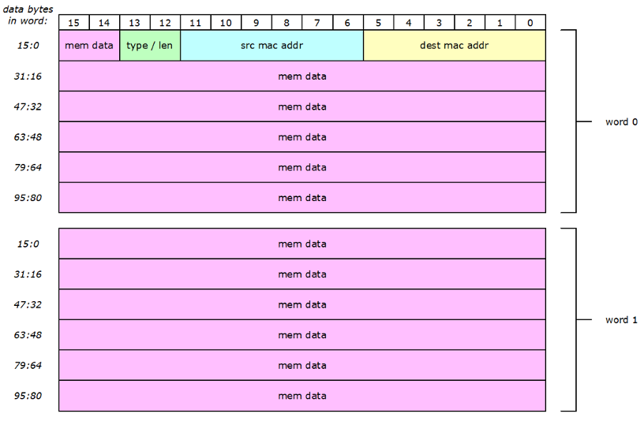
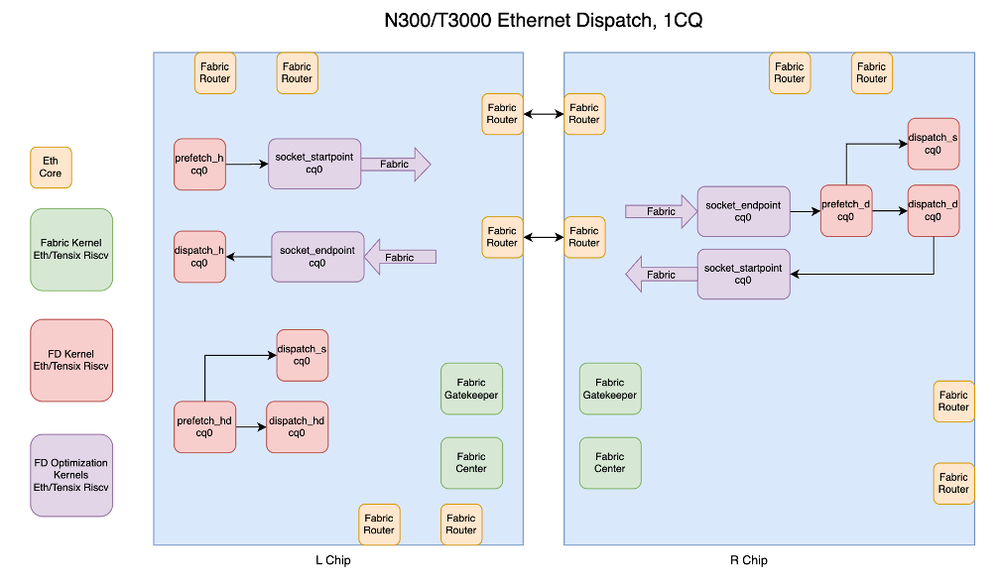

# TT-Fabric Architecture Specification

Version 1.0

Revision 2.0

Authors: TT-Metalium Scale-Out Team

For questions and comments please use the [TT-Metalium Scale-Out Discord Server](https://discord.com/channels/863154240319258674/1321621251269328956)


## Table of Contests
[1. Overview](#overview)

[1.1. Operational Structure](#structure)

[1.1.1. Data Plane](#dataplane)

[1.1.2. Control Plane](#controlplane)

[1.1.2.1. Fabric Node Status Queues](#statusqueue)

[1.2. Some Additional Notes](#notes)

[2. TT-Fabric Network Layers](#fabric_layers)

[2.1. Layers 1, 2](#layer_12)

[2.2. TT-routing (Layer 3)](#layer_3)

[2.2.1. Routing Buffer](#routing_buffer)

[2.2.2. Fabric Router](#router)

[2.2.2.1. RB Per VC Per Direction](#rb_per_vc)

[2.2.2.2. Shared RB Per VC](#shared_rb_per_vc)

[2.2.2.2.1. Ticketing/Mutex Implementation](#ticketing)

[2.2.2.3. Shared RB Per VC With Gatekeeper](#rb_w_gk)

[2.2.2.4. Pull Model Shared RB Per VC With Gatekeeper](#rb_w_gk_pull)

[2.2.3. Routing Tables](#routing_tables)

[2.2.3.1. L0 Routing (Intra-Mesh)](#intramesh)

[2.2.3.1.1. L0 Routing Table Setup](#intramesh_setup)

[2.2.3.2. L1 Routing (Inter-Mesh)](#intermesh)

[2.2.3.2.1. L1 Routing Table Setup](#intermesh_setup)

[2.2.4. Routing Planes](#routing_planes)

[2.2.5. Automatic Traffic Rerouting](#rerouting)

[2.3. TT-transport (Layer 4)](#layer_4)

[2.3.1. Fabric Virtual Channel](#fvc)

[2.3.2. Fabric Control Virtual Channel](#fvcc)

[2.4. TT-session (Layer 5)](#layer_5)

[2.4.1. Packet (RDMA) Mode](#packet_mode)

[2.4.2. Streaming Socket Mode](#ssocket)

[2.4.3. Datagram Socket Mode](#dsocket)

[2.4.4. Endpoint Flow Control Handshake Considerations](#flow_control)

[3. Read/Write API Specification](#rw_api)

[3.1. Asynchronous Write](#async_wr)

[3.2. Asynchronous Multicast Write](#async_mcast_wr)

[3.3. Asynchronous Write Barrier](#async_wr_barrier)

[3.4. Asynchronous Read](#async_rd)

[3.5. Asynchronous Read Barrier](#async_rd_barrier)

[3.6. Asynchronous Atomic Increment](#async_atomic_inc)

[3.7. Asynchronous Atomic Read and Increment](#async_atomic_rd_inc)

[4. Socket API Specification](#socket_api)

[4.1. Socket Open](#socket_open)

[4.2. Socket Close](#socket_close)

[4.3. Socket Connect](#socket_connect)

[4.4. Socket Send](#socket_send)

[5. Deadlock Avoidance and Mitigation](#deadlocks)

[5.1. Dimension Ordered Routing](#dim_order_routing)

[5.2. Edge Disjoint Routing](#disjoint_routing)

[5.3. Fabric Virtual Channels](#fab_vcs)

[5.4. Time To Live (TTL)](#ttl)

[5.5. Timeout](#timeout)

[5.6. Limitations](#limits)

[6. TT-Fabric Model](#model)

[6.1. Serialization and Visualization](#visualization)

[6.2. Data Plane Simulator](#simulator)

[6.3. Modelling External Disruptors and Buffer Limits](#disruptors)

[7. System Specification](#system_spec)

[7.1. System Components](#system_components)

[7.2. TG](#tg)

[7.3. Multi-Host TGG](#tgg)

[7.4. Quanta 2 Galaxy System](#ubb_galaxy)

[8. Resource Allocation](#resource_alloc)

[8.1. Available Dispatch Cores](#available_cores)

[8.2. Fast Dispatch and Fabric Kernel Resouces](#fd_and_fabric)

# 1 Overview <a id="overview"></a>


TT-fabric is a revolutionary approach to AI infrastructure, built around the Tenstorrent Galaxy as its core component.

* Tenstorrent Galaxy:
  + A comprehensive AI building block in a 6U form factor
  + Features (Blackhole):
    - Massive AI compute: 24 PFLOPs
    - Large high-speed memory: 1 TB capacity at 16 TB/s BW
    - Switch capabilities with industry-leading I/O: 11.5 TB/s
* TT-fabric leverages Galaxy to create a unified networking fabric that:
  + Integrates scale-up (building large servers) and scale-out (connecting large servers into a network) architectures into a single unified architecture
  + Provides a complete data-plane solution for deep learning AI training, covering:
    - Core Compute: Forward propagation and Backward propagation
    - Aggregation: Gradient reduction, Weight broadcasting, Sparse Embedding Gradient Sorting, Top-K expert sorting
    - Parameter server, optimizer compute and storage
* Key advantages:
  + Flexibility to build both powerful individual servers and expansive server networks
  + Entire back-end (data-plane) network can be constructed using only Galaxy boxes in a 4x8 configuration
  + Offers a scalable and unified approach to AI infrastructure design
  + 10x TCO advantages for AI data training data center design

The purpose of this document is to provide detailed architecture specification of TT-Fabric. TT-Fabric is Tenstorrent’s implementation of a mesh interconnect that enables AI accelerator devices to communicate with each other. TT-Fabric provides infrastructure to scale-up and scale-out AI accelerators into large meshes.

At its core TT-Fabric can be envisioned as a networking stack with multiple layers. The following diagram shows TT-Fabric stack side by side with other network stacks for reference.


## 1.1 Operational Structure <a id="structure"></a>

TT-Fabric is broadly structured to function in two operational planes. Data Plane and Control Plane as described in the following sections.

### 1.1.1 Data Plane <a id="dataplane"></a>

Data plane refers to the data communication network over which devices exchange information. In other words, Data Plane implements the layered TT-Fabric network stack shown in the figure above.

Data Plane uses the NOC for intra device routing. For inter device routing, data plane uses point-to-point ethernet link between the devices. Data transfer started by a fabric client may take several NOC and ethernet hops before it gets to its intended destination.

Any device-to-device communication in TT-Fabric requires a properly functioning Data Plane.

### 1.1.2 Control Plane <a id="controlplane"></a>

Control plane refers to a secondary interconnect that is used to launch and configure TT-Fabric software and firmware onto all the worker components. In other words, Control Plane is used to set up and launch the Data Plane.

The control plane is persistent, always functional and does not rely on a properly functioning Data Plane. If control plane access to a device is compromised, TT-Fabric cannot operate reliably and requires reboot of control plane to restore compromised connectivity.

On Wormhole (Quanta) and Blackhole devices, PCIe provides the control plane.

After launching TT-Fabric on devices, the control plane monitors the system. Any anomalies encountered by Fabric components are reported to control plane for user visibility and action.

Some examples of information generated by TT-Fabric are:

* Ethernet link down
* Observed data rates by different fabric routers
* Dropped packets
* Routing errors

Some examples of user or control plane actions based on TT-Fabric status are:

* Pause workloads on TT-Fabric errors
* Reconfigure routing tables when ethernet links are down
* Remove rows or columns of mesh devices if links or chips are not functional
* Relaunch workloads from a checkpoint after correcting TT-Fabric errors

#### 1.1.2.1 Fabric Node Status Queues<a id="statusqueue"></a>

The control plane sets up message queues in the DRAM of each fabric node. Fabric node workers push status and error messages as mentioned earlier into these queues for user visibility. The control plane retrieves messages from the queues and takes appropriate action.

All the messages received by control plane are also saved to disk to keep a log of fabric activity in case of malfunction. For a system comprising of thousands of chips, these logs help diagnose issues and root cause failures. Given the scale of the system, TT-Fabric will need some tools that scan the logs to identify specific physical areas of the fabric that might have encountered a problem.

## 1.2 Some Additional Notes <a id="notes"></a>

AI accelerators will be referred to as Devices for the remainder of this document. A device can be a Wormhole, Blackhole etc.

Our first TT-Fabric implementation is specific to Tenstorrent hardware and is intended to be deployable on current and future generations of Tenstorrent devices. TT-fabric is a software/firmware implementation that utilizes NOC and Ethernet capabilities of devices to build a mesh wide communication network.

TT-Fabric will be deployed on a mesh of homogeneous devices. This means that a cluster will not contain a mix of different device architectures. A Wormhole cluster will contain only wormhole devices.

TT-Fabric may support third party hardware in future but is currently outside the scope of this document.

Tenstorrent devices are connected via point-to-point ethernet links. While it is technically possible to have a mesh of non-homogeneous devices, we are deferring dealing with complications of connecting devices with disparate capabilities in a homogeneous fabric interconnect to a later time.

# 2 TT-Fabric Network Layers <a id="fabric_layers"></a>

This section describes the operation of different layers in TT-Fabric network stack.

## 2.1 Layers 1, 2 <a id="layer_12"></a>

Tenstorrent devices implement Layers 1 and 2 of the network stack in hardware.

At Layer 2, Tenstorrent ethernet controllers can operate in compliance mode where the payload is encapsulated in standard Ethernet frames as shown in the following figure.



In this mode Ethernet MAC drops packets that are received with errors. It is left to higher network layers such as layer 4 to implement data retransmission.

Alternatively, ethernet controllers can operate in TT-link mode. In this mode, ethernet controllers implement a Logical Link Control (LLC) sublayer of the standard OSI Layer 2. LLC is implemented in TT-link mode by adding a custom 16-Byte Tenstorrent TT-link header to user payload. This header implements two important LLC features.

* Payload destination address in Receiver’s TT-routing layer
* Go-Back-N ARQ protocol

The following diagram shows how TT-link mode encapsulates user payload into ethernet frame.


In TT-link mode, ethernet controller forwards the received data to TT-routing layer at the address specified in TT-link header as opposed to compliance mode, where data is left in ethernet controller’s receive buffer and requires Layer 3 software to read it out.

tx seq and rx seq fields in TT-link header are used by sender and receiver to communicate sequence numbers for transmitted and received ethernet frames. In case the sequence numbers diverge from expected values, because of MAC errors, Go-Back-N ARQ restarts transmission from the last successfully received ethernet frame.

TT-link mode ensures that TT-routing and upper layers never see data loss due to ethernet frame CRC errors. Any TT-routing payload that is accepted by TT-link layer is guaranteed to be delivered to TT-routing layer on the receiver side.

TT-link layer headers are automatically inserted on the send side and stripped when data is delivered to TT-routing on receiver.

TT-Fabric requires ethernet controllers to operate in TT-link mode.

## 2.2 TT-routing (Layer 3) <a id="layer_3"></a>

TT-Routing layer is the first software layer in TT-Fabric stack and is responsible for routing packets in the network. It is implemented on Fabric Routers and runs on Ethernet and Tensix cores.

For inter-chip hops, TT-Routing layer forwards data to Layer 2 where it gets encapsulated by hardware into ethernet frames and forwarded over ethernet link.

For intra-chip hops traffic is forwarded using NOC.

To address any device in the system, TT-Fabric packet header contains MeshId and DeviceId fields. A router uses these fields to look up its routing tables to determine where to forward the packet next.

TT-Routing also implements automatic rerouting as a first line of defense against ethernet link failure. The idea is to attempt to handle a link failure within the TT-routing layer so that upper layers of stack keep on functioning. Higher layers and user workload only see a temporary pause in activity. If TT-routing can find an alternate route, workload resumes operation at a lower data rate. In case alternate route is not possible, TT-routing notifies control plane for higher level software intervention.

### 2.2.1 Routing Buffer <a id="routing_buffer"></a>

A Routing buffer (RB) is a circular buffer used for packet forwarding from a producer to a consumer. RB resides in L1 of consumer and packets are pushed to it over NOC or Ethernet by a producer. Write pointer is updated by producer and Read Pointer is updated by consumer. A packet is composed of a packet header appended to a payload. Packet header carries information such as the packet source, destination, size etc.

Fabric routers process packets from associated RBs in the order they are received in. Producer gets back pressured if consumer does not pull data from the buffer and the buffer becomes full.

An RB can have only one producer and one consumer. When multiple producers need to push to the same RB a mutex mechanism has to be employed to guarantee that only one producer pushes to RB at one time.


### 2.2.2 Fabric Router <a id="router"></a>

Fabric Router is responsible for routing packets in the fabric. Every router requires routing tables to make routing decisions. It is the responsibility of the control plane to configure routing tables in every fabric router. Any router in the fabric only needs to determine the next hop in the direction of packet destination. At every hop, a fabric router picks the next hop for the current packet from its private routing table and forwards the packet in that direction. Routing decisions are purely based on routing table lookups.

In a 2-D Mesh, a router has 5 possible directions. East, West, North, South to one of its four possible neighbors. The fifth direction is the center or the device itself. This is the case on the last hop, where the packet has reached its destination device, and the packet needs to be consumed at the router’s device.

A 3-D Mesh has 2 additional directions. Up and Down in addition to the 4 horizontal directions mentioned above.

On Wormhole and Blackhole, Fabric Routers are Ethernet and Tensix cores within each device. There are no fabric workers other than the RiscV processors within these cores. Future architectures that provide dedicated communication chiplets will have fabric workers running on communication chiplets in addition to AI accelerator chiplets.

Fabric routers can be mapped on to a single RiscV core or multiple cores depending on how the router functions are grouped. Since all fabric routers are bidirectional, there is independent incoming and outgoing traffic that can be mapped to different cores. This increases the worker core resource requirement for fabric routing node. On the other hand, mapping all fabric functions onto a single core affects performance as one core may not be able to sustain full ethernet bandwidth.

There are different router architectures presented in this section. The final architecture of a TT-Fabric routing node will require micro benchmarking of different approaches. The goal is to have the highest possible ethernet bandwidth and achieve that with lowest count of RiscV worker cores.

#### 2.2.2.1 RB Per VC Per Direction <a id="rb_per_vc"></a>


In this configuration, every outgoing edge router has a dedicated RB for traffic coming from the remaining 4 directions. For example, West router has 1 RB each for traffic coming from South, East, North and Center. Data sent by local compute workers gets routed through the Center. Since there is 1 RB per center per FVC, there can only be one producer per FVC.

Incoming traffic on an edge gets routed to one of the three outgoing edges, or the Center if it is intended for current device.

A fabric router is mapped to one Ethernet Core and two Tensix RiscV cores. The two Tensix RiscV cores are required per direction.

In total, 10 RiscV cores are used for four ethernet links. Wormhole Galaxy that has sixteen ethernet links, this adds up to 40 RiscV cores required to implement one TT-Fabric routing node.

On Blackhole, with 10 ethernet links, we need 24 RiscV cores.

Mapping the outgoing mux paths and incoming demux paths onto one core halves that core count.

A major drawback of this approach is inefficient RB usage since we must size the buffers for worst case assuming traffic from all directions all the time. In practice, only some of the VCs and routes will be active which means most of the RBs and thus precious SRAM space will be unutilized.

**Pros:**

* Dedicated Buffers
* 1-1 Producer-Consumer
* Routing functions distributed over multiple RiscV worker cores.

**Cons:**

* Inefficient RB memory usage
* Requires a lot of worker cores
* Not scalable

#### 2.2.2.2 Shared RB Per VC <a id="shared_rb_per_vc"></a>


In this configuration we combine the dedicated directional RBs on the outgoing edge into one large RB per FVC. The above diagram shows only 1 FVC. Each additional FVC requires another set of incoming and outgoing RBs on every core.

Since there is only one outgoing RB, this leads to the scenario of multiple producers for an RB. To serialize multiple producers, we must employ a mutex scheme whereby a producer must first acquire access before pushing packets to a Fabric Router’s RB. We will implement mutex operation using a ticketing algorithm built on NOC’s atomic read and increment support.

In addition to better memory utilization, this approach requires fewer RiscV cores per Fabric Node. On the downside, all Fabric Router functions are now mapped to 1 Ethernet RiscV core. It may not be optimal on Wormhole which has 256KB SRAM and 1 RiscV core. On Blackhole with 512 KB SRAM and 2 RiscV cores per ethernet, it may not be a big impediment to achieving full ethernet bandwidth.

Since there is one exit buffer per router, with ticketing approach we can have N producers. This means that all Tensix compute workers can directly push data into fabric router’s exit buffer. This reduces the number of intra chip hops a packet must make from a producer, before it exits the device, to 1.

To reduce processing load on ethernet core, we switch to pull model for the last hop where data received over ethernet is destined for the local device. Fabric router notifies the destined Tensix data receiver core that new data has arrived. Data receiver core then reads out data from fabric router RB into receiver’s local buffer.

If multiple packets have been received by fabric router and destined for multiple local data receivers, fabric router sends out multiple pull notifications to all data receivers without waiting for preceding receivers to finish. Data receivers asynchronously signal completion of their pull requests to fabric router.

Making last hop a pull operation means compute ops need to be send/receive pairs. For a data sender op on one device, there must be a corresponding data receiver op on the destination device. This is achieved in TT-session layer where a receiver op opens a socket and registers itself as intended receiver for data. By establishing a session, data receiver provides the notification mailbox where fabric router will send pull notifications whenever it receives data for a receiver. On the sender side, data producer core opens a send socket with receiver credentials.

Since there is no dedicated center router it means that any traffic that is not meant for specific receiver, or for which no receiver exists such as raw writes to device DRAM, fabric router core must process that traffic locally. In case of DRAM read/write, fabric router issues the DRAM read/writes.

**Pros:**

* Scalable (Does not need VC buffer per direction)
* Tensix can directly push to fabric router
* Only 4 workers per Routing Node

**Cons:**

* Overloaded ethernet worker cores
* Costly mutex acquisition
* Costly RB pointer synchronization between producer/consumer
* Ethernet core responsible for processing RDMA traffic on destination
* Only one producer can push data to FVC.

##### 2.2.2.2.1 Ticketing/Mutex Implementation <a id="ticketing"></a>

We implement ticketing through NOC Atomic Read and Increment (ARI) command. With this command the issuer is able to read the current value of 32-bit SRAM location in a remote core while also atomically incrementing the remote value.

For example, if the current value of ticket variable is 1, and 3 asynchronous entities in the device issue 3 atomic read/increment transactions, then the first core will read back a ticket value of 1, second core will read back a ticket value of 2, third core will read back a ticket value of 3 and the final value of ticket will be 4. Since NOC on the destination core that houses the ticket variable serializes the 3 asynchronously issued transactions, for the sake of this mutex approach, it does not matter which core came in first, second or third. The key point is that they all read back a unique ticket value.

To gain exclusive access to a shared resource, in this case FVC RB, in an outgoing router, a producer must acquire a ticket and wait for it to become active. A ticket is acquired by issuing a NOC ARI command. One producer acquires only one ticket at a time. After obtaining a ticket, the producer must register itself with the fabric router as the owner of the ticket. Fabric router will later use this information notify the producer that its ticket has become active.

A ticket becomes active when shared resource’s Active Ticket becomes equal to a producer’s acquired ticket. To avoid unnecessary polling over NOC, Fabric Router pushes active ticket to the producer that is waiting for it. This makes wait state a local polling action on the producer side. NOC sees only 1 update from Fabric Router to a waiting producer when that producer’s ticket becomes active.

Once active, the producer can push packets into fabric router’s RB. When finished, the producer frees the resource by incrementing the active ticket by 1.

This approach guarantees all producers/requestors access to FVC RB in the order of their acquired tickets.

A core can keep its ticket active as long as

* Current Ticket = Acquired Ticket + 1

Which means no one else has a ticket waiting to become active.

When there is more than one acquired ticket, the active core must release its lock on FVC RB to allow other traffic to proceed. Lock can be released when current packet has been fully sent by producer.

The following table shows an example of different cores C1, C2, C3, C7 using the ticketing scheme described above.

| **Event** | **Current Ticket** | **Acquired Ticket** | **Active Ticket** | **Winner** |
| --- | --- | --- | --- | --- |
| Startup | 0 |  | 0 |  |
| 3 Requests | 3 | 0 (C1)  1 (C2)  2 (C3) | 0 | C1 |
| C1 pushes packets to exit buffer. Increments Active to 1 | | | | |
|  |  | 1 (C2)  2 (C3) | 1 | C2 |
| 2 Requests | 5 | 1 (C2)  2 (C3)  3 (C7)  4 (C1) | 1 | C2 |
| C2 Done Increments Active | | | | |
|  | 5 | 2 (C3)  3 (C7)  4 (C1) | 2 | C3 |
| C3 Done Increments Active | | | | |
|  | 5 | 3 (C7)  4 (C1) | 3 | C7 |
| C7 Done Increments Active | | | | |
|  | 5 | 4 (C1) | 4 | C1 |
|  |  |  |  |  |

#### 2.2.2.3 Shared RB Per VC With Gatekeeper <a id="rb_w_gk"></a>

This configuration maintains shared RB per VC but adds a Gatekeeper worker and Center worker. All the semaphore and resource reservations functions are performed by Gatekeeper so that each Ethernet core can just process incoming and outgoing traffic. All fabric routers and compute workers handshake with Gatekeeper when requiring access to any fabric router for data movement.

There is also a Center worker to process any RDMA packet mode data destined for current chip. Center worker pulls data from fabric router and commits to local destinations.

Having a gatekeeper makes resource management more flexible. Compute workers can query the gatekeeper for an available FVC instead of having to figure out which FVC to use. Gatekeeper is also responsible for managing sockets.


**Pros:**

* Scalable (Does not need VC buffer per direction)
* Tensix can directly push to fabric router
* Only 4 ethernet workers per node
* 2 Tensix workers per routing plane
* RDMA traffic processing offloaded to Center
* Gatekeeper assists with mutex acquisition and scheduling

**Cons:**

* Costly mutex acquisition
* Costly RB pointer synchronization between producer/consumer
* Only one producer can push data to FVC.

#### 2.2.2.4 Pull Model Shared RB Per VC With Gatekeeper <a id="rb_w_gk_pull"></a>

To get around the costly mutex and buffer synchronization, this configuration switches the data movement methodology from push to a pull model. Producers do not write to the fabric router FVC buffer. All producers send notifications of data availability to the outgoing fabric router. The fabric router pulls data from the producers’ local L1 over NOC. Once ready, router schedules transfer over ethernet link to the next hop.

This approach uses the ticketing algorithm in a different way. Instead of acquiring a ticket to be the sole writer of router FVC buffer, producers acquire a ticket to reserve a slot in a router command buffer. Multiple producers can acquire tickets and write to their respective slots simultaneously, provided the command slot is free. Fabric router pops pull requests from the command buffer and issues noc transfers to gather data from multiple producers’ buffers into local FVC.

Pull model allows fabric router to service traffic from multiple producers or directions simultaneously. This results in better batching of data in the local FVC buffer. Fabric router can amortize ethernet transfers over large blocks of data by filling up FVC over NOC and draining it over ethernet using a double buffering scheme. One half of FVC can be scheduled for pulls over NOC, while the other half can be scheduled for ethernet transfer.

A pull model also allows producers to schedule RDMA operations directly from device DRAM rather than from L1. In a push model, a producer must first accumulate data in its local SRAM before scheduling NOC to move data from producer SRAM buffer to router FVC buffer. In a pull model, we can avoid the extra NOC copy since router can read data from DRAM directly into its FVC buffer.

**Pros:**

* Scalable (Does not need VC buffer per direction)
* Only 4 ethernet workers per node
* 2 Tensix workers per routing plane
* RDMA traffic processing offloaded to Center
* Eliminates mutex and RB sync using a simpler router command buffer
* Fabric router can fill local buffer through multiple simultaneous NOC reads
* Producers can issue RDMA operations from DRAM

**Cons:**

* ?

### 2.2.3 Routing Tables <a id="routing_tables"></a>

TT-Fabric allows a maximum scale out to 1 million devices. Devices are connected in groups of meshes. One mesh can have up to 1024 devices and we can have 1024 such meshes to a maximum scale out of 1 million devices.

A mesh is a fully connected grid of chips with some bypass connections to decommission any faulty rows or columns.

Inter-Mesh connectivity is provided through subset of devices called exit nodes. A mesh may be connected to multiple neighboring meshes in which case there are exit nodes providing routes to different neighboring meshes.

To support this topology, we need two levels of routing:

* L0 or Intra-Mesh routing
* L1 or Inter-Mesh routing

Fabric routers have fully instantiated routing tables indexed with Device Id or Mesh Id. This means a router can look up next hop from its routing tables for any Device or Mesh. A routing table entry is a port number on which current packet should be forwarded enroute to its destination. Since we have 16 ethernet ports in Wormhole and Blackhole has less than that, a routing table entry is 4 bits. To hold routing information for 1024 devices, we need 512 Bytes. Similarly for 1024 Meshes we need another 512 Bytes. The two-level routing tables need a total of 1024 Bytes in every fabric router SRAM.

#### 2.2.3.1 L0 Routing (Intra-Mesh) <a id="intramesh"></a>

When a packet’s destination is within the local mesh, the next hop is looked up from L0 routing table and packet is forwarded over specified ethernet port.

Every hop moves the packet towards the destination device in local mesh.

L0 routing table example:

| **DeviceId** | **Local Port** |
| --- | --- |
| 0 | 0 |
| 1 | 0 |
| 2 | 1 |
| ... |  |
| 1023 | 8 |

##### 2.2.3.1.1 L0 Routing Table Setup <a id="intramesh_setup"></a>

The following figure shows a 4 mesh cluster. Each mesh has 9 devices. Each device shows which of its ethernet ports are connected to its neighbor.


The L2 routing table for devices on Mesh 0 is shown below. Each row numbered 0 to 8 in Source Device group is the L0 routing table for the respective device on Mesh 0. This routing table is set up with dimension ordered routing. Packets go X dimension first then Y.


The following table shows how a packet sent by source Device 0 gets routed to destination Device 8 in Mesh 0.

<table>
  <tr>
    <th colspan="3">Route from Device 0 to Device 8</th>
  </tr>
  <tr>
    <th>Hop</th>
    <th>Sender Device-Port</th>
    <th>Receiver Device-Port</th>
  </tr>
  <tr>
    <td align="center">1</td>
    <td align="center">0-P2</td>
    <td align="center">1-P4</td>
  </tr>
  <tr>
    <td align="center">2</td>
    <td align="center">1-P2</td>
    <td align="center">2-P4</td>
  </tr>
  <tr>
    <td align="center">3</td>
    <td align="center">2-P1</td>
    <td align="center">5-P3</td>
  </tr>
  <tr>
    <td align="center">4</td>
    <td align="center">5-P1</td>
    <td align="center">8-P3</td>
  </tr>
</table>

#### 2.2.3.2 L1 Routing (Inter-Mesh) <a id="intermesh"></a>

When a packet is not addressed to local mesh, the next hop is looked up from L1 routing table and packet is forwarded over specified ethernet port.

Every hop moves the packet towards an exit node on local mesh.

L1 routing table example:

| **MeshId** | **Local Port** |
| --- | --- |
| 0 | 4 |
| 1 | 4 |
| 2 | 9 |
| ... |  |
| 1023 | 9 |

##### 2.2.3.2.1 L1 Routing Table Setup <a id="intermesh_setup"></a>

For the same 4 Mesh cluster mentioned in previous section, L1 routing table for devices on each of the 4 meshes is shown in the following figure. Each row labeled 0 to 8 is L1 routing table for respective device in respective source mesh. Colored boxes identify the Exit nodes on each Mesh. To identify Mesh x Device x (Ethernet) Port x we can use a notation of MxDxPx.

From the 4-mesh topology presented earlier, we can see that M0D5 is an exit node and M0D5P2 is M0 to M1 ethernet link. Similarly, M1D3 is an exit node and M1D3P4 is M1 to M0 ethernet link. In the table below, these two ports are highlighted green to identify the route between M0 and M1. Any packet in M0 that has to be routed to M1 will be funneled towards M0D5. Similarly, any packet in M1 that has to be routed to M0 will be funneled towards M1D3.

There is no direct route between M0, M3 or M1, M2. Traffic from M0 to M3 will traverse either M1 or M2 on its way to M3. Which intermediate meshes are traversed depends on how we program L2 routing tables in the fabric routers. Fabric routers do not have any built-in bias towards picking paths.


### 2.2.4 Routing Planes <a id="routing_planes"></a>

Tenstorrent devices support multiple ethernet links for routing in any direction. On WH, for each of the East, West, North, South directions, we have 4 ethernet links. BH, similarly has 2, and potentially another 2 for Up or Down direction for 3D meshes. Multiple ethernet links means we have more than one TT-Fabric route to a destination. To support multiple routes while keeping the traffic patterns deterministic, we are introducing the concept of Routing Planes. The multiple ethernet ports in each direction are one to one mapped, such that the first ethernet port on any edge only routes over first ethernet port of the other edges. Similarly, the second ethernet port only routes over the second ethernet port of the other edges. This keeps the traffic contained within its routing plane and there is no cross talk between the routing planes. TT-Fabric clients can specify the routing plane when issuing transactions. In general, the number of routing planes is the same as the number of available parallel ethernet ports per direction on a device. For WH it is four while for BH it is two.

The following diagram shows how the four ethernet ports per direction on WH mesh form four separate routing planes. The diagram shows four WH devices.


### 2.2.5 Automatic Traffic Rerouting <a id="rerouting"></a>

TT-Fabric supports device meshes that can scale up to hundreds of thousands of devices. On such a large scale, the probability of some ethernet links going down is non-negligible. An interconnect that does not implement link redundancy and is not able to work around some broken ethernet links will face frequent work interruptions and require a lot of system management calls. We intend to build redundancy into TT-Fabric network stack such that if some ethernet links on a fabric node go down, fabric can automatically reroute blocked traffic over an available ethernet link. If there is at least 1 available link in the same direction as the broken link, TT-Fabric's redundancy implementation will be completely transparent to workloads running on the system. End user applications may notice a temporary pause and lower data rates but should not otherwise require any intervention. TT-Fabric will also notify Control Plane of the rerouting status so that appropriate action may be taken on the system management front to service the broken ethernet links. User workload will be able to reach its next checkpoint without network interruption at degraded data rates. At that point Control plane can update routing tables to take out broken links from routing network. System maintenance can also be performed to fix ethernet link issues before resuming user work.

To support redundancy, each fabric router has an Ethernet Fallback Channel (EFC) that is brought into service by other fabric routers in a node when their dedicated ethernet links become unreliable or completely dysfunctional. EFC can be shared by multiple routers when multiple ethernet links lose connection. EFC is not virtualized and operates at Layer 2. When routers push data into EFC, special layer 2 headers are appended to traffic so that impacted fabric router’s native FVCs can be reliably connected to their receiver channels on either side of the broken ethernet links.

Fabric routers exchange credits with each for traffic flow control rather than the EFC so that EFC is available for all reroute traffic. Any FVC back pressure is kept within the fabric router buffers and does not propagate to EFC layer buffers.

The following diagram shows how traffic gets rerouted when Eth A link becomes inactive. Broken arrows show all the rerouted FVC traffic in both directions.


## 2.3 TT-transport (Layer 4) <a id="layer_4"></a>

TT-Transport implements buffering and Fabric Virtual Channels (FVCs). Buffer sizes and number of FVCs depend on amount of available SRAM space on fabric workers for these functions. FVCs guarantee independent progress of traffic on unique channels. Traffic from multiple sources on the same FVC gets serialized. All traffic on the same FVC is guaranteed to be ordered. Both the number of FVCs and the size of underlaying RBs are configurable.

### 2.3.1 Fabric Virtual Channel <a id="fvc"></a>

TT-Fabric provides virtual channels called Fabric Virtual Channels (FVCs) by creating multiple RBs in a route direction. All Fabric routers provide the same number of FVCs in all supported directions to allow fabric packets to travel in any direction on any FVC. By providing a dedicated RB per FVC, we guarantee that all FVCs make independent progress.

TT-fabric clients can use non overlapping FVCs to avoid deadlocks when some downstream destinations for an FVC are expected to block or stall thus back pressuring traffic on FVC.

### 2.3.2 Fabric Control Virtual Channel <a id="fvcc"></a>

TT-Fabric will use a dedicated fabric virtual channel to route all control messages in the system. This will prevent control traffic from interfering and competing with data read/write traffic thereby affecting data bandwidth.

Control messages are small, fixed size packets and can be routed more efficiently using dedicated FVC that can be smaller in size than data FVCs.

## 2.4 TT-session (Layer 5) <a id="layer_5"></a>

TT-Session layer provides interface for higher level user programs/kernels to initiate read or write traffic over TT-Fabric. A session can be stateless or stateful.

In a stateless session, clients use asynchronous read/write APIs to issue individual transactions. This can be viewed as a Remote Direct Memory Access (RDMA) operation. Barriers or Acknowledgements are used to ensure that the transactions have been completed. All transactions are independent TT-Fabric packets where a packet specifies the complete destination memory address where the data must be written to or read from. Asynchronous APIs that provide RDMA operations are described later in this document.

A stateful session implies the creation of sockets where senders and receivers open sockets with the same ids. Socket ids are used to identify the appropriate TT-Session receiver when data for a socket is received. A Socket can be of two types:

* Connection oriented or Streaming Socket (SSocket)
* Connectionless or Datagram Socket (DSocket)

Due to the asynchronous nature of TT-Fabric nodes, a stateful session also needs a temporal epoch number to properly synchronize senders and receivers on the timeline. There can be multiple senders on fabric wanting to open a socket to the same receiver. The receiver, however, may be temporally ready to receive from only one of the senders. Epoch identifier allows the TT-session layer to connect sender/receiver that have the same socket id and epoch. Furthermore, epochs demarcate operation boundaries. This means that all producers and consumers of connected sockets have to be in the same epoch. This requirement does not preclude simultaneous activity of multiple unique but independent epochs in TT-fabric. Just that there are no socket transfers across epochs. By having a full handshake between sender and receiver TT-session layers and appropriately tagged Epochs we can guarantee that asynchronous devices will not create a deadlock while trying to open sockets to a common destination.

### 2.4.1 Packet (RDMA) Mode <a id="packet_mode"></a>

Packet or RDMA mode does not require any TT-Session receiver on the destination device. TT-Fabric packet contains all the information such as the target memory address where the data is supposed to be written to or read from. All packets are self-contained. There are no resources in TT-Fabric that are reserved exclusively for senders or receivers of packets. All packets on an FVC are interleaved (on a packet boundary) with other packets that are being transported in the fabric. On the destination device, RDMA packet payload is committed straight to the memory address specified in the packet header.

### 2.4.2 Streaming Socket Mode <a id="ssocket"></a>

In SSocket mode, TT-Transport binds an FVC to the streaming socket. FVCs are reserved in all the fabric routers from sender to receiver. Other devices in the fabric that share a route segment with the socket bound FVC are not allowed to send data until the SSocket transfer is complete. Devices are allowed to use a different FVC that is not bound to a socket. Devices on non-overlapping routes can use the same FVC. This is because the non-overlapping routes do not share routing buffers. A SSocket can be unicast or multicast. In multicast mode, sender data is received by all the receivers that have subscribed to a multicast SSocket.

To open a socket, both the sender and receiver request a socket with same socket id, epoch and socket type from their respective TT-session layers.

A socket session is active when:

* Both the sender and receiver are ready for a socket\_id/epoch
* All fabric nodes on socket route have reserved a FVC for the socket

In a single epoch, there can be as many active socket sessions, in one direction, as the number of reservable FVC for sockets. After the reservable FVCs are exhausted, further calls to open sockets for an epoch will result in socket open error.

### 2.4.3 Datagram Socket Mode <a id="dsocket"></a>

In DSocket mode, TT-Transport does not bind the socket to an FVC. Socket data is packetized and then routed over TT-Fabric using the general routing FVCs which may be carrying other RDMA or Datagram traffic. When carrying datagrams TT-Fabric packet headers contain the socket id and destination device id. Destination memory address in the packet header is ignored. Packet payload processing is left to the discretion of the receiving DSocket owner.

To open a datagram socket, both the sender and receiver request a socket with same socket id and socket type from their respective TT-session layers.

A socket session is active when:

* Both the sender and receiver are ready for a socket\_id/epoch

Since DSockets do not require a dedicated FVC, there can be as many active datagram socket sessions as permitted by memory constraints of TT-Fabric workers.

### 2.4.4 Endpoint Flow Control Handshake Considerations <a id="flow_control"></a>

TT-Fabric endpoints can send and receive data in packet mode of socket mode. Regardless of the transport mode, the handshake mode between the producer/consumer pair and endpoint/TT-Fabric impacts locally produced as well as other traffic in the system.

End-to-End handshake between producer and consumer guarantees that a producer will not issue traffic into fabric, if its associated consumer does not have enough buffer space. While this guarantees that consumer will never backpressure FVC, end-to-end handshake latency can be very high especially if the endpoints are far apart. The problem is further exacerbated if the consumer does not have enough buffer space to cover the round-trip handshake latency thereby negatively impacting overall bandwidth of the data transfer. End-to-End handshake however prevents slower or stalled endpoints from blocking other traffic on the same FVC.

Local handshake on the other hand does not consider consumer buffer capacity when issuing traffic. The producer injects traffic into the network as fast as possible. Receiving endpoint drains traffic from fabric as fast as possible. If the processing rates are matched, there is no traffic backup from consumer into FVC buffers. However, if the consumer is slow or stalled, traffic starts backing up in FVC buffers along the network route. Since the producer is oblivious to consumer state, it keeps generating traffic, and the backup eventually reaches the local TT-Fabric router that is responsible for local handshake with the data producer. It is only at this point that the producer stalls. With local handshake we can achieve the highest possible bandwidth but at the cost of fully blocking an FVC all the way from consumer to producer. This can lead to deadlocks if there are data dependencies between different consumers that are sharing the same FVC. To avoid deadlocks, all such producer/consumer pairs require a dedicated FVC. Since FVCs are limited, there can always be a case where the number of dependencies is greater than the number of available FVCs. When employing local handshakes, one has to carefully analyze data dependencies and make sure that producers do not end up deadlocking.

The following table summarizes the above discussion. We get 4 modes of operation when we combine Shared/Private FVC usage with End-to-End/Local Handshake.

<table>
  <tr>
    <th></th>
    <th colspan="2">Credit Handshake Method</th>
  </tr>
  <tr>
    <th>FVC Usage</th>
    <th>End-to-End Handshake</th>
    <th>Local Handshake</th>
  </tr>
  <tr>
    <td>Shared (Packet, DSocket)</td>
    <td>
      &bull; Data producer and consumer exchange credits<br>
      &bull; Data does not back up into TT-Fabric FVC buffers<br>
      &bull; Consumer has local DRAM spill buffer<br>
    </td>
    <td>
      &bull; Producer only handshakes with local TT-Fabric router<br>
      &bull; Slow consumer causes data to back up into TT-Fabric FVC buffers<br>
      &bull; In worst case, if a consumer is stalled, the back pressure reaches all the way to the producer<br>
      &bull; Can cause deadlocks if there is data dependency between consumers on same FVC<br>
    </td>
  </tr>
  <tr>
    <td>Private (SSocket)</td>
    <td>
      &bull; Data producer and consumer exchange credits<br>
      &bull; Data can back up into TT-Fabric FVC buffers<br>
      &bull; Consumer has local DRAM spill buffer<br>
    </td>
    <td>
      &bull; Producer only handshakes with local TT-Fabric router<br>
      &bull; Slow consumer causes data to back up into TT-Fabric FVC buffers.
    </td>
  </tr>
</table>

TT-Fabric must balance the following competing requirements:

* Limited number of FVCs
* Prevent endpoints from stalling TT-Fabric traffic (End-to-End Handshake)
* Achieve max ethernet link bandwidth (Local Handshake)

To support End-to-End handshake that can also operate at maximum bandwidth, a consumer needs local buffers that are large enough to mask round-trip credit handshake latency. With limited L1 storage this cannot be guaranteed as the round-trip latency depends on network distance.

TT-Fabric solves this problem by providing local DRAM spill circular buffers or DSCB. Normally, for local handshake, an endpoint only has a SRAM/L1 circular buffer or L1CB. When end-to-end handshake requires large amount of buffering, it is provided through DSCB. For incoming traffic, the endpoint pulls data from fabric into L1CB if it has space. Otherwise, incoming data gets redirected to DSCB. Producer and Consumer exchange credits based on available space in DSCB and not L1CB. DSCB is sized to cover round-trip latency.

Notwithstanding the deadlock hazards, a subtle drawback of local handshake is that when receiver stalls and L1CB is full, further data bound for the consumer is buffered over multiple NOC and ethernet hops on TT-Fabric route segment from producer. When the receiver un-stalls, its data is still spread over many network hops and incurs that latency to finally get to the local buffers.

An added advantage of DSCB is that this data now gets buffered locally on device DRAM rather than being in distant network buffers.

The following flowchart shows how a TT-Fabric consumer interface block manages L1CB and DSCB.

Blue arrows show the normal idling path.

Green arrows show the path when consumer is able to process incoming traffic as soon as it arrives. There is always space available in L1CB and we never spill to DSCB.

Yellow arrows show the paths that handle cases where L1CB may be getting full, and we redirect incoming traffic to DSCB. To maintain proper data ordering, whenever DSCB is not empty, data from DSCB has to be processed before new data arriving from TT-Fabric is processed.


The following figure shows a high-level view of data path between L1CB and DSCB.


In general, the spill CB does not need to be in DRAM. We should be able to allocate storage buffers in Tensix SRAM. This mode will require some additional setup so that the consumer TT-Fabric interface module knows where to store incoming data stream and how to spread it across distributed SRAM storage on the device.

# 3 Read/Write API Specification <a id="rw_api"></a>

TT-Fabric provides Remote Direct Memory Access (RDMA) support to Write and Read data from any device connected to the fabric.

The following sections describe supported APIs and their operation.

## 3.1 Asynchronous Write <a id="async_wr"></a>
```
fabric_async_write(
  routing_plane, // the network plane to use for this transaction
  src_addr, // source address in sender’s memory
  dst_addr, // destination write address
  size, // number of bytes to write to remote destination
  fvc, // fabric virtual channel. Set to –1 for automatic selection
  transaction_id, // transaction id used to track commpletion
  return_status_addr // TT-Fabric returns api call status at this address
)
```
Asynchronous write is used to write data to a remote receiver. Sender does not need to wait for all the data to be written to receiver. If all the writes are sent on the same FVC, data is guaranteed to be ordered. FVC selection can be automatic, where TT-Fabric will select an available FVC, or it can be specified in the API call. To avoid conflicts, it's better to allow TT-Fabric to assign FVC for async writes. After the first successful async write call, user can make subsequent calls with the TT-Fabric assigned FCV to ensure all data is written over the same FVC for guaranteed ordering.

**return\_status\_addr** is a data structure that contains different success, error and status identifiers to notify the caller of the write status.
```
struct tt_fabric_status {
  status, // success and error codes
  fvc, // tt-fabric assigned automatic fvc
}
```
transaction\_id to keeps track of requests sent over fabric and acknowledgements received from remote receiver. TT-Fabric maintains upto 16 unique transaction counters which are indexed using transaction\_id values of 0 - 15. For every outgoing request, the specified transaction\_id counter is incremented by 1. For every acknowledgement received, transaction\_id counter is decremented by 1. Whenever transaction\_id counter is non-zero, there are inflight transactions in TT-Fabric. To impose a barrier, the sender must wait until transaction\_id counter becomes 0.

fabric\_async\_write calls to different remote devices can be made with unique transaction\_id fields if the sender needs selective write barriers for devices.

## 3.2 Asynchronous Multicast Write <a id="async_mcast_wr"></a>
```
fabric_async_write_multicast(
  routing_plane
  origin_device, // multicast origin device
  e_depth, w_depth, n_depth, s_depth, // ethernet hops around origin. All devices in this range get written
  src_addr,
  dst_addr,
  size,
  fvc,
  transaction_id
  mcast_flags,
  return_status_addr
)
```
Multicast write is used to write to more than one remote receiver with the same data. Multicast starts at the origin device of the multicast grid. The extent of multicast is specified by the number of hops in the four directions around the origin device. All devices within the specified depth are written with single async multicast write command.

In addition to device multicast, write data can be unicast or multicast within a device. If the multicast is also a device multicast, then all the Tensix worker cores specified in the NOC mcast group receive the write data. In NOC mcast mode, dst\_addr field specifies the NOC mcast group in addition to the memory offset.

The following table summarizes asynchronous multicast write modes.

| **Origin** | **Depth (e,w,n,s)** | **Mcast Flags** | **Description** |
| --- | --- | --- | --- |
| D1 | 2, 0, 0, 2 | Default | Write to specified NOC dst\_addr in all devices of mcast group |
| D1 | 2, 0, 0, 2 | NOC Mcast | Write to specified NOC offset in all Tensix workers in all devices of mcast group |
| D1 | 0, 0, 0, 0 | Default | Unicast to specified NOC offset. Same effect as Async Write |
| D1 | 0, 0, 0, 0 | NOC Mcast | Mcast group is a single device. Write to specified NOC offset in all Tensix workers of D1 |


## 3.3 Asynchronous Write Barrier <a id="async_wr_barrier"></a>
```
fabric_async_write_barrier(transaction_id)
```
Asynchronous write barrier guarantees that all prior writes issued by a sender with the specified transaction\_id have been committed to all the receivers.

## 3.4 Asynchronous Read <a id="async_rd"></a>
```
fabric_async_read(
  routing_plane, // the network plane to use for this transaction
  src_addr, // read address in remote device
  return_addr, // address in local memory where read data is copied
  size, // number of bytes to read from remote deivce (src\_addr)
  fvc,
  transaction_id
  return_status_addr // status of async read
)
```
Asynchronous read is used to read data from a remote receiver. Asynchronous reads are implemented as fabric writes originating from remote device and directed towards reading device’s return address.

## 3.5 Asynchronous Read Barrier <a id="async_rd_barrier"></a>
```
fabric_async_read_barrier(transaction_id)
```
Asynchronous read barrier guarantees that all prior reads issued by a reader have been completed.

When reading from multiple remote devices, or multiple non contiguous address from a single remote device, a reader can implement selective barriers by issuing fabric\_async\_read with unique transaction\_id parameter.

## 3.6 Asynchronous Atomic Increment <a id="async_atomic_inc"></a>
```
fabric_async_atomic_inc(
  routing_plane, // the network plane to use for this transaction
  dst_addr, // address to increment in remote device
  inc_value, // amount to increment
  wrap_boundary, // value at which the remote counter wraps to 0
  fvc,
  transaction_id,
  return_status_addr // status of async atomic increment
)
```
Asynchronous atomic increment is used to atomically increment an address in a remote device. return\_status\_addr is used to track status of asynchronous command.

wrap\_boundary is used to specify the maximum value of remote counter after which it will wrap to 0. The maximum value is 2 ^ (wrap_boundary + 1) - 1. To atomically count from 0 – 31, wrap\_boundary is set to 4.

## 3.7 Asynchronous Atomic Read and Increment <a id="async_atomic_rd_inc"></a>
```
fabric_async_atomic_read_inc(
  routing_plane, // the network plane to use for this transaction
  return_addr, // address where 32-bits from remote device are returned
  dst_addr, // 32-bit address to increment in remote device
  inc_value, // amount to increment
  wrap_boundary, // value at which the remote counter wraps to 0
  fvc,
  transaction_id,
  return_status_addr // status of async atomic read increment
)
```
Asynchronous atomic read and increment is a two-part command. It is used to atomically read a 32-bit address in a remote device. After the value has been sampled to be returned to reader, the 32-bit address is also atomically incremented in the remote device. return\_status\_addr is used to track the status of asynchronous command.

# 4 Socket API Specification <a id="socket_api"></a>

Sockets are used to create sender/receiver pairs over TT-Fabric.

Streaming sockets create a dedicated path from a sender to a receiver or multiple receivers in case of a multicast socket. SSockets are implemented on top of FVCs. When a SSocket is opened, a FVC is attached to that socket. Only the socket owner is allowed to push data into SSocket FVC. Any other fabric traffic that needs to be routed over a SSocket bound FVC has to wait until the socket owner closes the socket.

Datagram sockets do not bind to a specific FVC and share the bandwidth with other fabric traffic over the FVC.

## 4.1 Socket Open <a id="socket_open"></a>
```
socket_handle fabric_socket_open(
  routing_plane, // the network plane to use for this socket
  epoch_id, // Temporal epoch for which the socket is being opened
  socket_id, // Socket Id to open
  socket_type, // Unicast, Multicast, SSocket, DSocket
  direction, // Send or Receive
  remote_addr, // Remote device that is the socket data sender/receiver.
  fvc, // fabric virtual channel.
)
```
Socket Open is used to open a socket for sending data to a specific receiver on a remote device.

Both sender and receiver need to make a fabric\_socket\_open call with the matching parameters. Before sending data, socket owners must check the status of socket connection by calling fabric\_socket\_connect.

socket\_handle returned by the open call holds socket specific parameters and is used in subsequent calls when sending or receiving data from socket.

For datagram sockets, data is sent over the fabric virtual channel specified by fvc.

## 4.2 Socket Close <a id="socket_close"></a>
```
fabric_socket_close(
  socket_handle, // handle to socket parameters
  return_status_addr // status of socket close
)
```
Socket close is used to close an open socket.

If the socket is a SSocket, this frees the fabric FVCs bound to specified socket at all fabric routers from sending device to receiving device. FVC then becomes available to route general fabric traffic. return\_status\_addr provides status of socket close command.

## 4.3 Socket Connect <a id="socket_connect"></a>
```
fabric_socket_connect(
  socket_handle, // handle to socket parameters
)
```
Socket connect ensures that all receivers for the send socket are ready and in the case of a streaming socket a connection has been established between sender and receivers. TT-Fabric automatically starts connection establishment because of fabric\_socket\_open when all the receiver sockets have also been opened.

Ideally, fabric\_socket\_connect should be very quick as the process has been in progress in the background. For SSocket, connection establishment can suffer delays if the FVC being used for the SSocket is temporarily busy with other fabric traffic. In this case, the respective fabric nodes wait for the FVC to become available before it gets reserved for the socket. Before sending data, socket owner must check the status of connection by checking the status returned via return\_status\_addr.

## 4.4 Socket Send <a id="socket_send"></a>
```
fabric_socket_send(
  socket_handle, // handle to socket parameters
  src_addr, // address of data to send, in sender’s local memory
  size // size of data to send
)
```
Socket send is used to push data into an open socket. Sender can keep pushing data into local FVC buffer as long as there is space in the virtual channel buffer. fabric\_socket\_send blocks until it has pushed the specified number of bytes into the socket.

On the receiver device, when a fabric router receives data on a socket, it notifies the local receiver core that owns a receive socket with the matching socket id. Local receiver then pulls the data from socket buffer.

# 5 Deadlock Avoidance and Mitigation <a id="deadlocks"></a>

Like any other network, TT-Fabric faces deadlock hazards. Circular dependencies, resource contention, buffer exhaustion are some of the conditions that can lead to deadlocks in the routing network. We are building features into TT-Fabric to minimize chances of hitting deadlocks. In the event of a deadlock, TT-Fabric should be able to detect it, try to mitigate the effects and notify the Control Plane.

The following sections describe the TT-Fabric features for deadlock avoidance and mitigation.

## 5.1 Dimension Ordered Routing <a id="dim_order_routing"></a>

Cyclic dependency deadlock happens when a set of nodes form a cyclic traffic pattern. Each node’s outgoing traffic is waiting on resources in the next hop to make progress. Since the traffic pattern is a cycle, all nodes end up waiting for the next hop’s resource and form a routing deadlock.

Dimension ordered routing prevents cyclic dependency deadlocks by routing traffic in a way that does not form traffic cycles. In the routing table examples presented earlier in the document, we use X then Y dimension ordered routing when building routing tables.

The following diagram illustrates the cyclic dependency deadlock.


4 Devices are creating a cyclic traffic pattern as follows:

* D1 sending to D4
* D2 sending to D3
* D4 sending to D1
* D3 sending to D2

Traffic originating from D1, D2, D3, D4 is shown by yellow, blue, gray and orange segments respectively. After making the first hop to the next neighbor, route segments turn red. That is because incoming packets cannot make the routing turn in the desired direction. Turn is not possible because the outgoing router’s buffer is exhausted serving locally generated traffic. Each device’s traffic gets stuck in the next hop waiting for the router buffer to become available. No packet is able to make progress, and the system is in a deadlock.

Using dimension ordered routing where packets travel in X direction before turning in Y direction avoids this cyclic dependency deadlock as shown in the following diagram.


Packets from D1 to D4 and D4 to D1 follow original routes.

Packet from D2 to D3 and D3 to D2 are routed in X direction first thus avoiding deadlock.

TT-Fabric is not limited to just one kind of routing bias. Since routing tables are fully instantiated, any reasonable routing scheme can be devised and mapped onto fabric router tables.

## 5.2 Edge Disjoint Routing <a id="disjoint_routing"></a>

Edge disjoint routing uses different entry/exit nodes on network edges for traffic that is incoming/outgoing from current network. In TT-Fabric, we can set up L1 routing tables such that cross traffic between meshes uses different exit nodes. Opposite traffic flows will go through different fabric routers which can reduce chances of resource contention.

## 5.3 Fabric Virtual Channels <a id="fab_vcs"></a>

As stated earlier, FVCs guarantee independent progress of traffic relative to other FVCs. Traffic that is expected to contend for network or endpoint resources can be routed via unique FVCs so that one traffic stream does not get stuck behind other traffic that is stalled due to a stalled endpoint.

## 5.4 Time To Live (TTL) <a id="ttl"></a>

TT-Fabric may encounter packets that keep on circling the network and are not terminating. This can occur if the routing tables are misconfigured or corrupted. Such traffic can keep on living in the network forever and keep burning network resources. To avoid such patterns of traffic, TT-Fabric packets have a TTL parameter. On traffic initiating end or router, TTL is initialized to a conservative value that covers longest hop count any packet could encounter in TT-Fabric. At every network hop, fabric router decrements TTL by 1. Under normal conditions, a packet will reach its destination before TTL becomes 0 (expires). If for any reason a router sees a fabric packet with TTL parameter of 0, the packet is marked as expired, dropped, and drained from fabric. TT-Fabric also notifies Control Plane of the event.


The diagram above shows a packet that gets stuck in a routing loop. D1 sends a packet that gets routed to D5, D6, D7, D11, D10, D9, D5, D6, ...

Without any way for TT-Fabric to detect this anomaly, this packet will stay in this routing loop forever. In the above 4x4 grid example, D1 to D16 is the longest route which is 6 ethernet hops. If D1 sets the TTL parameter of its packet to 10 that is big enough to cover all legitimate routes in this grid.

With a TTL of 10 the packet hops are shown in the table below. As the packet loops, Device 11 will eventually see the expired TTL parameter in packet header and drop the packet.

| **Device** | **TTL** |
| --- | --- |
| 1 | 10 |
| 5 | 9 |
| 6 | 8 |
| 7 | 7 |
| 11 | 6 |
| 10 | 5 |
| 9 | 4 |
| 5 | 3 |
| 6 | 2 |
| 7 | 1 |
| 11 | 0  Fabric Router at Device 11 drops the packet with expired TTL |

## 5.5 Timeout <a id="timeout"></a>

Timeouts are TT-Fabric's last line of defense against deadlocks. Timeout is a detection mechanism rather than a prevention mechanism. Schemes mentioned in previous sections are meant to prevent or minimize deadlocks. If a routing deadlock slips through, TT-Fabric will detect it through timeout. If a packet head is not able to make progress through a fabric router within the specified timeout, it may indicate some deadlock due to resource contention, erroneous routing, stalled endpoint etc. Fabric router encountering routing timeout will drop the packet and drain its data from the fabric buffers. The Fabric router will also notify Control Plane of the event.

## 5.6 Limitations <a id="limits"></a>

TT-Fabric does not support end-to-end transmissions in case of dropped packets. The current fallback is to notify Control Plane and rely on host software managed mitigation. TT-Fabric can notify data senders of the dropped packets by sending a negative acknowledgement. Data retransmission is left to the TT-Fabric user’s discretion.

# 6 TT-Fabric Model <a id="model"></a>

TT-Fabric Model is a software functional model of all components of the Fabric. The purpose of the Fabric Model is to fully simulate the ethernet traffic in the Fabric. It will provide a ground truth for the state of any configuration of the Fabric, to help with debug and rerouting decisions. The Fabric Model will include a new piece of software to emulate the physical data plane, but otherwise shares the software components of the TT-Control Plane and Fabric Router.

## 6.1 Serialization and Visualization <a id="visualization"></a>

TT-Fabric Model will serialize these components of the Fabric:

* Physical state of the cluster (i.e. output of syseng tool create-ethernet-map)
  + Visualizer to help debug
* Intermesh and intra-mesh routing tables
  + Visualizer to help debug
* Routing buffers and VCs
  + Visualizer to help debug
* Packet traffic across data plane
  + We should be able to download traffic serialization from software simulator to run on hardware, and vice versa.

## 6.2 Data Plane Simulator <a id="simulator"></a>

The data plane simulator will model all paths ethernet packets may take across the hardware, except for NOC activity between a device and the Fabric. Key components:

* Device, APIs to assemble packet headers and send them to data plane
* Router/VC, APIs to model resource availability
* Data Plane, query serialized routing tables and physical state of machine provided by control plane, to move packets between devices
* Toggle in data plane to test redundancy links vs. preferred links
* Directed single threaded testing for buffer limits and rerouting
* Random testing with multi-threading. One thread per device to simulate requests to the Fabric and one thread for external disruptors.

## 6.3 Modelling External Disruptors and Buffer Limits <a id="disruptors"></a>

TT-Fabric Model will have hooks to simulate failed links, to trigger and verify rerouting in the control plane. It will also have SW APIs to simulate back-pressured buffers and VCs, to detect possible deadlock scenarios.

# 7 System Specification <a id="system_spec"></a>

To configure and launch TT-Fabric on a physical system we need to specify the hardware components of the system in a hierarchy that is modular and scalable. System specification should be in a format that can be parsed by the Control Plane. The following sections describe our current approach which is to use a yaml to describe the topology of a physical machine. The system specification file contains all the necessary information to enable a user to build their AI workload offline. Before launching the workload, Control Plane validates the physical connectivity of the system to ascertain that it conforms to the system specification yaml file.

## 7.1 System Components <a id="system_components"></a>

To be able to describe the topology of a physical system, we need to identify the basic building blocks that are used to build an AI machine. This section lists the building blocks for a physical Tenstorrent machine.

* **ChipSpec**: Single AI accelerator with ethernet capabilities. In a two-dimensional layout of chips, every chip can have one neighbor on each of its four sides. A chip connects to its neighbors through one or more unique ethernet ports. The four sides of a chip are identified as East, West, North and South.
* **Board**: Physical board that holds individual chips in a two-dimensional layout. Chips on a board have uniform number of ethernet connections between all neighbors.
* **Host**: An x86 host that provides Control Plane (PCIe) access to a Board.
* **Mesh**: A two-dimensional layout of fully connected boards.

Boards are fully connected when:

* + All the edge chips on one board are connected to the same number of edge chips on neighboring board.
  + The number of ethernet connections between two neighbor edge chips on two different boards is the same as number of ethernet connecters between neighbor chips on the same board.

If the boards are not fully connected, then one mesh can only have one such board.

A mesh is typically described as a Board and Host pair.

To support the current generation of Tenstorrent Wormhole Galaxy boards, a mesh is allowed to have a board without a host directly connected to it.

* **Graph**: A set of meshes that makes up the full system. Two neighboring meshes are not required to be fully connected. In addition, all the meshes are not required to be connected to each other. Traffic from a source mesh can traverse multiple other meshes before it reaches its destination mesh.

## 7.2 TG <a id="tg"></a>


<table>
  <tr>
    <th colspan="2">TG</th>
  </tr>
  <tr>
    <th>Chip</th>
    <td>
      Wormhole:<br>
      &nbsp;&nbsp;&nbsp;&nbsp;&bull; Ethernet Ports:<br>
      &nbsp;&nbsp;&nbsp;&nbsp;&nbsp;&nbsp;&nbsp;&nbsp;&bull; N:4<br>
      &nbsp;&nbsp;&nbsp;&nbsp;&nbsp;&nbsp;&nbsp;&nbsp;&bull; E:4<br>
      &nbsp;&nbsp;&nbsp;&nbsp;&nbsp;&nbsp;&nbsp;&nbsp;&bull; S:4<br>
      &nbsp;&nbsp;&nbsp;&nbsp;&nbsp;&nbsp;&nbsp;&nbsp;&bull; W:4<br>
    </td>
  </tr>
  <tr>
    <th>Board</th>
    <td>
      Galaxy:<br>
      &nbsp;&nbsp;&nbsp;&nbsp;&bull; Submodule: Wormhole<br>
      &nbsp;&nbsp;&nbsp;&nbsp;&bull; Topology: 4x8 <br>
      N150Gateway:<br>
      &nbsp;&nbsp;&nbsp;&nbsp;&bull; Submodule: Wormhole<br>
      &nbsp;&nbsp;&nbsp;&nbsp;&bull; Topology: 1x1 <br>
    </td>
  </tr>
  <tr>
    <th>
      Mesh<br>
      Notes: For a TG system, we only have CPU hosts connected to<br>
      N150 gateway cards that are connected to the Galaxy via<br>
      ethernet links. There is no direct PCI access to chips on the<br>
      Galaxy board.<br>
    </th>
    <td>
      0:<br>
      &nbsp;&nbsp;&nbsp;&nbsp;&bull; Submodule: N150Gateway<br>
      &nbsp;&nbsp;&nbsp;&nbsp;&bull; Topology: 1x1<br>
      &nbsp;&nbsp;&nbsp;&nbsp;&bull; Host Mapping: [[&lthost0&gt]]<br>
      1:<br>
      &nbsp;&nbsp;&nbsp;&nbsp;&bull; Submodule: N150Gateway<br>
      &nbsp;&nbsp;&nbsp;&nbsp;&bull; Topology: 1x1<br>
      &nbsp;&nbsp;&nbsp;&nbsp;&bull; Host Mapping: [[&lthost0&gt]]<br>
      2:<br>
      &nbsp;&nbsp;&nbsp;&nbsp;&bull; Submodule: N150Gateway<br>
      &nbsp;&nbsp;&nbsp;&nbsp;&bull; Topology: 1x1<br>
      &nbsp;&nbsp;&nbsp;&nbsp;&bull; Host Mapping: [[&lthost0&gt]]<br>
      3:<br>
      &nbsp;&nbsp;&nbsp;&nbsp;&bull; Submodule: N150Gateway<br>
      &nbsp;&nbsp;&nbsp;&nbsp;&bull; Topology: 1x1<br>
      &nbsp;&nbsp;&nbsp;&nbsp;&bull; Host Mapping: [[&lthost0&gt]]<br>
      4:<br>
      &nbsp;&nbsp;&nbsp;&nbsp;&bull; Submodule: Galaxy<br>
      &nbsp;&nbsp;&nbsp;&nbsp;&bull; Topology: 1x1<br>
      &nbsp;&nbsp;&nbsp;&nbsp;&bull; Host Mapping: [[ ]]<br>
    </td>
  </tr>
  <tr>
    <th>Graph</th>
    <td>
      &nbsp;&nbsp;&nbsp;&nbsp;&bull; {0, S0} <---> {4, N0}<br>
      &nbsp;&nbsp;&nbsp;&nbsp;&bull; {0, S1} <---> {4, N4}<br>
      &nbsp;&nbsp;&nbsp;&nbsp;&bull; {1, S0} <---> {4, N8}<br>
      &nbsp;&nbsp;&nbsp;&nbsp;&bull; {1, S1} <---> {4, N12}<br>
      &nbsp;&nbsp;&nbsp;&nbsp;&bull; {2, S0} <---> {4, N16}<br>
      &nbsp;&nbsp;&nbsp;&nbsp;&bull; {2, S1} <---> {4, N20}<br>
      &nbsp;&nbsp;&nbsp;&nbsp;&bull; {3, S0} <---> {4, N24}<br>
      &nbsp;&nbsp;&nbsp;&nbsp;&bull; {3, S1} <---> {4, N28}<br>
      &nbsp;&nbsp;&nbsp;&nbsp;&bull; {4, N0} <---> {0, S0}<br>
      &nbsp;&nbsp;&nbsp;&nbsp;&bull; {4, N4} <---> {0, S1}<br>
      &nbsp;&nbsp;&nbsp;&nbsp;&bull; {4, N8} <---> {1, S0}<br>
      &nbsp;&nbsp;&nbsp;&nbsp;&bull; {4, N12} <---> {1, S1}<br>
      &nbsp;&nbsp;&nbsp;&nbsp;&bull; {4, N16} <---> {2, S0}<br>
      &nbsp;&nbsp;&nbsp;&nbsp;&bull; {4, N20} <---> {2, S1}<br>
      &nbsp;&nbsp;&nbsp;&nbsp;&bull; {4, N24} <---> {3, S0}<br>
      &nbsp;&nbsp;&nbsp;&nbsp;&bull; {4, N28} <---> {3, S1}<br>
    </td>
  </tr>

</table>


## 7.3 Multi-Host TGG <a id="tgg"></a>


<table>
  <tr>
    <th colspan="2">TG</th>
  </tr>
  <tr>
  <th>Chip</th>
    <td>
      Wormhole:<br>
      &nbsp;&nbsp;&nbsp;&nbsp;&bull; Ethernet Ports:<br>
      &nbsp;&nbsp;&nbsp;&nbsp;&nbsp;&nbsp;&nbsp;&nbsp;&bull; N:4<br>
      &nbsp;&nbsp;&nbsp;&nbsp;&nbsp;&nbsp;&nbsp;&nbsp;&bull; E:4<br>
      &nbsp;&nbsp;&nbsp;&nbsp;&nbsp;&nbsp;&nbsp;&nbsp;&bull; S:4<br>
      &nbsp;&nbsp;&nbsp;&nbsp;&nbsp;&nbsp;&nbsp;&nbsp;&bull; W:4<br>
    </td>
  </tr>
  <tr>
    <th>Board</th>
    <td>
      Galaxy:<br>
      &nbsp;&nbsp;&nbsp;&nbsp;&bull; Submodule: Wormhole<br>
      &nbsp;&nbsp;&nbsp;&nbsp;&bull; Topology: 4x8 <br>
      N150Gateway:<br>
      &nbsp;&nbsp;&nbsp;&nbsp;&bull; Submodule: Wormhole<br>
      &nbsp;&nbsp;&nbsp;&nbsp;&bull; Topology: 1x1 <br>
    </td>
  </tr>
  <tr>
    <th>
      Mesh<br>
      Notes: For a multi-host TGG system, we have two hosts that are <br>
      connected to N150 gateway cards. The Galaxy boards are connected <br>
      via long edge with external ethernet cables. There are only 2 <br>
      links per chip-to-chip connection, which is not uniform with the <br>
      chip-to-chip within the Galaxy board.
      <br>
    </th>
    <td>
      0:<br>
      &nbsp;&nbsp;&nbsp;&nbsp;&bull; Submodule: N150Gateway<br>
      &nbsp;&nbsp;&nbsp;&nbsp;&bull; Topology: 1x1<br>
      &nbsp;&nbsp;&nbsp;&nbsp;&bull; Host Mapping: [[&lthost0&gt]]<br>
      1:<br>
      &nbsp;&nbsp;&nbsp;&nbsp;&bull; Submodule: N150Gateway<br>
      &nbsp;&nbsp;&nbsp;&nbsp;&bull; Topology: 1x1<br>
      &nbsp;&nbsp;&nbsp;&nbsp;&bull; Host Mapping: [[&lthost0&gt]]<br>
      2:<br>
      &nbsp;&nbsp;&nbsp;&nbsp;&bull; Submodule: N150Gateway<br>
      &nbsp;&nbsp;&nbsp;&nbsp;&bull; Topology: 1x1<br>
      &nbsp;&nbsp;&nbsp;&nbsp;&bull; Host Mapping: [[&lthost0&gt]]<br>
      3:<br>
      &nbsp;&nbsp;&nbsp;&nbsp;&bull; Submodule: N150Gateway<br>
      &nbsp;&nbsp;&nbsp;&nbsp;&bull; Topology: 1x1<br>
      &nbsp;&nbsp;&nbsp;&nbsp;&bull; Host Mapping: [[&lthost0&gt]]<br>
      4:<br>
      &nbsp;&nbsp;&nbsp;&nbsp;&bull; Submodule: N150Gateway<br>
      &nbsp;&nbsp;&nbsp;&nbsp;&bull; Topology: 1x1<br>
      &nbsp;&nbsp;&nbsp;&nbsp;&bull; Host Mapping: [[&lthost1&gt]]<br>
      5:<br>
      &nbsp;&nbsp;&nbsp;&nbsp;&bull; Submodule: N150Gateway<br>
      &nbsp;&nbsp;&nbsp;&nbsp;&bull; Topology: 1x1<br>
      &nbsp;&nbsp;&nbsp;&nbsp;&bull; Host Mapping: [[&lthost1&gt]]<br>
      6:<br>
      &nbsp;&nbsp;&nbsp;&nbsp;&bull; Submodule: N150Gateway<br>
      &nbsp;&nbsp;&nbsp;&nbsp;&bull; Topology: 1x1<br>
      &nbsp;&nbsp;&nbsp;&nbsp;&bull; Host Mapping: [[&lthost1&gt]]<br>
      7:<br>
      &nbsp;&nbsp;&nbsp;&nbsp;&bull; Submodule: N150Gateway<br>
      &nbsp;&nbsp;&nbsp;&nbsp;&bull; Topology: 1x1<br>
      &nbsp;&nbsp;&nbsp;&nbsp;&bull; Host Mapping: [[&lthost1&gt]]<br>
      8:<br>
      &nbsp;&nbsp;&nbsp;&nbsp;&bull; Submodule: Galaxy<br>
      &nbsp;&nbsp;&nbsp;&nbsp;&bull; Topology: 1x1<br>
      &nbsp;&nbsp;&nbsp;&nbsp;&bull; Host Mapping: [[ ]]<br>
      9:<br>
      &nbsp;&nbsp;&nbsp;&nbsp;&bull; Submodule: Galaxy<br>
      &nbsp;&nbsp;&nbsp;&nbsp;&bull; Topology: 1x1<br>
      &nbsp;&nbsp;&nbsp;&nbsp;&bull; Host Mapping: [[ ]]<br>
    </td>
  </tr>
  <tr>
    <th>Graph</th>
    <td>
      &nbsp;&nbsp;&nbsp;&nbsp;&bull; {0, S0} <---> {8, N0}<br>
      &nbsp;&nbsp;&nbsp;&nbsp;&bull; {0, S1} <---> {8, N4}<br>
      &nbsp;&nbsp;&nbsp;&nbsp;&bull; {1, S0} <---> {8, N8}<br>
      &nbsp;&nbsp;&nbsp;&nbsp;&bull; {1, S1} <---> {8, N12}<br>
      &nbsp;&nbsp;&nbsp;&nbsp;&bull; {2, S0} <---> {8, N16}<br>
      &nbsp;&nbsp;&nbsp;&nbsp;&bull; {2, S1} <---> {8, N20}<br>
      &nbsp;&nbsp;&nbsp;&nbsp;&bull; {3, S0} <---> {8, N24}<br>
      &nbsp;&nbsp;&nbsp;&nbsp;&bull; {3, S1} <---> {8, N28}<br>
      &nbsp;&nbsp;&nbsp;&nbsp;&bull; {8, N0} <---> {0, S0}<br>
      &nbsp;&nbsp;&nbsp;&nbsp;&bull; {8, N4} <---> {0, S1}<br>
      &nbsp;&nbsp;&nbsp;&nbsp;&bull; {8, N8} <---> {1, S0}<br>
      &nbsp;&nbsp;&nbsp;&nbsp;&bull; {8, N12} <---> {1, S1}<br>
      &nbsp;&nbsp;&nbsp;&nbsp;&bull; {8, N16} <---> {2, S0}<br>
      &nbsp;&nbsp;&nbsp;&nbsp;&bull; {8, N20} <---> {2, S1}<br>
      &nbsp;&nbsp;&nbsp;&nbsp;&bull; {8, N24} <---> {3, S0}<br>
      &nbsp;&nbsp;&nbsp;&nbsp;&bull; {8, N28} <---> {3, S1}<br>
      &nbsp;&nbsp;&nbsp;&nbsp;&bull; {4, S0} <---> {8, N0}<br>
      &nbsp;&nbsp;&nbsp;&nbsp;&bull; {4, S1} <---> {8, N4}<br>
      &nbsp;&nbsp;&nbsp;&nbsp;&bull; {5, S0} <---> {8, N8}<br>
      &nbsp;&nbsp;&nbsp;&nbsp;&bull; {5, S1} <---> {8, N12}<br>
      &nbsp;&nbsp;&nbsp;&nbsp;&bull; {6, S0} <---> {8, N16}<br>
      &nbsp;&nbsp;&nbsp;&nbsp;&bull; {6, S1} <---> {8, N20}<br>
      &nbsp;&nbsp;&nbsp;&nbsp;&bull; {7, S0} <---> {8, N24}<br>
      &nbsp;&nbsp;&nbsp;&nbsp;&bull; {7, S1} <---> {8, N28}<br>
      &nbsp;&nbsp;&nbsp;&nbsp;&bull; {9, S0} <---> {4, N0}<br>
      &nbsp;&nbsp;&nbsp;&nbsp;&bull; {9, S4} <---> {4, N1}<br>
      &nbsp;&nbsp;&nbsp;&nbsp;&bull; {9, S8} <---> {5, N0}<br>
      &nbsp;&nbsp;&nbsp;&nbsp;&bull; {9, S12} <---> {5, N1}<br>
      &nbsp;&nbsp;&nbsp;&nbsp;&bull; {9, S16} <---> {6, N0}<br>
      &nbsp;&nbsp;&nbsp;&nbsp;&bull; {9, S20} <---> {6, N1}<br>
      &nbsp;&nbsp;&nbsp;&nbsp;&bull; {9, S24} <---> {7, N0}<br>
      &nbsp;&nbsp;&nbsp;&nbsp;&bull; {9, S28} <---> {7, N1}<br>
    </td>
  </tr>

</table>

## 7.4 Quanta 2 Galaxy System <a id="ubb_galaxy"></a>

<table>
  <tr>
    <th colspan="2">TG</th>
  </tr>
  <tr>
    <th>Chip</th>
    <td>
      Wormhole:<br>
      &nbsp;&nbsp;&nbsp;&nbsp;&bull; Ethernet Ports:<br>
      &nbsp;&nbsp;&nbsp;&nbsp;&nbsp;&nbsp;&nbsp;&nbsp;&bull; N:4<br>
      &nbsp;&nbsp;&nbsp;&nbsp;&nbsp;&nbsp;&nbsp;&nbsp;&bull; E:4<br>
      &nbsp;&nbsp;&nbsp;&nbsp;&nbsp;&nbsp;&nbsp;&nbsp;&bull; S:4<br>
      &nbsp;&nbsp;&nbsp;&nbsp;&nbsp;&nbsp;&nbsp;&nbsp;&bull; W:4<br>
    </td>
  </tr>
  <tr>
    <th>Board</th>
    <td>
      Galaxy:<br>
      &nbsp;&nbsp;&nbsp;&nbsp;&bull; Submodule: Wormhole<br>
      &nbsp;&nbsp;&nbsp;&nbsp;&bull; Topology: 4x8 <br>
    </td>
  </tr>
  <tr>
    <th>
      Mesh<br>
      Notes: For a Quanta Galaxy box, Galaxy to Galaxy connections <br>
      also have four edges, so we can represent two Galaxys as a 2x1 Mesh. <br>
      We will also have one CPU host per Galaxy box.
      <br>
    </th>
    <td>
      0:<br>
      &nbsp;&nbsp;&nbsp;&nbsp;&bull; Submodule: Galaxy<br>
      &nbsp;&nbsp;&nbsp;&nbsp;&bull; Topology: 2x1<br>
      &nbsp;&nbsp;&nbsp;&nbsp;&bull; Host Mapping: [[ ]]<br>
    </td>
  </tr>
  <tr>
    <th>Graph</th>
    <td>
    </td>
  </tr>

</table>

# 8 Resource Allocation <a id="resource_alloc"></a>
This seciton estimates the hardware resources required to implement different TT-Fabric workers.

## 8.1 Available Dispatch Cores <a id="available_cores"></a>

| Idle Eth Core | Worker (ROW) | Worker (COL) | Idle Eth Core |
| --- | --- | --- | --- |
| N300 L Chip | (1x8) 8 | (8x1) 8 | 10 |
| TG N150 Chip | (9x8) 72 | (9x8) 72 | 14 |
| TG Galaxy Chip | (2x8) 16 | (1x10) 10 | 0 |
| Quanta Galaxy Chip | (2x8) 16 | (1x10) 10 | 0 |
| Blackhole Chip |  |  |  |
| Galaxy Blackhole Chip |  |  |  |

## 8.2 Fast Dispatch and Fabric Kernel Resouces <a id="fd_and_fabric"></a>



* 10 idle eth cores on L chip, 10 idle eth cores on R chip
* Allows for 8x8 Tensix worker grid on both chips


* 10 idle eth cores on L chip, 10 idle eth cores on R chip
* Allows for 8x8 Tensix worker grid on both chips
* Lacking resources for a packetizer/socket startpoint on L chip


* 68 Tensix cores on N150 chip, 15 kernels on each of remote Galaxy chips
* Allows for 8x8 Tensix worker grid on Galaxy chips


* 68 Tensix cores on N150 chip, 10 kernels on each of remote Galaxy chips
* Allows for 10x7 Tensix worker grid on Galaxy chips
