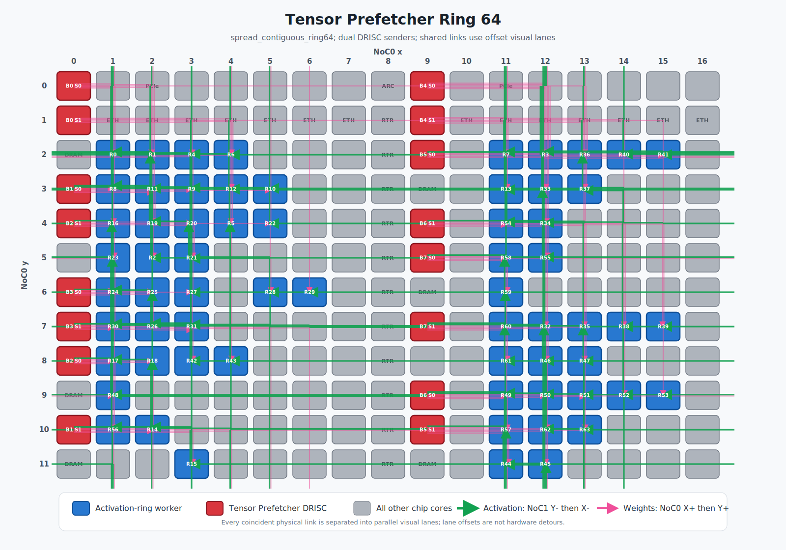
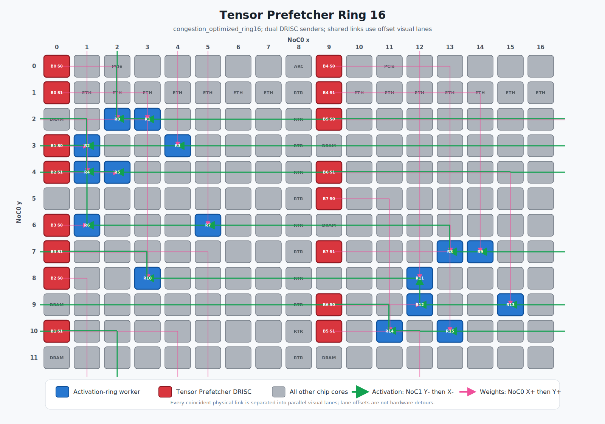
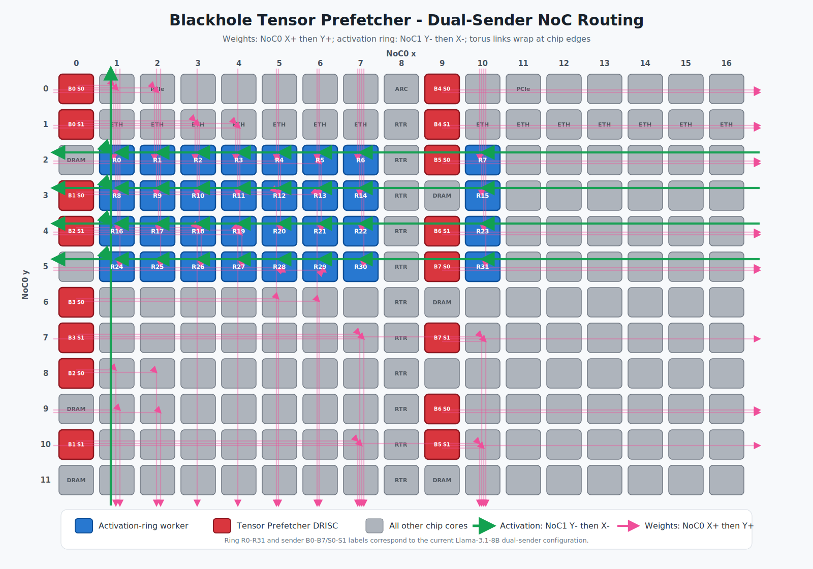

# The Tensor Prefetcher on Blackhole

The Tensor prefetcher streams matmul weight tensors out of DRAM and pushes them, over the NoC, directly into a ring of worker cores running a `gather_in0` 1D multicast matmul. The matmul reads its weights (in1) from a Global Circular Buffer (GCB); the prefetcher aims to keep that GCB full so the matmul is not left waiting on a DRAM read. The sender kernel runs on the **programmable DRAM core (DRISC)** itself — on Blackhole, right next to the GDDR controller — so weights go DRAM → DRISC L1 → NoC → receiver, without staging through an intermediate worker core (the final NoC transfer is a route that may still cross several links).

This report explains what the feature does, when it applies, and how to drive it from Python. It is the *usage* companion to the internal contract document `tt_metal/impl/buffers/prefetcher_matmul_design.md`, which pins down the byte-level handshake between the prefetcher and the matmul receiver.

> **Status:** the Tensor prefetcher is an experimental API under active development (the `ttnn.experimental.*` surface below). This report was last validated against the tree at branch `jbauman/tensor-prefetcher-tech-report` (July 2026); signatures may shift as the feature stabilizes.

## Contents

1. [Overview](#1-overview)
2. [When it applies](#2-when-it-applies)
3. [The ring](#3-the-ring)
4. [Weight layouts](#4-weight-layouts)
5. [Basic usage](#5-basic-usage)
6. [Sizing the GCB](#6-sizing-the-gcb)
7. [Tracing](#7-tracing)
8. [Lower-level control](#8-lower-level-control)
9. [Pitfalls](#9-pitfalls)
10. [References](#10-references)

## 1. Overview

Running the sender on the DRAM core puts it right beside the GDDR controller, which lets it push at high throughput on production shapes; its working L1 is small (~70 KB), which shapes how weights are staged. The path is Blackhole-only and requires programmable DRAM cores (§2).

The Tensor prefetcher is a **Start / Queue / Stop** lifecycle rather than a single op:

- `start_tensor_prefetcher` launches the DRISC sender kernels and a host worker thread, then returns. It is a long-running daemon; no prefetch work is scheduled yet. Only **one** prefetcher may be active per `MeshDevice` at a time.
- Each request describes a list of weights to stream. The DRISC kernels DMA their share of each weight from GDDR and push it into the receiver-side GCB. The usual pattern queues each weight immediately before the matmul that consumes it. The prefetcher reads the weights from DRAM asynchronously (and again on every trace replay), so **every queued weight tensor and the GCB must stay alive until `stop_tensor_prefetcher` returns** — don't let them be deallocated while the prefetcher is running.
- `stop_tensor_prefetcher` shuts the kernels and worker thread down. Call it before the device is torn down.

GCB credits gate the producer/consumer pipeline, so the DRISC back-pressures when the ring is full and the matmul consumes pages as they arrive. The DRISC daemon lives outside any trace, but a request issued while a command queue is capturing is recorded into that trace and replayed on each run, alongside the matmul it precedes (§7).

The figure below shows one workable layout on a Blackhole P150: ring size 64 (8 DRAM banks × 8 receivers per bank). You choose the receiver placement (§3), so treat the arrangement here as an example. Red tiles are the DRISC sender cores at the left/right DRAM columns; blue tiles are the activation-ring worker cores where the matmul runs. Pink links are weight pushes (DRISC → receiver, NoC0); green links are the activation ring (NoC1).



*Figure 1: An example ring-64 layout. DRISC senders (red) push weights on NoC0 to the worker ring (blue), which circulates activations on NoC1.*

## 2. When it applies

The Tensor prefetcher runs only where programmable DRAM cores are available. `is_tensor_prefetcher_supported` reports this; `start_tensor_prefetcher` raises when it is `False`, so gate on the check:

```python
if not ttnn.experimental.is_tensor_prefetcher_supported(device):
    pytest.skip("programmable DRAM cores unavailable")
```

It is `True` only on **Blackhole**, with firmware **≥ 19.12.0.0**, and **either no harvested DRAM channels or a single device**. A `models.common.utility_functions.run_for_blackhole` pytest marker handles the arch gate for tests.

## 3. The ring

A note on dimensions first, since the rest of the report leans on them. The matmul computes `out[M, N] = activation[M, K] @ weight[K, N]`. **K** is the contraction (input-feature) dimension — the width of the activation and the height of the weight, summed over during the multiply. **N** is the output-feature dimension — the weight's width and the output's width. **M** is the token/batch dimension, small in decode (often 32). The weight the prefetcher streams is the `K × N` matrix; the ring splits its **K** into blocks (one per ring step) and its **N** across receivers (each owns `N / ring_size` columns).

Each weight is streamed across a fixed **ring** of receiver cores:

```
ring_size = num_dram_banks * receivers_per_bank
```

The ring size is the unit of everything: the K dimension is delivered as `ring_size` K-blocks, and the matmul does `wait_front(ring_size)` per layer. Each **DRAM bank** (identified by a `bank_id`) is a sender domain that feeds a disjoint set of **receiver worker cores**, described to the API as a `bank_to_receivers` list of `(bank_id, CoreRangeSet)` pairs.

Take `num_dram_banks` from the device (`device.dram_grid_size().x`) rather than hardcoding 8 — some cards harvest a DRAM bank and have fewer. A P100, for example, reports 7 banks, not 8, and your ring geometry, weight sharding, and `bank_to_receivers` must all be built against that count. (Recall from §2 that a harvested DRAM channel is only supported on a single device, not across a mesh.)

Ring position `r` determines what a receiver needs: it computes output N-columns `[r*per_core_N, (r+1)*per_core_N)`, so it must receive weight shard `r`. A core's ring position is set by the order it appears in the receiver `CoreRangeSet` — the ranges in the order you add them, row-major *within* each range — not by any fixed walk of the grid. So with one single-core range per position you assign ring positions explicitly, in any (even scattered) order; §5 shows exactly how that ordering reaches the matmul. Bank `b` must then own the ring positions the matmul expects, and the weight's shard placement must agree with that pairing (§4). Production uses a scattered receiver layout (see `models/tt_transformers/tt/prefetcher`); a plain row-major grid works for a smoke test:

```python
def bank_receivers_row_major(bank_idx, recv_per_bank, ring_cols, row_offset=0):
    cores = []
    for k in range(recv_per_bank):
        ring_pos = bank_idx * recv_per_bank + k
        col = ring_pos % ring_cols
        row = ring_pos // ring_cols + row_offset
        cores.append(ttnn.CoreRange(ttnn.CoreCoord(col, row), ttnn.CoreCoord(col, row)))
    return ttnn.CoreRangeSet(cores)

bank_to_receivers = [
    (b, bank_receivers_row_major(b, recv_per_bank, ring_cols))
    for b in range(num_dram_banks)
]
```

A ring of 16 (8 banks × 2 receivers/bank) — the smallest production-shaped ring — might be laid out like this:



*Figure 2: An example ring-16 layout (8 banks × 2 receivers).*

### Receiver placement and NoC congestion

The placement is entirely caller-controlled: you decide which worker cores form the receiver ring (by sharding the activation and output tensors on them) and how each DRAM bank pairs to its receivers (`bank_to_receivers`). The row-major grid above is the simplest choice and is fine to start with.

Placement matters for bandwidth. The two traffic patterns run on separate NoCs — weight pushes (DRAM → receiver) on NoC0, the activation ring (receiver → receiver) on NoC1 — so they do not contend with each other; the goal is instead to avoid congestion within each NoC. The same receiver-core coordinates set the routes on both NoCs at once, so the placement is a single decision that has to keep both directions clean.

You construct the receiver ring yourself, from the cores actually free on your device, and pair `bank_to_receivers` to it. Whatever placement you pick, keep these in mind:

- **Ring order.** Receiver at ring position `r` must consume shard `r`, so lay the receivers out in ring order and pair `bank_to_receivers` to the weight's shard distribution (§4).
- **Account for harvesting.** A column-harvested part changes the logical→physical core mapping, so the same logical placement lands on different physical cores — and therefore different NoC routes — than on an unharvested part. Factor the harvesting into an optimal placement.
- **Both NoCs at once.** A placement that unclogs the NoC0 weight-push routes can crowd the NoC1 activation ring, or vice versa — the coordinates you choose fix both, so evaluate congestion on each NoC independently.

`MeshDevice.get_optimal_dram_bank_to_logical_worker_assignment(noc, coord)` returns, for the device at mesh coordinate `coord`, a `Dict[int, CoreCoord]` mapping each DRAM bank id to a worker core. It is a useful *input* for placement — it reflects that device's harvesting and DRAM geometry, so you can read per-device bank→core relationships off it — but it is not a turnkey receiver assignment: it optimizes `noc_async_read`/`write` endpoints, whose rows differ from the DRISC NoC endpoints, so it does not directly optimize DRISC→receiver routes. (The one-argument `get_optimal_dram_bank_to_logical_worker_assignment(noc)` form is deprecated; it reports only the mesh's reference device and is wrong on a heterogeneously harvested mesh — pass the `coord` overload.)

## 4. Weight layouts

The prefetcher supports two DRAM weight layouts. The GCB factory detects which one a weight uses from its allocation and builds the matching plumbing; all weights sharing one GCB must use the same layout.

**Receiver-contiguous** (`NdShardSpec`, `num_shards == ring_size`) is the recommended default. Each shard — full K, `N / ring_size` columns — is owned by exactly one receiver. Because receivers no longer share a bank's data, a bank with two or more receivers can be driven by two DRISC sender cores at once, roughly doubling per-bank bandwidth, and it is the layout that supports streaming delivery (§5). Combined, streaming receiver-contiguous weights give the best mix of throughput and flexibility, so use this layout by default. These recommendations (receiver-contiguous, dual senders, `CONTIGUOUS_1D` — §4) are measurement-backed on Blackhole production Llama shapes; measure your own shapes with `tests/ttnn/unit_tests/operations/transformers/test_prefetcher_BH_bench.py`.

K must be tile-aligned *and* divisible by `ring_size`, and N must divide evenly into `ring_size` shard columns, so pad the host tensor before allocating: K up to a multiple of `ring_size * TILE_SIZE`, and require `N % ring_size == 0` (pad N similarly if it does not). The device weight is allocated from that padded host tensor.

```python
K_padded = round_up(K, ring_size * ttnn.TILE_SIZE)
assert N % ring_size == 0, "N must divide evenly across ring_size receiver shards"

# Pad the host weight to K_padded (zeros in the tail); the real rows occupy [:K].
pt_weight = torch.zeros(1, 1, K_padded, N)
pt_weight[:, :, :K, :] = pt_weight_unpadded            # (1, 1, K, N)

dram_cores = ttnn.CoreRangeSet({ttnn.CoreRange((0, 0), (num_dram_banks - 1, 0))})
nd_shard = ttnn.NdShardSpec(
    ttnn.Shape([K_padded, N // ring_size]),
    dram_cores,
    ttnn.ShardOrientation.ROW_MAJOR,
    ttnn.ShardDistributionStrategy.CONTIGUOUS_1D,    # preferred; see note below
)
weight_mem = ttnn.MemoryConfig(ttnn.BufferType.DRAM, nd_shard)
tt_weight = ttnn.as_tensor(pt_weight, device=device, dtype=dtype,
                           memory_config=weight_mem, layout=ttnn.TILE_LAYOUT)
```

The figure below shows a default dual-sender layout: each bank's receivers are divided ceil/floor across its two DRISC cores (`B<bank> S0`, `B<bank> S1`).



*Figure 3: One default dual-sender layout — each bank's two DRISC cores (B# S0 / B# S1) split that bank's receivers, roughly doubling per-bank bandwidth.*

**Legacy K-row-major** (`WIDTH_SHARDED`) is the older alternative: one wide shard per bank, holding the full K dimension and `N / num_dram_banks` columns, K-row-major within the bank so a single read serves all of a bank's receivers. Always one sender per bank, and no streaming. Use it only for weights already allocated this way. It uses the same `K_padded` host tensor as above, and here N must divide evenly across the banks and per-bank across their receivers (`N % (num_dram_banks * recv_per_bank) == 0`).

```python
dram_cores = ttnn.CoreRangeSet({ttnn.CoreRange((0, 0), (num_dram_banks - 1, 0))})
weight_mem = ttnn.MemoryConfig(
    ttnn.TensorMemoryLayout.WIDTH_SHARDED, ttnn.BufferType.DRAM,
    ttnn.ShardSpec(dram_cores, [K_padded, N // num_dram_banks], ttnn.ShardOrientation.ROW_MAJOR),
)
```

### The shard-placement / pairing contract

The prefetcher delivers *shard s* to *ring position s*, which requires the weight's shard→bank placement and the GCB's `bank_to_receivers` pairing to agree. This pairing is a **caller-owned invariant: it is not cross-validated** — the GCB factory checks receiver counts and K/N geometry (§5), but not that your shard distribution matches your `bank_to_receivers` ordering. A mismatch is a common cause of wrong output or a hang and fails silently, so pair them deliberately:

| Weight distribution | Pairing helper | Bank `b` feeds ring positions |
|---|---|---|
| `CONTIGUOUS_1D` (preferred) | `bank_receivers_contiguous` | `[b*R, b*R+1, …, b*R+R-1]` |
| `ROUND_ROBIN_1D` | `bank_receivers_strided` | `[b, b+num_banks, b+2*num_banks, …]` |
| Legacy `WIDTH_SHARDED` | `bank_receivers_row_major` | `[b*R, …, (b+1)*R-1]` |

Under `CONTIGUOUS_1D`, shard `s` lands on bank `s // R`, so each bank feeds a contiguous ring arc; under `ROUND_ROBIN_1D`, shard `s` lands on bank `s % num_banks`, a strided set. `CONTIGUOUS_1D` is generally the more efficient of the two (a bank's pushes stay on a local ring segment rather than fanning across the whole ring), so prefer it. Either way, pairing with the matching helper makes shard index equal ring position, so the weight is stored in ring order with no host-side permutation. (`prefetcher_common.py` ships all three helpers.)

## 5. Basic usage

The common case — prefetch a weight and immediately run the matmul that consumes it — is a single call, `prefetch_and_linear`. It queues the prefetch and runs `ttnn.linear` against the same GCB and program config, deriving the prefetch parameters from the GCB so the two sides stay consistent. This example uses a receiver-contiguous weight (§4) with streaming enabled — the recommended combination.

**Getting the ordered ring into the matmul.** The matmul runs on the receiver ring — the cores its activation and output tensors are sharded on (§3) — so no sub-device or stall group is needed; the DRAM senders live on a separate programmable core type off the worker grid. Ring *order* comes from the **activation (in0) tensor's shard-spec `CoreRangeSet`**, read in its stored range order, rather than from any program-config field: the `gather_in0` factory binds ring position `i` to the i-th core in that grid (which then consumes weight shard `i`). So you control the order, including scattered non-rectangular placements, through how you build that `CoreRangeSet`:

```python
# ring_cores: List[ttnn.CoreCoord] in ring-position order (index == ring position).
# Build an ORDER-PRESERVING CoreRangeSet — one single-core range per position.
# Do NOT pass a list of CoreCoords (that constructor merges/sorts and destroys the order).
ring_crs = ttnn.CoreRangeSet([ttnn.CoreRange(c, c) for c in ring_cores])

act_mem_config = ttnn.create_sharded_memory_config(
    shape=(M, K_padded // ring_size),
    core_grid=ring_crs,                 # <-- this ordering IS the ring order
    strategy=ttnn.ShardStrategy.WIDTH,
    orientation=ttnn.ShardOrientation.ROW_MAJOR,
    use_height_and_width_as_shard_shape=True,
)
# Use the same ring_crs for the output sharded mem config.
```

Then the program config. `stream_in1=True` turns on streaming delivery, which lets the matmul consume weight blocks as they land (so the GCB can be shallow); `prefetch_and_linear` reads this flag to pick streaming vs batched automatically. Two fields are easy to misread: `in0_block_w` is a placeholder here — `gather_in0` overrides the effective in0 block width from the activation shard width, so its value is ignored — and `compute_with_storage_grid_size` is also ignored under `gather_in0` (the ring comes from the activation shard grid above; any grid whose product is `ring_size` is fine). Set `num_global_cb_receivers` to the per-bank receiver count: the legacy WIDTH_SHARDED path validates it exactly (a mismatch mis-sizes `in1_CB`), while the receiver-contiguous path derives its geometry from the GCB and does not check it.

```python
program_config = ttnn.MatmulMultiCoreReuseMultiCast1DProgramConfig(
    compute_with_storage_grid_size=(ring_cols, ring_rows),  # ignored for gather_in0
    in0_block_w=1,                                     # placeholder; overridden from the in0 shard
    out_subblock_h=1, out_subblock_w=out_subblock_w,   # out_subblock_w divides per_core_N, ≤ 8
    per_core_M=M // ttnn.TILE_SIZE,
    per_core_N=N // ring_size // ttnn.TILE_SIZE,        # == weight per-receiver N in tiles
    fuse_batch=True, fused_activation=None,
    mcast_in0=False, gather_in0=True,
    num_global_cb_receivers=recv_per_bank,
    stream_in1=True,                                    # streaming delivery (recv-contig only)
    hop_cores=ttnn.CoreRangeSet([]),                    # only for relay hops
)
```

Build the GCB with `create_global_circular_buffer_for_matmul_1d`. It validates the geometry — that the K dimension divides evenly into `ring_size` blocks, that per-receiver N matches `per_core_N`, and that `bank_to_receivers` has the right counts — then allocates the buffer at the `gcb_size` you pass (asserting only a min/max; see §6). It does **not** check that your shard distribution matches the `bank_to_receivers` ordering (§4) — that pairing is yours to get right:

```python
gcb = ttnn.experimental.create_global_circular_buffer_for_matmul_1d(
    device, [program_config], [tt_weight], bank_to_receivers, gcb_size,
)
```

Then start the prefetcher once, run the consuming matmuls through `prefetch_and_linear`, and stop when done. In real code, call `start_tensor_prefetcher` / `stop_tensor_prefetcher` directly (typically at model init / teardown), and keep the weights and GCB alive for the whole span between them:

```python
ttnn.experimental.start_tensor_prefetcher(device)
try:
    out = ttnn.experimental.tensor_prefetcher_matmul.prefetch_and_linear(
        tt_act, tt_weight,
        global_cb=gcb,
        program_config=program_config,
        memory_config=output_mem_config,    # extra kwargs forwarded to ttnn.linear
        compute_kernel_config=compute_kernel_config,
        dtype=ttnn.bfloat16,
    )
finally:
    ttnn.experimental.stop_tensor_prefetcher(device)
```

`tt_act` and `output_mem_config` are width-sharded on the receiver ring (via `ring_crs` above), which is what places the matmul on those cores. `prefetch_and_linear` chooses batched vs streaming delivery from `program_config.stream_in1` automatically, so a single call covers both. (Tests can instead use the `tensor_prefetcher_session` context manager in `prefetcher_common.py`, which wraps start/stop and a device sync for setup/teardown convenience — it's a test helper, not the production pattern.)

## 6. Sizing the GCB

`gcb_size` is the per-receiver FIFO size in bytes. The per-receiver, per-block push page is

```
push_page = k_block_w_tiles * n_per_recv_tiles * tile_bytes
```

where for the receiver-contiguous layout `k_block_w_tiles = K_padded / ring_size / TILE` and `n_per_recv_tiles = N / ring_size / TILE` (`tile_bytes`: bf16 = 2048, bf8_b = 1088). A full ring is `ring_size` such pages — the entire per-receiver weight slab (`K × N/ring_size`). The floor depends on the delivery mode:

- **Batched (non-streaming): the GCB must hold a full ring.** The matmul waits for a receiver's whole slab before it reads, so `gcb_size` must be at least the largest consuming matmul's per-receiver weight, `ring_size * push_page`. Size it below that and the matmul stalls waiting for pages the ring has no room to hold. When one GCB serves several weights, size to the largest.
- **Streaming: a partial window is enough.** Because the matmul consumes blocks as they land, the GCB only needs to buffer a window of them (as few as two), so it can be far smaller than the full weight. This is streaming's main sizing advantage and why it pairs well with large weights.
- **Pass a multiple of the page size — the remainder is discarded.** `create_global_circular_buffer_for_matmul_1d` allocates exactly `gcb_size` (asserting only the minimum above and a maximum cap); it does **not** round. The matmul then floors its effective in1 FIFO to a whole number of pages (`floor(gcb_size / push_page) * push_page`), so any bytes past the last whole page are wasted. Pass a multiple of the largest consuming matmul's `push_page`. Going beyond a full ring does not raise throughput — the DRISC stalls on `remote_cb_reserve_back` once the ring is full — and the size is capped against a remote-CB page-count limit regardless.
- **Leave L1 headroom.** The GCB shares each receiver core's ~1.4 MB L1 with the matmul's in0/in1/out/interm CBs, so size it to fit alongside them (production benches reserve ~256 KB of headroom).

## 7. Tracing

The DRISC daemon is started once, outside the trace. Each `prefetch_and_linear` queues its weight right before its matmul. When a request targets a command queue that is mid trace-capture, the prefetcher records it into that trace instead of sending it immediately, and re-sends it on every `execute_trace`. So capture picks up the request together with its matmul, and `execute_trace` replays both, re-priming the ring each run. The same `prefetch_and_linear` call works inside and outside a trace — it uses the current command queue by default, which is the recording queue during capture.

```python
ttnn.experimental.start_tensor_prefetcher(device)

# Compile once (fills the program cache) before capturing.
prefetch_and_linear(...)
ttnn.synchronize_device(device)

trace = ttnn.begin_trace_capture(device, cq_id=0)
out = prefetch_and_linear(...)               # queue request + matmul both captured
ttnn.end_trace_capture(device, trace, cq_id=0)

ttnn.execute_trace(device, trace, cq_id=0, blocking=True)   # replays both
ttnn.release_trace(device, trace)
ttnn.experimental.stop_tensor_prefetcher(device)
```

To capture more than one matmul per trace, issue several `prefetch_and_linear` calls between `begin`/`end`; each records its own queue request alongside its matmul. If you drive the request API directly (§8), pass the recording CQ as `cq_id` to `queue_tensor_prefetcher_request` so the request is captured rather than sent immediately.

To guarantee freshly written weights have landed before the prefetcher reads them, call `wait_for_cq_on_tensor_prefetcher(device, cq_id)` on the host thread after the writes and before the dependent prefetch — every request queued after it waits for that CQ's prior work to complete on device.

## 8. Lower-level control

`prefetch_and_linear` covers the common case. When you need more control — replaying many distinct weights from one request, a custom delivery order, a raw GCB, or a subset of the mesh — drive the request API directly.

### The request API

```python
ttnn.experimental.queue_tensor_prefetcher_request(
    mesh_device,
    tensors,               # List[(weight, block_count) | (weight, block_count, rotation)]
    global_cb,
    *,
    device_subset=None,    # MeshCoordinateRangeSet; defaults to the full mesh
    cq_id=None,
)
```

`tensors` is the full, flattened list of weights, streamed in list order — distinct tensors for distinct layers, or a repeated tensor to replay it. Per-GCB ring state persists across requests, so successive queues resume where the last left off, and successive queues may target different GCBs. `block_count` is the number of K-blocks to split that tensor's K dimension into; for a `gather_in0` matmul it equals `ring_size`, and `tensor_prefetcher_block_count_for_matmul_1d(program_config, weight, gcb)` computes and validates it for a receiver-contiguous weight. The corresponding matmul is a normal `ttnn.linear(..., global_cb=gcb)` call.

A manual queue + matmul, equivalent to one `prefetch_and_linear`:

```python
block_count = ttnn.experimental.tensor_prefetcher_block_count_for_matmul_1d(
    program_config, tt_weight, gcb)          # recv-contig; legacy: block_count = ring_size

ttnn.experimental.queue_tensor_prefetcher_request(
    device, [(tt_weight, block_count)], global_cb=gcb)

out = ttnn.linear(
    tt_act, tt_weight, program_config=program_config, global_cb=gcb,
    memory_config=output_mem_config, compute_kernel_config=compute_kernel_config,
    dtype=ttnn.bfloat16,
)
```

### Custom streaming rotation

Streaming delivery is enabled with `program_config.stream_in1` and, through `prefetch_and_linear`, needs nothing more (§5) — it supplies the natural-order rotation automatically. Driving the request API directly exposes the underlying knob: the 3-tuple `(weight, block_count, rotation)` (receiver-contiguous layout only) delivers each receiver's K-blocks in a host-specified ring-rotated FIFO order instead of the whole slab at once, so a `stream_in1` matmul can consume blocks as they land and start before the tensor fully arrives (letting the GCB stay shallow). The 2-tuple form delivers batched (whole-slab) instead.

`rotation` has length `ring_size`, is indexed by global ring position, and each entry is in `[0, block_count)`. At push step `p`, the receiver at global position `r` sources physical block `(rotation[r] + p) mod block_count`. `rotation[r] = r` reproduces the natural topology order (what `prefetch_and_linear` uses). The matmul must consume in the matching order; a mismatch delivers each receiver's blocks in the wrong order and silently produces incorrect results. For `CONTIGUOUS_1D` weights, slice the rotation by the contiguous global position (`bank*receivers_per_bank + slab`).

### Raw GCB factory

`ttnn.experimental.create_global_circular_buffer_for_tensor_prefetcher(mesh_device, bank_to_receivers, size, buffer_type=L1, support_multi_receiver_shards=True)` builds a DRAM-sender GCB without the matmul cross-checks — useful when there is no single program config to validate against (e.g. the validator smoke tests). `support_multi_receiver_shards` reads with an inverted sense: `True` forces a single sender per bank; `False` allows dual senders for a receiver-contiguous layout. `create_global_circular_buffer_for_matmul_1d` takes the same argument, defaulting to the detected layout when left unset.

### Multiple GCBs and other knobs

- **One prefetcher, many GCBs.** The receiver count is read per-GCB on every request, so a single prefetcher serves GCBs with different receiver counts. Successive queues may target different GCBs, each with its own persistent ring state; place them on disjoint receiver cores (e.g. via a `row_offset`).
- **Page-size switching.** One GCB can serve tensors of different page sizes across requests; sender and receiver credit the skipped padding on resize. For batched delivery size it to `ring_size * max(page)` (a full ring of the largest); an all-streaming GCB only needs a partial window of the largest page (§6).
- **`device_subset`.** Restrict a request to a `MeshCoordinateRangeSet`; it defaults to the full mesh.

## 9. Pitfalls

- **Skipping the support gate.** `start_tensor_prefetcher` raises on unsupported hardware — call `is_tensor_prefetcher_supported` first.
- **`num_global_cb_receivers` ≠ receivers per bank (legacy path).** On the legacy WIDTH_SHARDED layout this mis-sizes `in1_CB`; the receiver-contiguous path ignores the field (§5).
- **`bank_to_receivers` not matching the shard distribution.** Shard index ≠ ring position → wrong output or hang, silently (not cross-validated). Use the matching helper (§4).
- **Weight K not divisible by `ring_size`.** The prefetcher over-reads and the matmul waits on pages that never come. `create_global_circular_buffer_for_matmul_1d` catches this.
- **Mis-sizing the GCB.** Below a full ring, a batched (non-streaming) matmul stalls waiting for pages the ring can't hold; above a full ring gains no throughput and takes L1 the matmul CBs need. Size batched to exactly a full ring, streaming to a partial window (§6).
- **Not stopping the prefetcher** before device teardown leaves the DRISC kernels running. Pair `start_tensor_prefetcher` with `stop_tensor_prefetcher` in a `try/finally` (in tests, the `tensor_prefetcher_session` helper does this for you).
- **Freeing a weight or the GCB while the prefetcher runs.** The DRISC reads them asynchronously (and on every trace replay); keep every queued tensor and the GCB alive until `stop` returns (§1).
- **Starting a second prefetcher on the same `MeshDevice`.** Only one may be active at a time — stop the first.
- **Mixing layouts in one GCB.** `create_global_circular_buffer_for_matmul_1d` rejects it (all weights on a GCB must share one layout); the low-level runtime detects layout per tensor, so this guard is the matmul-aware factory's, not every raw GCB use's.
- **A streaming rotation the matmul does not match** silently produces incorrect output (the blocks arrive in the wrong order).

## 10. References

Source:

- Public ttnn API and cross-check documentation: [`ttnn/api/ttnn/global_circular_buffer.hpp`](../../ttnn/api/ttnn/global_circular_buffer.hpp).
- Experimental `tt_metal` API: [`tt_metal/api/tt-metalium/experimental/global_circular_buffer.hpp`](../../tt_metal/api/tt-metalium/experimental/global_circular_buffer.hpp) and [`tt_metal/api/tt-metalium/experimental/tensor_prefetcher.hpp`](../../tt_metal/api/tt-metalium/experimental/tensor_prefetcher.hpp).
- ttnn op + Python bindings: [`ttnn/cpp/ttnn/operations/experimental/tensor_prefetcher/`](../../ttnn/cpp/ttnn/operations/experimental/tensor_prefetcher/).
- `prefetch_and_linear` helper: [`ttnn/ttnn/_experimental/tensor_prefetcher_matmul.py`](../../ttnn/ttnn/_experimental/tensor_prefetcher_matmul.py).
- Manager + DRISC kernel: [`tt_metal/impl/buffers/tensor_prefetcher_manager.hpp`](../../tt_metal/impl/buffers/tensor_prefetcher_manager.hpp), [`.cpp`](../../tt_metal/impl/buffers/tensor_prefetcher_manager.cpp), [`tt_metal/impl/buffers/kernels/tensor_prefetcher.cpp`](../../tt_metal/impl/buffers/kernels/tensor_prefetcher.cpp).
- Internal contract (matmul ↔ prefetcher): [`tt_metal/impl/buffers/prefetcher_matmul_design.md`](../../tt_metal/impl/buffers/prefetcher_matmul_design.md).

Worked examples:

- [`tests/ttnn/unit_tests/operations/prefetcher_common.py`](../../tests/ttnn/unit_tests/operations/prefetcher_common.py) — shared helpers (`bank_receivers_strided`, `bank_receivers_contiguous`, `make_recv_contig_weight`, `tensor_prefetcher_session`).
- [`tests/ttnn/unit_tests/operations/transformers/test_prefetcher_BH_bench.py`](../../tests/ttnn/unit_tests/operations/transformers/test_prefetcher_BH_bench.py) — end-to-end matmul benchmarks (legacy, receiver-contiguous, dual-sender, streaming).
- [`tests/ttnn/unit_tests/operations/transformers/test_prefetcher_BH_validator.py`](../../tests/ttnn/unit_tests/operations/transformers/test_prefetcher_BH_validator.py) — validator-receiver smoke tests (multi-GCB switching, mixed receiver counts, page-size switch).
- [`tests/ttnn/unit_tests/base_functionality/test_dram_sender_global_cb_py.py`](../../tests/ttnn/unit_tests/base_functionality/test_dram_sender_global_cb_py.py) — minimal GCB creation.
