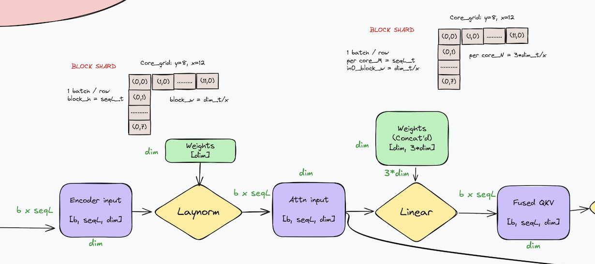
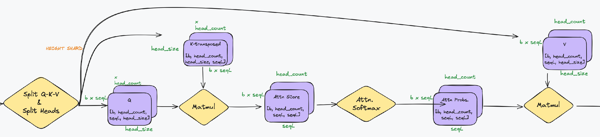
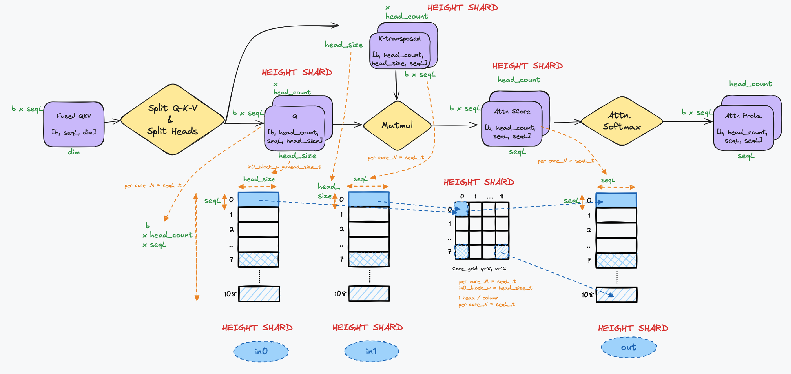
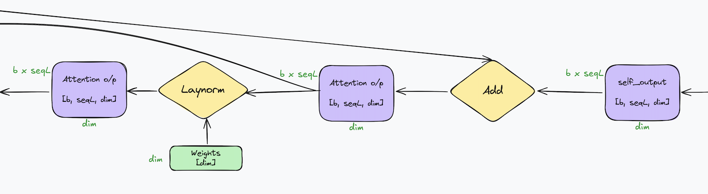
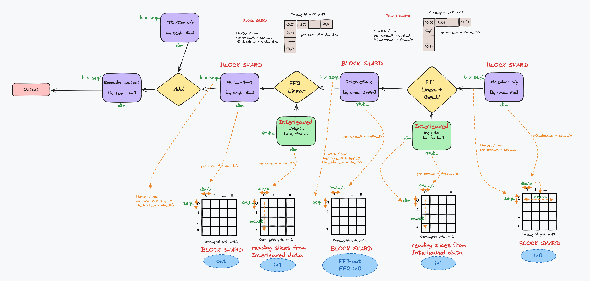

# ViT in TT-NN

## Contents

- [1. Overview](#1-overview)
- [2. ViT TT-NN - Optimization Techniques] (#2-vit-tt-nn-optimization-techniques)
- [3. ViT TT-NN Code Structure](#3-vit-tt-nn-code-structure)
  - [2.1 Input](#21-input)
  - [2.2 Layer Normalization (Laynorm)](#22-layer-normalization-laynorm)
  - [2.3 Linear Projection](#23-linear-projection)
  - [2.4 Splitting into Q-K-V](#24-splitting-into-q-k-v)
  - [2.5 Attention Mechanism](#25-attention-mechanism)
  - [2.6 Matmul with Value](#26-matmul-with-value)
  - [2.7 Concatenating Heads](#27-concatenating-heads)
  - [2.8 Linear Projection (again)](#28-linear-projection-again)
  - [2.9 Add and Norm](#29-add-and-norm)
  - [2.10 Feed-Forward Network](#210-feed-forward-network)
  - [2.11 Add and Norm (again)](#211-add-and-norm-again)
  - [2.12 Output](#212-output)
- [3. Futher Implementation](#3-futher-implementation)
  - [3.1 Patch Embedding](#31-patch-embedding)
  - [3.2 Self-Attention](#32-self-attention)
  - [3.3 Feed-Forward Network and Residual Connections](#33-feed-forward-network-and-residual-connections)
- [4. Conclusion](#4-conclusion)
- [4. References](#5-references)

## 1. Overview

The [Vision Transformer](https://arxiv.org/pdf/2010.11929) (ViT) is a transformer model that is utilized for vision procesing tasks. The ViT architecture in TT-NN leverages the self-attention mechanism, originally designed for NLP tasks, to process image data by treating each image as a sequence of patches. This walkthrough explains the key components of the ViT model and demonstrates how the Tenstorrent TT-NN library implements these components efficiently.
For more details on the architecture, please refer to the [References](#5-references).

## 2. ViT TT-NN Optimization Techniques


## 3. ViT TT-NN Code Structure

This is a step-by-step walkthrough of the ViT encoder implementation in TT-NN on Grayskull. The diagram below summarizes all of these steps in a flow chart, which is examined in smaller pieces below.


### 3.1 Input
The input to the Vision Transformer consists of image patches that are flattened and embedded into a higher-dimensional space. The input is represented as:

`b × seqL × dim`

Where:
- `b` is the batch size.
- `seqL` is the sequence length (corresponding to the number of patches).
- `dim` is the embedding dimension.

This corresponds to the patch embedding stage, where the image is split into fixed-size patches, flattened, and linearly embedded.

**Functional Code**:

```python
def vit_patch_embeddings(config, pixel_values, *, parameters):
    batch_size, img_h, img_w, img_c = pixel_values.shape  # NHWC format
    patch_size = 16
    patch_count = img_h // patch_size
    patch_size_sq_trpl = patch_size * patch_size * 3  # RGB images
    patch_count_all = patch_count * patch_count

    folded_pixel_values = ttnn.fold(pixel_values, stride_h=patch_size, stride_w=1)
    patch_embedding_output = ttnn.linear(
        folded_pixel_values,
        parameters.projection.weight,
        bias=parameters.projection.bias,
    )
    patch_embedding_output = ttnn.reshape(patch_embedding_output, (batch_size, patch_count_all, patch_size_sq_trpl))

    return patch_embedding_output
```

**Optimized Code**:

```python
def vit_patch_embeddings(config, pixel_values, *, parameters):
    batch_size, img_h, img_w, img_c = pixel_values.shape  # permuted input NHWC
    patch_size = 16
    patch_count = img_h // patch_size  # 14
    patch_size_sq_trpl = patch_size * patch_size * 3  # 768
    patch_count_all = patch_count * patch_count  # 196
    stride_h = patch_size
    stride_w = 1

    folded_pixel_values = ttnn.fold(pixel_values, stride_h, stride_w)  # 1568, 1024
    ttnn.deallocate(pixel_values)
    patch_embedding_output = ttnn.linear(
        folded_pixel_values,
        parameters.projection.weight,
        bias=parameters.projection.bias,
        memory_config=ttnn.L1_MEMORY_CONFIG,
        dtype=ttnn.bfloat16,
        core_grid=config.core_grid,
    )
    patch_embedding_output = ttnn.to_layout(patch_embedding_output, layout=ttnn.ROW_MAJOR_LAYOUT)
    patch_embedding_output = ttnn.reshape(patch_embedding_output, (batch_size, patch_count_all, patch_size_sq_trpl))

    return patch_embedding_output
```

### 2.2 Layer Normalization (Laynorm)
After embedding the patches, Layer Normalization is applied to the input sequence. This ensures that the input embeddings are normalized before the attention mechanism, which improves the training stability of the model. The **block sharding** in the diagram (see section 2.4 below) illustrates how data is partitioned and distributed across multiple processing cores for parallel computation, enhancing efficiency during training.

**Functional Code**:

```python
def vit_layernorm_before(config, hidden_states, *, parameters):
    attention_output = ttnn.layer_norm(
        hidden_states,
        weight=parameters.layernorm_before.weight,
        bias=parameters.layernorm_before.bias,
        epsilon=config.layer_norm_eps,
    )
    return attention_output
```

**Optimized Code**:

```python
def vit_layernorm_before(config, hidden_states, *, parameters):
    attention_output = ttnn.layer_norm(
        hidden_states,
        weight=parameters.layernorm_before.weight,
        bias=parameters.layernorm_before.bias,
        epsilon=config.layer_norm_eps,
        memory_config=ttnn.L1_BLOCK_SHARDED_MEMORY_CONFIG,
        program_config=config.program_configs["layernorm_program_config"],
    )

    return attention_output
```
```python
"layernorm_program_config": ttnn.LayerNormShardedMultiCoreProgramConfig(
    compute_with_storage_grid_size=(core_grid.x, core_grid.y),
    subblock_w=dim_t__x,  # 2,
    block_h=seqL_t,  # 7,
    block_w=dim_t__x,  # 2,
    inplace=False,
)
```

### 2.3 Linear Projection
Following normalization, the input is passed through a linear projection layer that transforms the input from one dimension to another. Again, **block sharding** is used. This prepares the input for the self-attention mechanism by aligning the dimensions.

**Functional Code**:

```python
def vit_linear_projection(config, hidden_states, *, parameters):
    return ttnn.linear(
        hidden_states,
        parameters.projection.weight,
        bias=parameters.projection.bias,
    )
```

**Optimized Code**:

```python
def vit_linear_projection(config, hidden_states, *, parameters):
    return ttnn.linear(
        hidden_states,
        parameters.projection.weight,
        bias=parameters.projection.bias,
        memory_config=ttnn.L1_MEMORY_CONFIG,
        dtype=ttnn.bfloat16,
        core_grid=config.core_grid
    )
```

**Layer Normalization and Linear Projection Diagram**:



### 2.4 Splitting into Q-K-V
The input embeddings are then split into **Query** (Q), **Key** (K), and **Value** (V) matrices. This is done by projecting the input embeddings into three separate matrices. Each matrix has a size of:

`lh × seqL × head_size`

where 
- `lh` is the number of attention heads
- `seqL` is the sequence length
- `head_size` is the size of each split head.

Additionally, height sharding is applied by splitting the sequence length (`seqL`) across multiple processing cores. This allows the matrix operations to be parallelized, with each core handling a tile of the sequence length.

**Functional Code**:

```python
query, key, value = ttnn.transformer.split_query_key_value_and_split_heads(query_key_value, num_heads=num_heads)
```

**Optimized Code**:

```python
query, key, value = ttnn.transformer.split_query_key_value_and_split_heads(query_key_value, memory_config=ttnn.L1_HEIGHT_SHARDED_MEMORY_CONFIG, num_heads=num_heads)
```

**QKV Diagram**:



### 2.5 Attention Mechanism
The attention mechanism begins by calculating the dot product between the Query and Key matrices. This result is then scaled by the size of the attention head to form the Attention Scores. These scores are passed through a Softmax operation, which normalizes them across the sequence length. **Height sharding** is applied during this process, where the sequence length is split across cores to parallelize the computation of the Attention Scores, making the operation more efficient.

**Functional Code**:

```python
attention_scores = ttnn.matmul(query, key)
attention_probs = ttnn.transformer.attention_softmax_(attention_scores, head_size=head_size)
```

**Optimized Code**:

```python
attention_scores = ttnn.matmul(query, key, memory_config=ttnn.L1_HEIGHT_SHARDED_MEMORY_CONFIG, dtype=ttnn.bfloat8_b, program_config=config.program_configs["query_by_key_matmul_program_config"])

attention_probs = ttnn.transformer.attention_softmax_(attention_scores, attention_mask=attention_mask, head_size=head_size, program_config=config.program_configs["softmax_program_config"])
```
```python
"query_by_key_matmul_program_config": ttnn.MatmulMultiCoreReuseProgramConfig(
    compute_with_storage_grid_size=(core_grid.x, core_grid.y),
    in0_block_w=dim_t__x,  # 2,
    out_subblock_h=1,
    out_subblock_w=seqL_t,  # 7,
    per_core_M=seqL_t,  # 7,
    per_core_N=head_seqL_t,  # 7,
),
"softmax_program_config": ttnn.SoftmaxShardedMultiCoreProgramConfig(
    compute_with_storage_grid_size=(core_grid.x, core_grid.y),
    subblock_w=head_seqL_t,  # 7,
    block_h=seqL_t,  # 7,
    block_w=head_seqL_t,  # 7,
),
```

**Attention Diagram**:



### 2.6 Matmul with Value
The normalized attention scores are then multiplied by the Value matrix to produce the attention output. This is the core of the self-attention mechanism, allowing the model to focus on different parts of the input sequence. **Height sharding** is used.

**Functional Code**:

```python
context_layer = ttnn.matmul(attention_probs, value)
```

**Optimized Code**:

```python
context_layer = ttnn.matmul(attention_probs, value, memory_config=ttnn.L1_HEIGHT_SHARDED_MEMORY_CONFIG, dtype=ttnn.bfloat8_b, program_config=config.program_configs["attention_probabilities_by_value_matmul_program_config"])
```
```python
"attention_probabilities_by_value_matmul_program_config": ttnn.MatmulMultiCoreReuseProgramConfig(
    compute_with_storage_grid_size=(core_grid.x, core_grid.y),
    in0_block_w=seqL_t,  # 7,
    out_subblock_h=1,
    out_subblock_w=head_size_t__x,  # 2,
    per_core_M=seqL_t,  # 7,
    per_core_N=head_size_t__x,  # 2,
)
```

### 2.7 Concatenating Heads
The outputs from all attention heads are concatenated back together. This creates a unified representation of the attention across all heads:

` seqL × head_count × head_size` 

This step aggregates the outputs from the different heads into a single vector representation for each position in the sequence.

**Functional Code**:

```python
context_layer = ttnn.transformer.concatenate_heads(context_layer)
```

**Optimized Code**:

```python
context_layer = ttnn.transformer.concatenate_heads(context_layer. memory_config=ttnn.L1_BLOCK_SHARDED_MEMORY_CONFIG)
```

**Concat Heads diagram**:


### 2.8 Linear Projection (again)
After concatenating the attention heads, the output is passed through another linear layer to project it back to the original embedding dimension. Like the previous linear layer, **block sharding** is used. This ensures that the final output of the attention block has the correct shape for subsequent operations.

**Functional Code**:

```python
self_output = ttnn.linear(
    context_layer,
    parameters.output.dense.weight,
    bias=parameters.output.dense.bias,
)
```

**Optimized Code**:

```python
self_output = ttnn.linear(
    context_layer,
    parameters.output.dense.weight,
    bias=parameters.output.dense.bias,
    memory_config=ttnn.L1_BLOCK_SHARDED_MEMORY_CONFIG,
    dtype=ttnn.bfloat8_b,
    program_config=config.program_configs["self_output_matmul_program_config"],
)
```
```python
"self_output_matmul_program_config": ttnn.MatmulMultiCoreReuseMultiCastProgramConfig(
    compute_with_storage_grid_size=(core_grid.x, core_grid.y),
    in0_block_w=dim_t__x,  # 2,
    out_subblock_h=seqL_t,  # 7,
    out_subblock_w=dim_t__x,  # 2,
    per_core_M=seqL_t,  # 7,
    per_core_N=dim_t__x,  # 2,
    transpose_mcast=False,
    fused_activation=None,
)
```

### 2.9 Add and Norm
A residual connection (skip connection) is applied, adding the original input to the attention block back to the output of the attention block. This helps in maintaining gradient flow through the network and stabilizes training. The resulting tensor is then normalized again using layer normalization. Additionally, **block sharding** is used.

**Functional Code**:

```python
multi_head_attention_output = ttnn.add(
    multi_head_attention_output, hidden_states
)
layernorm_after_output = ttnn.layer_norm(
    multi_head_attention_output,
    weight=parameters.layernorm_after.weight,
    bias=parameters.layernorm_after.bias,
)
```

**Optimized Code**:

```python
multi_head_attention_output = ttnn.add(
    multi_head_attention_output,
    hidden_states,
    memory_config=ttnn.L1_BLOCK_SHARDED_MEMORY_CONFIG,
    dtype=ttnn.bfloat8_b,
)
layernorm_after_output = ttnn.layer_norm(
    multi_head_attention_output,
    weight=parameters.layernorm_after.weight,
    bias=parameters.layernorm_after.bias,
    memory_config=ttnn.L1_BLOCK_SHARDED_MEMORY_CONFIG,
    program_config=config.program_configs["layernorm_after_output_program_config"],
)
```
```python
"layernorm_after_output_program_config": ttnn.LayerNormShardedMultiCoreProgramConfig(
    compute_with_storage_grid_size=(core_grid.x, core_grid.y),
    subblock_w=dim_t__x,  # 2,
    block_h=seqL_t,  # 7,
    block_w=dim_t__x,  # 2,
    inplace=False,
)
```

**Add and Norm Diagram**:



### 2.10 Feed-Forward Network
The output from the attention block is passed through a **Feed-Forward Network** (FFN). The FFN consists of two linear transformations with a GeLU activation function between them. The first linear layer expands the dimensionality of the embeddings, and the second linear layer projects it back to the original size. **Block sharding** is utilized in the FFN, where the computations are split across multiple blocks, allowing for parallel processing and improved efficiency during the linear transformations.

**Functional Code**:

```python
def vit_feedforward(config, hidden_states, attention_output, *, parameters):
    intermediate = ttnn.linear(
        hidden_states,
        parameters.dense.weight,
        bias=parameters.dense.bias,
    )
    hidden_states = vit_output(config, intermediate, attention_output, parameters=parameters.output)
    return hidden_states
```

**Optimized Code**:

```python
def vit_feedforward(config, hidden_states, attention_output, *, parameters):
    intermediate = vit_intermediate(config, hidden_states, parameters=parameters.intermediate)
    hidden_states = vit_output(config, intermediate, attention_output, parameters=parameters.output)
    return hidden_states
```

**FFN Diagram**:



### 2.11 Add and Norm (again)
Another residual connection is applied after the feed-forward network, adding the input of the FFN block back to its output. This is followed by layer normalization to stabilize the network and facilitate deeper stacking of layers.

**Functional Code**:

```python
feedforward_output = ttnn.add(feedforward_output, multi_head_attention_output)
```

**Optimized Code**:

```python
feedforward_output = vit_feedforward(config, layernorm_after_output, multi_head_attention_output, parameters=parameters)
```

### 2.12 Output
The final result after the feed-forward network and the second normalization step is the **Encoder Output**. This output has the following shape:

`b × seqL × dim`

The output can either be passed to the next layer in the Transformer encoder or to the classification head, depending on the specific task.

## 3. Futher Implementation

### 3.1 Patch Embedding
The code for patch embedding is implemented in the vit_patch_embeddings function. This function takes the pixel values of the input image, reshapes them into patches, and then projects these patches into the embedding space using a linear transformation.

**Functional Code**:

```python
folded_pixel_values = ttnn.fold(pixel_values, stride_h=patch_size, stride_w=1)
patch_embedding_output = ttnn.linear(
    folded_pixel_values,
    parameters.projection.weight,
    bias=parameters.projection.bias,
)
```

**Optimized Code**:

```python
folded_pixel_values = ttnn.fold(pixel_values, stride_h, stride_w)
patch_embedding_output = ttnn.linear(
    folded_pixel_values,
    parameters.projection.weight,
    bias=parameters.projection.bias,
    memory_config=ttnn.L1_MEMORY_CONFIG,
    dtype=ttnn.bfloat16,
    core_grid=config.core_grid,
)
```

### 3.2 Self-Attention
The self-attention mechanism is implemented in the vit_attention function. Here, the Query, Key, and Value matrices are created by applying linear transformations to the input embeddings. After computing the attention scores (dot product of Q and K), the scores are normalized using a Softmax function. The resulting attention probabilities are multiplied by the Value matrix to produce the attention output.

**Functional Code**:

```python
query, key, value = ttnn.transformer.split_query_key_value_and_split_heads(query_key_value, num_heads=num_heads)
attention_scores = ttnn.matmul(query, key)
attention_probs = ttnn.transformer.attention_softmax_(attention_scores, attention_mask=attention_mask, head_size=head_size)
context_layer = ttnn.matmul(attention_probs, value)
```

**Optimized Code**:

```python
query, key, value = ttnn.transformer.split_query_key_value_and_split_heads(query_key_value, memory_config=ttnn.L1_HEIGHT_SHARDED_MEMORY_CONFIG, num_heads=num_heads)
attention_scores = ttnn.matmul(query, key, memory_config=ttnn.L1_HEIGHT_SHARDED_MEMORY_CONFIG, dtype=ttnn.bfloat8_b, program_config=config.program_configs["query_by_key_matmul_program_config"])
attention_probs = ttnn.transformer.attention_softmax_(attention_scores, attention_mask=attention_mask, head_size=head_size, program_config=config.program_configs["softmax_program_config"])
context_layer = ttnn.matmul(attention_probs, value, memory_config=ttnn.L1_HEIGHT_SHARDED_MEMORY_CONFIG, dtype=ttnn.bfloat8_b, program_config=config.program_configs["attention_probabilities_by_value_matmul_program_config"])
```
```python
"query_by_key_matmul_program_config": ttnn.MatmulMultiCoreReuseProgramConfig(
    compute_with_storage_grid_size=(core_grid.x, core_grid.y),
    in0_block_w=dim_t__x,  # 2,
    out_subblock_h=1,
    out_subblock_w=seqL_t,  # 7,
    per_core_M=seqL_t,  # 7,
    per_core_N=head_seqL_t,  # 7,
),
"softmax_program_config": ttnn.SoftmaxShardedMultiCoreProgramConfig(
    compute_with_storage_grid_size=(core_grid.x, core_grid.y),
    subblock_w=head_seqL_t,  # 7,
    block_h=seqL_t,  # 7,
    block_w=head_seqL_t,  # 7,
),
"attention_probabilities_by_value_matmul_program_config": ttnn.MatmulMultiCoreReuseProgramConfig(
    compute_with_storage_grid_size=(core_grid.x, core_grid.y),
    in0_block_w=seqL_t,  # 7,
    out_subblock_h=1,
    out_subblock_w=head_size_t__x,  # 2,
    per_core_M=seqL_t,  # 7,
    per_core_N=head_size_t__x,  # 2,
)
```

### 3.3 Feed-Forward Network and Residual Connections
The FFN is implemented in the vit_feedforward function. This function applies two linear layers with a GeLU activation in between. The FFN first increases the dimensionality, then projects it back, and includes residual connections and normalization.

**Functional Code**:

```python
intermediate = ttnn.linear(hidden_states, parameters.dense.weight)
hidden_states = vit_output(config, intermediate, attention_output, parameters=parameters.output)
```

**Optimized Code**:

```python
intermediate = vit_intermediate(config, hidden_states, parameters=parameters.intermediate)
hidden_states = vit_output(config, intermediate, attention_output, parameters=parameters.output)

def vit_intermediate(config, hidden_states, *, parameters):
    output = ttnn.linear(
        hidden_states,
        parameters.dense.weight,
        bias=parameters.dense.bias,
        memory_config=ttnn.L1_BLOCK_SHARDED_MEMORY_CONFIG,
        dtype=ttnn.bfloat8_b,
        program_config=config.program_configs["ff1_matmul_program_config"],
    )
    ttnn.deallocate(hidden_states)

    return output
```

## 4. Conclusion

This walkthrough provided an in-depth explanation of the Vision Transformer (ViT) encoder and its implementation in the TT-NN library. From patch embedding to self-attention and feed-forward networks, the ViT model effectively applies the principles of attention-based mechanisms to image processing.

## 5. Refernces
  - https://huggingface.co/docs/transformers/en/model_doc/vit
  - https://medium.com/@hansahettiarachchi/unveiling-vision-transformers-revolutionizing-computer-vision-beyond-convolution-c410110ef061
  - https://www.v7labs.com/blog/vision-transformer-guide
  - https://viso.ai/deep-learning/vision-transformer-vit/