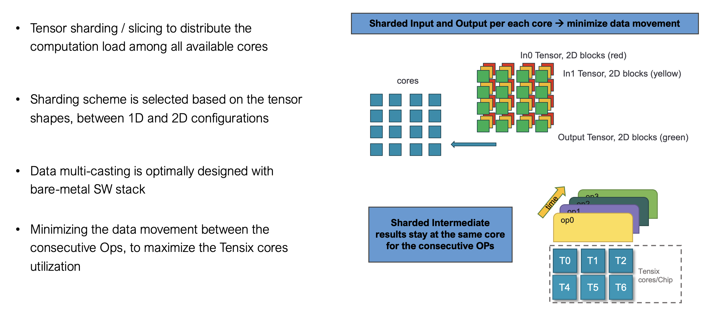
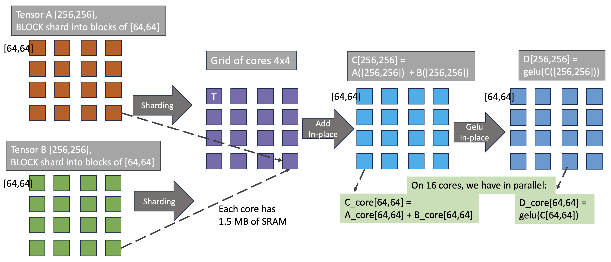
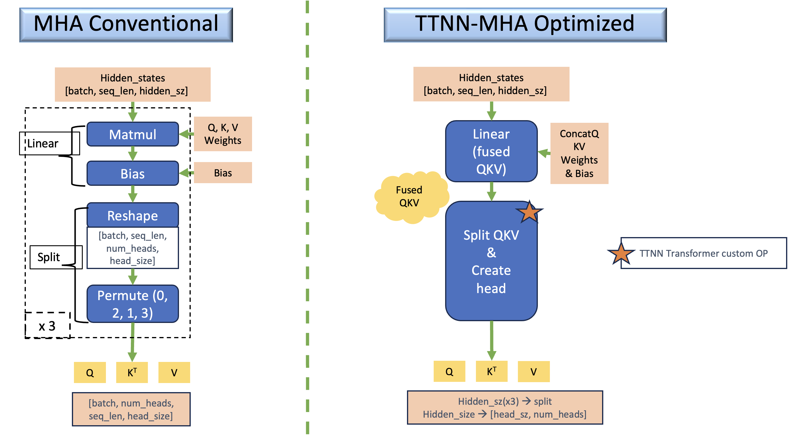
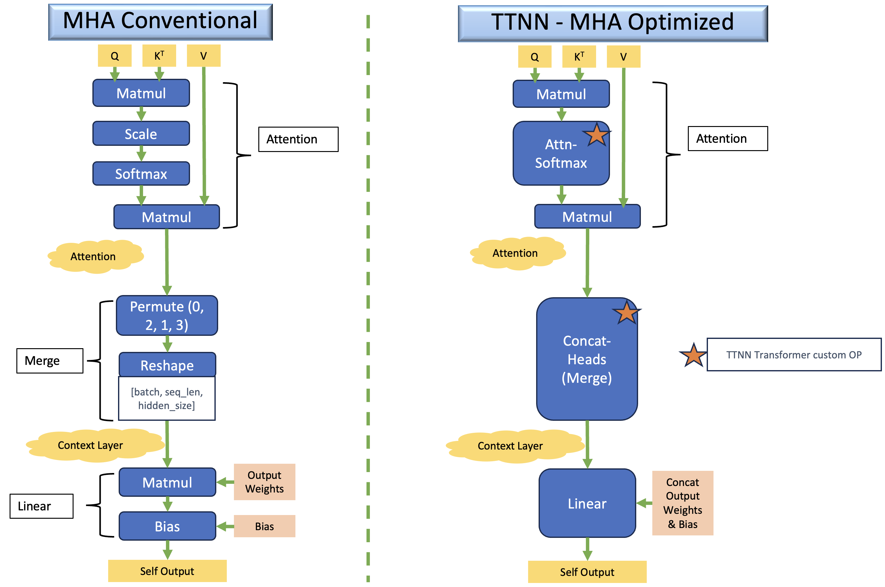

# ViT in TT-NN

## Contents

- [ViT in TT-NN](#vit-in-tt-nn)
  - [Contents](#contents)
  - [1. Overview](#1-overview)
  - [2. ViT TT-NN Optimization Techniques](#2-vit-tt-nn-optimization-techniques)
    - [2.1 Sharding on all relevant OPs:](#21-sharding-on-all-relevant-ops)
    - [2.2 Transformer optimizations:](#22-transformer-optimizations)
  - [3. ViT TT-NN Code Structure](#3-vit-tt-nn-code-structure)
    - [3.1 Top-level module:](#31-top-level-module)
    - [3.2 Embeddings module:](#32-embeddings-module)
    - [3.3 Encoder module:](#33-encoder-module)
    - [3.4 Encoder Layer module:](#34-encoder-layer-module)
  - [4. ViT Encoder Layer TT-NN Deep Dive](#4-vit-encoder-layer-tt-nn-deep-dive)
    - [4.1 Input](#41-input)
    - [4.2 Sharding parametrization](#42-sharding-parametrization)
    - [4.3 Layer Normalization (Laynorm)](#43-layer-normalization-laynorm)
    - [4.4 Multi-Head Self-Attention](#44-multi-head-self-attention)
      - [4.4.1 Q,K,V Generation using the Fused Linear OP](#441-qkv-generation-using-the-fused-linear-op)
      - [4.4.2 Splitting into Q-K-V](#442-splitting-into-q-k-v)
      - [4.4.3 Attention Mechanism](#443-attention-mechanism)
      - [4.4.4 Matmul with Value](#444-matmul-with-value)
      - [4.4.5 Concatenating Heads and Self-Output Linear OP](#445-concatenating-heads-and-self-output-linear-op)
    - [4.5 Add and Norm](#45-add-and-norm)
    - [4.6 Feed-Forward Network](#46-feed-forward-network)
    - [4.7 Output](#47-output)
  - [5. Conclusion](#5-conclusion)
  - [6. Refernces](#6-refernces)

## 1. Overview

The [Vision Transformer](https://arxiv.org/pdf/2010.11929) (ViT) is a transformer model that is utilized for vision procesing tasks. The ViT architecture in TT-NN leverages the self-attention mechanism, originally designed for NLP tasks, to process image data by treating each image as a sequence of patches. This walkthrough explains the key components of the ViT model and demonstrates how the Tenstorrent TT-NN library implements these components efficiently.
For more details on the architecture, please refer to the [References](#5-references).

## 2. ViT TT-NN Optimization Techniques

The implemented optimization techniques in TT-NN compared to the conventional flow are:
### 2.1 Sharding on all relevant OPs:
  - Applying sharding techniques to harvest the optimum utilization of the computation OPs, by elminating the need for data movement inter-tensix-cores between the consecutive OPs. 
  - For more details, please refer to the [related tech-report](https://github.com/tenstorrent/tt-metal/blob/main/tech_reports/tensor_layouts/tensor_layouts.md#42-sharding) 
  - Sharding Concepts
 
  - Illustrative example 
   

### 2.2 Transformer optimizations:
  - Fusing GeLU OP with its perceding Linear OP
  - Merging Q,K,V Linear operations in one large OP for higher utilization of Tensix computation power.
  - Customized tensor manipulation operations that are highly optimized as Transformer-based OPs in TT-NN.
  - Pre-processing of model weights, to apply the data format conversion as well as merging and transposing to match the OP configuration.

     
    


## 3. ViT TT-NN Code Structure

### 3.1 Top-level module:
ViT model has 3 main modules: Embeddings, Encoder (12 Layers), and Classification head.

```python
def vit(
    config,
    pixel_values,
    attention_mask,
    cls_token,
    position_embeddings,
    parameters,
):
    # Embeddings
    embeddings_output = vit_embeddings(config, pixel_values, cls_token, position_embeddings, parameters=parameters)

    # Encoder (12 layers)
    hidden_states = vit_encoder(
        config,
        embeddings_output,
        attention_mask,
        parameters=parameters.vit.encoder,
    )

    # Final LayerNorm
    output = ttnn.layer_norm(
        hidden_states,
        weight=parameters.vit.layernorm.weight,
        bias=parameters.vit.layernorm.bias,
        epsilon=config.layer_norm_eps,
        memory_config=ttnn.L1_BLOCK_SHARDED_MEMORY_CONFIG,
        program_config=config.program_configs["layernorm_program_config"],
    )

    # Classifier
    classifier_output = ttnn.linear(
        output,
        parameters.classifier.weight,
        bias=parameters.classifier.bias,
        memory_config=ttnn.L1_BLOCK_SHARDED_MEMORY_CONFIG,
        dtype=ttnn.bfloat8_b,
        program_config=config.program_configs["classifer_matmul_program_config"],
    )

    return classifier_output
```

### 3.2 Embeddings module:
ViT Embeddings module includes: Patch + Position embeddings and Linear projection of flattended patches

```python
def vit_patch_embeddings(config, pixel_values, *, parameters, unittest_check=False):
    batch_size, img_h, img_w, img_c = pixel_values.shape  # permuted input NHWC
    patch_size = 16
    patch_count = img_h // patch_size  # 14
    patch_size_sq_trpl = patch_size * patch_size * 3  # 768
    patch_count_all = patch_count * patch_count  # 196
    stride_h = patch_size
    stride_w = 1

    # Folding the input image into folded patches of size (14x14) each
    folded_pixel_values = ttnn.fold(pixel_values, stride_h, stride_w)  # 1568, 1024
    ttnn.deallocate(pixel_values)
    folded_pixel_values = ttnn.to_memory_config(folded_pixel_values, memory_config=ttnn.L1_MEMORY_CONFIG)
    folded_pixel_values = ttnn.to_layout(folded_pixel_values, layout=ttnn.TILE_LAYOUT, dtype=ttnn.bfloat8_b)

    # linear projction of flattened patches
    patch_embedding_output = ttnn.linear(
        folded_pixel_values,
        parameters.projection.weight,
        bias=parameters.projection.bias,
        memory_config=ttnn.L1_MEMORY_CONFIG,
        dtype=ttnn.bfloat16,
        core_grid=config.core_grid,
    )
    patch_embedding_output = ttnn.to_layout(patch_embedding_output, layout=ttnn.ROW_MAJOR_LAYOUT)
    patch_embedding_output = ttnn.reshape(patch_embedding_output, (batch_size, patch_count_all, patch_size_sq_trpl))

    return patch_embedding_output


def vit_embeddings(
    config,
    pixel_values,
    cls_token,
    position_embeddings,
    *,
    parameters,
):
    parameters = parameters.vit.embeddings
    l1_memory_config = ttnn.L1_MEMORY_CONFIG
    # Patch embedding
    patch_embeddings = vit_patch_embeddings(config, pixel_values, parameters=parameters.patch_embeddings)
    # Concatenating Position Embeddings
    embedding_output = ttnn.concat([cls_token, patch_embeddings], -2, memory_config=l1_memory_config)
    embedding_output = ttnn.to_layout(embedding_output, layout=ttnn.TILE_LAYOUT)
    embedding_output = ttnn.add(
        embedding_output, position_embeddings, memory_config=ttnn.L1_MEMORY_CONFIG, dtype=ttnn.bfloat8_b
    )
    return embedding_output
```

### 3.3 Encoder module:
ViT Encoder module includes: 12 layers of the Transformer encoder

```python
def vit_encoder(
    config,
    embeddings,
    head_masks,
    parameters,
):
    # Sharding config for the encoder input
    encoder_input = ttnn.to_memory_config(
        embeddings,
        memory_config=ttnn.create_sharded_memory_config(
            [config.core_grid.y, 224,768],  # embeddings.shape = [b, seqL, dim]
            core_grid=config.core_grid,
            strategy=ttnn.ShardStrategy.BLOCK,
            orientation=ttnn.ShardOrientation.ROW_MAJOR,
        ),
        dtype=ttnn.bfloat8_b,
    )
    ttnn.deallocate(embeddings)

    # For loop of 12 iterations on the encoder layer
    for index, encoder_parameters in enumerate(parameters.layer):
        encoder_output = vit_layer(
            config,
            encoder_input,
            head_masks[index],
            encoder_parameters,
        )
        encoder_input = encoder_output

    return encoder_output
```

### 3.4 Encoder Layer module:
ViT Encoder layer includes: 12 layers of the Transformer encoder

```python
def vit_layer(
    config,
    hidden_states,
    attention_mask,
    parameters,
):
    layernorm_before_output = ttnn.layer_norm(
        hidden_states,
        weight=parameters.layernorm_before.weight,
        bias=parameters.layernorm_before.bias,
        memory_config=ttnn.L1_BLOCK_SHARDED_MEMORY_CONFIG,
        program_config=config.program_configs["layernorm_program_config"],
    )

    multi_head_attention_output = vit_attention(
        config,
        layernorm_before_output,
        attention_mask=attention_mask,
        parameters=parameters.attention,
    )

    multi_head_attention_output = ttnn.add(
        multi_head_attention_output,
        hidden_states,
        memory_config=ttnn.L1_BLOCK_SHARDED_MEMORY_CONFIG,
        dtype=ttnn.bfloat8_b,
    )

    layernorm_after_output = ttnn.layer_norm(
        multi_head_attention_output,
        weight=parameters.layernorm_after.weight,
        bias=parameters.layernorm_after.bias,
        memory_config=ttnn.L1_BLOCK_SHARDED_MEMORY_CONFIG,
        program_config=config.program_configs["layernorm_after_output_program_config"],
    )

    feedforward_output = vit_feedforward(
        config,
        layernorm_after_output,
        multi_head_attention_output,
        parameters=parameters,
    )

    return feedforward_output
```


## 4. ViT Encoder Layer TT-NN Deep Dive

This is a step-by-step walkthrough of the ViT encoder layer implementation in TT-NN on Grayskull. The diagram below summarizes all of these steps in a flow chart, which is examined in smaller pieces below.

This diagram is representing the TT-NN module `vit_layer()`


### 4.1 Input 
The input to the Vision Transformer consists of image patches that are flattened and embedded into a higher-dimensional space. The input is represented as:

`b × seqL × dim`

Where:
- `b` is the batch size.
- `seqL` is the sequence length (corresponding to the number of patches).
- `dim` is the embedding dimension.

### 4.2 Sharding parametrization 

```python
    core_grid = ttnn.CoreGrid(y=batch_size, x=12)
    seqL_t = 224 // 32  # 7
    dim_t = 768 // 32  # 24
    dim_t__x = dim_t // core_grid.x  # 2
    head_num = 12
    head_seqL_t = (head_num * seqL_t) // core_grid.x  # 7
    head_size_t__x = dim_t // head_num  # 2
    class__x = (1152 // 32) // core_grid.x  # 3
```
### 4.3 Layer Normalization (Laynorm)
After embedding the patches, Layer Normalization is applied to the input sequence. This ensures that the input embeddings are normalized before the attention mechanism, which improves the training stability of the model. The **block sharding** in the diagram illustrates how data is partitioned and distributed across multiple processing cores for parallel computation, enhancing efficiency during training.

**Optimized Code**:

```python
def vit_layernorm_before(config, hidden_states, *, parameters):
    attention_output = ttnn.layer_norm(
        hidden_states,
        weight=parameters.layernorm_before.weight,
        bias=parameters.layernorm_before.bias,
        epsilon=config.layer_norm_eps,
        memory_config=ttnn.L1_BLOCK_SHARDED_MEMORY_CONFIG,
        program_config=config.program_configs["layernorm_program_config"],
    )

    return attention_output
```

**Sharding Config**:

```python
"layernorm_program_config": ttnn.LayerNormShardedMultiCoreProgramConfig(
    compute_with_storage_grid_size=(core_grid.x, core_grid.y),
    subblock_w=dim_t__x,  # 2,
    block_h=seqL_t,  # 7,
    block_w=dim_t__x,  # 2,
    inplace=False,
)
```


### 4.4 Multi-Head Self-Attention
The self-attention mechanism is implemented in the `vit_attention` function. Here, the Query, Key, and Value matrices are created by applying linear transformations to the input embeddings. After computing the attention scores (dot product of Q and K), the scores are normalized using a Softmax function. The resulting attention probabilities are multiplied by the Value matrix to produce the attention output.

**Functional Code**:

```python
query, key, value = ttnn.transformer.split_query_key_value_and_split_heads(query_key_value, num_heads=num_heads)
attention_scores = ttnn.matmul(query, key)
attention_probs = ttnn.transformer.attention_softmax_(attention_scores, attention_mask=attention_mask, head_size=head_size)
context_layer = ttnn.matmul(attention_probs, value)
```

#### 4.4.1 Q,K,V Generation using the Fused Linear OP
The encoder input is matrix-mutiplied by the Q,K,V weights to generate the individual Query, Key, Value tensors. In the TT-NN implementation, the input is multipled by the pre-fused weights to generate the merged 3 tensors that will be split in a following step. The fused linear operation obective is to maximize the utilization by increasing the workload that is computed simultaneously on the Tensic core grid.

**Optimized Code**:

```python
query_key_value = ttnn.linear(
        hidden_states,
        parameters.attention.query_key_value.weight,
        bias=parameters.attention.query_key_value.bias,
        memory_config=ttnn.L1_BLOCK_SHARDED_MEMORY_CONFIG,
        dtype=ttnn.bfloat8_b,
        program_config=config.program_configs["query_key_value_matmul_program_config"],
    )
```

**Sharding Config**:

```python
"query_key_value_matmul_program_config": ttnn.MatmulMultiCoreReuseMultiCastProgramConfig(
            compute_with_storage_grid_size=(core_grid.x, core_grid.y),
            in0_block_w=dim_t__x,  # 2,
            out_subblock_h=1,
            out_subblock_w=(3 * dim_t__x),  # 6,
            per_core_M=seqL_t,  # 7,
            per_core_N=(3 * dim_t__x),  # 6,
            transpose_mcast=False,
            fused_activation=None,
        ),
```


#### 4.4.2 Splitting into Q-K-V
The input embeddings are then split into **Query** (Q), **Key** (K), and **Value** (V) matrices. This is done by projecting the input embeddings into three separate matrices. Each matrix has a size of:

`lh × seqL × head_size`

where 
- `lh` is the number of attention heads
- `seqL` is the sequence length
- `head_size` is the size of each split head.

Additionally, height sharding is applied by splitting the sequence length (`seqL`) across multiple processing cores. This allows the matrix operations to be parallelized, with each core handling a tile of the sequence length.

**Optimized Code**:

```python
query, key, value = ttnn.transformer.split_query_key_value_and_split_heads(query_key_value, memory_config=ttnn.L1_HEIGHT_SHARDED_MEMORY_CONFIG, num_heads=num_heads)
```

**QKV Diagram**:


#### 4.4.3 Attention Mechanism
The attention mechanism begins by calculating the dot product between the Query and Key matrices. This result is then scaled by the size of the attention head to form the Attention Scores. These scores are passed through a Softmax operation, which normalizes them across the sequence length. **Height sharding** is applied during this process, where the sequence length is split across cores to parallelize the computation of the Attention Scores, making the operation more efficient.

**Functional Code**:

```python
attention_scores = ttnn.matmul(query, key)
attention_probs = ttnn.transformer.attention_softmax_(attention_scores, head_size=head_size)
```

**Optimized Code**:

```python
attention_scores = ttnn.matmul(query, key, memory_config=ttnn.L1_HEIGHT_SHARDED_MEMORY_CONFIG, dtype=ttnn.bfloat8_b, program_config=config.program_configs["query_by_key_matmul_program_config"])

attention_probs = ttnn.transformer.attention_softmax_(attention_scores, attention_mask=attention_mask, head_size=head_size, program_config=config.program_configs["softmax_program_config"])
```

**Sharding Config**:

```python
"query_by_key_matmul_program_config": ttnn.MatmulMultiCoreReuseProgramConfig(
    compute_with_storage_grid_size=(core_grid.x, core_grid.y),
    in0_block_w=dim_t__x,  # 2,
    out_subblock_h=1,
    out_subblock_w=seqL_t,  # 7,
    per_core_M=seqL_t,  # 7,
    per_core_N=head_seqL_t,  # 7,
),
"softmax_program_config": ttnn.SoftmaxShardedMultiCoreProgramConfig(
    compute_with_storage_grid_size=(core_grid.x, core_grid.y),
    subblock_w=head_seqL_t,  # 7,
    block_h=seqL_t,  # 7,
    block_w=head_seqL_t,  # 7,
),
```

**Attention Diagram**:


#### 4.4.4 Matmul with Value
The normalized attention scores are then multiplied by the Value matrix to produce the attention output. This is the core of the self-attention mechanism, allowing the model to focus on different parts of the input sequence. **Height sharding** is used.

**Functional Code**:

```python
context_layer = ttnn.matmul(attention_probs, value)
```

**Optimized Code**:

```python
context_layer = ttnn.matmul(attention_probs, value, memory_config=ttnn.L1_HEIGHT_SHARDED_MEMORY_CONFIG, dtype=ttnn.bfloat8_b, program_config=config.program_configs["attention_probabilities_by_value_matmul_program_config"])
```

**Sharding Config**:

```python
"attention_probabilities_by_value_matmul_program_config": ttnn.MatmulMultiCoreReuseProgramConfig(
    compute_with_storage_grid_size=(core_grid.x, core_grid.y),
    in0_block_w=seqL_t,  # 7,
    out_subblock_h=1,
    out_subblock_w=head_size_t__x,  # 2,
    per_core_M=seqL_t,  # 7,
    per_core_N=head_size_t__x,  # 2,
)
```

#### 4.4.5 Concatenating Heads and Self-Output Linear OP
The outputs from all attention heads are concatenated back together. This creates a unified representation of the attention across all heads:

` seqL × head_count × head_size` 

This step aggregates the outputs from the different heads into a single vector representation for each position in the sequence.

**Optimized Code**:

```python
    context_layer = ttnn.transformer.concatenate_heads(
        context_layer,
        memory_config=ttnn.L1_BLOCK_SHARDED_MEMORY_CONFIG,
    )

    self_output = ttnn.linear(
        context_layer,
        parameters.output.dense.weight,
        bias=parameters.output.dense.bias,
        memory_config=ttnn.L1_BLOCK_SHARDED_MEMORY_CONFIG,
        dtype=ttnn.bfloat8_b,
        program_config=config.program_configs["self_output_matmul_program_config"],
    )
    ttnn.deallocate(context_layer)
```

**Sharding Config**:

```python
    "self_output_matmul_program_config": ttnn.MatmulMultiCoreReuseMultiCastProgramConfig(
            compute_with_storage_grid_size=(core_grid.x, core_grid.y),
            in0_block_w=dim_t__x,  # 2,
            out_subblock_h=seqL_t,  # 7,
            out_subblock_w=dim_t__x,  # 2,
            per_core_M=seqL_t,  # 7,
            per_core_N=dim_t__x,  # 2,
            transpose_mcast=False,
            fused_activation=None,
        ),
```

**Concat Heads diagram**:


### 4.5 Add and Norm
A residual connection (skip connection) is applied, adding the original input to the attention block back to the output of the attention block. This helps in maintaining gradient flow through the network and stabilizes training. The resulting tensor is then normalized again using layer normalization. Additionally, **block sharding** is used.


**Optimized Code**:

```python
multi_head_attention_output = ttnn.add(
    multi_head_attention_output,
    hidden_states,
    memory_config=ttnn.L1_BLOCK_SHARDED_MEMORY_CONFIG,
    dtype=ttnn.bfloat8_b,
)
layernorm_after_output = ttnn.layer_norm(
    multi_head_attention_output,
    weight=parameters.layernorm_after.weight,
    bias=parameters.layernorm_after.bias,
    memory_config=ttnn.L1_BLOCK_SHARDED_MEMORY_CONFIG,
    program_config=config.program_configs["layernorm_after_output_program_config"],
)
```
```python
"layernorm_after_output_program_config": ttnn.LayerNormShardedMultiCoreProgramConfig(
    compute_with_storage_grid_size=(core_grid.x, core_grid.y),
    subblock_w=dim_t__x,  # 2,
    block_h=seqL_t,  # 7,
    block_w=dim_t__x,  # 2,
    inplace=False,
)
```

**Add and Norm Diagram**:


### 4.6 Feed-Forward Network
The output from the attention block is passed through a **Feed-Forward Network** (FFN). The FFN consists of two linear transformations with a GeLU activation function between them. The first linear layer expands the dimensionality of the embeddings, and the second linear layer projects it back to the original size. **Block sharding** is utilized in the FFN, where the computations are split across multiple blocks, allowing for parallel processing and improved efficiency during the linear transformations.

**Optimized Code**:

```python
def vit_intermediate(
    config,
    hidden_states,
    *,
    parameters,
):
    output = ttnn.linear(
        hidden_states,
        parameters.dense.weight,
        bias=parameters.dense.bias,
        memory_config=ttnn.L1_BLOCK_SHARDED_MEMORY_CONFIG,
        dtype=ttnn.bfloat8_b,
        program_config=config.program_configs["ff1_matmul_program_config"],
    )
    ttnn.deallocate(hidden_states)

    return output


def vit_output(
    config,
    hidden_states,
    residual,
    *,
    parameters,
):
    output = ttnn.linear(
        hidden_states,
        parameters.dense.weight,
        bias=parameters.dense.bias,
        memory_config=ttnn.L1_BLOCK_SHARDED_MEMORY_CONFIG,
        dtype=ttnn.bfloat8_b,
        program_config=config.program_configs["ff2_matmul_program_config"],
    )
    ttnn.deallocate(hidden_states)

    output = ttnn.add(output, residual, memory_config=ttnn.L1_BLOCK_SHARDED_MEMORY_CONFIG, dtype=ttnn.bfloat8_b)
    ttnn.deallocate(residual)

    return output

def vit_feedforward(
    config,
    hidden_states,
    attention_output,
    *,
    parameters,
):
    intermediate = vit_intermediate(config, hidden_states, parameters=parameters.intermediate)
    hidden_states = vit_output(config, intermediate, attention_output, parameters=parameters.output)
    return hidden_states

```


**Sharding Config**:

```python
    "ff1_matmul_program_config": ttnn.MatmulMultiCoreReuseMultiCastProgramConfig(
        compute_with_storage_grid_size=(core_grid.x, core_grid.y),
        in0_block_w=dim_t__x,  # 2,
        out_subblock_h=1,
        out_subblock_w=(4 * dim_t__x) // 2,  # 4,
        per_core_M=seqL_t,  # 7,
        per_core_N=(4 * dim_t__x),  # 8,
        transpose_mcast=False,
        fused_activation=(ttnn.UnaryOpType.GELU, True),
    ),
    "ff2_matmul_program_config": ttnn.MatmulMultiCoreReuseMultiCastProgramConfig(
        compute_with_storage_grid_size=(core_grid.x, core_grid.y),
        in0_block_w=(4 * dim_t__x),  # 8,
        out_subblock_h=seqL_t,  # 7,
        out_subblock_w=dim_t__x,  # 2,
        per_core_M=seqL_t,  # 7,
        per_core_N=dim_t__x,  # 2,
        transpose_mcast=False,
        fused_activation=None,
    ),  
```
**FFN Diagram**:


### 4.7 Output
The final result after the feed-forward network and the second normalization step is the **Encoder Output**. This output has the following shape:

`b × seqL × dim`

The output can either be passed to the next layer in the Transformer encoder or to the classification head, depending on the specific task.

## 5. Conclusion

This walkthrough provided an in-depth explanation of the Vision Transformer (ViT) encoder and its implementation in the TT-NN library. From patch embedding to self-attention and feed-forward networks, the ViT model effectively applies the principles of attention-based mechanisms to image processing.

## 6. Refernces
  - https://huggingface.co/docs/transformers/en/model_doc/vit
  - https://medium.com/@hansahettiarachchi/unveiling-vision-transformers-revolutionizing-computer-vision-beyond-convolution-c410110ef061
  - https://www.v7labs.com/blog/vision-transformer-guide
  - https://viso.ai/deep-learning/vision-transformer-vit/