# [skip ci] ViT in TT-NN for Blackhole

Authors: Vishal Shenoy, Mohamed Bahnas (Original), Updated for Blackhole Architecture

## Contents
- [ViT in TT-NN for Blackhole](#vit-in-tt-nn-for-blackhole)
  - [Contents](#contents)
  - [1. Overview](#1-overview)
  - [2. Blackhole Architecture Differences](#2-blackhole-architecture-differences)
    - [2.1 Core Grid Configuration](#21-core-grid-configuration)
    - [2.2 Compute Kernel Configuration](#22-compute-kernel-configuration)
  - [3. ViT TT-NN Optimization Techniques](#3-vit-tt-nn-optimization-techniques)
    - [3.1 Sharding on all relevant OPs](#31-sharding-on-all-relevant-ops)
    - [3.2 Matmul sharding variants in ViT](#32-matmul-sharding-variants-in-vit)
    - [3.3 Transformer optimizations](#33-transformer-optimizations)
  - [4. ViT TT-NN Code Structure](#4-vit-tt-nn-code-structure)
    - [4.1 Top-level modules](#41-top-level-modules)
    - [4.2 Embeddings module](#42-embeddings-module)
    - [4.3 Encoder module](#43-encoder-module)
    - [4.4 Encoder One Layer module](#44-encoder-one-layer-module)
  - [5. ViT Encoder Layer TT-NN Deep Dive for Blackhole](#5-vit-encoder-layer-tt-nn-deep-dive-for-blackhole)
    - [5.1 Input](#51-input)
    - [5.2 Sharding parametrization](#52-sharding-parametrization)
    - [5.3 Layer Normalization (Layernorm)](#53-layer-normalization-layernorm)
    - [5.4 Multihead Self-Attention](#54-multihead-self-attention)
      - [5.4.1 Q,K,V Generation (Fused Linear)](#541-qkv-generation-fused-linear)
      - [5.4.2 Resharding (Core Grid Transition)](#542-resharding-core-grid-transition)
      - [5.4.3 Split into Q/K/V + Heads](#543-split-into-qkv--heads)
      - [5.4.4 Attention Scores (Q×Kᵀ)](#544-attention-scores-qk)
      - [5.4.5 Scale and Softmax](#545-scale-and-softmax)
      - [5.4.6 Context (P×V)](#546-context-pv)
      - [5.4.7 Concatenating Heads + Self-Output](#547-concatenating-heads--self-output)
      - [5.4.8 Defragmentation Notes](#548-defragmentation-notes)
    - [5.5 Add and Norm](#55-add-and-norm)
    - [5.6 Feed-Forward Network](#56-feed-forward-network)
      - [5.6.1 FF1 (Intermediate + Fused GELU)](#561-ff1-intermediate--fused-gelu)
      - [5.6.2 FF2 (Output + Residual)](#562-ff2-output--residual)
      - [5.6.3 FFN Wrapper](#563-ffn-wrapper)
    - [5.7 Output](#57-output)
  - [6. High Resolution ViT Optimizations on Blackhole](#6-high-resolution-vit-optimizations-on-blackhole)
    - [6.1 Sharding Across the Sequence Length Dimension](#61-sharding-across-the-sequence-length-dimension)
    - [6.2 Width Shard and Block Sharding Mix](#62-width-shard-and-block-sharding-mix)
    - [6.3 Scaled Dot-Product Attention (SDPA)](#63-scaled-dot-product-attention-sdpa)
      - [6.3.1 SDPA Overview](#631-sdpa-overview)
      - [6.3.2 QKV Projection and Head Splitting](#632-qkv-projection-and-head-splitting)
      - [6.3.3 DRAM Staging for Memory Management](#633-dram-staging-for-memory-management)
      - [6.3.4 SDPA Kernel Execution](#634-sdpa-kernel-execution)
      - [6.3.5 Post-Attention Processing](#635-post-attention-processing)
      - [6.3.6 Memory Benefits](#636-memory-benefits)
  - [7. Conclusion](#7-conclusion)
  - [8. References](#8-references)

## 1. Overview

The [Vision Transformer](https://arxiv.org/pdf/2010.11929) (ViT) is a transformer model that is utilized for vision processing tasks. This document describes the ViT architecture implementation specifically optimized for **Tenstorrent Blackhole (P150)** devices using the TT-NN library.

The ViT architecture in TT-NN leverages the self-attention mechanism, originally designed for NLP tasks, to process image data by treating each image as a sequence of patches. This walkthrough explains the key components of the ViT model and demonstrates how the Tenstorrent TT-NN library implements these components efficiently on Blackhole architecture.

For more details on the architecture, please refer to the [References](#8-references).

## 2. Blackhole Architecture Differences

### 2.1 Core Grid Configuration

Blackhole uses a **10×12 core grid** for ViT (120 cores total, batch size = 10).

**Blackhole Core Grid Configuration:**

```python
def update_model_config(config, batch_size):
    wh_core_grid_y = 10  # Blackhole has 10 rows available

    # In case of < 10 cores per batch, we need to do move in attention to remove defragmentation
    should_reallocate_in_attention = False
    if batch_size <= wh_core_grid_y:
        grid_y = batch_size
        grid_x = 12  # For Blackhole: can be 6, 4, or 3 for less latency
    else:
        grid_y = 10
        batch_per_y_core = batch_size // wh_core_grid_y
        batch_size = grid_y * batch_per_y_core
        grid_x = 12  # Use full x-dimension for Blackhole
        should_reallocate_in_attention = True

    core_grid = ttnn.CoreGrid(y=grid_y, x=grid_x)
    core_grid_10x12 = ttnn.CoreGrid(y=10, x=12)  # Fixed full grid for Blackhole
```

> **Note (Portable Alternative):** For cross-architecture compatibility, you can dynamically query the device's compute grid instead of hardcoding values:
> ```python
> compute_grid_size = device.compute_with_storage_grid_size()
> core_grid = ttnn.CoreGrid(y=compute_grid_size.y, x=compute_grid_size.x)
> ```
> This approach enables portability across different Tenstorrent architectures. The Blackhole ViT implementation uses hardcoded values (10×12) for maximum performance optimization on this specific architecture.

### 2.2 Compute Kernel Configuration

Blackhole uses `WormholeComputeKernelConfig` which provides additional optimization options:

```python
"ln_compute_config": ttnn.WormholeComputeKernelConfig(
    math_fidelity=ttnn.MathFidelity.HiFi2,  # Higher precision for LayerNorm
    math_approx_mode=True,                   # Use approximations where safe
    fp32_dest_acc_en=False,                  # BF16 destination accumulation
    packer_l1_acc=True,                      # L1 accumulation in packer (Blackhole feature)
)
```

## 3. ViT TT-NN Optimization Techniques

The implemented optimization techniques in TT-NN compared to the conventional flow are:

### 3.1 Sharding on all relevant OPs
  - Applying sharding techniques to harvest the optimum utilization of the computation OPs, by eliminating the need for data movement inter-tensix-cores between the consecutive OPs.
  - For more details, please refer to the [related tech-report](https://github.com/tenstorrent/tt-metal/blob/main/tech_reports/tensor_layouts/tensor_layouts.md#42-sharding)
  - Sharding Concepts

  - Illustrative example
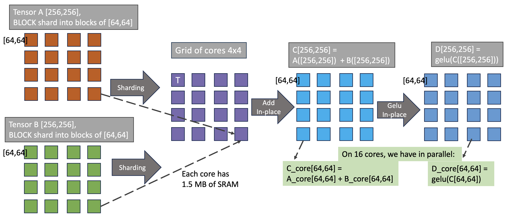

### 3.2 Matmul sharding variants in ViT

#### 3.2.1 Matmul Reuse (BMM)
The batch Matmul(BMM) Reuse case used in ViT model is in the Multi-head Self Attention module, where both inputs (in0 and in1) as well as the output are height sharded. There no multi-cast (mcast) technique applied on the inputs here. Each core will be responsible for the Matmul of single head of one image of the batch.


#### 3.2.2 Matmul Reuse Mcast (2D)
The Reuse Mcast case used in ViT model is the block sharded Matmul cases in QKV generation as well as the Feed-Forward Network.
  - The implemented config is Block sharded orientation is Row_Major, where the in0 outer dimension (M) is sharded along the y-axis of the core grid. On the inner dimension of in0, the sharded slices are mcasted along the x-direction of the core grid. The mcast process is done in turn from one core to all other cores in the row, so the whole inner dimension of in0 exists per each core during its Matmul operation.
  - Please note that the Row_Major term mentioned here is referring to the sharded blocks placement on the core grid. It's different than the Row_Major data layout that is compared to the Tile layout in the report [tensor_layouts](https://github.com/tenstorrent/tt-metal/blob/main/tech_reports/tensor_layouts/tensor_layouts.md)
  - The in1 is interleaved (on L1 or DRAM) and its slices along the N (outer) dimension are mcasted along the cores in the same column, where each slide has the full inner dimension (K). This is aligned with the previously mentioned mcast of in0 slices.
  - Worth to mention that in some cases it may be better to implement the Column_Major (and mcast transposed = True) config, where the in0 M dimension is sharded along the x-axis of the core as shown in the figure. All the mcast techniques in the Column_Major will be transposed with respect to the Row_Major config mentioned in the previous paragraph.


**ROW_MAJOR vs COLUMN_MAJOR Selection Guide:**

| Scenario | Recommendation | Configuration |
|----------|----------------|---------------|
| M >> N (tall matrix) | ROW_MAJOR | `transpose_mcast=False` |
| N >> M (wide matrix) | COL_MAJOR | `transpose_mcast=True` |
| Grid Nx > Ny | ROW_MAJOR | `transpose_mcast=False` |
| Grid Ny > Nx | COL_MAJOR | `transpose_mcast=True` |

For Blackhole's 10×12 grid (y=10, x=12), **ROW_MAJOR** is typically optimal.

#### 3.2.3 Matmul Reuse Mcast (1D)
The other Reuse Mcast case (not used in ViT) is the height sharded on in0, while in1 is still interleaved, as shown in the figure.


### 3.3 Transformer optimizations
  - Merging Q,K,V Linear operations in one large OP for higher utilization of Tensix computation power.
  - Customized tensor manipulation operations that are highly optimized as Transformer-based OPs in TT-NN.
  - Pre-processing of model weights, to apply the data format conversion as well as merging and transposing to match the OP configuration.
  - Fusing GeLU OP with its preceding Linear OP

    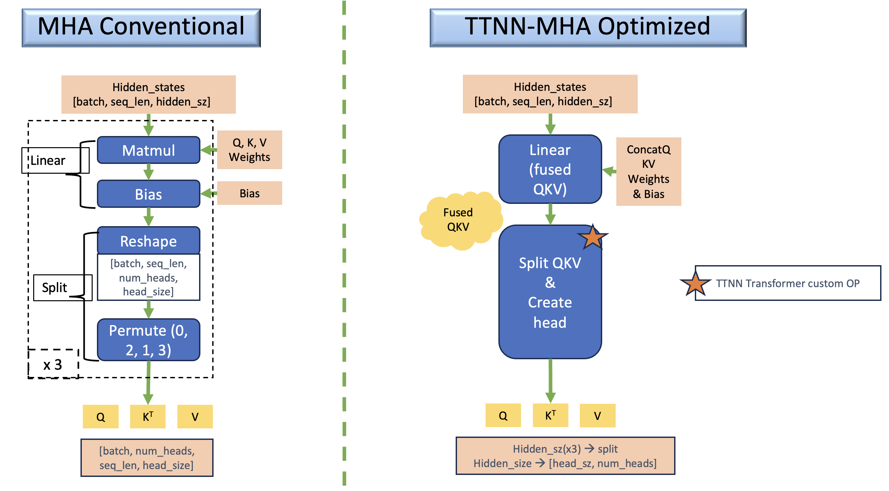
  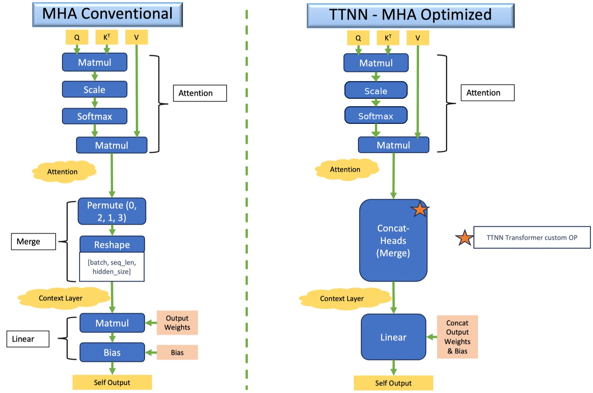

## 4. ViT TT-NN Code Structure

This section outlines the code organization of the TT-NN Blackhole ViT implementation.

### 4.1 Top-level modules
ViT model has 3 main modules: Embeddings, Encoder (12 Layers), and Classification head.

```python
def vit(
    config,
    pixel_values,
    cls_token,
    position_embeddings,
    parameters,
):
    # Embeddings
    embeddings_output = vit_embeddings(config, pixel_values, cls_token, position_embeddings, parameters=parameters)

    # Encoder (12 layers)
    hidden_states = vit_encoder(
        config,
        embeddings_output,
        parameters=parameters.vit.encoder,
    )

    # Final LayerNorm
    output = ttnn.layer_norm(
        hidden_states,
        weight=parameters.vit.layernorm.weight,
        bias=parameters.vit.layernorm.bias,
        epsilon=config.layer_norm_eps,
        memory_config=ttnn.L1_BLOCK_SHARDED_MEMORY_CONFIG,
        program_config=config.program_configs["layernorm_before_program_config"],
    )

    # Reshard back to dynamic cores for precision
    block_sharded_config_variable_cores = ttnn.create_sharded_memory_config(
        output.padded_shape,
        core_grid=config.core_grid,  # dynamic: batch_size × 12 or 10×12
        strategy=ttnn.ShardStrategy.BLOCK,
        orientation=ttnn.ShardOrientation.ROW_MAJOR,
    )
    output = ttnn.reshard(output, block_sharded_config_variable_cores)

    # Classifier
    classifier_output = ttnn.linear(
        output,
        parameters.classifier.weight,
        bias=parameters.classifier.bias,
        memory_config=ttnn.L1_BLOCK_SHARDED_MEMORY_CONFIG,
        dtype=ttnn.bfloat8_b,
        program_config=config.program_configs["classifier_matmul_program_config"],
    )

    return classifier_output
```

### 4.2 Embeddings module
ViT Embeddings module includes: Patch + Position embeddings and Linear projection of flattened patches

```python
def vit_patch_embeddings(config, pixel_values, *, parameters, unittest_check=False):
    batch_size, img_h, img_w, img_c = pixel_values.shape  # permuted input NHWC
    patch_size = config.patch_size
    patch_count = img_h // patch_size  # 14
    patch_size_sq_trpl = int(patch_size * patch_size * 3)  # 768
    patch_count_all = int(patch_count * patch_count)  # 196
    stride_h = patch_size
    stride_w = 1

    # Folding the input image into folded patches of size (14x14) each
    folded_pixel_values = ttnn.fold(pixel_values, stride_h, stride_w)  # 1568, 1024
    ttnn.deallocate(pixel_values)
    folded_pixel_values = ttnn.to_memory_config(folded_pixel_values, memory_config=ttnn.L1_MEMORY_CONFIG)
    folded_pixel_values = ttnn.to_layout(folded_pixel_values, layout=ttnn.TILE_LAYOUT, dtype=ttnn.bfloat8_b)

    # linear projection of flattened patches
    patch_embedding_output = ttnn.linear(
        folded_pixel_values,
        parameters.projection.weight,
        bias=parameters.projection.bias,
        memory_config=ttnn.L1_MEMORY_CONFIG,
        dtype=ttnn.bfloat16,
        core_grid=config.core_grid,
    )
    patch_embedding_output = ttnn.to_layout(patch_embedding_output, layout=ttnn.ROW_MAJOR_LAYOUT)
    patch_embedding_output = ttnn.reshape(patch_embedding_output, (batch_size, patch_count_all, patch_size_sq_trpl))

    return patch_embedding_output


def vit_embeddings(
    config,
    pixel_values,
    cls_token,
    position_embeddings,
    *,
    parameters,
):
    parameters = parameters.vit.embeddings
    l1_memory_config = ttnn.L1_MEMORY_CONFIG

    # Patch embedding
    patch_embeddings = vit_patch_embeddings(config, pixel_values, parameters=parameters.patch_embeddings)
    # Concatenating Position Embeddings
    embedding_output = ttnn.concat([cls_token, patch_embeddings], -2, memory_config=l1_memory_config)
    embedding_output = ttnn.to_layout(embedding_output, layout=ttnn.TILE_LAYOUT)
    embedding_output = ttnn.add(
        embedding_output, position_embeddings, memory_config=ttnn.L1_MEMORY_CONFIG, dtype=ttnn.bfloat8_b
    )
    return embedding_output
```

### 4.3 Encoder module
ViT Encoder module includes: 12 layers of the Transformer encoder

```python
def vit_encoder(
    config,
    embeddings,
    parameters,
):
    TILE_HEIGHT = 32
    emb_N, emb_S, emb_D = embeddings.shape
    emb_S = (((emb_S - 1) // TILE_HEIGHT) + 1) * TILE_HEIGHT

    # Sharding config using Blackhole's 10x12 grid
    encoder_input = ttnn.to_memory_config(
        embeddings,
        memory_config=ttnn.create_sharded_memory_config(
            [emb_N, emb_S, emb_D],
            core_grid=config.core_grid_10x12,  # Use 10x12 for Blackhole
            strategy=ttnn.ShardStrategy.BLOCK,
            orientation=ttnn.ShardOrientation.ROW_MAJOR,
        ),
        dtype=ttnn.bfloat8_b,
    )
    ttnn.deallocate(embeddings)

    # For loop of 12 iterations on the encoder layer
    for index, encoder_parameters in enumerate(parameters.layer):
        encoder_output = vit_layer(
            config,
            encoder_input,
            encoder_parameters,
        )
        encoder_input = encoder_output

    return encoder_output
```

### 4.4 Encoder One Layer module
ViT Encoder layer includes the core transformer block with LayerNorm, Multi-Head Attention, and FFN:

```python
def vit_layer(
    config,
    hidden_states,
    parameters,
):
    layernorm_before_output = ttnn.layer_norm(
        hidden_states,
        weight=parameters.layernorm_before.weight,
        bias=parameters.layernorm_before.bias,
        memory_config=ttnn.L1_BLOCK_SHARDED_MEMORY_CONFIG,
        program_config=config.program_configs["layernorm_before_program_config"],
        compute_kernel_config=config.program_configs["ln_compute_config"],  # Blackhole-specific
    )

    multi_head_attention_output = vit_attention(
        config,
        layernorm_before_output,
        parameters=parameters.attention,
    )

    multi_head_attention_output = ttnn.add(
        multi_head_attention_output,
        hidden_states,
        memory_config=ttnn.L1_BLOCK_SHARDED_MEMORY_CONFIG,
        dtype=ttnn.bfloat8_b,
    )

    layernorm_after_output = ttnn.layer_norm(
        multi_head_attention_output,
        weight=parameters.layernorm_after.weight,
        bias=parameters.layernorm_after.bias,
        memory_config=ttnn.L1_BLOCK_SHARDED_MEMORY_CONFIG,
        program_config=config.program_configs["layernorm_after_output_program_config"],
        compute_kernel_config=config.program_configs["ln_compute_config"],  # Blackhole-specific
    )

    feedforward_output = vit_feedforward(
        config,
        layernorm_after_output,
        multi_head_attention_output,
        parameters=parameters,
    )

    return feedforward_output
```

## 5. ViT Encoder Layer TT-NN Deep Dive for Blackhole

This is a step-by-step walkthrough of the ViT encoder layer implementation in TT-NN on Blackhole. The diagram below summarizes all of these steps in a flow chart, which is examined in smaller pieces below.

This diagram is representing the TT-NN module `vit_layer()`
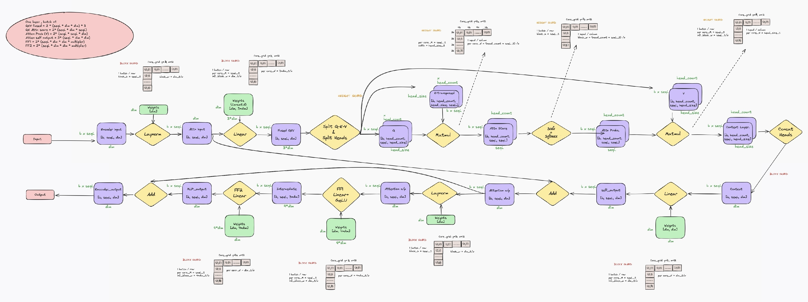

The graph legend:
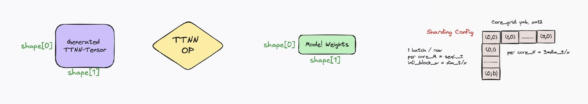

### 5.1 Input
The input to the Vision Transformer consists of image patches that are flattened and embedded into a higher-dimensional space. The input is represented as:

`b × seqL × dim`

Where:
- `b` is the batch size (typically 10 for Blackhole)
- `seqL` is the sequence length (224 padded, corresponding to 196 patches + 1 CLS token)
- `dim` is the embedding dimension (768)

### 5.2 Sharding parametrization
The input and output of each OP is either sharded or interleaved, and there is a sharding config for each OP. Optimally, the consecutive OPs will have the same sharding scheme, so the intermediate results are stored in the local Tensix L1 to minimize the data movement between OPs.

**Blackhole sharding parameters (10×12 grid):**

```python
core_grid = ttnn.CoreGrid(y=batch_size, x=12)
core_grid_10x12 = ttnn.CoreGrid(y=10, x=12)  # Fixed full grid for Blackhole

TILE_HEIGHT = 32
seqL_t = 224 // 32  # 7  - sequence length in tiles
dim_t = 768 // 32   # 24 - inner dimension in tiles
dim_t__x = dim_t // core_grid.x              # 24/12 = 2 tiles per core
dim_t__x_full_grid = dim_t // core_grid_10x12.x  # 24/12 = 2 tiles
head_num = 12  # Encoder head count
head_seqL_t__x = (head_num * seqL_t) // core_grid.x  # (12*7)/12 = 7
head_size_t = dim_t // head_num  # 24/12 = 2 tiles (head size)
class__x = (1152 // 32) // core_grid.x  # (1152/32)/12 = 3 tiles (classification)
```

### 5.3 Layer Normalization (Layernorm)
After embedding the patches, Layer Normalization is applied to the input sequence. This ensures that the input embeddings are normalized before the attention mechanism, which improves the training stability of the model. The **block sharding** in the diagram illustrates how data is partitioned and distributed across multiple processing cores for parallel computation, enhancing efficiency during training.

**Blackhole-Optimized Code**:

```python
def vit_layernorm_before(config, hidden_states, *, parameters):
    attention_output = ttnn.layer_norm(
        hidden_states,
        weight=parameters.layernorm_before.weight,
        bias=parameters.layernorm_before.bias,
        epsilon=config.layer_norm_eps,
        memory_config=ttnn.L1_BLOCK_SHARDED_MEMORY_CONFIG,
        program_config=config.program_configs["layernorm_before_program_config"],
        compute_kernel_config=config.program_configs["ln_compute_config"],  # Blackhole
    )
    return attention_output
```

**Sharding Config for Blackhole (10×12 grid)**:

- With 2D Block sharding, the block or shard size per each tensix core = [seqL, dim/core_grid.x].
- The block height = input or output shape[0] / core_grid.y = b × seqL / core_grid.y, so each tensix row will have b=1 of height = seqL
- The block width = input or output shape[1] / core_grid.x = dim / core_grid.x

```python
"layernorm_before_program_config": ttnn.LayerNormShardedMultiCoreProgramConfig(
    compute_with_storage_grid_size=(core_grid_10x12.x, core_grid_10x12.y),  # (12, 10)
    subblock_w=dim_t__x_full_grid,  # 2 tiles for 10x12 grid
    block_h=seqL_t,  # 7
    block_w=dim_t__x_full_grid,  # 2 tiles for 10x12 grid
    inplace=False,
)
```

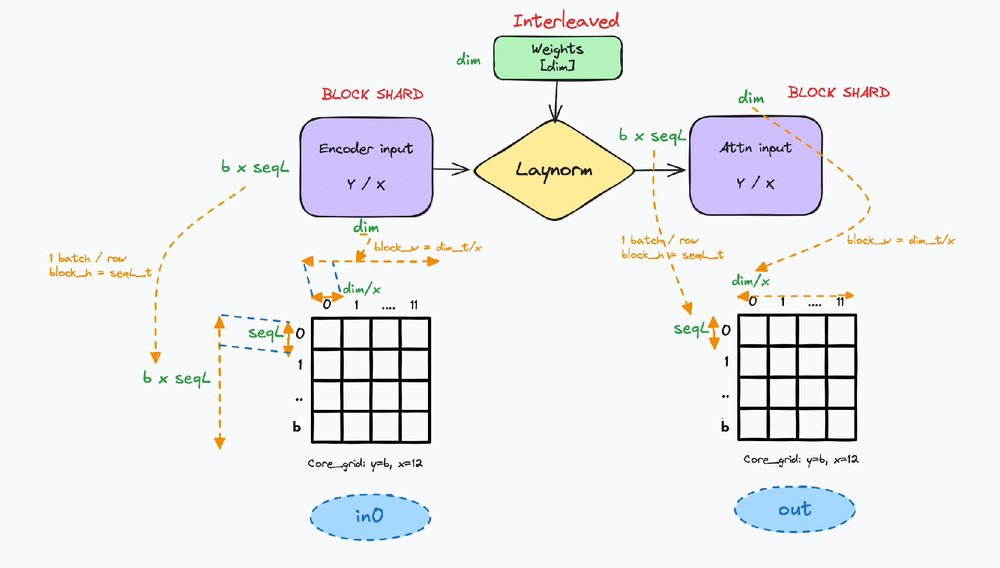

### 5.4 Multi-Head Self-Attention
The multi-head self-attention (MHA) block computes:

- Q, K, V projections from the input
- attention scores QK^T
- softmax probabilities P
- context PV
- projection back to `dim` via the self-output linear layer

The Blackhole implementation uses:
- a **fused QKV projection** (`ttnn.linear` producing a merged QKV tensor),
- **height-sharded** matmuls for the attention BMMs,
- an explicit **scale multiply**,
- `ttnn.softmax_in_place`,
- explicit **resharding** between core grids inside attention,
- optional `ttnn.reallocate()` in some batch regimes.

#### 5.4.1 Q,K,V Generation (Fused Linear)
The Q/K/V projection is computed as one fused linear op that produces a merged QKV tensor. The fused linear operation objective is to maximize the utilization by increasing the workload that is computed simultaneously on the Tensix core grid.

**Blackhole-Optimized Code**:

```python
query_key_value = ttnn.linear(
    hidden_states,
    parameters.attention.query_key_value.weight,
    bias=parameters.attention.query_key_value.bias,
    memory_config=ttnn.L1_BLOCK_SHARDED_MEMORY_CONFIG,
    dtype=ttnn.bfloat8_b,
    program_config=config.program_configs["query_key_value_matmul_program_config"],
)
```

This matmul uses a **block-sharded, reuse+mcast** program config sized for the fixed 10×12 grid.

**Sharding Config for Blackhole**:

- With 2D Block sharding, the block or shard size per each tensix core = [seqL, 3*dim/core_grid.x].
- The block height (per_core_M)= input or output shape[0] / core_grid.y = b × seqL / core_grid.y, so each tensix row will have b=1 of height = seqL
- The input block width (in0_block_w) = input shape[1] / core_grid.x = dim / core_grid.x
- The input block (dim/x) is multi-casted, in turn, from one tensix core to other cores in the same row. The block matmul inner dimension will be the full (dim)
- The output block width (per_core_N) = output shape[1] / core_grid.x = 3*dim / core_grid.x

```python
"query_key_value_matmul_program_config": ttnn.MatmulMultiCoreReuseMultiCastProgramConfig(
    compute_with_storage_grid_size=(core_grid_10x12.x, core_grid_10x12.y),  # (12, 10)
    in0_block_w=dim_t__x_full_grid,  # 2 for 10x12 grid
    out_subblock_h=1,
    out_subblock_w=dim_t__x_full_grid,  # 2 for 10x12 grid
    per_core_M=seqL_t,  # 7
    per_core_N=3 * dim_t__x_full_grid,  # 3*2=6 for 10x12 grid
    transpose_mcast=False,
    fused_activation=None,
)
```


#### 5.4.2 Resharding (Core Grid Transition)
After QKV is produced on the fixed 10×12 grid, the implementation reshards it to a **batch-dependent grid** (`config.core_grid`) before splitting into heads and running the attention BMMs:

```python
block_sharded_config_variable_cores = ttnn.create_sharded_memory_config(
    query_key_value.padded_shape,
    core_grid=config.core_grid,  # dynamic based on batch size
    strategy=ttnn.ShardStrategy.BLOCK,
    orientation=ttnn.ShardOrientation.ROW_MAJOR,
)
query_key_value = ttnn.reshard(query_key_value, block_sharded_config_variable_cores)
```

This reshard is part of the attention "contract" on Blackhole: the fused QKV projection runs on the fixed 10×12 grid, and the attention BMMs run on the batch-dependent grid.

#### 5.4.3 Split into Q/K/V + Heads
The merged QKV tensor is split into Q, K, and V and rearranged into attention heads using the TT-NN transformer helper:

```python
(query, key, value) = ttnn.transformer.split_query_key_value_and_split_heads(
    query_key_value,
    memory_config=ttnn.L1_HEIGHT_SHARDED_MEMORY_CONFIG,
    num_heads=num_heads,
)
ttnn.deallocate(query_key_value)
ttnn.deallocate(hidden_states)
```

The output tensors are placed in **height-sharded** L1 memory, which matches the subsequent BMM-style matmuls. Each matrix has a size of:

`b × head_count × seqL × head_size`

where
- `b` is the batch size (10 for Blackhole)
- `head_count` is the number of attention heads (12)
- `seqL` is the sequence length (224 padded)
- `head_size` is the size of each split head (64)

**QKV Diagram**:

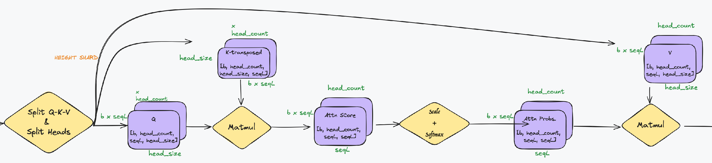

#### 5.4.4 Attention Scores (Q×Kᵀ)
Attention scores are computed via a height-sharded matmul:

```python
attention_scores = ttnn.matmul(
    query,
    key,
    memory_config=ttnn.L1_HEIGHT_SHARDED_MEMORY_CONFIG,
    dtype=ttnn.bfloat8_b,
    program_config=config.program_configs["query_by_key_matmul_program_config"],
)
ttnn.deallocate(query)
ttnn.deallocate(key)
```

**Sharding Config (height sharded BMM / reuse)**:

- This matmul computes attention scores with logical shape `b × head_count × seqL × seqL` (per head, token-to-token scores).
- Height sharding distributes work across cores over the `(b × head_count × seqL)` dimension.

```python
"query_by_key_matmul_program_config": ttnn.MatmulMultiCoreReuseProgramConfig(
    compute_with_storage_grid_size=(core_grid.x, core_grid.y),
    in0_block_w=head_size_t,  # 2
    out_subblock_h=1,
    out_subblock_w=seqL_t,  # 7
    per_core_M=head_seqL_t__x,  # 7 for 10x12 grid
    per_core_N=seqL_t,  # 7
),
```

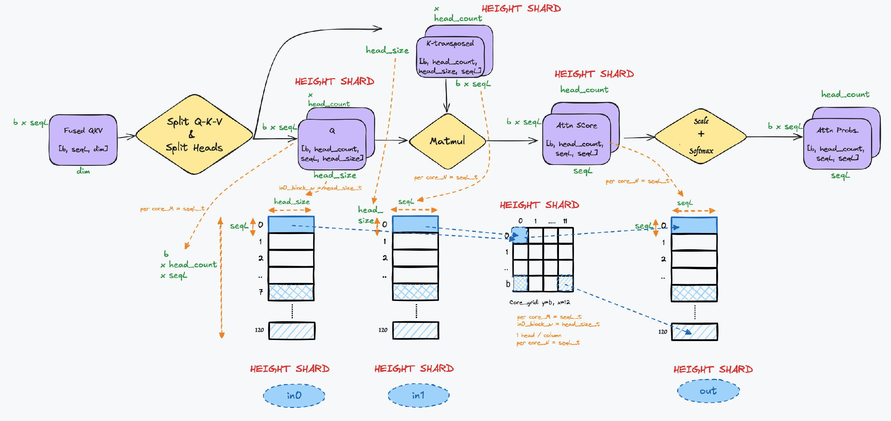

#### 5.4.5 Scale and Softmax
The scores are scaled by `1/sqrt(head_size)` using an explicit multiply, then softmax is applied in-place:

```python
scale = 1.0 / (head_size**0.5)
attention_scores = ttnn.mul_(attention_scores, scale)

attention_probs = ttnn.softmax_in_place(
    attention_scores,
    program_config=config.program_configs["softmax_program_config"],
)
```

> **Note:** An alternative is `ttnn.transformer.attention_softmax_` which fuses scale + softmax into one kernel. However, the in-place version (`attention_softmax_`) **requires an attention mask**. Since ViT does not use attention masks, we use separate `mul_` + `softmax_in_place` operations. For models with attention masks (e.g., causal LLMs), `attention_softmax_` is preferred.

**Softmax Program Config**:

```python
"softmax_program_config": ttnn.SoftmaxShardedMultiCoreProgramConfig(
    compute_with_storage_grid_size=(core_grid.x, core_grid.y),
    subblock_w=seqL_t,  # 7
    block_h=head_seqL_t__x,  # 7 for 10x12 grid
    block_w=seqL_t,  # 7
),
```

#### 5.4.6 Context (P×V)
The context is computed by multiplying attention probabilities with V (height sharded):

```python
context_layer = ttnn.matmul(
    attention_probs,
    value,
    memory_config=ttnn.L1_HEIGHT_SHARDED_MEMORY_CONFIG,
    dtype=ttnn.bfloat8_b,
    program_config=config.program_configs["attention_probabilities_by_value_matmul_program_config"],
)
ttnn.deallocate(attention_probs)
ttnn.deallocate(value)
```

**Sharding Config (height sharded BMM / reuse)**:

- This matmul computes context with logical shape `b × head_count × seqL × head_size`.
- Height sharding distributes the `(b × head_count × seqL)` dimension across cores.

```python
"attention_probabilities_by_value_matmul_program_config": ttnn.MatmulMultiCoreReuseProgramConfig(
    compute_with_storage_grid_size=(core_grid.x, core_grid.y),
    in0_block_w=seqL_t,  # 7
    out_subblock_h=1,
    out_subblock_w=head_size_t,  # 2
    per_core_M=head_seqL_t__x,  # 7 for 10x12 grid
    per_core_N=head_size_t,  # 2
)
```


#### 5.4.7 Concatenating Heads + Self-Output
The per-head context is concatenated back into a single `[b × seqL × dim]` representation:

```python
context_layer = ttnn.transformer.concatenate_heads(
    context_layer,
    memory_config=ttnn.L1_BLOCK_SHARDED_MEMORY_CONFIG,
)
```

After concatenation, the tensor is explicitly converted to the fixed 10×12 block-sharded layout for the self-output projection:

```python
block_sharded_config_120_cores = ttnn.create_sharded_memory_config(
    context_layer.padded_shape,
    core_grid=config.core_grid_10x12,  # 120 cores
    strategy=ttnn.ShardStrategy.BLOCK,
    orientation=ttnn.ShardOrientation.ROW_MAJOR,
)
context_layer = ttnn.to_memory_config(context_layer, block_sharded_config_120_cores)

self_output = ttnn.linear(
    context_layer,
    parameters.output.dense.weight,
    bias=parameters.output.dense.bias,
    memory_config=ttnn.L1_BLOCK_SHARDED_MEMORY_CONFIG,
    dtype=ttnn.bfloat8_b,
    program_config=config.program_configs["self_output_matmul_program_config"],
)
ttnn.deallocate(context_layer)
```

**Sharding Config (block sharded + multicast for self-output)**:

- After concatenating heads, the tensor returns to `b × seqL × dim` (tiles: `[seqL_t, dim_t]`).
- The self-output linear keeps the tensor block sharded on the fixed `core_grid_10x12` grid.

```python
"self_output_matmul_program_config": ttnn.MatmulMultiCoreReuseMultiCastProgramConfig(
    compute_with_storage_grid_size=(core_grid_10x12.x, core_grid_10x12.y),  # (12, 10)
    in0_block_w=dim_t__x_full_grid,  # 2 for 10x12 grid
    out_subblock_h=1,
    out_subblock_w=dim_t__x_full_grid,  # 2 for 10x12 grid
    per_core_M=seqL_t,  # 7
    per_core_N=dim_t__x_full_grid,  # 2 for 10x12 grid
    transpose_mcast=False,
    fused_activation=None,
)
```

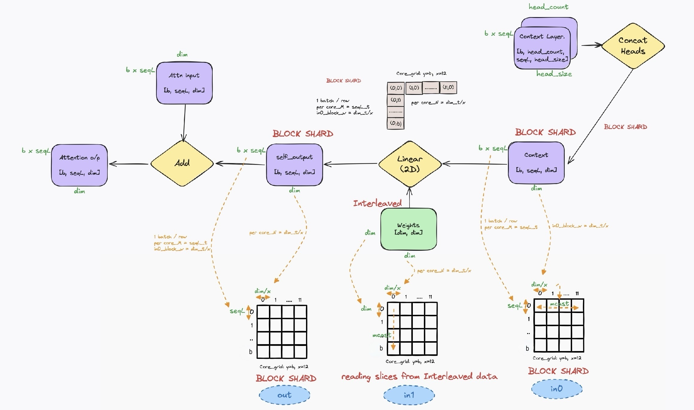

#### 5.4.8 Defragmentation Notes
The attention path contains optional `ttnn.reallocate()` calls controlled by `config.should_reallocate_in_attention`, which is set by `update_model_config()` based on batch regime.

In the Blackhole implementation:
- For batch regimes where `batch_size > 10`, `should_reallocate_in_attention` is enabled.
- When enabled, the code reallocates intermediate tensors in the attention block to avoid fragmentation/defragmentation issues:

```python
# After Q/K/V split
if config.should_reallocate_in_attention:
    value = ttnn.reallocate(value)

# After self-output linear
if config.should_reallocate_in_attention:
    self_output = ttnn.reallocate(self_output)
```

These reallocations compact the L1 memory layout to prevent allocation failures in the attention block for larger batch configurations.

### 5.5 Add and Norm
A residual connection (skip connection) is applied, adding the original input to the attention block back to the output of the attention block. This helps in maintaining gradient flow through the network and stabilizes training. The resulting tensor is then normalized again using layer normalization. Additionally, **block sharding** is used.

**Optimized Code**:

```python
multi_head_attention_output = ttnn.add(
    multi_head_attention_output,
    hidden_states,
    memory_config=ttnn.L1_BLOCK_SHARDED_MEMORY_CONFIG,
    dtype=ttnn.bfloat8_b,
)
layernorm_after_output = ttnn.layer_norm(
    multi_head_attention_output,
    weight=parameters.layernorm_after.weight,
    bias=parameters.layernorm_after.bias,
    memory_config=ttnn.L1_BLOCK_SHARDED_MEMORY_CONFIG,
    program_config=config.program_configs["layernorm_after_output_program_config"],
    compute_kernel_config=config.program_configs["ln_compute_config"],
)
```

**Sharding Config**:

```python
"layernorm_after_output_program_config": ttnn.LayerNormShardedMultiCoreProgramConfig(
    compute_with_storage_grid_size=(core_grid_10x12.x, core_grid_10x12.y),  # (12, 10)
    subblock_w=dim_t__x_full_grid,  # 2 tiles for 10x12 grid
    block_h=seqL_t,  # 7
    block_w=dim_t__x_full_grid,  # 2 tiles for 10x12 grid
    inplace=False,
)
```

**Add and Norm Diagram**:

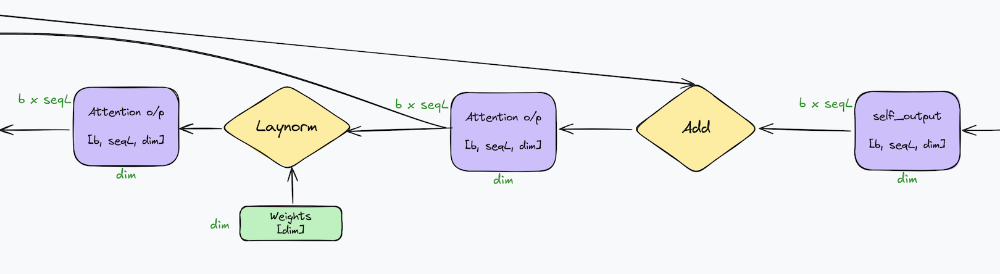

### 5.6 Feed-Forward Network
The feed-forward network (FFN/MLP) expands the embedding dimension and projects it back down:

`dim (768) → 4×dim (3072) → dim (768)`

In the Blackhole implementation, the FFN is implemented as two sharded matmuls:
- **FF1**: `hidden_states @ W1 (+ b1)` with **fused GELU**
- **FF2**: `intermediate @ W2 (+ b2)` followed by a **residual add** with the attention output

#### 5.6.1 FF1 (Intermediate + Fused GELU)

```python
def vit_intermediate(
    config,
    hidden_states,
    *,
    parameters,
):
    output = ttnn.linear(
        hidden_states,
        parameters.dense.weight,
        bias=parameters.dense.bias,
        memory_config=ttnn.L1_BLOCK_SHARDED_MEMORY_CONFIG,
        dtype=ttnn.bfloat8_b,
        program_config=config.program_configs["ff1_matmul_program_config"],
    )
    ttnn.deallocate(hidden_states)
    return output
```

**Sharding Config (FF1, block sharded + multicast)**:

- FF1 computes `b × seqL × (4×dim)`; in tiles `[seqL_t, 4×dim_t]`.
- Output remains block sharded on `core_grid_10x12`, so per-core output width is `(4×dim_t)/grid_x`.
- GELU is fused into the matmul via `fused_activation=(GELU, True)` to reduce extra kernel launches and memory traffic.

```python
"ff1_matmul_program_config": ttnn.MatmulMultiCoreReuseMultiCastProgramConfig(
    compute_with_storage_grid_size=(core_grid_10x12.x, core_grid_10x12.y),  # (12, 10)
    in0_block_w=dim_t__x_full_grid,  # 2 tiles for 10x12 grid
    out_subblock_h=1,
    out_subblock_w=(dim_t__x_full_grid * 4) // 2,  # (2 * 4) // 2 = 4
    per_core_M=seqL_t,  # 7
    per_core_N=dim_t__x_full_grid * 4,  # 2 * 4 = 8
    transpose_mcast=False,
    fused_activation=(ttnn.UnaryOpType.GELU, True),  # Fused GELU!
),
```

#### 5.6.2 FF2 (Output + Residual)

```python
def vit_output(
    config,
    hidden_states,
    residual,
    *,
    parameters,
):
    output = ttnn.linear(
        hidden_states,
        parameters.dense.weight,
        bias=parameters.dense.bias,
        memory_config=ttnn.L1_BLOCK_SHARDED_MEMORY_CONFIG,
        dtype=ttnn.bfloat8_b,
        program_config=config.program_configs["ff2_matmul_program_config"],
    )
    ttnn.deallocate(hidden_states)

    output = ttnn.add(output, residual, memory_config=ttnn.L1_BLOCK_SHARDED_MEMORY_CONFIG, dtype=ttnn.bfloat8_b)
    ttnn.deallocate(residual)
    return output
```

**Sharding Config (FF2, block sharded + multicast)**:

- FF2 projects `b × seqL × (4×dim)` back to `b × seqL × dim`.
- Both FF2 output and the residual add stay in `ttnn.L1_BLOCK_SHARDED_MEMORY_CONFIG`, avoiding reshards between FF2 and the residual.

```python
"ff2_matmul_program_config": ttnn.MatmulMultiCoreReuseMultiCastProgramConfig(
    compute_with_storage_grid_size=(core_grid_10x12.x, core_grid_10x12.y),  # (12, 10)
    in0_block_w=dim_t__x_full_grid * 4,  # 2 * 4 = 8
    out_subblock_h=1,
    out_subblock_w=dim_t__x_full_grid,  # 2
    per_core_M=seqL_t,  # 7
    per_core_N=dim_t__x_full_grid,  # 2
    transpose_mcast=False,
    fused_activation=None,
),
```

#### 5.6.3 FFN Wrapper
The encoder layer calls the FFN through a small wrapper:

```python
def vit_feedforward(
    config,
    hidden_states,
    attention_output,
    *,
    parameters,
):
    intermediate = vit_intermediate(config, hidden_states, parameters=parameters.intermediate)
    hidden_states = vit_output(config, intermediate, attention_output, parameters=parameters.output)
    return hidden_states
```

**FFN Diagram**:

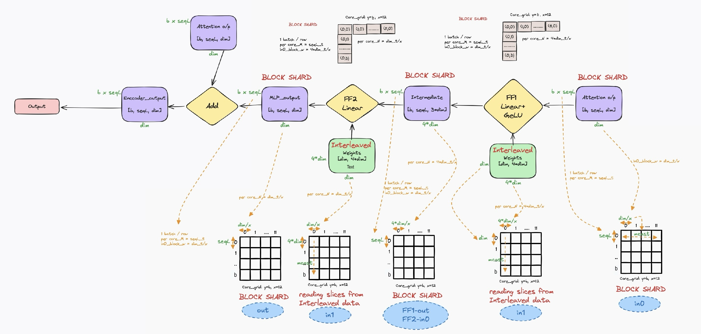

### 5.7 Output
The final result after the feed-forward network and the second normalization step is the **Encoder Output**. This output has the following shape:

`b × seqL × dim`

The output can either be passed to the next layer in the Transformer encoder or to the classification head, depending on the specific task.

## 6. High Resolution ViT Optimizations on Blackhole

When processing higher resolution images with ViT on Blackhole, the sequence length increases significantly (e.g., 512×512 produces 1024 patches, 768×768 produces 2304 patches). This section covers three key optimization techniques implemented in the high-resolution ViT for efficient inference.

### 6.1 Sharding Across the Sequence Length Dimension

For high-resolution ViT, the sequence length becomes a dominant factor in memory and compute distribution. The implementation uses block sharding that distributes **both batch and sequence length** across the core grid's y-dimension.

**Dynamic Sequence Length Configuration:**

The high-resolution implementation accepts variable sequence lengths (1024, 2048, 3072, etc.) and calculates sharding parameters dynamically:

```python
def update_model_config(config, batch_size, sequence_size):
    wh_core_grid_y = 10

    # Grid selection based on batch size
    if batch_size == 1:
        grid_y = 8
        grid_x = 8
    else:
        grid_y = 10
        grid_x = 12

    # INPUTS
    TILE_HEIGHT = 32
    seqL = sequence_size  # 1024, 2048, 3072
    dim_t = config.hidden_size // TILE_HEIGHT  # 24, 36, 48, 72

    # Block sharded grid - avoiding padding on hidden_size and seqL
    if config.hidden_size <= 1024:
        core_grid_BLOCK_SHARDED = ttnn.CoreGrid(y=8, x=8)
    else:
        core_grid_BLOCK_SHARDED = ttnn.CoreGrid(y=8, x=12)

    # Key calculation: distribute (batch × seqL) across y-dimension
    seqL_t = seqL // TILE_HEIGHT  # 32, 64, 96 tiles
    seqL_t__y = (batch_size * seqL_t) // core_grid_BLOCK_SHARDED.y  # tiles per y-core
    dim_t__x = dim_t // core_grid_BLOCK_SHARDED.x  # tiles per x-core
```

**Sequence-Aware LayerNorm Configuration:**

The LayerNorm program config uses `seqL_t__y` to specify the block height per core, ensuring even distribution of the sequence dimension:

```python
"layernorm_before_program_config": ttnn.LayerNormShardedMultiCoreProgramConfig(
    compute_with_storage_grid_size=(core_grid_BLOCK_SHARDED.x, core_grid_BLOCK_SHARDED.y),
    subblock_w=dim_t__x,       # Tiles of hidden_dim per x-core
    block_h=seqL_t__y,         # (batch × seqL_tiles) / grid_y
    block_w=dim_t__x,
    inplace=False,
),
```

**Example calculations for different resolutions:**

| Resolution | Sequence | seqL_t | batch=1, 8×8 grid | seqL_t__y |
|------------|----------|--------|-------------------|-----------|
| 512×512    | 1024     | 32     | 32 / 8            | 4         |
| 768×768    | 2304     | 72     | 72 / 8            | 9         |
| 1024×1024  | 4096     | 128    | 128 / 8           | 16        |

**Benefits of sequence-length sharding:**
- Distributes large sequence workloads evenly across cores
- Maintains per-core memory constraints as resolution scales
- Enables processing of arbitrary sequence lengths without code changes

### 6.2 Width Shard and Block Sharding Mix

High-resolution ViT uses a **multi-grid strategy** with different core grid configurations optimized for each operation type. This approach balances memory constraints, compute utilization, and avoids padding overhead.

**Multiple Core Grid Definitions:**

The implementation defines specialized core grids for different sharding strategies:

```python
# Block sharded grid - sized to avoid padding on hidden_size and seqL
if config.hidden_size <= 1024:
    core_grid_BLOCK_SHARDED = ttnn.CoreGrid(y=8, x=8)  # 64 cores
else:
    core_grid_BLOCK_SHARDED = ttnn.CoreGrid(y=8, x=12)  # 96 cores

# Split heads grid - x=8 ensures 2 heads per core for 16-head models
core_grid_SPLIT_HEADS_SHARDED = ttnn.CoreGrid(y=batch_size, x=8)

# Height sharded grid for attention BMMs
H_x = 8
H_y = min(batch_size * head_num // H_x, 8)
core_grid_HEIGHT_SHARDED = ttnn.CoreGrid(y=H_y, x=H_x)

# Full grid for initial embedding and SDPA
core_grid_12x10 = ttnn.CoreGrid(y=10, x=12)  # 120 cores
```

**Sharding Strategy by Operation:**

| Operation | Core Grid | Sharding Type | Rationale |
|-----------|-----------|---------------|-----------|
| Encoder input | 12×10 | Block | Maximize parallelism for initial sharding |
| LayerNorm | BLOCK_SHARDED (8×8/8×12) | Block | Avoids hidden_size padding |
| QKV Linear | BLOCK_SHARDED | Block | 2D distribution for 3×dim output |
| Split Heads | SPLIT_HEADS_SHARDED | Height | batch_size × 8 for head distribution |
| Q×K, P×V BMMs | HEIGHT_SHARDED | Height | Per-head independent computation |
| Self-Output | BLOCK_SHARDED | Block | Return to block sharding for FFN |
| FF1, FF2 | BLOCK_SHARDED | Block | Large intermediate fits with mcast |

**FFN with Block Sharding (High-Resolution Optimized):**

For high-resolution inputs, the FFN uses block sharding with adjusted `in0_block_w` to manage the larger intermediate dimension:

```python
"ff1_matmul_program_config": ttnn.MatmulMultiCoreReuseMultiCastProgramConfig(
    compute_with_storage_grid_size=(core_grid_BLOCK_SHARDED.x, core_grid_BLOCK_SHARDED.y),
    in0_block_w=dim_t__x // 2,  # Halved to fit L1 constraints
    out_subblock_h=1,
    out_subblock_w=min(4, (dim_t__x * 4) // 2),  # Capped at 4
    per_core_M=seqL_t__y,       # Sequence tiles per y-core
    per_core_N=dim_t__x * 4,    # 4× expansion per x-core
    transpose_mcast=False,
    fused_activation=(ttnn.UnaryOpType.GELU, True),  # Fused GELU
),

"ff2_matmul_program_config": ttnn.MatmulMultiCoreReuseMultiCastProgramConfig(
    compute_with_storage_grid_size=(core_grid_BLOCK_SHARDED.x, core_grid_BLOCK_SHARDED.y),
    in0_block_w=dim_t__x * 2,   # Handle 4×dim input in chunks
    out_subblock_h=1,
    out_subblock_w=dim_t__x,
    per_core_M=seqL_t__y,
    per_core_N=dim_t__x,        # Project back to hidden_dim
    transpose_mcast=False,
    fused_activation=None,
),
```

**Resharding Between Operations:**

The implementation includes explicit resharding when transitioning between core grids:

```python
# After concatenating heads, reshard to BLOCK_SHARDED grid for self-output
block_sharded_config_64_cores = ttnn.create_sharded_memory_config(
    context_layer.padded_shape,
    core_grid=config.core_grid_BLOCK_SHARDED,  # 64 cores
    strategy=ttnn.ShardStrategy.BLOCK,
    orientation=ttnn.ShardOrientation.ROW_MAJOR,
)

context_layer = ttnn.to_memory_config(context_layer, ttnn.DRAM_MEMORY_CONFIG)
context_layer = ttnn.to_memory_config(context_layer, block_sharded_config_64_cores)
```

### 6.3 Scaled Dot-Product Attention (SDPA)

For high-resolution ViT, the implementation uses `ttnn.transformer.scaled_dot_product_attention` (SDPA), which fuses the attention computation into a single optimized kernel. This is critical for high-resolution inputs where the O(seqL²) attention matrix would otherwise exceed L1 memory limits.

#### 6.3.1 SDPA Overview

SDPA replaces the traditional multi-step attention computation with a single fused kernel that implements Flash Attention-style chunking internally.

**SDPA vs. Manual Attention:**

| Aspect | Manual Attention | SDPA |
|--------|------------------|------|
| Memory | Stores full attention matrix | Flash-attention style chunking |
| Kernels | 4+ separate ops (Q×K, scale, softmax, P×V) | Single fused kernel |
| Precision | Configurable per-op | HiFi4 with FP32 accumulation |
| High-res scaling | O(seqL²) memory | O(seqL) memory with chunking |


**Attention Flow with SDPA:**


  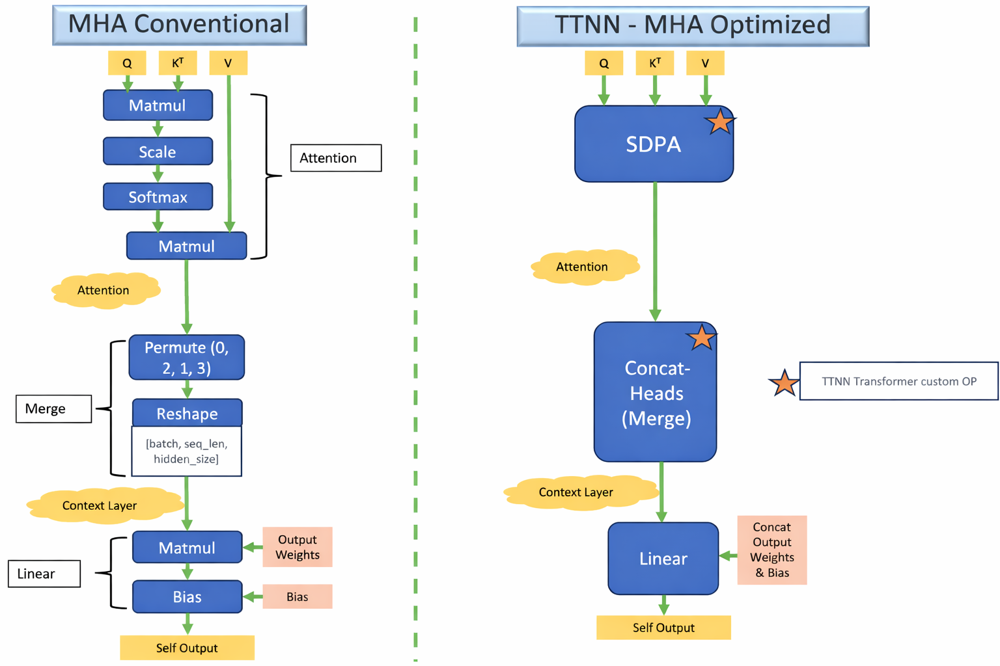

#### 6.3.2 QKV Projection and Head Splitting

The attention block begins with a fused QKV projection followed by head splitting using the optimized `nlp_create_qkv_heads` operation.

**Fused QKV Projection:**

```python
def vit_attention(config, hidden_states, parameters):
    num_heads = config.num_attention_heads  # num_heads = 16
    *_, hidden_size = hidden_states.shape
    head_size = hidden_size // num_heads

    # Fused QKV projection - produces [b, seqL, 3×dim]
    query_key_value = ttnn.linear(
        hidden_states,
        parameters.attention.query_key_value.weight,
        bias=parameters.attention.query_key_value.bias,
        memory_config=ttnn.L1_BLOCK_SHARDED_MEMORY_CONFIG,
        dtype=ttnn.bfloat8_b,
        program_config=config.program_configs["query_key_value_matmul_program_config"],
    )
    # Convert to interleaved L1 for head splitting
    query_key_value = ttnn.to_memory_config(query_key_value, ttnn.L1_MEMORY_CONFIG)
```

**Head Splitting with `nlp_create_qkv_heads`:**

Unlike the standard 224×224 implementation which uses `ttnn.transformer.split_query_key_value_and_split_heads`, the high-resolution version uses `ttnn.experimental.nlp_create_qkv_heads` for more efficient head creation:

```python
    # Efficient head splitting - outputs directly to DRAM
    query, key, value = ttnn.experimental.nlp_create_qkv_heads(
        query_key_value,
        memory_config=ttnn.DRAM_MEMORY_CONFIG,  # Direct to DRAM
        num_heads=num_heads,
        num_kv_heads=num_heads,  # Same as num_heads for ViT (no GQA)
        transpose_k_heads=False,  # SDPA handles K transpose internally
    )
```

**Key differences from `split_query_key_value_and_split_heads`:**
- Outputs directly to DRAM
- `transpose_k_heads=False` because SDPA handles the K transpose internally
- Supports grouped-query attention (GQA) via `num_kv_heads` parameter (not used in ViT)

**Memory Cleanup:**

```python
    ttnn.deallocate(query_key_value)
    ttnn.deallocate(hidden_states)

    # Optional reallocation for memory defragmentation
    if config.should_reallocate_in_attention:
        value = ttnn.reallocate(value)
```

#### 6.3.3 DRAM Staging for Memory Management

For high-resolution sequences, the Q, K, V tensors are explicitly staged in DRAM before SDPA execution. This is a critical optimization that frees L1 memory for the SDPA kernel's internal working buffers.

```python
    # Ensure Q, K, V are in DRAM for SDPA
    query = ttnn.to_memory_config(query, ttnn.DRAM_MEMORY_CONFIG)
    key = ttnn.to_memory_config(key, ttnn.DRAM_MEMORY_CONFIG)
    value = ttnn.to_memory_config(value, ttnn.DRAM_MEMORY_CONFIG)
```

**Why DRAM staging?**

| Without DRAM Staging | With DRAM Staging |
|---------------------|-------------------|
| Q, K, V compete with SDPA working memory in L1 | L1 fully available for SDPA chunks |
| Smaller chunk sizes possible | Larger chunk sizes (256) for efficiency |
| Risk of L1 OOM for large seqL | Scales to very long sequences |
| SDPA streams from L1 (limited bandwidth utilization) | SDPA streams from DRAM (full NoC bandwidth) |

For a 768×768 image with seqL=2304 and 16 heads:
- Q, K, V each: `1 × 16 × 2304 × 64 × 2 bytes = 4.7 MB`
- Total Q+K+V: `~14 MB` — too large to keep in L1 alongside SDPA working memory

#### 6.3.4 SDPA Kernel Execution

The SDPA kernel is configured with specific parameters optimized for high-resolution attention.

**Program Configuration:**

```python
    program_config = ttnn.SDPAProgramConfig(
        compute_with_storage_grid_size=(config.core_grid_12x10.x, config.core_grid_12x10.y),
        q_chunk_size=256,       # Process 256 Q tokens per chunk
        k_chunk_size=256,       # Process 256 K tokens per chunk
        exp_approx_mode=False,  # Accurate exponential (no Taylor approximation)
    )
```

**Compute Kernel Configuration:**

```python
    compute_kernel_config = ttnn.WormholeComputeKernelConfig(
        math_fidelity=ttnn.MathFidelity.HiFi4,  # Highest precision
        math_approx_mode=False,                  # No approximations
        fp32_dest_acc_en=True,                   # FP32 accumulation
        packer_l1_acc=True,                      # L1 accumulation in packer
    )
```

**SDPA Execution:**

```python
    context_layer = ttnn.transformer.scaled_dot_product_attention(
        query,
        key,
        value,
        is_causal=False,  # ViT uses bidirectional attention (no causal mask)
        program_config=program_config,
        compute_kernel_config=compute_kernel_config,
        memory_config=ttnn.L1_MEMORY_CONFIG,
    )
```

**Configuration Parameter Details:**

| Parameter | Value | Rationale |
|-----------|-------|-----------|
| `q_chunk_size` | 256 | Larger chunks reduce kernel launch overhead; 256 balances memory and efficiency |
| `k_chunk_size` | 256 | Matched to Q for symmetric chunking |
| `exp_approx_mode` | False | Accurate softmax exponential; critical for attention score precision |
| `is_causal` | False | ViT processes all patches simultaneously—no autoregressive masking |
| `math_fidelity` | HiFi4 | Maximum precision prevents attention score drift in deep networks |
| `fp32_dest_acc_en` | True | FP32 accumulation prevents overflow when summing over long sequences |

#### 6.3.5 Post-Attention Processing

After SDPA, the multi-head outputs are concatenated and projected back to the hidden dimension.

**Head Concatenation:**

```python
    # Concatenate heads: [b, heads, seqL, head_size] → [b, seqL, dim]
    context_layer = ttnn.transformer.concatenate_heads(context_layer)
```

**Resharding for Self-Output:**

The context tensor must be resharded to the block-sharded configuration used by the self-output linear layer. This involves a two-step memory transition via DRAM:

```python
    # Create block-sharded config for self-output
    block_sharded_config_64_cores = ttnn.create_sharded_memory_config(
        context_layer.padded_shape,
        core_grid=config.core_grid_BLOCK_SHARDED,  # 8×8 = 64 cores
        strategy=ttnn.ShardStrategy.BLOCK,
        orientation=ttnn.ShardOrientation.ROW_MAJOR,
    )

    # Two-step resharding: interleaved → DRAM → block sharded
    context_layer = ttnn.to_memory_config(context_layer, ttnn.DRAM_MEMORY_CONFIG)
    context_layer = ttnn.to_memory_config(context_layer, block_sharded_config_64_cores)
```

> **Note:** The two-step transition (L1 → DRAM → L1 block sharded) is required because direct resharding between different sharding strategies may not be supported. DRAM acts as an intermediate staging area.

**Self-Output Projection:**

```python
    # Project back to hidden dimension
    self_output = ttnn.linear(
        context_layer,
        parameters.output.dense.weight,
        bias=parameters.output.dense.bias,
        memory_config=ttnn.L1_BLOCK_SHARDED_MEMORY_CONFIG,
        dtype=ttnn.bfloat8_b,
        program_config=config.program_configs["self_output_matmul_program_config"],
    )
    ttnn.deallocate(context_layer)

    # Optional defragmentation
    if config.should_reallocate_in_attention:
        self_output = ttnn.reallocate(self_output)

    return self_output
```

#### 6.3.6 Memory Benefits

SDPA's chunked computation provides dramatic memory savings for high-resolution inputs.

**Memory Comparison for High-Resolution (768×768 image, seqL=2304, 16 heads):**

| Approach | Peak Attention Memory (per batch) | Calculation |
|----------|-----------------------------------|-------------|
| Manual (full matrix) | 169.9 MB | 16 × 2304 × 2304 × 2 bytes |
| SDPA (chunk=256) | 18.9 MB | 16 × 256 × 2304 × 2 bytes |

**Memory Reduction by Resolution:**

| Resolution | seqL | Manual Attention | SDPA (chunk=256) | Reduction |
|------------|------|------------------|------------------|-----------|
| 384×384    | 576  | 10.6 MB          | 4.7 MB           | 2.3× |
| 512×512    | 1024 | 33.6 MB          | 8.4 MB           | 4× |
| 768×768    | 2304 | 169.9 MB         | 18.9 MB          | 9× |
| 1024×1024  | 4096 | 537.9 MB         | 33.6 MB          | 16× |

The memory reduction scales with sequence length—making SDPA essential for high-resolution processing where manual attention would exceed available memory.

> **Key Insight:** The combination of DRAM staging for Q, K, V and chunked SDPA execution allows Blackhole to process images up to 1024×1024 and beyond, which would be impossible with traditional attention implementations.

## 7. Conclusion

This walkthrough provided an in-depth explanation of the Vision Transformer (ViT) encoder implementation optimized for the Tenstorrent Blackhole (P150) architecture. Key optimizations for Blackhole include:

1. **10×12 Core Grid**: Leveraging Blackhole's 120 Tensix cores for maximum parallelization
2. **WormholeComputeKernelConfig**: Using advanced compute kernel features like `packer_l1_acc`
3. **Dynamic Resharding**: Optimized tensor resharding between operations to maintain efficiency
4. **Fused Operations**: Fused QKV linear, fused GELU in FFN
5. **Memory Management**: Comprehensive L1 usage with explicit deallocations
6. **Defragmentation Handling**: Automatic reallocation when batch_size > 10

From patch embedding to self-attention and feed-forward networks, the ViT model effectively applies the principles of attention-based mechanisms to image processing with architecture-specific optimizations for Blackhole.

## 8. References
  - ViT paper: https://arxiv.org/pdf/2010.11929
  - HuggingFace ViT docs: https://huggingface.co/docs/transformers/en/model_doc/vit
  - https://medium.com/@hansahettiarachchi/unveiling-vision-transformers-revolutionizing-computer-vision-beyond-convolution-c410110ef061
  - https://www.v7labs.com/blog/vision-transformer-guide
  - https://viso.ai/deep-learning/vision-transformer-vit/
  - TT-NN sharding & layouts: https://github.com/tenstorrent/tt-metal/blob/main/tech_reports/tensor_layouts/tensor_layouts.md
  - ViT Blackhole Implementation: `models/demos/blackhole/vit/tt/ttnn_optimized_sharded_vit_bh.py`
  - Blackhole Bring-Up Guide: `tech_reports/Blackhole/BlackholeBringUpProgrammingGuide.md`
  - Allocator / memory banks: `tech_reports/memory/allocator.md`
  - Matrix engine / fidelity notes: `tech_reports/matrix_engine/matrix_engine.md`
  - GEMM FLOPS and BH grid reference: `tech_reports/GEMM_FLOPS/GEMM_FLOPS.md`
