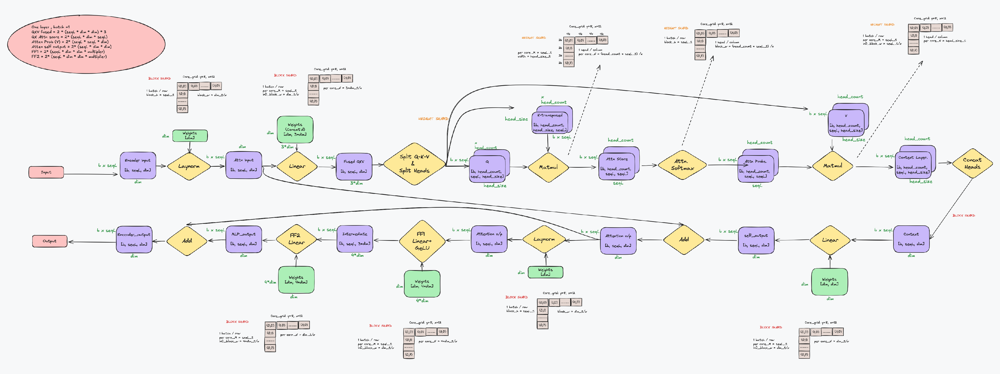

# ViT in TT-NN (Blackhole)
Authors: Vishal Shenoy, Mohamed Bahnas

## Contents
- [ViT in TT-NN (Blackhole)](#vit-in-tt-nn-blackhole)
  - [Contents](#contents)
  - [1. Overview](#1-overview)
  - [2. ViT TT-NN Optimization Techniques (Blackhole)](#2-vit-tt-nn-optimization-techniques-blackhole)
    - [2.1 Sharding on all relevant OPs](#21-sharding-on-all-relevant-ops)
    - [2.2 Matmul sharding variants in ViT](#22-matmul-sharding-variants-in-vit)
    - [2.3 Transformer optimizations](#23-transformer-optimizations)
  - [3. ViT TT-NN Code Structure (Blackhole)](#3-vit-tt-nn-code-structure-blackhole)
    - [3.1 Top-level modules](#31-top-level-modules)
    - [3.2 Embeddings module](#32-embeddings-module)
    - [3.3 Encoder module](#33-encoder-module)
    - [3.4 Encoder layer module (one layer)](#34-encoder-layer-module-one-layer)
  - [4. ViT Encoder Layer TT-NN Deep Dive (Blackhole)](#4-vit-encoder-layer-tt-nn-deep-dive-blackhole)
    - [4.1 Input](#41-input)
    - [4.2 Sharding parametrization](#42-sharding-parametrization)
    - [4.3 Layer Normalization (LayerNorm)](#43-layer-normalization-layernorm)
    - [4.4 Multi-Head Self-Attention](#44-multi-head-self-attention)
      - [4.4.1 Q,K,V Generation (Fused Linear)](#441-qkv-generation-fused-linear)
      - [4.4.2 Resharding and core-grid usage](#442-resharding-and-core-grid-usage)
      - [4.4.3 Split into Q/K/V + heads](#443-split-into-qkv--heads)
      - [4.4.4 Attention scores (Q×Kᵀ) + scale](#444-attention-scores-qk--scale)
      - [4.4.5 Softmax (in-place)](#445-softmax-in-place)
      - [4.4.6 Context (P×V)](#446-context-pv)
      - [4.4.7 Concatenate heads + Self-output Linear](#447-concatenate-heads--self-output-linear)
      - [4.4.8 Reallocate/defragmentation notes](#448-reallocatedefragmentation-notes)
    - [4.5 Add and Norm](#45-add-and-norm)
    - [4.6 Feed-Forward Network (FFN/MLP)](#46-feed-forward-network-ffnmlp)
    - [4.7 Output](#47-output)
  - [5. Conclusion](#5-conclusion)
  - [6. References](#6-references)

## 1. Overview

The [Vision Transformer](https://arxiv.org/pdf/2010.11929) (ViT) is a transformer model that is utilized for vision processing tasks. The ViT architecture in TT-NN leverages the self-attention mechanism, originally designed for NLP tasks, to process image data by treating each image as a sequence of patches. This walkthrough explains the key components of the ViT model and demonstrates how the Tenstorrent TT-NN library implements these components efficiently on Blackhole devices.
For more details on the architecture, please refer to the [References](#6-references).

## 2. ViT TT-NN Optimization Techniques (Blackhole)

The implemented optimization techniques in TT-NN compared to the conventional flow are:

### 2.1 Sharding on all relevant OPs
  - Applying sharding techniques to harvest the optimum utilization of the computation OPs, by eliminating the need for data movement inter-tensix-cores between the consecutive OPs.
  - For more details, please refer to the [related tech-report](https://github.com/tenstorrent/tt-metal/blob/main/tech_reports/tensor_layouts/tensor_layouts.md#42-sharding)
  - Sharding Concepts

  - Illustrative example


### 2.2 Matmul sharding variants in ViT

#### 2.2.1 Matmul Reuse (BMM)
The batch Matmul(BMM) Reuse case used in ViT model is in the Multi-head Self Attention module, where both inputs (in0 and in1) as well as the output are height sharded. There no multi-cast (mcast) technique applied on the inputs here. Each core will be responsible for the Matmul of single head of one image of the batch.


#### 2.2.2 Matmul Reuse Mcast (2D)
The Reuse Mcast case used in ViT model is the block sharded Matmul cases in QKV generation as well as the Feed-Forward Network.
  - The implemented config is Block sharded orientation is Row_Major, where the in0 outer dimension (M) is sharded along the y-axis of the core grid. On the inner dimension of in0, the sharded slices are mcasted along the x-direction of the core grid. The mcast process is done in turn from one core to all other cores in the row, so the whole inner dimension of in0 exists per each core during its Matmul operation.
  - Please note that the Row_Major term mentioned here is referring to the sharded blocks placement on the core grid. It's different than the Row_Major data layout that is compared to the Tile layout in the report [tensor_layouts](https://github.com/tenstorrent/tt-metal/blob/main/tech_reports/tensor_layouts/tensor_layouts.md)
  - The in1 is interleaved (on L1 or DRAM) and its slices along the N (outer) dimension are mcasted along the cores in the same column, where each slice has the full inner dimension (K). This is aligned with the previously mentioned mcast of in0 slices.
  - Worth to mention that in some cases it may be better to implement the Column_Major (and mcast transposed = True) config, where the in0 M dimension is sharded along the x-axis of the core as shown in the figure. All the mcast techniques in the Column_Major will be transposed with respect to the Row_Major config mentioned in the previous paragraph.


#### 2.2.3 Matmul Reuse Mcast (1D)
The other Reuse Mcast case (not used in ViT) is the height sharded on in0, while in1 is still interleaved, as shown in the figure.


### 2.3 Transformer optimizations
  - Merging Q,K,V Linear operations in one large OP for higher utilization of Tensix computation power.
  - Customized tensor manipulation operations that are highly optimized as Transformer-based OPs in TT-NN.
  - Pre-processing of model weights, to apply the data format conversion as well as merging and transposing to match the OP configuration.
  - Fusing GeLU OP with its preceding Linear OP

    
  

## 3. ViT TT-NN Code Structure (Blackhole)

This section outlines the code organization of the TT-NN Blackhole ViT implementation. The implementation is structured as a small set of functional modules (embeddings, encoder, encoder layer, attention, MLP) plus a configuration helper that defines the sharding/matmul program configs.

The reference implementation in this report is:
- `models/demos/blackhole/vit/tt/ttnn_optimized_sharded_vit_bh.py`

### 3.1 Top-level modules
ViT model has 3 main modules: Embeddings, Encoder (12 layers), and Classification head.

```python
def vit(
    config,
    pixel_values,
    cls_token,
    position_embeddings,
    parameters,
):
    embeddings_output = vit_embeddings(config, pixel_values, cls_token, position_embeddings, parameters=parameters)

    hidden_states = vit_encoder(
        config,
        embeddings_output,
        parameters=parameters.vit.encoder,
    )

    # Final LayerNorm
    output = ttnn.layer_norm(
        hidden_states,
        weight=parameters.vit.layernorm.weight,
        bias=parameters.vit.layernorm.bias,
        epsilon=config.layer_norm_eps,
        memory_config=ttnn.L1_BLOCK_SHARDED_MEMORY_CONFIG,
        program_config=config.program_configs["layernorm_before_program_config"],
    )

    # Classifier
    classifier_output = ttnn.linear(
        output,
        parameters.classifier.weight,
        bias=parameters.classifier.bias,
        memory_config=ttnn.L1_BLOCK_SHARDED_MEMORY_CONFIG,
        dtype=ttnn.bfloat8_b,
        program_config=config.program_configs["classifer_matmul_program_config"],
    )
    return classifier_output
```

> Note: the final LayerNorm output is resharded to a batch-dependent (variable) core grid before the classifier in the current Blackhole implementation. This is described in the Deep Dive section.

### 3.2 Embeddings module
ViT embeddings include patch embeddings + position embeddings + CLS token concat.

Patch embeddings are computed by folding the input image into patches and applying a linear projection.

```python
def vit_patch_embeddings(config, pixel_values, *, parameters, unittest_check=False):
    batch_size, img_h, img_w, img_c = pixel_values.shape  # permuted input NHWC
    patch_size = config.patch_size
    patch_count = img_h // patch_size  # 14
    patch_size_sq_trpl = int(patch_size * patch_size * 3)  # 768
    patch_count_all = int(patch_count * patch_count)  # 196
    stride_h = patch_size
    stride_w = 1

    folded_pixel_values = ttnn.fold(pixel_values, stride_h, stride_w)
    ttnn.deallocate(pixel_values)
    folded_pixel_values = ttnn.to_memory_config(folded_pixel_values, memory_config=ttnn.L1_MEMORY_CONFIG)
    folded_pixel_values = ttnn.to_layout(folded_pixel_values, layout=ttnn.TILE_LAYOUT, dtype=ttnn.bfloat8_b)

    patch_embedding_output = ttnn.linear(
        folded_pixel_values,
        parameters.projection.weight,
        bias=parameters.projection.bias,
        memory_config=ttnn.L1_MEMORY_CONFIG,
        dtype=ttnn.bfloat16,
        core_grid=config.core_grid,
    )

    patch_embedding_output = ttnn.to_layout(patch_embedding_output, layout=ttnn.ROW_MAJOR_LAYOUT)
    patch_embedding_output = ttnn.reshape(patch_embedding_output, (batch_size, patch_count_all, patch_size_sq_trpl))
    return patch_embedding_output
```

Embedding output is then assembled with CLS token + position embeddings:

```python
def vit_embeddings(
    config,
    pixel_values,
    cls_token,
    position_embeddings,
    *,
    parameters,
):
    parameters = parameters.vit.embeddings
    l1_memory_config = ttnn.L1_MEMORY_CONFIG

    patch_embeddings = vit_patch_embeddings(config, pixel_values, parameters=parameters.patch_embeddings)
    embedding_output = ttnn.concat([cls_token, patch_embeddings], -2, memory_config=l1_memory_config)
    embedding_output = ttnn.to_layout(embedding_output, layout=ttnn.TILE_LAYOUT)
    embedding_output = ttnn.add(
        embedding_output, position_embeddings, memory_config=ttnn.L1_MEMORY_CONFIG, dtype=ttnn.bfloat8_b
    )
    return embedding_output
```

### 3.3 Encoder module
The encoder is a 12-layer Transformer encoder. The Blackhole implementation first reshapes/pads the token dimension to a tile multiple and converts embeddings to a block-sharded tensor on a fixed 10×12 core grid.

```python
def vit_encoder(
    config,
    embeddings,
    parameters,
):
    TILE_HEIGHT = 32
    emb_N, emb_S, emb_D = embeddings.shape
    emb_S = (((emb_S - 1) // TILE_HEIGHT) + 1) * TILE_HEIGHT
    encoder_input = ttnn.to_memory_config(
        embeddings,
        memory_config=ttnn.create_sharded_memory_config(
            [emb_N, emb_S, emb_D],
            core_grid=config.core_grid_10x12,
            strategy=ttnn.ShardStrategy.BLOCK,
            orientation=ttnn.ShardOrientation.ROW_MAJOR,
        ),
        dtype=ttnn.bfloat8_b,
    )
    ttnn.deallocate(embeddings)

    for index, encoder_parameters in enumerate(parameters.layer):
        encoder_output = vit_layer(
            config,
            encoder_input,
            encoder_parameters,
        )
        encoder_input = encoder_output

    return encoder_output
```

### 3.4 Encoder layer module (one layer)
The encoder layer follows the standard Transformer block: LayerNorm → MHA → residual add → LayerNorm → MLP/FFN.

```python
def vit_layer(
    config,
    hidden_states,
    parameters,
):
    layernorm_before_output = ttnn.layer_norm(
        hidden_states,
        weight=parameters.layernorm_before.weight,
        bias=parameters.layernorm_before.bias,
        memory_config=ttnn.L1_BLOCK_SHARDED_MEMORY_CONFIG,
        program_config=config.program_configs["layernorm_before_program_config"],
        compute_kernel_config=config.program_configs["ln_compute_config"],
    )

    multi_head_attention_output = vit_attention(
        config,
        layernorm_before_output,
        parameters=parameters.attention,
    )

    multi_head_attention_output = ttnn.add(
        multi_head_attention_output,
        hidden_states,
        memory_config=ttnn.L1_BLOCK_SHARDED_MEMORY_CONFIG,
        dtype=ttnn.bfloat8_b,
    )

    layernorm_after_output = ttnn.layer_norm(
        multi_head_attention_output,
        weight=parameters.layernorm_after.weight,
        bias=parameters.layernorm_after.bias,
        memory_config=ttnn.L1_BLOCK_SHARDED_MEMORY_CONFIG,
        program_config=config.program_configs["layernorm_after_output_program_config"],
        compute_kernel_config=config.program_configs["ln_compute_config"],
    )

    feedforward_output = vit_feedforward(
        config,
        layernorm_after_output,
        multi_head_attention_output,
        parameters=parameters,
    )

    return feedforward_output
```

The Multi-Head Self-Attention implementation (`vit_attention`) is described in depth in Section 4.4 since it is where most of the Blackhole-specific sharding transitions occur (resharding between core grids, explicit scaling, and in-place softmax).

## 4. ViT Encoder Layer TT-NN Deep Dive (Blackhole)

This section is a step-by-step walkthrough of the Blackhole ViT encoder layer implementation in TT-NN. It covers the sharding strategy, matmul program configs, and the attention flow (including resharding, explicit scaling, in-place softmax, and any required reallocations).

This diagram represents the TT-NN module `vit_layer()`:



The graph legend:


### 4.1 Input
The input to a ViT encoder layer is a sequence of patch embeddings with shape:

`b × seqL × dim`

Where:
- `b` is the batch size
- `seqL` is the sequence length (number of tokens)
- `dim` is the embedding dimension

For ViT-Base (224×224 image, patch=16, hidden=768):
- patch grid is 14×14 → `seqL = 196`
- TT-NN tiles have height 32, so the token dimension is padded to a tile multiple:
  - `seqL_padded = 224`

In the Blackhole implementation, the encoder (Section 3.3) converts embeddings to a **block-sharded** tensor on a fixed **10×12 core grid**, so the *layer input* is typically:

`b × 224 × 768`  (tile-padded tokens)

### 4.2 Sharding parametrization
This subsection defines the main sharding parameters used throughout the Blackhole implementation. These values are computed in `update_model_config()` and are used to size the sharded program configs (LayerNorm, matmuls, softmax).

Below are the parameters used in the sharding scheme, with comments showing typical ViT-Base values:

```python
wh_core_grid_y = 10

# Grid selection (batch-dependent)
should_reallocate_in_attention = False
if batch_size <= wh_core_grid_y:
    grid_y = batch_size
    grid_x = 12
else:
    grid_y = 10
    batch_per_y_core = batch_size // wh_core_grid_y
    batch_size = grid_y * batch_per_y_core
    grid_x = 12
    should_reallocate_in_attention = True

core_grid = ttnn.CoreGrid(y=grid_y, x=grid_x)
core_grid_10x12 = ttnn.CoreGrid(y=10, x=12)

TILE_HEIGHT = 32

# ViT-Base shapes
patch_count = config.image_size // config.patch_size   # 224/16 = 14
seqL = patch_count * patch_count                       # 196
seqL_padded = (((seqL - 1) // TILE_HEIGHT) + 1) * TILE_HEIGHT  # 224
seqL_t = seqL_padded // TILE_HEIGHT                    # 7

dim_t = config.hidden_size // TILE_HEIGHT              # 768/32 = 24
dim_t__x = dim_t // core_grid.x                        # 2 when x=12
dim_t__x_full_grid = dim_t // core_grid_10x12.x        # 2 (10x12 grid)

head_num = config.num_attention_heads                  # 12
head_seqL_t__x = (head_num * seqL_t) // core_grid.x    # 7 when x=12
head_size_t = dim_t // head_num                        # 2

# classifier: 1000 classes padded to 1152
class__x = (1152 // TILE_HEIGHT) // core_grid.x        # 3 when x=12
```

Two related core grids appear throughout the implementation:
- **`core_grid_10x12` (fixed 10×12)**: used for the block-sharded backbone (encoder sharding, LayerNorms, QKV/self-output/FFN matmuls).
- **`core_grid` (batch-dependent)**: used inside attention BMMs/softmax and for the classifier in some regimes, which is why the attention path contains explicit `reshard()`/`to_memory_config()` transitions.

### 4.3 Layer Normalization (LayerNorm)
LayerNorm is applied twice per encoder layer:
1) Before attention (`layernorm_before`)
2) After the attention residual add (`layernorm_after`)

In the Blackhole implementation, both LayerNorm ops run on **block-sharded** tensors in L1:

```python
layernorm_before_output = ttnn.layer_norm(
    hidden_states,
    weight=parameters.layernorm_before.weight,
    bias=parameters.layernorm_before.bias,
    memory_config=ttnn.L1_BLOCK_SHARDED_MEMORY_CONFIG,
    program_config=config.program_configs["layernorm_before_program_config"],
    compute_kernel_config=config.program_configs["ln_compute_config"],
)

layernorm_after_output = ttnn.layer_norm(
    multi_head_attention_output,
    weight=parameters.layernorm_after.weight,
    bias=parameters.layernorm_after.bias,
    memory_config=ttnn.L1_BLOCK_SHARDED_MEMORY_CONFIG,
    program_config=config.program_configs["layernorm_after_output_program_config"],
    compute_kernel_config=config.program_configs["ln_compute_config"],
)
```

#### 4.3.1 Sharding shape (block sharding)
For the encoder layer input `b × 224 × 768`, the block-sharded tensor is distributed on the fixed `core_grid_10x12` grid. In tile units:
- `seqL_t = 7` tiles (224/32)
- `dim_t = 24` tiles (768/32)
- `dim_t__x_full_grid = 2` tiles per core in X (24/12)

So the per-core shard shape for LayerNorm is:

`[block_h, block_w] = [seqL_t, dim_t__x_full_grid] = [7, 2]` tiles

**Sharding intuition (same style as the original report)**:
- With 2D block sharding, each core owns a block of tokens (height) and a slice of the embedding dimension (width).
- The shard height corresponds to one “tile-row” region of the sequence: `block_h = seqL_t`.
- The shard width is the per-core slice of the embedding: `block_w = dim_t__x_full_grid`.

#### 4.3.2 LayerNorm program configs (Blackhole)
The LayerNorm program configs are defined in `update_model_config()` and are sized in tiles:

```python
"layernorm_before_program_config": ttnn.LayerNormShardedMultiCoreProgramConfig(
    compute_with_storage_grid_size=(core_grid_10x12.x, core_grid_10x12.y),
    subblock_w=dim_t__x_full_grid,
    block_h=seqL_t,
    block_w=dim_t__x_full_grid,
    inplace=False,
),

"layernorm_after_output_program_config": ttnn.LayerNormShardedMultiCoreProgramConfig(
    compute_with_storage_grid_size=(core_grid_10x12.x, core_grid_10x12.y),
    subblock_w=dim_t__x_full_grid,
    block_h=seqL_t,
    block_w=dim_t__x_full_grid,
    inplace=False,
),
```

#### 4.3.3 LayerNorm compute kernel configuration
The Blackhole implementation also provides a compute kernel configuration for LayerNorm:

```python
"ln_compute_config": ttnn.WormholeComputeKernelConfig(
    math_fidelity=ttnn.MathFidelity.HiFi2,
    math_approx_mode=True,
    fp32_dest_acc_en=False,
    packer_l1_acc=True,
),
```

This configuration controls math fidelity and some kernel-level performance options for the LayerNorm implementation.


### 4.4 Multi-Head Self-Attention
The multi-head self-attention (MHA) block computes:

- Q, K, V projections from the input
- attention scores \(QK^T\)
- softmax probabilities \(P\)
- context \(PV\)
- projection back to `dim` via the self-output linear layer

The Blackhole implementation uses:
- a **fused QKV projection** (`ttnn.linear` producing a merged QKV tensor),
- **height-sharded** matmuls for the attention BMMs,
- an explicit **scale multiply**,
- `ttnn.softmax_in_place`,
- explicit **resharding** between core grids inside attention,
- optional `ttnn.reallocate()` in some batch regimes.

#### 4.4.1 Q,K,V Generation (Fused Linear)
The Q/K/V projection is computed as one fused linear op that produces a merged QKV tensor.

```python
query_key_value = ttnn.linear(
    hidden_states,
    parameters.attention.query_key_value.weight,
    bias=parameters.attention.query_key_value.bias,
    memory_config=ttnn.L1_BLOCK_SHARDED_MEMORY_CONFIG,
    dtype=ttnn.bfloat8_b,
    program_config=config.program_configs["query_key_value_matmul_program_config"],
)
```

This matmul uses a **block-sharded, reuse+mcast** program config sized for the fixed 10×12 grid.

```python
"query_key_value_matmul_program_config": ttnn.MatmulMultiCoreReuseMultiCastProgramConfig(
    compute_with_storage_grid_size=(core_grid_10x12.x, core_grid_10x12.y),
    in0_block_w=dim_t__x_full_grid,
    out_subblock_h=1,
    out_subblock_w=dim_t__x_full_grid,
    per_core_M=seqL_t,
    per_core_N=3 * dim_t__x_full_grid,
    transpose_mcast=False,
    fused_activation=None,
),
```

**Sharding Config (block sharded + multicast)**:
- Output shape is `b × seqL × (3×dim)`; in tiles, `[seqL_t, 3×dim_t]`.
- The output is block sharded, so each core produces `[seqL_t, (3×dim_t)/grid_x]` tiles.
- Multicast is used to efficiently distribute slices of the input/weights across cores while computing the fused QKV projection.
- The current Blackhole implementation uses `transpose_mcast=False` (row-major placement on the core grid).


#### 4.4.2 Resharding and core-grid usage
After QKV is produced on the fixed 10×12 grid, the implementation reshards it to a **batch-dependent grid** (`config.core_grid`) before splitting into heads and running the attention BMMs:

```python
block_sharded_config_variable_cores = ttnn.create_sharded_memory_config(
    query_key_value.padded_shape,
    core_grid=config.core_grid,  # dynamic based on batch size
    strategy=ttnn.ShardStrategy.BLOCK,
    orientation=ttnn.ShardOrientation.ROW_MAJOR,
)
query_key_value = ttnn.reshard(query_key_value, block_sharded_config_variable_cores)
```

This reshard is part of the attention “contract” on Blackhole: the fused QKV projection runs on the fixed 10×12 grid, and the attention BMMs run on the batch-dependent grid.

#### 4.4.3 Split into Q/K/V + heads
The merged QKV tensor is split into Q, K, and V and rearranged into attention heads using the TT-NN transformer helper:

```python
(query, key, value) = ttnn.transformer.split_query_key_value_and_split_heads(
    query_key_value,
    memory_config=ttnn.L1_HEIGHT_SHARDED_MEMORY_CONFIG,
    num_heads=num_heads,
)
ttnn.deallocate(query_key_value)
ttnn.deallocate(hidden_states)
```

The output tensors are placed in **height-sharded** L1 memory, which matches the subsequent BMM-style matmuls.

**Sharding intent (height sharding)**:
- After splitting into heads, attention is computed over `b × head_count × seqL × head_size`.
- Height sharding distributes the combined `(b × head_count × seqL)` dimension across cores so each core computes attention for a slice of tokens/heads.


#### 4.4.4 Attention scores (Q×Kᵀ) + scale
Attention scores are computed via a height-sharded matmul:

```python
attention_scores = ttnn.matmul(
    query,
    key,
    memory_config=ttnn.L1_HEIGHT_SHARDED_MEMORY_CONFIG,
    dtype=ttnn.bfloat8_b,
    program_config=config.program_configs["query_by_key_matmul_program_config"],
)
ttnn.deallocate(query)
ttnn.deallocate(key)
```

Program config:

```python
"query_by_key_matmul_program_config": ttnn.MatmulMultiCoreReuseProgramConfig(
    compute_with_storage_grid_size=(core_grid.x, core_grid.y),
    in0_block_w=head_size_t,
    out_subblock_h=1,
    out_subblock_w=seqL_t,
    per_core_M=head_seqL_t__x,
    per_core_N=seqL_t,
),
```

Then the scores are scaled by \(1/\sqrt{head\_size}\) using an explicit multiply:

```python
scale = 1.0 / (head_size**0.5)
attention_scores = ttnn.mul_(attention_scores, scale)
```


**Sharding Config (height sharded BMM / reuse)**:
- This matmul computes attention scores with logical shape `b × head_count × seqL × seqL` (per head, token-to-token scores).
- Height sharding distributes work across cores over the `(b × head_count × seqL)` dimension.
- The key tile parameters are:
  - `in0_block_w = head_size_t` (head inner dimension in tiles)
  - `per_core_N = seqL_t` (token dimension in tiles)
  - `per_core_M = head_seqL_t__x` (how much of `(head_count×seqL)` each core row processes for the chosen `grid_x`)

#### 4.4.5 Softmax (in-place)
The Blackhole implementation applies softmax **in-place** over the attention scores:

```python
attention_probs = ttnn.softmax_in_place(
    attention_scores,
    program_config=config.program_configs["softmax_program_config"],
)
```

Program config:

```python
"softmax_program_config": ttnn.SoftmaxShardedMultiCoreProgramConfig(
    compute_with_storage_grid_size=(core_grid.x, core_grid.y),
    subblock_w=seqL_t,
    block_h=head_seqL_t__x,
    block_w=seqL_t,
),
```

#### 4.4.6 Context (P×V)
The context is computed by multiplying attention probabilities with V (height sharded):

```python
context_layer = ttnn.matmul(
    attention_probs,
    value,
    memory_config=ttnn.L1_HEIGHT_SHARDED_MEMORY_CONFIG,
    dtype=ttnn.bfloat8_b,
    program_config=config.program_configs["attention_probabilities_by_value_matmul_program_config"],
)
ttnn.deallocate(attention_probs)
ttnn.deallocate(value)
```

Program config:

```python
"attention_probabilities_by_value_matmul_program_config": ttnn.MatmulMultiCoreReuseProgramConfig(
    compute_with_storage_grid_size=(core_grid.x, core_grid.y),
    in0_block_w=seqL_t,
    out_subblock_h=1,
    out_subblock_w=head_size_t,
    per_core_M=head_seqL_t__x,
    per_core_N=head_size_t,
),
```


**Sharding Config (height sharded BMM / reuse)**:
- This matmul computes context with logical shape `b × head_count × seqL × head_size`.
- Height sharding again distributes the `(b × head_count × seqL)` dimension across cores.
- The key tile parameters are:
  - `in0_block_w = seqL_t` (token dimension in tiles)
  - `per_core_N = head_size_t` (head size in tiles)

#### 4.4.7 Concatenate heads + Self-output Linear
The per-head context is concatenated back into a single `[b × seqL × dim]` representation:

```python
context_layer = ttnn.transformer.concatenate_heads(
    context_layer,
    memory_config=ttnn.L1_BLOCK_SHARDED_MEMORY_CONFIG,
)
```

After concatenation, the tensor is explicitly converted to the fixed 10×12 block-sharded layout for the self-output projection:

```python
block_sharded_config_120_cores = ttnn.create_sharded_memory_config(
    context_layer.padded_shape,
    core_grid=config.core_grid_10x12,  # 120 cores
    strategy=ttnn.ShardStrategy.BLOCK,
    orientation=ttnn.ShardOrientation.ROW_MAJOR,
)
context_layer = ttnn.to_memory_config(context_layer, block_sharded_config_120_cores)
```

Then the self-output linear is applied (reuse+mcast, block-sharded):

```python
self_output = ttnn.linear(
    context_layer,
    parameters.output.dense.weight,
    bias=parameters.output.dense.bias,
    memory_config=ttnn.L1_BLOCK_SHARDED_MEMORY_CONFIG,
    dtype=ttnn.bfloat8_b,
    program_config=config.program_configs["self_output_matmul_program_config"],
)
ttnn.deallocate(context_layer)
```


**Sharding Config (block sharded + multicast for self-output)**:
- After concatenating heads, the tensor returns to `b × seqL × dim` (tiles: `[seqL_t, dim_t]`).
- The self-output linear keeps the tensor block sharded on the fixed `core_grid_10x12` grid.
- Multicast is used similarly to the QKV projection to efficiently distribute inputs/weights across the grid.

#### 4.4.8 Reallocate/defragmentation notes
The attention path contains optional `ttnn.reallocate()` calls controlled by `config.should_reallocate_in_attention`, which is set by `update_model_config()` based on batch regime.

In the current Blackhole implementation:
- For some batch regimes (notably `batch_size > 10`), `should_reallocate_in_attention` is enabled.
- When enabled, the code reallocates intermediate tensors in the attention block:

```python
if config.should_reallocate_in_attention:
    value = ttnn.reallocate(value)
...
if config.should_reallocate_in_attention:
    self_output = ttnn.reallocate(self_output)
```

These reallocations are used to avoid fragmentation/defragmentation issues in the attention block for those runtime configurations.

### 4.5 Add and Norm
After the self-attention block produces `self_output`, the encoder layer applies a residual add with the original input `hidden_states`:

```python
multi_head_attention_output = ttnn.add(
    multi_head_attention_output,
    hidden_states,
    memory_config=ttnn.L1_BLOCK_SHARDED_MEMORY_CONFIG,
    dtype=ttnn.bfloat8_b,
)
```

This produces the “attention residual” tensor which remains **block-sharded** in L1.

The subsequent normalization (the second LayerNorm in the layer) is described in Section **4.3**:
- `layernorm_after_output_program_config`
- `ln_compute_config`

This residual connection helps preserve information from the input and improves training/inference stability by maintaining gradient flow through the layer.

**Add and Norm Diagram**:


### 4.6 Feed-Forward Network (FFN/MLP)
The feed-forward network (FFN/MLP) expands the embedding dimension and projects it back down:

`dim (768) → 4×dim (3072) → dim (768)`

In the Blackhole implementation, the FFN is implemented as two sharded matmuls:
- **FF1**: `hidden_states @ W1 (+ b1)` with **fused GELU**
- **FF2**: `intermediate @ W2 (+ b2)` followed by a **residual add** with the attention output

#### 4.6.1 FF1 (intermediate projection + fused GELU)

```python
output = ttnn.linear(
    hidden_states,
    parameters.dense.weight,
    bias=parameters.dense.bias,
    memory_config=ttnn.L1_BLOCK_SHARDED_MEMORY_CONFIG,
    dtype=ttnn.bfloat8_b,
    program_config=config.program_configs["ff1_matmul_program_config"],
)
ttnn.deallocate(hidden_states)
```

Program config (sized in tiles for the fixed 10×12 grid):

```python
"ff1_matmul_program_config": ttnn.MatmulMultiCoreReuseMultiCastProgramConfig(
    compute_with_storage_grid_size=(core_grid_10x12.x, core_grid_10x12.y),
    in0_block_w=dim_t__x_full_grid,
    out_subblock_h=1,
    out_subblock_w=(dim_t__x_full_grid * 4) // 2,
    per_core_M=seqL_t,
    per_core_N=dim_t__x_full_grid * 4,
    transpose_mcast=False,
    fused_activation=(ttnn.UnaryOpType.GELU, True),
),
```

**Sharding Config (FF1, block sharded + multicast)**:
- FF1 computes `b × seqL × (4×dim)`; in tiles `[seqL_t, 4×dim_t]`.
- Output remains block sharded on `core_grid_10x12`, so per-core output width is `(4×dim_t)/grid_x`.
- GELU is fused into the matmul via `fused_activation=(GELU, True)` to reduce extra kernel launches and memory traffic.

#### 4.6.2 FF2 (projection back to dim + residual add)

```python
output = ttnn.linear(
    hidden_states,
    parameters.dense.weight,
    bias=parameters.dense.bias,
    memory_config=ttnn.L1_BLOCK_SHARDED_MEMORY_CONFIG,
    dtype=ttnn.bfloat8_b,
    program_config=config.program_configs["ff2_matmul_program_config"],
)
ttnn.deallocate(hidden_states)

output = ttnn.add(output, residual, memory_config=ttnn.L1_BLOCK_SHARDED_MEMORY_CONFIG, dtype=ttnn.bfloat8_b)
ttnn.deallocate(residual)
```

Program config:

```python
"ff2_matmul_program_config": ttnn.MatmulMultiCoreReuseMultiCastProgramConfig(
    compute_with_storage_grid_size=(core_grid_10x12.x, core_grid_10x12.y),
    in0_block_w=dim_t__x_full_grid * 4,
    out_subblock_h=1,
    out_subblock_w=dim_t__x_full_grid,
    per_core_M=seqL_t,
    per_core_N=dim_t__x_full_grid,
    transpose_mcast=False,
    fused_activation=None,
),
```

**Sharding Config (FF2, block sharded + multicast)**:
- FF2 projects `b × seqL × (4×dim)` back to `b × seqL × dim`.
- Both FF2 output and the residual add stay in `ttnn.L1_BLOCK_SHARDED_MEMORY_CONFIG`, avoiding reshards between FF2 and the residual.

#### 4.6.3 FFN wrapper (`vit_feedforward`)
The encoder layer calls the FFN through a small wrapper:

```python
intermediate = vit_intermediate(config, hidden_states, parameters=parameters.intermediate)
hidden_states = vit_output(config, intermediate, attention_output, parameters=parameters.output)
return hidden_states
```

**FFN Diagram**:


### 4.7 Output
The output of the encoder layer after the FFN residual add has shape:

`b × 224 × 768`

This tensor remains **block-sharded** in L1 and is passed directly as input to the next encoder layer in the 12-layer loop.

## 5. Conclusion

This report provided an in-depth walkthrough of the Vision Transformer (ViT) implementation in the TT-NN library on Blackhole. It covered the end-to-end flow from patch embeddings through the encoder layer, including the attention and feed-forward network components.

The implementation leverages TT-NN performance techniques such as sharding, reuse/multicast matmul program configs, fused QKV projection, fused GELU in FFN, and optimized attention (explicit scaling and in-place softmax) to efficiently map ViT workloads onto the device.

## 6. References

- ViT paper: https://arxiv.org/pdf/2010.11929
- HuggingFace ViT docs: https://huggingface.co/docs/transformers/en/model_doc/vit
- TT-NN sharding & layouts: https://github.com/tenstorrent/tt-metal/blob/main/tech_reports/tensor_layouts/tensor_layouts.md
- Blackhole bring-up notes (repo): `tech_reports/Blackhole/BlackholeBringUpProgrammingGuide.md`
- Allocator / memory banks (repo): `tech_reports/memory/allocator.md`
- Matrix engine / fidelity notes (repo): `tech_reports/matrix_engine/matrix_engine.md`
- GEMM FLOPS and BH grid reference (repo): `tech_reports/GEMM_FLOPS/GEMM_FLOPS.md`
