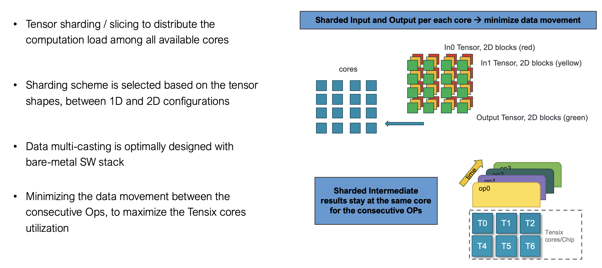
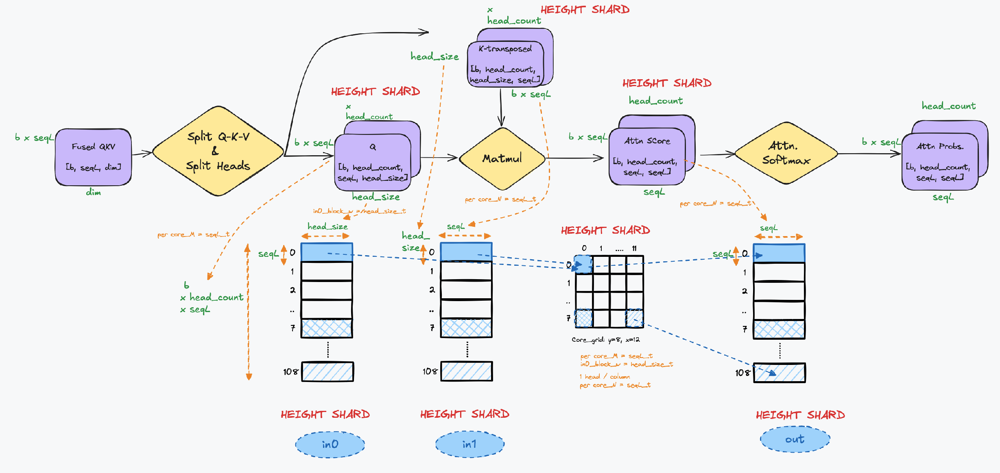

# ViT in TT-NN for Blackhole

Authors: Vishal Shenoy, Mohamed Bahnas (Original), Updated for Blackhole Architecture

## Contents
- [ViT in TT-NN for Blackhole](#vit-in-tt-nn-for-blackhole)
  - [Contents](#contents)
  - [1. Overview](#1-overview)
  - [2. Blackhole Architecture Differences](#2-blackhole-architecture-differences)
    - [2.1 Core Grid Configuration](#21-core-grid-configuration)
    - [2.2 Compute Kernel Configuration](#22-compute-kernel-configuration)
  - [3. ViT TT-NN Optimization Techniques](#3-vit-tt-nn-optimization-techniques)
    - [3.1 Sharding on all relevant OPs](#31-sharding-on-all-relevant-ops)
    - [3.2 Matmul sharding variants in ViT](#32-matmul-sharding-variants-in-vit)
    - [3.3 Transformer optimizations](#33-transformer-optimizations)
  - [4. ViT TT-NN Code Structure](#4-vit-tt-nn-code-structure)
    - [4.1 Top-level modules](#41-top-level-modules)
    - [4.2 Embeddings module](#42-embeddings-module)
    - [4.3 Encoder module](#43-encoder-module)
    - [4.4 Encoder One Layer module](#44-encoder-one-layer-module)
  - [5. ViT Encoder Layer TT-NN Deep Dive for Blackhole](#5-vit-encoder-layer-tt-nn-deep-dive-for-blackhole)
    - [5.1 Input](#51-input)
    - [5.2 Sharding parametrization](#52-sharding-parametrization)
    - [5.3 Layer Normalization (Layernorm)](#53-layer-normalization-layernorm)
    - [5.4 Multi-Head Self-Attention](#54-multi-head-self-attention)
    - [5.5 Add and Norm](#55-add-and-norm)
    - [5.6 Feed-Forward Network](#56-feed-forward-network)
    - [5.7 Output](#57-output)
  - [6. To be added soon - High Resolution and Temporal Sharding](#6-to-be-added-soon---high-resolution-and-temporal-sharding)
  - [7. Conclusion](#7-conclusion)
  - [8. References](#8-references)

## 1. Overview

The [Vision Transformer](https://arxiv.org/pdf/2010.11929) (ViT) is a transformer model that is utilized for vision processing tasks. This document describes the ViT architecture implementation specifically optimized for **Tenstorrent Blackhole (P150)** devices using the TT-NN library.

The ViT architecture in TT-NN leverages the self-attention mechanism, originally designed for NLP tasks, to process image data by treating each image as a sequence of patches. This walkthrough explains the key components of the ViT model and demonstrates how the Tenstorrent TT-NN library implements these components efficiently on Blackhole architecture.

For more details on the architecture, please refer to the [References](#8-references).

## 2. Blackhole Architecture Differences

### 2.1 Core Grid Configuration

Blackhole uses a **10×12 core grid** for ViT (120 cores total, batch size = 10).

**Blackhole Core Grid Configuration:**

```python
def update_model_config(config, batch_size):
    wh_core_grid_y = 10  # Blackhole has 10 rows available

    # In case of < 10 cores per batch, we need to do move in attention to remove defragmentation
    should_reallocate_in_attention = False
    if batch_size <= wh_core_grid_y:
        grid_y = batch_size
        grid_x = 12  # For Blackhole: can be 6, 4, or 3 for less latency
    else:
        grid_y = 10
        batch_per_y_core = batch_size // wh_core_grid_y
        batch_size = grid_y * batch_per_y_core
        grid_x = 12  # Use full x-dimension for Blackhole
        should_reallocate_in_attention = True
    
    core_grid = ttnn.CoreGrid(y=grid_y, x=grid_x)
    core_grid_10x12 = ttnn.CoreGrid(y=10, x=12)  # Fixed full grid for Blackhole
```

> **Note (Portable Alternative):** For cross-architecture compatibility, you can dynamically query the device's compute grid instead of hardcoding values:
> ```python
> compute_grid_size = device.compute_with_storage_grid_size()
> core_grid = ttnn.CoreGrid(y=compute_grid_size.y, x=compute_grid_size.x)
> ```
> This approach enables portability across different Tenstorrent architectures. The Blackhole ViT implementation uses hardcoded values (10×12) for maximum performance optimization on this specific architecture.

### 2.2 Compute Kernel Configuration

Blackhole uses `WormholeComputeKernelConfig` which provides additional optimization options:

```python
"ln_compute_config": ttnn.WormholeComputeKernelConfig(
    math_fidelity=ttnn.MathFidelity.HiFi2,  # Higher precision for LayerNorm
    math_approx_mode=True,                   # Use approximations where safe
    fp32_dest_acc_en=False,                  # BF16 destination accumulation
    packer_l1_acc=True,                      # L1 accumulation in packer (Blackhole feature)
)
```

## 3. ViT TT-NN Optimization Techniques

The implemented optimization techniques in TT-NN compared to the conventional flow are:

### 3.1 Sharding on all relevant OPs
  - Applying sharding techniques to harvest the optimum utilization of the computation OPs, by eliminating the need for data movement inter-tensix-cores between the consecutive OPs. 
  - For more details, please refer to the [related tech-report](https://github.com/tenstorrent/tt-metal/blob/main/tech_reports/tensor_layouts/tensor_layouts.md#42-sharding) 
  - Sharding Concepts
 
  - Illustrative example 
   

### 3.2 Matmul sharding variants in ViT

#### 3.2.1 Matmul Reuse (BMM)
The batch Matmul(BMM) Reuse case used in ViT model is in the Multi-head Self Attention module, where both inputs (in0 and in1) as well as the output are height sharded. There no multi-cast (mcast) technique applied on the inputs here. Each core will be responsible for the Matmul of single head of one image of the batch.

 

#### 3.2.2 Matmul Reuse Mcast (2D)
The Reuse Mcast case used in ViT model is the block sharded Matmul cases in QKV generation as well as the Feed-Forward Network.
  - The implemented config is Block sharded orientation is Row_Major, where the in0 outer dimension (M) is sharded along the y-axis of the core grid. On the inner dimension of in0, the sharded slices are mcasted along the x-direction of the core grid. The mcast process is done in turn from one core to all other cores in the row, so the whole inner dimension of in0 exists per each core during its Matmul operation.
  - Please note that the Row_Major term mentioned here is referring to the sharded blocks placement on the core grid. It's different than the Row_Major data layout that is compared to the Tile layout in the report [tensor_layouts](https://github.com/tenstorrent/tt-metal/blob/main/tech_reports/tensor_layouts/tensor_layouts.md)  
  - The in1 is interleaved (on L1 or DRAM) and its slices along the N (outer) dimension are mcasted along the cores in the same column, where each slide has the full inner dimension (K). This is aligned with the previously mentioned mcast of in0 slices.
  - Worth to mention that in some cases it may be better to implement the Column_Major (and mcast transposed = True) config, where the in0 M dimension is sharded along the x-axis of the core as shown in the figure. All the mcast techniques in the Column_Major will be transposed with respect to the Row_Major config mentioned in the previous paragraph.


**ROW_MAJOR vs COLUMN_MAJOR Selection Guide:**

| Scenario | Recommendation | Configuration |
|----------|----------------|---------------|
| M >> N (tall matrix) | ROW_MAJOR | `transpose_mcast=False` |
| N >> M (wide matrix) | COL_MAJOR | `transpose_mcast=True` |
| Grid Nx > Ny | ROW_MAJOR | `transpose_mcast=False` |
| Grid Ny > Nx | COL_MAJOR | `transpose_mcast=True` |

For Blackhole's 10×12 grid (y=10, x=12), **ROW_MAJOR** is typically optimal.

#### 3.2.3 Matmul Reuse Mcast (1D)
The other Reuse Mcast case (not used in ViT) is the height sharded on in0, while in1 is still interleaved, as shown in the figure.


### 3.3 Transformer optimizations
  - Merging Q,K,V Linear operations in one large OP for higher utilization of Tensix computation power.
  - Customized tensor manipulation operations that are highly optimized as Transformer-based OPs in TT-NN.
  - Pre-processing of model weights, to apply the data format conversion as well as merging and transposing to match the OP configuration.
  - Fusing GeLU OP with its preceding Linear OP

     
    

## 4. ViT TT-NN Code Structure

### 4.1 Top-level modules
ViT model has 3 main modules: Embeddings, Encoder (12 Layers), and Classification head.

```python
def vit(
    config,
    pixel_values,
    cls_token,
    position_embeddings,
    parameters,
):
    # Embeddings
    embeddings_output = vit_embeddings(config, pixel_values, cls_token, position_embeddings, parameters=parameters)

    # Encoder (12 layers)
    hidden_states = vit_encoder(
        config,
        embeddings_output,
        parameters=parameters.vit.encoder,
    )

    # Final LayerNorm
    output = ttnn.layer_norm(
        hidden_states,
        weight=parameters.vit.layernorm.weight,
        bias=parameters.vit.layernorm.bias,
        epsilon=config.layer_norm_eps,
        memory_config=ttnn.L1_BLOCK_SHARDED_MEMORY_CONFIG,
        program_config=config.program_configs["layernorm_before_program_config"],
    )

    # Reshard back to dynamic cores for precision
    block_sharded_config_variable_cores = ttnn.create_sharded_memory_config(
        output.padded_shape,
        core_grid=config.core_grid,  # dynamic: batch_size × 12 or 10×12
        strategy=ttnn.ShardStrategy.BLOCK,
        orientation=ttnn.ShardOrientation.ROW_MAJOR,
    )
    output = ttnn.reshard(output, block_sharded_config_variable_cores)

    # Classifier
    classifier_output = ttnn.linear(
        output,
        parameters.classifier.weight,
        bias=parameters.classifier.bias,
        memory_config=ttnn.L1_BLOCK_SHARDED_MEMORY_CONFIG,
        dtype=ttnn.bfloat8_b,
        program_config=config.program_configs["classifer_matmul_program_config"],
    )

    return classifier_output
```

### 4.2 Embeddings module
ViT Embeddings module includes: Patch + Position embeddings and Linear projection of flattened patches

```python
def vit_patch_embeddings(config, pixel_values, *, parameters, unittest_check=False):
    batch_size, img_h, img_w, img_c = pixel_values.shape  # permuted input NHWC
    patch_size = config.patch_size
    patch_count = img_h // patch_size  # 14
    patch_size_sq_trpl = int(patch_size * patch_size * 3)  # 768
    patch_count_all = int(patch_count * patch_count)  # 196
    stride_h = patch_size
    stride_w = 1

    # Folding the input image into folded patches of size (14x14) each
    folded_pixel_values = ttnn.fold(pixel_values, stride_h, stride_w)  # 1568, 1024
    ttnn.deallocate(pixel_values)
    folded_pixel_values = ttnn.to_memory_config(folded_pixel_values, memory_config=ttnn.L1_MEMORY_CONFIG)
    folded_pixel_values = ttnn.to_layout(folded_pixel_values, layout=ttnn.TILE_LAYOUT, dtype=ttnn.bfloat8_b)

    # linear projection of flattened patches
    patch_embedding_output = ttnn.linear(
        folded_pixel_values,
        parameters.projection.weight,
        bias=parameters.projection.bias,
        memory_config=ttnn.L1_MEMORY_CONFIG,
        dtype=ttnn.bfloat16,
        core_grid=config.core_grid,
    )
    patch_embedding_output = ttnn.to_layout(patch_embedding_output, layout=ttnn.ROW_MAJOR_LAYOUT)
    patch_embedding_output = ttnn.reshape(patch_embedding_output, (batch_size, patch_count_all, patch_size_sq_trpl))

    return patch_embedding_output


def vit_embeddings(
    config,
    pixel_values,
    cls_token,
    position_embeddings,
    *,
    parameters,
):
    parameters = parameters.vit.embeddings
    l1_memory_config = ttnn.L1_MEMORY_CONFIG
    
    # Patch embedding
    patch_embeddings = vit_patch_embeddings(config, pixel_values, parameters=parameters.patch_embeddings)
    # Concatenating Position Embeddings
    embedding_output = ttnn.concat([cls_token, patch_embeddings], -2, memory_config=l1_memory_config)
    embedding_output = ttnn.to_layout(embedding_output, layout=ttnn.TILE_LAYOUT)
    embedding_output = ttnn.add(
        embedding_output, position_embeddings, memory_config=ttnn.L1_MEMORY_CONFIG, dtype=ttnn.bfloat8_b
    )
    return embedding_output
```

### 4.3 Encoder module
ViT Encoder module includes: 12 layers of the Transformer encoder

```python
def vit_encoder(
    config,
    embeddings,
    parameters,
):
    TILE_HEIGHT = 32
    emb_N, emb_S, emb_D = embeddings.shape
    emb_S = (((emb_S - 1) // TILE_HEIGHT) + 1) * TILE_HEIGHT
    
    # Sharding config using Blackhole's 10x12 grid
    encoder_input = ttnn.to_memory_config(
        embeddings,
        memory_config=ttnn.create_sharded_memory_config(
            [emb_N, emb_S, emb_D],
            core_grid=config.core_grid_10x12,  # Use 10x12 for Blackhole
            strategy=ttnn.ShardStrategy.BLOCK,
            orientation=ttnn.ShardOrientation.ROW_MAJOR,
        ),
        dtype=ttnn.bfloat8_b,
    )
    ttnn.deallocate(embeddings)

    # For loop of 12 iterations on the encoder layer
    for index, encoder_parameters in enumerate(parameters.layer):
        encoder_output = vit_layer(
            config,
            encoder_input,
            encoder_parameters,
        )
        encoder_input = encoder_output

    return encoder_output
```

### 4.4 Encoder One Layer module
ViT Encoder layer includes the core transformer block with LayerNorm, Multi-Head Attention, and FFN:

```python
def vit_layer(
    config,
    hidden_states,
    parameters,
):
    layernorm_before_output = ttnn.layer_norm(
        hidden_states,
        weight=parameters.layernorm_before.weight,
        bias=parameters.layernorm_before.bias,
        memory_config=ttnn.L1_BLOCK_SHARDED_MEMORY_CONFIG,
        program_config=config.program_configs["layernorm_before_program_config"],
        compute_kernel_config=config.program_configs["ln_compute_config"],  # Blackhole-specific
    )

    multi_head_attention_output = vit_attention(
        config,
        layernorm_before_output,
        parameters=parameters.attention,
    )

    multi_head_attention_output = ttnn.add(
        multi_head_attention_output,
        hidden_states,
        memory_config=ttnn.L1_BLOCK_SHARDED_MEMORY_CONFIG,
        dtype=ttnn.bfloat8_b,
    )

    layernorm_after_output = ttnn.layer_norm(
        multi_head_attention_output,
        weight=parameters.layernorm_after.weight,
        bias=parameters.layernorm_after.bias,
        memory_config=ttnn.L1_BLOCK_SHARDED_MEMORY_CONFIG,
        program_config=config.program_configs["layernorm_after_output_program_config"],
        compute_kernel_config=config.program_configs["ln_compute_config"],  # Blackhole-specific
    )

    feedforward_output = vit_feedforward(
        config,
        layernorm_after_output,
        multi_head_attention_output,
        parameters=parameters,
    )

    return feedforward_output
```

## 5. ViT Encoder Layer TT-NN Deep Dive for Blackhole

This is a step-by-step walkthrough of the ViT encoder layer implementation in TT-NN on Blackhole. The diagram below summarizes all of these steps in a flow chart, which is examined in smaller pieces below.

This diagram is representing the TT-NN module `vit_layer()`


The graph legend:


### 5.1 Input 
The input to the Vision Transformer consists of image patches that are flattened and embedded into a higher-dimensional space. The input is represented as:

`b × seqL × dim`

Where:
- `b` is the batch size (typically 10 for Blackhole)
- `seqL` is the sequence length (224 padded, corresponding to 196 patches + 1 CLS token)
- `dim` is the embedding dimension (768)

### 5.2 Sharding parametrization 
The input and output of each OP is either sharded or interleaved, and there is a sharding config for each OP. Optimally, the consecutive OPs will have the same sharding scheme, so the intermediate results are stored in the local Tensix L1 to minimize the data movement between OPs.

**Blackhole sharding parameters (10×12 grid):**

```python
core_grid = ttnn.CoreGrid(y=batch_size, x=12)
core_grid_10x12 = ttnn.CoreGrid(y=10, x=12)  # Fixed full grid for Blackhole

TILE_HEIGHT = 32
seqL_t = 224 // 32  # 7  - sequence length in tiles
dim_t = 768 // 32   # 24 - inner dimension in tiles
dim_t__x = dim_t // core_grid.x              # 24/12 = 2 tiles per core
dim_t__x_full_grid = dim_t // core_grid_10x12.x  # 24/12 = 2 tiles
head_num = 12  # Encoder head count
head_seqL_t__x = (head_num * seqL_t) // core_grid.x  # (12*7)/12 = 7
head_size_t = dim_t // head_num  # 24/12 = 2 tiles (head size)
class__x = (1152 // 32) // core_grid.x  # (1152/32)/12 = 3 tiles (classification)
```

### 5.3 Layer Normalization (Layernorm)
After embedding the patches, Layer Normalization is applied to the input sequence. This ensures that the input embeddings are normalized before the attention mechanism, which improves the training stability of the model. The **block sharding** in the diagram illustrates how data is partitioned and distributed across multiple processing cores for parallel computation, enhancing efficiency during training.

**Blackhole-Optimized Code**:

```python
def vit_layernorm_before(config, hidden_states, *, parameters):
    attention_output = ttnn.layer_norm(
        hidden_states,
        weight=parameters.layernorm_before.weight,
        bias=parameters.layernorm_before.bias,
        epsilon=config.layer_norm_eps,
        memory_config=ttnn.L1_BLOCK_SHARDED_MEMORY_CONFIG,
        program_config=config.program_configs["layernorm_before_program_config"],
        compute_kernel_config=config.program_configs["ln_compute_config"],  # Blackhole
    )
    return attention_output
```

**Sharding Config for Blackhole (10×12 grid)**:

- With 2D Block sharding, the block or shard size per each tensix core = [seqL, dim/core_grid.x].
- The block height = input or output shape[0] / core_grid.y = b × seqL / core_grid.y, so each tensix row will have b=1 of height = seqL
- The block width = input or output shape[1] / core_grid.x = dim / core_grid.x

```python
"layernorm_before_program_config": ttnn.LayerNormShardedMultiCoreProgramConfig(
    compute_with_storage_grid_size=(core_grid_10x12.x, core_grid_10x12.y),  # (12, 10)
    subblock_w=dim_t__x_full_grid,  # 2 tiles for 10x12 grid
    block_h=seqL_t,  # 7
    block_w=dim_t__x_full_grid,  # 2 tiles for 10x12 grid
    inplace=False,
)
```


### 5.4 Multi-Head Self-Attention
The self-attention mechanism is implemented in the `vit_attention` function. Here, the Query, Key, and Value matrices are created by applying linear transformations to the input embeddings. After computing the attention scores (dot product of Q and K), the scores are normalized using a Softmax function. The resulting attention probabilities are multiplied by the Value matrix to produce the attention output.

**Functional Code**:

```python
query, key, value = ttnn.transformer.split_query_key_value_and_split_heads(query_key_value, num_heads=num_heads)
attention_scores = ttnn.matmul(query, key)
attention_probs = ttnn.softmax_in_place(attention_scores)  # With scaling
context_layer = ttnn.matmul(attention_probs, value)
```

> **Note:** An alternative is `ttnn.transformer.attention_softmax_` which fuses scale + softmax into one kernel. However, the in-place version **requires an attention mask**. Since ViT does not use attention masks, we use separate scale + `softmax_in_place` operations.

#### 5.4.1 Q,K,V Generation using the Fused Linear OP
The encoder input is matrix-multiplied by the Q,K,V weights to generate the individual Query, Key, Value tensors. In the TT-NN implementation, the input is multiplied by the pre-fused weights to generate the merged 3 tensors that will be split in a following step. The fused linear operation objective is to maximize the utilization by increasing the workload that is computed simultaneously on the Tensix core grid.

**Blackhole-Optimized Code**:

```python
query_key_value = ttnn.linear(
    hidden_states,
    parameters.attention.query_key_value.weight,
    bias=parameters.attention.query_key_value.bias,
    memory_config=ttnn.L1_BLOCK_SHARDED_MEMORY_CONFIG,
    dtype=ttnn.bfloat8_b,
    program_config=config.program_configs["query_key_value_matmul_program_config"],
)

# Reshard to dynamic cores for attention computation
block_sharded_config_variable_cores = ttnn.create_sharded_memory_config(
    query_key_value.padded_shape,
    core_grid=config.core_grid,  # dynamic: batch_size × 12 or 10×12
    strategy=ttnn.ShardStrategy.BLOCK,
    orientation=ttnn.ShardOrientation.ROW_MAJOR,
)
query_key_value = ttnn.reshard(query_key_value, block_sharded_config_variable_cores)
```

**Sharding Config for Blackhole**:

- With 2D Block sharding, the block or shard size per each tensix core = [seqL, 3*dim/core_grid.x].
- The block height (per_core_M)= input or output shape[0] / core_grid.y = b × seqL / core_grid.y, so each tensix row will have b=1 of height = seqL
- The input block width (in0_block_w) = input shape[1] / core_grid.x = dim / core_grid.x
- The input block (dim/x) is multi-casted, in turn, from one tensix core to other cores in the same row. The block matmul inner dimension will be the full (dim)
- The output block width (per_core_N) = output shape[1] / core_grid.x = 3*dim / core_grid.x
  
```python
"query_key_value_matmul_program_config": ttnn.MatmulMultiCoreReuseMultiCastProgramConfig(
    compute_with_storage_grid_size=(core_grid_10x12.x, core_grid_10x12.y),  # (12, 10)
    in0_block_w=dim_t__x_full_grid,  # 2 for 10x12 grid
    out_subblock_h=1,
    out_subblock_w=dim_t__x_full_grid,  # 2 for 10x12 grid
    per_core_M=seqL_t,  # 7
    per_core_N=3 * dim_t__x_full_grid,  # 3*2=6 for 10x12 grid
    transpose_mcast=False,
    fused_activation=None,
)
```


#### 5.4.2 Splitting into Q-K-V
The input embeddings are then split into **Query** (Q), **Key** (K), and **Value** (V) matrices. This is done by projecting the input embeddings into three separate matrices. Each matrix has a size of:

`b × head_count × seqL × head_size`

where 
- `b` is the batch size (10 for Blackhole)
- `head_count` is the number of attention heads (12)
- `seqL` is the sequence length (224 padded)
- `head_size` is the size of each split head (64)

Additionally, height sharding is applied by splitting the sequence length (`seqL`) across multiple processing cores. This allows the matrix operations to be parallelized, with each core handling a block of the sequence length.

**Optimized Code**:

```python
(
    query,
    key,
    value,
) = ttnn.transformer.split_query_key_value_and_split_heads(
    query_key_value,
    memory_config=ttnn.L1_HEIGHT_SHARDED_MEMORY_CONFIG,
    num_heads=num_heads,
)
ttnn.deallocate(query_key_value)
ttnn.deallocate(hidden_states)
if config.should_reallocate_in_attention:
    value = ttnn.reallocate(value)  # Defragmentation for batch > 10
```

**QKV Diagram**:


#### 5.4.3 Attention Mechanism
The attention mechanism begins by calculating the dot product between the Query and Key matrices. This result is then scaled by the size of the attention head to form the Attention Scores. These scores are passed through a Softmax operation, which normalizes them across the sequence length. **Height sharding** is applied during this process, where the sequence length is split across cores to parallelize the computation of the Attention Scores, making the operation more efficient.

**Optimized Code**:

```python
attention_scores = ttnn.matmul(
    query,
    key, 
    memory_config=ttnn.L1_HEIGHT_SHARDED_MEMORY_CONFIG, 
    dtype=ttnn.bfloat8_b, 
    program_config=config.program_configs["query_by_key_matmul_program_config"],
)
ttnn.deallocate(query)
ttnn.deallocate(key)

scale = 1.0 / (head_size**0.5)
attention_scores = ttnn.mul_(attention_scores, scale)

attention_probs = ttnn.softmax_in_place(
    attention_scores,
    program_config=config.program_configs["softmax_program_config"],
)
```

> **Note:** An alternative is `ttnn.transformer.attention_softmax_` which fuses scale + softmax into one kernel. However, the in-place version (`attention_softmax_`) **requires an attention mask**. Since ViT does not use attention masks, we use separate `mul_` + `softmax_in_place` operations. For models with attention masks (e.g., causal LLMs), `attention_softmax_` is preferred.

**Sharding Config**:

- With 1D Height sharding, the block or shard size per each tensix core = [seqL, seqL].
- The block height (per_core_M)= input or output shape[0] / (core_grid.y × core_grid.x) = (b × head_count × seqL) /(core_grid.y × core_grid.x), so each tensix row will be of height = seqL
- The input (in0) block width (in0_block_w) = head_size
- The in1 block width = per_core_N = seqL
- The in1 block_height = head_size
- The output block width (per_core_N) = seqL

```python
"query_by_key_matmul_program_config": ttnn.MatmulMultiCoreReuseProgramConfig(
    compute_with_storage_grid_size=(core_grid.x, core_grid.y),
    in0_block_w=head_size_t,  # 2
    out_subblock_h=1,
    out_subblock_w=seqL_t,  # 7
    per_core_M=head_seqL_t__x,  # 7 for 10x12 grid
    per_core_N=seqL_t,  # 7
),
"softmax_program_config": ttnn.SoftmaxShardedMultiCoreProgramConfig(
    compute_with_storage_grid_size=(core_grid.x, core_grid.y),
    subblock_w=seqL_t,  # 7
    block_h=head_seqL_t__x,  # 7 for 10x12 grid
    block_w=seqL_t,  # 7
),
```

**Matmul Sharding (Reuse / BMM) Diagram**:



#### 5.4.4 Matmul with Value
The normalized attention scores are then multiplied by the Value matrix to produce the attention output. This is the core of the self-attention mechanism, allowing the model to focus on different parts of the input sequence. **Height sharding** is used.

**Optimized Code**:

```python
context_layer = ttnn.matmul(
    attention_probs, 
    value, 
    memory_config=ttnn.L1_HEIGHT_SHARDED_MEMORY_CONFIG, 
    dtype=ttnn.bfloat8_b, 
    program_config=config.program_configs["attention_probabilities_by_value_matmul_program_config"],
)
ttnn.deallocate(attention_probs)
ttnn.deallocate(value)
```

**Sharding Config**:

- With 1D Height sharding, the block or shard size per each tensix core = [seqL, head_size].
- The block height (per_core_M)= input or output shape[0] / (core_grid.y × core_grid.x) = (b × head_count × seqL) /(core_grid.y × core_grid.x), so each tensix row will be of height = seqL
- The input (in0) block width (in0_block_w) = seqL
- The in1 block width = per_core_N = head_size
- The in1 block_height = seqL
- The output block width (per_core_N) = head_size

```python
"attention_probabilities_by_value_matmul_program_config": ttnn.MatmulMultiCoreReuseProgramConfig(
    compute_with_storage_grid_size=(core_grid.x, core_grid.y),
    in0_block_w=seqL_t,  # 7
    out_subblock_h=1,
    out_subblock_w=head_size_t,  # 2
    per_core_M=head_seqL_t__x,  # 7 for 10x12 grid
    per_core_N=head_size_t,  # 2
)
```

**Matmul Sharding (Reuse / BMM) Diagram**:


#### 5.4.5 Concatenating Heads and Self-Output Linear OP
The outputs from all attention heads are concatenated back together. This creates a unified representation of the attention across all heads:

` seqL × head_count × head_size` 

This step aggregates the outputs from the different heads into a single vector representation for each position in the sequence. The following step is the Linear OP to calculate the self output, which is the output of the self multi-head attention module.

**Optimized Code**:

```python
context_layer = ttnn.transformer.concatenate_heads(
    context_layer,
    memory_config=ttnn.L1_BLOCK_SHARDED_MEMORY_CONFIG,
)

# Reshard to 120 cores (10x12) for Blackhole
block_sharded_config_120_cores = ttnn.create_sharded_memory_config(
    context_layer.padded_shape,
    core_grid=config.core_grid_10x12,  # 120 cores
    strategy=ttnn.ShardStrategy.BLOCK,
    orientation=ttnn.ShardOrientation.ROW_MAJOR,
)
context_layer = ttnn.to_memory_config(context_layer, block_sharded_config_120_cores)

self_output = ttnn.linear(
    context_layer,
    parameters.output.dense.weight,
    bias=parameters.output.dense.bias,
    memory_config=ttnn.L1_BLOCK_SHARDED_MEMORY_CONFIG,
    dtype=ttnn.bfloat8_b,
    program_config=config.program_configs["self_output_matmul_program_config"],
)
ttnn.deallocate(context_layer)
if config.should_reallocate_in_attention:
    self_output = ttnn.reallocate(self_output)
```

**Sharding Config**:

- With 2D Block sharding, the block or shard size per each tensix core = [seqL, dim/core_grid.x].
- The block height (per_core_M)= input or output shape[0] / core_grid.y = b × seqL / core_grid.y, so each tensix row will have b=1 of height = seqL
- The input block width (in0_block_w) = input shape[1] / core_grid.x = dim / core_grid.x
- The input block (dim/x) is multi-casted, in turn, from one tensix core to other cores in the same row. The block matmul inner dimension will be the full (dim)
- The output block width (per_core_N) = output shape[1] / core_grid.x = dim / core_grid.x
- The in1_block_height is the same size of (dim)
- The in1_block_width = per_core_N, and each in1 block will be multi-casted along the same column of cores.

```python
"self_output_matmul_program_config": ttnn.MatmulMultiCoreReuseMultiCastProgramConfig(
    compute_with_storage_grid_size=(core_grid_10x12.x, core_grid_10x12.y),  # (12, 10)
    in0_block_w=dim_t__x_full_grid,  # 2 for 10x12 grid
    out_subblock_h=1,
    out_subblock_w=dim_t__x_full_grid,  # 2 for 10x12 grid
    per_core_M=seqL_t,  # 7
    per_core_N=dim_t__x_full_grid,  # 2 for 10x12 grid
    transpose_mcast=False,
    fused_activation=None,
)
```

**Self Attention Output diagram**:


### 5.5 Add and Norm
A residual connection (skip connection) is applied, adding the original input to the attention block back to the output of the attention block. This helps in maintaining gradient flow through the network and stabilizes training. The resulting tensor is then normalized again using layer normalization. Additionally, **block sharding** is used.

**Optimized Code**:

```python
multi_head_attention_output = ttnn.add(
    multi_head_attention_output,
    hidden_states,
    memory_config=ttnn.L1_BLOCK_SHARDED_MEMORY_CONFIG,
    dtype=ttnn.bfloat8_b,
)
layernorm_after_output = ttnn.layer_norm(
    multi_head_attention_output,
    weight=parameters.layernorm_after.weight,
    bias=parameters.layernorm_after.bias,
    memory_config=ttnn.L1_BLOCK_SHARDED_MEMORY_CONFIG,
    program_config=config.program_configs["layernorm_after_output_program_config"],
    compute_kernel_config=config.program_configs["ln_compute_config"],
)
```

**Sharding Config**:

```python
"layernorm_after_output_program_config": ttnn.LayerNormShardedMultiCoreProgramConfig(
    compute_with_storage_grid_size=(core_grid_10x12.x, core_grid_10x12.y),  # (12, 10)
    subblock_w=dim_t__x_full_grid,  # 2 tiles for 10x12 grid
    block_h=seqL_t,  # 7
    block_w=dim_t__x_full_grid,  # 2 tiles for 10x12 grid
    inplace=False,
)
```

**Add and Norm Diagram**:


### 5.6 Feed-Forward Network
The output from the attention block is passed through a **Feed-Forward Network** (FFN). The FFN consists of two linear transformations with a GeLU activation function between them. The first linear layer expands the dimensionality of the embeddings, and the second linear layer projects it back to the original size. **Block sharding** is utilized in the FFN, where the computations are split across multiple blocks, allowing for parallel processing and improved efficiency during the linear transformations.

**Optimized Code**:

```python
def vit_intermediate(
    config,
    hidden_states,
    *,
    parameters,
):
    output = ttnn.linear(
        hidden_states,
        parameters.dense.weight,
        bias=parameters.dense.bias,
        memory_config=ttnn.L1_BLOCK_SHARDED_MEMORY_CONFIG,
        dtype=ttnn.bfloat8_b,
        program_config=config.program_configs["ff1_matmul_program_config"],  # Fused GELU!
    )
    ttnn.deallocate(hidden_states)
    return output


def vit_output(
    config,
    hidden_states,
    residual,
    *,
    parameters,
):
    output = ttnn.linear(
        hidden_states,
        parameters.dense.weight,
        bias=parameters.dense.bias,
        memory_config=ttnn.L1_BLOCK_SHARDED_MEMORY_CONFIG,
        dtype=ttnn.bfloat8_b,
        program_config=config.program_configs["ff2_matmul_program_config"],
    )
    ttnn.deallocate(hidden_states)

    output = ttnn.add(output, residual, memory_config=ttnn.L1_BLOCK_SHARDED_MEMORY_CONFIG, dtype=ttnn.bfloat8_b)
    ttnn.deallocate(residual)
    return output


def vit_feedforward(
    config,
    hidden_states,
    attention_output,
    *,
    parameters,
):
    intermediate = vit_intermediate(config, hidden_states, parameters=parameters.intermediate)
    hidden_states = vit_output(config, intermediate, attention_output, parameters=parameters.output)
    return hidden_states
```

**Sharding Config**:

For FF1:
- With 2D Block sharding, the block or shard size per each tensix core = [seqL, 4*dim/core_grid.x].
- The block height (per_core_M)= input or output shape[0] / core_grid.y = b × seqL / core_grid.y, so each tensix row will have b=1 of height = seqL
- The input block width (in0_block_w) = input shape[1] / core_grid.x = dim / core_grid.x
- The output block width (per_core_N) = output shape[1] / core_grid.x = 4*dim / core_grid.x
- The in1_block_height is the same size of (dim)
- The in1_block_width = per_core_N, and each in1 block will be multi-casted along the same column of cores.

For FF2:
- With 2D Block sharding, the block or shard size per each tensix core = [seqL, dim/core_grid.x].
- The block height (per_core_M)= input or output shape[0] / core_grid.y = b × seqL / core_grid.y, so each tensix row will have b=1 of height = seqL
- The input block width (in0_block_w) = input shape[1] / core_grid.x = 4*dim / core_grid.x
- The output block width (per_core_N) = output shape[1] / core_grid.x = dim / core_grid.x
- The in1_block_height is the same size of (4*dim)
- The in1_block_width = per_core_N, and each in1 block will be multi-casted along the same column of cores.

```python
"ff1_matmul_program_config": ttnn.MatmulMultiCoreReuseMultiCastProgramConfig(
    compute_with_storage_grid_size=(core_grid_10x12.x, core_grid_10x12.y),  # (12, 10)
    in0_block_w=dim_t__x_full_grid,  # 2 tiles for 10x12 grid
    out_subblock_h=1,
    out_subblock_w=(dim_t__x_full_grid * 4) // 2,  # (2 * 4) // 2 = 4
    per_core_M=seqL_t,  # 7
    per_core_N=dim_t__x_full_grid * 4,  # 2 * 4 = 8
    transpose_mcast=False,
    fused_activation=(ttnn.UnaryOpType.GELU, True),  # Fused GELU!
),
"ff2_matmul_program_config": ttnn.MatmulMultiCoreReuseMultiCastProgramConfig(
    compute_with_storage_grid_size=(core_grid_10x12.x, core_grid_10x12.y),  # (12, 10)
    in0_block_w=dim_t__x_full_grid * 4,  # 2 * 4 = 8
    out_subblock_h=1,
    out_subblock_w=dim_t__x_full_grid,  # 2
    per_core_M=seqL_t,  # 7
    per_core_N=dim_t__x_full_grid,  # 2
    transpose_mcast=False,
    fused_activation=None,
),  
```

**FFN Diagram**:


### 5.7 Output
The final result after the feed-forward network and the second normalization step is the **Encoder Output**. This output has the following shape:

`b × seqL × dim`

The output can either be passed to the next layer in the Transformer encoder or to the classification head, depending on the specific task.

## 6. To be added soon - High Resolution and Temporal Sharding

## 7. Conclusion

This walkthrough provided an in-depth explanation of the Vision Transformer (ViT) encoder implementation optimized for the Tenstorrent Blackhole (P150) architecture. Key optimizations for Blackhole include:

1. **10×12 Core Grid**: Leveraging Blackhole's 120 Tensix cores for maximum parallelization
2. **WormholeComputeKernelConfig**: Using advanced compute kernel features like `packer_l1_acc`
3. **Dynamic Resharding**: Optimized tensor resharding between operations to maintain efficiency
4. **Fused Operations**: Fused QKV linear, fused GELU in FFN
5. **Memory Management**: Comprehensive L1 usage with explicit deallocations
6. **Defragmentation Handling**: Automatic reallocation when batch_size > 10

From patch embedding to self-attention and feed-forward networks, the ViT model effectively applies the principles of attention-based mechanisms to image processing with architecture-specific optimizations for Blackhole.

## 8. References
  - https://huggingface.co/docs/transformers/en/model_doc/vit
  - https://medium.com/@hansahettiarachchi/unveiling-vision-transformers-revolutionizing-computer-vision-beyond-convolution-c410110ef061
  - https://www.v7labs.com/blog/vision-transformer-guide
  - https://viso.ai/deep-learning/vision-transformer-vit/
  - ViT Blackhole Implementation: `models/demos/blackhole/vit/tt/ttnn_optimized_sharded_vit_bh.py`
  - Blackhole Bring-Up Guide: `tech_reports/Blackhole/BlackholeBringUpProgrammingGuide.md`

