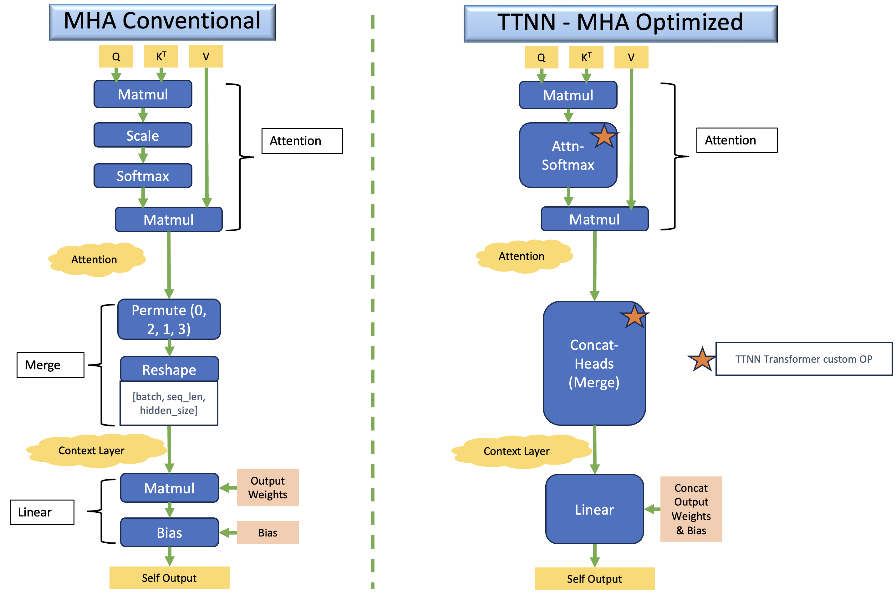

# ViT in TT-NN (Blackhole)
Authors: Vishal Shenoy, Mohamed Bahnas

## Contents
- [ViT in TT-NN (Blackhole)](#vit-in-tt-nn-blackhole)
  - [Contents](#contents)
  - [1. Overview](#1-overview)
  - [2. ViT TT-NN Optimization Techniques (Blackhole)](#2-vit-tt-nn-optimization-techniques-blackhole)
    - [2.1 Sharding on all relevant OPs](#21-sharding-on-all-relevant-ops)
    - [2.2 Matmul sharding variants in ViT](#22-matmul-sharding-variants-in-vit)
    - [2.3 Transformer optimizations](#23-transformer-optimizations)
  - [3. ViT TT-NN Code Structure (Blackhole)](#3-vit-tt-nn-code-structure-blackhole)
    - [3.1 Top-level modules](#31-top-level-modules)
    - [3.2 Embeddings module](#32-embeddings-module)
    - [3.3 Encoder module](#33-encoder-module)
    - [3.4 Encoder layer module (one layer)](#34-encoder-layer-module-one-layer)
  - [4. ViT Encoder Layer TT-NN Deep Dive (Blackhole)](#4-vit-encoder-layer-tt-nn-deep-dive-blackhole)
    - [4.1 Input](#41-input)
    - [4.2 Sharding parametrization](#42-sharding-parametrization)
    - [4.3 Layer Normalization (LayerNorm)](#43-layer-normalization-layernorm)
    - [4.4 Multi-Head Self-Attention](#44-multi-head-self-attention)
      - [4.4.1 Q,K,V Generation (Fused Linear)](#441-qkv-generation-fused-linear)
      - [4.4.2 Resharding and core-grid usage](#442-resharding-and-core-grid-usage)
      - [4.4.3 Split into Q/K/V + heads](#443-split-into-qkv--heads)
      - [4.4.4 Attention scores (Q×Kᵀ) + scale](#444-attention-scores-qk--scale)
      - [4.4.5 Softmax (in-place)](#445-softmax-in-place)
      - [4.4.6 Context (P×V)](#446-context-pv)
      - [4.4.7 Concatenate heads + Self-output Linear](#447-concatenate-heads--self-output-linear)
      - [4.4.8 Reallocate/defragmentation notes](#448-reallocatedefragmentation-notes)
    - [4.5 Add and Norm](#45-add-and-norm)
    - [4.6 Feed-Forward Network (FFN/MLP)](#46-feed-forward-network-ffnmlp)
    - [4.7 Output](#47-output)
  - [5. To be added soon - High Resolution and Temporal Sharding](#5-to-be-added-soon---high-resolution-and-temporal-sharding)
  - [6. Conclusion](#6-conclusion)
  - [7. References](#7-references)

## 1. Overview

The [Vision Transformer](https://arxiv.org/pdf/2010.11929) (ViT) is a transformer model that is utilized for vision processing tasks. The ViT architecture in TT-NN leverages the self-attention mechanism, originally designed for NLP tasks, to process image data by treating each image as a sequence of patches. This walkthrough explains the key components of the ViT model and demonstrates how the Tenstorrent TT-NN library implements these components efficiently on Blackhole devices.
For more details on the architecture, please refer to the [References](#7-references).

## 2. ViT TT-NN Optimization Techniques (Blackhole)

The implemented optimization techniques in TT-NN compared to the conventional flow are:

### 2.1 Sharding on all relevant OPs
  - Applying sharding techniques to harvest the optimum utilization of the computation OPs, by eliminating the need for data movement inter-tensix-cores between the consecutive OPs.
  - For more details, please refer to the [related tech-report](https://github.com/tenstorrent/tt-metal/blob/main/tech_reports/tensor_layouts/tensor_layouts.md#42-sharding)
  - Sharding Concepts

  - Illustrative example


### 2.2 Matmul sharding variants in ViT

#### 2.2.1 Matmul Reuse (BMM)
The batch Matmul(BMM) Reuse case used in ViT model is in the Multi-head Self Attention module, where both inputs (in0 and in1) as well as the output are height sharded. There no multi-cast (mcast) technique applied on the inputs here. Each core will be responsible for the Matmul of single head of one image of the batch.


#### 2.2.2 Matmul Reuse Mcast (2D)
The Reuse Mcast case used in ViT model is the block sharded Matmul cases in QKV generation as well as the Feed-Forward Network.
  - The implemented config is Block sharded orientation is Row_Major, where the in0 outer dimension (M) is sharded along the y-axis of the core grid. On the inner dimension of in0, the sharded slices are mcasted along the x-direction of the core grid. The mcast process is done in turn from one core to all other cores in the row, so the whole inner dimension of in0 exists per each core during its Matmul operation.
  - Please note that the Row_Major term mentioned here is referring to the sharded blocks placement on the core grid. It's different than the Row_Major data layout that is compared to the Tile layout in the report [tensor_layouts](https://github.com/tenstorrent/tt-metal/blob/main/tech_reports/tensor_layouts/tensor_layouts.md)
  - The in1 is interleaved (on L1 or DRAM) and its slices along the N (outer) dimension are mcasted along the cores in the same column, where each slice has the full inner dimension (K). This is aligned with the previously mentioned mcast of in0 slices.
  - Worth to mention that in some cases it may be better to implement the Column_Major (and mcast transposed = True) config, where the in0 M dimension is sharded along the x-axis of the core as shown in the figure. All the mcast techniques in the Column_Major will be transposed with respect to the Row_Major config mentioned in the previous paragraph.


#### 2.2.3 Matmul Reuse Mcast (1D)
The other Reuse Mcast case (not used in ViT) is the height sharded on in0, while in1 is still interleaved, as shown in the figure.


### 2.3 Transformer optimizations
  - Merging Q,K,V Linear operations in one large OP for higher utilization of Tensix computation power.
  - Customized tensor manipulation operations that are highly optimized as Transformer-based OPs in TT-NN.
  - Pre-processing of model weights, to apply the data format conversion as well as merging and transposing to match the OP configuration.
  - Fusing GeLU OP with its preceding Linear OP

    
  

## 3. ViT TT-NN Code Structure (Blackhole)

This section outlines the code organization of the TT-NN Blackhole ViT implementation. The implementation is structured as a small set of functional modules (embeddings, encoder, encoder layer, attention, MLP) plus a configuration helper that defines the sharding/matmul program configs.

The reference implementation in this report is:
- `models/demos/blackhole/vit/tt/ttnn_optimized_sharded_vit_bh.py`

### 3.1 Top-level modules
ViT model has 3 main modules: Embeddings, Encoder (12 layers), and Classification head.

```python
def vit(
    config,
    pixel_values,
    cls_token,
    position_embeddings,
    parameters,
):
    embeddings_output = vit_embeddings(config, pixel_values, cls_token, position_embeddings, parameters=parameters)

    hidden_states = vit_encoder(
        config,
        embeddings_output,
        parameters=parameters.vit.encoder,
    )

    # Final LayerNorm
    output = ttnn.layer_norm(
        hidden_states,
        weight=parameters.vit.layernorm.weight,
        bias=parameters.vit.layernorm.bias,
        epsilon=config.layer_norm_eps,
        memory_config=ttnn.L1_BLOCK_SHARDED_MEMORY_CONFIG,
        program_config=config.program_configs["layernorm_before_program_config"],
    )

    # Classifier
    classifier_output = ttnn.linear(
        output,
        parameters.classifier.weight,
        bias=parameters.classifier.bias,
        memory_config=ttnn.L1_BLOCK_SHARDED_MEMORY_CONFIG,
        dtype=ttnn.bfloat8_b,
        program_config=config.program_configs["classifer_matmul_program_config"],
    )
    return classifier_output
```

> Note: the final LayerNorm output is resharded to a batch-dependent (variable) core grid before the classifier in the current Blackhole demo. This is described in the Deep Dive section.

### 3.2 Embeddings module
ViT embeddings include patch embeddings + position embeddings + CLS token concat.

Patch embeddings are computed by folding the input image into patches and applying a linear projection.

```python
def vit_patch_embeddings(config, pixel_values, *, parameters, unittest_check=False):
    batch_size, img_h, img_w, img_c = pixel_values.shape  # permuted input NHWC
    patch_size = config.patch_size
    patch_count = img_h // patch_size  # 14
    patch_size_sq_trpl = int(patch_size * patch_size * 3)  # 768
    patch_count_all = int(patch_count * patch_count)  # 196
    stride_h = patch_size
    stride_w = 1

    folded_pixel_values = ttnn.fold(pixel_values, stride_h, stride_w)
    ttnn.deallocate(pixel_values)
    folded_pixel_values = ttnn.to_memory_config(folded_pixel_values, memory_config=ttnn.L1_MEMORY_CONFIG)
    folded_pixel_values = ttnn.to_layout(folded_pixel_values, layout=ttnn.TILE_LAYOUT, dtype=ttnn.bfloat8_b)

    patch_embedding_output = ttnn.linear(
        folded_pixel_values,
        parameters.projection.weight,
        bias=parameters.projection.bias,
        memory_config=ttnn.L1_MEMORY_CONFIG,
        dtype=ttnn.bfloat16,
        core_grid=config.core_grid,
    )

    patch_embedding_output = ttnn.to_layout(patch_embedding_output, layout=ttnn.ROW_MAJOR_LAYOUT)
    patch_embedding_output = ttnn.reshape(patch_embedding_output, (batch_size, patch_count_all, patch_size_sq_trpl))
    return patch_embedding_output
```

Embedding output is then assembled with CLS token + position embeddings:

```python
def vit_embeddings(
    config,
    pixel_values,
    cls_token,
    position_embeddings,
    *,
    parameters,
):
    parameters = parameters.vit.embeddings
    l1_memory_config = ttnn.L1_MEMORY_CONFIG

    patch_embeddings = vit_patch_embeddings(config, pixel_values, parameters=parameters.patch_embeddings)
    embedding_output = ttnn.concat([cls_token, patch_embeddings], -2, memory_config=l1_memory_config)
    embedding_output = ttnn.to_layout(embedding_output, layout=ttnn.TILE_LAYOUT)
    embedding_output = ttnn.add(
        embedding_output, position_embeddings, memory_config=ttnn.L1_MEMORY_CONFIG, dtype=ttnn.bfloat8_b
    )
    return embedding_output
```

### 3.3 Encoder module
The encoder is a 12-layer Transformer encoder. The Blackhole implementation first reshapes/pads the token dimension to a tile multiple and converts embeddings to a block-sharded tensor on a fixed 10×12 core grid.

```python
def vit_encoder(
    config,
    embeddings,
    parameters,
):
    TILE_HEIGHT = 32
    emb_N, emb_S, emb_D = embeddings.shape
    emb_S = (((emb_S - 1) // TILE_HEIGHT) + 1) * TILE_HEIGHT
    encoder_input = ttnn.to_memory_config(
        embeddings,
        memory_config=ttnn.create_sharded_memory_config(
            [emb_N, emb_S, emb_D],
            core_grid=config.core_grid_10x12,
            strategy=ttnn.ShardStrategy.BLOCK,
            orientation=ttnn.ShardOrientation.ROW_MAJOR,
        ),
        dtype=ttnn.bfloat8_b,
    )
    ttnn.deallocate(embeddings)

    for index, encoder_parameters in enumerate(parameters.layer):
        encoder_output = vit_layer(
            config,
            encoder_input,
            encoder_parameters,
        )
        encoder_input = encoder_output

    return encoder_output
```

### 3.4 Encoder layer module (one layer)
The encoder layer follows the standard Transformer block: LayerNorm → MHA → residual add → LayerNorm → MLP/FFN.

```python
def vit_layer(
    config,
    hidden_states,
    parameters,
):
    layernorm_before_output = ttnn.layer_norm(
        hidden_states,
        weight=parameters.layernorm_before.weight,
        bias=parameters.layernorm_before.bias,
        memory_config=ttnn.L1_BLOCK_SHARDED_MEMORY_CONFIG,
        program_config=config.program_configs["layernorm_before_program_config"],
        compute_kernel_config=config.program_configs["ln_compute_config"],
    )

    multi_head_attention_output = vit_attention(
        config,
        layernorm_before_output,
        parameters=parameters.attention,
    )

    multi_head_attention_output = ttnn.add(
        multi_head_attention_output,
        hidden_states,
        memory_config=ttnn.L1_BLOCK_SHARDED_MEMORY_CONFIG,
        dtype=ttnn.bfloat8_b,
    )

    layernorm_after_output = ttnn.layer_norm(
        multi_head_attention_output,
        weight=parameters.layernorm_after.weight,
        bias=parameters.layernorm_after.bias,
        memory_config=ttnn.L1_BLOCK_SHARDED_MEMORY_CONFIG,
        program_config=config.program_configs["layernorm_after_output_program_config"],
        compute_kernel_config=config.program_configs["ln_compute_config"],
    )

    feedforward_output = vit_feedforward(
        config,
        layernorm_after_output,
        multi_head_attention_output,
        parameters=parameters,
    )

    return feedforward_output
```

The Multi-Head Self-Attention implementation (`vit_attention`) is described in depth in Section 4.4 since it is where most of the Blackhole-specific sharding transitions occur (resharding between core grids, explicit scaling, and in-place softmax).

## 4. ViT Encoder Layer TT-NN Deep Dive (Blackhole)

> Draft placeholder: This section will be a step-by-step walkthrough of the Blackhole ViT encoder layer implementation in TT-NN. It will cover the sharding strategy, matmul program configs, and the attention flow (including resharding, explicit scaling, in-place softmax, and any required reallocations).

### 4.1 Input
> Draft placeholder

### 4.2 Sharding parametrization
> Draft placeholder

### 4.3 Layer Normalization (LayerNorm)
> Draft placeholder

### 4.4 Multi-Head Self-Attention
> Draft placeholder

#### 4.4.1 Q,K,V Generation (Fused Linear)
> Draft placeholder

#### 4.4.2 Resharding and core-grid usage
> Draft placeholder

#### 4.4.3 Split into Q/K/V + heads
> Draft placeholder

#### 4.4.4 Attention scores (Q×Kᵀ) + scale
> Draft placeholder

#### 4.4.5 Softmax (in-place)
> Draft placeholder

#### 4.4.6 Context (P×V)
> Draft placeholder

#### 4.4.7 Concatenate heads + Self-output Linear
> Draft placeholder

#### 4.4.8 Reallocate/defragmentation notes
> Draft placeholder

### 4.5 Add and Norm
> Draft placeholder

### 4.6 Feed-Forward Network (FFN/MLP)
> Draft placeholder

### 4.7 Output
> Draft placeholder

## 5. To be added soon - High Resolution and Temporal Sharding

## 6. Conclusion

> Draft placeholder: Summarize Blackhole-specific aspects (grid strategy, reshard/reallocate, BFLOAT8_B usage) and point to next optimizations.

## 7. References

- ViT paper: https://arxiv.org/pdf/2010.11929
- HuggingFace ViT docs: https://huggingface.co/docs/transformers/en/model_doc/vit
- TT-NN sharding & layouts: https://github.com/tenstorrent/tt-metal/blob/main/tech_reports/tensor_layouts/tensor_layouts.md
- Blackhole bring-up notes (repo): `tech_reports/Blackhole/BlackholeBringUpProgrammingGuide.md`
- Allocator / memory banks (repo): `tech_reports/memory/allocator.md`
- Matrix engine / fidelity notes (repo): `tech_reports/matrix_engine/matrix_engine.md`
- GEMM FLOPS and BH grid reference (repo): `tech_reports/GEMM_FLOPS/GEMM_FLOPS.md`
