#  Effective Squeeze-Excitation Variety of View Network (ESE-VoVNet) model

## Contents

- [ESE-VoVNet](#effective-squeeze-excitation-variety-of-view-network-ese-vovnet-model)
    - [Contents](#contents)
        - [1. Overview](#1-overview)
        - [2. Optimisation techniques](#2optimisation-techniques)
            - [2.1 Sharding on all relevant OPs](#21-sharding-on-all-relevant-ops)
            - [2.2 Sharding techniques for convolution](#22-sharding-techniques-for-convolution)
        - [3. Vovnet submodules](#3-vovnet-submodules)
            - [3.1 ConvNormAct](#31-convnormact)
            - [3.2 SeperableConvNormAct](#32-seperableconvnormact)
            - [3.3 Osastage](#33-osastage)
            - [3.4 EffectiveSEmodule](#34-effectivesemodule)
            - [3.5 ClassifierHead](#35-classifierhead)
        - [4. Conclusion](#4-conclusion)

## 2. Overview
VoVNet is a convolutional neural network that seeks to make DenseNet more efficient by concatenating all features only once in the last feature map, which makes input size constant and enables enlarging new output channel.


To solve the inefficiency of DenseNet, VoVNet model is proposed with energy and computation-efficient architecture comprised of One-Shot Aggregation (OSA). The OSA not only adopts the strength of DenseNet that represents diversified features with multi-receptive fields but also overcomes the inefficiency of dense connection by aggregating all features only once in the last feature maps.
https://arxiv.org/abs/1904.09730

## 2.Optimisation techniques
### 2.1 Sharding on all relevant OPs
- Applying sharding techniques to harvest the optimum utilization of the computation OPs, by eliminating the need for data movement inter-tensix-cores between the consecutive OPs.
  - For more details, please refer to the [related tech-report](https://github.com/tenstorrent/tt-metal/blob/main/tech_reports/tensor_layouts/tensor_layouts.md#42-sharding)
  - Sharding Concepts

  - Illustrative example


#### Example:

#### Functional Code:
```py
        output_tensor = ttnn.sharded_to_interleaved(output_tensor, ttnn.L1_MEMORY_CONFIG)
        output_tensor_left = ttnn.sharded_to_interleaved(output_tensor_left, ttnn.L1_MEMORY_CONFIG)
        output_tensor = ttnn.concat([output_tensor, output_tensor_left], dim=3, memory_config=ttnn.L1_MEMORY_CONFIG)
```
#### Optimized Code:
```py
        output_tensor = ttnn.to_layout(output_tensor, layout=ttnn.ROW_MAJOR_LAYOUT)
        output_tensor_left = ttnn.to_layout(output_tensor_left, layout=ttnn.ROW_MAJOR_LAYOUT)
        output_sharded_memory_config = ttnn.create_sharded_memory_config(
            [512, 128],
            core_grid=output_tensor_left.memory_config().shard_spec.grid,
            strategy=ttnn.ShardStrategy.HEIGHT,
            use_height_and_width_as_shard_shape=True,
        )
        output_tensor = ttnn.concat(
            [output_tensor, output_tensor_left], dim=3, memory_config=output_sharded_memory_config
        )
```
### 2.2 Sharding techniques for convolution

Utilizing the appropriate sharding layout for convolution can enhance the core count of convolution and matrix multiplication operations, leading to improved overall performance. The recommended sharding strategies for convolution are as follows: use BLOCK_SHARDED when
𝐶
≈
𝑁
×
𝐻
×
𝑊
C≈N×H×W, HEIGHT_SHARDED when
𝑁
×
𝐻
×
𝑊
≫
𝐶
N×H×W≫C, and WIDTH_SHARDED when
𝐶
≫
𝑁
×
𝐻
×
𝑊
C≫N×H×W.

Consider 512x512 tensor, where each 512x512 input tensor will be divided into smaller 16x16 tiles across 4 cores. Lets see how different types of sharding looks,

#### Height sharding
```py
    conv_config = ttnn.Conv2dConfig(
            shard_layout=ttnn.TensorMemoryLayout.HEIGHT_SHARDED,
            )
```


#### Width sharding
```py
    conv_config = ttnn.Conv2dConfig(
            shard_layout=ttnn.TensorMemoryLayout.WIDTH_SHARDED,
            )
```

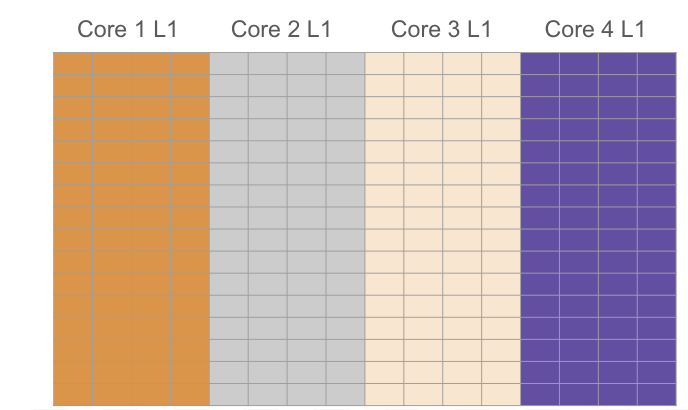

#### Block sharding
```py
    conv_config = ttnn.Conv2dConfig(
            shard_layout=ttnn.TensorMemoryLayout.BLOCK_SHARDED,

```
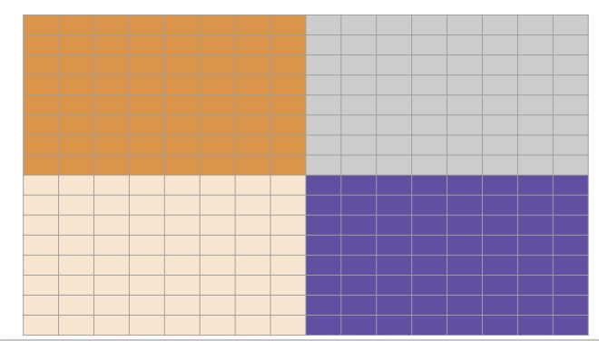

For instance, consider two input configurations: The First input is sized [1, 3, 224, 224], also with a kernel size of (3, 3), padding of (1, 1), and a stride of (2, 2). the second input has a size of [1, 736, 28, 28] (in NHWC format) with a kernel size of (1, 1), padding of (0, 0), and a stride of (1, 1).

According to the guidelines, the optimal sharding is to apply HEIGHT_SHARDED for the first input (since
𝑁
×
𝐻
×
𝑊
≫
𝐶
N×H×W≫C) and BLOCK_SHARDED for the second input (as
𝑁
×
𝐻
×
𝑊
≈
𝐶
N×H×W≈C).


## 3. Vovnet submodules:
Vovnet has the following modules,

1. ConvNormAct
2. SeparableConvNormAct
3. OsaStage
4. OsaBlock
5. SequentialAppendList
6. EffectiveSEModule
7. ClassifierHead

Vovnet has a sequential implementation of ConvNormAct and two SeparableConvNormAct followed by OsaStage submodule and ends with ClassifierHead.

This diagram is representing the TT-NN module `vovnet()`

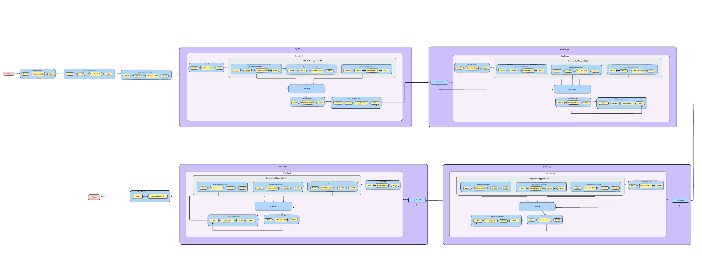

```py
def vovnet(
    device,
    x,
    torch_model,
    parameters,
    model,
    batch_size,
    layer_per_block=3,
    residual=False,
    depthwise=True,
    debug=False,
    bias=False,
):
    x1, x_h, x_w = conv_norm_act(
        device=device,
        x=x,
        torch_model=torch_model,
        path=f"stem.0",
        input_params=x.shape,
        conv_params=[2, 2, 1, 1],
        bias=bias,
        batch_size=batch_size,
        act_block_h=32,
        parameters=parameters["stem"][0].conv,
    )

    x2, x_h, x_w = seperable_conv_norm_act(
        device=device,
        x=x1,
        torch_model=torch_model,
        path=f"stem.1",
        conv_params1=[1, 1, 1, 1],
        conv_params2=[1, 1, 0, 0],
        debug=debug,
        groups=64,
        bias=bias,
        batch_size=batch_size,
        act_block_h=32,
        parameters=parameters["stem"][1],
    )

    x3, x_h, x_w = seperable_conv_norm_act(
        device=device,
        x=x2,
        torch_model=torch_model,
        path=f"stem.2",
        conv_params1=[2, 2, 1, 1],
        conv_params2=[1, 1, 0, 0],
        debug=debug,
        groups=64,
        bias=bias,
        batch_size=batch_size,
        parameters=parameters["stem"][2],
    )
    x = x3
    groups = [128, 160, 192, 224]
    for i in range(4):
        x = osa_stage(
            device=device,
            x=x,
            torch_model=torch_model,
            path=f"stages.{i}",
            model=model.stages[i],
            groups=groups[i],
            residual=residual,
            depthwise=depthwise,
            debug=debug,
            bias=bias,
            downsample=False if i == 0 else True,
            layer_per_block=layer_per_block,
            batch_size=batch_size,
            parameters=parameters["stages"][i],
        )

    x = classifier_head(
        device=device,
        x=x,
        torch_model=torch_model,
        path=f"head",
    )

    return x
```
Since the model has many convolution layers, a method for convolution2d is implemented,

```py
def conv(
    device,
    input_tensor,
    model,
    path,
    input_params,
    conv_params,
    *,
    act_block_h=None,
    reshard=False,
    deallocate=False,
    height_sharding=True,
    activation="",
    fused_op=False,
    use_shallow_conv_variant=False,
    fp32_accum=False,
    packer_l1_acc=True,
    enable_act_double_buffer=False,
    enable_split_reader=False,
    enable_subblock_padding=False,
    reallocate_halo_output=False,
    debug=False,
    groups=1,
    bias=False,
    conv=f"conv",
    math_approx=False,
    split_conv=False,
    parameters=None,
):
    if fused_op:
        weights, bias = fold_bn_to_conv_weights_bias(model, path, device, conv)
        bias = bias.reshape(1, 1, 1, -1)
        weights = ttnn.from_torch(weights, dtype=ttnn.float32)
        bias = ttnn.from_torch(bias, dtype=ttnn.float32)
    else:
        weight = model[path + ".weight"]
        weights = ttnn.from_torch(weight, dtype=ttnn.float32)
        if bias:
            bias = model[path + ".bias"]
            bias = bias.reshape(1, 1, 1, -1)
            bias = ttnn.from_torch(bias, dtype=ttnn.float32)

    if not split_conv:
        kernel_size = (weights.shape[2], weights.shape[3])
        out_channels = weights.shape[0]
        reader_patterns_cache = {}
        conv_config = ttnn.Conv2dConfig(
            dtype=parameters["dtype"],
            weights_dtype=parameters["weights_dtype"],
            math_fidelity=parameters["math_fidelity"],
            activation=activation,
            shard_layout=(
                ttnn.TensorMemoryLayout.HEIGHT_SHARDED
                if parameters["use_1d_systolic_array"]
                else ttnn.TensorMemoryLayout.BLOCK_SHARDED
            ),
            deallocate_activation=deallocate,
        )

        if act_block_h is not None:
            conv_config.act_block_h_override = act_block_h

        [output_tensor, _out_height, _out_width, weights, bias] = ttnn.conv2d(
            input_tensor=input_tensor,
            weight_tensor=weights,
            in_channels=input_params[-1],
            out_channels=out_channels,
            device=device,
            bias_tensor=bias if bias else None,
            kernel_size=kernel_size,
            stride=(conv_params[0], conv_params[1]),
            padding=(conv_params[2], conv_params[-1]),
            batch_size=input_params[0],
            input_height=input_params[1],
            input_width=input_params[2],
            conv_config=conv_config,
            conv_op_cache=reader_patterns_cache,
            debug=debug,
            groups=groups,
        )

    else:
        split_factor = 4 if input_params[-1] == 1024 else 2
        input_channels = input_params[-1]
        split_input_channels = input_channels // split_factor
        torch_input_tensor_nhwc = ttnn.to_torch(input_tensor)
        torch_input_tensor_nchw = torch.permute(torch_input_tensor_nhwc, (0, 3, 1, 2))
        weights = ttnn.to_torch(weights)
        torch_bias_tensor = ttnn.to_torch(bias)
        split_input_tensors = torch.split(torch_input_tensor_nchw, split_input_channels, 1)
        split_weight_tensors = torch.split(weights, weights.shape[1] // split_factor, 1)
        split_conv_config = ttnn.Conv2dConfig(
            dtype=parameters["dtype"],
            weights_dtype=parameters["weights_dtype"],
            math_fidelity=parameters["math_fidelity"],
            activation=activation,
            shard_layout=(
                ttnn.TensorMemoryLayout.HEIGHT_SHARDED
                if parameters["use_1d_systolic_array"]
                else ttnn.TensorMemoryLayout.BLOCK_SHARDED
            ),
            input_channels_alignment=(
                16 if use_shallow_conv_variant or (input_params[-1] == 16 and input_params[1] == 115) else 32
            ),
            transpose_shards=True if deallocate else False,
            reshard_if_not_optimal=reshard,
            deallocate_activation=deallocate,
            fp32_dest_acc_enabled=fp32_accum,
            packer_l1_accum_enabled=packer_l1_acc,
            reallocate_halo_output=reallocate_halo_output,
            math_approx_mode_enabled=math_approx,
        )

        for i in range(split_factor):
            tt_weight_tensor = ttnn.from_torch(split_weight_tensors[i], dtype=ttnn.bfloat16)
            tt_bias_tensor = ttnn.from_torch(torch_bias_tensor, dtype=ttnn.bfloat16)

            torch_input_tensor = torch.permute(split_input_tensors[i], (0, 2, 3, 1))
            tt_input_tensor = ttnn.from_torch(torch_input_tensor, ttnn.bfloat16)

            [tt_output_tensor_on_device, _out_height, _out_width, weights_device, bias_device] = ttnn.conv2d(
                input_tensor=tt_input_tensor,
                weight_tensor=tt_weight_tensor,
                in_channels=split_input_channels,
                out_channels=weights.shape[0],
                device=device,
                bias_tensor=tt_bias_tensor,
                kernel_size=(weights.shape[2], weights.shape[3]),
                stride=(conv_params[0], conv_params[1]),
                padding=(conv_params[2], conv_params[-1]),
                batch_size=input_params[0],
                input_height=input_params[1],
                input_width=input_params[2],
                conv_config=split_conv_config,
                conv_op_cache={},
            )
            output_tensor = ttnn.from_device(tt_output_tensor_on_device)

    return output_tensor, _out_height, _out_width
```
## 3.1 ConvNormAct:

The ConvNormAct module consists of a convolution layer followed by a BatchNorm layer with ReLU activation.

This diagram is representing the TT-NN module `conv_norm_act()`
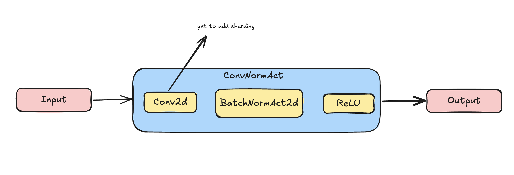

```py
def conv_norm_act(
    device,
    x,
    torch_model,
    path,
    input_params,
    conv_params,
    batch_size,
    groups=1,
    debug=False,
    bias=False,
    reshard=False,
    act_block_h=None,
    height_sharding=True,
    activation="relu",
    fused_op=True,
    reallocate_halo_output=False,
    deallocate=True,
    math_approx=True,
    split_conv=False,
    parameters=None,
):
    x, _x_h, _x_w = conv(
        device,
        x,
        torch_model,
        f"{path}",
        input_params,
        conv_params,
        act_block_h=act_block_h,
        reshard=reshard,
        deallocate=deallocate,
        height_sharding=height_sharding,
        activation=activation,
        fused_op=fused_op,
        debug=debug,
        bias=bias,
        reallocate_halo_output=reallocate_halo_output,
        math_approx=math_approx,
        groups=groups,
        split_conv=split_conv,
        parameters=parameters,
    )
    return x, _x_h, _x_w

```

## 3.2 SeperableConvNormAct
The SeperableConvNormAct module consists of Depthwise separable conv modules, a pointwise convolution layer followed by a Batchnorm with ReLU activation.

This diagram is representing the TT-NN module `SeperableConvNormAct()`
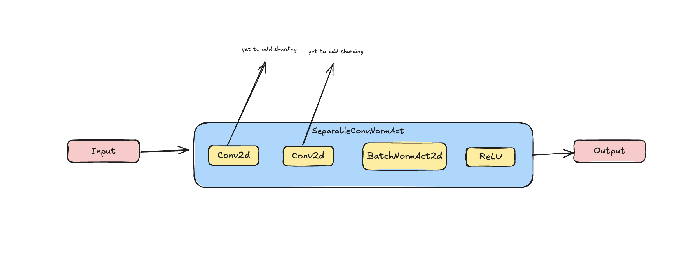

```py
def seperable_conv_norm_act(
    device,
    x,
    torch_model,
    path,
    conv_params1,
    conv_params2,
    groups,
    batch_size,
    debug=False,
    bias=False,
    reshard=False,
    act_block_h=None,
    height_sharding=True,
    activation="relu",
    fused_op=True,
    deallocate=True,
    parameters=None,
):
    x, _x_h, _x_w = conv(
        device,
        x,
        torch_model,
        f"{path}.conv_dw",
        [
            batch_size,
            parameters.conv_dw["input_height"],
            parameters.conv_dw["input_width"],
            parameters.conv_dw["in_channels"],
        ],
        conv_params1,
        act_block_h=act_block_h,
        reshard=reshard,
        deallocate=deallocate,
        height_sharding=height_sharding,
        debug=debug,
        groups=groups,
        bias=bias,
        parameters=parameters.conv_dw,
    )

    x, _x1_h, _x1_w = conv(
        device,
        x,
        torch_model,
        f"{path}",
        [
            batch_size,
            parameters.conv_pw["input_height"],
            parameters.conv_pw["input_width"],
            parameters.conv_pw["in_channels"],
        ],
        conv_params2,
        act_block_h=act_block_h,
        reshard=reshard,
        deallocate=deallocate,
        height_sharding=height_sharding,
        activation=activation,
        fused_op=fused_op,
        debug=debug,
        conv=f"conv_pw",
        bias=bias,
        groups=1,
        parameters=parameters.conv_pw,
    )

    return x, _x_h, _x_w
```
Optimising the conv by changing its math_fidelity to LoFi, decreased the usage of conv as shown below,

#### SeperableConvNormAct Convloution HiFi4:


#### SeperableConvNormAct Convloution LoFi:

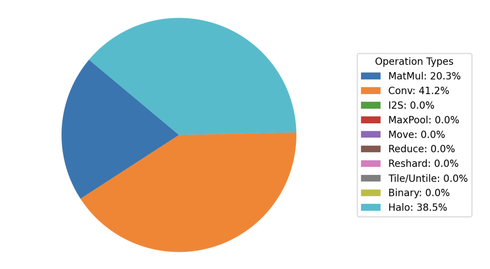

## 3.3 OSAStage

This diagram is representing the TT-NN module `OSAStage()`


```py
def osa_stage(
    device,
    x,
    torch_model,
    path,
    parameters,
    model,
    groups,
    batch_size,
    residual=True,
    depthwise=False,
    debug=False,
    bias=False,
    downsample=False,
    layer_per_block=3,
):
    if downsample:
        #  Output shape mis-matched when ttnn.MaxPool2d is used, as ceil_mode is true for torch.MaxPool2d in the model.
        pool = torch.nn.MaxPool2d(kernel_size=3, stride=2, ceil_mode=True)

        x_torch = ttnn.to_torch(x)
        x_torch = pool(x_torch)

        if path == "stages.3":
            x_torch = x_torch.permute(0, 2, 3, 1)
        x = ttnn.from_torch(x_torch, dtype=ttnn.bfloat16, device=device)
        x = ttnn.to_memory_config(x, ttnn.L1_MEMORY_CONFIG)
        if path != "stages.3":
            x = ttnn_permute(x, device, (0, 2, 3, 1))
        x = ttnn_reshape_rm(x, x.shape[1], x.shape[2], batch_size)
        x = ttnn.to_device(x, device)

    x = osa_block(
        device=device,
        x=x,
        torch_model=torch_model,
        path=f"{path}.blocks.0",
        parameters=parameters["blocks"][0],
        model=model.blocks[0],
        groups=groups,
        conv_norm_act_params=[1, 1, 0, 0],
        conv_params1=[1, 1, 1, 1],
        conv_params2=[1, 1, 0, 0],
        layers_per_block=layer_per_block,
        residual=residual,
        depthwise=depthwise,
        debug=debug,
        bias=bias,
        batch_size=batch_size,
        is_maxpool=downsample,
    )

    return x
```

Since OSAStage majorly consists of OSABlock, the sharding and datatype optimisation done in OSABlock, decreased the device kernel duration and usage of matmul, conv and interleaved to shard usage as shown below.

#### Osastage Convloution bfloat16:

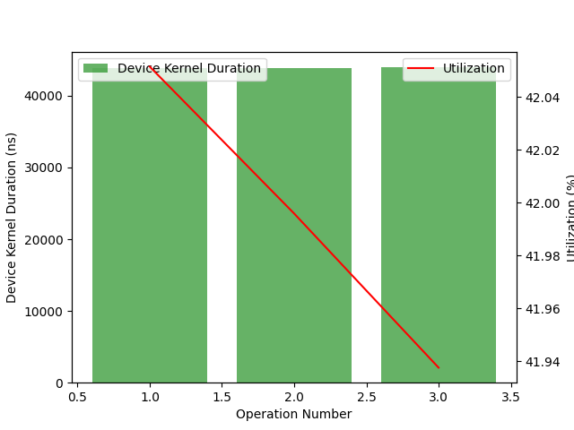

#### Osastage Convloution bfloat8:


## 3.4 OSABlock

This diagram is representing the TT-NN module `OSABlock()`

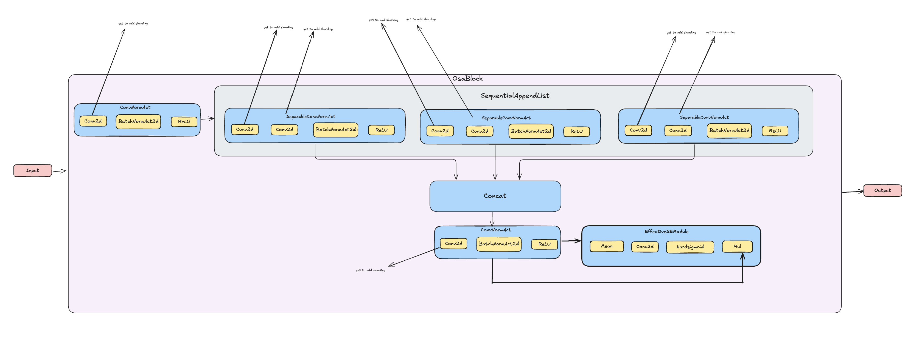

```py
def osa_block(
    device,
    x,
    torch_model,
    path,
    parameters,
    model,
    groups,
    conv_norm_act_params,
    conv_params1,
    conv_params2,
    batch_size,
    layers_per_block=3,
    residual=False,
    depthwise=True,
    debug=False,
    bias=False,
    is_maxpool=False,
):
    if is_maxpool:
        outputs = [x]
    else:
        conv = ttnn_reshape_rm(
            x,
            parameters["conv_reduction"].conv["input_height"],
            parameters["conv_reduction"].conv["input_width"],
            batch_size,
        )
        conv = ttnn.to_device(conv, device)
        outputs = [conv]

    if depthwise:
        assert not residual
        x1, x_h, x_w = conv_norm_act(
            device=device,
            x=x,
            torch_model=torch_model,
            path=f"{path}.conv_reduction",
            input_params=[
                batch_size,
                parameters["conv_reduction"].conv["input_height"],
                parameters["conv_reduction"].conv["input_width"],
                parameters["conv_reduction"].conv["in_channels"],
            ],
            conv_params=[1, 1, 0, 0],
            activation="relu",
            fused_op=True,
            batch_size=batch_size,
            parameters=parameters["conv_reduction"].conv,
        )

    x2, x_h, x_w = sequential_append_list(
        device=device,
        input_tensor=x1,
        torch_model=torch_model,
        path=f"{path}.conv_mid",
        concat_list=outputs,
        conv_params1=conv_params1,
        conv_params2=conv_params2,
        groups=groups,
        layers_per_block=layers_per_block,
        debug=False,
        bias=False,
        batch_size=batch_size,
        act_block_h=32,
        parameters=parameters["conv_mid"],
        is_maxpool=is_maxpool,
    )
    x = x2
    if path == "stages.3.blocks.0":
        x = ttnn.to_torch(x).permute(0, 3, 1, 2)
        x = torch_conv_norm_act(
            x=x.float(),
            in_channels=1440,
            out_channels=1024,
            parameters=model.conv_concat,
            running_mean=model.conv_concat.bn.running_mean,
            running_var=model.conv_concat.bn.running_var,
            kernel_size=1,
            stride=1,
            padding=0,
            channel_multiplier=1.0,
        )
        x = x.reshape(1, 1, x.shape[2] * x.shape[3], x.shape[1])
        x3 = ttnn.from_torch(x, dtype=ttnn.bfloat16, layout=ttnn.TILE_LAYOUT, device=device)

    else:
        x3, x_h, x_w = conv_norm_act(
            device=device,
            x=x,
            torch_model=torch_model,
            path=f"{path}.conv_concat",
            input_params=[
                batch_size,
                parameters["conv_concat"].conv["input_height"],
                parameters["conv_concat"].conv["input_width"],
                parameters["conv_concat"].conv["in_channels"],
            ],
            conv_params=[1, 1, 0, 0],
            activation="relu",
            fused_op=True,
            batch_size=batch_size,
            deallocate=False,
            reshard=False,
            split_conv=False,
            parameters=parameters["conv_concat"].conv,  # True if path == "stages.2.blocks.0" else False,
        )
    x = effective_se_module(
        device=device,
        torch_model=torch_model,
        path=f"{path}.attn",
        input_tensor=x3,
        conv_params=conv_norm_act_params,
        batch_size=batch_size,
        debug=debug,
        bias=True,
        split_conv=False,
        shape_parameters=parameters["conv_concat"].conv,
        parameters=parameters["attn"],
    )

    return x
```
The optimization techniques mentioned earlier improved the performance of the OSAblock sub-module, along with graphical visualizations.
In OSAblock submodule after utilizing the appropriate sharding layout for convolution, and optimising conv with bfloat8 datatype, we could see the device kernel duration reduces for convolution and matmul.

#### Osablock Convloution bfloat16:

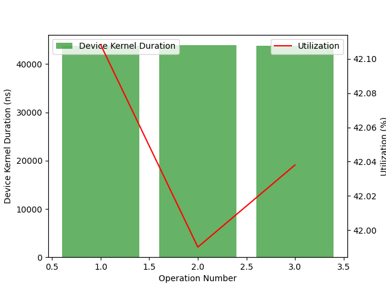

#### Osablock Convloution bfloat8:

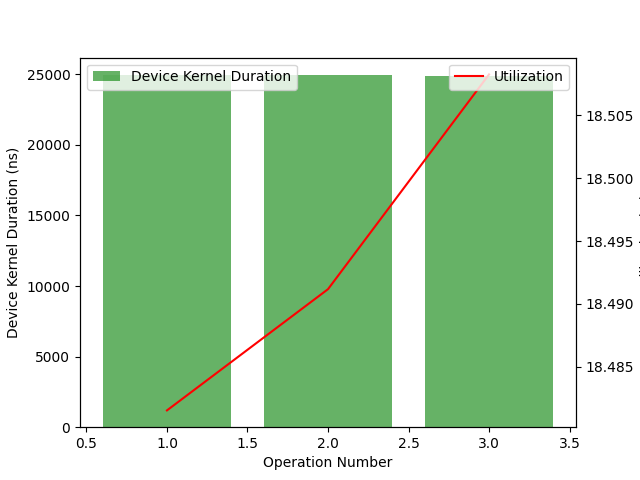


These optimisations also decreased the usage of conv from 41.2 to 30.2 and matmul from 24.4% to 19.1% as shown below

#### OSA block usage bfloat16
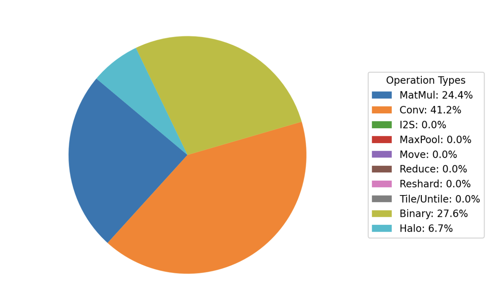

#### OSA block usage bfloat8


## 3.4 EffectiveSEModule
EffectiveSEModule (Squeeze-and-Excitation Networks), consists of a convolution layer and a hard sigmoid activation layer.

This diagram is representing the TT-NN module `EffectiveSEModule()`
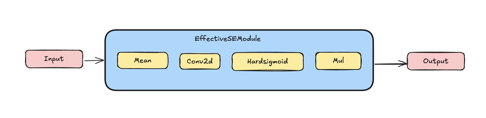

```py
def effective_se_module(
    device,
    torch_model,
    path,
    input_tensor,
    conv_params,
    batch_size,
    debug=False,
    fused_op=False,
    bias=False,
    split_conv=False,
    parameters=None,
    shape_parameters=None,
):
    torch_input_tensor = ttnn.to_torch(input_tensor)
    torch_input_tensor = torch_input_tensor.permute(0, 3, 1, 2)
    torch_input_tensor = torch_input_tensor.reshape(
        batch_size, shape_parameters["out_channels"], shape_parameters["input_height"], shape_parameters["input_width"]
    )
    x_se = torch_input_tensor.mean((2, 3), keepdim=True)
    x_se = torch.permute(x_se, (0, 2, 3, 1))
    x_se = x_se.reshape(
        x_se.shape[0],
        1,
        x_se.shape[1] * x_se.shape[2],
        x_se.shape[3],
    )
    x_se_permute = ttnn.from_torch(
        x_se,
        dtype=ttnn.bfloat16,
    )

    if x_se.shape[3] > 768:
        x_se, _x_se_h, _x_se_w = conv(
            device,
            x_se_permute,
            torch_model,
            f"{path}.fc",
            x_se_permute.shape,
            conv_params,
            fused_op=fused_op,
            deallocate=False,
            height_sharding=True,
            bias=bias,
            debug=debug,
            split_conv=False,
            parameters=parameters.fc,
        )
    else:
        x_se, _x_se_h, _x_se_w = conv(
            device,
            x_se_permute,
            torch_model,
            f"{path}.fc",
            x_se_permute.shape,
            conv_params,
            fused_op=fused_op,
            deallocate=False,
            height_sharding=True,
            bias=bias,
            debug=debug,
            split_conv=False,
            parameters=parameters.fc,
        )

    x_se_permute = ttnn_permute(x_se, device, (0, 3, 1, 2))
    input_tensor = ttnn_reshape_rm(
        input_tensor, shape_parameters["input_height"], shape_parameters["input_width"], batch_size
    )
    input_tensor = ttnn.to_layout(input_tensor, ttnn.TILE_LAYOUT)
    input_tensor = ttnn.to_device(input_tensor, device)
    x_se_permute = ttnn.to_device(x_se_permute, device)
    input_tensor = ttnn_permute(input_tensor, device, (0, 3, 1, 2))

    return input_tensor * ttnn.hardsigmoid(x_se_permute)
```

## 3.5 ClassifierHead
The ClassifierHead module consists of Global average pool followed by linear layer.

This diagram is representing the TT-NN module `ClassifierHead()`
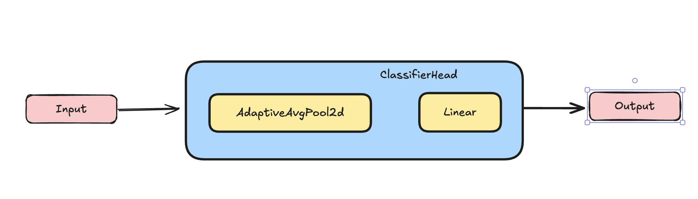

```py
def classifier_head(
    device,
    x,
    torch_model,
    path,
):
    x = ttnn.to_torch(x)
    pool = torch.nn.AdaptiveAvgPool2d((1, 1))
    x = pool(x)
    x = ttnn.from_torch(x, dtype=ttnn.bfloat16, layout=ttnn.TILE_LAYOUT, device=device)
    x = ttnn_permute(x, device, (0, 2, 3, 1))

    weights_tensor = torch_model[path + ".fc.weight"]
    bias_tensor = torch_model[path + ".fc.bias"]

    l1_weight = preprocess_linear_weight(weights_tensor, dtype=ttnn.bfloat16)
    l1_bias = preprocess_linear_bias(bias_tensor, dtype=ttnn.bfloat16)
    l1_weight = ttnn.to_device(l1_weight, device)
    l1_bias = ttnn.to_device(l1_bias, device)

    compute_kernel_config = ttnn.WormholeComputeKernelConfig(
        math_fidelity=ttnn.MathFidelity.LoFi,
        math_approx_mode=True,
        fp32_dest_acc_en=False,
        packer_l1_acc=False,
    )
    l1_weight = ttnn.to_memory_config(l1_weight, ttnn.L1_MEMORY_CONFIG)
    x = ttnn.linear(
        x,
        l1_weight,
        bias=l1_bias,
        dtype=ttnn.bfloat8_b,
        memory_config=ttnn.L1_MEMORY_CONFIG,
        compute_kernel_config=compute_kernel_config,
    )

    return x
```


### 4. Conclusion
This guide outlines the VOVNet model, its submodules and optimization techniques implemented in the VOVNet model.
