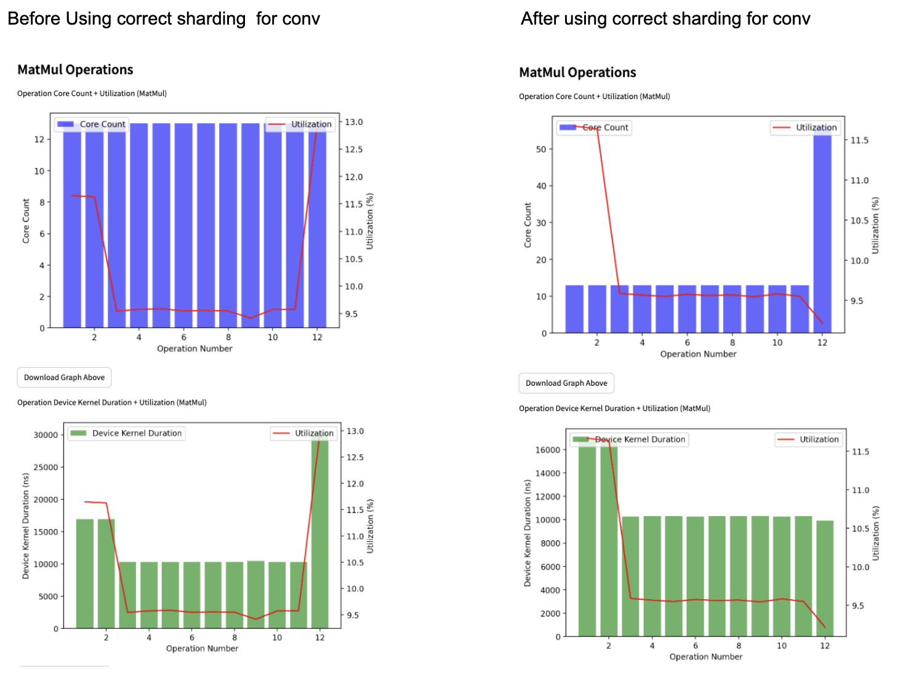

# YOLOv4 in TT-NN

**Authors**: Punith Sekar and Dalar Vartanians\
**Correspondence**: `dvartanians@tenstorrent.com`

## Contents

- [YOLOv4 in TT-NN](#YOLOv4-in-tt-nn)
  - [Contents](#contents)
  - [1. Overview](#1-overview)
  - [2. YOLOv4 TT-NN Optimization Techniques](#2-YOLOv4-tt-nn-optimization-techniques)
    - [2.1 Sharding on all relevant OPs](#21-sharding-on-all-relevant-ops)
    - [2.2 Deallocate Unused tensors](#22-deallocate-unused-tensors)
    - [2.3 Data type Optimization](#23-data-type-optimization)
    - [2.4 Use Best shardlayout for convolution](#24-use-best-shardlayout-for-convolution)
  - [3. YOLOv4 TT-NN Code Structure](#3-YOLOv4-architecture)
    - [3.1 Downsample1](#31-downsample1--)
    - [3.2 Downsample2](#32-downsample2--)
    - [3.3 Downsample3](#33-downsample3--)
    - [3.4 Downsample4](#34-downsample4--)
    - [3.5 Downsample5](#35-downsample5--)
    - [3.6 Neck](#36-neck--)
    - [3.7 Head](#37-head--)
  - [4. Auto download weights](#4-auto-download-weights)
  - [5. Conclusion](#5-conclusion)


## 1. Overview

The [YOLOv4](https://arxiv.org/pdf/2004.10934) is a state-of-the-art object detection model that processes images in real time, identifying and localizing multiple objects within a single forward pass. It builds on the strengths of its predecessors while incorporating several advancements to improve accuracy and efficiency.

## 2. YOLOv4 TT-NN Optimization Techniques

### 2.1 Sharding on all relevant OPs
  - Applying sharding techniques to harvest the optimum utilization of the computation OPs, by eliminating the need for data movement inter-tensix-cores between the consecutive OPs.
  - For more details, please refer to the [related tech-report](https://github.com/tenstorrent/tt-metal/blob/main/tech_reports/tensor_layouts/tensor_layouts.md#42-sharding)
  - Sharding Concepts

  - Illustrative example


Example:-

Functional Code:-
```python
        output_tensor = ttnn.sharded_to_interleaved(output_tensor, ttnn.L1_MEMORY_CONFIG)
        output_tensor_left = ttnn.sharded_to_interleaved(output_tensor_left, ttnn.L1_MEMORY_CONFIG)
        output_tensor = ttnn.concat([output_tensor, output_tensor_left], dim=3, memory_config=ttnn.L1_MEMORY_CONFIG)
```
Optimized Code:-
```python
        output_tensor = ttnn.to_layout(output_tensor, layout=ttnn.ROW_MAJOR_LAYOUT)
        output_tensor_left = ttnn.to_layout(output_tensor_left, layout=ttnn.ROW_MAJOR_LAYOUT)
        output_sharded_memory_config = ttnn.create_sharded_memory_config(
            [512, 128],
            core_grid=output_tensor_left.memory_config().shard_spec.grid,
            strategy=ttnn.ShardStrategy.HEIGHT,
            use_height_and_width_as_shard_shape=True,
        )
        output_tensor = ttnn.concat(
            [output_tensor, output_tensor_left], dim=3, memory_config=output_sharded_memory_config
        )
```
- We are converting the inputs to ROW_MAJOR_LAYOUT because the Concat operation only supports this layout.
- We create an output_sharded_memory_config with a shard shape of [512, 128], as the input shard shape is [512, 64]. This is a width-wise concatenation of two height-sharded tensors, each with an inner dimension of 64, resulting in an inner dimension of 128.
- The core_grid can be any shard specification grid of either of the inputs. In the example above, I’ve used the output_tensor of the left input.
- We are adopting a HEIGHT sharding strategy because the inputs being concatenated are using a height-sharded strategy.

### 2.2 Deallocate Unused tensors

If you are not going to use the input passed to the convolution, you should deallocate it to minimize memory usage.

Functional_code:-

```python
                conv_config = ttnn.Conv2dConfig(
                        deallocate_activation=False,
                    )
```

Optimized code:-
```python
            conv_config = ttnn.Conv2dConfig(
                        deallocate_activation=True,
                    )
```

Use the `ttnn.deallocate(tensor)` API to deallocate any tensors that are no longer needed. While this may not directly enhance the model's performance, it will free up memory, allowing space for other tensors.

### 2.3 Data type Optimization
- Uses more efficient data types (e.g., `bfloat8_b`) to reduce memory usage and enhance computation speed.

- Similar to the functional implementation but uses more efficient data types and operations.


Functional Code:-

```python
              conv_config = ttnn.Conv2dConfig(
                        weights_dtype=ttnn.bfloat16,
              )
```

Optimized Code:-

```python
              conv_config = ttnn.Conv2dConfig(
                        weights_dtype=ttnn.bfloat8_b,
              )
```
### 2.4 Use best shardlayout for convolution


Using the appropriate shard layout for convolution can increase the core count of the convolution/Matmuls and enhance overall performance.

The shard layout for convolution is determined based on specific conditions: it is recommended to use `BLOCK_SHARDED` if 𝐶 ≈= 𝑁 * 𝐻 * 𝑊, `HEIGHT_SHARDED` if N* H * W ≫ C, and `WIDTH_SHARDED` if 𝐶 ≫ 𝑁 * 𝐻 * 𝑊.

For example, consider two inputs: the first with a size of [1, 60, 80, 128] (NHWC type), a kernel size of (3, 3), padding of (1, 1), and a stride of (1, 1); and the second with a size of [1, 16, 16, 256] (NHWC type), also with a kernel size of (3, 3), padding of (1, 1), and a stride of (2, 2).

Based on the above principles, it is advisable to use HEIGHT_SHARDED for the first input (since
𝑁 * 𝐻 * 𝑊 ≫ 𝐶 ) and BLOCK_SHARDED for the second input (as 𝑁 * 𝐻 * 𝑊 ≈= 𝐶 ).

The diagram below illustrates that using HEIGHT_SHARDED for the first convolution and BLOCK_SHARDED for the second results in a higher core count and lower Device Kernel Duration (in nanoseconds). In contrast, if BLOCK_SHARDED is used for the first convolution and HEIGHT_SHARDED for the second, the core count decreases and the Device Kernel Duration increases. Additionally, the overall utilization is greater in the left graph compared to the right, highlighting the benefits of applying the correct sharding strategy in the left graph.


#### How to generate the graph?
1. Generate the Performance Sheet:
   - First, build the profiler using the command: ./scripts/build_scripts/build_with_profiler_opt.sh.
   - Next, execute the command: ./tt_metal/tools/profiler/profile_this.py -n <Folder_name> -c "pytest <path_to_test_file>".
   - Download the generated CSV file (the file path will be displayed in the terminal).
2. Access the Analysis Tool:
   - Go throught this [comment](https://github.com/tenstorrent/tt-metal/issues/12468#issuecomment-2341711534).
   - Open the deployment link there.
3. Select Device:
   - When prompted for Grayskull/Wormhole, choose the device you used.
4. Upload CSV File:
   - Upload the generated CSV file to view the graphical analysis of the performance sheet.

## 3. YOLOv4 Architecture
The YOLOv4 model in our TT-NN implementation consists of 8 sub_modules including YOLOv4 module.
- [Downsample1](#31-downsample1--)
- [Downsample2](#32-downsample2--)
- [Downsample3](#33-downsample3--)
- [Downsample4](#34-downsample4--)
- [Downsample5](#35-downsample5--)
- [Neck](#36-neck--)
- [Head](#37-head--)
- [YOLOv4](#3-YOLOv4-architecture)

In the TT-NN implementation, we do not use the resblock sub-module separately; instead, we incorporate the resblock module directly wherever necessary.

The YOLOv4 model consists of operations such as Convolution, Batch Norm, Mish, Concat, Addition, Leaky ReLU, MaxPool2D, and Upsample. In our TT-NN implementation, we merge the weights and biases of the Convolution and Batch Norm layers and pass them together to the convolution operation.

The folding of convolution and bias is done through the following function,
```python
                        def fold_bn_to_conv_weights_bias(model, path):
                            bn_weight = model[path + ".conv.1.weight"].unsqueeze(1).unsqueeze(1).unsqueeze(1)
                            bn_running_var = model[path + ".conv.1.running_var"].unsqueeze(1).unsqueeze(1).unsqueeze(1)

                            weight = model[path + ".conv.0.weight"]
                            weight = (weight / torch.sqrt(bn_running_var)) * bn_weight

                            bn_running_mean = model[path + ".conv.1.running_mean"].unsqueeze(1).unsqueeze(1).unsqueeze(1)
                            bn_bias = model[path + ".conv.1.bias"].unsqueeze(1).unsqueeze(1).unsqueeze(1)

                            bias = -(bn_weight) * (bn_running_mean / torch.sqrt(bn_running_var)) + bn_bias

                            bias = bias.reshape(1, 1, 1, -1)
                            return (
                                ttnn.from_torch(
                                    weight,
                                ),
                                ttnn.from_torch(bias),
                            )
```
Since there are numerous convolution operations in the YOLOv4 model, we have created a `common.py` file that contains the convolution function. This approach enhances code readability and reduces the overall number of lines in the code.

```python
class Conv:
    def __init__(
        self,
        model,
        path,
        input_params,
        conv_params,
        *,
        act_block_h=None,
        reshard=False,
        deallocate=True,
        height_sharding=True,
        activation="",
        fused_op=True,
        width_sharding=False,
    ) -> None:
        if fused_op:
            self.weights, self.bias = fold_bn_to_conv_weights_bias(model, path)
        else:
            weight = model[path + ".conv.0.weight"]
            bias = model[path + ".conv.0.bias"]
            self.weights = ttnn.from_torch(weight)
            bias = bias.reshape(1, 1, 1, -1)
            self.bias = ttnn.from_torch(bias)
        self.input_params = input_params
        self.kernel_size = (self.weights.shape[2], self.weights.shape[3])
        self.conv_params = conv_params
        self.out_channels = self.weights.shape[0]
        self.act_block_h = act_block_h
        self.reshard = reshard

        if width_sharding:
            self.shard_layout = ttnn.TensorMemoryLayout.WIDTH_SHARDED
        else:
            self.shard_layout = (
                ttnn.TensorMemoryLayout.HEIGHT_SHARDED if height_sharding else ttnn.TensorMemoryLayout.BLOCK_SHARDED
            )
        self.deallocate = deallocate
        self.activation = activation

    def __str__(self) -> str:
        return f"Conv: {self.weights.shape} {self.bias.shape} {self.kernel_size}"

    def __call__(self, device, input_tensor):
        conv_config = ttnn.Conv2dConfig(
            dtype=ttnn.bfloat16,
            weights_dtype=ttnn.bfloat8_b,
            math_fidelity=ttnn.MathFidelity.LoFi,
            activation=self.activation,
            shard_layout=self.shard_layout,
            math_approx_mode_enabled=True,
            fp32_dest_acc_enabled=False,
            act_block_w_div=1,
            packer_l1_accum_enabled=False,
            transpose_shards=False,
            reshard_if_not_optimal=self.reshard,
            deallocate_activation=self.deallocate,
            reallocate_halo_output=False,
        )
        if self.act_block_h is not None:
            conv_config.act_block_h_override = self.act_block_h

        [output_tensor, _out_height, _out_width, self.weights, self.bias] = ttnn.conv2d(
            input_tensor=input_tensor,
            weight_tensor=self.weights,
            bias_tensor=self.bias,
            in_channels=self.input_params[3],
            out_channels=self.out_channels,
            device=device,
            kernel_size=self.kernel_size,
            stride=(self.conv_params[0], self.conv_params[1]),
            padding=(self.conv_params[2], self.conv_params[3]),
            batch_size=self.input_params[0],
            input_height=self.input_params[1],
            input_width=self.input_params[2],
            conv_config=conv_config,
        )
        return output_tensor
```
Here are the convolution parameters that can be utilized to enhance the performance of convolution:

1. Set math_fidelity to `MathFidelity::LoFi`
```py
                conv_config = ttnn.Conv2dConfig(
                            math_fidelity=ttnn.MathFidelity.LoFi,
                            )
```

2. Set the dtype and weight_dtype to `BFLOAT8_b`
```py
                conv_config = ttnn.Conv2dConfig(
                           dtype=ttnn.bfloat8_b,
                            weights_dtype=ttnn.bfloat8_b,
                            )
```

3. Enable `deallocate_activation` if you are not using the input tensor of the conv anywhere after passing into this conv.
```py
                conv_config = ttnn.Conv2dConfig(
                        deallocate_activation=True,
                        )
```
Let's see with a example where to use deallocate_activation=True and deallocate_activation=False.


In the diagram above,in Downsample1 sub_module, we can see that the input passed to conv3 and conv5 is used later in the flow. Therefore, for conv3 and conv5, `deallocate_activation` is set to `False`, while for the other convolutions, `deallocate_activation` is set to `True` since their inputs are not used further.

We have set deallocate_activation=True for conv1 since the input passed to conv1 is not used elsewhere, as indicated by the dotted edges. For conv3, deallocate_activation=False is set because its input is used by conv4 later in the flow. However, we are deallocating the input passed to conv4, as it is not needed beyond that point.


4. Configure sharding with respect to the input dimension, i.e., it is advised to use `BLOCK_SHARDED` if C ~= N*H*W, `HEIGHT_SHARDED` if  N*H*W >>> C and `WIDTH_SHARDED` if C >>> N*H*W. It has been explained in the link available [here](https://github.com/tenstorrent/tt-metal/blob/main/tech_reports/CNNs/ttcnn.md#sharding).

Example,
if input shape is 1,128,128,32[NHWC], we can use height sharding since  N*H*W >>> C,
```py
                conv_config = ttnn.Conv2dConfig(
                        shard_layout=ttnn.TensorMemoryLayout.HEIGHT_SHARDED,
                        )
```
if input shape is 1,32,32,640[NHWC], we can use block sharding since  N*H*W ~= C,
```py
                conv_config = ttnn.Conv2dConfig(
                        shard_layout=ttnn.TensorMemoryLayout.BLOCK_SHARDED,
                        )
```
if input shape is 1,16,16,1024[NHWC], we can use width sharding since C >>> N*H*W,
```py
                conv_config = ttnn.Conv2dConfig(
                        shard_layout=ttnn.TensorMemoryLayout.WIDTH_SHARDED,
                        )
```

The YOLOv4() module serves as the main component of YOLOv4, calling the Downsample1, Downsample2, Downsample3, Downsample4, Downsample5, as well as the Neck and Head sub-modules.

The diagram below illustrates the TT-NN module of `YOLOvV4()`:


Here is the code structure for the main YOLOv4 module:

```python
class TtYOLOv4:
    def __init__(self, path) -> None:
        self.torch_model = torch.load(path)
        self.torch_keys = self.torch_model.keys()
        self.down1 = Down1(self)
        self.down2 = Down2(self)
        self.down3 = Down3(self)
        self.down4 = Down4(self)
        self.down5 = Down5(self)

        self.neck = TtNeck(self)
        self.head = TtHead(self)

    def __call__(self, device, input_tensor):
        d1 = self.down1(device, input_tensor)
        d2 = self.down2(device, d1)
        ttnn.deallocate(d1)
        d3 = self.down3(device, d2)
        ttnn.deallocate(d2)
        d4 = self.down4(device, d3)
        d5 = self.down5(device, d4)
        x20, x13, x6 = self.neck(device, [d5, d4, d3])
        x4, x5, x6 = self.head(device, [x20, x13, x6])

        return x4, x5, x6
```

We will go through each sub_modules one by one,

## 3.1 Downsample1 :-

The Downsample1 sub-module includes Convolution, Batch Norm, Mish, Concat, and Addition operations.

The diagram below illustrates the TT-NN sub-module of `Down1()`, which corresponds to Downsample1:


In this representation, the convolution encompasses both the convolution and Batch Norm operations, as they have been folded together.

Here is the code structure for the Downsample1 sub-module:
```python
class Down1:
    def __init__(self, model) -> None:
        if type(model) is str:
            torch_model = torch.load(model)
        else:
            torch_model = model.torch_model
        self.torch_model = torch_model
        self.conv1 = Conv(torch_model, "down1.conv1", [1, 320, 320, 3], (1, 1, 1, 1), act_block_h=128)
        self.conv2 = Conv(torch_model, "down1.conv2", [1, 320, 320, 32], (2, 2, 1, 1), reshard=True)
        self.conv3 = Conv(torch_model, "down1.conv3", [1, 160, 160, 64], (1, 1, 0, 0), deallocate=False)
        self.conv4 = Conv(torch_model, "down1.conv4", [1, 160, 160, 64], (1, 1, 0, 0))
        self.conv5 = Conv(torch_model, "down1.conv5", [1, 160, 160, 64], (1, 1, 0, 0), deallocate=False)
        self.conv6 = Conv(torch_model, "down1.conv6", [1, 160, 160, 32], (1, 1, 1, 1))
        self.conv7 = Conv(torch_model, "down1.conv7", [1, 160, 160, 64], (1, 1, 0, 0))
        self.conv8 = Conv(torch_model, "down1.conv8", [1, 160, 160, 128], (1, 1, 0, 0))
        self.convs = [self.conv1, self.conv2, self.conv3, self.conv4, self.conv5, self.conv6, self.conv7, self.conv8]

    def __call__(self, device, input_tensor):
        output_tensor = self.conv1(device, input_tensor)
        output_tensor = ttnn.mish(output_tensor)
        output_tensor_split = self.conv2(device, output_tensor)
        output_tensor_split = ttnn.mish(output_tensor_split)

        output_tensor_left = self.conv3(device, output_tensor_split)
        output_tensor_left = ttnn.mish(output_tensor_left)

        output_tensor_split_2 = self.conv4(device, output_tensor_split)
        output_tensor_split_2 = ttnn.mish(output_tensor_split_2)
        output_tensor = self.conv5(device, output_tensor_split_2)
        output_tensor = ttnn.mish(output_tensor)
        output_tensor = self.conv6(device, output_tensor)
        output_tensor = ttnn.mish(output_tensor)
        output_tensor = output_tensor_split_2 + output_tensor

        ttnn.deallocate(output_tensor_split_2)
        output_tensor = self.conv7(device, output_tensor)
        output_tensor = ttnn.mish(output_tensor)

        output_tensor = ttnn.to_layout(output_tensor, layout=ttnn.ROW_MAJOR_LAYOUT)
        output_tensor_left = ttnn.to_layout(output_tensor_left, layout=ttnn.ROW_MAJOR_LAYOUT)
        output_sharded_memory_config = ttnn.create_sharded_memory_config(
            [512, 128],
            core_grid=output_tensor_left.memory_config().shard_spec.grid,
            strategy=ttnn.ShardStrategy.HEIGHT,
            use_height_and_width_as_shard_shape=True,
        )
        output_tensor = ttnn.concat(
            [output_tensor, output_tensor_left], dim=3, memory_config=output_sharded_memory_config
        )
        ttnn.deallocate(output_tensor_left)

        output_tensor = self.conv8(device, output_tensor)
        output_tensor = ttnn.mish(output_tensor)
        return output_tensor
```

### Let’s examine how some of the aforementioned optimization techniques contributed to enhancing the performance of the Downsample1 sub-module, accompanied by graphical visualizations.

- ### Data type optimization
    In the diagram below, the left bar graph illustrates Matmul(conv with kernel 1) operations, showing the relationship between operation number, core count, and utilization percentage with the weight data type set to bfloat16. The right graph displays the same metrics but with the weight data type set to bfloat8_b. Observing the bar graph, we can see an increase in Matmul utilization when using bfloat8_b instead of bfloat16 for the convolution weight dtype parameter. The x-axis represents the operation number, the left y-axis indicates core count, and the right y-axis shows utilization percentage.

    

    The utilization percentage is calculated by - (PM ideal/device kernel duration)*(108/core count).

- ### Shard Concat instead of Interleaved concat

    Using shard concat instead of interleaved concat to increase the computation and avoid use of InterleavedToSharded API.

    Functional Code:-
    ```python
    output_tensor = ttnn.sharded_to_interleaved(output_tensor, ttnn.L1_MEMORY_CONFIG)
    output_tensor_left = ttnn.sharded_to_interleaved(output_tensor_left, ttnn.L1_MEMORY_CONFIG)
    output_tensor = ttnn.concat([output_tensor, output_tensor_left], dim=3, memory_config=ttnn.L1_MEMORY_CONFIG)
    ```

    Optimized Code:-

    ```python
    output_tensor = ttnn.to_layout(output_tensor, layout=ttnn.ROW_MAJOR_LAYOUT)
    output_tensor_left = ttnn.to_layout(output_tensor_left, layout=ttnn.ROW_MAJOR_LAYOUT)
    output_sharded_memory_config = ttnn.create_sharded_memory_config(
        [512, 128],
        core_grid=output_tensor_left.memory_config().shard_spec.grid,
        strategy=ttnn.ShardStrategy.HEIGHT,
        use_height_and_width_as_shard_shape=True,
    )
    output_tensor = ttnn.concat(
        [output_tensor, output_tensor_left], dim=3, memory_config=output_sharded_memory_config
    )
    ```

    

    From the pie charts above, we can see that the usage percentage of the I2S (Interleaved to Sharded) operation decreased from 9.5% to 0% when comparing the left and right charts. This decline is due to the absence of interleaved tensors in the pipeline, which means there are no conversions to sharded tensors occurring now. The pie charts illustrate the percentage utilization of different operations within the module.


## 3.2 Downsample2 :-
The Downsample2 sub-module includes Convolution, Batch Norm, Mish, Concat, and Addition operations.

The diagram below illustrates the TT-NN sub-module of `Down2()`, which corresponds to Downsample2:


In this representation, the convolution encompasses both the convolution and Batch Norm operations, as they have been folded together.

Here is the code structure for the Downsample2 sub-module:
```python
class Down2:
    def __init__(self, model) -> None:
        if type(model) is str:
            torch_model = torch.load(model)
        else:
            torch_model = model.torch_model
        self.torch_model = torch_model
        self.conv1 = Conv(torch_model, "down2.conv1", [1, 160, 160, 64], (2, 2, 1, 1))
        self.conv2 = Conv(torch_model, "down2.conv2", [1, 80, 80, 128], (1, 1, 0, 0), deallocate=False)
        self.conv3 = Conv(torch_model, "down2.conv3", [1, 80, 80, 128], (1, 1, 0, 0))
        self.conv4 = Conv(torch_model, "down2.conv4", [1, 80, 80, 64], (1, 1, 0, 0), deallocate=False)

        self.res1_conv1 = Conv(
            torch_model, "down2.resblock.module_list.0.0", [1, 80, 80, 64], (1, 1, 0, 0), deallocate=False
        )
        self.res1_conv2 = Conv(torch_model, "down2.resblock.module_list.0.1", [1, 80, 80, 64], (1, 1, 1, 1))
        self.res2_conv1 = Conv(
            torch_model, "down2.resblock.module_list.1.0", [1, 80, 80, 64], (1, 1, 0, 0), deallocate=False
        )
        self.res2_conv2 = Conv(torch_model, "down2.resblock.module_list.1.1", [1, 80, 80, 64], (1, 1, 1, 1))

        self.conv5 = Conv(torch_model, "down2.conv5", [1, 80, 80, 128], (1, 1, 0, 0))

    def __call__(self, device, input_tensor):
        output_tensor_split = self.conv1(device, input_tensor)
        output_tensor_split = ttnn.mish(output_tensor_split)
        output_tensor_left = self.conv2(device, output_tensor_split)
        output_tensor_left = ttnn.mish(output_tensor_left)

        res1_split = self.conv3(device, output_tensor_split)
        res1_split = ttnn.mish(res1_split)

        output_tensor = self.res1_conv1(device, res1_split)
        output_tensor = ttnn.mish(output_tensor)
        output_tensor = self.res1_conv2(device, output_tensor)
        output_tensor = ttnn.mish(output_tensor)
        res2_split = res1_split + output_tensor
        ttnn.deallocate(res1_split)

        output_tensor = self.res2_conv1(device, res2_split)
        output_tensor = ttnn.mish(output_tensor)
        output_tensor = self.res2_conv2(device, output_tensor)
        output_tensor = ttnn.mish(output_tensor)
        output_tensor = res2_split + output_tensor

        ttnn.deallocate(res2_split)

        output_tensor = self.conv4(device, output_tensor)
        output_tensor = ttnn.mish(output_tensor)

        output_tensor = ttnn.to_layout(output_tensor, layout=ttnn.ROW_MAJOR_LAYOUT)
        output_tensor_left = ttnn.to_layout(output_tensor_left, layout=ttnn.ROW_MAJOR_LAYOUT)
        output_sharded_memory_config = ttnn.create_sharded_memory_config(
            [128, 128],
            core_grid=output_tensor_left.memory_config().shard_spec.grid,
            strategy=ttnn.ShardStrategy.HEIGHT,
            use_height_and_width_as_shard_shape=True,
        )
        output_tensor = ttnn.concat(
            [output_tensor, output_tensor_left], dim=3, memory_config=output_sharded_memory_config
        )
        ttnn.deallocate(output_tensor_left)

        output_tensor = self.conv5(device, output_tensor)
        output_tensor = ttnn.mish(output_tensor)
        return output_tensor
```

### Let’s examine how some of the aforementioned optimization techniques contributed to enhancing the performance of the Downsample2 sub-module, accompanied by graphical visualizations.

- ### Data type optimization

    In the diagram below, the left bar graph illustrates Convolution operations, depicting the relationship between operation number, core count, and utilization percentage, along with another graph depicting the relationship between operation number, kernel duration, and utilization percentage, with the weight data type set to bfloat16. The right graph presents the same metrics but uses bfloat8_b as the weight data type. From the bar graph, we can observe an increase in Convolution utilization when switching from bfloat16 to bfloat8_b for the convolution weight data type. In the first graph, the x-axis represents the operation number, the left y-axis indicates core count, and the right y-axis shows utilization percentage. In the second graph, the x-axis represents the operation number, the left y-axis indicates kernel duration, and the right y-axis displays utilization percentage.

    
    From the diagram above, we can observe that the kernel duration is lower when the weight data type is set to bfloat8_b rather than bfloat16.

    The adjusted optimization is calculated using the formula:

    Adjusted Optimization = `(PM ideal/device kernel duration)*(108/core_count)`.

    From the graph above, we can observe that the maximum Device Kernel Duration (in nanoseconds) has decreased. This reduction in Device Kernel Duration has led to an increase in the Utilization percentage.

- ### Setting MathFidelity to LoFi

    The graph below shows that using math_fidelity LoFi for convolution, instead of HiFi4, has decreased the convolution operation kernel duration usage percentage from 44.7% to 39.1%.

    

## 3.3 Downsample3 :-
The Downsample3 sub-module includes Convolution, Batch Norm, Mish, Concat, and Addition operations.

The diagram below illustrates the TT-NN sub-module of `Down3()`, which corresponds to Downsample3:


In this representation, the convolution encompasses both the convolution and Batch Norm operations, as they have been folded together.

Here is the code structure for the Downsample3 sub-module:
```python
class Down3:
    def __init__(self, model) -> None:
        if type(model) is str:
            torch_model = torch.load(model)
        else:
            torch_model = model.torch_model
        self.torch_model = torch_model
        self.conv1 = Conv(
            torch_model,
            "down3.conv1",
            [1, 80, 80, 128],
            (2, 2, 1, 1),
        )
        self.conv2 = Conv(torch_model, "down3.conv2", [1, 40, 40, 256], (1, 1, 0, 0), deallocate=False)
        self.conv3 = Conv(torch_model, "down3.conv3", [1, 40, 40, 256], (1, 1, 0, 0))

        self.res1_conv1 = Conv(
            torch_model, "down3.resblock.module_list.0.0", [1, 40, 40, 128], (1, 1, 0, 0), deallocate=False
        )
        self.res1_conv2 = Conv(torch_model, "down3.resblock.module_list.0.1", [1, 40, 40, 128], (1, 1, 1, 1))
        self.res2_conv1 = Conv(
            torch_model, "down3.resblock.module_list.1.0", [1, 40, 40, 128], (1, 1, 0, 0), deallocate=False
        )
        self.res2_conv2 = Conv(torch_model, "down3.resblock.module_list.1.1", [1, 40, 40, 128], (1, 1, 1, 1))
        self.res3_conv1 = Conv(
            torch_model, "down3.resblock.module_list.2.0", [1, 40, 40, 128], (1, 1, 0, 0), deallocate=False
        )
        self.res3_conv2 = Conv(torch_model, "down3.resblock.module_list.2.1", [1, 40, 40, 128], (1, 1, 1, 1))
        self.res4_conv1 = Conv(
            torch_model, "down3.resblock.module_list.3.0", [1, 40, 40, 128], (1, 1, 0, 0), deallocate=False
        )
        self.res4_conv2 = Conv(torch_model, "down3.resblock.module_list.3.1", [1, 40, 40, 128], (1, 1, 1, 1))
        self.res5_conv1 = Conv(
            torch_model, "down3.resblock.module_list.4.0", [1, 40, 40, 128], (1, 1, 0, 0), deallocate=False
        )
        self.res5_conv2 = Conv(torch_model, "down3.resblock.module_list.4.1", [1, 40, 40, 128], (1, 1, 1, 1))
        self.res6_conv1 = Conv(
            torch_model, "down3.resblock.module_list.5.0", [1, 40, 40, 128], (1, 1, 0, 0), deallocate=False
        )
        self.res6_conv2 = Conv(torch_model, "down3.resblock.module_list.5.1", [1, 40, 40, 128], (1, 1, 1, 1))
        self.res7_conv1 = Conv(
            torch_model, "down3.resblock.module_list.6.0", [1, 40, 40, 128], (1, 1, 0, 0), deallocate=False
        )
        self.res7_conv2 = Conv(torch_model, "down3.resblock.module_list.6.1", [1, 40, 40, 128], (1, 1, 1, 1))
        self.res8_conv1 = Conv(
            torch_model, "down3.resblock.module_list.7.0", [1, 40, 40, 128], (1, 1, 0, 0), deallocate=False
        )
        self.res8_conv2 = Conv(torch_model, "down3.resblock.module_list.7.1", [1, 40, 40, 128], (1, 1, 1, 1))

        self.conv4 = Conv(torch_model, "down3.conv4", [1, 40, 40, 128], (1, 1, 0, 0), deallocate=False)

        self.conv5 = Conv(torch_model, "down3.conv5", [1, 40, 40, 256], (1, 1, 0, 0))

    def __call__(self, device, input_tensor):
        output_tensor_split = self.conv1(device, input_tensor)
        output_tensor_split = ttnn.mish(output_tensor_split)
        output_tensor_left = self.conv2(device, output_tensor_split)
        output_tensor_left = ttnn.mish(output_tensor_left)

        res1_split = self.conv3(device, output_tensor_split)
        res1_split = ttnn.mish(res1_split)

        output_tensor = self.res1_conv1(device, res1_split)
        output_tensor = ttnn.mish(output_tensor)
        output_tensor = self.res1_conv2(device, output_tensor)
        output_tensor = ttnn.mish(output_tensor)
        res2_split = res1_split + output_tensor
        ttnn.deallocate(res1_split)

        output_tensor = self.res2_conv1(device, res2_split)
        output_tensor = ttnn.mish(output_tensor)
        output_tensor = self.res2_conv2(device, output_tensor)
        output_tensor = ttnn.mish(output_tensor)
        res3_split = res2_split + output_tensor

        ttnn.deallocate(res2_split)

        output_tensor = self.res3_conv1(device, res3_split)
        output_tensor = ttnn.mish(output_tensor)
        output_tensor = self.res3_conv2(device, output_tensor)
        output_tensor = ttnn.mish(output_tensor)
        res4_split = res3_split + output_tensor

        ttnn.deallocate(res3_split)

        output_tensor = self.res4_conv1(device, res4_split)
        output_tensor = ttnn.mish(output_tensor)
        output_tensor = self.res4_conv2(device, output_tensor)
        output_tensor = ttnn.mish(output_tensor)
        res5_split = res4_split + output_tensor

        ttnn.deallocate(res4_split)

        output_tensor = self.res5_conv1(device, res5_split)
        output_tensor = ttnn.mish(output_tensor)
        output_tensor = self.res5_conv2(device, output_tensor)
        output_tensor = ttnn.mish(output_tensor)
        res6_split = res5_split + output_tensor

        ttnn.deallocate(res5_split)

        output_tensor = self.res6_conv1(device, res6_split)
        output_tensor = ttnn.mish(output_tensor)
        output_tensor = self.res6_conv2(device, output_tensor)
        output_tensor = ttnn.mish(output_tensor)
        res7_split = res6_split + output_tensor

        ttnn.deallocate(res6_split)

        output_tensor = self.res7_conv1(device, res7_split)
        output_tensor = ttnn.mish(output_tensor)
        output_tensor = self.res7_conv2(device, output_tensor)
        output_tensor = ttnn.mish(output_tensor)
        res8_split = res7_split + output_tensor

        ttnn.deallocate(res7_split)

        output_tensor = self.res8_conv1(device, res8_split)
        output_tensor = ttnn.mish(output_tensor)
        output_tensor = self.res8_conv2(device, output_tensor)
        output_tensor = ttnn.mish(output_tensor)
        output_tensor = res8_split + output_tensor

        ttnn.deallocate(res8_split)

        output_tensor = self.conv4(device, output_tensor)
        output_tensor = ttnn.mish(output_tensor)

        output_tensor = ttnn.to_layout(output_tensor, layout=ttnn.ROW_MAJOR_LAYOUT)
        output_tensor_left = ttnn.to_layout(output_tensor_left, layout=ttnn.ROW_MAJOR_LAYOUT)
        output_sharded_memory_config = ttnn.create_sharded_memory_config(
            [32, 256],
            core_grid=output_tensor_left.memory_config().shard_spec.grid,
            strategy=ttnn.ShardStrategy.HEIGHT,
            use_height_and_width_as_shard_shape=True,
        )
        output_tensor = ttnn.concat(
            [output_tensor, output_tensor_left], dim=3, memory_config=output_sharded_memory_config
        )
        ttnn.deallocate(output_tensor_left)

        output_tensor = self.conv5(device, output_tensor)
        output_tensor = ttnn.mish(output_tensor)
        return output_tensor
```

### Let’s examine how some of the aforementioned optimization techniques contributed to enhancing the performance of the Downsample3 sub-module, accompanied by graphical visualizations.

- ### Data type optimization
    We can observe that the utilization percentage of Matmul (Convolution with kernel size 1) increases when using bfloat8_b as the weight data type instead of bfloat16. Additionally, the kernel duration is reduced with the bfloat8_b weight data type.
    

    The adjusted optimization is calculated using the formula:

    Adjusted Optimization = `(PM ideal/device kernel duration)*(108/core_count)`.

    From the graph above, we can observe that the maximum Device Kernel Duration (in nanoseconds) has decreased from 16,000 ns to 10,000 ns. This reduction in Device Kernel Duration has led to an increase in the Utilization percentage.

## 3.4 Downsample4 :-
The Downsample4 sub-module includes Convolution, Batch Norm, Mish, Concat, and Addition operations.

The diagram below illustrates the TT-NN sub-module of `Down4()`, which corresponds to Downsample4:


In this representation, the convolution encompasses both the convolution and Batch Norm operations, as they have been folded together.

Here is the code structure for the Downsample4 sub-module:

```python
class Down4:
    def __init__(self, model) -> None:
        if type(model) is str:
            torch_model = torch.load(model)
        else:
            torch_model = model.torch_model
        self.torch_model = torch_model
        self.conv1 = Conv(torch_model, "down4.conv1", [1, 40, 40, 256], (2, 2, 1, 1), reshard=True)
        self.conv2 = Conv(torch_model, "down4.conv2", [1, 20, 20, 512], (1, 1, 0, 0), deallocate=False)
        self.conv3 = Conv(torch_model, "down4.conv3", [1, 20, 20, 512], (1, 1, 0, 0))

        self.res1_conv1 = Conv(
            torch_model,
            "down4.resblock.module_list.0.0",
            [1, 20, 20, 256],
            (1, 1, 0, 0),
            height_sharding=False,
            deallocate=False,
        )
        self.res1_conv2 = Conv(
            torch_model,
            "down4.resblock.module_list.0.1",
            [1, 20, 20, 256],
            (1, 1, 1, 1),
            height_sharding=False,
        )
        self.res2_conv1 = Conv(
            torch_model,
            "down4.resblock.module_list.1.0",
            [1, 20, 20, 256],
            (1, 1, 0, 0),
            deallocate=False,
            height_sharding=False,
        )
        self.res2_conv2 = Conv(
            torch_model,
            "down4.resblock.module_list.1.1",
            [1, 20, 20, 256],
            (1, 1, 1, 1),
            height_sharding=False,
        )
        self.res3_conv1 = Conv(
            torch_model,
            "down4.resblock.module_list.2.0",
            [1, 20, 20, 256],
            (1, 1, 0, 0),
            deallocate=False,
            height_sharding=False,
        )
        self.res3_conv2 = Conv(
            torch_model,
            "down4.resblock.module_list.2.1",
            [1, 20, 20, 256],
            (1, 1, 1, 1),
            height_sharding=False,
        )
        self.res4_conv1 = Conv(
            torch_model,
            "down4.resblock.module_list.3.0",
            [1, 20, 20, 256],
            (1, 1, 0, 0),
            deallocate=False,
            height_sharding=False,
        )
        self.res4_conv2 = Conv(
            torch_model,
            "down4.resblock.module_list.3.1",
            [1, 20, 20, 256],
            (1, 1, 1, 1),
            height_sharding=False,
        )
        self.res5_conv1 = Conv(
            torch_model,
            "down4.resblock.module_list.4.0",
            [1, 20, 20, 256],
            (1, 1, 0, 0),
            deallocate=False,
            height_sharding=False,
        )
        self.res5_conv2 = Conv(
            torch_model,
            "down4.resblock.module_list.4.1",
            [1, 20, 20, 256],
            (1, 1, 1, 1),
            height_sharding=False,
        )
        self.res6_conv1 = Conv(
            torch_model,
            "down4.resblock.module_list.5.0",
            [1, 20, 20, 256],
            (1, 1, 0, 0),
            deallocate=False,
            height_sharding=False,
        )
        self.res6_conv2 = Conv(
            torch_model,
            "down4.resblock.module_list.5.1",
            [1, 20, 20, 256],
            (1, 1, 1, 1),
            height_sharding=False,
        )
        self.res7_conv1 = Conv(
            torch_model,
            "down4.resblock.module_list.6.0",
            [1, 20, 20, 256],
            (1, 1, 0, 0),
            deallocate=False,
            height_sharding=False,
        )
        self.res7_conv2 = Conv(
            torch_model,
            "down4.resblock.module_list.6.1",
            [1, 20, 20, 256],
            (1, 1, 1, 1),
            height_sharding=False,
        )
        self.res8_conv1 = Conv(
            torch_model,
            "down4.resblock.module_list.7.0",
            [1, 20, 20, 256],
            (1, 1, 0, 0),
            deallocate=False,
            height_sharding=False,
        )
        self.res8_conv2 = Conv(
            torch_model,
            "down4.resblock.module_list.7.1",
            [1, 20, 20, 256],
            (1, 1, 1, 1),
            height_sharding=False,
        )

        self.conv4 = Conv(
            torch_model,
            "down4.conv4",
            [1, 20, 20, 256],
            (1, 1, 0, 0),
            deallocate=False,
            height_sharding=False,
        )

        self.conv5 = Conv(
            torch_model,
            "down4.conv5",
            [1, 20, 20, 512],
            (1, 1, 0, 0),
            height_sharding=False,
        )

    def __call__(self, device, input_tensor):
        output_tensor_split = self.conv1(device, input_tensor)
        output_tensor_split = ttnn.mish(output_tensor_split)
        output_tensor_left = self.conv2(device, output_tensor_split)
        output_tensor_left = ttnn.mish(output_tensor_left)

        res1_split = self.conv3(device, output_tensor_split)
        res1_split = ttnn.mish(res1_split)

        output_tensor = self.res1_conv1(device, res1_split)
        output_tensor = ttnn.mish(output_tensor)
        output_tensor = self.res1_conv2(device, output_tensor)
        output_tensor = ttnn.mish(output_tensor)
        res2_split = res1_split + output_tensor
        ttnn.deallocate(res1_split)

        output_tensor = self.res2_conv1(device, res2_split)
        output_tensor = ttnn.mish(output_tensor)
        output_tensor = self.res2_conv2(device, output_tensor)
        output_tensor = ttnn.mish(output_tensor)
        res3_split = res2_split + output_tensor

        ttnn.deallocate(res2_split)

        output_tensor = self.res3_conv1(device, res3_split)
        output_tensor = ttnn.mish(output_tensor)
        output_tensor = self.res3_conv2(device, output_tensor)
        output_tensor = ttnn.mish(output_tensor)
        res4_split = res3_split + output_tensor

        ttnn.deallocate(res3_split)

        output_tensor = self.res4_conv1(device, res4_split)
        output_tensor = ttnn.mish(output_tensor)
        output_tensor = self.res4_conv2(device, output_tensor)
        output_tensor = ttnn.mish(output_tensor)
        res5_split = res4_split + output_tensor

        ttnn.deallocate(res4_split)

        output_tensor = self.res5_conv1(device, res5_split)
        output_tensor = ttnn.mish(output_tensor)
        output_tensor = self.res5_conv2(device, output_tensor)
        output_tensor = ttnn.mish(output_tensor)
        res6_split = res5_split + output_tensor

        ttnn.deallocate(res5_split)

        output_tensor = self.res6_conv1(device, res6_split)
        output_tensor = ttnn.mish(output_tensor)
        output_tensor = self.res6_conv2(device, output_tensor)
        output_tensor = ttnn.mish(output_tensor)
        res7_split = res6_split + output_tensor

        ttnn.deallocate(res6_split)

        output_tensor = self.res7_conv1(device, res7_split)
        output_tensor = ttnn.mish(output_tensor)
        output_tensor = self.res7_conv2(device, output_tensor)
        output_tensor = ttnn.mish(output_tensor)
        res8_split = res7_split + output_tensor

        ttnn.deallocate(res7_split)

        output_tensor = self.res8_conv1(device, res8_split)
        output_tensor = ttnn.mish(output_tensor)
        output_tensor = self.res8_conv2(device, output_tensor)
        output_tensor = ttnn.mish(output_tensor)
        output_tensor = res8_split + output_tensor

        ttnn.deallocate(res8_split)

        output_tensor = self.conv4(device, output_tensor)
        output_tensor = ttnn.mish(output_tensor)

        output_tensor = ttnn.sharded_to_interleaved(output_tensor, ttnn.L1_MEMORY_CONFIG)
        output_tensor_left = ttnn.sharded_to_interleaved(output_tensor_left, ttnn.L1_MEMORY_CONFIG)
        output_tensor = ttnn.concat([output_tensor, output_tensor_left], dim=3, memory_config=ttnn.L1_MEMORY_CONFIG)
        ttnn.deallocate(output_tensor_left)

        output_tensor = self.conv5(device, output_tensor)
        output_tensor = ttnn.mish(output_tensor)
        return output_tensor
```

### Let’s examine how some of the aforementioned optimization techniques contributed to enhancing the performance of the Downsample4 sub-module, accompanied by graphical visualizations.

- ### Data type optimization

    In the graph comparing matmul(convolution kernel of size 1) performance, we can observe that switching weight_dtype from bfloat16 (left graph) to bfloat8_b (right graph) has resulted in increased utilization percentages and a reduction in maximum kernel duration, from 50,000 ns to 30,000 ns.
  

    In the graph illustrating convolution performance, it's evident that switching weight_dtype of convolution from bfloat16 (left graph) to bfloat8_b (right graph) has led to an increase in utilization percentage and a decrease in maximum kernel duration, from 200,000 ns to 120,000 ns.
  

- ### Using correct Shard_layout for Conv
    Previously, the convolution was height-sharded even when N * H * W ~= C, Now the right side graph shows using block_sharded layout. We can see an increase in core count, as well as a reduction in the kernel duration for matmul (convolution with kernel size 1).
  


## 3.5 Downsample5 :-
The Downsample5 sub-module includes Convolution, Batch Norm, Mish, Concat, and Addition operations.

The diagram below illustrates the TT-NN sub-module of `Down5()`, which corresponds to Downsample5:


In this representation, the convolution encompasses both the convolution and Batch Norm operations, as they have been folded together.

Here is the code structure for the Downsample5 sub-module:

```python
class Down5:
    def __init__(self, model) -> None:
        if type(model) is str:
            torch_model = torch.load(model)
        else:
            torch_model = model.torch_model
        self.torch_model = torch_model
        self.conv1 = Conv(
            torch_model, "down5.conv1", [1, 20, 20, 512], (2, 2, 1, 1), reshard=True, height_sharding=False
        )
        self.conv2 = Conv(
            torch_model, "down5.conv2", [1, 10, 10, 1024], (1, 1, 0, 0), width_sharding=True, deallocate=False
        )
        self.conv3 = Conv(torch_model, "down5.conv3", [1, 10, 10, 1024], (1, 1, 0, 0))

        self.res1_conv1 = Conv(
            torch_model,
            "down5.resblock.module_list.0.0",
            [1, 10, 10, 512],
            (1, 1, 0, 0),
            deallocate=False,
            width_sharding=True,
        )
        self.res1_conv2 = Conv(
            torch_model,
            "down5.resblock.module_list.0.1",
            [1, 10, 10, 512],
            (1, 1, 1, 1),
            width_sharding=True,
        )
        self.res2_conv1 = Conv(
            torch_model,
            "down5.resblock.module_list.1.0",
            [1, 10, 10, 512],
            (1, 1, 0, 0),
            deallocate=False,
            width_sharding=True,
        )
        self.res2_conv2 = Conv(
            torch_model,
            "down5.resblock.module_list.1.1",
            [1, 10, 10, 512],
            (1, 1, 1, 1),
            width_sharding=True,
        )
        self.res3_conv1 = Conv(
            torch_model,
            "down5.resblock.module_list.2.0",
            [1, 10, 10, 512],
            (1, 1, 0, 0),
            deallocate=False,
            width_sharding=True,
        )
        self.res3_conv2 = Conv(
            torch_model,
            "down5.resblock.module_list.2.1",
            [1, 10, 10, 512],
            (1, 1, 1, 1),
            width_sharding=True,
        )
        self.res4_conv1 = Conv(
            torch_model,
            "down5.resblock.module_list.3.0",
            [1, 10, 10, 512],
            (1, 1, 0, 0),
            deallocate=False,
            width_sharding=True,
        )
        self.res4_conv2 = Conv(
            torch_model,
            "down5.resblock.module_list.3.1",
            [1, 10, 10, 512],
            (1, 1, 1, 1),
            width_sharding=True,
        )

        self.conv4 = Conv(
            torch_model,
            "down5.conv4",
            [1, 10, 10, 512],
            (1, 1, 0, 0),
            deallocate=False,
            width_sharding=True,
        )

        self.conv5 = Conv(
            torch_model,
            "down5.conv5",
            [1, 10, 10, 1024],
            (1, 1, 0, 0),
            height_sharding=False,
        )

    def __call__(self, device, input_tensor):
        output_tensor_split = self.conv1(device, input_tensor)
        output_tensor_split = ttnn.mish(output_tensor_split)
        output_tensor_left = self.conv2(device, output_tensor_split)
        output_tensor_left = ttnn.mish(output_tensor_left)

        res1_split = self.conv3(device, output_tensor_split)
        res1_split = ttnn.mish(res1_split)

        output_tensor = self.res1_conv1(device, res1_split)
        output_tensor = ttnn.mish(output_tensor)
        output_tensor = self.res1_conv2(device, output_tensor)
        output_tensor = ttnn.mish(output_tensor)
        res2_split = res1_split + output_tensor
        ttnn.deallocate(res1_split)

        output_tensor = self.res2_conv1(device, res2_split)
        output_tensor = ttnn.mish(output_tensor)
        output_tensor = self.res2_conv2(device, output_tensor)
        output_tensor = ttnn.mish(output_tensor)
        res3_split = res2_split + output_tensor

        ttnn.deallocate(res2_split)

        output_tensor = self.res3_conv1(device, res3_split)
        output_tensor = ttnn.mish(output_tensor)
        output_tensor = self.res3_conv2(device, output_tensor)
        output_tensor = ttnn.mish(output_tensor)
        res4_split = res3_split + output_tensor

        ttnn.deallocate(res3_split)

        output_tensor = self.res4_conv1(device, res4_split)
        output_tensor = ttnn.mish(output_tensor)
        output_tensor = self.res4_conv2(device, output_tensor)
        output_tensor = ttnn.mish(output_tensor)
        output_tensor = res4_split + output_tensor

        ttnn.deallocate(res4_split)

        output_tensor = self.conv4(device, output_tensor)
        output_tensor = ttnn.mish(output_tensor)

        output_tensor = ttnn.sharded_to_interleaved(output_tensor, ttnn.L1_MEMORY_CONFIG)
        output_tensor_left = ttnn.sharded_to_interleaved(output_tensor_left, ttnn.L1_MEMORY_CONFIG)
        output_tensor = ttnn.concat([output_tensor, output_tensor_left], dim=3, memory_config=ttnn.L1_MEMORY_CONFIG)
        ttnn.deallocate(output_tensor_left)

        output_tensor = self.conv5(device, output_tensor)
        output_tensor = ttnn.mish(output_tensor)
        return output_tensor
```

### Let’s examine how some of the aforementioned optimization techniques contributed to enhancing the performance of the Downsample5 sub-module, accompanied by graphical visualizations.

- ### Data type optimization

    In below graph we can observe, Switching to bfloat8_b for the weight dtype in convolution instead of bfloat16 has resulted in increased utilization percentages and a reduction in maximum kernel duration, decreasing from 80,000 ns to 50,000 ns.
  

- ### Using correct Shard_layout for Conv

    By implementing the correct sharding layout for convolution, we observe an increase in core count for certain operations that previously used an incorrect layout. Additionally, the kernel duration for matmul (convolution with kernel size 1) has decreased.
  

## 3.6 Neck :-

The Neck sub-module includes Convolution, Batch Norm, Maxpool2d, Upsample, LeakyRelu and Concat operations.

The diagram below illustrates the TT-NN sub-module of `TtNeck()`,which corresponds to Neck:


In this representation, the convolution encompasses both the convolution and Batch Norm operations, as they have been folded together.

Here is the code structure for the Neck sub-module:

```python
class TtNeck:
    def __init__(self, model) -> None:
        if type(model) is str:
            torch_model = torch.load(model)
        else:
            torch_model = model.torch_model
        self.torch_model = torch_model
        self.conv1 = Conv(
            torch_model,
            "neek.conv1",
            [1, 10, 10, 1024],
            (1, 1, 0, 0),
            height_sharding=False,
            reshard=True,
        )
        self.conv2 = Conv(
            torch_model,
            "neek.conv2",
            [1, 10, 10, 512],
            (1, 1, 1, 1),
            width_sharding=True,
        )
        self.conv3 = Conv(
            torch_model,
            "neek.conv3",
            [1, 10, 10, 1024],
            (1, 1, 0, 0),
            reshard=True,
        )

        self.conv4 = Conv(
            torch_model,
            "neek.conv4",
            [1, 10, 10, 2048],
            (1, 1, 0, 0),
            height_sharding=False,
        )
        self.conv5 = Conv(
            torch_model,
            "neek.conv5",
            [1, 10, 10, 512],
            (1, 1, 1, 1),
            width_sharding=True,
        )
        self.conv6 = Conv(
            torch_model,
            "neek.conv6",
            [1, 10, 10, 1024],
            (1, 1, 0, 0),
            height_sharding=False,
        )
        self.conv7 = Conv(
            torch_model,
            "neek.conv7",
            [1, 10, 10, 512],
            (1, 1, 0, 0),
            width_sharding=True,
            deallocate=False,
        )
        self.conv7_2 = Conv(
            torch_model,
            "neek.conv8",
            [1, 20, 20, 512],
            (1, 1, 0, 0),
            height_sharding=False,
        )
        self.conv7_3 = Conv(
            torch_model,
            "neek.conv9",
            [1, 20, 20, 512],
            (1, 1, 0, 0),
            height_sharding=False,
        )
        self.conv8 = Conv(
            torch_model,
            "neek.conv10",
            [1, 20, 20, 256],
            (1, 1, 1, 1),
        )
        self.conv7_4 = Conv(
            torch_model,
            "neek.conv11",
            [1, 20, 20, 512],
            (1, 1, 0, 0),
            height_sharding=False,
        )
        self.conv8_2 = Conv(
            torch_model,
            "neek.conv12",
            [1, 20, 20, 256],
            (1, 1, 1, 1),
            reshard=True,
        )
        self.conv7_5 = Conv(
            torch_model,
            "neek.conv13",
            [1, 20, 20, 512],
            (1, 1, 0, 0),
            height_sharding=False,
        )

        self.conv9 = Conv(
            torch_model,
            "neek.conv14",
            [1, 20, 20, 256],
            (1, 1, 0, 0),
            deallocate=False,
        )
        self.conv9_2 = Conv(
            torch_model,
            "neek.conv15",
            [1, 40, 40, 256],
            (1, 1, 0, 0),
        )
        self.conv9_3 = Conv(
            torch_model,
            "neek.conv16",
            [1, 40, 40, 256],
            (1, 1, 0, 0),
        )
        self.conv10 = Conv(
            torch_model,
            "neek.conv17",
            [1, 40, 40, 128],
            (1, 1, 1, 1),
        )

        self.conv9_4 = Conv(
            torch_model,
            "neek.conv18",
            [1, 40, 40, 256],
            (1, 1, 0, 0),
        )
        self.conv10_2 = Conv(
            torch_model,
            "neek.conv19",
            [1, 40, 40, 128],
            (1, 1, 1, 1),
        )
        self.conv9_5 = Conv(
            torch_model,
            "neek.conv20",
            [1, 40, 40, 256],
            (1, 1, 0, 0),
        )

    def __call__(self, device, input_tensor):
        output_tensor = self.conv1(device, input_tensor[0])
        output_tensor = ttnn.leaky_relu(output_tensor, slope=0.1)

        output_tensor = self.conv2(device, output_tensor)
        output_tensor = ttnn.leaky_relu(output_tensor, slope=0.1)

        output_tensor = self.conv3(device, output_tensor)
        output_tensor = ttnn.leaky_relu(output_tensor, slope=0.1)

        pool_1 = ttnn.max_pool2d(
            input_tensor=output_tensor,
            batch_size=1,
            input_h=10,
            input_w=10,
            channels=512,
            kernel_size=[5, 5],
            stride=[1, 1],
            padding=[2, 2],
            dilation=[1, 1],
            device=device,
        )
        pool_2 = ttnn.max_pool2d(
            input_tensor=output_tensor,
            batch_size=1,
            input_h=10,
            input_w=10,
            channels=512,
            kernel_size=[9, 9],
            stride=[1, 1],
            padding=[4, 4],
            dilation=[1, 1],
            device=device,
        )
        pool_3 = ttnn.max_pool2d(
            input_tensor=output_tensor,
            batch_size=1,
            input_h=10,
            input_w=10,
            channels=512,
            kernel_size=[13, 13],
            stride=[1, 1],
            padding=[6, 6],
            dilation=[1, 1],
            device=device,
        )

        pool_1 = ttnn.sharded_to_interleaved(pool_1, ttnn.L1_MEMORY_CONFIG)
        pool_2 = ttnn.sharded_to_interleaved(pool_2, ttnn.L1_MEMORY_CONFIG)
        pool_3 = ttnn.sharded_to_interleaved(pool_3, ttnn.L1_MEMORY_CONFIG)
        pool_1 = ttnn.to_layout(pool_1, layout=ttnn.TILE_LAYOUT)  # This is becauase output_tensor is in TILE_LAYOUT
        pool_2 = ttnn.to_layout(pool_2, layout=ttnn.TILE_LAYOUT)  # This is becauase output_tensor is in TILE_LAYOUT
        pool_3 = ttnn.to_layout(pool_3, layout=ttnn.TILE_LAYOUT)  # This is becauase output_tensor is in TILE_LAYOUT
        output_tensor = ttnn.sharded_to_interleaved(output_tensor, ttnn.L1_MEMORY_CONFIG)

        output_tensor = ttnn.concat([pool_3, pool_2, pool_1, output_tensor], dim=3, memory_config=ttnn.L1_MEMORY_CONFIG)
        ttnn.deallocate(pool_3)
        ttnn.deallocate(pool_2)
        ttnn.deallocate(pool_1)

        output_tensor = self.conv4(device, output_tensor)
        output_tensor = ttnn.leaky_relu(output_tensor, slope=0.1)

        output_tensor = self.conv5(device, output_tensor)
        output_tensor = ttnn.leaky_relu(output_tensor, slope=0.1)

        output_tensor = self.conv6(device, output_tensor)
        output_tensor_left_1 = ttnn.leaky_relu(output_tensor, slope=0.1)

        output_tensor = self.conv7(device, output_tensor_left_1)
        output_tensor = ttnn.leaky_relu(output_tensor, slope=0.1)

        output_tensor = ttnn.sharded_to_interleaved(output_tensor, ttnn.L1_MEMORY_CONFIG)
        output_tensor = ttnn.to_layout(output_tensor, ttnn.ROW_MAJOR_LAYOUT)
        output_tensor_upsample_1 = ttnn.upsample(output_tensor, (1, 4, 1), memory_config=ttnn.L1_MEMORY_CONFIG)
        output_tensor_upsample_1 = ttnn.to_layout(output_tensor_upsample_1, layout=ttnn.TILE_LAYOUT)

        outDowSample5 = input_tensor[1]
        output_tensor = self.conv7_2(device, outDowSample5)
        output_tensor = ttnn.leaky_relu(output_tensor, slope=0.1)

        output_tensor = ttnn.sharded_to_interleaved(output_tensor, ttnn.L1_MEMORY_CONFIG)

        output_tensor = ttnn.concat(
            [output_tensor, output_tensor_upsample_1], dim=3, memory_config=ttnn.L1_MEMORY_CONFIG
        )
        ttnn.deallocate(output_tensor_upsample_1)

        output_tensor = self.conv7_3(device, output_tensor)
        output_tensor = ttnn.leaky_relu(output_tensor, slope=0.1)

        output_tensor = self.conv8(device, output_tensor)
        output_tensor = ttnn.leaky_relu(output_tensor, slope=0.1)

        output_tensor = self.conv7_4(device, output_tensor)
        output_tensor = ttnn.leaky_relu(output_tensor, slope=0.1)

        output_tensor = self.conv8_2(device, output_tensor)
        output_tensor = ttnn.leaky_relu(output_tensor, slope=0.1)

        output_tensor = self.conv7_5(device, output_tensor)
        output_tensor_left_2 = ttnn.leaky_relu(output_tensor, slope=0.1)

        output_tensor = self.conv9(device, output_tensor_left_2)
        output_tensor = ttnn.leaky_relu(output_tensor, slope=0.1)

        output_tensor = ttnn.sharded_to_interleaved(output_tensor, ttnn.L1_MEMORY_CONFIG)
        output_tensor = ttnn.to_layout(output_tensor, ttnn.ROW_MAJOR_LAYOUT)
        output_tensor_upsample_2 = ttnn.upsample(output_tensor, (1, 4, 1), memory_config=ttnn.L1_MEMORY_CONFIG)
        output_tensor_upsample_2 = ttnn.to_layout(output_tensor_upsample_2, ttnn.TILE_LAYOUT)

        outDowSample3 = input_tensor[2]

        output_tensor = self.conv9_2(device, outDowSample3)
        output_tensor = ttnn.leaky_relu(output_tensor, slope=0.1)

        output_tensor = ttnn.sharded_to_interleaved(output_tensor, ttnn.L1_MEMORY_CONFIG)
        output_tensor = ttnn.concat(
            [output_tensor, output_tensor_upsample_2], dim=3, memory_config=ttnn.L1_MEMORY_CONFIG
        )
        ttnn.deallocate(output_tensor_upsample_2)

        output_tensor = self.conv9_3(device, output_tensor)
        output_tensor = ttnn.leaky_relu(output_tensor, slope=0.1)

        output_tensor = self.conv10(device, output_tensor)
        output_tensor = ttnn.leaky_relu(output_tensor, slope=0.1)

        output_tensor = self.conv9_4(device, output_tensor)
        output_tensor = ttnn.leaky_relu(output_tensor, slope=0.1)

        output_tensor = self.conv10_2(device, output_tensor)
        output_tensor = ttnn.leaky_relu(output_tensor, slope=0.1)

        output_tensor = self.conv9_5(device, output_tensor)
        output_tensor = ttnn.leaky_relu(output_tensor, slope=0.1)

        return output_tensor, output_tensor_left_1, output_tensor_left_2
```

### Let’s examine how some of the aforementioned optimization techniques contributed to enhancing the performance of the Neck sub-module, accompanied by graphical visualizations.

- ### Data type optimization

    In below graph we can observe, Switching to bfloat8_b for the weight dtype in convolution instead of bfloat16 has resulted in increased utilization percentages and a reduction in maximum kernel duration, decreasing from 80,000 ns to 50,000 ns.
  

- ### Using correct Shard_layout for Conv
    By implementing the correct sharding layout for convolution, we observe an increase in core count for certain operations that previously used an incorrect layout.
  

## 3.7 Head :-

The Head sub-module includes Convolution, Batch Norm, LeakyRelu and Concat operations.

The diagram below illustrates the TT-NN sub-module of `TtHead()`,which corresponds to Head:


The convolution represents both the convolution and Batch Norm operations, as they have been folded together. However, conv2, conv10, and conv18 are not folded with Batch Norm.

Here is the code structure for the Head sub-module:

```python
class TtHead:
    def __init__(self, model) -> None:
        if type(model) is str:
            torch_model = torch.load(model)
        else:
            torch_model = model.torch_model
        self.torch_model = torch_model
        self.conv1 = Conv(torch_model, "head.conv1", [1, 40, 40, 128], (1, 1, 1, 1), reshard=True, deallocate=False)
        self.conv2 = Conv(torch_model, "head.conv2", [1, 40, 40, 256], (1, 1, 0, 0), fused_op=False)
        self.conv3 = Conv(torch_model, "head.conv3", [1, 40, 40, 128], (2, 2, 1, 1), reshard=True, deallocate=False)
        self.conv4 = Conv(
            torch_model,
            "head.conv4",
            [1, 20, 20, 512],
            (1, 1, 0, 0),
            height_sharding=False,
        )
        self.conv5 = Conv(
            torch_model,
            "head.conv5",
            [1, 20, 20, 256],
            (1, 1, 1, 1),
        )
        self.conv6 = Conv(
            torch_model,
            "head.conv6",
            [1, 20, 20, 512],
            (1, 1, 0, 0),
            height_sharding=False,
        )
        self.conv7 = Conv(
            torch_model,
            "head.conv7",
            [1, 20, 20, 256],
            (1, 1, 1, 1),
        )
        self.conv8 = Conv(
            torch_model,
            "head.conv8",
            [1, 20, 20, 512],
            (1, 1, 0, 0),
            height_sharding=False,
        )
        self.conv9 = Conv(
            torch_model,
            "head.conv9",
            [1, 20, 20, 256],
            (1, 1, 1, 1),
            deallocate=False,
        )
        self.conv10 = Conv(
            torch_model,
            "head.conv10",
            [1, 20, 20, 512],
            (1, 1, 0, 0),
            height_sharding=False,
            fused_op=False,
        )
        self.conv11 = Conv(
            torch_model,
            "head.conv11",
            [1, 20, 20, 256],
            (2, 2, 1, 1),
            reshard=True,
        )
        self.conv12 = Conv(
            torch_model,
            "head.conv12",
            [1, 10, 10, 1024],
            (1, 1, 0, 0),
            height_sharding=False,
        )
        self.conv13 = Conv(
            torch_model,
            "head.conv13",
            [1, 10, 10, 512],
            (1, 1, 1, 1),
            width_sharding=True,
        )
        self.conv14 = Conv(
            torch_model,
            "head.conv14",
            [1, 10, 10, 1024],
            (1, 1, 0, 0),
            height_sharding=False,
        )
        self.conv15 = Conv(
            torch_model,
            "head.conv15",
            [1, 10, 10, 512],
            (1, 1, 1, 1),
            width_sharding=True,
        )
        self.conv16 = Conv(
            torch_model,
            "head.conv16",
            [1, 10, 10, 1024],
            (1, 1, 0, 0),
            height_sharding=False,
        )
        self.conv17 = Conv(
            torch_model,
            "head.conv17",
            [1, 10, 10, 512],
            (1, 1, 1, 1),
            width_sharding=True,
        )
        self.conv18 = Conv(
            torch_model,
            "head.conv18",
            [1, 10, 10, 1024],
            (1, 1, 0, 0),
            fused_op=False,
            height_sharding=False,
        )

    def __call__(self, device, input_tensor):
        output_tensor = self.conv1(device, input_tensor[0])
        output_tensor = ttnn.leaky_relu(output_tensor, slope=0.1)

        output_tensor_left_1 = self.conv2(device, output_tensor)

        output_tensor = self.conv3(device, input_tensor[0])
        output_tensor = ttnn.leaky_relu(output_tensor, slope=0.1)
        outfrom_Neck1 = input_tensor[2]

        output_tensor = ttnn.sharded_to_interleaved(output_tensor, ttnn.L1_MEMORY_CONFIG)
        if (
            outfrom_Neck1.memory_config().is_sharded()
        ):  # This is used because test of head sub_module passes interleaved tensor
            outfrom_Neck1 = ttnn.sharded_to_interleaved(outfrom_Neck1, ttnn.L1_MEMORY_CONFIG)

        output_tensor = ttnn.concat([output_tensor, outfrom_Neck1], dim=3, memory_config=ttnn.L1_MEMORY_CONFIG)

        output_tensor = self.conv4(device, output_tensor)
        output_tensor = ttnn.leaky_relu(output_tensor, slope=0.1)

        output_tensor = self.conv5(device, output_tensor)
        output_tensor = ttnn.leaky_relu(output_tensor, slope=0.1)

        output_tensor = self.conv6(device, output_tensor)
        output_tensor = ttnn.leaky_relu(output_tensor, slope=0.1)

        output_tensor = self.conv7(device, output_tensor)
        output_tensor = ttnn.leaky_relu(output_tensor, slope=0.1)

        output_tensor = self.conv8(device, output_tensor)
        output_tensor_split = ttnn.leaky_relu(output_tensor, slope=0.1)

        output_tensor = self.conv9(device, output_tensor_split)
        output_tensor = ttnn.leaky_relu(output_tensor, slope=0.1)

        output_tensor_left_2 = self.conv10(device, output_tensor)

        output_tensor = self.conv11(device, output_tensor_split)
        output_tensor = ttnn.leaky_relu(output_tensor, slope=0.1)

        outfromNeck2 = input_tensor[1]
        output_tensor = ttnn.sharded_to_interleaved(output_tensor, ttnn.L1_MEMORY_CONFIG)
        if (
            outfromNeck2.memory_config().is_sharded()
        ):  # This is used because test of head sub_module passes interleaved tensor
            outfromNeck2 = ttnn.sharded_to_interleaved(outfromNeck2, ttnn.L1_MEMORY_CONFIG)
        output_tensor = ttnn.concat([output_tensor, outfromNeck2], dim=3, memory_config=ttnn.L1_MEMORY_CONFIG)

        output_tensor = self.conv12(device, output_tensor)
        output_tensor = ttnn.leaky_relu(output_tensor, slope=0.1)

        output_tensor = self.conv13(device, output_tensor)
        output_tensor = ttnn.leaky_relu(output_tensor, slope=0.1)

        output_tensor = self.conv14(device, output_tensor)
        output_tensor = ttnn.leaky_relu(output_tensor, slope=0.1)

        output_tensor = self.conv15(device, output_tensor)
        output_tensor = ttnn.leaky_relu(output_tensor, slope=0.1)

        output_tensor = self.conv16(device, output_tensor)
        output_tensor = ttnn.leaky_relu(output_tensor, slope=0.1)

        output_tensor = self.conv17(device, output_tensor)
        output_tensor = ttnn.leaky_relu(output_tensor, slope=0.1)

        output_tensor_left_3 = self.conv18(device, output_tensor)

        return output_tensor_left_1, output_tensor_left_2, output_tensor_left_3
```

### Let’s examine how some of the aforementioned optimization techniques contributed to enhancing the performance of the Head sub-module, accompanied by graphical visualizations.

- ### Data type optimization
    In below graph we can observe, Switching to bfloat8_b for the weight dtype in convolution instead of bfloat16 has resulted in increased utilization percentages and a reduction in maximum kernel duration, decreasing from 80,000 ns to 50,000 ns.

  

- ### Using correct Shard_layout for Conv
    For both matmul (convolution with kernel size 1) operations and the convolution operation, there is an increase in core count when we use the correct sharding layout for convolution.
  
  

## 4. Auto download weights
The model weights will be automatically downloaded from Google Drive. To achieve this, we have utilized the gdwon package. The weights will be loaded and saved to the specified path as per the configuration provided.

Here is the code snippet of auto download weights,

```python
#!/bin/bash

# Check if gdown is installed
if ! command -v gdown &> /dev/null; then
    echo "gdown is not installed. Installing..."
    pip install gdown
fi

# Google Drive file ID
FILE_ID="1wv_LiFeCRYwtpkqREPeI13-gPELBDwuJ"
# Output filename
OUTPUT="models/demos/yolov4/tests/pcc/yolov4.pth"

# Download the file
gdown "https://drive.google.com/uc?id=${FILE_ID}" -O "${OUTPUT}"
```

The if condition checks whether the gdown package is installed. If it is not, the package will be installed automatically. Next, we specify the FILE_ID of the Google Drive where the .pth file is stored. The file is then downloaded and saved to the designated test folder.

This auto-download process will be executed in the corresponding test files of the YOLOv4 model.

## 5. Conclusion

This walkthrough presents various optimization techniques used in the YOLOv4 model and its sub-modules.
