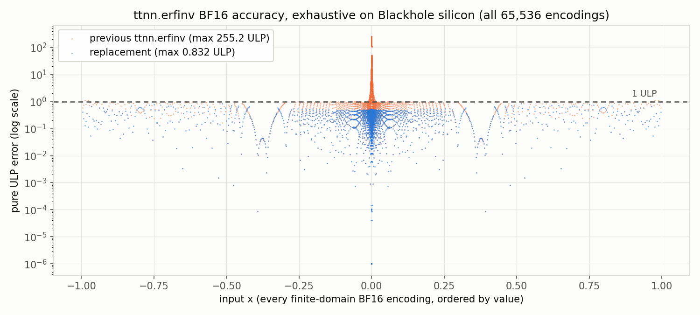

# erfinv: exhaustive BF16 accuracy and device-time characterization on Blackhole

`ttnn.erfinv`'s Blackhole SFPU kernel was replaced for the **BF16 destination-register
case** (`tt_metal/hw/ckernels/blackhole/metal/llk_api/llk_sfpu/ckernel_sfpu_erfinv_bf16.h`
and the shared evaluator `ckernel_sfpu_bf16_poly_common.h`). The fp32-dest path
(`is_fp32_dest_acc_en`) keeps the pre-existing Winitzki implementation and is out of scope.
This note is the engineering record behind PR #55283: the full exhaustive-accuracy method,
the special-value contract, and the shape × memory-config device-time sweep. The PR body
carries only the headline numbers and points here.

## Algorithm

On the open interval `|x| < 1`,

    t = ln(1 - x^2);   erfinv(x) ~= x * P3(|t|)

The `ln(1 - x^2)` is inlined: the binade split is anchored at 0.75 and the reduced argument
is rebuilt from `-x^2` directly, so the reduction carries a **single rounding**. `P3` is a
degree-3 polynomial in `|t|`; the coefficients are a ULP-optimized least-squares fit over
`|t|` in `[0, 5.55]`, with exact bit patterns and provenance in the kernel header
(tt-polynomial-fitter fit `erfinv_p3_s1_uniform_lsq_ulp_block-whole_log_ratio`, coefficients
sha256 `0da6b90d…`). The kernel is layered as a shared family evaluator
(`calculate_log_square_factorized_odd_bf16`) plus a thin per-op coefficient config
(`ErfinvBf16Config`), the pattern the #49435 sibling ops reuse.

### Special values

The certified contract, asserted exactly by the exhaustive test:

- `erfinv(±1) = ±Inf`
- `|x| > 1`, `±Inf`, `NaN` → `+Inf` (the BF16 conversion pipeline maps NaN payloads onto
  infinity; the previous kernel also never produced NaN on this domain)
- zeros and DAZ'd subnormal inputs → exact `±0`, including the one subnormal-boundary output
  cell where BF16 RNE lands on `±MIN_NORMAL`, reproduced exactly.

## Accuracy — exhaustive over all 65,536 BF16 encodings, Blackhole silicon

Every one of the 65,536 BF16 input encodings is swept in a single tiled tensor on Blackhole
silicon and compared against a float64 `torch.erfinv` reference:

| kernel | max pure ULP | mean pure ULP |
|---|---:|---:|
| previous (Winitzki + Newton sqrt) | 255.23 | 168.38 |
| **replacement** (`x * P3(\|ln(1-x^2)\|)`) | **0.83** | **0.25** |



**Pure ULP** = `|FTZ(float64 golden) − device result| / bf16_ulp_spacing(BF16-rounded golden)`,
the `ttnn-eltwise-op-tester` metric. The numerator flush is keyed on the rounded golden
(post-round FTZ), matching Blackhole's hardware model of DAZ on input and post-round FTZ on
output (see
[Handling_Special_Value/special_values.md](../Handling_Special_Value/special_values.md)).

The bound is CI-enforced: `tests/ttnn/unit_tests/operations/eltwise/test_erfinv_bf16_exhaustive.py`
sweeps all encodings in one tiled tensor, gates **max pure ULP < 1.0**, asserts the specials
contract exactly, and regenerates the figure data via `TT_EXPORT_ULP_DUMP`.

### Degree / accuracy contract

The kernel documents its accuracy budget the way `ckernel_sfpu_recip.h` documents its
iteration count: the degree-3 `P3(|t|)` on the anchored single-rounding reduction is
sufficient for BF16-dest precision (max pure ULP 0.83 ≤ 1.0 over the full closed domain). A
lower degree does not hold the 1-ULP gate near the origin, where the previous kernel peaked
at 255 ULP.

## Device time — shape × memory-config sweep

Measured on the k-quad Blackhole galaxy node **a03u14** by trace replay: for each
(shape, memory-config) cell, 64 back-to-back `ttnn.erfinv` ops are captured into a trace and
the trace is replayed 20 times; per-op time = replay wall / 64 with host dispatch excluded
(no per-op host dispatch in the replay loop), so the reported quantity maps to tt-metal's
per-op **DEVICE KERNEL DURATION** vocabulary
(`tools/tracy/process_ops_logs.py`). Both legs (stock kernel vs this PR's kernel) run on the
same chip, same branch, same toolchain, in alternating order (A/C/C/A — two passes each,
medians of the two shown paired below); the PR kernel is introduced by a non-destructive
git-worktree header overlay (erfinv is JIT-compiled, no rebuild). Speedup = stock median /
PR median. Input and output tensors are placed in the stated memory config; both are
interleaved. Raw logs: `/data/nkapre/erfinv49435/perfsweep_20260903_124816/`.

| shape | tiles | mem config | stock µs/op (p1 / p2) | this-PR µs/op (p1 / p2) | speedup |
|---|---:|---|---:|---:|---:|
| 32×32 | 1 | DRAM-interleaved | 6.12 / 6.11 | 6.07 / 6.12 | 1.00× |
| 256×256 | 64 | DRAM-interleaved | 5.95 / 5.95 | 6.06 / 5.95 | 0.99× |
| 512×512 | 256 | DRAM-interleaved | 9.68 / 9.68 | 8.15 / 8.03 | **1.20×** |
| 1024×1024 | 1024 | DRAM-interleaved | 24.96 / 24.95 | 20.13 / 20.00 | **1.24×** |
| 2048×2048 | 4096 | DRAM-interleaved | 86.47 / 85.72 | 67.29 / 66.93 | **1.28×** |
| 32×32 | 1 | L1-interleaved | 6.06 / 5.94 | 6.13 / 6.00 | 0.99× |
| 256×256 | 64 | L1-interleaved | 6.04 / 6.00 | 6.10 / 6.00 | 0.99× |
| 512×512 | 256 | L1-interleaved | 8.99 / 8.95 | 7.41 / 7.31 | **1.22×** |
| 1024×1024 | 1024 | L1-interleaved | 23.34 / 23.41 | 18.53 / 18.42 | **1.27×** |
| 2048×2048 | 4096 | L1-interleaved | residency-bound (see below) | | n/a |

An independent run on a06u02 (pilot receipt `receipt_v3_212242`) measured the 512×512
DRAM-interleaved cell at 9.16 → 7.92 µs/op = 1.16×, corroborating this row cross-node.

**Reading.** The speedup *grows* with tile count rather than flattening, which places erfinv
in the **compute-bound** (SFPU-throughput-bound) regime at these sizes — a bandwidth-bound op
would tie both kernels at large shapes, since each moves identical bytes. Instead the new
kernel's cheaper per-element evaluation is increasingly visible as per-tile SFPU work grows,
reaching 1.28× at 4096 tiles. At 1–64 tiles both kernels sit on the same ~6 µs/op fixed floor
(per-op dispatch / trace-replay granularity), which is overhead-bound and hides the kernel
difference (≈1.0× tie). The DRAM-vs-L1 speedup ratio is nearly identical at each size
(512-tile: 1.20× vs 1.22×; 1024-tile: 1.24× vs 1.27×) — further evidence the bottleneck is
SFPU compute, not the memory tier; L1 buys only a small absolute-latency reduction.

**L1 residency.** The driver keeps the 64-live-output protocol identical across both configs.
Interleaved L1 holds the K+1 live tensors through 1024 tiles (≈130 MB) but not 4096 tiles
(≈520 MB > interleaved-L1 capacity — a single 8 MB tensor already leaves the banks unable to
seat the next), so the 2048×2048 L1 cell is residency-bound and reported as such rather than
forcing the protocol to fit it.

## Reproduction

Accuracy (any Blackhole):

```bash
pytest tests/ttnn/unit_tests/operations/eltwise/test_erfinv_bf16_exhaustive.py -v -s
# TT_EXPORT_ULP_DUMP=<path.npz> dumps per-encoding data; the figure regenerates via
# tech_reports/bf16_sfpu_accuracy/render_ulp_figure.py from a stock dump and a patched dump.
```

Device-time sweep (k-quad galaxy node): trace-replay driver
`/data/nkapre/erfinv49435/perfsweep_stage/{driver.sh,perfsweep.py}`, raw logs under
`/data/nkapre/erfinv49435/perfsweep_<stamp>/` (this run: a03u14, `perfsweep_20260903_124816`). No committed TTNN single-op eltwise-unary
device-perf harness exists (`tests/ttnn/perf_tests/operations` holds only `conv`), and the
LLK cycle-zone catalog (`perf_eltwise_unary_sfpu`, `helpers/perf/test_schemas.py` v3) has no
tensor-memory-config knob, so the DRAM-vs-L1 sweep is reported via the standalone
trace-replay timer in the DEVICE KERNEL DURATION vocabulary — the approach PR #54308 used
for its device-kernel-duration numbers.
