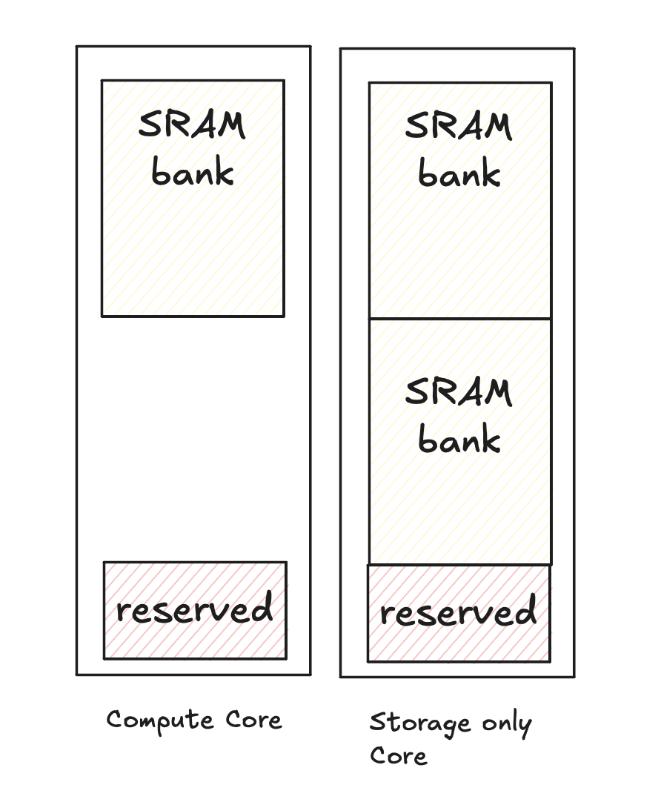
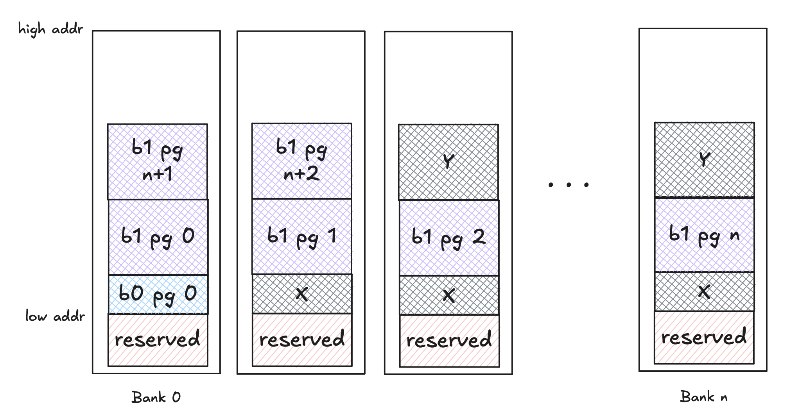
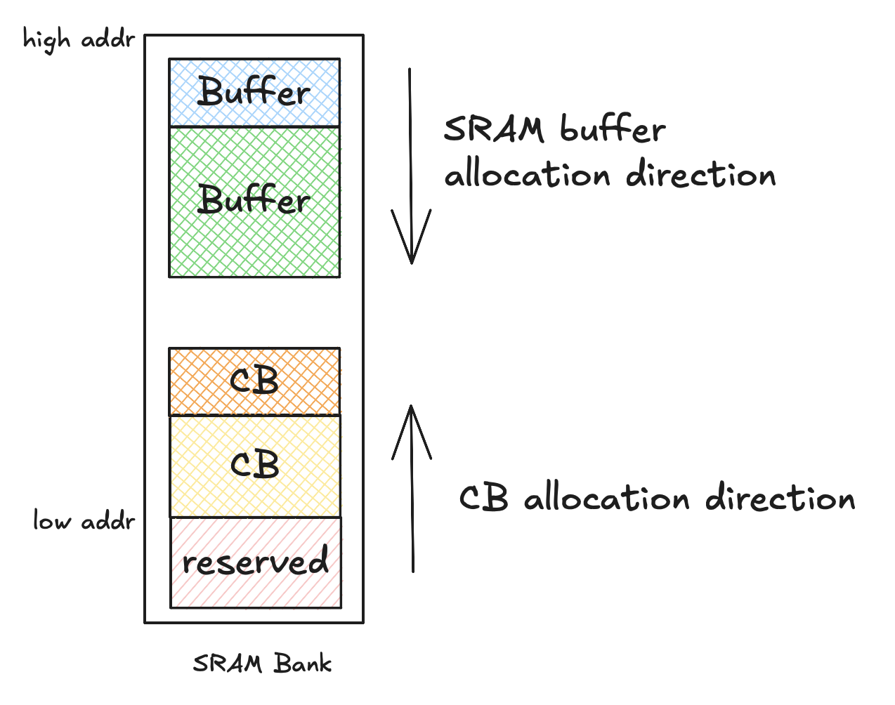

# Allocator

The Allocator maintains a view of on device memory across DRAM and SRAM (i.e. L1). It assigns addresses for `Buffers` and maintains a record of what is free or in-use. The allocator does not interact with on-device memory and is not responsible for copying data to/from the buffers.

1. [Architecture](#1-memory-banks)
2. [Memory Banks](#2-memory-banks)
3. [Lockstep Allocation](#3-lockstep-allocation)
    - [3.1 Alignment](#31-alignment)
4. [SRAM Banks and CircularBuffers](#4-sram-banks-and-circularbuffers)
5. [Memory Reports](#5-memory-reports)

## 1. Architecture
We use a first fit memory algorithm to allow both top-down and bottom-up allocations in the same memory region. Buffers are able to specify whether they should be alloated in lower address space or higher address space. This enables Buffers of the same class to be grouped together without being fragmented by other Buffer classes. For example, user data Buffers are alloated bottom-up in DRAM while Program binaries are allocated top-down to avoid binaries fragmenting user data space. A use case for this in SRAM for L1 Buffers and CircularBuffers is described [below](#4-sram-banks-and-circularbuffers). Based on this, while best fit algorithms reduce fragmentation for Buffers of the same class they don't account for fragmentation caused by mixing different classes.

Note: This hybrid of top-down and bottom-up alloations can also be enabled by dividing up available memory into different memory pools that are located at higher/lower address spaces and then allocating Buffers of a particular class into their associated memory pool. This approach has not been explored in detail and would first require collecting data to appropriately size these memory pools and then consider dynamic resizing.

## 2. Memory Banks

The number and size of DRAM and SRAM banks are architecture specific and derived from information specified in the SoC descriptor.

There is one DRAM bank per DRAM channel. For example, on Wormhole there are 12 ~1GB DRAM banks while Blackhole devices have 8 ~4GB DRAM banks. Some portion of each DRAM bank is reserved for a barrier.

There is one SRAM bank per Tensix compute core and `N` SRAM banks per storage only core, where `N = SRAM size per core / storage core bank size`. The number of storage cores and the storage core bank size is specified in the core descriptor yaml for the particular arch. Example of SRAM banks in compute core and storage only cores is shown in *Figure 1*.



*Figure 1: SRAM banks in compute core and storage only core*

The SRAM bank size is the storage core bank size if specified otherwise it is `total SRAM size - reserved size`. Reserved region in SRAM is used to hold FW, Kernels, and related runtime metadata.

## 3. Lockstep Allocation

We follow a `lockstep allocation` scheme across the banks. This means that each bank reserves the same amount of space for a given buffer regardless of how many banks the data is in. Lockstep allocation is illustrated in *Figure 2*



*Figure 2: Lockstep allocation*

In this example the first buffer, b0, has a single page of data of X bytes but all banks mark X bytes as being in use. The second buffer, b1, has n+2 pages and the first page in each bank will be allocated at address `low_addr + X` with a total of 2Y bytes being allocated in each bank. Lockstep allocation eases on device address calculation for pages.

Note: this example shows allocating interleaved buffers but a similar scheme is followed for sharded buffers. For both buffers, the allocator first determines how many bytes need to be allocated per bank. Details on these two memory layouts can be found [here.](../tensor_layouts/tensor_layouts.md#4-memory-layout)

Managing allocations and deallocations is currently done using a free list.

### 3.1 Alignment

Allocations in DRAM and SRAM are done at `DRAM_ALIGNMENT` aligned addresses to ensure that reads from DRAM into SRAM do not violate NoC alignment constraints.

When sizes in the buffer config do not respect this alignment, allocator pads each page or shard. This leads to some internal fragmentation in the allocated region.

## 4. SRAM Banks and CircularBuffers

DRAM buffers are allocated from low address to high address (bottom-up) whereas SRAM buffers are allocatd from high address to low address (top-down). Data within the allocated region always grows from low to high address.

SRAM buffers are allocated top down to avoid growing into `CircularBuffers (CBs)` which are *typically* not managed by the allocator and are placed after the reserved region as shown in *Figure 3*. Typically a CBs lifetime is tied to its corresponding `Program` with the `Program` being responsible for managing all CB addresses since its lifetime is within an Op. To reduce memory footprint, a CB can share the same address space as a SRAM buffer. In this case the `Allocator` rather than the `Program` manages this CB's address and the lifetime of the CB extends across Ops.



*Figure 3: SRAM buffers and CircularBuffers*

Note: before any `Program` is run on device there is a validation step to ensure that CBs and SRAM buffers do not overlap.

## 5. Memory Reports

Debug reports can be generated to get a dump of the memory state at a particular point in time or set to log memory state during each `Program`compile.

In both cases three reports are generated in `$TT_METAL_HOME/generated`:
- `l1_usage_summary.csv` has a table with an entry for each program indicating the minimum largest free SRAM block and size of largest SRAM buffer that can be interleaved across available free SRAM blocks
- `memory_usage_summary.csv` for each program there is an entry indicating total allocatable, allocated, free, and largest free block sizes for each DRAM and SRAM bank
- `detailed_memory_usage.csv` expands on the memory usage summary report by including each memory block address, size, and allocation status

These reports can be enabled from C++ and Python.

```c++
// API to dump state of memory for a given device. Optional prefix will be prepended to the report.
DumpDeviceMemoryState(const Device *device, std::string prefix="");

// API to get dram memory view for a given device
GetMemoryView(const IDevice* device, const BufferType& buffer_type);

// APIs to enable/disable memory reports for each Program's compile
EnableMemoryReports();
DisableMemoryReports();
```

```python
# API to dump state of memory for a given device. Optional prefix will be prepended to the report.
ttnn.device.dump_device_memory_state(device, prefix="")

# APIs to enable/disable memory reports for each Program's compile
ttnn.device.EnableMemoryReports()
ttnn.device.DisableMemoryReports()
```
