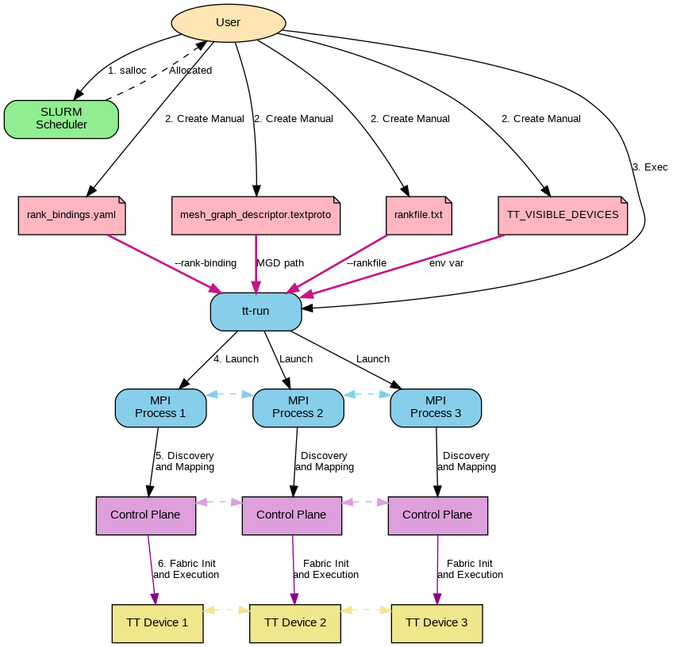
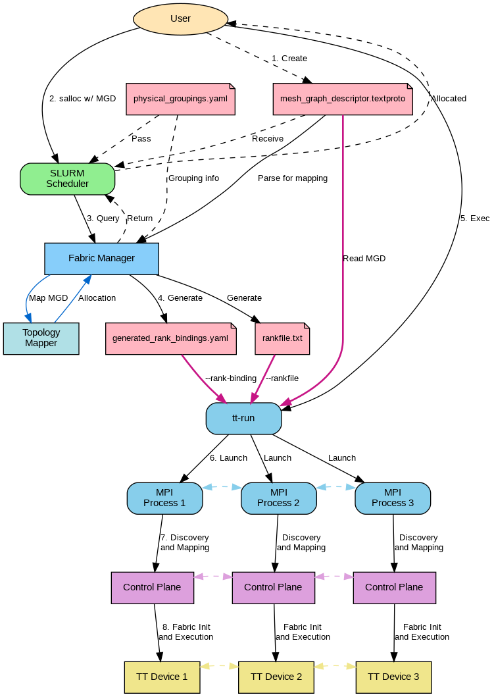
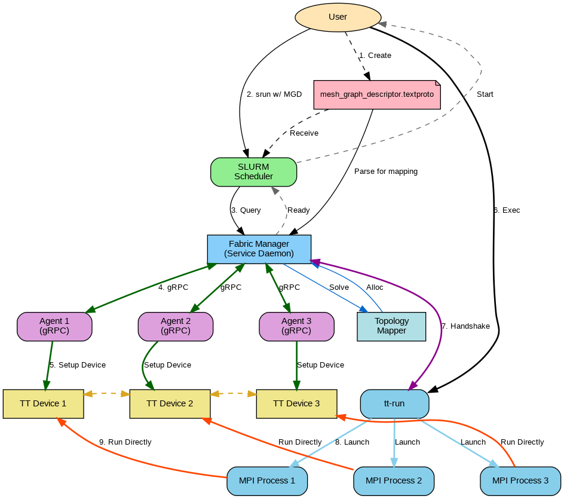

# Multi-Mesh Multi-Host Fabric Initialization Design

## 1. Executive Summary

This document outlines the design and transition plan for the Multi-Mesh Multi-Host Fabric initialization flow. The goal is to move from a manual, hardcoded rank-binding approach to a fully automated, Fabric Manager (FM) driven topology resolution and initialization system.

The transition involves introducing a global Fabric Manager that maintains the physical cluster graph, creating a Topology Mapper to resolve logical Mesh Graph Descriptors (MGD) to physical resources, and updating `tt-run` and the Metal runtime to utilize these services.

The design is explicitly tied to the following efforts:

*   **Multi-mesh topology solver** (PR #36174): [https://github.com/tenstorrent/tt-metal/pull/36174](https://github.com/tenstorrent/tt-metal/pull/36174)
*   **Auto assign Mesh Rank Bindings from Rankfile** (Issue #31613): [https://github.com/tenstorrent/tt-metal/issues/31613](https://github.com/tenstorrent/tt-metal/issues/31613)
*   **Auto assign Mesh ID via Topology Mapper** (Issue #31745): [https://github.com/tenstorrent/tt-metal/issues/31745](https://github.com/tenstorrent/tt-metal/issues/31745)
*   **Standardize file for Physical System Groupings** (Issue #35708): [https://github.com/tenstorrent/tt-metal/issues/35708](https://github.com/tenstorrent/tt-metal/issues/35708)

---

## 2. Physical Groupings and Descriptors

To enable the Fabric Manager to understand the cluster hierarchy and make intelligent placement decisions, we introduce standardized descriptors for physical system groupings.

### System Hierarchy
*   **Chip:** Single Tenstorrent device.
*   **Board/Shelf:** Group of chips (e.g., Galaxy, Nebula).
*   **Host:** Server node controlling one or more boards.
*   **Pod:** Collection of connected hosts/boards.
*   **Cluster:** The entire set of available resources.

### Descriptors
We define a schema for describing these resources.

**Mesh Descriptor Example:**
```protobuf
mesh_descriptors {
  name: "M0"
  arch: WORMHOLE_B0
  device_topology {
    dims: [ 8, 16 ]
    dim_types: [ LINE, RING ]
  }
  host_topology   { dims: [1, 4] }
  channels {
    count: 4
    policy: STRICT
  }
}
```

**Graph Descriptor Example:**
```protobuf
graph_descriptors {
  name: "G0"
  type: "POD"
  instances { mesh { mesh_descriptor: "M0" mesh_id: 0 } }
  instances { mesh { mesh_descriptor: "M0" mesh_id: 1 } }
  connections {
    nodes { mesh { mesh_descriptor: "M0" mesh_id: 0 } }
    nodes { mesh { mesh_descriptor: "M0" mesh_id: 1 } }
    channels { count: 2 }
  }
}
```

---

## 3. Current Flow (Pre-PR 36174: Manual Rank Bindings)

Currently, the user is responsible for manually defining the mapping between MPI ranks and physical devices via a rank binding file. There is no global validation of inter-mesh connectivity by a central manager before runtime.

### 3.1 Job Submission & Launch
The user requests nodes via SLURM and then uses `tt-run` with a manually crafted rank binding file.

**Step 1: Allocation**
```bash
# Example: Allocating 4 nodes for a job
salloc --partition=galaxy --nodes=4
```

**Step 2: Configuration (Rank Bindings)**
The user must create a `rank_bindings.yaml` that maps each MPI rank to a `mesh_id`, `mesh_host_rank`, and the specific `TT_VISIBLE_DEVICES`.

*Example `rank_bindings.yaml`:*
```yaml
rank_bindings:
  - rank: 0
    mesh_id: 0
    mesh_host_rank: 0
    env_overrides:
      TT_VISIBLE_DEVICES: "0,1,2,3,4,5,6,7"

  - rank: 1
    mesh_id: 1
    mesh_host_rank: 0
    env_overrides:
      TT_VISIBLE_DEVICES: "0,1,2,3,4,5,6,7"

mesh_graph_desc_path: "path/to/my_mesh_graph_descriptor.textproto"
```

**Step 3: Execution**
The user runs `tt-run`, passing the rank binding file and any necessary MPI arguments (like a rankfile if specific host placement is needed).

```bash
# Example launch script
RANK_BINDING=rank_bindings.yaml
RANKFILE=hosts_rankfile.txt
HOSTS="host0,host1,host2,host3"

MPI_ARGS="--host ${HOSTS} --rankfile ${RANKFILE} --oversubscribe --mca btl self,tcp --mca btl_tcp_if_exclude docker0,lo,tailscale0 --bind-to none --tag-output"

tt-run \
  --rank-binding "${RANK_BINDING}" \
  --mpi-args "${MPI_ARGS}" \
  ./bh_blitz_decode
```

### 3.2 Flow Diagram



### 3.3 Explanation
1.  **Allocation (Step 1):** User requests nodes via SLURM (`salloc`). SLURM allocates nodes and returns them to the user.
2.  **Configuration (Step 2):** User manually creates all configuration files:
    *   `rank_bindings.yaml` - maps MPI ranks to `mesh_id`s and `TT_VISIBLE_DEVICES`
    *   `mesh_graph_descriptor.textproto` - defines the logical topology
    *   `rankfile.txt` - specifies MPI rank to host mappings
    *   `TT_VISIBLE_DEVICES` - environment variable defining visible devices
3.  **Execution (Step 3):** User executes `tt-run`, supplying all configuration files:
    *   `tt-run --rank-binding rank_bindings.yaml --rankfile rankfile.txt ./build/test/tt_metal/my_app`
4.  **Launch (Step 4):** `tt-run` launches multiple MPI processes (one per rank).
5.  **Discovery and Mapping (Step 5):** Each MPI process initializes its Control Plane instance. The Control Planes perform discovery and mapping of the fabric topology. Control Planes communicate with each other to coordinate.
6.  **Fabric Init and Execution (Step 6):** Each Control Plane programs its corresponding TT Device. Control Planes communicate bidirectionally, and TT Devices communicate with each other. There is no global validation - each Control Plane operates independently based on the manually provided rank bindings.

---

## 4. After PR 36174: Hierarchical Multi‑Mesh Mapping in CP

PR 36174 adds a **multi‑mesh topology mapping utility** inside TT‑Metal. This doesn’t change the end‑to‑end flow yet, but it **changes what CP can do** when it sees an MGD. This is the intermediate "Transition" step before full FM integration.

### 4.1 New Mapping Model

New data structures are introduced:
*   **LogicalMultiMeshGraph**: Mesh‑level adjacency graph (logical meshes and their connections).
*   **PhysicalMultiMeshGraph**: Mesh‑level adjacency graph for physical meshes and their ASIC connectivity.

The main utility:
```cpp
MultiMeshMapping map_multi_mesh_to_physical(
    const LogicalMultiMeshGraph& logical,
    const PhysicalMultiMeshGraph& physical,
    const TopologyMappingConfig& config);
```

Internally, it performs:
1.  **Inter‑mesh mapping**: Map logical meshes → physical meshes using adjacency and **inter‑mesh validation** (STRICT/RELAXED).
2.  **Intra‑mesh mapping**: Map logical fabric nodes → ASIC IDs within each mesh.

The solver is wired into `TopologyMapper::map_multi_mesh_to_physical()`. It is effectively the engine we will rely on for **Phase 1 and Phase 2** inside FM and CP.

### 4.2 Temporary Constraint

PR 36174 currently enforces a **1:1 mesh ID mapping** (physical mesh ID = logical mesh ID), as a temporary constraint until the **rank bindings file is removed** (Issues 31613/31745).

*   **Current/Transition Impact:** Users still provide rank bindings manually.
*   **Improvement:** The Control Plane (CP) now has the logic to validate that the physical connectivity matches the logical MGD, rather than blindly trusting the rank bindings.

---

## 5. Phase 1 Flow (Transitional: FM-Assisted)

In this phase, the Fabric Manager (FM) is introduced to automate the topology mapping using the logic from PR 36174. FM resolves the logical MGD to the physical graph and generates the rank bindings. `tt-run` still consumes these bindings, maintaining compatibility with the current launch mechanism.

### 5.1 Automated Binding Generation
Instead of writing `rank_bindings.yaml` manually, the user submits their intent (MGD) to SLURM/FM, which produces the bindings.

**Step 1: Allocation & Binding Generation**
```bash
# User submits job with MGD
srun --partition=galaxy --comment="mgd=my_graph.proto" ...
```
Behind the scenes, the SLURM plugin calls FM. FM finds a valid placement and writes a `generated_rank_bindings.yaml`.

*Example Generated `rank_bindings.yaml`:*
```yaml
# AUTO-GENERATED BY FABRIC MANAGER
rank_bindings:
  - rank: 0
    mesh_id: 0         # Mapped from Logical M0 -> Physical M7
    mesh_host_rank: 0
    env_overrides:
      TT_VISIBLE_DEVICES: "0,1,2,3,4,5,6,7"

  - rank: 1
    mesh_id: 1         # Mapped from Logical M1 -> Physical M8
    mesh_host_rank: 0
    env_overrides:
      TT_VISIBLE_DEVICES: "0,1,2,3,4,5,6,7"

mesh_graph_desc_path: "path/to/my_mesh_graph_descriptor.textproto"
```

**Step 2: Execution**
The user (or the wrapper script) uses the generated file but **must still provide all MPI launch arguments** (rankfile, host list, etc.).

**Important:** The `tt-run` CLI interface is **unchanged** in Phase 1. The only difference is that the input files (`rank_bindings.yaml`, `rankfile.txt`) are generated rather than handwritten.

```bash
# Retrieve artifacts generated by FM/SLURM
RANK_BINDING="/data/slurm/$JOBID/generated_rank_bindings.yaml"
RANKFILE="/data/slurm/$JOBID/rankfile.txt"
HOSTS=$(scontrol show hostnames $SLURM_JOB_NODELIST | paste -sd,)

MPI_ARGS="--host ${HOSTS} --rankfile ${RANKFILE} --oversubscribe --bind-to none"

tt-run \
  --rank-binding "${RANK_BINDING}" \
  --mpi-args "${MPI_ARGS}" \
  ./bh_blitz_decode
```

### 5.2 Physical Groupings File (Phase 1 Use)

FM consumes a Physical Groupings file, which defines the hierarchical structure of physical resources (meshes, pods, superpods, clusters) in the cluster. This file is provided by the cluster administrator and is used by FM to understand which subsets of ASICs can be used as candidate physical meshes for a given logical mesh in the MGD.

The groupings file is conceptually structured as follows:

```yaml
# physical_groupings.yaml (conceptual)
# Base layer group definitions: always in terms of ASIC IDs.

asic_groups:
  # Arbitrary group IDs; names are opaque labels, not tied to hosts or meshes.
  - id: 0
    asic_ids: [10001, 10002, 10003, 10004, 10005, 10006, 10007, 10008]
  - id: 1
    asic_ids: [10101, 10102, 10103, 10104, 10105, 10106, 10107, 10108]
  - id: 2
    asic_ids: [10201, 10202, 10203, 10204, 10205, 10206, 10207, 10208]
  - id: 3
    asic_ids: [10301, 10302, 10303, 10304, 10305, 10306, 10307, 10308]

# Higher levels reference lower levels only by group IDs; the labels here are descriptive only.

mesh_groups:
  - id: 10
    # This mesh is composed of asic_group 0
    group_ids: [0]
  - id: 11
    # This mesh is composed of asic_group 1
    group_ids: [1]

pod_groups:
  - id: 20
    group_ids: [10, 11]

superpod_groups:
  - id: 30
    group_ids: [20]

cluster_groups:
  - id: 40
    group_ids: [30]
```

This is complementary to the Physical System Descriptor (PSD):

*   **PSD**: Flat graph of all ASICs + links.
*   **Groupings**: Allowed carve‑outs (meshes/pods/superpods/clusters) over that flat graph.

FM uses both to build the PhysicalMultiMeshGraph consumed by the multi‑mesh solver. In Phase 1, FM treats the groupings file as the source of truth for:

*   Which subsets of ASICs can be used as candidate physical meshes for a given logical mesh in the MGD.
*   How those meshes can be composed into pods and superpods that match higher-level graph_descriptors.
*   Which placement constraints must be enforced (e.g., avoid splitting dual-chip boards or hosts unless explicitly allowed) when solving multi-mesh mappings.
*   Narrowing the search space for the topology solver so multi-mesh mapping only considers physically valid groupings.

The groupings file is provided by SLURM (or the cluster administrator) to FM at startup or during placement queries.

### 5.3 Flow Diagram



### 5.4 Explanation
1.  **Create MGD (Step 1):**
    *   User creates the `mesh_graph_descriptor.textproto` file
    *   File defines the logical topology (mesh descriptors, graph descriptors, top-level instance)

2.  **Allocation Request (Step 2):**
    *   User submits job to SLURM with MGD (`salloc w/ MGD`)
    *   MGD file is provided to SLURM scheduler
    *   Physical Groupings file (`physical_groupings.yaml`) is passed to SLURM scheduler

3.  **Physical Groupings File:**
    *   Cluster-wide configuration file (managed by cluster administrator)
    *   Defines hierarchical structure: meshes, pods, superpods, clusters
    *   Specifies which subsets of ASICs can be used as candidate physical meshes
    *   FM loads this file at startup
    *   Used together with Physical System Descriptor (PSD) to build PhysicalMultiMeshGraph
    *   Constrains placement decisions

4.  **Query and Parse (Step 3):**
    *   SLURM queries Fabric Manager for placement
    *   SLURM provides MGD to Fabric Manager
    *   Fabric Manager parses MGD for mapping
    *   Fabric Manager uses Physical Groupings file to understand physical cluster hierarchy
    *   Fabric Manager uses Topology Mapper (from PR 36174) to solve topology
    *   Topology Mapper uses groupings information to find valid placement

5.  **Generate Configuration (Step 4):**
    *   Fabric Manager auto-generates `generated_rank_bindings.yaml`
        *   Maps MPI ranks to physical resources
    *   Fabric Manager auto-generates `rankfile.txt`
        *   Maps MPI rank to host mappings
    *   Allocation details returned to SLURM
    *   SLURM notifies user of allocation

6.  **Execution (Step 5):**
    *   User executes `tt-run` command
    *   Supplies generated `generated_rank_bindings.yaml` file
    *   Supplies generated `rankfile.txt` file
    *   Supplies MGD path
    *   Example: `tt-run --rank-binding generated_rank_bindings.yaml --rankfile rankfile.txt ./app`

7.  **Launch (Step 6):**
    *   `tt-run` launches multiple MPI processes
    *   One MPI process per rank

8.  **Discovery and Mapping (Step 7):**
    *   Each MPI process initializes its Control Plane instance
    *   Control Planes perform discovery and mapping
    *   Uses MGD and generated bindings
    *   Control Planes communicate bidirectionally with each other

9.  **Fabric Init and Execution (Step 8):**
    *   Each Control Plane programs its corresponding TT Device
    *   Control Planes communicate bidirectionally with each other
    *   TT Devices communicate with each other
    *   Control Plane performs local validation using PR 36174 mapper logic

---

## 6. Phase 2 Flow (Ideal: Fully Automated)

In the final state, FM handles the entire fabric initialization. `tt-run` connects to FM directly. Rank bindings and device visibility are handled transparently. The user experience is simplified to requesting resources and running the application.

### 6.1 Job Submission & Launch
The workflow is simplified to just the essential inputs: topology (MGD) and application binary.

**Step 1: Allocation & Placement**
```bash
# Request resources for the topology
srun --partition galaxy --comment="mgd=my_graph.proto" --nodes=4 ...
```
1.  **Placement:** SLURM consults FM to find a valid placement for the requested topology (MGD).
2.  **Fabric Initialization:** Once placement is determined, FM performs the full fabric initialization *before* the job starts. This uses the MGD and the internal visibility map. FM may trigger an internal MPI process ("under the hood") running Control Plane logic to physically program the routing tables and binaries onto the devices.

**Step 2: Execution**
No rank bindings file is needed.
```bash
tt-run --fabric-manager ./bh_blitz_decode
```

### 6.2 Physical Groupings File (Phase 2 Use)

In Phase 2, FM continues to use the Physical Groupings file as described in Phase 1 (Section 5.2). The groupings file remains the source of truth for understanding the physical cluster hierarchy and constraining placement decisions.

FM maintains the global Physical System Descriptor (PSD) and PhysicalMultiMeshGraph for the entire cluster, which are built from both the flat PSD and the hierarchical groupings file. When FM receives a placement query from SLURM, it:

*   Loads the Physical Groupings file (if not already loaded) to understand the cluster structure.
*   Uses the groupings to build the PhysicalMultiMeshGraph that represents valid physical meshes, pods, superpods, and clusters.
*   Applies the multi-mesh solver to map the logical MGD onto these physical groupings.
*   Ensures that placement decisions respect the constraints defined in the groupings file (e.g., not splitting dual-chip boards unless explicitly allowed).

The groupings file is a cluster-wide configuration file that exists independently (typically managed by the cluster administrator), similar to Phase 1. FM loads this file at startup and uses it for all placement queries.

### 6.3 Flow Diagram



### 6.4 Explanation

#### 1. Create MGD (Step 1)
*   User creates the `mesh_graph_descriptor.textproto` file
*   File defines the logical topology (mesh descriptors, graph descriptors, top-level instance)

#### 2. Allocation Request (Step 2)
*   User submits job to SLURM with MGD (`srun w/ MGD`)
*   MGD file is provided to SLURM scheduler
*   Physical Groupings file (`physical_groupings.yaml`) is passed to SLURM scheduler

#### 3. Physical Groupings File
*   Cluster-wide configuration file (managed by cluster administrator)
*   Defines hierarchical structure: meshes, pods, superpods, clusters
*   Specifies which subsets of ASICs can be used as candidate physical meshes
*   FM loads this file at startup
*   Used together with Physical System Descriptor (PSD) to build PhysicalMultiMeshGraph
*   Constrains placement decisions

#### 4. Query and Parse (Step 3)
*   SLURM queries Fabric Manager for placement
*   SLURM provides MGD to Fabric Manager
*   Fabric Manager parses MGD for mapping
*   Fabric Manager uses Physical Groupings file to understand physical cluster hierarchy
*   Fabric Manager uses Topology Mapper to solve topology
*   Topology Mapper uses groupings information to find valid placement

#### 5. Discovery and Telemetry (Step 4)
*   Fabric Manager communicates bidirectionally with multiple Fabric Agents via gRPC
*   Communication enables discovery of physical fabric topology
*   Communication enables collection of telemetry data from each agent
*   Fabric Manager coordinates discovery and telemetry collection across all agents

#### 6. Fabric Init (Step 5)
*   Each Fabric Agent performs fabric initialization on its corresponding TT Device (Unified Kernel)
*   Programming routing tables
*   Configuring the unified kernel
*   Preparing the device for execution
*   Devices are now ready for use

#### 7. Execution (Step 6)
*   User executes `tt-run` command
*   No rank bindings file needed
*   Example: `tt-run --fabric-manager ./bh_blitz_decode`

#### 8. Handshake (Step 7)
*   `tt-run` performs bidirectional handshake with Fabric Manager
*   Obtains session configuration
*   Obtains device mappings

#### 9. Launch MPI Processes (Step 8)
*   `tt-run` launches multiple MPI processes
*   One MPI process per rank
*   Each MPI process will run directly on its assigned device

#### 10. Execution (Step 9)
*   Each MPI process executes on its corresponding TT Device
*   TT Devices communicate bidirectionally with each other
*   Fabric was fully initialized in Steps 4-5
*   MPI processes can immediately begin execution
*   No additional Control Plane initialization needed
