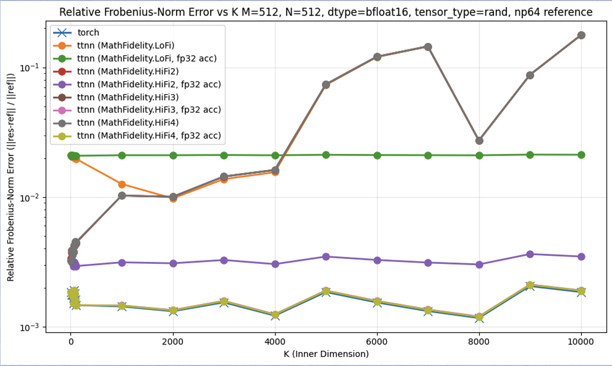
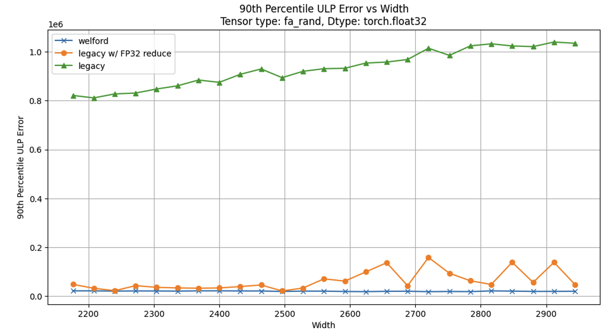
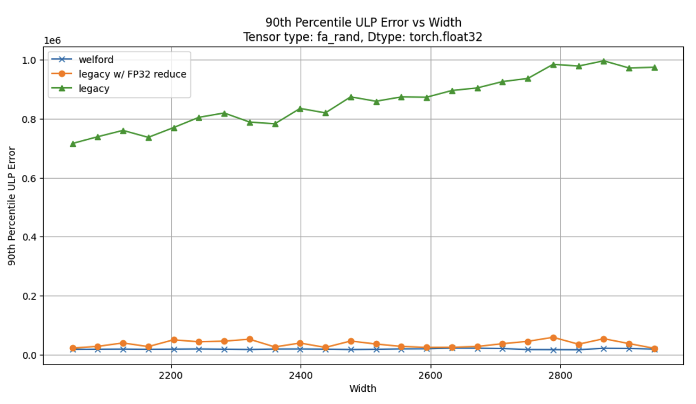
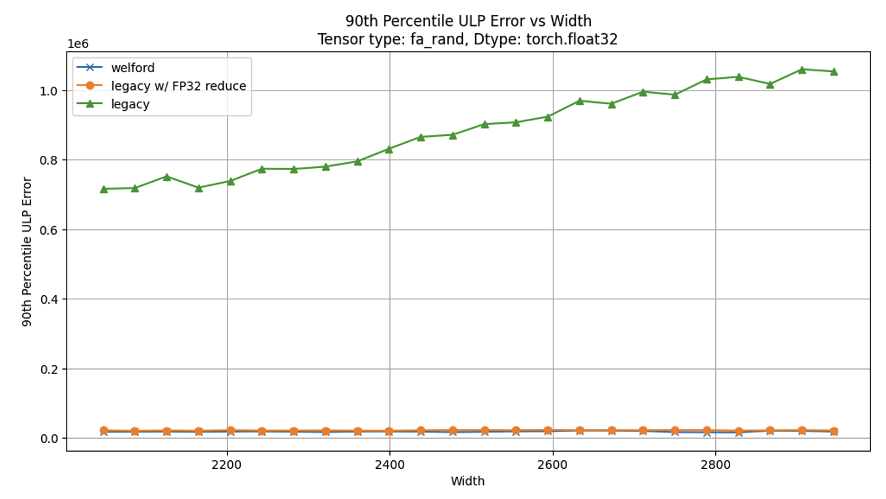
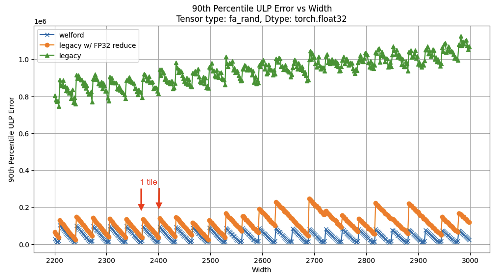
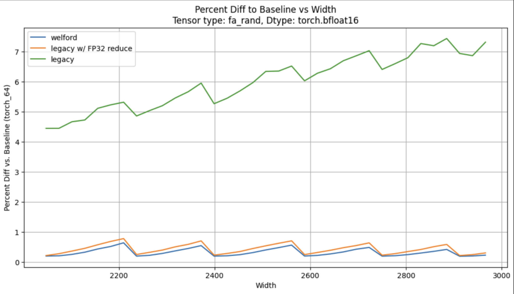
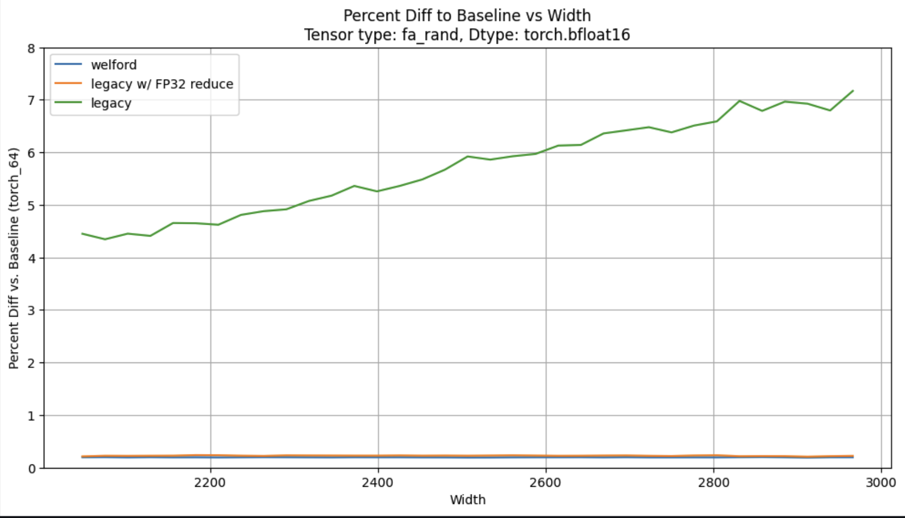

## Tips and Best Practices for Numerical Accuracy in TT-Metal Kernels

# Purpose
This document provides several guidelines for achieving high numerical accuracy when developing compute kernels in the tt-metal framework. When writing an op that is part of a large sequence of sequential operators (such as a neural network), it is important to maintain per-op accuracy as degradations from one op can compound in downstream operations.

There are many factors that influence the accuracy of a kernel. This guide focuses on a few specific items that were demonstrated to improve op accuracy and how to enable them in tt-metal.

# Measuring Numerical Accuracy
The methods to verify numerical correctness depend on the op under consideration. However, most ops take in several inputs and produce an output tensor. It is good practice to try to construct a simple analytic test case, if possible (that is, a test where the output can be easily calculated by hand). This often exposes obvious bugs or accuracy issues in the underlying kernels.

The next most direct way to verify accuracy is to compare the output tensor $T$ to a tensor $\hat{T}$ computed via the same (or analogous) op in a trusted reference framework, often PyTorch in tt-metal tests. There are many ways to check for fidelity to a reference solution. In order of strictness:

1. Equality: \
$T == \hat{T}$
    - The best metric, but impractical for floating-point cases
    - Can be computed with `comp_equal()` and asserted with `assert_equal()` in tt-metal
2. Unit in the last place (ULP): \
$\frac{|t_{ij} - \hat{t}_{ij}|}{ULP(\hat{t}_{ij})}$ $\forall$ $i,j$, where $ULP(x)$ is the distance between $x$ and the next representable value in that data format
    - Says how close you are to the correctly-rounded result in that data format
    - 1-2 ULP good for eltwise ops, but not clear what threshold to use for fused/composite ops consisting of many FP operations
    - ULP at higher precisions like FP32 are difficult to reason about
    - Can be computed with `comp_ulp()` and asserted with `assert_with_ulp` in tt-metal
3. Allclose: \
 $\frac{|t_{ij} - \hat{t}_{ij}|}{\hat{t}_{ij}} \leq atol + rtol * |\hat{t}_{ij}|$ $\forall$ $i,j$
    - Checks per-element closeness, not permitting any large deviations from reference solution
    - Can be computed with `comp_allclose()` and  asserted with `assert_allclose()` in tt-metal
4. Global error matrix norm (there are many, but Frobenius is common): \
$\frac{||E||_F}{ ||\hat{T}||_F}$, where $E=T-\hat{T}$ and $|| \cdot ||_F$ is the Frobenius norm $||A||_F=\sqrt{\sum_{i=0}^{M-1}\sum_{j=0}^{N-1} |a_{ij}|^2}$
    - Less strict than per-element comparison, but still captures the notion of error as a whole being small (less than 1%, say)
    - Can be computed with `comp_relative_frobenious()` and asserted with `assert_relative_frobenius()` in tt-metal
5. Pearson Correlation Coefficient (PCC): \
$\frac{cov(vec(T)), vec(\hat{T}))}{\sigma_{vec(T)}\sigma_{vec(\hat{T})}}$, where $vec(\cdot)$ represents the matrix flattened into a vector, $cov$ represents the covariance, and $\sigma$ represents the standard deviation
    - Measures the general correlation between the output and the reference (if one increases, so does the other). A value of 1 means perfect correlation
    - Does not detect global bias (output can be scaled by a factor of 2 and PCC can still be 1)
    - Not easy to reason with a threshold (e.g. 0.999 vs. 0.998)
    - Can be computed with `comp_pcc()` and asserted with `assert_with_pcc()` in tt-metal

# Accumulation Precision
Ops like matmul or those that compute statistics like GroupNorm or LayerNorm accumulate intermediate results en route to a final value. The precision in which these intermediate values are computed and (if needed) stored should be sufficiently high to not accumulate large errors during the running calculation. Typically, this means accumulating in a higher precision than the data type (for data formats with less precision than FP32). Failing to do this can lead to rapidly-deteriorating accuracy as seen in the gray, red (under gray), and orange lines in this plot of matmul accuracy vs. inner dimension length for bfloat16 input data (the pink line is under the greenish-yellow line):



Most ops contain an optional `DeviceComputeKernelConfig` struct argument, which has a member `fp32_dest_acc_en` (for Wormhole and Blackhole), which enables accumulation in FP32 precision. This flag configures the destination registers to operate in FP32 precision when calling the compute APIs from `compute_kernel_api`.

However, if a kernel needs to store intermediate results to a CB, then that CB must be configured to be able to copy FP32 data from L1 into the destination registers. Otherwise, the data will be converted to TF32 before being copied to dest, gradually eroding the accuracy during the reduction. Configuring the CB requires:

1. Set `UnpackToDestMode=UnpackToDestFp32` for the intermediate CB in the program setup. For example, to configure a CB with id `cb_id` to be copied from L1 into dest in full FP32 precision, the following must be in the program setup:
```cpp
std::vector<UnpackToDestMode> unpack_to_dest_mode(NUM_CIRCULAR_BUFFERS, UnpackToDestMode::Default);
unpack_to_dest_mode[cb_id] = UnpackToDestMode::UnpackToDestFp32;

auto compute_kernel = CreateKernel(
    program,
    "my_compute_kernel_file.cpp",
    all_cores,
    tt::tt_metal::ComputeConfig{
        .math_fidelity = math_fidelity,
        .fp32_dest_acc_en = fp32_dest_acc_en,
        .unpack_to_dest_mode = unpack_to_dest_mode, <--- need to pass it into ComputeConfig{}
        .math_approx_mode = math_approx_mode,
        .compile_args = compute_args,
        .defines = compute_defines});
```
This will allow `cb_id` to be unpacked directly into dest without going through the truncation of moving through srcA/B when `copy_tile()` is invoked on that CB (`copy_tile_init(cb_id)` must be called before `copy_tile()`).  <span style="color: red;">Note that this means that `cb_id` can not be used in operations that use the srcA/B registers (e.g. `add_tiles()`).</span> The results must be copied to a CB that is able to use srcA/B operations.

Failing to configure the accumulator for FP32 accumulation can lead to large, noisy errors as seen in the following plots of 90th percentile ULP error vs. tensor width for LayerNorm. At ~W=2500, the compute kernel switches from one that doesn't use an intermediate accumulator to one that does.

Without configuring the intermediate accumulator to use FP32 copying, the error is discontinuous across the kernel switch (orange line): \


After enabling FP32 copying for the accumulator, the results are smooth across the boundary:


Note that using a low-precision accumulator (bfloat16, green line) is completely insufficient to maintain accuracy.

# Order of Operations
When taking the mean of many values, many ops invoke the `reduce_tile()` API with a scalar tile of $1/N$ values, where $N$ is the number of entries in the mean. This computes the mean via divide-then-sum:

$$\mu=\sum_{i=0}^{N-1}\frac{x_i}{N}$$

which does $N$ floating-point divisions and $N-1$ floating-point summations, each of these introducing rounding error.

If the order of operations is switched to sum-then-divide:

$$\mu=\frac{1}{N}\sum_{i=0}^{N-1}x_i$$

then there are still $N-1$ summations, but only 1 division (at the end). This avoids $N-1$ rounding errors from the extraneous divisions.

In addition to accumulating division errors, divide-then-sum also risks flushing small numbers to 0. By accumulating then dividing at the end, the accumulator is allowed to grow to a large number before dividing, mitigating the risk of creating small numbers that flush to 0. However, one should also be aware of the risk of overflow if the accumulator grows too large for the data format to handle. This is another reason why accumulation in FP32 precision is desirable, as it has ample dynamic range to handle most problems.

The effect of this change is less pronounced than using FP32 accumulators, but is still an improvement as it smooths out the oscillations in the error. Compare divide-then-sum (orange line):


to sum-then-divide:



The sum-then-divide approach was implemented by using the `reduce_tile()` API still, but using a scalar tile of 1's (so the reduction is a strict summation). Then at the end the sum is divided by $N$ on the SFPU via `mul_unary_tile(cb_mean, 1/N)`.

# Non-Tile-Aligned Shapes
Special care must be taken to handle non-tile-aligned shapes, e.g. widths that are not multiples of 32 in LayerNorm. Otherwise, periodic artifacts will appear:



The strategy to address non-tile-aligned shapes will vary by algorithm. The following is an example of an error arising in LayerNorm if partial tiles are not handled properly.

LayerNorm computes the mean $\mu$ and variance $\sigma^2$ across the last dimension of an input tensor. The formulas for mean and variance are:

$$\mu=\frac{1}{N}\sum_{i=0}^{N-1}x_i$$

$$\sigma^2=\frac{1}{N}\sum_{i=0}^{N-1}(x_i-\mu)^2$$

The input tensor may not have a width that is aligned to tile boundaries (i.e. multiples of 32). This will be problematic during the mean and variance calculations, as these operations use `reduce_tile()` to sum the elements into a column vector for each tile row. That means that full tiles are processed, even though the last tile may only be partially-filled with input data. There are no guarantees for what data might exist in these out-of-bounds portions of the tile (i.e., they should be treated as garbage values). Care must be taken to exclude these elements from the reduction, the details of which are outside the scope of this document.

Additionally, to account for non-aligned shapes, the `Tensor::logical_shape()` function must be used in order to query the tensor dimensions, not `Tensor::padded_shape()`.

Addressing the above two issues gets rid of the periodicity in the LayerNorm error, making it smooth and continuous across tile boundaries. The following figures sample the width in intervals of 27, ensuring non-tile-alignment for most samples.

Without changes:



With changes:


