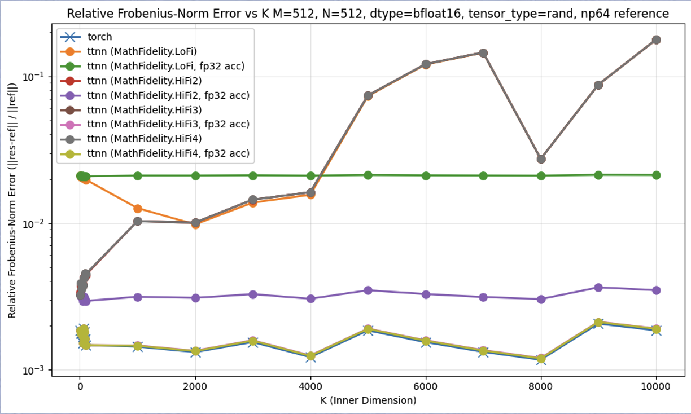
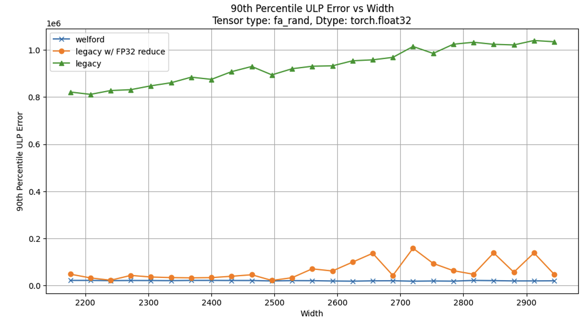
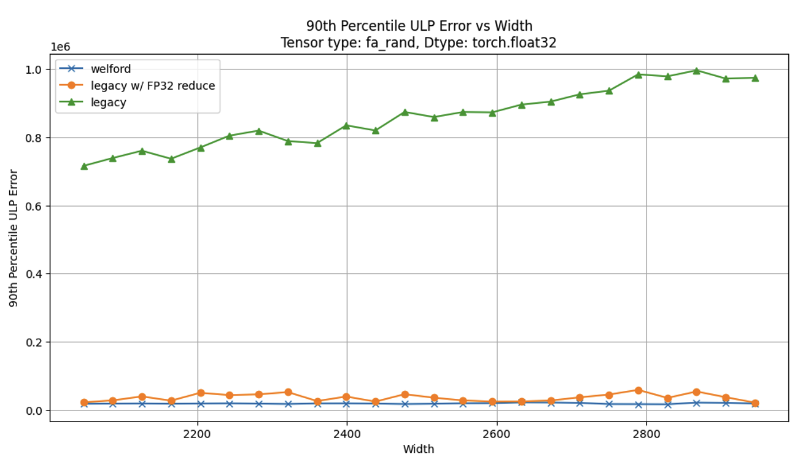
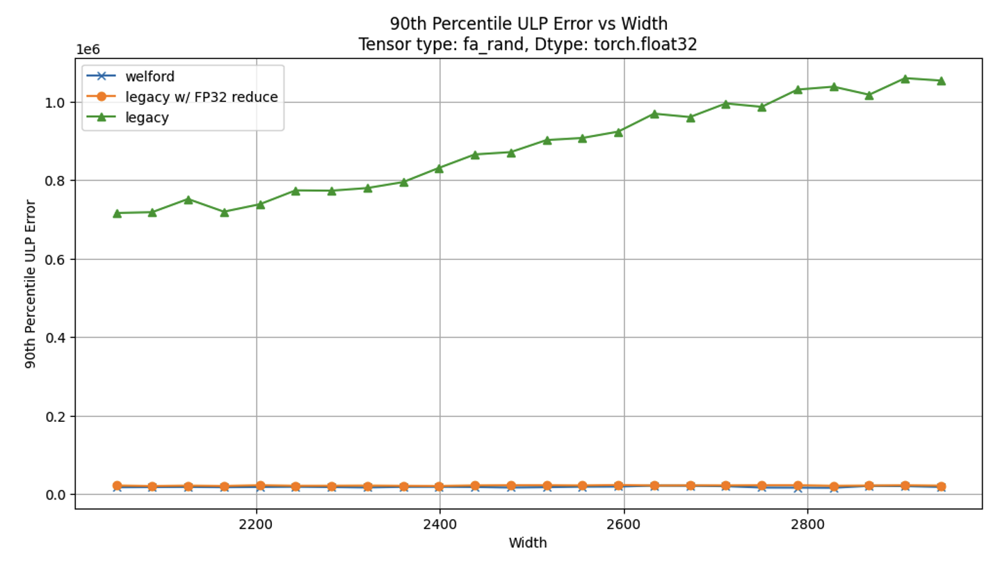
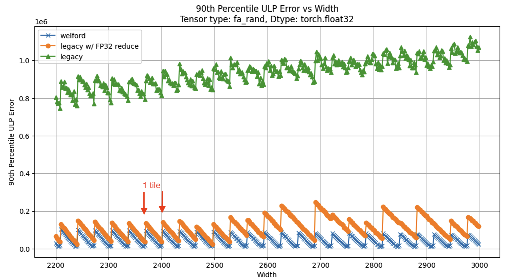
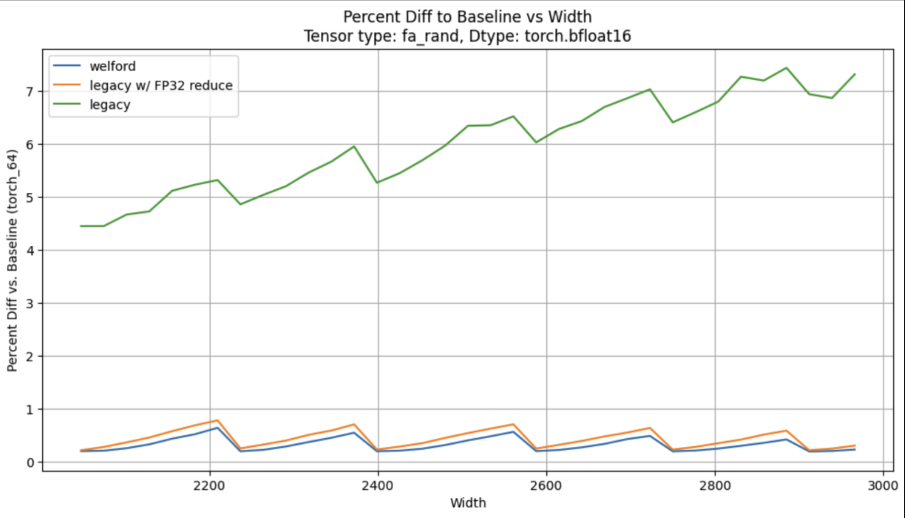
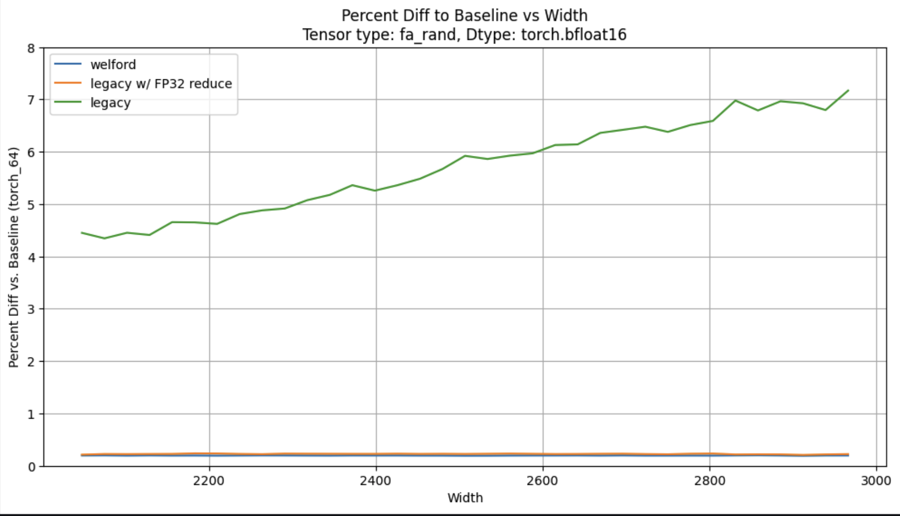
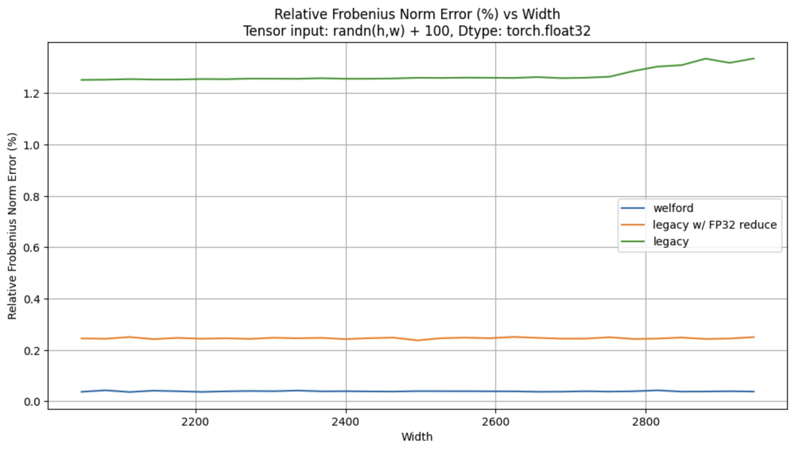

## Tips and Best Practices for Numerical Accuracy in TT-Metal Kernels

# Purpose
This document provides several guidelines for achieving high numerical accuracy when developing compute kernels in the tt-metal framework. When writing an op that is part of a large sequence of sequential operators (such as a neural network), it is important to maintain per-op accuracy as degradations from one op can compound in downstream operations.

There are many factors that influence the accuracy of a kernel. This guide focuses on a few specific items that were demonstrated to improve op accuracy and how to enable them in tt-metal.

# Execution Unit Precision: FPU vs SFPU

A Tensix core has two distinct compute units that share the Dest registers but have very different precision characteristics.

## FPU (Matrix Unit) — TF32-Limited

The FPU uses **5-bit × 7-bit multipliers** (5 bits from SrcA, 7 bits from SrcB). Math Fidelity controls how many passes are used to consume the input mantissa:

- **LoFi**: SrcA uses 1 hidden bit + 4 MSB; SrcB uses 1 hidden bit + 6 MSB
- **HiFi4**: Runs the operation multiple times to consume more mantissa bits

Even at HiFi4, the maximum achievable multiplication precision is approximately **TF32 (19 active bits)**, which is less than full FP32. Data flowing through SrcA/SrcB is always truncated to the multiplier widths. See `tech_reports/matrix_engine/matrix_engine.md` for details.

## SFPU (Vector Unit) — Full IEEE 754 FP32

The SFPU is a 32-lane SIMD engine where each lane has 8 general-purpose **32-bit registers** (LREG0-7). On Wormhole and Blackhole, `vFloat` operations use standard IEEE 754 single-precision arithmetic (**1 sign + 8 exponent + 23 mantissa bits**). The SFPU operates at genuine FP32 precision — there is no mantissa truncation in its ALU. (Grayskull used 64-element vectors with 19-bit floating point; this limitation does not apply to Wormhole/Blackhole.)

See `METALIUM_GUIDE.md` (line 450): *"Wormhole and Blackhole generations use 32-element vectors with 32-bit floating point operations."*

## Bypassing FPU Precision Limits with the SFPU

For unary element-wise operations (exp, sigmoid, sqrt, etc.), the SFPU reads from and writes to the Dest registers **directly**, without going through SrcA/SrcB. When `fp32_dest_acc_en=true` and data is unpacked to Dest with `UnpackToDestMode::UnpackToDestFp32`, the entire data path is:

```
L1 → Unpack → Dest (FP32) → SFPU reads dst_reg (FP32) → SFPU computes (FP32) → writes dst_reg (FP32) → Pack → L1
```

This bypasses the FPU's 5×7-bit multiplier bottleneck entirely. The `fp32_dest_acc_en` flag controls what happens at the **write-back** stage of SFPU kernels:

```cpp
// From ckernel_sfpu_sqrt.h:122-129
if constexpr (fp32_dest_acc_en)
{
    dst_reg[0] = tmp;                                              // full FP32 write
}
else
{
    dst_reg[0] = reinterpret<vFloat>(float_to_fp16b(tmp, 0));      // truncate to bfloat16
}
```

When `fp32_dest_acc_en=false`, the result is **explicitly truncated to bfloat16** (`float_to_fp16b`) before being written back to Dest, even though the computation itself was at FP32. This truncation is the precision bottleneck for bfloat16-mode SFPU operations — not the SFPU's arithmetic capability.

## Math Approx Mode vs Data Precision

`APPROXIMATION_MODE` controls the **polynomial degree** used in SFPU function approximations, not the data width. Both modes compute in FP32 arithmetic:

- `APPROXIMATION_MODE=false`: Higher-degree polynomials targeting ~23-bit accuracy (e.g., "Algorithm SQRT_23-bits")
- `APPROXIMATION_MODE=true`: Lower-degree polynomials targeting ~10-bit accuracy (e.g., "Algorithm SQRT_10-bits")

This is a speed/accuracy tradeoff, not a format tradeoff. See `tech_reports/matrix_engine/matrix_engine.md` (line 73): *"Some SFPU operations come in approximate mode... the operation can either be run as high precision and low performance, or high performance and lower precision."*

# Measuring Numerical Accuracy
The methods to verify numerical correctness depend on the op under consideration. However, most ops take in several inputs and produce an output tensor. It is good practice to try to construct a simple analytic test case, if possible (that is, a test where the output can be easily calculated by hand). This often exposes obvious bugs or accuracy issues in the underlying kernels.

The next most direct way to verify accuracy is to compare the output tensor $T$ to a tensor $\hat{T}$ computed via the same (or analogous) op in a trusted reference framework, often PyTorch in tt-metal tests. There are many ways to check for fidelity to a reference solution. In order of strictness:

1. Equality:

$$T == \hat{T}$$

   - The best metric, but impractical for floating-point cases
   - Can be computed with `comp_equal()` and asserted with `assert_equal()` in tt-metal
2. Unit in the last place (ULP):

$$\frac{|t_{ij} - \hat{t}_{ij}|}{ULP(\hat{t}_{ij})} \quad \forall \, i,j$$

   where $ULP(x)$ is the distance between $x$ and the next representable value in that data format
   - Says how close you are to the correctly-rounded result in that data format
   - 1-2 ULP good for eltwise ops; for fused/composite ops, 4 ULP is a reasonable upper bound (each composed step can add ~1 ULP)
   - ULP is most intuitive when measured in the output data format (bfloat16 or FP32). See the "Deriving Error Thresholds for Activation Functions" section for concrete threshold recommendations
   - Caution: ULP becomes extremely strict near zero and should be combined with allclose for near-zero regions (see "ULP vs Allclose" below)
   - Can be computed with `comp_ulp()` and asserted with `assert_with_ulp` in tt-metal
3. Allclose:

$$\frac{|t_{ij} - \hat{t}_{ij}|}{\hat{t}_{ij}} \leq atol + rtol \cdot |\hat{t}_{ij}| \quad \forall \, i,j$$

   - Checks per-element closeness, not permitting any large deviations from reference solution
   - Can be computed with `comp_allclose()` and  asserted with `assert_allclose()` in tt-metal
4. Global error matrix norm (there are many, but Frobenius is common):

$$\frac{\lVert E \rVert_F}{\lVert \hat{T} \rVert_F}$$

   where $E=T-\hat{T}$ and $\lVert \cdot \rVert_F$ is the Frobenius norm $\lVert A \rVert_F=\sqrt{\sum_{i=0}^{M-1}\sum_{j=0}^{N-1} |a_{ij}|^2}$
   - Less strict than per-element comparison, but still captures the notion of error as a whole being small (less than 1%, say)
   - Can be computed with `comp_relative_frobenius()` and asserted with `assert_relative_frobenius()` in tt-metal
5. Pearson Correlation Coefficient (PCC):

$$\frac{cov(vec(T), vec(\hat{T}))}{\sigma_{vec(T)}\sigma_{vec(\hat{T})}}$$

   where $vec(\cdot)$ represents the matrix flattened into a vector, $cov$ represents the covariance, and $\sigma$ represents the standard deviation
   - Measures the general correlation between the output and the reference (if one increases, so does the other). A value of 1 means perfect correlation
   - Does not detect global bias (output can be scaled by a factor of 2 and PCC can still be 1)
   - Not easy to reason with a threshold (e.g. 0.999 vs. 0.998)
   - Can be computed with `comp_pcc()` and asserted with `assert_with_pcc()` in tt-metal

# Accumulation Precision
Ops like matmul or those that compute statistics like GroupNorm or LayerNorm accumulate intermediate results en route to a final value. The precision in which these intermediate values are computed and (if needed) stored should be sufficiently high to not accumulate large errors during the running calculation. Typically, this means accumulating in a higher precision than the data type (for data formats with less precision than FP32). Failing to do this can lead to rapidly-deteriorating accuracy as seen in the gray, red (under gray), and orange lines in this plot of matmul accuracy vs. inner dimension length for bfloat16 input data (the pink line is under the greenish-yellow line):



Most ops contain an optional `DeviceComputeKernelConfig` struct argument, which has a member `fp32_dest_acc_en` (for Wormhole and Blackhole), which enables accumulation in FP32 precision. This flag configures the destination registers to operate in FP32 precision when calling the compute APIs from `compute_kernel_api`.

However, if a kernel needs to store intermediate results to a CB, then that CB must be configured to be able to copy FP32 data from L1 into the destination registers. Otherwise, the data will be converted to TF32 before being copied to dest, gradually eroding the accuracy during the reduction. Configuring the CB requires:

1. Set `UnpackToDestMode=UnpackToDestFp32` for the intermediate CB in the program setup. For example, to configure a CB with id `cb_id` to be copied from L1 into dest in full FP32 precision, the following must be in the program setup:
```cpp
std::vector<UnpackToDestMode> unpack_to_dest_mode(NUM_CIRCULAR_BUFFERS, UnpackToDestMode::Default);
unpack_to_dest_mode[cb_id] = UnpackToDestMode::UnpackToDestFp32;

auto compute_kernel = CreateKernel(
    program,
    "my_compute_kernel_file.cpp",
    all_cores,
    tt::tt_metal::ComputeConfig{
        .math_fidelity = math_fidelity,
        .fp32_dest_acc_en = fp32_dest_acc_en,
        .unpack_to_dest_mode = unpack_to_dest_mode, <--- need to pass it into ComputeConfig{}
        .math_approx_mode = math_approx_mode,
        .compile_args = compute_args,
        .defines = compute_defines});
```
This will allow `cb_id` to be unpacked directly into dest without going through the truncation of moving through srcA/B when `copy_tile()` is invoked on that CB (`copy_tile_init(cb_id)` must be called before `copy_tile()`).  <span style="color: red;">Note that this means that `cb_id` can not be used in operations that use the srcA/B registers (e.g. `add_tiles()`).</span> The results must be copied to a CB that is able to use srcA/B operations.

Failing to configure the accumulator for FP32 accumulation can lead to large, noisy errors as seen in the following plots of 90th percentile ULP error vs. tensor width for LayerNorm. At ~W=2500, the compute kernel switches from one that doesn't use an intermediate accumulator to one that does.

Without configuring the intermediate accumulator to use FP32 copying, the error is discontinuous across the kernel switch (orange line): \


After enabling FP32 copying for the accumulator, the results are smooth across the boundary:


Note that using a low-precision accumulator (bfloat16, green line) is completely insufficient to maintain accuracy.

# Order of Operations
When taking the mean of many values, many ops invoke the `reduce_tile()` API with a scalar tile of $1/N$ values, where $N$ is the number of entries in the mean. This computes the mean via divide-then-sum:

$$\mu=\sum_{i=0}^{N-1}\frac{x_i}{N}$$

which does $N$ floating-point divisions and $N-1$ floating-point summations, each of these introducing rounding error.

If the order of operations is switched to sum-then-divide:

$$\mu=\frac{1}{N}\sum_{i=0}^{N-1}x_i$$

then there are still $N-1$ summations, but only 1 division (at the end). This avoids $N-1$ rounding errors from the extraneous divisions.

In addition to accumulating division errors, divide-then-sum also risks flushing small numbers to 0. By accumulating then dividing at the end, the accumulator is allowed to grow to a large number before dividing, mitigating the risk of creating small numbers that flush to 0. However, one should also be aware of the risk of overflow if the accumulator grows too large for the data format to handle. This is another reason why accumulation in FP32 precision is desirable, as it has ample dynamic range to handle most problems.

The effect of this change is less pronounced than using FP32 accumulators, but is still an improvement as it smooths out the oscillations in the error. Compare divide-then-sum (orange line):


to sum-then-divide:



The sum-then-divide approach was implemented by using the `reduce_tile()` API still, but using a scalar tile of 1's (so the reduction is a strict summation). Then at the end the sum is divided by $N$ on the SFPU via `mul_unary_tile(cb_mean, 1/N)`.

# Non-Tile-Aligned Shapes
Special care must be taken to handle non-tile-aligned shapes, e.g. widths that are not multiples of 32 in LayerNorm. Otherwise, periodic artifacts will appear:



The strategy to address non-tile-aligned shapes will vary by algorithm. The following is an example of an error arising in LayerNorm if partial tiles are not handled properly.

LayerNorm computes the mean $\mu$ and variance $\sigma^2$ across the last dimension of an input tensor. The formulas for mean and variance are:

$$\mu=\frac{1}{N}\sum_{i=0}^{N-1}x_i$$

$$\sigma^2=\frac{1}{N}\sum_{i=0}^{N-1}(x_i-\mu)^2$$

The input tensor may not have a width that is aligned to tile boundaries (i.e. multiples of 32). This will be problematic during the mean and variance calculations, as these operations use `reduce_tile()` to sum the elements into a column vector for each tile row. That means that full tiles are processed, even though the last tile may only be partially-filled with input data. There are no guarantees for what data might exist in these out-of-bounds portions of the tile (i.e., they should be treated as garbage values). Care must be taken to exclude these elements from the reduction, the details of which are outside the scope of this document.

Additionally, to account for non-aligned shapes, the `Tensor::logical_shape()` function must be used in order to query the tensor dimensions, not `Tensor::padded_shape()`.

Addressing the above two issues gets rid of the periodicity in the LayerNorm error, making it smooth and continuous across tile boundaries. The following figures sample the width in intervals of 27, ensuring non-tile-alignment for most samples.

Without changes:



With changes:



# Welford's Algorithm For Mean and Variance
As stated above, the LayerNorm and GroupNorm algorithms require computing the mean and variance per layer (LayerNorm) or per group (GroupNorm). By default, the mean and variance are computed with the two-pass method detailed above, namely compute $\mu$ in one pass then use it to compute $\sigma^2$ in the second pass.

LayerNorm and GroupNorm also have the ability to use Welford's online algorithm for computing the mean and variance. See: https://en.wikipedia.org/wiki/Algorithms_for_calculating_variance#Welford's_online_algorithm. This is a one-pass algorithm where the mean and variance are accumulated in lockstep. Specifically, the sample mean of the first $n$ elements:

$$\bar{x}_n = \bar{x}_{n-1} + \frac{x_n - \bar{x}_{n-1}}{n}$$

is used to accumulate the quantity $M_2$:

$$M_{2,n} = \sum_i^n (x_i - \bar{x}_n)^2 = M_{2,n-1} + (x_n - \bar{x}_{n-1})(x_n - \bar{x}_n)$$

where $M_{2,n}$ is used to compute the variance of the first $n$ samples $\sigma^2_n$:

$$\sigma^2_n = \frac{M_{2,n}}{n}$$

Computationally, Welford's method has a couple distinct advantages:

1. It only requires a single pass through the input data, which cuts down the DRAM/NoC transactions needed to compute $\mu$ and $\sigma^2$.
2. The two-pass method, even when using sum-then-divide, can still accumulate numerical errors during the first pass (that computes $\mu$) by adding small numbers to a growing sum. Adding numbers of vastly different magnitudes can lose precision if the accumulation data format does not have sufficient bits to resolve the sum. These errors will be amplified in the second pass (that computes $\sigma^2$). This effect is mitigated in the Welford approach by accumulating the _difference_ $x_n - \bar{x}_{n-1}$ in the mean (divided by $n$), which keeps accumulator values smaller than in two-pass, where raw data values are added to a large-and-growing running sum.

The following plot shows the Frobenious error (%) of a skewed random normal distribution $randn() + 100$ for `torch.float32` datatype for three accumulation methods:

1. Legacy: Two-pass, accumulate in `bfloat16` precision
2. Legacy w/ FP32 reduce: Two-pass, acumulate in `fp32` precision
3. Welford: Welford, accumulate in `fp32` precision



The global error using Welford's method is lower than the two-pass methods. With a large skewed mean, the accumulated sums in the two-pass methods over widths on the order of ~1000 grow large enough to trigger numerical inaccuracies in the summation. Welford's is able to combat this by accumulating the difference $x_n - \bar{x}_{n-1}$, which tends to stay small.

The Welford method for each op can be invoked as follows:

LayerNorm (specified in program configs):

```python
# Interleaved
program_config = ttnn.LayerNormDefaultProgramConfig(<other configs>, use_welford=True)
# Sharded
program_config=ttnn.LayerNormShardedMultiCoreProgramConfig(<other configs>, use_welford=True)
```

GroupNorm (specified as boolean input to `ttnn.group_norm`):

```python
output_tensor = ttnn.group_norm(<other inputs>, use_welford=use_welford)
```

While the Welford method invoked as defined above works, it is advisable to create and pass in a tensor of reciprocals to substantially accelerate the calculation. This can be done by the following:

LayerNorm:

```python
# Create the reciprocals
w = <your tensor width>
grid = device.compute_with_storage_grid_size()
core_range_set = ttnn.CoreRangeSet({ttnn.CoreRange(ttnn.CoreCoord(0, 0), ttnn.CoreCoord(grid.x - 1, grid.y - 1))})
reciprocals = ttnn.create_layer_norm_reciprocals(device, core_range_set, w)

# Pass into ttnn.layer_norm()
output_tensor = ttnn.layer_norm(<other inputs>, recip_tensor=reciprocals)
```

GroupNorm:

```python
# Create the reciprocals
grid_size = device.compute_with_storage_grid_size()
torch_reciprocals = ttnn.create_group_norm_reciprocals(N, C, H, W, num_groups, grid_size)
reciprocals = ttnn.from_torch(
   torch_reciprocals,
   device=device,
   memory_config=ttnn.L1_MEMORY_CONFIG,
   dtype=ttnn.float32)

# Pass into ttnn.group_norm()
output_tensor = ttnn.group_norm(<other inputs>, reciprocals=reciprocals, use_welford=True)
```

# Deriving Error Thresholds for Activation Functions

This section derives concrete error thresholds for SFPU activation function implementations. The thresholds are informed by hardware precision (above), industry framework defaults, NVIDIA's CUDA math library bounds, and empirical data from the tt-metal test suite.

## Data Format Precision Floors

**FP32** (IEEE 754 single-precision):
- Machine epsilon: $2^{-23} \approx 1.19 \times 10^{-7}$
- Mantissa: 23 explicit bits (24 with hidden bit)
- Maximum meaningful ULP threshold: $2^{23} = 8{,}388{,}608$

**bfloat16** (FP16B):
- Machine epsilon: $2^{-7} = 0.0078125$ (~0.78%)
- Mantissa: 7 explicit bits (8 with hidden bit)
- Maximum meaningful ULP threshold: $2^7 = 128$

Beyond the maximum meaningful ULP, the two values differ by more than an order of magnitude and ULP comparison becomes unreliable (see `tests/ttnn/utils_for_testing.py:234-239`).

## Industry Reference Points

### PyTorch Default Tolerances

From `torch.testing.assert_close` ([source](https://github.com/pytorch/pytorch/blob/main/torch/testing/_comparison.py)):

| dtype | rtol | atol |
|-------|------|------|
| float16 | 1e-3 | 1e-5 |
| **bfloat16** | **1.6e-2** | **1e-5** |
| **float32** | **1.3e-6** | **1e-5** |
| float64 | 1e-7 | 1e-7 |

The bfloat16 rtol of 1.6e-2 is ~$2 \times$ machine epsilon, accounting for one rounding operation on each of input and output.

### TensorFlow Default Tolerances

From `assertAllCloseAccordingToType` ([source](https://github.com/tensorflow/tensorflow/blob/master/tensorflow/python/framework/test_util.py)):

| dtype | rtol | atol |
|-------|------|------|
| **bfloat16** | **1e-2** | **1e-2** |
| **float32** | **1e-6** | **1e-6** |

### NVIDIA CUDA Standard Library — Maximum ULP Error (FP32)

From the CUDA Math Functions Appendix, §17 ([source](https://docs.nvidia.com/cuda/cuda-c-programming-guide/index.html)):

| Function | Max ULP | Notes |
|----------|---------|-------|
| exp | 2 | |
| tanh | 2 | |
| erf | 2 | |
| log | 1 | |
| erfc | 4 | |
| atanh | 3 | |
| sinh | 3 | |
| pow | 4 | |
| tan | 4 | |
| sqrt | 0 | With `-prec-sqrt=true` |

There is no dedicated `sigmoid` in CUDA. It is composed as $1/(1+\exp(-x))$, so its error derives from exp (2 ULP) plus division.

## Derivation of Thresholds

### FP32 Strict (ULP ≤ 2, rtol = 1.3e-6, atol = 1e-5, PCC ≥ 0.9999)

Since the SFPU computes at genuine FP32 with 23-bit mantissa (when `fp32_dest_acc_en=true`, `APPROXIMATION_MODE=false`), there is no hardware reason it cannot match NVIDIA's standard-library ULP targets. The limiting factor is the quality of the polynomial approximation.

- **ULP ≤ 2**: Matches NVIDIA's bound for exp, tanh, erf — the most common activation building blocks.
- **rtol = 1.3e-6**: PyTorch's FP32 default. This is ~$11 \times$ machine epsilon, tight but achievable.
- **atol = 1e-5**: PyTorch's universal absolute tolerance floor. Prevents false failures near zero where rtol alone would require sub-subnormal precision.
- **PCC ≥ 0.9999**: The default threshold in `assert_with_pcc()` (`tests/ttnn/utils_for_testing.py:88`).

### FP32 Acceptable (ULP ≤ 4, rtol = 1e-3, atol = 1e-4, PCC ≥ 0.9996)

Composite activations chain multiple operations. Each step can add ~1 ULP of error:
- SiLU = $x \cdot \sigma(x)$ = exp → add → reciprocal → multiply (4 operations)
- GELU ≈ $0.5 x (1 + \text{erf}(x/\sqrt{2}))$ = erf → add → multiply → multiply

- **ULP ≤ 4**: Matches NVIDIA's bound for erfc, pow, tan. Reasonable for 3-4 composed steps.
- **rtol = 1e-3**: ~$8{,}400 \times$ machine epsilon. Generous but still meaningful — corresponds to ~0.1% relative error.
- **atol = 1e-4**: Tighter than bfloat16 but allows room for near-zero composition errors.
- **PCC ≥ 0.9996**: Empirical floor from GELU FP32 tests in the codebase.

### FP16B Strict (ULP ≤ 2, rtol = 1.6e-2, atol = 1e-3, PCC ≥ 0.999)

When `fp32_dest_acc_en=false`, the SFPU still computes at FP32 internally, but `float_to_fp16b()` truncates the result to bfloat16 before writing to Dest. The error budget has two components:
1. **Computation error**: ≤1 ULP (from the FP32 polynomial approximation, projected into bfloat16 resolution)
2. **Truncation error**: ≤1 ULP (from the FP32→bfloat16 conversion)

Combined: **≤2 bfloat16-ULP**.

- **rtol = 1.6e-2**: PyTorch's bfloat16 default ($2 \times$ machine epsilon).
- **atol = 1e-3**: Stricter than TensorFlow's 1e-2, catching near-zero deviations without being too tight for the format.
- **PCC ≥ 0.999**: Standard threshold for bfloat16 sweep tests.

### FP16B Acceptable (ULP ≤ 4, rtol = 1.6e-2, atol = 1e-2, PCC ≥ 0.99)

Same rtol as strict (the format dominates), but relaxed atol and ULP for composites.

- **ULP ≤ 4**: Each composed operation can add 1 bfloat16-ULP from its own truncation. 4 steps = 4 ULP.
- **atol = 1e-2**: Matches TensorFlow's bfloat16 default. Near-zero bfloat16 values have granularity on this order.
- **PCC ≥ 0.99**: The bfloat16 sweep test floor used throughout tt-metal (`tests/ttnn/utils_for_testing.py:88` with `pcc=0.99`).

## ULP vs Allclose: They Are Not Interchangeable

ULP measures $|actual - expected| / ULP(expected)$ — a purely relative metric that scales with magnitude:

| expected | 1 ULP (FP32) | 1 ULP (bfloat16) |
|----------|-------------|-------------------|
| 1.0 | 1.19e-7 | 0.0078 |
| 1000.0 | 6.1e-5 | 8.0 |
| 0.001 | 1.16e-10 | 9.5e-6 |

Allclose measures $|actual - expected| \leq atol + rtol \times |expected|$ — a hybrid metric where atol dominates near zero and rtol at large magnitudes.

**Near zero**, ULP becomes astronomically strict (for FP32, 2 ULP at $10^{-30}$ requires accuracy to $\sim 10^{-45}$). **At large magnitudes**, allclose with fixed atol becomes irrelevant and only rtol matters. Neither metric alone covers the full activation function domain.

Recommended practice for SFPU activation kernels — use both, split by value range:

```python
# Large/mid values: ULP catches relative precision regressions
mask = torch.abs(expected) > 1e-30
assert_with_ulp(expected[mask], actual[mask], ulp_threshold=2)

# Near-zero values: allclose with atol catches absolute deviations
mask_zero = torch.abs(expected) <= 1e-30
assert_allclose(expected[mask_zero], actual[mask_zero], atol=1e-5, rtol=0)
```

This pattern is already established in `tests/ttnn/unit_tests/operations/eltwise/test_swish.py`, which excludes values below $10^{-30}$ from ULP checks and uses allclose for the near-zero region.

## Hard Failure Boundaries

Below these thresholds, model quality measurably degrades regardless of data format:

| Metric | Threshold | Consequence |
|--------|-----------|-------------|
| PCC < 0.99 | Training divergence, inference degradation |
| Max absolute error > 0.1 | Gradient flow corruption in backpropagation |
| bfloat16 ULP > 128 | Values differ by more than an order of magnitude |

Reference: Timmons & Rice, "Approximating Activation Functions" ([arXiv:2001.06370](https://arxiv.org/abs/2001.06370))

## Summary Table

| | FP16B Strict | FP16B Acceptable | FP32 Strict | FP32 Acceptable |
|---|---|---|---|---|
| **ULP** | ≤ 2 | ≤ 4 | ≤ 2 | ≤ 4 |
| **rtol** | 1.6e-2 | 1.6e-2 | 1.3e-6 | 1e-3 |
| **atol** | 1e-3 | 1e-2 | 1e-5 | 1e-4 |
| **PCC** | ≥ 0.999 | ≥ 0.99 | ≥ 0.9999 | ≥ 0.9996 |
| **Bottleneck** | bfloat16 output truncation | same | polynomial degree | polynomial degree |

For detailed threshold definitions and all external sources, see `activation_function_error_thresholds.md` in this directory.
