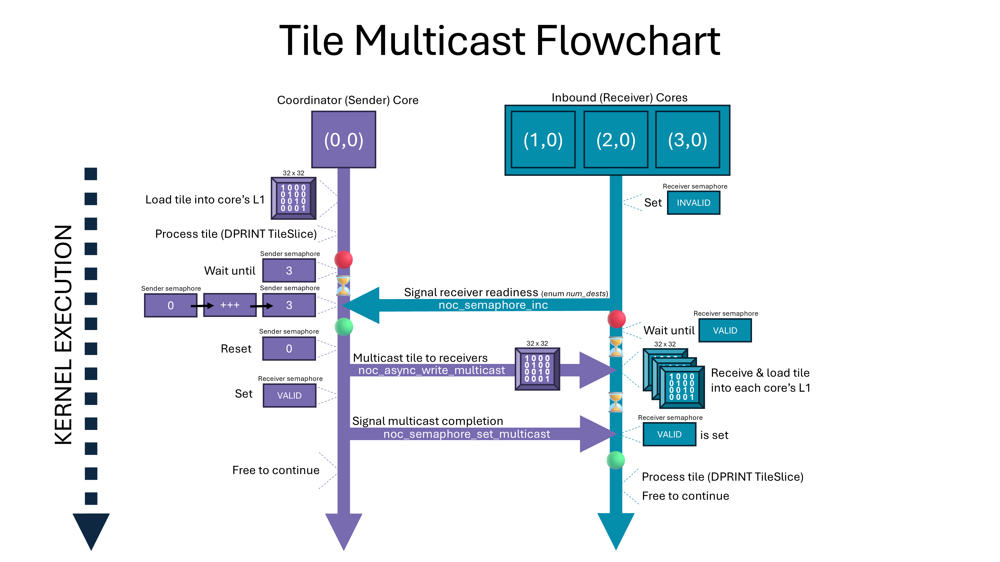

<a name="top"></a>
# **Data Multicasting**

Let's learn how the **Multicast** example orchestrates a single-tile broadcast across multiple Tensix cores using semaphores. **Semaphores** are synchronization primitives that ensure orderly execution across cores. We'll illustrate this by multicasting a basic tile from 1 core to several cores.  Along the way, we'll break down the **host-side** code (`multicast.cpp`) and 2 important **device-side** kernels (`coordinator_kernel.cpp`, `inbound_kernel.cpp`) step-by-step, so you can fully understand this tricky topic!

- [1. Introduction](#1-introduction)
- [2. Host-Side Workflow in `multicast.cpp`](#2-host-side-workflow-in-multicastcpp)
  - [2.1 Defining Logical vs. Physical Core Coordinates](#21-defining-logical-vs-physical-core-coordinates)
  - [2.2 Allocating DRAM Buffers and Storing the Tile](#22-allocating-dram-buffers-and-storing-the-tile)
  - [2.3 Circular Buffers for Inbound and Outbound Data](#23-circular-buffers-for-inbound-and-outbound-data)
  - [2.4 Semaphores for Synchronization](#24-semaphores-for-synchronization)
  - [2.5 Kernel Registration and Argument Setting](#25-kernel-registration-and-argument-setting)
- [3. Coordinator Core Workflow in `coordinator_kernel.cpp`](#3-coordinator-core-workflow-in-coordinator_kernelcpp)
  - [3.1 Parsing Runtime Arguments](#31-parsing-runtime-arguments)
  - [3.2 Buffer Setup and Tile Read from DRAM](#32-buffer-setup-and-tile-read-from-dram)
  - [3.3 DPRINTing a Tile Slice](#33-dprinting-a-tile-slice)
  - [3.4 Preparing Semaphores](#34-preparing-semaphores)
  - [3.5 Waiting for Receiver Readiness](#35-waiting-for-receiver-readiness)
  - [3.6 Multicasting the Tile](#36-multicasting-the-tile)
  - [3.7 Signaling Multicast Completion](#37-signaling-multicast-completion)
  - [3.8 Finalizing the Multicast Operation](#38-finalizing-the-multicast-operation)
- [4. Receiver Core Workflow in `inbound_kernel.cpp`](#4-receiver-core-workflow-in-inbound_kernelcpp)
  - [4.1 Parsing Runtime Arguments](#41-parsing-runtime-arguments)
  - [4.2 Buffer Setup for Receiving Tile](#42-buffer-setup-for-receiving-tile)
  - [4.3 Preparing Semaphores](#43-preparing-semaphores)
  - [4.4 Notifying Coordinator of Readiness](#44-notifying-coordinator-of-readiness)
  - [4.5 Receiving the Multicasted Tile](#45-receiving-the-multicasted-tile)
  - [4.6 DPRINTing a Tile Slice or Whole](#46-dprinting-a-tile-slice-or-whole)
  - [4.7 Completing Tile Processing and Acknowledgment](#47-completing-tile-processing-and-acknowledgment)
- [Conclusion](#conclusion)

---

## **1. Introduction**

In large-scale parallel computations, distributing the same data tile to multiple cores often results in more efficient use of memory bandwidth than letting each core independently fetch from DRAM. METALIUM’s multicasting primitives allow you to designate "sender" cores to read a tile from a memory location, such as DRAM or SRAM, and replicate it to multiple “receiver” cores through the NoC. This example showcases how to do this while enforcing correct ordering with semaphores and local circular buffers on each core.

By the end of this tutorial, you will see how a 32×32 tile is loaded into DRAM, read into one core, and propagated to three other cores in a 1×4 grid layout. Semaphores ensure that the sender knows *exactly* when it's time to send the tile, and no receiver tries to consume garbage or partial tile data.

Below is a flowchart of the entire process.  Feel free to refer back to this as you follow the tutorial.

<p align="center">
  
</p>

---

## **2. Host-Side Workflow in `multicast.cpp`**

### **2.1 Defining Logical vs. Physical Core Coordinates**

To specify which cores will participate, we set a logical range of cores on the host-side. Here, we first define a range of all the cores for creation of memory buffers and semaphores (all cores will have access to these addresses).  Then, we specifically define `{0, 0}` as a single "sender" (coordinator), and `{1, 0} .. {3, 0}` are the receivers.  Pay special attention to the CoreRange function.

```cpp
CoreRange all_cores_logical = CoreRange({0, 0}, {3, 0});
CoreCoord sender_core_logical = {0, 0};
CoreRange receiver_cores_logical = CoreRange({1, 0}, {3, 0});
```

Because METALIUM distinguishes between logical coordinates on host (generally static) and physical coordinates on device (potentially dynamic depending on which generation of HW and/or how many HW devices are used), we map these logical coordinates to the chip’s *physical coordinates*:

```cpp
CoreCoord sender_core_physical =
    device->worker_core_from_logical_core(sender_core_logical);

CoreRange receiver_cores_physical = CoreRange(
    device->worker_core_from_logical_core(receiver_cores_logical.start_coord),
    device->worker_core_from_logical_core(receiver_cores_logical.end_coord)
);
```

By letting the compiler decide the physical core placement, we ensure our code is kept portable, and we will still end up with the correct addresses used for multicasting. You can imagine scaling up kernels to bigger designs with minimal rewriting.

### **2.2 Allocating DRAM Buffers and Storing the Tile**

Previous examples allocate a DRAM buffer for vectors.  We can also let DRAM explicitly hold a 32×32 tile. The following function calls allocate the tile buffer and pass in a basic *identity matrix (1's along the main diagonal & 0's otherwise)* in bfloat16 format:

```cpp
uint32_t dram_bank_id = 0;
auto src0_dram_buffer = MakeBufferBFP16(device, num_tiles, false);
...
std::vector<bfloat16> identity_tile = create_identity_matrix(32, 32, 32);
EnqueueWriteBuffer(cq, src0_dram_buffer, identity_tile.data(), false);
```

Notice we set the `dram_bank_id = 0`.  In this basic DRAM configuration, this happens to be the default bank for our tile, and will be passed later as a runtime argument for our coordinator kernel.  This ensures that when the time comes, the coordinator core can read from `src0_dram_buffer` and retrieve that neat little tile.

### **2.3 Circular Buffers for Inbound and Outbound Data**

Recall that each Tensix core has 32 CBs to choose from.  To handle dataflow on each core, we can declare specific circular buffers of our choosing. Let's settle on indices `c_0` and `c_16` for all cores in the `{0, 0}-{3, 0}` group:

```cpp
auto cb_src0   = MakeCircularBufferBFP16(program, all_cores_logical, tt::CBIndex::c_0, 1);
auto cb_output = MakeCircularBufferBFP16(program, all_cores_logical, tt::CBIndex::c_16, 1);
```

The `c_0` buffer is used to retrieve the tile either from DRAM (core `{0,0}`) or from the multicast stream (cores `{1,0}-{3,0}`). The `c_16` buffer is a placeholder for any subsequent writes or final outputs, which we leave for the user as an exercise.

### **2.4 Semaphores for Synchronization**

Now the fun multicasting setup begins!  Below let's learn how to define two semaphores, `sender` and `receiver`, each initialized to zero:

```cpp
uint32_t sender = CreateSemaphore(program, all_cores_logical, 0);
uint32_t receiver = CreateSemaphore(program, all_cores_logical, 0);
```

In fact, our semaphores can take on non-negative integer values, or they can behave like binary flags with special constants VALID (0xFFFFFFFF) and INVALID (0x0). Since we are working with multiple receiver cores with nonrestrictive access to the tile, we will stick to the former.

> *For the curious*: Internally, `CreateSemaphore(program, core_range, initial_value)` creates a `Semaphore` object that tracks the specified cores and assigns it a unique ID. This ID determines the aligned slot in each core’s L1 memory: `id = 0` maps to the first slot, `id = 1` to the next, and so on. Even if you pass in a single range or a single core, METALIUM's API expands it to the correct internal representation. Each core in that set gets its own local copy of the semaphore in the same address slot, so device-side kernels can reference it using the same address across all cores. Remote cores can also interact with a semaphore on another core by resolving its full NoC address, which we’ll see later.

### **2.5 Kernel Registration and Argument Setting**

We register four device-side kernels:

- **`coordinator_kernel`**: Only on `{0,0}`, it performs DRAM reads and multicasts.
- **`inbound_kernel`**: On `{1,0}, {2,0}, {3,0}`, it listens for an incoming tile and acknowledges it with DPRINT.
- **`outbound_kernel`**: (USER EXERCISE) Also on the receivers, the user can optionally writes data out to a Compute baby-RISCV core or re-broadcast to other Tensix cores.
- **`void_compute_kernel`**: (USER EXERCISE) The user can optionaly write a compute phase to perform some math or transformation on the tile.

For example, creating the coordinator (sender) kernel:

```cpp
auto coordinator_kernel_id = CreateKernel(
    program,
    "coordinator_kernel.cpp",
    sender_core_logical,
    DataMovementConfig{.processor = DataMovementProcessor::RISCV_0, .noc = NOC::RISCV_0_default}
);
```

We then provide runtime arguments so the coordinator knows which DRAM address to read, how many bytes the tile has, the bounding rectangle of receivers to multicast to (x and y coordinates), and the semaphore IDs:

```cpp
SetRuntimeArgs(program, coordinator_kernel_id, sender_core_logical, {
            (uint32_t)(receiver_core_start.x),
            (uint32_t)(receiver_core_start.y),
            (uint32_t)(receiver_core_end.x),
            (uint32_t)(receiver_core_end.y),
            sender, receiver,
            dram_bank_id,
            src0_dram_buffer->address(),
            sizeof(bfloat16) * 32 * 32
        });
```

And vice versa, here are the runtime arguments for the receiver cores:
```cpp
SetRuntimeArgs(program, inbound_kernel_id, receiver_cores_logical, {
            (uint32_t)(sender_core.x),
            (uint32_t)(sender_core.y),
            sender, receiver
        });
```

Now, let's have a look at the device-side kernels.

[Back to top](#top)

---

## **3. Coordinator Core Workflow in `coordinator_kernel.cpp`**
The **coordinator kernel** is responsible for orchestrating the movement of a single **32×32 tile** from **DRAM to L1 memory** and then multicasting it to the designated **receiver cores**. It ensures synchronization using semaphores and provides logging via **DPRINT** for user verification. In this section we'll dissect the *hows* and *whys* of the the multicast flow.

### **3.1 Parsing Runtime Arguments**
Upon launch, the kernel extracts **runtime arguments** passed from the host, which define:
- **Multicast range**: `start_x, start_y, end_x, end_y` → Defines the bounding box of receiving cores.
- **Semaphores**: `sender_addr, receiver_addr` → Control when receivers are ready.
- **DRAM source tile**: `dram_bank_id, src0_dram` → Specifies which DRAM bank and address hold the tile.
- **Tile size**: `single_tile_size` → The total size (in bytes) of a single **32×32** tile.
- **Destinations**: `num_dests` → Used as our sender semaphore's atomic counter, which is reached via enumeration per each receiver core's response (eg. tile aknowledgement).

These arguments are extracted as follows:
```cpp
uint32_t start_x = get_arg_val<uint32_t>(0);
uint32_t start_y = get_arg_val<uint32_t>(1);
uint32_t end_x = get_arg_val<uint32_t>(2);
uint32_t end_y = get_arg_val<uint32_t>(3);
uint32_t sender_addr = get_semaphore(get_arg_val<uint32_t>(4));
uint32_t receiver_addr = get_semaphore(get_arg_val<uint32_t>(5));
uint32_t dram_bank_id = get_arg_val<uint32_t>(6);
uint32_t src0_dram = get_arg_val<uint32_t>(7);
uint32_t single_tile_size = get_arg_val<uint32_t>(8);
uint32_t num_dests = get_arg_val<uint32_t>(9);
```

### **3.2 Buffer Setup and Tile Read from DRAM**
You are likely already familiar with setting up **Circular Buffers (CBs)** for data movement. Here we do the following:
1. **Translate the DRAM tile address** into a NoC-accessible address.
2. **Define the L1 buffer location** for storing the tile.
3. **Asynchronously read** the tile from DRAM to L1.

Namely, for the first step we perform the DRAM addressing using our passed-in `dram_bank_id`:
```cpp
uint64_t src0_dram_noc_addr = get_noc_addr_from_bank_id<true>(dram_bank_id, src0_dram);
```

And continue as usual for the second and third steps:

```cpp
constexpr uint32_t cb_id_in0 = tt::CB::c_in0;   // CB index 0 for incoming tile
constexpr uint32_t cb_id_out0 = tt::CB::c_out0; // CB index 16 for outgoing tile (optional)
uint32_t tile_l1_addr = get_write_ptr(cb_id_in0);

noc_async_read(src0_dram_noc_addr, tile_l1_addr, single_tile_size);
noc_async_read_barrier();
```

### **3.3 DPRINTing a Tile Slice**
To confirm the correctness of the tile read, the coordinator prints a slice of the tile using DPRINT.  Let's break down its usage.

First, let's define a tile "slice" object of the full 32x32 tile.

```cpp
SliceRange sr = SliceRange{
    .h0 = static_cast<uint8_t>(0), .h1 = static_cast<uint8_t>(32), .hs = 8,
    .w0 = 0, .w1 = 32, .ws = 8
};
```

It's quite customizeable.  In this example, we have the following:
- `.h0 = 0` and `.h1 = 32` → sets the tile **height range** (ie. num of rows)
- `.hs = 8` → strides every 8th row
- `.w0 = 0` and `.w1 = 32` → sets the tile **width range** (ie. num of columns)
- `.ws = 8` → strides every 8th column

This results in an **4×4 sampled preview** of the 32×32 tile.  Pretty efficient!  You can change the tile slice to your liking to quickly verify key portions of the data without dumping the entire tile.

To print your slice, call the TileSlice function like so:

```cpp
DPRINT << TileSlice(cb_id_in0, 0, sr, TSLICE_INPUT_CB, TSLICE_WR_PTR, true, false);
```

- **Circular Buffer ID**: `cb_id_in0` → The circular buffer ID where the tile data is stored. NOTE: it is important the circular buffer is not pushed backed yet, otherwise tile DPRINTing will fail, so make sure TileSlice is placed before a `cb_push_back()` call.

- **Tile Index**: `0` → Since we are working with a single tile, both remain zero. However, in a scenario involving multiple tiles, these indices would help you identify the specific tile being printed.

- **SliceRange Object**: `sr` → References the SliceRange object we defined earlier.

- **Circular Buffer Type**: `TSLICE_INPUT_CB` → Indicates which type the CB is. Under the hood, CBs reference a metadata table `unpack_*` or `pack_*`. Our CB here was configured using `unpack_*` settings.

- **Pointer Type**: `TSLICE_WR_PTR` → Samples from the CB’s write pointer. We use this when inspecting our tile that, at this point, was just written into the CB but hasn't been popped yet.

- **Row-Wise Formatting**: `true` → Ensures that DPRINTed output maintains a structured row format. If set to `false`, your tile’s elements will be printed sequentially rather than structured neatly for your eyes. You may want to visualize data in this stream-like format instead of a grid, but in this case we just want to do a quick glance.

- **Untilized Printing**: `false` → Disables untilized printing, meaning the tile is displayed in its standard matrix order rather than being grouped into a face-based format.

> *For the curious: what is a face-based format*?  Basically it's a grouping of elements that respects how the tile was originally packed (e.g., in BlockFP format). Each "face" holds part of the full precision (e.g., one face for the exponent, another for mantissa), and they're shown together in what's called a *facewise view*. This is great for inspecting how tilized data maps to compute layout, but can look less like a traditional 2D matrix.

### **3.4 Preparing Semaphores**

Now that the tile has been loaded and verified, the coordinator kernel must ensure that all receiver cores are ready before proceeding with the multicast. Synchronization is achieved using localized **semaphores**, which coordinate execution between the sender and receivers. The following code sets up the semaphore pointers:

```cpp
volatile tt_l1_ptr uint32_t* sender_addr_ptr = reinterpret_cast<volatile tt_l1_ptr uint32_t*>(sender_addr);
volatile tt_l1_ptr uint32_t* receiver_addr_ptr = reinterpret_cast<volatile tt_l1_ptr uint32_t*>(receiver_addr);
```

Here, `sender_addr_ptr` and `receiver_addr_ptr` are pointers to L1 memory locations where the semaphores reside.

### **3.5 Waiting for Receiver Readiness**

Now, we let the sender core wait for the receivers to give the A-OK and are ready to receive the tile. This is accomplished with:

```cpp
noc_semaphore_wait(sender_addr_ptr, num_dests);
```

This wait function blocks core `{0,0}`'s execution until all receiver cores increment core `{0,0}`'s sender semaphore. Since `num_dests = 3`, the kernel waits for three separate signals (1 from each receiving core) before proceeding with the rest of the kernel code.

Once all receivers are ready, the semaphore is reset:

```cpp
noc_semaphore_set(sender_addr_ptr, 0);
```

Recall that instead of setting it to `INVALID`, we reset it to `0`. Bringing this sender semaphore back to its default state is not only good practice, but we can allow it to take on other atomic counters at some future stage.

So now, we print a debug message to alert you that the multicast operation is ready for launch. At this point, the coordinator has verified that all receivers are ready, so let us commence the multicast!

```cpp
DPRINT << "CORE (" << (uint32_t)get_absolute_logical_x() << "," << (uint32_t)get_absolute_logical_y()
    << "): Tile ready for multicast. I am starting all inbound kernels in cores in given range." << ENDL() << ENDL();
```

### **3.6 Multicasting the Tile**

The actual multicast operation is performed using `noc_async_write_multicast`. First, the NoC multicast address is calculated:

```cpp
uint64_t identity_tile_global_multicast_addr =
    get_noc_multicast_addr(start_x, start_y, end_x, end_y, tile_l1_addr);
```

This function encodes a NoC multicast packet header that represents a *fan-out* to each receiver core in the `(start_x, start_y)` to `(end_x, end_y)` rectangle. The `tile_l1_addr` parameter marks the target address for each receiver, and internally, this call expands the destination range into individual NoC endpoints.

To actually multicast the tile, we call this asynchronous function:

```cpp
noc_async_write_multicast(tile_l1_addr, identity_tile_global_multicast_addr, single_tile_size, num_dests);
```

The tile write is non-blocking, meaning control immediately returns to our coordinator kernel while the hardware handles the tile multicast in the background. It's far more efficient than individually unicast-copying the same tile three times. Perfect for our super fast parallism needs!

>  *For the curious*: Under the hood, `noc_async_write_multicast` schedules a write transaction into the NoC router with a special multicast bit set in the header. METALIUM configures everything for you, so you don’t have to worry about packet routing or other data movement intricacies. Check out `dataflow_api.h` and specifically `noc_parameters.h` for more details.

### **3.7 Signaling Multicast Completion**
Once the tile is multicast, the coordinator can let the receivers know it's safe to begin processing it. We do this by setting the receiver semaphore's value to VALID, then grabbing the global NoC address (just like above) but encoding the receiver semaphore address.  We then perform a multicast semaphore update, like so:

```cpp
*(receiver_addr_ptr) = VALID;
uint64_t validity_global_multicast_addr =
        get_noc_multicast_addr(start_x, start_y, end_x, end_y, receiver_addr);
noc_semaphore_set_multicast(receiver_addr, validity_global_multicast_addr, num_dests);
```
Thus the receiver semaphore becomes VALID across all receiver cores.  Tada! They are free to proceed with processing the tile!

### **3.8 Finalizing the Multicast Operation**

Since NoC transactions are asynchronous, the kernel must ensure that the aforementioned multicast write has completed before continuing more coordinator kernel work. We do so with a simple write barrier call:

```cpp
noc_async_write_barrier();
```

Finally, at this stage, the coordinator has successfully multicasted the tile, synchronized the receivers, and completed its primary responsibilities. From here, it is free to perform additional tasks, such as retrieving more tiles from DRAM, aggregating results from receiver cores, basically whatever you want.

Now, let's see what our receiver cores are doing!

[Back to top](#top)

## **4. Receiver Core Workflow in `inbound_kernel.cpp`**

The inbound kernel is responsible for receiving a 32×32 tile multicast from the coordinator core, verifying its integrity using DPRINT, and acknowledging receipt. It ensures synchronization via semaphores and manages circular buffers (CBs) efficiently. This section details how the receiver core operates before and after the multicast.

### **4.1 Parsing Runtime Arguments**

Runtime arguments are much fewer here since we are simply aknowledging the tile, not performing anything on it. Upon launch, inbound_kernel extracts runtime arguments passed from the host, which define:

- **Sender core coordinates**: `start_x, start_y` → The logical location of the coordinator core.

- **Semaphores**: `sender_addr, receiver_addr` → Used for synchronization between sender and receiver cores.

These arguments are extracted as follows:

```cpp
uint32_t start_x = get_arg_val<uint32_t>(0);
uint32_t start_y = get_arg_val<uint32_t>(1);
uint32_t sender_addr = get_semaphore(get_arg_val<uint32_t>(2));
uint32_t receiver_addr = get_semaphore(get_arg_val<uint32_t>(3));
```

### **4.2 Buffer Setup for Receiving Tile**

We prepare each receiver core with its own circular buffer (CB) for incoming tiles. Notice it is the exact same as in `coordinator_kernel.cpp`, minus the DRAM since we don't need to touch that here!

### **4.3 Preparing Semaphores**

Here is the beginning of the *most critical* part of the code.  Let's get that tile safe and sound!

Let's have a look at our semaphore setup. We define our semaphore addresses as usual:

```cpp
volatile tt_l1_ptr uint32_t* receiver_addr_ptr = reinterpret_cast<volatile tt_l1_ptr uint32_t*>(receiver_addr);
volatile tt_l1_ptr uint32_t* sender_addr_ptr = reinterpret_cast<volatile tt_l1_ptr uint32_t*>(sender_addr);
```

But it's super important that we reserve a slot in our CB for the tile before we do any semaphore work. Without reserving space, the receiver could end up in an asynchronous situation where it tries to get the tile but has nowhere to store it.

```cpp
cb_reserve_back(cb_id_in0, 1);
```

Now, we are ready to prepare the receivers for multicasting.

We invalidate the receiver semaphore, because we need to instruct it to not touch any data yet until we have received the tile safely.

```cpp
noc_semaphore_set(receiver_addr_ptr, INVALID);
```

And now, we compute the NoC address of the sender’s semaphore:

```cpp
uint64_t remote_sender_semaphore_noc_addr = get_noc_addr(start_x, start_y, sender_addr);
```

Recall each receiver core needs to know where to signal readiness to the coordinator (sender) core.

### **4.4 Notifying Coordinator of Readiness**

Before the tile arrives, each receiver signals its readiness by atomically incrementing the coordinator’s semaphore.  Since `num_dests = 3` (three receiver cores), the coordinator will wait until all receivers have signaled their readiness before proceeding with the multicast operation.

A single increment is performed like so:

```cpp
noc_semaphore_inc(remote_sender_semaphore_noc_addr, 1);
```

### **4.5 Receiving the Multicasted Tile**

Each receiver waits for the coordinator to send the tile by monitoring the receiver semaphore:

```cpp
noc_semaphore_wait(receiver_addr_ptr, VALID);
```

This function blocks any further execution until the coordinator has finished multicasting the tile and sets `receiver_addr_ptr = VALID`.  In parallel, the sender should now have successfully performed those tasks.

Abracadabra!  Each receiver core now has the tile in its L1 memory and is ready to process it however you want!

### **4.6 DPRINTing a Tile Slice or Whole**

To verify correctness, receivers can use DPRINT to log a sample of the tile data just like the coordinator. We use the same TileSlice function call.  If you want a full tile view (all 1024 glorious elements) then you can uncomment the following loop:

```cpp
for (uint8_t r = 0; r < 32; ++r) {
    SliceRange sr = SliceRange{.h0 = static_cast<uint8_t>(r), .h1 = static_cast<uint8_t>(r+1), .hs = 1, .w0 = 0, .w1 = 32, .ws = 1};
    DPRINT_DATA0({ DPRINT << TileSlice(cb_id_in0, 0, sr, TSLICE_INPUT_CB, TSLICE_WR_PTR, true, false); });
}
```

### **4.7 Completing Tile Processing and Acknowledgment**

Once you are satisfied with how the tile looks, we can now push it into the CB for optional further processing as you wish:

```cpp
cb_push_back(cb_id_in0, 1);
```

And officially close out the inbound kernel with:

```cpp
DPRINT << "CORE (" << (uint32_t)get_absolute_logical_x() << "," << (uint32_t)get_absolute_logical_y()
    << "): Inbound kernel has processed and acknowledged its tile." << ENDL() << ENDL();
```


## **Conclusion**

In this example, we’ve successfully walked through a basic end-to-end multicasting pipeline in METALIUM. We learned how to efficiently distribute a 32×32 tile across multiple cores with clean semaphore handling and addressing over the NoC. Along the way, we leveraged some new DPRINT syntax to verify a successful multicast. With this foundation in place, let’s explore what’s next.

Notice there are **two void kernels**, a `void_compute_kernel.cpp` identical to the Hello World example, and a void `outbound_kernel.cpp`.  These are placeholders for further work on that tile if you wish.

The real power of multicasting comes in scaling up and out. Here are a few fun ideas to try!

- **Expand the grid.** Try a larger range instead of 1×4, an unconventional grid shape using `CoreRangeSet`, or expand across the entire card's worth of Tensix cores.

- **Selective multicast.** Not all receivers need the same data. Try producing more tiles on host, then modifying `noc_async_write_multicast` logic to selectively multicast different tiles to different cores.

- **Multi-stage multicast.** After receiving a tile, send it to a different core group, adjacent chip (if available), or multiple devices. Send that tile on an epic journey.

- **Modify the tile.** After multicasting, apply a transformation (e.g., scalar, convolution, hyperbolic warping...?!) in a Compute kernel.

>  *For the curious*: In computer vision, *hyperbolic warping* is a technique used to simulate extreme geometric distortions in images or data. It's similar to gravitational lensing, where massive objects like **Black Holes** bend light near their event horizons. Everyday objects can also be distorted through mediums like water or curved glass. Some AI models can be tested for robustness by evaluating how well they recognize these warped objects compared to standard undistorted ones.

[Back to top](#top)
