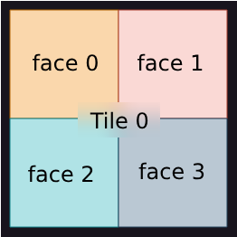

# Tensor and Memory Layouts

# Table of Contents

- [Tensor and Memory Layouts](#tensor-and-memory-layouts)
- [Table of Contents](#table-of-contents)
  - [1. Introduction](#1-introduction)
  - [2. Tensor Attributes](#2-tensor-attributes)
  - [3. Tensor Layout](#3-tensor-layout)
    - [3.1 Row-Major layout](#31-row-major-layout)
    - [3.2 Tiled layout](#32-tiled-layout)
      - [3.2.1 Tile Shapes](#321-tile-shapes)
      - [3.2.2 Faces](#322-faces)
  - [4. Memory Layout](#4-memory-layout)
    - [4.1 Interleaved](#41-interleaved)
      - [4.1.1 User Interface](#411-user-interface)
    - [4.2 Sharding](#42-sharding)

## 1. Introduction
Tensors are stored in a 2D memory space known as a `buffer`. An N-dimensional tensor is represented as a 2D memory object by combining the outer dimensions into a single dimension while keeping the inner dimension as the second dimension. For example, a tensor with dimensions `[1x4x6x8]` will be represented in memory as a `[24x8]` tensor, where 1x4x6 is squeezed into 24. At the most granular level, a block of memory representing a portion of the tensor is referred to as a page.


## 2. Tensor Attributes
For on-device tensors, several attributes describe their characteristics:
- **Tensor Layout**: This indicates how elements within a tensor are mapped to pages in the buffer. The two options are `Row-Major` and `Tiled`.
- **Memory Layout**: This describes how pages are distributed in the device's memory. The two options are `Interleaved` and `Sharded`.
- **Storage**: This refers to the type of memory used to store the tensor on the device. The two options are `L1` and `DRAM`.

## 3. Tensor Layout
This describes how elements within a tensor are mapped to pages, with each page representing the granularity of the tensor in memory. Pages are stored consecutively within a `buffer`.


### 3.1 Row-Major layout
Each row of a 2D tensor corresponds to a single page in our buffer (with a minor exception for sharded tensors, which will be explained later). For example, with a 64x64 tensor, each row is associated with a separate page, resulting in a total of 64 pages in the buffer. This is illustrated in *Figure 1*.


*Figure 1: Row major representation of a 64x64 Tensor.*

To create a tensor with row-major layout, you can pass layout=ttnn.ROW_MAJOR_LAYOUT in most tensor-creation functions:

```python3
ttnn_tensor = ttnn.from_torch(torch_tensor, layout=ttnn.ROW_MAJOR_LAYOUT)
ttnn_tensor = ttnn.full(42, dtype=ttnn.bfloat16, layout=ttnn.ROW_MAJOR_LAYOUT)
```


### 3.2 Tiled layout
In a tiled tensor, pages are represented as 2D tiles, with the default tile size being 32x32, rather than being confined to a single row. For example, with a 64x64 tensor, this results in 4 tiles, each of size 32x32. This is illustrated in *Figure 2*.


*Figure 2: Tiled representation of a 64x64 Tensor. The tile shape is 32x32*


#### 3.2.1 Tile Shapes
The hardware architecture supports tile shapes of `32x32` , `16x32` , `4x32`, `2x32`, `1x32`. **However currently TT-Metalium only supports 32x32, with limited functionality for 16x32 in some ops such as matmul**

#### 3.2.2 Faces
Data inside the tile isn't contiguous. Each tile is split into faces ("sub-tiles"). By default, tile size is 32x32, and face size is 16x16 -- 4 faces per tile and each tile lies one after another contiguously in memory in row-major fashion (i.e., face0->face1->face2->face3 on the picture below)

The reason for using faces is that the matrix engine natively multiplies 16x16 matrices, and tile multiplication is decomposed into multiple face multiplications.




*Figure 3: Default split of tile into faces*

To create a tensor with a tile layout, you can pass layout=ttnn.TILE_LAYOUT in most tensor-creation functions, or change row-major tensor with `ttnn.to_layout`

```python3
ttnn_tensor = ttnn.from_torch(torch_tensor, layout=ttnn.TILE_LAYOUT)
ttnn_tensor = ttnn.full(42, dtype=ttnn.bfloat16, layout=ttnn.TILE_LAYOUT)
ttnn_tensor = ttnn.to_layout(ttnn_rm_tensor, ttnn.TILE_LAYOUT)
```

Also, you can specify tile size:

```python3
ttnn_tensor = ttnn.from_torch(torch_tensor, layout=ttnn.TILE_LAYOUT, tile=ttnn.Tile((16, 32), transpose_tile=True))
```

If transpose_tile==true, then the faces' order is transposed, i.e. they are placed in memory in col-major fashion (face0->face2->face1->face3 on the image above), and values inside faces are also transposed.


## 4. Memory Layout
This describes how the pages of a tensor are distributed across the memory of a device. Device memory is physically partitioned into units called banks. For example, Grayskull chips have 8 DRAM banks, while Wormhole chips have 12 DRAM banks.

Each core also has L1 memory, which is divided into banks. Most worker cores have a single bank, whereas some storage cores have 2 banks.

There are two storage mechanisms that describe how a tensor is mapped to its respective banks: `Interleaved` and `Sharding`.


### 4.1 Interleaved
An individual tensor is represented across several pages, with the distribution of these pages depending on the tensor's memory layout. The image below illustrates storage across multiple memory banks.

In an interleaved tensor layout, pages are allocated in a round-robin fashion across multiple banks. Allocation of a new tensor always begins with the first bank, which can lead to some fragmentation between tensors.

For example in *Figure 3*, consider a tensor requiring four pages (P0 to P3) across three banks (0 through 2). The first three pages are allocated to banks 0 through 2, and the fourth page wraps around and is allocated to bank 0. The next tensor will also start allocation at bank 0.


*Figure 4: Interleaved tensor partitioned over several banks*

#### 4.1.1 User Interface

The Interleaved tensor is the simplest to create and is simply using `ttnn.DRAM_MEMORY_CONFIG` or `ttnn.L1_MEMORY_CONFIG` as the memory config parameter when creating a tensor.

Example creating an Interleaved L1 Device Tensor:
```
torch_a = torch.randn((64, 64), dtype=torch.bfloat16)
a = ttnn.from_torch(torch_a)
a = ttnn.to_device(a, device, memory_config=ttnn.L1_MEMORY_CONFIG)
```


### 4.2 Sharding
Tensor sharding is a technique that allows you to customize how tensor data is distributed across memory banks by dividing it into smaller pieces called shards. This approach improves performance by enhancing data locality and reducing communication overhead. It is fully described [here](../tensor_sharding/tensor_sharding.md).
