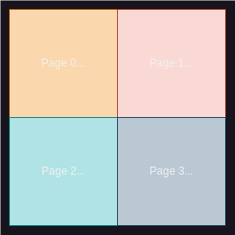

# Tensor and Memory Layouts

# Table of Contents

1. [Introduction](#1-introduction)
2. [Tensor Attributes](#2-tensor-attributes)
3. [Tensor Layout](#3-tensor-layout)
   - [3.1 Row-Major layout](#31-row-major-layout)
   - [3.2 Tiled layout](#32-tiled-layout)
     - [3.2.1 Tile Shapes](#321-tile-shapes)
4. [Memory Layout](#4-memory-layout)
   - [4.1 Interleaved](#41-interleaved)
     - [4.1.1 User Interface](#411-user-interface)
   - [4.2 Sharding](#42-sharding)
     - [4.2.1 User Interface](#421-user-interface)
     - [4.2.2 Other Sharding Parameters and Notes](#422-other-sharding-parameters-and-notes)

## 1. Introduction
Tensors are stored in a 2D memory space known as a `buffer`. An N-dimensional tensor is represented as a 2D memory object by combining the outer dimensions into a single dimension while keeping the inner dimension as the second dimension. For example, a tensor with dimensions `[1x4x6x8]` will be represented in memory as a `[24x8]` tensor, where 1x4x6 is squeezed into 24. At the most granular level, a block of memory representing a portion of the tensor is referred to as a page.


## 2. Tensor Attributes
For on-device tensors, several attributes describe their characteristics:
- **Tensor Layout**: This indicates how elements within a tensor are mapped to pages in the buffer. The two options are `Row-Major` and `Tiled`.
- **Memory Layout**: This describes how pages are distributed in the device's memory. The two options are `Interleaved` and `Sharded`.
- **Storage**: This refers to the type of memory used to store the tensor on the device. The two options are `L1` and `DRAM`.

## 3. Tensor Layout
This describes how elements within a tensor are mapped to pages, with each page representing the granularity of the tensor in memory. Pages are stored consecutively within a `buffer`.


### 3.1 Row-Major layout
Each row of a 2D tensor corresponds to a single page in our buffer (with a minor exception for sharded tensors, which will be explained later). For example, with a 64x64 tensor, each row is associated with a separate page, resulting in a total of 64 pages in the buffer.


### 3.2 Tiled layout
In a tiled tensor, pages are represented as 2D tiles, with the default tile size being 32x32, rather than being confined to a single row. For example, with a 64x64 tensor, this results in 4 tiles, each of size 32x32.



#### 3.2.1 Tile Shapes
The hardware architecture supports tile shapes of `32x32` , `16x32` , `4x32`, `2x32`, `1x32`. **However currently TT-Metallium only supports `32x32`, and other tile shapes will be supported in Q4'2024**


## 4. Memory Layout
This describes how the pages of a tensor are distributed across the memory of a device. Device memory is physically partitioned into units called banks. For example, Grayskull chips have 8 DRAM banks, while Wormhole chips have 12 DRAM banks.

Each core also has L1 memory, which is divided into banks. Most worker cores have a single bank, whereas some storage cores have 2 banks.

There are two storage mechanisms that describe how a tensor is mapped to its respective banks: `Interleaved` and `Sharding`.


### 4.1 Interleaved
An individual tensor is represented across several pages, with the distribution of these pages depending on the tensor's memory layout. The image below illustrates storage across multiple memory banks.

In an interleaved tensor layout, pages are allocated in a round-robin fashion across multiple banks. Allocation of a new tensor always begins with the first bank, which can lead to some fragmentation between tensors.

For example, consider a tensor requiring four pages (P0 to P3) across three banks (0 to 2). The first four pages are allocated to banks 0 through 2, and the fourth page wraps around and is allocated to bank 0. The next tensor will also start allocation at bank 0.


#### 4.1.1 User Interface

The Interleaved tensor is the simplest to create and is simply using `ttnn.DRAM_MEMORY_CONFIG` or `ttnn.L1_MEMORY_CONFIG` as the memory config parameter when creating a tensor.

Example creating an Interleaved L1 Device Tensor:
```
torch_a = torch.randn((64, 64), dtype=torch.bfloat16)
a = ttnn.from_torch(torch_a)
a = ttnn.to_device(a, device, memory_config=ttnn.L1_MEMORY_CONFIG)
```


### 4.2 Sharding

A sharded tensor physically distributes the tensor across the L1 memories of multiple cores in a core grid according to a user-specified distribution, known as a shard specification. The tensor is divided into partitions called shards, with each shard placed in the L1 memory of a specific core.

Unlike interleaved tensors, where pages are distributed across all available L1 banks on the device without explicit mapping, sharding explicitly assigns each shard to specific cores.


This can be illustrated with an example. Consider a tensor with 16 pages, denoted P0 to P15. The left side of the figure shows how the tiled tensor appears in host memory. When the tensor is sharded, each shard is written into the L1 memory of a core.

In the example, Core (0,0) holds pages 0, 1, 4, and 5, while Core (0,1) holds pages 2, 3, 7, and 8. This distribution is defined by a shard specification that includes the shard shape (in this case, 2x2 pages) and the core grid where the shards are placed (a 2x2 core grid).


The main purpose of sharding is to keep data local. While an interleaved L1 tensor can also be distributed across banks in multiple cores, sharding offers a more explicit mapping of pages. This allows us to ensure that each core works on a specific portion of memory that is kept local within its respective L1 memory.

#### 4.2.1 User Interface
The sharded tensor requires more detailed memory config with the shard shape, core grid, shard strategy.

The following is example code to specify the above example:
```
torch_a = torch.randn((64, 64), dtype=torch.bfloat16)
a = ttnn.from_torch(torch_a)
sharded_memory_config = ttnn.create_sharded_memory_config(
            32x32, core_grid=ttnn.CoreGrid(y=2, x=2), strategy=ttnn.ShardStrategy.BLOCK, use_height_and_width_as_shard_shape=True
        )
a = ttnn.to_device(a, device, memory_config=sharded_memory_config)
```

#### 4.2.2 Other Sharding Parameters And Notes
Other sharding parameters include:

- **Sharding Strategy**: Describes how the tensor is split when distributed across the core grid. The available methods are:
  - `HEIGHT`: Each shard represents entire rows of the tensor (i.e., the shard width is equivalent to the tensor width).
  - `WIDTH`: Each shard represents entire columns of the tensor.
  - `BLOCK`: Each shard is neither an entire row nor an entire column, similar to the example above.

- **Shard Orientation**: Describes the order in which shards are distributed to the cores in the core grid. This can be either `ROW-MAJOR` or `COLUMN-MAJOR`.

- For tensors with a `Row-Major` layout, each page typically represents a single row of the tensor. However, for sharded tensors, the width of each page matches the width of the shard. For tiled tensors, the page shape remains the same as the tile shape (e.g., 32x32).

 
