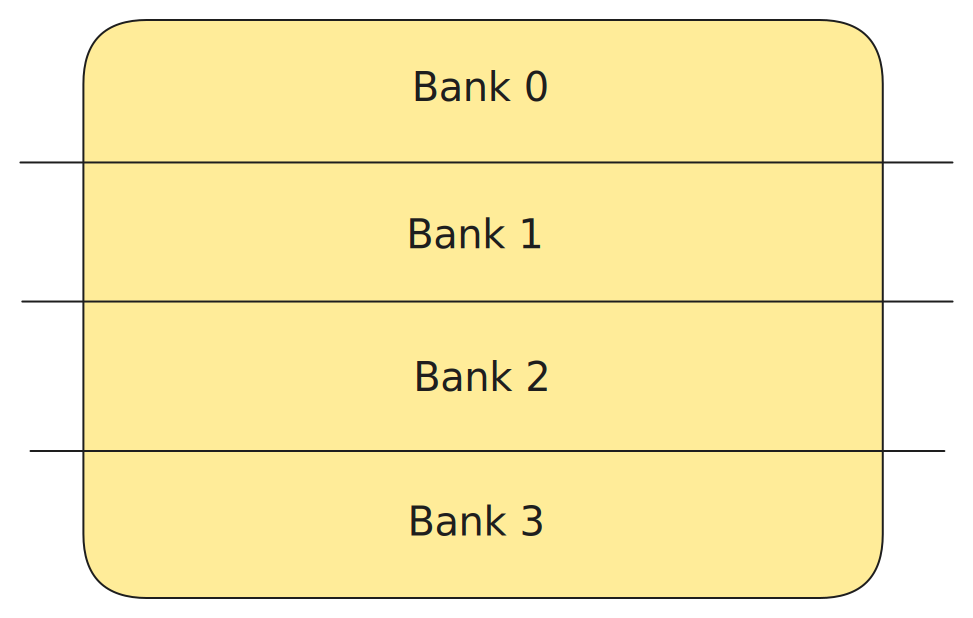
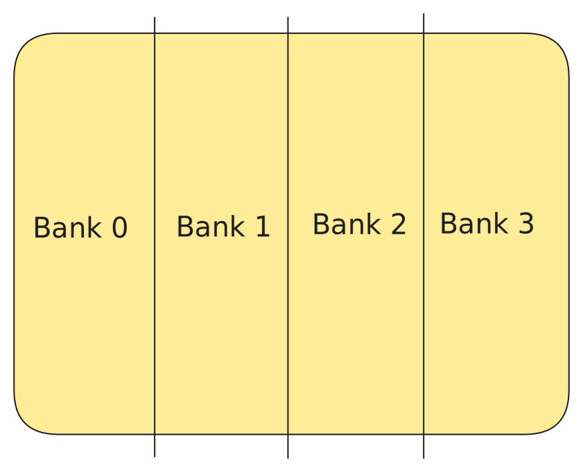
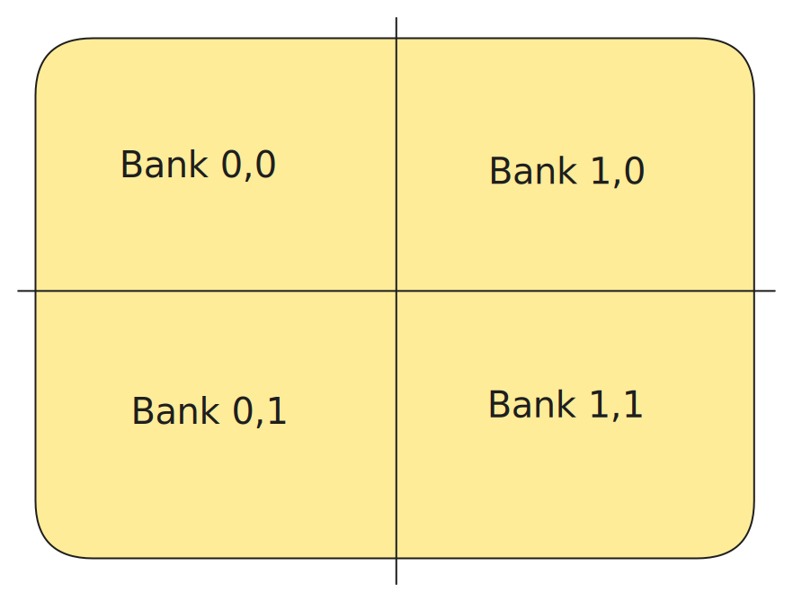

# Tensor Sharding

# Table of Contents
- [Tensor Sharding](#tensor-sharding)
- [Table of Contents](#table-of-contents)
  - [Introduction](#introduction)
  - [2D Sharding](#2d-sharding)
    - [Height Sharding](#height-sharding)
    - [Width Sharding](#width-sharding)
    - [Block Sharding](#block-sharding)
  - [ND Sharding (experimental)](#nd-sharding-experimental)

## Introduction
Tensor sharding is the process of dividing a large tensor into smaller, non-overlapping pieces—called shards—which are then distributed across multiple memory banks. This technique is essential for achieving high performance on Tenstorrent devices.

The choice of sharding strategy—such as height, width, block, or ND (N-dimensional) sharding—directly impacts both performance and communication overhead. Well-designed sharding schemes minimize data movement between cores and maximize data locality, leading to more efficient computation.

By default, tensors use an interleaved (non-sharded) memory layout: data is split into pages and distributed evenly across all available memory banks in a round-robin fashion. However, selecting a sharded layout tailored to the specific operation can significantly improve performance by enhancing data locality and reducing inter-core communication.

## 2D Sharding
2D sharding encompasses height, width, and block sharding strategies. In this approach, all higher dimensions of a tensor are combined into the height dimension, effectively reshaping the tensor into a 2D form (height × width) before dividing it into shards.

### Height Sharding
Height sharding divides a tensor along its height dimension (all dimensions except the last one are collapsed into height). Each shard contains consecutive rows of the original tensor, and these shards are distributed across the specified memory banks. This strategy is particularly effective for operations that process data row-wise.



**Usage Example:**
```python
import ttnn
import torch

# Define core ranges (8 cores in a 2x4 grid)
core_ranges = ttnn.CoreRangeSet({
    ttnn.CoreRange(ttnn.CoreCoord(0, 0), ttnn.CoreCoord(1, 3))
})

# Create a tensor specification with height sharding
tensor_spec = ttnn.TensorSpec(
    shape=(2, 128, 256),  # Batch=2, Height=128, Width=256
    dtype=ttnn.float32,
    layout=ttnn.TILE_LAYOUT,
    buffer_type=ttnn.BufferType.L1
).height_sharded(core_ranges)

# Create tensor from PyTorch tensor (using shape from spec)
torch_tensor = torch.randn(tuple(tensor_spec.shape))
tt_tensor = ttnn.from_torch(torch_tensor, spec=tensor_spec, device=device)

# Each core gets: 32 rows × 256 columns (total height 128 * 2 / 8 cores = 32 rows per core)
```

<details>
<summary><strong>Advanced API - Custom Height Sharding Configuration</strong></summary>

For fine-grained control over height sharding, you can specify the exact shard shape and memory configuration directly:

```python
import ttnn
import torch

# Advanced height sharding with custom shard shape
memory_config = ttnn.MemoryConfig(
    ttnn.TensorMemoryLayout.HEIGHT_SHARDED,
    ttnn.BufferType.L1,
    ttnn.ShardSpec(
        grid=ttnn.num_cores_to_corerangeset(
            target_num_cores=8,
            grid_size=[8, 7],
            row_wise=True,
        ),  # grid: (x=0, y=0), (1, 0), ... (x=7, y=0)
        # Note: the W dimension of shard should be equal to the W dimension of the tensor
        shard_shape=[64, 512],  # Each shard: 64 rows x 512 columns
        shard_orientation=ttnn.ShardOrientation.ROW_MAJOR,
    ),
)

# Create tensor with advanced height sharding configuration
torch_tensor = torch.randn(512, 512)
height_sharded_tensor = ttnn.from_torch(
    torch_tensor, dtype=ttnn.float32, device=device, layout=ttnn.TILE_LAYOUT, memory_config=memory_config)
```

> **Note:** Ensure that the tensor dimensions are compatible with the specified shard shapes and core ranges.

</details>

### Width Sharding
Width sharding divides a tensor along its width dimension (the last dimension), while all higher dimensions are collapsed into height. Each shard contains consecutive columns of the original tensor, and these shards are distributed across the specified memory banks. This strategy is optimal for operations that process data column-wise.



**Usage Example:**
```python
import ttnn
import torch

# Define core ranges (4 cores in a 1x4 grid)
core_ranges = ttnn.CoreRangeSet({
    ttnn.CoreRange(ttnn.CoreCoord(0, 0), ttnn.CoreCoord(0, 3))
})

# Create a tensor specification with width sharding
tensor_spec = ttnn.TensorSpec(
    shape=(1, 64, 512),  # Batch=1, Height=64, Width=512
    dtype=ttnn.float32,
    layout=ttnn.TILE_LAYOUT,
    buffer_type=ttnn.BufferType.L1
).width_sharded(core_ranges)

# Create tensor from PyTorch tensor (using shape from spec)
torch_tensor = torch.randn(tuple(tensor_spec.shape))
tt_tensor = ttnn.from_torch(torch_tensor, spec=tensor_spec, device=device)

# Each core gets: 64 rows × 128 columns (total width 512 / 4 cores = 128 columns per core)
```

<details>
<summary><strong>Advanced API - Custom Width Sharding Configuration</strong></summary>

For fine-grained control over width sharding, you can specify the exact shard shape and memory configuration directly:

```python
import ttnn
import torch

# Advanced width sharding with custom configuration
memory_config = ttnn.MemoryConfig(
    ttnn.TensorMemoryLayout.WIDTH_SHARDED,
    ttnn.BufferType.L1,
    ttnn.ShardSpec(
        grid=ttnn.CoreRangeSet({
            ttnn.CoreRange(ttnn.CoreCoord(0, 0), ttnn.CoreCoord(3, 1))
        }),
        # Note: the H dimension of shard should be equal to the H dimension of the tensor
        shard_shape=[128, 64],  # Each shard: 128 rows x 64 columns
        shard_orientation=ttnn.ShardOrientation.ROW_MAJOR,
    ),
)

# Create tensor with advanced width sharding configuration
torch_tensor = torch.randn(128, 512)
width_sharded_tensor = ttnn.from_torch(
    torch_tensor,
    dtype=ttnn.float32,
    device=device,
    layout=ttnn.TILE_LAYOUT,
    memory_config=memory_config
)
```

> **Note:** Ensure that the tensor dimensions are compatible with the specified shard shapes and core ranges.

</details>

### Block Sharding
Block sharding divides a tensor into a 2D grid of rectangular blocks, where each block contains a contiguous region spanning both height and width dimensions. The tensor is split along both the height and width axes simultaneously, creating a grid pattern of shards. These shards are then distributed in a 1-to-1 mapping onto a corresponding 2D grid of memory banks, where each memory bank receives exactly one block.



For example, if you have a tensor of shape (H, W) and a 2×2 core grid, the tensor is divided into 4 blocks arranged in a 2×2 pattern. Memory bank (x=0,y=0) gets the top-left block, memory bank (x=1,y=0) gets the top-right block, memory bank (x=0,y=1) gets the bottom-left block, and memory bank (x=1,y=1) gets the bottom-right block. This creates optimal data locality since each memory bank operates on a spatially coherent region of the original tensor.

**Usage Example:**
```python
import ttnn
import torch

# Define core ranges (16 cores in a 4x4 grid)
core_ranges = ttnn.CoreRangeSet({
    ttnn.CoreRange(ttnn.CoreCoord(0, 0), ttnn.CoreCoord(3, 3))
})

# Create a tensor specification with block sharding
tensor_spec = ttnn.TensorSpec(
    shape=(1, 256, 256),  # Batch=1, Height=256, Width=256
    dtype=ttnn.float32,
    layout=ttnn.TILE_LAYOUT,
    buffer_type=ttnn.BufferType.L1
).block_sharded(core_ranges)

# Create tensor from PyTorch tensor (using shape from spec)
torch_tensor = torch.randn(tuple(tensor_spec.shape))
tt_tensor = ttnn.from_torch(torch_tensor, spec=tensor_spec, device=device)

# Each core gets: 64 rows × 64 columns (256/4 = 64 per dimension in 4x4 core grid)
```

<details>
<summary><strong>Advanced API - Custom Block Sharding Configuration</strong></summary>

For fine-grained control over block sharding, you can specify the exact shard shape and memory configuration directly:

```python
import ttnn
import torch

# Advanced block sharding with custom physical shard shape
memory_config = ttnn.MemoryConfig(
    ttnn.TensorMemoryLayout.BLOCK_SHARDED,
    ttnn.BufferType.L1,
    ttnn.ShardSpec(
        grid=ttnn.CoreRangeSet({
            ttnn.CoreRange(ttnn.CoreCoord(0, 0), ttnn.CoreCoord(3, 3))
        }),
        shard_shape=[64, 64],
        shard_orientation=ttnn.ShardOrientation.ROW_MAJOR
    ),
)

# Create tensor with advanced block sharding configuration
torch_tensor = torch.randn(192, 192)
block_sharded_tensor = ttnn.from_torch(
    torch_tensor,
    dtype=ttnn.float32,
    device=device,
    layout=ttnn.TILE_LAYOUT,
    memory_config=memory_config
)
```

> **Note:** Ensure that the tensor dimensions are compatible with the specified shard shapes and core ranges.

</details>


## ND Sharding (experimental)

ND (N-dimensional) sharding extends tensor sharding beyond the traditional 2D approach by distributing data across multiple tensor dimensions simultaneously. Unlike 2D sharding which collapses higher dimensions into height, ND sharding preserves the original tensor dimensionality and can shard across any combination of dimensions (batch, sequence length, channels, etc.).

ND sharding breaks a tensor into smaller pieces by choosing which dimensions to split. Think of it like cutting a 3D block of data: you can choose to slice it horizontally, vertically, depth-wise, or any combination of these directions. The resulting pieces are distributed across the specified memory banks, and unlike 2D sharding where each memory bank gets exactly one piece, ND sharding can put multiple pieces onto the same memory bank. This flexibility allows you to optimize how data is arranged based on what your specific operation needs to do efficiently.

**Visual Examples:**

The following examples demonstrate how ND sharding distributes 3D tensor data across a 2D grid of cores. You can observe these and other examples using an [interactive visualizer](https://supermina999.github.io/sharding-visual/).

**Example 1: Simple 3D Sharding**
- Tensor shape: (4, 4, 4)
- Shard shape: (2, 2, 2)
- Core grid: 2×2

<p float="left">


</p>

This shows how a 4×4×4 tensor is divided into eight 2×2×2 shards, which are then distributed across 4 memory banks in round-robin order. Each memory bank receives 2 shards.

**Example 2: Uneven Shard Distribution**
- Tensor shape: (4, 4, 3)
- Shard shape: (2, 2, 3)
- Core grid: 1×3

<p float="left">


</p>

This demonstrates how a 4×4×3 tensor is split into four 2×2×3 shards distributed across 3 memory banks. Memory bank 0 gets 2 shards, while memory banks 1 and 2 each get 1 shard, showing the round-robin distribution pattern.

**Example 3: Single Dimension Sharding**
- Tensor shape: (3, 6, 4)
- Shard shape: (3, 2, 4)
- Core grid: 2×2

<p float="left">


</p>

Here, only the middle dimension is sharded, which creates three 3×2×4 shards. This shows how ND sharding can selectively shard specific dimensions while keeping others intact.

**Example 4: Small Core Grid with Many Shards**
- Tensor shape: (4, 6, 3)
- Shard shape: (2, 2, 3)
- Core grid: 1×2

<p float="left">


</p>

A 4×6×3 tensor creates six 2×2×3 shards distributed across only 2 memory banks. Each memory bank receives 3 shards, illustrating how ND sharding efficiently handles cases where there are more shards than memory banks.

**Usage Examples:**

```python
import ttnn
import torch

# Define core ranges for ND sharding (8 cores in 2x4 grid)
core_ranges = ttnn.CoreRangeSet({
    ttnn.CoreRange(ttnn.CoreCoord(0, 0), ttnn.CoreCoord(1, 3))
})

# Example 1: Batch + Sequence sharding (preserve feature dimension)
# Shard across batch (dim 0) and sequence (dim 1), keep features (dim 2) intact
nd_spec_batch_seq = ttnn.TensorSpec(
    shape=(4, 512, 768),  # Batch=4, SeqLen=512, Features=768
    dtype=ttnn.float32,
    layout=ttnn.TILE_LAYOUT,
    buffer_type=ttnn.BufferType.L1
).sharded_across_dims([0, 1], core_ranges)

torch_tensor = torch.randn(tuple(nd_spec_batch_seq.shape))
batch_seq_sharded = ttnn.from_torch(torch_tensor, spec=nd_spec_batch_seq, device=device)

# Example 2: Feature dimension sharding only
# Shard across the feature dimension while preserving batch and sequence locality
nd_spec_features = ttnn.TensorSpec(
    shape=(2, 256, 1024),  # Batch=2, SeqLen=256, Features=1024
    dtype=ttnn.float32,
    layout=ttnn.TILE_LAYOUT,
    buffer_type=ttnn.BufferType.L1
).sharded_across_dims([2], core_ranges)

torch_tensor = torch.randn(tuple(nd_spec_features.shape))
feature_sharded = ttnn.from_torch(torch_tensor, spec=nd_spec_features, device=device)
```

> **Note:** ND sharding is experimental and may not be supported by certain operations.

<details>
<summary><strong>Advanced API - Custom ND Shard Specification</strong></summary>

```python
# Example 3: Advanced ND sharding with custom shard specification
# Using NdShardSpec for fine-grained control
nd_memory_config = ttnn.MemoryConfig(
    ttnn.TensorMemoryLayout.HEIGHT_SHARDED,
    ttnn.BufferType.L1,
    ttnn.NdShardSpec(
        shard_shape=[1, 1, 64, 128],  # Shard size in each dimension
        core_ranges=core_ranges
    ),
)

torch_tensor = torch.randn(2, 4, 256, 512)
advanced_nd_sharded = ttnn.from_torch(
    torch_tensor,
    dtype=ttnn.float32,
    device=device,
    layout=ttnn.TILE_LAYOUT,
    memory_config=nd_memory_config
)
```

> **Note:** When using `NdShardSpec`, ensure that the tensor dimensions are compatible with the specified shard shapes and core ranges.

</details>
