# Certified Matmul Registry for TTNN

**Status:** Draft RFC for design review  
**Target:** `tt-metal` / TTNN, with `tt-matmul-codegen` as the evidence and generation control plane  
**Last updated:** 2026-08-24  
**TT-Metal audit baseline:** upstream `main` `1a0b226441fe2458b77fc5cf2ae10e273b699538`  
**Intended landing:** RFC/design review first; implementation in small, independently reversible PRs

## Executive summary

We should add a certified matmul registry, but we should not put sweep JSON parsing, NFS access, or mutable tuning state in the TTNN hot path.

The recommended architecture is:

1. `tt-matmul-codegen` discovers candidates and retains canonical, immutable measurement evidence.
2. A separate confirmation campaign replays only finalists and their exact production baseline.
3. A fail-closed promotion tool converts qualified evidence into a compact, deterministic registry lockfile.
4. An offline generator emits a typed C++ table for TT-Metal.
5. TTNN performs allocation-free exact lookup and materializes native program and compute-kernel configs.
6. A miss, disabled registry, or unsupported request follows the unchanged existing selector.

This registry is an exact certified replay system, not by itself a performance predictor. A separate offline predictor may use the evidence bank to rank unmeasured candidates and decide what to measure next, but a prediction never becomes a runtime entry without silicon measurement and confirmation. “Across all shapes and knobs” is meaningful only for a versioned, finite domain whose shape set, axes, legality rules, and omissions are explicit; unknown shapes, semantics, revisions, or hardware must abstain.

The precedence rule is normative:

```text
explicit caller program/compute config
    > certified registry exact match
    > existing model-specific policy (where one already exists)
    > existing TTNN auto-selection
```

The first production canary should be one narrowly supported generic one-chip `ttnn.matmul` cell, using the same native plumbing intended for long-term use. Wan minimal matmul, fused AGMM, sparse matmul, and distributed orchestration follow through distinct operation adapters; a result from one domain must never be replayed in another.

This is not a proposal to deploy the currently harvested fleet output directly. The broad sweeps are discovery evidence. Most use five timed calls; even the current converter's 60-call/three-session minimum is below the stronger production confirmation policy proposed here. Current DP and TP-N runs are bare-TTNN baselines rather than tuned registries.

## Decision record

The following decisions are part of this proposal and should be reviewed explicitly.

| ID | Decision | Rationale |
|---|---|---|
| D1 | Keep evidence/promotion in `tt-matmul-codegen`; keep runtime selection in TT-Metal. | TTNN must not depend on the Python package or raw sweep artifacts. |
| D2 | Ship a compact lockfile and generate typed C++ in the TT-Metal build with a pinned in-tree emitter; no runtime JSON or file I/O. | Matches TT-Metal generation patterns while keeping Python, NFS, and mutable state out of dispatch. |
| D3 | Exact matches only; no nearest-shape, nearest-revision, or inferred semantics. | A fast config under different layout, fusion, topology, or dtype can be wrong. |
| D4 | Registry selection returns the complete program config and compute-kernel config as one recipe. | Geometry and CKC were measured together and cannot be independently mixed. |
| D5 | Apply the registry only when the caller supplies no program config, compute config, or user core grid. | Explicit user intent always wins; partial overrides are a distinct request. |
| D6 | Start `OFF`, then `SHADOW`, then `ON` for a narrow allowlist. | Gives a reversible deployment and evidence about real hit/miss behavior. |
| D7 | Separate registry domains by native operation. | Generic dense, fused AGMM, sparse, and distributed strategies do not share replay types or semantics. |
| D8 | Require at least ten independent paired sessions with 20 blocks each, median speedup at least 1.03x, and a deterministic session-level bootstrap lower bound above 1.00x. | Avoids treating correlated calls as independent evidence; the lower bound is an operational stability gate, not a universal statistical claim. |
| D9 | Keep full observations in the evidence bank, not the runtime artifact. | Current schema-v1 registries retain all observations and do not scale. |
| D10 | Bind entries to a measured compatibility digest, not a raw Git SHA used as a runtime lookup axis. | Embedding a registry changes the repository commit and otherwise creates a self-reference. |
| D11 | Never retry the same operation with fallback after a device dispatch failure. | The device may already be dirty; circuit-break future registry use and propagate normal recovery. |
| D12 | Version the production baseline policy per domain and require one baseline recipe for all competitors in a workload. | Generic auto and model production tables are not interchangeable comparison targets. |
| D13 | Require confirmation on at least two physical devices for every enabled hardware stepping/capability class. | Repeated sessions on one serial number do not establish class-wide portability. |
| D14 | Give every public API an explicit operation domain; never infer it from the shared `bound_matmul` helper. | `matmul`, `linear`, and `addmm` share machinery but require disjoint keys and evidence. |
| D15 | Preserve TTNN's default reflected program-cache hash; never add a registry-specific cache hash. | Final normalized native attributes and tensor arguments already define compile identity correctly. |
| D16 | Keep prediction offline and advisory; only measured, confirmed recipes enter the native registry. | Ranking uncertainty must never become an unverified dispatch decision. |
| D17 | Define prediction coverage as a versioned closed world with every axis classified. | Literal “all shapes/all knobs” is unbounded and becomes false whenever a new shape, knob, or implementation lands. |
| D18 | Validate on held-out shape families, knob combinations, devices, sessions, and later software cohorts—not random rows. | Retry rows and neighboring configs leak heavily under ordinary random splits. |
| D19 | Require calibrated uncertainty and explicit abstention. | A robust system must say “measure this” when the request is out of distribution or the ranking is ambiguous. |
| D20 | Optimize and gate selection regret/top-K recall, not point-error alone. | The useful prediction is which candidates deserve silicon budget; a numerically close latency model can still rank the winner incorrectly. |

## Goals

- Select a certified matmul recipe using facts known at the call site.
- Preserve exact numerical, tensor, layout, sharding, topology, and fusion semantics.
- Replay both native program config and compute-kernel config.
- Add no filesystem I/O, JSON parsing, Python dependency, or heap allocation in the registry lookup itself.
- Preserve existing behavior exactly for misses, disabled mode, unsupported operations, and explicit configs.
- Make every deployed entry traceable to immutable canonical evidence and a deterministic promotion decision.
- Support a startup/deployment kill switch, an internal atomic domain circuit breaker, and a reviewed binary/data rollback path without changing callers.
- Provide a path for generic dense matmul, Wan fused AGMM, BMM, and sparse matmul without conflating them.
- Build an offline, auditable candidate-ranking system that reduces silicon measurements inside a declared domain while quantifying coverage, regret, and abstention.

## Non-goals

- Online autotuning in TTNN.
- Approximate or nearest-neighbor lookup.
- Universal prediction over arbitrary integer M/K/N, future knobs, unseen operations, or unqualified hardware.
- Allowing a model prediction, legality probability, or confidence score to bypass deterministic legality, PCC, silicon measurement, or confirmation.
- Turning discovery results into production entries without confirmation.
- Treating DP or TP-N orchestration as program-config tuning when the measured operation used bare `ttnn.matmul` defaults.
- Replacing explicit user program configs.
- Loading arbitrary registries supplied over NFS.
- Silently reinterpreting legacy winner summaries as canonical evidence.
- Promoting DRAM-sharded configs before padding and input/output memory shard specs have lossless typed replay.

## Current state

### What already exists in `tt-matmul-codegen`

The codegen repository already contains most of the control-plane foundation:

- `tt_matmul_codegen/keys.py` defines strict schema-v2 exact keys covering software, hardware/topology, shapes, dtypes, semantics, sharding/placement, and compute settings.
- `tt_matmul_codegen/registry.py` defines registry entries and complete replay recipes with atomic JSON save/load.
- `tt_matmul_codegen/runtime_selector.py` builds an immutable exact-workload index and returns explicit fallback reasons.
- `tt_matmul_codegen/registry_convert.py` requires verified PCC, device-profiler timing, 60 calls, three sessions, 20 calls per session, stable device IDs, and complete replay.
- `tt_matmul_codegen/offline_registry.py` groups retries, checks paired canonical baselines, enforces a speedup floor, emits deterministic rejection decisions, and chooses one portfolio winner.
- Canonical schema-v2 run bundles and their content hashes are already the authoritative evidence; compatibility CSV is only a derived view.

These pieces should be extended rather than replaced.

### What does not exist yet

- TT-Metal has no consumer of `RuntimePortfolioSelector`.
- TT-DiT/Wan still uses model-specific registered tables and heuristic fallback policy.
- TTNN does not have a native registry key, compact registry entry, native replay adapter, or lookup telemetry.
- The current runtime artifact embeds all retained latency samples and profiler observations per entry.
- Registry content hashing is optional in the Python selector.
- The current codegen replay types are not lossless relative to current native TTNN config types.
- The codegen default promotion floor is 1.01x, while the existing project plan specifies 1.03x plus a confidence bound; the confidence rule is not implemented.
- No checked-in `results/autotune/*.json` file is a deployable `artifact_kind: runtime_registry`; those files are discovery/legacy reports.
- There is no trained cross-shape performance model, calibrated uncertainty estimator, model artifact schema, or held-out prediction benchmark. `scripts/search_smart.py` performs random/genetic/coordinate black-box search over one explicit candidate space and can replay strategies against a measured CSV; it does not predict a new shape from other shapes.
- The current BH32 “qualified defaults” search fixes one 12x9 grid, one CKC, and one fabric tuple. The “current emitted” space has 16 heuristic grids, five CKCs, and one fabric tuple. Even `agmm_bh32_exhaustive_v1.json` contains four selected grids, the 32-value CKC cross-product, and one fabric tuple; its name is not proof of mathematical all-knob closure.

### Evidence-readiness snapshot

This is a dated planning snapshot, not a runtime contract. It was audited at codegen commit `602aeee988402ce187ebd45e75b2c9b1babefd20` from the four named BH1 banks and the `bh32-agmm72-v2-20260822b`, `bh32-agmm72-v2-20260822d-*`, and `bh32-dense75-dp-tpn-v2-*` campaign series. Before relying on the counts, replace those series names with an exact path/hash allowlist and a generated report digest.

- The canonical one-chip banks contain 1,044 terminal-complete units, but terminal completion is not equivalent to useful timing coverage. Basic gap repair contains 29 unique tuned `OK` candidates and batched/fused contains 2,616. Two DRAM banks contain 9,216 rows and every row is `SKIP` because the tested shapes/dtypes violate that implementation's constraints.
- The current BH32 75-shape/three-dtype scope contains 225 semantic cells and 58,056 AGMM identities: 57,891 tuned candidates and 165 baselines. Of those cells, 165 are comparison-eligible, 54 have timing but no production reference, and six are empty by legality.
- The currently launched onechip72 AGMM subset contains 17,272 logical shards. At the audit snapshot, 7,942 were complete; 31 of 159 config families were complete, 51 partial, and 77 untouched. Observed tuned outcomes were 20,779 `OK`, 37 `FAIL`, and one `PCC_FAIL`, with 82 baseline/workload cells touched. That is roughly 43.5% of the planned tuned identities but only 82 touched workload cells; the latter, not 20,817 correlated candidate outcomes, is the relevant order of sample size for cross-shape validation.
- Those AGMM discovery configs use five measured calls. They can nominate finalists but cannot satisfy either the current 60-call/three-session converter floor or this proposal's stronger production policy.
- The BH32 DP/TP-N matrix contains 150 unsharded shape configs. At the snapshot, 26 were complete—10 DP and 16 TP-N—for 78 baseline `OK` cells. Each config emits literal baseline candidates and zero tuned candidates. These runs characterize TTNN auto-selection; they cannot create registry entries.
- Exact public-API coverage is absent for `ttnn.addmm`. The committed DeepSeek MoE study describes a `ttnn.linear(transpose_b=True)` production call, but all 447 CSV rows identify the measured operation as `op_type=matmul`; they cover six M/K/N cells across BF16/BFP8/BFP4, with 18 separately verified shape/dtype rows. This is useful kernel-search evidence, not an end-to-end `linear` certificate. Neither source may populate a `linear` or `addmm` runtime domain without new exact-operation discovery and confirmation runs.

The generator must derive denominators from checked planning contracts and expected candidate/shard digests, never from whichever CSV rows happen to exist.

Prediction readiness is currently **research-only**. The observed corpus can bootstrap feature engineering and within-landscape search experiments, but it cannot validate cross-shape robustness: the BH32 qualified campaign fixes most non-geometry axes, the broader campaign is incomplete and adaptively observed, many families lack comparable baselines, and there is no held-out set of fully measured landscapes spanning shape families and knob boundaries. No current result supports an “all shapes/all knobs” accuracy claim.

### Native TTNN integration seams

The current dense matmul path is split across:

- `ttnn/cpp/ttnn/operations/matmul/device/config/matmul_program_config.cpp::get_program_config`, where an explicit `program_config` wins and the heuristic otherwise generates one;
- `ttnn/cpp/ttnn/operations/matmul/device/matmul_device_operation.cpp::create_matmul_attributes`, where the compute-kernel config is finalized;
- the high-level matmul path, which asks for a program config early to decide whether transposes must be materialized;
- primitive entry points, which normalize and validate the selected config before launch and include it in operation/program-cache identity.

Hooking only `get_program_config` is insufficient because a certified replay selects both program config and CKC. The integration must resolve both before attribute finalization and before the high-level transpose decision.

There are three additional native constraints:

- `bound_matmul` is a private shared helper used by public `matmul`, `linear`, and `addmm`; placing lookup there without an explicit call-origin token would silently widen v1.
- The current high-level helper computes a program config for transpose routing, discards it, and later creates attributes that select again. V1 must not add repeated registry lookup: an `On` hit is injected once into a local parameter copy so every existing phase sees the same program config and CKC. `Off` and `Shadow` retain the legacy selection sequence until a separate equivalence-proven cleanup.
- constraint-query capture currently copies only `MatmulParams.program_config`. A certified recipe also owns CKC, so capture/replay must carry both or the registry must remain ineligible for that path.

## Architecture

```mermaid
flowchart LR
    A[Bounded discovery sweeps] --> B[Canonical evidence bank]
    B --> P[Offline prediction + uncertainty]
    P --> C[Measured finalist selection]
    B --> C
    C --> D[10-session paired confirmation]
    D --> E[Fail-closed promotion]
    E --> F[Compact registry.lock.json]
    F --> G[Deterministic C++ generator]
    G --> H[Typed constexpr registry table]
    H --> I[Operation-specific exact lookup]
    I -->|hit| J[Native program config + CKC]
    I -->|miss/disabled| K[Existing selector]
    J --> L[Existing normalization and validators]
    K --> L
```



The control plane owns evidence, statistics, policy, and generation. The runtime data plane owns only typed keys, compact entries, lookup, materialization, and bounded observability.

Prediction remains entirely in the control plane. It may prioritize measurements but cannot write the runtime lock directly.

## Prediction and coverage contract

The design can deliver robust **selective ranking** over a declared corpus; it cannot honestly deliver universal predictions over every integer shape and every present/future knob. Exact certification and predictive generalization are separate claims:

| Request | Supported claim |
|---|---|
| Measured and confirmed exact workload/recipe | Certified runtime replay. |
| Unmeasured legal recipe for a covered shape | Offline rank/latency estimate with uncertainty; measure before promotion. |
| Held-out shape inside a validated production corpus/domain | Offline shortlist only when the shape-family holdout gate passes; otherwise abstain. |
| Shape outside the declared corpus/range, omitted knob, new semantic, new topology, or incompatible software/hardware cohort | Out of domain; abstain and schedule discovery. |
| “Best over every legal knob” | Proven only by exhaustive measurement of the versioned legal set. A predictor may establish bounded shortlist regret, not global optimality. |

### Closed-world prediction domain

Every predictor is bound to a `prediction_domain_id` and immutable manifest containing:

- native operation/domain, architecture, stepping/capability, topology/descriptor, active mesh, and compatibility cohort;
- either an explicit finite production shape corpus or a bounded shape grammar with exact ranges, tile/divisibility constraints, and exclusions;
- dtypes, layouts, placements, batch/head/expert/fusion semantics, and baseline-policy ID;
- every potentially effective knob classified as `enumerated`, `fixed`, `heuristic`, `inapplicable`, or `omitted`;
- candidate generator, legality-oracle, feature-schema, measurement-protocol, and source-evidence digests.

The minimum axis audit covers shape/semantics; effective input, weight, and output dtype/layout/memory; grid; M/K/N blocks; every legal subblock; multicast direction; fuse-batch/gather controls; all CKC fields; and topology/fabric links, workers, buffers, channels, and routing overrides. “All knobs” is allowed only when no effective axis is `heuristic` or `omitted` and the deterministic candidate-set digest equals the union of all validated shards. A fixed value is closure only when production or hardware policy genuinely forbids alternatives and the manifest cites that evidence.

Legality is not learned. A versioned architecture/dtype/CKC-aware oracle filters candidates using exact tile, L1, destination-register, core-topology, fabric, and operation constraints, with parity tests against the pinned native TT-Metal validators. A failure/PCC model may help order experiments, but it cannot convert an illegal, unsupported, or unverified candidate into an admissible one.

### Recommended first predictive domain

Do not begin with distributed AGMM or the union of every harvested workload. The first credible target should be `dense.matmul.prediction.bh1_bf16_plain_v1`:

- public single-device Blackhole `ttnn.matmul` only;
- an explicit reviewed production shape list, not an arbitrary M/K/N box;
- BF16 effective inputs and output, tile 32, DRAM-interleaved tensors, and no batch/broadcast, transpose, bias, activation, sharding, optional output, or explicit caller override;
- one pinned compatibility cohort and measurement protocol;
- every admitted native dense program family and every effective grid, block, subblock, multicast, and CKC field either exhaustively enumerated or explicitly ruled inapplicable by the native-parity legality contract.

This domain is deliberately smaller than the eventual registry. It is large enough to test cross-shape ranking and knob interactions, but small enough to fully measure carefully selected sentinel landscapes and audit the legal candidate universe. Add dtype, layout, batching, fusion, multi-chip topology, and new operation families as new versioned domains only after the prior domain's held-out gates pass. A success here is not evidence that AGMM, sparse, DP/TP-N, or future shapes generalize.

### Prediction target and features

The primary task is per-workload candidate ranking. Predict log latency and normalized speedup/regret relative to the domain-approved baseline or analytic lower bound, then emit a top-K shortlist plus uncertainty and an abstention reason. Point latency is secondary.

Features are semantic, path-independent, and available before execution:

- logical/padded/tiled M/K/N, batch/head/expert dimensions and tile/divisibility residues;
- program family, grid/core count, per-core work, M/K/N/out/subblock geometry, utilization and padding ratios;
- estimated FLOPs, operand/output bytes, reuse, DRAM/L1/fabric traffic, L1/DST occupancy and arithmetic intensity;
- dtype/layout/memory, CKC fields, multicast/fusion/gather controls, topology and qualified fabric parameters;
- architecture/capability and versioned operation semantics.

Candidate IDs, row order, result status, observed profiler values, filesystem paths, campaign IDs, and other post-execution/provenance shortcuts are forbidden features. Train separate models or explicit hierarchical heads per native domain and compatibility cohort; do not pool dense, AGMM, sparse, DP/TP-N, architectures, or incompatible revisions merely to increase row count.

Use a benchmark-selected modeling ladder rather than assuming a large model is better:

1. deterministic analytic/roofline score and current TTNN heuristic;
2. nearest-shape retrieval using normalized semantic and tiled-geometry distance;
3. a low-capacity per-program-family model of residual log latency above the analytic score;
4. a pairwise/listwise ranker only if it beats the simpler models on frozen group holdouts;
5. a small independently seeded ensemble plus group-calibrated residuals for uncertainty and abstention.

With the current number of independent workload cells, begin with regularized trees or similarly auditable tabular models, not a high-capacity neural model. The final algorithm is selected solely by frozen held-out regret, coverage, calibration, stability, artifact safety, and inference-cost gates. The shortlist is the union of predicted best, analytic/nearest challengers, uncertainty probes, and a fixed random audit fraction so model blind spots continue to receive silicon evidence.

### Dataset construction and leakage control

Training consumes only canonical schema-v2 evidence through an explicit Git-tree source manifest. Exact retries are aggregated without overweighting frequently retried candidates; repeated baselines and sessions remain distinct where needed for variance. Adaptive-search observations record proposal round, policy, and inclusion probability because they are not an unbiased sample of the legal landscape.

Random row splits are diagnostic only and cannot qualify a model. Candidate rows within one shape share the same tensors, device, software, baseline, and many derived features; treating them as independent train/test observations creates severe leakage. The effective sample size for shape generalization is the number of independently held-out workload cells or families, not the number of candidate rows. Required evaluations are:

1. leave-exact-shape-out;
2. leave-shape-family/model-out;
3. leave-knob-combination or knob-range-out;
4. leave-physical-device/session-out;
5. forward temporal/software-cohort holdout;
6. operation/domain holdout, which must abstain rather than appear accurate through pooled data.

Maintain fully measured sentinel landscapes sampled across small/large/boundary shapes, dtypes, legality boundaries, and workload families. These are the unbiased oracle for shortlist regret and search-efficiency evaluation. Construct each oracle from repeated independent sessions; treat statistically indistinguishable recipes as an equivalence set rather than inventing a single winner from timing noise. `scripts/search_smart.py --mode replay` is useful groundwork for within-landscape search evaluation, but its CSV replay and coordinate/genetic/random strategies are not evidence of cross-shape prediction.

### Prediction acceptance gates

For each domain/cohort, publish both all-request and admitted-only results. A starting gate for an advisory top-8 model is:

- 100% of the manifest's cells/candidates receive a deterministic state: illegal/unsupported, measured, predicted-in-domain, or abstained;
- on held-out exhaustive sentinels, median shortlist regret at most 1%, p95 at most 3%, and at least 95% of cells have a shortlisted candidate within 2% of the measured oracle equivalence set;
- report both fixed top-8 and normalized measurement-budget results; cells with eight or fewer legal candidates are trivial and cannot qualify the top-8 claim, and nontrivial sentinels must show the same gate at a shortlist budget no larger than 10% of their legal candidates;
- the admitted coverage fraction is reported and is at least 80%; low error achieved by abstaining on nearly everything fails;
- uncertainty intervals meet their predeclared empirical coverage per shape-family and device cohort, and error rises monotonically as confidence falls;
- a simple analytic/roofline baseline, nearest-measured-shape baseline, and random/coordinate-search baselines are all reported; the selected model must win on held-out regret or measurement cost;
- every advertised metric includes bootstrap intervals over independent shapes/families, not duplicated calls or candidates as pseudo-independent samples;
- the same gates pass on a later immutable software/device cohort before the predictor is called revision-robust.

These thresholds certify an offline measurement-prioritization policy, not a runtime recipe. A domain may choose stricter gates. Failed cohorts remain usable for analysis but must abstain in production planning.

### Active measurement loop

For each new covered cell, measure the approved baseline, deterministic boundary/space-filling seeds, and a fixed random exploration fraction before model-directed proposals. Then iterate immutable rounds containing predicted top candidates, high-uncertainty candidates, and random audit candidates. Never train and report final accuracy on the same adaptively chosen round. Stop when the predeclared silicon budget is exhausted or independent sentinel/confirmation evidence meets the gate; do not declare closure merely because the predicted winner stopped changing.

The predictor emits a versioned, content-hashed model card containing training-source hashes, feature schema, split assignments, algorithm/library versions, hyperparameters/seeds, calibration state, domain envelope, all metrics, failure slices, and abstention thresholds. Unsafe pickle is not a portable contract. The model artifact stays in the codegen/control-plane environment; TT-Metal receives only independently measured and confirmed exact entries.

## Registry domains

A `domain` identifies the native operation whose configuration is replayed. It is not a reporting tag.

| Domain | Native operation | First supported scope | Notes |
|---|---|---|---|
| `dense.matmul` | public `ttnn.matmul` | Single-device Blackhole, tile 32, DRAM-interleaved, plain dense, no explicit overrides | Never consumes `linear`/`addmm` evidence even when the underlying M/K/N is identical. |
| `dense.linear` | public `ttnn.linear` | Empty until exact-operation discovery and confirmation land | Key must include transpose, exact bias contract, fused activation, and whether bias is fused or post-processed. |
| `dense.addmm` | public `ttnn.addmm` | Empty until exact-operation discovery and confirmation land | Key must include the addend contract and exact IEEE-754 `alpha`/`beta` bits; matmul-only timing is insufficient. |
| `dense.bmm` | Batch-distinct matmul paths | Exact batch/head/broadcast semantics only | Never flatten semantic BMM into an ordinary M/K/N key. |
| `wan.minimal_matmul` | exact `ttnn.experimental.minimal_matmul` operation | Future model adapter | Distinct from generic dense matmul even when M/K/N match. |
| `wan.agmm` | exact fused all-gather minimal matmul/addcmul operation | One reviewed Wan call cell and descriptor after native dense canary | Uses its own program config, fabric, mesh, fusion, and descriptor fields. |
| `sparse.matmul` | sparse matmul device operation | Future | Dense entries are ineligible. Sparsity format and metadata are mandatory axes. |
| `distributed.dp` | orchestration policy | No v1 entries | Current runs measure bare TTNN auto; local dense calls may independently hit `dense.matmul`. |
| `distributed.tpn` | orchestration policy | No v1 entries | Same: layout semantics matter, but current results do not select geometry/CKC. |

AGMM measurements therefore do not populate the generic dense registry. DP and TP-N rows do not become tuned entries merely because they are multi-chip. Sparse requires a separate schema and replay adapter.

## Eligibility and precedence

The registry is considered only when all of these are true:

1. Mode is `SHADOW` or `ON`.
2. The native operation has a registered adapter.
3. The call carries the adapter's explicit origin token; v1 accepts only `public_matmul`.
4. The caller supplied no `program_config`, no `compute_kernel_config`, and no user grid/core coordinate.
5. Every required key field can be derived exactly; no field is unknown, guessed, or normalized across semantic boundaries.
6. The artifact and build compatibility digests are valid.
7. Exactly one entry matches.
8. The entry family is supported and losslessly materializable on the active architecture.

Mode behavior:

- `OFF`: do no lookup or key construction and produce the same resolved attributes, selected factory, output/error contract, program-cache identity, and compile count as the pre-registry path, within the enqueue-overhead budget.
- `SHADOW`: build the key and record would-hit/would-miss, but execute the old path.
- `ON`: apply a unique certified match; otherwise execute the old path.

The mode must fit TTNN's actual configuration conventions. The initial implementation adds `enum class MatmulRegistryMode { Off, Shadow, On }`, its formatter and nanobind enum, and a typed `matmul_registry_mode` field to `ttnn::Config`. It is then visible through the existing reflected Python `ttnn.CONFIG` and Inspector configuration reporting. Snapshot and freeze it before concurrent operation dispatch; `ttnn::Config` is shared mutable state, not a lock-free live-control plane. Pure C++ startup gets an explicit initialization path rather than relying on Python import overrides. Internal correctness failures may atomically circuit-break a domain from `On` to `Off` for the remainder of the process. An operator kill switch changes process-start configuration and restarts/redeploys the affected cohort unless a separately reviewed thread-safe runtime setter is added. Never parse an environment variable in each matmul call, and do not put TTNN operation policy into Metal `RunTimeOptions`.

For a later TT-DiT/Wan model adapter, preserve its current policy:

```text
explicit caller config
    > certified model-registry exact match
    > existing TT-DiT registered-table/heuristic policy
    > current default
```

That lookup must occur before the model constructs and passes its default CKC. A true caller-supplied CKC remains an explicit override and bypasses the registry; a model-created default is fallback policy, not caller intent. The adapter must represent this origin explicitly rather than inferring it from a populated native field.

For later generic TTNN integration:

```text
explicit caller config/CKC/grid
    > certified native registry exact match
    > generate_matmul_program_config + existing CKC defaults
```

## Runtime key contract

The runtime key is a strongly typed POD built from call-site facts. Selected outputs—program family, grid/block geometry, and CKC—must not be lookup inputs.

### Common key fields

- Registry domain and lookup schema version.
- Architecture and exact device/board capability class.
- Tensor logical and padded M/K/N, batch dimensions, tile shapes, and transpose flags.
- Input, weight, and resolved output dtypes.
- Input/output layout and memory placement.
- Bias presence and exact fused activation/addcmul/chunk/scalar semantics. Before bias is enabled, include its logical/padded shape, dtype/data format, tile byte size/layout, and memory placement.
- Input/output shard specs, placement, normalized sub-device worker-core ranges/capabilities, and optional-output semantics. A process-local numeric `SubDeviceId` is not a portable key.
- Active mesh shape/count, parent mesh shape/count, topology/descriptor identity, and independent cluster count.
- For fabric operations: fabric config, links, workers per link, buffers, router payload, and cluster axis.
- For BMM: batch shape, RHS batch shape, heads, KV heads, head dimension, query/context lengths, and broadcast/repeat semantics.
- For sparse: sparsity encoding/version, block shape, metadata layout, and applicable density/structure axes.

### Compatibility binding

Do not use the full Git commit as a runtime lookup field. A registry commit changes the TT-Metal SHA and creates a self-reference.

Compatibility is a Stage-0 schema deliverable, not information present in today's evidence. Confirmation must capture it completely or fail promotion.

Promotion separates three bindings:

1. `semantic_source_digest`: SHA-256 over a canonical sorted list of repository-relative Git paths and blob IDs for config types/materializers, selection/normalization/validation, program factories, kernels, and lookup/replay schemas. Generated registry data is excluded.
2. `build_identity_digest`: SHA-256 over canonical sorted, path-independent compiler/toolchain versions and named build-option key/value pairs. It is an exact gate for a certified binary cohort.
3. `runtime_capability_digest`: SHA-256 over canonical firmware/runtime ABI IDs, architecture stepping, board capability class, usable worker-core topology, and other device-query facts. It is an exact runtime domain gate.

The dependency manifest includes:

- native config type definitions and materializers;
- selector and matmul normalization/validation code;
- selected program factories and device kernels;
- relevant firmware/runtime ABI identifiers;
- normalized build-option names, compiler/toolchain identity, architecture, and profiler protocol;
- registry lookup schema, replay schema, and the manifest schema itself.

The compact runtime key also carries a `codegen_recipe_abi`, covering candidate normalization and native replay-generation semantics. The existing canonical evidence key may continue to retain the full measured TT-Metal commit. Export performs an explicit, tested mapping from that evidence key to the native lookup key; it does not mutate or reinterpret old evidence in place.

CI recomputes all three digests. An unrecognized build, firmware, hardware stepping, or capability disables the applicable domain. The full measured TT-Metal commit remains immutable provenance in the certificate.

For the first native data landing, land the plumbing with an empty/default-off registry, measure that exact code, then add only generated data. CI proves the data-only commit changes no semantic-manifest input. If reviewers change one, recertification is required.

## Replay value contract

Each lockfile entry contains:

- a stable entry ID and full typed lookup key;
- a tagged native program-config descriptor;
- a complete CKC descriptor, including every architecture-supported field;
- operation-specific fabric/fusion values not already represented by the program config;
- the measured compatibility digest;
- compact certification metadata: candidate median, paired baseline median, speedup, operational lower bound, PCC floor, candidate/baseline sessions and calls, evidence digest, baseline-policy ID, policy version, and expiry/review epoch if adopted.

Raw call latencies and per-device profiler observations stay in the canonical evidence bank. They are referenced by digest and are not embedded in TT-Metal. The compiled payload contains only typed keys, program/CKC descriptors, a short observability-only entry ID, and table-level schema/content/compatibility IDs. Certification statistics are review data, not dispatch data.

`entry_id` is sideband and never participates in `MatmulParams` or program-cache identity. Two certificates that materialize the same native program/CKC must reuse the same compiled program.

### Required schema repair before export

Current codegen replay is lossy relative to TTNN:

- native 2D multicast configs include `out_block_h` and `out_block_w`;
- native 1D configs additionally include `CoreRangeSet hop_cores`, `allowed_worker_cores`, and `stream_in1`;
- codegen currently models `hop_cores` as a boolean and omits several of those fields;
- current native CKC includes `throttle_level`, absent from the codegen exact compute key.
- the current caller-known workload projection retains an `accumulator` dtype even though TTNN has no independent accumulator request; `fp32_dest_acc_en` is a selected CKC output. Replay v2 must remove it from lookup or introduce a real caller-visible numerical-policy request.

The preferred fix is replay schema v2 with exact native fields and device-free round-trip tests. Core sets serialize as sorted, unique inclusive core ranges with exact null-versus-explicit distinction, architecture bounds, and family-specific density rules. A temporary exporter may support a narrower subset only if it hard-asserts all omitted native fields equal explicitly certified defaults, for example `out_block == per_core`, empty hop/allowed-worker core sets, `stream_in1=false`, and `NO_THROTTLE`. It must reject everything else. Silent default filling is forbidden.

DRAM-sharded replay remains blocked until padding plus exact A, B, and output memory configs/shard specs are explicit, typed, and round-tripped, including orientation, shapes, core grids/ranges, placement/buffer type, and any ND-shard representation.

## Compact artifact format

The reviewed deployable input is:

1. `matmul_registry.lock.json`: human-reviewable compact certificate and provenance.

The TT-Metal-owned emitter generates private `matmul_registry_data.hpp` and `matmul_registry_data.cpp` into the CMake build directory. Promotion also emits `matmul_registry.evidence_index.json`, `matmul_registry.rejections.json`, and a human-reviewable generated preview as CI artifacts; these evidence artifacts stay outside the runtime binary.

The evidence index classifies every planned cell and candidate; the rejection file ensures unsupported, failed, missing, and uncertified work never disappears from review.

Suggested lockfile shape:

```json
{
  "artifact_kind": "ttnn_matmul_registry_lock",
  "lock_schema_version": 1,
  "key_schema_version": 1,
  "replay_schema_version": 2,
  "policy_version": "matmul-promotion-v2",
  "semantic_source_sha256": "...",
  "build_identity_sha256": "...",
  "runtime_capability_sha256": "...",
  "content_sha256": "...",
  "producer": {
    "codegen_commit": "...",
    "measured_tt_metal_commit": "...",
    "generator_version": "..."
  },
  "entries": [
    {
      "entry_id": "...",
      "domain": "dense.matmul",
      "key": {"...": "typed exact inputs"},
      "recipe": {"program_config": {"...": "..."}, "compute_kernel_config": {"...": "..."}},
      "certificate": {
        "candidate_ns": 0,
        "baseline_ns": 0,
        "speedup_ppm": 0,
        "operational_lower_bound_ppm": 0,
        "pcc_min_ppb": 0,
        "candidate_sessions": 10,
        "candidate_calls": 200,
        "baseline_sessions": 10,
        "baseline_calls": 200,
        "baseline_policy_id": "dense-ttnn-auto-v1",
        "evidence_sha256": "..."
      }
    }
  ]
}
```

Production validation requires an exact field set, mandatory content hash, bounded strings/nesting/entry count, sorted unique keys, unique entry IDs, known enum values, supported replay families, one homogeneous measured compatibility cohort per lockfile, and matching compatibility digests.

Canonical lock bytes are UTF-8 JSON with lexicographically sorted object keys, no insignificant whitespace, duplicate keys rejected, and values restricted to strings, signed/unsigned integers, booleans, null, arrays, and objects. Promotion metrics use integer nanoseconds and fixed-point integer ratios; floats, NaN, Infinity, timestamps, and filesystem paths are forbidden from hashed payloads. `content_sha256` is the lowercase 64-hex SHA-256 of canonical bytes with that field omitted. Entries sort by canonical key bytes. `entry_id` is the lowercase SHA-256 of canonical `{domain,key,recipe}`. `evidence_sha256` hashes the canonical sorted record-hash list plus policy and baseline-policy IDs.

The generated C++ representation uses compact fixed-width enums/integers/arrays and a sorted constant POD descriptor table. It does **not** store native `MatmulProgramConfig` variants, whose optionals, core sets, and unary values are not an appropriate compact literal format. Use defaulted lexicographic ordering, `std::lower_bound`, and exact full-key equality; there is no hash and therefore no collision path in v1. A hit bounds-checks and materializes the existing native variant. `RegistryEntryId` is fixed bytes, not an allocating string. Consider a generated perfect hash only after measurement shows lookup cost matters; if adopted, retain the full stored key and exact equality.

Ordinary TT-Metal configure/build must not locate, clone, import, or execute `tt-matmul-codegen`. TT-Metal owns a small strict lock validator/emitter and its canonicalization fixtures; its CMake custom command depends only on the checked-in lock, the in-tree emitter, and declared schema inputs. It writes only under the build directory, participates in the repository's `all_generated_files` dependency pattern, and never rewrites the source tree. Codegen remains the authority for evidence-to-lock promotion; the producer/consumer fixture proves the lock contract without making either repository import the other at runtime.

Suggested TT-Metal file layout:

```text
ttnn/cpp/ttnn/operations/matmul/device/config/
  matmul_config_registry.hpp
  matmul_config_registry.cpp
  registry/
    matmul_registry.lock.json
    codegen/emit_cpp.py
<cmake-build>/generated/ttnn/matmul_registry/
  matmul_registry_data.hpp
  matmul_registry_data.cpp
```

The registry implementation is private to `TTNN::Ops::Matmul` and listed in the operation's existing `sources.cmake`; the generated source is attached to that target by the operation CMake. The JSON is build/provenance input and is neither read nor installed at runtime. Because `ttnn_op_matmul` uses unity builds, mark the generated data translation unit `SKIP_UNITY_BUILD_INCLUSION ON`, following existing per-source TTNN practice, so a large table does not amplify unity rebuilds or collide with generated internal symbols. Do not use an included multi-megabyte `.inc` file or introduce a build-time cross-repository generator dependency. Changes to the operation CMake require the existing infra co-owner.

Initial budgets:

- no heap allocation and no file I/O in the lookup; native config materialization may retain its existing bounded allocations;
- warm lookup p99 at most 10 microseconds in a host microbenchmark;
- host enqueue overhead increase at most 1%;
- generated data at most 2 KiB per entry and 2 MiB total for v1;
- no change in compiled-program count after warm-up for a stable workload;
- byte-identical build-directory generated output from byte-identical input/emitter.

The 10,000-entry case is an algorithm/build stress test and must be rejected as a v1 production artifact if it exceeds the 2 MiB or configured entry-count cap. Track clean and incremental matmul-target compile time, peak compiler RSS, object size, final binary size, and relink time at 1/100/1,000/10,000 entries. Crossing the build budget triggers table sharding or a representation review rather than silently expanding the binary.

## Native API and integration

Add an internal API conceptually equivalent to:

```cpp
struct MatmulRegistryResolution {
    MatmulProgramConfig program_config;
    DeviceComputeKernelConfig compute_kernel_config;
    RegistryEntryId entry_id;
};

std::optional<MatmulRegistryResolution> resolve_matmul_registry(
    const MatmulRegistryRequest& request);
```

The request builder is operation-specific. It returns an explicit reason when ineligible or unmatched, but the release hot path records only bounded counters. `MatmulRegistryResolution` is sideband registry output. An `On` hit is wrapped with resolved I/O facts and origin in one immutable `ResolvedMatmulRecipe` and only its two native configs are copied into local `MatmulParams`; `Shadow` retains the resolution solely for statistics while executing untouched legacy parameters.

For dense matmul, first land a behavior-equivalence seam refactor, then add registry lookup. Keep the legacy body intact in `Off` and `Shadow`; only the `On` hit path carries a selected recipe through it:

1. Copy and preserve the original caller parameters; never mutate the caller-owned object.
2. `resolve_matmul_io_contract(...)` computes caller-independent facts once: effective output dtype/memory config/tile, optional-output contract, batch/broadcast semantics, and tensor logical/padded shapes.
3. Canonicalize omitted defaults and equivalent explicit defaults to the same request representation.
4. Carry an explicit internal operation domain. Public `matmul()`, `linear()`, and `addmm()` pass distinct `dense.matmul`, `dense.linear`, and `dense.addmm` domains. `matmul_batched_weights`, sparse, CCL, and direct primitive paths remain ineligible until they have their own adapters.
5. If any explicit program config, CKC, or user grid exists, skip registry lookup.
6. Build the exact request from the resolved facts, original tensors, bias, and parameters.
7. In `Shadow` or `On`, call the registry resolver exactly once. In `On`, atomically place both selected configs in an immutable recipe and inject them into the local parameter copy before the first existing `create_matmul_attributes`/`get_program_config` call. Both the transpose decision and later primitive launch therefore observe the same explicit native recipe.
8. Validate registry recipes with a typed, non-throwing pre-dispatch applicability validator returning a fixed rejection enum; then let the existing normalization and cache-miss validators run normally.
9. In `Off`, do no request construction. In `Shadow`, record the would-be decision and pass untouched legacy parameters into the existing body. Neither mode collapses or reorders the current repeated legacy selection in B0–B2.

A later cleanup may replace the legacy repeated selection with a single `resolve_matmul_recipe`/`finalize_matmul_attributes` flow only after tests prove identical selected fields, transpose routing, accepted inputs, exception timing, graph capture, and program-cache counts. That cleanup is not a prerequisite for an `On` hit because injection makes all existing phases consume the same recipe.

An injected `MatmulParams.program_config` makes `get_program_config` return early, so its current auto-generated-config sanity block would otherwise be skipped. Extract the applicable auto-generated sanity logic for generated and registry recipes. Do **not** newly apply it to explicit caller configs unless a separate equivalence proof shows no change in accepted inputs, exception timing, or diagnostics; current explicit configs intentionally bypass that block. Do not catch arbitrary native validation or tensor errors and call them a registry miss. Only a typed pre-dispatch `registry_recipe_inapplicable` may fall back; once ordinary attribute/output/device validation begins, errors propagate normally.

Do not add `compute_program_hash` to `MatmulDeviceOperation`. It intentionally uses the framework's default reflection hash over finalized `MatmulParams` and tensor arguments. Registry identity changes the cache only when the normalized native program config or CKC changes. `entry_id`, mode, counters, certificate metadata, and registry table revision remain outside attributes and outside the cache key.

For 1D replay, `MatmulParams.untilize_out` and the program config's `untilize_out` are duplicated native state and must be materialized consistently. V1 either asserts both are `false` or sets and validates both from one replay field.

Supporting direct primitive callers later requires a single canonical pre-normalization resolver plus explicit config-origin metadata such as `none`, `caller`, `model_default`, or `registry`. Do not infer origin from whether CKC happens to be populated.

### Constraint query, graph capture, and trace semantics

`device_operation::launch` announces finalized `MatmulParams`, but the current matmul constraint-query extractor copies only `program_config`. Before any nonempty registry ships, extend the operation-owned capture contract to return an owned composite recipe containing both `MatmulProgramConfig` and `DeviceComputeKernelConfig` (and any duplicated effective field such as `untilize_out`). Explicit composite replay must reproduce field equality and the same resource footprint. Merely disabling lookup while querying is unsafe because the reported fallback footprint could differ from a later `On` execution; if composite capture is not accepted, keep the runtime table empty.

Device trace replay is different: host lookup happens when matmul calls are issued during capture, while `execute_trace` replays captured device commands and does not invoke the host selector again. A trace therefore pins the selected native recipe, mode, and table that existed at capture time. A later mode change, circuit break, or binary/table rollout affects newly captured traces only. Tests must release and recapture to observe a changed selection; they must not claim replay-time lookup or circuit-break behavior.

### Initial native domains and eligibility allowlist

Native plumbing declares disjoint `dense.matmul`, `dense.linear`, and `dense.addmm` domains at their public wrappers. All three initially have empty tables, so they preserve the current selector and cache behavior. The first populated canary remains `dense.matmul`; `dense.linear` and `dense.addmm` stay empty until exact-operation evidence qualifies. The shared `bound_matmul` helper alone is never sufficient evidence of domain. V1 does not select for `matmul_batched_weights`, `experimental.minimal_matmul`, fused AGMM/addcmul, direct primitives, sparse, or CCL operations.

`dense.linear` must bind the complete bias shape/dtype/layout/memory contract, activation opcode and parameters, transpose flags, and the native fused-versus-post-process route. `dense.addmm` must bind the addend shape/dtype/layout/memory contract and exact binary32 `alpha`/`beta` values. A candidate is timed and correctness-checked through the public API, including post-processing, rather than by timing only its internal matmul kernel.

The exact M/K/N/dtype entry is selected only after the deterministic confirmation plan yields a qualified dense finalist. If none qualifies, the plumbing PR lands empty and no canary data is invented.

The adapter should deliberately accept only:

- Blackhole, one active device;
- exact tile-32 dense matmul;
- DRAM-interleaved inputs/output;
- no transpose, bias, activation, sub-device, GCB, sharding, or optional output;
- no caller program config, CKC, or grid;
- replay families whose every native field is represented in replay schema v2.

Widen one semantic dimension per follow-up after its negative tests and silicon confirmation land.

## Promotion policy

Discovery and promotion are different jobs.

### Discovery

- Exhaustive/broad shards may use short sampling to identify finalists.
- Discovery can report timing-only cells, missing baselines, failures, and unsupported candidates.
- A complete discovery landscape is valuable but does not authorize a runtime entry.

### Confirmation

For each exact workload cell:

1. Select the domain-approved baseline and top three to five PCC-passing discovery finalists. Call them finalists, not global winners, unless the complete planned candidate universe was measured.
2. Require a versioned `baseline_policy_id`. `dense.matmul.v1` uses current TTNN auto with no explicit program/CKC; a Wan policy uses the exact current production policy recipe and digest. Every competitor for one workload uses the same baseline ID and recipe.
3. Run at least ten fresh independent sessions across at least two physical devices of every enabled stepping/capability class, preserving same-device candidate/baseline pairing within a session.
4. In each session, run declared warmups followed by at least 20 paired blocks. Each block executes candidate and baseline once in an order randomized from a predeclared seed. A failed/missing member invalidates the block; no outlier is dropped unless the immutable policy defines the rule before measurement.
5. Persist `confirmation_session_id`, `pair_block_index`, candidate/baseline role, execution order, seed/policy hash, baseline-policy ID, common build/environment attestation, device ID, call ID, report source, and report hash.
6. On multi-device operations, reduce each call by maximum device duration and require the same stable physical device-ID set for candidate and baseline.
7. Preserve raw device-profiler observations and source-report hashes.
8. Require correctness in every session against the same named golden and threshold.
9. Replay the certified selection in a fresh process and, when applicable, at the real model call site.

### Acceptance

A candidate is promotable only if all conditions hold:

- status is `OK` and verification state is `VERIFIED`;
- exact replay schema is complete and lossless;
- fixed-point median aggregate speedup is `>= 1,030,000` ppm (1.03x) over the paired production baseline;
- the predeclared session-level bootstrap operational lower bound is above 1.00x;
- every PCC clears its recorded threshold and the minimum PCC is retained;
- no session, device, or call is missing;
- candidate and baseline use identical workload, topology, paired physical device scope, build, profiler protocol, baseline policy, and execution semantics;
- at least two physical devices pass independently for every enabled stepping/capability class, with no per-device regression;
- semantic-source, build-identity, and runtime-capability digests match the intended TT-Metal cohort;
- no practical-equivalence ambiguity remains among confirmed finalists;
- an independent replay and model-call-site check pass.

Policy v2 computes each paired block's ratio `baseline_ns / candidate_ns`, then one median ratio per independent session. It bootstraps the session medians with replacement for 10,000 draws; the deterministic seed is SHA-256-derived from policy version, workload digest, and sorted evidence hashes. The reported lower bound is the 2.5th percentile. This is an operational stability gate under predeclared assumptions, not a claim of universal calibrated confidence. Missing/invalid blocks and underfilled sessions fail qualification. Thresholds cannot be weakened through CLI options; stricter domain policy versions are allowed.

Every rejected candidate gets a deterministic machine-readable reason. A cell with no certified selection produces no entry and falls back.

The selected finalist must beat the runner-up by at least 1% in median paired ratio and have a pairwise session-bootstrap lower bound above 1.00x. Otherwise the cohort is `ambiguous_performance` and produces no entry pending more evidence. Exact aggregate ties are a subset. The current offline builder's lexical candidate-ID tie break must be removed for promotion; deterministic output is not evidence that one indistinguishable recipe is better.

## Deterministic evidence-to-registry pipeline

1. Freeze a clean `source_git_commit` and a reviewed `registry_sources.json` containing explicit bank/campaign paths, config and coverage-contract hashes, and the promotion-policy hash. Never recursively consume a live results tree.
2. Read only files present in that Git tree, or prove worktree bytes against an explicit hash allowlist.
3. Validate the complete chain: bank and receipt, artifact layout/content digest, run bundle, manifest/record hashes, candidate preimage, clean codegen/TT-Metal provenance, and selected profiler source.
4. Deduplicate globally by `record_hash`. If the same record hash appears under different bundle hashes, report `record_reenveloped` and reject the source cohort rather than manufacturing repeated evidence. Independently measured baseline records retain distinct hashes because their manifest linkage differs.
5. Build a ledger from expected config/shard/candidate contracts. Store per-unit execution state and aggregate counts rather than forcing a partially executed cell into one state. Store orthogonal record outcome counts (`OK`, `FAIL`, `PCC_FAIL`, `SKIP`, missing) and eligibility counts, plus derived summaries for enumeration, measurement, and promotion.
6. Rank discovery candidates only from canonical verified profiler rows. Compute speedup only against the exact referenced baseline in the same immutable contract; a missing baseline remains timing-only.
7. Group retries by exact `(workload_id, candidate_id)` after proving replay/workload contract equality. Compare config families through the exact caller-known workload projection.
8. Emit the confirmation plan, collect promotion-grade evidence, apply policy, and reject practical-equivalence ambiguity.
9. Write sorted, canonical evidence index, compact certified-selection registry, and complete rejection report atomically.
10. Generate twice with reversed source order and byte-compare all outputs.

The prediction pipeline is adjacent but cannot feed step 8 directly:

1. freeze a closed-world prediction-domain/axis manifest and reproduce its complete legal candidate-set digests;
2. build a content-hashed training index from the canonical evidence ledger, recording adaptive-sampling provenance and exact split assignments;
3. train analytic and nearest-shape baselines plus candidate learned rankers under one pinned environment;
4. evaluate all required shape/family/knob/device/temporal holdouts and exhaustive sentinels;
5. calibrate uncertainty and freeze admission/abstention thresholds without inspecting the final test cohort;
6. emit a deterministic model card, prediction report, and bounded measurement proposal—not a registry lock;
7. measure proposed candidates on silicon, return their canonical evidence to the bank, and use the ordinary confirmation/promotion path.

Source-level integrity is transactional: collect deterministic diagnostics for every allowlisted source, but do not emit or replace the runtime registry unless every present source passes byte/integrity validation. A valid pinned partial campaign is an admissible snapshot; missing or unlaunched planned units become coverage/rejection states. Candidate-level ineligibility is nonfatal and belongs in the rejection report.

Stored planning contracts contain expected candidate set/sequence digests, not necessarily every absent candidate ID. To produce candidate-level gap accounting, re-enumerate device-free candidates using the exact config and pinned codegen commit, then verify the stored digests before classifying gaps. The index classifies every reproducibly enumerated candidate; if pinned enumeration cannot be reproduced, it classifies the unit/cell as `enumeration_unreproducible`, preserves expected count/digest facts, and refuses both coverage and promotion rather than guessing identities.

The rejection taxonomy includes at least: source hash mismatch, invalid bundle, dirty/unknown provenance, record reenveloped, identity collision, enumeration unreproducible, unlaunched/missing/checkpoint/exhausted/fleet failure, unsupported/empty legality, skip/fail/PCC failure, baseline-only, no-reference timing-only, incomplete shard union, insufficient records/sessions/samples, device-set mismatch, missing profiler attribution, baseline pair mismatch, baseline-policy mismatch, below-speedup, unsupported replay, ambiguous performance, and superseded.

The shard-series validator must gain an explicit bundle-path/index input. A recursive single-operation-root scan cannot safely validate logical shard families spread across immutable wave campaigns, and copying them into a synthetic tree would destroy the source-chain contract.

## Observability and failure semantics

Emit once per process:

- mode, registry schema, content digest, three compatibility digests, entry count, and validation status.

Maintain bounded counters:

- eligible lookups;
- certified hits;
- shadow would-hits;
- skips/misses by stable reason when mode is not `Off`: unsupported domain, wrong call origin, explicit override, incomplete request, no exact match, incompatible build, unsupported replay, materialization rejected;
- circuit-breaker activations.

Counters are process-lifetime and keyed only by registry domain and fixed reason enum. Initialization and domain circuit breakers are thread-safe. `Off` emits at most its once-only startup status and does not increment a disabled counter per call. TTNN currently provides `tt-logger`, reflected `ttnn::Config`, and Inspector configuration reporting, but no demonstrated zero-cost per-op metrics facility that this RFC can simply assume. PR B2 must therefore choose and own a bounded export surface—initially relaxed fixed-enum atomics plus `MatmulRegistryStatsSnapshot` and a reset-for-test hook is acceptable—and measure it. Do not add a contended atomic, shape-labeled metric, or log line on every matmul. Production `Shadow` cannot begin until the serving/CI owner can retrieve hit/miss/materialization counts and program-cache deltas through a reviewed surface.

Do not use raw shapes or candidate IDs as metric labels. A sampled debug log may include short entry/key digests.

Failure policy:

- Missing or ineligible: unchanged old path.
- Native build: invalid lockfile, schema, digest, duplicate, or generated drift fails generation/build/CI; there is no runtime parser for compiled entries.
- Runtime: an incompatible firmware, hardware stepping/capability, or build identity disables only the affected domain and reports a bounded reason.
- Unsupported or pre-dispatch-unmaterializable entry: record reason and use old path.
- Device dispatch/runtime failure after selection: propagate the error, circuit-break registry use for future calls, and use normal device reset/recovery. Never immediately issue a fallback matmul on the same device.

Mode and circuit-break state are process-wide per registry domain, with thread-safe initialization and counters. `OFF` is the startup/deployment kill switch; the internal domain circuit breaker is the only supported live transition in v1. Data rollback deploys the previous reviewed TT-Metal binary/generated-table commit; a compiled registry cannot hot-swap to an older artifact. The deployment owner must prove configuration propagation plus process replacement within the chosen rollback SLA before `ON`; the TTNN library itself does not promise a five-minute remote-control channel. Per-entry runtime disable and arbitrary external registry loading are out of scope for v1.

## Test plan

### Codegen unit tests

- Replay schema v2 losslessly round-trips every supported native field.
- Old schema is either migrated explicitly or rejected; never silently widened.
- CKC parity includes `throttle_level` and future exact fields.
- Canonical evidence-only ingestion; CSV cannot become evidence.
- Mandatory registry content hash in production mode.
- Duplicate keys, ambiguous selections, unsupported families, unknown fields, NaN/Infinity, truncation, and same-length tampering fail closed.
- Promotion threshold is 1.03x and cannot be reduced by CLI.
- Deterministic session-bootstrap operational-bound calculation with golden fixtures.
- Compact certificate omits raw observations but binds their canonical digest.
- Deterministic semantic diff and byte-for-byte generation.
- Scale tests at 1, 100, 1,000, and 10,000 entries.
- Prediction-domain manifests reject unknown axes, unexplained omissions, duplicate/aliased knobs, legality-oracle drift, and candidate-set hash drift.
- Feature extraction is deterministic and rejects post-execution/provenance leakage fields.
- Retry aggregation, adaptive-sampling metadata, and split assignment are stable under input reordering.
- Random-row accuracy is labelled diagnostic and can never satisfy the qualification API.
- Shape/family/knob/device/temporal holdouts, shortlist regret/top-K recall, selective coverage, uncertainty calibration, and abstention have golden fixtures.
- Out-of-domain shape, semantics, operation, topology, compatibility cohort, and any omitted axis always abstain.
- Model-card and proposal artifacts are content-hashed and reproduce byte-for-byte from pinned inputs, environment, hyperparameters, and seeds.

### Cross-repository contract tests

Codegen owns one versioned canonical lock fixture and digest. TT-Metal vendors/pins that exact fixture lock plus an expected semantic descriptor dump; its own in-tree emitter generates the C++ in a temporary/build directory. Each repository verifies the shared canonical lock bytes and schema version without importing or checking out the other repository in an ordinary build. The fixture contains:

- one valid hit for each supported replay family;
- one exact miss per key axis;
- explicit-config precedence;
- malformed, unknown-family, duplicate, incompatible-build, and hash-tampered artifacts;
- expected native field-by-field materialization.

Codegen CI proves evidence-to-lock output. TT-Metal CI proves lock validation, emitter determinism, and field-by-field native materialization. A scheduled/manual cross-repository compatibility job may refresh and compare both sides, but it is not an undeclared build dependency.

### TT-Metal device-free tests

- Typed key construction from tensor specs and parameters.
- Stable lexicographic ordering, exact equality, and lower-bound lookup.
- `OFF`, `SHADOW`, and `ON` behavior.
- No-match behavior preserves the exact old selector result.
- Explicit program config, CKC, and user grid always win.
- Native config materialization covers every field.
- A registry value rejected by the extracted structural sanity validator falls back before dispatch.
- Compatibility mismatch disables entries.
- No runtime registry-file access and no allocation per warm lookup.
- Program-cache identity changes when the selected recipe changes.
- The same native recipe with a different certificate/entry ID reuses one program-cache entry.
- The public `matmul()` origin invokes registry resolution at most once; an `On` hit's same immutable recipe drives transpose routing and launch.
- `matmul`, `linear`, and `addmm` construct distinct domains; an entry can never cross-match another public operation.
- Empty `linear` and `addmm` tables preserve their existing paths until exact public-API evidence is promoted.
- Batched weights, sparse/CCL, and direct primitive paths are proven registry-ineligible in v1.
- Transpose decision uses the same selected program config as launch.
- Generated/registry validation does not change explicit-config acceptance, exception timing, or `OFF` diagnostics.
- Matmul retains the framework default reflected program-cache hash and has no registry-specific `compute_program_hash`.
- 1D replay keeps the duplicated `untilize_out` fields equal.
- Null output dtype versus an explicit equivalent default, and default output memory versus an explicit equivalent config, canonicalize to identical keys.
- Constraint-query capture owns and replays the complete program-config+CKC recipe with equal resource usage, or explicitly reports fallback-only capture.
- Trace capture pins the capture-time recipe; repeated replay performs no host lookup or cache growth, and a mode/table change is visible only after release and recapture.
- Concurrent first use, parallel lookup, multiple devices, domain-isolated circuit breaking, and process spawn behavior are deterministic.

Put the fast host cases in a dedicated `tests/ttnn/unit_tests/gtests/test_matmul_registry.cpp` and register it through the existing GTest `sources.cmake`. Extend the current cache baseline in `tests/ttnn/unit_tests/operations/matmul/test_matmul_program_cache.py`; extend the complete-recipe constraint contract beside `tests/ttnn/unit_tests/gtests/test_query_op_constraints_mock_device.cpp`; add capture-time selection cases beside `tests/ttnn/tracy/test_trace_runs.py` and `tests/sweep_framework/sweeps/matmul/short/matmul_traces.py`. Existing default-interleaved and user-program-config sweeps remain fallback/precedence coverage, not proof of an `On` hit.

### Silicon tests

- One exact registry hit and one miss on each supported architecture.
- Candidate and fallback correctness against the same golden.
- Cold compile, warm program cache, cache eviction, and repeated invocation.
- No warm compiled-program growth.
- Hit/miss enqueue overhead and lookup latency budgets.
- One Wan attention call-site canary with its existing PCC threshold.
- End-to-end model quality and p50/p95 latency.
- For multi-device domains: exact descriptor/topology hit and mismatch, stable physical IDs, active-device attribution, and identical baseline scope.

### Negative matrix

Every key axis gets a one-field mutation test: M/K/N, batch, transpose, dtype, output dtype, layout, placement, shard spec, bias dtype/tile bytes, activation, scalar, chunks, BMM head/broadcast fields, normalized sub-device worker topology, active mesh, descriptor, fabric knobs, architecture, compatibility digest, and domain. Every mutation must miss rather than coerce. Exact replay tests mutate out-block fields, stream mode, core ranges, and throttle level to prove they materialize rather than default.

## CI and governance

### Codegen presubmit

- Full pytest and Ruff.
- Canonical evidence validation and deterministic promotion/rejection report.
- Compact-artifact schema, size, integrity, and reproducibility checks.
- Cross-repo golden fixture generation.
- Reject legacy artifact kinds in the deployable registry directory.
- CODEOWNERS for evidence schema, promotion policy, generated artifacts, and runtime contract.
- Protected main with no actor-specific direct-push bypass.

### TT-Metal presubmit

- Strict lock validation and deterministic in-tree emitter test.
- C++ registry/key/materialization unit tests in the existing TTNN GTest targets.
- Compatibility dependency-manifest digest check.
- Matmul fallback equivalence suite.
- TT-DiT/Wan unit and short smoke tests for model-specific adapters.
- A fast host lookup sanity budget where it fits the existing gate; large scale, binary-size, and compile-time measurements run scheduled/manual.
- Every data PR references immutable successful pre-merge silicon job IDs and evidence digests; a post-merge nightly is not its first protection.

### Scheduled silicon

- Nightly: one hit/miss per supported domain/architecture, correctness, cold/warm cache, and microperformance, routed through the existing pipeline-reorg/sweep infrastructure.
- Weekly: full supported registry corpus, model quality/latency, reproducibility from banked evidence, and rollback drill.

The first generic dense cell uses an existing single-chip Blackhole TTNN sanity/nightly pool. Wan/BH32 is **not** an existing ready-made gate: current Galaxy workflows are Wormhole-oriented and the Blackhole Galaxy Wan route is absent/commented. A Wan data PR must first add a named `bh_galaxy` pipeline-reorg suite, runner/SKU, timeout, and infra/model owner; this RFC must not cite generic Galaxy CI as proof until that route exists.

No runtime registry entry is promoted unless the registry/evidence owner, TTNN operation owner, model owner where applicable, silicon-performance owner, and release/on-call owner are named.

Owner assignment is a merge blocker, tracked explicitly rather than implied:

| Responsibility | Primary source | Backup requirement | Status |
|---|---|---|---|
| Key/replay ABI | codegen registry maintainers | second schema reviewer | assign before A1 merge |
| Evidence/promotion | sweep/evidence maintainers | statistics reviewer | assign before A3 merge |
| Native dense integration | `@tenstorrent/metalium-developers-mmfusedreduce` from the matmul CODEOWNERS rule | second native maintainer | assign before B0 review |
| Matmul CMake/generation | matmul owner plus `@tenstorrent/metalium-developers-infra` | build-system reviewer | assign before B1 review |
| TT-DiT/Wan adapter | `@jonathansuTT`, `@cglagovichTT`, and the TT-DiT CODEOWNERS group | model validation owner | assign before D1 review |
| Silicon performance | Blackhole performance/CI team | fleet runner owner | assign before any data PR |
| Release/rollback | serving release/on-call | named incident backup | assign before `ON` |

Repository settings, including protected main and required-check activation, need an owner and a captured proof link in the RFC approval record. CODEOWNERS uses last-match semantics and includes bypass groups, so it does not itself prove that every responsibility approved a PR. Enforce the matrix through separate owner-boundary PRs plus a checked approval checklist, or add a custom required status that verifies named roles; do not claim “two approvals” without such a mechanism.

Repository-native check map:

| Check/evidence | Existing integration | Budget | Required output | Merge semantics |
|---|---|---:|---|---|
| `registry-lock-check` | existing static/merge-gate aggregation on `pull_request` and `merge_group` | under 5 min | schema/digest validation and deterministic emitter byte-compare | required through the aggregate `Merge Gate Status` |
| `registry-native-fast` | add small device-free tests to the existing TTNN smoke GTest path | each test under 5 s; whole existing gate budget unchanged | key/lookup/materialization/origin/fallback/cache-identity result | required through existing change-selected TTNN gate |
| broader matmul regression | existing TTNN Basic/post-commit and `ttnn-run-sweeps.yaml` matmul suites | existing workflow budgets | default, user-config, trace, and program-cache reports | post-commit/scheduled until owners explicitly move a bounded subset into merge gate |
| build-cost evidence | existing `compile-time-tracker.yaml` plus manual size/lookup scale report | scheduled/manual | clean/incremental compile, RSS, object/binary size, 1/100/1k/10k lookup data | PR evidence, not a 30-minute merge-gate job |
| single-chip BH data canary | existing Blackhole single-chip silicon route | suite budget | immutable job IDs, correctness/perf/cache report, evidence digests | mandatory linked pre-merge evidence for a data PR |
| Wan/BH32 data/model canary | new explicitly owned `bh_galaxy` route | owner-approved | model PCC/quality/p50/p95 and topology/cache report | unavailable until the route is implemented and protected |

TT-Metal's PR gate is intentionally under five minutes and merge gate under fifteen; do not add the earlier proposed 30/90/120-minute always-required jobs. A new standalone required workflow must handle `merge_group` or be represented in `Merge Gate Status`, otherwise it does not protect the merge queue. Checks do not auto-retry correctness, digest, or schema failures. Infrastructure-only failures may retry once under a new immutable job ID while retaining both logs. Presubmit artifacts are retained for at least 90 days; evidence referenced by a deployed entry follows the registry's full support lifetime.

## Rollout

### Stage 0 — Contract only

- Reconcile policy and implement the operational lower-bound calculation.
- Add replay schema v2 and compact certificate schema.
- Require integrity hashes.
- Add ownership and producer-consumer fixtures.

Exit: one normative policy, byte-reproducible compact artifacts, and lossless native replay fixtures.

### Stage 1 — Native registry plumbing

- Add the explicit public-matmul origin and pure output-contract extraction without changing legacy selection.
- Add typed C++ key, compact POD descriptors, lookup, materializers, startup-frozen modes, and bounded sideband stats.
- Extract registry/generated applicability validation without changing caller-explicit validation.
- Land with an empty registry and default `OFF`.
- Scope selection to the public `matmul()` origin; the shared helper's other callers and direct primitives remain unchanged.

Exit: device-free fallback equivalence and cross-repository fixtures pass; empty registry changes no behavior.

### Stage 2 — One native dense cell

- Confirm one simple one-chip Blackhole cell on the exact Stage-1 code.
- Generate a provisional compact lockfile and build-directory table with the exact in-tree emitter intended to land; freeze the lock bytes only after that canary passes and retain the generated-byte digest as evidence.
- Run `SHADOW` for at least 24 hours and 10,000 eligible calls, then `ON` at 10% of the intended process cohort for four hours/1,000 hits, 50% for eight hours, and 100% for 24 hours. If the workload cannot supply those counts, predeclare an equivalent replay volume before rollout.
- Require zero correctness or device errors, no unexpected compiled-program growth after warm-up, applicable end-to-end p50/p95 latency no worse than 1%, and observed hit/miss reasons matching the reviewed cohort.
- The library circuit-breaks only on failures it can directly attribute before/at dispatch. Correctness comparisons, p50/p95 windows, hit-rate, cache-growth monitoring, cohort progression, and process restart to `Off` belong to a named serving/rollout controller.
- Until that controller, metric sink, alert, command, and on-call runbook exist, every cohort step and rollback is a manual owner-approved go/no-go; do not describe it as automatic.

Exit: all acceptance, silicon, performance, and rollback gates pass.

### Stage 3 — Model-specific adapters

- Add `wan.minimal_matmul` and `wan.agmm` independently at their exact operation/call-site seams.
- Resolve before model defaults are materialized; retain true caller overrides.
- Preserve the complete existing TT-DiT registered-table and heuristic fallback policy.
- Run bounded canonical Wan discovery first when an exact operation/domain cell is absent; the current onechip72 AGMM launch does not cover the three added Wan shapes.
- Run `OFF`, `SHADOW`, and one-cell `ON` for each domain separately.

Exit: model correctness, latency, cache behavior, and rollback pass in silicon/model CI.

### Stage 4 — Narrow expansion

Expand one dimension per PR: additional shapes, then dtypes, then bias/activation, then BMM. Each PR includes evidence digests, semantic diff, lock/emitter determinism checks, and targeted silicon coverage.

### Stage 5 — Additional operation domains

- Add sparse only after its key and replay schema cover sparsity metadata.
- Keep DP/TP-N orchestration out until it has real selectable parameters and an exact production baseline. Their local dense calls may use the dense registry independently.

## PR execution plan

The work should be reviewable in the following PRs. Combining all of it into one change would hide schema and fallback risks.

### PR A1–A5 — Promotion contract hardening (`tt-matmul-codegen`)

Submit these as a review stack, not one oversized change:

- A1: normative key/replay schemas and native parity fixtures;
- A2: compact lock schema, canonical serialization, integrity limits, and consumer/emitter contract;
- A3: confirmation-pair schema, statistics, baseline policy, ambiguity, and rejection policy;
- A4: source manifest, cross-campaign evidence ledger, semantic diff, and reproducibility;
- A5: ownership declarations and required checks.

Deliverables:

- replay schema v2 with exact native-field parity;
- CKC `throttle_level` and future-field exactness;
- compact certificate schema;
- mandatory production artifact hash;
- 1.03x plus deterministic session-bootstrap operational-bound gate;
- semantic diff and rejection report;
- CODEOWNERS/branch gate proposal;
- producer fixtures for TT-Metal;
- explicit Git-tree source manifest, evidence index, and complete rejection taxonomy;
- fail-closed practical-equivalence handling instead of lexical selection.

Exit criteria:

- all existing tests plus new schema/policy/tamper/scale tests pass;
- v1 artifacts are discovery-compatible but cannot be newly promoted;
- a fixture round-trip reconstructs each supported native config exactly.

### PR P1–P3 — Offline prediction and active measurement (`tt-matmul-codegen`)

This track may proceed alongside native plumbing but is required before broad predictive claims:

- P1 — closure/data contract: prediction-domain and axis manifests, dtype/CKC-aware legality parity, deterministic feature schema, canonical training index, adaptive-sampling provenance, and frozen split assignments.
- P2 — benchmark: fully measured sentinel landscapes, analytic/nearest/random/coordinate baselines, shape/family/knob/device/temporal holdouts, regret/top-K/selective-risk reports, and model-card schema.
- P3 — predictor: selected ranker/latency model, calibrated uncertainty, explicit OOD/ambiguity abstention, immutable active-learning rounds, and deterministic measurement proposals.

Exit criteria:

- no unexplained `omitted` axis exists in any domain claiming closure;
- the legal candidate universe and every prediction state reconcile exactly to the domain manifest;
- the advisory model clears the stated held-out top-8 regret, recall, coverage, calibration, and later-cohort gates;
- removing the model produces a safe exhaustive/random/heuristic measurement plan, never a runtime behavior change;
- predicted entries cannot reach evidence-to-lock promotion without new canonical silicon evidence.

### PR B0–B3 — Native TTNN plumbing (`tt-metal`)

Submit along existing owner/build boundaries:

- B0 — native seam: add explicit public-operation domains and pure output-contract extraction; preserve the legacy `Off`/`Shadow` body and current explicit-config behavior; no populated registry or live mode yet.
- B1 — contract/emitter: add POD key/replay descriptors, the strict in-tree lock validator/emitter, generated-build wiring, canonical fixture, and fast device-free GTests.
- B2 — empty runtime: add startup-frozen `ttnn::Config` mode, lookup/materialization, sideband stats, applicability rejection, empty table, cache-identity and concurrency tests.
- B3 — CI/build integration: wire bounded checks into existing static/smoke/basic/merge-group paths and compile-time tracking in an infra-owned PR.

Exit criteria:

- host tests prove no behavior change when `Off`, `Shadow`, disabled, or empty;
- public `matmul()`, `linear()`, and `addmm()` have disjoint domains and the registry resolver is invoked at most once per call;
- direct primitive, batched-weight, sparse, and CCL paths remain unchanged;
- no custom matmul program hash or registry metadata enters `MatmulParams`;
- warm lookup and binary/build-size budgets pass in their assigned workflows.

### PR C1 — First native data landing (`tt-metal`)

Deliverables:

- one exact confirmed dense cell;
- registry lockfile, generated preview, evidence manifest, semantic diff;
- nightly hit/miss correctness and performance gate;
- shadow telemetry report.

Exit criteria:

- reviewers reproduce build-directory generated bytes from the checked lock and in-tree emitter;
- compatibility digest matches;
- canary and rollback pass.

### PR C2 — Rollout operations

Deliverables:

- process-start configuration/control wiring and an exact rollback command;
- stats collector/dashboard queries, cache-growth and latency queries, alerts, and named on-call;
- a rehearsed manual rollback, or an implemented controller if automatic cohort progression is desired.

No `Shadow`/`On` production cohort begins before C2 is operational.

### PR D1/D2 — TT-DiT/Wan domain adapters (`tt-metal`)

Deliverables:

- D1 and D2 independently add minimal-matmul and fused-AGMM adapters;
- explicit caller-vs-model-default config origin;
- complete current TT-DiT registered-table/heuristic fallback;
- a new explicitly owned Blackhole Galaxy CI route;
- one certified model cell per domain only after confirmation.

Exit criteria:

- no operation-domain aliasing;
- exact field parity and fallback behavior pass;
- silicon/model gates pass for hit, miss, and disabled modes.

### PR E+ — Portfolio expansion

Each PR adds one bounded semantic/domain cohort, never an undifferentiated dump. It must state new entries, rejected cells, coverage delta, generated size delta, silicon evidence, and rollback effect.

## Migration policy

- Existing schema-v1 `results/autotune` artifacts remain discovery-only; no deployed consumer exists today.
- Do not promote or rewrite them in place. New replay-v2 compact certificates are regenerated from canonical schema-v2 evidence.
- Old readers never consume the new lock schema. Any temporary development reader has a named removal release and telemetry before it is introduced.
- Evidence-schema compatibility, compact-lock compatibility, and generated C++ selector ABI are separate versioned contracts.
- A migration writes new artifacts, validates both source and output, and emits a semantic diff; it never mutates source evidence.

## Concrete work breakdown

These are preliminary ranges for sequencing, not commitments. Re-estimate after the native seam spike, A1 schema review, and first confirmation campaign.

| Step | Work | Repository | Engineering effort | Confidence | Blocking output |
|---|---|---|---:|---|---|
| 0 | Timebox public-`matmul()` origin/output-contract seam spike | TT-Metal | 2–4 days | medium | reviewed seam and revised estimate |
| 1 | Approve RFC and assign all owner roles | both | 1 day work; review latency separate | low | signed decisions D1–D20 |
| 2 | Implement replay schema v2 and native parity fixtures | codegen | 4–8 days | medium | lossless supported families |
| 3 | Implement compact certificate and mandatory hash | codegen | 3–6 days | medium | bounded artifact |
| 4 | Implement paired-session operational gate and tests | codegen | 4–7 days | low | policy v2 |
| 5 | Build deterministic TT-Metal-owned lockfile-to-C++ emitter | TT-Metal | 4–8 days | medium | golden build-directory `.hpp/.cpp` |
| 6 | Add native C++ registry plumbing, empty/default-off | TT-Metal | 7–15 days after spike | low | B0–B3 integration |
| 7 | Confirm and land one native dense cell | both | 3–6 days work; fleet elapsed variable | low | first native entry |
| 8 | Canary native `ON` and rollback | TT-Metal CI/silicon | 2–4 days work plus 36h observation | medium | go/no-go report |
| 9 | Build model-specific origin-aware adapters | TT-Metal | 5–10 days/domain | low | Wan domain consumers |
| 10 | Confirm one Wan cell per admitted domain | fleet/silicon | 2–4 days work; queue elapsed variable | low | promotion certificates |
| 11 | Expand cohorts with one dimension/domain per PR | both | ongoing | low | certified coverage |
| 12 | Close one finite domain's legal axes and build unbiased sentinel landscapes | codegen/fleet | 1–3 weeks plus silicon | low | P1 domain manifest and oracle set |
| 13 | Build leakage-resistant prediction benchmark and baselines | codegen | 5–10 days | medium | P2 held-out report |
| 14 | Train/calibrate advisory predictor and active-learning loop | codegen/fleet | 1–2 weeks plus silicon rounds | low | P3 model card and proposal artifact |

All implementation starts from a clean current TT-Metal worktree. Review, branch updates, silicon availability, failed finalists, and model rollout add elapsed time. Budget explicit contingency for schema discoveries and failed confirmation candidates.

### Proposed reproducible command surface

These command names are an implementation target, not existing interfaces:

```bash
# Build and verify the complete planned-vs-observed evidence ledger.
python -m tt_matmul_codegen.registry_pipeline evidence-index \
  --sources registry_sources.json \
  --out matmul_registry.evidence_index.json

# Emit only the exact finalists that require promotion-grade reruns.
python -m tt_matmul_codegen.registry_pipeline confirmation-plan \
  --evidence-index matmul_registry.evidence_index.json \
  --out matmul_registry.confirmation_plan.json

# Promote confirmed evidence under an immutable policy and emit all exclusions.
python -m tt_matmul_codegen.registry_pipeline promote \
  --sources registry_confirmation_sources.json \
  --policy matmul-promotion-v2 \
  --lock matmul_registry.lock.json \
  --rejections matmul_registry.rejections.json

# Build the closed-world prediction dataset and frozen non-random splits.
python -m tt_matmul_codegen.prediction_pipeline dataset \
  --domain prediction_domain.json \
  --evidence-index matmul_registry.evidence_index.json \
  --out prediction_dataset.index.json

# Train/evaluate offline; this emits a model card/report, never a registry lock.
python -m tt_matmul_codegen.prediction_pipeline evaluate \
  --dataset prediction_dataset.index.json \
  --policy matmul-prediction-v1 \
  --model-out matmul_predictor.json \
  --report-out matmul_predictor.report.json

# Produce the next bounded silicon measurement round with audit exploration.
python -m tt_matmul_codegen.prediction_pipeline propose \
  --domain prediction_domain.json \
  --model matmul_predictor.json \
  --budget 256 \
  --out measurement_round.json

# Validate and preview the consumer-owned table using TT-Metal's pinned emitter.
python /path/to/fresh/tt-metal/ttnn/cpp/ttnn/operations/matmul/device/config/registry/codegen/emit_cpp.py \
  --lock matmul_registry.lock.json \
  --out-dir /tmp/matmul-registry-generated \
  --check
```

Each codegen command is read-only until its final atomic output replacement, supports `--check`, emits canonical JSON diagnostics, and rejects untracked implicit inputs. The TT-Metal emitter writes only to the requested build/temp directory. CI runs generation twice and compares bytes; input-order reversal belongs to evidence-to-lock promotion, because a canonical lock already has one entry order.

## Definition of done

The first production milestone is done only when:

- promotion policy has one implemented normative version;
- replay is lossless for every enabled family;
- a compact artifact is deterministic, mandatory-hash validated, and bounded;
- one consumer selects both program config and CKC atomically;
- explicit user configuration always wins;
- miss/disabled behavior is proven equivalent to the old path;
- one exact cell passes ten-session/two-device confirmation, independent replay, silicon correctness/performance, and applicable model-call-site validation;
- `OFF`, `SHADOW`, `ON`, circuit-break, and rollback are tested;
- evidence, lockfile, build-generated table, and decisions are reproducible by digest;
- owners and scheduled silicon gates are active.

“All harvested data landed” is not the definition of done. Harvested data narrows finalists; only certified confirmation creates runtime entries.

The predictive milestone is separately done only when one named finite domain has: a no-omission axis manifest; native-parity legality; fully measured held-out sentinels; frozen shape/family/knob/device/temporal splits; reproducible safe model artifacts; calibrated abstention; at least 80% admitted coverage; and the top-8 median/p95/within-2%-oracle gates above. Until then, describe outputs as measured landscapes or experimental rankings—not robust predictions across shapes and knobs.

## Risks and mitigations

| Risk | Mitigation |
|---|---|
| Wrong semantic match | Typed exact keys, one-field negative matrix, no approximate lookup. |
| Lossy replay changes measured recipe | Schema-v2 native parity and hard rejection of unsupported fields. |
| Program and CKC come from different policies | Atomic resolution and explicit override eligibility rule. |
| False performance promotion | Paired randomized sessions, 1.03x floor, operational lower bound, cross-device and model replay. |
| Full Git SHA self-reference | Explicit compatibility dependency digest; measured commit remains provenance. |
| Artifact corruption | Mandatory content hash, strict lock validation, deterministic in-tree emitter, and generated-preview digest. |
| Startup/RSS blow-up | Compact certificates; raw observations remain in evidence bank; scale gates. |
| Program-cache explosion | Cache identity tests and cold/warm compiled-program-count gate. |
| Fallback hides failures | Bounded reason counters and alerts; no same-call retry after dispatch. |
| Revision churn invalidates coverage | Compatibility telemetry, exact fallback, deliberate requalification. |
| AGMM/DP/TP/sparse conflation | Separate domains and adapters with operation-specific schemas. |
| Random-split leakage produces impressive but useless accuracy | Frozen leave-shape-family/knob/device/temporal splits and exhaustive sentinels. |
| Adaptive sweeps bias the training distribution | Record proposal propensity/round, retain fixed random audits, and evaluate on independently exhaustive landscapes. |
| Predictor confidently extrapolates | Closed-world domain checks, calibrated uncertainty, selective-risk gates, and mandatory abstention. |
| “All knobs” hides fixed/heuristic/omitted axes | Versioned per-axis classification and exact candidate-union digest; any unexplained omission blocks the claim. |
| Low latency error still chooses the wrong recipe | Gate top-K recall and oracle regret, then measure and confirm finalists. |
| High-cardinality metrics | Fixed reason/family labels; sampled short digests only. |
| Unowned registry data | Owner-boundary PRs plus an enforceable approval checklist/status, protected main, and named release owner. |

## Open review questions

These questions must be closed before the corresponding contract/native/data PR begins final review:

1. Which owners approve the schema/policy, native matmul path, TT-DiT/Wan behavior, silicon evidence, and release rollback?
2. Which domains require a policy stricter than the universal 1.03x/session-bootstrap operational floor?
3. Which exact files, build flags, firmware IDs, and toolchain components form the compatibility dependency manifest?
4. Is explicit `MatmulCallOrigin::PublicMatmul` gating acceptable for v1, with every other caller of shared `bound_matmul` and all direct primitives out of scope?
5. Which deployment controller, metric sink, alert, and restart command operationalize the startup-frozen TTNN mode and emergency rollback?
6. Where do compact lockfiles and canonical raw evidence live, and what is their retention policy?
7. Which existing single-chip Blackhole suite owns the dense canary, and who will add/own the currently missing Blackhole Galaxy Wan route?
8. Which program-config families are admitted to replay schema v2? DRAM-sharded remains explicitly excluded for v1.
9. What is the first finite prediction domain: exact production shape list, architecture/topology, dtypes, and admitted knob axes?
10. Which shape families and legal-space boundaries receive fully measured sentinel landscapes, and what silicon budget maintains them per compatibility cohort?
11. Are the proposed top-8 regret/recall/80%-coverage gates strict enough for the first domain, and which independent owner approves changes?
12. Which deterministic, safe model format and pinned training library are acceptable in the codegen repository?

## Immediate next actions

1. Assign the schema/policy, native matmul, model, silicon, and release reviewers
   listed above and resolve the open questions that gate each implementation PR.
2. After RFC agreement, open draft PR A1 with schema-v2 parity fixtures first;
   do not request final review or merge until the applicable open questions are
   closed, and do not change runtime selection yet.
3. Add the missing session-bootstrap operational-bound gate and reconcile `PromotionPolicy.min_speedup` with 1.03x.
4. Generate one compact fixture from synthetic certified evidence and consume it in a device-free native TT-Metal test.
5. Implement the B0 public-`matmul()` origin/output-contract seam, then the empty/default-off B1/B2 native lookup without changing other `bound_matmul` callers.
6. Use the broad fleet landscape only to nominate the first exact dense finalist; run the required confirmation campaign.
7. Do not promote the current legacy registry JSONs or five-call discovery rows.
8. Start TT-Metal implementation from a fresh worktree at the reviewed upstream commit; do not develop the runtime seam from a stale or dirty checkout.
9. Freeze one small prediction-domain manifest and generate its exact axis/legality/candidate coverage report before training any model.
10. Fully measure representative sentinel landscapes, then benchmark analytic and nearest-shape baselines before choosing a learned ranker.

## Audited implementation references

The design was grounded in these current implementation surfaces:

- `tt-matmul-codegen/tt_matmul_codegen/keys.py`
- `tt-matmul-codegen/tt_matmul_codegen/registry.py`
- `tt-matmul-codegen/tt_matmul_codegen/runtime_selector.py`
- `tt-matmul-codegen/tt_matmul_codegen/registry_convert.py`
- `tt-matmul-codegen/tt_matmul_codegen/offline_registry.py`
- `tt-matmul-codegen/tt_matmul_codegen/config/candidates.py`
- `tt-matmul-codegen/tt_matmul_codegen/results/schema_v2.py`
- `tt-matmul-codegen/scripts/search_smart.py`
- `tt-matmul-codegen/scripts/validate_shard_series.py`
- `tt-matmul-codegen/configs/search_spaces/agmm_bh32_qualified_defaults_v1.json`
- `tt-matmul-codegen/configs/search_spaces/agmm_bh32_current_emitted_v1.json`
- `tt-matmul-codegen/configs/search_spaces/agmm_bh32_exhaustive_v1.json`
- `tt-matmul-codegen/PLAN.md`
- `tt-metal/ttnn/cpp/ttnn/operations/matmul/matmul.cpp`
- `tt-metal/ttnn/cpp/ttnn/operations/matmul/device/config/matmul_program_config.cpp`
- `tt-metal/ttnn/cpp/ttnn/operations/matmul/device/config/matmul_program_config_types.hpp`
- `tt-metal/ttnn/cpp/ttnn/operations/matmul/device/matmul_device_operation.cpp`
- `tt-metal/ttnn/cpp/ttnn/operations/matmul/device/matmul_device_operation.hpp`
- `tt-metal/ttnn/cpp/ttnn/operations/core/compute_kernel/compute_kernel_config.hpp`
- `tt-metal/ttnn/api/ttnn/config.hpp`
- `tt-metal/ttnn/core/config.cpp`
- `tt-metal/ttnn/cpp/ttnn/graph/capture_program_config_registry.cpp`
- `tt-metal/ttnn/api/ttnn/device_operation.hpp`
- `tt-metal/ttnn/api/ttnn/mesh_device_operation_adapter.hpp`
- `tt-metal/ttnn/cpp/ttnn/operations/matmul/CMakeLists.txt`
- `tt-metal/ttnn/cpp/ttnn/operations/matmul/sources.cmake`
- `tt-metal/tests/ttnn/unit_tests/gtests/test_query_op_constraints_mock_device.cpp`
- `tt-metal/tests/ttnn/unit_tests/operations/matmul/test_matmul_program_cache.py`
- `tt-metal/tests/ttnn/tracy/test_trace_runs.py`
- `tt-metal/.github/workflows/pr-gate.yaml`
- `tt-metal/.github/workflows/merge-gate.yaml`
- `tt-metal/.github/workflows/compile-time-tracker.yaml`
- `tt-metal/.github/workflows/ttnn-run-sweeps.yaml`
- `tt-metal/.github/CODEOWNERS`
- `tt-metal/models/tt_dit/utils/matmul.py`

Before coding, re-resolve paths against the selected fresh upstream worktree because TT-Metal is actively reorganized.
