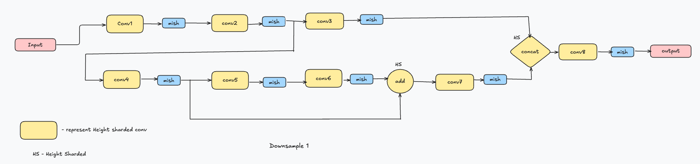

# YOLOv4 in TT-NN

**Authors**: Dalar Vartanians\
**Correspondence**: `dvartanians@tenstorrent.com`


- [New Model Bringup in TTNN](#new-model-bringup-in-ttnn)
  - [Contents](#contents)
  - [1. Overview](#1-overview)
  - [2. New model bringup flow in TTNN](#2-new-model-bringup-flow-in-ttnn)
    - [2.1 Recommended steps for model bringup](#21-recommented-steps-for-model-bringup)
    - [2.2 Create a model Card](#22-create-a-model-card)
    - [2.3 Using the reference model in Torch](#23-using-the-reference-model-in-torch)
    - [2.4 Create the torch model graph](#24-create-the-torch-model-graph)
    - [2.5 Extract the model summary](#25-extract-the-model-summary)
    - [2.6 Create issues for potential bugs or missing TTNN ops](#26-create-issues-for-potential-bugs-or-missing-ttnn-ops)
  - [3. End to end model in TTNN](#3-end-to-end-model-in-ttnn)
    - [3.1 Create TTNN unit tests per module and per op](#31-create-ttnn-unit-tests-per-module-and-per-op)
    - [3.2 Accuracy](#32-accuracy--)
    - [3.3 PCC](#32-pcc--)
    - [3.4 Quantitative evaluation](#34-quantitative-evaluation)
    - [3.5 Qualitative evaluation](#35-qualitative-evaluation)
  - [4. End to end model performance](#4-end-to-end-model-performance)
    - [4.1 Performance sheet](#41-performance-sheet)
    - [4.2 Visualizer](#42-visualizer--)
    - [4.3 More tools](#43-more-tools)
    - [4.4 Trace and 2cq](#44-trace-and-2cq)
  - [5. Conclusion](#5-conclusion)


## 1. Overview

[TTNN](https://docs.tenstorrent.com/ttnn/latest/ttnn/about.html) is a library that provides a user-friendly interface to operations that run on TensTorrent’s hardware using tt-metal programming model. ttnn is designed to be intuitive to an user that is familiar with [PyTorch](https://pytorch.org/). This report will walk you through our recommented steps to bringup deep learning models that can run efficently on Tenstorrent's hardware using the TTNN library. We will suggest a flow with code examples and diagrams to enable new users interested in bringing up their own models.

## 2. New model bringup flow in TTNN

### 2.1 Recommended steps for model bringup
  - The following diagram illustrates our recommened steps for a new model bring-up on TTNN.

  - In the following sections we will dive deeper into each step with examples.

### 2.2 Create a model Card
  - The model card may be created as a github issue or a google sheet/google doc. It is meant to proivde the high-level details of the model.


### 2.3 Using the reference model in Torch
  - If the model is publicly available, you may include a link to the reference model. Here is an example: [yolov4_reference_model](https://github.com/Tianxiaomo/pytorch-YOLOv4/blob/master/models.py)

### 2.4 Create the torch model graph
  - The next step is to generate the pytorch model graph. If you already have access to a torch reference model, you may generate it using the existing code. Otherwise, you will need to implement a torch model first as this will be used later on for comparision to the TTNN model ouputs any ways. Here is an example: [yolov4_torch_graph](https://github.com/user-attachments/files/17112021/model_pytorch_yolov4.gv.pdf)

### 2.5 Extract the model summary
  - Generate a torch model summary in order to extract the arguments and parameters of each op in the torch implementation. Here is a reference code for generating the model summary: [yolov4_model_summary_generation_script](https://github.com/tenstorrent/tt-metal/blob/main/models/demos/yolov4/reference/yolov4_summary.py)
  - Using the reference graph and model summary, document the modules and all torch ops required for the model implementation. For instance, in yolo-v4, there are 9 modules; Resblock, Downsample1 (DS1), DS2, DS3, DS4, DS5, Neck, Head and Yolov4. And, the following ops: Conv2d, Maxpool, concat, batch_norm, Mish, leakyRelu, upsample, add. The model summary will include the parameters of each op.

### 2.6 Create issues for potential bugs or missing TTNN ops
  - As you extract all torch ops using the torch graph and model summary in the previous step, you will need to create the equivalant TTNN unit tests per op in the next step. You may realize that some of the ops might not have a TTNN implementation yet. In such cases, you may file a github issue to reqest an implementation. Here is an example where convTranspose2D was not available. An issue was created and the op got implemented by Metalium team. [missing TTNN convTranspose2D github issue](https://github.com/tenstorrent/tt-metal/issues/6326)


## 3. End to end model in TTNN
  - Once, you have created a model card and extracted all required details from a torch implmentation of the model, you can use the following diagram that breaks down the steps to have a full model implmentation in TTNN:

  - In the following sections we will dive deep into each step.

## 3.1 Create TTNN unit tests per module and per op
  - It is highly recommended to start by creating TTNN unit tests per op in your model. Then move on to create pytests per module in your model. Here you can find examples of writing unit tests for the maxpool op: [unit tests for maxpool](https://github.com/tenstorrent/tt-metal/blob/main/tests/ttnn/unit_tests/operations/test_maxpool2d.py)
  - The unit tests per op will use PCC to ensure the TTNN op's output is an accurate match with that of torch.
  - It will also enable the user to try different settings and TTNN knobs available for the op and analyze the performance of the op and optimize it when possible. The optimization and range of knobs available to the user per op is a more advanced topic. However, once you develop a good command of the over all bring up process, you may refer to the [yolov4_tech_report](https://github.com/tenstorrent/tt-metal/blob/main/tech_reports/YoloV4-TTNN/yolov4.md) to learn more. The existing unit tests such as the conv2d unit tests for ResNet model [here](https://github.com/tenstorrent/tt-metal/blob/main/tests/ttnn/unit_tests/operations/test_new_conv2d.py#L706) are also a great starting point. You may explore more unit tests for different ops under [operations unit tests](https://github.com/tenstorrent/tt-metal/tree/main/tests/ttnn/unit_tests/operations).
  - Once you have unit tests for all the ops in a module of your model, for instance, all the ops in Downsample1 module of yolov4, you may proceed with the module bring up in TTNN. At this stage, all ops might be supported on TTNN and the unit tests may pass for all which would be great. However, it might happen that an op does not have a kernel implementation for TTNN yet or it might fail with the confifurations you need. In such cases, you may proceed with creating detailed git hub issues to request support for those and fall back to torch for those ops unit the support is added in TTNN.
  - Here is an example of the downsample1 module implementation of YOLO-v4 in torch: [DS1 in torch](https://github.com/tenstorrent/tt-metal/blob/main/models/demos/yolov4/reference/downsample1.py). And the TTNN implmentation of the same module is here: [DS1 in TTNN](https://github.com/tenstorrent/tt-metal/blob/main/models/demos/yolov4/ttnn/downsample1.py)
The diagram below illustrates the TT-NN sub-module of `Down1()`, which corresponds to Downsample1:


In this representation, the convolution encompasses both the convolution and Batch Norm operations, as they have been folded together.

Here is the code structure for the Downsample1 sub-module:
```python
class Down1:
    def __init__(self, model) -> None:
        if type(model) is str:
            torch_model = torch.load(model)
        else:
            torch_model = model.torch_model
        self.torch_model = torch_model
        self.conv1 = Conv(torch_model, "down1.conv1", [1, 320, 320, 3], (1, 1, 1, 1), act_block_h=128)
        self.conv2 = Conv(torch_model, "down1.conv2", [1, 320, 320, 32], (2, 2, 1, 1), reshard=True)
        self.conv3 = Conv(torch_model, "down1.conv3", [1, 160, 160, 64], (1, 1, 0, 0), deallocate=False)
        self.conv4 = Conv(torch_model, "down1.conv4", [1, 160, 160, 64], (1, 1, 0, 0))
        self.conv5 = Conv(torch_model, "down1.conv5", [1, 160, 160, 64], (1, 1, 0, 0), deallocate=False)
        self.conv6 = Conv(torch_model, "down1.conv6", [1, 160, 160, 32], (1, 1, 1, 1))
        self.conv7 = Conv(torch_model, "down1.conv7", [1, 160, 160, 64], (1, 1, 0, 0))
        self.conv8 = Conv(torch_model, "down1.conv8", [1, 160, 160, 128], (1, 1, 0, 0))
        self.convs = [self.conv1, self.conv2, self.conv3, self.conv4, self.conv5, self.conv6, self.conv7, self.conv8]

    def __call__(self, device, input_tensor):
        output_tensor = self.conv1(device, input_tensor)
        output_tensor = ttnn.mish(output_tensor)
        output_tensor_split = self.conv2(device, output_tensor)
        output_tensor_split = ttnn.mish(output_tensor_split)

        output_tensor_left = self.conv3(device, output_tensor_split)
        output_tensor_left = ttnn.mish(output_tensor_left)

        output_tensor_split_2 = self.conv4(device, output_tensor_split)
        output_tensor_split_2 = ttnn.mish(output_tensor_split_2)
        output_tensor = self.conv5(device, output_tensor_split_2)
        output_tensor = ttnn.mish(output_tensor)
        output_tensor = self.conv6(device, output_tensor)
        output_tensor = ttnn.mish(output_tensor)
        output_tensor = output_tensor_split_2 + output_tensor

        ttnn.deallocate(output_tensor_split_2)
        output_tensor = self.conv7(device, output_tensor)
        output_tensor = ttnn.mish(output_tensor)

        output_tensor = ttnn.to_layout(output_tensor, layout=ttnn.ROW_MAJOR_LAYOUT)
        output_tensor_left = ttnn.to_layout(output_tensor_left, layout=ttnn.ROW_MAJOR_LAYOUT)
        output_sharded_memory_config = ttnn.create_sharded_memory_config(
            [512, 128],
            core_grid=output_tensor_left.memory_config().shard_spec.grid,
            strategy=ttnn.ShardStrategy.HEIGHT,
            use_height_and_width_as_shard_shape=True,
        )
        output_tensor = ttnn.concat(
            [output_tensor, output_tensor_left], dim=3, memory_config=output_sharded_memory_config
        )
        ttnn.deallocate(output_tensor_left)

        output_tensor = self.conv8(device, output_tensor)
        output_tensor = ttnn.mish(output_tensor)
        return output_tensor
```

### Let’s examine how some of the aforementioned optimization techniques contributed to enhancing the performance of the Downsample1 sub-module, accompanied by graphical visualizations.

- ### Data type optimization
    In the diagram below, the left bar graph illustrates Matmul(conv with kernel 1) operations, showing the relationship between operation number, core count, and utilization percentage with the weight data type set to bfloat16. The right graph displays the same metrics but with the weight data type set to bfloat8_b. Observing the bar graph, we can see an increase in Matmul utilization when using bfloat8_b instead of bfloat16 for the convolution weight dtype parameter. The x-axis represents the operation number, the left y-axis indicates core count, and the right y-axis shows utilization percentage.

    

    The utilization percentage is calculated by - (PM ideal/device kernel duration)*(108/core count).

- ### Shard Concat instead of Interleaved concat

    Using shard concat instead of interleaved concat to increase the computation and avoid use of InterleavedToSharded API.

    Functional Code:-
    ```python
    output_tensor = ttnn.sharded_to_interleaved(output_tensor, ttnn.L1_MEMORY_CONFIG)
    output_tensor_left = ttnn.sharded_to_interleaved(output_tensor_left, ttnn.L1_MEMORY_CONFIG)
    output_tensor = ttnn.concat([output_tensor, output_tensor_left], dim=3, memory_config=ttnn.L1_MEMORY_CONFIG)
    ```

    Optimized Code:-

    ```python
    output_tensor = ttnn.to_layout(output_tensor, layout=ttnn.ROW_MAJOR_LAYOUT)
    output_tensor_left = ttnn.to_layout(output_tensor_left, layout=ttnn.ROW_MAJOR_LAYOUT)
    output_sharded_memory_config = ttnn.create_sharded_memory_config(
        [512, 128],
        core_grid=output_tensor_left.memory_config().shard_spec.grid,
        strategy=ttnn.ShardStrategy.HEIGHT,
        use_height_and_width_as_shard_shape=True,
    )
    output_tensor = ttnn.concat(
        [output_tensor, output_tensor_left], dim=3, memory_config=output_sharded_memory_config
    )
    ```

    

    From the pie charts above, we can see that the usage percentage of the I2S (Interleaved to Sharded) operation decreased from 9.5% to 0% when comparing the left and right charts. This decline is due to the absence of interleaved tensors in the pipeline, which means there are no conversions to sharded tensors occurring now. The pie charts illustrate the percentage utilization of different operations within the module.


## 3.2 Downsample2 :-
The Downsample2 sub-module includes Convolution, Batch Norm, Mish, Concat, and Addition operations.

The diagram below illustrates the TT-NN sub-module of `Down2()`, which corresponds to Downsample2:


In this representation, the convolution encompasses both the convolution and Batch Norm operations, as they have been folded together.

Here is the code structure for the Downsample2 sub-module:
```python
class Down2:
    def __init__(self, model) -> None:
        if type(model) is str:
            torch_model = torch.load(model)
        else:
            torch_model = model.torch_model
        self.torch_model = torch_model
        self.conv1 = Conv(torch_model, "down2.conv1", [1, 160, 160, 64], (2, 2, 1, 1))
        self.conv2 = Conv(torch_model, "down2.conv2", [1, 80, 80, 128], (1, 1, 0, 0), deallocate=False)
        self.conv3 = Conv(torch_model, "down2.conv3", [1, 80, 80, 128], (1, 1, 0, 0))
        self.conv4 = Conv(torch_model, "down2.conv4", [1, 80, 80, 64], (1, 1, 0, 0), deallocate=False)

        self.res1_conv1 = Conv(
            torch_model, "down2.resblock.module_list.0.0", [1, 80, 80, 64], (1, 1, 0, 0), deallocate=False
        )
        self.res1_conv2 = Conv(torch_model, "down2.resblock.module_list.0.1", [1, 80, 80, 64], (1, 1, 1, 1))
        self.res2_conv1 = Conv(
            torch_model, "down2.resblock.module_list.1.0", [1, 80, 80, 64], (1, 1, 0, 0), deallocate=False
        )
        self.res2_conv2 = Conv(torch_model, "down2.resblock.module_list.1.1", [1, 80, 80, 64], (1, 1, 1, 1))

        self.conv5 = Conv(torch_model, "down2.conv5", [1, 80, 80, 128], (1, 1, 0, 0))

    def __call__(self, device, input_tensor):
        output_tensor_split = self.conv1(device, input_tensor)
        output_tensor_split = ttnn.mish(output_tensor_split)
        output_tensor_left = self.conv2(device, output_tensor_split)
        output_tensor_left = ttnn.mish(output_tensor_left)

        res1_split = self.conv3(device, output_tensor_split)
        res1_split = ttnn.mish(res1_split)

        output_tensor = self.res1_conv1(device, res1_split)
        output_tensor = ttnn.mish(output_tensor)
        output_tensor = self.res1_conv2(device, output_tensor)
        output_tensor = ttnn.mish(output_tensor)
        res2_split = res1_split + output_tensor
        ttnn.deallocate(res1_split)

        output_tensor = self.res2_conv1(device, res2_split)
        output_tensor = ttnn.mish(output_tensor)
        output_tensor = self.res2_conv2(device, output_tensor)
        output_tensor = ttnn.mish(output_tensor)
        output_tensor = res2_split + output_tensor

        ttnn.deallocate(res2_split)

        output_tensor = self.conv4(device, output_tensor)
        output_tensor = ttnn.mish(output_tensor)

        output_tensor = ttnn.to_layout(output_tensor, layout=ttnn.ROW_MAJOR_LAYOUT)
        output_tensor_left = ttnn.to_layout(output_tensor_left, layout=ttnn.ROW_MAJOR_LAYOUT)
        output_sharded_memory_config = ttnn.create_sharded_memory_config(
            [128, 128],
            core_grid=output_tensor_left.memory_config().shard_spec.grid,
            strategy=ttnn.ShardStrategy.HEIGHT,
            use_height_and_width_as_shard_shape=True,
        )
        output_tensor = ttnn.concat(
            [output_tensor, output_tensor_left], dim=3, memory_config=output_sharded_memory_config
        )
        ttnn.deallocate(output_tensor_left)

        output_tensor = self.conv5(device, output_tensor)
        output_tensor = ttnn.mish(output_tensor)
        return output_tensor
```

### Let’s examine how some of the aforementioned optimization techniques contributed to enhancing the performance of the Downsample2 sub-module, accompanied by graphical visualizations.

- ### Data type optimization

    In the diagram below, the left bar graph illustrates Convolution operations, depicting the relationship between operation number, core count, and utilization percentage, along with another graph depicting the relationship between operation number, kernel duration, and utilization percentage, with the weight data type set to bfloat16. The right graph presents the same metrics but uses bfloat8_b as the weight data type. From the bar graph, we can observe an increase in Convolution utilization when switching from bfloat16 to bfloat8_b for the convolution weight data type. In the first graph, the x-axis represents the operation number, the left y-axis indicates core count, and the right y-axis shows utilization percentage. In the second graph, the x-axis represents the operation number, the left y-axis indicates kernel duration, and the right y-axis displays utilization percentage.

    
    From the diagram above, we can observe that the kernel duration is lower when the weight data type is set to bfloat8_b rather than bfloat16.

    The adjusted optimization is calculated using the formula:

    Adjusted Optimization = `(PM ideal/device kernel duration)*(108/core_count)`.

    From the graph above, we can observe that the maximum Device Kernel Duration (in nanoseconds) has decreased. This reduction in Device Kernel Duration has led to an increase in the Utilization percentage.

- ### Setting MathFidelity to LoFi

    The graph below shows that using math_fidelity LoFi for convolution, instead of HiFi4, has decreased the convolution operation kernel duration usage percentage from 44.7% to 39.1%.

    

## 3.3 Downsample3 :-
The Downsample3 sub-module includes Convolution, Batch Norm, Mish, Concat, and Addition operations.

The diagram below illustrates the TT-NN sub-module of `Down3()`, which corresponds to Downsample3:


In this representation, the convolution encompasses both the convolution and Batch Norm operations, as they have been folded together.

Here is the code structure for the Downsample3 sub-module:
```python
class Down3:
    def __init__(self, model) -> None:
        if type(model) is str:
            torch_model = torch.load(model)
        else:
            torch_model = model.torch_model
        self.torch_model = torch_model
        self.conv1 = Conv(
            torch_model,
            "down3.conv1",
            [1, 80, 80, 128],
            (2, 2, 1, 1),
        )
        self.conv2 = Conv(torch_model, "down3.conv2", [1, 40, 40, 256], (1, 1, 0, 0), deallocate=False)
        self.conv3 = Conv(torch_model, "down3.conv3", [1, 40, 40, 256], (1, 1, 0, 0))

        self.res1_conv1 = Conv(
            torch_model, "down3.resblock.module_list.0.0", [1, 40, 40, 128], (1, 1, 0, 0), deallocate=False
        )
        self.res1_conv2 = Conv(torch_model, "down3.resblock.module_list.0.1", [1, 40, 40, 128], (1, 1, 1, 1))
        self.res2_conv1 = Conv(
            torch_model, "down3.resblock.module_list.1.0", [1, 40, 40, 128], (1, 1, 0, 0), deallocate=False
        )
        self.res2_conv2 = Conv(torch_model, "down3.resblock.module_list.1.1", [1, 40, 40, 128], (1, 1, 1, 1))
        self.res3_conv1 = Conv(
            torch_model, "down3.resblock.module_list.2.0", [1, 40, 40, 128], (1, 1, 0, 0), deallocate=False
        )
        self.res3_conv2 = Conv(torch_model, "down3.resblock.module_list.2.1", [1, 40, 40, 128], (1, 1, 1, 1))
        self.res4_conv1 = Conv(
            torch_model, "down3.resblock.module_list.3.0", [1, 40, 40, 128], (1, 1, 0, 0), deallocate=False
        )
        self.res4_conv2 = Conv(torch_model, "down3.resblock.module_list.3.1", [1, 40, 40, 128], (1, 1, 1, 1))
        self.res5_conv1 = Conv(
            torch_model, "down3.resblock.module_list.4.0", [1, 40, 40, 128], (1, 1, 0, 0), deallocate=False
        )
        self.res5_conv2 = Conv(torch_model, "down3.resblock.module_list.4.1", [1, 40, 40, 128], (1, 1, 1, 1))
        self.res6_conv1 = Conv(
            torch_model, "down3.resblock.module_list.5.0", [1, 40, 40, 128], (1, 1, 0, 0), deallocate=False
        )
        self.res6_conv2 = Conv(torch_model, "down3.resblock.module_list.5.1", [1, 40, 40, 128], (1, 1, 1, 1))
        self.res7_conv1 = Conv(
            torch_model, "down3.resblock.module_list.6.0", [1, 40, 40, 128], (1, 1, 0, 0), deallocate=False
        )
        self.res7_conv2 = Conv(torch_model, "down3.resblock.module_list.6.1", [1, 40, 40, 128], (1, 1, 1, 1))
        self.res8_conv1 = Conv(
            torch_model, "down3.resblock.module_list.7.0", [1, 40, 40, 128], (1, 1, 0, 0), deallocate=False
        )
        self.res8_conv2 = Conv(torch_model, "down3.resblock.module_list.7.1", [1, 40, 40, 128], (1, 1, 1, 1))

        self.conv4 = Conv(torch_model, "down3.conv4", [1, 40, 40, 128], (1, 1, 0, 0), deallocate=False)

        self.conv5 = Conv(torch_model, "down3.conv5", [1, 40, 40, 256], (1, 1, 0, 0))

    def __call__(self, device, input_tensor):
        output_tensor_split = self.conv1(device, input_tensor)
        output_tensor_split = ttnn.mish(output_tensor_split)
        output_tensor_left = self.conv2(device, output_tensor_split)
        output_tensor_left = ttnn.mish(output_tensor_left)

        res1_split = self.conv3(device, output_tensor_split)
        res1_split = ttnn.mish(res1_split)

        output_tensor = self.res1_conv1(device, res1_split)
        output_tensor = ttnn.mish(output_tensor)
        output_tensor = self.res1_conv2(device, output_tensor)
        output_tensor = ttnn.mish(output_tensor)
        res2_split = res1_split + output_tensor
        ttnn.deallocate(res1_split)

        output_tensor = self.res2_conv1(device, res2_split)
        output_tensor = ttnn.mish(output_tensor)
        output_tensor = self.res2_conv2(device, output_tensor)
        output_tensor = ttnn.mish(output_tensor)
        res3_split = res2_split + output_tensor

        ttnn.deallocate(res2_split)

        output_tensor = self.res3_conv1(device, res3_split)
        output_tensor = ttnn.mish(output_tensor)
        output_tensor = self.res3_conv2(device, output_tensor)
        output_tensor = ttnn.mish(output_tensor)
        res4_split = res3_split + output_tensor

        ttnn.deallocate(res3_split)

        output_tensor = self.res4_conv1(device, res4_split)
        output_tensor = ttnn.mish(output_tensor)
        output_tensor = self.res4_conv2(device, output_tensor)
        output_tensor = ttnn.mish(output_tensor)
        res5_split = res4_split + output_tensor

        ttnn.deallocate(res4_split)

        output_tensor = self.res5_conv1(device, res5_split)
        output_tensor = ttnn.mish(output_tensor)
        output_tensor = self.res5_conv2(device, output_tensor)
        output_tensor = ttnn.mish(output_tensor)
        res6_split = res5_split + output_tensor

        ttnn.deallocate(res5_split)

        output_tensor = self.res6_conv1(device, res6_split)
        output_tensor = ttnn.mish(output_tensor)
        output_tensor = self.res6_conv2(device, output_tensor)
        output_tensor = ttnn.mish(output_tensor)
        res7_split = res6_split + output_tensor

        ttnn.deallocate(res6_split)

        output_tensor = self.res7_conv1(device, res7_split)
        output_tensor = ttnn.mish(output_tensor)
        output_tensor = self.res7_conv2(device, output_tensor)
        output_tensor = ttnn.mish(output_tensor)
        res8_split = res7_split + output_tensor

        ttnn.deallocate(res7_split)

        output_tensor = self.res8_conv1(device, res8_split)
        output_tensor = ttnn.mish(output_tensor)
        output_tensor = self.res8_conv2(device, output_tensor)
        output_tensor = ttnn.mish(output_tensor)
        output_tensor = res8_split + output_tensor

        ttnn.deallocate(res8_split)

        output_tensor = self.conv4(device, output_tensor)
        output_tensor = ttnn.mish(output_tensor)

        output_tensor = ttnn.to_layout(output_tensor, layout=ttnn.ROW_MAJOR_LAYOUT)
        output_tensor_left = ttnn.to_layout(output_tensor_left, layout=ttnn.ROW_MAJOR_LAYOUT)
        output_sharded_memory_config = ttnn.create_sharded_memory_config(
            [32, 256],
            core_grid=output_tensor_left.memory_config().shard_spec.grid,
            strategy=ttnn.ShardStrategy.HEIGHT,
            use_height_and_width_as_shard_shape=True,
        )
        output_tensor = ttnn.concat(
            [output_tensor, output_tensor_left], dim=3, memory_config=output_sharded_memory_config
        )
        ttnn.deallocate(output_tensor_left)

        output_tensor = self.conv5(device, output_tensor)
        output_tensor = ttnn.mish(output_tensor)
        return output_tensor
```

### Let’s examine how some of the aforementioned optimization techniques contributed to enhancing the performance of the Downsample3 sub-module, accompanied by graphical visualizations.

- ### Data type optimization
    We can observe that the utilization percentage of Matmul (Convolution with kernel size 1) increases when using bfloat8_b as the weight data type instead of bfloat16. Additionally, the kernel duration is reduced with the bfloat8_b weight data type.
    

    The adjusted optimization is calculated using the formula:

    Adjusted Optimization = `(PM ideal/device kernel duration)*(108/core_count)`.

    From the graph above, we can observe that the maximum Device Kernel Duration (in nanoseconds) has decreased from 16,000 ns to 10,000 ns. This reduction in Device Kernel Duration has led to an increase in the Utilization percentage.

## 3.4 Downsample4 :-
The Downsample4 sub-module includes Convolution, Batch Norm, Mish, Concat, and Addition operations.

The diagram below illustrates the TT-NN sub-module of `Down4()`, which corresponds to Downsample4:


In this representation, the convolution encompasses both the convolution and Batch Norm operations, as they have been folded together.

Here is the code structure for the Downsample4 sub-module:

```python
class Down4:
    def __init__(self, model) -> None:
        if type(model) is str:
            torch_model = torch.load(model)
        else:
            torch_model = model.torch_model
        self.torch_model = torch_model
        self.conv1 = Conv(torch_model, "down4.conv1", [1, 40, 40, 256], (2, 2, 1, 1), reshard=True)
        self.conv2 = Conv(torch_model, "down4.conv2", [1, 20, 20, 512], (1, 1, 0, 0), deallocate=False)
        self.conv3 = Conv(torch_model, "down4.conv3", [1, 20, 20, 512], (1, 1, 0, 0))

        self.res1_conv1 = Conv(
            torch_model,
            "down4.resblock.module_list.0.0",
            [1, 20, 20, 256],
            (1, 1, 0, 0),
            height_sharding=False,
            deallocate=False,
        )
        self.res1_conv2 = Conv(
            torch_model,
            "down4.resblock.module_list.0.1",
            [1, 20, 20, 256],
            (1, 1, 1, 1),
            height_sharding=False,
        )
        self.res2_conv1 = Conv(
            torch_model,
            "down4.resblock.module_list.1.0",
            [1, 20, 20, 256],
            (1, 1, 0, 0),
            deallocate=False,
            height_sharding=False,
        )
        self.res2_conv2 = Conv(
            torch_model,
            "down4.resblock.module_list.1.1",
            [1, 20, 20, 256],
            (1, 1, 1, 1),
            height_sharding=False,
        )
        self.res3_conv1 = Conv(
            torch_model,
            "down4.resblock.module_list.2.0",
            [1, 20, 20, 256],
            (1, 1, 0, 0),
            deallocate=False,
            height_sharding=False,
        )
        self.res3_conv2 = Conv(
            torch_model,
            "down4.resblock.module_list.2.1",
            [1, 20, 20, 256],
            (1, 1, 1, 1),
            height_sharding=False,
        )
        self.res4_conv1 = Conv(
            torch_model,
            "down4.resblock.module_list.3.0",
            [1, 20, 20, 256],
            (1, 1, 0, 0),
            deallocate=False,
            height_sharding=False,
        )
        self.res4_conv2 = Conv(
            torch_model,
            "down4.resblock.module_list.3.1",
            [1, 20, 20, 256],
            (1, 1, 1, 1),
            height_sharding=False,
        )
        self.res5_conv1 = Conv(
            torch_model,
            "down4.resblock.module_list.4.0",
            [1, 20, 20, 256],
            (1, 1, 0, 0),
            deallocate=False,
            height_sharding=False,
        )
        self.res5_conv2 = Conv(
            torch_model,
            "down4.resblock.module_list.4.1",
            [1, 20, 20, 256],
            (1, 1, 1, 1),
            height_sharding=False,
        )
        self.res6_conv1 = Conv(
            torch_model,
            "down4.resblock.module_list.5.0",
            [1, 20, 20, 256],
            (1, 1, 0, 0),
            deallocate=False,
            height_sharding=False,
        )
        self.res6_conv2 = Conv(
            torch_model,
            "down4.resblock.module_list.5.1",
            [1, 20, 20, 256],
            (1, 1, 1, 1),
            height_sharding=False,
        )
        self.res7_conv1 = Conv(
            torch_model,
            "down4.resblock.module_list.6.0",
            [1, 20, 20, 256],
            (1, 1, 0, 0),
            deallocate=False,
            height_sharding=False,
        )
        self.res7_conv2 = Conv(
            torch_model,
            "down4.resblock.module_list.6.1",
            [1, 20, 20, 256],
            (1, 1, 1, 1),
            height_sharding=False,
        )
        self.res8_conv1 = Conv(
            torch_model,
            "down4.resblock.module_list.7.0",
            [1, 20, 20, 256],
            (1, 1, 0, 0),
            deallocate=False,
            height_sharding=False,
        )
        self.res8_conv2 = Conv(
            torch_model,
            "down4.resblock.module_list.7.1",
            [1, 20, 20, 256],
            (1, 1, 1, 1),
            height_sharding=False,
        )

        self.conv4 = Conv(
            torch_model,
            "down4.conv4",
            [1, 20, 20, 256],
            (1, 1, 0, 0),
            deallocate=False,
            height_sharding=False,
        )

        self.conv5 = Conv(
            torch_model,
            "down4.conv5",
            [1, 20, 20, 512],
            (1, 1, 0, 0),
            height_sharding=False,
        )

    def __call__(self, device, input_tensor):
        output_tensor_split = self.conv1(device, input_tensor)
        output_tensor_split = ttnn.mish(output_tensor_split)
        output_tensor_left = self.conv2(device, output_tensor_split)
        output_tensor_left = ttnn.mish(output_tensor_left)

        res1_split = self.conv3(device, output_tensor_split)
        res1_split = ttnn.mish(res1_split)

        output_tensor = self.res1_conv1(device, res1_split)
        output_tensor = ttnn.mish(output_tensor)
        output_tensor = self.res1_conv2(device, output_tensor)
        output_tensor = ttnn.mish(output_tensor)
        res2_split = res1_split + output_tensor
        ttnn.deallocate(res1_split)

        output_tensor = self.res2_conv1(device, res2_split)
        output_tensor = ttnn.mish(output_tensor)
        output_tensor = self.res2_conv2(device, output_tensor)
        output_tensor = ttnn.mish(output_tensor)
        res3_split = res2_split + output_tensor

        ttnn.deallocate(res2_split)

        output_tensor = self.res3_conv1(device, res3_split)
        output_tensor = ttnn.mish(output_tensor)
        output_tensor = self.res3_conv2(device, output_tensor)
        output_tensor = ttnn.mish(output_tensor)
        res4_split = res3_split + output_tensor

        ttnn.deallocate(res3_split)

        output_tensor = self.res4_conv1(device, res4_split)
        output_tensor = ttnn.mish(output_tensor)
        output_tensor = self.res4_conv2(device, output_tensor)
        output_tensor = ttnn.mish(output_tensor)
        res5_split = res4_split + output_tensor

        ttnn.deallocate(res4_split)

        output_tensor = self.res5_conv1(device, res5_split)
        output_tensor = ttnn.mish(output_tensor)
        output_tensor = self.res5_conv2(device, output_tensor)
        output_tensor = ttnn.mish(output_tensor)
        res6_split = res5_split + output_tensor

        ttnn.deallocate(res5_split)

        output_tensor = self.res6_conv1(device, res6_split)
        output_tensor = ttnn.mish(output_tensor)
        output_tensor = self.res6_conv2(device, output_tensor)
        output_tensor = ttnn.mish(output_tensor)
        res7_split = res6_split + output_tensor

        ttnn.deallocate(res6_split)

        output_tensor = self.res7_conv1(device, res7_split)
        output_tensor = ttnn.mish(output_tensor)
        output_tensor = self.res7_conv2(device, output_tensor)
        output_tensor = ttnn.mish(output_tensor)
        res8_split = res7_split + output_tensor

        ttnn.deallocate(res7_split)

        output_tensor = self.res8_conv1(device, res8_split)
        output_tensor = ttnn.mish(output_tensor)
        output_tensor = self.res8_conv2(device, output_tensor)
        output_tensor = ttnn.mish(output_tensor)
        output_tensor = res8_split + output_tensor

        ttnn.deallocate(res8_split)

        output_tensor = self.conv4(device, output_tensor)
        output_tensor = ttnn.mish(output_tensor)

        output_tensor = ttnn.sharded_to_interleaved(output_tensor, ttnn.L1_MEMORY_CONFIG)
        output_tensor_left = ttnn.sharded_to_interleaved(output_tensor_left, ttnn.L1_MEMORY_CONFIG)
        output_tensor = ttnn.concat([output_tensor, output_tensor_left], dim=3, memory_config=ttnn.L1_MEMORY_CONFIG)
        ttnn.deallocate(output_tensor_left)

        output_tensor = self.conv5(device, output_tensor)
        output_tensor = ttnn.mish(output_tensor)
        return output_tensor
```

### Let’s examine how some of the aforementioned optimization techniques contributed to enhancing the performance of the Downsample4 sub-module, accompanied by graphical visualizations.

- ### Data type optimization

    In the graph comparing matmul(convolution kernel of size 1) performance, we can observe that switching weight_dtype from bfloat16 (left graph) to bfloat8_b (right graph) has resulted in increased utilization percentages and a reduction in maximum kernel duration, from 50,000 ns to 30,000 ns.
  

    In the graph illustrating convolution performance, it's evident that switching weight_dtype of convolution from bfloat16 (left graph) to bfloat8_b (right graph) has led to an increase in utilization percentage and a decrease in maximum kernel duration, from 200,000 ns to 120,000 ns.
  

- ### Using correct Shard_layout for Conv
    Previously, the convolution was height-sharded even when N * H * W ~= C, Now the right side graph shows using block_sharded layout. We can see an increase in core count, as well as a reduction in the kernel duration for matmul (convolution with kernel size 1).
  


## 3.5 Downsample5 :-
The Downsample5 sub-module includes Convolution, Batch Norm, Mish, Concat, and Addition operations.

The diagram below illustrates the TT-NN sub-module of `Down5()`, which corresponds to Downsample5:


In this representation, the convolution encompasses both the convolution and Batch Norm operations, as they have been folded together.

Here is the code structure for the Downsample5 sub-module:

```python
class Down5:
    def __init__(self, model) -> None:
        if type(model) is str:
            torch_model = torch.load(model)
        else:
            torch_model = model.torch_model
        self.torch_model = torch_model
        self.conv1 = Conv(
            torch_model, "down5.conv1", [1, 20, 20, 512], (2, 2, 1, 1), reshard=True, height_sharding=False
        )
        self.conv2 = Conv(
            torch_model, "down5.conv2", [1, 10, 10, 1024], (1, 1, 0, 0), width_sharding=True, deallocate=False
        )
        self.conv3 = Conv(torch_model, "down5.conv3", [1, 10, 10, 1024], (1, 1, 0, 0))

        self.res1_conv1 = Conv(
            torch_model,
            "down5.resblock.module_list.0.0",
            [1, 10, 10, 512],
            (1, 1, 0, 0),
            deallocate=False,
            width_sharding=True,
        )
        self.res1_conv2 = Conv(
            torch_model,
            "down5.resblock.module_list.0.1",
            [1, 10, 10, 512],
            (1, 1, 1, 1),
            width_sharding=True,
        )
        self.res2_conv1 = Conv(
            torch_model,
            "down5.resblock.module_list.1.0",
            [1, 10, 10, 512],
            (1, 1, 0, 0),
            deallocate=False,
            width_sharding=True,
        )
        self.res2_conv2 = Conv(
            torch_model,
            "down5.resblock.module_list.1.1",
            [1, 10, 10, 512],
            (1, 1, 1, 1),
            width_sharding=True,
        )
        self.res3_conv1 = Conv(
            torch_model,
            "down5.resblock.module_list.2.0",
            [1, 10, 10, 512],
            (1, 1, 0, 0),
            deallocate=False,
            width_sharding=True,
        )
        self.res3_conv2 = Conv(
            torch_model,
            "down5.resblock.module_list.2.1",
            [1, 10, 10, 512],
            (1, 1, 1, 1),
            width_sharding=True,
        )
        self.res4_conv1 = Conv(
            torch_model,
            "down5.resblock.module_list.3.0",
            [1, 10, 10, 512],
            (1, 1, 0, 0),
            deallocate=False,
            width_sharding=True,
        )
        self.res4_conv2 = Conv(
            torch_model,
            "down5.resblock.module_list.3.1",
            [1, 10, 10, 512],
            (1, 1, 1, 1),
            width_sharding=True,
        )

        self.conv4 = Conv(
            torch_model,
            "down5.conv4",
            [1, 10, 10, 512],
            (1, 1, 0, 0),
            deallocate=False,
            width_sharding=True,
        )

        self.conv5 = Conv(
            torch_model,
            "down5.conv5",
            [1, 10, 10, 1024],
            (1, 1, 0, 0),
            height_sharding=False,
        )

    def __call__(self, device, input_tensor):
        output_tensor_split = self.conv1(device, input_tensor)
        output_tensor_split = ttnn.mish(output_tensor_split)
        output_tensor_left = self.conv2(device, output_tensor_split)
        output_tensor_left = ttnn.mish(output_tensor_left)

        res1_split = self.conv3(device, output_tensor_split)
        res1_split = ttnn.mish(res1_split)

        output_tensor = self.res1_conv1(device, res1_split)
        output_tensor = ttnn.mish(output_tensor)
        output_tensor = self.res1_conv2(device, output_tensor)
        output_tensor = ttnn.mish(output_tensor)
        res2_split = res1_split + output_tensor
        ttnn.deallocate(res1_split)

        output_tensor = self.res2_conv1(device, res2_split)
        output_tensor = ttnn.mish(output_tensor)
        output_tensor = self.res2_conv2(device, output_tensor)
        output_tensor = ttnn.mish(output_tensor)
        res3_split = res2_split + output_tensor

        ttnn.deallocate(res2_split)

        output_tensor = self.res3_conv1(device, res3_split)
        output_tensor = ttnn.mish(output_tensor)
        output_tensor = self.res3_conv2(device, output_tensor)
        output_tensor = ttnn.mish(output_tensor)
        res4_split = res3_split + output_tensor

        ttnn.deallocate(res3_split)

        output_tensor = self.res4_conv1(device, res4_split)
        output_tensor = ttnn.mish(output_tensor)
        output_tensor = self.res4_conv2(device, output_tensor)
        output_tensor = ttnn.mish(output_tensor)
        output_tensor = res4_split + output_tensor

        ttnn.deallocate(res4_split)

        output_tensor = self.conv4(device, output_tensor)
        output_tensor = ttnn.mish(output_tensor)

        output_tensor = ttnn.sharded_to_interleaved(output_tensor, ttnn.L1_MEMORY_CONFIG)
        output_tensor_left = ttnn.sharded_to_interleaved(output_tensor_left, ttnn.L1_MEMORY_CONFIG)
        output_tensor = ttnn.concat([output_tensor, output_tensor_left], dim=3, memory_config=ttnn.L1_MEMORY_CONFIG)
        ttnn.deallocate(output_tensor_left)

        output_tensor = self.conv5(device, output_tensor)
        output_tensor = ttnn.mish(output_tensor)
        return output_tensor
```

### Let’s examine how some of the aforementioned optimization techniques contributed to enhancing the performance of the Downsample5 sub-module, accompanied by graphical visualizations.

- ### Data type optimization

    In below graph we can observe, Switching to bfloat8_b for the weight dtype in convolution instead of bfloat16 has resulted in increased utilization percentages and a reduction in maximum kernel duration, decreasing from 80,000 ns to 50,000 ns.
  

- ### Using correct Shard_layout for Conv

    By implementing the correct sharding layout for convolution, we observe an increase in core count for certain operations that previously used an incorrect layout. Additionally, the kernel duration for matmul (convolution with kernel size 1) has decreased.
  

## 3.6 Neck :-

The Neck sub-module includes Convolution, Batch Norm, Maxpool2d, Upsample, LeakyRelu and Concat operations.

The diagram below illustrates the TT-NN sub-module of `TtNeck()`,which corresponds to Neck:


In this representation, the convolution encompasses both the convolution and Batch Norm operations, as they have been folded together.

Here is the code structure for the Neck sub-module:

```python
class TtNeck:
    def __init__(self, model) -> None:
        if type(model) is str:
            torch_model = torch.load(model)
        else:
            torch_model = model.torch_model
        self.torch_model = torch_model
        self.conv1 = Conv(
            torch_model,
            "neek.conv1",
            [1, 10, 10, 1024],
            (1, 1, 0, 0),
            height_sharding=False,
            reshard=True,
        )
        self.conv2 = Conv(
            torch_model,
            "neek.conv2",
            [1, 10, 10, 512],
            (1, 1, 1, 1),
            width_sharding=True,
        )
        self.conv3 = Conv(
            torch_model,
            "neek.conv3",
            [1, 10, 10, 1024],
            (1, 1, 0, 0),
            reshard=True,
        )

        self.conv4 = Conv(
            torch_model,
            "neek.conv4",
            [1, 10, 10, 2048],
            (1, 1, 0, 0),
            height_sharding=False,
        )
        self.conv5 = Conv(
            torch_model,
            "neek.conv5",
            [1, 10, 10, 512],
            (1, 1, 1, 1),
            width_sharding=True,
        )
        self.conv6 = Conv(
            torch_model,
            "neek.conv6",
            [1, 10, 10, 1024],
            (1, 1, 0, 0),
            height_sharding=False,
        )
        self.conv7 = Conv(
            torch_model,
            "neek.conv7",
            [1, 10, 10, 512],
            (1, 1, 0, 0),
            width_sharding=True,
            deallocate=False,
        )
        self.conv7_2 = Conv(
            torch_model,
            "neek.conv8",
            [1, 20, 20, 512],
            (1, 1, 0, 0),
            height_sharding=False,
        )
        self.conv7_3 = Conv(
            torch_model,
            "neek.conv9",
            [1, 20, 20, 512],
            (1, 1, 0, 0),
            height_sharding=False,
        )
        self.conv8 = Conv(
            torch_model,
            "neek.conv10",
            [1, 20, 20, 256],
            (1, 1, 1, 1),
        )
        self.conv7_4 = Conv(
            torch_model,
            "neek.conv11",
            [1, 20, 20, 512],
            (1, 1, 0, 0),
            height_sharding=False,
        )
        self.conv8_2 = Conv(
            torch_model,
            "neek.conv12",
            [1, 20, 20, 256],
            (1, 1, 1, 1),
            reshard=True,
        )
        self.conv7_5 = Conv(
            torch_model,
            "neek.conv13",
            [1, 20, 20, 512],
            (1, 1, 0, 0),
            height_sharding=False,
        )

        self.conv9 = Conv(
            torch_model,
            "neek.conv14",
            [1, 20, 20, 256],
            (1, 1, 0, 0),
            deallocate=False,
        )
        self.conv9_2 = Conv(
            torch_model,
            "neek.conv15",
            [1, 40, 40, 256],
            (1, 1, 0, 0),
        )
        self.conv9_3 = Conv(
            torch_model,
            "neek.conv16",
            [1, 40, 40, 256],
            (1, 1, 0, 0),
        )
        self.conv10 = Conv(
            torch_model,
            "neek.conv17",
            [1, 40, 40, 128],
            (1, 1, 1, 1),
        )

        self.conv9_4 = Conv(
            torch_model,
            "neek.conv18",
            [1, 40, 40, 256],
            (1, 1, 0, 0),
        )
        self.conv10_2 = Conv(
            torch_model,
            "neek.conv19",
            [1, 40, 40, 128],
            (1, 1, 1, 1),
        )
        self.conv9_5 = Conv(
            torch_model,
            "neek.conv20",
            [1, 40, 40, 256],
            (1, 1, 0, 0),
        )

    def __call__(self, device, input_tensor):
        output_tensor = self.conv1(device, input_tensor[0])
        output_tensor = ttnn.leaky_relu(output_tensor, slope=0.1)

        output_tensor = self.conv2(device, output_tensor)
        output_tensor = ttnn.leaky_relu(output_tensor, slope=0.1)

        output_tensor = self.conv3(device, output_tensor)
        output_tensor = ttnn.leaky_relu(output_tensor, slope=0.1)

        pool_1 = ttnn.max_pool2d(
            input_tensor=output_tensor,
            batch_size=1,
            input_h=10,
            input_w=10,
            channels=512,
            kernel_size=[5, 5],
            stride=[1, 1],
            padding=[2, 2],
            dilation=[1, 1],
            device=device,
        )
        pool_2 = ttnn.max_pool2d(
            input_tensor=output_tensor,
            batch_size=1,
            input_h=10,
            input_w=10,
            channels=512,
            kernel_size=[9, 9],
            stride=[1, 1],
            padding=[4, 4],
            dilation=[1, 1],
            device=device,
        )
        pool_3 = ttnn.max_pool2d(
            input_tensor=output_tensor,
            batch_size=1,
            input_h=10,
            input_w=10,
            channels=512,
            kernel_size=[13, 13],
            stride=[1, 1],
            padding=[6, 6],
            dilation=[1, 1],
            device=device,
        )

        pool_1 = ttnn.sharded_to_interleaved(pool_1, ttnn.L1_MEMORY_CONFIG)
        pool_2 = ttnn.sharded_to_interleaved(pool_2, ttnn.L1_MEMORY_CONFIG)
        pool_3 = ttnn.sharded_to_interleaved(pool_3, ttnn.L1_MEMORY_CONFIG)
        pool_1 = ttnn.to_layout(pool_1, layout=ttnn.TILE_LAYOUT)  # This is becauase output_tensor is in TILE_LAYOUT
        pool_2 = ttnn.to_layout(pool_2, layout=ttnn.TILE_LAYOUT)  # This is becauase output_tensor is in TILE_LAYOUT
        pool_3 = ttnn.to_layout(pool_3, layout=ttnn.TILE_LAYOUT)  # This is becauase output_tensor is in TILE_LAYOUT
        output_tensor = ttnn.sharded_to_interleaved(output_tensor, ttnn.L1_MEMORY_CONFIG)

        output_tensor = ttnn.concat([pool_3, pool_2, pool_1, output_tensor], dim=3, memory_config=ttnn.L1_MEMORY_CONFIG)
        ttnn.deallocate(pool_3)
        ttnn.deallocate(pool_2)
        ttnn.deallocate(pool_1)

        output_tensor = self.conv4(device, output_tensor)
        output_tensor = ttnn.leaky_relu(output_tensor, slope=0.1)

        output_tensor = self.conv5(device, output_tensor)
        output_tensor = ttnn.leaky_relu(output_tensor, slope=0.1)

        output_tensor = self.conv6(device, output_tensor)
        output_tensor_left_1 = ttnn.leaky_relu(output_tensor, slope=0.1)

        output_tensor = self.conv7(device, output_tensor_left_1)
        output_tensor = ttnn.leaky_relu(output_tensor, slope=0.1)

        output_tensor = ttnn.sharded_to_interleaved(output_tensor, ttnn.L1_MEMORY_CONFIG)
        output_tensor = ttnn.to_layout(output_tensor, ttnn.ROW_MAJOR_LAYOUT)
        output_tensor_upsample_1 = ttnn.upsample(output_tensor, (1, 4, 1), memory_config=ttnn.L1_MEMORY_CONFIG)
        output_tensor_upsample_1 = ttnn.to_layout(output_tensor_upsample_1, layout=ttnn.TILE_LAYOUT)

        outDowSample5 = input_tensor[1]
        output_tensor = self.conv7_2(device, outDowSample5)
        output_tensor = ttnn.leaky_relu(output_tensor, slope=0.1)

        output_tensor = ttnn.sharded_to_interleaved(output_tensor, ttnn.L1_MEMORY_CONFIG)

        output_tensor = ttnn.concat(
            [output_tensor, output_tensor_upsample_1], dim=3, memory_config=ttnn.L1_MEMORY_CONFIG
        )
        ttnn.deallocate(output_tensor_upsample_1)

        output_tensor = self.conv7_3(device, output_tensor)
        output_tensor = ttnn.leaky_relu(output_tensor, slope=0.1)

        output_tensor = self.conv8(device, output_tensor)
        output_tensor = ttnn.leaky_relu(output_tensor, slope=0.1)

        output_tensor = self.conv7_4(device, output_tensor)
        output_tensor = ttnn.leaky_relu(output_tensor, slope=0.1)

        output_tensor = self.conv8_2(device, output_tensor)
        output_tensor = ttnn.leaky_relu(output_tensor, slope=0.1)

        output_tensor = self.conv7_5(device, output_tensor)
        output_tensor_left_2 = ttnn.leaky_relu(output_tensor, slope=0.1)

        output_tensor = self.conv9(device, output_tensor_left_2)
        output_tensor = ttnn.leaky_relu(output_tensor, slope=0.1)

        output_tensor = ttnn.sharded_to_interleaved(output_tensor, ttnn.L1_MEMORY_CONFIG)
        output_tensor = ttnn.to_layout(output_tensor, ttnn.ROW_MAJOR_LAYOUT)
        output_tensor_upsample_2 = ttnn.upsample(output_tensor, (1, 4, 1), memory_config=ttnn.L1_MEMORY_CONFIG)
        output_tensor_upsample_2 = ttnn.to_layout(output_tensor_upsample_2, ttnn.TILE_LAYOUT)

        outDowSample3 = input_tensor[2]

        output_tensor = self.conv9_2(device, outDowSample3)
        output_tensor = ttnn.leaky_relu(output_tensor, slope=0.1)

        output_tensor = ttnn.sharded_to_interleaved(output_tensor, ttnn.L1_MEMORY_CONFIG)
        output_tensor = ttnn.concat(
            [output_tensor, output_tensor_upsample_2], dim=3, memory_config=ttnn.L1_MEMORY_CONFIG
        )
        ttnn.deallocate(output_tensor_upsample_2)

        output_tensor = self.conv9_3(device, output_tensor)
        output_tensor = ttnn.leaky_relu(output_tensor, slope=0.1)

        output_tensor = self.conv10(device, output_tensor)
        output_tensor = ttnn.leaky_relu(output_tensor, slope=0.1)

        output_tensor = self.conv9_4(device, output_tensor)
        output_tensor = ttnn.leaky_relu(output_tensor, slope=0.1)

        output_tensor = self.conv10_2(device, output_tensor)
        output_tensor = ttnn.leaky_relu(output_tensor, slope=0.1)

        output_tensor = self.conv9_5(device, output_tensor)
        output_tensor = ttnn.leaky_relu(output_tensor, slope=0.1)

        return output_tensor, output_tensor_left_1, output_tensor_left_2
```

### Let’s examine how some of the aforementioned optimization techniques contributed to enhancing the performance of the Neck sub-module, accompanied by graphical visualizations.

- ### Data type optimization

    In below graph we can observe, Switching to bfloat8_b for the weight dtype in convolution instead of bfloat16 has resulted in increased utilization percentages and a reduction in maximum kernel duration, decreasing from 80,000 ns to 50,000 ns.
  

- ### Using correct Shard_layout for Conv
    By implementing the correct sharding layout for convolution, we observe an increase in core count for certain operations that previously used an incorrect layout.
  

## 3.7 Head :-

The Head sub-module includes Convolution, Batch Norm, LeakyRelu and Concat operations.

The diagram below illustrates the TT-NN sub-module of `TtHead()`,which corresponds to Head:


The convolution represents both the convolution and Batch Norm operations, as they have been folded together. However, conv2, conv10, and conv18 are not folded with Batch Norm.

Here is the code structure for the Head sub-module:

```python
class TtHead:
    def __init__(self, model) -> None:
        if type(model) is str:
            torch_model = torch.load(model)
        else:
            torch_model = model.torch_model
        self.torch_model = torch_model
        self.conv1 = Conv(torch_model, "head.conv1", [1, 40, 40, 128], (1, 1, 1, 1), reshard=True, deallocate=False)
        self.conv2 = Conv(torch_model, "head.conv2", [1, 40, 40, 256], (1, 1, 0, 0), fused_op=False)
        self.conv3 = Conv(torch_model, "head.conv3", [1, 40, 40, 128], (2, 2, 1, 1), reshard=True, deallocate=False)
        self.conv4 = Conv(
            torch_model,
            "head.conv4",
            [1, 20, 20, 512],
            (1, 1, 0, 0),
            height_sharding=False,
        )
        self.conv5 = Conv(
            torch_model,
            "head.conv5",
            [1, 20, 20, 256],
            (1, 1, 1, 1),
        )
        self.conv6 = Conv(
            torch_model,
            "head.conv6",
            [1, 20, 20, 512],
            (1, 1, 0, 0),
            height_sharding=False,
        )
        self.conv7 = Conv(
            torch_model,
            "head.conv7",
            [1, 20, 20, 256],
            (1, 1, 1, 1),
        )
        self.conv8 = Conv(
            torch_model,
            "head.conv8",
            [1, 20, 20, 512],
            (1, 1, 0, 0),
            height_sharding=False,
        )
        self.conv9 = Conv(
            torch_model,
            "head.conv9",
            [1, 20, 20, 256],
            (1, 1, 1, 1),
            deallocate=False,
        )
        self.conv10 = Conv(
            torch_model,
            "head.conv10",
            [1, 20, 20, 512],
            (1, 1, 0, 0),
            height_sharding=False,
            fused_op=False,
        )
        self.conv11 = Conv(
            torch_model,
            "head.conv11",
            [1, 20, 20, 256],
            (2, 2, 1, 1),
            reshard=True,
        )
        self.conv12 = Conv(
            torch_model,
            "head.conv12",
            [1, 10, 10, 1024],
            (1, 1, 0, 0),
            height_sharding=False,
        )
        self.conv13 = Conv(
            torch_model,
            "head.conv13",
            [1, 10, 10, 512],
            (1, 1, 1, 1),
            width_sharding=True,
        )
        self.conv14 = Conv(
            torch_model,
            "head.conv14",
            [1, 10, 10, 1024],
            (1, 1, 0, 0),
            height_sharding=False,
        )
        self.conv15 = Conv(
            torch_model,
            "head.conv15",
            [1, 10, 10, 512],
            (1, 1, 1, 1),
            width_sharding=True,
        )
        self.conv16 = Conv(
            torch_model,
            "head.conv16",
            [1, 10, 10, 1024],
            (1, 1, 0, 0),
            height_sharding=False,
        )
        self.conv17 = Conv(
            torch_model,
            "head.conv17",
            [1, 10, 10, 512],
            (1, 1, 1, 1),
            width_sharding=True,
        )
        self.conv18 = Conv(
            torch_model,
            "head.conv18",
            [1, 10, 10, 1024],
            (1, 1, 0, 0),
            fused_op=False,
            height_sharding=False,
        )

    def __call__(self, device, input_tensor):
        output_tensor = self.conv1(device, input_tensor[0])
        output_tensor = ttnn.leaky_relu(output_tensor, slope=0.1)

        output_tensor_left_1 = self.conv2(device, output_tensor)

        output_tensor = self.conv3(device, input_tensor[0])
        output_tensor = ttnn.leaky_relu(output_tensor, slope=0.1)
        outfrom_Neck1 = input_tensor[2]

        output_tensor = ttnn.sharded_to_interleaved(output_tensor, ttnn.L1_MEMORY_CONFIG)
        if (
            outfrom_Neck1.memory_config().is_sharded()
        ):  # This is used because test of head sub_module passes interleaved tensor
            outfrom_Neck1 = ttnn.sharded_to_interleaved(outfrom_Neck1, ttnn.L1_MEMORY_CONFIG)

        output_tensor = ttnn.concat([output_tensor, outfrom_Neck1], dim=3, memory_config=ttnn.L1_MEMORY_CONFIG)

        output_tensor = self.conv4(device, output_tensor)
        output_tensor = ttnn.leaky_relu(output_tensor, slope=0.1)

        output_tensor = self.conv5(device, output_tensor)
        output_tensor = ttnn.leaky_relu(output_tensor, slope=0.1)

        output_tensor = self.conv6(device, output_tensor)
        output_tensor = ttnn.leaky_relu(output_tensor, slope=0.1)

        output_tensor = self.conv7(device, output_tensor)
        output_tensor = ttnn.leaky_relu(output_tensor, slope=0.1)

        output_tensor = self.conv8(device, output_tensor)
        output_tensor_split = ttnn.leaky_relu(output_tensor, slope=0.1)

        output_tensor = self.conv9(device, output_tensor_split)
        output_tensor = ttnn.leaky_relu(output_tensor, slope=0.1)

        output_tensor_left_2 = self.conv10(device, output_tensor)

        output_tensor = self.conv11(device, output_tensor_split)
        output_tensor = ttnn.leaky_relu(output_tensor, slope=0.1)

        outfromNeck2 = input_tensor[1]
        output_tensor = ttnn.sharded_to_interleaved(output_tensor, ttnn.L1_MEMORY_CONFIG)
        if (
            outfromNeck2.memory_config().is_sharded()
        ):  # This is used because test of head sub_module passes interleaved tensor
            outfromNeck2 = ttnn.sharded_to_interleaved(outfromNeck2, ttnn.L1_MEMORY_CONFIG)
        output_tensor = ttnn.concat([output_tensor, outfromNeck2], dim=3, memory_config=ttnn.L1_MEMORY_CONFIG)

        output_tensor = self.conv12(device, output_tensor)
        output_tensor = ttnn.leaky_relu(output_tensor, slope=0.1)

        output_tensor = self.conv13(device, output_tensor)
        output_tensor = ttnn.leaky_relu(output_tensor, slope=0.1)

        output_tensor = self.conv14(device, output_tensor)
        output_tensor = ttnn.leaky_relu(output_tensor, slope=0.1)

        output_tensor = self.conv15(device, output_tensor)
        output_tensor = ttnn.leaky_relu(output_tensor, slope=0.1)

        output_tensor = self.conv16(device, output_tensor)
        output_tensor = ttnn.leaky_relu(output_tensor, slope=0.1)

        output_tensor = self.conv17(device, output_tensor)
        output_tensor = ttnn.leaky_relu(output_tensor, slope=0.1)

        output_tensor_left_3 = self.conv18(device, output_tensor)

        return output_tensor_left_1, output_tensor_left_2, output_tensor_left_3
```

### Let’s examine how some of the aforementioned optimization techniques contributed to enhancing the performance of the Head sub-module, accompanied by graphical visualizations.

- ### Data type optimization
    In below graph we can observe, Switching to bfloat8_b for the weight dtype in convolution instead of bfloat16 has resulted in increased utilization percentages and a reduction in maximum kernel duration, decreasing from 80,000 ns to 50,000 ns.

  

- ### Using correct Shard_layout for Conv
    For both matmul (convolution with kernel size 1) operations and the convolution operation, there is an increase in core count when we use the correct sharding layout for convolution.
  
  

## 4. Auto download weights
The model weights will be automatically downloaded from Google Drive. To achieve this, we have utilized the gdwon package. The weights will be loaded and saved to the specified path as per the configuration provided.

Here is the code snippet of auto download weights,

```python
#!/bin/bash

# Check if gdown is installed
if ! command -v gdown &> /dev/null; then
    echo "gdown is not installed. Installing..."
    pip install gdown
fi

# Google Drive file ID
FILE_ID="1wv_LiFeCRYwtpkqREPeI13-gPELBDwuJ"
# Output filename
OUTPUT="tests/ttnn/integration_tests/yolov4/yolov4.pth"

# Download the file
gdown "https://drive.google.com/uc?id=${FILE_ID}" -O "${OUTPUT}"
```

The if condition checks whether the gdown package is installed. If it is not, the package will be installed automatically. Next, we specify the FILE_ID of the Google Drive where the .pth file is stored. The file is then downloaded and saved to the designated test folder.

This auto-download process will be executed in the corresponding test files of the YOLOv4 model.

## 5. Conclusion

This walkthrough presents various optimization techniques used in the YOLOv4 model and its sub-modules.
# YOLOv4 in TT-NN
