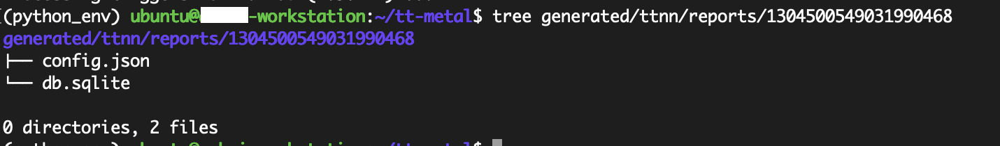

# New model bring-up in TT-NN

**Authors**: Dalar Vartanians, Ashai Reddy \
**Correspondence**: `dvartanians@tenstorrent.com`, `arginuga@tenstorrent.com`


- [New Model Bringup in TTNN](#new-model-bringup-in-ttnn)
  - [Contents](#contents)
  - [1. Overview](#1-overview)
  - [2. New model bringup flow in TTNN](#2-new-model-bringup-flow-in-ttnn)
    - [2.1 Recommended steps for model bringup](#21-recommented-steps-for-model-bringup)
    - [2.2 Create a model Card](#22-create-a-model-card)
    - [2.3 Using the reference model in Torch](#23-using-the-reference-model-in-torch)
    - [2.4 Create the torch model graph](#24-create-the-torch-model-graph)
    - [2.5 Extract the model summary](#25-extract-the-model-summary)
    - [2.6 Create issues for potential bugs or missing TTNN ops](#26-create-issues-for-potential-bugs-or-missing-ttnn-ops)
  - [3. End to end model in TTNN](#3-end-to-end-model-in-ttnn)
    - [3.1 Create TTNN unit tests per module and per op](#31-create-ttnn-unit-tests-per-module-and-per-op)
    - [3.2 PCC](#32-pcc--)
    - [3.3 Optimization](#34-optimization)
  - [4. End to end model performance](#4-end-to-end-model-performance)
    - [4.1 Performance sheet](#41-performance-sheet)
    - [4.2 Visualizer](#42-visualizer--)
    - [4.3 Trace and 2cq](#44-trace-and-2cq)
  - [5. Conclusion](#5-conclusion)


## 1. Overview

[TTNN](https://docs.tenstorrent.com/tt-metal/latest/ttnn/index.html) is a library that provides a user-friendly interface to operations that run on TensTorrent’s hardware using tt-metal programming model. ttnn is designed to be intuitive to an user that is familiar with [PyTorch](https://pytorch.org/). This report will walk you through our recommented steps to bringup deep learning models that can run efficently on Tenstorrent's hardware using the TTNN library. We will suggest a flow with code examples and diagrams to enable new users interested in bringing up their own models.

## 2. New model bringup flow in TTNN

### 2.1 Recommended steps for model bringup
  - The following diagram illustrates our recommened steps for a new model bring-up on TTNN.

  - In the following sections we will dive deeper into each step with examples.

### 2.2 Create a model Card
  - The model card may be created as a github issue or a google sheet/google doc. It is meant to proivde the high-level details of the model.


### 2.3 Using the reference model in Torch
  - If the model is publicly available, you may include a link to the reference model. Here is an example: [yolov4_reference_model](https://github.com/Tianxiaomo/pytorch-YOLOv4/blob/master/models.py)

### 2.4 Create the torch model graph
  - The next step is to generate the pytorch model graph. If you already have access to a torch reference model, you may generate it using the existing code. Otherwise, you will need to implement a torch model first as this will be used later on for comparision to the TTNN model ouputs any ways. Here is an example: [yolov4_torch_graph](https://github.com/user-attachments/files/17112021/model_pytorch_yolov4.gv.pdf)

### 2.5 Extract the model summary
  - Generate a torch model summary in order to extract the arguments and parameters of each op in the torch implementation. Here is a reference code for generating the model summary: [yolov4_model_summary_generation_script](https://github.com/tenstorrent/tt-metal/blob/main/models/demos/yolov4/reference/yolov4_summary.py)
  - Using the reference graph and model summary, document the modules and all torch ops required for the model implementation. For instance, in yolo-v4, there are 9 modules; Resblock, Downsample1 (DS1), DS2, DS3, DS4, DS5, Neck, Head and Yolov4. And, the following ops: Conv2d, Maxpool, concat, batch_norm, Mish, leakyRelu, upsample, add. The model summary will include the parameters of each op.

### 2.6 Create issues for potential bugs or missing TTNN ops
  - As you extract all torch ops using the torch graph and model summary in the previous step, you will need to create the equivalant TTNN unit tests per op in the next step. You may realize that some of the ops might not have a TTNN implementation yet. In such cases, you may file a github issue to reqest an implementation. Here is an example where convTranspose2D was not available. An issue was created and the op got implemented by Metalium team. [missing TTNN convTranspose2D github issue](https://github.com/tenstorrent/tt-metal/issues/6326)


## 3. End to end model in TTNN
  - Once, you have created a model card and extracted all required details from a torch implmentation of the model, you can use the following diagram that breaks down the steps to have a full model implmentation in TTNN:

  - In the following sections we will dive deep into each step.

## 3.1 Create TTNN unit tests per module and per op
  - It is highly recommended to start by creating TTNN unit tests per op in your model. Then move on to create pytests per module in your model. Here you can find examples of writing unit tests for the maxpool op: [unit tests for maxpool](https://github.com/tenstorrent/tt-metal/blob/main/tests/ttnn/unit_tests/operations/pool/test_maxpool2d.py)
  - The unit tests per op will use [PCC](https://en.wikipedia.org/wiki/Pearson_correlation_coefficient) to ensure the TTNN op's output is an accurate match with that of torch.
  - It will also enable the user to try different settings and TTNN knobs available for the op and analyze the performance of the op and optimize it when possible. The optimization and range of knobs available to the user per op is a more advanced topic. However, once you develop a good command of the over all bring up process, you may refer to the [yolov4_tech_report](https://github.com/tenstorrent/tt-metal/blob/main/tech_reports/YoloV4-TTNN/yolov4.md) to learn more. The existing unit tests such as the conv2d unit tests [here](https://github.com/tenstorrent/tt-metal/blob/main/tests/ttnn/unit_tests/operations/conv/test_conv2d.py) are also a great starting point. You may explore more unit tests for different ops under [operations unit tests](https://github.com/tenstorrent/tt-metal/tree/main/tests/ttnn/unit_tests/operations).
  - Once you have unit tests for all the ops in a module of your model, for instance, all the ops in Downsample1 module of yolov4, you may proceed with the module bring up in TTNN. At this stage, all ops might be supported on TTNN and the unit tests may pass for all which would be great. However, it might happen that an op does not have a kernel implementation for TTNN yet or it might fail with the confifurations you need. In such cases, you may proceed with creating detailed git hub issues to request support for those and fall back to torch for those ops unit the support is added in TTNN.
  - Here is an example of the downsample1 module implementation of YOLO-v4 in torch: [DS1 in torch](https://github.com/tenstorrent/tt-metal/blob/main/models/demos/yolov4/reference/downsample1.py). And the TTNN implmentation of the same module is here: [DS1 in TTNN](https://github.com/tenstorrent/tt-metal/blob/main/models/demos/yolov4/tt/downsample1.py)
The diagram below illustrates the corresponding Downsample1 module:


## 3.2 PCC
  - Similar to individual ops unit tests, user is highly encouraged to check per module [PCC](https://en.wikipedia.org/wiki/Pearson_correlation_coefficient) to ensure the accueacy of per module output from the TTNN implmenetation. Here is an example of it in yolov4 implementation: [PCC assertion](https://github.com/tenstorrent/tt-metal/blob/main/models/demos/yolov4/tests/pcc/test_ttnn_yolov4.py#L69).


## 3.3 Optimization
  - When writing TTNN models, there can be several levels of optimization. We can break them down into 3 stages. At the first stage, optimization can be acheived at per-op level. For instance, for a convolution op:
  - STAGE 1:
  - Based on the height, width and number of chanels, you may decide the sharding stratefy (height-sharding, width-sharding, or block-sharding). You may refer to the documentation on convolutions for more details here: [Conv sharding strategy](https://github.com/tenstorrent/tt-metal/blob/main/tech_reports/CNNs/ttcnn.md#sharding) [sharding strategy explained in yolov4-tech report](https://github.com/tenstorrent/tt-metal/blob/main/tech_reports/YoloV4-TTNN/yolov4.md#24-use-best-shardlayout-for-convolutio)
  - At the op-level, you may also optimize by selecting the optimal data type such as bfloat8_b over bfloat_16 when possible. Here is another example of it in yolo-v4 tech report: [data-type optimization](https://github.com/tenstorrent/tt-metal/blob/main/tech_reports/YoloV4-TTNN/yolov4.md#23-data-type-optimization)
  - At the op-level, another argument is the math_fidelity. Always set the math_fidelity=ttnn.MathFidelity.LoFi unless you observe noticeable drop in PCC.
  - At the module-level, there are parameters to optimize based on your module graph. For instance, for the convolution op, you should set the deallocate_activation to True if you will not be using the input tensor to the conv anywhere else on the model graph. Please refer to the example here: [Yolo-v4 architecture](https://github.com/tenstorrent/tt-metal/blob/main/tech_reports/YoloV4-TTNN/yolov4.md#3-yolov4-architecture).
  - At the module-level as well as the full-model-level, there are intial oprimizations you may consider, for instance, when the module or the full model consists of cosequtive ops, idally there should be minimal changes in sharding strategy between ops. For instance, if the model starts with width-sharding op, it would be ideal to keep the same strategy for the following op as reshards can be expensive. So it is recommended to find the best sharding strategies per op. However, once you have a module implementation, you may generate the perf sheet (this will be covered on a following section of this reort) to analyze the device run-time of the full module/full model and identify where keeping the same sharding strategy could be beneficial looking at the end to end device time versus doing reshareds between ops.

## 4.  End to end model performance
### 4.1 Performance Sheet

  - STAGE 2 of optimization:
  - at this stage, we need to utilize several tools available to us. We will start by the perf_sheet. You will need to build metal with perf-analyzer enabled fist. Then follow the instructions to generate the perf sheet per your module or full model.
  - When you build metal use:
    ```
    build_metal.sh -p
    ```
. This will enable the profiler.
  - Once build with the command above to enable profiler, and once you have a pytest for your TTNN module or full model, you may follow the example bellow from the ResNet model replacing the path to the test_perf_resnet.py with the path to your implementation:

    ```
    ./tt_metal/tools/profiler/profile_this.py -n resnet -c "pytest models/demos/resnet/tests/test_perf_resnet.py::test_perf_bare_metal[20-0.0185-25]"'
    ```
  - Once you execute such command, a .csv perf sheet will apear in your execution path. You may open the file via excel for better utilities.
  - You may refer to [TTNN profiler documentation](https://docs.tenstorrent.com/tt-metal/latest/ttnn/ttnn/profiling_ttnn_operations.html) for a more comprehensive overview of the profiler tool and the details of the generated perf sheet by it.
  - [Perf Report Headers](https://docs.tenstorrent.com/tt-metal/latest/ttnn/ttnn/profiling_ttnn_operations.html#perf-report-headers) will be particularly helpful in understanding the content of the generated perf sheet.
  - The first thing to check on the perf sheet would be to look at the device kernel duration reported in ns per op. By using excel tools, you can quickly identify the largest values in the column. Then see, which op they correspond to. Here are some examples:
  - 
  - Once you idenfify the op, it is recommended to check the number of cores used for the op among other configs/parameters. For instance for the shared snnipet, you can see how the device kernel durations are high when ops are running on low number of cores. For the examples of a convolution op, you may increase the number of cores used by adjsting the sharding strategy (height, width or block sharding). See an example here in [yolov4 tech report](https://github.com/tenstorrent/tt-metal/blob/main/tech_reports/YoloV4-TTNN/yolov4.md#24-use-best-shardlayout-for-convolution)
  - another factor to consider is per op utilization. One way to increase utilization would be to adjsut the data-type. see an example here in [yolov4 tech report](https://github.com/tenstorrent/tt-metal/blob/main/tech_reports/YoloV4-TTNN/yolov4.md#data-type-optimization)
  - The utilization percentage is calculated by - (PM ideal/device kernel duration) * (108/core_count)
  - Another approach to improve utilization is by applying sharding techniques to eliminate the need for data movement inter-tensix-cores between the consecutive OPs. you may checkout the example here in [yolov4 tech report](https://github.com/tenstorrent/tt-metal/blob/main/tech_reports/YoloV4-TTNN/yolov4.md#21-sharding-on-all-relevant-ops)


### 4.2 Visualizer

- Install ttnn-visualiser from PyPI

   ```
   python3 -m pip install ttnn_visualizer
   ```

 - To start the visualizer, run in terminal:
    ```
    ttnn-visualizer
    ```

 - Access ttnn-visualizer dashboard at 0.0.0.0:8000 (default) <br> <br>
 

 - For any issues, the repo of ttnn-visualizer is [here](https://github.com/tenstorrent/ttnn-visualizer)

 - To generate the buffers of every tensors and the tensor and graph information, please set the TTNN_CONFIG_PATH
    ```
    export TTNN_CONFIG_PATH=/home/ubuntu/METAL/vis.setup
    ```
- The config file contains runtime debug flags that generate the tensor and graph information in a database file format, that is later visualized by ttnn-visualizer

    ```
    # sample vis.setup
    {
  "enable_fast_runtime_mode": false,
  "enable_logging": true,
  "report_name": "sd35_attention_0",
  "enable_graph_report": false,
  "enable_detailed_buffer_report":true,
  "enable_detailed_tensor_report": false,
  "enable_comparison_mode": false
    }
    ```
 - To generate ops information in a csv file, run profiler (for example):
    ```
    python -m tracy -p -r -v -m pytest models/demos/yolov4/demo/demo.py
    ```


Reports Folder (sample generated database file and folder structure)             |  Performance Data Folder (Sample generated performance ops information csv and folder structure)
:-------------------------:|:-------------------------:
  |  

- Visualizations and Information provided in operations, layers and performance are provided in the video: (it contains input, output buffer information, graph and performance of those ops) <br> <br>


### 4.3 Trace and 2cq
  - You may consider a naive TTNN implementation by taking the example of [YOLO-v4 basic demo](https://github.com/tenstorrent/tt-metal/blob/774156701fe466c47d78fbdbd8265811801773f1/models/demos/yolov4/demo/demo.py). Then consider studying [the demo implementated using trace and 2 command quueues available in TTNN](https://github.com/tenstorrent/tt-metal/blob/774156701fe466c47d78fbdbd8265811801773f1/models/demos/yolov4/tests/yolov4_perfomant_webdemo.py). You may refer to this test for [trace implementation for yolov4](https://github.com/tenstorrent/tt-metal/blob/efa1a5630cfd6e84adc3ebf5fbe2d18bd5e40de8/models/demos/yolov4/tests/yolov4_perfomant_webdemo.py#L74) and to this test for the combination of [trace + 2cq implementation for yolov4](https://github.com/tenstorrent/tt-metal/blob/efa1a5630cfd6e84adc3ebf5fbe2d18bd5e40de8/models/demos/yolov4/tests/yolov4_perfomant_webdemo.py#L133)

  - As you start on implementing trace + 2cq for your model, we recommend getting your model to work with trace only first. Then get it working with 2cq only. And finally, combine the two. Also, it is the recommended flow to have seprate unit tests for each case.

  - To understand trace technique for optimization refer to [Metal Trace Documentation](https://github.com/tenstorrent/tt-metal/blob/main/tech_reports/AdvancedPerformanceOptimizationsForModels/AdvancedPerformanceOptimizationsForModels.md#1-metal-trace)

  - To understand the multiple command queues technique for optimization refer to [Multiple Command Queues Documentation](https://github.com/tenstorrent/tt-metal/blob/main/tech_reports/AdvancedPerformanceOptimizationsForModels/AdvancedPerformanceOptimizationsForModels.md#2-multiple-command-queues)

  - Finally, to understand how both of these optimization techniques can be used together refer to [Putting Trace and Multiple Command Queues Together Documentation](https://github.com/tenstorrent/tt-metal/blob/main/tech_reports/AdvancedPerformanceOptimizationsForModels/AdvancedPerformanceOptimizationsForModels.md#3-putting-trace-and-multiple-command-queues-together)

  - The following table and diagram summarize the optimization approaches and ilustrates the concepts.

  - 
  - 


## 5. Conclusion

  - This document walks you through a systematic approach to bringing up new models in TTNN library using existing implementations as examples. It aims at enabling you to ramp up quicky on an intial bring up phase and then guiding you though knobs and tools available for performace analysis and optimizations.
