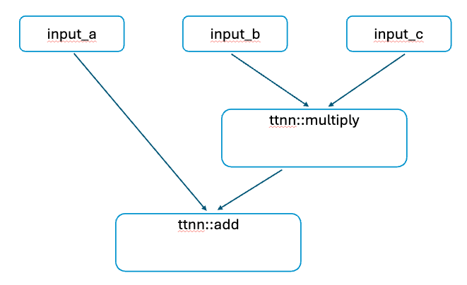
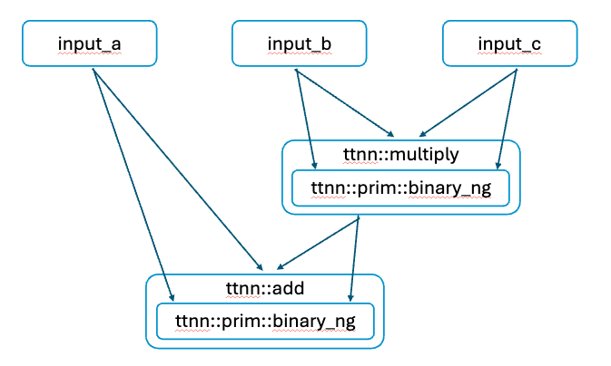

# TT-NN Graph Trace
TT-NN provides a mechanism for tracing operations and memory activities in a neural network's execution.

Using this trace it is possible to analyze the operation even without executing it on the accelerator.
The output trace can then be processed to get a single number like Peak Memory Load or to print tabular data or visualize a call graph.

## 🪄 How to Use
Wrap any number of TT-NN calls with `GraphProcessor::begin_graph_capture` and `GraphProcessor::end_graph_capture` or use with any callable.
In the example below `ttnn::zeros` is not included in a trace, but `ttnn::add` is
https://github.com/tenstorrent/tt-metal/blob/4ae4ac3c30cd24ea27cbac8cc5811c90d077e9c0/tests/ttnn/unit_tests/gtests/test_graph_add.cpp#L50-L58

You can then analyze the trace with some of the provided utility functions
https://github.com/tenstorrent/tt-metal/blob/4ae4ac3c30cd24ea27cbac8cc5811c90d077e9c0/tests/ttnn/unit_tests/gtests/test_graph_add.cpp#L64-L66
or process it manually to extract whatever data in whatever format, like this table
```
        current_op                           event  total_cb  total_buffer                                                                                                                   info
0            ttnn::add                        begin_op         0       9011200                                                                                {'inputs': '8', 'name': 'ttnn::add'}
1         ttnn::repeat                        begin_op         0       9011200                                                                             {'inputs': '2', 'name': 'ttnn::repeat'}
2         ttnn::repeat                 buffer_allocate         0      17203200                                   {'address': '753696', 'layout': 'INTERLEAVED', 'size': '8192000', 'type': 'DRAM'}
3         ttnn::repeat                 buffer_allocate         0      17209344                                  {'address': '1073735680', 'layout': 'INTERLEAVED', 'size': '6144', 'type': 'DRAM'}
4         ttnn::repeat        circular_buffer_allocate      4096      17209344    {'addr': '107360', 'core_range_set': '{[(x=0,y=0) - (x=7,y=7)]}', 'size': '4096', 'globally_allocated': 'false'}
5         ttnn::repeat               buffer_deallocate      4096      17203200                                                              {'layout': 'INTERLEAVED', 'size': '0', 'type': 'DRAM'}
6         ttnn::repeat  circular_buffer_deallocate_all         0      17203200                                                                                                                  {}
7   ttnn::prim::binary                        begin_op         0      17203200                                                                      {'inputs': '10', 'name': 'ttnn::prim::binary'}
8   ttnn::prim::binary                 buffer_allocate         0      25395200                                  {'address': '1437728', 'layout': 'INTERLEAVED', 'size': '8192000', 'type': 'DRAM'}
9   ttnn::prim::binary                 buffer_allocate         0      25409536                                 {'address': '1073735680', 'layout': 'INTERLEAVED', 'size': '14336', 'type': 'DRAM'}
10  ttnn::prim::binary        circular_buffer_allocate      4096      25409536    {'addr': '107360', 'core_range_set': '{[(x=0,y=0) - (x=7,y=7)]}', 'size': '4096', 'globally_allocated': 'false'}
11  ttnn::prim::binary        circular_buffer_allocate      8192      25409536    {'addr': '111456', 'core_range_set': '{[(x=0,y=0) - (x=7,y=7)]}', 'size': '4096', 'globally_allocated': 'false'}
12  ttnn::prim::binary        circular_buffer_allocate     12288      25409536    {'addr': '115552', 'core_range_set': '{[(x=0,y=0) - (x=7,y=7)]}', 'size': '4096', 'globally_allocated': 'false'}
13  ttnn::prim::binary               buffer_deallocate     12288      25395200                                                              {'layout': 'INTERLEAVED', 'size': '0', 'type': 'DRAM'}
14  ttnn::prim::binary  circular_buffer_deallocate_all         0      25395200                                                                                                                  {}
15           ttnn::add               buffer_deallocate         0      17203200                                                              {'layout': 'INTERLEAVED', 'size': '0', 'type': 'DRAM'}
16           ttnn::add  circular_buffer_deallocate_all         0      17203200                                                                                                                  {}
```
or a graph


## Trace Format
Trace is captured as a JSON and you can find the code producing it [here](https://github.com/tenstorrent/tt-metal/blob/main/ttnn/cpp/ttnn/graph/graph_processor.cpp).
Below you can find a detailed description of the schema.

### Node Types
The trace is represented as a directed graph, where each node corresponds to a specific operation or memory event. Below is an overview of the various types of nodes that can be present in the trace:

First, each node has these parameters

* `counter`: The unique identifier of the node within the graph.
* `node_type`: node type, available types are listed below
* `params`: the map of parameters \[mapping a string string property name to a string value\]
* `connections`: An array of connections to subsequent nodes.
* `input_tensors`: An array of incoming nodes. Useful for determining the order of args.

### Node Connections
Each node in the graph maintains a list of connections to other nodes. These connections represent the flow of data and control through the various operations and memory events during the execution of the network.

### 1\. capture\_start
Marks the beginning of the graph capture process. This node is the root of the graph and does not have any parent nodes.

#### Parameters
* Empty, as this is a marker node.

#### Connections
* First element is next operation call
* Last element is the corresponding `capture_end`

### 2\. capture\_end
Marks the end of the graph capture process.

#### Parameters
* Empty, as this is a marker node.

### 3\. function\_start
Represents the beginning of a function or operation within the graph. This node captures details about the function name and the number of input parameters it received.

#### Parameters
* `inputs`: Number of input parameters.
* `name`: The name of the function or operation.

#### Connections
* Another op call, primitive op call, or a corresponding `function_end`

#### Functions types
* TT-NN operation: for example ttnn::add, ttnn::repeat
* TT-NN primitive operation: for example ttnn::prim::binary (if it uses TMP infra) or ttnn::prim::old\_infra\_device\_operation (if not)
* TT-NN device operation: name “Device Operation” (should change in future)
* Unregistered, but manually tracked functions: (will change)
  create\_device\_tensor, Tensor::to, Tensor::cpu, Tensor::cpu\_sharded, Tensor::print, Tensor::pad, Tensor::unpad, Tensor::reshape
  tt::tt\_metal::detail::convert\_python\_tensor\_to\_tt\_tensor, tt::tt\_metal::detail::convert\_tt\_tensor\_to\_torch\_tensor

### 4\. function\_end
Marks the end of a function or operation. This node is paired with the corresponding `begin_function` node and records the outputs or final state of the function.

#### Parameters
* `name`: The name of the function or operation.

#### Connections
* Output tensor/s
* Next control flow node (potentially `capture_end` node)

### 5\. buffer
Represents the allocation of a memory buffer. This node records details about the buffer's size, type (e.g., DRAM or L1 cache), and layout.

#### Parameters
* `size`: The size of the buffer in bytes.
* `type`: The type of memory (e.g., "DRAM", "L1").
* `layout`: The memory layout (e.g., "INTERLEAVED", "SINGLE\_BANK").
* `device_id`: Id of the device.

#### Connections
* Single element in the connection list specifies the associated Tensor ID

### 6\. buffer\_allocate
Denotes the allocation of a buffer in memory. This node captures the specifics of the memory allocation event, including the buffer's address and type.

#### Parameters
* `size`: The size of the buffer in bytes.
* `address`: The memory address of the buffer.
* `type`: The type of memory (e.g., "DRAM", "L1").
* `layout`: The memory layout.
* `device_id`: Id of the device.

#### Connections
* Single element in the connections list specifies the allocated buffer ID

### 7\. buffer\_deallocate
Represents the deallocation of a buffer from memory. This node records the details of the buffer being deallocated.

#### Parameters
* `size`: The size of the buffer in bytes.
* `type`: The type of memory (e.g., "DRAM", "L1").
* `layout`: The memory layout.
* `device_id`: Id of the device.

#### Connections
* Single element in the connections list specifies the deallocated buffer ID

### 8\. circular\_buffer\_allocate
Represents the allocation of a circular buffer, typically used in handling streaming data or multi-buffering strategies. This node captures details like the core range set involved and the buffer size.

#### Parameters
* `size`: The size of the circular buffer in bytes.
* `address`: The memory address associated with the buffer.
* `core_range_set`: The range of cores involved in the circular buffer.
* `globally_allocated`: Does the circular buffer has global address set, i.e., does it share space with the corresponding operand.
* `device_id`: Id of the device.

#### Connections
Usually empty

### 9\. circular\_buffer\_deallocate\_all
Marks the deallocation of all circular buffers. This is a bulk operation and is connected to all circular buffer nodes that are being deallocated.

#### Parameters
Empty, as this operation deallocates all circular buffers.

#### Connections
Usually empty

### 10\. tensor
Represents a tensor in the graph. This node captures the tensor's shape and is connected to the memory buffer it uses, if applicable.
`[#]` means that each tensor is indexed, and instead of \# in real trace you will see an id

#### Parameters
* `tensor_id`: The identified of the tensor.
* `shape`: The shape of the tensor.

#### Connections
Usually specifies function\_start of a function where given tensor is passed as an argument/used

## Operation Dispatching
When run in `NO_DISPATCH` run mode, real allocations do not happen, so trace collection does not have side effects on the allocator state.
You can pass unrealistically big tensors in this mode and unless an operation does upper limit validation, you still can collect the trace.
In this mode trace collection is faster because ops are dispatched to the device.

When run in the `NORMAL` mode, memory can be fragmented, which can lead to a different trace and you see real addresses where everything is allocated.

## Getting operation arguments data
Another capability of the Graph, is to collect the whole set of arguments provided for each operation executed in a ttnn call. This can be done in an individual operation, or a model as a whole, providing additional information about the internals of the operations

### How to add it to python?
```
ttnn.graph.begin_graph_capture(ttnn.graph.RunMode.NORMAL)
.... # Your code here
ttnn.graph.begin_graph_capture(ttnn.graph.RunMode.NORMAL)
captured_graph = ttnn.graph.end_graph_capture()
```

### How to add it in C++?
https://github.com/tenstorrent/tt-metal/blob/a24a9be806feec4c3bf980443a35ce02e2498d0a/tests/ttnn/unit_tests/gtests/test_graph_capture_arguments_morehdot.cpp#L27-L30

### How do I get the output?

#### For C++
https://github.com/tenstorrent/tt-metal/blob/main/tests/ttnn/unit_tests/gtests/test_graph_capture_arguments_morehdot.cpp

#### For Python
https://github.com/tenstorrent/tt-metal/blob/a24a9be806feec4c3bf980443a35ce02e2498d0a/tests/ttnn/unit_tests/test_graph_capture.py#L189

### What about getting the information in Json?
Since not everybody is familiar with TT format to present the trace data, we have created a tool to convert it to json, so it can be parsed in any way of your convenience, to use it just do the following after calling

https://github.com/tenstorrent/tt-metal/blob/de8049beac0a2fe81f50a91c9f56543731fecfcb/tests/ttnn/unit_tests/test_graph_capture.py#L372-L375

Please remember to import the following function:
```
from ttnn.graph_tracer_utils import GraphTracerUtils
```

You can also check an example here: https://github.com/tenstorrent/tt-metal/blob/de8049beac0a2fe81f50a91c9f56543731fecfcb/tests/ttnn/unit_tests/test_graph_capture.py#L372-L375


### How does the expected JSon looks like?

Let's do the exercise of tracing the following demo: https://github.com/tenstorrent/tt-metal/blob/main/models/demos/bert/demo/demo.py#L64-L166

We are going to add the begin_capture before the first operation here: https://github.com/tenstorrent/tt-metal/blob/de8049beac0a2fe81f50a91c9f56543731fecfcb/models/demos/bert/demo/demo.py#L64

and closing the capture here:
https://github.com/tenstorrent/tt-metal/blob/de8049beac0a2fe81f50a91c9f56543731fecfcb/models/demos/bert/demo/demo.py#L157

Giving as a result a code like this:

```
def run_bert_question_and_answering_inference(
    device,

    model_name,
    batch_size,
    sequence_size,
    bert,
    model_location_generator,
    input_path,
):
    ttnn.graph.begin_graph_capture(ttnn.graph.RunMode.NORMAL)
    model = str(model_location_generator(model_name, model_subdir="Bert"))
    hugging_face_reference_model = BertForQuestionAnswering.from_pretrained(model, torchscript=False)
    hugging_face_reference_model.eval()

    # set up tokenizer
    tokenizer_name = str(model_location_generator(model_name, model_subdir="Bert"))
    tokenizer = BertTokenizer.from_pretrained(tokenizer_name)
    config = hugging_face_reference_model.config
    nlp = pipeline("question-answering", model=hugging_face_reference_model, tokenizer=tokenizer)

    if bert == ttnn_bert:
        tt_model_name = f"ttnn_{model_name}"
    elif bert == ttnn_optimized_bert:
        tt_model_name = f"ttnn_{model_name}_optimized"
    else:
        raise ValueError(f"Unknown bert: {bert}")

    profiler.start(f"preprocessing_parameter")
    parameters = preprocess_model_parameters(
        model_name=tt_model_name,
        initialize_model=lambda: transformers.BertForQuestionAnswering.from_pretrained(
            model_name, torchscript=False
        ).eval(),
        custom_preprocessor=bert.custom_preprocessor,
        device=device,
    )
    profiler.end(f"preprocessing_parameter")

    context, question = load_inputs(input_path, batch_size)

    preprocess_params, _, postprocess_params = nlp._sanitize_parameters()
    preprocess_params["max_seq_len"] = sequence_size
    inputs = nlp._args_parser({"context": context, "question": question})
    preprocessed_inputs = []
    for i in range(batch_size):
        model_input = next(nlp.preprocess(inputs[0][i], **preprocess_params))
        single_input = {
            "example": model_input["example"],
            "inputs": model_input,
        }
        preprocessed_inputs.append(single_input)

    bert_input = tokenizer.batch_encode_plus(
        zip(question, context),
        max_length=sequence_size,
        padding="max_length",
        truncation=True,
        return_attention_mask=True,
        return_token_type_ids=True,
        return_tensors="pt",
    )

    position_ids = positional_ids(config, bert_input.input_ids)
    profiler.start(f"preprocessing_input")
    ttnn_bert_inputs = bert.preprocess_inputs(
        bert_input["input_ids"],
        bert_input["token_type_ids"],
        position_ids,
        bert_input["attention_mask"],
        device=device,
    )
    profiler.end(f"preprocessing_input")

    profiler.start(f"inference_time")
    tt_output = bert.bert_for_question_answering(
        config,
        *ttnn_bert_inputs,
        parameters=parameters,
    )
    profiler.end(f"inference_time")

    tt_output = ttnn.to_torch(ttnn.from_device(tt_output)).reshape(batch_size, 1, sequence_size, -1).to(torch.float32)

    tt_start_logits = tt_output[..., :, 0].squeeze(1)
    tt_end_logits = tt_output[..., :, 1].squeeze(1)

    model_answers = {}
    profiler.start("post_processing_output_to_string")
    for i in range(batch_size):
        tt_res = {
            "start": tt_start_logits[i],
            "end": tt_end_logits[i],
            "example": preprocessed_inputs[i]["example"],
            **preprocessed_inputs[i]["inputs"],
        }

        tt_answer = nlp.postprocess([tt_res], **postprocess_params)

        logger.info(f"answer: {tt_answer['answer']}\n")
        model_answers[i] = tt_answer["answer"]

    profiler.end("post_processing_output_to_string")
    captured_graph = ttnn.graph.end_graph_capture()
    data = GraphTracerUtils.serialize_graph(captured_graph)
    measurements = {
        "preprocessing_parameter": profiler.get("preprocessing_parameter"),
        "preprocessing_input": profiler.get("preprocessing_input"),
        "inference_time": profiler.get("inference_time"),
        "post_processing": profiler.get("post_processing_output_to_string"),
    }
    logger.info(f"preprocessing_parameter: {measurements['preprocessing_parameter']} s")
    logger.info(f"preprocessing_input: {measurements['preprocessing_input']} s")
    logger.info(f"inference_time: {measurements['inference_time']} s")
    logger.info(f"post_processing : {measurements['post_processing']} s")
```

The output of this should like like this:
https://gist.github.com/dgomezTT/ad5af9cf42f245a9a220458f431919c4

Please note that we have over 300.000 lines in the json file, so we just included a few in the gist.

### How to trace a hanging operation?
Sometimes there might be cases where an operation hangs and the arguments can be quite handy to troubleshoot the issue or even adding extra coverage.
We have added the following configuration

```
export TT_METAL_OPERATION_TIMEOUT_SECONDS=30
```

This environment variable will enable a timeout mechanism for operations, the value is the amount of seconds we will wait for the operation to finish.


Here is an example of how to use all this:
```
def test_graph_capture_with_hang_device_operation(device):
    # Create input tensor
    tt_input = ttnn.empty(
        shape=(1, 1, 2048, 512),
        dtype=ttnn.DataType.BFLOAT16,
        layout=ttnn.TILE_LAYOUT,
        device=device,
        memory_config=ttnn.L1_MEMORY_CONFIG,
    )

    ttnn.graph.begin_graph_capture(ttnn.graph.RunMode.NORMAL)

    try:
        ttnn.test_hang_device_operation(tt_input)
        # this allows the device to throw the exception inside the try block
        ttnn._ttnn.device.synchronize_device(device)
    except Exception as e:
        print("Exception captured")
        captured_graph = ttnn.graph.end_graph_capture()
        print(captured_graph)
        assert "TIMEOUT" in str(e)
```


In this case, we are using a ttnn.test.test_hang_operation, which is a test operation that runs a while(true) loop.
The idea behind it is to simulate an unresponsive operation, so we can test the graph capture and the arguments that generated the hang.
Please never use this operation in production code, it is only for testing purposes.

### What is next for this tool?
- Supporting more operations
- Bringing more tooling to the output


## Python
Tracing is available through Python too
https://github.com/tenstorrent/tt-metal/blob/4ae4ac3c30cd24ea27cbac8cc5811c90d077e9c0/tests/ttnn/unit_tests/test_graph_capture.py#L21-L25

Here is a sample code to print a table from the beginning of this document

```py
def process_allocations(graph):
   df = pd.DataFrame(columns=['current_op', 'event', 'total_cb', 'total_buffer', 'info'])

   cur_op = []
   total_cb = 0
   total_buffer = 0
   tensors = set()
   i = 1 # lets skip initial node
   while i < len(graph):
       params = ''
       v = graph[i]
       params = v.params
       print(v, len(df))
       i += 1
       if v.node_type == 'function_start':
           if len(cur_op) == 0:
               #entring first op, lets get all input tensors
               while i < len(graph):
                   print(graph[i], len(df))
                   if graph[i].node_type == 'buffer':
                       total_buffer += int(graph[i].params['size'])
                       i += 1
                   elif graph[i].node_type == 'tensor':
                       i += 1
                   else:
                       break
          name = v.params['name']
          cur_op.append(name)
       if v.node_type == 'circular_buffer_allocate':
           total_cb += int(v.params['size'])
       if v.node_type == 'circular_buffer_deallocate_all':
           total_cb = 0
       if v.node_type == 'buffer_allocate':
           total_buffer += int(v.params['size'])
       if v.node_type == 'function_end':
           cur_op.pop()
           #continue
       if v.node_type == 'tensor':
           continue
       if v.node_type == 'buffer_deallocate':
           total_buffer -= int(graph[v.connections[0]].params['size'])
       if v.node_type == 'buffer':
           continue
       if len(cur_op) > 0:
           data =  {'current_op': cur_op[-1], 'event' : v.node_type, 'total_cb': total_cb, 'total_buffer': total_buffer, 'info' : params}
           df.loc[len(df)] = data
   return df
```

## Sample Trace

This is a sample trace of running `ttnn::add(Shape\[1, 1, 32, 32\], Shape\[4, 1, 32, 32\])`.
This setup requires to broadcast the first tensor, so trace contains a call to ttnn::repeat.
High level call stack here is:

```
ttnn::add
ttnn::repeat
ttnn::prim::repeat (calling ttnn primitive operation)
Device Operation (dispatching device operation)
create_device_tensor (creates intermediate output for ttnn::repeat)
ttnn::prim::binary (calling ttnn primitive operation)
Device Operation (dispatching device operation)
create_device_tensor (creates final output)
```

And you can see when each Buffer and CB is allocated / deallocated.

### PrettyPrint

```
Capture Start
Begin: tt::tt_metal::detail::convert_python_tensor_to_tt_tensor
End:   tt::tt_metal::detail::convert_python_tensor_to_tt_tensor
Add Tensor: 0
Begin: ttnn::to_layout
    Begin: Tensor::reshape
    End:   Tensor::reshape
    Add Tensor: 1
    Begin: Tensor::pad
    End:   Tensor::pad
    Add Tensor: 2
    Begin: Tensor::to
    End:   Tensor::to
    Add Tensor: 3
End:   ttnn::to_layout
Begin: Tensor::to
    Add Device Buffer
    Allocate Device Buffer
End:   Tensor::to
Add Tensor: 4
Begin: ttnn::add
    Begin: Tensor::to
        Add Tensor: -1
        Add Device Buffer
        Allocate Device Buffer
    End:   Tensor::to
    Add Tensor: 5
    Begin: ttnn::prim::binary
        Begin: BinaryDeviceOperation
            Begin: tt::tt_metal::create_device_tensor
                Add Device Buffer
                Allocate Device Buffer
            End:   tt::tt_metal::create_device_tensor
            Add Tensor: 6
            Add Tensor: 6
            Add Device Buffer
            Allocate Device Buffer
            Allocate Device Buffer
            Allocate Device Buffer
            Allocate Device Buffer
            Deallocate Device Buffer
        End:   BinaryDeviceOperation
        Add Tensor: 7
    End:   ttnn::prim::binary
    Deallocate Device Buffer
End:   ttnn::add
Begin: Tensor::cpu
End:   Tensor::cpu
Add Tensor: 8
Begin: Tensor::to
End:   Tensor::to
Add Tensor: 9
Begin: tt::tt_metal::detail::convert_tt_tensor_to_torch_tensor
End:   tt::tt_metal::detail::convert_tt_tensor_to_torch_tensor
Deallocate Device Buffer
Deallocate Device Buffer
```

### Visualizer


## Raw JSON
```
[
    {
        "connections": [
            1,
            32
        ],
        "counter": 0,
        "node_type": "capture_start",
        "params": {}
    },
    {
        "connections": [
            3,
            5,
            6,
            18,
            30,
            31
        ],
        "counter": 1,
        "node_type": "function_start",
        "params": {
            "inputs": "2",
            "name": "ttnn::add"
        }
    },
    {
        "connections": [
            1,
            18
        ],
        "counter": 2,
        "node_type": "tensor",
        "params": {
            "shape": "ttnn.Shape([4, 3, 32, 32])"
        }
    },
    {
        "connections": [
            2,
            2
        ],
        "counter": 3,
        "name": "buffer",
        "params": {
            "layout": "INTERLEAVED",
            "size": "24576",
            "type": "L1"
        }
    },
    {
        "connections": [
            1,
            6
        ],
        "counter": 4,
        "name": "tensor[1]",
        "params": {
            "shape": "ttnn.Shape([1, 3, 32, 32])"
        }
    },
    {
        "connections": [
            4,
            4
        ],
        "counter": 5,
        "name": "buffer",
        "params": {
            "layout": "INTERLEAVED",
            "size": "6144",
            "type": "L1"
        }
    },
    {
        "connections": [
            7,
            17
        ],
        "counter": 6,
        "name": "function_start",
        "params": {
            "inputs": "2",
            "name": "ttnn::repeat"
        }
    },
    {
        "connections": [
            8,
            16
        ],
        "counter": 7,
        "name": "function_start",
        "params": {
            "inputs": "5",
            "name": "ttnn::prim::repeat"
        }
    },
    {
        "connections": [
            9,
            14,
            15
        ],
        "counter": 8,
        "name": "function_start",
        "params": {
            "inputs": "2",
            "name": "Device Operation"
        }
    },
    {
        "connections": [
            10,
            11,
            12
        ],
        "counter": 9,
        "name": "function_start",
        "params": {
            "inputs": "5",
            "name": "create_device_tensor"
        }
    },
    {
        "connections": [
            13,
            13,
            13,
            13,
            13
        ],
        "counter": 10,
        "name": "buffer",
        "params": {
            "layout": "INTERLEAVED",
            "size": "24576",
            "type": "L1"
        }
    },
    {
        "connections": [
            10
        ],
        "counter": 11,
        "name": "buffer_allocate",
        "params": {
            "address": "1953396066",
            "layout": "INTERLEAVED",
            "size": "24576",
            "type": "L1"
        }
    },
    {
        "connections": [
            13
        ],
        "counter": 12,
        "name": "function_end",
        "params": {
            "name": "create_device_tensor"
        }
    },
    {
        "connections": [
            18
        ],
        "counter": 13,
        "name": "tensor[2]",
        "params": {
            "shape": "ttnn.Shape([4, 3, 32, 32])"
        }
    },
    {
        "connections": [],
        "counter": 14,
        "name": "circular_buffer_allocate",
        "params": {
            "address": "0",
            "core_range_set": "{[(x=0,y=0) - (x=0,y=7)], [(x=1,y=0) - (x=1,y=3)]}",
            "size": "4096",
            "globally_allocated": "false"
        }
    },
    {
        "connections": [
            13
        ],
        "counter": 15,
        "name": "function_end",
        "params": {
            "name": "Device Operation"
        }
    },
    {
        "connections": [
            13
        ],
        "counter": 16,
        "name": "function_end",
        "params": {
            "name": "ttnn::prim::repeat"
        }
    },
    {
        "connections": [
            13,
            18
        ],
        "counter": 17,
        "name": "function_end",
        "params": {
            "name": "ttnn::repeat"
        }
    },
    {
        "connections": [
            19,
            29
        ],
        "counter": 18,
        "name": "function_start",
        "params": {
            "inputs": "10",
            "name": "ttnn::prim::binary"
        }
    },
    {
        "connections": [
            20,
            25,
            26,
            27,
            28
        ],
        "counter": 19,
        "name": "function_start",
        "params": {
            "inputs": "2",
            "name": "Device Operation"
        }
    },
    {
        "connections": [
            21,
            22,
            23
        ],
        "counter": 20,
        "name": "function_start",
        "params": {
            "inputs": "5",
            "name": "create_device_tensor"
        }
    },
    {
        "connections": [
            24,
            24,
            24,
            24
        ],
        "counter": 21,
        "name": "buffer",
        "params": {
            "layout": "INTERLEAVED",
            "size": "24576",
            "type": "L1"
        }
    },
    {
        "connections": [
            21
        ],
        "counter": 22,
        "name": "buffer_allocate",
        "params": {
            "address": "0",
            "layout": "INTERLEAVED",
            "size": "24576",
            "type": "L1"
        }
    },
    {
        "connections": [
            24
        ],
        "counter": 23,
        "name": "function_end",
        "params": {
            "name": "create_device_tensor"
        }
    },
    {
        "connections": [],
        "counter": 24,
        "name": "tensor[3]",
        "params": {
            "shape": "ttnn.Shape([4, 3, 32, 32])"
        }
    },
    {
        "connections": [],
        "counter": 25,
        "name": "circular_buffer_allocate",
        "params": {
            "address": "0",
            "core_range_set": "{[(x=0,y=0) - (x=7,y=7)]}",
            "size": "4096",
            "globally_allocated": "false"
        }
    },
    {
        "connections": [],
        "counter": 26,
        "name": "circular_buffer_allocate",
        "params": {
            "address": "0",
            "core_range_set": "{[(x=0,y=0) - (x=7,y=7)]}",
            "size": "4096",
            "globally_allocated": "false"
        }
    },
    {
        "connections": [],
        "counter": 27,
        "name": "circular_buffer_allocate",
        "params": {
            "address": "0",
            "core_range_set": "{[(x=0,y=0) - (x=7,y=7)]}",
            "size": "4096",
            "globally_allocated": "false"
        }
    },
    {
        "connections": [
            24
        ],
        "counter": 28,
        "name": "function_end",
        "params": {
            "name": "Device Operation"
        }
    },
    {
        "connections": [
            24
        ],
        "counter": 29,
        "name": "function_end",
        "params": {
            "name": "ttnn::prim::binary"
        }
    },
    {
        "connections": [
            10
        ],
        "counter": 30,
        "name": "buffer_deallocate",
        "params": {
            "layout": "INTERLEAVED",
            "size": "0",
            "type": "L1"
        }
    },
    {
        "connections": [
            24,
            33
        ],
        "counter": 31,
        "name": "function_end",
        "params": {
            "name": "ttnn::add"
        }
    },
    {
        "connections": [
            21
        ],
        "counter": 32,
        "name": "buffer_deallocate",
        "params": {
            "layout": "INTERLEAVED",
            "size": "0",
            "type": "L1"
        }
    },
    {
        "connections": [],
        "counter": 33,
        "name": "capture_end",
        "params": {}
    }
]
```

## Levelized Graph

While the standard graph trace provides comprehensive information about operations, memory allocations, and execution flow, it can be overwhelming when you only need a simplified view focused on operation-level data flow. The `LevelizedGraph` provides a hierarchical, simplified representation of the graph trace that is particularly useful for generating IR from `ttnn` call traces.

### What is LevelizedGraph?

A `LevelizedGraph` is a simplified, hierarchical representation of traced operations extracted from a graph trace. Unlike the full graph trace which includes all node types (buffer allocations, circular buffers, etc.), a `LevelizedGraph` focuses on operation nodes (`function_start` nodes) and input tensor nodes (tensor nodes at stacking_level 1), organizing them hierarchically based on their stacking level.

#### Key Differences from Standard Graph Trace

1. **Simplified Node Set**: Stores `function_start` nodes (operations) at or below the specified max_level, and tensor nodes at stacking_level 1 (input tensors). Other node types like `buffer`, `buffer_allocate`, `circular_buffer_allocate`, intermediate tensor nodes, etc. are not stored directly, though their information is used to populate vertex metadata.

2. **Bidirectional Edges**: Each vertex stores both `in_edges` (incoming) and `out_edges` (outgoing), representing data flow between operations. This enables constant-time lookup of input tensors for any operation.

3. **Hierarchical Structure**: Vertices are organized by `stacking_level`, which represents the depth of nesting. For example, `ttnn::add` at level 1 may have `ttnn::prim::binary_ng` as an internal operation at level 2.

4. **Internals Tracking**: Each vertex stores its `internals` - a list of vertex IDs representing operations that are called within it at the next stacking level. For instance, a `ttnn::multiply` vertex will have `ttnn::prim::binary_ng` in its `internals` list when extracted with `max_level >= 2`.

5. **Output Information**: Each vertex stores `output_shape` (the shape of tensors produced) and `output_info` (layout and memory configuration information) when available.

6. **Data Flow Focus**: Edges represent pure data flow between nodes. This includes edges from tensor vertices to operations (for input tensors) and edges from operations to operations (for intermediate results), not parent-child relationships or memory management events.

### Vertex Structure

Each vertex in a `LevelizedGraph` contains:

* `counter` (or `id`): Unique identifier within the levelized graph
* `stacking_level`: The depth level of this vertex (1 = top-level, 2 = nested, etc.). Tensor vertices are always at level 1.
* `name`: The operation name (e.g., `"ttnn::add"`, `"ttnn::prim::binary_ng"`) or tensor identifier (e.g., `"tensor[3]"`)
* `arguments`: Array of serialized arguments passed to the operation (empty for tensor vertices)
* `in_edges`: Array of vertex IDs representing vertices that produce inputs to this vertex. Empty for input tensor vertices (tensors created outside the capture).
* `out_edges`: Array of vertex IDs representing vertices that consume outputs from this vertex
* `internals`: Array of vertex IDs representing operations called within this operation (at `stacking_level + 1`). Always empty for tensor vertices.
* `output_info`: Array of strings containing layout and memory configuration information (when available).
* `output_shape`: Array of strings representing the shapes. For operations, these are output shapes; for tensors, this is the tensor's shape.

### Tensor Vertices

Input tensors (tensors created outside the graph capture) are now explicitly represented as vertices in the levelized graph. These tensor vertices have the following characteristics:

* **Name**: Format is `"tensor[<tensor_id>]"` where `tensor_id` is from the original trace
* **Stacking Level**: Always 1
* **In Edges**: Always empty (no producers within the captured graph)
* **Out Edges**: Contains IDs of operations that consume this tensor
* **Internals**: Always empty (tensors don't have internal operations)
* **Arguments**: Always empty
* **Output Shape**: Contains the shape of the tensor
* **Output Info**: Contains the memory layout and sharding specs of the tensor

**Identifying Tensor Vertices**: You can identify tensor vertices by checking if the name contains "tensor" or by checking if `in_edges` is empty at stacking_level 1.

**Use Case Example**: When generating IR from a levelized graph, tensor vertices represent the function parameters or inputs to your computation graph.

### How to Use

#### In C++

```cpp
#include "ttnn/graph/graph_processor.hpp"
#include "ttnn/graph/levelized_graph.hpp"

// Capture a graph trace first
auto capture = ttnn::graph::ScopedGraphCapture(IGraphProcessor::RunMode::NO_DISPATCH);
// ... your ttnn operations ...
auto trace = capture.end_graph_capture();

// Extract levelized graph with max_level = 1 (default)
ttnn::graph::LevelizedGraph levelized_graph(trace, 1);

// Or extract as JSON directly
auto levelized_json = ttnn::graph::extract_levelized_graph(trace, 1);

// Access vertices
for (const auto& vertex : levelized_graph.vertices()) {
    std::cout << "Operation: " << vertex.name
              << ", Level: " << vertex.stacking_level
              << ", Inputs: " << vertex.in_edges.size()
              << ", Outputs: " << vertex.out_edges.size() << std::endl;
}
```

#### In Python

```python
import ttnn

# Begin graph capture
ttnn.graph.begin_graph_capture(ttnn.graph.RunMode.NO_DISPATCH)
# ... your ttnn operations ...
captured_graph = ttnn.graph.end_graph_capture()

# Extract levelized graph with default max_level = 1
levelized_graph = ttnn.graph.extract_levelized_graph(captured_graph)

# Or with explicit max_level
levelized_graph_level_2 = ttnn.graph.extract_levelized_graph(captured_graph, max_level=2)

# The result is a list of dictionaries, each representing a vertex
for vertex in levelized_graph:
    print(f"Vertex: {vertex['name']}, Level: {vertex['stacking_level']}")
    print(f"  Inputs: {vertex['in_edges']}")
    print(f"  Outputs: {vertex['out_edges']}")
    print(f"  Internals: {vertex['internals']}")

    # Check if this is a tensor vertex (input tensor)
    if 'tensor[' in vertex['name'] and not vertex['in_edges']:
        print(f"  -> This is an input tensor with shape: {vertex['output_shape']}")
```

### Example: Multiply-Add Operation

Consider the following operation sequence where input tensors are created **outside** the capture (simulating runtime inputs):

```cpp
// Create input tensors outside the capture
const auto input_a = ttnn::TensorSpec(ttnn::Shape(tt::tt_metal::Array2D{32, 64}), ...);
const auto input_tensor_a = tt::tt_metal::create_device_tensor(input_a, device);
const auto input_b = ttnn::TensorSpec(ttnn::Shape(tt::tt_metal::Array2D{32, 64}), ...);
const auto input_tensor_b = tt::tt_metal::create_device_tensor(input_b, device);
const auto input_c = ttnn::TensorSpec(ttnn::Shape(tt::tt_metal::Array2D{32, 64}), ...);
const auto input_tensor_c = tt::tt_metal::create_device_tensor(input_c, device);

// Capture the operations
auto capture = ttnn::graph::ScopedGraphCapture(IGraphProcessor::RunMode::NO_DISPATCH);
const auto output_tensor = ttnn::multiply(input_tensor_b, input_tensor_c, std::nullopt, std::nullopt);
const auto output_tensor_1 = ttnn::add(input_tensor_a, output_tensor, std::nullopt, std::nullopt);
auto trace = capture.end_graph_capture();
```

#### Levelized Graph with max_level = 1

With `max_level = 1`, the levelized graph shows top-level operations and input tensors (tensors at stacking_level 1):

```json
[
    {
        "counter": 0,
        "stacking_level": 1,
        "name": "tensor[129]",
        "arguments": [],
        "in_edges": [],
        "out_edges": [4],
        "internals": [],
        "output_info": ["Tensor(...)"],
        "output_shape": ["Shape([32, 64])"]
    },
    {
        "counter": 1,
        "stacking_level": 1,
        "name": "tensor[130]",
        "arguments": [],
        "in_edges": [],
        "out_edges": [3],
        "internals": [],
        "output_info": ["Tensor(...)"],
        "output_shape": ["Shape([32, 64])"]
    },
    {
        "counter": 2,
        "stacking_level": 1,
        "name": "tensor[128]",
        "arguments": [],
        "in_edges": [],
        "out_edges": [3],
        "internals": [],
        "output_info": ["Tensor(...)"],
        "output_shape": ["Shape([32, 64])"]
    },
    {
        "counter": 3,
        "stacking_level": 1,
        "name": "ttnn::multiply",
        "arguments": ["Tensor(...)", "Tensor(...)", ...],
        "in_edges": [1, 2],
        "out_edges": [4],
        "internals": [],
        "output_info": ["Tensor(...)"],
        "output_shape": ["Shape([32, 64])"]
    },
    {
        "counter": 4,
        "stacking_level": 1,
        "name": "ttnn::add",
        "arguments": ["Tensor(...)", "Tensor(...)", ...],
        "in_edges": [0, 3],
        "out_edges": [],
        "internals": [],
        "output_info": [],
        "output_shape": ["Shape([32, 64])"]
    }
]
```

At level 1, you see:
- Three input tensor vertices (`tensor[128]`, `tensor[129]`, `tensor[130]`) representing tensors created outside the capture
- One `ttnn::multiply` operation consuming inputs from tensor vertices 1 and 2
- One `ttnn::add` operation consuming inputs from tensor vertex 0 and the multiply operation (vertex 3)

The `internals` arrays are empty because nested operations are not included at this level. Note that tensor vertices have empty `in_edges` (no producers within the captured graph) and their names include the tensor_id from the trace.

You can think of this graph at level 1 like this (showing tensor nodes as inputs):



Note: The diagram shows the conceptual flow. In the actual implementation, tensor vertices are explicitly included with names like `tensor[128]`, `tensor[129]`, etc.

#### Levelized Graph with max_level = 2

With `max_level = 2`, the levelized graph expands to show internal operations:

```json
[
    {
        "counter": 0,
        "stacking_level": 1,
        "name": "tensor[129]",
        "arguments": [],
        "in_edges": [],
        "out_edges": [5, 6],
        "internals": [],
        "output_info": ["Tensor(...)"],
        "output_shape": ["Shape([32, 64])"]
    },
    {
        "counter": 1,
        "stacking_level": 1,
        "name": "tensor[130]",
        "arguments": [],
        "in_edges": [],
        "out_edges": [3, 4],
        "internals": [],
        "output_info": ["Tensor(...)"],
        "output_shape": ["Shape([32, 64])"]
    },
    {
        "counter": 2,
        "stacking_level": 1,
        "name": "tensor[128]",
        "arguments": [],
        "in_edges": [],
        "out_edges": [3, 4],
        "internals": [],
        "output_info": ["Tensor(...)"],
        "output_shape": ["Shape([32, 64])"]
    },
    {
        "counter": 3,
        "stacking_level": 1,
        "name": "ttnn::multiply",
        "arguments": ["Tensor(...)", "Tensor(...)", ...],
        "in_edges": [1, 2],
        "out_edges": [5, 6],
        "internals": [4],
        "output_info": ["Tensor(...)"],
        "output_shape": ["Shape([32, 64])"]
    },
    {
        "counter": 4,
        "stacking_level": 2,
        "name": "ttnn::prim::binary_ng",
        "arguments": ["Tensor(...)", "Tensor(...)", "BinaryOpType::MUL", ...],
        "in_edges": [1, 2],
        "out_edges": [],
        "internals": [],
        "output_info": [],
        "output_shape": ["Shape([32, 64])"]
    },
    {
        "counter": 5,
        "stacking_level": 1,
        "name": "ttnn::add",
        "arguments": ["Tensor(...)", "Tensor(...)", ...],
        "in_edges": [0, 3],
        "out_edges": [],
        "internals": [6],
        "output_info": [],
        "output_shape": ["Shape([32, 64])"]
    },
    {
        "counter": 6,
        "stacking_level": 2,
        "name": "ttnn::prim::binary_ng",
        "arguments": ["Tensor(...)", "Tensor(...)", "BinaryOpType::ADD", ...],
        "in_edges": [0, 3],
        "out_edges": [],
        "internals": [],
        "output_info": [],
        "output_shape": ["Shape([32, 64])"]
    }
]
```

At level 2, you can see:
- Three input tensor vertices (0, 1, 2) at stacking_level 1 representing tensors created outside the capture
- Vertex 3 (`ttnn::multiply`) now has `internals: [4]`, indicating it internally calls `ttnn::prim::binary_ng` (vertex 4)
- Vertex 5 (`ttnn::add`) has `internals: [6]`, indicating it internally calls `ttnn::prim::binary_ng` (vertex 6)
- Vertices 4 and 6 are at `stacking_level: 2`, showing they are nested operations
- The `out_edges` of tensor vertex 0 now include both 5 and 6, showing it feeds both the top-level `add` and its internal `binary_ng`
- Tensor vertices 1 and 2 feed both the top-level `multiply` (vertex 3) and its internal `binary_ng` (vertex 4)

You can think of this graph at level 2 like this:



### Use Cases

The `LevelizedGraph` is particularly useful for:

1. **IR Generation**: When building an IR from `ttnn` traces, you can traverse the levelized graph and decide whether to visit a vertex directly or expand its internals based on your needs. Input tensors are explicitly represented as vertices, making it easier to identify and handle function parameters.

2. **Dynamic Op Decomposition**: By varying `max_level`, you can dynamically decompose composite operations (like `cosh` or `digamma`) to different depths.

3. **Shape Inference**: The `output_shape` field provides immediate access to output shapes for both operations and input tensors, which is essential for operations like `ttnn::sum` that may have different input and output shapes.

4. **Layout Information**: The `output_info` field captures layout and memory configuration details when available, which is crucial for understanding tensor properties.

5. **Fork/Join Analysis**: The bidirectional edge structure makes it easy to identify cases where a tensor is used by multiple operations (forks) or where multiple tensors feed into one operation (joins). Input tensors are explicitly represented, making fork analysis straightforward.

6. **Input Tensor Tracking**: Input tensors (created outside the capture) are now explicit vertices in the graph with empty `in_edges`, making it easy to distinguish them from intermediate tensors and identify the inputs to a captured operation sequence.

### Limitations

1. **Output Info Availability**: Complete `output_info` for operations without a consumer cannot be inferred from the graph trace. As a result, the return type and layout information of the top-level function may not always be available. Tensor vertices also have empty `output_info` since they don't produce outputs in the traditional sense.

We're working to fix these limitations soon.
